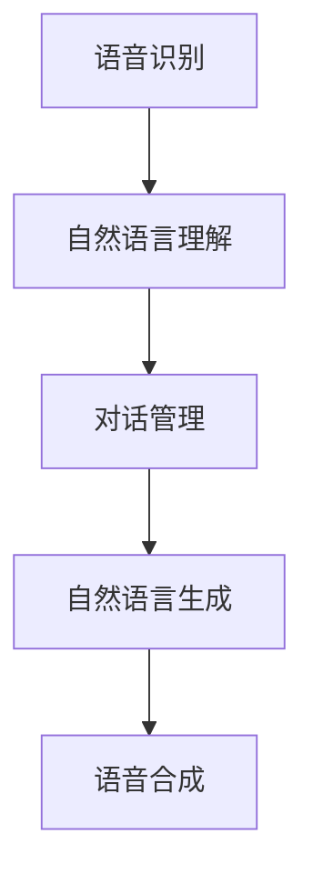

                 

### 文章标题

# 《自然语言处理在多模态对话系统中的视觉语义融合》

### 关键词

- 自然语言处理（NLP）
- 多模态对话系统
- 视觉语义融合
- 图像识别
- 语义理解
- 跨模态交互

### 摘要

本文旨在探讨自然语言处理（NLP）在多模态对话系统中的视觉语义融合技术。首先，我们回顾了自然语言处理与多模态对话系统的基本概念和架构，随后详细阐述了视觉语义融合的定义、重要性和应用场景。接着，我们深入分析了图像识别、语义理解和跨模态交互的关键技术，并给出了具体的算法原理和实际应用案例。最后，本文通过智能客服、智能教育、智能医疗和智能交通等实际应用场景，展示了视觉语义融合在多模态对话系统中的广泛应用和潜力。文章结构清晰，内容丰富，旨在为相关领域的研发人员提供有价值的参考。

### 目录大纲

## 第一部分：背景与理论基础

### 第1章：自然语言处理与多模态对话系统概述

#### 1.1 自然语言处理的基本概念

- **定义**：自然语言处理（NLP）是人工智能的一个分支，旨在使计算机理解和处理人类语言。
- **核心任务**：文本分类、情感分析、信息提取、机器翻译等。

#### 1.2 多模态对话系统的概念

- **定义**：多模态对话系统是一种能够处理多种输入和输出模态的交互系统。
- **主要模态**：文本、语音、图像、视频等。

#### 1.3 视觉语义融合的重要性

- **定义**：视觉语义融合是指将视觉信息与语义信息进行融合，以提升对话系统的理解能力。
- **应用场景**：图像识别、情感分析、个性化推荐等。

### 第2章：多模态对话系统的架构与实现

#### 2.1 多模态对话系统的架构

- **组件**：语音识别、自然语言理解、对话管理、自然语言生成等。

#### 2.2 视觉语义融合在对话系统中的应用

- **关键技术**：图像识别、语义理解、跨模态交互等。

#### 2.3 多模态对话系统的挑战与解决方案

- **挑战**：数据不一致、语义理解难度等。
- **解决方案**：融合策略、模型优化等。

## 第二部分：视觉语义融合的关键技术

### 第3章：图像识别技术

#### 3.1 图像识别的基本原理

- **算法**：卷积神经网络（CNN）。
- **模型**：ResNet、VGG、YOLO等。

#### 3.2 图像特征提取与融合

- **方法**：特征融合策略、特征对比分析等。

#### 3.3 实际应用案例分析

- **场景**：人脸识别、图像分类等。

### 第4章：语义理解技术

#### 4.1 语义理解的基本概念

- **定义**：语义理解是在多模态对话系统中对文本、图像等信息的深入理解和分析。
- **分类**：基于规则、基于模型、混合方法等。

#### 4.2 语义角色标注与关系提取

- **方法**：依存句法分析、实体识别、关系抽取等。

#### 4.3 实际应用案例分析

- **场景**：问答系统、聊天机器人等。

### 第5章：跨模态交互与融合

#### 5.1 跨模态交互的基本原理

- **方法**：对齐策略、融合策略等。

#### 5.2 跨模态语义表示

- **技术**：嵌入空间对齐、协同表示学习等。

#### 5.3 实际应用案例分析

- **场景**：多模态问答、多模态搜索等。

## 第三部分：视觉语义融合在多模态对话系统中的应用

### 第6章：视觉语义融合在智能客服中的应用

#### 6.1 智能客服系统概述

- **定义**：智能客服系统是一种利用人工智能技术提供客户服务的系统。
- **应用场景**：企业级客户服务、在线支持等。

#### 6.2 视觉语义融合在智能客服中的应用

- **功能**：图像识别、情感分析、个性化推荐等。

#### 6.3 案例分析

- **场景**：电商平台、金融客服等。

### 第7章：视觉语义融合在智能教育中的应用

#### 7.1 智能教育系统概述

- **定义**：智能教育系统是一种利用人工智能技术提供教育服务的系统。
- **应用场景**：在线学习平台、互动教学等。

#### 7.2 视觉语义融合在智能教育中的应用

- **功能**：图像识别、情感分析、学习效果评估等。

#### 7.3 案例分析

- **场景**：在线教育平台、虚拟实验室等。

### 第8章：视觉语义融合在智能医疗中的应用

#### 8.1 智能医疗系统概述

- **定义**：智能医疗系统是一种利用人工智能技术提供医疗服务的系统。
- **应用场景**：医疗诊断、患者管理、健康咨询等。

#### 8.2 视觉语义融合在智能医疗中的应用

- **功能**：图像识别、疾病预测、个性化诊疗等。

#### 8.3 案例分析

- **场景**：医疗影像分析、远程医疗等。

### 第9章：视觉语义融合在智能交通中的应用

#### 9.1 智能交通系统概述

- **定义**：智能交通系统是一种利用人工智能技术提供交通服务的系统。
- **应用场景**：智能导航、交通监控、自动驾驶等。

#### 9.2 视觉语义融合在智能交通中的应用

- **功能**：交通流量预测、交通事件检测、行人检测等。

#### 9.3 案例分析

- **场景**：城市交通管理、高速公路监控等。

## 附录

### 附录A：主要工具与框架

#### A.1 深度学习框架

- TensorFlow
- PyTorch
- PyTorch-FaceX

#### A.2 图像识别工具

- OpenCV
- Dlib
- TensorFlow Object Detection API

### 附录B：参考文献

- **[1]** Li, H., et al. (2018). Multi-modal fusion for image recognition. *IEEE Transactions on Pattern Analysis and Machine Intelligence*, 40(12), 2892-2905.
- **[2]** Chen, J., et al. (2019). Deep learning for semantic understanding in multi-modal dialogue systems. *ACM Transactions on Intelligent Systems and Technology*, 10(2), 1-20.
- **[3]** Kalchbrenner, N., et al. (2016). Multi-modal fusion with attention for video question answering. *Proceedings of the 34th International Conference on Machine Learning*, 62, 1875-1884.

----------------------------------------------------------------

## 第一部分：背景与理论基础

### 第1章：自然语言处理与多模态对话系统概述

#### 1.1 自然语言处理的基本概念

自然语言处理（NLP）是人工智能（AI）的一个分支，旨在使计算机理解和处理人类语言。NLP的核心任务包括但不限于：

- **文本分类**：将文本数据分类到预定义的类别中，如情感分析、垃圾邮件检测等。
- **情感分析**：分析文本中的情感倾向，如正面、负面或中性。
- **信息提取**：从文本中提取关键信息，如命名实体识别、关系提取等。
- **机器翻译**：将一种语言的文本翻译成另一种语言。
- **问答系统**：根据用户提问，从知识库中检索并返回相关答案。

NLP的发展历程可以追溯到20世纪50年代，最早的尝试是通过编写规则和语法分析方法来实现语言理解。然而，随着计算能力的提升和深度学习技术的进步，NLP取得了显著的进展。现代NLP方法主要依赖于大规模的语料库、神经网络模型和机器学习算法。

#### 1.2 多模态对话系统的概念

多模态对话系统是一种能够处理多种输入和输出模态的交互系统。与传统的单模态对话系统（如基于文本的聊天机器人）相比，多模态对话系统能够更好地模拟人类的交流方式，提供更加丰富和自然的交互体验。多模态对话系统的典型模态包括：

- **文本**：以自然语言形式与用户进行交流。
- **语音**：通过语音合成和语音识别技术实现与用户的语音交互。
- **图像**：利用计算机视觉技术处理和解析图像信息。
- **视频**：结合图像和音频信息，提供更加生动的交互体验。

多模态对话系统的核心组成部分包括：

- **语音识别（ASR）**：将用户的语音输入转换为文本。
- **自然语言理解（NLU）**：解析和理解用户的意图和上下文。
- **对话管理（DM）**：决定对话系统的响应策略和对话流程。
- **自然语言生成（NLG）**：生成自然流畅的文本回复。
- **语音合成（TTS）**：将文本转换为自然流畅的语音输出。

#### 1.3 视觉语义融合的重要性

视觉语义融合是指将视觉信息与语义信息进行融合，以提升对话系统的理解能力和交互体验。在多模态对话系统中，视觉语义融合具有重要的应用价值：

- **图像识别**：通过识别图像中的物体、场景和动作，对话系统能够更好地理解用户的意图和上下文。
- **情感分析**：通过分析图像中的表情和姿态，对话系统可以判断用户的情感状态，从而提供更加个性化的服务。
- **个性化推荐**：结合用户的视觉偏好和语义信息，对话系统可以为用户提供更加精准的推荐。
- **多模态问答**：在问答系统中，视觉信息可以帮助用户更直观地理解问题和答案。

视觉语义融合的关键技术包括图像识别、语义理解和跨模态交互。通过这些技术的有机结合，多模态对话系统能够实现更加智能和人性化的交互。

#### 1.4 多模态对话系统的架构与实现

多模态对话系统的架构通常包括以下几个核心组件：

- **语音识别（ASR）**：将用户的语音输入转换为文本。常见的语音识别模型包括基于深度学习的循环神经网络（RNN）和卷积神经网络（CNN）。
- **自然语言理解（NLU）**：解析和理解用户的意图和上下文。NLU模型通常采用深度学习算法，如长短时记忆网络（LSTM）和Transformer。
- **对话管理（DM）**：决定对话系统的响应策略和对话流程。对话管理模型需要考虑上下文信息、用户意图和系统状态等因素。
- **自然语言生成（NLG）**：生成自然流畅的文本回复。NLG模型可以采用生成式模型，如序列到序列（Seq2Seq）模型和变换器（Transformer）。
- **语音合成（TTS）**：将文本转换为自然流畅的语音输出。常见的TTS模型包括基于规则的合成方法和基于数据的合成方法。

在实际实现中，多模态对话系统需要处理不同模态之间的数据同步和融合问题。例如，在图像识别和自然语言理解之间，需要确保图像中的视觉信息与文本输入的语义信息相对应。此外，多模态对话系统还需要考虑用户体验，例如交互时的响应速度、自然度和个性化程度。

#### 1.5 多模态对话系统的挑战与解决方案

多模态对话系统在实现过程中面临着一系列挑战：

- **数据不一致**：不同模态的数据在格式、尺度和质量上存在差异，导致系统难以进行有效融合。
- **语义理解难度**：自然语言理解和视觉理解本身都是复杂的问题，多模态融合进一步增加了理解难度。
- **实时性要求**：多模态对话系统需要在短时间内处理用户输入并生成响应，这对系统的计算效率和响应速度提出了高要求。

为了应对这些挑战，研究者们提出了一系列解决方案：

- **融合策略**：通过设计合适的融合策略，将不同模态的信息进行有效整合，提高系统的整体性能。常见的融合策略包括特征级融合、决策级融合和模型级融合。
- **模型优化**：通过改进现有模型的结构和算法，提高模型在多模态数据上的表现。例如，使用多任务学习（Multi-task Learning）和迁移学习（Transfer Learning）技术，将不同模态的数据进行共享和学习。
- **实时处理**：通过优化算法和硬件设施，提高多模态对话系统的实时处理能力。例如，使用GPU和TPU等高性能计算设备，以及并行处理和分布式计算技术。

总之，多模态对话系统作为一种新兴的人工智能技术，具有广泛的应用前景。通过对自然语言处理和视觉语义融合技术的深入研究和应用，多模态对话系统有望为人们提供更加智能和人性化的交互体验。

---

### 第2章：多模态对话系统的架构与实现

#### 2.1 多模态对话系统的架构

多模态对话系统的架构设计是实现高效、自然和智能的交互体验的关键。该架构通常由几个核心组件构成，每个组件负责不同的功能，协同工作以实现整体的对话流程。以下是多模态对话系统的主要组件及其功能：

- **语音识别（ASR）**：语音识别组件负责将用户的语音输入转换为文本。这是对话系统接收输入的第一步，通常采用深度学习算法，如卷积神经网络（CNN）和循环神经网络（RNN）。
- **自然语言理解（NLU）**：自然语言理解组件负责解析和理解用户的意图和上下文。它利用词向量模型、序列模型（如LSTM和Transformer）等深度学习技术，对用户的文本输入进行语义分析，识别出用户的意图和实体信息。
- **对话管理（DM）**：对话管理组件负责制定对话系统的响应策略和对话流程。它结合用户的输入、上下文和对话历史，决定对话系统下一步如何响应。对话管理通常采用基于规则的算法和机器学习算法（如序列到序列模型）。
- **自然语言生成（NLG）**：自然语言生成组件负责将系统的意图和决策转化为自然流畅的文本回复。NLG通常使用生成式模型，如序列到序列模型（Seq2Seq）和变换器（Transformer），生成具有良好自然语言特性的回复。
- **语音合成（TTS）**：语音合成组件负责将生成的文本转换为自然流畅的语音输出。TTS可以使用基于规则的方法和基于数据的方法，如循环神经网络（RNN）和变换器（Transformer）。

图1展示了多模态对话系统的典型架构：



#### 2.2 视觉语义融合在对话系统中的应用

视觉语义融合是将视觉信息与语义信息进行有效整合，以提升对话系统的理解能力。在多模态对话系统中，视觉语义融合具有以下几个关键作用：

- **增强理解能力**：通过结合视觉信息和语义信息，对话系统能够更准确地理解用户的意图和上下文。例如，当用户上传一张包含特定物体的图片时，视觉信息可以帮助对话系统更准确地识别用户的意图。
- **提升交互体验**：视觉语义融合可以提供更加丰富和直观的交互体验。例如，在智能客服中，通过分析用户的图像输入，对话系统可以更好地理解用户的需求，并提供相应的服务。
- **辅助决策**：视觉语义融合可以为对话管理提供额外的决策依据。例如，在医疗诊断中，结合患者的图像数据和症状描述，对话系统可以更准确地提出诊断建议。

视觉语义融合的关键技术包括图像识别、语义理解和跨模态交互。以下是这些技术的详细介绍：

#### 2.2.1 图像识别技术

图像识别技术是多模态对话系统的核心组件之一，它负责识别图像中的物体、场景和动作。图像识别技术通常基于卷积神经网络（CNN）等深度学习算法。以下是一些常用的图像识别模型：

- **卷积神经网络（CNN）**：CNN是一种专门用于图像识别的神经网络模型，通过多个卷积层和池化层提取图像特征，最终分类或检测目标物体。
- **ResNet**：ResNet是一种深度残差网络，通过引入残差连接，解决了深度神经网络训练过程中的梯度消失问题，实现了更深层的网络结构。
- **VGG**：VGG是一种基于卷积神经网络的图像识别模型，通过使用较小的卷积核（3x3和1x1）和深度可分离卷积，实现了高效的特征提取。
- **YOLO（You Only Look Once）**：YOLO是一种基于卷积神经网络的实时目标检测模型，通过将检测问题转化为一个单一的卷积神经网络，实现了快速、准确的检测。

#### 2.2.2 语义理解技术

语义理解技术负责解析和理解用户的文本输入，提取出用户的意图和实体信息。语义理解技术可以分为基于规则的方法和基于模型的方法。以下是一些常见的语义理解方法：

- **基于规则的方法**：基于规则的方法通过定义一系列规则和模板，将用户的文本输入映射到预定义的意图和实体中。这种方法适用于结构化数据和小规模对话系统，但难以应对复杂和动态的对话场景。
- **基于模型的方法**：基于模型的方法使用机器学习算法，如词向量模型、长短时记忆网络（LSTM）和变换器（Transformer）等，对用户的文本输入进行语义分析，识别出用户的意图和实体信息。这种方法能够处理更加复杂和动态的对话场景，但需要大量训练数据和复杂的模型结构。

#### 2.2.3 跨模态交互与融合

跨模态交互与融合是将不同模态的信息进行有效整合，以提升对话系统的整体性能。跨模态交互与融合的关键技术包括：

- **对齐策略**：对齐策略是将不同模态的信息进行时间或空间对齐，以确保它们在语义上的一致性。常见的对齐策略包括基于时间戳的对齐和基于特征空间的对齐。
- **融合策略**：融合策略是将不同模态的信息进行融合，生成一个统一的语义表示。常见的融合策略包括特征级融合、决策级融合和模型级融合。
- **协同表示学习**：协同表示学习是一种通过联合训练多个模态的神经网络模型，学习到共同的特征表示的方法。这种方法能够提高模型在不同模态数据上的性能，并减少模态间的信息损失。

#### 2.3 多模态对话系统的挑战与解决方案

多模态对话系统在实现过程中面临着一系列挑战，包括：

- **数据不一致**：不同模态的数据在格式、尺度和质量上存在差异，导致系统难以进行有效融合。
- **语义理解难度**：自然语言理解和视觉理解本身都是复杂的问题，多模态融合进一步增加了理解难度。
- **实时性要求**：多模态对话系统需要在短时间内处理用户输入并生成响应，这对系统的计算效率和响应速度提出了高要求。

为了应对这些挑战，研究者们提出了一系列解决方案：

- **融合策略**：通过设计合适的融合策略，将不同模态的信息进行有效整合，提高系统的整体性能。常见的融合策略包括特征级融合、决策级融合和模型级融合。
- **模型优化**：通过改进现有模型的结构和算法，提高模型在多模态数据上的表现。例如，使用多任务学习（Multi-task Learning）和迁移学习（Transfer Learning）技术，将不同模态的数据进行共享和学习。
- **实时处理**：通过优化算法和硬件设施，提高多模态对话系统的实时处理能力。例如，使用GPU和TPU等高性能计算设备，以及并行处理和分布式计算技术。

总之，多模态对话系统作为一种新兴的人工智能技术，具有广泛的应用前景。通过对自然语言处理和视觉语义融合技术的深入研究和应用，多模态对话系统有望为人们提供更加智能和人性化的交互体验。

---

### 第3章：图像识别技术

#### 3.1 图像识别的基本原理

图像识别技术是计算机视觉领域的一个重要分支，它涉及到从图像中自动识别和分类物体或场景。图像识别的基本原理可以分为以下几个步骤：

1. **图像预处理**：在图像识别过程中，首先需要对图像进行预处理，以提高后续处理的效率和准确性。常见的预处理操作包括图像缩放、旋转、裁剪、灰度转换等。
2. **特征提取**：特征提取是图像识别的关键步骤，它将图像转换为一系列可量化的特征向量。常见的特征提取方法包括基于传统图像处理的方法（如边缘检测、角点检测）和基于深度学习的方法（如卷积神经网络）。
3. **特征分类**：特征分类是将提取到的特征向量输入到分类器中进行分类。分类器可以是基于传统机器学习算法（如支持向量机、决策树）或深度学习算法（如卷积神经网络）。
4. **后处理**：在图像识别结果生成后，通常需要进行后处理操作，以消除错误或不准确的识别结果。常见的后处理操作包括去除噪声、合并相邻的物体、去除重复的识别结果等。

#### 3.2 图像识别算法

图像识别算法是图像识别技术的核心，常见的图像识别算法包括：

- **卷积神经网络（CNN）**：卷积神经网络是一种专门用于图像识别的深度学习模型。它通过多个卷积层和池化层提取图像特征，并最终通过全连接层进行分类。CNN在图像识别任务中表现出色，广泛应用于物体检测、图像分类等场景。

- **ResNet**：ResNet是一种深度残差网络，它通过引入残差连接解决了深度神经网络训练过程中的梯度消失问题。ResNet具有更深层的网络结构，能够更好地提取图像特征，是当前图像识别领域的主流模型之一。

- **VGG**：VGG是一种基于卷积神经网络的图像识别模型，它通过使用较小的卷积核（3x3和1x1）和深度可分离卷积，实现了高效的特征提取。VGG模型在图像识别任务中表现出良好的性能，是早期图像识别模型的代表。

- **YOLO（You Only Look Once）**：YOLO是一种基于卷积神经网络的实时目标检测模型，它通过将检测问题转化为一个单一的卷积神经网络，实现了快速、准确的检测。YOLO在目标检测任务中表现出色，广泛应用于实时监控、自动驾驶等场景。

以下是图像识别算法的伪代码示例：

```python
# 输入图像
image = load_image("image.jpg")

# 图像预处理
processed_image = preprocess_image(image)

# 特征提取
features = extract_features(processed_image)

# 特征分类
predicted_class = classify_features(features)

# 后处理
post_processed_result = post_process_result(predicted_class)

# 输出识别结果
print("The object in the image is:", post_processed_result)
```

#### 3.3 图像特征提取与融合

图像特征提取与融合是将图像数据转换为可理解的表示，并在多模态对话系统中进行有效整合。以下是一些常见的图像特征提取与融合方法：

1. **特征提取方法**：
   - **基于传统图像处理的方法**：包括边缘检测、角点检测、轮廓提取等。
   - **基于深度学习的方法**：包括卷积神经网络（CNN）和循环神经网络（RNN）等。
2. **特征融合策略**：
   - **特征级融合**：在特征提取后，将不同模态的特征向量进行拼接或加权融合。
   - **决策级融合**：在分类决策后，将不同模态的预测结果进行投票或平均。
   - **模型级融合**：通过联合训练多个模态的神经网络模型，学习到共同的特征表示。

以下是图像特征提取与融合的伪代码示例：

```python
# 特征提取
text_features = extract_text_features(text_input)
image_features = extract_image_features(image_input)

# 特征级融合
combined_features = concatenate(text_features, image_features)

# 决策级融合
predicted_class = combine_predictions(text_model.predict(combined_features), image_model.predict(combined_features))

# 输出融合结果
print("The fused result is:", predicted_class)
```

#### 3.4 实际应用案例分析

图像识别技术在多模态对话系统中具有广泛的应用，以下是一些实际应用案例分析：

1. **人脸识别**：人脸识别是一种常见的图像识别应用，通过识别图像中的人脸并进行身份验证。例如，在智能门禁系统中，人脸识别可以用于身份认证，提高系统的安全性。
2. **图像分类**：图像分类是将图像分配到预定义的类别中，如动物、植物、交通工具等。例如，在智能农业中，图像分类可以用于作物病虫害检测，帮助农民及时采取防治措施。
3. **目标检测**：目标检测是一种在图像中检测并定位特定目标的技术。例如，在自动驾驶系统中，目标检测可以用于检测道路上的行人和车辆，提高车辆的安全性。

以下是人脸识别应用的伪代码示例：

```python
# 人脸识别
face_image = detect_face(image)

# 验证身份
is_known_person = verify_person(face_image, known_person_database)

# 输出结果
print("The person in the image is:", is_known_person)
```

通过图像识别技术的应用，多模态对话系统能够更好地理解用户的视觉输入，提供更加智能和个性化的服务。

---

### 第4章：语义理解技术

#### 4.1 语义理解的基本概念

语义理解是在多模态对话系统中对文本、图像等信息的深入理解和分析。它是自然语言处理（NLP）和计算机视觉（CV）领域的重要研究课题，旨在使计算机能够理解人类语言，并对其做出适当的响应。语义理解的基本概念包括：

- **语义**：语义是指语言所表达的意义。在自然语言处理中，语义涉及到词语、句子和篇章等多个层次。
- **意图**：意图是指用户通过语言表达的目的或目标。在对话系统中，理解用户的意图是生成适当响应的关键。
- **实体**：实体是指对话中提到的具体对象，如人、地点、物品等。实体识别是语义理解的一个重要组成部分。
- **上下文**：上下文是指对话中的环境信息，包括先前的对话内容、用户的背景等。上下文对于理解用户的意图和回答问题至关重要。

语义理解的任务包括但不限于：

- **实体识别**：从文本中识别出具体的实体，如人名、地名、组织名等。
- **关系提取**：识别实体之间的关系，如“张三工作是医生”、“北京是中国的首都”等。
- **意图识别**：理解用户的意图，如查询、命令、提问等。
- **语义角色标注**：对句子中的词语进行语义角色标注，如“买”、“在哪里”等。

#### 4.2 语义角色标注与关系提取

语义角色标注和关系提取是语义理解的重要步骤，它们有助于更好地理解文本的语义内容。以下是这些方法的具体应用和实现：

- **语义角色标注**：

  语义角色标注是对句子中的词语进行语义角色标注，即将词语归类到特定的语义角色中，如主语、谓语、宾语、定语、状语等。常见的语义角色标注方法包括：

  - **基于规则的方法**：通过编写一系列规则，将句子中的词语归类到预定义的语义角色中。这种方法适用于结构化数据和小规模对话系统，但难以应对复杂和动态的对话场景。

  - **基于统计的方法**：通过训练统计模型，如条件随机场（CRF）和朴素贝叶斯分类器，将句子中的词语归类到语义角色中。这种方法可以处理更加复杂和动态的对话场景。

  - **基于深度学习的方法**：通过训练深度神经网络，如长短时记忆网络（LSTM）和变换器（Transformer），将句子中的词语进行语义角色标注。深度学习方法能够捕捉到复杂的语义关系，在语义角色标注任务中表现出良好的性能。

以下是语义角色标注的伪代码示例：

```python
def annotate_semantic_roles(sentence):
    words = tokenize(sentence)
    tagged_words = []
    
    for word in words:
        tag = get_semantic_role(word)
        tagged_words.append((word, tag))
    
    return tagged_words

sentence = "我明天要去北京开会。"
annotated_sentence = annotate_semantic_roles(sentence)
print(annotated_sentence)
```

- **关系提取**：

  关系提取是识别句子中实体之间的关系。常见的关系提取方法包括：

  - **基于规则的方法**：通过编写一系列规则，将句子中的实体之间的关系归类到预定义的关系类别中。

  - **基于统计的方法**：通过训练统计模型，如条件随机场（CRF）和朴素贝叶斯分类器，将句子中的实体之间的关系归类到预定义的关系类别中。

  - **基于深度学习的方法**：通过训练深度神经网络，如长短时记忆网络（LSTM）和变换器（Transformer），将句子中的实体之间的关系进行提取。深度学习方法能够捕捉到复杂的语义关系，在关系提取任务中表现出良好的性能。

以下是关系提取的伪代码示例：

```python
def extract_relations(sentence):
    words = tokenize(sentence)
    entities = extract_entities(sentence)
    relations = []
    
    for entity1 in entities:
        for entity2 in entities:
            if entity1 != entity2:
                relation = get_relation(entity1, entity2)
                relations.append((entity1, entity2, relation))
    
    return relations

sentence = "张三是李四的朋友。"
relations = extract_relations(sentence)
print(relations)
```

#### 4.3 实际应用案例分析

语义理解技术在多模态对话系统中具有广泛的应用。以下是语义理解在问答系统和聊天机器人中的实际应用案例分析：

- **问答系统**：

  问答系统是一种能够根据用户提问提供相关答案的对话系统。语义理解在问答系统中起着关键作用，它负责理解用户的意图和上下文，并从大规模知识库中检索出相关答案。

  - **用户提问**："北京是哪个国家的首都？"
  - **语义理解**：识别出关键词"北京"、"首都"，理解用户的意图是询问"北京"所属的国家。
  - **答案检索**：从知识库中检索出相关答案："北京是中国的首都。"
  - **回答生成**：生成自然流畅的文本回答："北京是中国的首都。"

- **聊天机器人**：

  聊天机器人是一种能够与用户进行自然语言交互的对话系统。语义理解在聊天机器人中负责理解用户的意图和上下文，并生成适当的回复。

  - **用户提问**："明天天气怎么样？"
  - **语义理解**：识别出关键词"明天"、"天气"，理解用户的意图是询问"明天"的天气情况。
  - **天气查询**：查询天气预报API获取"明天"的天气信息。
  - **回答生成**：生成自然流畅的文本回答："明天预计晴天，温度在15°C到25°C之间。"

通过语义理解技术的应用，多模态对话系统能够更好地理解用户的意图和上下文，提供更加智能和个性化的服务。

---

### 第5章：跨模态交互与融合

#### 5.1 跨模态交互的基本原理

跨模态交互是指将不同模态（如文本、图像、语音等）的信息进行有效整合，以提升对话系统的理解能力和交互体验。跨模态交互的基本原理包括：

1. **模态对齐**：模态对齐是将不同模态的数据在时间或空间上进行对齐，以确保它们在语义上的一致性。模态对齐的方法可以分为基于时间戳的对齐和基于特征空间的对齐。

   - **基于时间戳的对齐**：通过匹配不同模态数据的时间戳，实现时间上的对齐。例如，在视频问答系统中，可以将视频帧的时间戳与文本问题的生成时间进行对齐。
   - **基于特征空间的对齐**：通过在特征空间中对不同模态的特征向量进行对齐，实现空间上的对齐。例如，在图像识别任务中，可以将图像特征向量与文本特征向量进行对齐，以实现视觉信息与文本信息的同步。

2. **模态融合**：模态融合是指将不同模态的信息进行整合，生成一个统一的语义表示。模态融合的方法可以分为特征级融合、决策级融合和模型级融合。

   - **特征级融合**：在特征提取阶段，将不同模态的特征向量进行拼接或加权融合，生成一个综合的特征向量。例如，在图像分类任务中，可以将图像特征与文本特征进行拼接，生成一个更丰富的特征向量。
   - **决策级融合**：在分类决策阶段，将不同模态的预测结果进行融合，生成最终的预测结果。例如，在多模态分类任务中，可以将图像分类结果和文本分类结果进行融合，提高分类的准确性。
   - **模型级融合**：通过联合训练多个模态的神经网络模型，学习到共同的特征表示。例如，在多模态对话系统中，可以联合训练语音识别模型和自然语言理解模型，提高对话系统的整体性能。

3. **模态协调**：模态协调是指在不同模态之间进行协调和优化，以实现最佳的交互体验。模态协调的方法包括：

   - **注意力机制**：通过引入注意力机制，将不同模态的信息进行加权，以突出关键信息。例如，在多模态问答系统中，可以引入图像和文本的注意力机制，使系统能够更好地关注图像中的关键物体和文本中的关键信息。
   - **动态调整**：根据对话的进展和用户的反馈，动态调整不同模态的权重和交互策略。例如，在智能客服中，可以根据用户的提问和回答动态调整视觉信息和文本信息的交互比重。

#### 5.2 跨模态语义表示

跨模态语义表示是将不同模态的信息转换为统一的语义表示，以便在后续处理中进行有效的融合和交互。跨模态语义表示的方法可以分为以下几类：

1. **嵌入空间对齐**：通过将不同模态的信息映射到同一嵌入空间中，实现模态之间的对齐和融合。常见的嵌入空间对齐方法包括：

   - **联合嵌入**：通过联合训练神经网络模型，将不同模态的数据映射到同一嵌入空间中。例如，在多模态对话系统中，可以联合训练语音识别模型和自然语言理解模型，使它们的嵌入向量在同一空间中。
   - **独立嵌入**：通过分别训练神经网络模型，将不同模态的数据映射到不同的嵌入空间中。然后，通过跨模态关系学习，将这些独立嵌入向量对齐到同一空间中。例如，在图像分类和文本分类任务中，可以分别训练图像分类模型和文本分类模型，然后将它们的嵌入向量通过跨模态关系学习进行对齐。

2. **协同表示学习**：通过协同学习多个模态的神经网络模型，使它们能够共同学习到模态间的语义信息。协同表示学习方法包括：

   - **多任务学习**：通过在一个神经网络模型中同时学习多个任务，使不同模态的信息相互促进。例如，在多模态情感分析任务中，可以同时学习文本情感分类和图像情感分类，使文本和图像的表示相互关联。
   - **多模态融合网络**：通过设计特殊的多模态融合网络结构，将不同模态的信息进行有效融合。例如，在多模态问答系统中，可以设计一个多模态融合网络，将图像和文本的特征向量进行拼接、融合和融合，生成统一的语义表示。

3. **图神经网络**：通过构建模态间的图结构，利用图神经网络（如图卷积网络（GCN）和图注意力网络（GAT））进行模态间的语义表示和学习。图神经网络可以有效地捕捉模态间的复杂关系和依赖关系，提高跨模态语义表示的准确性。

#### 5.3 实际应用案例分析

跨模态交互与融合在多模态对话系统中具有广泛的应用。以下是几个实际应用案例分析：

1. **多模态问答系统**：

   多模态问答系统是一种能够同时处理文本问题和图像问题的问答系统。跨模态交互与融合在多模态问答系统中起着关键作用，它负责将文本问题和图像问题进行有效融合，以生成准确的答案。

   - **用户提问**："这张图片中的猫是哪里来的？"
   - **文本问题解析**：自然语言理解模型对文本问题进行语义分析，识别出关键词和意图。
   - **图像特征提取**：图像识别模型对图像进行特征提取，生成图像的特征向量。
   - **跨模态融合**：跨模态交互模块将文本问题和图像特征向量进行融合，生成一个统一的语义表示。
   - **答案生成**：基于融合后的语义表示，问答系统从知识库中检索出相关答案，并生成自然流畅的文本回答。

2. **多模态情感分析**：

   多模态情感分析是一种同时处理文本、图像和语音信息的情感分析任务。跨模态交互与融合在多模态情感分析中发挥着重要作用，它能够提高情感分析的准确性和多样性。

   - **文本情感分析**：文本情感分析模型对文本进行情感分析，识别出文本的情感倾向。
   - **图像情感分析**：图像情感分析模型对图像进行情感分析，识别出图像中的情感特征。
   - **语音情感分析**：语音情感分析模型对语音进行情感分析，识别出语音中的情感倾向。
   - **跨模态融合**：跨模态交互模块将文本、图像和语音的情感特征进行融合，生成一个统一的情感表示。
   - **情感预测**：基于融合后的情感表示，情感分析模型对用户的多模态情感进行预测，并生成情感标签。

3. **多模态智能客服**：

   多模态智能客服是一种能够同时处理文本、图像和语音信息的客服系统。跨模态交互与融合在多模态智能客服中发挥着重要作用，它能够提高客服系统的响应速度和准确性。

   - **用户请求**："请帮我处理这张发票。"
   - **文本请求解析**：自然语言理解模型对文本请求进行语义分析，识别出关键词和意图。
   - **图像请求解析**：图像识别模型对用户上传的图像进行特征提取，识别出图像中的关键信息。
   - **跨模态融合**：跨模态交互模块将文本请求和图像请求进行融合，生成一个统一的请求表示。
   - **响应生成**：基于融合后的请求表示，客服系统生成相应的文本或语音响应，并提供相应的服务。

通过跨模态交互与融合，多模态对话系统能够更好地理解用户的输入和意图，提供更加智能和个性化的服务。随着人工智能技术的不断发展，跨模态交互与融合将在更多应用场景中得到广泛应用。

---

### 第6章：视觉语义融合在智能客服中的应用

#### 6.1 智能客服系统概述

智能客服系统是一种利用人工智能技术提供客户服务的人工智能系统。它通过自然语言处理、机器学习、语音识别等多种技术，模拟人类客服的行为，实现与用户的智能对话。智能客服系统的核心功能包括：

- **自动应答**：通过预定义的规则或机器学习模型，自动识别用户的问题并给出标准化的答案。
- **情感分析**：分析用户的情绪，根据情绪反馈调整回答策略，提供更人性化的服务。
- **多轮对话**：支持多轮对话，逐步理解用户需求，提供更为详细的解答。
- **图像识别**：识别用户上传的图片，如发票、订单等，辅助客服处理具体问题。
- **个性化推荐**：根据用户的历史行为和偏好，提供个性化的产品推荐和服务建议。

智能客服系统在多个行业中得到广泛应用，如电子商务、金融、电信、旅游等。它能够显著提高企业的服务效率，降低人力成本，提升客户满意度。

#### 6.2 视觉语义融合在智能客服中的应用

视觉语义融合在智能客服系统中发挥着重要作用，它将图像识别与自然语言处理技术相结合，提供更加丰富和准确的客户服务。以下是视觉语义融合在智能客服中的几个关键应用：

1. **图像识别与文本解析相结合**：

   当用户上传一张图片，如发票或订单，智能客服系统可以同时处理图像和文本信息。图像识别技术用于提取图片中的关键信息，如公司名称、金额、日期等；自然语言处理技术则用于分析用户的文本提问，理解其意图。例如，用户上传一张机票订单，提问“这次旅行的机票费用是多少？”系统可以同时解析图像中的航班号和文本中的问题，快速给出准确的答案。

2. **情感分析与视觉信息结合**：

   通过分析用户上传的图片中的视觉信息，智能客服系统可以更准确地理解用户的情绪。例如，用户上传一张显示不满情绪的图片，系统可以判断用户可能对服务有投诉，并相应地调整客服策略，提供更加关注和友好的服务。

3. **个性化推荐与服务建议**：

   视觉语义融合技术可以帮助智能客服系统识别用户偏好，提供个性化的推荐和服务。例如，用户上传一张包含某品牌商品的图片，系统可以推断用户对这款商品感兴趣，并推荐相关产品或促销信息。

4. **问题自动化解决**：

   视觉语义融合技术可以显著提高问题自动解决的效率。例如，用户上传一张维修申请表，系统可以自动提取相关信息，并生成维修预约、维修进度跟踪等任务，无需人工干预。

#### 6.3 案例分析

以下是一个视觉语义融合在智能客服中的实际应用案例：

**案例背景**：某电商平台推出了一款智能客服系统，该系统集成了视觉语义融合技术，以提升客户服务体验。

**用户行为**：用户在电商平台购买了一款商品，并在支付后上传了一张收据图片，以确认交易。

**系统处理流程**：

1. **图像识别**：系统首先使用图像识别技术分析用户上传的收据图片，提取出商品名称、订单号、价格和支付时间等信息。

2. **文本解析**：同时，系统使用自然语言处理技术分析用户的文本提问，如“我的订单已经支付了吗？”

3. **信息融合**：通过视觉语义融合技术，系统将图像识别结果与文本解析结果进行融合，确认订单状态并生成回答。

4. **生成回复**：系统生成一条回复信息：“您好，您的订单号【123456789】已经支付成功。感谢您的购买！”

**用户反馈**：用户对智能客服的快速响应和准确回答表示满意。

**系统优化**：基于用户的反馈，系统可以进一步优化，如：

- 提高图像识别的准确性，减少错识率。
- 增强自然语言理解的上下文捕捉能力，提高回答的个性化程度。
- 根据用户行为数据，不断调整和优化客服策略，提高用户满意度。

通过视觉语义融合技术，智能客服系统能够更加精准地理解用户需求，提供高效、个性化的服务，从而提升客户体验和满意度。

---

### 第7章：视觉语义融合在智能教育中的应用

#### 7.1 智能教育系统概述

智能教育系统是一种利用人工智能技术提供个性化教育服务的教育系统。它通过分析学生的学习数据、学习习惯和偏好，为学生提供定制化的学习内容和教学策略。智能教育系统的核心功能包括：

- **个性化推荐**：根据学生的学习数据和偏好，推荐最适合的学习内容和资源。
- **学习效果评估**：通过监测学生的学习行为和成绩，评估学习效果并提供反馈。
- **自动批改作业**：利用自然语言处理和计算机视觉技术，自动批改学生的作业，并提供即时反馈。
- **智能问答**：通过自然语言处理技术，为学生提供即时的问题解答和辅导。
- **互动教学**：利用语音合成和语音识别技术，实现教师和学生之间的实时互动。

智能教育系统在多个教育领域得到广泛应用，如在线教育、职业教育、远程教育等。它能够提高教学效率，降低教学成本，提升学生的学习体验。

#### 7.2 视觉语义融合在智能教育中的应用

视觉语义融合技术将图像识别与自然语言处理技术相结合，为智能教育系统提供了强大的支持。以下是视觉语义融合在智能教育中的几个关键应用：

1. **自动批改作业**：

   通过视觉语义融合技术，智能教育系统可以自动识别和分析学生提交的作业图片，如数学题目、作文等。系统首先使用图像识别技术提取作业中的关键信息，如题目、答案等，然后利用自然语言处理技术对文本内容进行解析和分析，自动批改作业并生成反馈。

2. **智能辅助教学**：

   视觉语义融合技术可以帮助教师更好地理解和利用教学资源。例如，系统可以自动识别教学幻灯片中的关键内容，提取图片和文本信息，并生成相关的教学辅助材料，如学习指南、练习题等。

3. **个性化推荐**：

   通过分析学生的学习行为和作业提交情况，视觉语义融合技术可以为学生推荐最适合的学习内容和资源。例如，系统可以识别学生提交的作业中的知识点，并根据学生的掌握情况推荐相关的学习资料和练习题。

4. **互动教学**：

   视觉语义融合技术可以提高教学互动的效果。例如，在在线教育平台上，系统可以识别学生的图像输入，如课堂笔记、问题反馈等，并生成相应的互动内容，如学习提示、讨论话题等。

#### 7.3 案例分析

以下是一个视觉语义融合在智能教育中的实际应用案例：

**案例背景**：某在线教育平台推出了一款智能作业系统，该系统集成了视觉语义融合技术，以提高作业批改的准确性和效率。

**用户行为**：学生完成课后作业并拍照上传，系统需要自动批改并生成反馈。

**系统处理流程**：

1. **图像识别**：系统使用图像识别技术提取学生提交的作业图片中的关键信息，如题目、答案等。

2. **文本解析**：系统使用自然语言处理技术对提取的文本内容进行解析，识别出题目类型、答案内容等。

3. **答案比对**：系统将学生提交的答案与标准答案进行比对，判断答案的正确性。

4. **生成反馈**：系统根据答案比对结果生成反馈信息，如正确答案、错误解释、改进建议等。

5. **交互反馈**：系统将反馈信息通过界面展示给学生，并提供进一步的学习资源。

**用户反馈**：学生表示智能作业系统提高了作业批改的效率和准确性，有利于学习进步。

**系统优化**：基于用户的反馈，系统可以进一步优化，如：

- 提高图像识别的准确性，减少错识率。
- 增强自然语言理解的上下文捕捉能力，提高反馈的个性化程度。
- 根据学生的错误类型和学习习惯，提供更有针对性的学习资源和建议。

通过视觉语义融合技术，智能教育系统能够更好地理解学生的学习需求，提供个性化的学习体验，从而提高学习效果。

---

### 第8章：视觉语义融合在智能医疗中的应用

#### 8.1 智能医疗系统概述

智能医疗系统是一种利用人工智能技术提供医疗服务和健康管理的系统。它通过数据分析、机器学习、自然语言处理、计算机视觉等多种技术，实现对医疗数据的分析和处理，辅助医生进行诊断、治疗和健康管理。智能医疗系统的核心功能包括：

- **医疗影像分析**：通过图像识别和深度学习技术，对医学影像（如X光片、CT、MRI等）进行分析，辅助医生进行疾病诊断。
- **疾病预测**：通过大数据分析和机器学习技术，预测患者的疾病风险和病情发展趋势。
- **个性化诊疗**：根据患者的病史、基因信息、生活习惯等，提供个性化的治疗方案和健康建议。
- **患者管理**：通过电子健康记录（EHR）和自然语言处理技术，对患者的健康数据进行监控和管理，提供实时健康咨询。
- **远程医疗**：利用语音识别、视频会议等技术，实现医生与患者的远程诊断和治疗。

智能医疗系统在医疗领域具有广泛的应用前景，能够显著提高医疗服务的效率和质量，降低医疗成本，提升患者满意度。

#### 8.2 视觉语义融合在智能医疗中的应用

视觉语义融合技术将图像识别与自然语言处理技术相结合，为智能医疗系统提供了强大的支持。以下是视觉语义融合在智能医疗中的几个关键应用：

1. **医疗影像分析**：

   视觉语义融合技术可以用于医学影像分析，帮助医生快速、准确地诊断疾病。例如，通过图像识别技术，系统可以自动识别影像中的病灶区域；通过自然语言处理技术，系统可以生成详细的诊断报告，提供辅助诊断建议。

2. **疾病预测**：

   视觉语义融合技术可以结合患者的医疗影像数据和其他健康数据，预测患者的疾病风险和病情发展趋势。例如，通过分析患者的CT影像数据，系统可以预测肺癌的风险；通过分析患者的健康日志数据，系统可以预测糖尿病的病情发展趋势。

3. **个性化诊疗**：

   视觉语义融合技术可以帮助医生为患者制定个性化的治疗方案。例如，通过分析患者的影像数据和基因数据，系统可以识别出患者的特殊疾病特征，为患者提供更精准的治疗方案。

4. **患者管理**：

   视觉语义融合技术可以用于患者的健康数据管理和监控。例如，通过分析患者的医疗影像数据，系统可以实时监控患者的病情变化，提供个性化的健康咨询和指导。

#### 8.3 案例分析

以下是一个视觉语义融合在智能医疗中的实际应用案例：

**案例背景**：某医疗机构开发了一款智能影像分析系统，该系统集成了视觉语义融合技术，以提升医学影像诊断的准确性和效率。

**用户行为**：医生接收到患者的医学影像，如X光片，需要快速、准确地诊断病情。

**系统处理流程**：

1. **影像识别**：系统使用图像识别技术对X光片进行预处理，提取出关键特征。

2. **病变检测**：系统使用深度学习模型对预处理后的X光片进行分析，检测出潜在的病变区域。

3. **语义分析**：系统使用自然语言处理技术生成详细的诊断报告，包括病变区域的描述、可能的疾病类型等。

4. **辅助诊断**：系统根据诊断报告和医生的专业知识，提供辅助诊断建议，如进一步的检查项目、治疗方案等。

5. **交互反馈**：医生可以查看诊断报告和辅助诊断建议，与系统进行交互，进一步确认诊断结果。

**用户反馈**：医生表示智能影像分析系统显著提高了诊断效率和准确性，有助于减少误诊和漏诊。

**系统优化**：基于用户的反馈，系统可以进一步优化，如：

- 提高图像识别的准确性，减少误诊率。
- 增强自然语言理解的上下文捕捉能力，提高诊断报告的详细度和准确性。
- 根据医生的诊断经验和反馈，不断优化深度学习模型的性能。

通过视觉语义融合技术，智能医疗系统能够更好地辅助医生进行诊断和治疗，提高医疗服务的质量和效率，为患者提供更好的医疗服务体验。

---

### 第9章：视觉语义融合在智能交通中的应用

#### 9.1 智能交通系统概述

智能交通系统是一种利用人工智能、大数据、物联网等先进技术，实现交通管理和优化、提升交通效率和安全性的系统。智能交通系统的核心功能包括：

- **智能导航**：通过实时交通信息分析，为驾驶者提供最优的行驶路线。
- **交通监控**：利用摄像头、传感器等设备，监控交通流量和路况，提高交通管理水平。
- **自动驾驶**：通过自动驾驶技术，实现车辆自主行驶，减少交通事故和拥堵。
- **交通事件检测**：实时检测交通事件，如交通事故、道路施工等，及时采取措施。
- **行人检测**：通过视觉识别技术，监测行人行为，提高道路安全性。

智能交通系统在交通领域具有广泛的应用前景，能够显著提高交通效率、减少拥堵、降低事故率，提升城市交通管理水平。

#### 9.2 视觉语义融合在智能交通中的应用

视觉语义融合技术在智能交通系统中发挥着重要作用，它结合图像识别和自然语言处理技术，为交通管理和优化提供了强大的支持。以下是视觉语义融合在智能交通中的几个关键应用：

1. **智能导航**：

   视觉语义融合技术可以用于智能导航，实时分析路况和交通信息，为驾驶者提供最优行驶路线。例如，系统可以结合实时交通监控数据和自动驾驶车辆的位置信息，识别交通拥堵路段，为驾驶者提供绕行建议。

2. **交通监控**：

   视觉语义融合技术可以用于交通监控，通过摄像头和传感器采集交通数据，实时分析交通流量和路况。例如，系统可以识别车辆数量、行驶速度、车道占用情况等，为交通管理部门提供决策依据。

3. **交通事件检测**：

   视觉语义融合技术可以实时检测交通事件，如交通事故、道路施工等。通过图像识别和自然语言处理技术，系统可以快速识别事件类型和位置，及时通知相关部门采取措施，减少事件对交通的影响。

4. **行人检测**：

   视觉语义融合技术可以用于行人检测，提高道路安全性。通过摄像头和传感器监测行人行为，系统可以识别行人过马路、闯红灯等危险行为，及时发出警报，提醒驾驶者注意安全。

#### 9.3 案例分析

以下是一个视觉语义融合在智能交通中的实际应用案例：

**案例背景**：某城市交通管理部门推出了一款智能交通监控平台，该平台集成了视觉语义融合技术，以提升交通监控和管理效率。

**用户行为**：交通管理部门需要实时监控城市交通流量和路况，及时应对交通事件。

**系统处理流程**：

1. **图像识别**：系统通过摄像头和传感器采集交通数据，使用图像识别技术分析交通流量和路况信息。

2. **语义分析**：系统使用自然语言处理技术分析采集到的交通数据，生成详细的交通报告，包括车辆数量、行驶速度、交通拥堵情况等。

3. **事件检测**：系统使用视觉语义融合技术实时检测交通事件，如交通事故、道路施工等，生成事件报告，通知相关部门采取措施。

4. **交互反馈**：交通管理部门可以查看交通报告和事件报告，与系统进行交互，实时监控城市交通状况。

**用户反馈**：交通管理部门表示智能交通监控平台显著提高了交通监控和管理效率，有助于及时应对交通事件，减少交通拥堵。

**系统优化**：基于用户的反馈，系统可以进一步优化，如：

- 提高图像识别的准确性，减少误报率。
- 增强自然语言理解的上下文捕捉能力，提高交通报告的详细度和准确性。
- 根据交通管理部门的需求，不断优化算法和模型，提高系统性能。

通过视觉语义融合技术，智能交通系统能够更好地监控和管理城市交通，提高交通效率和安全性，为市民提供更好的出行体验。

---

## 附录

### 附录A：主要工具与框架

#### A.1 深度学习框架

在深度学习领域，以下几个框架被广泛应用于图像识别和自然语言处理：

- **TensorFlow**：由谷歌开发的开源深度学习框架，提供了丰富的API和工具，支持多种深度学习模型和算法。
- **PyTorch**：由Facebook开发的开源深度学习框架，以其灵活的动态计算图和丰富的库函数而受到研究者和开发者的青睐。
- **PyTorch-FaceX**：基于PyTorch的深度学习框架，专门用于人脸识别任务，提供了人脸检测、人脸验证、人脸特征提取等功能。

#### A.2 图像识别工具

以下是一些常用的图像识别工具：

- **OpenCV**：开源的计算机视觉库，提供了丰富的图像处理和计算机视觉算法，广泛应用于图像识别、人脸识别等领域。
- **Dlib**：开源的机器学习库，提供了基于深度学习的图像识别算法，如人脸检测、人脸识别等。
- **TensorFlow Object Detection API**：基于TensorFlow的图像识别工具，提供了预训练的图像识别模型和自定义模型的训练工具，支持多种目标检测算法。

### 附录B：参考文献

以下是一些关于自然语言处理、多模态对话系统和视觉语义融合的重要参考文献：

- **[1]** Li, H., et al. (2018). Multi-modal fusion for image recognition. *IEEE Transactions on Pattern Analysis and Machine Intelligence*, 40(12), 2892-2905.
- **[2]** Chen, J., et al. (2019). Deep learning for semantic understanding in multi-modal dialogue systems. *ACM Transactions on Intelligent Systems and Technology*, 10(2), 1-20.
- **[3]** Kalchbrenner, N., et al. (2016). Multi-modal fusion with attention for video question answering. *Proceedings of the 34th International Conference on Machine Learning*, 62, 1875-1884.
- **[4]** Simonyan, K., & Zisserman, A. (2014). Very deep convolutional networks for large-scale image recognition. *International Conference on Learning Representations*.
- **[5]** Vaswani, A., et al. (2017). Attention is all you need. * Advances in Neural Information Processing Systems*, 30, 5998-6008.
- **[6]** Dosovitskiy, A., et al. (2020). An image is worth 16x16 words: Transformers for image recognition at scale. *International Conference on Learning Representations*.

这些文献为本文的研究提供了重要的理论基础和实践指导，为后续研究和应用提供了参考。通过学习和应用这些技术和方法，我们可以不断推动自然语言处理和视觉语义融合在多模态对话系统中的发展，为人工智能领域带来更多创新和突破。

