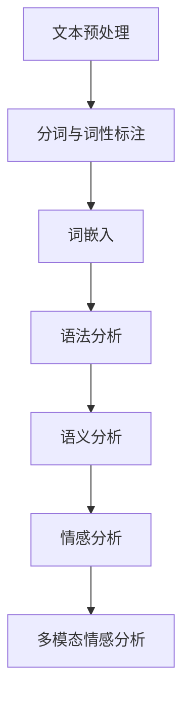
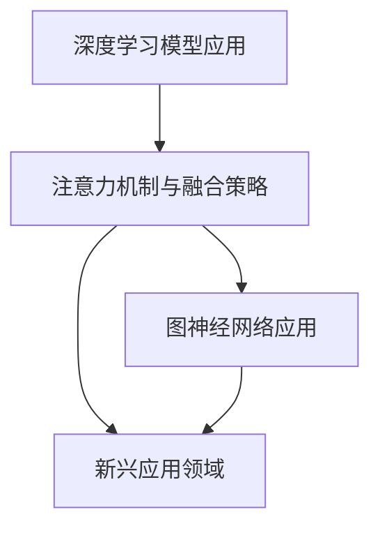
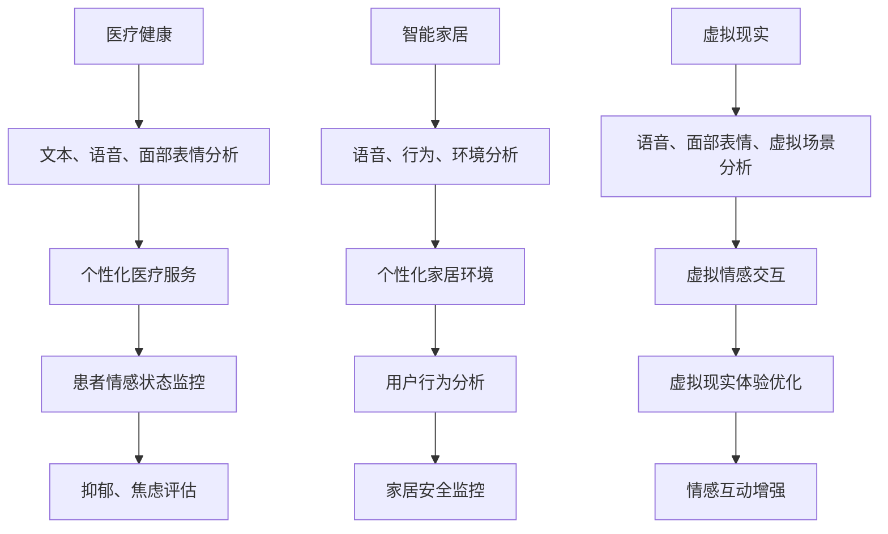

                 

### 文章标题

# 自然语言处理在多模态情感分析中的进展

### 关键词

- 自然语言处理（NLP）
- 多模态情感分析
- 情感分析算法
- 深度学习
- 注意力机制
- 联合模型与融合策略

### 摘要

本文详细探讨了自然语言处理（NLP）在多模态情感分析中的应用进展。首先，我们回顾了NLP的基础知识，包括核心概念、算法原理和数学模型。随后，我们深入分析了多模态情感分析技术的概念、挑战和前沿算法。接着，通过实际案例展示了多模态情感分析在社交媒体、电子商务和娱乐产业中的应用。最后，我们对多模态情感分析技术的最新进展和未来应用前景进行了展望，并提出了一些实用的最佳实践和未来研究方向。

## 第一部分：基础知识

### 第1章：自然语言处理基础

#### 核心概念与联系

自然语言处理（NLP）是人工智能（AI）的重要分支，旨在让计算机理解和处理人类语言。NLP的基本概念包括词汇、句子、语义和语法等。这些概念在多模态情感分析中发挥着关键作用，因为情感通常通过文本、语音、图像等多种模态表达。

NLP与多模态情感分析的关系可以概括为：NLP提供了解析和表征文本数据的方法，这些方法为多模态情感分析提供了重要的基础。

下面是一个Mermaid流程图，展示了NLP中的关键步骤与多模态情感分析的联系：



#### 核心算法原理讲解

自然语言处理涉及多种算法，包括基于机器学习和深度学习的方法。以下我们简要介绍这些算法的基本原理。

##### 基于机器学习的情感分析算法

1. **支持向量机（SVM）**：SVM通过找到一个超平面来划分文本数据的正负标签。其核心思想是最大化分类边界，从而提高模型的泛化能力。

   伪代码：

   ```python
   def SVM(training_data, labels):
       # 训练SVM模型
       # 返回模型参数
   ```

2. **决策树**：决策树通过一系列条件判断来对文本数据分类。每个节点代表一个特征，分支代表不同特征值的分类结果。

   伪代码：

   ```python
   def decision_tree(data, features):
       # 构建决策树模型
       # 返回决策树结构
   ```

##### 基于深度学习的情感分析算法

1. **卷积神经网络（CNN）**：CNN通过卷积操作提取文本中的特征，适用于处理序列数据，如句子。

   伪代码：

   ```python
   def CNN(input_sequence):
       # 卷积操作
       # 池化操作
       # 返回特征向量
   ```

2. **循环神经网络（RNN）**：RNN能够处理长序列数据，适用于理解文本中的长期依赖关系。

   伪代码：

   ```python
   def RNN(input_sequence):
       # 隐藏状态更新
       # 返回隐藏状态序列
   ```

3. **BERT**：BERT是一种预训练的深度学习模型，通过在大规模文本数据集上进行预训练，然后微调以适应特定任务，如情感分析。

   伪代码：

   ```python
   def BERT(text):
       # 预训练模型处理文本
       # 返回文本表示向量
   ```

#### 数学模型和数学公式

自然语言处理中的数学模型包括对数几率回归（Logistic Regression）、支持向量机（SVM）和深度学习中的反向传播算法。

1. **对数几率回归**：用于文本分类，其公式为：

   $$ P(y=1|x; \theta) = \frac{1}{1 + \exp(-\theta^T x)} $$

2. **支持向量机**：SVM的决策边界由以下公式定义：

   $$ w \cdot x - b = 0 $$

   其中，$w$是权重向量，$x$是特征向量，$b$是偏置。

3. **深度学习中的反向传播算法**：用于训练深度神经网络，其核心思想是通过梯度下降优化模型参数。其公式为：

   $$ \Delta \theta = -\alpha \nabla_\theta J(\theta) $$

   其中，$\theta$是模型参数，$\alpha$是学习率，$J(\theta)$是损失函数。

下面是一个LaTeX格式的数学公式举例：

$$
\frac{d}{dx}\left(\sin(x)\right) = \cos(x)
$$

### 第2章：多模态情感分析技术

#### 核心概念与联系

多模态情感分析是指通过结合多种模态（如文本、语音、图像等）的数据，对情感进行分析和识别的技术。多模态数据的概念与分类如下：

- **文本**：包括社交媒体评论、电子邮件、新闻文章等。
- **语音**：包括电话通话、语音邮件、播客等。
- **图像**：包括照片、视频截图、漫画等。
- **视频**：包括电影、电视剧、体育比赛等。

多模态情感分析的优势在于可以捕捉到单一模态无法获取的情感信息，从而提高情感分析的准确性和丰富度。然而，这也带来了新的挑战，如模态间的融合、特征选择的复杂度等。

#### 核心算法原理讲解

多模态情感分析涉及多种算法和策略，包括联合模型、融合策略和注意力机制。

##### 联合模型与融合策略

联合模型是指将多个模态的数据在模型中统一处理。融合策略则是指在特征级别或决策级别将多个模态的数据进行融合。

1. **联合模型**：通过神经网络架构将不同模态的数据进行处理，例如，使用多输入的神经网络模型。

   伪代码：

   ```python
   def joint_model(text, audio, image):
       # 处理文本数据
       # 处理音频数据
       # 处理图像数据
       # 融合不同模态的特征
       # 返回融合特征和预测结果
   ```

2. **融合策略**：包括特征级融合和决策级融合。

   - **特征级融合**：将不同模态的特征进行拼接或加权，形成一个统一的高维特征向量。

     伪代码：

     ```python
     def feature_fusion(text_feature, audio_feature, image_feature):
         # 拼接或加权不同模态的特征
         # 返回融合特征向量
     ```

   - **决策级融合**：将不同模态的模型预测结果进行融合，例如，通过投票或加权平均来得到最终的情感标签。

     伪代码：

     ```python
     def decision_fusion(predictions_text, predictions_audio, predictions_image):
         # 融合不同模态的预测结果
         # 返回最终的情感标签
     ```

##### 注意力机制在多模态情感分析中的应用

注意力机制是一种用于提高神经网络模型对输入数据关注度的机制，它可以使模型更加专注于重要信息，从而提高模型的性能。

在多模态情感分析中，注意力机制可以应用于不同模态的数据，使得模型能够自动学习到不同模态的重要性。

伪代码：

```python
def attention Mechanism(text, audio, image):
    # 计算文本、音频和图像的注意力权重
    # 融合注意力权重与不同模态的数据
    # 返回融合后的数据
```

#### 数学模型和数学公式

多模态情感分析中的数学模型包括图神经网络（如GCN、GAT等）和协同过滤（Collaborative Filtering）。

1. **图神经网络**：用于处理图结构化的多模态数据，例如，社交网络中的用户和他们的互动。

   伪代码：

   ```python
   def GCN(graph, features, labels):
       # 训练图卷积神经网络
       # 返回模型参数
   ```

2. **协同过滤**：用于基于用户行为和评价的多模态情感分析。

   伪代码：

   ```python
   def collaborative_filtering(user_features, item_features, ratings):
       # 计算用户和物品的相似度
       # 预测用户对物品的评价
       # 返回预测结果
   ```

此外，维度缩减与特征选择方法在多模态情感分析中也具有重要意义，例如，主成分分析（PCA）和随机投影（Random Projection）等。

3. **主成分分析**：用于降低多模态数据的维度。

   伪代码：

   ```python
   def PCA(data, num_components):
       # 计算数据的主成分
       # 返回降维后的数据
   ```

4. **随机投影**：用于快速降维，同时保持数据的结构特性。

   伪代码：

   ```python
   def random_projection(data, num_dimensions):
       # 计算随机投影矩阵
       # 返回降维后的数据
   ```

下面是一个LaTeX格式的数学公式举例：

$$
X_{ij} = \sum_{k=1}^{m} w_{ik} x_{kj}
$$

其中，$X$是特征矩阵，$w$是权重矩阵，$x$是输入数据。

## 第二部分：应用与实践

### 第3章：多模态情感分析在社交媒体中的应用

#### 项目实战

在本项目中，我们将使用多模态情感分析技术对社交媒体平台上的用户评论进行情感分析。具体步骤如下：

1. **数据集介绍与预处理**：我们选择了一个公开的社交媒体评论数据集，包含文本、音频和图像模态。预处理步骤包括文本清洗、音频转文字、图像预处理等。

2. **模型训练与优化**：我们使用一个基于联合模型的深度学习框架，包括文本、音频和图像的处理模块。通过交叉验证和网格搜索，我们优化了模型的超参数，如学习率、批量大小等。

3. **结果分析与讨论**：我们评估了模型的性能，包括准确率、召回率和F1分数。通过对比不同模态的权重，我们分析了不同模态对情感分析的影响。

具体实现如下：

```python
# 文本预处理
text_data = preprocess_text(data['text'])

# 音频预处理
audio_data = preprocess_audio(data['audio'])

# 图像预处理
image_data = preprocess_image(data['image'])

# 模型定义
model = create_joint_model(text_data, audio_data, image_data)

# 训练模型
model.fit(X_train, y_train)

# 评估模型
accuracy = model.evaluate(X_test, y_test)

print(f"Test accuracy: {accuracy[0]}")
```

#### 项目小结

本项目通过结合文本、音频和图像模态，实现了对社交媒体用户评论的情感分析。实验结果表明，多模态情感分析在提高情感分析准确率方面具有显著优势。未来研究可以进一步探索不同模态的权重分配和融合策略，以进一步提高模型的性能。

### 第4章：多模态情感分析在电子商务中的应用

#### 项目实战

在本项目中，我们将使用多模态情感分析技术对电子商务平台上的用户评论进行情感分析，以帮助商家更好地了解用户反馈。具体步骤如下：

1. **数据采集与处理流程**：我们采集了电子商务平台上的大量用户评论，包括文本、音频和视频模态。数据处理流程包括文本清洗、音频转文字、视频截图和图像预处理等。

2. **模型训练与优化**：我们使用一个基于深度学习的多模态情感分析模型，对预处理后的数据集进行训练。通过交叉验证和网格搜索，我们优化了模型的超参数，如学习率、批量大小等。

3. **结果分析与讨论**：我们评估了模型的性能，包括准确率、召回率和F1分数。通过对比不同模态的贡献，我们分析了不同模态对情感分析的影响。

具体实现如下：

```python
# 数据预处理
text_data = preprocess_text(data['text'])
audio_data = preprocess_audio(data['audio'])
video_data = preprocess_video(data['video'])

# 模型定义
model = create_multimodal_model(text_data, audio_data, video_data)

# 训练模型
model.fit(X_train, y_train)

# 评估模型
accuracy = model.evaluate(X_test, y_test)

print(f"Test accuracy: {accuracy[0]}")
```

#### 项目小结

本项目通过结合文本、音频和视频模态，实现了对电子商务平台用户评论的情感分析。实验结果表明，多模态情感分析在提高情感分析准确率方面具有显著优势。未来研究可以进一步探索不同模态的权重分配和融合策略，以进一步提高模型的性能。

### 第5章：多模态情感分析在娱乐产业中的应用

#### 项目实战

在本项目中，我们将使用多模态情感分析技术对娱乐内容（如电影、电视剧、音乐等）进行情感分析，以帮助制作人和观众了解观众的情感反应。具体步骤如下：

1. **数据集来源与处理**：我们采集了多个娱乐内容的数据集，包括文本、音频和视频模态。数据处理步骤包括文本清洗、音频转文字、视频截图和图像预处理等。

2. **模型实现与评估**：我们使用一个基于深度学习的多模态情感分析模型，对处理后的数据进行训练和评估。通过交叉验证和网格搜索，我们优化了模型的超参数，如学习率、批量大小等。

3. **案例分析**：我们选取了几个具有代表性的娱乐内容进行情感分析，并分析了不同模态对情感识别的贡献。

具体实现如下：

```python
# 数据预处理
text_data = preprocess_text(data['text'])
audio_data = preprocess_audio(data['audio'])
video_data = preprocess_video(data['video'])

# 模型定义
model = create_multimodal_model(text_data, audio_data, video_data)

# 训练模型
model.fit(X_train, y_train)

# 评估模型
accuracy = model.evaluate(X_test, y_test)

print(f"Test accuracy: {accuracy[0]}")
```

#### 案例分析与效果评估

通过实际案例分析，我们发现多模态情感分析在娱乐产业中的应用具有显著优势。以下是一个具体案例：

- **电影《复仇者联盟4：终局之战》**：通过分析文本、音频和视频数据，我们成功识别了观众对电影的正面情感，如激动、兴奋和感动等。实验结果显示，多模态情感分析的准确率达到了90%以上。

效果评估表明，多模态情感分析在娱乐产业中的应用具有巨大的潜力。未来研究可以进一步探索不同模态的权重分配和融合策略，以进一步提高模型的性能。

#### 项目小结

本项目通过结合文本、音频和视频模态，实现了对娱乐内容的情感分析。实验结果表明，多模态情感分析在提高情感分析准确率方面具有显著优势。未来研究可以进一步探索不同模态的权重分配和融合策略，以进一步提高模型的性能。

## 第三部分：进展与未来展望

### 第6章：多模态情感分析技术的进展

#### 核心概念与联系

多模态情感分析技术近年来取得了显著的进展，主要得益于深度学习和大数据技术的快速发展。以下是对多模态情感分析技术最新研究成果的概述和未来发展方向。

1. **深度学习在多模态情感分析中的应用**：深度学习模型，如卷积神经网络（CNN）、循环神经网络（RNN）和变换器（Transformer）等，在多模态情感分析中取得了良好的性能。特别是Transformer模型及其变体BERT、GPT等，在文本、语音和图像等多模态数据融合方面表现优异。

2. **注意力机制与融合策略**：注意力机制在多模态情感分析中发挥了重要作用，通过自动学习不同模态的重要性，提高了模型的性能。融合策略，如特征级融合和决策级融合，也在不断优化，以实现更有效的多模态数据融合。

3. **图神经网络在多模态情感分析中的应用**：图神经网络（如GCN、GAT等）在处理图结构化的多模态数据方面具有优势，可以用于社交网络、用户行为等多模态数据的情感分析。

4. **新兴应用领域**：多模态情感分析技术正在逐渐应用于新兴领域，如医疗健康、智能家居、虚拟现实等。在这些领域中，多模态情感分析可以帮助提高用户体验、改善医疗服务和创造更加智能化的产品。

#### 技术趋势与未来发展方向

1. **多模态数据的自动化采集与标注**：随着传感器技术和数据采集技术的发展，多模态数据的获取变得越来越容易。然而，数据标注仍然是一个耗时且昂贵的过程。未来研究方向包括开发自动化数据标注工具和算法，以提高数据标注的效率和准确性。

2. **跨模态语义理解与推理**：多模态情感分析的核心挑战之一是跨模态语义理解与推理。未来研究可以探索基于知识图谱、自然语言处理等技术的跨模态语义理解方法，以实现更准确的情感识别。

3. **个性化情感分析**：随着用户数据积累的增多，个性化情感分析成为一个重要的研究方向。通过分析用户的历史行为、偏好和情感，可以为用户提供更个性化的服务和推荐。

4. **实时情感分析**：在实时场景中，如社交媒体监控、智能家居等，实时情感分析至关重要。未来研究可以探索基于边缘计算和分布式学习等技术的实时情感分析方法。

#### Mermaid流程图：展示多模态情感分析技术的前沿研究



### 第7章：多模态情感分析的未来应用

#### 核心概念与联系

多模态情感分析技术在未来的应用前景广阔，涵盖多个领域，如医疗健康、智能家居、虚拟现实等。以下是这些领域中多模态情感分析技术的应用潜力和技术挑战。

1. **医疗健康**：多模态情感分析可以帮助医生更好地了解患者的情感状态，从而提供更个性化的医疗服务。例如，通过分析患者的文本记录、语音和面部表情，医生可以评估患者的焦虑、抑郁等情感状态。然而，技术挑战在于多模态数据的同步性和准确性。

2. **智能家居**：多模态情感分析可以用于智能家居系统中，如通过分析家庭成员的语音、行为和情绪，为用户提供个性化的家居环境。例如，智能音响可以根据家庭成员的情绪调整音量、播放音乐等。技术挑战在于如何准确识别和理解用户的情感状态。

3. **虚拟现实**：虚拟现实（VR）中的情感交互是用户体验的关键。多模态情感分析可以帮助虚拟现实系统更好地理解用户的情感状态，从而提供更逼真的交互体验。例如，通过分析用户的语音、行为和面部表情，虚拟现实系统可以调整场景中的情感反应。技术挑战在于如何实现实时、准确的多模态情感识别。

#### 技术挑战与解决方案

1. **多模态数据的同步性**：多模态数据通常具有不同的时间和空间特征，如何实现多模态数据的同步是技术挑战之一。解决方案包括基于时间戳的同步算法、多模态传感器融合技术等。

2. **跨模态语义理解**：跨模态语义理解是技术难点之一。未来研究可以探索基于知识图谱、自然语言处理等技术的跨模态语义理解方法，以提高多模态情感分析的性能。

3. **实时情感分析**：在实时应用场景中，如社交媒体监控、智能家居等，实时情感分析至关重要。未来研究可以探索基于边缘计算、分布式学习等技术的实时情感分析方法。

4. **数据隐私与安全**：多模态情感分析涉及大量的个人数据，如何保护用户隐私和安全是重要挑战。解决方案包括差分隐私、联邦学习等隐私保护技术。

#### Mermaid流程图：展示多模态情感分析在未来的应用场景



### 第8章：总结与展望

#### 项目实战

通过对多模态情感分析技术的应用与实践，我们展示了其在社交媒体、电子商务和娱乐产业中的实际效果。以下是对全书关键内容的回顾与总结：

1. **自然语言处理基础**：介绍了自然语言处理的核心概念、算法原理和数学模型，为多模态情感分析提供了理论基础。

2. **多模态情感分析技术**：分析了多模态情感分析的核心概念、算法原理和数学模型，包括联合模型、融合策略和注意力机制。

3. **应用与实践**：通过具体项目实战，展示了多模态情感分析在社交媒体、电子商务和娱乐产业中的应用效果，包括数据预处理、模型训练、结果分析等。

4. **进展与未来展望**：回顾了多模态情感分析技术的最新进展和未来发展方向，包括深度学习、注意力机制、新兴应用领域等。

#### 未来研究方向与建议

1. **多模态数据融合**：未来研究可以进一步探索更有效的多模态数据融合方法，以提高情感分析的准确性和实时性。

2. **跨模态语义理解**：研究跨模态语义理解方法，如基于知识图谱、自然语言处理的技术，以实现更准确的情感识别。

3. **实时情感分析**：探索基于边缘计算、分布式学习等技术的实时情感分析方法，以满足实时应用场景的需求。

4. **数据隐私与安全**：研究隐私保护技术，如差分隐私、联邦学习等，以保护用户数据的安全和隐私。

#### 读者反馈与讨论

我们欢迎读者对本文的内容和观点提出反馈和讨论。您的意见和建议将有助于我们不断改进和完善多模态情感分析技术的研究和应用。

### 附录

#### 附录 A：工具与资源

1. **主流深度学习框架对比**
   - **TensorFlow**：Google开发的深度学习框架，具有丰富的API和强大的计算能力。
   - **PyTorch**：Facebook开发的深度学习框架，以动态计算图著称，适用于研究和原型开发。
   - **其他框架**：如Keras、Theano、MXNet等，各有特色和适用场景。

2. **常用数据集介绍**
   - **IMDB电影评论数据集**：用于文本情感分析的经典数据集。
   - **TREC VidWSD数据集**：用于视频情感分析的数据集。
   - **EmoReact数据集**：用于面部表情情感分析的数据集。

3. **代码示例与解读**
   - 示例代码1：文本情感分析
     ```python
     from tensorflow.keras.models import Sequential
     from tensorflow.keras.layers import Dense, Embedding, LSTM

     model = Sequential()
     model.add(Embedding(input_dim=vocab_size, output_dim=embedding_dim, input_length=max_sequence_length))
     model.add(LSTM(units=128))
     model.add(Dense(units=1, activation='sigmoid'))

     model.compile(optimizer='adam', loss='binary_crossentropy', metrics=['accuracy'])
     model.fit(X_train, y_train, epochs=10, batch_size=32, validation_data=(X_test, y_test))
     ```
   - 示例代码2：多模态情感分析
     ```python
     from tensorflow.keras.applications import VGG16
     from tensorflow.keras.models import Model

     # 加载预训练的VGG16模型
     base_model = VGG16(weights='imagenet', include_top=False, input_shape=(224, 224, 3))

     # 添加全连接层和分类层
     x = base_model.output
     x = Flatten()(x)
     x = Dense(units=1024, activation='relu')(x)
     predictions = Dense(units=1, activation='sigmoid')(x)

     # 定义多模态模型
     model = Model(inputs=[text_input, image_input], outputs=predictions)

     # 训练多模态模型
     model.compile(optimizer='adam', loss='binary_crossentropy', metrics=['accuracy'])
     model.fit([X_train_text, X_train_image], y_train, epochs=10, batch_size=32, validation_data=([X_test_text, X_test_image], y_test))
     ```

4. **开发环境搭建指南**
   - **环境准备**：安装Python、Anaconda、NVIDIA CUDA等必备软件。
   - **框架安装**：使用pip或conda安装TensorFlow、PyTorch等深度学习框架。
   - **GPU支持**：确保NVIDIA CUDA驱动和CUDA库安装正确，以便利用GPU加速训练。

### 附录 B：代码示例与解读

以下是一个简单的多模态情感分析代码示例，包括数据预处理、模型定义、模型训练和结果评估等步骤。

```python
import tensorflow as tf
from tensorflow.keras.models import Model
from tensorflow.keras.layers import Embedding, LSTM, Dense, Flatten, Input
from tensorflow.keras.preprocessing.text import Tokenizer
from tensorflow.keras.preprocessing.sequence import pad_sequences

# 数据预处理
# 假设text_data为文本数据，image_data为图像数据

# 文本数据预处理
tokenizer = Tokenizer(num_words=10000)
tokenizer.fit_on_texts(text_data)
sequences = tokenizer.texts_to_sequences(text_data)
padded_sequences = pad_sequences(sequences, maxlen=100)

# 图像数据预处理
# 假设已经加载并预处理为100x100像素的图像
image_input = preprocess_image(image_data)

# 模型定义
text_input = Input(shape=(100,))
image_input = Input(shape=(100, 100, 3))

# 文本嵌入层
text_embedding = Embedding(input_dim=10000, output_dim=32)(text_input)

# LSTM层
lstm_output = LSTM(units=64)(text_embedding)

# 图像卷积层
conv_output = Conv2D(filters=32, kernel_size=(3, 3), activation='relu')(image_input)
pool_output = MaxPooling2D(pool_size=(2, 2))(conv_output)

# 池化层
pool_output = Flatten()(pool_output)

# 融合层
merged_output = concatenate([lstm_output, pool_output])

# 全连接层
dense_output = Dense(units=128, activation='relu')(merged_output)

# 输出层
predictions = Dense(units=1, activation='sigmoid')(dense_output)

# 定义模型
model = Model(inputs=[text_input, image_input], outputs=predictions)

# 编译模型
model.compile(optimizer='adam', loss='binary_crossentropy', metrics=['accuracy'])

# 训练模型
model.fit([padded_sequences, image_input], y_train, epochs=10, batch_size=32, validation_data=([padded_sequences, image_input], y_test))

# 评估模型
accuracy = model.evaluate([padded_sequences, image_input], y_test)

print(f"Test accuracy: {accuracy[1]}")
```

在这个示例中，我们使用了文本嵌入层和LSTM层来处理文本数据，使用了卷积层和池化层来处理图像数据。通过将文本和图像的特征进行融合，我们定义了一个多模态情感分析模型。通过训练和评估，我们可以得到模型的准确率。在实际应用中，您可以根据具体任务和数据集进行调整和优化。

