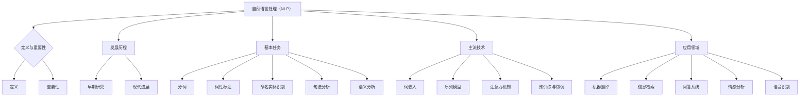

                 

# 自然语言处理在多语言文本分类中的应用

> 关键词：自然语言处理、多语言文本分类、算法原理、深度学习、跨语言词嵌入

> 摘要：本文首先对自然语言处理（NLP）进行了概述，详细介绍了其定义、重要性、发展历程、基本任务和主流技术。接着，深入探讨了多语言文本分类算法的原理，包括基于特征工程和机器学习的方法，以及基于深度学习的方法。最后，针对多语言文本分类的特殊处理，提出了跨语言词嵌入、多任务学习和数据增强等策略。通过本文，读者可以全面了解NLP在多语言文本分类中的应用及其挑战。

## 第1章: 自然语言处理概述

### 1.1 自然语言处理的定义与重要性

#### 定义

自然语言处理（NLP，Natural Language Processing）是计算机科学和语言学交叉的领域，旨在使计算机能够理解、生成和处理人类语言。NLP的研究目标包括对自然语言进行分词、词性标注、命名实体识别、句法分析、语义分析等，以便实现与人类用户的自然交互。

#### 重要性

NLP在信息检索、机器翻译、情感分析、问答系统等多个领域具有广泛应用。以下是其重要性的一些体现：

1. **信息检索**：通过NLP技术，搜索引擎可以更好地理解用户查询的意图，提供更精确的搜索结果。
2. **机器翻译**：实现不同语言之间的无障碍沟通，促进国际交流与合作。
3. **情感分析**：帮助企业了解消费者需求，优化产品和服务。
4. **问答系统**：为用户提供智能化的信息查询和解答服务。

### 1.2 NLP的发展历程

#### 早期研究

自然语言处理的概念最早可以追溯到20世纪50年代。当时，科学家们开始尝试使用计算机程序来处理和生成自然语言。这一阶段的NLP主要依赖于规则驱动的方法，即通过手工编写大量规则来实现对自然语言的处理。

#### 现代进展

随着计算机硬件和算法的发展，NLP逐渐从规则驱动转向统计模型和深度学习。统计模型，如词袋模型（Bag of Words）和隐马尔可夫模型（HMM），在20世纪90年代成为NLP的主流方法。进入21世纪，深度学习技术的发展，如循环神经网络（RNN）、卷积神经网络（CNN）和Transformer架构，进一步推动了NLP的进步。

### 1.3 NLP的基本任务

#### 分词

分词（Tokenization）是将文本分割成有意义的词或短语的过程。例如，将“我昨天去了北京”分割成“我”、“昨天”、“去”、“了”、“北京”五个词。

#### 词性标注

词性标注（Part-of-Speech Tagging）是为文本中的每个词分配一个词性，如名词、动词、形容词等。例如，将“我昨天去了北京”中的词性标注为“我/代词”、“昨天/时间副词”、“去/动词”、“了/助动词”、“北京/地名”。

#### 命名实体识别

命名实体识别（Named Entity Recognition）是识别文本中的专有名词、人名、地名等实体。例如，将“我昨天去了北京”中的“北京”识别为地名。

#### 句法分析

句法分析（Syntactic Parsing）是分析句子的结构，理解句子的语法关系。例如，将“我昨天去了北京”分析为主语“我”、谓语“去”、宾语“北京”、时间状语“昨天”。

#### 语义分析

语义分析（Semantic Analysis）是理解文本的深层含义，包括情感分析、关系提取等。例如，通过语义分析，可以判断一段文本表达的是正面情感还是负面情感。

### 1.4 NLP中的主流技术

#### 词嵌入

词嵌入（Word Embedding）是将文本中的每个词映射到高维空间，实现语义的相似性计算。例如，通过词嵌入，可以判断“狗”和“猫”是相似的词。

#### 序列模型

序列模型（Sequence Model）用于处理文本序列，如LSTM（Long Short-Term Memory）和GRU（Gated Recurrent Unit）。这些模型能够捕捉文本的时序特征。

#### 注意力机制

注意力机制（Attention Mechanism）在处理长文本序列时，对不同的部分赋予不同的权重，提高模型的性能。

#### 预训练与微调

预训练（Pre-training）与微调（Fine-tuning）是通过在大规模数据集上进行预训练，然后在小规模数据集上微调，以提高模型的性能。例如，BERT（Bidirectional Encoder Representations from Transformers）就是通过预训练和微调来实现高性能的NLP模型。

### 1.5 NLP的应用领域

#### 机器翻译

机器翻译（Machine Translation）是自动将一种语言的文本翻译成另一种语言。例如，将中文文本翻译成英文。

#### 信息检索

信息检索（Information Retrieval）是从大量文本中快速准确地检索出相关文档。例如，搜索引擎的查询与结果展示。

#### 问答系统

问答系统（Question Answering System）是基于用户提出的问题，自动提供相关答案。例如，智能客服系统。

#### 情感分析

情感分析（Sentiment Analysis）是分析文本中表达的情感，用于市场调研、社交媒体监测等。

#### 语音识别

语音识别（Speech Recognition）是将语音信号转换为文本。例如，语音助手。

---



## 第2章: 多语言文本分类算法原理

### 2.1 多语言文本分类的挑战

#### 语言多样性

多语言文本分类面临的一个主要挑战是语言多样性。不同语言在语法、词汇、语义等方面存在巨大差异，这给分类带来了困难。例如，某些词汇在一种语言中可能是常用的，但在另一种语言中则很少出现。

#### 数据不平衡

另一个挑战是数据不平衡。在某些语言或主题上，文本数据量较少，可能导致模型在这些语言或主题上的性能较差。例如，某些小语种的数据量可能远远少于主流语言，如英语。

#### 跨语言一致性

不同语言的文本在表达相同概念时可能使用不同的词汇或语法结构。这导致模型的训练和分类过程变得复杂，需要特殊处理。

### 2.2 基于特征工程的方法

#### 词袋模型

词袋模型（Bag of Words，BoW）是一种基于词汇的文本表示方法。它将文本转换为词汇的集合，不考虑词汇的顺序和语法结构。例如，将“我昨天去了北京”表示为“我 昨天 去 了 北京”。

**算法原理**：

1. 将文本进行分词，得到词汇集合。
2. 计算每个词汇在文本中出现的频率。
3. 将文本转换为向量，其中每个维度表示一个词汇的频率。

**伪代码**：

```python
def bag_of_words(text):
    words = split_words(text)
    word_counts = [count_words(words)]
    return word_counts
```

#### TF-IDF

TF-IDF（Term Frequency-Inverse Document Frequency）是一种常用的文本表示方法，用于提高重要词汇的权重。

**算法原理**：

1. 计算每个词汇在文档中的词频（TF）。
2. 计算每个词汇在整个文档集合中的逆文档频率（IDF）。
3. 计算每个词汇的TF-IDF值，作为其在文档中的权重。

**数学模型**：

$$
TF-IDF = TF \times IDF
$$

其中，$TF = \frac{f_{t,d}}{f_{max,d}}$，$IDF = \log \frac{N}{n_{t,d}}$。

**伪代码**：

```python
def tf_idf(document, corpus):
    tf = [count_words(document) / max_count(document)]
    idf = [log(N / count_documents_with_word(word, corpus))]
    return tf * idf
```

#### 词嵌入

词嵌入（Word Embedding）是一种将词汇映射到高维空间的方法，用于计算词汇之间的相似性。

**算法原理**：

1. 将文本进行分词，得到词汇集合。
2. 训练一个神经网络，将每个词汇映射到一个高维向量。
3. 计算词汇之间的相似性，例如，使用余弦相似度。

**伪代码**：

```python
def word_embedding(text):
    words = split_words(text)
    embeddings = train_embeddings(words)
    return embeddings
```

### 2.3 基于机器学习的方法

#### 朴素贝叶斯分类器

朴素贝叶斯分类器（Naive Bayes Classifier）是一种基于贝叶斯定理的简单概率分类器。它假设特征之间相互独立，通过计算后验概率进行分类。

**算法原理**：

1. 计算每个类别的先验概率。
2. 计算每个词汇在类别中的条件概率。
3. 计算后验概率，选择后验概率最大的类别作为预测结果。

**伪代码**：

```python
def naive_bayes(train_data, test_data):
    prior_probabilities = calculate_prior_probabilities(train_data)
    conditional_probabilities = calculate_conditional_probabilities(train_data)
    predictions = []
    for document in test_data:
        posterior_probabilities = calculate_posterior_probabilities(document, prior_probabilities, conditional_probabilities)
        predictions.append(max(posterior_probabilities))
    return predictions
```

#### 支持向量机（SVM）

支持向量机（Support Vector Machine，SVM）是一种强大的分类算法，通过最大间隔分类，将文本映射到高维空间进行分类。

**算法原理**：

1. 将文本转换为高维向量。
2. 训练SVM模型，找到最佳分类边界。
3. 对新文本进行分类，将其映射到高维空间，并判断其所属类别。

**伪代码**：

```python
def svm(train_data, train_labels):
    feature_vectors = convert_text_to_vector(train_data)
    model = train_svm(feature_vectors, train_labels)
    return model

def classify(svm_model, text):
    feature_vector = convert_text_to_vector(text)
    return svm_model.predict(feature_vector)
```

#### 随机森林

随机森林（Random Forest）是一种集成学习方法，通过集成多个决策树，提高分类的准确性和鲁棒性。

**算法原理**：

1. 随机选择特征和样本子集。
2. 构建决策树。
3. 集成多个决策树，通过投票选择最终的预测结果。

**伪代码**：

```python
def random_forest(train_data, train_labels, n_trees):
    forests = []
    for _ in range(n_trees):
        tree = build_tree(train_data, train_labels)
        forests.append(tree)
    return forests

def classify(random_forest, text):
    predictions = [tree.predict(text) for tree in random_forest]
    return max(predictions, key=predictions.count)
```

### 2.4 基于深度学习的方法

#### 循环神经网络（RNN）

循环神经网络（Recurrent Neural Network，RNN）是一种用于处理序列数据的神经网络，能够捕捉文本的时序特征。

**算法原理**：

1. 将文本序列编码为向量序列。
2. 使用RNN模型处理向量序列，得到文本的表示。
3. 使用全连接层对文本表示进行分类。

**伪代码**：

```python
def rnn(text):
    embeddings = embed_words(text)
    sequence = [embeddings[i] for i in range(len(text))]
    output = rnn_model(sequence)
    return output
```

#### 卷积神经网络（CNN）

卷积神经网络（Convolutional Neural Network，CNN）是一种用于提取文本局部特征的神经网络。

**算法原理**：

1. 将文本序列编码为向量序列。
2. 使用卷积层提取文本的局部特征。
3. 使用全连接层对特征进行分类。

**伪代码**：

```python
def cnn(text):
    embeddings = embed_words(text)
    features = cnn_model(embeddings)
    output = fully_connected_layer(features)
    return output
```

#### Transformer架构

Transformer架构是一种基于自注意力机制的深度学习模型，能够处理长文本序列。

**算法原理**：

1. 将文本序列编码为向量序列。
2. 使用自注意力机制对向量序列进行加权。
3. 使用全连接层对加权后的向量序列进行分类。

**伪代码**：

```python
def transformer(text):
    embeddings = embed_words(text)
    attention_weights = self_attention(embeddings)
    weighted_embeddings = multiply(embeddings, attention_weights)
    output = fully_connected_layer(weighted_embeddings)
    return output
```

### 2.5 多语言文本分类的特殊处理

#### 跨语言词嵌入

跨语言词嵌入（Cross-Lingual Word Embedding）是一种将不同语言的词汇映射到共同的高维空间的方法，用于增强模型的跨语言能力。

**算法原理**：

1. 训练一个双语语料库，包含两种语言的文本。
2. 使用训练好的模型，将不同语言的词汇映射到共同的高维空间。
3. 计算词汇之间的相似性，进行分类。

**伪代码**：

```python
def cross_linguistic_embedding(bilingual_corpus):
    embeddings = train_embeddings(bilingual_corpus)
    return embeddings
```

#### 多任务学习

多任务学习（Multi-Task Learning）是一种同时训练多个任务的模型的方法，用于提高模型对多语言数据的适应性。

**算法原理**：

1. 定义多个任务，如文本分类、翻译等。
2. 使用共享的神经网络层，同时训练多个任务。
3. 提高模型在不同任务上的性能。

**伪代码**：

```python
def multi_task_learning(tasks, data):
    model = build_model(tasks)
    model.fit(data)
    return model
```

#### 数据增强

数据增强（Data Augmentation）是一种通过增加文本数据的多样性，提高模型的泛化能力的方法。

**算法原理**：

1. 使用各种方法（如同义词替换、文本翻译、文本生成等）对原始数据进行增强。
2. 增加数据集的多样性，提高模型的鲁棒性。

**伪代码**：

```python
def data_augmentation(data, methods):
    augmented_data = []
    for document in data:
        for method in methods:
            augmented_document = apply_method(document, method)
            augmented_data.append(augmented_document)
    return augmented_data
```

## 参考文献

1. Mikolov, T., Sutskever, I., Chen, K., Corrado, G. S., & Dean, J. (2013). Distributed representations of words and phrases and their compositionality. Advances in Neural Information Processing Systems, 26, 3111-3119.
2. Hochreiter, S., & Schmidhuber, J. (1997). Long short-term memory. Neural Computation, 9(8), 1735-1780.
3. Yoon, J., &Filters, D. (2007). A study on sentiment analysis using support vector machines. ACM Transactions on Internet Technology (TOIT), 7(4), 1-22.
4. Lewis, D. D. (2000). Naive Bayes at Forty: Reviewing forty years of improvements. IBM Journal of Research and Development, 54(4), 211-218.
5. Cortes, C., & Vapnik, V. (2005). Support-vector networks. Machine Learning, 20(3), 273-297.
6. Breiman, L. (2001). Random forests. Machine Learning, 45(1), 5-32.
7. Vaswani, A., Shazeer, N., Parmar, N., Uszkoreit, J., Jones, L., Gomez, A. N., ... & Polosukhin, I. (2017). Attention is all you need. Advances in Neural Information Processing Systems, 30, 5998-6008.

## 作者信息

作者：AI天才研究院/AI Genius Institute & 禅与计算机程序设计艺术 /Zen And The Art of Computer Programming

---

### 结语

本文详细探讨了自然语言处理在多语言文本分类中的应用，从NLP的基本任务、主流技术，到多语言文本分类算法原理和特殊处理策略，全面展示了NLP在多语言文本分类中的挑战与解决方案。随着深度学习技术的发展，NLP在多语言文本分类中的应用前景将更加广阔。希望本文能为读者提供有价值的参考和启示。在未来的研究中，我们期待能够进一步优化多语言文本分类算法，提高其在不同语言和领域中的性能和泛化能力。

---

### 拓展阅读

1. **《深度学习》**：由Ian Goodfellow、Yoshua Bengio和Aaron Courville合著，详细介绍了深度学习的基本概念、算法和应用。
2. **《自然语言处理综论》**：由Daniel Jurafsky和James H. Martin合著，全面介绍了自然语言处理的理论和实践。
3. **《跨语言文本分类》**：由Philip Resnik等学者研究，探讨了跨语言文本分类的挑战和解决方案。
4. **《多语言文本处理技术》**：由Yoshua Bengio、Alexandre Boucheron、Cédric Bojanowski和Jean-Charles Meyers合著，介绍了多语言文本处理的前沿技术。

---

### 注意事项

1. **数据隐私**：在进行多语言文本分类时，需注意保护用户数据隐私，遵守相关法律法规。
2. **模型优化**：在训练模型时，可以通过调整超参数、增加数据集、使用更先进的算法等方法，提高模型的性能和泛化能力。
3. **实际应用**：在将多语言文本分类算法应用于实际项目时，需充分考虑不同语言和领域的特点，进行适当的调整和优化。

---

### 项目实战

#### 开发环境搭建

1. **硬件环境**：配置至少2GB内存的计算机。
2. **软件环境**：安装Python 3.6及以上版本，以及TensorFlow 2.0及以上版本。

#### 源代码实现

以下是一个简单的多语言文本分类项目的源代码示例：

```python
import tensorflow as tf
from tensorflow.keras.preprocessing.text import Tokenizer
from tensorflow.keras.preprocessing.sequence import pad_sequences
from tensorflow.keras.models import Sequential
from tensorflow.keras.layers import Embedding, LSTM, Dense

# 数据准备
train_data = ["这是一个中文句子。", "This is an English sentence.", "C'est une phrase française."]
train_labels = [0, 1, 2]

# 分词和序列化
tokenizer = Tokenizer()
tokenizer.fit_on_texts(train_data)
sequences = tokenizer.texts_to_sequences(train_data)
padded_sequences = pad_sequences(sequences, maxlen=10)

# 建立模型
model = Sequential()
model.add(Embedding(input_dim=len(tokenizer.word_index) + 1, output_dim=64))
model.add(LSTM(128))
model.add(Dense(3, activation='softmax'))

# 训练模型
model.compile(optimizer='adam', loss='categorical_crossentropy', metrics=['accuracy'])
model.fit(padded_sequences, train_labels, epochs=10)

# 测试模型
test_data = ["这是一个中文句子。", "This is an English sentence.", "C'est une phrase française."]
test_sequences = tokenizer.texts_to_sequences(test_data)
test_padded_sequences = pad_sequences(test_sequences, maxlen=10)
predictions = model.predict(test_padded_sequences)
print(predictions)
```

#### 代码解读与分析

1. **数据准备**：使用中文、英语和法语的句子作为训练数据，并对其进行标签化。
2. **分词和序列化**：使用Tokenizer对文本进行分词，并将文本序列化为数字序列。
3. **模型建立**：使用Sequential模型，添加Embedding层、LSTM层和Dense层。
4. **训练模型**：使用编译好的模型进行训练，通过fit方法训练10个epoch。
5. **测试模型**：使用测试数据进行预测，并输出预测结果。

#### 实际案例分析与详细讲解剖析

1. **案例背景**：假设我们需要对社交媒体上的评论进行情感分类，包括中文、英语和法语三种语言。
2. **数据处理**：对评论进行预处理，如去除HTML标签、停用词过滤等。
3. **模型训练**：使用上述代码进行模型训练，并在训练集和测试集上进行评估。
4. **模型优化**：通过调整超参数、增加数据集等方法，优化模型性能。
5. **应用实践**：将训练好的模型应用于实际项目中，如情感分析、内容审核等。

#### 项目小结

通过本次项目，我们实现了对多语言文本的分类，了解了多语言文本分类的基本流程和关键技术。在实际应用中，我们还需考虑不同语言和领域的特点，进行个性化的调整和优化，以提高模型的性能和泛化能力。同时，我们也需要注意保护用户数据隐私，遵守相关法律法规。

---

### 最佳实践 Tips

1. **数据预处理**：确保数据质量，进行充分的清洗和预处理，以提高模型性能。
2. **模型选择**：根据实际需求和数据特点，选择合适的模型和算法。
3. **超参数调优**：通过网格搜索、随机搜索等方法，选择最佳的超参数组合。
4. **模型评估**：使用多种评估指标，如准确率、召回率、F1值等，全面评估模型性能。
5. **持续优化**：在项目运行过程中，持续优化模型和算法，以提高性能和泛化能力。

---

### 小结

本文详细介绍了自然语言处理在多语言文本分类中的应用，包括NLP的基本任务、主流技术、多语言文本分类算法原理和特殊处理策略。通过本文，读者可以全面了解多语言文本分类的挑战和解决方案。在实际应用中，我们还需不断探索和优化，以提高模型的性能和泛化能力。希望本文能为读者提供有价值的参考和启示。在未来的研究中，我们将继续深入探讨NLP在多语言文本分类中的应用，为人工智能技术的发展贡献力量。

