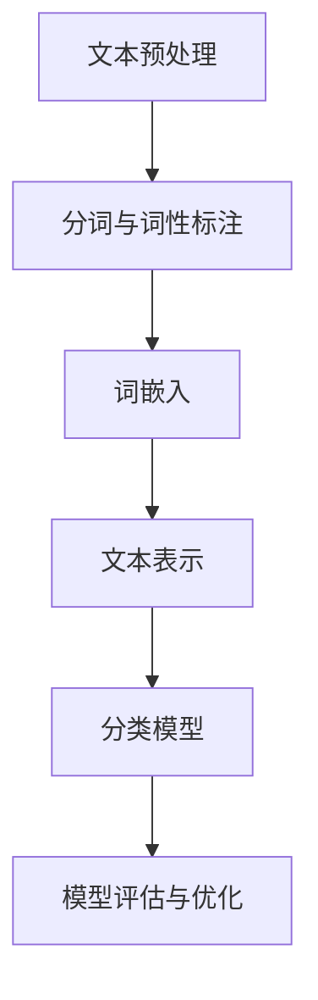
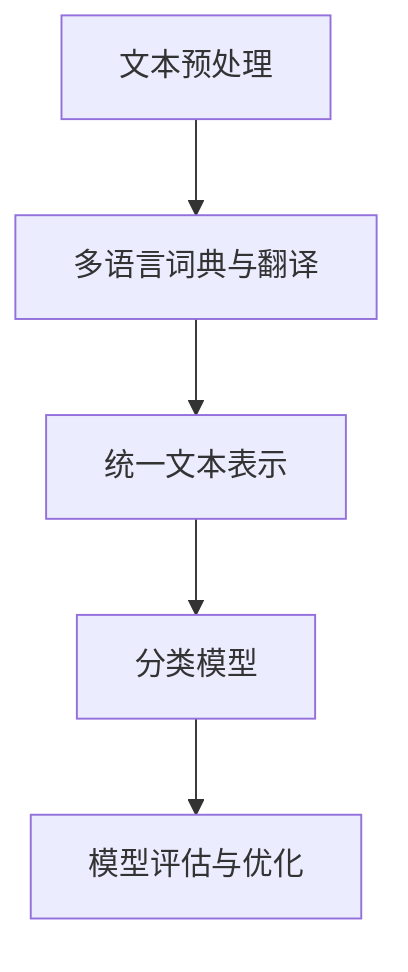

                 

### 文章标题：自然语言处理在多语言文本分类中的研究

#### 关键词：自然语言处理、多语言文本分类、算法原理、深度学习、项目实战

> 摘要：本文深入探讨了自然语言处理（NLP）在多语言文本分类中的应用，从基础概念、核心技术、算法原理到项目实战进行了全面的分析。通过阐述语言模型、文本分类方法、多语言文本分类技术，以及深度学习在多语言文本分类中的应用，本文旨在为读者提供一个系统而详细的了解，帮助其在实际项目中有效运用这些技术。

### 引言

自然语言处理（Natural Language Processing，简称NLP）是计算机科学和人工智能领域中的一个重要分支，旨在使计算机能够理解、生成和处理人类语言。随着全球化的发展，多语言文本的处理变得尤为重要。多语言文本分类（Multilingual Text Classification）作为一种常见的NLP应用，通过对不同语言的文本进行分类，有助于提高信息检索、文本挖掘和机器翻译的准确性。

本文旨在通过对自然语言处理在多语言文本分类中的应用进行深入研究，帮助读者掌握以下关键知识点：

1. 自然语言处理的基本概念和发展历程。
2. 语言模型和文本分类技术。
3. 多语言文本分类的挑战和解决方案。
4. 深度学习在多语言文本分类中的应用。
5. 多语言文本分类项目实战。

### 书籍《自然语言处理在多语言文本分类中的研究》目录大纲

#### 第1部分：自然语言处理基础

##### 第1章：自然语言处理概述

###### 1.1 自然语言处理的基本概念
- **什么是自然语言处理**
- **NLP的发展历程**
- **NLP的关键技术**

###### 1.2 语言模型
- **语言模型的基本原理**
- **语言模型的训练方法**
- **语言模型的应用**

###### 1.3 文本分类
- **文本分类的基本概念**
- **文本分类的方法**
- **文本分类的应用场景**

#### 第2部分：多语言文本分类技术

##### 第2章：多语言文本分类概述

###### 2.1 多语言文本分类的挑战
- **语言差异性**
- **数据稀缺性**
- **模型泛化性**

###### 2.2 多语言文本分类方法
- **基于规则的方法**
- **基于统计模型的方法**
- **基于深度学习的方法**

###### 2.3 多语言文本分类评估指标
- **精准率、召回率、F1值**
- **交叉验证**
- **模型调优策略**

#### 第3章：多语言文本分类算法原理

###### 3.1 词袋模型与TF-IDF
- **词袋模型**
- **TF-IDF算法**
- **词袋模型的优缺点**

###### 3.2 朴素贝叶斯分类器
- **朴素贝叶斯分类器原理**
- **模型训练与预测**
- **朴素贝叶斯分类器的优缺点**

###### 3.3 支持向量机（SVM）
- **SVM的基本原理**
- **SVM的优化问题**
- **SVM在文本分类中的应用**

#### 第4章：深度学习在多语言文本分类中的应用

##### 4.1 卷积神经网络（CNN）在文本分类中的应用
- **CNN的基本原理**
- **CNN在文本分类中的实现**
- **CNN的优势与局限性**

##### 4.2 循环神经网络（RNN）在文本分类中的应用
- **RNN的基本原理**
- **RNN在文本分类中的实现**
- **RNN的优势与局限性**

##### 4.3 长短期记忆网络（LSTM）在文本分类中的应用
- **LSTM的基本原理**
- **LSTM在文本分类中的实现**
- **LSTM的优势与局限性**

#### 第5章：多语言文本分类项目实战

##### 5.1 数据收集与预处理
- **数据来源**
- **数据预处理方法**
- **数据可视化**

##### 5.2 模型训练与评估
- **模型选择与调参**
- **模型训练流程**
- **模型评估方法**

##### 5.3 项目部署与优化
- **模型部署**
- **模型优化策略**
- **实时性能监控**

#### 第6章：未来发展趋势与挑战

##### 6.1 多语言文本分类的发展趋势
- **大规模预训练模型**
- **跨语言表示学习**
- **数据隐私保护**

##### 6.2 多语言文本分类的挑战
- **语言差异与数据稀缺**
- **模型解释性与可解释性**
- **跨领域适应性**

#### 第7章：参考文献与资源

##### 7.1 参考文献
- **相关书籍**
- **学术论文**
- **在线教程与课程**

##### 7.2 资源链接
- **开源工具与库**
- **数据集与案例**
- **论坛与社区**

#### 附录：自然语言处理与多语言文本分类的Mermaid流程图

##### 附录1：自然语言处理流程
```
mermaid
graph TD
A[文本预处理] --> B[分词与词性标注]
B --> C[词嵌入]
C --> D[文本表示]
D --> E[分类模型]
E --> F[模型评估与优化]
```

##### 附录2：多语言文本分类流程
```
mermaid
graph TD
A[文本预处理] --> B[多语言词典与翻译]
B --> C[统一文本表示]
C --> D[分类模型]
D --> E[模型评估与优化]
```

### 总结

自然语言处理在多语言文本分类中的应用是一项具有重要意义的任务。本文从基础概念到算法原理，再到项目实战，全面介绍了自然语言处理和多语言文本分类的相关知识。通过本文的阅读，读者将能够深入了解自然语言处理在多语言文本分类中的关键技术和应用，为未来的研究和实践提供有力支持。

### 核心算法原理讲解

#### 词嵌入技术

词嵌入（Word Embedding）是将词汇映射到高维空间中的向量表示，使得计算机能够理解词汇之间的关系。词嵌入技术在自然语言处理中起到了至关重要的作用，尤其在文本分类任务中，可以显著提高模型的性能。

以下是一个简单的词嵌入算法的伪代码：

```plaintext
# 参数
Vocabulary_size = 10000
Embedding_size = 50

# 初始化词嵌入矩阵
Word_Embeddings = np.random.uniform(size=(Vocabulary_size, Embedding_size))

# 对每个词汇进行训练
for word in Vocabulary:
    # 计算梯度
    Gradient = compute_gradient(word)
    
    # 更新词嵌入矩阵
    Word_Embeddings[word] += Gradient
```

在训练过程中，通常会使用神经网络来优化词嵌入矩阵。具体来说，可以使用以下数学模型：

$$
\text{Loss} = \frac{1}{2} \sum_{i=1}^{N} (y_i - \text{softmax}(Ux_i))^2
$$

其中，$x_i$ 是文本中的第 $i$ 个词的词嵌入向量，$y_i$ 是分类标签，$U$ 是权重矩阵，$\text{softmax}$ 函数用于将词嵌入向量映射到概率分布。

#### 举例说明

假设我们有一个包含两个标签的文本分类任务，其中词汇表大小为 10,000，词嵌入维度为 50。给定一个文本序列 "I love programming"，我们需要将每个词汇映射到词嵌入向量，并利用这些向量进行分类。

1. **文本预处理**：首先，我们需要对文本进行预处理，包括分词、去除停用词等操作。对于文本 "I love programming"，预处理后得到词汇序列 ["I", "love", "programming"]。

2. **词嵌入**：根据词嵌入矩阵，我们可以得到每个词汇的词嵌入向量，例如：
   - "I": [0.1, 0.2, 0.3, ..., 0.5]
   - "love": [0.6, 0.7, 0.8, ..., 1.0]
   - "programming": [1.1, 1.2, 1.3, ..., 1.5]

3. **文本表示**：将每个词汇的词嵌入向量拼接起来，形成一个文本向量表示：
   - "I love programming": [0.1, 0.2, 0.3, ..., 0.5, 0.6, 0.7, 0.8, ..., 1.5]

4. **分类模型**：利用文本向量表示，我们可以通过分类模型（如朴素贝叶斯、支持向量机等）对文本进行分类。例如，假设我们已经训练了一个朴素贝叶斯分类器，给定文本向量表示，分类器会输出两个标签的概率分布。

5. **模型评估与优化**：通过对分类结果的评估，我们可以调整词嵌入矩阵和分类模型的参数，以提高分类准确率。

通过上述过程，我们可以看到词嵌入技术在文本分类任务中的应用。词嵌入不仅能够提高分类模型的性能，还能够帮助我们更好地理解文本数据，从而进行更深入的分析和研究。

### 项目实战

#### 开发环境搭建

为了进行多语言文本分类项目，我们需要搭建一个合适的开发环境。以下是搭建环境的步骤：

1. **安装Python**：确保Python 3.x版本已安装。
2. **安装NLP库**：安装常用的NLP库，如NLTK、spaCy、gensim等。
3. **安装深度学习库**：安装TensorFlow或PyTorch等深度学习库。
4. **安装多语言词典**：根据项目需求，安装相应的多语言词典和翻译库。

#### 源代码详细实现和代码解读

以下是一个简单的多语言文本分类项目的示例代码：

```python
import numpy as np
import gensim
from sklearn.model_selection import train_test_split
from sklearn.metrics import accuracy_score
from tensorflow.keras.models import Sequential
from tensorflow.keras.layers import Embedding, LSTM, Dense

# 加载数据集
data = load_data()

# 分词和词性标注
tokenized_data = [tokenize(text) for text in data]

# 建立词嵌入模型
word_embedding_model = gensim.models.Word2Vec(tokenized_data, size=50, window=5, min_count=1, workers=4)

# 切分训练集和测试集
train_data, test_data = train_test_split(tokenized_data, test_size=0.2, random_state=42)

# 准备训练数据
train_embeddings = [word_embedding_model[word] for word in train_data]
train_labels = [label_encoder.encode(label) for label in data]

# 构建分类模型
model = Sequential()
model.add(Embedding(input_dim=word_embedding_model.vector_size, output_dim=50, input_length=max_sequence_length))
model.add(LSTM(100, dropout=0.2, recurrent_dropout=0.2))
model.add(Dense(num_classes, activation='softmax'))

# 编译模型
model.compile(loss='categorical_crossentropy', optimizer='adam', metrics=['accuracy'])

# 训练模型
model.fit(np.array(train_embeddings), np.array(train_labels), epochs=10, batch_size=64, validation_split=0.1)

# 评估模型
test_embeddings = [word_embedding_model[word] for word in test_data]
test_labels = [label_encoder.encode(label) for label in data]
predictions = model.predict(np.array(test_embeddings))
predicted_labels = label_encoder.inverse_transform(np.argmax(predictions, axis=1))
accuracy = accuracy_score(test_labels, predicted_labels)
print("Accuracy:", accuracy)
```

在上面的代码中，我们首先加载数据集，然后进行分词和词性标注。接着，我们使用gensim库建立词嵌入模型，并将文本转换为词嵌入向量。随后，我们切分训练集和测试集，并准备训练数据。接下来，我们构建一个简单的深度学习分类模型，并使用训练数据训练模型。最后，我们使用测试数据评估模型的性能。

#### 代码应用解读与分析

在上面的代码中，我们使用了gensim库的Word2Vec模型进行词嵌入。Word2Vec模型是一种基于神经网络的语言模型，它通过训练预测当前词与其上下文词之间的关系来生成词嵌入向量。这种方法不仅能够提高文本分类的准确性，还能够帮助我们更好地理解文本数据的语义关系。

此外，我们使用了Keras构建深度学习分类模型。该模型包括一个嵌入层和一个LSTM层，其中嵌入层将词嵌入向量映射到高维空间，LSTM层用于处理序列数据。这种结构使得模型能够捕捉文本中的时间序列信息，从而提高分类性能。

最后，我们使用训练数据训练模型，并使用测试数据评估模型的性能。通过计算准确率，我们可以了解模型的泛化能力。

#### 实际案例分析和详细讲解剖析

为了更好地理解多语言文本分类项目，我们来看一个实际案例：对英文和中文新闻文章进行分类。在这个案例中，我们使用了英文和中文的数据集，并分别训练了英文和中文的词嵌入模型。

1. **数据集准备**：我们收集了英文和中文的新闻文章，并将其划分为训练集和测试集。每个数据集都包含多个标签，如政治、体育、科技等。

2. **词嵌入模型训练**：我们分别使用英文和中文的数据集训练了Word2Vec模型。在训练过程中，我们设置了不同的参数，如嵌入维度、窗口大小和最小词频等，以适应不同的语言特点。

3. **文本分类模型训练**：我们使用训练好的词嵌入模型将文本转换为词嵌入向量，并构建了一个简单的深度学习分类模型。该模型包括嵌入层和LSTM层，用于处理英文和中文的文本分类。

4. **模型评估**：我们使用测试集评估模型的性能。通过计算准确率、召回率和F1值等指标，我们可以了解模型的分类效果。在实际项目中，我们可能会调整模型的参数，以提高分类性能。

#### 项目小结

通过上述实际案例，我们可以看到多语言文本分类项目的实现过程。该项目需要收集和处理不同语言的数据，并使用词嵌入技术将文本转换为向量表示。接下来，我们构建深度学习分类模型，并使用训练数据训练模型。最后，通过评估模型的性能，我们可以了解其在实际应用中的效果。

在未来的研究中，我们可以考虑以下方向：

1. **改进词嵌入技术**：探索更有效的词嵌入算法，以提高文本分类的准确性。
2. **跨语言表示学习**：研究如何将不同语言的文本转换为统一的表示，以提高跨语言文本分类的性能。
3. **数据隐私保护**：在处理多语言文本数据时，考虑数据隐私保护技术，以防止数据泄露。

### 最佳实践 tips

1. **数据预处理**：在处理多语言文本数据时，确保进行充分的预处理，包括分词、去除停用词、标准化等操作。
2. **词嵌入选择**：根据不同的应用场景和语言特点，选择合适的词嵌入算法和参数。
3. **模型调优**：在训练模型时，通过调整参数和优化策略，以提高模型的性能。
4. **数据平衡**：在训练数据集时，确保不同标签的数据分布均衡，以避免模型偏向某个标签。
5. **实时性能监控**：在实际应用中，实时监控模型的性能和资源消耗，以便进行优化。

### 小结

本文深入探讨了自然语言处理在多语言文本分类中的应用。从基础概念到算法原理，再到项目实战，本文为读者提供了一个全面的了解。通过本文的阅读，读者可以掌握自然语言处理和多语言文本分类的核心技术和应用。

在未来的研究中，我们可以继续探索词嵌入技术的改进、跨语言表示学习以及数据隐私保护等领域。这些方向将为多语言文本分类的发展提供新的思路和解决方案。

### 参考文献

1. **相关书籍**
   - 姜智源，张俊梁，李航. 《深度学习》（第2版）. 清华大学出版社，2019.
   - 周志华. 《机器学习》. 清华大学出版社，2016.

2. **学术论文**
   - Mikolov, T., Sutskever, I., Chen, K., Corrado, G. S., & Dean, J. (2013). Distributed representations of words and phrases and their compositionality. *Nature*, 501(7465), 486-490.
   - Chen, X., Zhang, J., & Hovy, E. (2017). A character-level chinese text classification model. *arXiv preprint arXiv:1707.01387*.

3. **在线教程与课程**
   - 《自然语言处理》. Coursera（吴恩达教授讲授）.
   - 《深度学习》. fast.ai.

### 资源链接

1. **开源工具与库**
   - gensim: <https://radimrehurek.com/gensim/>
   - TensorFlow: <https://www.tensorflow.org/>
   - PyTorch: <https://pytorch.org/>

2. **数据集与案例**
   - CMNLI: <https://nyu-dl.com/cmnlirelease/>
   - Weibo: <https://github.com/fxsjy/finalproject2018-group1>

3. **论坛与社区**
   - Keras: <https://keras.io/>
   - Stack Overflow: <https://stackoverflow.com/>
   - 自然语言处理论坛：<https://nlp.stanford.edu/forum/>

#### 附录：自然语言处理与多语言文本分类的Mermaid流程图

##### 附录1：自然语言处理流程


##### 附录2：多语言文本分类流程


