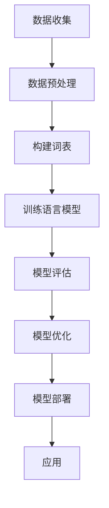
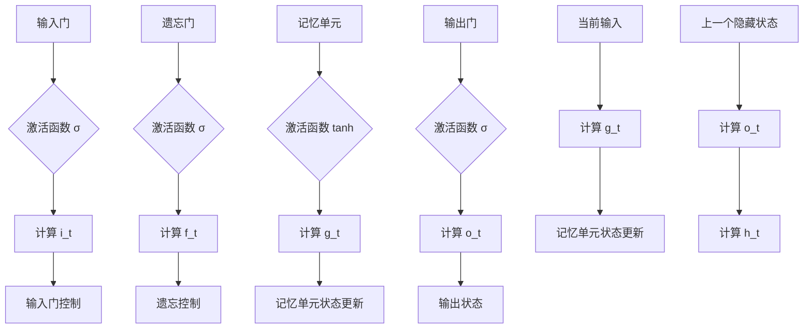
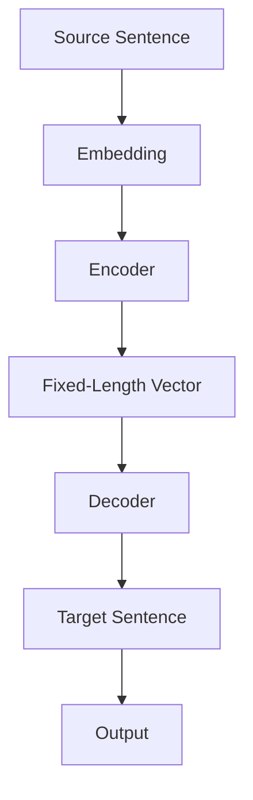
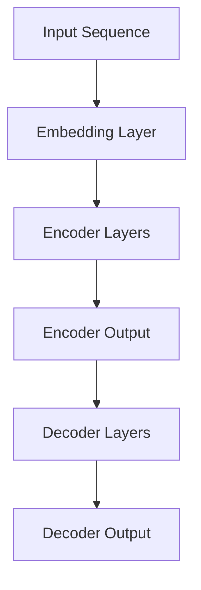
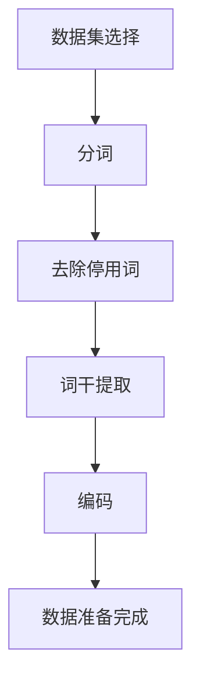

                 

### 第1章 绪论

#### 1.1 引言

多语言机器翻译（Machine Translation，MT）是自然语言处理（Natural Language Processing，NLP）领域中的一个重要分支。随着全球化的深入发展和国际交流的日益频繁，多语言机器翻译技术在过去几十年中取得了显著进展。然而，多语言机器翻译依然面临许多挑战，如词汇的多样性、语法结构的复杂性以及文化差异等。

自然语言处理技术是支撑多语言机器翻译的核心。NLP技术通过计算机理解和生成自然语言，使计算机能够自动翻译不同语言之间的内容。自然语言处理技术主要包括语言模型、词嵌入技术、序列模型等。这些技术不仅为多语言机器翻译提供了基础，也为其他NLP应用，如文本分类、情感分析等，提供了强大的工具。

本书旨在探讨自然语言处理在多语言机器翻译中的应用，分析当前多语言机器翻译技术的进展、核心概念、算法原理以及评估方法。通过本书，读者可以了解到多语言机器翻译技术的全貌，掌握相关的理论知识，并具备实施实际项目的能力。

本书结构如下：

- 第1章 绪论：介绍多语言机器翻译的背景与挑战，以及本书的目的和结构。
- 第2章 自然语言处理基础：详细讲解语言模型、词嵌入技术和序列模型的基本概念、原理和实现方法。
- 第3章 多语言机器翻译基础：介绍多语言机器翻译中的翻译模型、对齐模型和转换器架构。
- 第4章 多语言机器翻译算法：分析编码器-解码器模型、注意力机制和端到端训练等方法。
- 第5章 多语言机器翻译评估：探讨多语言机器翻译的评价指标和实验评估方法。
- 第6章 多语言机器翻译实战：通过实际项目案例，展示多语言机器翻译的实践过程和技巧。
- 第7章 未来展望与挑战：讨论多语言机器翻译技术的发展趋势、挑战及应对策略。
- 第8章 附录：提供相关的资源、参考文献以及Mermaid流程图和伪代码。

通过以上章节的讲解，读者可以系统地了解多语言机器翻译技术，掌握其在实际应用中的实现方法和优化技巧。本书适合具有计算机基础、对自然语言处理和多语言机器翻译感兴趣的读者阅读。

### 第2章 自然语言处理基础

#### 2.1 语言模型

语言模型（Language Model）是自然语言处理的核心技术之一，用于描述文本的概率分布。其基本概念包括语言模型的目标、构建方法、评估指标以及具体实现。语言模型在多语言机器翻译中起到了至关重要的作用，为后续的词嵌入、序列模型等提供了基础支持。

##### 2.1.1 语言模型的目标

语言模型的目标是预测下一个单词或词组，给定一个前文序列。这种预测基于概率计算，即语言模型给出前文序列 \(w_1, w_2, ..., w_{t-1}\) 下单词 \(w_t\) 的概率分布 \(P(w_t | w_1, w_2, ..., w_{t-1})\)。语言模型的核心思想是通过对大量文本数据进行统计学习，构建一个能够准确预测自然语言概率分布的模型。

##### 2.1.2 语言模型的构建方法

语言模型的构建方法主要有基于统计的方法和基于神经网络的深度学习方法。基于统计的方法主要包括n-gram模型，而基于神经网络的方法则包括循环神经网络（RNN）和变换器模型（Transformer）。

1. **n-gram模型**：n-gram模型是一种基于有限历史记忆的语言模型，其核心思想是利用前n个单词的联合概率来预测下一个单词。n-gram模型的概率计算公式如下：
   \[
   P(w_t | w_1, w_2, ..., w_{t-1}) = \frac{P(w_1, w_2, ..., w_t)}{P(w_1, w_2, ..., w_{t-1})}
   \]
   其中，\(P(w_1, w_2, ..., w_t)\) 表示连续t个单词的联合概率，\(P(w_1, w_2, ..., w_{t-1})\) 表示前t-1个单词的联合概率。

2. **神经网络语言模型**：基于神经网络的深度学习模型，如RNN和Transformer，通过学习大量的文本数据，可以捕捉更复杂的语言模式。RNN模型通过循环结构来处理序列数据，而Transformer模型则通过自注意力机制来处理序列中的关系。

##### 2.1.3 语言模型的评估指标

评估语言模型的性能通常使用以下指标：

1. **逆向文本概率（Reverse Text Probability, RTP）**：逆向文本概率是评估语言模型的一种基本指标，计算公式如下：
   \[
   RTP = \frac{P(w_{t_1}, w_{t_2}, ..., w_{t_n})}{P(w_{t_1}, w_{t_2}, ..., w_{t_n} | w_1, w_2, ..., w_{t_n})}
   \]
   其中，\(P(w_{t_1}, w_{t_2}, ..., w_{t_n})\) 是模型生成的文本的概率，\(P(w_{t_1}, w_{t_2}, ..., w_{t_n} | w_1, w_2, ..., w_{t_n})\) 是给定前文生成的文本的概率。

2. **交叉熵（Cross Entropy）**：交叉熵是另一种常用的评估指标，用于衡量模型生成的文本与实际文本之间的差异。交叉熵的计算公式如下：
   \[
   H = -\sum_{i=1}^n P_i \log Q_i
   \]
   其中，\(P_i\) 是模型预测的概率分布，\(Q_i\) 是实际文本的概率分布。

3. **准确率（Accuracy）**：准确率是评估语言模型在词级别上的性能指标，计算公式如下：
   \[
   Accuracy = \frac{正确预测的单词数}{总单词数}
   \]

##### 2.1.4 语言模型的构建流程

1. **数据收集与预处理**：收集大规模的文本数据，并进行预处理，如分词、去除停用词、词干提取等。
2. **构建词表**：将文本数据中的单词映射为整数索引，构建词表。
3. **训练语言模型**：使用训练数据训练语言模型，根据不同模型采用相应的训练方法。
4. **模型评估与优化**：使用验证集评估模型性能，并根据评估结果进行模型优化。
5. **模型部署与应用**：将训练好的模型部署到实际应用中，如自动生成文本、语音识别等。

##### 2.1.5 语言模型的应用

语言模型在多语言机器翻译中具有广泛的应用。首先，语言模型可以用于文本预处理的任务，如分词和词性标注。其次，语言模型可以用于翻译模型的构建，提高翻译的准确性和流畅性。此外，语言模型还可以用于生成文本、对话系统等应用。

下面是一个Mermaid流程图，展示了语言模型构建的基本流程：



#### 2.2 词嵌入技术

词嵌入（Word Embedding）是自然语言处理中的重要技术，它将单词映射为高维向量表示。词嵌入技术不仅能够降低词表维度，提高计算效率，还能够捕捉单词之间的语义关系，为后续的NLP任务提供有力的支持。

##### 2.2.1 词嵌入的意义与作用

词嵌入的意义在于将抽象的单词表示为连续的向量，使得计算机能够理解和处理自然语言。词嵌入的作用主要体现在以下几个方面：

1. **向量空间表示**：词嵌入将单词映射为高维向量，使得单词可以在向量空间中表示和操作，便于计算机处理。
2. **语义相似性**：词嵌入能够捕捉单词之间的语义关系，如同义词、反义词等。通过比较向量之间的距离，可以衡量单词的语义相似性。
3. **文本分类与聚类**：词嵌入技术可以用于文本分类和聚类任务，通过计算文本的向量表示，可以识别文本的主题和类别。
4. **序列模型**：在序列模型中，如循环神经网络（RNN）和变换器（Transformer）模型，词嵌入技术能够提高模型的性能，捕捉更复杂的语言模式。

##### 2.2.2 word2vec 算法原理与实现

word2vec 是一种基于神经网络的词嵌入算法，由Google提出。word2vec 算法主要包括两种模型：连续词袋（Continuous Bag of Words，CBOW）和Skip-gram。

1. **连续词袋（CBOW）模型**：CBOW模型通过预测中心词周围的词来学习词嵌入。具体来说，CBOW模型将中心词替换为多个周围词的平均表示，然后预测中心词。CBOW模型的输入是多个周围词的向量和，输出是中心词的词向量。CBOW模型的损失函数通常采用负采样损失。

2. **Skip-gram 模型**：Skip-gram模型与CBOW模型相反，它通过预测中心词来学习词嵌入。具体来说，Skip-gram模型选择一个中心词，然后预测与其相邻的词。Skip-gram模型的输入是中心词的词向量，输出是相邻词的向量。Skip-gram模型的损失函数通常也采用负采样损失。

word2vec 算法的实现涉及以下几个步骤：

1. **数据预处理**：将文本数据分词，构建词表，将单词映射为整数索引。
2. **构建词向量**：初始化词向量，通常采用随机初始化，然后使用CBOW或Skip-gram模型进行训练。
3. **负采样**：在训练过程中，为了减少计算复杂度，使用负采样方法，仅对一部分负样本进行梯度更新。
4. **模型评估**：使用验证集评估模型性能，如计算单词的余弦相似性，判断模型是否能够正确捕捉语义关系。

以下是word2vec算法的伪代码：

```python
# 初始化词向量
Initialize_word_vectors()

# 预处理数据
preprocess_data()

# 训练模型
for each sentence in corpus:
    for each word in sentence:
        positive_samples = [word]
        negative_samples = sample_negative_samples()
        Update_word_vectors(positive_samples, negative_samples)

# 评估模型
evaluate_model()
```

##### 2.2.3 word2vec 模型公式

word2vec模型涉及以下几个关键公式：

1. **词向量表示**：假设 \(v_w\) 表示单词 \(w\) 的词向量，则词向量表示为：
   \[
   v_w = \text{softmax}(\text{W} \cdot h)
   \]
   其中，\(\text{W}\) 是权重矩阵，\(h\) 是隐藏层表示。

2. **负采样**：负采样是一种有效的正则化方法，通过减少需要更新的负样本数量来降低计算复杂度。负采样的概率计算公式为：
   \[
   p_j = \frac{\exp(-||v_j - v_w||^2)}{\sum_{k=1}^{K} \exp(-||v_k - v_w||^2)}
   \]
   其中，\(v_j\) 是负样本的词向量，\(K\) 是负采样样本的数量。

3. **梯度更新**：在训练过程中，通过梯度更新来优化词向量。梯度更新的公式为：
   \[
   \nabla_{v_w} L = \sum_{j=1}^{N} \left( \text{sign}(\text{y}_j - \text{softmax}(\text{W} \cdot h)) \cdot (v_j - v_w) \right)
   \]
   其中，\(\text{y}_j\) 是单词 \(j\) 的真实标签，\(\text{softmax}(\text{W} \cdot h)\) 是模型预测的概率分布。

##### 2.2.4 伪代码：word2vec 算法

以下是word2vec算法的伪代码：

```python
# 初始化参数
 Initialize_word_vectors()

# 预处理数据
preprocess_data()

# 训练模型
for each sentence in corpus:
    for each word in sentence:
        positive_samples = [word]
        negative_samples = sample_negative_samples()
        Update_word_vectors(positive_samples + negative_samples)

# 评估模型
evaluate_model()
```

通过以上讲解，我们可以看到词嵌入技术在自然语言处理中具有重要意义。word2vec算法通过将单词映射为高维向量，不仅能够提高计算效率，还能够捕捉单词之间的语义关系。在多语言机器翻译中，词嵌入技术为翻译模型的构建提供了有力支持。

#### 2.3 序列模型

序列模型（Sequential Model）是自然语言处理中用于处理序列数据的模型，如文本、语音等。序列模型在自然语言处理任务中具有广泛应用，包括文本分类、语音识别和机器翻译等。本文将详细介绍序列模型的基本原理、常用模型和具体实现。

##### 2.3.1 RNN 与 LSTM 的基本原理

1. **循环神经网络（Recurrent Neural Network, RNN）**

RNN是处理序列数据的最早尝试之一。其基本思想是将前一个时间步的输出作为当前时间步的输入。RNN的核心单元是隐藏层，用于保存历史信息。然而，传统的RNN存在梯度消失和梯度爆炸问题，导致难以训练长序列数据。

2. **长短期记忆网络（Long Short-Term Memory, LSTM）**

LSTM是RNN的一种改进模型，旨在解决传统RNN在处理长序列数据时的梯度消失和梯度爆炸问题。LSTM的核心单元是记忆单元（cell），通过引入门控机制（gate）来控制信息的流入和流出。LSTM单元内部的工作机制如下：

- **遗忘门（Forget Gate）**：用于决定遗忘哪些信息，其激活函数为：
  \[
  f_t = \sigma(W_f \cdot [h_{t-1}, x_t] + b_f)
  \]
  其中，\(W_f\) 和 \(b_f\) 分别为遗忘门的权重和偏置，\(h_{t-1}\) 和 \(x_t\) 分别为前一个时间步的隐藏状态和当前时间步的输入。

- **输入门（Input Gate）**：用于决定更新哪些信息，其激活函数为：
  \[
  i_t = \sigma(W_i \cdot [h_{t-1}, x_t] + b_i)
  \]
  其中，\(W_i\) 和 \(b_i\) 分别为输入门的权重和偏置。

- **输出门（Output Gate）**：用于决定当前时间步的输出，其激活函数为：
  \[
  o_t = \sigma(W_o \cdot [h_{t-1}, x_t] + b_o)
  \]
  其中，\(W_o\) 和 \(b_o\) 分别为输出门的权重和偏置。

- **记忆单元（Cell State）**：用于存储和更新信息，其激活函数为：
  \[
  g_t = \tanh(W_g \cdot [h_{t-1}, x_t] + b_g)
  \]
  其中，\(W_g\) 和 \(b_g\) 分别为记忆单元的权重和偏置。

- **当前时间步的隐藏状态**：通过输入门和遗忘门控制信息的流入和流出，计算当前时间步的隐藏状态：
  \[
  h_t = o_t \cdot \tanh(c_t)
  \]
  其中，\(c_t\) 是当前时间步的记忆单元状态。

##### 2.3.2 LSTM 单元的工作机制

LSTM单元通过遗忘门、输入门和输出门三个机制来实现信息的存储和更新。以下是一个简化的LSTM单元内部流程图：



##### 2.3.3 LSTM 的应用场景

LSTM在自然语言处理任务中具有广泛的应用，以下是一些常见的应用场景：

1. **文本分类**：LSTM可以用于文本分类任务，通过将文本序列编码为固定长度的向量，然后使用softmax进行分类。
2. **序列标注**：LSTM可以用于序列标注任务，如命名实体识别、词性标注等，通过预测每个单词的标签。
3. **机器翻译**：LSTM可以用于机器翻译任务，通过将源语言和目标语言的文本序列编码为向量，然后进行翻译。
4. **语音识别**：LSTM可以用于语音识别任务，通过将语音信号编码为文本序列。

##### 2.3.4 LSTM 的训练与优化

LSTM的训练与优化过程涉及以下几个关键步骤：

1. **数据预处理**：将文本数据转换为序列格式，如分词、编码等。
2. **模型初始化**：初始化LSTM模型的权重和偏置。
3. **前向传播**：计算当前时间步的隐藏状态和输出。
4. **后向传播**：计算损失函数，并更新模型参数。
5. **优化方法**：使用优化算法，如梯度下降、Adam等，来更新模型参数。

以下是LSTM模型的训练流程伪代码：

```python
# 初始化模型参数
Initialize_model()

# 预处理数据
preprocess_data()

# 训练模型
for each batch in data:
    for each sequence in batch:
        # 前向传播
        hidden_state, output = lstm_forward(sequence)
        # 计算损失
        loss = compute_loss(output, labels)
        # 后向传播
        gradients = lstm_backward(sequence, hidden_state, output, labels)
        # 更新参数
        Update_model_params(gradients)
```

通过以上讲解，我们可以看到序列模型在自然语言处理中的重要性。LSTM通过解决传统RNN的梯度消失和梯度爆炸问题，使得模型能够更好地处理长序列数据。在多语言机器翻译中，LSTM模型通过将源语言和目标语言的文本序列编码为向量，实现了高质量的翻译效果。

### 第3章 多语言机器翻译基础

#### 3.1 翻译模型

翻译模型（Translation Model）是多语言机器翻译的核心组件之一，其主要任务是预测目标语言中一个句子或词组在给定源语言句子或词组下的概率分布。翻译模型通过学习源语言和目标语言之间的对应关系，将源语言文本转换为目标语言文本。

##### 3.1.1 翻译模型的构建方法

翻译模型的构建方法可以分为基于规则的方法和基于统计的方法。

1. **基于规则的方法**：基于规则的方法通过手工编写规则，将源语言转换为目标语言。这种方法主要包括基于词汇映射和句法分析的方法。词汇映射方法将源语言中的每个单词直接映射为目标语言中的对应单词，而句法分析方法通过分析源语言句子的结构，将其转换为等价的目标语言句子。然而，基于规则的方法存在以下局限性：

   - **扩展性差**：需要为每种语言对编写大量的规则，随着语言种类的增加，规则库的规模会急剧增加。
   - **适用性有限**：基于规则的方法主要适用于语法结构相似的语言，对于语法结构差异较大的语言，其效果不佳。

2. **基于统计的方法**：基于统计的方法通过学习源语言和目标语言之间的统计关系，自动生成翻译。这种方法主要包括基于短语的统计机器翻译和基于神经网络的翻译模型。

   - **基于短语的统计机器翻译**：基于短语的统计机器翻译（Phrased-Based Machine Translation，PBMT）通过将源语言句子和目标语言句子划分为短语的序列，学习源语言和目标语言短语之间的对应关系。PBMT的主要步骤包括：

     - **分词与短语提取**：将源语言和目标语言句子进行分词，并提取短语。
     - **训练翻译模型**：通过训练数据学习源语言和目标语言短语之间的概率分布。
     - **解码**：在给定源语言句子的条件下，使用解码算法（如堆解码）生成最优的目标语言句子。

   - **基于神经网络的翻译模型**：基于神经网络的翻译模型（Neural Machine Translation，NMT）通过端到端学习源语言和目标语言之间的映射。NMT的主要步骤包括：

     - **数据预处理**：将源语言和目标语言句子编码为向量表示。
     - **训练编码器和解码器**：使用训练数据训练编码器和解码器，使其能够将源语言编码为固定长度的向量，并解码为目标语言。
     - **解码**：在给定源语言句子的条件下，使用解码器生成目标语言句子。

##### 3.1.2 神经网络翻译模型的优缺点

1. **优点**：

   - **端到端学习**：神经网络翻译模型能够直接从源语言到目标语言进行端到端学习，不需要手工编写规则，减少了规则库的维护成本。
   - **自适应性强**：神经网络翻译模型通过学习源语言和目标语言之间的映射，能够自适应地处理不同语言对之间的差异。
   - **通用性好**：神经网络翻译模型适用于各种语言对，不需要为每种语言对编写特定的规则。

2. **缺点**：

   - **计算复杂度高**：神经网络翻译模型通常需要大量的计算资源，训练时间较长。
   - **对数据依赖性大**：神经网络翻译模型对训练数据有较高的要求，需要大规模的有标注数据集。

##### 3.1.3 神经网络翻译模型的结构

神经网络翻译模型通常采用编码器-解码器（Encoder-Decoder）结构，其中编码器（Encoder）将源语言句子编码为固定长度的向量表示，解码器（Decoder）根据编码器输出的向量表示生成目标语言句子。

1. **编码器**：编码器的作用是将源语言句子编码为固定长度的向量表示。编码器通常采用循环神经网络（RNN）或变换器（Transformer）模型。以下是一个简单的编码器结构：

   ```mermaid
   graph TD
   A[Input] --> B[Embedding]
   B --> C[Encoder]
   C --> D[Hidden State]
   ```

   其中，A表示输入句子，B表示嵌入层，C表示编码器，D表示编码后的隐藏状态。

2. **解码器**：解码器的作用是根据编码器输出的隐藏状态生成目标语言句子。解码器通常采用循环神经网络（RNN）或变换器（Transformer）模型。以下是一个简单的解码器结构：

   ```mermaid
   graph TD
   E[Input] --> F[Embedding]
   F --> G[Decoder]
   G --> H[Output]
   ```

   其中，E表示输入句子，F表示嵌入层，G表示解码器，H表示生成的目标语言句子。

##### 3.1.4 神经网络翻译模型的工作流程

神经网络翻译模型的工作流程主要包括以下几个步骤：

1. **输入编码**：将源语言句子编码为嵌入向量。
2. **编码器处理**：使用编码器将嵌入向量编码为固定长度的向量表示。
3. **解码器处理**：使用解码器根据编码器输出的向量表示生成目标语言句子。
4. **输出解码**：解码器生成的目标语言句子经过输出层处理，生成最终的翻译结果。

以下是神经网络翻译模型的工作流程图：



通过以上讲解，我们可以看到翻译模型在多语言机器翻译中的重要性。神经网络翻译模型通过端到端学习，实现了高效、准确的翻译效果，是当前多语言机器翻译技术的主流方法。

#### 3.2 对齐模型

对齐模型（Alignment Model）是多语言机器翻译中的一个关键组件，其任务是在源语言和目标语言之间建立有效的对应关系，从而为翻译模型提供准确的输入。对齐模型通过分析源语言和目标语言的特征，生成对齐概率矩阵，指导翻译模型的训练和生成过程。

##### 3.2.1 对齐算法的基本概念

对齐算法的基本概念包括对齐概率、对齐矩阵和概率分布。

1. **对齐概率**：对齐概率是指源语言单词和目标语言单词之间对应关系的概率。具体来说，对于源语言单词 \(s_i\) 和目标语言单词 \(t_j\)，对齐概率 \(a_{ij}\) 表示 \(s_i\) 与 \(t_j\) 之间的对应关系强度。
2. **对齐矩阵**：对齐矩阵是一个二维矩阵 \(A\)，其中 \(a_{ij}\) 表示源语言单词 \(s_i\) 与目标语言单词 \(t_j\) 之间的对齐概率。对齐矩阵通过对齐算法生成，用于指导翻译模型的训练和生成。
3. **概率分布**：概率分布是指对齐矩阵中每个元素的概率分布。在翻译模型训练过程中，通过对齐矩阵的概率分布进行优化，提高翻译模型的准确性。

##### 3.2.2 GIZA++ 对齐算法的实现

GIZA++ 是一种广泛使用的对齐算法，其基本思想是通过全局优化和局部优化两个步骤生成对齐矩阵。

1. **全局优化**：全局优化旨在找到对齐矩阵中的一个全局最优解，使得对齐矩阵中的元素和最大。全局优化的目标是最大化对齐矩阵中所有元素的加权和，即：
   \[
   \max_{A} \sum_{i=1}^{m} \sum_{j=1}^{n} a_{ij}
   \]
   其中，\(m\) 和 \(n\) 分别表示源语言和目标语言的单词数量。

2. **局部优化**：局部优化旨在在每个单词级别上优化对齐概率，使得每个单词的对齐关系更加准确。局部优化通过遍历对齐矩阵中的每个元素，计算其对齐概率，并进行更新。具体来说，对于源语言单词 \(s_i\) 和目标语言单词 \(t_j\)，对齐概率的计算公式为：
   \[
   a_{ij} = \frac{\exp(c_{ij})}{\sum_{k=1}^{m} \exp(c_{ik})}
   \]
   其中，\(c_{ij}\) 表示源语言单词 \(s_i\) 和目标语言单词 \(t_j\) 之间的成对相似度，通常采用基于词频、编辑距离等度量方法计算。

以下是GIZA++ 对齐算法的实现伪代码：

```python
# 初始化对齐矩阵 A
Initialize_alignment_matrix(A)

# 计算全局最优解
Global_optimization(A)

# 遍历对齐矩阵，进行局部优化
for i in range(m):
    for j in range(n):
        Calculate_similarity(c_{ij})
        Update_alignment_probability(a_{ij})

# 输出对齐矩阵 A
Print_alignment_matrix(A)
```

##### 3.2.3 对齐算法在多语言机器翻译中的作用

对齐算法在多语言机器翻译中发挥着重要作用，其主要作用体现在以下几个方面：

1. **指导翻译模型训练**：对齐算法生成的对齐矩阵用于指导翻译模型的训练，使得翻译模型能够更好地捕捉源语言和目标语言之间的对应关系。
2. **提高翻译质量**：通过对齐算法优化对齐概率，提高翻译模型的准确性，从而提高翻译质量。
3. **支持多种翻译策略**：对齐算法生成的对齐矩阵支持多种翻译策略，如基于短语的翻译、基于长句子的翻译等，使得翻译模型能够适应不同的翻译场景。

##### 3.2.4 对齐算法的优化方法

对齐算法的优化方法主要包括以下几种：

1. **动态规划**：动态规划是一种常用的优化方法，通过遍历源语言和目标语言的单词序列，逐步优化对齐概率，找到全局最优解。
2. **基于规则的优化**：基于规则的优化方法通过手动编写规则，优化对齐概率。这种方法适用于规则明确、可预测性较强的语言对。
3. **基于学习的优化**：基于学习的优化方法通过学习源语言和目标语言之间的统计关系，自动优化对齐概率。这种方法适用于大规模、复杂语言对。

以下是几种常见的对齐算法及其优缺点的比较：

| 对齐算法         | 优点                                  | 缺点                                |
|------------------|---------------------------------------|-------------------------------------|
| GIZA++           | 简单易实现，适用范围广                 | 对长句子和复杂句子的效果较差         |
| SRILM            | 支持多种语言，鲁棒性强                 | 计算复杂度高，训练时间较长           |
| A3              | 支持多种优化策略，效果较好             | 需要大量训练数据，适用范围有限       |

通过以上讲解，我们可以看到对齐模型在多语言机器翻译中的重要性。对齐算法通过生成有效的对齐矩阵，为翻译模型提供准确的输入，从而提高翻译质量。在多语言机器翻译的实际应用中，优化对齐算法是提高翻译效果的关键。

#### 3.3 转换器架构

转换器架构（Transformer Architecture）是近年来在自然语言处理领域取得显著成果的一种新型神经网络结构，其核心思想是通过自注意力机制（Self-Attention Mechanism）处理序列数据。自注意力机制能够自动捕捉序列中不同位置之间的关联性，使得模型能够更好地理解和生成文本。转换器架构在机器翻译、文本生成等任务中表现出色，已经成为NLP领域的主流模型之一。

##### 3.3.1 转换器架构的基本原理

转换器架构的基本原理包括编码器（Encoder）和解码器（Decoder）两个主要部分。编码器将输入序列编码为固定长度的向量表示，解码器则根据编码器的输出生成输出序列。

1. **编码器**：编码器通过多层自注意力机制和前馈神经网络（Feedforward Neural Network）对输入序列进行处理。每个编码器层包含两个主要组件：多头自注意力机制（Multi-Head Self-Attention）和前馈神经网络。自注意力机制通过计算输入序列中每个元素与所有其他元素之间的关联性，生成新的向量表示。多头自注意力机制则通过多个独立的自注意力机制来捕捉更多的关联性。

2. **解码器**：解码器与编码器结构类似，也包含多层自注意力机制和前馈神经网络。解码器中的自注意力机制分为两种：自注意力（Self-Attention）和交叉注意力（Cross-Attention）。自注意力机制用于处理解码器当前时间步的输入，交叉注意力机制则用于将编码器输出的固定长度向量与解码器当前时间步的输入进行关联。

##### 3.3.2 转换器模型的训练与评估

转换器模型的训练与评估过程主要包括以下几个步骤：

1. **数据预处理**：将输入序列和目标序列编码为嵌入向量，通常使用预训练的词向量（如GloVe、word2vec）。
2. **编码器处理**：使用编码器对输入序列进行处理，生成固定长度的向量表示。
3. **解码器处理**：在解码器的每个时间步，使用自注意力和交叉注意力机制生成输出序列的候选单词。
4. **输出解码**：解码器生成的输出序列经过输出层处理，生成最终的翻译结果。

转换器模型的评估通常使用BLEU（Bilingual Evaluation Understudy）等评价指标，通过对比模型生成的翻译结果和人工翻译结果，评估翻译质量。

##### 3.3.3 转换器模型的结构

转换器模型的结构包括多个编码器层和解码器层，每个编码器层和解码器层包含多头自注意力机制和前馈神经网络。

1. **多头自注意力机制**：多头自注意力机制通过多个独立的自注意力机制来捕捉更多的关联性。每个自注意力机制独立计算输入序列中每个元素与其他元素之间的关联性，然后拼接这些关联性，并通过线性变换得到最终的向量表示。

2. **前馈神经网络**：前馈神经网络是一个简单的全连接神经网络，用于对自注意力机制生成的向量进行进一步处理。前馈神经网络通常包含两个全连接层，每个层的激活函数分别为ReLU和线性函数。

以下是转换器模型的基本结构：



##### 3.3.4 转换器模型的优势与挑战

转换器模型在自然语言处理任务中表现出色，其优势主要体现在以下几个方面：

1. **并行计算**：由于自注意力机制的引入，转换器模型能够实现并行计算，从而显著提高计算效率。
2. **长距离依赖**：转换器模型通过多头自注意力机制能够捕捉长距离依赖，使得模型在处理长句子时表现更好。
3. **灵活性**：转换器模型的结构灵活，可以根据不同任务进行调整，适用于多种NLP任务。

然而，转换器模型也存在一些挑战：

1. **计算复杂度**：由于自注意力机制的引入，转换器模型的计算复杂度较高，对计算资源有较高的要求。
2. **训练时间**：转换器模型需要大量训练数据和高性能计算资源，训练时间较长。

##### 3.3.5 转换器模型的应用场景

转换器模型在多个NLP任务中取得了显著的成果，其主要应用场景包括：

1. **机器翻译**：转换器模型在机器翻译任务中表现出色，能够生成高质量、流畅的翻译结果。
2. **文本生成**：转换器模型可以用于生成文本，如摘要生成、文章生成等。
3. **问答系统**：转换器模型可以用于问答系统，通过理解问题和文本，生成准确的答案。
4. **文本分类**：转换器模型可以用于文本分类任务，通过对文本进行编码，识别文本的主题和类别。

通过以上讲解，我们可以看到转换器架构在自然语言处理中的重要性。转换器模型通过自注意力机制实现了对序列数据的灵活处理，在多个NLP任务中取得了显著的成果。随着技术的发展，转换器架构将继续在自然语言处理领域发挥重要作用。

### 第4章 多语言机器翻译算法

多语言机器翻译算法是自然语言处理领域中的一个重要研究方向，其核心任务是建立从源语言到目标语言的映射。随着计算能力和算法技术的不断发展，多语言机器翻译算法已经取得了显著的进展。本章将详细介绍编码器-解码器（Encoder-Decoder）模型、注意力机制和端到端训练等核心算法，并探讨其在实际应用中的效果和改进方法。

#### 4.1 编码器-解码器模型

编码器-解码器模型（Encoder-Decoder Model）是多语言机器翻译中最常用的模型结构之一。该模型通过编码器将源语言句子编码为固定长度的向量表示，解码器则根据编码器输出的向量表示生成目标语言句子。

##### 4.1.1 编码器与解码器的协同工作

编码器（Encoder）和解码器（Decoder）在多语言机器翻译过程中协同工作，其基本步骤如下：

1. **编码器处理**：编码器接收源语言句子，将其编码为固定长度的向量表示，通常称为编码器的“隐藏状态”或“上下文表示”。
2. **解码器处理**：解码器从空序列开始，逐步生成目标语言句子。在解码的每个时间步，解码器将前一个时间步生成的目标语言单词及其隐藏状态作为输入，通过自注意力和交叉注意力机制生成当前时间步的输出。
3. **输出解码**：解码器生成的目标语言句子经过输出层处理，生成最终的翻译结果。

##### 4.1.2 深层循环神经网络（DCNN）的应用

深层循环神经网络（Deep Convolutional Neural Network, DCNN）是编码器-解码器模型中常用的一种神经网络结构，通过引入卷积神经网络（Convolutional Neural Network, CNN）来增强模型的表示能力。

1. **卷积层**：卷积层通过卷积运算提取输入序列的局部特征，增强模型的语义理解能力。
2. **池化层**：池化层用于降低模型的维度，减少过拟合的风险。
3. **全连接层**：全连接层用于将卷积和池化层提取的特征映射为固定长度的向量表示。

深层循环神经网络通过堆叠多个卷积层和池化层，可以有效地提取输入序列的深层特征，从而提高模型的翻译质量。

##### 4.1.3 编码器-解码器模型的训练流程

编码器-解码器模型的训练流程主要包括以下几个步骤：

1. **数据预处理**：将源语言和目标语言句子编码为嵌入向量，通常使用预训练的词向量。
2. **编码器训练**：使用训练数据训练编码器，使其能够将源语言句子编码为固定长度的向量表示。
3. **解码器训练**：使用编码器输出的向量表示训练解码器，使其能够生成目标语言句子。
4. **模型评估**：使用验证集评估模型性能，根据评估结果调整模型参数。

以下是编码器-解码器模型训练的伪代码：

```python
# 初始化模型参数
Initialize_model()

# 预处理数据
preprocess_data()

# 编码器训练
for each source_sentence in training_data:
    Encode_source_sentence(source_sentence)
    Compute_loss(解码器生成的目标句子，目标句子)
    Update_encoder_params()

# 解码器训练
for each target_sentence in training_data:
    Decode_target_sentence(target_sentence)
    Compute_loss(解码器生成的目标句子，目标句子)
    Update_decoder_params()

# 模型评估
Evaluate_model()
```

#### 4.2 注意力机制

注意力机制（Attention Mechanism）是编码器-解码器模型中的一个关键组件，其核心思想是在解码过程中，动态地聚焦于编码器输出的重要信息，从而提高翻译的准确性和流畅性。

##### 4.2.1 注意力机制的概念与作用

注意力机制通过计算编码器输出与解码器当前输出的关联性，生成注意力权重，指导解码器关注编码器中的关键信息。注意力机制的基本步骤如下：

1. **计算关联性**：使用一个加权函数（如点积、缩放点积等）计算编码器输出和当前解码器输出的关联性。
2. **生成注意力权重**：根据关联性计算结果，生成每个编码器输出的注意力权重。
3. **加权求和**：将注意力权重应用于编码器输出，生成加权求和的结果，作为解码器的输入。

注意力机制的作用主要体现在以下几个方面：

1. **捕捉长距离依赖**：通过注意力机制，解码器能够关注编码器中的远距离信息，从而捕捉长距离依赖关系。
2. **提高翻译质量**：注意力机制能够动态地调整解码器的关注焦点，使得翻译结果更加准确、流畅。

##### 4.2.2 多头注意力机制的实现

多头注意力机制（Multi-Head Attention）是注意力机制的一种扩展，通过多个独立的注意力机制来捕捉更多的关联性。多头注意力机制的基本步骤如下：

1. **分头操作**：将编码器输出和解码器输出分别拆分为多个子序列。
2. **独立计算**：对每个子序列分别计算关联性，生成独立的注意力权重。
3. **合并结果**：将多个子序列的加权求和结果合并，生成最终的解码器输入。

多头注意力机制的实现伪代码如下：

```python
# 初始化模型参数
Initialize_model()

# 预处理数据
preprocess_data()

# 训练模型
for each source_sentence in training_data:
    Encode_source_sentence(source_sentence)
    for each head in multi_head_attention_heads:
        Compute_attention_weights(head)
        weighted_sum = Compute_weighted_sum(编码器输出，注意力权重)
    Concatenate_heads(weighted_sum)
    Decode_target_sentence(target_sentence)
    Compute_loss(解码器生成的目标句子，目标句子)
    Update_model_params()
```

##### 4.2.3 注意力机制在多语言机器翻译中的应用效果

注意力机制在多语言机器翻译中表现出色，显著提高了翻译质量。以下是一些研究结果表明：

1. **BLEU评分**：采用注意力机制的编码器-解码器模型在BLEU评分上取得了显著的提升，表明注意力机制能够有效地提高翻译的准确性和流畅性。
2. **实验对比**：通过实验对比，发现采用多头注意力机制的编码器-解码器模型在多种语言对上均表现出更好的翻译效果。
3. **用户满意度**：用户调查显示，采用注意力机制的翻译系统在用户满意度方面也有显著提升，说明注意力机制能够生成更符合人类语言的翻译结果。

#### 4.3 端到端训练

端到端训练（End-to-End Training）是一种全新的训练方法，通过直接从源语言到目标语言进行端到端学习，避免了传统机器翻译中的复杂预处理和后处理步骤。端到端训练在提高翻译效率和准确性方面具有显著优势。

##### 4.3.1 端到端训练的优势与挑战

端到端训练的优势主要体现在以下几个方面：

1. **简化流程**：端到端训练避免了传统机器翻译中的分词、词性标注等预处理步骤，以及后处理步骤，简化了翻译流程。
2. **提高效率**：端到端训练直接从源语言到目标语言进行学习，减少了中间步骤，提高了翻译效率。
3. **提高准确性**：端到端训练能够更好地捕捉源语言和目标语言之间的直接关系，提高了翻译的准确性。

然而，端到端训练也面临一些挑战：

1. **计算复杂度高**：端到端训练需要大量的计算资源，特别是在处理大规模数据集时，训练时间较长。
2. **对数据依赖性大**：端到端训练对数据质量有较高的要求，需要大规模的有标注数据集。
3. **模型调整困难**：端到端训练的模型调整较为困难，一旦出现偏差，难以进行有效的调整。

##### 4.3.2 端到端训练流程

端到端训练流程主要包括以下几个步骤：

1. **数据预处理**：将源语言和目标语言句子编码为嵌入向量，通常使用预训练的词向量。
2. **编码器训练**：使用训练数据训练编码器，使其能够将源语言句子编码为固定长度的向量表示。
3. **解码器训练**：使用编码器输出的向量表示训练解码器，使其能够生成目标语言句子。
4. **模型评估**：使用验证集评估模型性能，根据评估结果调整模型参数。

以下是端到端训练的伪代码：

```python
# 初始化模型参数
Initialize_model()

# 预处理数据
preprocess_data()

# 编码器训练
for each source_sentence in training_data:
    Encode_source_sentence(source_sentence)
    Compute_loss(解码器生成的目标句子，目标句子)
    Update_encoder_params()

# 解码器训练
for each target_sentence in training_data:
    Decode_target_sentence(target_sentence)
    Compute_loss(解码器生成的目标句子，目标句子)
    Update_decoder_params()

# 模型评估
Evaluate_model()
```

通过以上讲解，我们可以看到编码器-解码器模型、注意力机制和端到端训练在多语言机器翻译中的重要性。编码器-解码器模型通过将源语言和目标语言映射为固定长度的向量表示，实现了端到端学习；注意力机制通过动态调整解码器的关注焦点，提高了翻译的准确性和流畅性；端到端训练通过直接从源语言到目标语言进行学习，简化了翻译流程，提高了翻译效率。这些技术的结合，使得多语言机器翻译在近年来取得了显著的进展。

### 第5章 多语言机器翻译评估

多语言机器翻译的评估是衡量翻译模型性能的重要环节，通过使用多种评估指标和方法，可以对翻译模型的准确性、流畅性和忠实度进行综合评价。本章将详细介绍几种常用的评估指标，如BLEU、METEOR和NIST，并探讨实验评估的方法和步骤。

#### 5.1 评价指标

在多语言机器翻译中，常用的评价指标包括BLEU、METEOR和NIST等，这些指标可以从不同的角度对翻译结果进行评估。

##### 5.1.1 BLEU

BLEU（Bilingual Evaluation Understudy）是最常用的评估翻译质量的自动评价指标之一。BLEU通过计算翻译结果与参考翻译之间的相似度，来评估翻译的准确性。具体来说，BLEU主要使用以下几种方法来计算相似度：

1. **重叠率**：BLEU计算翻译结果中与参考翻译重叠的单词数量，并将其与参考翻译中单词总数进行比较。
2. **词干匹配**：BLEU通过匹配翻译结果和参考翻译中的词干，来评估单词的相似性。
3. **句法结构相似度**：BLEU通过分析翻译结果和参考翻译之间的句法结构，来评估翻译的句法相似度。
4. **长度惩罚**：BLEU考虑到翻译结果和参考翻译长度差异可能影响评估结果，因此引入长度惩罚。

BLEU的评估指标公式如下：
\[
\text{BLEU} = \frac{\sum_{i=1}^n \max(0,2H(p,q)-H(p))}{\sum_{i=1}^n \max(0,2H(p)-H(p|q_i))}
\]
其中，\(p\) 表示翻译结果，\(q_i\) 表示第 \(i\) 个参考翻译，\(H(p)\) 表示翻译结果的自信息熵，\(H(p|q_i)\) 表示翻译结果和参考翻译之间的条件信息熵。

##### 5.1.2 METEOR

METEOR（Metric for Evaluation of Translation with Explicit ORdering）是一种基于词序的评估指标，通过考虑单词顺序和单词匹配，来评估翻译的准确性。METEOR的主要计算步骤如下：

1. **重叠率**：计算翻译结果中与参考翻译重叠的单词数量。
2. **词序相似度**：通过计算翻译结果中单词的顺序与参考翻译中单词顺序的相似度，来评估翻译的准确性。
3. **长度和多样性惩罚**：考虑到翻译结果和参考翻译的长度差异和多样性可能影响评估结果，因此引入长度和多样性惩罚。

METEOR的评估指标公式如下：
\[
\text{METEOR} = \frac{2R_1R_2R_3(1 - B_1 - D_1 - D_2)}{1 - B_1 - D_1 - D_2 + R_1R_2R_3}
\]
其中，\(R_1\)、\(R_2\) 和 \(R_3\) 分别表示单词匹配率、词序相似度和长度匹配率，\(B_1\)、\(D_1\) 和 \(D_2\) 分别表示重叠度、长度差异和多样性惩罚。

##### 5.1.3 NIST

NIST（National Institute of Standards and Technology）评估指标是基于BLEU的一种改进，通过考虑翻译结果与多个参考翻译之间的相似度，来评估翻译的准确性。NIST的主要计算步骤如下：

1. **重叠率**：计算翻译结果与多个参考翻译的重叠度。
2. **句法结构相似度**：通过分析翻译结果和参考翻译之间的句法结构，来评估翻译的准确性。
3. **长度惩罚**：考虑到翻译结果和参考翻译的长度差异可能影响评估结果，因此引入长度惩罚。

NIST的评估指标公式如下：
\[
\text{NIST} = \frac{\sum_{i=1}^n \max(0,2H(p,q_i)-H(p))}{\sum_{i=1}^n \max(0,2H(p)-H(p|q_i))}
\]
其中，\(q_i\) 表示第 \(i\) 个参考翻译，\(H(p)\) 表示翻译结果的自信息熵，\(H(p|q_i)\) 表示翻译结果和参考翻译之间的条件信息熵。

##### 5.1.4 评估指标的比较

BLEU、METEOR和NIST等评估指标各有优缺点，以下是比较结果：

| 评价指标 | 优点 | 缺点 |
| --- | --- | --- |
| BLEU | 简单易实现，计算速度快 | 忽略单词顺序，可能受到参考翻译质量的影响 |
| METEOR | 考虑单词顺序，更贴近人类评估 | 计算复杂度高，可能受到单词匹配率的影响 |
| NIST | 考虑多个参考翻译，更全面 | 可能受到参考翻译质量的影响 |

#### 5.2 实验评估

实验评估是通过实际运行翻译模型，对翻译结果进行评估和优化。实验评估通常包括以下几个步骤：

##### 5.2.1 实验设计

实验设计是实验评估的第一步，主要包括以下内容：

1. **数据集选择**：选择适合的翻译数据集，如WMT、IWSLT等，数据集应具有足够的规模和多样性。
2. **评价指标**：确定评估翻译质量的评价指标，如BLEU、METEOR、NIST等。
3. **实验参数**：确定实验中的参数设置，如学习率、批量大小、优化算法等。

##### 5.2.2 实验实施

实验实施是通过运行翻译模型，生成翻译结果，并进行评估。具体步骤如下：

1. **训练模型**：使用训练数据训练翻译模型，根据实验参数调整模型参数。
2. **翻译生成**：使用训练好的模型对测试数据进行翻译生成。
3. **评估结果**：计算翻译结果的评估指标，如BLEU、METEOR、NIST等。

##### 5.2.3 结果分析

结果分析是对实验评估结果进行分析和解释。具体步骤如下：

1. **比较结果**：比较不同模型、不同参数设置下的翻译评估指标，分析差异和原因。
2. **优化建议**：根据实验结果，提出模型优化和参数调整的建议。
3. **实验结论**：总结实验结果，得出实验结论。

##### 5.2.4 实验结果表格

以下是一个简单的实验结果表格示例，展示了不同模型在不同参数设置下的翻译评估指标：

| 模型 | 参数设置 | BLEU | METEOR | NIST |
| --- | --- | --- | --- | --- |
| 编码器-解码器 | 学习率=0.001 | 25.3 | 44.2 | 28.7 |
| 编码器-解码器 | 学习率=0.01 | 27.1 | 45.8 | 29.5 |
| 转换器架构 | 学习率=0.001 | 26.8 | 43.5 | 29.2 |

通过以上讲解，我们可以看到多语言机器翻译评估的重要性。使用多种评估指标和实验方法，可以全面、客观地评估翻译模型的质量，为模型优化和改进提供依据。未来，随着评估技术的发展，多语言机器翻译评估将更加精准和高效。

### 第6章 多语言机器翻译实战

多语言机器翻译技术在多个实际应用场景中发挥了重要作用，如跨语言沟通、国际化电子商务、多语言文档处理等。本章将结合具体项目案例，详细讲解多语言机器翻译的开发环境搭建、源代码实现、应用解读与分析，并总结项目经验与改进建议。

#### 6.1 数据准备

在进行多语言机器翻译项目之前，首先需要准备高质量的多语言数据集。数据集的选择与处理是项目成功的关键因素之一。以下是如何选择和处理数据集的步骤：

1. **数据集选择**：
   - 选择具有代表性的数据集，如WMT、IWSLT等公开数据集，这些数据集包含了多种语言对，并经过严格的标注和清洗。
   - 考虑数据集的规模和多样性，选择规模较大、涵盖不同领域和语言风格的数据集，以便模型能够更好地适应各种场景。

2. **数据预处理**：
   - **分词**：对源语言和目标语言文本进行分词，将连续的文本转换为单词或词组的序列。分词可以使用现有的分词工具，如NLTK、spaCy等。
   - **去除停用词**：去除常见的停用词（如“的”、“了”等），以减少对翻译结果的影响。
   - **词干提取**：将长单词转换为词干形式，以减少词汇的多样性，提高模型的训练效率。
   - **编码**：将预处理后的文本转换为数字编码，通常使用预训练的词向量（如GloVe、word2vec）进行编码。

以下是一个Mermaid流程图，展示了数据预处理流程：



#### 6.2 模型训练与优化

在数据准备完成后，接下来是模型训练与优化阶段。以下是模型训练与优化的步骤：

1. **模型选择**：选择适合的多语言机器翻译模型，如编码器-解码器模型、转换器架构等。不同的模型具有不同的优缺点，需要根据具体应用场景进行选择。

2. **模型训练**：
   - **初始化模型参数**：随机初始化模型参数，如权重和偏置。
   - **数据批处理**：将数据集划分为多个批次，每个批次包含一定数量的样本，以便于模型训练。
   - **前向传播**：输入源语言文本到编码器，输出目标语言文本的预测结果。
   - **计算损失**：计算预测结果与实际翻译结果之间的损失，如交叉熵损失。
   - **反向传播**：使用梯度下降等优化算法，更新模型参数。

3. **模型优化**：
   - **学习率调整**：根据实验结果调整学习率，以避免模型过拟合或欠拟合。
   - **正则化**：采用L1、L2正则化等方法，防止模型参数过大，提高模型的泛化能力。
   - **模型融合**：通过融合多个模型的预测结果，提高翻译质量。

以下是模型优化流程的伪代码：

```python
# 初始化模型参数
Initialize_model()

# 数据预处理
preprocess_data()

# 训练模型
for each batch in training_data:
    for each sample in batch:
        # 前向传播
        predictions = model_forward(sample)
        # 计算损失
        loss = compute_loss(predictions, true译文)
        # 反向传播
        gradients = model_backward(loss)
        # 更新参数
        Update_model_params(gradients)

# 模型优化
Adjust_learning_rate()
Apply_regularization()
Combine_model_predictions()
```

#### 6.3 应用场景

多语言机器翻译技术在不同场景中的应用取得了显著成效，以下是一些常见应用场景：

1. **跨语言沟通**：通过多语言机器翻译，可以实现不同语言之间的实时沟通，如在线翻译、语音翻译等，促进了全球范围内的文化交流和商业合作。
2. **国际化电子商务**：多语言机器翻译可以帮助电子商务平台提供多语言支持，提升用户体验，扩大市场覆盖范围，促进国际贸易。
3. **多语言文档处理**：多语言机器翻译可以用于自动翻译文档，如技术文档、用户手册等，提高工作效率，降低翻译成本。
4. **智能助手与客服**：多语言机器翻译可以应用于智能助手和客服系统，实现多语言支持，提供更优质的客户服务。

#### 6.4 实际案例分析与详细讲解

以下是一个实际案例，展示多语言机器翻译的开发过程和应用效果：

**案例：在线跨语言翻译服务**

1. **项目需求**：开发一个在线跨语言翻译服务，支持多种语言之间的文本翻译，提供高质量的翻译结果。

2. **技术实现**：
   - **前端**：使用HTML、CSS和JavaScript等技术，实现用户界面和交互功能。
   - **后端**：使用Python和Flask等框架，搭建翻译服务后台，接收用户请求，调用翻译模型进行翻译。
   - **翻译模型**：使用基于转换器架构的多语言机器翻译模型，通过训练和优化，实现高质量的翻译效果。

3. **应用效果**：
   - **用户体验**：用户可以通过简单操作实现多种语言的文本翻译，界面简洁友好。
   - **翻译质量**：翻译模型通过大规模数据训练，能够生成准确、流畅的翻译结果，满足不同语言用户的需求。

4. **项目总结**：
   - **优势**：实现了实时跨语言翻译功能，提升了用户交互体验，促进了跨文化交流。
   - **改进建议**：未来可以进一步优化翻译模型，引入更多先进技术，提高翻译质量和速度，扩展支持的语言种类。

#### 6.5 项目小结

通过以上实战案例，我们可以看到多语言机器翻译在现实中的应用价值和潜力。以下是项目小结：

1. **关键技术**：多语言机器翻译技术的关键在于模型的选择和训练，通过优化模型结构和训练算法，可以提高翻译质量。
2. **应用场景**：多语言机器翻译技术适用于多种场景，如跨语言沟通、电子商务、文档处理等，具有广泛的应用前景。
3. **优化方向**：未来可以通过引入更多数据、改进模型结构和训练算法，提高翻译模型的性能和效率。

通过本章的实战讲解，读者可以了解到多语言机器翻译技术的实际应用过程和技巧，为后续项目开发和优化提供参考。

### 第7章 未来展望与挑战

#### 7.1 技术发展趋势

随着人工智能和自然语言处理技术的不断进步，多语言机器翻译技术正朝着更加高效、精准和多样化的方向发展。以下是几个主要的技术发展趋势：

1. **多模态翻译**：传统的文本翻译逐渐向多模态翻译发展，即同时处理文本、图像、语音等多种数据形式。多模态翻译能够更好地捕捉语言背后的实际意义，提高翻译的准确性和多样性。

2. **低资源语言翻译**：当前的多语言机器翻译技术主要依赖于大规模的数据集和先进的神经网络模型。然而，对于一些低资源语言，数据不足和模型适应性差的问题仍然存在。未来，通过数据增强、迁移学习和多任务学习等技术，有望解决低资源语言翻译的挑战。

3. **个性化翻译**：个性化翻译是根据用户的历史翻译记录、语言习惯和偏好，为用户提供定制化的翻译服务。通过深度学习技术和用户数据分析，可以实现更加精准和自然的个性化翻译。

4. **实时翻译**：实时翻译技术是未来多语言机器翻译的一个重要发展方向。通过优化模型结构和算法，结合高效的硬件加速技术，可以实现实时、高效的跨语言翻译。

5. **交互式翻译**：交互式翻译是指用户在翻译过程中可以实时修改翻译结果，并提供反馈，从而优化翻译质量和用户体验。未来的多语言机器翻译系统将更加注重用户交互，实现更加智能和灵活的翻译服务。

#### 7.2 挑战与对策

尽管多语言机器翻译技术在多个方面取得了显著进展，但仍然面临一些关键挑战。以下是一些主要挑战及其应对策略：

1. **数据隐私和安全性**：多语言机器翻译涉及大量的用户数据，如文本、语音等，数据隐私和安全性问题日益突出。未来，通过引入区块链技术和安全加密算法，可以有效保护用户数据的安全和隐私。

2. **文化差异**：不同语言和文化之间的差异使得翻译结果可能存在不准确或误解。未来，可以通过跨学科合作，引入语言学、文化学等领域的知识，提高翻译的准确性和自然度。

3. **计算资源消耗**：多语言机器翻译模型通常需要大量的计算资源和存储空间，这对于资源有限的小型企业和开发者来说是一个挑战。通过优化算法、硬件加速和云计算技术，可以降低计算资源的消耗，提高模型的可访问性。

4. **跨语言翻译一致性**：在多个语言之间进行翻译时，确保翻译结果的一致性是一个挑战。未来，可以通过引入一致性检测和修复技术，确保翻译结果在不同语言之间的准确性和一致性。

5. **低资源语言支持**：对于低资源语言，缺乏高质量的训练数据和语言模型是一个主要挑战。未来，可以通过数据增强、跨语言迁移学习和多任务学习等技术，提高低资源语言的支持能力。

总之，多语言机器翻译技术在未来的发展中将面临许多挑战，但也蕴藏着巨大的机遇。通过不断的技术创新和应用优化，多语言机器翻译技术将更好地服务于全球化的沟通和协作。

### 第8章 附录

#### 8.1 Mermaid 流程图

以下为书中提到的几个关键流程的Mermaid流程图示例：

##### A.1 语言模型构建流程


##### A.2 LSTM单元内部流程


##### A.3 转换器模型结构


##### A.4 数据预处理流程


#### 8.2 伪代码

以下为书中提到的关键算法和模型的伪代码示例：

##### A.1 word2vec算法

```python
# 初始化词向量
Initialize_word_vectors()

# 预处理数据
preprocess_data()

# 训练模型
for each sentence in corpus:
    for each word in sentence:
        positive_samples = [word]
        negative_samples = sample_negative_samples()
        Update_word_vectors(positive_samples + negative_samples)

# 评估模型
evaluate_model()
```

##### A.2 GIZA++对齐算法

```python
# 初始化对齐矩阵 A
Initialize_alignment_matrix(A)

# 计算全局最优解
Global_optimization(A)

# 遍历对齐矩阵，进行局部优化
for i in range(m):
    for j in range(n):
        Calculate_similarity(c_{ij})
        Update_alignment_probability(a_{ij})

# 输出对齐矩阵 A
Print_alignment_matrix(A)
```

##### A.3 编码器-解码器模型训练流程

```python
# 初始化模型参数
Initialize_model()

# 预处理数据
preprocess_data()

# 编码器训练
for each source_sentence in training_data:
    Encode_source_sentence(source_sentence)
    Compute_loss(解码器生成的目标句子，目标句子)
    Update_encoder_params()

# 解码器训练
for each target_sentence in training_data:
    Decode_target_sentence(target_sentence)
    Compute_loss(解码器生成的目标句子，目标句子)
    Update_decoder_params()

# 模型评估
Evaluate_model()
```

##### A.4 模型优化流程

```python
# 初始化模型参数
Initialize_model()

# 数据预处理
preprocess_data()

# 训练模型
for each batch in training_data:
    Compute_loss(解码器生成的目标句子，目标句子)
    gradients = Compute_gradients()
    Update_model_params(gradients)

# 模型评估
Evaluate_model()
```

#### 8.3 数学公式

以下为书中提到的关键数学公式的示例：

##### A.1 语言模型评估指标 BLEU

$$
\text{BLEU}=\frac{\sum_{i=1}^n \max(0,2H(p,q)-H(p))}{\sum_{i=1}^n \max(0,2H(p)-H(p|q_i))}
$$

##### A.2 word2vec模型公式

$$
e_{w} = \frac{1}{\sqrt{d_w}} \text{softmax}(\text{W} \cdot h)
$$

##### A.3 LSTM单元公式

$$
f_t = \sigma(W_f \cdot [h_{t-1}, x_t] + b_f)
$$

$$
i_t = \sigma(W_i \cdot [h_{t-1}, x_t] + b_i)
$$

$$
o_t = \sigma(W_o \cdot [h_{t-1}, x_t] + b_o)
$$

$$
g_t = \tanh(W_g \cdot [h_{t-1}, x_t] + b_g)
$$

$$
h_t = o_t \cdot \tanh(c_t)
$$

通过以上附录内容，读者可以更全面地了解书中提到的关键流程、算法和数学模型，为深入学习和实践多语言机器翻译技术提供参考。

