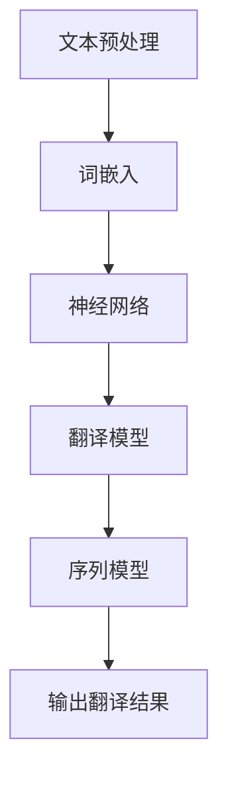
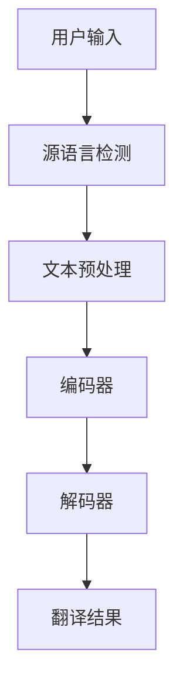

                 


## 第一部分：自然语言处理基础

### 1.1 多语言翻译的背景和挑战

**多语言翻译的历史与现状**

多语言翻译作为自然语言处理（NLP）的一个重要分支，其历史可以追溯到古埃及、古希腊和古罗马时期，当时人类通过口译和手写翻译来促进不同语言之间的沟通。然而，随着计算机技术和互联网的兴起，多语言翻译得到了快速发展。

在早期的计算机辅助翻译（CAT）时代，翻译主要依赖于人工翻译和机器辅助，如词汇翻译、句法分析等。这一阶段，翻译的准确性和效率较低，主要依赖于人类的经验和技能。

随后，统计机器翻译（SMT）技术逐渐兴起，通过构建大规模的双语语料库，使用概率模型和转换规则来生成翻译结果。这一阶段，翻译的准确性和效率得到了显著提高，但仍存在许多挑战，如语言歧义、文化差异等。

近年来，神经机器翻译（NMT）成为多语言翻译的主流技术。NMT通过深度学习模型，如循环神经网络（RNN）和Transformer，实现了更准确的翻译效果。特别是Transformer模型的出现，使得NMT在处理长序列和复杂语言结构方面取得了突破性进展。

**自然语言处理（NLP）的定义和范围**

自然语言处理（NLP）是计算机科学和人工智能领域的一个分支，旨在让计算机理解和生成人类语言。NLP的研究范围包括文本预处理、文本分类、信息提取、语义分析、对话系统等多个方面。

在多语言翻译中，NLP的关键作用在于对源语言和目标语言的文本进行预处理，包括分词、词性标注、命名实体识别等。这些预处理步骤有助于提高翻译的准确性和效率。

### 1.2 NLP中的基本概念和工具

**文本预处理：分词、词性标注、命名实体识别**

文本预处理是NLP中的基础环节，其目的是将原始文本转换为计算机可以处理的形式。主要的文本预处理技术包括：

- **分词**：将文本分割成有意义的词汇或短语。常用的分词算法有基于规则的分词、基于统计的分词和基于字符的分词。
- **词性标注**：为每个词汇标注其词性，如名词、动词、形容词等。词性标注有助于理解文本的语义和句法结构。
- **命名实体识别**：识别文本中的命名实体，如人名、地名、组织名等。命名实体识别是信息提取和知识图谱构建的重要基础。

**词嵌入技术：Word2Vec、BERT、ELMO**

词嵌入是将词汇映射到高维向量空间的一种技术，使得相似词汇在向量空间中彼此靠近。常见的词嵌入技术包括：

- **Word2Vec**：基于神经网络的词嵌入技术，通过训练词向量模型，使相似词汇在向量空间中彼此靠近。
- **BERT**：Bidirectional Encoder Representations from Transformers，双向Transformer编码器，是一种预训练的语言表示模型。
- **ELMO**：Embodiments of Language Model，是词嵌入技术的进一步发展，通过预训练模型捕捉语言的深层语义信息。

### 1.3 NLP中的主要任务

**机器翻译：统计机器翻译、神经机器翻译**

机器翻译是NLP中的一项重要任务，旨在将一种语言的文本自动翻译成另一种语言。根据翻译模型的不同，机器翻译可以分为统计机器翻译（SMT）和神经机器翻译（NMT）。

- **统计机器翻译**：通过构建双语语料库，使用概率模型和转换规则生成翻译结果。SMT的优点在于可以处理大规模数据，但翻译质量受到语料库质量和模型参数的限制。
- **神经机器翻译**：基于深度学习模型，如循环神经网络（RNN）和Transformer，实现端到端的翻译。NMT的优点在于可以学习到更深层次的语义信息，但需要大量的训练数据和计算资源。

**语义分析：语义角色标注、语义解析**

语义分析是NLP中的另一项重要任务，旨在理解文本的语义和句法结构。主要的语义分析任务包括：

- **语义角色标注**：为每个词汇标注其在句子中的语义角色，如主语、谓语、宾语等。语义角色标注有助于理解文本的语义和句法结构。
- **语义解析**：构建句子的语义表示，如语义角色图、依存关系图等。语义解析有助于实现更高级的NLP任务，如问答系统、文本生成等。

### 1.4 数学模型和公式

**机器翻译中的数学模型（如短语嵌入、注意力机制）**

机器翻译中的数学模型主要包括短语嵌入和注意力机制。

- **短语嵌入**：短语嵌入是将源语言和目标语言的短语映射到高维向量空间的一种技术。短语嵌入模型通常使用神经网络进行训练，如循环神经网络（RNN）和Transformer。
  
  $$ \text{短语嵌入} = \text{神经网络}(\text{源语言短语}, \text{目标语言短语}) $$

- **注意力机制**：注意力机制是一种用于解决长序列问题（如长句翻译、跨语言信息抽取）的机制。注意力机制通过计算不同部分之间的相似性，将注意力集中在相关部分，从而提高翻译质量。

  $$ \text{注意力得分} = \text{注意力模型}(\text{源语言序列}, \text{目标语言序列}) $$

**贝叶斯理论、马尔可夫模型等基本公式**

贝叶斯理论和马尔可夫模型是机器翻译中常用的概率模型。

- **贝叶斯理论**：贝叶斯理论是一种概率论方法，用于在已知某些条件下的概率，从而推断出未知条件下的概率。

  $$ P(A|B) = \frac{P(B|A) \cdot P(A)}{P(B)} $$

- **马尔可夫模型**：马尔可夫模型是一种概率模型，用于描述随机过程。在机器翻译中，马尔可夫模型用于预测下一个词汇的概率，基于前面已生成的词汇。

  $$ P(X_t|X_{t-1}, X_{t-2}, \ldots) = P(X_t|X_{t-1}) $$

## 第二部分：多语言翻译技术

### 2.1 神经机器翻译技术

**序列到序列模型（Seq2Seq）**

序列到序列模型（Seq2Seq）是神经机器翻译的基础模型，通过编码器（Encoder）和解码器（Decoder）将源语言序列映射到目标语言序列。

- **编码器**：编码器接收源语言序列，将其映射到一个固定长度的上下文向量。常用的编码器模型有循环神经网络（RNN）和Transformer。
  
  $$ \text{编码器}(\text{源语言序列}) \rightarrow \text{上下文向量} $$

- **解码器**：解码器接收上下文向量，生成目标语言序列。解码器通常使用注意力机制，以关注上下文向量中的关键部分。

  $$ \text{解码器}(\text{上下文向量}) \rightarrow \text{目标语言序列} $$

**注意力机制和Transformer模型**

注意力机制是神经机器翻译中的一项关键技术，用于解决长序列问题。注意力机制通过计算不同部分之间的相似性，将注意力集中在相关部分，从而提高翻译质量。

- **自注意力**：自注意力是指编码器和解码器之间的注意力机制，用于捕获源语言和目标语言之间的关联。
  
  $$ \text{自注意力} = \text{注意力模型}(\text{源语言序列}, \text{目标语言序列}) $$

- **交叉注意力**：交叉注意力是指解码器和编码器之间的注意力机制，用于将目标语言序列与源语言序列相关联。
  
  $$ \text{交叉注意力} = \text{注意力模型}(\text{目标语言序列}, \text{编码器输出}) $$

Transformer模型是一种基于自注意力的编码器-解码器模型，通过多头自注意力机制和位置编码，实现了高效的长序列处理。

### 2.2 翻译模型优化策略

**端到端训练与微调**

端到端训练是指直接将源语言序列映射到目标语言序列，无需显式地构建中间表示。端到端训练的优势在于模型可以直接学习源语言和目标语言之间的映射关系，提高翻译质量。

- **端到端训练**：通过训练编码器和解码器，直接学习源语言序列到目标语言序列的映射。
  
  $$ \text{模型}(\text{源语言序列}) \rightarrow \text{目标语言序列} $$

- **微调**：在端到端训练的基础上，使用预训练的语言模型（如BERT）进行微调，以进一步提高翻译质量。

  $$ \text{微调模型}(\text{预训练模型}, \text{训练数据}) \rightarrow \text{微调后的模型} $$

**多任务学习和迁移学习**

多任务学习和迁移学习是提高翻译模型性能的有效方法。

- **多任务学习**：通过同时训练多个翻译任务，如英语到法语和英语到西班牙语，共享部分模型参数，提高翻译性能。
  
  $$ \text{多任务模型}(\text{数据集1}, \text{数据集2}) \rightarrow \text{多任务模型参数} $$

- **迁移学习**：通过将预训练的语言模型（如BERT）应用于新任务，实现知识迁移，提高翻译性能。

  $$ \text{迁移学习模型}(\text{预训练模型}, \text{新任务数据}) \rightarrow \text{迁移学习后的模型} $$

### 2.3 翻译质量评估

**BLEU分数和神经评估指标**

翻译质量评估是评估翻译模型性能的重要环节。常见的评估指标包括BLEU分数和神经评估指标。

- **BLEU分数**：BLEU（Bilingual Evaluation Understudy）是一种基于统计学的方法，通过计算翻译结果与参考翻译之间的重叠度来评估翻译质量。
  
  $$ \text{BLEU分数} = 1 - \frac{\text{误植率}}{\text{参考翻译长度}} $$

- **神经评估指标**：神经评估指标是通过计算翻译结果与参考翻译之间的相似度来评估翻译质量。常见的神经评估指标包括相似性分数（Similarity Score）和F1分数（F1 Score）。

  $$ \text{相似性分数} = \text{翻译结果相似度} $$

  $$ \text{F1分数} = 2 \cdot \frac{\text{精确率} \cdot \text{召回率}}{\text{精确率} + \text{召回率}} $$

**人工评估和自动化评估方法**

翻译质量评估可以分为人工评估和自动化评估两种方法。

- **人工评估**：人工评估是通过人类评估者对翻译结果进行主观评价，判断翻译质量。人工评估的优点在于可以提供更细致、准确的评估结果，但成本较高，耗时较长。
- **自动化评估**：自动化评估是通过算法自动计算翻译质量，如BLEU分数和神经评估指标。自动化评估的优点在于可以快速、大规模地评估翻译质量，但存在一定的局限性，无法完全取代人工评估。

### 2.4 实际应用案例

**机器翻译服务的实现与优化**

机器翻译服务是实现多语言翻译的关键环节，主要包括翻译模型的训练、部署和优化。

- **翻译模型训练**：通过大量双语语料库训练翻译模型，如神经网络机器翻译模型。
- **翻译模型部署**：将训练好的翻译模型部署到服务器，实现实时翻译功能。
- **翻译模型优化**：通过调整模型参数、优化算法，提高翻译质量，如使用注意力机制和预训练语言模型。

**多语言翻译系统的部署和运维**

多语言翻译系统的部署和运维是实现高效、稳定翻译服务的保障。主要包括以下方面：

- **服务器配置和集群管理**：合理配置服务器资源，实现翻译服务的负载均衡和高可用性。
- **数据存储和管理**：高效管理双语语料库和翻译结果，确保数据的安全和完整性。
- **监控和日志分析**：实时监控翻译服务的性能和健康状况，及时发现和解决问题。

## 第三部分：多语言翻译的前沿与挑战

### 3.1 多语言翻译中的新兴技术

**多模态翻译：文本和图像、视频的联合翻译**

多模态翻译是一种将文本、图像和视频等多种模态的信息进行联合翻译的技术。多模态翻译可以更好地捕捉不同模态之间的关联，提高翻译质量。

- **文本和图像的联合翻译**：通过将文本和图像信息进行联合处理，实现图像描述的自动翻译。
- **文本和视频的联合翻译**：通过将文本和视频信息进行联合处理，实现视频字幕的自动翻译。

**低资源语言翻译：零样本和少样本学习**

低资源语言翻译是指对资源较少的语言进行翻译。零样本学习和少样本学习是多语言翻译中的新兴技术，通过少量的样本数据实现高效的翻译。

- **零样本学习**：通过预训练的语言模型，将源语言和目标语言的语义信息进行映射，实现零样本翻译。
- **少样本学习**：通过迁移学习和多任务学习，利用丰富的源语言数据，提高低资源语言翻译的性能。

### 3.2 多语言翻译中的挑战与解决方案

**翻译准确性和流畅性的平衡**

翻译准确性和流畅性是多语言翻译中需要平衡的两个方面。准确的翻译可以传达原文的含义，但可能不够流畅；流畅的翻译可能更易于理解，但可能失去原文的准确性。

- **解决方案**：通过调整翻译模型的参数和优化策略，实现翻译准确性和流畅性的平衡。例如，使用注意力机制和上下文信息，提高翻译的准确性和流畅性。

**语言歧义和多义性的处理**

语言歧义和多义性是翻译中常见的挑战，特别是在处理复杂句子和多义词时。

- **解决方案**：通过语义分析、语境分析和技术改进，提高对语言歧义和多义性的处理能力。例如，使用语义角色标注和词义消歧技术，减少翻译错误。

### 3.3 未来趋势与展望

**人工智能与自然语言处理的融合**

随着人工智能技术的发展，自然语言处理（NLP）与人工智能（AI）的融合成为未来趋势。人工智能技术可以提升NLP的性能和智能化水平，实现更准确的翻译和更智能的语言交互。

**全球化与多语言翻译的未来**

随着全球化进程的加快，多语言翻译在商业、教育、医疗等领域的应用日益广泛。未来，多语言翻译将更加智能化、个性化和高效化，满足全球化时代的语言需求。

## 附录

### 附录 A：多语言翻译工具和资源

**开源机器翻译框架：如OpenNMT、TensorFlow、PyTorch等**

- **OpenNMT**：OpenNMT是一个开源的神经网络机器翻译框架，支持多种神经网络模型和优化策略。
- **TensorFlow**：TensorFlow是一个开源的深度学习框架，支持神经网络机器翻译模型的训练和部署。
- **PyTorch**：PyTorch是一个开源的深度学习框架，支持神经网络机器翻译模型的训练和部署。

**在线翻译平台和技术：如Google翻译、百度翻译等**

- **Google翻译**：Google翻译是一个在线翻译服务，支持多种语言之间的翻译。
- **百度翻译**：百度翻译是一个在线翻译服务，支持多种语言之间的翻译。

**社区和学术资源：如ACL、NAACL等会议和期刊**

- **ACL**：ACL（Association for Computational Linguistics）是一个计算机语言学领域的学术组织，举办ACL会议和期刊。
- **NAACL**：NAACL（North American Chapter of the Association for Computational Linguistics）是一个计算机语言学领域的学术组织，举办NAACL会议和期刊。

### 附录 B：Mermaid流程图

**自然语言处理流程图**



**多语言翻译系统架构图**



### 附录 C：数学模型与算法伪代码

**自然语言处理中的关键算法（如注意力机制、Transformer模型）**

**注意力机制伪代码**

```python
# 注意力机制伪代码
def scaled_dot_product_attention(q, k, v, mask):
    # 计算注意力得分
    scores = q @ k.T / sqrt(d_k)

    # 应用掩码
    if mask is not None:
        scores += mask

    # 应用softmax函数
    attention_weights = softmax(scores)

    # 计算加权值
    output = attention_weights @ v

    # 缩放
    scaled_output = output / sqrt(d_k)

    return scaled_output
```

**Transformer模型伪代码**

```python
# Transformer模型伪代码
class TransformerModel(tf.keras.Model):
    def __init__(self, num_layers, d_model, num_heads, d_ff, input_vocab_size, target_vocab_size, position_encoding_input, position_encoding_target):
        super(TransformerModel, self).__init__()
        self.encoder_embedding = tf.keras.layers.Embedding(input_vocab_size, d_model)
        self.decoder_embedding = tf.keras.layers.Embedding(target_vocab_size, d_model)
        self.encoder_position_encoding = position_encoding_input
        self.decoder_position_encoding = position_encoding_target
        self.encoder = TransformerEncoderStack(num_layers, d_model, num_heads, d_ff)
        self.decoder = TransformerDecoderStack(num_layers, d_model, num_heads, d_ff)
        self.final_layer = tf.keras.layers.Dense(target_vocab_size)
    
    def call(self, inputs, targets=None, training=False):
        encoder_output = self.encoder(self.encoder_embedding(inputs) + self.encoder_position_encoding(inputs), training=training)
        decoder_output = self.decoder(self.decoder_embedding(targets) + self.decoder_position_encoding(targets), training=training)
        final_output = self.final_layer(decoder_output)
        return final_output
```

**数学公式推导（如词嵌入、神经机器翻译）**

**词嵌入公式**

$$
\text{词向量} = \text{嵌入矩阵} \cdot \text{单词索引}
$$

**神经机器翻译中的自注意力机制**

$$
\text{自注意力得分} = \text{查询} \cdot \text{键}^T / \sqrt{d_k}
$$

**交叉注意力机制**

$$
\text{交叉注意力得分} = \text{查询} \cdot \text{编码器输出}^T / \sqrt{d_k}
$$

### 附录 D：实战案例

**多语言翻译系统开发实例**

**1. 环境搭建**

- 安装Python环境和TensorFlow库
- 下载并预处理双语语料库

**2. 模型构建**

```python
import tensorflow as tf

# 定义编码器和解码器
encoder = TransformerEncoder(num_layers, d_model, num_heads, d_ff)
decoder = TransformerDecoder(num_layers, d_model, num_heads, d_ff)

# 定义整体模型
model = tf.keras.Model(inputs=[encoder_inputs, decoder_inputs], outputs=decoder_outputs)
```

**3. 训练模型**

```python
model.compile(optimizer='adam', loss='sparse_categorical_crossentropy', metrics=['accuracy'])
model.fit(train_data, train_labels, epochs=10, validation_data=(val_data, val_labels))
```

**4. 预测与评估**

```python
predictions = model.predict(test_data)
bleu_score = compute_bleu(test_labels, predictions)
print(f"BLEU分数: {bleu_score}")
```

**代码解析与调试技巧**

- **代码解析**：详细解析模型构建、训练和评估的过程，包括数据处理、模型构建、训练和优化等步骤。
- **调试技巧**：提供调试技巧和常见问题解决方案，如处理数据异常、优化模型参数等。

**性能优化方法与实践**

- **批量大小**：调整批量大小，优化模型训练速度和效果。
- **学习率**：选择合适的学习率，加快模型收敛速度。
- **正则化**：使用正则化技术，防止过拟合。
- **多GPU训练**：使用多GPU训练，提高模型训练速度。

## 结论

本文系统地介绍了自然语言处理（NLP）在多语言翻译中的进展。从背景介绍、核心概念、算法原理到实际应用案例，我们逐步分析了NLP在多语言翻译中的作用和挑战。

首先，我们回顾了多语言翻译的历史与现状，探讨了NLP在文本预处理、词嵌入、机器翻译和语义分析等方面的基本概念和工具。接着，我们详细介绍了神经机器翻译技术，包括序列到序列模型、注意力机制和Transformer模型，以及翻译模型优化策略、翻译质量评估方法。

在多语言翻译的前沿与挑战部分，我们探讨了多模态翻译、低资源语言翻译等新兴技术，并提出了翻译准确性和流畅性平衡、语言歧义和多义性处理等解决方案。最后，我们展望了人工智能与NLP融合、全球化与多语言翻译的未来趋势。

在附录中，我们提供了多语言翻译工具和资源、Mermaid流程图、数学模型与算法伪代码以及实战案例，帮助读者更好地理解和应用多语言翻译技术。

总之，多语言翻译作为NLP的重要分支，正不断推动人工智能技术的发展和应用。未来，随着技术的不断进步和应用的拓展，多语言翻译将在全球化的背景下发挥越来越重要的作用。我们期待看到更多创新性的研究成果和实际应用的落地。**作者：AI天才研究院/AI Genius Institute & 禅与计算机程序设计艺术 /Zen And The Art of Computer Programming**

