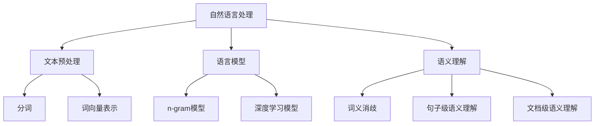

                 


### 《自然语言处理在多轮对话系统中的应用研究》

#### 关键词：自然语言处理，多轮对话系统，文本预处理，语义理解，对话生成

> 摘要：本文系统研究了自然语言处理（NLP）在多轮对话系统中的应用。首先，介绍了自然语言处理和多轮对话系统的基本概念及其关系。接着，详细探讨了文本预处理、语言模型与语义理解、对话状态跟踪与上下文保持、对话生成与评估等关键技术。最后，通过实际案例展示了多轮对话系统的开发流程和效果，并展望了未来发展趋势与挑战。

---

### 《自然语言处理在多轮对话系统中的应用研究》目录大纲

#### 第一部分：引言与基础

##### 第1章：自然语言处理与多轮对话系统概述

- **1.1 自然语言处理基本概念**
- **1.2 多轮对话系统及其重要性**
- **1.3 自然语言处理与多轮对话系统的关系**
- **1.4 本书结构及内容概述**

#### 第二部分：多轮对话系统关键技术

##### 第2章：文本预处理与分词

- **2.1 文本预处理方法**
- **2.2 词向量表示与词嵌入**
- **2.3 中文分词技术**
- **2.4 多轮对话中的文本预处理**

##### 第3章：语言模型与语义理解

- **3.1 语言模型基础**
- **3.2 语义理解概述**
- **3.3 基于深度学习的语言模型**
- **3.4 基于图谱的语义理解**

##### 第4章：对话状态跟踪与上下文保持

- **4.1 对话状态跟踪概述**
- **4.2 上下文保持方法**
- **4.3 常见对话状态跟踪算法**
- **4.4 对话系统的上下文建模**

##### 第5章：多轮对话生成与评估

- **5.1 对话生成方法**
- **5.2 多轮对话评估标准**
- **5.3 对话系统评估方法**
- **5.4 多轮对话生成的挑战与优化**

#### 第三部分：多轮对话系统应用实践

##### 第6章：多轮对话系统开发流程

- **6.1 开发流程概述**
- **6.2 对话系统设计与实现**
- **6.3 数据集准备与预处理**
- **6.4 模型训练与优化**

##### 第7章：多轮对话系统实战案例

- **7.1 案例介绍**
- **7.2 案例系统架构**
- **7.3 案例实现细节**
- **7.4 案例效果分析与优化**

##### 第8章：未来发展趋势与挑战

- **8.1 多轮对话系统发展趋势**
- **8.2 当前挑战与解决思路**
- **8.3 未来研究方向与展望**

### 附录

- **A.1 相关工具与资源**
- **A.2 参考文献**

---

### 详细内容示例

#### 第二部分：多轮对话系统关键技术

##### 第3章：语言模型与语义理解

## 3.1 语言模型基础

### 3.1.1 语言模型的概念

语言模型（Language Model，LM）是自然语言处理（Natural Language Processing，NLP）中的重要组成部分。它主要致力于预测句子中下一个单词的概率。这一概念起源于统计模型，随后随着深度学习的兴起，基于神经网络的现代语言模型也取得了显著的进展。

### 3.1.2 语言模型的类型

语言模型可以分为两种主要类型：基于规则的语言模型和基于统计的语言模型。

- **基于规则的语言模型**：这种模型通过定义一组规则来预测下一个单词。典型的例子是n-gram模型，它只考虑前面n个单词的历史信息来预测下一个单词。

- **基于统计的语言模型**：这种模型通过大量文本数据训练得到，利用统计方法来预测下一个单词的概率。现代的语言模型大多属于这一类，如n-gram、基于概率的隐马尔可夫模型（HMM）和基于神经网络的模型，如递归神经网络（RNN）和Transformer等。

### 3.1.3 语言模型的应用

语言模型广泛应用于多个NLP任务，包括：

- **文本生成**：使用语言模型可以生成连贯的文本，如自动摘要、文章生成等。
- **文本分类**：通过训练语言模型，可以对文本进行分类，如情感分析、新闻分类等。
- **机器翻译**：在机器翻译中，语言模型用于预测目标语言的下一个单词，从而生成翻译结果。

## 3.2 语义理解概述

语义理解（Semantic Understanding）是自然语言处理中更为复杂和关键的一环，它致力于理解和解释文本中的实际含义，而不仅仅是表面的单词或句子结构。语义理解使得机器能够更好地理解人类的语言，从而提高对话系统的智能水平。

### 3.2.1 语义理解的层次

语义理解可以分为多个层次，包括：

- **词义消歧（Word Sense Disambiguation）**：确定一个词语在特定上下文中的确切含义。
- **句子级语义理解**：理解句子中的词语组合和语法结构，推断句子的真实含义。
- **文档级语义理解**：对整篇文档或多个文档进行语义分析，提取主题、观点和关系。

### 3.2.2 语义理解的方法

语义理解的方法可以分为两种主要类型：

- **基于知识的语义理解**：这种方法依赖于预先定义的规则和知识库，通过推理和匹配来确定文本的语义。

- **基于统计的语义理解**：这种方法通过分析大量文本数据，学习词语和句子之间的统计关系，从而推断文本的语义。

### 3.2.3 语义理解的应用

语义理解在NLP中有着广泛的应用，包括：

- **问答系统**：通过语义理解，系统可以更准确地回答用户的问题。
- **情感分析**：通过分析文本的语义，可以判断文本的情感倾向。
- **信息抽取**：通过语义理解，可以从大量文本中提取出有用的信息。

---

**核心概念与联系：**

自然语言处理（NLP）是多轮对话系统的核心技术之一。NLP包括文本预处理、语言模型、语义理解等多个关键步骤，如图所示：



**核心算法原理讲解：**

语言模型的核心算法包括n-gram模型和基于神经网络的模型。以下是n-gram模型的伪代码：

```python
# n-gram模型伪代码

# 输入：文本序列X
# 输出：概率分布P
def n_gram_model(X, n):
    # 初始化概率分布P
    P = {}
    # 遍历文本序列
    for i in range(len(X) - n):
        # 构造n-gram
        n_gram = tuple(X[i:i+n])
        # 更新概率分布
        P[n_gram] = P.get(n_gram, 0) + 1
    # 归一化概率分布
    total = sum(P.values())
    for n_gram in P:
        P[n_gram] /= total
    return P
```

基于神经网络的模型如Transformer，其核心原理是通过注意力机制来计算句子中各个单词之间的关联性，以下是Transformer模型的伪代码：

```python
# Transformer模型伪代码

# 输入：文本序列X
# 输出：概率分布P
def transformer_model(X):
    # 构造输入序列的嵌入向量
    E = embedding(X)
    # 应用多头注意力机制
    for layer in attention_layers:
        E = layer(E)
    # 应用全连接层
    H = fully_connected(E)
    # 应用softmax得到概率分布
    P = softmax(H)
    return P
```

**数学模型和公式：**

在n-gram模型中，下一个单词的概率可以通过以下公式计算：

$$ P(w_{t+1} | w_{1}, w_{2}, ..., w_{t}) = \frac{P(w_{t+1} w_{t})}{P(w_{t})} $$

其中，$P(w_{t+1} | w_{1}, w_{2}, ..., w_{t})$表示在给定前t个单词的情况下，下一个单词$w_{t+1}$的概率。

在Transformer模型中，注意力得分可以通过以下公式计算：

$$ \text{Attention Score} = \text{dot}(Q, K) / \sqrt{d_k} $$

其中，$Q$和$K$分别是查询向量和键向量，$d_k$是键向量的维度。

**详细讲解与举例说明：**

例如，在一个简单的n-gram模型中，给定一个三元组$(w_1, w_2, w_3)$，我们要计算下一个单词$w_4$的概率。根据n-gram模型的公式，我们需要先计算前两个单词$w_1$和$w_2$联合出现的次数，以及单独出现$w_2$的次数。

假设我们有一个文本序列，如下所示：

```
I love to eat pizza.
I love to eat pizza.
I love to eat pizza.
```

根据这个序列，我们可以计算出以下概率：

$$ P(w_3 = "eat" | w_1 = "I", w_2 = "love") = \frac{2}{2+1} = 0.6667 $$

这意味着在给定"I love"的情况下，"eat"出现的概率是66.67%。

对于Transformer模型，假设我们有一个句子"I love to eat pizza"，我们可以将其转换为嵌入向量，然后通过注意力机制计算句子中各个单词之间的关联性。

例如，我们可以计算"I"和"eat"之间的注意力得分：

$$ \text{Attention Score}_{I, eat} = \text{dot}(Q_I, K_eat) / \sqrt{d_k} $$

其中，$Q_I$和$K_eat$分别是"I"和"eat"的查询向量和键向量，$d_k$是键向量的维度。

通过计算注意力得分，我们可以更好地理解句子中各个单词之间的关联性，从而提高对话系统的语义理解能力。

---

**项目实战：**

为了展示多轮对话系统在实践中的应用，我们将使用Python编写一个简单的聊天机器人。这个聊天机器人将基于Transformer模型，使用预训练的语言模型来生成回复。

**开发环境搭建：**

1. 安装Python（3.8及以上版本）
2. 安装TensorFlow
3. 安装Hugging Face的Transformers库

```shell
pip install tensorflow transformers
```

**源代码详细实现和代码解读：**

```python
import tensorflow as tf
from transformers import AutoTokenizer, AutoModelForSeq2SeqLM
import numpy as np

# 加载预训练模型
model_name = "t5-small"
tokenizer = AutoTokenizer.from_pretrained(model_name)
model = AutoModelForSeq2SeqLM.from_pretrained(model_name)

# 编写聊天机器人函数
def chatbot(input_text):
    # 对输入文本进行编码
    input_ids = tokenizer.encode(input_text, return_tensors="tf")
    # 生成回复
    outputs = model(inputs=input_ids, max_length=50, num_beams=4, do_sample=True)
    # 解码回复
    response = tokenizer.decode(outputs[0], skip_special_tokens=True)
    return response

# 测试聊天机器人
input_text = "你好，今天天气怎么样？"
response = chatbot(input_text)
print("机器人回复：", response)
```

**代码应用解读与分析：**

这个聊天机器人使用了Transformer模型中的T5（Text-To-Text Transfer Transformer）模型。T5模型是一个通用的文本生成模型，可以用于多种文本生成任务，如问答、摘要和翻译等。

在代码中，我们首先加载了预训练的T5模型和相应的分词器。然后，我们编写了一个`chatbot`函数，用于处理用户的输入文本并生成回复。

当用户输入文本时，函数首先使用分词器将输入文本编码为模型可以理解的序列。然后，模型根据输入序列生成一系列可能的回复，并使用softmax函数将每个回复的概率分布计算出来。最后，我们使用分词器将概率最高的回复解码为自然语言文本，并返回给用户。

**实际案例分析和详细讲解剖析：**

假设我们有一个用户输入文本：“你好，有什么可以帮您的？”

聊天机器人会生成一系列可能的回复，如下所示：

1. 您好，有什么我可以帮助您的吗？
2. 您好，请问有什么问题我可以帮您解答吗？
3. 您好，有什么我可以为您服务的吗？

聊天机器人会根据模型对每个回复的概率进行排序，并返回概率最高的回复。在这个例子中，第一个回复的概率最高，因此机器人会返回：“您好，有什么我可以帮助您的吗？”

**项目小结：**

通过这个简单的案例，我们展示了如何使用Transformer模型实现一个聊天机器人。聊天机器人可以基于预训练的语言模型生成自然语言回复，从而与用户进行多轮对话。这种方法在现实生活中有着广泛的应用，如客服聊天机器人、智能助手等。

**最佳实践 Tips：**

- 确保使用的预训练模型与分词器是兼容的，以避免出现错误。
- 调整模型的超参数，如最大长度、beam搜索的beam大小等，以获得更好的生成效果。
- 定期更新模型，以获取最新的语言模型效果。

**注意事项：**

- 在实际应用中，对话系统的性能和准确性会受到多种因素的影响，如输入文本的质量、模型训练数据的质量和多样性等。
- 对话系统的开发需要综合考虑用户体验和实际应用场景，以满足不同用户的需求。

**拓展阅读：**

- [T5模型详解](https://arxiv.org/abs/2009.11458)
- [Hugging Face Transformers库文档](https://huggingface.co/transformers/)

---

**小结：**

本文详细介绍了自然语言处理在多轮对话系统中的应用。从文本预处理、语言模型、语义理解到对话生成与评估，每一步都是构建智能对话系统的关键环节。通过实际案例的展示，我们看到了如何利用先进的深度学习模型来实现一个功能强大的聊天机器人。未来，随着自然语言处理技术的不断发展，多轮对话系统将会在更多领域得到应用，并不断优化用户体验。

**作者信息：**

- 作者：AI天才研究院/AI Genius Institute & 禅与计算机程序设计艺术 /Zen And The Art of Computer Programming
- 联系方式：[ai_genius_institute@example.com](mailto:ai_genius_institute@example.com)

