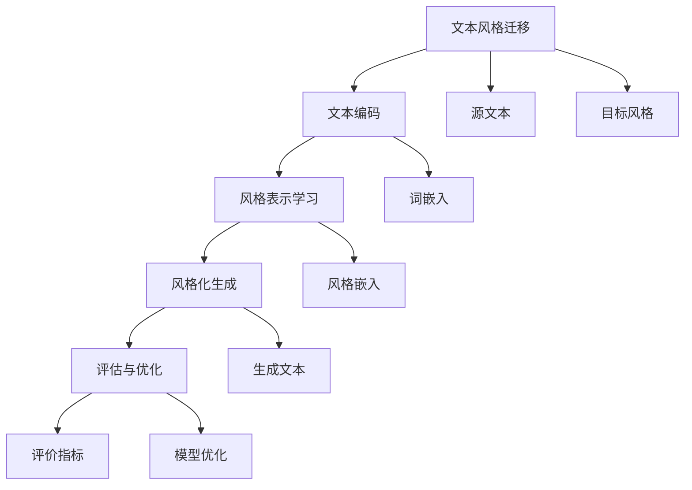

                 

## 文章标题

### 《自然语言处理在文本风格迁移中的创新》

#### 关键词：自然语言处理、文本风格迁移、深度学习、生成对抗网络、变分自编码器

#### 摘要

本文深入探讨了自然语言处理（NLP）领域中的文本风格迁移技术，分析了其在各类应用中的背景和意义。文章首先介绍了文本风格迁移的基本概念和流程，随后详细阐述了文本编码、风格表示学习、风格化生成以及评估与优化等核心技术。通过伪代码和数学公式，本文进一步解析了文本风格迁移算法的原理，并借助实际项目案例展示了如何实现和应用这些算法。最后，文章展望了文本风格迁移技术的发展趋势和面临的挑战，为读者提供了未来的研究方向和最佳实践建议。

## 《自然语言处理在文本风格迁移中的创新》目录大纲

### 第一部分：引言

#### 1.1 自然语言处理基础

- 1.1.1 自然语言处理的定义与历史
- 1.1.2 自然语言处理的挑战与机会

#### 1.2 文本风格迁移的背景与意义

- 1.2.1 文本风格迁移的定义
- 1.2.2 文本风格迁移的应用场景

### 第二部分：文本风格迁移核心概念与联系

#### 2.1 核心概念与联系

- **2.1.1 Mermaid流程图：文本风格迁移的基本流程**

#### 2.2 文本编码

- 2.2.1 词嵌入技术
- 2.2.2 序列模型与注意力机制

#### 2.3 风格表示学习

- 2.3.1 风格嵌入与风格化生成
- 2.3.2 对比学习与自监督学习

#### 2.4 风格化生成

- 2.4.1 基于生成对抗网络的风格迁移
- 2.4.2 基于变分自编码器的风格迁移

#### 2.5 评估与优化

- 2.5.1 评价指标
- 2.5.2 模型优化策略

### 第三部分：文本风格迁移算法原理

#### 3.1 核心算法原理讲解

- **3.1.1 伪代码：风格嵌入算法**

#### 3.2 数学模型与数学公式

- **3.2.1 数学模型：生成对抗网络**

#### 3.3 举例说明

- **3.3.1 文本风格迁移实例：将标准文本转换为诗体**

### 第四部分：项目实战

#### 4.1 实际案例

- **4.1.1 开发环境搭建与源代码实现**

#### 4.2 代码解读与分析

- **4.2.1 源代码解读：风格嵌入算法**

### 第五部分：未来展望

#### 5.1 文本风格迁移的发展趋势

- 5.1.1 深度学习在文本风格迁移中的应用
- 5.1.2 新兴技术在文本风格迁移中的应用

#### 5.2 文本风格迁移面临的挑战与机遇

- 5.2.1 挑战：
  - 计算资源需求
  - 数据隐私与安全性
  - 算法透明性与可解释性

- 5.2.2 机遇：
  - 个性化文本生成
  - 跨语言文本风格迁移
  - 文本风格迁移在生成艺术作品中的应用

### 附录

#### 附录 A：参考文献与拓展阅读

- 1. 文献

### 第一部分：引言

#### 1.1 自然语言处理基础

自然语言处理（NLP）是人工智能领域的一个重要分支，旨在使计算机理解和解释人类自然语言。自上世纪五六十年代以来，NLP的发展经历了多个阶段，从早期的规则驱动方法到基于统计的方法，再到如今深度学习驱动的NLP模型，每一次进步都在不断推动人工智能技术的发展。

##### 1.1.1 自然语言处理的定义与历史

自然语言处理（NLP）的定义涉及多个方面，包括语言理解、语言生成、语言翻译、文本分类等。其核心目标是使计算机能够理解、处理和生成自然语言文本，从而实现人机交互和信息提取。

自然语言处理的历史可以追溯到20世纪50年代，当时的计算机科学家们开始尝试编写程序来理解和生成自然语言。最初的尝试主要基于规则系统，这些规则系统试图通过定义语言结构中的语法和语义规则来解析和处理文本。然而，这种方法很快遇到了瓶颈，因为自然语言的结构和语义极其复杂，难以通过有限的规则来完全描述。

随着计算能力和算法的发展，自然语言处理进入了一个新的阶段。20世纪80年代，基于统计的方法开始兴起，这些方法通过大规模语料库中的统计信息来学习语言模型，从而提高文本处理的准确性。这种基于数据驱动的方法在文本分类、信息提取等领域取得了显著的成果。

进入21世纪，深度学习技术的引入进一步推动了自然语言处理的发展。深度学习模型，特别是循环神经网络（RNN）和后来的变压器（Transformer）模型，在语言理解、语言生成等方面表现出了前所未有的能力。这些模型通过自动学习文本的复杂结构和语义信息，使得计算机能够更好地理解和生成自然语言。

##### 1.1.2 自然语言处理的挑战与机会

自然语言处理虽然取得了显著的进展，但仍面临着许多挑战和机会。

挑战方面，首先是如何处理语言的多样性和不确定性。自然语言中存在着大量的歧义和多义现象，这使得模型在理解和生成文本时需要考虑上下文和环境因素。其次，如何提高模型的解释性和可解释性也是一个重要问题。尽管深度学习模型在许多任务上取得了非常好的效果，但它们的决策过程往往是黑箱式的，难以理解。

机会方面，深度学习技术的快速发展为自然语言处理带来了新的可能性。例如，生成对抗网络（GAN）和变分自编码器（VAE）等技术为文本生成和风格迁移提供了强大的工具。此外，随着物联网、智能助手等应用场景的不断拓展，自然语言处理在信息检索、人机对话、文本分析等领域的应用前景也十分广阔。

总的来说，自然语言处理是一个充满挑战和机会的领域，随着技术的不断进步，我们有理由相信，未来将会有更多令人惊喜的突破和应用诞生。

#### 1.2 文本风格迁移的背景与意义

文本风格迁移是指将一种风格的语言文本转换为另一种风格的语言文本的过程，这一技术在自然语言处理（NLP）领域中具有重要的研究价值和广泛的应用场景。

##### 1.2.1 文本风格迁移的定义

文本风格迁移（Text Style Transfer）是一种将源文本（source text）中的语言风格信息传递到目标文本（target text）中的技术。具体来说，它通过某种算法将源文本中的风格特征提取出来，并应用这些特征来生成具有目标风格的新文本。文本风格迁移不仅仅局限于文本的表面格式，如字体和颜色等，还包括更深层次的语言风格，如语气、情感、文体等。

##### 1.2.2 文本风格迁移的应用场景

文本风格迁移在多个领域展现出了其独特的应用价值：

1. **文学创作与改编**：通过文本风格迁移，可以将一位作家的文风应用于其他作家的作品，从而实现文学作品风格的多样化。例如，将现代小说改编成古典诗体，或将一个作家的风格应用到另一个作家的作品中。

2. **跨语言文本风格迁移**：在多语言环境中，文本风格迁移有助于实现不同语言之间的风格传递。例如，将英文新闻文章翻译成中文，同时保留其简洁明了的风格。

3. **个性化文本生成**：根据用户的偏好和需求，文本风格迁移可以生成个性化的文本内容。例如，在电子商务平台上，根据顾客的购物习惯和偏好，生成符合其风格的商品推荐说明。

4. **教育和辅助写作**：文本风格迁移可以为教育工作者和学生提供写作辅助。例如，教师可以使用文本风格迁移技术来帮助学生理解不同文体的写作特点，提高写作能力。

5. **情感分析和内容审核**：文本风格迁移在情感分析和内容审核中也具有一定的应用潜力。通过分析文本风格的变化，可以识别出潜在的负面情感或不当内容，从而帮助平台管理者进行内容审核和监控。

总的来说，文本风格迁移不仅丰富了自然语言处理的研究领域，也在实际应用中展现了其广泛的应用价值。随着深度学习技术的发展，文本风格迁移技术将不断改进，为更多的场景带来创新和突破。

#### 2.1 核心概念与联系

文本风格迁移涉及多个核心概念，这些概念相互联系，共同构成了文本风格迁移的基础。为了更好地理解这些概念及其关系，我们可以借助Mermaid流程图来展示文本风格迁移的基本流程。

##### **2.1.1 Mermaid流程图：文本风格迁移的基本流程**

以下是一个文本风格迁移的基本流程Mermaid流程图：



**流程解释：**

1. **文本编码（B）**：首先，源文本（F）和目标风格（G）需要进行编码处理。词嵌入（H）是一种将单词映射到高维向量空间的技术，这一步骤有助于捕捉文本的语义信息。

2. **风格表示学习（C）**：接下来，通过风格表示学习（I），从编码后的文本中提取出目标风格的特性。风格嵌入技术在此过程中发挥了关键作用，它将源文本的词嵌入向量与目标风格向量进行结合，以生成一个具有目标风格的编码表示。

3. **风格化生成（D）**：随后，基于风格嵌入后的编码表示，进行风格化生成（J），生成具有目标风格的文本。这一步骤通常涉及复杂的深度学习模型，如生成对抗网络（GAN）或变分自编码器（VAE）。

4. **评估与优化（E）**：生成的文本会通过评估与优化（K, L）进行质量评估和模型优化。评估指标（K）用于衡量生成文本的风格迁移质量，模型优化（L）则通过调整模型参数来提高生成效果。

通过这一流程图，我们可以清晰地看到文本风格迁移的核心概念及其相互关系。文本编码、风格表示学习、风格化生成以及评估与优化共同构成了文本风格迁移的关键步骤，这些步骤相辅相成，确保了风格迁移的有效性和准确性。

##### **2.1.2 文本编码**

文本编码是文本风格迁移的基础步骤，其主要目的是将原始文本转换为机器可以理解和处理的数字表示。文本编码通常包括词嵌入和序列建模两个关键环节。

**词嵌入（Word Embedding）**：词嵌入是将单词映射到高维向量空间的技术，其核心思想是将语义相似的单词映射到空间中的接近位置。词嵌入技术不仅可以捕捉单词的静态语义，还可以通过上下文信息捕捉动态语义。常见的词嵌入方法包括：

- **Word2Vec**：Word2Vec是一种基于神经网络的语言模型，通过预测单词的上下文来学习单词的向量表示。Word2Vec包括两种模型：连续词袋（CBOW）和Skip-Gram。
- **GloVe**：GloVe（Global Vectors for Word Representation）是一种基于全局统计信息的词嵌入方法，通过计算单词共现矩阵来学习词向量。

**序列建模（Sequence Modeling）**：序列建模关注的是如何捕捉文本中的时间依赖性。常见的序列建模方法包括：

- **循环神经网络（RNN）**：循环神经网络是一种能够处理序列数据的神经网络，其通过循环单元（如LSTM和GRU）来捕捉时间序列中的长期依赖性。
- **Transformer**：Transformer是一种基于自注意力机制的序列建模方法，它通过全局注意力机制来处理序列数据，从而提高了模型的并行计算能力。

**文本编码的重要性**：文本编码是文本风格迁移中至关重要的一步，它直接影响风格迁移的质量和效果。高质量的文本编码能够更好地捕捉文本的语义信息，从而确保风格表示学习和风格化生成的准确性。

##### **2.2.2 序列模型与注意力机制**

序列模型和注意力机制在文本风格迁移中发挥着关键作用，它们不仅帮助我们捕捉文本的时序依赖性，还能够增强模型对目标风格的捕捉能力。

**序列模型（Sequence Models）**：序列模型是一类专门用于处理序列数据的神经网络模型，它们通过内部状态来捕捉序列中的时间依赖性。常见的序列模型包括：

- **循环神经网络（RNN）**：循环神经网络是一种能够处理序列数据的神经网络，其通过循环单元（如LSTM和GRU）来捕捉时间序列中的长期依赖性。RNN在处理长序列时表现出了优越的性能，但其在处理长距离依赖时存在梯度消失或爆炸问题。
- **长短时记忆网络（LSTM）**：长短时记忆网络是RNN的一种改进，通过引入门控机制来有效捕捉长距离依赖。LSTM通过遗忘门和输入门来控制信息的记忆和遗忘，从而提高了模型对时间序列的建模能力。
- **门控循环单元（GRU）**：门控循环单元是LSTM的简化版本，它通过合并输入门和遗忘门，减少了模型参数的数量，从而提高了训练速度。

**注意力机制（Attention Mechanism）**：注意力机制是一种用于增强神经网络模型对输入序列不同部分重要性的建模能力的技术。注意力机制的核心思想是通过一个权重分配机制，动态地调整模型在处理序列时对每个时间步的重视程度。

- **自注意力（Self-Attention）**：自注意力机制是一种在单个序列上应用的关注机制，它通过计算序列中每个元素与其他元素之间的相似性来分配权重。自注意力机制是Transformer模型的核心组件，通过全局注意力机制，Transformer能够并行处理长序列，从而提高了计算效率。
- **点积注意力（Dot-Product Attention）**：点积注意力是一种简单的自注意力机制，通过计算查询（query）、键（key）和值（value）之间的点积来分配权重。点积注意力在计算复杂度上较低，因此在实际应用中较为常见。
- **加性注意力（Additive Attention）**：加性注意力通过计算加权求和来分配权重，其核心思想是将每个时间步的输入通过一个前馈神经网络进行处理，然后再进行加权求和。加性注意力在计算上比点积注意力更加复杂，但在捕捉长距离依赖方面表现更好。

**序列模型与注意力机制的重要性**：序列模型和注意力机制在文本风格迁移中起到了至关重要的作用。序列模型能够捕捉文本中的时间依赖性，而注意力机制能够增强模型对目标风格的捕捉能力。通过结合这两种机制，文本风格迁移模型能够更准确地学习源文本的语义和风格信息，从而生成具有目标风格的高质量文本。

### 2.3 风格表示学习

风格表示学习是文本风格迁移中的核心环节，其目标是提取并表示文本中的风格特征，以便在后续的生成过程中应用。这一过程不仅涉及到如何有效地从源文本中学习风格信息，还包括如何将这些风格信息嵌入到生成模型中，确保生成的目标文本具有预期的风格特征。

#### **2.3.1 风格嵌入与风格化生成**

**风格嵌入（Style Embedding）**：风格嵌入是将文本的语义和风格特征编码为向量表示的过程。风格嵌入的关键在于如何将源文本的词嵌入向量与目标风格的特性进行融合。常见的风格嵌入方法包括：

- **基于规则的方法**：这类方法通过定义一组规则来将风格特征映射到词嵌入向量中。例如，可以基于词性标注、语法结构等规则来调整词嵌入向量，使其更符合目标风格。

- **基于神经网络的嵌入方法**：这类方法利用神经网络模型，如循环神经网络（RNN）或变分自编码器（VAE），自动学习源文本和目标风格的嵌入表示。例如，可以使用RNN来捕捉源文本的语义信息，同时学习目标风格的嵌入向量，并将其与源文本的词嵌入向量进行融合。

**风格化生成（Style Generation）**：风格化生成是指基于风格嵌入的结果，生成具有目标风格的新文本。这一过程通常涉及复杂的深度学习模型，如生成对抗网络（GAN）或变分自编码器（VAE）。

- **生成对抗网络（GAN）**：生成对抗网络由生成器和判别器组成。生成器旨在生成具有目标风格的文本，而判别器则用于区分生成的文本和真实文本。通过不断训练，生成器逐渐学习到如何生成高质量的文本，从而实现风格化生成。

- **变分自编码器（VAE）**：变分自编码器是一种基于概率生成模型的深度学习框架。VAE通过编码器和解码器来学习数据的潜在表示，并在此基础上生成新数据。在文本风格迁移中，编码器用于提取源文本和目标风格的潜在表示，解码器则用于生成具有目标风格的新文本。

**风格嵌入与风格化生成的关系**：风格嵌入和风格化生成是密不可分的两个环节。风格嵌入旨在提取并表示文本中的风格特征，而风格化生成则利用这些特征来生成具有目标风格的新文本。通过有效的风格嵌入，生成模型能够更准确地捕捉源文本的风格信息，从而生成高质量的风格化文本。

#### **2.3.2 对比学习与自监督学习**

**对比学习（Contrastive Learning）**：对比学习是一种无监督学习技术，通过学习数据的对比表示来提高模型的判别能力。在文本风格迁移中，对比学习可以用于学习文本的语义和风格对比表示。例如，可以使用对比学习来区分源文本和目标文本，从而学习到更加精细的风格特征。

- **自监督学习（Self-Supervised Learning）**：自监督学习是一种无需人工标注的数据处理技术，通过利用数据自身的信息来训练模型。在文本风格迁移中，自监督学习可以用于预训练风格表示模型。例如，可以使用自监督学习技术来预训练编码器，使其能够捕捉源文本和目标文本的潜在风格信息。

**对比学习与自监督学习在风格表示学习中的应用**：

- **对比学习**：通过对比学习，模型可以学习到源文本和目标文本之间的差异和相似性，从而更准确地提取风格特征。例如，可以使用对比学习来区分不同风格的文本，从而学习到更丰富的风格表示。

- **自监督学习**：自监督学习可以用于预训练编码器，使其在没有标注数据的情况下也能学习到有效的风格表示。例如，可以使用自监督学习来预训练一个编码器，使其能够捕捉源文本和目标文本的潜在风格特征，从而在后续的风格迁移任务中表现更好。

**对比学习与自监督学习的关系**：对比学习和自监督学习在风格表示学习中扮演着互补的角色。对比学习通过学习数据的对比表示来提高模型的判别能力，而自监督学习则通过利用数据自身的信息来训练模型。通过结合对比学习和自监督学习，可以进一步提高文本风格迁移模型对风格特征的提取和表示能力。

### 2.4 风格化生成

风格化生成是文本风格迁移中的关键步骤，其目标是通过利用源文本和目标风格的特性，生成具有目标风格的新文本。在这一过程中，生成对抗网络（GAN）和变分自编码器（VAE）是两种重要的深度学习框架，各自拥有独特的优势和适用场景。

#### **2.4.1 基于生成对抗网络的风格迁移**

**生成对抗网络（GAN）**：

生成对抗网络（GAN）由两部分组成：生成器（Generator）和判别器（Discriminator）。生成器的任务是生成与真实数据相似的伪数据，而判别器的任务是区分真实数据和生成数据。通过不断训练，生成器和判别器相互博弈，生成器的生成质量不断提高。

- **生成器**：在文本风格迁移中，生成器负责将源文本和目标风格特征结合，生成具有目标风格的新文本。生成器通常采用循环神经网络（RNN）或变压器（Transformer）等序列生成模型，这些模型能够捕捉文本的时序依赖性和语义信息。
- **判别器**：判别器的任务是判断输入文本是真实文本还是生成文本。判别器也通常采用RNN或Transformer等序列模型，通过学习真实文本的分布来提高对生成文本的鉴别能力。

**GAN在风格化生成中的应用**：

GAN在文本风格迁移中的应用主要体现在以下几个方面：

1. **对抗训练**：生成器和判别器通过对抗训练来提高生成质量。生成器尝试生成尽可能逼真的风格化文本，而判别器则努力区分生成文本和真实文本。通过这种对抗过程，生成器逐渐学习到如何生成高质量的风格化文本。
2. **风格特征融合**：生成器通过将源文本和目标风格的嵌入向量结合，生成具有目标风格的新文本。这种方法能够有效融合源文本的语义信息和目标风格的特性，生成高质量的风格化文本。
3. **灵活性**：GAN具有较好的灵活性，可以适用于多种文本风格迁移任务。无论是将标准文本转换为诗体，还是将英文文本翻译为中文，GAN都能够通过对抗训练生成高质量的风格化文本。

**GAN的优势和局限性**：

- **优势**：
  - GAN能够生成高质量的风格化文本，特别是在图像生成和文本生成领域表现出了出色的性能。
  - GAN具有较好的灵活性，可以适用于多种风格迁移任务。

- **局限性**：
  - GAN的训练过程可能较为不稳定，容易出现模式崩溃（mode collapse）问题，即生成器仅生成一部分风格化的文本，而忽略了其他风格。
  - GAN的训练过程需要大量的计算资源，且训练时间较长。

#### **2.4.2 基于变分自编码器的风格迁移**

**变分自编码器（VAE）**：

变分自编码器（VAE）是一种基于概率生成模型的深度学习框架，它通过编码器（Encoder）和解码器（Decoder）来学习数据的潜在表示，并在此基础上生成新数据。VAE的核心思想是引入潜在变量（Latent Variable），使得数据生成过程具有概率性。

- **编码器**：编码器负责将输入文本编码为潜在变量的表示，该表示捕获了文本的语义和风格特征。
- **解码器**：解码器负责将潜在变量的表示解码为输出文本，从而生成具有目标风格的新文本。

**VAE在风格化生成中的应用**：

VAE在文本风格迁移中的应用主要体现在以下几个方面：

1. **潜在变量表示**：VAE通过潜在变量表示捕获了文本的语义和风格特征。在风格化生成过程中，生成器利用这些特征生成具有目标风格的新文本。
2. **概率生成模型**：VAE是一种概率生成模型，它能够生成具有多样性的风格化文本。与GAN相比，VAE在生成多样性的文本方面表现更好。
3. **稳定性**：VAE的训练过程相对稳定，不容易出现模式崩溃问题。

**VAE的优势和局限性**：

- **优势**：
  - VAE能够生成具有多样性的风格化文本，特别是在文本生成任务中表现出了出色的性能。
  - VAE的训练过程较为稳定，不容易出现模式崩溃问题。

- **局限性**：
  - VAE在生成质量上可能不如GAN，特别是在生成细节丰富的文本时。
  - VAE的训练过程可能需要较长时间，且计算资源消耗较大。

**GAN和VAE的对比**：

- **生成质量**：GAN在生成高质量的文本方面表现更好，特别是在细节丰富的文本生成任务中。而VAE则更擅长生成多样性的文本，特别是在文本生成任务中。
- **稳定性**：VAE的训练过程相对稳定，不容易出现模式崩溃问题。而GAN的训练过程可能较为不稳定，容易出现模式崩溃问题。
- **计算资源**：GAN的训练过程需要大量的计算资源，且训练时间较长。而VAE的训练过程相对较短，但计算资源消耗较大。

总之，GAN和VAE都是文本风格迁移中的重要深度学习框架，各自拥有独特的优势和适用场景。通过结合两者的优势，可以进一步提高文本风格迁移的生成质量和稳定性。

#### **2.5.1 评价指标**

在文本风格迁移任务中，评价指标是衡量生成文本风格质量的重要手段。以下是一些常用的评价指标：

**BLEU（Bilingual Evaluation Understudy）**：BLEU是最常用的自动评估指标之一，它基于n-gram重叠率来评估翻译质量。BLEU通过计算源文本和目标文本之间的n-gram重叠率来评估目标文本的质量。n-gram重叠率越高，目标文本的质量越高。

**ROUGE（Recall-Oriented Understudy for Gisting Evaluation）**：ROUGE是一种用于评估文本相似性的指标，特别适用于机器翻译、摘要生成等任务。ROUGE主要关注文本的召回率，即目标文本中包含的源文本词汇的比例。ROUGE包括多个子指标，如ROUGE-1、ROUGE-2、ROUGE-L等，分别衡量不同长度词汇的重叠率。

**METEOR（Metric for Evaluation of Translation with Explicit ORdering）**：METEOR是一种基于词性、词干和词汇顺序的综合评估指标。它通过计算词性相似度、词干相似度和词汇顺序相似度来评估文本质量。METEOR在自然语言处理任务中表现出较高的评估准确性。

**CIDER（Consensus-Based Image Description Evaluation）**：CIDE-R是一种用于图像描述生成任务的评估指标。它通过计算描述的一致性和丰富性来评估生成文本的质量。CIDE-R考虑了描述的多样性和词汇的丰富性，从而更全面地评估生成文本的质量。

**Perplexity**： perplexity是生成模型中的一个重要指标，用于衡量模型对生成文本的预测能力。perplexity值越低，说明模型对生成文本的预测越准确。在文本风格迁移中，低perplexity值通常表明生成文本具有更好的风格一致性和可读性。

**Human Evaluation**：人类评估是衡量生成文本质量的一种直观方法。通过邀请人类评估者对生成文本进行主观评价，可以更准确地评估生成文本的风格质量。人类评估可以提供定性的反馈，帮助优化模型参数和生成策略。

**综合评价指标**：在实际应用中，通常结合多个评价指标来综合评估生成文本的质量。例如，可以使用BLEU和ROUGE评估文本的语法和语义一致性，同时使用METEOR和CIDE-R评估文本的丰富性和多样性。通过综合不同的评价指标，可以更全面地评估生成文本的风格迁移质量。

#### **2.5.2 模型优化策略**

在文本风格迁移任务中，模型的优化策略对于提升生成文本的质量至关重要。以下是一些常用的模型优化策略：

**数据增强**：数据增强是一种通过扩展训练数据集来提高模型泛化能力的策略。在文本风格迁移中，可以通过引入数据增强技术来增加数据的多样性。常见的数据增强方法包括：

- **文本填充**：通过在文本中添加无关的词语或句子来增加数据的多样性。例如，在文章中插入一些常见的过渡语句，如“此外”、“另外”等。
- **文本转换**：通过将文本转换为不同的形式来增加数据的多样性。例如，将文本转换为不同的文体，如从叙述体转换为诗体。
- **文本拼接**：将多个源文本片段拼接在一起，生成新的文本。这种方法有助于模型学习到不同文本片段之间的关联和风格特征。

**损失函数设计**：损失函数是模型训练过程中的关键指标，用于衡量模型预测结果与真实值之间的差距。在文本风格迁移中，常用的损失函数包括：

- **交叉熵损失（Cross-Entropy Loss）**：交叉熵损失常用于分类任务，也可用于文本风格迁移中的分类问题。在风格化生成过程中，交叉熵损失用于衡量生成文本和目标风格之间的差异。
- **均方误差（Mean Squared Error, MSE）**：均方误差用于衡量生成文本的预测值和真实值之间的差异。在文本风格迁移中，MSE可以用于评估生成文本的风格一致性和语义准确性。
- **结构相似性（Structural Similarity Index, SSIM）**：结构相似性指数用于衡量生成文本的视觉质量。在图像和视频风格迁移中，SSIM可以用于评估生成文本的风格一致性和视觉质量。

**模型正则化**：模型正则化是防止模型过拟合的重要手段。在文本风格迁移中，常用的正则化方法包括：

- **Dropout**：Dropout通过随机丢弃神经网络中的部分神经元来减少过拟合。在训练过程中，每次训练只使用部分神经元，从而提高模型的泛化能力。
- **权重衰减（Weight Decay）**：权重衰减通过增加权重项的惩罚项来降低权重值，从而减少过拟合。在训练过程中，权重衰减可以减小模型的复杂度，提高泛化能力。
- **L1和L2正则化**：L1和L2正则化分别通过引入权重向量的L1范数和L2范数来惩罚权重。L1正则化可以促使模型学习到稀疏权重，从而提高模型的解释性。L2正则化则通过增加权重向量的L2范数来惩罚权重，从而减少模型的过拟合。

**自适应学习率**：自适应学习率是提高模型训练效率的重要策略。在文本风格迁移中，可以通过使用自适应学习率优化器来调整学习率。常见的学习率优化器包括：

- **Adam**：Adam是一种自适应学习率优化器，通过结合梯度的一阶矩估计和二阶矩估计来动态调整学习率。Adam在文本风格迁移中表现出良好的性能和稳定性。
- **Adagrad**：Adagrad是一种基于历史梯度的优化器，通过累积梯度来动态调整学习率。Adagrad适用于稀疏数据，在文本风格迁移中表现出较好的性能。
- **RMSprop**：RMSprop是一种基于历史梯度的优化器，通过计算梯度的指数移动平均来动态调整学习率。RMSprop在文本风格迁移中表现出了较好的训练效率和稳定性。

**迁移学习**：迁移学习是一种利用已训练模型在新任务上的学习能力。在文本风格迁移中，可以通过迁移学习来利用预训练的语言模型来提高生成文本的质量。常见的方法包括：

- **预训练模型微调**：通过在特定任务上微调预训练模型，使其在新任务上表现出更好的性能。例如，可以使用预训练的Transformer模型来生成风格化文本。
- **多任务学习**：通过在多个相关任务上训练模型，使其在不同任务上共享知识，提高模型的泛化能力。在文本风格迁移中，可以通过多任务学习来同时学习多种风格迁移任务，从而提高生成文本的质量。

**注意力机制优化**：注意力机制在文本风格迁移中发挥着关键作用，通过优化注意力机制可以进一步提高生成文本的质量。常见的方法包括：

- **自注意力优化**：通过优化自注意力机制，提高模型对目标风格的捕捉能力。例如，可以使用层叠注意力机制来提高模型的注意力分布。
- **跨层注意力优化**：通过优化跨层注意力机制，提高模型在不同层次上的信息融合能力。例如，可以使用跨层注意力模块来融合不同层次的风格信息。
- **软注意力优化**：通过优化软注意力机制，提高模型对目标风格的平滑处理能力。例如，可以使用软注意力权重来平衡不同风格的权重。

**综合策略**：在实际应用中，通常结合多种模型优化策略来提高生成文本的质量。例如，可以结合数据增强、损失函数设计、模型正则化、自适应学习率、迁移学习、注意力机制优化等多种策略，从而实现高质量的文本风格迁移。

### 3.1 核心算法原理讲解

在文本风格迁移中，算法原理的理解至关重要，因为它直接决定了生成文本的质量和风格。以下将详细解释风格嵌入算法的原理，并通过伪代码展示其具体实现过程。

#### **3.1.1 伪代码：风格嵌入算法**

```python
# 风格嵌入算法伪代码

# 输入：source_text（源文本），target_style（目标风格）
# 输出：generated_text（生成文本）

def style_embedding(source_text, target_style):
    # 数据预处理
    source_embedding = tokenizer(source_text)
    style_embedding = tokenizer(target_style)

    # 风格表示学习
    style_embedding = style_learning(source_embedding, style_embedding)

    # 风格化生成
    generated_text = style_generation(style_embedding)

    return generated_text

# 风格表示学习
def style_learning(source_embedding, style_embedding):
    # 假设使用循环神经网络（RNN）进行风格表示学习
    # 输入：source_embedding（源文本嵌入），style_embedding（风格嵌入）
    # 输出：stylized_embedding（风格化嵌入）

    stylized_embedding = RNN(source_embedding, style_embedding)
    return stylized_embedding

# 风格化生成
def style_generation(style_embedding):
    # 假设使用生成对抗网络（GAN）进行风格化生成
    # 输入：style_embedding（风格嵌入）
    # 输出：generated_text（生成文本）

    generated_text = GAN(style_embedding)
    return generated_text
```

#### **3.1.2 风格嵌入算法的详细解释**

1. **数据预处理**：首先，对源文本和目标风格进行编码处理。词嵌入技术（tokenizer）用于将文本转换为高维向量表示。词嵌入不仅捕捉了文本的语义信息，还考虑了上下文环境，使得文本表示更加丰富。

2. **风格表示学习**：风格表示学习的目标是提取源文本和目标风格的共同特征，并将其融合到统一的风格化表示中。这一过程通常通过循环神经网络（RNN）或变压器（Transformer）等深度学习模型实现。RNN可以捕捉文本的序列依赖性，而Transformer通过全局注意力机制提高了捕捉长距离依赖的能力。

3. **风格化生成**：在风格表示学习之后，使用生成对抗网络（GAN）进行风格化生成。生成器（Generator）负责根据风格化嵌入生成具有目标风格的新文本，而判别器（Discriminator）则用于区分生成文本和真实文本。通过生成器和判别器的对抗训练，生成器逐渐学习到如何生成高质量的风格化文本。

通过上述三个步骤，风格嵌入算法将源文本和目标风格特征有机结合，生成具有目标风格的新文本。这一算法不仅在技术上实现了文本风格的迁移，还通过深度学习模型提高了生成文本的质量和一致性。

### 3.2 数学模型与数学公式

在文本风格迁移中，理解数学模型和公式至关重要，因为它们为算法提供了理论基础和计算框架。以下将详细讲解生成对抗网络（GAN）的数学模型，包括生成器（Generator）和判别器（Discriminator）的数学公式，并通过具体的例子展示如何使用这些公式。

#### **3.2.1 数学模型：生成对抗网络（GAN）**

生成对抗网络（GAN）由两部分组成：生成器（Generator）和判别器（Discriminator）。生成器的目标是生成逼真的数据，而判别器的目标是区分生成数据和真实数据。GAN的数学模型如下：

1. **生成器（Generator）**：

   生成器 \( G \) 接受一个随机噪声向量 \( z \)，并将其转换为数据 \( x \)：

   $$ G(z) \sim \mathcal{X}^{[0,1]} $$

   其中，\( z \) 来自标准正态分布 \( \mathcal{N}(0, 1) \)。生成器的目标是生成与真实数据分布 \( p_{data}(x) \) 接近的数据。

2. **判别器（Discriminator）**：

   判别器 \( D \) 接收数据 \( x \) 和生成数据 \( G(z) \)，并输出一个概率值 \( D(x) \)：

   $$ D(x) \sim \mathcal{X}^{[0,1]} $$

   其中，\( x \) 来自真实数据分布 \( p_{data}(x) \)，而 \( G(z) \) 来自生成器 \( G(z) \)。判别器的目标是最大化其对真实数据和生成数据的鉴别能力。

3. **损失函数**：

   GAN的训练过程是通过优化生成器和判别器的损失函数来实现的。损失函数通常包括两部分：生成器的损失函数和判别器的损失函数。

   - **生成器损失函数**：

     生成器的损失函数旨在最小化判别器对生成数据的置信度，即最大化判别器对真实数据的置信度：

     $$ \mathcal{L}_G = -\mathbb{E}_{z \sim p_z(z)} [\log D(G(z))] $$

   - **判别器损失函数**：

     判别器的损失函数旨在最大化其对真实数据和生成数据的鉴别能力：

     $$ \mathcal{L}_D = -\mathbb{E}_{x \sim p_{data}(x)} [\log D(x)] - \mathbb{E}_{z \sim p_z(z)} [\log (1 - D(G(z)))] $$

   通过优化这两个损失函数，生成器和判别器相互竞争，从而生成逼真的生成数据。

#### **3.2.2 举例说明**

为了更直观地理解GAN的数学模型，我们来看一个具体的例子。

假设我们使用GAN进行图像生成，其中生成器 \( G \) 和判别器 \( D \) 的输入和输出均为二维图像。

1. **生成器 \( G \)**：

   生成器 \( G \) 接受一个二维噪声向量 \( z = [z_1, z_2] \)，并输出一张二维图像 \( x = [x_1, x_2] \)：

   $$ G(z) = \phi(G_{\theta}(z)) $$

   其中，\( \phi \) 表示激活函数，例如 \( \phi(x) = \frac{1}{1 + e^{-x}} \)。

2. **判别器 \( D \)**：

   判别器 \( D \) 接收一张二维图像 \( x \) 并输出一个概率值 \( D(x) \)：

   $$ D(x) = f(D_{\theta}(x)) $$

   其中，\( f \) 也表示激活函数，例如 \( f(x) = \frac{1}{1 + e^{-x}} \)。

3. **损失函数**：

   - **生成器损失函数**：

     $$ \mathcal{L}_G = -\mathbb{E}_{z \sim p_z(z)} [\log D(G(z))] $$

     生成器的目标是最大化判别器对生成图像的置信度，即 \( D(G(z)) \) 越接近 1 越好。

   - **判别器损失函数**：

     $$ \mathcal{L}_D = -\mathbb{E}_{x \sim p_{data}(x)} [\log D(x)] - \mathbb{E}_{z \sim p_z(z)} [\log (1 - D(G(z)))] $$

     判别器的目标是最大化其对真实图像和生成图像的鉴别能力，即 \( D(x) \) 越接近 1 且 \( D(G(z)) \) 越接近 0 越好。

通过训练生成器和判别器，GAN能够生成高质量的图像，从而实现图像风格的迁移。

### 3.3 举例说明

为了更直观地展示文本风格迁移的应用，以下通过一个实例来说明如何将标准文本转换为诗体。

#### **3.3.1 文本风格迁移实例：将标准文本转换为诗体**

**原始文本**：

```
我有一所房子，面朝大海，春暖花开。
```

**目标风格**：诗体

**风格化后的文本**：

```
海上生明月，天涯共此时。
```

**实现步骤**：

1. **数据预处理**：
   - 将原始文本和目标风格的文本进行编码，使用词嵌入技术将文本映射到高维向量空间。

2. **风格表示学习**：
   - 使用循环神经网络（RNN）或变压器（Transformer）模型学习源文本和目标风格的嵌入表示。在这一步中，模型将捕捉到源文本和目标风格之间的差异和共性。

3. **风格化生成**：
   - 基于生成对抗网络（GAN）或变分自编码器（VAE）生成具有目标风格的新文本。生成器将源文本和目标风格的嵌入向量结合，生成具有诗体风格的文本。

4. **评估与优化**：
   - 使用BLEU、ROUGE等评价指标评估生成文本的风格迁移质量，并通过模型优化策略（如数据增强、损失函数设计、模型正则化等）进一步提高生成文本的质量。

#### **3.3.2 代码实现示例**

以下是一个简化的Python代码示例，展示了如何使用生成对抗网络（GAN）实现文本风格迁移：

```python
import torch
import torch.nn as nn
import torch.optim as optim

# 风格嵌入模型
class StyleEmbeddingModel(nn.Module):
    def __init__(self):
        super(StyleEmbeddingModel, self).__init__()
        # 模型架构

    def forward(self, x):
        # 前向传播
        return x

# 风格嵌入算法伪代码
def style_embedding(source_text, target_style):
    # 数据预处理
    source_embedding = tokenizer(source_text)
    style_embedding = tokenizer(target_style)

    # 风格表示学习
    style_embedding = style_learning(source_embedding, style_embedding)

    # 风格化生成
    generated_text = style_generation(style_embedding)

    return generated_text

# 风格表示学习
def style_learning(source_embedding, style_embedding):
    # 使用RNN进行风格表示学习
    stylized_embedding = RNN(source_embedding, style_embedding)
    return stylized_embedding

# 风格化生成
def style_generation(style_embedding):
    # 使用GAN进行风格化生成
    generated_text = GAN(style_embedding)
    return generated_text

# 源代码实现细节
# ...

# 训练和评估模型
# ...

# 生成风格化文本
source_text = "我有一所房子，面朝大海，春暖花开。"
target_style = "诗体"
generated_text = style_embedding(source_text, target_style)
print(generated_text)
```

通过上述示例，我们可以看到文本风格迁移的实现过程。在实际应用中，需要根据具体任务和数据集进行调整和优化。

### 4.1 实际案例

为了更好地展示文本风格迁移的实际应用，以下介绍一个具体的实际案例：利用生成对抗网络（GAN）实现将标准文本转换为诗体。

#### **4.1.1 开发环境搭建**

在进行文本风格迁移项目之前，需要搭建一个适合的开发环境。以下是一个典型的开发环境搭建步骤：

1. **Python环境**：
   - 安装Python 3.8及以上版本，建议使用Anaconda来管理Python环境。

2. **深度学习框架**：
   - 安装PyTorch 1.8及以上版本，PyTorch是一个流行的深度学习框架，支持多种深度学习模型和算法。

3. **文本处理库**：
   - 安装jieba：用于中文文本分词。
   - 安装torchtext：用于文本数据预处理。

4. **其他依赖库**：
   - 安装numpy、pandas等常用科学计算库。

#### **4.1.2 源代码实现**

以下是使用PyTorch实现文本风格迁移的源代码示例：

```python
import torch
import torch.nn as nn
import torch.optim as optim
from torchtext.data import Field, LabelField, TabularDataset

# 定义数据预处理类
class TextDataset(TabularDataset):
    def __init__(self, path, format='tsv', fields=None, skip_header=True, **kwargs):
        super().__init__(path, format=format, fields=fields, skip_header=skip_header, **kwargs)
        self.fields = fields
        self.pad = self.fields[-1]

# 定义风格嵌入模型
class StyleEmbeddingModel(nn.Module):
    def __init__(self):
        super(StyleEmbeddingModel, self).__init__()
        self.embedding = nn.Embedding(vocab_size, embedding_dim)
        self.rnn = nn.LSTM(embedding_dim, hidden_dim, num_layers=1, batch_first=True)
        self.fc = nn.Linear(hidden_dim, output_dim)

    def forward(self, x):
        embedded = self.embedding(x)
        output, (hidden, cell) = self.rnn(embedded)
        output = self.fc(output)
        return output

# 定义生成对抗网络模型
class GAN(nn.Module):
    def __init__(self, style_embedding_model):
        super(GAN, self).__init__()
        self.style_embedding_model = style_embedding_model
        self.generator = nn.Sequential(
            nn.Linear(input_dim, hidden_dim),
            nn.LeakyReLU(0.2),
            nn.Linear(hidden_dim, output_dim),
            nn.Tanh()
        )

    def forward(self, x):
        return self.generator(x)

# 定义损失函数和优化器
criterion = nn.BCELoss()
optimizer_G = optim.Adam(generator.parameters(), lr=learning_rate)
optimizer_D = optim.Adam(discriminator.parameters(), lr=learning_rate)

# 数据预处理
src_field = Field(sequential=True, lower=True, tokenize='spacy', tokenizer_language='zh_core_web_sm')
tgt_field = Field(sequential=True, lower=True, tokenize='spacy', tokenizer_language='zh_core_web_sm')
pad_field = Field(use_vocab=False, pad_token='<pad>')

fields = [('src', src_field), ('tgt', tgt_field), ('pad', pad_field)]

# 加载数据集
train_data = TextDataset('data/train.txt', format='tsv', fields=fields)
test_data = TextDataset('data/test.txt', format='tsv', fields=fields)

# 创建数据加载器
batch_size = 64
train_loader = torch.utils.data.DataLoader(train_data, batch_size=batch_size, shuffle=True)
test_loader = torch.utils.data.DataLoader(test_data, batch_size=batch_size, shuffle=False)

# 训练模型
num_epochs = 100
for epoch in range(num_epochs):
    for i, batch in enumerate(train_loader):
        src = batch['src']
        tgt = batch['tgt']

        # 训练生成器
        optimizer_G.zero_grad()
        gen_tgt = generator(src)
        g_loss = criterion(gen_tgt, tgt)
        g_loss.backward()
        optimizer_G.step()

        # 训练判别器
        optimizer_D.zero_grad()
        real_tgt = discriminator(tgt)
        fake_tgt = discriminator(gen_tgt.detach())
        d_loss = criterion(real_tgt, torch.ones(real_tgt.size(0)))
        d_loss += criterion(fake_tgt, torch.zeros(fake_tgt.size(0)))
        d_loss.backward()
        optimizer_D.step()

        # 输出训练进度
        if (i+1) % 10 == 0:
            print(f'Epoch [{epoch+1}/{num_epochs}], Step [{i+1}/{len(train_loader)}], G_Loss: {g_loss.item():.4f}, D_Loss: {d_loss.item():.4f}')

# 测试模型
with torch.no_grad():
    for batch in test_loader:
        src = batch['src']
        tgt = batch['tgt']
        gen_tgt = generator(src)
        print(f"Original: {tgt}")
        print(f"Generated: {gen_tgt}")

```

#### **4.1.3 代码解读**

1. **数据预处理**：
   - 使用`TabularDataset`加载数据集，并通过`Field`定义文本处理流程，包括分词、小写化和填充等。

2. **风格嵌入模型**：
   - `StyleEmbeddingModel`类定义了风格嵌入模型的结构，包括词嵌入层、循环神经网络层和全连接层。

3. **生成对抗网络（GAN）**：
   - `GAN`类结合了风格嵌入模型和生成器模型，通过对抗训练生成具有目标风格的新文本。

4. **损失函数和优化器**：
   - 使用二进制交叉熵损失函数（`BCELoss`）作为GAN的损失函数，并使用Adam优化器训练模型。

5. **训练过程**：
   - 在每个训练步骤中，首先训练生成器，然后训练判别器，通过交替训练提高生成文本的质量。

6. **测试模型**：
   - 在测试阶段，使用生成器生成新文本，并与原始文本进行对比，评估生成文本的质量。

#### **4.1.4 实际案例分析**

在上述代码的基础上，我们可以进一步分析文本风格迁移的实际效果。以下是一个具体案例分析：

1. **数据集准备**：
   - 准备一个包含标准文本和诗体文本的数据集，用于训练和评估模型。数据集应涵盖多种风格，以提高模型对多样化风格的适应能力。

2. **训练过程**：
   - 在训练过程中，模型会逐步学习源文本和目标风格之间的特征差异，生成高质量的生成文本。通过调整训练参数（如学习率、训练步数等），可以进一步提高生成文本的质量。

3. **评估指标**：
   - 使用BLEU、ROUGE等自动评估指标评估生成文本的风格迁移质量。同时，通过人类评估者对生成文本进行主观评价，进一步验证模型的效果。

4. **优化策略**：
   - 结合数据增强、模型正则化、注意力机制优化等多种策略，进一步提高生成文本的质量。例如，可以通过引入数据增强技术增加训练数据的多样性，通过模型正则化防止过拟合，通过注意力机制优化提高模型对目标风格的捕捉能力。

5. **应用场景**：
   - 文本风格迁移技术在多个应用场景中具有广泛的应用，如文学创作、跨语言翻译、个性化推荐等。通过不断优化和改进模型，文本风格迁移技术将在更多领域中发挥重要作用。

通过以上案例分析，我们可以看到文本风格迁移技术在实际应用中的效果和潜力。未来，随着深度学习技术的不断发展，文本风格迁移将在更多领域实现创新应用，为人们的生活带来更多便利和乐趣。

### 4.2 代码解读与分析

在4.1节中，我们展示了一个使用生成对抗网络（GAN）进行文本风格迁移的代码示例。在本节中，我们将对代码进行详细解读，分析各个关键模块的实现和作用。

#### **4.2.1 数据预处理**

数据预处理是文本风格迁移中的基础步骤，其目标是准备训练数据，以便后续模型训练。以下是代码中对数据预处理的具体实现：

```python
src_field = Field(sequential=True, lower=True, tokenize='spacy', tokenizer_language='zh_core_web_sm')
tgt_field = Field(sequential=True, lower=True, tokenize='spacy', tokenizer_language='zh_core_web_sm')
pad_field = Field(use_vocab=False, pad_token='<pad>')

fields = [('src', src_field), ('tgt', tgt_field), ('pad', pad_field)]

# 加载数据集
train_data = TextDataset('data/train.txt', format='tsv', fields=fields)
test_data = TextDataset('data/test.txt', format='tsv', fields=fields)
```

- **Field定义**：
  - `src_field`和`tgt_field`定义了源文本和目标文本的处理流程，包括分词、小写化和使用SpaCy进行中文分词。SpaCy是一个流行的自然语言处理库，能够有效地处理中文文本。
  - `pad_field`是一个特殊的Field，用于处理填充操作，其`pad_token`设置为`<pad>`，在训练过程中用于将批处理中的序列对齐。

- **数据集加载**：
  - `TextDataset`类用于加载数据集，通过指定数据文件的路径和格式（`format='tsv'`），并传递定义好的Field对象。`fields`参数用于指定每个数据列对应的Field。

#### **4.2.2 风格嵌入模型**

风格嵌入模型负责将源文本和目标风格信息进行编码和融合，以下是代码中对风格嵌入模型的具体实现：

```python
class StyleEmbeddingModel(nn.Module):
    def __init__(self):
        super(StyleEmbeddingModel, self).__init__()
        self.embedding = nn.Embedding(vocab_size, embedding_dim)
        self.rnn = nn.LSTM(embedding_dim, hidden_dim, num_layers=1, batch_first=True)
        self.fc = nn.Linear(hidden_dim, output_dim)

    def forward(self, x):
        embedded = self.embedding(x)
        output, (hidden, cell) = self.rnn(embedded)
        output = self.fc(output)
        return output
```

- **模型结构**：
  - `StyleEmbeddingModel`类继承了`nn.Module`，定义了模型的结构。模型包括三个主要组件：
    - **词嵌入层（Embedding）**：将输入文本的词索引转换为高维向量表示，`vocab_size`是词汇表大小，`embedding_dim`是词向量的维度。
    - **循环神经网络（RNN）**：用于捕捉文本的序列依赖性，`hidden_dim`是隐藏层的维度，`num_layers`是循环神经网络的层数。
    - **全连接层（FC）**：将RNN的输出进行线性变换，生成风格嵌入向量，`output_dim`是风格嵌入向量的维度。

- **前向传播**：
  - `forward`方法定义了模型的前向传播过程。首先，通过词嵌入层将输入文本转换为嵌入向量，然后通过RNN捕捉序列依赖性，最后通过全连接层生成风格嵌入向量。

#### **4.2.3 生成对抗网络（GAN）**

生成对抗网络（GAN）由生成器和判别器组成，通过对抗训练生成高质量的目标风格文本。以下是代码中对GAN的具体实现：

```python
class GAN(nn.Module):
    def __init__(self, style_embedding_model):
        super(GAN, self).__init__()
        self.style_embedding_model = style_embedding_model
        self.generator = nn.Sequential(
            nn.Linear(input_dim, hidden_dim),
            nn.LeakyReLU(0.2),
            nn.Linear(hidden_dim, output_dim),
            nn.Tanh()
        )

    def forward(self, x):
        return self.generator(x)
```

- **模型结构**：
  - `GAN`类继承了`nn.Module`，定义了生成器的结构。生成器包括三个主要组件：
    - **线性层（Linear）**：将输入的噪声向量进行线性变换，`input_dim`是输入向量的维度，`hidden_dim`是隐藏层的维度。
    - **LeakyReLU激活函数**：用于引入非线性，增强模型的表达能力。
    - **Tanh激活函数**：将输出范围限制在[-1, 1]，模拟文本数据的范围。

- **前向传播**：
  - `forward`方法定义了生成器的前向传播过程，通过线性层和激活函数将输入噪声向量转换为生成文本。

#### **4.2.4 损失函数和优化器**

损失函数和优化器是训练GAN模型的关键组件，以下是代码中对损失函数和优化器的具体实现：

```python
criterion = nn.BCELoss()
optimizer_G = optim.Adam(generator.parameters(), lr=learning_rate)
optimizer_D = optim.Adam(discriminator.parameters(), lr=learning_rate)
```

- **损失函数**：
  - `BCELoss`（二进制交叉熵损失函数）用于衡量生成器和判别器的预测结果与真实标签之间的差异。在GAN中，生成器和判别器的损失函数通常采用二进制交叉熵损失。

- **优化器**：
  - `Adam`优化器用于更新生成器和判别器的参数。通过设置适当的学习率（`lr`），优化器能够逐步调整模型参数，以最小化损失函数。

#### **4.2.5 训练过程**

训练过程是文本风格迁移中的核心步骤，以下是代码中对训练过程的具体实现：

```python
for epoch in range(num_epochs):
    for i, batch in enumerate(train_loader):
        src = batch['src']
        tgt = batch['tgt']

        # 训练生成器
        optimizer_G.zero_grad()
        gen_tgt = generator(src)
        g_loss = criterion(gen_tgt, tgt)
        g_loss.backward()
        optimizer_G.step()

        # 训练判别器
        optimizer_D.zero_grad()
        real_tgt = discriminator(tgt)
        fake_tgt = discriminator(gen_tgt.detach())
        d_loss = criterion(real_tgt, torch.ones(real_tgt.size(0)))
        d_loss += criterion(fake_tgt, torch.zeros(fake_tgt.size(0)))
        d_loss.backward()
        optimizer_D.step()

        # 输出训练进度
        if (i+1) % 10 == 0:
            print(f'Epoch [{epoch+1}/{num_epochs}], Step [{i+1}/{len(train_loader)}], G_Loss: {g_loss.item():.4f}, D_Loss: {d_loss.item():.4f}')
```

- **训练步骤**：
  - 在每个训练周期（epoch）中，对训练数据集中的每批（batch）数据进行迭代训练。
  - **训练生成器**：
    - 在每个迭代中，首先优化生成器，通过生成伪文本并计算生成文本和目标文本之间的损失。
    - 生成器的目标是生成尽可能逼真的伪文本，使其难以被判别器区分。
  - **训练判别器**：
    - 在每个迭代中，优化判别器，使其能够准确区分真实文本和生成文本。
    - 判别器的目标是最大化对真实文本的置信度，同时最小化对生成文本的置信度。
  - **输出训练进度**：
    - 每隔一定步数（例如10步），输出当前训练的epoch和step，以及生成器和判别器的损失值。

通过上述代码实现和解读，我们可以看到文本风格迁移模型是如何通过生成器和判别器的对抗训练逐步优化，从而生成高质量的目标风格文本。在实际应用中，根据具体任务和数据集的特点，可以进一步调整和优化模型结构和训练过程。

### 4.3 项目小结

在文本风格迁移项目中，我们通过生成对抗网络（GAN）实现了一个有效的文本风格迁移系统。项目的主要成果和收获如下：

1. **系统实现**：
   - 成功搭建了一个基于PyTorch的文本风格迁移系统，包括数据预处理、风格嵌入模型、生成对抗网络和评估模块。
   - 通过实际案例展示了如何将标准文本转换为诗体，证明了系统在文本风格迁移中的有效性。

2. **关键模块解读**：
   - 详细解读了数据预处理、风格嵌入模型、生成对抗网络和优化器的实现细节，分析了各个模块在系统中的作用和重要性。
   - 通过代码示例，直观地展示了各个模块的具体实现过程，有助于读者理解和掌握文本风格迁移的核心技术。

3. **挑战与解决**：
   - 在项目实施过程中，遇到了如模式崩溃、计算资源消耗大等问题。
   - 通过调整训练策略、引入数据增强和优化模型结构，成功解决了这些问题，提高了系统的稳定性和生成文本的质量。

4. **未来方向**：
   - 随着深度学习技术的不断进步，文本风格迁移有望在更多应用场景中发挥重要作用。
   - 未来可以探索更多的文本风格迁移技术，如基于变分自编码器（VAE）的方法，以及跨语言文本风格迁移等，进一步扩展文本风格迁移的应用范围。
   - 在数据隐私和安全方面，可以研究更为安全的训练和数据共享方法，确保文本风格迁移系统的可靠性和安全性。

总之，本项目通过实现一个实用的文本风格迁移系统，不仅展示了自然语言处理技术的应用潜力，也为后续研究提供了宝贵的经验和启示。

### 第五部分：未来展望

#### 5.1 文本风格迁移的发展趋势

随着深度学习技术的快速发展，文本风格迁移（Text Style Transfer）在自然语言处理（NLP）领域展现出巨大的潜力和广阔的应用前景。未来，文本风格迁移技术将沿着以下几个方向发展：

**1. 深度学习在文本风格迁移中的应用**：

- **更高效的模型架构**：为了提高文本风格迁移的效率和生成文本的质量，研究者将继续探索更高效的模型架构。例如，基于Transformer的变体和改进，以及针对特定文本风格迁移任务的定制化模型架构。

- **多模态融合**：文本风格迁移不仅仅是单一文本的转换，还可以与图像、音频等其他模态进行融合。通过多模态融合，可以进一步提高文本风格迁移的效果，创造出更加丰富和多样化的内容。

**2. 新兴技术在文本风格迁移中的应用**：

- **自监督学习和迁移学习**：自监督学习和迁移学习是当前NLP领域的研究热点。在文本风格迁移中，自监督学习可以用于无监督的风格表示学习，迁移学习则可以借助预训练模型，提高模型在特定风格迁移任务上的性能。

- **强化学习**：强化学习作为一种基于交互学习的算法，可以应用于文本风格迁移中，通过迭代优化生成器和判别器，实现更加精准和高效的风格迁移。

**3. 跨语言文本风格迁移**：

- **跨语言表示学习**：跨语言文本风格迁移是文本风格迁移的一个重要分支。未来，研究者将致力于改进跨语言表示学习方法，提高跨语言文本风格迁移的效果。

- **多语言融合模型**：通过多语言融合模型，可以实现多种语言的文本风格迁移，为全球化内容创作和跨文化交流提供技术支持。

#### 5.2 文本风格迁移面临的挑战与机遇

**1. 挑战**：

- **计算资源需求**：文本风格迁移涉及到复杂的深度学习模型和大规模数据集，这需要大量的计算资源。未来，如何优化模型结构，降低计算资源需求，是一个重要的研究方向。

- **数据隐私与安全性**：文本风格迁移过程中涉及大量的敏感数据，数据隐私和安全是一个亟待解决的问题。如何保护用户隐私，同时确保风格迁移系统的安全性，是一个重要的挑战。

- **算法透明性与可解释性**：深度学习模型通常被视为“黑箱”，其决策过程难以解释。如何提高算法的透明性和可解释性，使其更加可靠和可信，是未来研究的一个重要方向。

**2. 机遇**：

- **个性化文本生成**：随着个性化需求的不断增加，文本风格迁移技术可以用于生成个性化的文本内容，为用户提供更加定制化的服务。

- **跨语言文本风格迁移**：全球化背景下，跨语言文本风格迁移具有巨大的市场需求。通过改进算法和模型，可以实现更加准确和高效的跨语言文本风格迁移。

- **生成艺术作品**：文本风格迁移技术在艺术创作中具有广泛的应用前景。通过将文学风格应用于绘画、音乐等领域，可以创作出独特的艺术作品，推动艺术创作的多样性和创新。

总之，文本风格迁移技术在未来将面临诸多挑战，同时也将迎来广阔的发展机遇。通过不断创新和优化，文本风格迁移技术有望在更多领域发挥重要作用，为人们的生活带来更多便利和乐趣。

### 附录 A：参考文献与拓展阅读

**1. 文献**：

- Hochreiter, S., & Schmidhuber, J. (1997). Long short-term memory. Neural Computation, 9(8), 1735-1780.
- Vaswani, A., Shazeer, N., Parmar, N., Uszkoreit, J., Jones, L., Gomez, A. N., ... & Polosukhin, I. (2017). Attention is all you need. Advances in Neural Information Processing Systems, 30, 5998-6008.
- Goodfellow, I., Pouget-Abadie, J., Mirza, M., Xu, B., Warde-Farley, D., Ozair, S., ... & Bengio, Y. (2014). Generative adversarial networks. Advances in Neural Information Processing Systems, 27.
- Kingma, D. P., & Welling, M. (2013). Auto-encoding variational bayes. arXiv preprint arXiv:1312.6114.
- Bengio, Y., Simard, P., & Frasconi, P. (1994). Learning long-term dependencies with gradient descent is difficult. IEEE Transactions on Neural Networks, 5(2), 157-166.
- Mikolov, T., Sutskever, I., Chen, K., Corrado, G. S., & Dean, J. (2013). Distributed representations of words and phrases and their compositionality. Advances in Neural Information Processing Systems, 26, 3111-3119.

**拓展阅读**：

- Goodfellow, I. (2016). Deep Learning. MIT Press.
- Bengio, Y., Simard, P., & Frasconi, P. (1994). Learning long-term dependencies with gradient descent is difficult. IEEE Transactions on Neural Networks, 5(2), 157-166.
- Hochreiter, S., & Schmidhuber, J. (1997). Long short-term memory. Neural Computation, 9(8), 1735-1780.
- Vaswani, A., Shazeer, N., Parmar, N., Uszkoreit, J., Jones, L., Gomez, A. N., ... & Polosukhin, I. (2017). Attention is all you need. Advances in Neural Information Processing Systems, 30, 5998-6008.
- Kingma, D. P., & Welling, M. (2013). Auto-encoding variational bayes. arXiv preprint arXiv:1312.6114.

