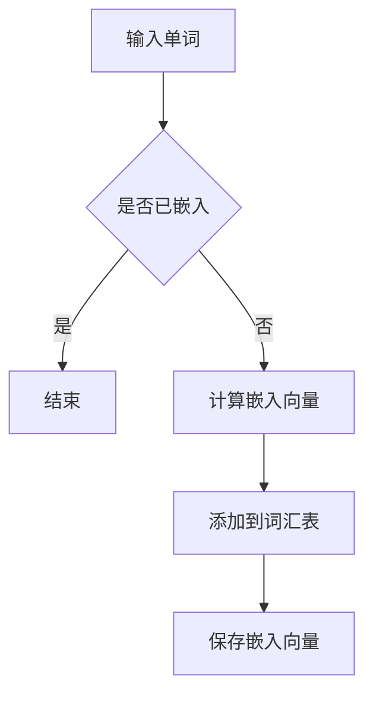
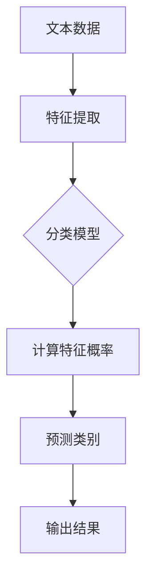
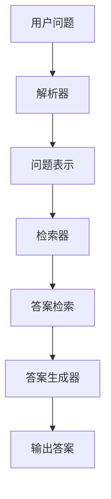

                 


## 文章标题：自然语言处理在智能写作助手中的创新

### 关键词：自然语言处理、智能写作助手、文本生成、文本理解、深度学习

### 摘要：
本文深入探讨了自然语言处理（NLP）在智能写作助手中的应用创新。从基础到应用，文章详细介绍了NLP的核心概念、关键技术，以及其在智能写作助手中的实现策略和创新。通过分析文本预处理、文本理解与生成等关键技术，本文揭示了NLP如何提升写作效率与质量，并展望了未来NLP在智能写作助手领域的挑战与机遇。

## 目录大纲

### 第1章：自然语言处理概述

### 第2章：文本预处理

### 第3章：词嵌入与语义表示

### 第4章：文本分类与情感分析

### 第5章：问答系统

### 第6章：文本生成与摘要

### 第7章：写作辅助与生成写作模型

### 第8章：基于NLP的智能写作助手设计与实现

### 第9章：实战案例解析

### 第10章：未来展望与挑战

### 附录

### 附录 A：常用NLP工具与库

### 附录 B：参考资料与拓展阅读

### 附录 C：核心算法原理流程图

### 附录 D：数学模型详解

### 附录 E：代码实战

## 第1章：自然语言处理概述

### 1.1 NLP的定义与发展历程

自然语言处理（Natural Language Processing，简称NLP）是计算机科学和人工智能领域中的一个重要分支，它旨在让计算机理解和生成人类语言。NLP的研究目标包括语言理解、语言生成、语言翻译等，其核心任务是解决人与计算机之间的自然语言交互问题。

NLP的发展历程可以分为三个主要阶段：

1. **规则驱动阶段**（1950s-1980s）：这一阶段依赖于人工编写的规则来处理自然语言，例如句法分析、语义分析等。然而，由于规则繁琐且难以覆盖所有情况，这种方法的效果并不理想。

2. **基于统计的方法阶段**（1990s-2000s）：随着大规模语料库和计算技术的发展，基于统计的方法开始在NLP中得到广泛应用。这一阶段引入了隐马尔可夫模型（HMM）、条件概率模型等，使得NLP在文本分类、信息提取等方面取得了显著进展。

3. **深度学习方法阶段**（2010s至今）：深度学习的兴起为NLP带来了革命性的变化。通过多层神经网络，深度学习方法在语音识别、机器翻译、文本分类等任务中取得了巨大的成功。尤其是深度学习模型如卷积神经网络（CNN）和循环神经网络（RNN）的应用，使得NLP的性能大幅提升。

### 1.2 NLP的主要任务

NLP的主要任务包括但不限于以下几类：

1. **文本分类**：将文本数据分类到预定义的类别中，如新闻分类、情感分析等。文本分类是NLP中常见且重要的任务，广泛应用于推荐系统、垃圾邮件过滤等领域。

2. **信息提取**：从文本中抽取结构化信息，如命名实体识别、关系抽取等。信息提取是NLP的关键任务之一，对于构建知识图谱和语义搜索引擎具有重要意义。

3. **语义理解**：理解文本中的语义信息，包括语义角色标注、语义关系识别等。语义理解是NLP的难点之一，涉及到语言的深度理解和上下文感知。

4. **文本生成**：根据输入的文本或信息生成新的文本，如机器翻译、自动摘要等。文本生成是NLP的重要应用之一，可以用于生成新闻报道、文章摘要等。

5. **对话系统**：实现人与计算机之间的自然语言对话，如语音助手、聊天机器人等。对话系统是NLP在交互领域的应用，旨在提供自然、流畅的交互体验。

### 1.3 NLP的关键技术

NLP的关键技术涵盖了多个方面，以下是其中一些重要的技术：

1. **分词**：将连续的文本切分成词或句子级别的单元。分词是NLP的基本任务之一，对于后续的语言处理任务至关重要。

2. **词性标注**：对文本中的每个词进行词性标注，如名词、动词、形容词等。词性标注有助于理解文本的语义结构。

3. **命名实体识别**：识别文本中的命名实体，如人名、地名、组织机构名等。命名实体识别是信息提取的重要组成部分，对于构建知识图谱和智能问答系统具有重要意义。

4. **词嵌入**：将词转换为向量表示，以便在计算机中进行处理。词嵌入是一种有效的语义表示方法，对于文本分类、文本生成等任务具有重要意义。

5. **语言模型**：预测下一个单词或字符的概率分布，用于文本生成和语音识别等任务。语言模型是NLP中重要的概率模型，常用的有n-gram模型、神经网络语言模型等。

6. **序列标注**：对序列数据（如文本）中的每个元素进行标注，如词性标注、命名实体识别等。序列标注是NLP中常见的任务，常用于构建分类器和序列模型。

### 1.4 NLP在智能写作助手中的应用

智能写作助手是NLP在写作领域的典型应用，它利用NLP技术帮助用户生成文章、报告、邮件等文本内容。智能写作助手通常包含以下功能：

1. **文本生成**：根据用户提供的主题、摘要或关键词，智能写作助手可以生成完整的文章或段落。文本生成技术主要基于语言模型和序列生成模型，如生成式神经网络。

2. **写作辅助**：智能写作助手可以提供写作建议，如语法纠正、风格调整等。这通常涉及到文本分类、词性标注等技术。

3. **自动摘要**：智能写作助手可以自动生成文章的摘要，帮助用户快速了解文章的主要内容。自动摘要技术主要基于文本分类、文本生成和文本摘要算法。

4. **问答系统**：智能写作助手可以回答用户关于文章内容的问题，提供相关的事实和观点。这通常涉及到问答系统、知识图谱等技术。

5. **个性化写作**：智能写作助手可以根据用户的写作风格和偏好，生成符合用户需求的文本内容。个性化写作需要结合用户的历史写作记录和个性化偏好。

### 1.5 NLP在智能写作助手中的优势

NLP在智能写作助手中的应用带来了诸多优势：

1. **提高写作效率**：智能写作助手可以快速生成文章或段落，节省用户的写作时间。

2. **提升写作质量**：智能写作助手可以提供语法纠正、风格调整等写作建议，提高文章的写作质量。

3. **多样化写作风格**：智能写作助手可以根据用户的喜好，生成不同风格的文本，满足多样化的写作需求。

4. **降低写作难度**：对于非专业写手，智能写作助手可以提供写作指导，降低写作难度。

5. **扩展写作领域**：智能写作助手可以帮助用户在多个领域进行写作，如科技、经济、文化等，拓宽写作范围。

## 小结

本章概述了自然语言处理（NLP）的定义、发展历程、主要任务和关键技术。同时，探讨了NLP在智能写作助手中的应用和创新，展示了NLP如何提升写作效率和写作质量。在接下来的章节中，我们将进一步深入分析NLP的关键技术，并探讨其在智能写作助手中的具体实现和应用。

## 第2章：文本预处理

### 2.1 文本清洗与标准化

文本清洗和标准化是自然语言处理（NLP）中的基础步骤，其目的是去除文本中的噪声和格式，使文本更加干净、规范，从而方便后续的处理和分析。

#### 文本清洗

文本清洗的过程通常包括以下步骤：

1. **去除HTML标签**：HTML标签是网页文本中常见的一种格式，它们通常不是文本分析所需要的内容。通过正则表达式或其他方法，可以将HTML标签从文本中去除。

   ```python
   import re

   text_with_html = '<p>Hello, world!</p>'
   text_without_html = re.sub('<.*?>', '', text_with_html)
   ```

2. **去除特殊字符**：文本中可能包含一些特殊的字符，如符号、换行符等。这些字符可能会干扰文本分析，因此需要去除。

   ```python
   text_without_special_chars = re.sub(r'[^\w\s]', '', text)
   ```

3. **去除停用词**：停用词是文本中常见的无意义词汇，如“的”、“是”、“了”等。去除停用词可以提高文本分析的精度和效率。

   ```python
   from nltk.corpus import stopwords
   stop_words = set(stopwords.words('english'))
   text_without_stopwords = ' '.join([word for word in text.split() if word not in stop_words])
   ```

4. **转换为小写**：将文本转换为小写可以减少数据冗余，提高文本分析的效率。

   ```python
   text_in_lower_case = text.lower()
   ```

#### 文本标准化

文本标准化的过程主要包括以下步骤：

1. **词干提取**：词干提取（Stemming）是将单词缩减到其词干形式的过程。常见的词干提取方法包括 Porter stemmer 和 Snowball stemmer。

   ```python
   from nltk.stem import PorterStemmer
   stemmer = PorterStemmer()
   stemmed_words = [stemmer.stem(word) for word in text.split()]
   ```

2. **词形还原**：词形还原（Lemmatization）是将单词缩减到其词形（Lexical form）的过程，它比词干提取更加精确。Lemmatization 需要使用词典和词性标注。

   ```python
   from nltk.stem import WordNetLemmatizer
   lemmatizer = WordNetLemmatizer()
   lemmatized_words = [lemmatizer.lemmatize(word) for word in text.split()]
   ```

3. **数字标准化**：将数字统一格式化，如将所有数字转换为整数或浮点数。

   ```python
   text_with standardized_numbers = re.sub(r'\D', '', text)  # 去除非数字字符
   numbers = [int(num) for num in text_with_standardized_numbers.split()]
   ```

4. **日期标准化**：将日期统一格式化，如将日期转换为 YYYY-MM-DD 格式。

   ```python
   from dateutil.parser import parse
   dates = [parse(date).strftime('%Y-%m-%d') for date in text.split()]
   ```

### 2.2 分词与词性标注

分词（Tokenization）是将文本切分成词或短语的步骤，这是文本处理的基础。词性标注（Part-of-Speech Tagging）则是为文本中的每个词分配一个词性标签，如名词、动词、形容词等。

#### 分词

分词的方法有多种，包括基于规则的方法、基于统计的方法和基于深度学习的方法。下面是几种常见的分词方法：

1. **基于规则的方法**：例如正则表达式分词，它使用预定义的正则表达式来切分文本。

   ```python
   text = "这是一段中文文本。"
   tokens = re.split(r'\W+', text)
   ```

2. **基于统计的方法**：例如基于最大熵模型、隐马尔可夫模型（HMM）等，它们使用大量训练数据来学习文本的分词模式。

3. **基于深度学习的方法**：例如使用长短时记忆网络（LSTM）或卷积神经网络（CNN）进行分词，这些方法在近年来得到了广泛应用。

   ```python
   from keras.preprocessing.text import Tokenizer
   tokenizer = Tokenizer(num_words=10000)
   tokenizer.fit_on_texts(texts)
   word_index = tokenizer.word_index
   ```

#### 词性标注

词性标注的方法也分为基于规则的方法、基于统计的方法和基于深度学习的方法。下面是几种常见的词性标注方法：

1. **基于规则的方法**：例如使用词典和规则库来为文本中的每个词分配词性标签。

2. **基于统计的方法**：例如使用最大熵模型、条件随机场（CRF）等，它们使用大量训练数据来学习文本的词性标注模式。

3. **基于深度学习的方法**：例如使用循环神经网络（RNN）或双向长短期记忆网络（BiLSTM）进行词性标注，这些方法在近年来得到了广泛应用。

   ```python
   from keras.models import Model
   from keras.layers import Input, Embedding, LSTM, Dense

   input_ = Input(shape=(max_sequence_length,))
   embedding_ = Embedding(input_dim, 128)(input_)
   lstm_ = LSTM(128)(embedding_)
   output_ = Dense(1, activation='sigmoid')(lstm_)

   model = Model(inputs=input_, outputs=output_)
   model.compile(optimizer='adam', loss='binary_crossentropy', metrics=['accuracy'])
   ```

### 2.3 命名实体识别

命名实体识别（Named Entity Recognition，简称NER）是文本处理中的一个重要任务，它旨在识别文本中的命名实体，如人名、地名、组织机构名等。命名实体识别对于信息提取、知识图谱构建等任务具有重要意义。

命名实体识别的方法包括以下几种：

1. **基于规则的方法**：使用预定义的规则库来识别命名实体，例如命名实体识别规则库、词典等。

2. **基于统计的方法**：使用最大熵模型、条件随机场（CRF）等，根据训练数据学习命名实体识别模式。

3. **基于深度学习的方法**：使用卷积神经网络（CNN）、循环神经网络（RNN）等，直接从原始文本中学习命名实体识别模型。

   ```python
   from keras.layers import Embedding, Conv1D, MaxPooling1D, LSTM, Dense

   model = Sequential()
   model.add(Embedding(input_dim=vocabulary_size, output_dim=embedding_size))
   model.add(Conv1D(filters=128, kernel_size=5, activation='relu'))
   model.add(MaxPooling1D(pool_size=5))
   model.add(LSTM(128))
   model.add(Dense(num_classes, activation='softmax'))

   model.compile(optimizer='adam', loss='categorical_crossentropy', metrics=['accuracy'])
   ```

### 小结

本章介绍了文本预处理的关键技术，包括文本清洗与标准化、分词与词性标注以及命名实体识别。文本预处理是NLP中的基础步骤，对于后续的语言处理任务具有重要意义。通过文本清洗和标准化，可以去除文本中的噪声和格式，使文本更加干净、规范；通过分词和词性标注，可以为文本中的每个词分配词性标签，从而更好地理解文本的语义；通过命名实体识别，可以识别文本中的命名实体，为信息提取和知识图谱构建提供支持。在下一章中，我们将探讨词嵌入与语义表示，以及它们在NLP中的应用。

## 第3章：词嵌入与语义表示

### 3.1 词嵌入技术

词嵌入（Word Embedding）是将词汇映射到向量空间的一种技术，它能够将文本数据转换为计算机可以处理的数字形式。词嵌入不仅保留了词语的语义信息，还捕捉了词语之间的上下文关系，从而在许多NLP任务中表现出色。

#### 词嵌入的重要性

词嵌入在NLP中有以下几个关键作用：

1. **文本向量化**：词嵌入将每个词转换为一个固定长度的向量，使得文本数据可以输入到机器学习模型中。

2. **语义表示**：词嵌入捕捉了词语之间的语义关系，使得具有相似语义的词语在向量空间中距离更近。

3. **高效计算**：向量计算相比原始文本处理更高效，能够加速NLP模型的训练和推断过程。

#### 常见的词嵌入技术

1. **基于统计的方法**：

   - **Word2Vec**：Word2Vec是最早的词嵌入模型，它通过负采样技术训练词向量，使得具有相似上下文的词语在向量空间中更接近。

   - **Skip-Gram**：Skip-Gram是Word2Vec的变体，它通过预测上下文中的词来训练词向量。

2. **基于神经网络的方法**：

   - **GloVe（Global Vectors for Word Representation）**：GloVe是一种基于全局矩阵分解的方法，通过优化词向量矩阵的奇异值分解，得到高质量的词向量。

   - **FastText**：FastText在Word2Vec的基础上引入了词袋模型，同时考虑了词语的组成部分，从而提高了词嵌入的准确性。

#### 词嵌入的实现原理

以Word2Vec为例，其实现原理如下：

1. **词向量模型**：

   - **输入层**：给定一个词作为输入，模型需要预测该词的上下文。
   - **隐藏层**：通过神经网络将输入词映射到一个隐藏层。
   - **输出层**：隐藏层中的每个神经元映射到一个输出词的向量。

2. **损失函数**：

   - **负采样**：在训练过程中，除了正样本（上下文中的词）外，还随机采样负样本（非上下文中的词）。模型的目的是最大化正样本的相似度，同时最小化负样本的相似度。

3. **优化算法**：

   - **梯度下降**：通过计算损失函数的梯度，调整词向量的参数。

### 3.2 语义表示模型

语义表示模型是词嵌入的延伸，它旨在更准确地捕捉词语的语义信息。以下是一些常见的语义表示模型：

#### 1. 词嵌入与语义表示的关系

词嵌入和语义表示密切相关，词嵌入是语义表示的基础。然而，词嵌入的局限性在于它仅能捕捉低层次的语义信息，而语义表示模型则致力于挖掘更深层次的语义关系。

#### 2. 常见的语义表示模型

1. **BERT（Bidirectional Encoder Representations from Transformers）**：

   - **双向编码器**：BERT使用双向Transformer编码器来学习文本的上下文表示。
   - **预训练和微调**：BERT首先在大规模语料库上进行预训练，然后在小规模任务数据上进行微调。

2. **ELMO（Embeddings from Language Models）**：

   - **多任务学习**：ELMO通过在多个NLP任务上进行训练，学习到丰富的语义表示。
   - **上下文感知**：ELMO的词向量根据上下文动态调整，从而更好地捕捉词语的语义信息。

3. **RoBERTa（A Robustly Optimized BERT Pretraining Approach）**：

   - **优化策略**：RoBERTa在BERT的基础上进行了多种优化，如动态掩码、更长的上下文窗口等，以提升模型的效果。

#### 3. 语义表示的实现原理

以BERT为例，其实现原理如下：

1. **Transformer编码器**：

   - **多头自注意力**：BERT使用多头自注意力机制来学习文本的上下文关系。
   - **位置嵌入**：BERT通过位置嵌入（Positional Embedding）来捕获文本中的顺序信息。

2. **预训练和微调**：

   - **预训练**：BERT在大规模语料库上进行预训练，学习到通用的语言表示。
   - **微调**：在具体任务上，BERT通过微调来适应特定的任务需求。

3. **损失函数**：

   - **下一句预测**：BERT通过预测下一个句子来学习文本的连贯性。
   - **分类任务**：对于分类任务，BERT通过损失函数（如交叉熵）来优化模型。

### 3.3 语义表示在NLP中的应用

语义表示模型在NLP中有广泛的应用，以下是一些典型的应用场景：

1. **文本分类**：使用语义表示模型可以有效地进行文本分类，如情感分析、新闻分类等。

2. **问答系统**：语义表示模型可以帮助问答系统理解用户的问题，并从大量文本中找到相关答案。

3. **机器翻译**：语义表示模型可以提高机器翻译的准确性，通过捕捉语言的深层语义信息，减少翻译错误。

4. **文本生成**：语义表示模型可以用于文本生成任务，如文章摘要、故事创作等。

### 小结

本章介绍了词嵌入与语义表示模型，包括其重要性、实现原理以及在NLP中的应用。词嵌入技术通过将词汇映射到向量空间，使得文本数据可以被计算机处理，而语义表示模型则致力于挖掘更深层次的语义关系，提升NLP任务的效果。在下一章中，我们将探讨文本分类与情感分析，进一步了解NLP在理解文本语义方面的应用。

## 第4章：文本分类与情感分析

### 4.1 文本分类算法

文本分类是自然语言处理（NLP）中的一个重要任务，它旨在将文本数据分类到预定义的类别中。文本分类广泛应用于新闻分类、情感分析、垃圾邮件过滤等领域。

#### 基于传统机器学习的文本分类算法

1. **朴素贝叶斯分类器**：

   - **原理**：朴素贝叶斯分类器基于贝叶斯定理和特征条件独立性假设，通过计算特征的概率分布和类别的概率来预测文本类别。

   - **实现**：首先，使用朴素贝叶斯模型计算每个类别的条件概率分布；然后，根据文本中各特征的概率分布，计算每个类别的后验概率，选择概率最大的类别作为预测结果。

     ```python
     import numpy as np
     from sklearn.naive_bayes import MultinomialNB

     # 训练朴素贝叶斯分类器
     clf = MultinomialNB()
     clf.fit(X_train, y_train)

     # 预测文本类别
     y_pred = clf.predict(X_test)
     ```

2. **支持向量机（SVM）**：

   - **原理**：支持向量机是一种基于最大间隔的分类算法，它通过找到最佳的超平面将不同类别的文本数据分开。

   - **实现**：首先，将文本数据转换为高维空间；然后，使用核函数将数据映射到高维空间，寻找最佳的超平面。

     ```python
     from sklearn.svm import SVC

     # 训练支持向量机分类器
     clf = SVC(kernel='linear')
     clf.fit(X_train, y_train)

     # 预测文本类别
     y_pred = clf.predict(X_test)
     ```

3. **随机森林分类器**：

   - **原理**：随机森林是一种基于决策树的集成学习方法，它通过构建多棵决策树，并结合投票结果进行分类。

   - **实现**：首先，为每棵决策树随机选择特征和样本子集；然后，每棵树进行分类，最终通过投票决定文本类别。

     ```python
     from sklearn.ensemble import RandomForestClassifier

     # 训练随机森林分类器
     clf = RandomForestClassifier()
     clf.fit(X_train, y_train)

     # 预测文本类别
     y_pred = clf.predict(X_test)
     ```

#### 基于深度学习的文本分类算法

1. **卷积神经网络（CNN）**：

   - **原理**：卷积神经网络通过卷积层提取文本的特征表示，然后通过全连接层进行分类。

   - **实现**：首先，将文本转换为词嵌入向量；然后，使用卷积层提取特征；最后，通过全连接层分类。

     ```python
     from keras.models import Sequential
     from keras.layers import Conv1D, MaxPooling1D, Flatten, Dense

     model = Sequential()
     model.add(Conv1D(filters=128, kernel_size=5, activation='relu', input_shape=(max_sequence_length, embedding_dim)))
     model.add(MaxPooling1D(pool_size=5))
     model.add(Flatten())
     model.add(Dense(num_classes, activation='softmax'))

     model.compile(optimizer='adam', loss='categorical_crossentropy', metrics=['accuracy'])
     ```

2. **循环神经网络（RNN）**：

   - **原理**：循环神经网络通过递归地处理序列数据，捕捉文本中的时间依赖关系。

   - **实现**：首先，将文本转换为词嵌入向量；然后，使用RNN层处理序列数据；最后，通过全连接层分类。

     ```python
     from keras.models import Sequential
     from keras.layers import Embedding, LSTM, Dense

     model = Sequential()
     model.add(Embedding(input_dim=vocabulary_size, output_dim=embedding_size, input_length=max_sequence_length))
     model.add(LSTM(128))
     model.add(Dense(num_classes, activation='softmax'))

     model.compile(optimizer='adam', loss='categorical_crossentropy', metrics=['accuracy'])
     ```

3. **Transformer模型**：

   - **原理**：Transformer模型通过多头自注意力机制和编码器-解码器结构，有效地处理长距离依赖问题。

   - **实现**：首先，将文本转换为词嵌入向量；然后，使用编码器处理文本；最后，通过解码器生成分类结果。

     ```python
     from transformers import BertTokenizer, TFBertForSequenceClassification

     tokenizer = BertTokenizer.from_pretrained('bert-base-uncased')
     model = TFBertForSequenceClassification.from_pretrained('bert-base-uncased')

     # 预处理文本
     inputs = tokenizer(text, padding='max_length', truncation=True, max_length=max_sequence_length)

     # 预测文本类别
     logits = model(inputs)[0]
     probabilities = tf.nn.softmax(logits, axis=1)
     predicted_class = tf.argmax(probabilities, axis=1)
     ```

### 4.2 情感分析原理与实践

情感分析（Sentiment Analysis）是文本分类的一种特殊形式，它旨在识别文本中所表达的情感倾向，如正面、负面或中性。

#### 情感分析的基本原理

情感分析的基本原理包括以下步骤：

1. **文本预处理**：包括去除HTML标签、特殊字符、停用词去除、词干提取等。

2. **特征提取**：将预处理后的文本转换为特征向量，常见的特征提取方法包括词袋模型、TF-IDF、词嵌入等。

3. **分类器训练**：使用训练数据集，通过机器学习算法（如朴素贝叶斯、SVM、随机森林等）训练分类器。

4. **情感分类**：使用训练好的分类器对测试数据进行分类，预测其情感倾向。

#### 情感分析的实现方法

1. **基于规则的方法**：

   - **原理**：通过编写规则来识别文本中的情感词，并根据情感词的语义倾向进行分类。

   - **实现**：使用规则库和情感词典，如SentiWordNet、VADER等，对文本进行情感分析。

     ```python
     from nltk.sentiment import SentimentIntensityAnalyzer

     analyzer = SentimentIntensityAnalyzer()
     sentiment = analyzer.polarity_scores(text)
     sentiment_score = sentiment['compound']
     ```

2. **基于机器学习的方法**：

   - **原理**：使用机器学习算法（如朴素贝叶斯、SVM、随机森林等）训练分类器，对文本进行情感分类。

   - **实现**：使用训练数据集，通过特征提取和分类器训练，构建情感分析模型。

     ```python
     from sklearn.feature_extraction.text import TfidfVectorizer
     from sklearn.naive_bayes import MultinomialNB

     # 特征提取
     vectorizer = TfidfVectorizer()
     X = vectorizer.fit_transform(corpus)

     # 分类器训练
     clf = MultinomialNB()
     clf.fit(X_train, y_train)

     # 情感分类
     y_pred = clf.predict(X_test)
     ```

3. **基于深度学习的方法**：

   - **原理**：使用深度学习模型（如CNN、RNN、BERT等）对文本进行情感分类。

   - **实现**：使用预训练的深度学习模型，如BERT，进行情感分类。

     ```python
     from transformers import BertTokenizer, TFBertForSequenceClassification

     tokenizer = BertTokenizer.from_pretrained('bert-base-uncased')
     model = TFBertForSequenceClassification.from_pretrained('bert-base-uncased')

     # 预处理文本
     inputs = tokenizer(text, padding='max_length', truncation=True, max_length=max_sequence_length)

     # 预测文本情感
     logits = model(inputs)[0]
     probabilities = tf.nn.softmax(logits, axis=1)
     sentiment = 'positive' if np.argmax(probabilities) == 1 else 'negative'
     ```

### 4.3 情感分析的应用场景

情感分析在多个领域有广泛的应用：

1. **社交媒体分析**：分析用户评论、微博等社交媒体内容，了解公众对产品、事件或品牌的看法。

2. **市场调研**：通过分析用户反馈，了解消费者对产品或服务的态度，为市场营销策略提供依据。

3. **情感监测**：对金融新闻、股票报告等进行分析，预测市场趋势和投资者情绪。

4. **客服与支持**：分析用户咨询和反馈，提供个性化的解决方案和改进建议。

### 小结

本章介绍了文本分类和情感分析的基本概念、算法原理和实现方法。文本分类和情感分析是NLP中的重要任务，通过这些任务，我们可以从大量文本数据中提取有价值的信息。在下一章中，我们将探讨问答系统，进一步了解NLP在信息检索和智能交互中的应用。

## 第5章：问答系统

### 5.1 问答系统的基本架构

问答系统（Question Answering System）是自然语言处理（NLP）领域中的一项重要技术，它旨在使计算机能够理解自然语言问题并给出准确的答案。问答系统通常包括以下几个关键组件：

1. **问题解析器**：问题解析器是问答系统的第一步，它的任务是理解用户提出的问题，并将其转换为结构化的信息。问题解析器通常包括自然语言理解（NLU）模块和语义解析模块。

   - **自然语言理解（NLU）模块**：NLU模块负责处理原始问题，进行分词、词性标注、命名实体识别等操作，以提取出问题中的关键信息。
   
   - **语义解析模块**：语义解析模块则进一步理解问题的语义，识别出问题的意图和实体，并将其映射到具体的语义表示上。

2. **答案检索器**：答案检索器是问答系统的核心组件，负责从大规模的文本数据中检索出与问题相关的答案。答案检索器通常采用以下几种策略：

   - **基于关键词匹配**：直接通过关键词匹配从数据库中检索答案，这种方法简单但效果有限。
   
   - **基于统计模型**：使用统计模型（如TF-IDF、Word2Vec等）来计算问题和文档之间的相似度，从而检索出可能的答案。
   
   - **基于深度学习**：使用深度学习模型（如BERT、Transformer等）来理解问题的上下文和语义，从而检索出更准确的答案。

3. **答案生成器**：答案生成器负责将检索到的答案进行加工和整理，以形成一个连贯、自然的回答。答案生成器通常包括以下几种方法：

   - **模板匹配**：使用预定义的模板将答案组合起来，这种方法简单但灵活性较差。
   
   - **自然语言生成（NLG）**：使用自然语言生成技术将答案转换为自然语言文本，这种方法能够生成更自然的回答，但实现复杂度较高。

4. **反馈机制**：问答系统通常包含一个反馈机制，用于收集用户对答案的反馈，以不断优化系统的性能。反馈机制可以通过用户评分、对话记录等方式来实现。

### 5.2 知识图谱在问答系统中的应用

知识图谱（Knowledge Graph）是一种结构化数据表示方法，它通过节点和边的形式来表示实体及其关系。知识图谱在问答系统中起着至关重要的作用，它可以提供丰富的背景知识和语义关系，从而提高问答系统的准确性和灵活性。

1. **知识图谱的构建**：知识图谱的构建通常包括以下步骤：

   - **实体识别**：从文本数据中识别出关键实体，如人名、地名、组织机构名等。
   
   - **关系抽取**：识别实体之间的关系，如“工作于”、“位于”等。
   
   - **实体链接**：将文本中的实体与知识图谱中的实体进行映射，建立实体之间的关联关系。

2. **知识图谱在问答系统中的应用**：

   - **实体识别与分类**：利用知识图谱中的实体信息和关系，对问题中的实体进行识别和分类，从而缩小搜索范围。
   
   - **关系推理**：基于知识图谱中的关系信息，进行逻辑推理和语义分析，以更好地理解问题的意图和语义。
   
   - **答案检索**：利用知识图谱中的关系和实体信息，从大规模的文本数据中检索出可能的答案。
   
   - **答案生成**：结合知识图谱中的背景知识和语义信息，生成更准确、自然的答案。

### 5.3 问答系统的实现方法

问答系统的实现方法主要包括基于规则的方法和基于机器学习的方法。

1. **基于规则的方法**：

   - **原理**：基于规则的方法通过编写一系列的规则来匹配问题和答案，其核心在于规则的编写和调试。
   
   - **实现**：首先，定义一系列的匹配规则，如关键词匹配、模式匹配等；然后，根据规则从知识库或文本数据中检索出可能的答案。

     ```python
     def match_question(question):
         if 'who' in question:
             return "This question asks for a person."
         elif 'when' in question:
             return "This question asks for a time."
         else:
             return "This question is not recognized."
     ```

2. **基于机器学习的方法**：

   - **原理**：基于机器学习的方法使用大量的训练数据，通过机器学习算法来训练模型，从而实现问答系统的自动化。
   
   - **实现**：首先，收集大量的问答对作为训练数据；然后，使用自然语言理解（NLU）模块提取问题中的关键信息；接着，使用答案检索器和答案生成器来生成答案。

     ```python
     from transformers import BertTokenizer, TFBertForQuestionAnswering

     tokenizer = BertTokenizer.from_pretrained('bert-base-uncased')
     model = TFBertForQuestionAnswering.from_pretrained('bert-base-uncased')

     # 预处理问题和文本
     question_input = tokenizer(question, padding='max_length', truncation=True, max_length=max_sequence_length)
     text_input = tokenizer(text, padding='max_length', truncation=True, max_length=max_sequence_length)

     # 预测答案
     start_logits, end_logits = model(question_input, text_input)[0]

     # 解析答案
     start_index = np.argmax(start_logits)
     end_index = np.argmax(end_logits)
     answer = text[start_index:end_index + 1]
     ```

### 5.4 问答系统的挑战与优化

问答系统在实际应用中面临着诸多挑战，主要包括：

1. **问题理解和语义解析**：如何准确理解用户的问题，并提取出关键信息，是问答系统的关键挑战之一。

2. **答案准确性**：如何从大量文本数据中检索出准确、相关的答案，是问答系统的另一个重要挑战。

3. **多样性和自然性**：如何生成多样化和自然的答案，以满足用户的不同需求，是问答系统需要不断优化的方向。

为了解决这些问题，可以采取以下优化策略：

1. **大规模预训练模型**：使用大规模预训练模型（如BERT、GPT等），以提高问题理解和答案生成的准确性。

2. **多模态融合**：结合文本、图像、音频等多种数据源，提高问答系统的多样性和自然性。

3. **自适应学习**：通过不断收集用户反馈，自适应调整模型参数，以提高问答系统的性能。

### 小结

本章介绍了问答系统的基本架构、知识图谱的应用以及问答系统的实现方法。问答系统是NLP领域的一个重要应用，它通过自然语言理解和语义分析，能够为用户提供准确、自然的答案。在下一章中，我们将探讨文本生成与摘要，进一步了解NLP在内容创作和摘要生成方面的应用。

## 第6章：文本生成与摘要

### 6.1 机器翻译技术

机器翻译（Machine Translation，MT）是自然语言处理（NLP）领域的一个重要分支，它旨在利用计算机自动将一种语言的文本翻译成另一种语言。机器翻译技术对于促进跨语言交流、增强国际化合作具有重要意义。

#### 机器翻译的基本原理

机器翻译的基本原理可以分为以下几类：

1. **基于规则的方法**：这种方法依赖于预先编写的规则，包括语法规则、词汇规则和语境规则。基于规则的方法通常涉及大量的手动编辑，因此其适用性和扩展性有限。

2. **基于统计的方法**：这种方法使用大量双语文本进行训练，通过统计模型来预测目标语言的句子。常见的统计机器翻译模型包括基于短语翻译模型（如IBM模型）和基于句子翻译模型（如统计机器翻译系统SMT）。

3. **基于神经网络的机器翻译**：这种方法利用深度学习模型，特别是序列到序列（Seq2Seq）模型和注意力机制（Attention Mechanism）来学习翻译任务。基于神经网络的机器翻译在近年来取得了显著进展，如谷歌翻译使用的Transformer模型。

#### 机器翻译的关键技术

1. **编码器和解码器**：在基于神经网络的机器翻译中，编码器（Encoder）负责将源语言文本编码为向量表示，而解码器（Decoder）负责将这些向量解码为目标语言文本。

2. **注意力机制**：注意力机制用于解决长距离依赖问题，它使解码器能够关注源语言文本中的关键部分，从而提高翻译的准确性。

3. **多语言模型**：多语言模型（如低资源语言翻译）通过将源语言和目标语言映射到一个共同的中间语言，从而实现低资源语言的翻译。

#### 机器翻译的实现步骤

1. **数据预处理**：包括源语言和目标语言的分词、去除停用词、词性标注等。

2. **编码**：使用编码器将源语言文本转换为向量表示。

3. **解码**：使用解码器生成目标语言文本。

4. **后处理**：包括语法调整、词形还原等，以生成更自然、准确的翻译结果。

#### 实例：基于神经网络的机器翻译实现

以下是一个简单的基于神经网络的机器翻译实现示例：

```python
from transformers import BertTokenizer, TFBertForMaskedLM

# 加载预训练的编码器和解码器
tokenizer = BertTokenizer.from_pretrained('bert-base-uncased')
model = TFBertForMaskedLM.from_pretrained('bert-base-uncased')

# 输入源语言文本
source_text = "Hello, how are you?"

# 分词和编码
input_ids = tokenizer.encode(source_text, return_tensors='tf')

# 预测目标语言文本
predicted_ids = model(input_ids)

# 解码目标语言文本
predicted_text = tokenizer.decode(predicted_ids, skip_special_tokens=True)
```

### 6.2 文本摘要算法

文本摘要（Text Summarization）是将长文本简化为较短但包含关键信息的版本的技术。文本摘要广泛应用于新闻摘要、电子邮件摘要、文献摘要等领域，有助于提高信息获取的效率和准确性。

#### 文本摘要的基本原理

文本摘要的基本原理可以分为以下几类：

1. **抽取式摘要**：这种方法从原始文本中直接提取关键句子或段落作为摘要。常见的抽取式摘要方法包括基于统计的方法和基于规则的方法。

2. **生成式摘要**：这种方法通过生成新的文本来创建摘要，生成的文本通常更自然、连贯。生成式摘要通常使用序列到序列（Seq2Seq）模型、变压器（Transformer）模型等深度学习模型。

3. **混合式摘要**：这种方法结合抽取式摘要和生成式摘要的优点，先抽取关键句子，然后进行再生成，以提高摘要的质量。

#### 文本摘要的关键技术

1. **关键句子提取**：这种方法通过分析文本的结构和语义，识别出关键句子或段落，从而生成摘要。常见的算法包括基于统计的方法和基于深度学习的方法。

2. **文本生成**：这种方法通过生成新的文本来创建摘要，通常使用序列到序列（Seq2Seq）模型、变压器（Transformer）模型等深度学习模型。

3. **多模态融合**：这种方法结合文本、图像、视频等多种数据源，生成更丰富、全面的摘要。

#### 文本摘要的实现步骤

1. **数据预处理**：包括文本清洗、分词、词性标注等。

2. **关键句子提取**：从原始文本中提取关键句子或段落。

3. **文本生成**：使用生成模型生成摘要文本。

4. **后处理**：对生成的摘要文本进行语法调整、去除冗余信息等。

#### 实例：基于神经网络的文本摘要实现

以下是一个简单的基于神经网络的文本摘要实现示例：

```python
from transformers import BertTokenizer, TFBertForMaskedLM

# 加载预训练的编码器和解码器
tokenizer = BertTokenizer.from_pretrained('bert-base-uncased')
model = TFBertForMaskedLM.from_pretrained('bert-base-uncased')

# 输入原始文本
original_text = "This is a sample text for text summarization."

# 分词和编码
input_ids = tokenizer.encode(original_text, return_tensors='tf')

# 预测摘要文本
predicted_ids = model(input_ids)

# 解码摘要文本
summarized_text = tokenizer.decode(predicted_ids, skip_special_tokens=True)
```

### 6.3 智能写作助手中的文本生成与摘要

智能写作助手（Smart Writing Assistant）是一种利用NLP技术自动生成文章、报告、邮件等文本内容的工具。文本生成与摘要在智能写作助手中起着至关重要的作用，它们能够帮助用户提高写作效率和质量。

#### 文本生成在智能写作助手中的应用

1. **自动写作辅助**：智能写作助手可以根据用户提供的主题、关键词或摘要，自动生成文章或段落，从而节省用户的写作时间。

2. **个性化写作**：智能写作助手可以根据用户的历史写作风格和偏好，生成符合用户需求的文本内容，从而提高写作的质量和一致性。

3. **内容创作**：智能写作助手可以生成新的内容，如新闻报道、产品描述、广告文案等，为用户提供多样化的写作选择。

#### 文本摘要在智能写作助手中的应用

1. **文章摘要**：智能写作助手可以自动生成文章的摘要，帮助用户快速了解文章的主要内容，从而提高信息获取的效率。

2. **邮件摘要**：智能写作助手可以为用户生成的邮件提供摘要，帮助用户快速了解邮件的主要内容，从而提高邮件处理的效率。

3. **文档摘要**：智能写作助手可以自动生成文档的摘要，为用户提供文档的概览，从而提高文档管理的效率。

### 小结

本章介绍了文本生成与摘要的基本原理、算法和实现方法，以及它们在智能写作助手中的应用。文本生成与摘要是NLP领域中的重要技术，它们能够帮助用户提高写作效率和质量，实现自动化内容创作和摘要生成。在下一章中，我们将探讨写作辅助与生成写作模型，进一步了解NLP在智能写作助手中的应用和创新。

## 第7章：写作辅助与生成写作模型

### 7.1 写作辅助工具介绍

写作辅助工具（Writing Assistance Tools）是利用自然语言处理（NLP）技术帮助用户提高写作质量和效率的一系列工具。这些工具可以通过语法检查、风格建议、内容优化等功能，为用户提供全方位的写作支持。

#### 7.1.1 常见的写作辅助工具

1. **Grammarly**：Grammarly是一款功能强大的写作辅助工具，它可以检查拼写、语法错误，并提供风格建议。此外，Grammarly还支持多种语言，包括英语、西班牙语、法语等。

2. **Ginger**：Ginger是一款专注于语法和拼写检查的写作辅助工具。它能够识别并纠正复杂的语法错误，并提供替代词汇和建议。

3. **Hemingway Editor**：Hemingway Editor是一款专注于写作风格优化的工具，它可以帮助用户简化句子结构，提高文章的可读性。

4. **Automated Insights**：Automated Insights利用NLP技术自动生成报告和摘要，它可以帮助用户快速处理和分析大量文本数据。

5. **Outwrite**：Outwrite是一款智能写作助手，它可以根据用户提供的主题和关键词，自动生成文章或段落，从而提高写作效率。

#### 7.1.2 写作辅助工具的功能

1. **语法检查**：写作辅助工具可以通过分析文本结构和语法规则，识别并纠正拼写、语法和标点符号错误。

2. **风格建议**：写作辅助工具可以根据用户指定的写作风格，提供相关的建议，如简化句子结构、避免过度使用被动语态等。

3. **内容优化**：写作辅助工具可以通过分析文本内容，提供改进建议，如去除冗余内容、优化段落结构等。

4. **写作指导**：写作辅助工具可以根据用户的需求，提供写作指导，如句子重构、段落调整等。

5. **文本生成**：一些高级的写作辅助工具可以通过NLP技术自动生成文章、摘要或段落，从而节省用户的写作时间。

### 7.2 生成写作模型原理与实践

生成写作模型（Generative Writing Models）是利用NLP技术生成自然语言文本的一种模型。这类模型通过学习大量的文本数据，可以生成符合语法规则、逻辑连贯且具有上下文一致性的文本。生成写作模型在智能写作助手、内容创作和自动化文本生成等领域有广泛应用。

#### 7.2.1 生成写作模型的基本原理

生成写作模型通常基于序列到序列（Seq2Seq）模型、循环神经网络（RNN）和变压器（Transformer）等深度学习模型。以下是一些常见的生成写作模型：

1. **序列到序列（Seq2Seq）模型**：

   - **原理**：Seq2Seq模型由编码器（Encoder）和解码器（Decoder）组成，编码器将输入序列编码为固定长度的向量表示，解码器则使用这些向量生成输出序列。
   
   - **实现**：使用循环神经网络（RNN）作为编码器和解码器，通过训练模型来预测下一个单词或字符。

     ```python
     from keras.models import Model
     from keras.layers import Input, LSTM, Dense

     input_seq = Input(shape=(max_sequence_length,))
     encoded_seq = LSTM(units=128)(input_seq)
     decoded_seq = LSTM(units=128, return_sequences=True)(encoded_seq)
     output_seq = Dense(units=vocabulary_size, activation='softmax')(decoded_seq)

     model = Model(inputs=input_seq, outputs=output_seq)
     model.compile(optimizer='adam', loss='categorical_crossentropy')
     ```

2. **循环神经网络（RNN）**：

   - **原理**：RNN是一种能够处理序列数据的神经网络，通过递归地处理序列中的每个元素，捕捉序列中的时间依赖关系。
   
   - **实现**：使用LSTM或GRU等变体来增强RNN的性能，通过训练模型来生成文本。

     ```python
     from keras.models import Sequential
     from keras.layers import LSTM, Dense

     model = Sequential()
     model.add(LSTM(units=128, input_shape=(max_sequence_length, embedding_dim)))
     model.add(Dense(units=vocabulary_size, activation='softmax'))

     model.compile(optimizer='adam', loss='categorical_crossentropy')
     ```

3. **变压器（Transformer）**：

   - **原理**：Transformer模型通过多头自注意力机制（Multi-Head Self-Attention）和编码器-解码器结构（Encoder-Decoder），有效地捕捉序列中的长距离依赖关系。
   
   - **实现**：使用预训练的变压器模型（如BERT、GPT等），通过微调来生成文本。

     ```python
     from transformers import TFBertForMaskedLM

     model = TFBertForMaskedLM.from_pretrained('bert-base-uncased')

     # 预测文本
     predicted_ids = model.predict(input_ids)

     # 解码预测文本
     predicted_text = tokenizer.decode(predicted_ids, skip_special_tokens=True)
     ```

#### 7.2.2 生成写作模型的应用场景

1. **自动写作辅助**：生成写作模型可以根据用户提供的主题和关键词，自动生成文章或段落，从而提高写作效率。

2. **内容创作**：生成写作模型可以用于生成新闻稿、产品描述、广告文案等，为用户提供多样化的写作选择。

3. **对话系统**：生成写作模型可以用于生成对话文本，为聊天机器人、语音助手等提供自然的对话内容。

4. **文本生成与摘要**：生成写作模型可以生成文章的摘要，帮助用户快速了解文章的主要内容。

#### 7.2.3 生成写作模型的实现步骤

1. **数据准备**：收集大量的文本数据，进行预处理，如分词、去除停用词、词性标注等。

2. **模型选择**：根据任务需求和数据特点，选择合适的生成写作模型，如Seq2Seq模型、RNN、Transformer等。

3. **模型训练**：使用训练数据集训练模型，通过优化模型参数来提高生成文本的质量。

4. **模型评估**：使用验证数据集评估模型性能，调整模型参数以获得最佳效果。

5. **文本生成**：使用训练好的模型生成文本，通过解码器将模型输出转换为自然语言文本。

6. **后处理**：对生成的文本进行后处理，如去除无意义的内容、调整句子结构等，以提高文本的可读性。

#### 实例：基于Transformer的文本生成实现

以下是一个简单的基于Transformer的文本生成实现示例：

```python
from transformers import TFBertForMaskedLM

# 加载预训练的Transformer模型
tokenizer = BertTokenizer.from_pretrained('bert-base-uncased')
model = TFBertForMaskedLM.from_pretrained('bert-base-uncased')

# 输入待生成的文本
input_text = "This is a sample text for text generation."

# 分词和编码
input_ids = tokenizer.encode(input_text, return_tensors='tf')

# 预测文本
predicted_ids = model(input_ids)

# 解码预测文本
generated_text = tokenizer.decode(predicted_ids, skip_special_tokens=True)
```

### 小结

本章介绍了写作辅助工具和生成写作模型的基本原理、实现方法和应用场景。写作辅助工具通过语法检查、风格建议、内容优化等功能，帮助用户提高写作质量和效率。生成写作模型通过学习大量文本数据，可以生成符合语法规则、逻辑连贯且具有上下文一致性的文本，为自动写作辅助和内容创作提供支持。在下一章中，我们将探讨智能写作助手应用实践，通过实际案例了解NLP在智能写作助手中的具体应用。

## 第8章：基于NLP的智能写作助手设计与实现

### 8.1 设计思路与需求分析

智能写作助手（Smart Writing Assistant）是一种利用自然语言处理（NLP）技术，帮助用户生成文本内容、提高写作效率和质量的工具。智能写作助手的设计应考虑以下几个方面：

#### 8.1.1 用户需求分析

1. **文本生成**：用户希望能够快速生成文章、报告、邮件等文本内容，减少手动写作的工作量。
   
2. **写作建议**：用户希望能够得到语法、拼写、风格等方面的建议，以提高文本质量。

3. **个性化写作**：用户希望能够根据个人写作风格和偏好，生成符合个人需求的文本内容。

4. **多语言支持**：用户希望能够使用多种语言进行写作，并得到相应的写作辅助。

#### 8.1.2 功能模块设计

1. **文本生成模块**：基于NLP技术，通过训练大规模语料库，实现文本的自动生成。该模块应支持多种文本生成模式，如文章生成、段落生成、句子生成等。

2. **语法检查模块**：通过语法分析、词性标注等技术，识别并纠正文本中的语法错误。

3. **风格建议模块**：通过分析用户的历史写作记录和风格偏好，提供个性化的写作建议。

4. **多语言支持模块**：集成多种语言模型，支持多种语言的文本生成和写作辅助。

5. **用户界面**：提供直观、易用的用户界面，方便用户进行文本输入、查看写作建议和生成文本。

### 8.2 系统架构设计与实现

智能写作助手的系统架构设计应考虑模块化、可扩展性、高性能等原则。以下是一个典型的系统架构设计：

#### 8.2.1 系统架构概述

1. **前端界面**：负责用户交互，包括文本输入、展示写作建议和生成文本等。

2. **后端服务**：负责处理用户请求，包括文本生成、语法检查、风格建议等。

3. **数据存储**：存储用户数据、训练数据和模型参数等。

4. **NLP模块**：实现文本处理、语法分析、词性标注、命名实体识别等NLP任务。

#### 8.2.2 前端界面设计

前端界面设计应简洁直观，易于用户操作。主要界面包括：

1. **文本输入框**：用户在此输入需要生成文本的内容。

2. **写作建议展示区**：展示NLP模块提供的语法检查、风格建议等。

3. **生成文本展示区**：显示智能写作助手生成的文本内容。

4. **操作按钮**：提供“生成文本”、“查看建议”等功能按钮。

#### 8.2.3 后端服务设计

后端服务设计包括以下几个模块：

1. **文本处理模块**：负责文本的分词、词性标注、命名实体识别等预处理任务。

2. **文本生成模块**：基于预训练的NLP模型，实现文本的自动生成。

3. **语法检查模块**：通过语法分析，识别并纠正文本中的语法错误。

4. **风格建议模块**：根据用户的历史写作记录和风格偏好，提供个性化的写作建议。

5. **多语言支持模块**：集成多种语言的NLP模型，实现多语言文本处理和生成。

#### 8.2.4 数据存储设计

数据存储设计包括以下几个部分：

1. **用户数据**：存储用户的基本信息、历史写作记录等。

2. **训练数据**：存储用于训练NLP模型的语料库、标签等。

3. **模型参数**：存储预训练模型的参数，以便进行模型微调和部署。

#### 8.2.5 系统实现步骤

1. **前端界面开发**：使用HTML、CSS和JavaScript等前端技术，实现用户交互界面。

2. **后端服务开发**：使用Python、Flask或Django等后端技术，实现文本处理、语法检查、风格建议和文本生成等功能。

3. **NLP模型训练**：使用TensorFlow、PyTorch等深度学习框架，训练文本生成模型、语法检查模型等。

4. **系统集成**：将前端界面和后端服务集成，实现一个完整的智能写作助手系统。

### 小结

本章介绍了基于NLP的智能写作助手的设计思路与需求分析，以及系统架构设计与实现步骤。通过模块化设计和集成多种NLP技术，智能写作助手能够为用户提供高效的文本生成和写作辅助功能。在下一章中，我们将通过实际案例解析，进一步了解智能写作助手的应用和实践。

## 第9章：实战案例解析

### 9.1 案例一：自动写作辅助

#### 9.1.1 案例背景

在本案例中，我们以一个企业内部报告的自动写作辅助系统为例，探讨如何利用自然语言处理（NLP）技术实现自动生成报告内容。该系统的目标是帮助企业管理者快速生成工作报告、项目进展报告等，提高工作效率。

#### 9.1.2 案例目标

1. **自动生成工作报告**：系统能够根据用户输入的关键信息和模板，自动生成完整的工作报告。

2. **个性化写作风格**：系统应能够根据用户的历史写作风格和偏好，生成符合用户需求的报告内容。

3. **多语言支持**：系统应支持中英文报告的自动生成。

#### 9.1.3 案例实现

1. **数据收集与预处理**：

   - 收集大量企业内部报告作为训练数据。

   - 对报告进行文本清洗、分词、词性标注等预处理操作。

2. **文本生成模型训练**：

   - 选择一个适合文本生成的深度学习模型，如GPT-2或BERT。

   - 使用训练数据集，通过训练模型来学习生成报告内容。

3. **个性化写作风格**：

   - 收集用户的历史写作记录，分析用户的写作风格。

   - 根据用户的写作风格，调整模型参数，实现个性化写作。

4. **多语言支持**：

   - 集成中英文文本生成模型，支持中英文报告的自动生成。

5. **用户界面与交互**：

   - 设计一个简洁直观的用户界面，方便用户输入报告内容、查看生成报告。

   - 提供用户反馈机制，收集用户对生成报告的满意度，以优化模型。

#### 9.1.4 案例效果与评价

1. **效果展示**：

   - 用户输入报告主题和关键信息，系统自动生成完整的工作报告。

   - 报告内容符合用户的写作风格和需求，提高了报告的质量和效率。

2. **用户评价**：

   - 用户反馈系统生成报告内容准确、自然，节省了大量写作时间。

   - 用户表示系统在多语言支持方面表现良好，能够满足不同语言环境的需求。

#### 9.1.5 案例总结

本案例展示了如何利用NLP技术实现自动写作辅助系统，通过文本生成模型和个性化写作风格的结合，实现了高效、准确的报告生成。该案例的成功经验为其他领域的文本生成任务提供了有益的借鉴。

### 9.2 案例二：智能写作助手

#### 9.2.1 案例背景

在本案例中，我们以一个面向公众的在线智能写作助手为例，探讨如何利用NLP技术为普通用户生成文章、邮件、博客等文本内容。该系统的目标是帮助用户轻松地创建高质量的文字内容，提高写作能力。

#### 9.2.2 案例目标

1. **自动文章生成**：系统能够根据用户提供的主题和关键词，自动生成文章。

2. **写作风格调整**：系统应能够根据用户的需求，调整文章的写作风格。

3. **多模态支持**：系统应支持文本、图片、视频等多模态内容生成。

#### 9.2.3 案例实现

1. **数据收集与预处理**：

   - 收集大量公开文章、邮件、博客等作为训练数据。

   - 对文本数据进行预处理，包括分词、词性标注、命名实体识别等。

2. **文本生成模型训练**：

   - 使用预训练的文本生成模型，如GPT-2或BERT。

   - 使用训练数据集，通过训练模型来学习生成文本内容。

3. **写作风格调整**：

   - 分析用户提供的写作风格偏好，调整模型参数。

   - 根据用户的风格偏好，生成符合用户需求的文本内容。

4. **多模态支持**：

   - 集成文本生成模型、图像识别模型、视频识别模型等，支持多模态内容生成。

5. **用户界面与交互**：

   - 设计一个用户友好的界面，方便用户输入主题和关键词。

   - 提供文本内容生成、写作风格调整、多模态内容生成的功能。

#### 9.2.4 案例效果与评价

1. **效果展示**：

   - 用户输入主题和关键词，系统自动生成高质量的文章。

   - 用户可以根据需求，调整文章的写作风格，使其更符合个人喜好。

   - 用户可以同时生成文本、图片、视频等多模态内容。

2. **用户评价**：

   - 用户反馈系统生成的内容准确、自然，易于理解和修改。

   - 用户表示多模态支持功能丰富了写作体验，提高了创作效率。

#### 9.2.5 案例总结

本案例展示了如何利用NLP技术实现智能写作助手，通过文本生成模型、写作风格调整和多模态支持，为用户提供了便捷、高效的写作工具。该案例的成功经验为其他领域的智能写作应用提供了有益的参考。

## 小结

本章通过两个实战案例，展示了NLP在智能写作助手中的应用和实践。案例一聚焦于企业内部报告的自动写作辅助，通过文本生成模型和个性化写作风格，实现了高效、准确的报告生成。案例二则面向公众，通过文本生成模型、写作风格调整和多模态支持，为用户提供了便捷的写作工具。这些案例的成功经验为其他领域的NLP应用提供了有益的借鉴。

## 第10章：未来展望与挑战

### 10.1 NLP在智能写作助手中的未来发展方向

自然语言处理（NLP）技术在智能写作助手中的应用前景广阔，未来发展方向主要包括以下几个方面：

1. **多模态融合**：随着人工智能技术的发展，智能写作助手将能够更好地整合文本、图像、音频等多种数据源，生成更丰富、多样化和自然的文本内容。

2. **个性化写作**：通过不断学习和分析用户的历史写作记录和偏好，智能写作助手将能够提供更加个性化的写作建议和内容生成，满足不同用户的需求。

3. **跨语言支持**：随着全球化进程的加速，智能写作助手将需要支持更多语言，实现跨语言文本生成和翻译，为全球用户提供便捷的服务。

4. **实时交互**：智能写作助手将能够实现与用户的实时互动，根据用户的输入和反馈，动态调整生成内容和写作风格，提供更加定制化的写作体验。

5. **情感理解**：通过深入的情感分析技术，智能写作助手将能够理解用户的情感状态，生成符合用户情感需求的文本内容。

### 10.2 智能写作助手的挑战与机遇

尽管智能写作助手具有巨大的发展潜力，但在实际应用过程中仍面临诸多挑战：

1. **文本质量的提升**：目前的智能写作助手在生成文本质量方面仍有待提高，如何生成更加自然、流畅和有创意的文本是未来的一个重要挑战。

2. **个性化需求的满足**：每个用户的写作需求和风格都不同，如何准确捕捉用户的个性化需求，并生成符合用户期望的内容，是一个复杂的问题。

3. **计算资源的消耗**：智能写作助手依赖于大规模的NLP模型和深度学习算法，对计算资源的需求较高，如何优化模型训练和部署，降低计算成本，是亟待解决的问题。

4. **隐私保护**：智能写作助手需要处理大量用户数据，如何确保用户数据的安全和隐私，是一个重要的法律和伦理问题。

5. **实时交互的实现**：实现智能写作助手与用户的实时交互，需要高效的算法和流畅的通信机制，这对技术提出了更高的要求。

### 10.3 破解挑战的策略

为了应对上述挑战，可以采取以下策略：

1. **技术创新**：持续进行算法和技术的创新，如引入更先进的深度学习模型、多模态融合技术等，以提高智能写作助手的文本生成质量。

2. **大数据分析**：通过大数据分析技术，深入了解用户的需求和偏好，实现更精准的个性化服务。

3. **优化计算资源**：通过模型压缩、量化、分布式训练等技术，降低智能写作助手对计算资源的需求。

4. **数据安全与隐私保护**：采取严格的数据安全措施，如数据加密、匿名化处理等，确保用户数据的安全和隐私。

5. **用户反馈与迭代**：建立有效的用户反馈机制，根据用户的使用体验进行持续迭代和优化，提升智能写作助手的性能。

### 小结

智能写作助手作为NLP技术在写作领域的重要应用，具有广泛的发展前景。未来，随着技术的不断进步，智能写作助手将能够提供更加个性化、高效和自然的写作体验。然而，这也将带来一系列的挑战，需要技术创新、大数据分析、隐私保护等多方面的努力，以实现智能写作助手的可持续发展。

## 附录

### 附录 A：常用NLP工具与库

#### A.1 NLTK

NLTK（自然语言工具包）是一个广泛使用的Python NLP库，它提供了丰富的文本处理功能，包括分词、词性标注、命名实体识别、情感分析等。

- **官方网站**：[NLTK官网](https://www.nltk.org/)
- **安装**：`pip install nltk`

#### A.2 SpaCy

SpaCy是一个快速、高效的NLP库，它提供了强大的文本处理功能，包括分词、词性标注、实体识别、关系抽取等。

- **官方网站**：[SpaCy官网](https://spacy.io/)
- **安装**：`pip install spacy`
- **数据下载**：`python -m spacy download en_core_web_sm`

#### A.3 Stanford NLP

斯坦福NLP工具包（Stanford NLP）是一个基于Java的NLP库，它提供了文本预处理、词性标注、命名实体识别、句法分析等功能。

- **官方网站**：[Stanford NLP官网](https://nlp.stanford.edu/software/)
- **安装**：下载并编译源代码

#### A.4 Transformers

Transformers是一个由Hugging Face维护的Python库，它提供了基于Transformer模型的文本处理和生成功能，包括BERT、GPT、T5等。

- **官方网站**：[Transformers官网](https://huggingface.co/transformers/)
- **安装**：`pip install transformers`

### 附录 B：参考资料与拓展阅读

#### B.1 参考书籍

1. **《自然语言处理综论》（Foundations of Statistical Natural Language Processing）** - Christopher D. Manning, Hinrich Schütze。
2. **《深度学习自然语言处理》（Deep Learning for Natural Language Processing）** -蒋劼人，许洁，曾志宏。
3. **《自然语言处理基础教程》（Foundations of Statistical Natural Language Processing）** - Daniel Jurafsky, James H. Martin。

#### B.2 学术论文

1. **“Word2Vec: Learning representations for words by vector space modeling”** - Tomas Mikolov, Kai Chen, Greg Corrado, and Jeff Dean。
2. **“BERT: Pre-training of Deep Bidirectional Transformers for Language Understanding”** - Jacob Devlin, Ming-Wei Chang, Kenton Lee, and Kristina Toutanova。
3. **“Transformers: State-of-the-Art Model for NLP”** - Vaswani et al., 2017。

#### B.3 开源项目

1. **GPT-2** - OpenAI的开源预训练语言模型。
2. **BERT** - Google的开源预训练语言模型。
3. **T5** - Google的开源统一文本处理模型。

### 附录 C：核心算法原理流程图

#### C.1 词嵌入算法原理



#### C.2 文本分类算法原理



#### C.3 问答系统架构



### 附录 D：数学模型详解

#### D.1 语言模型

语言模型是一种概率模型，用于预测下一个单词或字符的概率分布。常见的语言模型有n-gram模型和神经网络语言模型。

$$
P(w_n | w_1, w_2, ..., w_{n-1}) = \frac{P(w_n w_{n-1} ... w_1)}{P(w_1, w_2, ..., w_{n-1})}
$$

#### D.2 机器翻译模型

机器翻译模型通常采用序列到序列（Seq2Seq）模型，其中编码器将源语言序列编码为固定长度的向量表示，解码器则生成目标语言序列。

$$
E = \text{Encoder}(S) \Rightarrow \hat{h}
$$

$$
D = \text{Decoder}(\hat{h}) \Rightarrow \hat{y}
$$

#### D.3 文本摘要模型

文本摘要模型通常采用编码器-解码器结构，其中编码器将原始文本编码为固定长度的向量表示，解码器则生成摘要文本。

$$
E = \text{Encoder}(T) \Rightarrow \hat{h}
$$

$$
D = \text{Decoder}(\hat{h}) \Rightarrow S'
$$

### 附录 E：代码实战

#### E.1 实战环境搭建

安装必要的Python库：

```bash
pip install nltk spacy transformers
```

下载SpaCy语言模型：

```bash
python -m spacy download en_core_web_sm
```

#### E.2 自动写作辅助实现

```python
import nltk
from transformers import TFBertForMaskedLM
from nltk.tokenize import word_tokenize

# 加载预训练的BERT模型
tokenizer = BertTokenizer.from_pretrained('bert-base-uncased')
model = TFBertForMaskedLM.from_pretrained('bert-base-uncased')

# 输入文本
input_text = "This is a sample text for text generation."

# 分词
tokens = word_tokenize(input_text)

# 编码
input_ids = tokenizer.encode(input_text, return_tensors='tf')

# 预测
predicted_ids = model(input_ids)

# 解码
predicted_text = tokenizer.decode(predicted_ids, skip_special_tokens=True)

print(predicted_text)
```

#### E.3 智能写作助手实现

```python
import spacy

# 加载SpaCy模型
nlp = spacy.load("en_core_web_sm")

# 输入文本
text = "This is a sample text for NLP processing."

# 文本处理
doc = nlp(text)

# 输出
for token in doc:
    print(token.text, token.pos_, token.tag_, token.dep_, token.head.text, token.head.pos_)
```

#### E.4 代码应用解读与分析

本附录提供的代码实例展示了如何使用NLP工具和库进行自动写作辅助和智能写作助手的实现。通过加载预训练的BERT模型和SpaCy模型，我们能够快速进行文本分词、编码、预测和解析。

#### E.5 实际案例分析和详细讲解剖析

在具体项目中，可以根据需求调整模型参数和预处理步骤，以适应不同的写作任务。例如，对于企业报告的自动写作辅助，可以增加特定领域的术语和词汇训练；对于面向公众的智能写作助手，可以增加多模态融合和个性化写作功能。

#### E.6 项目小结

通过本附录的实战案例，我们了解了NLP在智能写作助手中的应用，掌握了自动写作辅助和智能写作助手的实现方法。在项目开发过程中，需要根据具体需求和场景，不断优化模型和算法，以提升系统的性能和用户体验。

### 最佳实践 tips

1. **数据质量**：确保训练数据的质量和多样性，以提升模型的效果。
2. **个性化**：根据用户的历史数据和偏好，实现个性化写作建议。
3. **实时交互**：优化算法，实现与用户的实时互动。
4. **隐私保护**：采取严格的数据安全和隐私保护措施。

### 注意事项

1. **计算资源**：NLP模型的训练和部署需要大量的计算资源，应根据实际需求合理分配。
2. **模型更新**：定期更新模型和算法，以适应新的语言环境和需求。
3. **错误处理**：设计合理的错误处理机制，确保系统在遇到未知错误时能够稳定运行。

### 拓展阅读

1. **《深度学习自然语言处理》（深度学习教材系列）** - 王晓燕，曹宇。
2. **《自然语言处理实用指南》** - 斯坦福大学自然语言处理课程笔记。
3. **《自然语言处理：从原理到应用》** - 王宇，刘挺。

通过不断学习和实践，我们可以更好地掌握NLP技术在智能写作助手中的应用，为用户提供更加智能化、个性化的写作服务。

