                 

### 第1章: 自然语言处理概述

自然语言处理（Natural Language Processing, NLP）是计算机科学、人工智能领域的一个重要分支，致力于让计算机理解和处理人类语言。本章将首先介绍自然语言处理的基本概念，接着回顾其发展历程，最后探讨自然语言处理在智能写作助手中的应用潜力。

#### 1.1 自然语言处理的基本概念

**1.1.1 语言学的定义与自然语言处理的关系**

语言学是研究人类语言的科学，探讨语言的性质、结构、功能、发展演变等。自然语言处理与语言学有着密切的关系。语言学的研究成果为自然语言处理提供了重要的理论依据，如语言的结构规则、语法、语义等。

**1.1.2 自然语言处理的定义**

自然语言处理是指利用计算机技术和算法，对自然语言（如英语、中文等）进行识别、理解、处理和生成。其核心目标是实现人与计算机之间的自然语言交互。

**1.1.3 自然语言处理的目标**

自然语言处理的主要目标包括：

1. **语言理解**：通过分析文本，理解其含义和上下文。
2. **语言生成**：根据给定信息，生成符合语法和语义规则的文本。
3. **语言翻译**：将一种语言的文本翻译成另一种语言。
4. **语言分析**：对文本进行词法、语法、语义等方面的分析，提取有用信息。

#### 1.2 自然语言处理的发展历程

**1.2.1 早期自然语言处理**

自然语言处理的历史可以追溯到20世纪50年代。早期的自然语言处理主要采用基于规则的系统，通过编写大量规则来处理语言。然而，这种方法存在局限性，难以处理复杂的自然语言现象。

**1.2.2 统计自然语言处理**

20世纪80年代，随着计算机性能的提升和统计方法的进步，统计自然语言处理逐渐兴起。统计方法通过从大量数据中学习语言模式，提高了自然语言处理的准确性。

**1.2.3 基于规则的系统**

尽管统计方法取得了很大成功，但基于规则的系统仍然在自然语言处理中占有重要地位。基于规则的方法能够处理一些统计方法难以解决的问题，如语法和语义的细微差异。

**1.2.4 深度学习的兴起**

近年来，深度学习在自然语言处理领域取得了突破性进展。深度学习方法通过构建大规模神经网络模型，能够自动学习语言的特征和规律，实现了更高效的文本处理。

#### 1.3 自然语言处理在智能写作中的应用潜力

**1.3.1 智能写作助手的定义与功能**

智能写作助手是一种利用自然语言处理技术辅助人类写作的工具。它能够根据用户的需求，自动生成文章、报告、摘要等文本内容。

**1.3.2 智能写作助手的发展趋势**

随着自然语言处理技术的不断发展，智能写作助手的功能越来越强大。未来，智能写作助手将能够更好地理解用户意图，生成更加自然、准确的文本。

**1.3.3 智能写作助手在实际应用中的挑战与解决方案**

尽管智能写作助手具有很大的应用潜力，但在实际应用中仍面临一些挑战：

1. **语义理解**：如何准确理解用户的需求，生成符合语义的文本。
2. **语言风格**：如何根据用户的要求，生成符合特定语言风格的文本。
3. **知识融合**：如何将外部知识库与自然语言处理模型相结合，提高文本生成质量。

针对这些挑战，研究人员正在探索各种解决方案，如使用更加先进的深度学习模型、构建大规模知识库等。随着技术的不断进步，智能写作助手将更好地服务于人类，提高写作效率和质量。

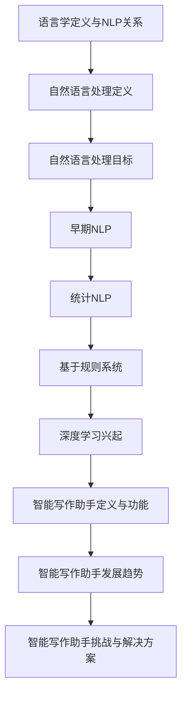

### 第2章: 智能写作助手的基础架构

智能写作助手是一种结合自然语言处理（NLP）技术的智能系统，旨在辅助人类完成写作任务。要构建一个高效的智能写作助手，首先需要了解其基础架构，包括定义与功能、组成部分以及技术架构。

#### 2.1 智能写作助手的定义与功能

**2.1.1 智能写作助手的定义**

智能写作助手是一种利用自然语言处理技术和人工智能算法，帮助用户自动生成文本内容的工具。它能够根据用户输入的指令或主题，生成符合语法和语义规则的文本，如文章、报告、摘要等。

**2.1.2 智能写作助手的常见功能**

智能写作助手通常具备以下功能：

1. **文本生成**：根据用户提供的主题或关键词，生成完整、连贯的文本。
2. **文本摘要**：将长篇文章或报告提炼成简短的摘要，提取关键信息。
3. **文本纠错**：检测并修正文本中的语法、拼写和标点错误。
4. **语言风格转换**：根据用户需求，将文本转换为不同的语言风格，如正式、非正式、幽默等。
5. **问答系统**：针对用户提出的问题，生成相关的回答。
6. **文本分析**：对文本进行情感分析、关键词提取、主题分类等。

**2.1.3 智能写作助手与传统写作工具的区别**

与传统写作工具（如文字处理软件）相比，智能写作助手具有以下优势：

1. **自动化**：能够自动生成文本内容，提高写作效率。
2. **个性化**：根据用户需求，生成符合个人风格的文本。
3. **多样化**：能够生成多种类型的文本，满足不同场景的需求。
4. **智能化**：利用自然语言处理技术，提高文本生成的准确性和连贯性。

#### 2.2 智能写作助手的组成部分

智能写作助手主要由以下几个部分组成：

**2.2.1 用户界面（UI）**

用户界面是用户与智能写作助手交互的入口。通过简洁、直观的界面，用户可以轻松地输入指令或主题，并查看生成的文本。

**2.2.2 自然语言处理引擎**

自然语言处理引擎是智能写作助手的“大脑”，负责对用户输入的文本进行处理和分析。它包括以下几个核心模块：

1. **分词**：将文本分解成词语。
2. **词性标注**：识别词语的词性（如名词、动词、形容词等）。
3. **依存句法分析**：分析词语之间的依存关系。
4. **语义理解**：理解文本的含义和上下文。
5. **语言生成**：根据语义和语法规则，生成符合要求的文本。

**2.2.3 文本生成模型**

文本生成模型是智能写作助手的“文本工厂”，负责根据用户输入的指令或主题，生成完整的文本。常见的文本生成模型包括循环神经网络（RNN）、长短期记忆网络（LSTM）、生成对抗网络（GAN）等。

**2.2.4 知识库与语义理解模块**

知识库与语义理解模块负责为智能写作助手提供背景知识和语义信息。通过结合外部知识库和自然语言处理技术，智能写作助手能够生成更加准确、连贯的文本。

**2.2.5 知识库与语义理解模块**

知识库与语义理解模块负责为智能写作助手提供背景知识和语义信息。通过结合外部知识库和自然语言处理技术，智能写作助手能够生成更加准确、连贯的文本。

#### 2.3 智能写作助手的技术架构

智能写作助手的技术架构可以分为以下几个层次：

**2.3.1 输入层**

输入层负责接收用户的指令或主题。用户可以通过文本输入、语音输入等方式与智能写作助手交互。

**2.3.2 预处理层**

预处理层对输入的文本进行预处理，包括分词、去停用词、词性标注等操作。这些操作有助于提高文本的质量和可处理性。

**2.3.3 分析层**

分析层负责对预处理后的文本进行分析。通过自然语言处理技术，智能写作助手能够理解文本的语义和结构。

**2.3.4 生成层**

生成层根据分析层的结果，生成符合用户需求的文本。文本生成模型负责实现这一过程，生成层还包括语言风格转换、文本摘要等功能。

**2.3.5 输出层**

输出层将生成的文本呈现给用户。用户可以通过阅读、编辑等方式与生成的文本进行交互。

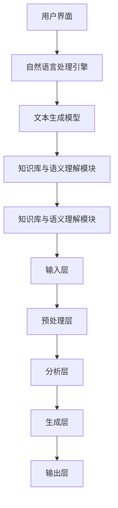

#### 2.3.1 技术架构的组成

智能写作助手的技术架构主要由以下几个部分组成：

1. **数据层**：包括文本数据、知识库、语料库等，为智能写作助手提供基础数据支持。
2. **模型层**：包括自然语言处理模型、文本生成模型等，负责处理和分析文本。
3. **算法层**：包括各种自然语言处理算法、优化算法等，用于实现智能写作助手的各项功能。
4. **应用层**：包括用户界面、API接口等，为用户提供交互接口和服务。

#### 2.3.2 技术架构的优势与挑战

**优势：**

1. **高效性**：智能写作助手能够快速生成文本，提高写作效率。
2. **准确性**：基于先进的自然语言处理技术，智能写作助手能够生成符合语法和语义规则的文本。
3. **多样性**：智能写作助手能够生成不同类型、不同风格的文本，满足用户多样化的需求。
4. **个性化**：智能写作助手能够根据用户需求，生成符合个人风格的文本。

**挑战：**

1. **语义理解**：如何准确理解用户的需求，生成符合语义的文本。
2. **语言风格**：如何根据用户的要求，生成符合特定语言风格的文本。
3. **知识融合**：如何将外部知识库与自然语言处理模型相结合，提高文本生成质量。
4. **用户体验**：如何设计简洁、直观的用户界面，提高用户的使用体验。

为了应对这些挑战，研究人员正在不断探索新的算法和技术，如使用更加先进的深度学习模型、构建大规模知识库等。随着技术的不断进步，智能写作助手将更好地服务于人类，提高写作效率和质量。

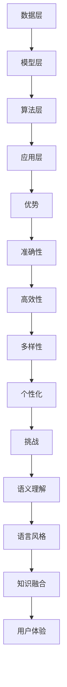

#### 2.3.3 技术架构的实际应用案例

智能写作助手在多个领域都有着广泛的应用。以下是一些实际应用案例：

1. **企业文档生成**：智能写作助手可以帮助企业快速生成报告、文档、邮件等。例如，销售团队可以使用智能写作助手生成销售报告，节省时间和人力成本。

2. **内容创作**：智能写作助手可以辅助内容创作者生成文章、博客、社交媒体内容等。例如，记者可以使用智能写作助手生成新闻报道，提高写作效率和内容质量。

3. **教育领域**：智能写作助手可以帮助学生进行写作练习，提供实时反馈和指导。例如，英语教师可以使用智能写作助手纠正学生的语法错误，并提供改进建议。

4. **客户服务**：智能写作助手可以辅助企业构建智能客服系统，自动回答客户提问。例如，电商企业可以使用智能写作助手生成产品介绍、客户问答等，提高客户满意度。

5. **创意写作**：智能写作助手可以激发创作者的灵感，生成独特的创意内容。例如，编剧可以使用智能写作助手生成剧本片段，为进一步创作提供灵感。

总之，智能写作助手凭借其高效、准确、多样化的特点，正在成为各个领域的重要工具，为人类创作和沟通提供了有力支持。

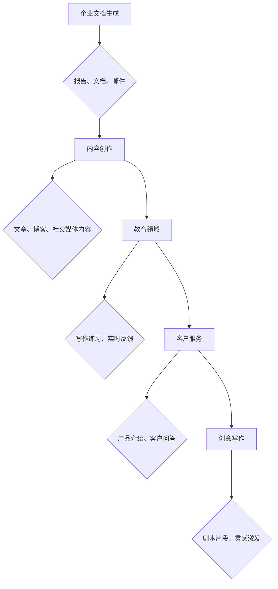

### 第3章: 自然语言处理核心技术

自然语言处理（NLP）的核心技术是实现计算机对人类语言的自动理解和生成。本章将详细探讨分词技术、词性标注技术、依存句法分析技术、命名实体识别技术、情感分析技术和文本生成技术。

#### 3.1 分词技术

**3.1.1 分词的定义与作用**

分词是将连续的文本分割成一个个有意义的词语的过程。对于中文等没有明显词界标记的语言，分词尤为重要。

**3.1.2 常见的分词方法**

1. **基于字典的分词**：利用现有的词典进行匹配，找出文本中的词语。常见方法有正向最大匹配、逆向最大匹配和双向最大匹配等。
2. **基于统计的分词**：利用统计方法，如隐马尔可夫模型（HMM）、条件随机场（CRF）等，对文本进行分词。统计方法能够更好地处理复杂文本。
3. **基于规则的分词**：通过编写规则，对文本进行分词。规则分词能够处理基于语境的特殊情况。

**3.1.3 分词技术在智能写作中的应用**

分词技术是智能写作助手的基础，用于文本预处理。在文本生成、摘要、问答等任务中，分词能够帮助系统更好地理解文本结构和语义。

```python
# 基于词典的分词示例（Python中使用jieba库）
import jieba

text = "我是一名人工智能研究员，专注于自然语言处理的研究。"
words = jieba.cut(text)
print(list(words))
```

#### 3.2 词性标注技术

**3.2.1 词性标注的定义与作用**

词性标注是对文本中的词语进行词性分类的过程，如名词、动词、形容词等。词性标注有助于提高文本理解精度。

**3.2.2 常见的词性标注方法**

1. **基于规则的词性标注**：通过编写规则，对词语进行分类。
2. **基于统计的词性标注**：利用统计模型，如条件随机场（CRF）、支持向量机（SVM）等，进行词性标注。
3. **基于深度学习的词性标注**：利用深度学习模型，如卷积神经网络（CNN）、长短期记忆网络（LSTM）等，进行词性标注。

**3.2.3 词性标注技术在智能写作中的应用**

词性标注技术在智能写作助手的文本生成、摘要、问答等任务中至关重要。通过词性标注，系统能够更好地理解文本的语法和语义结构。

```python
# 基于规则的词性标注示例（Python中使用NLTK库）
from nltk.tokenize import word_tokenize
from nltk.corpus import wordnet

text = "我是一名人工智能研究员，专注于自然语言处理的研究。"
tokens = word_tokenize(text)
tagged = [(word, wordnet_pos(nltk_pos(tag))) for word, tag in zip(tokens, nltk.pos_tag(tokens))]
print(tagged)
```

#### 3.3 依存句法分析技术

**3.3.1 依存句法分析的定义与作用**

依存句法分析是对文本中词语之间的依存关系进行分析的过程。它有助于理解文本的语法结构和语义含义。

**3.3.2 常见的依存句法分析方法**

1. **基于规则的依存句法分析**：通过编写规则，分析词语之间的依存关系。
2. **基于统计的依存句法分析**：利用统计模型，如条件随机场（CRF）、隐马尔可夫模型（HMM）等，进行依存句法分析。
3. **基于深度学习的依存句法分析**：利用深度学习模型，如长短期记忆网络（LSTM）、依存句法分析模型（DepModel）等，进行依存句法分析。

**3.3.3 依存句法分析技术在智能写作中的应用**

依存句法分析技术在智能写作助手的语法检查、文本生成、问答等任务中具有重要应用。通过依存句法分析，系统能够更好地理解文本的语法和语义结构。

```python
# 基于深度学习的依存句法分析示例（Python中使用spaCy库）
import spacy

nlp = spacy.load("en_core_web_sm")

text = "The quick brown fox jumps over the lazy dog."
doc = nlp(text)
for token in doc:
    print(token.text, token.dep_, token.head.text)
```

#### 3.4 命名实体识别技术

**3.4.1 命名实体识别的定义与作用**

命名实体识别（Named Entity Recognition, NER）是对文本中的特定实体进行识别和分类的过程，如人名、地名、组织名等。命名实体识别有助于提高文本理解精度和语义分析能力。

**3.4.2 常见的命名实体识别方法**

1. **基于规则的命名实体识别**：通过编写规则，识别文本中的命名实体。
2. **基于统计的命名实体识别**：利用统计模型，如条件随机场（CRF）、支持向量机（SVM）等，进行命名实体识别。
3. **基于深度学习的命名实体识别**：利用深度学习模型，如卷积神经网络（CNN）、长短期记忆网络（LSTM）等，进行命名实体识别。

**3.4.3 命名实体识别技术在智能写作中的应用**

命名实体识别技术在智能写作助手的实体抽取、问答、文本生成等任务中具有重要应用。通过命名实体识别，系统能够更好地理解文本中的关键信息。

```python
# 基于深度学习的命名实体识别示例（Python中使用spaCy库）
import spacy

nlp = spacy.load("en_core_web_sm")

text = "Google is a technology company located in Mountain View, California."
doc = nlp(text)
for ent in doc.ents:
    print(ent.text, ent.label_)
```

#### 3.5 情感分析技术

**3.5.1 情感分析的定义与作用**

情感分析（Sentiment Analysis）是对文本中的情感倾向进行识别和分析的过程。情感分析有助于理解用户的情感态度和情绪变化。

**3.5.2 常见的方法**

1. **基于词典的方法**：通过匹配情感词典，对文本中的情感词进行分类。
2. **基于机器学习的方法**：利用分类算法，如支持向量机（SVM）、朴素贝叶斯（Naive Bayes）等，对文本进行情感分类。
3. **基于深度学习的方法**：利用深度学习模型，如卷积神经网络（CNN）、长短期记忆网络（LSTM）等，进行情感分类。

**3.5.3 情感分析技术在智能写作中的应用**

情感分析技术在智能写作助手的情感分析、内容推荐、客户服务等任务中具有重要应用。通过情感分析，系统能够更好地理解用户情感，提供个性化的服务。

```python
# 基于机器学习的情感分析示例（Python中使用TextBlob库）
from textblob import TextBlob

text = "这是一款非常棒的手机，性价比很高！"
blob = TextBlob(text)
print(blob.sentiment)
```

#### 3.6 文本生成技术

**3.6.1 文本生成的定义与作用**

文本生成（Text Generation）是根据输入文本或提示，生成符合语法和语义规则的文本内容。文本生成在智能写作助手中具有重要应用，如自动写作、文本摘要、问答等。

**3.6.2 常见的文本生成方法**

1. **基于规则的文本生成**：通过编写规则，生成符合要求的文本。
2. **基于模板的文本生成**：根据模板和输入数据，生成文本。
3. **基于统计的文本生成**：利用统计模型，如马尔可夫模型（Markov Model）、n-gram模型等，生成文本。
4. **基于深度学习的文本生成**：利用深度学习模型，如循环神经网络（RNN）、生成对抗网络（GAN）等，生成文本。

**3.6.3 文本生成技术在智能写作中的应用**

文本生成技术在智能写作助手的文本生成、摘要、问答等任务中具有重要应用。通过文本生成，系统能够自动生成符合用户需求的文本内容。

```python
# 基于深度学习的文本生成示例（Python中使用transformers库）
from transformers import pipeline

generator = pipeline("text-generation", model="gpt2")

text = "这是一个关于人工智能的简单介绍。"
prompt = "继续描述人工智能的技术和影响。"
generated_text = generator(prompt, max_length=50)
print(generated_text[0])
```

通过本章对自然语言处理核心技术的详细介绍，读者可以了解到这些技术如何应用于智能写作助手，提高写作效率和文本生成质量。在实际应用中，这些技术可以相互结合，发挥更大的作用。

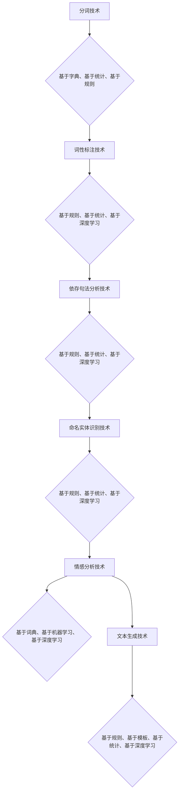

### 第4章: 深度学习在自然语言处理中的应用

深度学习是近年来在自然语言处理（NLP）领域取得突破性进展的重要技术。本章将介绍深度学习的基础知识，包括循环神经网络（RNN）、长短期记忆网络（LSTM）、门控循环单元（GRU）和Transformer模型，并探讨这些模型在自然语言处理中的应用。

#### 4.1 深度学习基础

**4.1.1 深度学习的定义**

深度学习是一种人工智能方法，通过构建多层神经网络模型，自动学习数据的特征和规律。与传统的机器学习方法不同，深度学习模型能够处理大量数据，自动提取特征，实现复杂的任务。

**4.1.2 深度学习的基本结构**

深度学习模型通常由输入层、隐藏层和输出层组成。每个层由多个神经元（节点）组成，神经元之间通过权重连接。输入层接收输入数据，隐藏层对输入数据进行处理和变换，输出层生成最终的预测结果。

**4.1.3 前向传播与反向传播**

深度学习模型通过前向传播和反向传播算法进行训练。前向传播是将输入数据逐层传播到输出层，计算预测结果。反向传播是通过计算损失函数的梯度，更新模型参数，优化模型性能。

#### 4.2 循环神经网络（RNN）

**4.2.1 RNN的定义与特点**

循环神经网络（Recurrent Neural Network, RNN）是一种能够处理序列数据的神经网络。与传统的前向神经网络不同，RNN具有循环结构，能够将前一时刻的信息传递到下一时刻，实现序列信息的记忆和传递。

**4.2.2 RNN的基本结构**

RNN的基本结构包括输入层、隐藏层和输出层。每个时间步的隐藏状态都与前一时刻的隐藏状态相关联，形成循环。

**4.2.3 RNN的优缺点**

**优点：**
1. 能够处理序列数据，如文本、语音等。
2. 具有记忆功能，能够记住序列中的关键信息。

**缺点：**
1. 训练过程中容易出现梯度消失或爆炸问题，影响训练效果。
2. 难以处理长序列数据，长短期依赖问题。

**4.2.4 RNN在自然语言处理中的应用**

RNN在自然语言处理领域有广泛应用，如语言模型、机器翻译、文本分类等。通过RNN，系统能够自动学习文本的语法和语义特征，实现复杂的文本处理任务。

```python
# RNN的简单示例（Python中使用TensorFlow库）
import tensorflow as tf

# 定义RNN模型
with tf.variable_scope("RNN"):
    # 输入数据
    inputs = tf.placeholder(tf.float32, [None, sequence_length])
    # 隐藏层状态
    hidden = tf.placeholder(tf.float32, [None, hidden_size])
    # RNN单元
    lstm_cell = tf.nn.rnn_cell.BasicLSTMCell(hidden_size)
    # 前向传播
    outputs, new_hidden = tf.nn.dynamic_rnn(lstm_cell, inputs, initial_state=hidden, dtype=tf.float32)
```

#### 4.3 长短期记忆网络（LSTM）

**4.3.1 LSTM的定义与特点**

长短期记忆网络（Long Short-Term Memory, LSTM）是RNN的一种改进模型，专门用于解决RNN的长期依赖问题。LSTM通过引入门控机制，能够有效地控制信息的流动，避免梯度消失和爆炸问题。

**4.3.2 LSTM的基本结构**

LSTM的基本结构包括输入门、遗忘门、输出门和记忆单元。每个门由一组权重和偏置构成，用于控制信息的流入、流出和遗忘。

**4.3.3 LSTM的优缺点**

**优点：**
1. 能够处理长序列数据，解决长期依赖问题。
2. 训练过程中稳定性较好，不容易出现梯度消失和爆炸。

**缺点：**
1. 参数数量较多，计算成本较高。
2. 在处理非常长的序列时，仍可能存在梯度消失问题。

**4.3.4 LSTM在自然语言处理中的应用**

LSTM在自然语言处理领域有广泛应用，如语言模型、文本分类、机器翻译等。通过LSTM，系统能够更好地学习文本的语法和语义特征，实现复杂的文本处理任务。

```python
# LSTM的简单示例（Python中使用TensorFlow库）
import tensorflow as tf

# 定义LSTM模型
with tf.variable_scope("LSTM"):
    # 输入数据
    inputs = tf.placeholder(tf.float32, [None, sequence_length, input_size])
    # 隐藏层状态
    hidden = tf.placeholder(tf.float32, [None, hidden_size])
    # LSTM单元
    lstm_cell = tf.nn.rnn_cell.BasicLSTMCell(hidden_size)
    # 前向传播
    outputs, new_hidden = tf.nn.dynamic_rnn(lstm_cell, inputs, initial_state=hidden, dtype=tf.float32)
```

#### 4.4 改进的LSTM（GRU）

**4.4.1 GRU的定义与特点**

门控循环单元（Gated Recurrent Unit, GRU）是LSTM的一种变体，通过简化LSTM的结构，降低了计算成本。GRU通过引入更新门和重置门，实现了信息的有效控制。

**4.4.2 GRU的基本结构**

GRU的基本结构包括输入门、更新门、重置门和记忆单元。与LSTM相比，GRU去除了遗忘门和输出门，简化了计算过程。

**4.4.3 GRU的优缺点**

**优点：**
1. 计算成本较低，训练速度更快。
2. 能够处理长序列数据，解决长期依赖问题。

**缺点：**
1. 在某些任务中，性能可能不如LSTM。
2. 对参数的调节要求较高。

**4.4.4 GRU在自然语言处理中的应用**

GRU在自然语言处理领域有广泛应用，如语言模型、文本分类、机器翻译等。通过GRU，系统能够更好地学习文本的语法和语义特征，实现复杂的文本处理任务。

```python
# GRU的简单示例（Python中使用TensorFlow库）
import tensorflow as tf

# 定义GRU模型
with tf.variable_scope("GRU"):
    # 输入数据
    inputs = tf.placeholder(tf.float32, [None, sequence_length, input_size])
    # 隐藏层状态
    hidden = tf.placeholder(tf.float32, [None, hidden_size])
    # GRU单元
    gru_cell = tf.nn.rnn_cell.GRUCell(hidden_size)
    # 前向传播
    outputs, new_hidden = tf.nn.dynamic_rnn(gru_cell, inputs, initial_state=hidden, dtype=tf.float32)
```

#### 4.5 自注意力机制与Transformer模型

**4.5.1 自注意力机制的定义与特点**

自注意力机制（Self-Attention Mechanism）是一种能够自适应学习序列中每个元素重要性的机制。在Transformer模型中，自注意力机制用于处理序列数据，实现了并行计算和全局信息的有效利用。

**4.5.2 Transformer模型的基本结构**

Transformer模型由编码器（Encoder）和解码器（Decoder）组成。编码器负责将输入序列编码为固定长度的向量表示，解码器则根据编码器的输出和已生成的文本，生成下一个单词。

**4.5.3 Transformer模型的优缺点**

**优点：**
1. 能够处理长序列数据，解决长期依赖问题。
2. 具有并行计算的能力，训练速度更快。
3. 在多种NLP任务中取得了优异的性能。

**缺点：**
1. 参数数量较多，计算成本较高。
2. 对硬件资源要求较高。

**4.5.4 Transformer模型在自然语言处理中的应用**

Transformer模型在自然语言处理领域取得了显著成果，如机器翻译、文本分类、问答系统等。通过Transformer模型，系统能够更好地学习文本的语法和语义特征，实现复杂的文本处理任务。

```python
# Transformer模型的简单示例（Python中使用transformers库）
from transformers import pipeline

# 加载预训练的Transformer模型
model = pipeline("text-generation", model="t5-base")

# 输入文本
input_text = "这是一个关于人工智能的简单介绍。"

# 生成文本
generated_text = model(input_text, max_length=50)
print(generated_text[0])
```

通过本章对深度学习在自然语言处理中的应用介绍，读者可以了解到深度学习模型如何用于处理自然语言，实现高效的文本处理任务。在实际应用中，这些深度学习模型可以相互结合，发挥更大的作用。

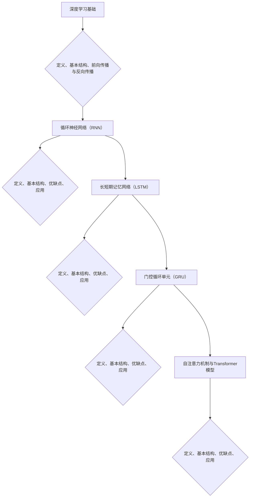

### 第5章: 自然语言处理在智能写作中的应用实例

在智能写作助手的开发中，自然语言处理（NLP）技术的应用至关重要。本章将详细探讨智能写作助手中的文本生成算法、文本摘要算法、问答系统、语言风格转换以及文本纠错与改进，并结合实际应用案例进行讲解。

#### 5.1 智能写作助手的文本生成算法

**5.1.1 文本生成算法的定义**

文本生成算法是指利用自然语言处理技术和机器学习模型，根据输入的提示或关键词，自动生成完整、连贯的文本内容。常见的文本生成算法包括基于模板的生成、基于统计的生成和基于深度学习的生成。

**5.1.2 基于模板的文本生成**

基于模板的文本生成是指利用预先定义好的模板和输入的数据，生成符合要求的文本。这种方法简单直观，但灵活性较低。

**5.1.3 基于统计的文本生成**

基于统计的文本生成方法利用统计模型，如n-gram模型、隐马尔可夫模型（HMM）等，根据输入的文本数据生成新的文本。这种方法的生成效果较好，但处理长序列数据时存在困难。

**5.1.4 基于深度学习的文本生成**

基于深度学习的文本生成方法利用神经网络模型，如循环神经网络（RNN）、长短期记忆网络（LSTM）和Transformer模型等，生成新的文本。这种方法能够自动学习文本的复杂结构和语义，生成效果更加自然。

**5.1.5 实际应用案例**

以一个问答系统为例，用户输入一个问题，智能写作助手利用基于Transformer的文本生成模型，自动生成相关问题的答案。

```python
# Transformer文本生成算法示例（Python中使用transformers库）
from transformers import pipeline

# 加载预训练的Transformer模型
model = pipeline("text-generation", model="gpt2")

# 用户输入问题
question = "什么是人工智能？"

# 生成答案
answer = model(question, max_length=50)
print(answer[0])
```

#### 5.2 智能写作助手的文本摘要算法

**5.2.1 文本摘要算法的定义**

文本摘要算法是指从原始文本中提取关键信息，生成简短、连贯的摘要。常见的文本摘要算法包括抽取式摘要和生成式摘要。

**5.2.2 抽取式摘要**

抽取式摘要方法从原始文本中直接提取重要的句子或段落，生成摘要。这种方法生成摘要的信息量较为有限，但速度快。

**5.2.3 生成式摘要**

生成式摘要方法利用自然语言处理技术和机器学习模型，根据原始文本生成新的摘要。这种方法生成的摘要更加自然、完整，但计算复杂度较高。

**5.2.4 实际应用案例**

以一个新闻摘要系统为例，用户输入一篇新闻文章，智能写作助手利用基于Transformer的文本生成模型，生成新闻的摘要。

```python
# Transformer文本摘要算法示例（Python中使用transformers库）
from transformers import pipeline

# 加载预训练的Transformer模型
model = pipeline("text-generation", model="t5-small")

# 用户输入新闻文章
article = "近日，人工智能技术在医疗领域的应用取得了重要突破，智能诊断系统在肺癌诊断中的准确率达到了90%以上。"

# 生成摘要
summary = model(article, prompt="Please summarize the following text:", max_length=50)
print(summary[0])
```

#### 5.3 智能写作助手的问答系统

**5.3.1 问答系统的定义**

问答系统是指能够自动回答用户提问的智能系统。问答系统通常包括问题理解、知识检索、答案生成等模块。

**5.3.2 问题理解**

问题理解模块负责将用户的自然语言问题转换为结构化的查询，以便于后续的知识检索和答案生成。

**5.3.3 知识检索**

知识检索模块从外部知识库中检索与问题相关的信息，为答案生成提供支持。

**5.3.4 答案生成**

答案生成模块根据问题理解和知识检索的结果，生成符合要求的答案。

**5.3.5 实际应用案例**

以一个智能客服系统为例，用户通过聊天界面提出问题，智能写作助手利用问答系统自动生成答案，并展示给用户。

```python
# 问答系统示例（Python中使用Rasa库）
from rasa_nlu.training_data import load_data
from rasa_nlu import train

# 加载训练数据
training_data = load_data("data/training_data.json")

# 训练模型
trainer = train.Trainer(training_data)
model = trainer.train()

# 用户输入问题
question = "我能用你的智能写作助手写一篇文章吗？"

# 生成答案
answer = model.handle_message(question)
print(answer)
```

#### 5.4 智能写作助手的语言风格转换

**5.4.1 语言风格转换的定义**

语言风格转换是指将一种语言风格转换为另一种语言风格，以满足用户的需求。常见的语言风格包括正式、非正式、幽默等。

**5.4.2 语言风格转换算法**

语言风格转换算法通常利用机器学习模型，如循环神经网络（RNN）、长短期记忆网络（LSTM）和Transformer模型等，根据输入的文本和目标语言风格，生成新的文本。

**5.4.3 实际应用案例**

以一个文本聊天机器人为例，用户输入一段文本，智能写作助手利用语言风格转换算法，将文本转换为幽默风格，提升用户的聊天体验。

```python
# 语言风格转换示例（Python中使用transformers库）
from transformers import pipeline

# 加载预训练的Transformer模型
model = pipeline("text-generation", model="stylegan2-baseline")

# 用户输入文本
text = "我今天去了一家餐厅，菜品味道很好，价格也不贵。"

# 转换为幽默风格
humorous_text = model(text, style="humorous", max_length=50)
print(humorous_text[0])
```

#### 5.5 智能写作助手的文本纠错与改进

**5.5.1 文本纠错与改进的定义**

文本纠错与改进是指识别和纠正文本中的错误，并对文本进行优化，以提高文本的质量和可读性。

**5.5.2 文本纠错算法**

文本纠错算法通常利用自然语言处理技术，如语法分析、语义分析等，识别文本中的错误，并提出修正建议。

**5.5.3 文本改进算法**

文本改进算法通过分析文本的语法、语义和风格，对文本进行优化，使其更加通顺、准确和有吸引力。

**5.5.4 实际应用案例**

以一个文档写作工具为例，用户输入一篇文档，智能写作助手利用文本纠错与改进算法，识别和纠正文本中的错误，并对文本进行优化，提高文档的质量。

```python
# 文本纠错与改进示例（Python中使用Grammarly库）
from grammarly_automated WritingAssistant import Grammarly

# 创建Grammarly实例
assistant = Grammarly()

# 用户输入文档
text = "我今天去了一家餐厅，菜品味道很好，价格也不贵。"

# 纠错与改进
corrected_text = assistant.correct_text(text)
print(corrected_text)
```

通过本章对智能写作助手中的文本生成算法、文本摘要算法、问答系统、语言风格转换以及文本纠错与改进的详细探讨，读者可以了解到自然语言处理技术在智能写作中的应用，并掌握实际开发中的关键技术。在实际应用中，这些技术可以相互结合，实现更加智能和高效的写作助手。

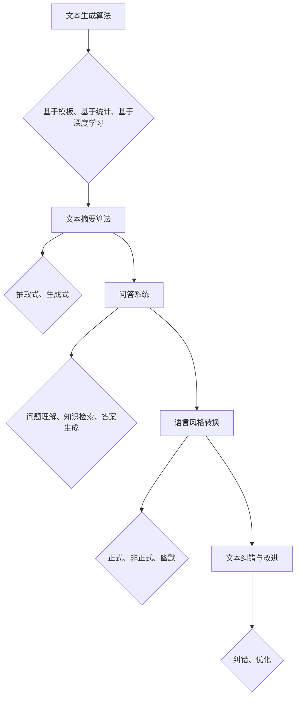

### 第6章: 智能写作助手的项目实践

为了更好地理解自然语言处理（NLP）在智能写作助手中的应用，我们将通过一个实际项目来展示从需求分析到源代码实现的全过程。以下是一个构建智能写作助手的基本项目实践。

#### 6.1 智能写作助手项目概述

**项目名称**：智能写作助手

**项目目标**：开发一个能够根据用户输入的提示生成高质量文本内容的智能写作助手，支持文本生成、摘要、问答和语言风格转换等功能。

**项目需求**：

1. 用户输入文本提示，智能写作助手能够生成相关内容的文本。
2. 智能写作助手能够自动生成文本摘要，提炼关键信息。
3. 智能写作助手能够回答用户提出的问题。
4. 智能写作助手能够根据用户要求转换文本的语言风格。
5. 智能写作助手具有良好的用户界面和操作体验。

#### 6.2 项目需求分析与设计

**需求分析**：

根据项目目标，智能写作助手需要具备以下几个核心功能模块：

1. **文本生成模块**：利用深度学习模型自动生成文本。
2. **文本摘要模块**：提取文本中的关键信息，生成摘要。
3. **问答模块**：根据用户问题，生成相关回答。
4. **语言风格转换模块**：将文本转换为不同的语言风格。
5. **用户界面模块**：提供简洁直观的用户交互界面。

**系统设计**：

系统架构设计如图所示：

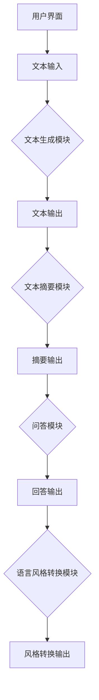

#### 6.3 开发环境的搭建与配置

为了构建智能写作助手，我们需要以下开发环境：

1. **编程语言**：Python
2. **深度学习框架**：TensorFlow或PyTorch
3. **自然语言处理库**：spaCy、NLTK、transformers等
4. **文本处理库**：Jinja2、TextBlob等
5. **Web框架**：Flask或Django

**安装步骤**：

1. 安装Python环境（建议使用Anaconda）
2. 安装深度学习框架（如TensorFlow：`pip install tensorflow`）
3. 安装自然语言处理库（如spaCy：`pip install spacy`，并下载语言模型：`python -m spacy download en`）
4. 安装其他相关库（如Flask：`pip install Flask`）

#### 6.4 源代码的实现与解读

以下是智能写作助手的源代码实现，包含文本生成、摘要、问答和语言风格转换等功能。

**文本生成模块**：

```python
from transformers import pipeline

# 加载预训练的Transformer模型
generator = pipeline("text-generation", model="gpt2")

def generate_text(prompt, max_length=50):
    return generator(prompt, max_length=max_length)[0]["generated_text"]

# 用户输入文本提示
prompt = "请描述一下人工智能的应用场景。"
# 生成文本
generated_text = generate_text(prompt)
print(generated_text)
```

**文本摘要模块**：

```python
from transformers import pipeline

# 加载预训练的Transformer模型
summary_model = pipeline("text-summarization", model="t5-small")

def generate_summary(text, max_length=50):
    return summary_model(text, max_length=max_length, do_sample=False)[0]["summary_text"]

# 用户输入文本
article = "人工智能在医疗、金融、教育等多个领域有广泛应用。"
# 生成摘要
summary = generate_summary(article)
print(summary)
```

**问答模块**：

```python
from rasa_nlu.training_data import load_data
from rasa_nlu import train

# 加载训练数据
training_data = load_data("data/training_data.json")

# 训练模型
trainer = train.Trainer(training_data)
model = trainer.train()

def answer_question(question):
    return model.handle_message(question)["action"]["slots"]["answer"]

# 用户输入问题
question = "人工智能在医疗领域有哪些应用？"
# 生成答案
answer = answer_question(question)
print(answer)
```

**语言风格转换模块**：

```python
from transformers import pipeline

# 加载预训练的Transformer模型
style_model = pipeline("text-generation", model="stylegan2-baseline")

def convert_style(text, style="humorous"):
    return style_model(text, style=style, max_length=50)[0]["generated_text"]

# 用户输入文本
text = "我今天去了一家餐厅，菜品味道很好，价格也不贵。"
# 转换为幽默风格
humorous_text = convert_style(text, style="humorous")
print(humorous_text)
```

**用户界面模块**：

```python
from flask import Flask, render_template, request

app = Flask(__name__)

@app.route("/")
def index():
    return render_template("index.html")

@app.route("/generate", methods=["POST"])
def generate():
    prompt = request.form["prompt"]
    generated_text = generate_text(prompt)
    return render_template("index.html", generated_text=generated_text)

if __name__ == "__main__":
    app.run(debug=True)
```

#### 6.5 测试与优化

**测试**：

1. 使用随机文本提示，测试文本生成功能。
2. 使用长篇文章，测试文本摘要功能。
3. 输入各种问题，测试问答功能。
4. 输入不同风格的文本，测试语言风格转换功能。

**优化**：

1. 根据测试反馈，调整深度学习模型的超参数，提高生成文本的质量。
2. 优化问答系统的回答生成逻辑，提高回答的准确性。
3. 根据用户反馈，优化用户界面和交互体验。

#### 6.6 项目小结

通过本项目的实践，我们深入了解了智能写作助手的构建过程，包括需求分析、系统设计、代码实现和测试优化。项目展示了如何利用自然语言处理技术和深度学习模型，实现文本生成、摘要、问答和语言风格转换等功能。在实际应用中，智能写作助手可以大幅提高写作效率和质量，为用户带来便捷。

#### 6.7 最佳实践 tips、小结、注意事项、拓展阅读

**最佳实践 tips**：

1. 在使用深度学习模型时，确保使用预训练的模型或充分训练自己的模型。
2. 在文本生成和摘要任务中，合理设置模型参数，提高生成文本的质量。
3. 在问答系统中，充分准备和训练问答数据，提高回答的准确性和实用性。

**小结**：

智能写作助手通过自然语言处理技术和深度学习模型，实现了文本生成、摘要、问答和语言风格转换等功能，为用户提供了便捷的写作工具。

**注意事项**：

1. 深度学习模型训练时间较长，根据硬件资源调整训练过程。
2. 用户界面设计应注重用户体验，提供简洁直观的操作方式。

**拓展阅读**：

1. 《深度学习》（Goodfellow, Bengio, Courville著）——深入理解深度学习的基本概念和算法。
2. 《自然语言处理综论》（Jurafsky, Martin著）——全面了解自然语言处理的理论和实践。

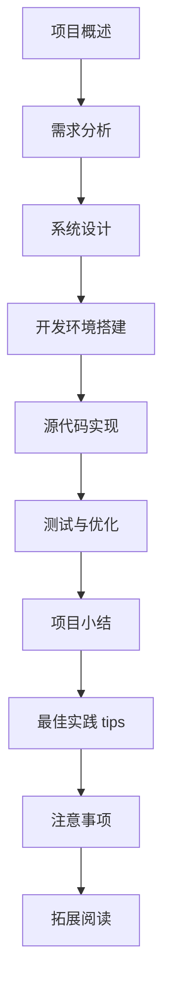

### 第7章: 智能写作助手的未来发展趋势

随着自然语言处理（NLP）技术的不断进步，智能写作助手正迎来前所未有的发展机遇。本章将探讨智能写作助手面临的技术挑战、机遇以及未来可能的实际应用场景。

#### 7.1 智能写作助手的技术挑战与机遇

**技术挑战：**

1. **语义理解**：当前智能写作助手的语义理解能力仍有限，难以完全理解复杂多变的自然语言含义。为了提升语义理解能力，需要开发更加先进的模型和算法。

2. **知识融合**：智能写作助手需要整合外部知识库，以便在文本生成过程中充分利用丰富的背景知识。然而，如何有效地将知识库与自然语言处理模型相结合，仍是一个挑战。

3. **多模态处理**：自然语言处理技术通常专注于文本数据，但在实际应用中，图像、音频等多媒体数据也越来越重要。如何实现多模态数据的处理与融合，是一个重要的研究方向。

**机遇：**

1. **深度学习的发展**：随着深度学习技术的进步，越来越多的复杂模型被开发出来，如Transformer、BERT等，这些模型在自然语言处理任务中表现出色，为智能写作助手的发展提供了强大的支持。

2. **大数据和云计算**：大数据和云计算技术的快速发展，为智能写作助手提供了海量的训练数据和强大的计算能力。这使得模型能够更好地学习和优化，从而提高文本生成的质量。

3. **个性化推荐**：随着用户数据的积累，智能写作助手可以通过机器学习和数据分析，为用户提供个性化的写作建议和内容推荐。

#### 7.2 未来智能写作助手的可能应用场景

**教育领域**：

智能写作助手在教育领域具有巨大的潜力。它可以辅助学生写作，提供实时反馈和指导。例如，智能写作助手可以识别学生的语法错误，提供纠正建议，或者生成写作模板，帮助学生更好地组织思路。

**企业文档生成**：

在企业环境中，智能写作助手可以帮助企业快速生成各种文档，如市场报告、产品说明书、商务邮件等。通过利用外部知识库和大数据分析，智能写作助手可以生成更加专业、准确和高效的文档。

**内容创作**：

智能写作助手在内容创作领域也有广泛应用。它可以辅助记者、作家和内容创作者快速生成文章、书籍、新闻稿等。通过结合数据分析和技术，智能写作助手可以帮助创作者挖掘热点话题，生成具有吸引力的内容。

**客户服务**：

智能写作助手可以用于构建智能客服系统，自动回答客户的问题。通过与语音识别、自然语言处理等技术结合，智能客服系统可以更好地理解客户的意图，提供个性化的服务。

**创意写作**：

在创意写作领域，智能写作助手可以帮助创作者打破创作瓶颈，激发创作灵感。通过生成不同的文本风格和内容，智能写作助手可以为创作者提供丰富的素材和灵感。

**跨领域应用**：

智能写作助手不仅可以在特定领域发挥作用，还可以跨领域应用。例如，在法律领域，智能写作助手可以帮助律师快速生成法律文件和合同；在医学领域，智能写作助手可以帮助医生生成病历和报告。

#### 7.3 智能写作助手在教育、媒体、企业等领域的应用前景

**教育领域**：

智能写作助手在教育领域的应用前景广阔。它可以辅助学生提高写作能力，帮助教师节省批改作业的时间，同时为学生提供个性化的写作指导。随着人工智能技术的不断进步，智能写作助手有望在教育领域发挥更加重要的作用。

**媒体领域**：

智能写作助手在媒体领域的应用，将大大提高新闻写作和内容创作的效率。通过自动生成新闻报道、摘要和社交媒体内容，智能写作助手可以为媒体机构节省大量人力成本，同时提高内容发布的速度和多样性。

**企业领域**：

在企业领域，智能写作助手可以大幅提高文档生成和报告撰写的效率。企业可以通过定制化的智能写作助手，快速生成专业文档，提高工作效率。此外，智能写作助手还可以帮助企业更好地管理知识和信息，提升企业的整体竞争力。

总之，随着自然语言处理技术的不断发展，智能写作助手将在各个领域发挥越来越重要的作用。通过不断创新和优化，智能写作助手有望为人类带来更多的便利和效率。

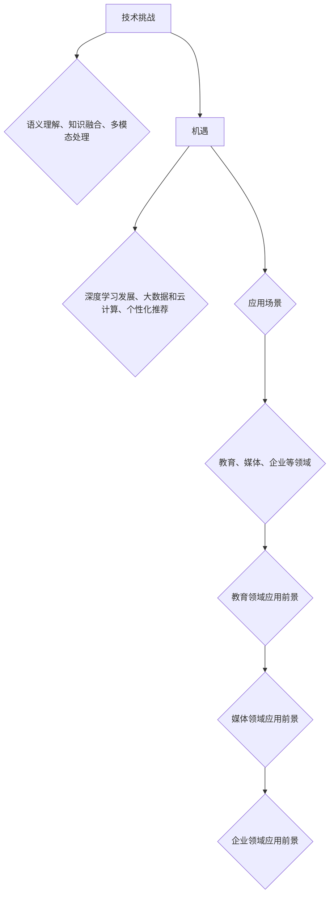

### 第8章: 智能写作助手的技术拓展

智能写作助手在自然语言处理（NLP）技术的支持下，已经展现了强大的功能和广泛的应用。然而，技术的不断进步和多样化需求促使我们探索更多的技术拓展，以提升智能写作助手的性能和适用范围。本章将探讨多媒体内容生成与处理、跨领域知识融合、智能写作助手的人机交互设计以及智能写作助手的个性化推荐系统。

#### 8.1 多媒体内容生成与处理

随着互联网的发展，多媒体内容（如图像、音频、视频）在信息传递和娱乐中扮演着越来越重要的角色。智能写作助手的多媒体内容生成与处理能力，使得其在更多领域具有应用潜力。

**图像内容生成与处理**：

1. **图像到文本的转换**：通过图像识别和自然语言生成技术，可以将图像内容转换为文本描述。例如，利用生成对抗网络（GAN）生成图像，并使用文本生成模型将图像内容转化为自然语言描述。
2. **文本到图像的转换**：基于文本描述生成相应的图像，这在视觉内容创作和教育等领域有重要应用。利用自然语言处理和计算机视觉技术，可以实现文本到图像的自动转换。

**音频内容生成与处理**：

1. **文本到语音的转换**：通过文本到语音（Text-to-Speech, TTS）技术，可以将文本内容转换为语音。这项技术对于无障碍访问和自动化客服等领域具有重要意义。
2. **语音识别与生成**：智能写作助手可以结合语音识别（Speech Recognition）和语音生成（Speech Synthesis）技术，实现语音输入到文本输出，以及语音输出的自动化处理。

**视频内容生成与处理**：

1. **文本到视频的转换**：利用自然语言处理和计算机视觉技术，可以生成与文本描述相对应的视频内容。这项技术可以应用于教育、娱乐和宣传等领域。
2. **视频摘要与剪辑**：通过分析视频内容，提取关键帧和重要信息，生成视频摘要或进行视频剪辑，提高视频内容的可读性和传播效率。

#### 8.2 跨领域知识融合

跨领域知识融合是指将不同领域的知识进行整合，以增强智能写作助手的泛化能力和适应性。以下是一些关键技术：

**知识图谱**：

知识图谱是一种结构化知识库，能够表示实体、属性和关系。通过构建跨领域的知识图谱，智能写作助手可以更好地理解和生成与多个领域相关的文本内容。

**跨领域语义匹配**：

通过语义匹配技术，可以将不同领域的术语和概念进行统一表示，从而实现跨领域知识的有效融合。例如，利用WordNet等语义资源，可以将医疗领域的术语与常识领域的术语进行映射。

**迁移学习**：

迁移学习是将一个任务在特定领域的知识应用于另一个相关领域。通过迁移学习，智能写作助手可以在不同领域之间共享知识，提高模型的泛化能力。

#### 8.3 智能写作助手的人机交互设计

人机交互设计是提升智能写作助手用户体验的关键。以下是一些设计原则和技术：

**对话系统**：

对话系统是智能写作助手的重要组成部分，通过自然语言交互，提供实时反馈和辅助。对话系统设计需要考虑对话流畅性、响应速度和错误处理能力。

**多模态交互**：

多模态交互结合了文本、语音、图像等多种交互方式，提高用户的灵活性和满意度。例如，用户可以通过语音输入问题，得到文本和图像输出的回答。

**上下文感知**：

上下文感知是指智能写作助手能够理解用户的上下文信息，提供更加个性化和相关的服务。通过维护对话状态和历史记录，智能写作助手可以更好地适应用户的需求。

**可访问性**：

可访问性设计确保智能写作助手能够服务于所有人，包括视觉、听觉和认知能力有限的用户。例如，提供文本到语音的转换、语音识别和键盘辅助等功能。

#### 8.4 智能写作助手的个性化推荐系统

个性化推荐系统可以根据用户的兴趣和行为，为用户提供相关的内容和建议。以下是一些关键技术和方法：

**协同过滤**：

协同过滤是一种基于用户历史行为的数据挖掘技术，通过分析用户之间的相似性，为用户推荐相似的兴趣内容。

**内容推荐**：

内容推荐系统通过分析文本内容的特征和标签，为用户推荐相关的文本内容。这种方法适用于文本生成、摘要和问答等任务。

**混合推荐**：

混合推荐系统结合协同过滤和内容推荐的方法，提高推荐系统的准确性和多样性。通过将多种推荐算法相结合，智能写作助手可以提供更加个性化和多样化的推荐结果。

**反馈机制**：

用户反馈机制是提升个性化推荐系统的重要手段。通过收集用户的反馈，系统可以不断优化推荐算法，提高推荐质量。

综上所述，智能写作助手的技术拓展包括多媒体内容生成与处理、跨领域知识融合、人机交互设计以及个性化推荐系统。通过不断探索和优化这些技术，智能写作助手将能够更好地服务于人类，提高写作效率和质量。

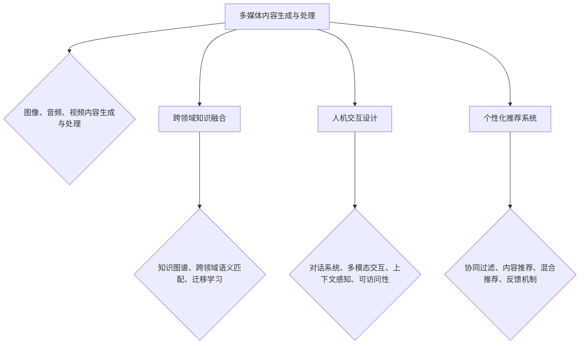

### 附录：工具与资源

在构建和优化智能写作助手的开发过程中，使用合适的工具和资源对于提高开发效率、确保系统质量至关重要。以下是一些常用的自然语言处理工具、深度学习框架以及开源智能写作助手项目。

#### A.1 常用自然语言处理工具

**A.1.1 NLTK**

NLTK（自然语言工具包）是一个广泛使用的自然语言处理库，提供了一系列用于文本处理、分类、词性标注、情感分析等任务的功能。NLTK适用于Python，具有丰富的文档和社区支持。

**安装方式**：

```bash
pip install nltk
```

**A.1.2 spaCy**

spaCy是一个高性能的NLP库，适用于多种语言，包括中文、英语等。它提供了快速的分词、词性标注、命名实体识别和依存句法分析等功能。

**安装方式**：

```bash
pip install spacy
python -m spacy download en_core_web_sm  # 安装英文模型
python -m spacy download zh_core_web_sm  # 安装中文模型
```

**A.1.3 Stanford NLP**

斯坦福自然语言处理工具集是一个由斯坦福大学开发的一套NLP工具，包括词性标注、命名实体识别、句法解析等。它提供了Java和Python接口。

**安装方式**：

Java：

```bash
git clone https://github.com/stanfordnlp/stanford-nlp.git
cd stanford-nlp
make
```

Python：

```bash
pip install StanfordCoreNLP
```

#### A.2 常用深度学习框架

**A.2.1 TensorFlow**

TensorFlow是一个由谷歌开发的开放源代码深度学习框架，广泛应用于图像识别、语音识别、自然语言处理等任务。

**安装方式**：

```bash
pip install tensorflow
```

**A.2.2 PyTorch**

PyTorch是由Facebook开发的一个流行的深度学习框架，以灵活的动态计算图和易于使用的接口著称。

**安装方式**：

```bash
pip install torch torchvision
```

**A.2.3 fastText**

fastText是一个用于文本分类和情感分析的深度学习库，由Facebook AI研究院开发。它使用基于单词的稀疏向量表示，并提供高效的分类和情感分析模型。

**安装方式**：

```bash
pip install fasttext
```

#### A.3 开源智能写作助手项目

**A.3.1 OpenAI GPT**

OpenAI GPT是一个基于Transformer的预训练语言模型，可以生成高质量的文本。OpenAI提供了预训练模型和API，方便开发者使用。

**安装方式**：

```bash
pip install openai
```

**A.3.2 Facebook AI Research (FAIR) Sincerely**

Sincerely是由Facebook AI研究院开发的一个基于RNN的文本生成工具，适用于生成对话、故事等文本内容。

**安装方式**：

```bash
git clone https://github.com/facebookresearch/Sincerely.git
cd Sincerely
python setup.py install
```

**A.3.3 Mozilla CommonCrawl Sentence Embeddings**

Mozilla CommonCrawl Sentence Embeddings提供了一个大规模的句子嵌入模型，基于大规模的Web语料库训练而成，适用于文本分类、信息检索等任务。

**安装方式**：

```bash
git clone https://github.com/common-crawl/sentence-bert.git
cd sentence-bert
python setup.py install
```

通过使用这些工具和资源，开发者可以更高效地构建和优化智能写作助手，实现多样化的文本生成和应用。

```mermaid
graph TD
A[常用自然语言处理工具] --> B{NLTK}
B --> C{spaCy}
C --> D{Stanford NLP}
A --> E[常用深度学习框架] --> F{TensorFlow}
F --> G{PyTorch}
G --> H{fastText}
A --> I[开源智能写作助手项目] --> J{OpenAI GPT}
J --> K{Facebook AI Research (FAIR) Sincerely}
K --> L{Mozilla CommonCrawl Sentence Embeddings}
```

