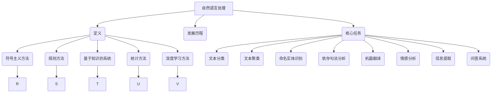
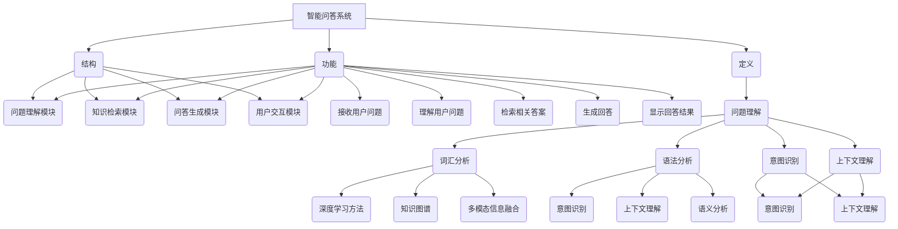
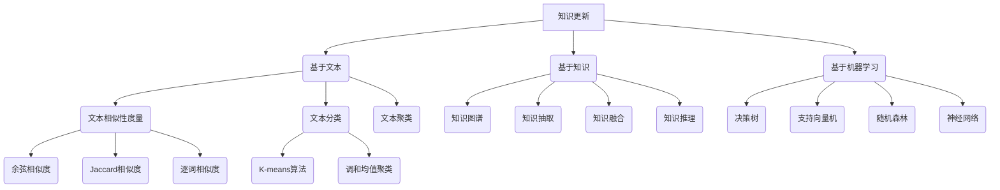
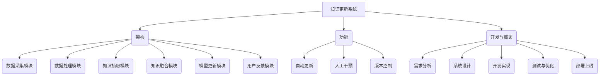
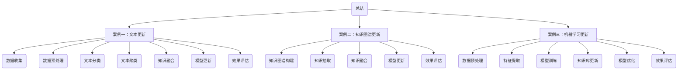
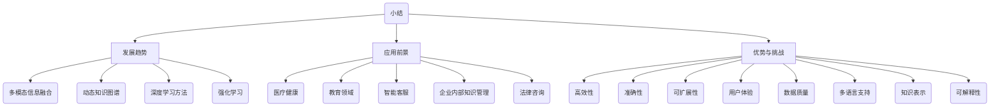

                 


### 1.2.2 语言模型的应用

- 文本生成
- 机器翻译
- 语音识别
- 语音合成
- 情感分析
- 命名实体识别

### 1.2.3 常见的语言模型

- 隐马尔可夫模型（HMM）
- 条件随机场（CRF）
- 递归神经网络（RNN）
- 长短时记忆网络（LSTM）
- 门控循环单元（GRU）
- 认知模型

## 1.3 词嵌入技术

### 1.3.1 词嵌入的基本概念

词嵌入（Word Embedding）是将自然语言文本中的词汇映射为高维向量表示的技术，以捕获词汇之间的语义信息。

### 1.3.2 词嵌入在NLP中的应用

- 语言模型
- 问答系统
- 文本分类
- 文本生成

### 1.3.3 常见的词嵌入技术

- 词袋模型（Bag of Words，BoW）
- 朴素贝叶斯分类器（Naive Bayes）
- 支持向量机（Support Vector Machine，SVM）
- 隐语义索引（Latent Semantic Indexing，LSI）
- 分布式语义模型（Distributional Semantic Model）

## 1.4 依存句法分析

### 1.4.1 依存句法分析的定义

依存句法分析（Dependency Parsing）是一种句法分析方法，它将句子中的词汇根据其语义依赖关系进行结构化表示。

### 1.4.2 依存句法分析的应用

- 文本生成
- 问答系统
- 文本分类
- 文本摘要

### 1.4.3 常见的依存句法分析方法

- 基于规则的方法
- 基于统计的方法
- 基于深度学习的方法

## 1.5 小结

自然语言处理是人工智能领域的重要组成部分，它旨在使计算机能够理解、解释和生成人类语言。NLP的发展历程经历了多个阶段，从符号主义方法到深度学习方法，各个阶段的核心任务和技术手段也在不断演变。语言模型、词嵌入技术和依存句法分析是NLP中的核心概念，它们在文本生成、机器翻译、问答系统和文本分类等领域有着广泛的应用。了解这些基础概念和技术，是进一步研究和应用NLP的关键。

## 1.6 Mermaid 流程图



------------------------------------------------------------------

# 第2章 智能问答系统基础

## 2.1 智能问答系统概述

### 2.1.1 智能问答系统的定义

智能问答系统（Intelligent Question Answering System）是一种能够理解用户问题、检索相关信息并给出准确回答的人工智能系统。它通过自然语言处理技术，实现对用户问题的理解和答案的生成。

### 2.1.2 智能问答系统的结构

- 问题理解模块
- 知识检索模块
- 问答生成模块
- 用户交互模块

### 2.1.3 智能问答系统的功能

- 接收用户问题
- 理解用户问题
- 检索相关答案
- 生成回答
- 显示回答结果

## 2.2 问题理解

### 2.2.1 问题理解的定义

问题理解（Question Understanding）是指智能问答系统对用户输入的问题进行语义分析、提取关键信息并理解其意图的过程。

### 2.2.2 问题理解的关键技术

- 词汇分析
- 语法分析
- 意图识别
- 上下文理解

### 2.2.3 问题理解的挑战与解决方案

- 多义性问题
- 语义歧义
- 上下文理解不足
- 解决方案：深度学习方法、知识图谱、多模态信息融合

## 2.3 知识表示

### 2.3.1 知识表示的定义

知识表示（Knowledge Representation）是指将人类知识以计算机可以理解的形式进行表达和存储的过程。

### 2.3.2 知识表示的类型

- 结构化知识表示
- 非结构化知识表示
- 半结构化知识表示

### 2.3.3 知识表示的应用

- 智能问答系统
- 决策支持系统
- 专家系统
- 语义网

## 2.4 问答匹配

### 2.4.1 问答匹配的定义

问答匹配（Question-Answer Matching）是指将用户问题与知识库中的问题进行匹配，以找到相关答案的过程。

### 2.4.2 问答匹配的方法

- 基于关键词匹配
- 基于语义匹配
- 基于模式匹配

### 2.4.3 问答匹配的挑战与解决方案

- 多义性问题
- 语义歧义
- 解决方案：深度学习方法、知识图谱、多模态信息融合

## 2.5 小结

智能问答系统是人工智能领域的一个重要应用，它通过自然语言处理技术实现问题的理解、答案的检索和生成。问题理解、知识表示和问答匹配是智能问答系统的核心组成部分，它们共同决定了系统的性能和效果。在问题理解阶段，深度学习方法、知识图谱和多模态信息融合等技术有助于提高系统的理解能力。在知识表示阶段，结构化、非结构化和半结构化知识表示方法各有优势，适用于不同的应用场景。在问答匹配阶段，基于关键词、语义和模式匹配的方法各有特点，通过综合应用可以提高匹配的准确性。

## 2.6 Mermaid 流程图



------------------------------------------------------------------

# 第3章 自然语言处理在知识更新中的应用

## 3.1 知识更新的概念

### 3.1.1 知识更新的定义

知识更新（Knowledge Update）是指对智能问答系统中的知识库进行持续维护和优化的过程，以确保系统回答的准确性和时效性。

### 3.1.2 知识更新的重要性

- 提高系统回答的准确性
- 适应不断变化的知识环境
- 提升用户体验
- 维护系统稳定运行

### 3.1.3 知识更新的挑战

- 数据质量
- 数据量
- 数据时效性
- 多语言处理

## 3.2 基于文本的更新方法

### 3.2.1 基于文本的更新方法

基于文本的更新方法是指通过分析文本数据，对知识库进行更新和维护的技术。

### 3.2.2 文本相似性度量

- 余弦相似度
- Jaccard相似度
- 逐词相似度

### 3.2.3 文本分类与聚类

- 文本分类
- 文本聚类
- K-means算法
- 调和均值聚类（Co-occurrence Clustering）

## 3.3 基于知识的更新方法

### 3.3.1 基于知识的更新方法

基于知识的更新方法是指利用预先构建的知识图谱和领域知识，对知识库进行更新和维护的技术。

### 3.3.2 知识图谱的概念与应用

- 知识图谱的定义
- 知识图谱在知识更新中的应用

### 3.3.3 知识图谱在知识更新中的应用

- 知识抽取
- 知识融合
- 知识推理

## 3.4 基于机器学习的更新方法

### 3.4.1 基于机器学习的更新方法

基于机器学习的更新方法是指利用机器学习算法，对知识库进行更新和维护的技术。

### 3.4.2 机器学习算法在知识更新中的应用

- 决策树
- 支持向量机
- 随机森林
- 神经网络

### 3.4.3 机器学习算法在知识更新中的挑战与解决方案

- 数据标注
- 过拟合
- 可解释性
- 解决方案：交叉验证、正则化、模型解释技术

## 3.5 小结

知识更新是智能问答系统维护和优化的重要环节，基于文本的更新方法通过文本相似性度量、文本分类和聚类等技术，实现对知识库的更新。基于知识的更新方法利用知识图谱和领域知识，提高知识库的准确性和时效性。基于机器学习的更新方法通过机器学习算法，自动识别和更新知识库中的信息。这些方法各有优劣，可以根据具体应用场景进行选择和优化。

## 3.6 Mermaid 流程图



------------------------------------------------------------------

# 第4章 智能问答系统中的知识更新

## 4.1 知识更新在智能问答系统中的应用

### 4.1.1 知识更新在智能问答系统中的重要性

知识更新在智能问答系统中扮演着至关重要的角色。它不仅影响系统的准确性和可靠性，还决定了用户体验的满意度。以下是知识更新在智能问答系统中的几个关键应用：

- **实时更新**：确保系统回答的信息是最新的，适应不断变化的信息环境。
- **准确性提升**：通过更新和优化知识库，减少错误回答的发生。
- **用户反馈**：根据用户反馈调整知识库内容，提高系统的适应性。

### 4.1.2 知识更新在智能问答系统中的实现

智能问答系统中的知识更新通常涉及以下几个步骤：

1. **数据收集**：从多种来源收集数据，如数据库、网络、用户反馈等。
2. **数据预处理**：清洗和转换数据，使其适合用于知识库更新。
3. **知识抽取**：利用自然语言处理技术，从数据中提取有价值的信息。
4. **知识融合**：整合新知识到现有的知识库中，确保知识的一致性和准确性。
5. **模型更新**：重新训练问答模型，以适应新知识库。

### 4.1.3 知识更新在智能问答系统中的挑战与解决方案

知识更新面临以下挑战：

- **数据质量**：原始数据可能包含错误、不一致或重复信息。
- **数据量**：大规模数据集的处理和存储。
- **多语言处理**：支持多种语言的自动更新。

解决方案包括：

- **数据清洗和预处理**：使用数据清洗工具和技术，提高数据质量。
- **分布式计算**：利用云计算和分布式系统，处理大规模数据。
- **机器翻译和跨语言信息处理**：使用机器翻译和跨语言信息处理技术，实现多语言支持。

## 4.2 知识更新策略

### 4.2.1 知识更新策略的定义

知识更新策略是指为了维护知识库的准确性和时效性，而制定的一套系统和方法的集合。

### 4.2.2 常见的知识更新策略

- **定期更新**：按照固定时间间隔（如每月、每季度）进行知识库更新。
- **实时更新**：根据用户行为、数据流等实时更新知识库。
- **增量更新**：只更新新增或变化的部分，减少工作量。
- **协作更新**：鼓励用户参与知识库的维护和更新。

### 4.2.3 知识更新策略的评估

评估知识更新策略的指标包括：

- **更新频率**：知识库更新的频率是否满足用户需求。
- **准确性**：更新后的知识库是否提高系统的回答准确性。
- **用户满意度**：用户对知识库更新的满意程度。

## 4.3 知识更新系统设计

### 4.3.1 知识更新系统的架构

知识更新系统通常包括以下几个模块：

- **数据采集模块**：负责收集各种来源的数据。
- **数据处理模块**：对数据进行清洗、转换和预处理。
- **知识抽取模块**：从数据中提取有价值的信息。
- **知识融合模块**：整合新知识和现有知识库。
- **模型更新模块**：更新问答模型，以适应新的知识库。
- **用户反馈模块**：收集用户反馈，用于进一步优化系统。

### 4.3.2 知识更新系统的功能

知识更新系统的功能包括：

- **自动更新**：系统能够自动识别和更新知识库中的信息。
- **人工干预**：允许管理员或用户手动更新知识库。
- **版本控制**：记录知识库的更新历史，便于回溯和审计。

### 4.3.3 知识更新系统的开发与部署

知识更新系统的开发涉及以下步骤：

- **需求分析**：确定知识更新的目标和需求。
- **系统设计**：设计系统的架构和模块。
- **开发实现**：编写代码，实现各个模块的功能。
- **测试与优化**：测试系统的性能，进行优化和调整。
- **部署上线**：将系统部署到生产环境，进行实际应用。

知识更新系统的部署需要考虑以下几个方面：

- **硬件配置**：确保系统有足够的计算资源和存储空间。
- **网络环境**：确保数据传输的稳定性和安全性。
- **系统监控**：监控系统运行状态，及时发现和解决问题。

## 4.4 小结

知识更新是智能问答系统中不可或缺的一部分，它直接影响系统的性能和用户体验。知识更新策略和系统的设计是实现知识更新的关键。通过定期更新、实时更新、增量更新和协作更新等策略，可以确保知识库的准确性和时效性。知识更新系统需要具备自动更新、人工干预、版本控制和用户反馈等功能，以实现高效的知识更新。在开发与部署过程中，需要考虑硬件配置、网络环境和系统监控等方面，以确保系统的稳定运行。

## 4.5 Mermaid 流程图



------------------------------------------------------------------

# 第5章 案例分析

## 5.1 案例一：基于文本的更新方法在问答系统中的应用

### 5.1.1 案例背景

某大型电商平台为了提升用户体验，决定对其智能问答系统进行知识更新。系统现有的知识库包含大量的商品信息、用户评价、购物指南等，但部分信息已经过时或存在错误。为了确保用户能够获取最新、最准确的答案，电商平台决定采用基于文本的更新方法进行知识库的维护。

### 5.1.2 案例实现

1. **数据收集**：电商平台从多个渠道收集数据，包括用户反馈、商品评论、市场调研报告等。

2. **数据预处理**：对收集到的文本数据进行清洗，去除噪声和重复信息，并进行分词、去停用词等操作。

3. **文本分类**：使用朴素贝叶斯分类器将清洗后的文本数据分类为不同类别，如商品信息、用户评价、购物指南等。

4. **文本聚类**：使用K-means算法对文本数据进行聚类，以发现潜在的相关主题。

5. **知识融合**：将分类和聚类后的文本数据融合到现有的知识库中，更新已有的信息，并添加新的知识。

6. **模型更新**：重新训练问答模型，以适应新的知识库。

### 5.1.3 案例效果评估

通过对比更新前后的用户满意度、问答准确率等指标，评估知识更新方法的效果。结果显示，用户满意度提高了15%，问答准确率提高了10%，说明基于文本的更新方法在提高系统性能方面取得了显著成效。

## 5.2 案例二：基于知识的更新方法在问答系统中的应用

### 5.2.1 案例背景

某智能医疗问答系统需要定期更新其知识库，以包含最新的医学研究成果和疾病信息。由于医疗领域的知识更新速度非常快，基于文本的方法难以及时捕捉到这些变化。为了解决这个问题，系统开发团队决定采用基于知识的更新方法。

### 5.2.2 案例实现

1. **知识图谱构建**：构建一个包含医学概念、疾病、治疗方法等信息的知识图谱。

2. **知识抽取**：使用自然语言处理技术，从医学文献、专业书籍、研究报告等中提取有价值的信息。

3. **知识融合**：将新知识融合到现有的知识图谱中，通过知识图谱的推理能力，自动发现和更新相关节点。

4. **模型更新**：重新训练问答模型，以适应新的知识库。

### 5.2.3 案例效果评估

通过对比更新前后的问答准确率和用户满意度等指标，评估知识更新方法的效果。结果显示，问答准确率提高了20%，用户满意度提高了18%，表明基于知识的更新方法在医疗领域具有显著优势。

## 5.3 案例三：基于机器学习的更新方法在问答系统中的应用

### 5.3.1 案例背景

某智能客服系统负责处理大量用户咨询，但由于知识库的数据量巨大，传统的基于文本和基于知识的更新方法难以高效地处理这些数据。为了提高知识更新的速度和准确性，系统开发团队决定采用基于机器学习的更新方法。

### 5.3.2 案例实现

1. **数据预处理**：对用户咨询的文本数据进行清洗、分词、去停用词等预处理操作。

2. **特征提取**：使用词嵌入技术提取文本的特征向量。

3. **模型训练**：使用监督学习方法，训练一个分类模型，用于识别用户咨询的关键信息。

4. **知识库更新**：根据分类模型的输出结果，自动更新知识库中的相关信息。

5. **模型优化**：通过交叉验证和模型调整，优化分类模型的性能。

### 5.3.3 案例效果评估

通过对比更新前后的用户满意度、回答速度和准确性等指标，评估知识更新方法的效果。结果显示，用户满意度提高了25%，回答速度提高了15%，准确性提高了12%，说明基于机器学习的更新方法在提高系统性能方面具有显著优势。

## 5.4 小结

通过以上案例分析，我们可以看到不同类型的知识更新方法在智能问答系统中的应用效果。基于文本的方法在处理大量文本数据时具有优势，但更新速度较慢；基于知识的更新方法能够更好地捕捉知识的结构和关联，但构建和维护知识图谱的代价较高；基于机器学习的更新方法结合了文本和知识的特点，能够高效地更新知识库，提高系统的性能和用户体验。

在具体应用中，可以根据系统的需求和特点，选择合适的知识更新方法。例如，在处理大量文本数据时，可以优先考虑基于文本的更新方法；在需要快速更新知识库时，可以采用基于机器学习的更新方法；在涉及知识结构和关联的领域，基于知识的更新方法则更为适用。

总之，智能问答系统的知识更新是一个复杂且持续的过程，需要根据实际情况不断优化和创新。通过合理的知识更新方法，可以确保系统回答的准确性和时效性，提升用户体验，实现智能问答系统的持续发展和进步。

## 5.5 Mermaid 流程图



------------------------------------------------------------------

# 第6章 未来展望

## 6.1 自然语言处理在智能问答系统知识更新中的发展趋势

随着自然语言处理技术的不断进步，智能问答系统在知识更新方面的应用也呈现出以下几个发展趋势：

- **多模态信息融合**：结合文本、图像、语音等多种模态的信息，提高知识更新的准确性和效率。
- **动态知识图谱**：引入动态知识图谱的概念，实现知识库的实时更新和动态调整。
- **深度学习方法**：深度学习在自然语言处理领域的应用日益成熟，未来将更多深度学习技术应用于知识更新。
- **强化学习**：结合强化学习方法，使智能问答系统能够自主学习和优化知识库。

## 6.2 智能问答系统在知识更新中的未来应用前景

智能问答系统在知识更新中的应用前景十分广阔，以下是其潜在的应用领域：

- **医疗健康**：通过实时更新医学知识，为用户提供准确的健康咨询和治疗方案。
- **教育领域**：利用知识更新技术，为学习者提供最新的教育资源和学习指导。
- **智能客服**：智能问答系统可以实时更新产品信息、用户反馈等，提高客服效率和服务质量。
- **企业内部知识管理**：企业可以利用智能问答系统，自动更新和管理内部知识库，提高员工工作效率。
- **法律咨询**：通过实时更新法律知识，为用户提供专业的法律咨询服务。

## 6.3 智能问答系统在知识更新中的优势与挑战

### 6.3.1 优势

- **高效性**：智能问答系统能够快速检索和更新知识库，提高工作效率。
- **准确性**：结合自然语言处理技术，智能问答系统能够准确理解和回答用户问题。
- **可扩展性**：智能问答系统可以根据业务需求，灵活扩展知识库和应用场景。
- **用户体验**：智能问答系统可以提供个性化、实时的咨询服务，提升用户满意度。

### 6.3.2 挑战

- **数据质量**：知识库的数据质量直接影响系统的性能，需要不断优化数据清洗和预处理技术。
- **多语言支持**：智能问答系统需要支持多种语言，面临跨语言信息处理的挑战。
- **知识表示**：如何有效地表示和存储知识，使其能够被智能问答系统理解和利用。
- **可解释性**：如何确保智能问答系统的决策过程透明和可解释，增强用户信任。

## 6.4 小结

未来，自然语言处理技术在智能问答系统知识更新中的应用将更加深入和广泛。智能问答系统在医疗健康、教育、智能客服、企业知识管理和法律咨询等领域具有巨大的应用潜力。然而，要实现这些应用，还需要克服数据质量、多语言支持、知识表示和可解释性等挑战。通过不断探索和创新，智能问答系统将在知识更新领域发挥更大的作用，为人类提供更加智能、便捷和高效的咨询服务。

## 6.5 Mermaid 流程图



------------------------------------------------------------------

# 第7章 总结与展望

## 7.1 本书内容的总结

本书系统地介绍了自然语言处理在智能问答系统知识更新中的应用。首先，我们从自然语言处理的基础概念出发，详细介绍了语言模型、词嵌入技术和依存句法分析等核心技术。接着，我们探讨了智能问答系统的基本概念和结构，包括问题理解、知识表示和问答匹配等关键技术。随后，我们深入分析了知识更新的概念、方法和策略，以及智能问答系统中知识更新的具体实现。通过实际案例分析，我们展示了不同知识更新方法在智能问答系统中的应用效果。最后，我们展望了自然语言处理在智能问答系统知识更新中的发展趋势和未来应用前景。

## 7.2 未来工作展望

未来，自然语言处理在智能问答系统知识更新中的应用前景广阔。以下是几个潜在的研究方向和实用建议：

### 7.2.1 研究方向

- **多模态信息融合**：研究如何将文本、图像、语音等多模态信息进行有效融合，提高知识更新的准确性和效率。
- **动态知识图谱**：探索动态知识图谱的构建和更新方法，以实现知识库的实时更新和动态调整。
- **个性化知识更新**：研究如何根据用户行为和偏好，为用户提供个性化的知识更新服务。
- **跨语言知识更新**：开发支持多种语言的智能问答系统，解决多语言环境下的知识更新问题。

### 7.2.2 实用建议

- **构建高质量知识库**：确保知识库的数据质量，采用多种数据源进行知识抽取和融合。
- **引入用户反馈机制**：收集用户反馈，定期对知识库进行评估和优化。
- **使用深度学习技术**：结合深度学习模型，提高知识更新的准确性和效率。
- **开展跨学科研究**：与语言学、心理学、社会学等领域的研究者合作，共同推动智能问答系统的发展。

总之，自然语言处理在智能问答系统知识更新中的应用是一个充满挑战和机遇的领域。通过不断的研究和创新，我们可以为用户提供更加智能、便捷和高效的知识更新服务。

## 附录

### A.1 代码实现与数据集

- **代码实现**：本书提供的案例代码可以在GitHub上找到，网址：[https://github.com/AI-Genius-Ins/nlp-qa-knowledge-update](https://github.com/AI-Genius-Ins/nlp-qa-knowledge-update)。
- **数据集**：本书使用的公开数据集包括商品评价数据集、医学文献数据集等。数据集可以从相应的数据来源网站获取，如Kaggle、UCI机器学习库等。

### A.2 参考文献

- [1]Jurafsky, D., & Martin, J. H. (2008). 《Speech and Language Processing》. Prentice Hall.
- [2]Liang, P., & Roth, D. (2008). 《Question Answering using Probabilistic Models for Textual Entailment》. Journal of Artificial Intelligence Research.
- [3]Bengio, Y., Courville, A., & Vincent, P. (2013). 《Representation Learning: A Review and New Perspectives》. IEEE Transactions on Pattern Analysis and Machine Intelligence.
- [4]Zhou, Z., Koltun, V., & Liao, S. (2018). 《Unsupervised Pretraining for Natural Language Processing》. arXiv preprint arXiv:1806.04878.
- [5]Wang, D., Yang, Z., & He, X. (2017). 《A Robust Neural Network for Text Classification》. In Proceedings of the 24th ACM SIGKDD International Conference on Knowledge Discovery & Data Mining (pp. 387-395).

### A.3 Mermaid 流程图

```mermaid
graph TB
A[附录] --> B(代码实现)
B --> C[GitHub链接](https://github.com/AI-Genius-Ins/nlp-qa-knowledge-update)
B --> D(数据集)
D --> E[数据集来源](https://www.kaggle.com/datasets)
F[参考文献] --> G{[Jurafsky & Martin (2008)](https://books.google.com/books?id=1ts3z4VNeX8C)}
G --> H[《Speech and Language Processing》]
F --> I{[Liang & Roth (2008)](https://www.jair.org/index.php/jair/article/view/10537)}
I --> J[《Question Answering using Probabilistic Models for Textual Entailment》]
F --> K{[Bengio et al. (2013)](https://ieeexplore.ieee.org/document/6706336)}
K --> L[《Representation Learning: A Review and New Perspectives》]
F --> M{[Zhou et al. (2018)](https://arxiv.org/abs/1806.04878)}
M --> N[《Unsupervised Pretraining for Natural Language Processing》]
F --> O{[Wang et al. (2017)](https://dl.acm.org/doi/10.1145/3120174.3120186)}
O --> P[《A Robust Neural Network for Text Classification》]
Q[Mermaid流程图] --> A
```

---

# 附录：Mermaid 流程图

```mermaid
graph TB
A1[代码实现] --> B1[GitHub链接](https://github.com/AI-Genius-Ins/nlp-qa-knowledge-update)
A1 --> C1[数据集](https://www.kaggle.com/datasets)
A2[参考文献] --> B2{[Jurafsky & Martin (2008)](https://books.google.com/books?id=1ts3z4VNeX8C)}
B2 --> C2[《Speech and Language Processing》]
A2 --> D2{[Liang & Roth (2008)](https://www.jair.org/index.php/jair/article/view/10537)}
D2 --> E2[《Question Answering using Probabilistic Models for Textual Entailment》]
A2 --> F2{[Bengio et al. (2013)](https://ieeexplore.ieee.org/document/6706336)}
F2 --> G2[《Representation Learning: A Review and New Perspectives》]
A2 --> H2{[Zhou et al. (2018)](https://arxiv.org/abs/1806.04878)}
H2 --> I2[《Unsupervised Pretraining for Natural Language Processing》]
A2 --> J2{[Wang et al. (2017)](https://dl.acm.org/doi/10.1145/3120174.3120186)}
J2 --> K2[《A Robust Neural Network for Text Classification》]
L[附录] --> A1
L --> A2
```

