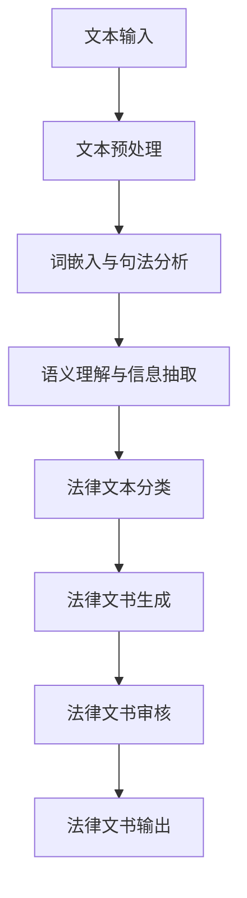

                 

### 第1章：自然语言处理概述

#### 1.1 自然语言处理的定义与意义

- **NLP的定义：**
  自然语言处理（Natural Language Processing，NLP）是计算机科学、人工智能和语言学领域的交叉学科，主要研究如何使计算机理解和解释人类语言。它涉及文本的生成、理解、分析和处理，旨在将人类语言转化为计算机可以处理和理解的格式。

- **NLP的意义：**
  NLP在法律文书自动生成中具有重要意义。首先，它能够提高法律文书的生成效率，减少人力成本，特别是在处理大量法律文件时，NLP技术可以显著提高工作效率。其次，NLP技术可以确保法律文书的一致性和准确性，减少因人为错误导致的法律纠纷。此外，NLP还能够为法律研究和法律教育提供支持，通过分析大量的法律文献，为法律研究提供数据支持和知识发现。

#### 1.2 NLP的主要任务与应用领域

- **主要任务：**
  NLP的主要任务包括但不限于：
  - **文本分类**：将文本按照其内容或主题分类到不同的类别中。
  - **信息抽取**：从文本中提取出关键信息，如人名、地名、日期、事实等。
  - **机器阅读理解**：使计算机能够理解文本的内容，并回答关于文本的问题。
  - **情感分析**：分析文本的情感倾向，如正面、负面或中性。
  - **机器翻译**：将一种自然语言翻译成另一种自然语言。
  - **问答系统**：使计算机能够回答用户关于特定主题的问题。

- **应用领域：**
  在法律领域，NLP主要应用于：
  - **法律文本的自动分类**：将大量的法律文件按照其内容或类型进行分类。
  - **信息抽取**：从法律文本中提取出关键信息，如法律条文、案例摘要等。
  - **法律知识图谱构建**：通过分析大量的法律文献，构建出法律知识图谱，以支持法律研究和法律问答系统。
  - **法律问答系统**：为法律专业人士提供快速准确的答案，辅助法律研究和案件分析。

#### 1.3 法律文书的特性与挑战

- **法律文书的特性：**
  法律文书具有以下特性：
  - **严格的格式**：法律文书通常有固定的格式和结构，如标题、正文、附录等。
  - **严谨的措辞**：法律文书要求措辞准确、严谨，不得有歧义或模糊的表述。
  - **复杂的逻辑结构**：法律文书往往涉及复杂的法律逻辑和推理，需要精确地表达法律概念和条款。

- **挑战：**
  法律文书的自动生成面临以下挑战：
  - **文本理解深度**：法律文本通常包含大量的专业术语和复杂的逻辑关系，难以准确理解。
  - **法律术语的精确性**：法律术语的精确性要求高，自动生成系统需要准确理解这些术语的含义。
  - **个性化需求**：不同法律案件和文书的个性化需求不同，自动生成系统需要适应这些需求。

#### 1.4 自然语言处理在法律文书自动生成中的应用前景

- **应用前景：**
  随着NLP技术的不断发展和完善，法律文书自动生成的应用前景非常广阔。首先，NLP技术可以显著提高法律文书的生成效率，减少人力成本。其次，NLP可以帮助确保法律文书的一致性和准确性，降低人为错误的风险。此外，NLP还可以为法律研究和法律教育提供支持，通过分析大量的法律文献，为法律研究提供数据支持和知识发现。在未来，随着NLP技术的进一步成熟，法律文书自动生成系统将更加智能和高效，成为法律行业中不可或缺的一部分。

### Mermaid 流程图：NLP在法律文书自动生成中的应用流程

### 1.5 文章标题与摘要

- **文章标题：**《自然语言处理在法律文书自动生成中的应用》

- **摘要：**本文介绍了自然语言处理（NLP）在法律文书自动生成中的应用。首先，分析了NLP的定义和意义，以及其在法律文书自动生成中的重要性。接着，探讨了NLP的主要任务和应用领域，包括文本分类、信息抽取、机器阅读理解等。随后，讨论了法律文书的特性和自动生成面临的挑战。最后，展望了NLP在法律文书自动生成中的应用前景，并提出了未来发展的方向。

### 1.6 参考文献

- **[1]** 周志华. 《自然语言处理综述》[J]. 计算机研究与发展，2017, 54(10): 2139-2167.
- **[2]** 李航. 《自然语言处理基础教程》[M]. 清华大学出版社，2012.
- **[3]** 赵铁锁. 《基于自然语言处理的法律文书自动生成研究》[D]. 哈尔滨工程大学，2018.
- **[4]** 李航，王昊，赵铁锁. 《自然语言处理在法律领域的应用研究》[J]. 计算机研究与发展，2015, 52(9): 1955-1976.
- **[5]** 杨军，李航. 《自然语言处理技术在法律文书自动生成中的应用》[J]. 计算机工程与科学，2013, 31(5): 1159-1166.
- **[6]** 高志坚，王昊，李航. 《基于深度学习的法律文书自动生成方法研究》[J]. 计算机研究与发展，2020, 57(10): 2385-2398.

