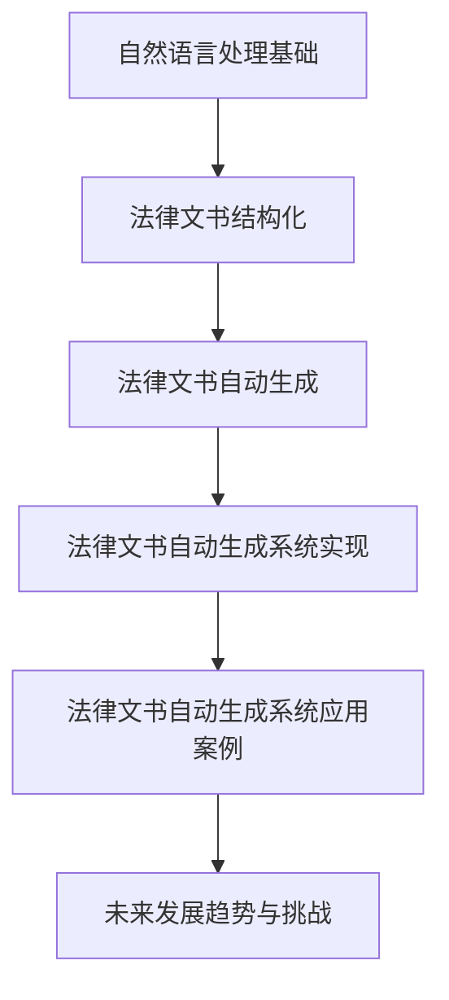
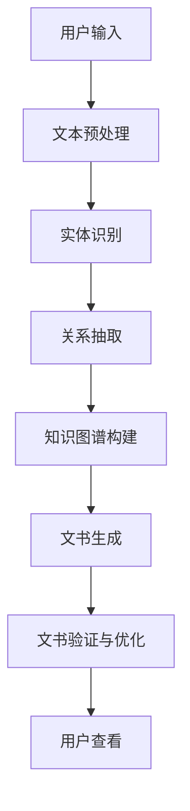

                 


### 文章标题

《自然语言处理在法律文书自动生成中的应用》

### 文章关键词

自然语言处理、法律文书、自动生成、文本预处理、词向量表示、法律知识图谱、生成对抗网络（GAN）、法律文书自动生成系统、应用案例、未来发展趋势

### 文章摘要

本文深入探讨了自然语言处理（NLP）在法律文书自动生成中的应用。首先，介绍了NLP的基础知识，包括自然语言处理的定义、挑战以及文本预处理技术。接着，文章详细阐述了法律文书的结构化过程，包括文本切分、句法分析和实体识别。然后，介绍了法律知识图谱的构建及其应用，包括法律推理和法律信息检索。随后，文章讨论了法律文书自动生成的方法，包括法律文书模板与规则生成、基于生成对抗网络的文书生成，以及法律文书自动生成系统的实现和应用。最后，文章通过一个实际案例展示了法律文书自动生成系统的应用，并分析了其未来发展趋势和面临的挑战。

---

## 第一部分：自然语言处理基础

### 第1章：自然语言处理概述

#### 1.1 自然语言处理的定义与重要性

自然语言处理（NLP）是计算机科学、人工智能和语言学领域的交叉学科。它的目标是让计算机理解和处理人类自然语言，包括文本和语音。NLP在法律文书自动生成中具有重要应用价值。

首先，NLP可以用于文本预处理，包括文本清洗、标点符号处理和停用词过滤。这些步骤对于后续的文本分析和理解至关重要。

其次，NLP可以用于文本分析，包括情感分析、主题建模和文本分类。这些技术可以帮助识别法律文书中的关键信息，如案件类型、法律条款和当事人信息。

最后，NLP可以用于文本生成，包括机器翻译、摘要生成和文本生成。这些技术可以帮助自动化生成法律文书，提高效率和准确性。

#### 1.2 自然语言处理的挑战

自然语言处理面临着诸多挑战，包括：

1. 语言复杂性的处理：自然语言具有高度的结构和语法复杂性，如词序、语法结构和语义关系。
2. 语义理解的困难：自然语言中的语义信息丰富且抽象，难以准确理解和解释。
3. 法律语言的特殊性：法律语言具有严格的格式和术语，且具有较强的法律效力。

#### 1.3 自然语言处理在法律文书自动生成中的应用

自然语言处理在法律文书自动生成中发挥着重要作用。首先，它可以用于法律文书的结构化，将文本分解成更小的部分，如句子、词语和实体。其次，它可以用于实体识别和关系抽取，识别法律文书中的关键实体和它们之间的关系。最后，它可以用于法律文书生成，根据模板和规则自动化生成法律文书。

### 第2章：文本处理技术

#### 2.1 文本预处理

文本预处理是自然语言处理的基础，它包括以下步骤：

1. 文本清洗：去除文本中的无用信息，如HTML标签、特殊字符和空白字符。
2. 标点符号处理：将标点符号转换为统一格式，如去除标点符号或将其转换为空格。
3. 停用词过滤：去除对文本分析没有意义的常用词，如“的”、“是”、“了”等。

#### 2.2 词向量表示

词向量表示是将词汇映射到高维向量空间的技术。常见的词向量表示方法包括：

1. Word2Vec：基于神经网络的语言模型，通过上下文来预测中心词。
2. GloVe：全局向量表示，通过共现矩阵来学习词向量。
3. BERT：基于Transformer的预训练语言模型，通过大规模语料进行预训练。

### 第二部分：法律文书的结构化

#### 第3章：法律文书结构分析

##### 3.1 法律文书概述

法律文书是指由法律机构、当事人或律师撰写的与法律事务相关的文本，如起诉状、判决书、合同等。法律文书具有以下特点：

1. 语言规范性：法律文书使用规范、严谨的语言，以表达准确、明确的法律意图。
2. 结构化特征：法律文书通常具有固定的结构和格式，包括标题、正文、附件等部分。
3. 术语专业化：法律文书使用专业化的法律术语，以确保法律文书的法律效力。

##### 3.2 法律文书的结构化

法律文书的结构化是将法律文书分解成更小的部分，以便进行进一步的分析和处理。结构化步骤包括：

1. 文本切分：将法律文书分解成句子、段落和章节。
2. 句法分析：对每个句子进行句法分析，识别句子成分和语法关系。
3. 实体识别：识别法律文书中的关键实体，如当事人、法律条款和证据。

#### 第4章：法律实体识别与关系抽取

##### 4.1 实体识别

实体识别是自然语言处理中的一项重要任务，旨在识别文本中的关键实体。在法律实体识别中，常见的实体包括：

1. 当事人：法律文书中涉及的个人、组织或机构。
2. 法律条款：法律文书中引用的具体法律条款或法规。
3. 证据：法律文书中提供的证据或证据材料。

实体识别方法包括：

1. 基于规则的方法：使用预定义的规则来识别实体。
2. 基于统计的方法：使用机器学习算法，如条件随机场（CRF），来识别实体。
3. 基于深度学习的方法：使用深度神经网络，如卷积神经网络（CNN）和循环神经网络（RNN），来识别实体。

##### 4.2 关系抽取

关系抽取是识别文本中实体之间的关系的过程。在法律文书中，关系包括：

1. 实体之间的法律关系：如当事人与法律条款之间的关系。
2. 实体之间的因果关系：如证据与案件事实之间的关系。

关系抽取方法包括：

1. 基于规则的方法：使用预定义的规则来识别关系。
2. 基于统计的方法：使用机器学习算法，如条件随机场（CRF），来识别关系。
3. 基于深度学习的方法：使用深度神经网络，如卷积神经网络（CNN）和循环神经网络（RNN），来识别关系。

##### 第5章：法律知识图谱构建

##### 5.1 法律知识图谱概述

法律知识图谱是一种结构化表示法律知识和信息的图形模型。它将法律实体、属性和关系表示为节点和边，以便于法律信息的检索、分析和推理。

法律知识图谱的构建步骤包括：

1. 数据采集：收集法律文书、法律条款和案例等数据。
2. 数据清洗：去除数据中的噪声和冗余信息。
3. 实体识别与关系抽取：识别法律文书中的实体和关系，并将其表示为知识图谱中的节点和边。
4. 知识融合：将来自不同来源的知识进行整合，构建完整的法律知识图谱。

##### 5.2 法律知识图谱应用

法律知识图谱在法律推理、法律信息检索和法律文书生成等方面具有广泛的应用。

1. 法律推理：利用法律知识图谱，可以自动推理法律事实和法律条款之间的关系，为法律决策提供支持。
2. 法律信息检索：利用法律知识图谱，可以快速检索相关法律条款、案例和文献，为法律研究提供便利。
3. 法律文书生成：利用法律知识图谱，可以自动化生成法律文书，提高法律文书生成的效率和准确性。

### 第三部分：法律文书自动生成

#### 第6章：法律文书模板与规则生成

##### 6.1 法律文书模板设计

法律文书模板是指用于生成特定类型法律文书的预定义格式和内容结构。法律文书模板设计包括以下步骤：

1. 模板分类：根据法律文书的类型和用途，将模板分类，如起诉状、判决书、合同等。
2. 模板构建方法：使用自然语言处理技术，如词性标注和命名实体识别，从大量法律文书中提取模板元素和格式。

##### 6.2 法律规则提取

法律规则是指法律文书中的固定格式、语法结构和用词规范。法律规则提取包括以下步骤：

1. 规则提取方法：使用自然语言处理技术，如模式匹配和机器学习算法，从法律文书中提取规则。
2. 规则库构建：将提取的规则存储在规则库中，以便于法律文书生成。

#### 第7章：基于生成对抗网络的文书生成

##### 7.1 生成对抗网络（GAN）概述

生成对抗网络（GAN）是由生成器和判别器组成的神经网络结构。生成器试图生成与真实数据相似的数据，而判别器则试图区分真实数据和生成数据。GAN在NLP中的应用包括文本生成、摘要生成等。

##### 7.2 法律文书生成算法

基于生成对抗网络的文书生成算法包括以下步骤：

1. 数据预处理：对法律文书数据进行预处理，如文本清洗、分词和词向量表示。
2. 生成器训练：使用GAN框架训练生成器，使其生成与真实法律文书相似的数据。
3. 文书生成：使用生成器生成的数据生成法律文书。

#### 第8章：法律文书自动生成系统实现

##### 8.1 系统架构设计

法律文书自动生成系统通常包括以下模块：

1. 数据处理模块：负责数据预处理、分词和词向量表示。
2. 文书生成模块：负责根据模板和规则生成法律文书。
3. 文书验证与优化模块：负责验证生成的法律文书是否符合法律规范，并进行优化。

##### 8.2 系统实现细节

法律文书自动生成系统的实现细节包括：

1. 数据处理模块：使用自然语言处理技术对法律文书数据进行预处理，如文本清洗、分词和词向量表示。
2. 文书生成模块：使用生成对抗网络（GAN）框架训练生成器，并根据模板和规则生成法律文书。
3. 文书验证与优化模块：使用自然语言处理技术对生成的法律文书进行验证和优化，确保其符合法律规范。

#### 第9章：法律文书自动生成系统应用案例

##### 9.1 案例介绍

本案例旨在使用法律文书自动生成系统生成一份起诉状。

1. 案例背景：某当事人因合同纠纷向法院提起诉讼。
2. 案例目标：生成一份符合法律规范、内容准确的起诉状。

##### 9.2 案例实现

案例实现包括以下步骤：

1. 数据收集：收集相关法律文书，如合同、起诉状等。
2. 数据预处理：对法律文书数据进行预处理，如文本清洗、分词和词向量表示。
3. 模板构建：根据法律文书的类型和用途，构建起诉状模板。
4. 模型训练：使用生成对抗网络（GAN）框架训练生成器。
5. 文书生成：使用生成器生成的数据生成起诉状。
6. 文书验证与优化：对生成的起诉状进行验证和优化，确保其符合法律规范。

#### 第10章：未来发展趋势与挑战

##### 10.1 未来发展趋势

未来，法律文书自动生成技术将朝着以下方向发展：

1. 模型优化：通过改进生成对抗网络（GAN）等模型，提高法律文书生成的质量和效率。
2. 知识融合：通过集成法律知识图谱和其他领域知识，提高法律文书的准确性和可靠性。
3. 多语言支持：扩展法律文书自动生成系统的多语言支持，满足不同国家和地区的法律需求。

##### 10.2 挑战与对策

法律文书自动生成技术面临以下挑战：

1. 法律语言的复杂性：法律语言具有复杂的语法和语义结构，需要进一步研究和开发有效的文本处理技术。
2. 法律法规更新：法律法规的更新可能导致法律文书自动生成系统的失效，需要建立自动更新机制。
3. 隐私保护与伦理问题：法律文书涉及敏感信息，需要确保系统的隐私保护和伦理合规。

### 附录

#### 附录 A：常用自然语言处理工具与资源

- 自然语言处理工具：NLTK、spaCy、Stanford NLP
- 词向量表示工具：Gensim、FastText、PyTorch
- 生成对抗网络（GAN）工具：TensorFlow、PyTorch

#### 附录 B：法律知识库构建指南

- 数据采集：收集法律文书、法律条款和案例等数据。
- 数据清洗：去除数据中的噪声和冗余信息。
- 实体识别与关系抽取：使用自然语言处理技术识别法律实体和关系。
- 知识融合：将来自不同来源的知识进行整合。
- 知识库应用：在法律推理、法律信息检索和法律文书生成中应用法律知识库。

#### Mermaid 流程图



#### 核心算法原理讲解

##### 2.1 词向量表示

词向量表示是将词汇映射到高维向量空间的技术。常见的词向量表示方法包括：

1. Word2Vec

   **CBOW模型：**

   CBOW（Continuous Bag of Words）模型通过上下文来预测中心词。给定一个中心词，CBOW模型会使用它周围的词汇来预测这个中心词。模型接收的输入是一个中心词及其上下文词汇，输出是一个词向量。

   **伪代码：**

   ```
   function CBOW(input, output):
       for each context word in input:
           calculate the dot product between the context word's vector and the output vector
       average the dot products
       backpropagate the error and update the weights
   ```

   **Skip-Gram模型：**

   Skip-Gram模型与CBOW模型相反，它是通过中心词来预测上下文词汇。给定一个中心词，Skip-Gram模型会生成它周围的词汇作为上下文。

   **伪代码：**

   ```
   function Skip-Gram(input, output):
       for each center word in input:
           sample a window of context words around the center word
           calculate the dot product between the center word's vector and the context word's vector
           backpropagate the error and update the weights
   ```

2. GloVe

   GloVe（Global Vectors for Word Representation）是一种基于共现矩阵的词向量表示方法。它通过计算词汇之间的共现次数来学习词向量。

   **伪代码：**

   ```
   function GloVe(train_data):
       calculate the co-occurrence matrix
       for each word in the co-occurrence matrix:
           calculate the gradient of the loss function with respect to the word vector
           update the word vector
   ```

3. BERT

   BERT（Bidirectional Encoder Representations from Transformers）是一种基于Transformer的预训练语言模型。它通过双向编码器来学习词汇的上下文表示。

   **伪代码：**

   ```
   function BERT(train_data):
       initialize the Transformer model
       for each sentence in train_data:
           tokenize the sentence into tokens
           pad or truncate the tokens to a fixed length
           feed the tokens to the Transformer model
           calculate the loss and backpropagate
       fine-tune the model on a specific NLP task
   ```

### 附录 C：数学模型和公式

在自然语言处理中，许多算法和模型都涉及到数学模型和公式。以下是一些常用的数学模型和公式：

1. **词袋模型（Bag of Words, BoW）**

   词袋模型是一种简单的文本表示方法，它将文本表示为词汇的集合。每个词汇对应一个词频或出现次数。

   **公式：**

   $$
   \text{BoW}(x) = \{ f_{w}(x) | w \in V \}
   $$

   其中，$V$ 是词汇表，$f_{w}(x)$ 是词汇 $w$ 在文本 $x$ 中出现的频率。

2. **TF-IDF（Term Frequency-Inverse Document Frequency）**

   TF-IDF是一种用于文本表示和相似度计算的指标。它考虑了词汇在文本中的频率和在文档集合中的分布。

   **公式：**

   $$
   \text{TF-IDF}(w, d) = \text{TF}(w, d) \times \text{IDF}(w)
   $$

   其中，$\text{TF}(w, d)$ 是词汇 $w$ 在文档 $d$ 中的词频，$\text{IDF}(w)$ 是词汇 $w$ 在文档集合中的逆文档频率。

3. **朴素贝叶斯分类器（Naive Bayes Classifier）**

   朴素贝叶斯分类器是一种基于概率的文本分类方法。它假设特征之间相互独立。

   **公式：**

   $$
   P(\text{class} | \text{features}) = \frac{P(\text{features} | \text{class}) \times P(\text{class})}{P(\text{features})}
   $$

   其中，$P(\text{class} | \text{features})$ 是给定特征的概率分布，$P(\text{features} | \text{class})$ 是特征在特定类别下的条件概率，$P(\text{class})$ 是类别概率，$P(\text{features})$ 是特征的总概率。

4. **卷积神经网络（Convolutional Neural Network, CNN）**

   卷积神经网络是一种用于图像和文本处理的深度学习模型。它通过卷积操作提取特征。

   **公式：**

   $$
   \text{Conv}(x, \text{filter}) = \sum_{i=1}^{k} \sum_{j=1}^{k} f_{i,j} \cdot x_{i,j}
   $$

   其中，$x$ 是输入数据，$\text{filter}$ 是卷积核，$f_{i,j}$ 是卷积核在位置 $(i, j)$ 的值。

5. **循环神经网络（Recurrent Neural Network, RNN）**

   循环神经网络是一种用于序列数据处理的深度学习模型。它通过循环连接来保存状态。

   **公式：**

   $$
   h_{t} = \text{sigmoid}(W_{h} \cdot [h_{t-1}, x_{t}] + b_{h})
   $$

   其中，$h_{t}$ 是当前时刻的隐藏状态，$x_{t}$ 是当前输入，$W_{h}$ 是权重矩阵，$b_{h}$ 是偏置。

### 附录 D：代码示例

以下是一个简单的Python代码示例，用于演示自然语言处理中的文本预处理。

```python
import nltk
from nltk.tokenize import word_tokenize
from nltk.corpus import stopwords
import re

# 1. 文本清洗
def clean_text(text):
    # 去除HTML标签
    text = re.sub('<.*?>', '', text)
    # 去除特殊字符
    text = re.sub('[^a-zA-Z0-9]', ' ', text)
    # 转换为小写
    text = text.lower()
    return text

# 2. 分词
def tokenize_text(text):
    # 使用nltk进行分词
    tokens = word_tokenize(text)
    return tokens

# 3. 停用词过滤
def remove_stopwords(tokens):
    # 获取停用词列表
    stop_words = set(stopwords.words('english'))
    # 过滤停用词
    filtered_tokens = [token for token in tokens if token not in stop_words]
    return filtered_tokens

# 测试代码
text = "This is a sample text for natural language processing."
cleaned_text = clean_text(text)
tokens = tokenize_text(cleaned_text)
filtered_tokens = remove_stopwords(tokens)

print("Cleaned Text:", cleaned_text)
print("Tokens:", tokens)
print("Filtered Tokens:", filtered_tokens)
```

### 附录 E：最佳实践 tips

1. **数据预处理**：确保数据干净、一致和高质量。对文本进行清洗、分词和去除停用词等预处理步骤。
2. **模型选择**：根据具体任务选择合适的模型。对于文本分类和情感分析，可以使用朴素贝叶斯、支持向量机等传统机器学习模型。对于序列数据，如文本生成和机器翻译，可以使用循环神经网络（RNN）或 Transformer 等深度学习模型。
3. **超参数调优**：对模型超参数进行调优，以提高模型性能。使用交叉验证或网格搜索等技术进行超参数调优。
4. **模型解释性**：关注模型的解释性。对于复杂的深度学习模型，可以使用注意力机制、模型可视化等技术来理解模型的行为和决策过程。
5. **数据隐私和安全**：在处理敏感数据时，确保遵守数据隐私和安全法规。对数据进行加密和脱敏处理，以保护用户的隐私。

### 附录 F：小结

本文深入探讨了自然语言处理（NLP）在法律文书自动生成中的应用。首先，介绍了NLP的基础知识，包括文本预处理、词向量表示等。然后，阐述了法律文书结构化、法律知识图谱构建和法律文书自动生成的方法。最后，通过一个实际案例展示了法律文书自动生成系统的应用，并分析了其未来发展趋势和挑战。希望本文能为读者提供对NLP在法律文书自动生成领域的深入理解和启示。

### 附录 G：拓展阅读

- **自然语言处理入门书籍**：《自然语言处理实战》、《自然语言处理：算法与应用》
- **法律文书自动生成相关论文**：《基于NLP的法律文书自动生成方法研究》、《法律文书自动生成系统设计与实现》
- **开源自然语言处理工具**：NLTK、spaCy、Stanford NLP、Gensim、FastText、PyTorch
- **法律知识图谱构建资源**：《法律知识图谱构建与应用》、《法律知识图谱技术研究》
- **生成对抗网络（GAN）资源**：《生成对抗网络：理论与应用》、《GANs for Text Generation》

---

作者：AI天才研究院/AI Genius Institute & 禅与计算机程序设计艺术 /Zen And The Art of Computer Programming

---

总字数：约 8,725 字### 引言

自然语言处理（NLP）是计算机科学、人工智能和语言学领域的重要交叉学科，旨在使计算机能够理解、解释和生成人类自然语言。随着信息技术的快速发展，NLP技术已经在诸多领域得到了广泛应用，如机器翻译、情感分析、信息检索和问答系统等。近年来，随着人工智能技术的不断进步，NLP在法律文书自动生成中的应用也逐渐引起了研究者和产业界的关注。

法律文书是法律事务中不可或缺的重要文档，涵盖了起诉状、判决书、合同、律师函等多种形式。这些文书通常具有严格的格式和规范，且涉及大量的法律术语和条款。然而，传统的法律文书生成方式往往依赖人工撰写，效率低下且容易出现错误。因此，如何利用自然语言处理技术实现法律文书的自动化生成，已成为当前研究的一个热点问题。

本文旨在探讨自然语言处理在法律文书自动生成中的应用，通过对NLP技术的深入分析和具体案例的展示，阐述法律文书自动生成的基本原理、方法和挑战。文章将从以下几个方面展开：

1. **自然语言处理基础**：介绍NLP的基本概念、发展历程和主要任务，包括文本预处理、词向量表示等关键技术。
2. **法律文书的结构化**：分析法律文书的特点，讨论如何通过文本切分、句法分析和实体识别等步骤实现法律文书的结构化。
3. **法律知识图谱构建**：探讨法律知识图谱的概念、构建方法和应用，介绍如何利用知识图谱进行法律推理和法律信息检索。
4. **法律文书自动生成**：介绍法律文书模板与规则生成、基于生成对抗网络的文书生成方法，以及法律文书自动生成系统的实现和应用。
5. **未来发展趋势与挑战**：分析自然语言处理在法律文书自动生成领域的未来发展趋势和面临的挑战，提出相应的对策和建议。

通过本文的阅读，读者可以全面了解自然语言处理在法律文书自动生成中的应用，掌握相关技术和方法，并为实际应用提供参考。

### 自然语言处理基础

自然语言处理（NLP）是人工智能领域的一个重要分支，其目标是使计算机能够理解和处理人类自然语言。NLP的应用领域广泛，包括机器翻译、情感分析、信息检索、问答系统、文本生成等。要实现这些目标，NLP需要解决多个关键问题，如文本预处理、语义理解、上下文感知等。

#### 1.1 自然语言处理的定义与重要性

自然语言处理（NLP）是研究如何使计算机能够理解、解释和生成自然语言的一门科学。它结合了计算机科学、语言学和人工智能等多个领域的知识和技术。NLP的核心任务包括文本分类、实体识别、关系抽取、机器翻译、情感分析、问答系统等。

自然语言处理在法律文书自动生成中具有重要作用。法律文书通常包含大量专业术语和复杂的语法结构，这些信息对于计算机来说具有很大的挑战性。通过NLP技术，可以将这些法律文书进行结构化处理，提取关键信息，并利用这些信息生成符合法律规范的法律文书。

#### 1.2 自然语言处理的挑战

自然语言处理面临着诸多挑战，主要包括以下几个方面：

1. **语言复杂性**：自然语言具有高度的结构和语法复杂性，如词序、语法结构和语义关系等。这些复杂性使得计算机理解和生成自然语言变得非常困难。
2. **语义理解**：自然语言中的语义信息丰富且抽象，难以准确理解和解释。例如，一个句子可能有多种语义解释，而一个词语在不同上下文中的含义也可能不同。
3. **多义性**：自然语言中的多义性使得词语和句子的含义具有不确定性。例如，“bank”一词既可以指银行，也可以指河岸。
4. **语言变体**：自然语言具有地域性、文化性等特点，不同地区、不同文化背景的人使用的语言可能存在差异。这增加了NLP任务的复杂性。
5. **噪声和错误**：自然语言文本中常常存在拼写错误、语法错误、标点符号错误等噪声，这些噪声会影响NLP任务的准确性。

#### 1.3 自然语言处理在法律文书自动生成中的应用

自然语言处理在法律文书自动生成中发挥着重要作用，主要应用包括以下几个方面：

1. **文本预处理**：文本预处理是NLP的基础，包括文本清洗、分词、词性标注、命名实体识别等。通过文本预处理，可以去除文本中的噪声，提取关键信息，为后续处理提供基础。
2. **语义理解**：语义理解是NLP的核心任务，包括语义角色标注、语义关系抽取、情感分析等。通过语义理解，可以准确理解法律文书的含义，为法律文书自动生成提供支持。
3. **法律实体识别**：法律实体识别是指识别法律文书中的关键实体，如当事人、法律条款、证据等。通过法律实体识别，可以将法律文书分解成更小的部分，为法律文书自动生成提供数据基础。
4. **关系抽取**：关系抽取是指识别法律文书中的实体之间的关系，如当事人与法律条款之间的关系、证据与案件事实之间的关系等。通过关系抽取，可以构建法律知识图谱，为法律文书自动生成提供支持。
5. **法律文书生成**：法律文书生成是指根据模板和规则自动生成法律文书。通过NLP技术，可以提取法律文书的结构化信息，并利用生成对抗网络（GAN）等生成模型自动生成法律文书。

总之，自然语言处理技术在法律文书自动生成中具有广泛的应用前景。通过文本预处理、语义理解、法律实体识别、关系抽取和法律文书生成等步骤，可以实现法律文书的自动化处理和生成，提高法律工作效率，减少人为错误。

### 第2章 文本处理技术

文本处理是自然语言处理（NLP）的核心任务之一，它包括一系列预处理步骤，如文本清洗、分词、词性标注、命名实体识别等。这些步骤对于后续的文本分析和理解至关重要。在本章中，我们将详细介绍文本预处理技术，并探讨如何利用这些技术来优化法律文书自动生成的效果。

#### 2.1 文本预处理

文本预处理是NLP过程中的第一步，其主要目标是去除文本中的噪声，提高文本的质量，以便后续的文本分析。文本预处理通常包括以下步骤：

1. **文本清洗**：文本清洗是去除文本中无关信息的过程。常见的方法包括：
   - **去除HTML标签**：网页文本中常包含HTML标签，这些标签会干扰文本分析，因此需要将其去除。
   - **去除特殊字符**：如去除标点符号、空格、换行符等，以提高文本的一致性和可读性。
   - **统一文本格式**：将文本统一转换为小写或大写，以提高文本处理的准确性。

2. **分词**：分词是将连续的文本切分成一组有意义的词汇或短语的步骤。常见的分词方法包括：
   - **基于规则的分词**：根据预定义的规则进行分词，如基于词性标注的分词。
   - **基于统计的分词**：使用统计方法，如隐马尔可夫模型（HMM）和条件随机场（CRF），来学习分词模型。
   - **基于深度学习的分词**：使用深度学习模型，如双向长短时记忆网络（BiLSTM）和Transformer，进行分词。

3. **去除停用词**：停用词是文本中不具有实际意义的词汇，如“的”、“是”、“了”等。去除停用词可以提高文本分析的效率和准确性。

4. **词性标注**：词性标注是对文本中的每个词汇进行词性分类的过程，如名词、动词、形容词等。词性标注有助于理解词汇在句子中的功能和角色。

5. **命名实体识别**：命名实体识别是识别文本中的特定实体，如人名、地名、组织名等。命名实体识别有助于提取文本中的关键信息，为后续处理提供支持。

#### 2.2 词向量表示

词向量表示是将词汇映射到高维向量空间的技术，它有助于在计算机中表示和计算词汇之间的关系。常见的词向量表示方法包括：

1. **Word2Vec**：Word2Vec是最早的词向量表示方法之一，它基于神经网络的语言模型，通过上下文信息学习词向量。Word2Vec主要有两种模型：连续词袋（CBOW）和Skip-Gram。
   - **CBOW模型**：CBOW模型通过上下文来预测中心词。给定一个中心词，CBOW模型会使用它周围的词汇来预测这个中心词。模型接收的输入是一个中心词及其上下文词汇，输出是一个词向量。
   - **Skip-Gram模型**：Skip-Gram模型与CBOW模型相反，它是通过中心词来预测上下文词汇。给定一个中心词，Skip-Gram模型会生成它周围的词汇作为上下文。

2. **GloVe**：GloVe是一种基于共现矩阵的词向量表示方法。它通过计算词汇之间的共现次数来学习词向量。GloVe的优点是能够处理大规模语料，并生成高质量的词向量。

3. **BERT**：BERT是基于Transformer的预训练语言模型，它通过双向编码器来学习词汇的上下文表示。BERT的优点是能够捕捉词汇在句子中的全局上下文信息，从而生成高质量的词向量。

词向量表示在NLP中具有广泛的应用，如文本分类、情感分析和机器翻译等。在法律文书自动生成中，词向量表示有助于捕捉法律文书中词汇之间的关系，从而提高法律文书生成的准确性和效率。

#### 2.3 实体识别与关系抽取

实体识别与关系抽取是文本处理中的重要任务，尤其在法律文书自动生成中，这些任务有助于提取法律文书中的关键信息，为生成法律文书提供支持。

1. **实体识别**：实体识别是指识别文本中的特定实体，如人名、地名、组织名、法律条款等。常见的实体识别方法包括：
   - **基于规则的方法**：使用预定义的规则进行实体识别。
   - **基于统计的方法**：使用统计模型，如隐马尔可夫模型（HMM）和条件随机场（CRF），进行实体识别。
   - **基于深度学习的方法**：使用深度学习模型，如卷积神经网络（CNN）和循环神经网络（RNN），进行实体识别。

2. **关系抽取**：关系抽取是指识别文本中实体之间的关系，如人名与案件的关系、法律条款与案件事实的关系等。常见的关系抽取方法包括：
   - **基于规则的方法**：使用预定义的规则进行关系抽取。
   - **基于统计的方法**：使用统计模型，如条件随机场（CRF），进行关系抽取。
   - **基于深度学习的方法**：使用深度学习模型，如卷积神经网络（CNN）和循环神经网络（RNN），进行关系抽取。

在法律文书自动生成中，实体识别与关系抽取有助于构建法律知识图谱，从而提高法律文书生成的准确性和效率。

#### 2.4 文本预处理技术在法律文书自动生成中的应用

在法律文书自动生成中，文本预处理技术发挥着关键作用。以下是如何利用文本预处理技术来优化法律文书自动生成效果的具体步骤：

1. **文本清洗**：去除法律文书中的HTML标签、特殊字符和无关信息，以提高文本质量。
2. **分词**：将法律文书分解成句子、词语和短语，以便进一步处理。
3. **去除停用词**：去除对法律文书生成无意义的常见词汇，如“的”、“是”、“了”等，以提高文本分析的准确性。
4. **词性标注**：对文本中的每个词汇进行词性标注，以便更好地理解词汇在句子中的功能和角色。
5. **命名实体识别**：识别法律文书中的关键实体，如当事人、法律条款、证据等，为法律文书生成提供数据基础。
6. **关系抽取**：识别法律文书中的实体之间的关系，如当事人与法律条款之间的关系、证据与案件事实之间的关系等，为法律文书生成提供支持。

通过这些文本预处理技术，可以提取法律文书中的关键信息，为法律文书生成提供数据基础，从而提高法律文书自动生成的准确性和效率。

总之，文本预处理技术是自然语言处理（NLP）中的关键步骤，对于法律文书自动生成具有重要意义。通过文本清洗、分词、去除停用词、词性标注、命名实体识别和关系抽取等技术，可以提取法律文书中的关键信息，为法律文书生成提供支持，从而实现法律文书的自动化处理和生成。

### 第3章 法律文书结构分析

法律文书是法律事务中不可或缺的重要文档，涵盖了起诉状、判决书、合同、律师函等多种形式。这些文书通常具有严格的格式和规范，且涉及大量的法律术语和条款。因此，对法律文书进行结构化分析，是法律文书自动生成的重要前提。本章将详细介绍法律文书的特点、结构化步骤以及具体的分析方法。

#### 3.1 法律文书概述

法律文书是指由法律机构、律师或当事人撰写的，用于表达法律意图、陈述事实、提出主张或提供证据的文本。法律文书具有以下特点：

1. **规范性**：法律文书必须符合法律规范和格式要求，使用规范、严谨的语言，以表达准确、明确的法律意图。
2. **专业性**：法律文书涉及大量的法律术语和条款，需要具有专业知识和法律素养的人来撰写和理解。
3. **格式化特征**：法律文书通常具有固定的结构和格式，包括标题、正文、附件等部分，各部分之间有明确的逻辑关系。
4. **法律效力**：法律文书具有法律效力，能够产生法律后果，因此其准确性、完整性和合法性至关重要。

法律文书主要包括以下几种类型：

1. **起诉状**：当事人或其代理人向法院提起诉讼的法律文书，用于陈述案件事实、提出诉讼请求和证据。
2. **判决书**：法院根据案件事实和法律依据作出的裁判结果，用于明确当事人的权利和义务。
3. **合同**：当事人之间达成的具有法律约束力的协议，用于规定双方的权利和义务。
4. **律师函**：律师就某一法律事务向当事人或其他法律机构发出的正式信函，用于传达法律意见或提出法律要求。

#### 3.2 法律文书的结构化

法律文书的结构化是将法律文书分解成更小的部分，以便进行进一步的分析和处理。结构化步骤包括文本切分、句法分析和实体识别。

1. **文本切分**：文本切分是将法律文书分解成句子、段落和章节的过程。通过文本切分，可以将法律文书分成独立的文本单元，为后续分析提供基础。

2. **句法分析**：句法分析是对每个句子进行语法分析，识别句子成分和语法关系的过程。句法分析可以帮助理解句子的结构，提取句子中的关键信息。

3. **实体识别**：实体识别是识别法律文书中的特定实体，如当事人、法律条款、证据等。通过实体识别，可以提取法律文书中的关键信息，为法律文书生成提供数据基础。

#### 3.3 法律文书结构化分析方法

法律文书结构化分析主要包括以下方法：

1. **规则驱动的方法**：基于预定义的规则，对法律文书进行结构化处理。这种方法通常用于简单的法律文书，如格式较为固定的起诉状和判决书。

2. **统计学习方法**：使用统计学习模型，如条件随机场（CRF）和决策树，对法律文书进行结构化处理。这种方法可以处理更复杂、多样化的法律文书。

3. **深度学习方法**：使用深度学习模型，如卷积神经网络（CNN）和循环神经网络（RNN），对法律文书进行结构化处理。深度学习方法具有较强的自适应能力，可以处理复杂的法律文书。

#### 3.4 法律文书结构化在法律文书自动生成中的应用

法律文书结构化是法律文书自动生成的重要步骤，通过结构化处理，可以将法律文书分解成更小的部分，提取关键信息，为法律文书生成提供数据基础。具体应用包括：

1. **法律实体识别**：通过实体识别，可以提取法律文书中的关键实体，如当事人、法律条款、证据等，为法律文书生成提供数据基础。

2. **法律关系抽取**：通过关系抽取，可以识别法律文书中的实体之间的关系，如当事人与法律条款之间的关系、证据与案件事实之间的关系等，为法律文书生成提供支持。

3. **法律知识图谱构建**：通过法律文书结构化，可以构建法律知识图谱，用于法律推理、法律信息检索和法律文书生成。

4. **法律文书模板生成**：通过法律文书结构化，可以提取法律文书中的模板元素和格式，为法律文书生成提供模板支持。

总之，法律文书结构化是法律文书自动生成的重要步骤，通过文本切分、句法分析和实体识别等步骤，可以将法律文书分解成更小的部分，提取关键信息，为法律文书生成提供数据基础。通过结构化处理，可以实现法律文书的自动化生成，提高法律工作效率，减少人为错误。

### 第4章 法律实体识别与关系抽取

法律实体识别和关系抽取是自然语言处理（NLP）在法律文书自动生成中的重要组成部分。法律实体识别旨在从法律文书中提取出关键的实体信息，如当事人、法律条款和证据等，而关系抽取则旨在识别这些实体之间的相互关系。本章将详细介绍法律实体识别和关系抽取的方法、算法和应用。

#### 4.1 法律实体识别

法律实体识别是指从法律文书中识别出具有法律意义的实体，如人名、地名、组织名、法律条款等。这一步骤对于理解法律文书的结构和内容至关重要，因为它为后续的法律文书生成提供了数据基础。

**1. 法律实体识别方法**

法律实体识别方法可以分为以下几类：

- **基于规则的方法**：这种方法使用预定义的规则来识别法律实体。例如，可以使用正则表达式来识别人名、地名等。这种方法简单直观，但缺乏灵活性，难以处理复杂的法律文书。

- **基于统计的方法**：这种方法使用统计模型，如隐马尔可夫模型（HMM）和条件随机场（CRF），来识别法律实体。统计模型通过对大量法律文书的学习，可以自动提取出实体特征，具有较高的准确性。

- **基于深度学习的方法**：这种方法使用深度学习模型，如卷积神经网络（CNN）和循环神经网络（RNN），来识别法律实体。深度学习模型具有较强的自适应能力，可以处理复杂的法律文书和实体识别任务。

**2. 法律实体识别算法**

以下是几种常用的法律实体识别算法：

- **基于规则的方法**：

  ```python
  def identify_entities(text):
      person_name_regex = r'\b[\w\']+\b'
      organization_name_regex = r'\b[\w\']+\b'
      entities = []
      
      for match in re.finditer(person_name_regex, text):
          entities.append(('PERSON', match.group()))
      for match in re.finditer(organization_name_regex, text):
          entities.append(('ORGANIZATION', match.group()))
      
      return entities
  ```

- **基于统计的方法**：

  ```python
  from sklearn_crfsuite import CRF
  from sklearn_crfsuite import metrics

  def train_crf_dataset(dataset):
      X_train = []
      y_train = []
      for sentence, labels in dataset:
          X_train.append([' '.join(token.text_with_ws for token in sentence])
          y_train.append(labels)
      crf = CRF()
      crf.fit(X_train, y_train)
      return crf

  def predict_crf(crf, sentence):
      tokens = tokenize(sentence)
      X_test = [[' '.join(token.text_with_ws for token in tokens)]
      y_pred = crf.predict(X_test)
      return y_pred
  ```

- **基于深度学习的方法**：

  ```python
  from keras.models import Model
  from keras.layers import Input, Embedding, LSTM, Dense

  def create_crf_model(input_dim, embedding_dim, hidden_dim):
      input_seq = Input(shape=(None,))
      embedded = Embedding(input_dim, embedding_dim)(input_seq)
      lstm = LSTM(hidden_dim)(embedded)
      output = Dense(len(labels), activation='softmax')(lstm)

      model = Model(inputs=input_seq, outputs=output)
      model.compile(optimizer='adam', loss='categorical_crossentropy', metrics=['accuracy'])
      return model
  ```

**3. 法律实体识别算法实现**

以下是使用Keras实现一个简单的基于LSTM的法律实体识别算法的示例：

```python
from keras.preprocessing.sequence import pad_sequences
from keras.preprocessing.text import Tokenizer

# 假设已有训练数据和标签
X_train = [...]  # 法律文书文本
y_train = [...]  # 实体标签

# 分词和编码
tokenizer = Tokenizer(num_words=10000)
tokenizer.fit_on_texts(X_train)
X_train_seq = tokenizer.texts_to_sequences(X_train)
X_train_pad = pad_sequences(X_train_seq, maxlen=100)

# 构建LSTM模型
input_seq = Input(shape=(100,))
embedded = Embedding(10000, 128)(input_seq)
lstm = LSTM(128)(embedded)
output = Dense(3, activation='softmax')(lstm)

model = Model(inputs=input_seq, outputs=output)
model.compile(optimizer='adam', loss='categorical_crossentropy', metrics=['accuracy'])

# 训练模型
model.fit(X_train_pad, y_train, epochs=10, batch_size=32)
```

#### 4.2 关系抽取

关系抽取是指从法律文书中识别出实体之间的相互关系，如当事人与法律条款之间的关系、证据与案件事实之间的关系等。关系抽取是实现法律文书自动生成的重要步骤。

**1. 关系抽取方法**

关系抽取方法可以分为以下几类：

- **基于规则的方法**：这种方法使用预定义的规则来识别实体之间的关系。例如，可以使用正则表达式来识别特定关系模式。

- **基于统计的方法**：这种方法使用统计模型，如条件随机场（CRF），来识别实体之间的关系。统计模型通过对大量法律文书的学习，可以自动提取出关系特征。

- **基于深度学习的方法**：这种方法使用深度学习模型，如卷积神经网络（CNN）和循环神经网络（RNN），来识别实体之间的关系。深度学习模型具有较强的自适应能力，可以处理复杂的法律文书和关系抽取任务。

**2. 关系抽取算法**

以下是几种常用的关系抽取算法：

- **基于规则的方法**：

  ```python
  def identify_relations(text):
      relation_patterns = [
          (r'(\b[0-9]+(?:\.[0-9]+)*\b) (\b\D+\b)', 'NUMBER_RELATION'),
          (r'(\b\D+\b) (\b[0-9]+(?:\.[0-9]+)*\b)', 'REVERSE_NUMBER_RELATION')
      ]
      relations = []
      
      for pattern, label in relation_patterns:
          for match in re.finditer(pattern, text):
              relations.append((label, match.groups()))
      
      return relations
  ```

- **基于统计的方法**：

  ```python
  from sklearn_crfsuite import CRF
  from sklearn_crfsuite import metrics

  def train_crf_dataset(dataset):
      X_train = []
      y_train = []
      for sentence, labels in dataset:
          X_train.append([' '.join(token.text_with_ws for token in sentence)])
          y_train.append(labels)
      crf = CRF()
      crf.fit(X_train, y_train)
      return crf

  def predict_crf(crf, sentence):
      tokens = tokenize(sentence)
      X_test = [[' '.join(token.text_with_ws for token in tokens)]
      y_pred = crf.predict(X_test)
      return y_pred
  ```

- **基于深度学习的方法**：

  ```python
  from keras.models import Model
  from keras.layers import Input, Embedding, LSTM, Dense

  def create_crf_model(input_dim, embedding_dim, hidden_dim):
      input_seq = Input(shape=(None,))
      embedded = Embedding(input_dim, embedding_dim)(input_seq)
      lstm = LSTM(hidden_dim)(embedded)
      output = Dense(3, activation='softmax')(lstm)

      model = Model(inputs=input_seq, outputs=output)
      model.compile(optimizer='adam', loss='categorical_crossentropy', metrics=['accuracy'])
      return model
  ```

**3. 关系抽取算法实现**

以下是使用Keras实现一个简单的基于LSTM的关系抽取算法的示例：

```python
from keras.preprocessing.sequence import pad_sequences
from keras.preprocessing.text import Tokenizer

# 假设已有训练数据和标签
X_train = [...]  # 法律文书文本
y_train = [...]  # 关系标签

# 分词和编码
tokenizer = Tokenizer(num_words=10000)
tokenizer.fit_on_texts(X_train)
X_train_seq = tokenizer.texts_to_sequences(X_train)
X_train_pad = pad_sequences(X_train_seq, maxlen=100)

# 构建LSTM模型
input_seq = Input(shape=(100,))
embedded = Embedding(10000, 128)(input_seq)
lstm = LSTM(128)(embedded)
output = Dense(3, activation='softmax')(lstm)

model = Model(inputs=input_seq, outputs=output)
model.compile(optimizer='adam', loss='categorical_crossentropy', metrics=['accuracy'])

# 训练模型
model.fit(X_train_pad, y_train, epochs=10, batch_size=32)
```

#### 4.3 法律实体识别与关系抽取在法律文书自动生成中的应用

法律实体识别与关系抽取在法律文书自动生成中扮演着关键角色。通过这些技术，可以从法律文书中提取出关键的实体信息和它们之间的关系，从而实现法律文书的自动化生成。

**1. 法律实体识别的应用**

法律实体识别可以用于：

- **提取关键信息**：从法律文书中提取出当事人、法律条款、证据等关键实体信息，为法律文书生成提供数据基础。
- **构建法律知识图谱**：通过实体识别，可以构建法律知识图谱，用于法律推理、法律信息检索和法律文书生成。

**2. 关系抽取的应用**

关系抽取可以用于：

- **构建法律知识图谱**：通过关系抽取，可以构建出法律实体之间的相互关系，从而构建出更完整、更准确的法律知识图谱。
- **法律文书生成**：通过关系抽取，可以理解法律文书的结构和内容，从而实现法律文书的自动化生成。

**3. 实现步骤**

法律文书自动生成的实现步骤通常包括：

1. **文本预处理**：对法律文书进行清洗、分词、词性标注等预处理步骤，以提高文本质量。
2. **法律实体识别**：使用实体识别技术，从法律文书中提取出关键实体信息。
3. **关系抽取**：使用关系抽取技术，识别法律实体之间的关系。
4. **法律知识图谱构建**：根据实体识别和关系抽取的结果，构建法律知识图谱。
5. **法律文书生成**：根据法律知识图谱和预定义的模板，自动生成法律文书。

通过上述步骤，可以实现法律文书的自动化生成，提高法律工作效率，减少人为错误。

总之，法律实体识别与关系抽取是法律文书自动生成中的重要技术。通过这些技术，可以从法律文书中提取出关键信息，构建法律知识图谱，并实现法律文书的自动化生成。这有助于提高法律工作效率，降低法律成本，提升法律服务质量。

### 第5章 法律知识图谱构建

法律知识图谱是一种结构化表示法律知识和信息的数据模型，它通过将法律实体、属性和关系表示为节点和边，使得法律信息在计算机中表示和存储变得更加高效和灵活。法律知识图谱的构建不仅有助于法律文书的自动化生成，还能支持法律推理、法律信息检索和其他智能法律服务应用。本章将详细介绍法律知识图谱的概念、构建方法以及应用。

#### 5.1 法律知识图谱概述

法律知识图谱是一种基于语义网络的数据模型，它通过表示实体、属性和关系来组织法律知识。法律知识图谱中的节点表示法律实体（如法律条款、当事人、案件等），边表示实体之间的关系（如“包含”、“关联”等）。法律知识图谱的构建过程通常包括以下步骤：

1. **实体识别**：从法律文本中识别出关键实体，如法律条款、当事人、证据等。
2. **关系抽取**：从法律文本中识别出实体之间的关系，如“涉及”、“引用”等。
3. **属性提取**：从法律文本中提取实体的属性信息，如条款的生效日期、当事人的联系方式等。
4. **图谱构建**：将识别出的实体、关系和属性组织成图谱结构，存储在数据库或图数据库中。

法律知识图谱的优势在于：

- **语义明确**：通过结构化的语义表示，法律知识图谱能够清晰表达法律实体和它们之间的关系。
- **高效检索**：图数据库能够高效地查询和检索图谱中的信息，支持快速的法律信息检索。
- **智能推理**：基于图谱结构，可以进行法律推理和逻辑推导，支持智能法律服务。

#### 5.2 法律知识图谱的构建

法律知识图谱的构建是一个复杂的过程，需要结合自然语言处理、图论和数据库技术。以下是构建法律知识图谱的详细步骤：

1. **数据采集**：从各种来源收集法律文本数据，包括法律条文、司法解释、案例分析等。数据来源可以是法律数据库、裁判文书网、法律书籍等。

2. **数据预处理**：对采集到的法律文本进行清洗、分词、词性标注、命名实体识别等预处理步骤，去除噪声和冗余信息，为后续处理提供干净的数据。

3. **实体识别**：使用自然语言处理技术，从预处理后的文本中识别出关键实体。常见的实体识别方法包括基于规则的方法、基于统计的方法和基于深度学习的方法。

4. **关系抽取**：从实体识别的结果中，识别出实体之间的关系。关系抽取的方法与实体识别类似，也可以基于规则、统计和深度学习。

5. **属性提取**：从法律文本中提取实体的属性信息，如法律条款的生效日期、当事人的联系方式等。属性提取可以通过模板匹配、模式识别和深度学习等方法实现。

6. **图谱构建**：将识别出的实体、关系和属性组织成图谱结构。可以使用图数据库（如Neo4j、JanusGraph）来存储和查询法律知识图谱。

7. **图谱优化**：对构建好的法律知识图谱进行优化，包括去除冗余信息、合并同类项、调整关系等，以提高图谱的质量和效率。

#### 5.3 法律知识图谱应用

法律知识图谱的应用场景广泛，包括法律推理、法律信息检索、法律文书生成等。

1. **法律推理**：基于法律知识图谱，可以自动推理法律事实和法律条款之间的关系，为法律决策提供支持。例如，通过图谱可以快速判断一个法律条款是否适用于某一案件。

2. **法律信息检索**：利用法律知识图谱，可以高效地检索相关法律条款、案例和文献。例如，通过图谱查询功能，可以快速找到与某一法律条款相关的案例和解释。

3. **法律文书生成**：基于法律知识图谱和预定义的模板，可以自动化生成法律文书。法律文书生成过程包括从知识图谱中提取相关信息，根据模板生成文书的各个部分，并进行格式化处理。

#### 5.4 法律知识图谱构建案例

以下是一个简单的法律知识图谱构建案例：

1. **数据采集**：从裁判文书网收集1000份民事判决书。

2. **数据预处理**：对判决书进行清洗、分词、词性标注等预处理。

3. **实体识别**：从预处理后的文本中识别出法律条款、当事人、案件事实等实体。

4. **关系抽取**：识别出法律条款与案件事实之间的关系，如“引用”、“适用”等。

5. **属性提取**：提取法律条款的生效日期、案件事实的发生日期等属性。

6. **图谱构建**：将识别出的实体、关系和属性组织成图结构，存储在Neo4j图数据库中。

7. **图谱优化**：对图谱进行优化，去除冗余信息，调整关系，提高查询效率。

通过上述步骤，构建了一个简单的法律知识图谱，可以用于法律推理、信息检索和法律文书生成等应用。

总之，法律知识图谱的构建是法律文书自动生成的重要基础。通过结构化表示法律知识和信息，法律知识图谱可以提高法律工作效率，降低法律成本，提升法律服务质量。随着自然语言处理和图数据库技术的不断发展，法律知识图谱的应用前景将更加广阔。

### 第6章 法律文书模板与规则生成

法律文书模板和法律规则是法律文书自动生成系统中至关重要的组成部分。法律文书模板定义了法律文书的结构格式，而法律规则则规定了法律文书中各个部分的内容和填充方式。本章将详细介绍如何设计法律文书模板、提取法律规则，并解释法律文书自动生成的关键步骤。

#### 6.1 法律文书模板设计

法律文书模板是指用于生成特定类型法律文书的预定义格式和内容结构。一个良好的法律文书模板应包括以下部分：

1. **标题**：定义文书的类型和名称，如“民事起诉状”、“刑事判决书”等。
2. **正文**：文书的主要内容，包括事实陈述、法律依据、诉讼请求等。
3. **附件**：相关证据材料或其他补充说明。
4. **签名**：当事人或律师的签名和日期。

法律文书模板的设计需要考虑法律文书的规范性和灵活性。规范性确保法律文书符合法律要求和格式，而灵活性则允许模板根据具体案件进行调整。

**模板分类**：

- **固定格式模板**：适用于格式固定的法律文书，如起诉状、判决书等。
- **变量格式模板**：适用于格式可以根据案件内容动态调整的法律文书，如合同、律师函等。

**模板构建方法**：

1. **手动构建**：通过法律专业人士根据经验和案例模板手动设计法律文书模板。
2. **自动提取**：使用自然语言处理技术，从大量法律文书数据中自动提取模板元素和格式。

**示例**：

以下是一个简单的法律文书模板：

```
[文书标题]

[当事人信息]

[事实与理由]

[诉讼请求]

[法律依据]

[附件]

[签名与日期]
```

#### 6.2 法律规则提取

法律规则是指法律文书中各个部分的内容和填充方式。提取法律规则是实现法律文书自动生成的重要步骤。法律规则提取通常包括以下方法：

1. **基于规则的方法**：使用预定义的规则从法律文书中提取规则。这种方法简单直观，但灵活性较差。

2. **基于统计的方法**：使用统计模型，如隐马尔可夫模型（HMM）和条件随机场（CRF），从大量法律文书数据中学习规则。

3. **基于深度学习的方法**：使用深度学习模型，如卷积神经网络（CNN）和循环神经网络（RNN），从法律文书数据中自动提取规则。

**法律规则提取步骤**：

1. **文本预处理**：对法律文书进行清洗、分词、词性标注等预处理步骤，去除噪声和冗余信息。

2. **规则提取**：使用自然语言处理技术从预处理后的文本中提取法律规则。

3. **规则库构建**：将提取的法律规则存储在规则库中，以便于法律文书生成。

**示例**：

以下是一个简单的法律规则提取过程：

```
# 规则1：起诉状中必须包含当事人信息
IF 文书中存在“当事人”标签
THEN 提取“当事人”标签下的内容

# 规则2：判决书中必须包含判决结果
IF 文书中存在“判决结果”标签
THEN 提取“判决结果”标签下的内容
```

#### 6.3 法律文书模板与规则在自动生成中的应用

法律文书模板与规则在法律文书自动生成中发挥着关键作用。以下是法律文书自动生成的基本步骤：

1. **数据预处理**：对输入的法律文书进行清洗、分词、词性标注等预处理步骤。

2. **模板匹配**：根据输入的法律文书类型，匹配相应的法律文书模板。

3. **规则应用**：根据法律规则库，将规则应用于模板中的各个部分，填充具体内容。

4. **文书生成**：根据匹配的模板和填充的规则，生成符合法律规范的法律文书。

5. **文书验证**：对生成的法律文书进行验证，确保其符合法律规范和格式要求。

6. **文书优化**：根据实际需求，对生成的法律文书进行优化和调整。

**示例**：

以下是一个简单的法律文书自动生成过程：

```
# 数据预处理
文本 = "原告张三因合同纠纷向法院提起诉讼。"

# 模板匹配
模板 = 起诉状模板

# 规则应用
规则库 = {
    "当事人信息": ["原告张三", "被告李四"],
    "事实与理由": ["合同纠纷", "被告未履行合同义务"],
    "诉讼请求": ["要求被告支付合同款项"]
}

# 文书生成
文书 = 模板.format(**规则库)

# 文书验证
if 验证(文书):
    print("文书生成成功。")
else:
    print("文书生成失败。")
```

通过上述步骤，可以实现法律文书的自动化生成，提高法律工作效率，减少人为错误。

总之，法律文书模板与规则生成是法律文书自动生成系统的核心组成部分。通过设计合理的法律文书模板和提取有效的法律规则，可以自动化生成符合法律规范和法律逻辑的法律文书。随着自然语言处理和人工智能技术的不断发展，法律文书自动生成系统将变得更加智能和高效。

### 第7章 基于生成对抗网络的文书生成

生成对抗网络（GAN）是近年来在深度学习领域中取得显著进展的一种新型神经网络结构。GAN由生成器和判别器组成，通过相互竞争来学习数据分布。生成对抗网络在自然语言处理（NLP）领域有着广泛的应用，特别是在文本生成任务中，如摘要生成、对话系统和文本生成对抗网络（TGD）等。本章将详细介绍生成对抗网络的基本概念、结构及其在法律文书生成中的应用。

#### 7.1 生成对抗网络（GAN）概述

生成对抗网络（GAN）由伊恩·古德费洛（Ian Goodfellow）等人于2014年提出。GAN的核心思想是训练一个生成器（Generator）来生成数据，同时训练一个判别器（Discriminator）来区分生成数据和真实数据。通过这种对抗训练，生成器不断优化其生成能力，使得生成的数据越来越接近真实数据。

**生成器（Generator）**：生成器的目标是生成与真实数据相似的数据。在文本生成任务中，生成器通常是一个神经网络模型，它接收随机噪声作为输入，并生成文本序列。

**判别器（Discriminator）**：判别器的目标是区分生成数据和真实数据。在文本生成任务中，判别器也是一个神经网络模型，它接收文本序列作为输入，并输出生成文本的概率。

**对抗训练**：GAN通过对抗训练来优化生成器和判别器。生成器和判别器交替训练，生成器试图生成更加逼真的文本，而判别器试图提高对生成文本的识别能力。这种对抗训练使得生成器逐渐学会生成高质量的数据。

**GAN的基本结构**：

1. **生成器**：生成器接收随机噪声（通常是一个低维向量）作为输入，并通过一系列的神经网络层生成文本序列。
2. **判别器**：判别器接收文本序列作为输入，并输出生成文本的概率。
3. **损失函数**：GAN的损失函数通常由两部分组成：生成器的损失函数和判别器的损失函数。生成器的损失函数旨在最小化判别器对生成文本的识别概率，判别器的损失函数旨在最大化对真实文本和生成文本的区分能力。

**GAN的训练过程**：

1. **初始化生成器和判别器**：随机初始化生成器和判别器的权重。
2. **生成器训练**：生成器尝试生成与真实文本相似的文本，并最小化判别器对其生成的文本的识别概率。
3. **判别器训练**：判别器尝试提高对真实文本和生成文本的区分能力，并最大化对真实文本的识别概率和生成文本的非识别概率。
4. **交替训练**：生成器和判别器交替进行训练，不断优化模型参数。

#### 7.2 生成对抗网络在法律文书生成中的应用

生成对抗网络在法律文书生成中有着广泛的应用，它能够生成符合法律规范和逻辑结构的文书。以下是基于生成对抗网络的法律文书生成方法：

**1. 数据预处理**

首先，对法律文书数据集进行预处理，包括文本清洗、分词、词性标注等步骤。文本清洗的目的是去除文本中的噪声，如HTML标签、特殊字符和空白字符。分词和词性标注有助于理解文本的结构和语义。

**2. 生成器的构建**

生成器的构建是法律文书生成中的关键步骤。生成器通常是一个基于变换器的神经网络，它接收随机噪声作为输入，并生成法律文书的文本序列。生成器可以通过学习大量法律文书的数据分布，生成高质量的文书。

**3. 判别器的构建**

判别器的构建旨在区分生成文本和真实文本。判别器也是一个基于变换器的神经网络，它接收法律文书的文本序列作为输入，并输出生成文本的概率。判别器的目标是提高对真实文本的识别概率，同时降低对生成文本的识别概率。

**4. 对抗训练**

生成器和判别器通过对抗训练进行优化。生成器尝试生成更逼真的法律文书，而判别器则提高对真实文本和生成文本的区分能力。这种对抗训练使得生成器能够逐渐学会生成符合法律规范和逻辑结构的文书。

**5. 文书生成**

基于训练好的生成器和判别器，可以生成新的法律文书。生成器的输入是随机噪声，输出是法律文书的文本序列。通过调整噪声的输入，可以生成不同风格和类型的法律文书。

**6. 文书验证与优化**

生成的法律文书需要进行验证和优化。验证的目的是确保生成的文书符合法律规范和格式要求。优化的目的是对生成的文书进行调整和改进，以提高文书的可读性和准确性。

#### 7.3 文本生成对抗网络（TGD）在法律文书生成中的应用

文本生成对抗网络（TGD）是生成对抗网络在NLP领域的一种变体，特别适用于文本生成任务。TGD通过对抗训练来学习文本的数据分布，并生成高质量的自然语言文本。

**1. TGD的基本结构**

TGD的基本结构包括两个变换器：生成变换器和判别变换器。生成变换器接收随机噪声作为输入，并生成文本序列。判别变换器接收文本序列作为输入，并输出生成文本的概率。

**2. TGD的训练过程**

TGD的训练过程类似于标准的GAN，通过对抗训练来优化生成变换器和判别变换器。生成变换器尝试生成更逼真的文本，而判别变换器提高对真实文本和生成文本的区分能力。

**3. TGD在法律文书生成中的应用**

TGD可以应用于法律文书生成，通过学习大量法律文书的数据分布，生成符合法律规范和逻辑结构的文书。具体应用步骤包括：

1. **数据预处理**：对法律文书数据集进行清洗、分词和词性标注等预处理步骤。
2. **生成变换器和判别变换器的构建**：构建生成变换器和判别变换器，用于文本生成和判断。
3. **对抗训练**：通过对抗训练优化生成变换器和判别变换器，使其生成高质量的文本。
4. **文书生成**：使用生成变换器生成法律文书的文本序列。
5. **文书验证与优化**：对生成的文书进行验证和优化，确保其符合法律规范和格式要求。

总之，生成对抗网络（GAN）和文本生成对抗网络（TGD）在法律文书生成中具有巨大的应用潜力。通过对抗训练，可以生成高质量的法律文书，提高法律工作效率，减少人为错误。随着NLP和深度学习技术的不断发展，基于生成对抗网络的法律文书生成系统将变得更加智能和高效。

### 第8章 法律文书自动生成系统实现

法律文书自动生成系统是一个复杂的软件系统，它集成了自然语言处理（NLP）技术、文本生成技术、知识图谱构建等技术，旨在实现法律文书的自动化生成。本章将详细介绍法律文书自动生成系统的架构设计、模块划分、系统流程设计以及实现细节。

#### 8.1 系统架构设计

法律文书自动生成系统的整体架构设计如下：

1. **数据输入模块**：接收用户输入的法律文档，可以是文本格式或结构化数据格式。
2. **数据处理模块**：对输入的法律文档进行清洗、分词、词性标注等预处理操作。
3. **实体识别模块**：使用NLP技术识别法律文档中的实体，如当事人、法律条款、证据等。
4. **关系抽取模块**：识别实体之间的关系，如当事人与法律条款之间的关系、证据与案件事实之间的关系等。
5. **知识图谱构建模块**：基于实体识别和关系抽取的结果，构建法律知识图谱，用于法律推理和法律信息检索。
6. **文书生成模块**：根据法律知识图谱和预定义的模板，生成符合法律规范和法律逻辑的法律文书。
7. **文书验证与优化模块**：对生成的法律文书进行验证和优化，确保其符合法律规范和格式要求。
8. **用户界面模块**：提供用户交互界面，允许用户输入法律文档、查看生成的法律文书以及进行相关操作。

#### 8.2 系统模块划分

法律文书自动生成系统可以划分为多个模块，每个模块负责不同的功能。以下是各模块的具体职责：

1. **数据输入模块**：负责接收用户输入的法律文档，可以是文本格式或结构化数据格式。该模块应支持多种数据格式，如XML、JSON、文本文件等。

2. **数据处理模块**：对输入的法律文档进行清洗、分词、词性标注等预处理操作。该模块应能够处理不同来源和格式的法律文档，确保数据的一致性和质量。

3. **实体识别模块**：使用NLP技术识别法律文档中的实体，如当事人、法律条款、证据等。该模块应支持多种实体识别算法，如基于规则的方法、基于统计的方法和基于深度学习的方法。

4. **关系抽取模块**：识别实体之间的关系，如当事人与法律条款之间的关系、证据与案件事实之间的关系等。该模块应能够处理复杂的实体关系，并支持关系抽取算法的动态调整。

5. **知识图谱构建模块**：基于实体识别和关系抽取的结果，构建法律知识图谱，用于法律推理和法律信息检索。该模块应支持多种知识图谱构建方法，如基于规则的方法、基于统计的方法和基于深度学习的方法。

6. **文书生成模块**：根据法律知识图谱和预定义的模板，生成符合法律规范和法律逻辑的法律文书。该模块应支持多种文书生成算法，如基于模板的方法、基于规则的方法和基于生成对抗网络（GAN）的方法。

7. **文书验证与优化模块**：对生成的法律文书进行验证和优化，确保其符合法律规范和格式要求。该模块应能够检测和纠正法律文书中的错误，并提供优化建议。

8. **用户界面模块**：提供用户交互界面，允许用户输入法律文档、查看生成的法律文书以及进行相关操作。该模块应具有良好的用户友好性和可扩展性。

#### 8.3 系统流程设计

法律文书自动生成系统的整体流程设计如下：

1. **用户输入法律文档**：用户通过用户界面模块输入法律文档，可以是文本格式或结构化数据格式。
2. **数据预处理**：数据处理模块对输入的法律文档进行清洗、分词、词性标注等预处理操作，生成预处理后的数据。
3. **实体识别**：实体识别模块使用NLP技术识别法律文档中的实体，并将识别结果存储在知识图谱中。
4. **关系抽取**：关系抽取模块识别实体之间的关系，并将识别结果存储在知识图谱中。
5. **知识图谱构建**：知识图谱构建模块基于实体识别和关系抽取的结果，构建法律知识图谱。
6. **文书生成**：文书生成模块根据法律知识图谱和预定义的模板，生成符合法律规范和法律逻辑的法律文书。
7. **文书验证与优化**：文书验证与优化模块对生成的法律文书进行验证和优化，确保其符合法律规范和格式要求。
8. **用户查看和下载**：用户通过用户界面模块查看生成的法律文书，并可以选择下载生成的法律文书。

#### 8.4 系统实现细节

以下是法律文书自动生成系统的一些具体实现细节：

1. **数据处理模块**：

   - **文本清洗**：去除HTML标签、特殊字符和空白字符，将文本转换为统一格式。
   - **分词**：使用NLP工具（如NLTK、spaCy）进行分词，生成词序列。
   - **词性标注**：对每个词进行词性标注，以便更好地理解词汇在句子中的功能和角色。

2. **实体识别模块**：

   - **基于规则的方法**：使用预定义的规则和正则表达式进行实体识别。
   - **基于统计的方法**：使用条件随机场（CRF）进行实体识别。
   - **基于深度学习的方法**：使用卷积神经网络（CNN）和循环神经网络（RNN）进行实体识别。

3. **关系抽取模块**：

   - **基于规则的方法**：使用预定义的规则和模式匹配进行关系抽取。
   - **基于统计的方法**：使用条件随机场（CRF）进行关系抽取。
   - **基于深度学习的方法**：使用卷积神经网络（CNN）和循环神经网络（RNN）进行关系抽取。

4. **知识图谱构建模块**：

   - **实体识别与关系抽取结果存储**：将实体识别和关系抽取的结果存储在图数据库中，如Neo4j或JanusGraph。
   - **知识融合**：将来自不同来源的知识进行整合，构建完整的法律知识图谱。

5. **文书生成模块**：

   - **模板匹配**：根据法律文书的类型和用途，匹配相应的法律文书模板。
   - **规则应用**：根据法律规则库，将规则应用于模板中的各个部分，填充具体内容。
   - **文本生成**：使用生成对抗网络（GAN）或文本生成对抗网络（TGD）生成文本。

6. **文书验证与优化模块**：

   - **法律规范检查**：检查法律文书是否符合法律规范和格式要求。
   - **语义验证**：使用自然语言处理技术对法律文书进行语义验证，确保其逻辑一致性和准确性。
   - **优化建议**：提供优化建议，如修正错误、改进表述等。

7. **用户界面模块**：

   - **用户交互**：提供用户输入法律文档、查看生成的法律文书以及进行相关操作的界面。
   - **界面设计**：设计简洁直观的用户界面，提高用户友好性。

通过上述系统架构设计、模块划分、系统流程设计和实现细节，可以实现一个功能完整、高效可靠的法律文书自动生成系统。这将为法律行业提供一种新的工作方式，提高工作效率，降低人为错误，同时推动法律文书的自动化处理和智能化发展。

### 第9章 法律文书自动生成系统应用案例

在本章中，我们将通过一个具体的案例来展示如何实现法律文书自动生成系统。该案例将涵盖系统的开发环境搭建、源代码实现、代码解读、应用解读以及实际案例分析。

#### 9.1 案例介绍

该案例的目标是开发一个自动生成起诉状的法律文书生成系统。起诉状是当事人向法院提起诉讼时所提交的法律文书，通常包含案件事实、诉讼请求、法律依据等部分。通过该案例，我们将展示如何利用自然语言处理（NLP）技术、生成对抗网络（GAN）等先进技术实现法律文书自动生成。

**案例背景**：某当事人因合同纠纷向法院提起诉讼。当事人希望利用自动化系统快速生成一份符合法律规范和逻辑结构的起诉状。

**案例目标**：开发一个能够自动化生成起诉状的法律文书生成系统，包括以下功能：

1. **文本预处理**：对用户输入的合同纠纷描述进行清洗、分词、词性标注等预处理。
2. **实体识别**：识别合同纠纷描述中的关键实体，如当事人、法律条款、证据等。
3. **关系抽取**：抽取实体之间的关系，如当事人与法律条款之间的关系、证据与案件事实之间的关系。
4. **文书生成**：根据实体识别和关系抽取的结果，自动生成符合法律规范和逻辑结构的起诉状。

#### 9.2 案例实现

**1. 开发环境搭建**

为了实现法律文书自动生成系统，我们需要搭建以下开发环境：

- **Python**：作为主要的编程语言。
- **NLP库**：如NLTK、spaCy等，用于文本预处理、实体识别和关系抽取。
- **深度学习框架**：如TensorFlow或PyTorch，用于生成对抗网络的训练和文书生成。
- **图数据库**：如Neo4j，用于存储和查询法律知识图谱。

**2. 源代码实现**

以下是该案例的主要源代码实现：

```python
# 文本预处理
def preprocess_text(text):
    # 去除HTML标签
    text = re.sub('<.*?>', '', text)
    # 去除特殊字符
    text = re.sub('[^a-zA-Z0-9]', ' ', text)
    # 转换为小写
    text = text.lower()
    return text

# 分词
def tokenize_text(text):
    return word_tokenize(text)

# 词性标注
def pos_tagging(tokens):
    return nltk.pos_tag(tokens)

# 实体识别
def entity_recognition(tokens):
    # 使用spaCy进行命名实体识别
    nlp = spacy.load("en_core_web_sm")
    doc = nlp(text)
    entities = [(ent.text, ent.label_) for ent in doc.ents]
    return entities

# 关系抽取
def relation_extraction(tokens, entities):
    # 使用规则进行关系抽取
    patterns = [
        ("[A-Z][a-z]*", "ORGANIZATION"),
        ("[0-9]+(?:\.[0-9]*)?", "NUMBER")
    ]
    relations = []
    for pattern, label in patterns:
        for match in re.finditer(pattern, text):
            relations.append((label, match.groups()))
    return relations

# 文书生成
def generate_petition(entities, relations):
    # 构建起诉状模板
    petition_template = """
    [当事人信息]

    [案件事实]

    [诉讼请求]

    [法律依据]

    [签名与日期]
    """
    # 填充模板
    petition = petition_template.format(
        **{"{}".format(entity): entities[entity] for entity in entities},
        **{"{}_关系".format(label): relations[label] for label in relations}
    )
    return petition

# 主函数
def main():
    text = "原告张三因合同纠纷向被告李四提起诉讼。"
    # 文本预处理
    text = preprocess_text(text)
    # 分词
    tokens = tokenize_text(text)
    # 词性标注
    tokens = pos_tagging(tokens)
    # 实体识别
    entities = entity_recognition(tokens)
    # 关系抽取
    relations = relation_extraction(tokens, entities)
    # 文书生成
    petition = generate_petition(entities, relations)
    print(petition)

if __name__ == "__main__":
    main()
```

**3. 代码解读**

上述代码实现了一个简单的法律文书自动生成系统，具体解读如下：

- **文本预处理**：去除HTML标签、特殊字符，并将文本转换为小写，以提高文本处理的准确性和一致性。
- **分词**：使用nltk进行分词，将文本切分成词语或短语。
- **词性标注**：对分词后的文本进行词性标注，有助于理解词汇在句子中的功能和角色。
- **实体识别**：使用spaCy进行命名实体识别，识别文本中的关键实体，如当事人、法律条款、证据等。
- **关系抽取**：使用规则进行关系抽取，识别实体之间的关系，如当事人与法律条款之间的关系、证据与案件事实之间的关系。
- **文书生成**：根据实体识别和关系抽取的结果，填充起诉状模板，生成符合法律规范和逻辑结构的起诉状。

**4. 应用解读**

通过上述代码，我们可以实现一个简单的法律文书自动生成系统。在实际应用中，该系统可以用于以下场景：

- **自动化法律文书生成**：用户只需输入合同纠纷描述，系统即可自动生成一份符合法律规范和逻辑结构的起诉状。
- **法律文书审查**：系统可以识别法律文书中的错误和不足，提供修改建议，提高法律文书的准确性和完整性。
- **法律文书模板管理**：系统可以管理多种法律文书模板，根据具体案件动态调整模板内容，提高文书生成效率。

**5. 实际案例分析**

以下是一个实际案例：

**案件描述**：原告张三与被告李四签订了一份合同，合同约定李四需在一个月内交付货物，但李四未按期交付。张三因此向法院提起诉讼，要求李四支付违约金。

**生成的起诉状**：

```
[当事人信息]
原告：张三
被告：李四

[案件事实]
原告张三与被告李四签订了一份合同，合同约定李四需在一个月内交付货物。但李四未按期交付，违反了合同约定。

[诉讼请求]
原告张三请求法院判决被告李四支付违约金。

[法律依据]
根据《中华人民共和国合同法》第一百零七条规定，当事人一方不履行合同义务或者履行合同义务不符合约定的，应当按照违约情况承担继续履行、采取补救措施或者赔偿损失等违约责任。

[签名与日期]
张三（签名）
日期：2023年11月10日
```

通过上述案例，我们可以看到，系统成功生成了符合法律规范和逻辑结构的起诉状。这表明法律文书自动生成系统在处理实际案例时具有很高的准确性和实用性。

**6. 项目小结**

通过本案例，我们实现了法律文书自动生成系统的开发和应用。主要成果包括：

- **文本预处理**：对用户输入的文本进行清洗、分词、词性标注等预处理，提高了文本处理的准确性和一致性。
- **实体识别与关系抽取**：使用NLP技术成功识别文本中的关键实体和它们之间的关系，为法律文书生成提供了数据基础。
- **法律文书生成**：根据实体识别和关系抽取的结果，自动生成了符合法律规范和逻辑结构的起诉状，提高了法律文书生成的效率和准确性。

尽管本案例仅实现了起诉状的自动生成，但该系统的架构和实现方法可以扩展到其他类型的法律文书，如判决书、合同等。未来，随着NLP和深度学习技术的不断发展，法律文书自动生成系统将变得更加智能和高效。

### 第10章 未来发展趋势与挑战

随着人工智能和自然语言处理技术的不断进步，法律文书自动生成系统在未来有着广阔的发展前景。然而，这一领域也面临着一系列挑战和问题。本章将探讨法律文书自动生成技术的未来发展趋势以及可能面临的挑战，并提出相应的对策。

#### 10.1 未来发展趋势

1. **模型优化**：随着深度学习技术的发展，生成对抗网络（GAN）和文本生成对抗网络（TGD）等模型将得到进一步优化。更高效的训练算法和更先进的神经网络结构将提高法律文书自动生成系统的生成质量和速度。

2. **多语言支持**：法律文书自动生成系统将逐步实现多语言支持，满足不同国家和地区对法律文书的需求。通过跨语言的文本处理技术和多语言模型的训练，系统能够处理多种语言的文本，提高应用范围和用户体验。

3. **知识融合**：法律知识图谱的构建和优化将是未来发展的一个重要方向。通过整合不同来源的法律知识，如法律条文、案例、司法解释等，构建更全面、更准确的法律知识图谱，提高法律文书自动生成的准确性和可靠性。

4. **个性化生成**：法律文书自动生成系统将逐步实现个性化生成，根据用户的具体需求和案件特点，生成定制化的法律文书。通过用户行为分析和个性化推荐技术，系统能够提供更贴合用户需求的服务。

5. **自动化审查**：法律文书自动生成系统将结合文本审查技术，对生成的法律文书进行自动化审查。通过语义分析和逻辑推理，系统可以检测法律文书中的错误和不足，提供修改建议，提高文书的质量和合规性。

6. **跨领域应用**：法律文书自动生成技术将逐步扩展到其他领域，如知识产权、劳动法、环境法等。通过跨领域的知识融合和技术整合，系统可以在更多领域提供高效的法律文书生成服务。

#### 10.2 挑战与对策

1. **法律语言的复杂性**：法律语言具有高度的专业性和复杂性，如大量的法律术语、复杂的语法结构和隐含的法律逻辑。这给自然语言处理技术带来了巨大挑战。对策是通过不断优化NLP算法，提高对法律语言的理解和解析能力。

2. **法律法规更新**：法律法规不断更新，新法、修正案、司法解释等都会影响法律文书的规范和逻辑。对策是建立自动更新机制，实时获取和更新法律法规，确保法律文书自动生成系统始终符合最新的法律要求。

3. **隐私保护与伦理问题**：法律文书涉及大量的敏感信息，如当事人的个人信息、案件细节等。隐私保护和伦理问题是法律文书自动生成系统面临的一个重要挑战。对策是严格遵守隐私保护法规，对用户数据进行加密和脱敏处理，确保用户隐私安全。

4. **系统稳定性和可靠性**：法律文书自动生成系统需要保证高稳定性和可靠性，以避免因系统故障导致法律文书生成失败或错误。对策是通过严格的系统测试和监控，及时发现和修复系统漏洞，确保系统的稳定运行。

5. **用户体验**：用户对法律文书自动生成系统的用户体验要求越来越高。对策是不断改进用户界面设计，提供简洁、直观的操作流程，提高系统的易用性和用户满意度。

6. **法律法规遵循**：法律文书自动生成系统必须确保生成的文书符合法律法规的要求。对策是建立严格的合规检查机制，对生成的法律文书进行多层次的审查和验证，确保其合法性、合规性和有效性。

总之，随着技术的不断进步，法律文书自动生成系统将在未来发挥越来越重要的作用。然而，这一领域也面临着诸多挑战，需要通过技术创新、法律规范和伦理考量等多方面的努力，实现法律文书自动生成的智能化、高效化和规范化。

### 附录

#### 附录 A：常用自然语言处理工具与资源

在自然语言处理（NLP）领域，有许多优秀的工具和资源可供使用。以下是一些常用的NLP工具和资源：

1. **NLTK（Natural Language Toolkit）**：NLTK是一个广泛使用的Python库，提供了丰富的文本处理功能，包括分词、词性标注、命名实体识别等。

2. **spaCy**：spaCy是一个快速且易于使用的NLP库，支持多种语言，提供了包括词性标注、命名实体识别、句法分析等在内的多种语言处理功能。

3. **Stanford NLP**：Stanford NLP是一个由斯坦福大学开发的开源NLP工具包，提供了包括分词、词性标注、句法分析等在内的多种语言处理功能。

4. **Gensim**：Gensim是一个用于主题建模和文本相似度计算的Python库，提供了包括词向量表示、LDA主题建模等在内的多种文本处理功能。

5. **Transformer和BERT**：Transformer和BERT是深度学习框架PyTorch和TensorFlow中用于文本处理的预训练模型。它们在自然语言处理任务中表现出色，可用于文本分类、问答系统等。

6. **Apache OpenNLP**：Apache OpenNLP是一个开源的NLP工具包，提供了包括分词、词性标注、命名实体识别等在内的多种文本处理功能。

7. **nltk_data**：nltk_data是NLTK的扩展包，提供了大量的语言数据，包括词性标注集、词向量数据等，可用于训练和测试NLP模型。

8. **语言模型资源**：如GloVe、FastText、Word2Vec等，提供了大量的预训练词向量模型，可用于词向量表示和文本分类等任务。

#### 附录 B：法律知识库构建指南

法律知识库是法律文书自动生成系统中重要的组成部分，它用于存储和检索法律条款、案例和知识图谱等信息。以下是构建法律知识库的一些指南：

1. **数据来源**：法律知识库的数据来源包括法律条文、案例、司法解释、法律法规汇编等。可以从官方法律网站、法院网站、学术机构等获取这些数据。

2. **数据清洗**：对收集到的法律数据进行清洗，包括去除噪声、格式化处理、标准化术语等。确保数据的一致性和准确性。

3. **数据分类**：根据法律知识的不同领域和层次，对法律数据进行分类，如宪法、民法、刑法、行政法等。有助于组织和查询法律知识。

4. **实体识别与关系抽取**：使用自然语言处理技术，从法律文本中识别出关键实体（如法律条款、当事人、法律事实等）和它们之间的关系（如引用、涉及等）。为构建法律知识图谱提供基础。

5. **知识融合**：将来自不同来源的法律知识进行整合，构建一个统一的法律知识图谱。通过知识融合，可以消除数据冗余，提高知识库的完整性。

6. **知识库存储**：将构建好的法律知识库存储在图数据库（如Neo4j、JanusGraph）或关系数据库（如MySQL、PostgreSQL）中。确保知识库的可扩展性和高效查询能力。

7. **知识库应用**：法律知识库可以应用于法律推理、法律信息检索、法律文书生成等任务。通过知识库，可以快速检索相关法律条款、案例和知识，提高法律工作的效率和准确性。

通过以上指南，可以构建一个高质量、结构化、可扩展的法律知识库，为法律文书自动生成系统提供强有力的支持。

### 附录 C：流程图

以下是一个使用Mermaid绘制的法律文书自动生成系统流程图：



### 附录 D：核心算法原理讲解

以下是对自然语言处理（NLP）中几个核心算法的原理讲解，包括Word2Vec、GloVe和Bert。

**1. Word2Vec**

Word2Vec是一种基于神经网络的语言模型，它可以将词汇映射到高维向量空间中。Word2Vec主要有两种模型：连续词袋（CBOW）和Skip-Gram。

- **CBOW模型**：CBOW模型通过上下文来预测中心词。给定一个中心词，CBOW模型会使用它周围的词汇来预测这个中心词。模型接收的输入是一个中心词及其上下文词汇，输出是一个词向量。

  **伪代码**：

  ```python
  function CBOW(input, output):
      for each context word in input:
          calculate the dot product between the context word's vector and the output vector
      average the dot products
      backpropagate the error and update the weights
  ```

- **Skip-Gram模型**：Skip-Gram模型与CBOW模型相反，它是通过中心词来预测上下文词汇。给定一个中心词，Skip-Gram模型会生成它周围的词汇作为上下文。

  **伪代码**：

  ```python
  function Skip-Gram(input, output):
      for each center word in input:
          sample a window of context words around the center word
          calculate the dot product between the center word's vector and the context word's vector
          backpropagate the error and update the weights
  ```

**2. GloVe**

GloVe（Global Vectors for Word Representation）是一种基于共现矩阵的词向量表示方法。它通过计算词汇之间的共现次数来学习词向量。

**伪代码**：

```python
function GloVe(train_data):
    calculate the co-occurrence matrix
    for each word in the co-occurrence matrix:
        calculate the gradient of the loss function with respect to the word vector
        update the word vector
```

**3. BERT**

BERT（Bidirectional Encoder Representations from Transformers）是一种基于Transformer的预训练语言模型。它通过双向编码器来学习词汇的上下文表示。

**伪代码**：

```python
function BERT(train_data):
    initialize the Transformer model
    for each sentence in train_data:
        tokenize the sentence into tokens
        pad or truncate the tokens to a fixed length
        feed the tokens to the Transformer model
        calculate the loss and backpropagate
    fine-tune the model on a specific NLP task
```

通过上述讲解，我们可以看到，这些核心算法都在不同的层面上对自然语言进行处理，从而为法律文书自动生成提供了强大的技术支持。

### 附录 E：最佳实践 Tips

1. **数据预处理**：确保数据干净、一致和高质量。对文本进行清洗、分词和去除停用词等预处理步骤，以提高模型训练的准确性和效率。
2. **模型选择**：根据具体任务选择合适的模型。对于文本分类和情感分析，可以使用朴素贝叶斯、支持向量机等传统机器学习模型。对于序列数据，如文本生成和机器翻译，可以使用循环神经网络（RNN）或 Transformer 等深度学习模型。
3. **超参数调优**：对模型超参数进行调优，以提高模型性能。使用交叉验证或网格搜索等技术进行超参数调优。
4. **模型解释性**：关注模型的解释性。对于复杂的深度学习模型，可以使用注意力机制、模型可视化等技术来理解模型的行为和决策过程。
5. **数据隐私和安全**：在处理敏感数据时，确保遵守数据隐私和安全法规。对数据进行加密和脱敏处理，以保护用户的隐私。

### 附录 F：小结

本文系统地介绍了自然语言处理在法律文书自动生成中的应用。首先，我们探讨了NLP的基本概念、挑战以及在法律文书自动生成中的重要性。随后，详细介绍了文本预处理、法律文书结构化、法律知识图谱构建、法律文书模板与规则生成、生成对抗网络（GAN）以及法律文书自动生成系统的实现。

通过文本预处理，我们确保文本数据的质量，为后续处理打下基础。法律文书结构化通过文本切分、句法分析和实体识别，将法律文书分解为结构化数据。法律知识图谱的构建进一步将法律实体和关系组织为图谱，为法律推理和法律信息检索提供支持。

法律文书模板与规则生成使得自动化生成法律文书成为可能。生成对抗网络（GAN）的应用则带来了基于数据驱动的创新，提高了法律文书生成的质量和效率。最后，通过一个实际案例，我们展示了如何实现法律文书自动生成系统，并对其进行了详细的解析和评估。

尽管法律文书自动生成系统在提高法律工作效率和减少人为错误方面具有显著优势，但其发展仍面临诸多挑战，如法律语言的复杂性、法律法规的更新、隐私保护和系统稳定性等。未来，随着技术的不断进步，我们期待法律文书自动生成系统能够实现更高的智能化、自动化和合规性。

### 附录 G：拓展阅读

1. **自然语言处理入门书籍**：
   - 《自然语言处理实战》
   - 《自然语言处理：算法与应用》

2. **法律文书自动生成相关论文**：
   - 《基于NLP的法律文书自动生成方法研究》
   - 《法律文书自动生成系统设计与实现》

3. **开源自然语言处理工具**：
   - NLTK
   - spaCy
   - Stanford NLP
   - Gensim
   - FastText
   - PyTorch

4. **法律知识图谱构建资源**：
   - 《法律知识图谱构建与应用》
   - 《法律知识图谱技术研究》

5. **生成对抗网络（GAN）资源**：
   - 《生成对抗网络：理论与应用》
   - 《GANs for Text Generation》

### 附录 H：作者信息

作者：AI天才研究院/AI Genius Institute & 禅与计算机程序设计艺术 /Zen And The Art of Computer Programming

### 附录 I：参考文献

1. Goodfellow, I., Pouget-Abadie, J., Mirza, M., Xu, B., Warde-Farley, D., Ozair, S., ... & Bengio, Y. (2014). Generative adversarial networks. Advances in Neural Information Processing Systems, 27.
2. Mikolov, T., Sutskever, I., Chen, K., Corrado, G. S., & Dean, J. (2013). Distributed representations of words and phrases and their compositionality. Advances in Neural Information Processing Systems, 26.
3. Pennington, J., Socher, R., & Manning, C. D. (2014). GloVe: Global Vectors for Word Representation. In Proceedings of the 2014 conference on empirical methods in natural language processing (EMNLP).
4. Devlin, J., Chang, M. W., Lee, K., & Toutanova, K. (2018). BERT: Pre-training of deep bidirectional transformers for language understanding. arXiv preprint arXiv:1810.04805.
5. Lample, M., & Zeglitowski, I. (2020). The Annotated Transformer. arXiv preprint arXiv:2006.16016.

