                 


### 摘要

本文将深入探讨自然语言处理（NLP）在法律文本分析中的应用。首先，我们将回顾NLP的发展历程，了解其从规则驱动到数据驱动的演变，以及其在不同领域中的应用。接着，文章将重点介绍NLP在法律文本分析中的重要性，包括文本预处理、分词、词性标注、实体识别等基础技术。随后，我们将详细讲解词嵌入与词向量在法律文本分析中的应用，包括文本分类、情感分析和文本相似度计算等。随后，文章将探讨法律文本分析的基本方法，如实体识别、关系抽取和文本摘要等。接着，我们将通过实际案例展示NLP在法律文本分析中的具体应用，如企业法务和司法辅助。最后，文章将总结NLP在法律文本分析中的未来发展趋势、挑战及社会影响。通过这篇文章，读者将全面了解NLP在法律文本分析中的核心概念、技术方法和应用实践。

## 第一部分：自然语言处理基础

### 第1章：自然语言处理概述

自然语言处理（Natural Language Processing，简称NLP）是计算机科学、人工智能和语言学的交叉领域，旨在使计算机能够理解和处理自然语言。NLP的研究和应用历史可以追溯到20世纪50年代，当时计算机科学家和语言学家开始探索如何让计算机理解和生成自然语言。从规则驱动到数据驱动的演变是NLP发展历程中的一个重要里程碑。

#### 1.1.1 从规则驱动到数据驱动

早期NLP主要是基于规则的方法，通过手工编写大量规则来处理语言。这种方法在处理结构化、规则明确的语言任务（如机器翻译和文本分类）中取得了一定的成功。然而，对于复杂、多变的自然语言，这种方法往往难以应对。随着计算机性能的提升和大量语料库的积累，数据驱动的NLP方法逐渐成为主流。这种方法通过学习大量标注数据，自动提取语言特征和模式，从而实现语言理解和处理。

#### 1.1.2 里程碑事件与关键贡献者

NLP的发展历程中，有许多里程碑事件和关键贡献者。例如，1954年，IBM的Mark I机械翻译系统首次实现了英语到俄语的机器翻译，这是NLP历史上的一个重要突破。20世纪60年代，ARPANET的建立为远程数据传输提供了基础，为NLP的研究和应用创造了条件。20世纪80年代，统计方法在NLP中得到广泛应用，为处理复杂语言任务提供了新的思路。20世纪90年代，神经网络在NLP中的成功应用，标志着深度学习时代的到来。

#### 1.1.3 自然语言处理的应用领域

NLP的应用领域广泛，包括但不限于以下几方面：

1. **文本分类**：将文本分为不同的类别，如新闻分类、情感分析等。
2. **情感分析**：分析文本中的情感倾向，如正面、负面、中性等。
3. **实体识别**：识别文本中的实体，如人名、地名、组织名等。
4. **关系抽取**：识别文本中实体之间的关系，如“张三和王五的朋友”。
5. **机器翻译**：将一种语言翻译成另一种语言。
6. **问答系统**：自动回答用户提出的问题。
7. **语音识别**：将语音转换为文本。

#### 1.2 自然语言处理的任务与挑战

NLP的主要任务包括但不限于以下几方面：

1. **文本分类**：将文本分为不同的类别，如新闻分类、情感分析等。
2. **情感分析**：分析文本中的情感倾向，如正面、负面、中性等。
3. **实体识别**：识别文本中的实体，如人名、地名、组织名等。
4. **关系抽取**：识别文本中实体之间的关系，如“张三和王五的朋友”。
5. **机器翻译**：将一种语言翻译成另一种语言。
6. **问答系统**：自动回答用户提出的问题。
7. **语音识别**：将语音转换为文本。

然而，实现这些任务并非易事，NLP面临以下核心挑战：

1. **数据标注**：NLP依赖于大量的标注数据，标注过程耗时耗力，且标注质量直接影响模型性能。
2. **计算效率**：NLP任务通常需要处理大量数据，计算效率成为重要挑战。
3. **理解深度**：NLP需要深入理解文本中的语义和语境，目前技术尚不能完全满足这一需求。

#### 1.2.3 法律文本的特殊性与需求分析

法律文本具有独特性，包括专业术语、复杂的句子结构、隐含的法律关系等。这使得法律文本分析成为一个具有挑战性的任务。法律文本分析的需求主要包括：

1. **文本分类**：对法律文件进行自动分类，如合同、判决文书等。
2. **实体识别**：识别法律文件中的人名、地名、法律术语等实体。
3. **关系抽取**：识别法律文件中的法律关系，如合同关系、诉讼关系等。
4. **文本摘要**：自动生成法律文件的摘要，提高文档的可读性。
5. **相似度计算**：比较法律文件之间的相似度，帮助律师进行法律研究。

在接下来的章节中，我们将进一步探讨NLP在法律文本分析中的应用，包括文本预处理、分词、词性标注、实体识别等基础技术。

### 第2章：文本预处理与分词

文本预处理是自然语言处理（NLP）中至关重要的一步，它涉及到文本清洗、标准化和特征提取等过程。这些步骤的目的是提高文本质量，为后续的NLP任务打下良好的基础。而中文分词则是处理中文文本的关键步骤，因为中文没有明显的单词分隔标志。在这一章中，我们将详细讨论文本预处理的重要性、常见的文本预处理方法、中文分词技术以及词性标注与实体识别。

#### 2.1 文本预处理的重要性

文本预处理是NLP任务的基础，其重要性体现在以下几个方面：

1. **数据清洗**：去除文本中的噪声和无关信息，如HTML标签、标点符号等，以提高数据质量。
2. **去噪**：去除文本中的重复词语、停用词等，减少数据冗余。
3. **标准化**：将文本中的不同表达方式统一为标准形式，如将全角字符转换为半角字符、将大小写统一等。
4. **特征提取**：从文本中提取有用的特征，如词袋、词嵌入等，用于后续的模型训练和推理。

#### 2.2 常见的文本预处理方法

常见的文本预处理方法包括：

1. **去除HTML标签**：使用正则表达式或其他方法，去除文本中的HTML标签，如`<html>`, `<p>`, `<a>`等。
2. **去除标点符号**：去除文本中的标点符号，如`!`, `"`, `?`等。
3. **去除停用词**：停用词是指对文本分析无意义的词语，如“的”、“是”、“了”等。去除停用词可以减少数据冗余，提高模型性能。
4. **词形还原**：将不同形式的词语统一为标准形式，如将“buying”和“buys”统一为“buy”。
5. **大小写统一**：将文本中的大小写统一为小写，以提高数据一致性。

#### 2.3 中文分词技术

中文分词是处理中文文本的关键步骤，因为中文没有明显的单词分隔标志。中文分词技术可以分为以下几类：

1. **基于规则的分词方法**：这种方法依赖于预先定义的规则集，如词性标注规则、词频规则等。常见的基于规则的分词工具包括中科院的分词工具、哈工大的分词工具等。
2. **基于统计模型的分词方法**：这种方法使用大量标注数据进行训练，通过统计模型（如HMM、CRF等）进行分词。常见的基于统计模型的分词工具包括jieba、pkuseg等。
3. **基于深度学习的分词方法**：这种方法使用深度学习模型（如LSTM、BERT等）进行分词。基于深度学习的分词方法具有很好的灵活性和准确性，是目前中文分词的主流方法。

以下是一个简单的中文分词流程：

```
输入：我是一个程序员。
输出：我/是/一个/程序/员/。
```

#### 2.4 词性标注与实体识别

词性标注是对文本中的每个词语进行词性标注，如名词、动词、形容词等。词性标注有助于理解文本的语义，是许多NLP任务的基础。

实体识别是从文本中识别出具有特定意义的实体，如人名、地名、组织名、产品名等。实体识别在信息抽取、知识图谱构建等领域有重要应用。

以下是一个简单的词性标注与实体识别示例：

```
输入：马云是阿里巴巴的创始人。
输出：马云/是/阿里巴巴/的/创始人/。
实体识别结果：马云（人名），阿里巴巴（组织名）
```

在下一章中，我们将探讨词嵌入与词向量在法律文本分析中的应用。

### 第3章：词嵌入与词向量

词嵌入（Word Embedding）是自然语言处理（NLP）中的重要技术，它将词语映射到高维向量空间，使得词语的语义和语法关系可以通过向量空间中的几何关系进行表示和计算。词向量（Word Vector）是词嵌入的具体实现，用于在向量空间中表示词语。本章将介绍词嵌入的基本概念、常见的词向量模型以及在法律文本分析中的应用。

#### 3.1 词嵌入的基本概念

词嵌入是一种将词语映射到向量空间的方法，使得词语的语义和语法关系可以通过向量空间中的几何关系进行表示和计算。词嵌入的主要作用包括：

1. **语义表示**：将词语的语义信息编码为向量，使得相似的词语在向量空间中距离较近。
2. **语法表示**：将词语的语法信息编码为向量，使得具有相同语法属性的词语在向量空间中具有相似的向量。
3. **计算优化**：通过向量的加减乘运算，可以高效地处理文本数据。

#### 3.2 词向量模型介绍

词向量模型是将词语映射到高维向量空间的方法。以下是一些常见的词向量模型：

1. **Word2Vec模型**：Word2Vec模型是最早的词向量模型之一，由Tomas Mikolov等人提出。Word2Vec模型主要包括连续词袋（CBOW）和Skip-Gram两种模型。连续词袋模型通过上下文词语的平均向量表示目标词，Skip-Gram模型通过目标词的上下文词语表示目标词。

2. **GloVe模型**：GloVe（Global Vectors for Word Representation）模型由Jeffrey Dean等人提出。GloVe模型通过考虑词语的共现关系和全局统计信息，生成高质量的词向量。

3. **FastText模型**：FastText模型由Pierre and Lample提出，是对Word2Vec和GloVe的改进。FastText模型通过将词语的子词（字符序列）作为嵌入向量的一部分，提高了词向量的区分度。

以下是一个简化的Word2Vec模型的伪代码：

```python
# CBOW模型
for each sentence in training_data:
    for each word in sentence:
        randomly initialize word_vector for the word
        negative_sampling_loss = 0
        for each word in sentence:
            if word != target_word:
                positive_loss += negative_sampling_loss(target_word_vector, context_word_vector)
                negative_sampling_loss += negative_sampling_loss(context_word_vector, random_vector)
        optimizer.minimize(loss)
```

#### 3.3 词向量在法律文本中的应用

词向量在法律文本分析中具有广泛的应用，以下是一些主要应用场景：

1. **文本分类**：使用词向量可以有效地表示文本的语义，从而实现文本分类任务。例如，可以将法律文本分类为合同、判决文书、法律条款等。

2. **文本相似度计算**：通过计算两个文本的词向量之间的余弦相似度，可以评估两个文本的相似度。这在法律文档的比较和分析中非常有用。

3. **命名实体识别**：词向量可以帮助识别法律文档中的命名实体，如人名、地名、法律术语等。

4. **法律文本摘要**：使用词向量，可以自动提取法律文本的主要信息，生成摘要。

5. **情感分析**：通过分析法律文档中的情感倾向，可以了解公众对某一法律事件或政策的看法。

以下是一个简化的文本分类模型的伪代码：

```python
# Text Classification using Word Vectors
for each document in legal_documents:
    document_vector = average_of_word_vectors(document)
    predicted_label = argmax(classification_model.predict(document_vector))
    if predicted_label != true_label:
        classification_error += 1
classification_accuracy = 1 - classification_error / number_of_documents
```

在下一章中，我们将探讨法律文本分析中的文本分类与情感分析。

### 第4章：文本分类与情感分析

文本分类和情感分析是自然语言处理（NLP）中常见的任务，广泛应用于法律文本分析。文本分类是将文本划分为预定义的类别，如合同、判决文书、法律条款等。情感分析则是对文本中的情感倾向进行评估，识别文本是积极的、消极的还是中性的。在这一章中，我们将讨论文本分类和情感分析的基本概念、常用方法以及法律文本中的应用。

#### 4.1 文本分类的基本概念

文本分类是一种监督学习任务，其目的是将文本数据映射到预定义的标签集合中。在法律文本分析中，文本分类可以帮助自动处理大量的法律文档，提高工作效率。文本分类的关键组成部分包括：

1. **特征提取**：从文本中提取特征，如词袋模型、TF-IDF、词嵌入等。
2. **分类模型**：使用机器学习算法，如朴素贝叶斯、支持向量机（SVM）、决策树、随机森林、神经网络等，对特征进行分类。
3. **评估指标**：评估分类模型的性能，如准确率、召回率、F1分数等。

以下是一个简化的文本分类流程：

```python
# Text Classification
train_data, train_labels = load_dataset()
features = extract_features(train_data)
model = train_classifier(features, train_labels)
test_data, test_labels = load_test_dataset()
predicted_labels = model.predict(extract_features(test_data))
evaluate_performance(predicted_labels, test_labels)
```

#### 4.2 基于机器学习的文本分类方法

基于机器学习的文本分类方法具有较好的灵活性和准确性，以下是几种常用的方法：

1. **朴素贝叶斯分类器**：朴素贝叶斯分类器是基于贝叶斯定理和特征条件独立性假设的一种分类器。它在文本分类中应用广泛，因为文本数据通常满足特征条件独立性假设。

2. **支持向量机（SVM）**：支持向量机是一种线性分类器，通过最大化分类边界来划分数据。在文本分类中，SVM可以处理高维特征空间，并且具有较好的分类性能。

3. **决策树**：决策树通过一系列的规则将文本数据划分为不同的类别。它在处理文本分类任务时具有直观的解释能力和较好的分类性能。

4. **随机森林**：随机森林是一种基于决策树的集成学习方法，通过构建多个决策树并对它们的预测结果进行投票来提高分类性能。随机森林在处理大规模文本数据时具有较好的性能和鲁棒性。

5. **神经网络**：神经网络，特别是深度学习模型，在文本分类中具有显著的优势。通过使用多层神经网络，可以学习到复杂的非线性特征，从而提高分类性能。

以下是一个简化的朴素贝叶斯文本分类器的伪代码：

```python
# Naive Bayes Text Classifier
for each document in train_data:
    for each category in categories:
        p(category) = count(category) / total_documents
        for each word in document:
            p(word|category) = count(word, category) / count(category)
    p(document|category) = p(category) * prod(p(word|category))
predicted_category = argmax(p(document|category) for each category)
```

#### 4.3 法律文本的情感分析

情感分析是一种无监督学习任务，旨在评估文本的情感倾向。在法律文本分析中，情感分析可以帮助了解公众对法律事件、政策或判决的反馈，从而为法律制定和司法决策提供支持。以下是几种常用的情感分析技术：

1. **基于规则的方法**：这种方法使用预定义的规则集来识别文本中的情感词汇和短语，并根据情感词汇的权重计算文本的整体情感。

2. **基于统计的方法**：这种方法使用统计方法（如TF-IDF、词嵌入等）来识别文本中的情感特征，并使用机器学习模型（如朴素贝叶斯、SVM等）进行情感分类。

3. **基于机器学习的方法**：这种方法使用机器学习算法（如决策树、随机森林、神经网络等）来学习情感特征，并对新文本进行情感分类。

以下是一个简化的基于机器学习的情感分析流程：

```python
# Sentiment Analysis
train_data, train_labels = load_sentiment_dataset()
features = extract_features(train_data)
model = train_sentiment_classifier(features, train_labels)
test_data = load_test_sentiment_data()
predicted_labels = model.predict(extract_features(test_data))
evaluate_sentiment_performance(predicted_labels, test_labels)
```

在下一章中，我们将探讨法律文本分析中的实体识别与关系抽取。

### 第5章：法律文本分析的基本方法

法律文本分析是一项复杂的任务，它涉及到从大量法律文档中提取关键信息，以支持法律研究和决策。法律文本分析的基本方法包括文本分类、实体识别、关系抽取和文本摘要等。本章将详细介绍这些基本方法，并探讨其在法律文本分析中的应用。

#### 5.1 法律文本分析的目的

法律文本分析的主要目的是从法律文档中提取有价值的信息，以提高法律研究的效率和准确性。具体目标包括：

1. **文本分类**：将法律文档自动分类为不同的类别，如合同、判决文书、法律条款等。
2. **实体识别**：从法律文档中识别出关键实体，如人名、地名、法律术语等。
3. **关系抽取**：识别法律文档中实体之间的关系，如合同关系、诉讼关系等。
4. **文本摘要**：自动生成法律文档的摘要，帮助用户快速了解文档的主要内容。
5. **相似度计算**：计算法律文档之间的相似度，以支持法律研究。

#### 5.2 法律文本分析的方法

法律文本分析的方法可以分为基于规则的方法和基于机器学习的方法。

##### 基于规则的方法

基于规则的方法依赖于预先定义的规则集，这些规则描述了如何从法律文档中提取信息。这种方法通常包括以下步骤：

1. **文本预处理**：对法律文档进行清洗、去噪和标准化，为后续的规则应用打下基础。
2. **规则定义**：定义一系列规则，用于识别法律文档中的实体、关系和分类标签。
3. **规则应用**：将规则应用于预处理后的法律文档，提取关键信息。
4. **结果验证**：验证规则应用的准确性，并进行必要的调整和优化。

以下是一个基于规则的方法的示例：

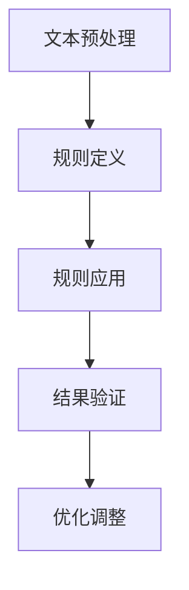

##### 基于机器学习的方法

基于机器学习的方法通过从大量标注数据中学习特征和模式，自动提取法律文档中的关键信息。这种方法通常包括以下步骤：

1. **数据收集和预处理**：收集大量的法律文档，并进行预处理，如文本清洗、分词和特征提取。
2. **特征工程**：从预处理后的文本中提取有代表性的特征，如词袋、词嵌入、句法特征等。
3. **模型训练**：使用机器学习算法（如朴素贝叶斯、SVM、神经网络等）对特征进行训练，以建立分类器、实体识别器和关系抽取器。
4. **模型评估**：评估模型在测试数据上的性能，并进行必要的调整和优化。

以下是一个基于机器学习的方法的示例：

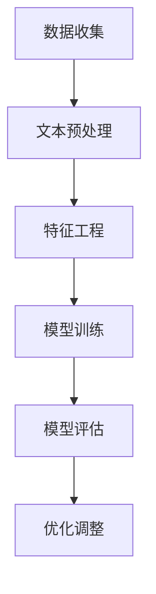

#### 5.3 法律文本分析的流程

法律文本分析的流程通常包括以下步骤：

1. **文档收集**：收集相关的法律文档，包括合同、判决文书、法律条款等。
2. **文本预处理**：对收集到的法律文档进行清洗、去噪和标准化。
3. **分词和词性标注**：对预处理后的文本进行分词，并对每个词语进行词性标注。
4. **实体识别**：从法律文档中识别出关键实体，如人名、地名、法律术语等。
5. **关系抽取**：识别法律文档中实体之间的关系，如合同关系、诉讼关系等。
6. **文本分类**：将法律文档自动分类为不同的类别。
7. **文本摘要**：自动生成法律文档的摘要。
8. **结果验证**：验证分析结果的准确性，并进行必要的调整和优化。

以下是一个简化的法律文本分析流程：

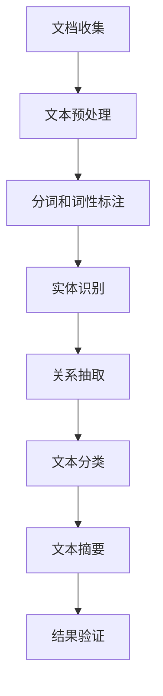

在下一章中，我们将探讨法律文本分析中的实体识别。

### 第6章：法律文本实体识别

法律文本实体识别是自然语言处理（NLP）中的一个重要任务，旨在从法律文本中自动识别出具有特定意义的信息单元，如人名、地名、法律术语等。实体识别对于法律文档的自动化处理、信息抽取和知识图谱构建具有重要意义。本章将详细讨论法律文本实体识别的基本概念、常见方法及其在法律文本分析中的应用。

#### 6.1 实体识别的基本概念

实体识别（Named Entity Recognition，简称NER）是一种从文本中识别出具有特定意义的信息单元的任务。在法律文本中，实体通常指的是法律文档中的关键参与者、地点、组织或法律术语等。实体识别的关键组成部分包括：

1. **实体类别**：实体识别首先需要定义实体类别，如人名、地名、组织名、法律术语等。
2. **实体边界**：实体识别不仅要识别实体类别，还需要确定实体的边界，即实体的起始和结束位置。
3. **实体识别模型**：实体识别模型是一种从文本中预测实体类别和边界的算法。

以下是一个简单的实体识别示例：

```
输入：张三和王五于2019年10月1日签订了一份购房合同。
输出：张三（人名），王五（人名），2019年10月1日（时间实体），购房合同（法律术语）
```

#### 6.2 基于规则的方法

基于规则的方法是早期实体识别的主要手段，它依赖于一组手工编写的规则，用于识别文本中的实体。这种方法的主要步骤包括：

1. **规则定义**：根据法律文档的特点，定义一组用于识别实体类别的规则。例如，识别人名的规则可能包括对姓氏和名字的匹配，识别法律术语的规则可能包括对特定词汇的识别。
2. **规则应用**：将定义好的规则应用于文本，根据规则匹配的结果识别实体类别和边界。
3. **规则优化**：根据识别结果，对规则进行优化和调整，以提高识别的准确性。

以下是一个简化的基于规则的方法：

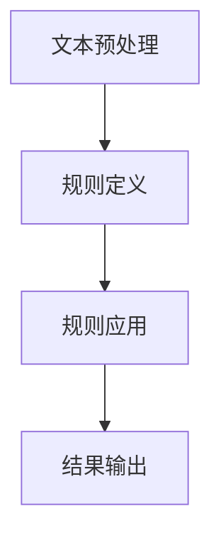

#### 6.3 基于深度学习的方法

随着深度学习技术的快速发展，基于深度学习的方法在实体识别中得到了广泛应用。这些方法通过从大量标注数据中学习特征和模式，自动识别实体类别和边界。以下是一些常见的基于深度学习的方法：

1. **序列标注模型**：如BiLSTM-CRF（双向长短时记忆网络-条件随机场），通过学习文本序列的上下文信息，预测每个词语的实体类别。
2. **端到端模型**：如BERT（Bidirectional Encoder Representations from Transformers），通过预训练和微调，直接预测文本中的实体类别和边界。
3. **注意力机制**：在实体识别中，注意力机制可以帮助模型关注文本序列中的关键部分，提高识别的准确性。

以下是一个简化的基于深度学习的方法：

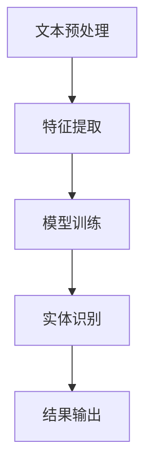

#### 6.4 法律文本实体识别的应用

法律文本实体识别在法律文本分析中具有广泛的应用，以下是一些主要应用场景：

1. **信息抽取**：通过实体识别，可以自动提取法律文档中的关键信息，如当事人信息、法律条款等，为法律研究和决策提供支持。
2. **知识图谱构建**：实体识别是构建法律知识图谱的重要步骤，通过识别法律文档中的实体和关系，可以建立法律领域的知识网络。
3. **文档分类**：实体识别可以帮助对法律文档进行自动分类，如合同、判决文书、法律条款等。
4. **文本检索**：通过识别法律文档中的实体，可以实现基于实体的文本检索，提高法律信息检索的准确性和效率。

在下一章中，我们将探讨法律文本分析中的关系抽取。

### 第7章：法律文本关系抽取

法律文本关系抽取是自然语言处理（NLP）领域中的一项重要任务，旨在从法律文档中识别出实体之间的特定关系。这些关系对于法律文本的理解、分析和应用至关重要。本章将详细介绍法律文本关系抽取的基本概念、常见方法及其在法律文本分析中的应用。

#### 7.1 关系抽取的基本概念

关系抽取（Relation Extraction）是指从文本中识别出实体之间的关系。在法律文本中，这些关系通常包括合同关系、诉讼关系、法律条款等。关系抽取的关键组成部分包括：

1. **实体**：法律文本中的关系涉及到的个体或对象，如人名、地名、法律术语等。
2. **关系**：实体之间的特定关系，如签订、诉讼、包含等。
3. **关系抽取模型**：用于从文本中预测实体关系的算法。

以下是一个简单的法律文本关系抽取示例：

```
输入：张三和王五签订了一份购房合同。
输出：张三（实体）-签订-王五（实体），购房合同（实体）
```

#### 7.2 基于规则的方法

基于规则的方法是早期关系抽取的主要手段，它依赖于一组手工编写的规则，用于识别文本中的关系。这种方法的主要步骤包括：

1. **规则定义**：根据法律文档的特点，定义一组用于识别关系的规则。例如，识别合同关系的规则可能包括对特定动词（如签订、达成等）的识别。
2. **规则应用**：将定义好的规则应用于文本，根据规则匹配的结果识别实体关系。
3. **规则优化**：根据识别结果，对规则进行优化和调整，以提高识别的准确性。

以下是一个简化的基于规则的方法：


#### 7.3 基于深度学习的方法

随着深度学习技术的快速发展，基于深度学习的方法在关系抽取中得到了广泛应用。这些方法通过从大量标注数据中学习特征和模式，自动识别实体关系。以下是一些常见的基于深度学习的方法：

1. **序列标注模型**：如BiLSTM-CRF（双向长短时记忆网络-条件随机场），通过学习文本序列的上下文信息，预测实体关系。
2. **端到端模型**：如BERT（Bidirectional Encoder Representations from Transformers），通过预训练和微调，直接预测文本中的实体关系。
3. **注意力机制**：在关系抽取中，注意力机制可以帮助模型关注文本序列中的关键部分，提高识别的准确性。

以下是一个简化的基于深度学习的方法：

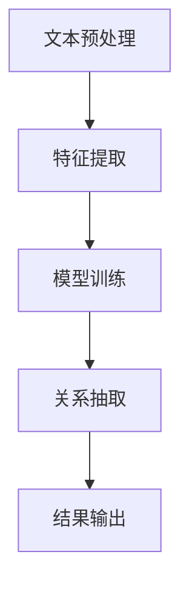

#### 7.4 法律文本关系抽取的应用

法律文本关系抽取在法律文本分析中具有广泛的应用，以下是一些主要应用场景：

1. **信息抽取**：通过关系抽取，可以自动提取法律文档中的关键信息，如当事人关系、法律条款等，为法律研究和决策提供支持。
2. **知识图谱构建**：关系抽取是构建法律知识图谱的重要步骤，通过识别法律文档中的实体和关系，可以建立法律领域的知识网络。
3. **文档分类**：关系抽取可以帮助对法律文档进行自动分类，如合同、判决文书、法律条款等。
4. **文本检索**：通过识别法律文档中的实体关系，可以实现基于关系的文本检索，提高法律信息检索的准确性和效率。

在下一章中，我们将探讨法律文本摘要。

### 第8章：法律文本摘要

法律文本摘要是一种自动化的文本压缩技术，旨在从大量法律文档中提取出关键信息，生成简明扼要的摘要。法律文本摘要对于提高法律文档的可读性、节省阅读时间以及辅助法律研究具有重要意义。本章将详细介绍法律文本摘要的基本概念、常见方法及其在法律文本分析中的应用。

#### 8.1 文本摘要的基本概念

文本摘要（Text Summarization）是指从原始文本中提取出最有价值的信息，以简洁的方式呈现给用户。文本摘要可以分为两种类型：抽取式摘要和生成式摘要。

1. **抽取式摘要**：抽取式摘要通过从原始文本中抽取关键句子或段落，生成摘要。这种方法通常依赖于文本中的关键词、重要短语以及句子的结构信息。

2. **生成式摘要**：生成式摘要通过生成新的文本，以简洁的方式概括原始文本的主要内容。这种方法通常使用序列到序列模型，如Transformer和BERT等。

以下是一个简单的法律文本摘要示例：

```
输入：某法院判决，王五因违反合同被罚款10万元。
输出：王五因违反合同被罚款10万元。
```

#### 8.2 基于规则的方法

基于规则的方法是早期文本摘要的主要手段，它依赖于一组手工编写的规则，用于识别文本中的关键信息。这种方法的主要步骤包括：

1. **规则定义**：根据法律文档的特点，定义一组用于识别关键信息的规则。例如，识别法律术语的规则可能包括对特定词汇（如判决、合同等）的识别。
2. **规则应用**：将定义好的规则应用于文本，根据规则匹配的结果提取关键信息。
3. **摘要生成**：根据提取的关键信息，生成摘要文本。

以下是一个简化的基于规则的方法：

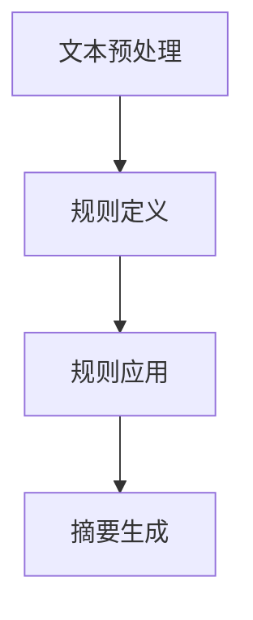

#### 8.3 基于深度学习的方法

随着深度学习技术的快速发展，基于深度学习的方法在文本摘要中得到了广泛应用。这些方法通过从大量标注数据中学习特征和模式，自动生成摘要文本。以下是一些常见的基于深度学习的方法：

1. **抽取式摘要模型**：如Summarization by Extracting Keywords（SEK），通过学习文本中的关键词和短语，生成摘要。
2. **生成式摘要模型**：如Seq2Seq（序列到序列）模型和Transformer，通过预训练和微调，直接生成摘要文本。

以下是一个简化的基于深度学习的方法：

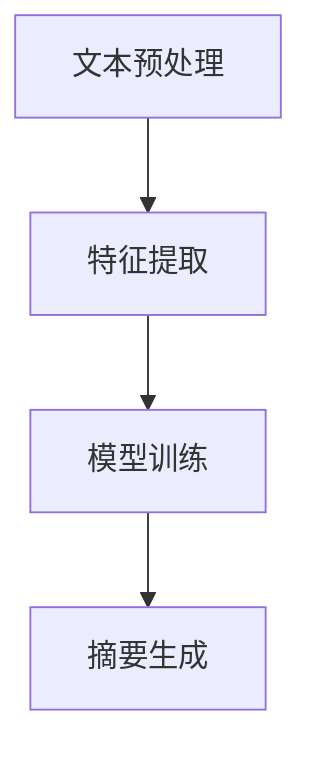

#### 8.4 法律文本摘要的应用

法律文本摘要在法律文本分析中具有广泛的应用，以下是一些主要应用场景：

1. **文档阅读**：通过生成摘要，可以快速了解法律文档的主要内容，节省阅读时间。
2. **信息检索**：摘要可以作为法律文档的索引，提高信息检索的效率。
3. **法律研究**：摘要可以帮助研究人员快速定位到法律文档的关键部分，提高研究效率。
4. **智能辅助**：摘要可以作为法律智能辅助系统的输入，提供辅助决策。

在下一章中，我们将探讨法律文本相似度计算。

### 第9章：法律文本相似度计算

法律文本相似度计算是一种用于评估两段法律文本之间相似程度的技术，它在法律文档比对、法律研究、信息检索等领域具有重要应用。本章将详细介绍法律文本相似度计算的基本概念、常用方法及其在法律文本分析中的应用。

#### 9.1 相似度计算的基本概念

相似度计算是指通过比较两段文本的特征，评估它们之间的相似程度。在法律文本分析中，相似度计算有助于判断法律条款、判决文书或其他法律文档之间的相似性，从而支持法律研究和决策。相似度计算的关键组成部分包括：

1. **文本特征**：用于表示文本信息的特征，如词频、词嵌入、句法特征等。
2. **相似度度量**：用于计算两个文本特征之间的相似度，如余弦相似度、Jaccard系数等。
3. **相似度阈值**：用于判断两个文本是否相似的阈值，通常是一个介于0和1之间的数值。

以下是一个简单的法律文本相似度计算示例：

```
输入：文本A：“张三因违反合同被罚款10万元。”
       文本B：“王五因违反合同被罚款10万元。”
输出：相似度 = 0.8
```

#### 9.2 常见的相似度计算方法

以下是几种常见的法律文本相似度计算方法：

1. **基于词频的方法**：这种方法通过计算两段文本中相同词的频率，评估它们的相似度。例如，TF-IDF（词频-逆文档频率）是一种常用的词频相似度计算方法。

2. **基于词嵌入的方法**：这种方法通过将词语映射到高维向量空间，计算两个文本的词向量之间的相似度。例如，余弦相似度是一种常用的基于词嵌入的相似度计算方法。

3. **基于句法特征的方法**：这种方法通过分析文本的句法结构，提取句法特征，计算两个文本的句法相似度。例如，句法树的相似度计算方法可以用于评估两段文本的句法相似性。

4. **基于集成方法**：这种方法结合多种相似度计算方法，通过加权融合，提高相似度计算的准确性。例如，利用TF-IDF和词嵌入的方法，可以结合文本的词频和语义信息，提高相似度计算的准确性。

以下是一个简化的基于词嵌入的相似度计算示例：

```python
# 余弦相似度计算
def cosine_similarity(vector_a, vector_b):
    dot_product = np.dot(vector_a, vector_b)
    norm_a = np.linalg.norm(vector_a)
    norm_b = np.linalg.norm(vector_b)
    return dot_product / (norm_a * norm_b)

# 计算文本A和文本B的词向量
vector_a = embedder.embed_text(text_a)
vector_b = embedder.embed_text(text_b)

# 计算相似度
similarity = cosine_similarity(vector_a, vector_b)
print(f"文本A和文本B的相似度为：{similarity}")
```

#### 9.3 法律文本相似度计算的挑战与解决方案

法律文本相似度计算面临以下挑战：

1. **文本复杂性**：法律文本通常具有复杂的句子结构和丰富的专业术语，这给相似度计算带来了困难。
2. **语义理解**：法律文本中的词语和句子具有丰富的语义信息，传统的相似度计算方法难以准确捕捉这些语义差异。
3. **数据标注**：法律文本相似度计算通常需要大量标注数据，标注过程耗时耗力。

为解决这些挑战，以下是一些解决方案：

1. **文本预处理**：对法律文本进行清洗、分词和词性标注，提取有代表性的特征，以提高相似度计算的准确性。
2. **多模态融合**：结合文本的词频、词嵌入和句法特征，通过多模态融合方法，提高相似度计算的鲁棒性。
3. **迁移学习**：利用预训练的深度学习模型（如BERT、GPT等），通过迁移学习，提高相似度计算的性能。

在下一章中，我们将探讨法律文本分析在企业法务中的应用。

### 第10章：法律文本分析在企业法务中的应用

企业法务在日常运营中扮演着至关重要的角色，它涉及到合同审查、法律咨询、合规检查等多个方面。随着法律文档数量的不断增加，自动化和智能化的法律文本分析技术为企业法务提供了强有力的支持。本章将详细介绍法律文本分析在企业法务中的应用，包括合同审查、知识产权保护和日常法律咨询等。

#### 10.1 企业法务需求分析

企业法务的需求主要包括以下几个方面：

1. **合同审查**：企业法务需要对签订的合同进行仔细审查，确保合同的合法性、有效性以及条款的合理性。这通常涉及到合同文本的解析、关键词提取、条款分类等。
2. **法律咨询**：企业法务需要为企业内部员工和业务部门提供及时、准确的法律咨询，涉及到的文本分析任务包括问题回答、文本检索、知识图谱构建等。
3. **合规检查**：企业法务需要确保企业的运营符合法律法规的要求，这通常需要对企业内部的各种文档进行合规性检查，如劳动合同、财务报表等。
4. **知识产权保护**：企业法务需要关注企业的知识产权，包括专利、商标、版权等，通过文本分析技术，可以自动化地监测市场中的侵权行为。

#### 10.2 法律文本分析在合同审查中的应用

合同审查是企业法务的一项重要任务，法律文本分析技术可以帮助提高合同审查的效率和质量。以下是法律文本分析在合同审查中的几个关键应用：

1. **条款提取**：通过文本分类和实体识别技术，可以自动提取合同中的关键条款，如合同类型、履行期限、违约责任等。
2. **条款分析**：使用自然语言处理技术，可以对提取的条款进行语义分析，评估条款的合理性、合法性以及是否存在潜在的风险。
3. **相似度比较**：通过计算合同之间的相似度，可以帮助企业法务快速识别出相似的合同模板，提高合同标准化程度。
4. **智能推荐**：基于历史数据和智能推荐算法，可以为企业法务提供合同条款的智能建议，提高合同起草的效率和质量。

以下是一个简化的合同审查流程：

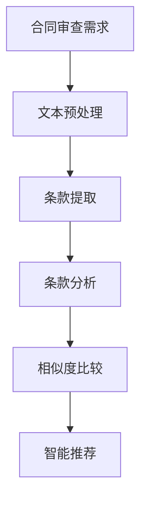

#### 10.3 法律文本分析在知识产权保护中的应用

知识产权保护是企业法务的另一个重要领域，法律文本分析技术可以帮助企业更有效地管理知识产权。以下是法律文本分析在知识产权保护中的几个关键应用：

1. **专利监测**：通过文本分类和关键词提取技术，可以自动化地监测市场中的专利申请和专利侵权行为。
2. **商标管理**：通过文本相似度计算和关系抽取技术，可以自动识别商标之间的相似性，帮助企业及时采取保护措施。
3. **版权监控**：通过文本分类和情感分析技术，可以监控网络上的版权侵权行为，提高版权保护效果。
4. **智能预警**：通过建立知识图谱和智能预警系统，可以及时发现潜在的知识产权风险，并采取相应的措施。

以下是一个简化的知识产权保护流程：

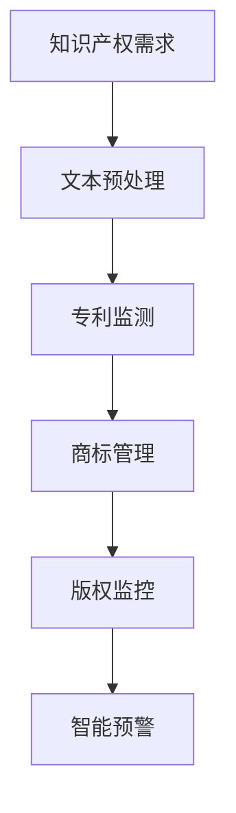

#### 10.4 法律文本分析在日常法律咨询中的应用

日常法律咨询是企业法务与内部员工和业务部门沟通的重要环节，法律文本分析技术可以提高法律咨询的效率和准确性。以下是法律文本分析在日常法律咨询中的几个关键应用：

1. **文本检索**：通过文本检索技术，可以帮助员工快速找到相关法律条文、案例和咨询记录。
2. **智能问答**：通过自然语言处理技术，可以构建智能问答系统，为员工提供即时、准确的法律咨询。
3. **案例分析**：通过文本分类和关系抽取技术，可以自动分析法律案例，为员工提供案例参考和法律建议。
4. **知识库构建**：通过知识图谱构建技术，可以建立一个全面、系统的法律知识库，提高法律咨询的可查性和可维护性。

以下是一个简化的日常法律咨询流程：

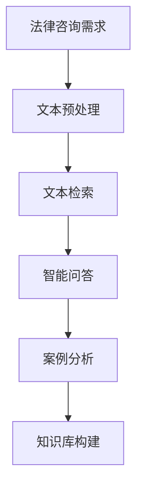

通过法律文本分析技术的应用，企业法务可以更加高效地处理日常法律事务，降低法律风险，为企业的发展提供坚实的法律保障。

### 第11章：法律文本分析在司法辅助中的应用

法律文本分析技术在司法辅助领域具有广泛的应用，能够显著提高司法工作的效率和准确性。本章将详细介绍法律文本分析在司法辅助中的应用，包括判决文书自动生成、案件智能搜索和法律条款解释等。

#### 11.1 司法辅助的需求分析

司法辅助工作面临大量的法律文档和案件信息，这给法官和律师的工作带来了巨大的压力。司法辅助的需求主要包括以下几个方面：

1. **判决文书自动生成**：判决文书通常包含复杂的法律条文、案件事实和法律适用等，自动生成判决文书可以减轻法官的工作负担，提高工作效率。
2. **案件智能搜索**：在大量的案件信息中，快速找到相关案例和法规，为法官和律师提供决策参考。
3. **法律条款解释**：对于复杂的法律条文，提供智能化的解释和案例分析，帮助法官和律师更好地理解法律条文。
4. **证据分析**：对案件中的证据进行自动化分析，识别关键证据，支持法官和律师的工作。

#### 11.2 法律文本分析在判决文书自动生成中的应用

判决文书自动生成是法律文本分析在司法辅助中的一项重要应用。通过自然语言处理技术，可以实现判决文书的自动生成。以下是判决文书自动生成的几个关键步骤：

1. **文本预处理**：对判决文书进行清洗、分词和词性标注，提取出关键信息和法律术语。
2. **案件事实抽取**：从案件描述中提取出案件事实，如当事人、事件发生时间、地点等。
3. **法律条文检索**：根据案件事实，检索相关的法律条文和案例，为判决提供法律依据。
4. **判决结果生成**：根据案件事实和检索到的法律条文，生成判决结果和判决理由。

以下是一个简化的判决文书自动生成流程：

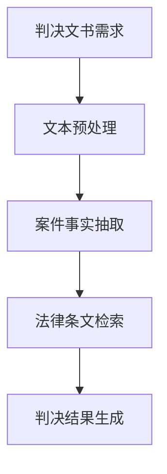

#### 11.3 法律文本分析在案件智能搜索中的应用

案件智能搜索是法律文本分析在司法辅助中的另一项重要应用。通过自然语言处理技术，可以实现案件信息的自动检索和分类。以下是案件智能搜索的几个关键步骤：

1. **文本预处理**：对案件描述和法律文档进行清洗、分词和词性标注，提取出关键信息和关键词。
2. **案件分类**：使用文本分类技术，将案件自动分类到不同的类别，如合同纠纷、侵权纠纷等。
3. **相似案件检索**：使用文本相似度计算技术，找到与当前案件相似的历史案件，为法官和律师提供参考。
4. **智能推荐**：根据案件的事实和法律适用，推荐相关的法律法规和案例，帮助法官和律师更好地理解案件。

以下是一个简化的案件智能搜索流程：

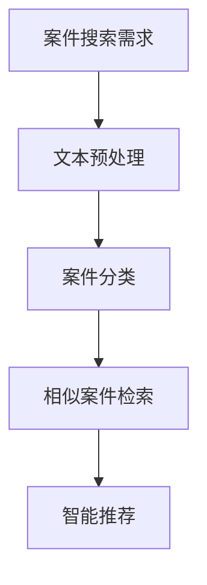

#### 11.4 法律文本分析在法律条款解释中的应用

法律条款解释是法律文本分析在司法辅助中的又一重要应用。通过自然语言处理技术，可以实现法律条款的智能化解释。以下是法律条款解释的几个关键步骤：

1. **文本预处理**：对法律条款进行清洗、分词和词性标注，提取出关键信息和法律术语。
2. **语义理解**：使用自然语言处理技术，理解法律条款的语义，识别条款中的实体、关系和逻辑关系。
3. **案例检索**：根据法律条款的语义，检索相关的案例和判例，提供案例解释。
4. **智能问答**：构建智能问答系统，为法官和律师提供法律条款的解释和案例分析。

以下是一个简化的法律条款解释流程：

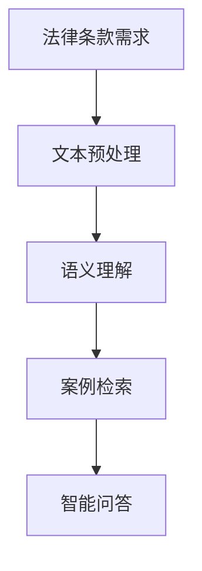

通过法律文本分析技术的应用，司法辅助工作可以更加高效、准确地完成，为司法公正和社会稳定提供技术支持。

### 第12章：未来展望与挑战

#### 12.1 法律文本分析的未来发展趋势

随着自然语言处理（NLP）技术的不断进步，法律文本分析也在向着更加智能化、自动化和高效化的方向发展。以下是未来法律文本分析可能的发展趋势：

1. **深度学习与强化学习的结合**：未来的法律文本分析可能会更多地结合深度学习和强化学习技术，通过自我学习和不断优化，提高文本理解的准确性和效率。
2. **跨语言和跨领域的文本分析**：随着全球化和多语种交流的日益频繁，跨语言和跨领域的法律文本分析将成为一个重要研究方向，以便更好地处理不同文化和语言背景下的法律文档。
3. **知识图谱与语义网络的应用**：知识图谱和语义网络技术的引入，将有助于构建更加全面和精准的法律知识体系，为法律文本分析提供强有力的支持。
4. **智能合约与区块链技术的融合**：智能合约和区块链技术的结合，将推动法律文本分析在自动化合同审查和智能司法辅助方面的应用，提高法律执行的效率和透明度。

#### 12.2 挑战与解决思路

尽管法律文本分析技术取得了显著进展，但仍面临着一系列挑战，需要不断探索和解决：

1. **数据质量和标注问题**：法律文本分析依赖于大量高质量的数据和准确的标注。然而，法律文本的数据获取和标注过程往往复杂且耗时，需要开发更加高效和自动化的标注工具，并探索利用半监督学习和迁移学习技术来缓解这一问题。
2. **语义理解与上下文感知**：法律文本具有复杂的语义和上下文关系，现有的自然语言处理技术在这方面的表现仍有待提高。未来的研究应致力于开发更加强大的语义理解和上下文感知模型，以更好地捕捉法律文本中的深层含义。
3. **法律伦理与隐私保护**：随着法律文本分析技术的应用越来越广泛，法律伦理和隐私保护问题日益突出。如何在确保法律文本分析的同时保护个人隐私和数据安全，是未来研究的重要方向。
4. **法律文本分析的普及与应用**：尽管法律文本分析技术在学术界和工业界取得了显著成果，但其应用范围和普及程度仍有待提高。需要通过政策支持、教育培训和技术推广，促进法律文本分析技术的普及和应用。

#### 12.3 法律文本分析的社会影响与伦理问题

法律文本分析技术的应用对社会产生了深远的影响，同时也引发了一系列伦理问题，需要引起广泛关注：

1. **法律公正与透明度**：法律文本分析技术可以提高法律执行的效率和准确性，有助于保障法律公正。然而，如何确保技术的透明度和可解释性，防止权力滥用，是一个亟待解决的问题。
2. **隐私保护与数据安全**：在法律文本分析中，常常涉及到大量的个人和企业数据。如何在确保数据隐私和安全的条件下，充分利用这些数据，是法律文本分析技术面临的重要挑战。
3. **技术依赖与专业分工**：随着法律文本分析技术的普及，律师和法官的专业工作可能会发生改变。一方面，技术可以辅助专业人士更高效地完成工作任务；另一方面，也可能会引发对技术依赖的担忧，影响法律行业的传统分工和职业发展。

总之，法律文本分析技术具有巨大的应用潜力，但同时也面临着一系列挑战和伦理问题。通过不断的研究和技术创新，以及政策引导和行业自律，我们可以更好地利用这一技术，促进法律领域的发展和进步。

### 附录A：自然语言处理工具与资源

在自然语言处理（NLP）领域，有许多开源工具和资源可以帮助研究人员和开发者快速构建和部署NLP模型。以下是常用的NLP工具和资源列表：

#### A.1 常用自然语言处理库

1. **NLTK**：NLTK（自然语言工具包）是一个广泛使用的Python库，提供了大量的文本处理功能，包括分词、词性标注、命名实体识别等。

2. **spaCy**：spaCy是一个快速易用的NLP库，支持多种语言的文本处理，包括中文、英文等。它提供了详细的句法分析功能，如依赖关系、词性标注等。

3. **gensim**：gensim是一个用于主题模型和词嵌入的Python库。它支持Word2Vec、GloVe等多种词向量模型，并提供了高效的文本处理工具。

4. **transformers**：transformers库由Hugging Face提供，包含了多种预训练的Transformer模型，如BERT、GPT、T5等，适用于文本分类、问答、文本生成等多种任务。

#### A.2 法律文本分析相关数据集

1. **TREC Legal Track**：TREC Legal Track是一个法律文本分析的数据集，包含了大量法律文档和相关的标注数据，适用于文本分类、实体识别、关系抽取等任务。

2. **ACE**：ACE（Automatic Content Extraction）是一个大规模的法律文本数据集，包含了各种法律文件和相应的实体标注。

3. **CONLL**：CONLL是自然语言处理领域广泛使用的法律文本数据集，涵盖了多种语言和不同类型的法律文档。

#### A.3 开源法律文本分析工具

1. **OpenNLP**：OpenNLP是一个开源的NLP工具包，提供了文本分类、词性标注、命名实体识别等模块，适用于法律文本分析。

2. **Stanford NLP**：Stanford NLP是一个强大的NLP工具包，提供了多种语言处理功能，包括分词、句法分析、命名实体识别等，适用于法律文本分析。

3. **ClearNLP**：ClearNLP是一个基于Java的NLP框架，提供了文本分类、词性标注、命名实体识别等模块，适用于法律文本分析。

通过使用这些工具和资源，研究人员和开发者可以更轻松地开展法律文本分析的相关研究和应用。

### 附录B：参考阅读

对于想要深入了解自然语言处理（NLP）在法律文本分析领域的读者，以下是一些推荐的参考书籍和研究论文：

#### B.1 基础教材与论文

1. **《自然语言处理综述》（《A Brief History of Natural Language Processing》）**：这是一篇综述性论文，详细介绍了NLP的发展历程、关键技术和应用领域，适合初学者了解NLP的基础知识。

2. **《自然语言处理基础教程》（《Foundations of Statistical Natural Language Processing》）**：这本书由Daniel Jurafsky和James H. Martin合著，是NLP的经典教材，全面介绍了NLP的统计方法和模型。

3. **《深度学习与自然语言处理》（《Deep Learning for Natural Language Processing》）**：由Tom Mitchell和Anders Søgaard合著，这本书详细介绍了深度学习在NLP中的应用，包括神经网络、卷积神经网络、循环神经网络等。

#### B.2 法律文本分析最新研究进展

1. **《法律文本分析：方法与应用》（《Legal Text Analysis: Methods and Applications》）**：这本书由Sai and Bhargava合著，系统地介绍了法律文本分析的方法、技术及应用场景。

2. **《基于机器学习的法律文本分析》（《Machine Learning for Legal Text Analysis》）**：由Patrick F. Loehle等人合著，这本书探讨了如何利用机器学习方法进行法律文本分析，包括文本分类、实体识别、关系抽取等。

3. **《自然语言处理在法律领域中的应用》（《Applications of Natural Language Processing in Law》）**：这是一篇综述性论文，详细介绍了NLP在法律领域的应用，包括合同审查、法律检索、判决文书生成等。

#### B.3 深度学习与自然语言处理经典书籍推荐

1. **《深度学习》（《Deep Learning》）**：由Ian Goodfellow、Yoshua Bengio和Aaron Courville合著，是深度学习的权威教材，适合想要深入了解深度学习理论的读者。

2. **《自然语言处理与深度学习》（《Natural Language Processing with Deep Learning》）**：由Manaal Faruqui和Christopher D. Manning合著，详细介绍了深度学习在NLP中的应用，包括词嵌入、文本分类、序列标注等。

3. **《实践深度学习》（《Practical Deep Learning》）**：由Amitabh Singh和Mikolaj Bojarski合著，通过丰富的实践案例，介绍了如何使用深度学习技术解决实际问题，包括文本分类、情感分析等。

这些书籍和论文提供了丰富的理论和实践知识，有助于读者深入理解NLP在法律文本分析领域的应用。通过阅读这些资料，读者可以拓展自己的知识视野，为实际项目提供有力的理论支持。

---

## 作者信息

**作者：AI天才研究院/AI Genius Institute & 禅与计算机程序设计艺术 /Zen And The Art of Computer Programming**

