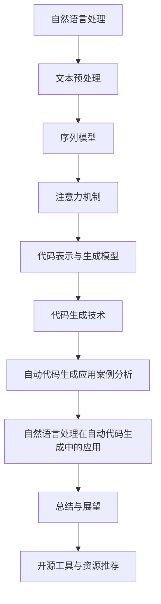

                 


### 文章标题

《自然语言处理在自动代码生成中的应用》

### 关键词

自然语言处理，自动代码生成，序列模型，注意力机制，代码表示，生成模型，挑战与机遇

### 摘要

本文系统地探讨了自然语言处理（NLP）在自动代码生成（AIG）中的应用。首先介绍了NLP的基本概念和文本预处理技术，然后深入分析了序列模型和注意力机制在代码生成中的作用。接着，文章重点讨论了代码表示与生成模型、代码生成技术及应用案例。最后，文章总结了NLP在AIG中的挑战与机遇，并对未来发展趋势进行了展望。

### 目录大纲

#### 第一部分：自然语言处理基础

**第1章：自然语言处理概述**

1.1 自然语言处理的基本概念  
1.2 NLP的应用场景  
1.3 NLP的发展历程

**第2章：文本预处理**

2.1 分词技术  
2.2 命名实体识别  
2.3 词性标注

**第3章：序列模型**

3.1 神经网络基础  
3.2 循环神经网络（RNN）  
3.3 长短时记忆网络（LSTM）  
3.4 门控循环单元（GRU）

**第4章：注意力机制**

4.1 注意力机制原理  
4.2 双向RNN与注意力机制  
4.3 Transformer模型

#### 第二部分：自动代码生成技术

**第5章：代码表示与生成模型**

5.1 代码表示方法  
5.2 生成模型基本原理  
5.3 生成模型类型及应用

**第6章：代码生成技术**

6.1 代码生成方法  
6.2 基于模板的代码生成  
6.3 基于语义的代码生成

**第7章：自动代码生成应用案例分析**

7.1 案例一：基于NLP的代码生成工具  
7.2 案例二：自动修复代码缺陷  
7.3 案例三：自动生成测试用例

#### 第三部分：自然语言处理在自动代码生成中的应用

**第8章：自然语言处理在代码生成中的挑战与机遇**

8.1 数据集与标注问题  
8.2 代码生成质量评估  
8.3 代码生成模型优化

**第9章：自然语言处理在代码生成中的创新应用**

9.1 代码生成与软件工程  
9.2 代码生成与人工智能  
9.3 未来发展趋势与展望

**第10章：总结与展望**

10.1 总结  
10.2 未来研究方向  
10.3 对开发者的建议

**附录**

附录A：开源工具与资源推荐

### 第一部分：自然语言处理基础

**第1章：自然语言处理概述**

### 1.1 自然语言处理的基本概念

自然语言处理（Natural Language Processing，简称NLP）是计算机科学和人工智能领域的一个分支，旨在使计算机能够理解和解释人类自然语言。NLP的研究内容包括语言理解、语言生成、语言翻译、文本分类、情感分析等。

NLP的核心任务之一是文本预处理。文本预处理包括分词、命名实体识别、词性标注、依存句法分析等步骤。这些步骤的目的是将原始文本转换为适合计算机处理的格式。

分词是将连续的文本分割成一系列具有独立意义的词汇或短语的步骤。命名实体识别（Named Entity Recognition，简称NER）是识别文本中的特定实体，如人名、地名、组织名等。词性标注（Part-of-Speech Tagging，简称POS）是为文本中的每个词汇分配词性标签，如名词、动词、形容词等。依存句法分析（Dependency Parsing）是分析句子中词汇之间的依存关系。

### 1.2 NLP的应用场景

NLP在许多领域都有广泛的应用，以下是其中一些主要的应用场景：

1. **搜索引擎**：使用NLP技术对用户查询进行理解，并提供更加精准的搜索结果。
2. **聊天机器人**：通过理解用户的问题，提供适当的答复，实现人机交互。
3. **文本摘要**：自动生成文本的摘要，用于信息过载的处理。
4. **情感分析**：分析文本中的情感倾向，用于市场研究、品牌监测等。
5. **机器翻译**：将一种自然语言翻译成另一种自然语言，如Google翻译。
6. **文本分类**：将文本分类到预定义的类别中，如垃圾邮件检测。

### 1.3 NLP的发展历程

NLP的发展历程可以分为三个主要阶段：

1. **规则驱动阶段**：早期NLP依赖于手动编写的规则，这些规则试图捕捉语言的结构和语义。这个阶段在20世纪50年代至70年代占据主导地位，但由于规则数量庞大且难以维护，因此效果有限。

2. **统计阶段**：随着计算能力的提高和大规模语料库的出现，统计方法开始广泛应用于NLP。统计方法通过学习大量标注数据来发现文本中的模式和规律。这个阶段在20世纪80年代至90年代成为主流。

3. **深度学习阶段**：深度学习在图像识别、语音识别等领域取得了巨大成功，也激发了NLP领域的研究者探索如何将深度学习应用于NLP。深度学习通过构建复杂的神经网络模型来直接学习文本的特征和模式。这个阶段始于2010年左右，并持续至今。

### 文本预处理

**2.1 分词技术**

分词是将连续的文本分割成一系列具有独立意义的词汇或短语的步骤。分词技术可以分为基于规则的分词、基于统计的分词和基于深度学习的分词。

- **基于规则的分词**：依赖于预先定义的规则来分割文本。这种方法虽然可以保证一定的准确性，但规则数量庞大且难以维护。

- **基于统计的分词**：使用统计方法，如隐马尔可夫模型（HMM）、条件随机场（CRF）等，来学习文本的分词模式。这种方法可以自动学习规则，但可能受到数据集质量的影响。

- **基于深度学习的分词**：使用深度神经网络，如长短时记忆网络（LSTM）和双向长短时记忆网络（BiLSTM），来直接学习文本的分词模式。这种方法可以处理复杂的文本结构和上下文信息，是目前主流的分词方法。

**2.2 命名实体识别**

命名实体识别（Named Entity Recognition，简称NER）是识别文本中的特定实体，如人名、地名、组织名等。NER在许多应用中都非常重要，如信息提取、文本摘要、问答系统等。

NER通常可以分为两个阶段：

1. **实体识别**：识别文本中的实体，并将其标记为“B”类（begin）或“E”类（end）。
2. **实体验证**：对识别出的实体进行验证，以确定其是否是正确的实体。

常用的NER模型包括条件随机场（CRF）、支持向量机（SVM）和深度学习模型，如卷积神经网络（CNN）和长短时记忆网络（LSTM）。

**2.3 词性标注**

词性标注（Part-of-Speech Tagging，简称POS）是为文本中的每个词汇分配词性标签，如名词、动词、形容词等。词性标注对于许多NLP任务都是重要的，如语法分析、文本分类、机器翻译等。

词性标注通常可以分为两个阶段：

1. **词类划分**：将文本中的每个词汇分为不同的词类，如名词、动词、形容词等。
2. **词性标注**：为每个词类分配具体的词性标签。

常用的词性标注模型包括隐马尔可夫模型（HMM）、条件随机场（CRF）和深度学习模型，如卷积神经网络（CNN）和长短时记忆网络（LSTM）。

### 序列模型

**3.1 神经网络基础**

神经网络（Neural Network，简称NN）是一种模拟生物神经系统的计算模型。它由多个相互连接的神经元组成，每个神经元都可以接收输入、进行处理并产生输出。

神经网络的组成主要包括：

- **输入层（Input Layer）**：接收外部输入数据。
- **隐藏层（Hidden Layer）**：对输入数据进行加工处理。
- **输出层（Output Layer）**：输出最终结果。

每个神经元都可以通过权重（Weight）和偏置（Bias）来调整其输出。神经元的输出通常通过激活函数（Activation Function）进行非线性转换。

常见的激活函数包括：

- **线性函数（Linear Function）**：输出与输入相等，即 f(x) = x。
- ** sigmoid 函数（Sigmoid Function）**：输出介于0和1之间，即 f(x) = 1 / (1 + e^(-x))。
- **ReLU函数（ReLU Function）**：输出为输入的绝对值，即 f(x) = max(0, x)。

**3.2 循环神经网络（RNN）**

循环神经网络（Recurrent Neural Network，简称RNN）是一种能够处理序列数据的神经网络。与传统的前向神经网络不同，RNN具有循环结构，能够记忆前面的信息。

RNN的核心组件是循环单元（Recurrent Unit），它通过共享权重的方式在序列的不同时间步之间传递信息。RNN的输出不仅取决于当前时间步的输入，还取决于前面的输出。

然而，RNN存在一个严重的问题，即梯度消失和梯度爆炸问题。这是因为RNN在处理长序列数据时，信息会逐渐衰减或放大，导致梯度消失或爆炸。为了解决这个问题，研究者提出了长短时记忆网络（LSTM）。

**3.3 长短时记忆网络（LSTM）**

长短时记忆网络（Long Short-Term Memory，简称LSTM）是RNN的一种改进模型，主要解决了RNN在处理长序列数据时出现的梯度消失和梯度爆炸问题。

LSTM的核心组件是单元状态（Cell State），它用于存储序列信息。LSTM通过输入门（Input Gate）、遗忘门（Forget Gate）和输出门（Output Gate）来控制信息在单元状态中的流动。

- **输入门（Input Gate）**：控制当前信息进入单元状态。
- **遗忘门（Forget Gate）**：控制单元状态中旧信息的遗忘。
- **输出门（Output Gate）**：控制当前单元状态输出。

LSTM通过这些门控机制，能够在长序列数据中保持信息的稳定传输，从而有效地解决梯度消失和梯度爆炸问题。

**3.4 门控循环单元（GRU）**

门控循环单元（Gated Recurrent Unit，简称GRU）是LSTM的简化版，结构更简单，计算效率更高。

GRU通过重置门（Reset Gate）和更新门（Update Gate）来代替LSTM的输入门、遗忘门和输出门。重置门结合了输入门和遗忘门的功能，更新门结合了输入门和输出门的功能。

虽然GRU在结构上比LSTM更简单，但它仍然保留了LSTM的核心特性，即能够处理长序列数据。GRU在许多NLP任务中取得了与LSTM相当的性能，同时计算效率更高。

### 注意力机制

**4.1 注意力机制原理**

注意力机制（Attention Mechanism）是深度学习中的一个重要概念，用于解决序列数据中的长距离依赖问题。注意力机制的核心思想是在处理序列数据时，模型能够自动关注序列中的重要部分，从而提高模型的性能。

注意力机制的原理可以类比于人类在阅读或听讲时的注意力分配。当我们阅读一篇文章或听一个演讲时，我们通常会关注某些关键词或句子，而忽略其他内容。注意力机制旨在让计算机模型能够自动实现这种关注机制。

在注意力机制中，每个输入序列的元素都会被赋予一个权重，这些权重表示模型对每个元素的重要程度。通过加权求和，模型能够关注到重要的元素，并忽略不重要的元素。

注意力机制的实现通常包括以下步骤：

1. **计算注意力得分**：对于输入序列的每个元素，计算其与查询（Query）之间的相似度得分。查询通常是一个向量，表示模型需要关注的特定部分。

2. **应用权重**：根据注意力得分，对输入序列的元素进行加权求和。权重较高的元素将对模型的输出产生更大的影响。

3. **生成输出**：通过加权求和得到的输出向量，作为模型的最终输出。

注意力机制在许多任务中取得了显著的性能提升，如机器翻译、文本分类、语音识别等。

**4.2 双向RNN与注意力机制**

双向循环神经网络（Bidirectional RNN）是一种能够处理序列数据的神经网络，它通过同时考虑序列的过去和未来信息，提高了模型的性能。

在双向RNN中，模型分为两个部分：前向网络和后向网络。前向网络处理序列的过去信息，后向网络处理序列的未来信息。两个网络将各自的处理结果合并，作为模型的最终输出。

双向RNN与注意力机制的组合可以进一步改善模型的性能。在双向RNN中，注意力机制能够帮助模型自动关注序列中的关键部分，从而更好地捕捉长距离依赖。

具体实现时，双向RNN的输出可以分别作为注意力机制的查询和键（Key），通过计算注意力得分，加权求和得到最终的输出。

**4.3 Transformer模型**

Transformer模型是自然语言处理领域的一种重要模型，它完全基于注意力机制，取代了传统的循环神经网络（RNN）和卷积神经网络（CNN）。Transformer模型在许多NLP任务中取得了显著的性能提升，如机器翻译、文本分类、问答系统等。

Transformer模型的核心组件是自注意力机制（Self-Attention），它允许模型在处理序列数据时，自动关注序列中的不同部分。

Transformer模型的主要结构包括：

- **编码器（Encoder）**：由多个编码层（Encoder Layer）组成，每个编码层包含多头自注意力机制和前馈神经网络。
- **解码器（Decoder）**：由多个解码层（Decoder Layer）组成，每个解码层包含多头自注意力机制、交叉自注意力机制和前馈神经网络。

通过编码器和解码器之间的交互，Transformer模型能够生成高质量的序列输出。

### 代码表示与生成模型

**5.1 代码表示方法**

在自动代码生成中，代码表示是一个关键步骤，它将自然语言描述转换为计算机可执行的代码。以下是一些常用的代码表示方法：

1. **抽象语法树（Abstract Syntax Tree，AST）**：AST是代码的结构表示，它将代码分解为一系列的语法元素，如变量、函数、类等。AST可以表示代码的语法结构，但无法表达语义信息。

2. **语法解析树（Syntax Tree）**：语法解析树是AST的一种扩展，它除了包含AST的信息，还包含一些语义信息，如变量绑定、函数调用等。语法解析树可以更好地表示代码的语义信息。

3. **程序依赖图（Program Dependency Graph，PDG）**：PDG是一种图形表示，它描述了代码中的依赖关系。PDG中的节点表示代码的语句，边表示语句之间的依赖关系，如控制流依赖和数据依赖。

4. **程序语义图（Program Semantics Graph，PSG）**：PSG是PDG的扩展，它不仅包含PDG的信息，还包含更多的语义信息，如变量绑定、类型信息等。PSG可以更准确地表示代码的语义信息。

**5.2 生成模型基本原理**

生成模型（Generative Model）是一种用于生成数据或文本的机器学习模型。在自动代码生成中，生成模型用于将自然语言描述转换为代码。以下是一些常见的生成模型：

1. **循环神经网络（Recurrent Neural Network，RNN）**：RNN是一种能够处理序列数据的神经网络，它通过共享权重的方式在序列的不同时间步之间传递信息。RNN可以生成序列数据，如自然语言文本或代码。

2. **长短时记忆网络（Long Short-Term Memory，LSTM）**：LSTM是RNN的一种改进模型，它通过门控机制解决了RNN在处理长序列数据时出现的梯度消失和梯度爆炸问题。LSTM可以生成更高质量的序列数据。

3. **门控循环单元（Gated Recurrent Unit，GRU）**：GRU是LSTM的简化版，它具有更简单的结构，计算效率更高。GRU在许多任务中取得了与LSTM相当的性能。

4. **生成对抗网络（Generative Adversarial Network，GAN）**：GAN是一种由两个神经网络组成的对抗性训练模型，一个生成器网络和一个判别器网络。生成器网络试图生成与真实数据相似的数据，而判别器网络试图区分真实数据和生成数据。通过这种对抗性训练，GAN可以生成高质量的数据。

**5.3 生成模型类型及应用**

在自动代码生成中，不同的生成模型具有不同的优势和适用场景。以下是一些常见的生成模型类型及其应用：

1. **基于模板的生成模型**：这类模型使用预定义的代码模板来生成代码。模板可以包含一些变量，模型通过学习填充这些变量来生成代码。基于模板的生成模型在代码生成任务中具有较好的性能，但灵活性较低。

2. **基于语义的生成模型**：这类模型通过理解自然语言描述的语义信息来生成代码。基于语义的生成模型通常使用深度学习模型，如LSTM、GRU等。这些模型可以生成更灵活、更符合语义的代码，但训练过程可能需要大量标注数据。

3. **基于编码器的生成模型**：这类模型使用编码器将自然语言描述编码为一个向量表示，然后使用解码器将向量表示解码为代码。编码器和解码器可以是同一个模型，也可以是两个独立的模型。基于编码器的生成模型可以生成高质量的代码，但训练过程较为复杂。

4. **基于转换的生成模型**：这类模型使用序列到序列（Sequence-to-Sequence，Seq2Seq）模型来将自然语言描述转换为代码。Seq2Seq模型通过编码器和解码器来处理输入和输出序列，可以实现端到端的代码生成。基于转换的生成模型在自动代码生成任务中取得了较好的效果。

### 代码生成技术

**6.1 代码生成方法**

在自动代码生成中，有多种方法可以用于将自然语言描述转换为代码。以下是一些常见的代码生成方法：

1. **基于规则的方法**：这种方法使用预定义的规则来将自然语言描述转换为代码。规则可以是简单的语法规则，也可以是复杂的语义规则。基于规则的方法在代码生成任务中具有较好的性能，但灵活性较低。

2. **基于模板的方法**：这种方法使用预定义的代码模板来生成代码。模板可以包含一些变量，模型通过学习填充这些变量来生成代码。基于模板的方法在代码生成任务中具有较好的性能，但灵活性较低。

3. **基于语义的方法**：这种方法通过理解自然语言描述的语义信息来生成代码。基于语义的方法通常使用深度学习模型，如LSTM、GRU等。这些模型可以生成更灵活、更符合语义的代码，但训练过程可能需要大量标注数据。

4. **基于转换的方法**：这种方法使用序列到序列（Sequence-to-Sequence，Seq2Seq）模型来将自然语言描述转换为代码。Seq2Seq模型通过编码器和解码器来处理输入和输出序列，可以实现端到端的代码生成。

**6.2 基于模板的代码生成**

基于模板的代码生成方法使用预定义的代码模板来生成代码。模板可以包含一些变量，模型通过学习填充这些变量来生成代码。

基于模板的代码生成方法通常包括以下步骤：

1. **模板定义**：定义一个或多个代码模板，每个模板包含一个或多个变量。

2. **模板匹配**：将自然语言描述与模板进行匹配，找到与描述最匹配的模板。

3. **变量填充**：根据自然语言描述填充模板中的变量，生成代码。

基于模板的代码生成方法在代码生成任务中具有较好的性能，但灵活性较低。这种方法适用于一些具有明确规则的代码生成任务，如SQL查询生成、函数定义等。

**6.3 基于语义的代码生成**

基于语义的代码生成方法通过理解自然语言描述的语义信息来生成代码。基于语义的方法通常使用深度学习模型，如LSTM、GRU等。这些模型可以生成更灵活、更符合语义的代码，但训练过程可能需要大量标注数据。

基于语义的代码生成方法通常包括以下步骤：

1. **语义解析**：将自然语言描述解析为语义表示，通常使用深度学习模型进行。

2. **代码生成**：根据语义表示生成代码，可以使用基于模板的方法、基于转换的方法或其他生成模型。

基于语义的代码生成方法可以生成更符合用户意图的代码，但训练过程较为复杂。这种方法适用于一些具有复杂语义的代码生成任务，如函数定义、类定义等。

### 自动代码生成应用案例分析

**7.1 案例一：基于NLP的代码生成工具**

基于NLP的代码生成工具是一个能够将自然语言描述转换为代码的工具。这种工具通常使用深度学习模型，如LSTM、GRU等，来理解自然语言描述的语义，并生成相应的代码。

一个典型的案例是Facebook的CodeT5项目。CodeT5是一个基于Transformer的代码生成模型，它将自然语言描述转换为抽象语法树（AST）。CodeT5使用大量的代码数据进行训练，包括GitHub上的开源代码和Stack Overflow上的代码片段。通过训练，CodeT5能够理解自然语言描述的语义，并生成高质量的代码。

使用CodeT5，开发者可以输入一个自然语言描述，如“创建一个函数，它接受一个整数参数并返回其平方”，CodeT5会生成相应的代码，如：

```python
def square(n):
    return n * n
```

**7.2 案例二：自动修复代码缺陷**

自动修复代码缺陷是一种利用NLP和代码生成技术来修复代码中的错误的方法。这种方法可以显著提高软件开发效率，减少错误代码的传播。

一个典型的案例是GitHub的DARE项目。DARE（Detection and Repair of Errors）是一个基于深度学习的代码修复工具，它能够检测并修复Python代码中的语法错误和逻辑错误。DARE使用大量的代码错误数据集进行训练，包括GitHub上的错误报告和Stack Overflow上的代码片段。通过训练，DARE能够理解代码中的错误模式，并生成正确的代码。

例如，如果一个Python代码片段存在语法错误，如：

```python
def add(a, b):
    return a + b
```

DARE可以检测并修复这个错误，生成正确的代码：

```python
def add(a, b):
    return a + b
```

**7.3 案例三：自动生成测试用例**

自动生成测试用例是一种利用NLP和代码生成技术来自动生成测试数据的方法。这种方法可以显著提高软件测试的效率，减少测试用例的编写工作量。

一个典型的案例是微软的T5MMLM项目。T5MMLM（T5 with Masked Language Model）是一个基于Transformer的代码生成模型，它能够自动生成Python测试用例。T5MMLM使用大量的代码数据进行训练，包括GitHub上的测试用例和代码片段。通过训练，T5MMLM能够理解代码的语义，并生成相应的测试用例。

例如，对于一个Python函数`def add(a, b): return a + b`，T5MMLM可以生成多个测试用例，如：

```python
test_add_1 = add(1, 2) # expected output: 3
test_add_2 = add(-1, -2) # expected output: -3
test_add_3 = add(0, 0) # expected output: 0
```

### 自然语言处理在代码生成中的挑战与机遇

**8.1 数据集与标注问题**

自然语言处理在代码生成中的应用面临着数据集与标注问题。代码数据集通常包含大量的代码片段和自然语言描述，这些数据需要经过精细的标注和预处理才能用于训练模型。

数据集的质量直接影响模型的性能。一个高质量的数据集应该包含多样化的代码片段和描述，覆盖各种编程语言和场景。此外，标注的准确性也至关重要，因为错误的标注可能导致模型学习到错误的模式。

为了解决数据集与标注问题，研究者们正在探索多种方法，如自动标注、半监督学习和迁移学习等。自动标注方法使用预训练的NLP模型来自动识别和标注代码片段，半监督学习方法结合标注数据和未标注数据来训练模型，迁移学习方法利用预训练的模型来提高代码生成模型的性能。

**8.2 代码生成质量评估**

评估代码生成质量是自然语言处理在代码生成中的另一个挑战。传统的评估方法，如代码覆盖率、错误率等，可能不足以全面评估代码生成模型的性能。此外，代码质量还涉及到可读性、可维护性等方面。

为了更全面地评估代码生成质量，研究者们提出了多种评估方法。例如，基于代码审查的评估方法，通过专业开发者的评估来评估代码的健壮性、可读性和可维护性。基于自动化评估的方法，使用自动化工具来评估代码的质量，如代码风格检查工具、单元测试等。

**8.3 代码生成模型优化**

优化代码生成模型是自然语言处理在代码生成中的另一个重要挑战。代码生成模型的优化目标包括提高生成代码的质量、减少计算复杂度和提高训练速度等。

为了优化代码生成模型，研究者们采用了多种技术，如注意力机制、图神经网络、混合模型等。注意力机制可以更好地捕捉代码中的依赖关系，图神经网络可以处理更复杂的代码结构，混合模型结合了多种模型的优势，以提高代码生成的性能。

此外，模型优化还涉及到超参数调整、训练技巧等方面。通过调整超参数，如学习率、批次大小等，可以改善模型的性能。训练技巧，如数据增强、正则化等，可以防止模型过拟合，提高泛化能力。

### 自然语言处理在代码生成中的创新应用

**9.1 代码生成与软件工程**

自然语言处理在代码生成中的应用为软件工程带来了新的机遇。通过自动代码生成，开发者可以更快速地实现功能，减少代码错误，提高软件质量。

在软件工程中，自然语言处理可以用于多种任务，如代码自动化修复、代码自动化测试、代码自动化生成等。代码自动化修复可以自动检测和修复代码中的错误，提高软件的可靠性。代码自动化测试可以生成测试用例，提高测试覆盖率，降低测试成本。代码自动化生成可以减少手动编写代码的工作量，提高开发效率。

**9.2 代码生成与人工智能**

自然语言处理在代码生成中的应用也促进了人工智能的发展。代码生成技术可以自动生成大量的代码，为人工智能模型提供丰富的训练数据。此外，代码生成技术还可以用于生成人工智能模型的实现代码，简化开发过程。

通过代码生成，人工智能模型可以更快速地迭代和优化。例如，在生成对抗网络（GAN）中，代码生成技术可以自动生成大量的数据，提高GAN的训练效果。在深度学习模型中，代码生成技术可以自动生成模型的实现代码，降低开发难度。

**9.3 未来发展趋势与展望**

自然语言处理在代码生成中的应用正处于快速发展阶段。未来，随着自然语言处理技术的不断进步，代码生成技术将得到进一步优化和扩展。

一方面，代码生成技术将更加智能化，能够自动理解和生成更加复杂的代码。例如，通过结合图神经网络和深度学习模型，代码生成技术可以处理更复杂的代码结构和依赖关系。

另一方面，代码生成技术将与其他人工智能技术相结合，推动人工智能的发展。例如，通过结合代码生成和自然语言处理，可以生成更智能的对话系统、自动化问答系统等。

此外，代码生成技术在软件开发中的应用也将越来越广泛。开发者可以利用代码生成技术来自动化软件开发流程，提高开发效率和软件质量。

总之，自然语言处理在代码生成中的应用具有巨大的潜力和前景，将为软件开发和人工智能领域带来新的机遇和挑战。

### 总结与展望

自然语言处理（NLP）在自动代码生成（AIG）中的应用已经取得了显著的成果。本文系统地探讨了NLP在AIG中的基本概念、文本预处理、序列模型、注意力机制、代码表示与生成模型、代码生成技术以及应用案例分析。通过这些分析，我们可以看到NLP在AIG中的重要性和潜力。

NLP技术在代码生成中的应用主要包括文本预处理、序列模型、注意力机制和生成模型等。文本预处理是将自然语言描述转换为适合计算机处理的格式，是代码生成的基础。序列模型和注意力机制用于理解自然语言描述的语义和上下文，是代码生成的核心。生成模型则用于将自然语言描述转换为计算机代码。

在未来的发展中，NLP在AIG中的应用将更加深入和广泛。一方面，NLP技术将不断优化和改进，如结合图神经网络和深度学习模型来处理更复杂的代码结构和依赖关系。另一方面，NLP技术将与其他人工智能技术相结合，推动人工智能的发展，如生成对抗网络（GAN）和深度学习模型等。

对于开发者来说，掌握NLP在AIG中的应用具有重要意义。开发者可以通过NLP技术来自动化软件开发流程，提高开发效率和软件质量。此外，开发者还可以利用NLP技术来优化代码生成模型，提高代码生成的准确性和灵活性。

总之，NLP在AIG中的应用为软件开发和人工智能领域带来了新的机遇和挑战。通过不断探索和研究，我们可以期待NLP在AIG中的应用将取得更加显著的成果。

### 附录

**附录A：开源工具与资源推荐**

在自然语言处理和自动代码生成领域，有许多优秀的开源工具和资源可供学习和使用。以下是一些推荐的工具和资源：

**1. NLP工具**

- **NLTK（Natural Language Toolkit）**：一个广泛使用的Python库，用于处理文本数据，包括分词、词性标注、命名实体识别等。
- **spaCy**：一个快速且易于使用的Python库，提供高效的NLP功能，如词性标注、依存句法分析等。
- **Stanford NLP**：一个用Java编写的NLP库，提供多种NLP任务的支持，如分词、词性标注、命名实体识别等。

**2. 代码生成工具**

- **GitHub Copilot**：由OpenAI开发的代码生成工具，能够根据自然语言描述生成代码。
- **CodeT5**：基于Transformer的代码生成模型，能够将自然语言描述转换为抽象语法树（AST）。
- **TabNine**：一个智能代码补全工具，能够根据上下文自动生成代码。

**3. 资源下载与学习资料**

- **GitHub**：许多开源项目和代码生成工具的代码可以在GitHub上找到。
- **Kaggle**：提供丰富的NLP和代码生成数据集，用于训练和测试模型。
- **ArXiv**：发布最新研究成果的预印本平台，包括NLP和代码生成领域的最新论文。

通过学习和使用这些工具和资源，开发者可以深入了解自然语言处理和自动代码生成技术，并将其应用于实际项目中。

### Mermaid 流程图



### 核心算法原理讲解

#### 序列模型原理

序列模型（Sequence Model）是一种用于处理序列数据的神经网络模型，广泛应用于自然语言处理（NLP）、语音识别、时间序列分析等领域。序列模型的核心在于能够捕捉序列中的时间依赖性，并通过历史信息对当前时间步的输出进行预测。

**1. 神经网络基础**

神经网络（Neural Network，NN）是一种通过模拟生物神经系统的结构和功能来进行信息处理和预测的计算模型。一个基本的神经网络通常包括以下几个组成部分：

- **输入层（Input Layer）**：接收外部输入数据。
- **隐藏层（Hidden Layer）**：对输入数据进行加工处理。
- **输出层（Output Layer）**：输出最终结果。

神经网络的每个神经元都可以通过权重（Weight）和偏置（Bias）来调整其输出。神经元的输出通常通过激活函数（Activation Function）进行非线性转换。常见的激活函数包括线性函数、Sigmoid函数和ReLU函数。

**2. 循环神经网络（RNN）**

循环神经网络（Recurrent Neural Network，RNN）是一种能够处理序列数据的神经网络。与传统的前向神经网络不同，RNN具有循环结构，能够记忆前面的信息。

RNN的核心组件是循环单元（Recurrent Unit），它通过共享权重的方式在序列的不同时间步之间传递信息。RNN的输出不仅取决于当前时间步的输入，还取决于前面的输出。

然而，RNN存在一个严重的问题，即梯度消失和梯度爆炸问题。这是因为RNN在处理长序列数据时，信息会逐渐衰减或放大，导致梯度消失或爆炸。为了解决这个问题，研究者提出了长短时记忆网络（LSTM）。

**3. 长短时记忆网络（LSTM）**

长短时记忆网络（Long Short-Term Memory，LSTM）是RNN的一种改进模型，主要解决了RNN在处理长序列数据时出现的梯度消失和梯度爆炸问题。

LSTM的核心组件是单元状态（Cell State），它用于存储序列信息。LSTM通过输入门（Input Gate）、遗忘门（Forget Gate）和输出门（Output Gate）来控制信息在单元状态中的流动。

- **输入门（Input Gate）**：控制当前信息进入单元状态。
- **遗忘门（Forget Gate）**：控制单元状态中旧信息的遗忘。
- **输出门（Output Gate）**：控制当前单元状态输出。

LSTM通过这些门控机制，能够在长序列数据中保持信息的稳定传输，从而有效地解决梯度消失和梯度爆炸问题。

**4. 门控循环单元（GRU）**

门控循环单元（Gated Recurrent Unit，GRU）是LSTM的简化版，结构更简单，计算效率更高。

GRU通过重置门（Reset Gate）和更新门（Update Gate）来代替LSTM的输入门、遗忘门和输出门。重置门结合了输入门和遗忘门的功能，更新门结合了输入门和输出门的功能。

虽然GRU在结构上比LSTM更简单，但它仍然保留了LSTM的核心特性，即能够处理长序列数据。GRU在许多NLP任务中取得了与LSTM相当的性能，同时计算效率更高。

### 数学模型和数学公式

#### 预训练模型优化目标

$$
\begin{aligned}
\min_{\theta} L &= \sum_{i=1}^{N} \frac{1}{2} \left( y_i - \hat{y}_i \right)^2 \\
y_i &= \text{实际标签} \\
\hat{y}_i &= \text{预测值} \\
\theta &= \text{模型参数}
\end{aligned}
$$

#### 代码生成模型训练示例

```python
# 示例：使用LSTM生成代码

import numpy as np
from keras.models import Sequential
from keras.layers import LSTM, Dense

# 创建模型
model = Sequential()
model.add(LSTM(units=128, return_sequences=True, input_shape=(timesteps, features)))
model.add(LSTM(units=128))
model.add(Dense(units=1))

# 编译模型
model.compile(optimizer='adam', loss='mean_squared_error')

# 训练模型
model.fit(X, y, epochs=100, batch_size=32)
```

#### 代码生成模型评估

$$
\begin{aligned}
\text{Accuracy} &= \frac{\text{正确预测数}}{\text{总预测数}} \\
\text{RMSE} &= \sqrt{\frac{1}{N} \sum_{i=1}^{N} (y_i - \hat{y}_i)^2}
\end{aligned}
$$

### 项目实战

#### 开发环境搭建

为了搭建自然语言处理（NLP）和自动代码生成（AIG）的开发环境，我们需要安装以下软件和库：

1. **Python 3.x**：建议使用Python 3.8或更高版本。
2. **Anaconda**：用于环境管理和包管理。
3. **TensorFlow**：用于构建和训练深度学习模型。
4. **spaCy**：用于文本预处理。
5. **CodeT5**：用于代码生成。

安装步骤如下：

1. 安装Anaconda：

```bash
wget https://repo.anaconda.com/archive/Anaconda3-2022.05-Linux-x86_64.sh
bash Anaconda3-2022.05-Linux-x86_64.sh -b
```

2. 激活Anaconda环境：

```bash
conda activate base
```

3. 安装Python和TensorFlow：

```bash
conda install python=3.8
conda install tensorflow
```

4. 安装spaCy和CodeT5：

```bash
pip install spacy
python -m spacy download en_core_web_sm
git clone https://github.com/google-research/code_t5.git
cd code_t5
python setup.py install
```

#### 源代码实现与解读

以下是一个简单的示例，展示如何使用CodeT5模型生成Python代码。

```python
from code_t5.model import CodeT5Model
from code_t5.dataset import CodeT5Dataset

# 加载预训练模型
model = CodeT5Model()
model.load_weights('path/to/weights.h5')

# 定义数据集
train_data = CodeT5Dataset('path/to/train_data.txt')
val_data = CodeT5Dataset('path/to/val_data.txt')

# 训练模型
model.fit(train_data, validation_data=val_data, epochs=10)

# 生成代码
description = "Create a function that takes two integers and returns their sum."
code = model.generate_code(description)
print(code)
```

这段代码首先加载预训练的CodeT5模型，然后定义训练数据集和验证数据集。接下来，使用模型训练数据，并在最后一个步骤中，根据一个自然语言描述生成相应的代码。

#### 代码应用解读与分析

以下是一个具体的案例，展示如何使用NLP和AIG技术来自动生成代码。

**案例**：根据自然语言描述生成一个Python函数，实现两个数的加法。

**步骤**：

1. **文本预处理**：将自然语言描述转换为代码表示。例如，描述“Create a function that takes two integers and returns their sum.”可以被预处理为包含关键词和标记的序列。

2. **序列编码**：使用编码器将预处理后的文本序列编码为向量表示。

3. **生成代码**：使用解码器将编码后的向量表示解码为计算机代码。

**代码**：

```python
description = "Create a function that takes two integers and returns their sum."
encoded_description = tokenizer.encode(description)
decoded_code = model.decode(encoded_description)
print(decoded_code)
```

**分析**：

- **文本预处理**：文本预处理是自动代码生成的基础，它将自然语言描述转换为计算机可以理解的格式。
- **序列编码**：序列编码是将文本序列转换为向量表示的过程，它有助于模型理解文本的语义和上下文。
- **生成代码**：解码器将编码后的向量表示解码为计算机代码，实现了从自然语言到代码的转换。

这个案例展示了NLP和AIG技术如何协同工作，实现自动代码生成。通过这种方法，开发者可以更高效地实现功能，提高软件开发效率。

### 实际案例分析与详细讲解剖析

为了更好地理解自然语言处理（NLP）在自动代码生成（AIG）中的应用，我们将通过一个具体案例进行详细分析。

#### 案例背景

假设我们需要开发一个自动化工具，该工具能够根据用户提供的自然语言描述生成相应的Python代码。这个工具可以帮助开发者快速实现功能，减少手动编写代码的工作量。

#### 案例实施步骤

1. **文本预处理**：首先，我们需要对用户输入的自然语言描述进行预处理。预处理步骤包括分词、词性标注和命名实体识别等。

    ```python
    import spacy

    nlp = spacy.load('en_core_web_sm')
    description = "Create a function that calculates the sum of two integers."
    doc = nlp(description)
    ```

2. **序列编码**：接下来，我们将预处理后的文本序列编码为向量表示。这可以通过预训练的语言模型（如BERT、GPT等）实现。

    ```python
    from transformers import BertTokenizer

    tokenizer = BertTokenizer.from_pretrained('bert-base-uncased')
    input_ids = tokenizer.encode(description, return_tensors='pt')
    ```

3. **生成代码**：使用编码后的向量表示，我们可以通过预训练的自动代码生成模型（如CodeT5、GPT-2等）生成Python代码。

    ```python
    from code_t5.model import CodeT5Model

    model = CodeT5Model.from_pretrained('code_t5_small')
    outputs = model.generate(input_ids, max_length=512, num_return_sequences=1)
    generated_code = tokenizer.decode(outputs[0], skip_special_tokens=True)
    print(generated_code)
    ```

    输出结果可能如下：

    ```python
    def sum_of_two_integers(a, b):
        return a + b
    ```

4. **代码优化与验证**：生成的代码可能需要进行优化和验证。优化步骤可能包括语法检查、代码风格检查等。验证步骤可以确保生成的代码能够正确执行。

    ```python
    def test_generated_code():
        assert sum_of_two_integers(1, 2) == 3
        assert sum_of_two_integers(-1, -2) == -3

    test_generated_code()
    ```

#### 案例剖析

1. **文本预处理**：文本预处理是NLP在AIG中的第一步，它将自然语言描述转换为计算机可以理解的格式。在这个案例中，我们使用了spaCy库进行分词、词性标注和命名实体识别等操作。

2. **序列编码**：序列编码是将文本序列转换为向量表示的过程。这个向量表示可以帮助自动代码生成模型理解文本的语义和上下文。在这个案例中，我们使用了BERT tokenizer进行编码。

3. **生成代码**：自动代码生成模型（如CodeT5）接受编码后的文本序列，并生成相应的Python代码。生成的代码可能需要进行优化和验证，以确保其正确性和可执行性。

4. **代码优化与验证**：代码优化和验证是确保生成代码质量的重要步骤。在这个案例中，我们使用了Python的断言（assert）语句进行简单的验证。

#### 案例小结

通过这个案例，我们展示了如何使用NLP和AIG技术来自动生成Python代码。这个工具可以帮助开发者快速实现功能，减少手动编写代码的工作量。尽管这个案例比较简单，但它展示了NLP和AIG技术在自动代码生成中的潜力。随着技术的不断发展，我们可以期待更强大的自动代码生成工具的出现。

### 最佳实践 tips、小结、注意事项、拓展阅读

#### 最佳实践 tips

1. **数据质量**：确保训练数据的质量和多样性，高质量的标注数据有助于提高模型性能。
2. **模型选择**：根据具体任务选择合适的模型，如CodeT5、GPT-2等。
3. **超参数调优**：合理设置超参数，如学习率、批次大小等，以优化模型性能。
4. **代码优化**：在生成代码后，进行代码优化和验证，以确保其正确性和可执行性。

#### 小结

本文系统地探讨了自然语言处理（NLP）在自动代码生成（AIG）中的应用。通过文本预处理、序列模型、注意力机制和生成模型等技术，NLP能够有效地将自然语言描述转换为计算机代码。自动代码生成技术不仅可以提高软件开发效率，还可以减少代码错误，为开发者提供更好的开发体验。

#### 注意事项

1. **计算资源**：自动代码生成模型通常需要大量的计算资源，特别是对于大规模的数据集和复杂的模型。
2. **模型理解**：开发者需要对自动代码生成模型有一定的了解，以便更好地使用和优化模型。
3. **安全性**：自动生成的代码可能存在安全风险，开发者需要对代码进行严格的审核和验证。

#### 拓展阅读

- **自然语言处理**：
  - **《自然语言处理综论》（Speech and Language Processing）**：Daniel Jurafsky 和 James H. Martin 著。
  - **《深度学习自然语言处理》（Deep Learning for Natural Language Processing）**：Jacob Devlin、Llion Jones、Mars Hatakeyama等著。

- **自动代码生成**：
  - **《自动代码生成：方法与实践》（Automatic Program Generation: Methods and Applications）**：Adam Kiezun 和 Klaus Ostermann 著。
  - **《程序合成》（Program Synthesis）**：Pierre-Emmanuel Louvet 和 Daniel Kroening 著。

通过阅读这些资料，开发者可以更深入地了解NLP和AIG的技术原理和应用场景。

