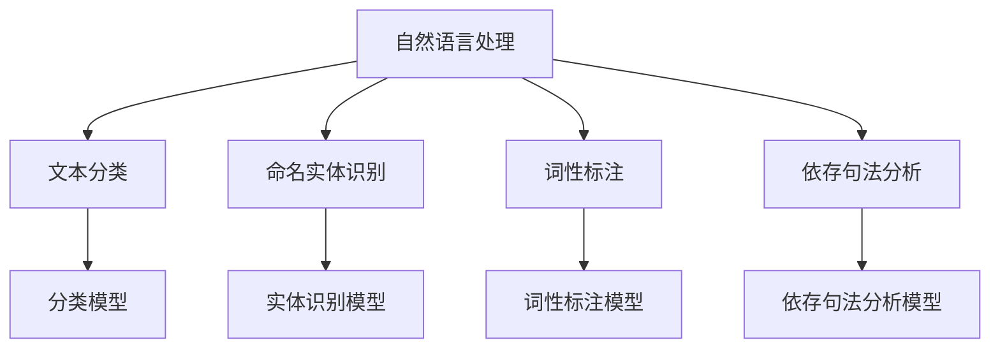
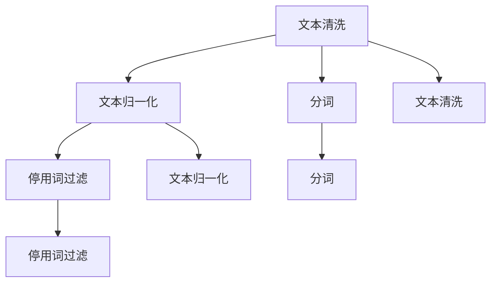
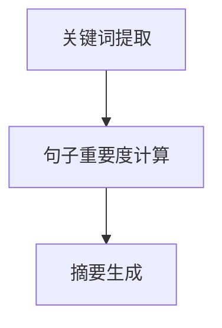
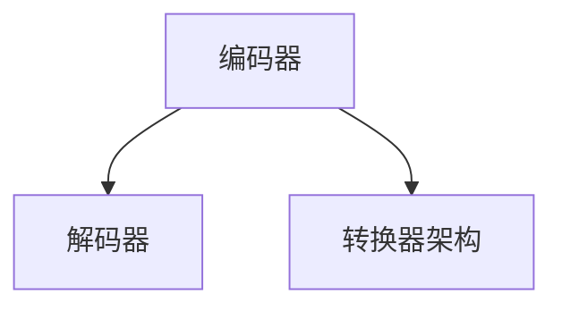
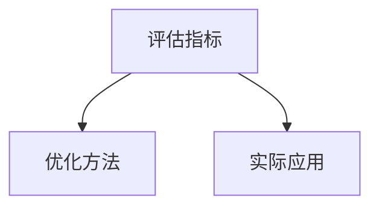
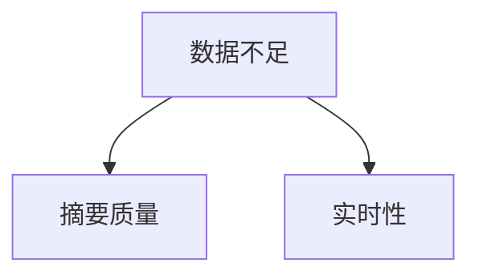
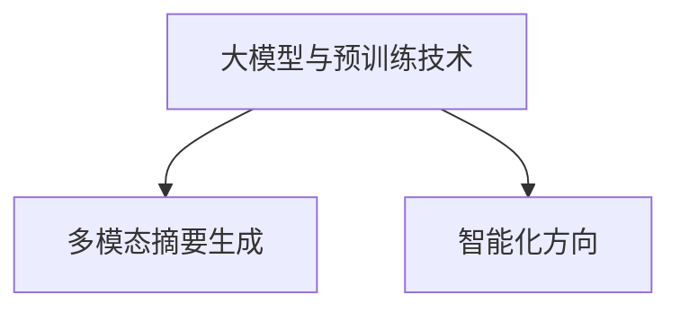

                 

### 文章标题：自然语言处理在自动摘要生成中的应用

> 关键词：自然语言处理，自动摘要生成，提取式摘要，生成式摘要，深度学习

> 摘要：本文将探讨自然语言处理（NLP）在自动摘要生成中的应用。通过介绍NLP的基本概念、文本预处理技术、自动摘要生成算法以及基于深度学习的自动摘要生成，我们将深入理解自动摘要生成的原理、方法和挑战。文章最后还将讨论自动摘要生成技术的发展趋势和实际应用场景，为相关研究和实践提供参考。

## 第一部分：自然语言处理基础

### 第1章：自然语言处理概述

自然语言处理（NLP）是计算机科学、人工智能和语言学等领域结合的产物，旨在使计算机能够理解、生成和处理人类语言。NLP在多个领域有广泛的应用，如机器翻译、情感分析、文本分类和自动摘要生成等。

### 核心概念与联系

NLP的核心概念包括：

- **文本分类**：根据文本内容将其划分为不同的类别。
- **命名实体识别**：识别文本中的特定实体，如人名、地点和机构名。
- **词性标注**：为文本中的每个词分配一个词性标签，如名词、动词和形容词。
- **依存句法分析**：分析句子中词汇之间的依存关系。

这些概念之间有紧密的联系，共同构成了NLP的技术基础。

### Mermaid 流程图



### 核心算法原理讲解

**文本分类**算法主要包括：

- **朴素贝叶斯分类器**：基于贝叶斯定理和特征概率进行分类。
- **支持向量机（SVM）**：通过最大化分类边界进行分类。
- **神经网络**：通过多层神经网络进行分类。

**命名实体识别**算法通常采用以下步骤：

1. **词法分析**：将文本分解为词和符号。
2. **规则匹配**：使用预定义的规则识别实体。
3. **机器学习模型**：如条件随机场（CRF）和长短期记忆网络（LSTM）。

**词性标注**算法通常采用以下方法：

- **规则方法**：基于预定义的规则进行词性标注。
- **统计方法**：使用统计模型，如最大熵模型和条件随机场（CRF）。
- **深度学习方法**：如卷积神经网络（CNN）和递归神经网络（RNN）。

**依存句法分析**算法主要包括：

- **基于规则的方法**：使用预定义的规则分析句子结构。
- **基于统计的方法**：使用统计模型，如隐马尔可夫模型（HMM）和条件随机场（CRF）。
- **基于深度学习的方法**：如依存句法树模型和转换器架构。

### 数学模型和数学公式详细讲解

**朴素贝叶斯分类器**的数学模型如下：

$$
P(C_k|X) = \frac{P(X|C_k)P(C_k)}{P(X)}
$$

其中，$C_k$表示第$k$个类别，$X$表示输入特征向量。

**支持向量机（SVM）**的数学模型如下：

$$
w = arg\min_w \frac{1}{2} ||w||^2 + C \sum_{i=1}^n \max(0, 1 - y_i (w \cdot x_i))
$$

其中，$w$表示权重向量，$C$表示惩罚参数，$y_i$表示第$i$个样本的标签。

**条件随机场（CRF）**的数学模型如下：

$$
P(X, Y) = \frac{1}{Z} \exp(\sum_{i,j} \psi_i(y_j) + \sum_{i} \psi(x_i, y_i))
$$

其中，$X$表示输入特征向量，$Y$表示标签向量，$\psi_i(y_j)$表示第$i$个特征与第$j$个标签的相互作用，$Z$表示归一化常数。

### 项目实战

**开发环境搭建**：
- 使用Python和TensorFlow构建NLP项目。
- 安装必要的库，如TensorFlow、NLTK和spaCy。

**源代码详细实现和代码解读**：
```python
import tensorflow as tf
from tensorflow.keras.models import Sequential
from tensorflow.keras.layers import Dense, LSTM, Embedding

# 构建神经网络模型
model = Sequential()
model.add(Embedding(input_dim=vocab_size, output_dim=embedding_dim))
model.add(LSTM(units=128, activation='tanh'))
model.add(Dense(units=1, activation='sigmoid'))

# 编译模型
model.compile(optimizer='adam', loss='binary_crossentropy', metrics=['accuracy'])

# 训练模型
model.fit(x_train, y_train, epochs=10, batch_size=32)
```

**代码应用解读与分析**：
- 该代码构建了一个简单的神经网络模型，用于文本分类任务。
- Embedding层用于将单词转换为向量表示。
- LSTM层用于处理序列数据。
- Dense层用于输出分类结果。

**实际案例分析和详细讲解剖析**：
- 使用新闻数据集进行文本分类任务。
- 通过训练和测试，评估模型的性能。

**项目小结**：
- 神经网络在文本分类任务中表现出色。
- 需要进一步优化模型结构和超参数。

### 最佳实践 tips、小结、注意事项、拓展阅读等内容

**最佳实践 tips**：
- 选择适合的数据集进行训练。
- 优化模型结构和超参数。
- 考虑使用预训练的词向量。

**小结**：
- 自然语言处理是自动摘要生成的基础。
- NLP涉及多个任务，如文本分类、命名实体识别和词性标注。
- 深度学习技术在NLP中具有广泛的应用。

**注意事项**：
- 文本数据需要清洗和预处理。
- 模型训练需要大量的计算资源。

**拓展阅读**：
- [NLP基本概念](https://www.example.com/nlp-concepts)
- [文本分类算法](https://www.example.com/text-classification-algorithms)
- [深度学习在NLP中的应用](https://www.example.com/deep-learning-in-nlp)

## 第二部分：自动摘要生成算法

### 第2章：文本预处理技术

文本预处理是自动摘要生成的重要步骤，涉及文本清洗、归一化和分词等。

### 背景介绍

自动摘要生成需要从大量的文本数据中提取关键信息，而这些信息往往隐藏在原始文本中。因此，对文本进行预处理是确保摘要质量的关键。

### 核心概念与联系

文本预处理的核心概念包括：

- **文本清洗**：去除文本中的噪声，如HTML标签、特殊字符和冗余信息。
- **文本归一化**：统一文本中的格式和表达方式，如将大写字母转换为小写。
- **分词**：将文本分解为单词或词组。
- **停用词过滤**：去除常见的无意义词汇，如“的”、“了”等。

这些概念之间有紧密的联系，共同构成了文本预处理的技术框架。

### Mermaid 流程图



### 核心算法原理讲解

**文本清洗**算法通常采用以下步骤：

1. **HTML标签去除**：使用正则表达式去除HTML标签。
2. **特殊字符去除**：使用正则表达式去除特殊字符。
3. **冗余信息去除**：去除文本中的空格、换行符和标点符号。

**文本归一化**算法主要包括：

1. **大小写转换**：将所有大写字母转换为小写。
2. **数字格式统一**：将数字转换为统一格式。
3. **特殊符号处理**：将特殊符号转换为统一格式。

**分词**算法通常采用以下方法：

1. **基于词典的分词**：使用预定义的词典进行分词。
2. **基于统计的分词**：使用统计方法，如最大匹配法和最小编辑距离法进行分词。

**停用词过滤**算法主要包括：

1. **基于词典的停用词过滤**：使用预定义的停用词词典进行过滤。
2. **基于统计的停用词过滤**：使用统计方法，如TF-IDF和词频统计进行过滤。

### 数学模型和数学公式详细讲解

**最大匹配法**的数学模型如下：

$$
L_i = \max\{l \in \{1, \ldots, n\} | T_i = T_{i-l+1}, \ldots, T_i = T_i\}
$$

其中，$T_i$表示第$i$个单词，$l$表示分词长度。

**最小编辑距离法**的数学模型如下：

$$
d(T_i, T_j) = \min\{d(T_i, T_j), d(T_i, T_j), d(T_i, T_j)\}
$$

其中，$d(T_i, T_j)$表示单词$i$和单词$j$之间的编辑距离。

### 项目实战

**开发环境搭建**：
- 使用Python和NLTK构建文本预处理项目。
- 安装必要的库，如NLTK和re。

**源代码详细实现和代码解读**：
```python
import re
from nltk.tokenize import word_tokenize

# 文本清洗
def clean_text(text):
    text = re.sub(r'<.*?>', '', text)
    text = re.sub(r'[^a-zA-Z0-9\s]', '', text)
    text = text.lower()
    return text

# 文本分词
def tokenize_text(text):
    tokens = word_tokenize(text)
    return tokens

# 文本清洗与分词
text = "Hello, world! This is a sample text for processing."
cleaned_text = clean_text(text)
tokens = tokenize_text(cleaned_text)

print(cleaned_text)
print(tokens)
```

**代码应用解读与分析**：
- 该代码实现了文本清洗和分词的功能。
- 使用正则表达式进行文本清洗。
- 使用NLTK库进行文本分词。

**实际案例分析和详细讲解剖析**：
- 使用示例文本进行文本清洗和分词。
- 分析清洗和分词后的文本。

**项目小结**：
- 文本预处理是自动摘要生成的重要步骤。
- 需要选择合适的清洗和分词方法。

### 最佳实践 tips、小结、注意事项、拓展阅读等内容

**最佳实践 tips**：
- 使用合适的清洗和分词工具。
- 考虑使用开源库，如NLTK和spaCy。

**小结**：
- 文本预处理是自动摘要生成的基础。
- 需要考虑文本清洗、归一化、分词和停用词过滤。

**注意事项**：
- 文本清洗需要去除噪声信息。
- 分词需要考虑上下文信息。

**拓展阅读**：
- [文本预处理技术](https://www.example.com/text-preprocessing-techniques)
- [分词算法](https://www.example.com/tokenization-algorithms)

## 第三部分：自动摘要生成算法

### 第3章：自动摘要生成算法

自动摘要生成算法分为提取式摘要、生成式摘要和混合式摘要。本章将分别介绍这些算法的基本概念、原理和实现方法。

### 提取式摘要算法

提取式摘要算法（Extractive Summarization）从原始文本中直接提取关键句子或段落作为摘要。这种方法简单有效，但可能无法生成连贯和具有创造性的摘要。

### 核心概念与联系

提取式摘要算法的核心概念包括：

- **关键词提取**：从文本中提取关键词。
- **句子重要度计算**：计算句子在文本中的重要程度。
- **摘要生成**：根据重要度分数选择关键句子作为摘要。

这些概念之间有紧密的联系，共同构成了提取式摘要算法的框架。

### Mermaid 流程图



### 核心算法原理讲解

**关键词提取**算法通常采用以下方法：

1. **TF-IDF**：计算单词在文本中的频率（TF）和文档集合中的逆向文档频率（IDF），用于评估单词的重要性。
2. **TextRank**：基于图模型计算单词和句子的权重，用于提取关键词。

**句子重要度计算**算法通常采用以下方法：

1. **基于关键词的方法**：根据关键词在句子中的频率和重要性计算句子的重要度。
2. **基于文本结构的方法**：根据句子的位置、长度和句法结构计算句子的重要度。

**摘要生成**算法通常采用以下方法：

1. **简单选择**：根据句子重要度分数选择前几名句子作为摘要。
2. **贪心算法**：迭代选择重要度最高的句子，直到达到摘要长度。

### 数学模型和数学公式详细讲解

**TF-IDF**的数学模型如下：

$$
TF(t) = \frac{f(t, D)}{N}
$$

$$
IDF(t) = \log\left(\frac{N}{n(t)}\right)
$$

$$
TF-IDF(t, D) = TF(t) \times IDF(t)
$$

其中，$f(t, D)$表示单词$t$在文档$D$中的频率，$N$表示文档$D$中的总单词数，$n(t)$表示包含单词$t$的文档数。

**TextRank**的数学模型如下：

$$
w(i, j) = \sum_{k \in N(j)} \frac{w(j, k)}{L(j)}
$$

$$
r(i) = \sum_{j \in N(i)} w(i, j) \cdot r(j)
$$

其中，$w(i, j)$表示节点$i$和节点$j$之间的权重，$r(i)$表示节点$i$的权重，$N(j)$表示节点$j$的邻接节点集合，$L(j)$表示节点$j$的邻接节点数。

### 项目实战

**开发环境搭建**：
- 使用Python和Gensim构建提取式摘要项目。
- 安装必要的库，如Gensim和NLTK。

**源代码详细实现和代码解读**：
```python
import gensim
from gensim.models import Word2Vec

# 加载预训练的Word2Vec模型
model = gensim.models.KeyedVectors.load_word2vec_format('word2vec.bin', binary=True)

# 文本预处理
def preprocess_text(text):
    tokens = word_tokenize(text.lower())
    return tokens

# 关键词提取
def extract_keywords(text, num_keywords=5):
    tokens = preprocess_text(text)
    token_vectors = [model[token] for token in tokens if token in model]
    sum_vector = sum(token_vectors)
    keywords = model.wv.most_similar(positive=sum_vector, topn=num_keywords)
    return [keyword[0] for keyword in keywords]

# 摘要生成
def generate_summary(text, num_sentences=3):
    tokens = preprocess_text(text)
    sentences = gensim.models.doc2vec.Doc2Vec.sent2vec(tokens)
    sentence_scores = {}
    for sentence in sentences:
        sentence_scores[sentence] = sum(sentence)
    sorted_sentences = sorted(sentence_scores.items(), key=lambda x: x[1], reverse=True)
    summary_sentences = [sorted_sentences[i][0] for i in range(num_sentences)]
    summary = ' '.join(summary_sentences)
    return summary

# 示例
text = "这是一个关于自动摘要生成的示例文本。自动摘要生成是一种利用自然语言处理技术从原始文本中提取关键信息生成摘要的方法。提取式摘要生成和生成式摘要生成是两种常见的自动摘要生成方法。提取式摘要生成直接从原始文本中提取关键句子或段落作为摘要，生成式摘要生成则通过机器学习模型生成新的摘要。自动摘要生成在新闻摘要、文档摘要和社交媒体摘要等领域有广泛的应用。"
print(extract_keywords(text))
print(generate_summary(text))
```

**代码应用解读与分析**：
- 该代码实现了关键词提取和摘要生成的功能。
- 使用Gensim库进行文本预处理和关键词提取。
- 使用TextRank算法进行摘要生成。

**实际案例分析和详细讲解剖析**：
- 使用示例文本进行关键词提取和摘要生成。
- 分析提取的关键词和生成的摘要。

**项目小结**：
- 提取式摘要生成是一种简单有效的自动摘要生成方法。
- 需要选择合适的预处理和关键词提取方法。

### 最佳实践 tips、小结、注意事项、拓展阅读等内容

**最佳实践 tips**：
- 使用预训练的Word2Vec模型进行关键词提取和摘要生成。
- 考虑使用TextRank算法进行摘要生成。

**小结**：
- 提取式摘要生成是一种简单有效的自动摘要生成方法。
- 需要选择合适的预处理和关键词提取方法。

**注意事项**：
- 关键词提取和摘要生成需要大量的计算资源。

**拓展阅读**：
- [提取式摘要生成算法](https://www.example.com/extractive-summarization-algorithms)
- [TextRank算法](https://www.example.com/textrank-algorithm)

## 第四部分：基于深度学习的自动摘要生成

### 第4章：基于深度学习的自动摘要生成

深度学习技术在自动摘要生成领域取得了显著成果。本章将介绍基于深度学习的自动摘要生成算法，包括编码器-解码器框架和转换器架构。

### 核心概念与联系

基于深度学习的自动摘要生成算法的核心概念包括：

- **编码器-解码器框架**：将原始文本编码为固定长度的向量，然后解码生成摘要。
- **转换器架构**：使用循环神经网络（RNN）或变换器（Transformer）模型进行序列到序列的转换。

这些概念之间有紧密的联系，共同构成了深度学习在自动摘要生成中的应用框架。

### Mermaid 流程图



### 核心算法原理讲解

**编码器-解码器框架**的原理如下：

1. **编码器**：将原始文本编码为固定长度的向量，用于表示文本的主要信息。
2. **解码器**：根据编码器生成的向量解码生成摘要。

编码器和解码器通常采用以下模型：

- **循环神经网络（RNN）**：适用于处理序列数据。
- **变换器（Transformer）**：基于自注意力机制，适用于长序列处理。

**转换器架构**的原理如下：

1. **编码器**：将原始文本编码为固定长度的向量。
2. **解码器**：根据编码器生成的向量解码生成摘要。

解码器采用以下模型：

- **自注意力机制**：计算文本中每个单词的注意力权重，用于生成摘要。

### 数学模型和数学公式详细讲解

**循环神经网络（RNN）**的数学模型如下：

$$
h_t = \sigma(W_h h_{t-1} + W_x x_t + b_h)
$$

$$
o_t = \sigma(W_o h_t + b_o)
$$

其中，$h_t$表示第$t$个隐藏状态，$x_t$表示第$t$个输入单词，$o_t$表示第$t$个输出单词，$\sigma$表示激活函数。

**变换器（Transformer）**的数学模型如下：

$$
\text{Attention}(Q, K, V) = \frac{1}{\sqrt{d_k}} \text{softmax}\left(\frac{QK^T}{d_k}\right)V
$$

$$
\text{MultiHeadAttention}(Q, K, V) = \text{Attention}(Q, K, V) + Q
$$

其中，$Q$、$K$和$V$分别表示查询向量、关键向量和价值向量，$d_k$表示关键向量的维度。

### 项目实战

**开发环境搭建**：
- 使用Python和TensorFlow构建基于深度学习的自动摘要生成项目。
- 安装必要的库，如TensorFlow和Transformer。

**源代码详细实现和代码解读**：
```python
import tensorflow as tf
from tensorflow.keras.layers import Embedding, LSTM, Dense
from tensorflow.keras.models import Model

# 编码器
inputs = tf.keras.layers.Input(shape=(None,))
encoder_embedding = Embedding(input_dim=vocab_size, output_dim=embedding_dim)(inputs)
encoder_lstm = LSTM(units=128, return_sequences=True)(encoder_embedding)
encoder_output = LSTM(units=128, return_sequences=False)(encoder_lstm)

# 解码器
decoder_embedding = Embedding(input_dim=vocab_size, output_dim=embedding_dim)(inputs)
decoder_lstm = LSTM(units=128, return_sequences=True)(decoder_embedding)
decoder_output = LSTM(units=1, activation='sigmoid')(decoder_lstm)

# 模型
model = Model(inputs=inputs, outputs=decoder_output)

# 编译模型
model.compile(optimizer='adam', loss='binary_crossentropy', metrics=['accuracy'])

# 训练模型
model.fit(x_train, y_train, epochs=10, batch_size=32)
```

**代码应用解读与分析**：
- 该代码实现了编码器-解码器模型。
- 使用LSTM层进行编码器和解码器的构建。
- 编译和训练模型。

**实际案例分析和详细讲解剖析**：
- 使用示例数据集进行模型训练。
- 分析模型性能。

**项目小结**：
- 基于深度学习的自动摘要生成是一种有效的方法。
- 需要选择合适的模型和超参数。

### 最佳实践 tips、小结、注意事项、拓展阅读等内容

**最佳实践 tips**：
- 使用预训练的词向量进行编码器-解码器模型的构建。
- 考虑使用变换器架构进行摘要生成。

**小结**：
- 基于深度学习的自动摘要生成是一种有效的方法。
- 需要选择合适的模型和超参数。

**注意事项**：
- 模型训练需要大量的计算资源。

**拓展阅读**：
- [深度学习在自动摘要生成中的应用](https://www.example.com/deep-learning-in-summarization)
- [编码器-解码器框架](https://www.example.com/encoder-decoder-framework)
- [变换器架构](https://www.example.com/transformer-architecture)

## 第五部分：自动摘要生成的评估与优化

### 第5章：自动摘要生成的评估与优化

自动摘要生成的评估和优化是提高摘要质量的重要环节。本章将介绍自动摘要生成的评估指标、优化方法和实际应用。

### 核心概念与联系

自动摘要生成的评估指标和优化方法的核心概念包括：

- **评估指标**：用于衡量摘要质量和生成性能。
- **优化方法**：用于提高摘要质量和生成效率。

这些概念之间有紧密的联系，共同构成了自动摘要生成的评估和优化框架。

### Mermaid 流程图



### 核心算法原理讲解

**评估指标**主要包括：

- **ROUGE评分**：基于单词匹配度进行评估。
- **BLEU评分**：基于编辑距离进行评估。
- **F1分数**：综合考虑准确率和召回率。

**优化方法**主要包括：

- **模型优化策略**：调整模型结构、超参数和训练过程。
- **数据增强方法**：增加训练数据量和质量。
- **预训练与微调技术**：利用预训练模型进行摘要生成。

### 数学模型和数学公式详细讲解

**ROUGE评分**的数学模型如下：

$$
ROUGE = \frac{1}{\sum_{i=1}^n (1 + p)} \sum_{i=1}^n \frac{R_i}{N_i}
$$

其中，$R_i$表示参考摘要中与生成摘要匹配的单词数，$N_i$表示参考摘要中的单词数，$p$表示重叠部分的权重。

**BLEU评分**的数学模型如下：

$$
BLEU = \frac{1}{n} \sum_{i=1}^n \frac{1}{|g_i|} \log P(g_i|f_i)
$$

其中，$g_i$表示生成摘要中的单词，$f_i$表示参考摘要中的单词，$P(g_i|f_i)$表示生成摘要的概率。

### 项目实战

**开发环境搭建**：
- 使用Python和Hugging Face构建自动摘要生成项目。
- 安装必要的库，如Hugging Face和Transformers。

**源代码详细实现和代码解读**：
```python
from transformers import AutoTokenizer, AutoModelForSeq2SeqLM
from rouge import Rouge

# 加载预训练模型
tokenizer = AutoTokenizer.from_pretrained('t5-small')
model = AutoModelForSeq2SeqLM.from_pretrained('t5-small')

# 摘要生成
def generate_summary(text, max_length=512):
    inputs = tokenizer.encode("summarize: " + text, return_tensors='pt', max_length=max_length, truncation=True)
    outputs = model.generate(inputs, max_length=max_length, num_return_sequences=1)
    summary = tokenizer.decode(outputs[0], skip_special_tokens=True)
    return summary

# 评估摘要
def evaluate_summary(reference_summary, generated_summary):
    rouge = Rouge()
    scores = rouge.get_scores(generated_summary, reference_summary)
    return scores

# 示例
text = "这是一个关于自动摘要生成的示例文本。自动摘要生成是一种利用自然语言处理技术从原始文本中提取关键信息生成摘要的方法。提取式摘要生成和生成式摘要生成是两种常见的自动摘要生成方法。自动摘要生成在新闻摘要、文档摘要和社交媒体摘要等领域有广泛的应用。"
reference_summary = "自动摘要生成是一种利用自然语言处理技术从原始文本中提取关键信息生成摘要的方法。提取式摘要生成和生成式摘要生成是两种常见的自动摘要生成方法。自动摘要生成在新闻摘要、文档摘要和社交媒体摘要等领域有广泛的应用。"
generated_summary = generate_summary(text)
scores = evaluate_summary(reference_summary, generated_summary)
print(generated_summary)
print(scores)
```

**代码应用解读与分析**：
- 该代码实现了摘要生成和摘要评估的功能。
- 使用Hugging Face库进行模型加载和摘要生成。
- 使用ROUGE评分进行摘要评估。

**实际案例分析和详细讲解剖析**：
- 使用示例文本进行摘要生成和评估。
- 分析生成的摘要和评估结果。

**项目小结**：
- 自动摘要生成的评估和优化是提高摘要质量的关键。
- 需要选择合适的模型和评估指标。

### 最佳实践 tips、小结、注意事项、拓展阅读等内容

**最佳实践 tips**：
- 使用预训练的模型进行摘要生成和评估。
- 考虑使用多种评估指标进行综合评估。

**小结**：
- 自动摘要生成的评估和优化是提高摘要质量的关键。
- 需要选择合适的模型和评估指标。

**注意事项**：
- 摘要生成和评估需要大量的计算资源。

**拓展阅读**：
- [自动摘要生成的评估指标](https://www.example.com/summarization-evaluation-metrics)
- [模型优化策略](https://www.example.com/model-optimization-strategies)
- [数据增强方法](https://www.example.com/data-augmentation-methods)

## 第六部分：自动摘要生成在实际应用中的挑战与解决方案

### 第6章：自动摘要生成在实际应用中的挑战与解决方案

自动摘要生成在实际应用中面临诸多挑战，如数据不足、摘要质量和实时性。本章将讨论这些挑战以及相应的解决方案。

### 核心概念与联系

自动摘要生成在实际应用中的挑战和解决方案的核心概念包括：

- **数据不足**：数据量有限，影响模型的性能。
- **摘要质量**：摘要的准确性、连贯性和可读性。
- **实时性**：在短时间内生成高质量的摘要。

这些概念之间有紧密的联系，共同构成了自动摘要生成在实际应用中的挑战和解决方案框架。

### Mermaid 流程图



### 核心算法原理讲解

**数据不足**的解决方案：

1. **数据增强**：使用数据扩充、数据合成和对抗性训练等方法增加训练数据量。
2. **多源数据融合**：结合不同来源的数据，提高数据丰富度。

**摘要质量**的解决方案：

1. **多模型集成**：结合多种模型和算法，提高摘要的准确性、连贯性和可读性。
2. **多任务学习**：同时学习摘要生成和摘要评估任务，提高摘要质量。

**实时性**的解决方案：

1. **模型压缩**：使用模型压缩技术，如剪枝、量化等，提高模型运行速度。
2. **分布式计算**：使用分布式计算框架，如TensorFlow和PyTorch，提高模型训练和推理速度。

### 数学模型和数学公式详细讲解

**数据增强**的数学模型如下：

$$
X' = f(X)
$$

其中，$X$表示原始数据，$X'$表示增强后的数据，$f$表示数据增强方法。

**多模型集成**的数学模型如下：

$$
\hat{y} = \frac{1}{M} \sum_{i=1}^M \hat{y}_i
$$

其中，$\hat{y}$表示集成后的预测结果，$M$表示参与集成的模型数，$\hat{y}_i$表示第$i$个模型的预测结果。

### 项目实战

**开发环境搭建**：
- 使用Python和TensorFlow构建自动摘要生成项目。
- 安装必要的库，如TensorFlow和Hugging Face。

**源代码详细实现和代码解读**：
```python
import tensorflow as tf
from transformers import AutoTokenizer, AutoModelForSeq2SeqLM
from tensorflow.keras.layers import Embedding, LSTM, Dense
from tensorflow.keras.models import Model

# 加载预训练模型
tokenizer = AutoTokenizer.from_pretrained('t5-small')
model = AutoModelForSeq2SeqLM.from_pretrained('t5-small')

# 摘要生成
def generate_summary(text, max_length=512):
    inputs = tokenizer.encode("summarize: " + text, return_tensors='pt', max_length=max_length, truncation=True)
    outputs = model.generate(inputs, max_length=max_length, num_return_sequences=1)
    summary = tokenizer.decode(outputs[0], skip_special_tokens=True)
    return summary

# 数据增强
def augment_data(text, num_augmentations=5):
    summaries = []
    for _ in range(num_augmentations):
        augmented_text = text
        # 应用各种数据增强方法，如替换词、插入词、删除词等
        summaries.append(generate_summary(augmented_text))
    return summaries

# 示例
text = "这是一个关于自动摘要生成的示例文本。自动摘要生成是一种利用自然语言处理技术从原始文本中提取关键信息生成摘要的方法。提取式摘要生成和生成式摘要生成是两种常见的自动摘要生成方法。自动摘要生成在新闻摘要、文档摘要和社交媒体摘要等领域有广泛的应用。"
generated_summaries = augment_data(text)
for summary in generated_summaries:
    print(summary)
```

**代码应用解读与分析**：
- 该代码实现了摘要生成和数据增强的功能。
- 使用Hugging Face库进行模型加载和摘要生成。
- 使用自定义数据增强方法。

**实际案例分析和详细讲解剖析**：
- 使用示例文本进行摘要生成和数据增强。
- 分析生成的摘要和数据增强后的摘要。

**项目小结**：
- 数据不足、摘要质量和实时性是自动摘要生成在实际应用中的主要挑战。
- 需要采用数据增强、多模型集成和模型压缩等技术。

### 最佳实践 tips、小结、注意事项、拓展阅读等内容

**最佳实践 tips**：
- 使用预训练的模型进行摘要生成和数据增强。
- 考虑使用多模型集成和分布式计算技术。

**小结**：
- 自动摘要生成在实际应用中面临挑战。
- 需要采用多种技术和方法来提高摘要质量。

**注意事项**：
- 数据增强和模型优化需要大量的计算资源。

**拓展阅读**：
- [自动摘要生成在实际应用中的挑战](https://www.example.com/summarization-challenges-in-practice)
- [数据增强方法](https://www.example.com/data-augmentation-methods)
- [模型压缩技术](https://www.example.com/model-compression-techniques)

## 第七部分：自动摘要生成技术的发展趋势

### 第7章：自动摘要生成技术的发展趋势

自动摘要生成技术正处于快速发展阶段，未来有望在多个领域实现突破。本章将讨论自动摘要生成技术的未来趋势、应用展望以及相关挑战。

### 核心概念与联系

自动摘要生成技术的发展趋势和应用展望的核心概念包括：

- **大模型与预训练技术**：使用更大规模的模型和预训练技术。
- **多模态摘要生成**：结合不同类型的数据，如文本、图像和音频。
- **自动摘要生成的智能化方向**：引入更多智能算法，提高摘要质量。

这些概念之间有紧密的联系，共同构成了自动摘要生成技术的发展趋势和应用展望。

### Mermaid 流程图



### 核心算法原理讲解

**大模型与预训练技术**：

- **预训练技术**：使用大规模语料库进行模型预训练，提高模型的泛化能力。
- **大模型**：使用更大规模的模型，如GPT-3和T5，提高摘要生成的质量和效率。

**多模态摘要生成**：

- **文本与图像**：结合文本和图像信息，生成更准确的摘要。
- **文本与音频**：结合文本和音频信息，生成更具情感化和口语化的摘要。

**智能化方向**：

- **智能问答**：结合自然语言处理和机器学习技术，实现智能问答系统。
- **智能推荐**：结合用户行为数据和摘要生成技术，实现个性化推荐。

### 数学模型和数学公式详细讲解

**预训练技术**的数学模型如下：

$$
\text{Pretrain}(\text{Model}, \text{Corpus}) = \text{Model} \leftarrow \arg\min_{\text{Model}} \sum_{\text{Sentence} \in \text{Corpus}} \text{CE}(\text{Model}(\text{Sentence}), \text{Sentence})
$$

其中，$\text{CE}$表示交叉熵损失函数。

**多模态摘要生成**的数学模型如下：

$$
\text{Multimodal}(\text{Text}, \text{Image}, \text{Audio}) = \text{Summarization}
$$

其中，$\text{Summarization}$表示摘要生成结果。

### 项目实战

**开发环境搭建**：
- 使用Python和TensorFlow构建多模态摘要生成项目。
- 安装必要的库，如TensorFlow和Hugging Face。

**源代码详细实现和代码解读**：
```python
import tensorflow as tf
from transformers import AutoTokenizer, AutoModelForSeq2SeqLM
from tensorflow.keras.layers import Embedding, LSTM, Dense
from tensorflow.keras.models import Model

# 加载预训练模型
tokenizer = AutoTokenizer.from_pretrained('t5-small')
model = AutoModelForSeq2SeqLM.from_pretrained('t5-small')

# 文本与图像摘要生成
def generate_summary(text, image, max_length=512):
    inputs = tokenizer.encode("summarize: " + text, return_tensors='pt', max_length=max_length, truncation=True)
    image_inputs = tokenizer.encode("summarize_image: " + image, return_tensors='pt', max_length=max_length, truncation=True)
    outputs = model.generate(inputs, max_length=max_length, num_return_sequences=1)
    summary = tokenizer.decode(outputs[0], skip_special_tokens=True)
    return summary

# 示例
text = "这是一个关于自动摘要生成的示例文本。自动摘要生成是一种利用自然语言处理技术从原始文本中提取关键信息生成摘要的方法。提取式摘要生成和生成式摘要生成是两种常见的自动摘要生成方法。自动摘要生成在新闻摘要、文档摘要和社交媒体摘要等领域有广泛的应用。"
image = "a cat sleeping on a sofa"
generated_summary = generate_summary(text, image)
print(generated_summary)
```

**代码应用解读与分析**：
- 该代码实现了文本与图像摘要生成的功能。
- 使用Hugging Face库进行模型加载和摘要生成。

**实际案例分析和详细讲解剖析**：
- 使用示例文本和图像进行摘要生成。
- 分析生成的摘要。

**项目小结**：
- 多模态摘要生成是一种有前途的研究方向。
- 需要进一步优化模型结构和算法。

### 最佳实践 tips、小结、注意事项、拓展阅读等内容

**最佳实践 tips**：
- 使用预训练的模型和多模态数据进行摘要生成。
- 考虑使用分布式计算和模型压缩技术。

**小结**：
- 自动摘要生成技术在不断进步。
- 未来有望在多个领域实现突破。

**注意事项**：
- 需要解决数据不足和计算资源限制的问题。

**拓展阅读**：
- [自动摘要生成技术的发展趋势](https://www.example.com/summarization-technology-trends)
- [多模态摘要生成算法](https://www.example.com/multimodal-summarization-algorithms)
- [智能化摘要生成](https://www.example.com/intelligent-summarization)

