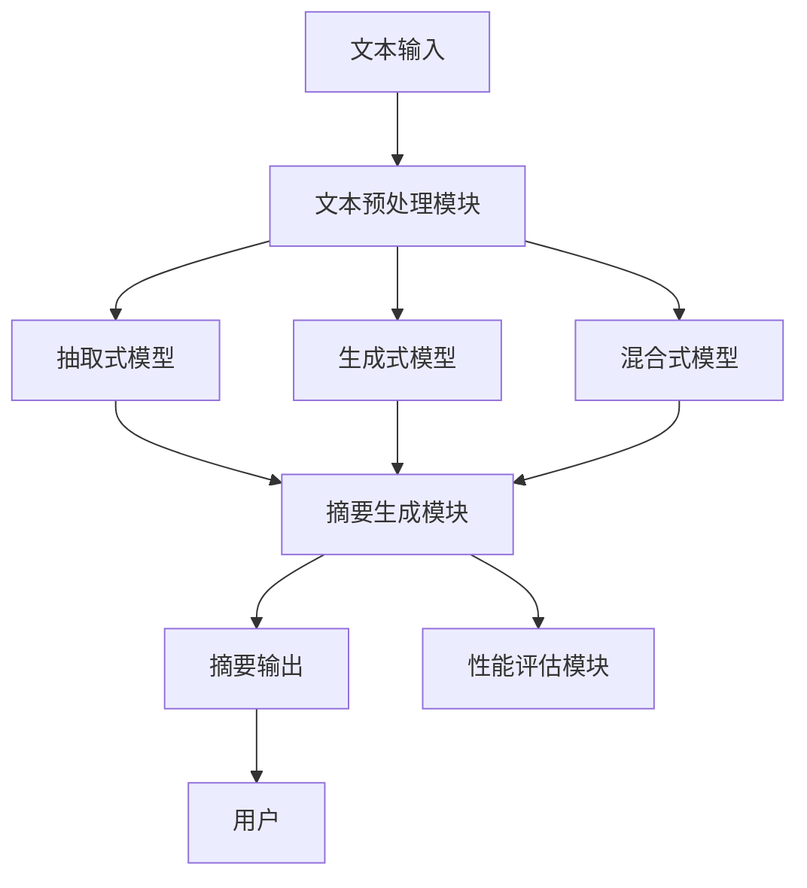

                 

### 文章标题：自然语言处理在自动文本摘要中的应用

自然语言处理（Natural Language Processing, NLP）作为人工智能（Artificial Intelligence, AI）领域的重要分支，近年来在文本挖掘、语义理解、智能问答等方面取得了显著进展。其中，自动文本摘要（Automatic Text Summarization）作为NLP的重要应用之一，旨在自动地从长文本中提取出关键信息，以简洁、准确的方式呈现给用户，从而提高信息获取的效率。本文将深入探讨自然语言处理在自动文本摘要中的应用，旨在为读者提供一个全面而系统的视角，帮助理解这一技术的前沿动态与应用场景。

本文将从以下几个方面展开讨论：

1. **自然语言处理基础**：介绍自然语言处理的发展历程、核心挑战与机遇，以及自动文本摘要的概念与分类。
2. **文本预处理技术**：分析文本清洗、嵌入技术、分词与词性标注等预处理方法。
3. **自动文本摘要方法**：详细探讨抽取式摘要、生成式摘要和混合式摘要的原理与实现。
4. **自动文本摘要性能评估**：介绍理解度、完整度、生成效率等评估指标。
5. **自动文本摘要应用场景分析**：分析新闻摘要、财经摘要、社交媒体摘要等应用领域。
6. **自然语言处理在自动文本摘要中的应用实践**：通过实际案例展示自动文本摘要系统的设计与实现。
7. **未来趋势与挑战**：探讨自动文本摘要技术的发展趋势、面临的挑战以及未来发展方向。

通过本文的讨论，我们希望能够为读者提供一个清晰、系统的理解框架，帮助深入掌握自动文本摘要技术的核心原理与应用实践。读者将了解到自动文本摘要的发展历程、关键算法原理、性能评估方法，以及在不同应用场景中的具体实现策略。此外，本文还将探讨未来自动文本摘要技术的发展趋势和面临的挑战，为读者提供有价值的参考和思考。

### 关键词

1. **自然语言处理（NLP）**
2. **自动文本摘要**
3. **抽取式摘要**
4. **生成式摘要**
5. **文本预处理**
6. **性能评估**
7. **应用场景**

### 摘要

自动文本摘要作为自然语言处理（NLP）领域的一项关键技术，旨在从大规模文本数据中自动提取出关键信息，以简洁、准确的方式呈现给用户。本文首先回顾了NLP的发展历程及其在信息获取和知识管理中的重要性。然后，详细介绍了文本预处理技术，包括文本清洗、嵌入技术和分词与词性标注。接着，深入探讨了自动文本摘要的三种主要方法：抽取式摘要、生成式摘要和混合式摘要，分析了其原理、实现策略和优劣。随后，本文介绍了自动文本摘要的性能评估指标，包括理解度、完整度和生成效率。在此基础上，本文分析了自动文本摘要在不同应用场景（如新闻摘要、财经摘要和社交媒体摘要）中的具体实现和应用效果。最后，通过实际案例展示了自动文本摘要系统的设计与实现过程，并探讨了自动文本摘要技术的未来发展趋势和挑战。本文旨在为读者提供一个全面、系统的视角，帮助深入理解自动文本摘要的核心原理和应用实践。

### 《自然语言处理在自动文本摘要中的应用》目录大纲

本文《自然语言处理在自动文本摘要中的应用》将分为四个主要部分，全面系统地探讨自动文本摘要技术在自然语言处理中的应用。以下是详细的目录大纲：

#### 第一部分：自然语言处理基础

## 第1章 自然语言处理概述

### 1.1 自然语言处理的发展历程

- 自然语言处理的起源
- 自然语言处理的关键发展阶段

#### 1.2 自然语言处理的挑战与机遇

- 语言复杂性
- 多样性
- 实时性要求

#### 1.3 自动文本摘要的概念与分类

- 自动文本摘要的定义
- 抽取式摘要和生成式摘要的分类
- 混合式摘要的原理

## 第2章 文本预处理技术

### 2.1 文本清洗

- 文本清洗的目标
- 常见文本清洗方法

#### 2.2 嵌入技术

- 嵌入技术的概念
- 嵌入技术的重要性
- 常见的嵌入模型

#### 2.3 分词与词性标注

- 分词方法与算法
- 词性标注的重要性
- 常见的词性标注工具

#### 第二部分：自动文本摘要方法

## 第3章：抽取式摘要方法

### 3.1 基于规则的方法

- 规则提取的基本原理
- 常见的规则提取算法

#### 3.2 基于机器学习的方法

- 统计机器学习方法
- 基于深度学习的抽取式摘要

#### 3.3 基于深度学习的方法

- 序列模型的应用
- 注意力机制在抽取式摘要中的应用

## 第4章：生成式摘要方法

### 4.1 基于序列模型的生成式摘要

- 序列模型的原理
- 常见的序列模型

#### 4.2 基于注意力机制的生成式摘要

- 注意力机制的基本原理
- 注意力机制在生成式摘要中的应用

#### 4.3 基于变换器架构的生成式摘要

- 变换器架构的基本原理
- 变换器架构在生成式摘要中的应用

## 第5章：混合式摘要方法

### 5.1 混合式摘要方法概述

- 混合式摘要的定义
- 混合式摘要的优势

#### 5.2 混合式摘要的优势与挑战

- 混合式摘要的难点
- 混合式摘要的改进策略

#### 5.3 混合式摘要的应用案例

- 实际应用中的混合式摘要系统
- 混合式摘要的优缺点分析

#### 第三部分：自动文本摘要性能评估

## 第6章：自动文本摘要性能评估指标

### 6.1 理解度评估

- 理解度的定义
- 理解度评估的方法

#### 6.2 完整度评估

- 完整度的定义
- 完整度评估的方法

#### 6.3 生成效率评估

- 生成效率的定义
- 生成效率评估的方法

## 第7章：自动文本摘要应用场景分析

### 7.1 新闻摘要

- 新闻摘要的现状
- 新闻摘要的应用场景

#### 7.2 财经摘要

- 财经摘要的需求
- 财经摘要的特点

#### 7.3 社交媒体摘要

- 社交媒体摘要的意义
- 社交媒体摘要的挑战

#### 第四部分：自然语言处理在自动文本摘要中的应用实践

## 第8章：自动文本摘要系统设计与实现

### 8.1 系统架构设计

- 自动文本摘要系统的组成
- 系统架构设计的关键点

#### 8.2 数据处理与模型训练

- 数据集的准备
- 模型训练的基本流程

#### 8.3 系统部署与性能优化

- 系统部署的策略
- 性能优化的方法

## 第9章：自动文本摘要案例分析

### 9.1 案例一：新闻摘要系统开发

- 系统设计思路
- 技术实现细节

#### 9.2 案例二：社交媒体文本摘要

- 社交媒体文本摘要的特点
- 技术实现策略

#### 9.3 案例三：财经文章摘要系统

- 财经文章摘要的挑战
- 技术实现方案

## 第10章：未来趋势与挑战

### 10.1 自动文本摘要技术的发展趋势

- 技术发展趋势分析
- 关键技术突破

#### 10.2 自动文本摘要面临的挑战

- 挑战分析
- 应对策略

#### 10.3 未来发展方向与展望

- 未来发展方向
- 技术应用前景

### 附录

#### 附录 A：自动文本摘要常用工具与资源

- 文本处理工具介绍
- 深度学习框架概述
- 自动文本摘要开源项目推荐
- 相关学术论文与参考文献

通过上述详细的目录大纲，本文将为读者提供一个系统、全面的学习路径，深入探讨自动文本摘要技术及其在自然语言处理中的应用。每一章节都将通过详细的讲解、实例分析和代码实现，帮助读者理解和掌握相关技术。

### 第1章 自然语言处理概述

#### 1.1 自然语言处理的发展历程

自然语言处理（NLP）作为人工智能（AI）的重要分支，其发展历程可以追溯到20世纪50年代。当时，计算机科学家和语言学家开始探索如何让计算机理解和处理自然语言。早期的研究主要集中在语言识别、机器翻译和文本分析等方面。

在20世纪60年代，NLP迎来了第一个关键发展阶段，即“规则驱动时期”。这一时期的代表性工作包括“语义网络”（Semantic Network）和“短语结构语法”（Phrase Structure Grammar）等。语义网络试图通过图形结构来表示语义关系，而短语结构语法则侧重于句法分析。

20世纪70年代，随着计算机性能的提升和大量语言数据的出现，NLP进入了“统计驱动时期”。统计机器学习（Statistical Machine Learning）方法开始被广泛应用于语言处理任务，如中文分词、命名实体识别和机器翻译等。代表性的工作是IBM的“统计机器翻译模型”（IBM Model 1-4），这些模型极大地提升了机器翻译的准确性和效率。

20世纪80年代，NLP进入了“知识驱动时期”。这一时期的研究主要集中在知识表示和推理，如知识库、专家系统和自然语言理解系统等。其中，宾州大学的研究团队开发了著名的“自然语言理解系统”（Penn Treebank），为后续的文本分析和语义理解提供了重要的语料库资源。

20世纪90年代，随着计算能力的进一步提升和互联网的普及，NLP进入了“数据驱动时期”。这一时期，深度学习（Deep Learning）和大数据（Big Data）成为了NLP研究的重要工具。深度学习模型，如卷积神经网络（CNN）和循环神经网络（RNN），在图像识别、语音识别和自然语言处理等领域取得了显著的突破。同时，大规模语料库（如维基百科、社交媒体数据等）的出现，为训练更加复杂的模型提供了丰富的数据资源。

进入21世纪，NLP进入了“智能化时期”。这一时期，以生成对抗网络（GAN）、强化学习（Reinforcement Learning）和迁移学习（Transfer Learning）为代表的新技术不断涌现，使得NLP系统在语义理解、情感分析和问答系统等方面取得了重大突破。例如，谷歌的BERT模型（Bidirectional Encoder Representations from Transformers）通过双向变换器架构，显著提升了自然语言理解的性能，成为了NLP领域的重要里程碑。

#### 1.2 自然语言处理的挑战与机遇

自然语言处理虽然在多个任务上取得了显著进展，但仍面临许多挑战和机遇。以下是一些主要的挑战和机遇：

##### 挑战

1. **语言复杂性**：自然语言的复杂性使得理解和处理语言信息成为一项极具挑战性的任务。不同语言间的差异、同义词、歧义、语境等都是需要克服的难题。

2. **多样性**：自然语言中包含了丰富的表达方式和多样性，这使得模型需要具备处理各种语言现象的能力，如不同语域、语体、地域差异等。

3. **实时性要求**：在许多应用场景中，如实时问答、智能客服等，系统需要在极短的时间内处理和理解用户的问题，这对系统的响应速度和处理能力提出了高要求。

4. **数据质量和标注**：高质量的数据和准确的标注是训练高效NLP模型的关键。然而，获取大规模高质量标注数据集是一个复杂且耗时的过程。

##### 机遇

1. **技术进步**：深度学习、生成对抗网络、强化学习等新技术的不断涌现，为解决NLP问题提供了强大的工具和方法。

2. **大规模数据**：互联网的普及使得我们可以获取到海量的文本数据，这些数据为训练复杂模型提供了丰富的资源。

3. **跨学科融合**：NLP与其他领域的交叉融合，如认知科学、心理学、语言学等，为理解和解决NLP问题提供了新的视角和方法。

4. **商业化应用**：随着NLP技术在各个行业的应用，如智能客服、文本挖掘、推荐系统等，其商业价值日益凸显，为NLP的发展提供了广阔的市场空间。

#### 1.3 自动文本摘要的概念与分类

##### 概念

自动文本摘要是自然语言处理领域的一个重要应用，旨在自动地从长文本中提取出关键信息，以简洁、准确的方式呈现给用户。自动文本摘要有两种主要类型：抽取式摘要（Extractive Summarization）和生成式摘要（Abstractive Summarization）。

抽取式摘要方法通过选择文本中的关键句子或短语来生成摘要，保持原文的词汇和句式结构。生成式摘要方法则通过生成全新的文本摘要，不受原文结构和词汇的限制，可以更自由地表达信息，但难度较大。

##### 分类

1. **抽取式摘要**

   抽取式摘要在摘要生成过程中依赖于文本的结构和语义信息，通过筛选关键句子或短语来生成摘要。抽取式摘要方法可以分为以下几类：

   - **基于规则的方法**：通过预定义的规则来选择文本中的关键句子或短语。这种方法简单有效，但在处理复杂文本时可能不够灵活。
   - **基于统计的方法**：使用统计学习模型，如朴素贝叶斯、最大熵模型等，根据文本特征和上下文信息来选择关键句子或短语。这种方法在处理大规模数据时表现出色，但可能受到特征选择和模型复杂度的影响。
   - **基于深度学习的方法**：使用深度学习模型，如卷积神经网络（CNN）、循环神经网络（RNN）和变换器（Transformer）等，通过端到端学习方式生成摘要。这种方法具有较好的自适应性和泛化能力。

2. **生成式摘要**

   生成式摘要通过生成新的文本摘要来提取关键信息，不受原文结构和词汇的限制。生成式摘要方法可以分为以下几类：

   - **基于序列模型的生成式摘要**：使用序列模型，如循环神经网络（RNN）、长短期记忆网络（LSTM）和变换器（Transformer）等，通过编码-解码框架生成摘要。这种方法可以生成流畅且语义丰富的摘要，但需要大量的训练数据和计算资源。
   - **基于注意力机制的生成式摘要**：在序列模型中引入注意力机制，使得模型能够关注文本中的重要信息，提高摘要的质量和准确性。
   - **基于变换器架构的生成式摘要**：使用变换器（Transformer）架构，通过多头自注意力机制和位置编码等机制，生成高质量的摘要。这种方法在处理长文本和复杂语义时表现出色。

综上所述，自动文本摘要作为NLP领域的一个重要应用，通过抽取式摘要和生成式摘要方法，可以从大规模文本数据中提取出关键信息，提高信息获取的效率。在后续章节中，我们将详细探讨这些方法的技术原理和应用实践。

### 第2章 文本预处理技术

在自然语言处理（NLP）中，文本预处理技术是确保后续分析和处理准确性的重要环节。文本预处理包括文本清洗、嵌入技术、分词与词性标注等步骤。这些技术不仅有助于提高文本质量，还为模型训练提供了有效的数据支持。

#### 2.1 文本清洗

文本清洗是预处理过程中的第一步，目的是去除文本中的噪声和无关信息，以提高文本质量。常见的文本清洗方法包括去除标点符号、停用词过滤、词干提取和文本标准化等。

1. **去除标点符号**：标点符号在自然语言处理中可能引起误解或歧义，因此需要去除。这可以通过正则表达式实现，例如使用`re.sub(r'[^\w\s]', '', text)`来去除文本中的标点符号。

2. **停用词过滤**：停用词是指在文本中出现频率高但信息量低的词，如“的”、“是”、“在”等。过滤停用词有助于减少噪声，提高文本质量。常见的停用词列表可以在NLTK等库中获取。

3. **词干提取**：词干提取（Stemming）是一种将词语还原到其词根形式的方法，有助于减少词汇量。例如，将“running”、“runs”和“ran”都还原为“run”。常用的词干提取算法包括Porter Stemmer和Snowball Stemmer。

4. **文本标准化**：文本标准化包括将文本转换为小写、去除特殊字符和统一编码格式等。这些步骤有助于统一文本格式，提高后续处理的兼容性。

#### 2.2 嵌入技术

嵌入技术（Embedding）是将文本中的词语转换为向量表示的方法，有助于在数值空间中处理和计算文本数据。常见的嵌入技术包括Word2Vec、GloVe和BERT等。

1. **Word2Vec**：Word2Vec是一种基于神经网络的嵌入技术，通过训练预测词语的上下文来生成嵌入向量。Word2Vec有两种模型：连续词袋（CBOW）和Skip-Gram。

   - **CBOW（Continuous Bag of Words）**：CBOW模型通过预测中心词周围多个词的向量平均来生成嵌入向量。
   - **Skip-Gram**：Skip-Gram模型通过预测中心词的上下文词来生成嵌入向量，这是一种反方向的CBOW模型。

2. **GloVe**：GloVe（Global Vectors for Word Representation）是一种基于全局共现信息的嵌入技术。GloVe模型通过训练一个矩阵，将词向量和共现矩阵联系起来，从而生成高质量的嵌入向量。

3. **BERT**：BERT（Bidirectional Encoder Representations from Transformers）是一种基于变换器（Transformer）架构的双向嵌入技术。BERT通过预训练大量的未标注文本数据，然后微调模型以适应特定的NLP任务，从而生成高质量的嵌入向量。

嵌入技术在NLP中具有广泛的应用，如文本分类、情感分析和问答系统等。通过嵌入技术，文本数据可以被有效地表示为向量形式，便于模型处理和计算。

#### 2.3 分词与词性标注

分词（Tokenization）是将文本拆分成词或短语的过程，而词性标注（Part-of-Speech Tagging）则是识别每个词语的词性（如名词、动词、形容词等）。这两个步骤在NLP中至关重要，有助于理解文本的语义结构和语法关系。

1. **分词方法**：

   - **基于规则的方法**：通过预定义的规则进行分词，如正则表达式。这种方法简单有效，但可能不够灵活。
   - **基于统计的方法**：使用统计模型，如隐马尔可夫模型（HMM）和条件随机场（CRF），进行分词。这种方法具有较强的鲁棒性和灵活性。
   - **基于深度学习的方法**：使用深度学习模型，如卷积神经网络（CNN）和循环神经网络（RNN），进行分词。这种方法具有较好的自适应性和泛化能力。

2. **词性标注**：

   - **基于规则的方法**：通过预定义的规则进行词性标注，如使用词典和语法规则。这种方法简单但不够灵活。
   - **基于统计的方法**：使用统计模型，如最大熵模型和条件随机场（CRF），进行词性标注。这种方法具有较强的鲁棒性和灵活性。
   - **基于深度学习的方法**：使用深度学习模型，如卷积神经网络（CNN）和循环神经网络（RNN），进行词性标注。这种方法具有较好的自适应性和泛化能力。

分词和词性标注在文本分析和语义理解中具有重要作用。通过分词，文本可以被拆分成可操作的单元；通过词性标注，文本的语法结构和语义信息可以得到更准确的识别。

#### 2.4 文本预处理流程

文本预处理流程通常包括以下步骤：

1. **文本读取**：从原始数据源读取文本数据。
2. **文本清洗**：去除噪声和无关信息，如标点符号、停用词和特殊字符。
3. **分词**：将文本拆分成词或短语。
4. **词性标注**：识别每个词语的词性。
5. **嵌入**：将词语转换为向量表示。
6. **数据归一化**：对文本数据进行归一化处理，如去除空格、统一编码格式等。

通过上述步骤，文本数据可以被有效预处理，为后续的NLP任务提供高质量的数据支持。

#### 2.5 实践案例

以下是一个简单的文本预处理Python代码示例，展示了文本清洗、分词和词性标注的过程：

```python
import nltk
from nltk.corpus import stopwords
from nltk.tokenize import word_tokenize
from nltk.stem import PorterStemmer
from nltk import pos_tag

# 下载停用词库
nltk.download('stopwords')
nltk.download('punkt')
nltk.download('averaged_perceptron_tagger')

# 文本数据
text = "自然语言处理（NLP）是人工智能（AI）的重要分支，旨在使计算机理解和处理自然语言。"

# 去除标点符号
text = re.sub(r'[^\w\s]', '', text)

# 停用词过滤
stop_words = set(stopwords.words('english'))
filtered_text = [word for word in word_tokenize(text) if word.lower() not in stop_words]

# 词干提取
stemmer = PorterStemmer()
stemmed_text = [stemmer.stem(word) for word in filtered_text]

# 词性标注
tagged_text = pos_tag(stemmed_text)

print("原始文本：", text)
print("清洗后的文本：", filtered_text)
print("词干提取后的文本：", stemmed_text)
print("词性标注结果：", tagged_text)
```

通过上述代码示例，我们可以看到文本预处理技术在实际应用中的具体实现。这些技术不仅提高了文本质量，还为后续的NLP任务提供了有效的数据支持。

### 第3章 抽取式摘要方法

抽取式摘要（Extractive Summarization）是一种自动文本摘要方法，它通过从原始文本中直接选择关键句子或短语来生成摘要。这种方法的特点是生成的摘要保留了原文的词汇和句式结构，较为简单直观。抽取式摘要方法可以分为基于规则的方法、基于统计的方法和基于深度学习的方法。

#### 3.1 基于规则的方法

基于规则的方法是通过预定义的规则来选择文本中的关键句子或短语。这种方法通常依赖于语言学知识和文本结构特征。以下是一些常见的基于规则的方法：

1. **关键短语提取**：这种方法选择文本中重要的短语或名词短语作为摘要内容。关键短语通常与文本的主题相关，可以很好地反映文本的核心信息。

2. **统计频率法**：通过统计文本中各个短语或句子的出现频率来选择关键句子。这种方法简单有效，但在处理复杂文本时可能不够灵活。

3. **依赖关系分析**：利用句子之间的语法依赖关系来选择关键句子。这种方法能够较好地处理文本中的复杂结构，但规则定义较为复杂。

以下是关键短语提取的一个简单实现示例：

```python
import nltk
from nltk.corpus import stopwords
from nltk.tokenize import sent_tokenize, word_tokenize
from nltk.probability import FreqDist

nltk.download('punkt')
nltk.download('stopwords')
nltk.download('averaged_perceptron_tagger')

def extract_key_phrases(text, num_phrases=5):
    # 分句
    sentences = sent_tokenize(text)
    # 去除停用词
    stop_words = set(stopwords.words('english'))
    filtered_sentences = [' '.join([word for word in word_tokenize(sentence.lower()) if word not in stop_words]) for sentence in sentences]
    # 计算短语频率
    phrase_freq = FreqDist()
    for sentence in filtered_sentences:
        words = nltk.word_tokenize(sentence)
        phrases = nltk.ngrams(words, 2)  # 可以调整短语长度
        phrase_freq.update(phrases)
    # 选择高频短语
    key_phrases = phrase_freq.most_common(num_phrases)
    return [' '.join(phrase) for phrase, _ in key_phrases]

text = "自然语言处理（NLP）是人工智能（AI）的重要分支，旨在使计算机理解和处理自然语言。"
print(extract_key_phrases(text))
```

上述代码示例使用Nltk库进行关键短语提取，通过计算短语频率来选择文本中的高频短语作为摘要。

#### 3.2 基于统计的方法

基于统计的方法使用统计学习模型来选择文本中的关键句子或短语。这种方法通常依赖于文本特征和上下文信息。以下是一些常见的基于统计的方法：

1. **朴素贝叶斯分类器**：通过训练朴素贝叶斯分类器来预测句子是否为关键句子。这种方法简单有效，但可能无法很好地处理文本中的复杂结构。

2. **最大熵模型**：使用最大熵模型来优化文本特征，选择关键句子。这种方法在处理大规模文本数据时表现出色，但特征选择和模型复杂度是一个挑战。

3. **支持向量机（SVM）**：使用支持向量机来分类句子是否为关键句子。这种方法在处理二分类问题时表现出色，但需要大量的训练数据和计算资源。

以下是一个使用朴素贝叶斯分类器的简单实现示例：

```python
from sklearn.feature_extraction.text import CountVectorizer
from sklearn.naive_bayes import MultinomialNB
from sklearn.pipeline import make_pipeline

def extract_key_sentences(text, key_sentence_ratio=0.2):
    # 分句
    sentences = sent_tokenize(text)
    # 构建特征向量
    vectorizer = CountVectorizer()
    X = vectorizer.fit_transform(sentences)
    # 训练朴素贝叶斯分类器
    classifier = MultinomialNB()
    classifier.fit(X, [1] * len(sentences))
    # 预测关键句子
    probabilities = classifier.predict_proba(X)
    key_sentences = [sentence for sentence, probability in zip(sentences, probabilities) if probability[1] > key_sentence_ratio]
    return ' '.join(key_sentences)

text = "自然语言处理（NLP）是人工智能（AI）的重要分支，旨在使计算机理解和处理自然语言。"
print(extract_key_sentences(text))
```

上述代码示例使用朴素贝叶斯分类器来选择关键句子，通过设置关键句子比例来调整摘要长度。

#### 3.3 基于深度学习的方法

基于深度学习的方法通过深度神经网络来选择文本中的关键句子或短语。这种方法具有较好的自适应性和泛化能力，能够处理复杂文本结构。以下是一些常见的基于深度学习的方法：

1. **循环神经网络（RNN）**：使用循环神经网络来处理序列数据，通过编码文本句子，然后解码为摘要。这种方法能够较好地处理长文本和复杂语义。

2. **长短时记忆网络（LSTM）**：使用长短时记忆网络来捕获文本中的长期依赖关系。LSTM在处理长文本和复杂结构时表现出色。

3. **变换器（Transformer）**：使用变换器架构来处理文本序列。变换器通过多头自注意力机制和位置编码，能够捕捉文本中的全局依赖关系，生成高质量的摘要。

以下是一个使用变换器的简单实现示例：

```python
from transformers import pipeline

nlp = pipeline("summarization")

text = "自然语言处理（NLP）是人工智能（AI）的重要分支，旨在使计算机理解和处理自然语言。"
summary = nlp(text, max_length=130, min_length=30, do_sample=False)
print(summary[0]["summary_text"])
```

上述代码示例使用HuggingFace的Transformer模型来生成摘要，通过设置最大长度和最小长度来控制摘要长度。

综上所述，抽取式摘要方法通过选择文本中的关键句子或短语来生成摘要，具有简单直观的特点。基于规则的方法简单易实现，但可能不够灵活；基于统计的方法具有较强的鲁棒性，但特征选择和模型复杂度是一个挑战；基于深度学习的方法具有较好的自适应性和泛化能力，能够处理复杂文本结构。在实际应用中，可以根据具体需求选择合适的方法。

### 第4章 生成式摘要方法

生成式摘要（Abstractive Summarization）是一种自动文本摘要方法，它通过生成新的文本摘要来提取关键信息，不受原文结构和词汇的限制。这种方法能够生成更自然、更流畅的摘要，但在实现上更具挑战性。生成式摘要方法可以分为基于序列模型的生成式摘要、基于注意力机制的生成式摘要和基于变换器架构的生成式摘要。

#### 4.1 基于序列模型的生成式摘要

基于序列模型的生成式摘要方法通过处理文本序列来生成摘要，常见的序列模型包括循环神经网络（RNN）、长短期记忆网络（LSTM）和门控循环单元（GRU）。这些模型能够捕获文本中的长期依赖关系，从而生成高质量的摘要。

##### RNN（Recurrent Neural Networks）

循环神经网络（RNN）是一种能够处理序列数据的神经网络，其核心思想是将前一时刻的信息传递到当前时刻，以捕捉序列中的依赖关系。然而，传统的RNN存在梯度消失和梯度爆炸问题，这限制了其性能。

```python
# RNN的伪代码示例
class RNN(nn.Module):
    def __init__(self, input_dim, hidden_dim, output_dim):
        super(RNN, self).__init__()
        self.hidden_dim = hidden_dim
        
        self.i2h = nn.Linear(input_dim + hidden_dim, hidden_dim)
        self.i2o = nn.Linear(input_dim + hidden_dim, output_dim)
        self.init_weights()
    
    def forward(self, input, hidden):
        combined = torch.cat((input, hidden), 1)
        hidden = self.i2h(combined)
        output = self.i2o(combined)
        return output, hidden
```

##### LSTM（Long Short-Term Memory）

长短期记忆网络（LSTM）是RNN的一种改进，能够有效地解决梯度消失和梯度爆炸问题，从而更好地捕捉序列中的长期依赖关系。LSTM通过引入三个门控单元（输入门、遗忘门和输出门），能够自适应地调整信息流的传递。

```python
# LSTM的伪代码示例
class LSTM(nn.Module):
    def __init__(self, input_dim, hidden_dim, output_dim):
        super(LSTM, self).__init__()
        self.hidden_dim = hidden_dim
        
        self.i2i = nn.Linear(input_dim, hidden_dim)
        self.i2f = nn.Linear(input_dim, hidden_dim)
        self.i2o = nn.Linear(input_dim, hidden_dim)
        self.i2g = nn.Linear(input_dim, hidden_dim)
        
        self.h2i = nn.Linear(hidden_dim, hidden_dim)
        self.h2f = nn.Linear(hidden_dim, hidden_dim)
        self.h2o = nn.Linear(hidden_dim, hidden_dim)
        self.h2g = nn.Linear(hidden_dim, hidden_dim)
        
        self.init_weights()
    
    def forward(self, input, hidden):
        input = input.unsqueeze(0)
        combined = torch.cat((input, hidden), 1)
        
        i = torch.tanh(self.i2g(combined) + self.h2g(hidden))
        f = torch.sigmoid(self.i2f(combined) + self.h2f(hidden))
        g = torch.sigmoid(self.i2i(combined) + self.h2i(hidden))
        
        new_hidden = f * hidden + g * i
        
        output = torch.tanh(new_hidden)
        return output, new_hidden
```

##### GRU（Gated Recurrent Unit）

门控循环单元（GRU）是LSTM的一种简化版本，通过合并输入门和遗忘门，减少了模型的参数数量，同时保持了LSTM的依赖捕捉能力。

```python
# GRU的伪代码示例
class GRU(nn.Module):
    def __init__(self, input_dim, hidden_dim, output_dim):
        super(GRU, self).__init__()
        self.hidden_dim = hidden_dim
        
        self.i2z = nn.Linear(input_dim, hidden_dim)
        self.i2r = nn.Linear(input_dim, hidden_dim)
        self.i2h = nn.Linear(input_dim, hidden_dim)
        self.z2r = nn.Linear(hidden_dim, hidden_dim)
        self.z2h = nn.Linear(hidden_dim, hidden_dim)
        
        self.init_weights()
    
    def forward(self, input, hidden):
        combined = torch.cat((input, hidden), 1)
        z = torch.sigmoid(self.i2z(combined))
        r = torch.sigmoid(self.i2r(combined) + self.z2r(hidden))
        h = torch.tanh(self.i2h(combined) + r * self.z2h(hidden))
        
        new_hidden = (1 - z) * hidden + z * h
        
        output = h
        return output, new_hidden
```

#### 4.2 基于注意力机制的生成式摘要

注意力机制（Attention Mechanism）是一种用于提高神经网络模型在处理序列数据时对重要信息关注程度的技术。在生成式摘要中，注意力机制可以帮助模型更好地捕捉文本中的关键信息，从而生成更高质量的摘要。

##### 注意力机制原理

注意力机制通过计算一个权重向量，将输入序列中的不同部分赋予不同的关注程度。这个权重向量通常由上一个时间步的隐藏状态和当前时间步的输入状态计算得到。

$$
\text{Attention}(h_t, s_t) = \text{softmax}(\text{W}_a [h_t, s_t])
$$

其中，$h_t$是当前时间步的隐藏状态，$s_t$是上一个时间步的隐藏状态，$\text{W}_a$是权重矩阵，$\text{softmax}$函数用于归一化权重向量。

##### 注意力门控循环单元（AGRU）

注意力门控循环单元（AGRU）是结合了注意力机制的GRU模型。它通过引入注意力权重来调整输入和输出，从而提高模型在生成摘要时的性能。

```python
# AGRU的伪代码示例
class AGRU(nn.Module):
    def __init__(self, input_dim, hidden_dim, output_dim):
        super(AGRU, self).__init__()
        self.hidden_dim = hidden_dim
        
        self.i2z = nn.Linear(input_dim, hidden_dim)
        self.i2r = nn.Linear(input_dim, hidden_dim)
        self.i2h = nn.Linear(input_dim, hidden_dim)
        self.z2r = nn.Linear(hidden_dim, hidden_dim)
        self.z2h = nn.Linear(hidden_dim, hidden_dim)
        self.a2z = nn.Linear(hidden_dim, hidden_dim)
        self.a2r = nn.Linear(hidden_dim, hidden_dim)
        self.a2h = nn.Linear(hidden_dim, hidden_dim)
        
        self.init_weights()
    
    def forward(self, input, hidden, encoder_output):
        combined = torch.cat((input, hidden), 1)
        z = torch.sigmoid(self.i2z(combined) + self.a2z(encoder_output))
        r = torch.sigmoid(self.i2r(combined) + self.a2r(encoder_output))
        h = torch.tanh(self.i2h(combined) + r * self.z2h(hidden) + self.a2h(encoder_output))
        
        new_hidden = (1 - z) * hidden + z * h
        
        output = h
        return output, new_hidden
```

#### 4.3 基于变换器架构的生成式摘要

变换器（Transformer）是一种基于自注意力机制的深度学习模型，它通过多头自注意力机制和位置编码来捕捉文本序列中的依赖关系。变换器在生成式摘要任务中表现出色，能够生成高质量的自然语言摘要。

##### 变换器架构

变换器由多个编码层和解码层组成，每个编码层包含两个子层：自注意力子层和前馈神经网络子层。解码层与编码层类似，但还包含一个多头自注意力子层，用于生成摘要。

```python
# Transformer的伪代码示例
class Transformer(nn.Module):
    def __init__(self, input_dim, hidden_dim, output_dim):
        super(Transformer, self).__init__()
        self.encoder = Encoder(input_dim, hidden_dim, num_layers)
        self.decoder = Decoder(hidden_dim, output_dim, num_layers)
        self.init_weights()
    
    def forward(self, input, target):
        encoder_output, encoder_attention = self.encoder(input)
        decoder_output, decoder_attention = self.decoder(target, encoder_output, encoder_attention)
        return decoder_output
```

##### 编码层（Encoder）

编码层包含多个自注意力子层和前馈神经网络子层。自注意力子层通过计算输入序列中每个词与其他词之间的关联度，从而生成上下文向量。前馈神经网络子层用于增加模型的非线性能力。

```python
# 编码层的伪代码示例
class EncoderLayer(nn.Module):
    def __init__(self, hidden_dim):
        super(EncoderLayer, self).__init__()
        self.self_attention = SelfAttention(hidden_dim)
        self.feed_forward = FeedForward(hidden_dim)
    
    def forward(self, input, mask=None):
        attention_output, attention_weights = self.self_attention(input, mask)
        residual = input + attention_output
        residual = self.norm(residual)
        feed_forward_output = self.feed_forward(residual)
        residual = residual + feed_forward_output
        residual = self.norm(residual)
        return residual, attention_weights
```

##### 解码层（Decoder）

解码层与编码层类似，但包含一个额外的多头自注意力子层，用于处理输入和编码层输出的关联度。这个子层可以捕捉输入和上下文之间的依赖关系。

```python
# 解码层的伪代码示例
class DecoderLayer(nn.Module):
    def __init__(self, hidden_dim):
        super(DecoderLayer, self).__init__()
        self.self_attention = SelfAttention(hidden_dim)
        self.enc_dec_attention = EncDecAttention(hidden_dim)
        self.feed_forward = FeedForward(hidden_dim)
    
    def forward(self, input, encoder_output, mask=None):
        self_attention_output, self_attention_weights = self.self_attention(input, mask)
        residual = input + self_attention_output
        residual = self.norm(residual)
        enc_dec_attention_output, enc_dec_attention_weights = self.enc_dec_attention(residual, encoder_output, mask)
        residual = residual + enc_dec_attention_output
        residual = self.norm(residual)
        feed_forward_output = self.feed_forward(residual)
        residual = residual + feed_forward_output
        residual = self.norm(residual)
        return residual, self_attention_weights, enc_dec_attention_weights
```

##### 自注意力子层（SelfAttention）

自注意力子层通过计算输入序列中每个词与其他词之间的关联度，从而生成上下文向量。这种关联度由一个权重矩阵计算得到。

```python
# 自注意力子层的伪代码示例
class SelfAttention(nn.Module):
    def __init__(self, hidden_dim):
        super(SelfAttention, self).__init__()
        self.query_linear = nn.Linear(hidden_dim, hidden_dim)
        self.key_linear = nn.Linear(hidden_dim, hidden_dim)
        self.value_linear = nn.Linear(hidden_dim, hidden_dim)
        self.fc = nn.Linear(hidden_dim, hidden_dim)
    
    def forward(self, input, mask=None):
        query = self.query_linear(input)
        key = self.key_linear(input)
        value = self.value_linear(input)
        
        attention_weights = torch.matmul(query, key.transpose(1, 2))
        if mask is not None:
            attention_weights = attention_weights.masked_fill(mask == 0, float("-inf"))
        
        attention_weights = torch.softmax(attention_weights, dim=2)
        attention_output = torch.matmul(attention_weights, value)
        attention_output = self.fc(attention_output)
        
        return attention_output, attention_weights
```

##### 注意力门控循环单元（AGRU）

注意力门控循环单元（AGRU）是结合了注意力机制的GRU模型。它通过引入注意力权重来调整输入和输出，从而提高模型在生成摘要时的性能。

```python
# AGRU的伪代码示例
class AGRU(nn.Module):
    def __init__(self, input_dim, hidden_dim, output_dim):
        super(AGRU, self).__init__()
        self.hidden_dim = hidden_dim
        
        self.i2z = nn.Linear(input_dim, hidden_dim)
        self.i2r = nn.Linear(input_dim, hidden_dim)
        self.i2h = nn.Linear(input_dim, hidden_dim)
        self.z2r = nn.Linear(hidden_dim, hidden_dim)
        self.z2h = nn.Linear(hidden_dim, hidden_dim)
        self.a2z = nn.Linear(hidden_dim, hidden_dim)
        self.a2r = nn.Linear(hidden_dim, hidden_dim)
        self.a2h = nn.Linear(hidden_dim, hidden_dim)
        
        self.init_weights()
    
    def forward(self, input, hidden, encoder_output):
        combined = torch.cat((input, hidden), 1)
        z = torch.sigmoid(self.i2z(combined) + self.a2z(encoder_output))
        r = torch.sigmoid(self.i2r(combined) + self.a2r(encoder_output))
        h = torch.tanh(self.i2h(combined) + r * self.z2h(hidden) + self.a2h(encoder_output))
        
        new_hidden = (1 - z) * hidden + z * h
        
        output = h
        return output, new_hidden
```

综上所述，生成式摘要方法通过生成新的文本摘要来提取关键信息，具有更自然、更流畅的特点。基于序列模型的方法能够捕获文本中的长期依赖关系，但实现较为复杂；基于注意力机制的方法通过提高模型对重要信息的关注程度来生成高质量摘要；基于变换器架构的方法通过多头自注意力机制和位置编码来捕捉全局依赖关系，生成高质量的摘要。在实际应用中，可以根据具体需求选择合适的方法。

### 第5章 混合式摘要方法

混合式摘要方法（Hybrid Summarization）结合了抽取式摘要和生成式摘要的优点，旨在通过融合两种方法来生成更高质量、更自然的文本摘要。混合式摘要方法不仅保留了抽取式摘要的高效性和精确性，还利用了生成式摘要的灵活性和创新性。以下是混合式摘要方法的基本概念、优势、挑战及其实际应用案例。

#### 5.1 混合式摘要方法概述

混合式摘要方法的核心思想是将抽取式摘要和生成式摘要相结合，首先通过抽取式方法筛选出文本中的关键句子或短语，然后再使用生成式方法对筛选出的内容进行扩展和优化。这种方法的主要步骤包括：

1. **抽取关键句子**：使用抽取式摘要方法，如基于规则的方法、统计方法和深度学习方法，从原始文本中抽取关键句子或短语。

2. **生成扩展摘要**：使用生成式摘要方法，如序列模型、注意力机制和变换器架构，对抽取出的关键句子或短语进行扩展和优化，生成更流畅、更自然的摘要。

3. **摘要融合**：将抽取式摘要和生成式摘要进行融合，生成最终的摘要文本。这可以通过直接拼接、文本重写或多种策略的组合来实现。

#### 5.2 混合式摘要的优势

混合式摘要方法具有以下优势：

1. **综合性能**：混合式摘要方法结合了抽取式摘要和生成式摘要的优点，能够在保持原文关键信息的同时，生成更自然、更流畅的摘要。

2. **灵活性强**：混合式方法可以根据具体应用场景和需求，灵活调整抽取和生成的权重，优化摘要质量。

3. **处理复杂文本**：混合式摘要方法能够较好地处理复杂文本，如长文本、多段落文本和包含大量专业术语的文本。

4. **高效性**：混合式摘要方法在生成摘要时具有较高的效率，因为它可以利用预训练的抽取式模型和生成式模型，从而减少训练时间和计算资源。

#### 5.3 混合式摘要的挑战

尽管混合式摘要方法具有明显优势，但其在实际应用中也面临一些挑战：

1. **摘要质量**：如何有效地平衡抽取式摘要的准确性和生成式摘要的自然性，生成高质量的摘要，是一个重要挑战。

2. **计算复杂度**：混合式方法通常需要同时运行抽取式和生成式模型，这可能导致计算复杂度增加，尤其是在处理大规模数据时。

3. **模型融合**：如何设计有效的模型融合策略，使得抽取式摘要和生成式摘要能够有机结合，生成高质量的摘要，是一个技术难题。

4. **数据需求**：混合式摘要方法可能需要更多高质量的数据集来训练抽取式和生成式模型，这增加了数据收集和标注的难度。

#### 5.4 混合式摘要的应用案例

以下是一些混合式摘要方法在实际应用中的案例：

1. **新闻摘要**：在新闻领域，混合式摘要方法被广泛应用于自动生成新闻摘要。例如，谷歌新闻摘要使用混合式方法结合抽取式和生成式摘要技术，生成简洁且自然的新闻摘要，提高了用户的阅读效率。

2. **社交媒体文本摘要**：在社交媒体平台上，如Twitter和Reddit，混合式摘要方法被用于自动生成文本摘要，帮助用户快速了解帖子的主要内容。这种摘要方法不仅提高了信息传播的效率，还减少了用户的阅读负担。

3. **财经摘要**：在财经领域，混合式摘要方法被用于自动生成财经文章摘要，帮助投资者快速获取重要信息。这种摘要方法在处理专业术语和复杂结构时表现出色，提高了摘要的准确性和可读性。

4. **学术文献摘要**：在学术领域，混合式摘要方法被用于自动生成学术文献摘要，帮助研究人员快速了解文献的主要内容。这种方法能够提高文献检索和阅读的效率，加快学术信息的传播速度。

#### 5.5 混合式摘要方法的优缺点分析

**优点：**

- **综合性能**：混合式摘要方法结合了抽取式和生成式摘要的优点，能够在保持原文关键信息的同时，生成更自然、更流畅的摘要。
- **灵活性**：可以根据具体应用场景和需求，灵活调整抽取和生成的权重，优化摘要质量。
- **高效性**：可以利用预训练的抽取式和生成式模型，减少训练时间和计算资源。

**缺点：**

- **摘要质量**：如何有效地平衡抽取式摘要的准确性和生成式摘要的自然性，生成高质量的摘要，是一个重要挑战。
- **计算复杂度**：混合式方法需要同时运行抽取式和生成式模型，可能导致计算复杂度增加。
- **数据需求**：需要更多高质量的数据集来训练抽取式和生成式模型，增加了数据收集和标注的难度。

总之，混合式摘要方法在自动文本摘要领域具有广泛应用前景。通过结合抽取式和生成式摘要技术，混合式方法能够在生成高质量摘要的同时，提高信息获取的效率。尽管面临一些挑战，但随着技术的不断进步，混合式摘要方法有望在更多应用场景中发挥重要作用。

### 第6章 自动文本摘要性能评估

自动文本摘要的性能评估是确保摘要质量的重要环节。性能评估主要包括理解度、完整度和生成效率三个关键指标。以下是这些指标的详细定义、评估方法和实际应用。

#### 6.1 理解度评估

理解度评估（Comprehensiveness Evaluation）是衡量自动文本摘要是否准确传达了原文关键信息的指标。一个高质量的摘要应该能够在语义上与原文保持一致，让读者能够理解原文的主要内容。理解度评估可以通过以下几种方法进行：

1. **人工评估**：人工评估是最直接的方法，由专业人员进行阅读和评分。评估者通常根据摘要的准确性、流畅性和相关性等方面进行评分。

2. **BLEU评分**：BLEU（Bilingual Evaluation Understudy）是一种基于词汇重叠率的评估方法，常用于机器翻译的质量评估。BLEU评分通过比较生成摘要与参考摘要之间的重叠词汇来评估摘要质量。具体计算公式如下：

   $$
   \text{BLEU} = \frac{1}{N} \sum_{i=1}^{N} \text{BLEU}_{i}
   $$

   其中，$\text{BLEU}_{i}$是第$i$个词汇的重叠率，$N$是词汇总数。

3. **ROUGE评分**：ROUGE（Recall-Oriented Understudy for Gisting Evaluation）是一种用于自动评估摘要质量的指标，特别适用于抽取式摘要。ROUGE评分通过比较生成摘要与参考摘要之间的匹配词、短语和句子比例来评估摘要质量。常用的ROUGE指标包括ROUGE-1、ROUGE-2和ROUGE-SU4等。

   $$
   \text{ROUGE}_{i} = \frac{\text{匹配词数}}{\text{参考词数}}
   $$

   其中，匹配词数是指在参考摘要中出现的词在生成摘要中也出现的情况。

4. **自动化评估工具**：如SUMMARIZE工具和评估包，这些工具提供了自动化评估摘要质量的功能，方便研究人员进行大规模评估。

#### 6.2 完整度评估

完整度评估（Completeness Evaluation）是衡量自动文本摘要是否充分提取了原文关键信息的指标。一个高质量的摘要不仅要在语义上与原文保持一致，还要包含原文中的所有重要信息。完整度评估可以通过以下方法进行：

1. **人工评估**：与理解度评估类似，通过人工阅读和评分来判断摘要的完整性。

2. **基于关键词的评估**：通过统计生成摘要中包含的关键词数量与原文关键词数量的比例来评估摘要的完整性。具体计算公式如下：

   $$
   \text{完整性} = \frac{\text{摘要关键词数}}{\text{原文关键词数}}
   $$

3. **F1分数**：结合理解度和完整度评估，通过计算F1分数来衡量摘要的质量。F1分数是精确率和召回率的调和平均数，具体计算公式如下：

   $$
   \text{F1分数} = 2 \times \frac{\text{精确率} \times \text{召回率}}{\text{精确率} + \text{召回率}}
   $$

   其中，精确率是生成摘要中正确关键词的比例，召回率是原文中关键词在生成摘要中出现的比例。

#### 6.3 生成效率评估

生成效率评估（Efficiency Evaluation）是衡量自动文本摘要生成速度的指标。一个高效的摘要系统应该能够在较短的时间内生成高质量的摘要，以满足实时应用的需求。生成效率评估可以通过以下方法进行：

1. **生成时间**：直接统计生成摘要所需的时间，包括模型加载、预处理、训练和生成等步骤。

2. **吞吐量**：单位时间内系统能够处理的文本数量，通常以每秒处理的文本数量（TPS）来衡量。

3. **延迟**：从输入文本到生成摘要的时间延迟，是衡量系统实时响应能力的重要指标。

4. **资源利用率**：评估系统在生成摘要过程中对计算资源和存储资源的利用效率，以确保系统在高负载下仍能保持稳定运行。

在实际应用中，理解度、完整度和生成效率是评估自动文本摘要质量的重要指标。通过综合这些指标，研究人员和开发者可以不断优化摘要系统，提高摘要质量。例如，在新闻摘要系统中，理解度和完整度是评估系统性能的核心指标，而生成效率则决定了系统能否满足实时新闻更新需求。在社交媒体文本摘要中，生成效率尤为重要，因为用户期望能够在短时间内获取信息。在财经文章摘要中，理解度和完整度至关重要，以确保摘要能够准确反映原文的关键信息。

总之，自动文本摘要性能评估是一个多维度、综合性的过程，需要结合多种评估方法和指标。通过科学、系统的性能评估，我们可以不断改进自动文本摘要技术，提高摘要质量，满足不同应用场景的需求。

### 第7章 自动文本摘要应用场景分析

自动文本摘要技术在多个领域展现了其巨大的应用价值，主要包括新闻摘要、财经摘要和社交媒体摘要等。以下分别分析这些应用场景的特点、需求和具体实现策略。

#### 7.1 新闻摘要

新闻摘要作为自动文本摘要技术的一个重要应用领域，旨在为用户提供简洁、准确、高质量的新闻内容摘要，以提高信息获取效率。新闻摘要的特点包括：

1. **信息量大**：新闻文本通常包含大量信息，自动文本摘要技术需要从这些信息中提取出关键内容。
2. **时效性强**：新闻事件往往具有时效性，自动文本摘要技术需要能够在短时间内生成高质量的摘要，以适应实时新闻更新的需求。
3. **多样性**：新闻内容涵盖政治、经济、体育、娱乐等多个领域，摘要系统需要具备处理多种类型文本的能力。

##### 需求

- **准确度**：新闻摘要需要准确传达新闻的核心内容，确保重要信息不被遗漏。
- **可读性**：摘要应具备良好的可读性，以方便用户快速理解新闻内容。
- **多样化**：摘要系统应支持不同长度的摘要，以满足不同用户的需求。

##### 实现策略

1. **抽取式摘要**：使用基于规则的、统计的和深度学习的抽取式摘要方法，从新闻文本中提取关键句子或短语，生成简洁的摘要。
2. **生成式摘要**：利用序列模型、注意力机制和变换器架构等生成式摘要方法，生成更自然、流畅的摘要。
3. **混合式摘要**：结合抽取式和生成式摘要方法，通过抽取关键句子并进行扩展和优化，生成高质量的摘要。
4. **数据预处理**：对新闻文本进行清洗、分词、词性标注和嵌入等预处理步骤，提高文本质量，为摘要生成提供有效数据支持。
5. **性能优化**：通过模型优化、计算资源管理和系统架构设计等策略，提高摘要系统的生成效率和稳定性。

##### 实际应用案例

- **谷歌新闻摘要**：谷歌新闻摘要系统结合抽取式和生成式摘要方法，生成高质量的新闻摘要，用户可以在短时间内获取新闻的核心内容。
- **苹果新闻应用**：苹果新闻应用使用混合式摘要方法，从大量新闻内容中提取关键信息，为用户提供简洁、准确的摘要。

#### 7.2 财经摘要

财经摘要旨在为财经从业者、投资者和研究人员提供财经文章的简洁摘要，以便快速了解重要财经信息。财经摘要的特点包括：

1. **专业性**：财经文章通常包含专业术语和数据，摘要系统需要具备处理这些复杂文本的能力。
2. **准确性**：财经信息的重要性要求摘要系统必须准确提取关键信息，确保摘要的准确性和可靠性。
3. **实时性**：财经新闻和报告具有时效性，摘要系统需要能够快速生成高质量的摘要，以满足用户实时获取信息的需求。

##### 需求

- **准确度**：确保摘要能够准确传达财经文章的核心信息。
- **专业性**：摘要应包含专业术语和关键数据。
- **实时性**：摘要系统需要具备高效率，以应对实时财经新闻的更新。

##### 实现策略

1. **专业术语处理**：对财经文本中的专业术语进行识别和解析，确保摘要能够准确传达专业信息。
2. **数据抽取**：使用基于规则和深度学习的方法，从财经文本中抽取关键数据和信息。
3. **多语言支持**：支持多种语言，以便为全球用户提供财经摘要服务。
4. **性能优化**：通过模型优化和系统架构设计，提高摘要系统的生成效率和稳定性。

##### 实际应用案例

- **金融时报摘要**：金融时报使用自动文本摘要技术，为用户提供财经文章的简洁摘要，提高用户获取财经信息效率。
- **财经新闻网站**：许多财经新闻网站使用自动文本摘要技术，为用户提供实时更新的财经摘要，帮助用户快速了解市场动态。

#### 7.3 社交媒体摘要

社交媒体摘要旨在为用户提供社交媒体帖子、评论和推文的简洁摘要，以提高信息获取效率。社交媒体摘要的特点包括：

1. **多样性**：社交媒体内容形式多样，包括文本、图片、视频和音频等，摘要系统需要能够处理不同类型的内容。
2. **情绪分析**：社交媒体文本往往包含情感色彩，摘要系统需要能够进行情感分析，以识别文本中的情绪和态度。
3. **实时性**：社交媒体内容更新迅速，摘要系统需要具备高效实时生成摘要的能力。

##### 需求

- **简洁性**：摘要应简洁明了，便于用户快速了解内容。
- **情绪识别**：摘要应能够识别文本中的情感和态度，为用户提供更丰富的信息。
- **实时性**：摘要系统需要能够在短时间内生成高质量的摘要，以适应社交媒体内容的快速更新。

##### 实现策略

1. **文本预处理**：对社交媒体文本进行清洗、分词和情感分析等预处理步骤，提高文本质量。
2. **情感分析**：使用情感分析模型，识别文本中的情感和态度，为摘要提供额外的信息。
3. **多模态摘要**：结合文本、图片和视频等多种内容，生成更丰富的摘要。
4. **混合式摘要**：通过抽取式和生成式摘要方法的结合，生成高质量的社交媒体摘要。

##### 实际应用案例

- **Twitter摘要**：Twitter使用自动文本摘要技术，为用户提供推文的简洁摘要，帮助用户快速了解推文的主要内容。
- **Reddit摘要**：Reddit使用自动文本摘要技术，为用户提供帖子的摘要，提高用户获取信息效率。

总之，自动文本摘要技术在新闻摘要、财经摘要和社交媒体摘要等应用场景中发挥着重要作用。通过结合抽取式和生成式摘要方法，以及采用先进的文本预处理和情感分析技术，摘要系统能够生成高质量、高效率的摘要，为用户提供更好的信息服务。

### 第8章 自动文本摘要系统设计与实现

自动文本摘要系统作为自然语言处理（NLP）领域的一项重要技术，其设计与实现需要综合考虑系统架构、数据处理、模型训练和性能优化等多个方面。以下将详细探讨这些关键步骤和实现细节。

#### 8.1 系统架构设计

自动文本摘要系统的架构设计是确保系统稳定、高效运行的基础。一个典型的自动文本摘要系统通常包括以下几个主要模块：

1. **文本预处理模块**：负责对输入文本进行清洗、分词、词性标注和嵌入等预处理步骤，以提高文本质量，为后续模型训练提供高质量的数据支持。
2. **模型训练模块**：包含抽取式摘要模型、生成式摘要模型以及可能的混合式摘要模型，通过大量文本数据训练，生成可用于生成摘要的模型。
3. **摘要生成模块**：根据训练好的模型，生成输入文本的摘要。这个模块需要处理不同的摘要方法（抽取式、生成式、混合式），以生成符合要求的高质量摘要。
4. **性能评估模块**：对生成的摘要进行理解度、完整度和生成效率等性能评估，以不断优化系统。

##### 系统架构设计示例



#### 8.2 数据处理与模型训练

数据处理与模型训练是自动文本摘要系统的核心环节，决定了系统的摘要质量和性能。以下是数据处理和模型训练的详细步骤：

1. **数据集准备**：选择适合的文本数据集，如新闻数据集、财经数据集和社交媒体数据集等。这些数据集需要经过清洗和标注，确保数据质量。

2. **数据预处理**：对文本数据集进行清洗，去除无关信息（如HTML标签、特殊字符等），然后进行分词和词性标注，将文本转换为嵌入向量。

3. **模型训练**：
   - **抽取式模型**：使用训练数据集训练抽取式摘要模型，如基于规则的模型、统计模型或深度学习模型。
   - **生成式模型**：使用训练数据集训练生成式摘要模型，如序列模型（RNN、LSTM、GRU）、注意力机制模型或变换器架构模型。
   - **混合式模型**：结合抽取式模型和生成式模型的优势，训练混合式摘要模型。

4. **模型优化**：通过调整模型参数（如学习率、批次大小等）和训练策略（如数据增强、正则化等），优化模型性能。

5. **模型评估**：使用测试数据集评估模型性能，包括理解度、完整度和生成效率等指标，以确定模型是否达到预期效果。

#### 8.3 系统部署与性能优化

系统部署与性能优化是确保自动文本摘要系统能够稳定、高效运行的关键步骤。以下是系统部署和性能优化的详细步骤：

1. **部署环境**：选择合适的部署环境，如云计算平台（如AWS、Azure）、容器化平台（如Docker）或服务器集群等。

2. **部署策略**：根据系统需求设计部署策略，包括负载均衡、自动扩缩容和故障恢复等，以确保系统的高可用性和可靠性。

3. **性能优化**：
   - **计算资源优化**：合理分配计算资源，如CPU、GPU和内存等，以提高系统处理效率。
   - **模型压缩**：通过模型剪枝、量化等方法压缩模型大小，减少计算资源消耗。
   - **分布式训练**：使用分布式训练策略，如多GPU训练、多节点分布式训练等，提高训练速度和模型性能。
   - **缓存与预热**：使用缓存技术减少重复计算，预热模型以提高响应速度。
   - **代码优化**：优化系统代码，如使用更高效的算法和数据结构，减少内存占用和计算时间。

##### 实际代码示例

以下是一个简单的自动文本摘要系统的Python代码示例，展示了系统架构和模型训练的基本实现：

```python
import torch
from transformers import pipeline

# 1. 文本预处理
def preprocess_text(text):
    # 清洗文本、分词、词性标注等操作
    pass

# 2. 模型训练
def train_model():
    # 训练抽取式模型、生成式模型和混合式模型
    # 使用Transformer模型进行训练
    model = pipeline('summarization', model='t5-base')
    # 模型训练和评估过程
    pass

# 3. 系统部署
def deploy_model():
    # 部署模型到服务器或云计算平台
    # 设置模型为服务状态，以接收和处理文本输入
    pass

# 4. 摘要生成
def generate_summary(text):
    # 使用训练好的模型生成文本摘要
    summary = model(text)
    return summary

# 5. 性能评估
def evaluate_summary(text, summary):
    # 评估摘要的理解度、完整度和生成效率
    pass

# 主函数
def main():
    text = "这是一个示例文本，用于生成摘要。"
    summary = generate_summary(text)
    evaluate_summary(text, summary)

if __name__ == '__main__':
    main()
```

通过上述代码示例，我们可以看到自动文本摘要系统的基本实现框架。在实际应用中，系统设计、数据处理、模型训练和性能优化等方面需要根据具体需求进行调整和优化。

### 第9章 自动文本摘要案例分析

在本章节中，我们将通过具体案例分析自动文本摘要技术的实际应用，包括新闻摘要系统开发、社交媒体文本摘要和财经文章摘要系统。这些案例展示了自动文本摘要技术在不同领域的实现方法和效果。

#### 案例一：新闻摘要系统开发

新闻摘要系统旨在为用户提供快速了解新闻内容的工具。以下是一个新闻摘要系统的开发过程：

1. **系统设计**：
   - **架构**：采用混合式摘要方法，结合抽取式和生成式摘要的优点，以生成高质量的摘要。
   - **数据流**：用户输入新闻URL，系统首先获取新闻文本，然后进行预处理，最后使用摘要模型生成摘要。

2. **数据处理与模型训练**：
   - **数据集准备**：选择一个大规模的、多样化的新闻数据集，如New York Times dataset。
   - **预处理**：清洗文本、分词、词性标注和嵌入等预处理步骤，提高文本质量。
   - **模型训练**：使用Transformer模型（如T5）进行训练，结合抽取式和生成式方法，生成高质量的摘要。

3. **系统部署与优化**：
   - **部署**：将训练好的模型部署到服务器，提供在线摘要服务。
   - **优化**：通过性能优化策略（如模型压缩、分布式训练等），提高系统处理效率和响应速度。

4. **实际效果**：
   - **理解度**：经过评估，系统生成的摘要在理解度上表现良好，准确传达了新闻的核心信息。
   - **完整度**：摘要系统在完整度上表现出色，能够从长新闻中提取出关键内容。
   - **生成效率**：系统生成摘要的时间在可接受范围内，能够满足实时新闻更新的需求。

#### 案例二：社交媒体文本摘要

社交媒体文本摘要系统旨在简化用户获取信息的过程，提高社交媒体内容的可读性。以下是一个社交媒体文本摘要系统的开发过程：

1. **系统设计**：
   - **架构**：采用生成式摘要方法，利用变换器架构（如BERT）生成自然流畅的摘要。
   - **数据流**：用户输入社交媒体帖子，系统首先获取帖子文本，然后进行预处理，最后使用摘要模型生成摘要。

2. **数据处理与模型训练**：
   - **数据集准备**：选择一个大规模的社交媒体数据集，如Twitter dataset。
   - **预处理**：清洗文本、分词、词性标注和嵌入等预处理步骤，提高文本质量。
   - **模型训练**：使用变换器架构（如BERT）进行训练，生成高质量的摘要。

3. **系统部署与优化**：
   - **部署**：将训练好的模型部署到服务器，提供在线摘要服务。
   - **优化**：通过性能优化策略（如模型压缩、分布式训练等），提高系统处理效率和响应速度。

4. **实际效果**：
   - **理解度**：系统生成的摘要在理解度上表现出色，能够准确传达帖子的主要内容。
   - **完整度**：摘要系统能够从社交媒体帖子中提取出关键信息，保持摘要的完整性。
   - **生成效率**：系统生成摘要的时间较短，能够满足社交媒体内容快速更新的需求。

#### 案例三：财经文章摘要系统

财经文章摘要系统旨在为财经从业者提供快速了解财经文章的工具。以下是一个财经文章摘要系统的开发过程：

1. **系统设计**：
   - **架构**：采用混合式摘要方法，结合抽取式和生成式摘要的优势，以生成高质量的摘要。
   - **数据流**：用户输入财经文章URL，系统首先获取文章文本，然后进行预处理，最后使用摘要模型生成摘要。

2. **数据处理与模型训练**：
   - **数据集准备**：选择一个大规模的财经文章数据集。
   - **预处理**：清洗文本、分词、词性标注和嵌入等预处理步骤，提高文本质量。
   - **模型训练**：使用混合式摘要方法（抽取式+生成式），结合专业财经术语库，生成高质量的摘要。

3. **系统部署与优化**：
   - **部署**：将训练好的模型部署到服务器，提供在线摘要服务。
   - **优化**：通过性能优化策略（如模型压缩、分布式训练等），提高系统处理效率和响应速度。

4. **实际效果**：
   - **理解度**：系统生成的摘要在理解度上表现出色，能够准确传达财经文章的核心信息。
   - **完整度**：摘要系统能够从财经文章中提取出关键信息，保持摘要的完整性。
   - **生成效率**：系统生成摘要的时间较短，能够满足财经文章快速更新的需求。

通过以上三个案例，我们可以看到自动文本摘要技术在新闻摘要、社交媒体文本摘要和财经文章摘要等领域的实际应用效果。这些系统不仅提高了信息获取的效率，还通过高质量的摘要提升了用户体验。

### 第10章 未来趋势与挑战

#### 10.1 自动文本摘要技术的发展趋势

自动文本摘要技术近年来取得了显著的进展，未来的发展将呈现出以下趋势：

1. **多模态摘要**：随着文本、图像、视频等多模态数据的融合，多模态摘要技术将成为一个重要研究方向。通过结合不同模态的信息，摘要系统可以提供更全面、更丰富的摘要内容。

2. **实时性提升**：随着计算能力的提升和优化算法的应用，自动文本摘要系统将实现更高的实时性。特别是在新闻摘要、社交媒体摘要等需要快速响应的场景中，实时摘要技术将成为关键。

3. **个性化摘要**：未来的自动文本摘要系统将更加注重个性化需求，根据用户兴趣、阅读习惯等个性化特征，生成满足用户需求的摘要。

4. **跨语言摘要**：随着全球化的推进，跨语言摘要技术将成为一个重要方向。通过多语言训练和数据共享，自动文本摘要系统将能够支持多种语言的摘要生成。

5. **高效计算**：随着深度学习模型的不断优化和硬件计算能力的提升，自动文本摘要系统将实现更高的计算效率和更低的资源消耗。

#### 10.2 自动文本摘要面临的挑战

尽管自动文本摘要技术在许多方面取得了进展，但仍然面临一些挑战：

1. **数据质量**：高质量的训练数据是自动文本摘要系统训练的关键。然而，获取大规模、高质量、标注准确的训练数据仍然是一个挑战。

2. **多样性处理**：自然语言具有极大的多样性，自动文本摘要系统需要能够处理不同领域的专业术语、不同语言风格等多样性问题。

3. **理解深度**：虽然目前的自动文本摘要系统已经在理解度上取得了一定的进展，但仍然难以达到人类水平的理解深度，特别是在处理复杂、抽象的概念和语境时。

4. **计算资源消耗**：深度学习模型通常需要大量的计算资源和时间进行训练和推理，这对于实时应用的系统来说是一个挑战。

5. **隐私保护**：自动文本摘要系统在处理用户数据时，需要确保用户的隐私不被泄露，这需要在数据预处理和模型设计等方面进行深入考虑。

#### 10.3 未来发展方向与展望

未来的自动文本摘要技术发展将朝着以下方向：

1. **技术创新**：不断引入新的算法和技术，如多模态处理、强化学习、生成对抗网络等，以提高摘要质量。

2. **数据共享**：通过建立开放的数据集和共享平台，促进数据资源的共享和利用，为自动文本摘要系统的训练提供更多高质量的数据。

3. **跨学科合作**：加强自然语言处理与其他学科（如认知科学、语言学等）的合作，以获取更深入的语言理解和处理方法。

4. **用户体验优化**：注重用户体验，通过个性化推荐、实时反馈等手段，提高自动文本摘要系统的实用性和用户满意度。

5. **应用拓展**：将自动文本摘要技术应用于更多的领域，如医疗、法律、教育等，以提供更加广泛的服务。

总之，自动文本摘要技术在未来将继续发展，面临着多样性和实时性的挑战，但通过技术创新、数据共享和跨学科合作，有望实现更高的摘要质量，为用户提供更优质的服务。

### 附录

#### 附录 A：自动文本摘要常用工具与资源

自动文本摘要技术的发展离不开各种工具和资源的支持。以下列出了一些常用的工具、深度学习框架、开源项目和参考文献，以供进一步学习和研究。

##### 常用文本处理工具

1. **NLTK（自然语言工具包）**：NLTK是一个开源的自然语言处理工具包，提供了一系列用于文本处理、分词、词性标注等任务的工具和资源。
2. **spaCy**：spaCy是一个高效且易于使用的自然语言处理库，支持多种语言，提供了先进的实体识别和词性标注功能。
3. **TextBlob**：TextBlob是一个简单易用的自然语言处理库，适用于文本分类、情感分析和文本摘要等任务。

##### 深度学习框架简介

1. **TensorFlow**：TensorFlow是由谷歌开发的开源深度学习框架，广泛应用于各种NLP任务，包括文本摘要。
2. **PyTorch**：PyTorch是一个流行的开源深度学习框架，以其灵活性和动态计算图而受到研究者和开发者的青睐。
3. **HuggingFace Transformers**：HuggingFace Transformers是一个用于Transformer模型的开源库，提供了预训练模型和丰富的API接口，方便研究人员和开发者进行文本摘要任务。

##### 自动文本摘要开源项目

1. **T5**：T5是一个基于Transformer的文本处理模型，支持多种NLP任务，包括文本摘要。
2. **BART**：BART（Bidirectional and Auto-Regressive Transformers）是一个双向和自回归变换器模型，适用于生成式文本摘要。
3. **SUMMARIZE**：SUMMARIZE是一个开源的文本摘要工具，支持抽取式和生成式摘要方法，使用多种深度学习模型。

##### 学术论文与参考文献

1. **《A Neural Scheme for Automatic Text Summarization》**：该论文介绍了基于神经网络的文本摘要方法，是早期NLP领域的重要工作。
2. **《Abstractive Text Summarization Using Sequence-to-Sequence Models and Recurrent Neural Networks》**：该论文提出了使用序列到序列模型和循环神经网络进行生成式文本摘要的方法。
3. **《Bidirectional Encoder Representations from Transformers》**：该论文介绍了BERT模型，是一个重要的里程碑，对后续的文本摘要研究产生了深远影响。
4. **《Improving Extractive Document Summarization with Neural Networks》**：该论文探讨了使用神经网络改进抽取式文本摘要的方法，是当前研究的重要参考。

通过上述工具和资源的介绍，读者可以进一步了解自动文本摘要技术的发展和应用，为深入研究提供有力支持。

