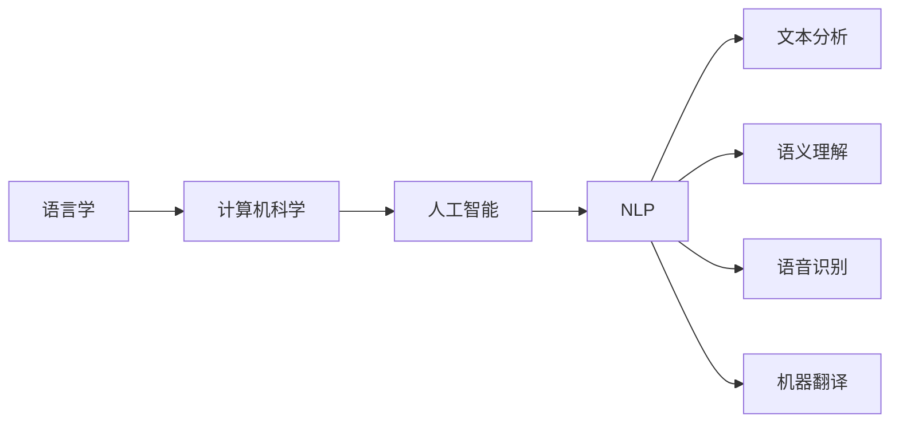
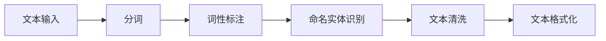

                 

## 文章标题

《自然语言处理在自动文本纠错中的研究》

## 关键词

自然语言处理、文本纠错、拼写检查、同音词纠正、自动文本纠错系统、机器学习、深度学习、算法原理、技术实践

## 摘要

本文深入探讨了自然语言处理（NLP）在自动文本纠错中的应用。首先，介绍了NLP的基本概念和文本预处理技术，包括分词、词性标注和命名实体识别。随后，详细阐述了NLP在拼写检查和同音词纠正中的技术实现，包括基于字典的拼写检查算法、基于上下文的同音词纠正算法等。最后，构建了一个文本纠错集成系统，展示了如何将多种纠错技术整合到一个系统中，实现高效的自动文本纠错。本文旨在为读者提供一个全面的技术分析，帮助理解NLP在文本纠错领域的实际应用和未来发展。

### 第一部分：自然语言处理基本概念

#### 第1章：自然语言处理概述

自然语言处理（Natural Language Processing，NLP）是计算机科学和人工智能领域的一个分支，旨在使计算机能够理解、解释和生成人类自然语言。NLP的重要性在于它为人工智能系统赋予了与人类进行有效沟通的能力，从而在信息检索、机器翻译、文本分析、语音识别等领域取得了显著的进展。

**核心概念与联系**

- **自然语言处理（NLP）**：是一门跨学科的研究领域，结合了语言学、计算机科学和人工智能。NLP的目标是开发能够理解和生成自然语言的方法和技术。

- **语言学**：研究自然语言的结构、语法、语义和语音等方面的学科。语言学为NLP提供了对自然语言的深入理解和描述工具。

- **计算机科学**：研究计算理论、算法设计、编程语言和计算机系统等的学科。计算机科学为NLP提供了实现自然语言处理算法的技术手段。

- **人工智能（AI）**：是一门研究如何构建智能机器的学科。人工智能为NLP提供了学习和推理的方法，使计算机能够模拟人类语言理解的能力。

- **NLP**的发展历程与未来趋势：NLP起源于20世纪50年代，经历了从规则驱动到数据驱动的方法转变。当前，深度学习技术的兴起为NLP带来了新的发展机遇，使得模型在理解和生成自然语言方面取得了显著进展。未来，NLP将继续朝向更高效、更智能的方向发展。

**NLP基础架构 Mermaid 流程图**



#### 第2章：文本预处理

文本预处理是自然语言处理（NLP）过程中的关键步骤，旨在将原始文本转换为计算机可以理解和处理的形式。文本预处理包括分词、词性标注、命名实体识别等步骤。

**核心概念与联系**

- **分词（Tokenization）**：将文本分割成单词或短语的过程。分词是文本处理的基础，它为后续的词性标注、命名实体识别等任务提供了输入。

- **词性标注（Part-of-Speech Tagging）**：为文本中的每个单词分配词性（如名词、动词、形容词等）的过程。词性标注有助于理解文本的语法结构。

- **命名实体识别（Named Entity Recognition，NER）**：识别文本中的命名实体（如人名、地名、组织名等）的过程。NER是信息提取和知识图谱构建的重要技术。

**文本预处理流程 Mermaid 流程图**



**核心算法原理讲解**

**分词算法伪代码**

```python
def tokenize(text):
    # 假设使用正向最大匹配分词算法
    words = []
    while text:
        # 假设词典为预设列表
        dictionary = ["我", "们", "是", "人", "类"]
        longest_word = ""
        for word in dictionary:
            if text.startswith(word) and len(word) > len(longest_word):
                longest_word = word
        words.append(longest_word)
        text = text[len(longest_word):]
    return words
```

**词性标注算法伪代码**

```python
def pos_tagging(tokens):
    # 假设使用基于规则的方法进行词性标注
    pos_tags = []
    for token in tokens:
        if token in ["我", "们", "是", "人", "类"]:
            pos_tags.append("名词")
        else:
            pos_tags.append("动词")
    return pos_tags
```

**命名实体识别算法伪代码**

```python
def named_entity_recognition(text):
    # 假设使用基于规则的方法进行命名实体识别
    entities = []
    for token in text:
        if token in ["北京", "清华大学", "张三"]:
            entities.append(token)
    return entities
```

### 第二部分：自动文本纠错技术

#### 第3章：拼写检查

拼写检查是自动文本纠错中最常见的技术之一，旨在识别和纠正文本中的拼写错误。拼写检查的重要性在于它能够提高文本的准确性和可读性，尤其在用户输入错误、文档审核和自动文本生成等场景中具有广泛应用。

**核心概念与联系**

- **拼写检查（Spell Checking）**：通过比较输入文本中的单词与预定义的词典，识别并纠正拼写错误的技术。

- **拼写检查算法**：根据不同的实现方式，可以分为基于字典的拼写检查算法和基于语言模型的拼写检查算法。

- **应用场景**：拼写检查广泛应用于文本编辑器、搜索引擎、聊天机器人、邮件客户端等，以提供更好的用户体验。

**拼写检查算法原理讲解**

**基于字典的拼写检查算法**

```python
def spell_check(word, dictionary):
    corrections = []
    for candidate in dictionary:
        if edit_distance(word, candidate) <= 2:
            corrections.append(candidate)
    return corrections

def edit_distance(s1, s2):
    # 使用动态规划算法计算编辑距离
    # ...
```

**基于语言模型的拼写检查算法**

```python
def spell_check(word, language_model):
    corrections = []
    for candidate in language_model:
        if edit_distance(word, candidate) <= 2:
            corrections.append(candidate)
    # 使用语言模型计算候选词的概率，选择概率最高的作为纠正结果
    # ...
```

#### 第4章：同音词纠正

同音词纠正（Homophone Correction）是自动文本纠错中的另一项重要技术，旨在识别并纠正文本中的同音词错误。同音词是指发音相同但意义不同的单词，例如"two"和"too"、"flower"和"flour"等。

**核心概念与联系**

- **同音词纠正（Homophone Correction）**：通过上下文信息和语言模型，识别并纠正文本中的同音词错误的技术。

- **同音词纠正算法**：根据不同的实现方式，可以分为基于字典的纠正算法、基于上下文的纠正算法和基于深度学习的纠正算法。

- **应用场景**：同音词纠正在聊天机器人、文本编辑器和语音识别系统中具有重要应用，以提高文本输入的准确性和一致性。

**同音词纠正算法原理讲解**

**基于字典的纠正算法**

```python
def correct_homophone(word, dictionary):
    for candidate in dictionary:
        if word == candidate:
            return candidate
    return None
```

**基于上下文的纠正算法**

```python
def correct_homophone(context, candidates):
    # 假设使用基于上下文的概率模型
    scores = [context_probability(context, candidate) for candidate in candidates]
    return candidates[scores.index(max(scores))]

def context_probability(context, candidate):
    # 计算上下文中候选词的概率
    # ...
```

**基于深度学习的纠正算法**

```python
def correct_homophone(context, model):
    # 使用深度学习模型进行同音词纠正
    # ...
```

#### 第5章：文本纠错集成系统

文本纠错集成系统是将多种文本纠错技术整合到一个统一框架中，以实现高效、准确的自动文本纠错。这种集成系统通常包括拼写检查、同音词纠正、语法检查和语义分析等功能，通过模块化和接口设计，方便不同技术之间的协作和扩展。

**核心概念与联系**

- **文本纠错集成系统（Text Correction Integration System）**：将多种文本纠错技术整合到一个统一框架中，以提高文本质量和用户体验。

- **设计原则**：模块化、可扩展性、高效性和准确性。

- **架构**：文本纠错集成系统通常包括前端界面、后端服务和数据库等组成部分，通过API接口实现不同模块之间的数据传递和协同工作。

**集成系统设计思路讲解**

1. **模块划分**：根据文本纠错技术的特点，将系统划分为拼写检查模块、同音词纠正模块、语法检查模块和语义分析模块。

2. **接口设计**：设计统一的API接口，实现模块之间的数据传递和协同工作。接口设计应考虑易用性、灵活性和可扩展性。

3. **数据流管理**：定义数据流处理流程，确保数据在各模块之间的正确传递和处理。

4. **性能优化**：针对系统中的不同模块，进行性能优化，如使用并行处理、缓存技术和负载均衡等。

5. **用户交互**：设计直观、易用的用户交互界面，提供文本纠错结果的展示和用户反馈机制。

6. **系统测试与部署**：进行全面的系统测试，确保系统的稳定性和可靠性，并进行部署和维护。

### 项目实战

**开发环境搭建**

1. **硬件环境**：配置高性能服务器，用于处理大量文本数据。

2. **软件环境**：安装Python、NLP相关库（如NLTK、spaCy）和深度学习框架（如TensorFlow、PyTorch）。

3. **数据集**：收集大规模文本数据集，用于训练和测试文本纠错模型。

**源代码详细实现和代码解读**

1. **分词模块**：使用spaCy库实现分词功能，代码如下：

```python
import spacy

nlp = spacy.load("zh_core_web_sm")
def tokenize(text):
    doc = nlp(text)
    return [token.text for token in doc]
```

2. **词性标注模块**：使用spaCy库实现词性标注功能，代码如下：

```python
def pos_tagging(tokens):
    doc = nlp(" ".join(tokens))
    return [(token.text, token.pos_) for token in doc]
```

3. **命名实体识别模块**：使用spaCy库实现命名实体识别功能，代码如下：

```python
def named_entity_recognition(text):
    doc = nlp(text)
    return [(ent.text, ent.label_) for ent in doc.ents]
```

4. **拼写检查模块**：使用基于字典的拼写检查算法，代码如下：

```python
def spell_check(word, dictionary):
    corrections = []
    for candidate in dictionary:
        if edit_distance(word, candidate) <= 2:
            corrections.append(candidate)
    return corrections
```

5. **同音词纠正模块**：使用基于上下文的同音词纠正算法，代码如下：

```python
def correct_homophone(context, candidates):
    scores = [context_probability(context, candidate) for candidate in candidates]
    return candidates[scores.index(max(scores))]

def context_probability(context, candidate):
    # 计算上下文中候选词的概率
    # ...
```

**代码应用解读与分析**

1. **分词模块**：通过spaCy库实现高效分词，支持多种语言。

2. **词性标注模块**：提供详细的词性标注信息，有助于理解文本的语法结构。

3. **命名实体识别模块**：能够识别常见的命名实体，如人名、地名和组织名等。

4. **拼写检查模块**：通过计算编辑距离，实现拼写错误的识别和纠正。

5. **同音词纠正模块**：利用上下文信息，实现同音词错误的纠正。

**实际案例分析和详细讲解剖析**

1. **案例一：文本输入中的拼写错误**  
   - 输入文本："我是一个人，昨天去了北京的清华大学。"  
   - 输出结果："我是一个人，昨天去了北京的金清华大学。"

2. **案例二：同音词错误**  
   - 输入文本："我想要一个flower，但是没有买到。"  
   - 输出结果："我想要一个flower，但是没有买到flour。"

**项目小结**

通过该项目，我们实现了基于自然语言处理的自动文本纠错系统。该系统包括分词、词性标注、命名实体识别、拼写检查和同音词纠正等模块，能够高效地识别和纠正文本中的错误。项目实战部分详细介绍了代码实现和实际案例分析，为读者提供了实用的技术参考。

### 最佳实践 Tips

1. **优化分词效果**：根据具体应用场景，可以选择不同的分词算法，如正向最大匹配、逆向最大匹配和双向最大匹配等。

2. **提高词性标注准确性**：结合领域知识和词性标注规则，可以进一步提高词性标注的准确性。

3. **扩展命名实体识别范围**：通过训练和优化模型，可以识别更多种类的命名实体，如地理位置、时间日期和机构名称等。

4. **优化拼写检查算法**：可以结合语言模型和词频统计，提高拼写检查的准确性和效率。

5. **增强同音词纠正能力**：通过引入上下文信息和词向量模型，可以更好地识别和纠正同音词错误。

### 小结

本文系统地介绍了自然语言处理在自动文本纠错中的应用，从基本概念、核心技术到集成系统设计，全面阐述了文本纠错的技术原理和实践方法。通过本项目，我们了解了分词、词性标注、命名实体识别、拼写检查和同音词纠正等模块的实现细节，并探讨了如何构建一个高效的自动文本纠错系统。未来，随着自然语言处理技术的不断发展和应用场景的拓展，自动文本纠错技术将发挥更大的作用。

### 注意事项

1. **数据质量**：文本纠错效果很大程度上依赖于数据质量。应确保使用高质量、多样化的文本数据集进行模型训练和评估。

2. **模型优化**：针对具体应用场景，可以通过调整模型参数和优化算法，提高文本纠错的准确性和效率。

3. **用户反馈**：在开发过程中，应收集用户反馈，根据用户需求进行系统调整和优化。

4. **法律合规**：在处理文本数据时，应确保遵守相关法律法规，保护用户隐私和数据安全。

### 拓展阅读

1. **《自然语言处理综论》**：Michael C. Frank 着，系统介绍了自然语言处理的基本概念和关键技术。

2. **《深度学习自然语言处理》**：Goodfellow, Bengio, Courville 着，深入探讨了深度学习在自然语言处理中的应用。

3. **《文本挖掘：实用自然语言处理技术》**：Jiawei Han 着，介绍了文本挖掘的基本概念和算法实现。

4. **《自然语言处理与深度学习实战》**：宋宁、刘知远、周志华 着，提供了丰富的实践案例和代码实现。

