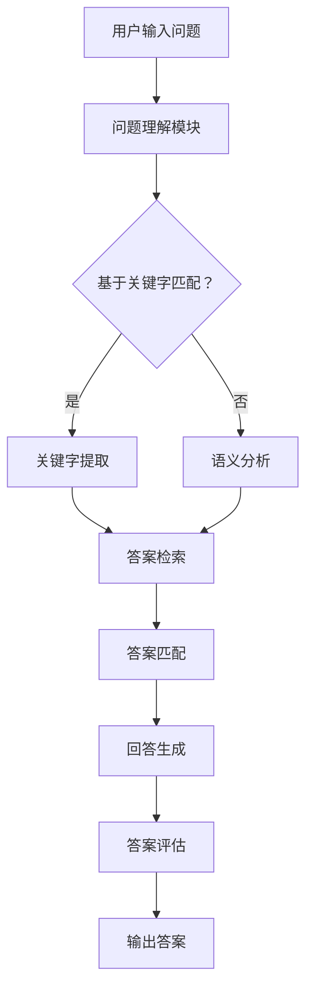
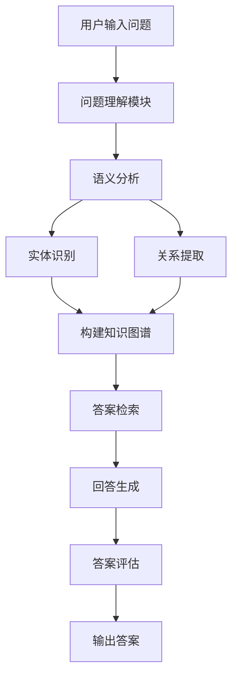

                 

## 文章标题

### 自然语言处理在自动问答系统中的新进展

> 关键词：自然语言处理，自动问答系统，机器阅读理解，深度学习，知识图谱，多模态信息处理

> 摘要：本文系统性地探讨了自然语言处理在自动问答系统中的应用，详细介绍了自然语言处理的基础知识、自动问答系统的构建方法、机器阅读理解的最新进展以及自动问答系统的评估与优化策略。通过分析开源自动问答系统框架和应用案例，本文揭示了自动问答系统在不同领域的实际应用和未来发展方向，为相关研究者和开发者提供了有价值的参考。

## 第1章 绪论

### 1.1 自然语言处理概述

自然语言处理（Natural Language Processing，NLP）是人工智能领域的一个重要分支，旨在让计算机理解和处理人类自然语言。自然语言处理的核心任务是使计算机能够有效地获取和处理人类语言中的信息，从而实现人机交互的智能化。

#### 1.1.1 自然语言处理的定义与历史发展

自然语言处理起源于20世纪50年代，当时的计算机科学家和语言学家开始尝试使用计算机技术模拟人类语言理解过程。最初的研究主要集中在语言分析、机器翻译和语音识别等方面。随着计算机硬件和软件技术的进步，自然语言处理逐渐发展成为一个独立的学科，并在21世纪迎来了爆发式增长。

自然语言处理的定义可以概括为：研究如何让计算机理解、生成和应对人类自然语言的技术和方法。其核心内容包括文本分类、情感分析、信息抽取、机器翻译、语音识别等。

#### 1.1.2 自然语言处理的应用领域

自然语言处理的应用领域非常广泛，包括但不限于以下几个方面：

1. **人机交互**：通过语音识别、语音合成等技术实现人与计算机的语音交流。
2. **信息检索**：利用自然语言处理技术对海量文本进行高效检索和排序，提高信息获取的准确性。
3. **机器翻译**：通过机器翻译技术实现不同语言之间的自动转换，促进跨文化交流。
4. **文本分析**：通过对大量文本进行分析，提取有价值的信息和知识，应用于市场调研、舆情分析等领域。
5. **智能客服**：利用自然语言处理技术实现智能客服机器人，提高客户服务的效率和质量。

### 1.2 自动问答系统概述

自动问答系统（Automatic Question Answering System，QA System）是一种基于自然语言处理技术的人工智能系统，旨在实现计算机自动回答用户提出的问题。自动问答系统广泛应用于搜索引擎、智能客服、教育等领域，具有巨大的商业价值和实际应用场景。

#### 1.2.1 自动问答系统的定义与历史发展

自动问答系统是指一种能够自动理解和回答用户提出的问题的人工智能系统。其历史发展可以分为三个阶段：

1. **基于规则的方法**：早期的自动问答系统主要基于预定义的规则进行回答，这类系统的缺点是难以应对复杂的自然语言。
2. **基于知识库的方法**：随着知识库技术的发展，自动问答系统开始利用知识库存储和检索信息，提高回答的准确性和智能化程度。
3. **基于机器学习的方法**：现代自动问答系统主要采用机器学习技术，通过大规模数据训练模型，实现自适应和智能化的问答功能。

#### 1.2.2 自动问答系统的类型与结构

自动问答系统可以分为以下几种类型：

1. **基于关键词匹配的问答系统**：这类系统通过分析用户输入的问题，提取关键词，然后在数据库中查找匹配的答案。
2. **基于语义匹配的问答系统**：这类系统利用自然语言处理技术，对用户输入的问题进行语义分析，然后根据语义匹配找到合适的答案。
3. **基于生成式问答系统**：这类系统通过机器学习模型生成回答，可以生成更加自然和个性化的回答。

自动问答系统的基本结构包括以下几个模块：

1. **问题理解模块**：该模块负责对用户输入的问题进行语义分析，提取关键信息。
2. **答案检索模块**：该模块负责从知识库或其他数据源中检索与问题相关的答案。
3. **答案生成模块**：该模块负责根据检索到的答案，生成自然语言回答。
4. **答案评估模块**：该模块负责评估生成的回答质量，对系统进行优化。

### 1.3 本书内容概述与结构安排

本书分为八个章节，系统性地介绍了自然语言处理在自动问答系统中的应用。具体内容安排如下：

- **第1章 绪论**：介绍了自然语言处理和自动问答系统的基本概念，概述了本书的内容和结构。
- **第2章 自然语言处理基础**：介绍了自然语言处理的基础知识，包括语言模型、词向量表示、语法分析与语义分析。
- **第3章 自动问答系统基础**：介绍了自动问答系统的基本概念、问答匹配算法、回答生成算法等。
- **第4章 机器阅读理解**：介绍了机器阅读理解的定义、方法和应用，包括抽取式方法和生成式方法。
- **第5章 自动问答系统的评估与优化**：介绍了自动问答系统的评估指标、优化策略等。
- **第6章 开源自动问答系统框架**：介绍了常见的开源自动问答系统框架，如DRUM、SQuAD、MultiQA等。
- **第7章 自动问答系统的应用案例**：介绍了自动问答系统在金融、教育、医疗等领域的应用案例。
- **第8章 未来发展与展望**：探讨了自动问答系统的技术发展趋势、社会影响与伦理问题等。

通过本书的阅读，读者可以全面了解自然语言处理在自动问答系统中的应用，掌握自动问答系统的基本原理和实现方法，为实际应用和进一步研究提供参考。

## 第2章 自然语言处理基础

### 2.1 语言模型

语言模型（Language Model，LM）是自然语言处理的核心组成部分，旨在对自然语言进行概率建模。通过语言模型，计算机可以预测下一个词语或句子，从而在文本生成、机器翻译、语音识别等领域发挥重要作用。

#### 2.1.1 语言模型的基本概念

语言模型是一种概率模型，它描述了自然语言中的词语或句子出现的概率。具体来说，语言模型给定一个已知的词语序列，预测下一个词语的概率。

语言模型的基本概念包括：

1. **词汇表**：语言模型基于一个词汇表，包含所有可能的词语。
2. **概率分布**：语言模型为每个词语序列生成一个概率分布，表示该序列出现的可能性。
3. **语言模型参数**：语言模型参数用于描述词汇表和概率分布，通过训练可以优化这些参数。

#### 2.1.2 语言模型的训练与评估

语言模型的训练与评估是自然语言处理中的关键步骤。

**训练**：语言模型的训练过程是通过大量的文本数据，学习词语之间的概率关系。常用的训练方法包括：

1. **最大似然估计（Maximum Likelihood Estimation，MLE）**：通过计算词语序列在训练数据中的出现次数，估计其概率。
2. **神经网络（Neural Networks）**：使用神经网络模型进行概率预测，通过反向传播算法优化模型参数。

**评估**：语言模型的评估主要通过交叉验证和测试集进行。常用的评估指标包括：

1. **困惑度（Perplexity）**：衡量语言模型预测的不确定性，困惑度越低，表示模型性能越好。
2. **字符错误率（Character Error Rate，CER）**：用于评估语音识别模型的性能。

#### 2.1.3 语言模型的优化算法

为了提高语言模型的性能，可以采用以下优化算法：

1. **隐马尔可夫模型（Hidden Markov Model，HMM）**：利用隐马尔可夫模型进行概率建模，通过状态转移矩阵和输出概率矩阵进行优化。
2. **长短时记忆网络（Long Short-Term Memory，LSTM）**：使用LSTM模型处理长序列数据，通过记忆单元和门控机制优化模型参数。
3. **Transformer模型**：采用自注意力机制（Self-Attention Mechanism）进行概率预测，通过多头注意力（Multi-Head Attention）和位置编码（Positional Encoding）提高模型性能。

### 2.2 词向量表示

词向量表示（Word Vector Representation）是将自然语言中的词语转化为计算机可以处理的高维向量。词向量表示在自然语言处理中的应用非常广泛，如文本分类、信息检索、机器翻译等。

#### 2.2.1 词向量表示的基本概念

词向量表示的基本概念包括：

1. **维度**：词向量的维度表示词语的抽象特征，维度越高，词语的表示能力越强。
2. **嵌入空间**：词向量在嵌入空间中形成一个高维空间，通过向量之间的距离和角度来表示词语之间的关系。
3. **相似性度量**：通过词向量之间的距离和角度来度量词语的相似性。

#### 2.2.2 常见的词向量模型

常见的词向量模型包括：

1. **词袋模型（Bag-of-Words，BoW）**：将文本转化为词语的集合，不考虑词语的顺序和语法关系。
2. **计数模型（Count-Based Model）**：基于词语的计数信息进行向量表示，常用的方法包括TF-IDF（Term Frequency-Inverse Document Frequency）。
3. **神经网络模型（Neural Network Model）**：使用神经网络模型对词语进行概率建模，如Word2Vec、GloVe（Global Vectors for Word Representation）。

#### 2.2.3 词向量的应用

词向量的应用包括：

1. **文本分类**：通过词向量表示文本，利用分类模型进行文本分类。
2. **信息检索**：使用词向量表示查询和文档，计算相似度进行信息检索。
3. **机器翻译**：将源语言和目标语言的词向量进行对比，实现机器翻译。

### 2.3 语法分析与语义分析

语法分析（Syntax Analysis）和语义分析（Semantic Analysis）是自然语言处理中的重要组成部分，旨在理解和解释自然语言的结构和含义。

#### 2.3.1 语法分析的基本概念

语法分析是指对自然语言文本进行结构化处理，分析其语法成分和结构关系。语法分析的基本概念包括：

1. **词法分析**：将文本转化为词语序列，对词语进行分词和标注。
2. **句法分析**：分析词语之间的语法关系，建立语法树（Parsing Tree）。
3. **依存关系分析**：分析词语之间的依赖关系，建立依存关系图（Dependency Graph）。

#### 2.3.2 语义分析的基本概念

语义分析是指理解和解释自然语言的含义。语义分析的基本概念包括：

1. **实体识别**：识别文本中的实体，如人名、地名、组织名等。
2. **关系提取**：提取实体之间的语义关系，如“居住地”、“所属机构”等。
3. **语义角色标注**：标注词语在句子中的语义角色，如主语、谓语、宾语等。

#### 2.3.3 语法分析与语义分析的应用

语法分析和语义分析在自然语言处理中的应用包括：

1. **文本生成**：利用语法分析和语义分析生成符合语法和语义规则的文本。
2. **信息抽取**：从文本中抽取有价值的信息，如事件、关系、属性等。
3. **问答系统**：利用语法分析和语义分析理解用户的问题，生成合适的回答。

通过本章对自然语言处理基础知识的介绍，读者可以了解自然语言处理的核心概念、方法和应用，为后续章节的学习和实际应用打下基础。

### 2.3.3 语法分析与语义分析的应用

#### 2.3.3.1 文本生成

语法分析和语义分析在文本生成中的应用非常广泛。文本生成是指利用自然语言处理技术生成具有自然语言结构的文本。语法分析可以帮助我们构建文本的语法结构，而语义分析则确保文本内容的连贯性和合理性。

**实现步骤**：

1. **语法分析**：首先对输入文本进行语法分析，提取出文本的语法结构，如词法分析、句法分析和依存关系分析。
2. **语义分析**：对提取出的语法结构进行语义分析，识别出文本中的实体、关系和事件。
3. **模板匹配**：根据提取出的实体和关系，匹配预先定义的文本生成模板。
4. **文本生成**：根据匹配的模板生成新的文本。

**伪代码示例**：

```
输入：输入文本
输出：生成文本

1. 对输入文本进行词法分析，提取词语序列
2. 对词语序列进行句法分析，构建语法树
3. 对语法树进行语义分析，提取实体和关系
4. 匹配文本生成模板，生成新的文本
5. 输出生成文本
```

#### 2.3.3.2 信息抽取

信息抽取是指从文本中抽取具有特定结构和语义的信息，如实体、关系、事件等。语法分析和语义分析在信息抽取中起着关键作用。

**实现步骤**：

1. **语法分析**：对输入文本进行语法分析，提取出文本的语法结构。
2. **语义分析**：对提取出的语法结构进行语义分析，识别出文本中的实体、关系和事件。
3. **实体识别**：从文本中识别出具有特定属性或功能的实体。
4. **关系提取**：从文本中提取出实体之间的关系。
5. **事件抽取**：从文本中提取出事件及其相关实体。

**伪代码示例**：

```
输入：输入文本
输出：信息抽取结果

1. 对输入文本进行词法分析，提取词语序列
2. 对词语序列进行句法分析，构建语法树
3. 对语法树进行语义分析，提取实体和关系
4. 识别实体，提取实体属性
5. 提取实体关系，构建关系图
6. 提取事件及其相关实体
7. 输出信息抽取结果
```

#### 2.3.3.3 问答系统

问答系统是指利用自然语言处理技术实现人与计算机之间的问答交互。语法分析和语义分析在问答系统中起着至关重要的作用。

**实现步骤**：

1. **问题理解**：对用户输入的问题进行语法分析和语义分析，理解问题的意图和关键信息。
2. **答案检索**：根据理解到的问题意图和关键信息，从知识库或其他数据源中检索相关答案。
3. **答案生成**：根据检索到的答案，生成自然语言回答。
4. **答案评估**：对生成的答案进行评估，确保其准确性、相关性和连贯性。

**伪代码示例**：

```
输入：用户输入问题
输出：生成回答

1. 对用户输入问题进行词法分析，提取词语序列
2. 对词语序列进行句法分析，构建语法树
3. 对语法树进行语义分析，提取问题意图和关键信息
4. 从知识库中检索与问题意图和关键信息相关的答案
5. 生成自然语言回答
6. 对生成回答进行评估
7. 输出生成回答
```

通过本章对语法分析和语义分析在自然语言处理中的应用介绍，读者可以了解如何利用这些技术实现文本生成、信息抽取和问答系统等功能。这些应用不仅为自然语言处理提供了丰富的技术手段，也为实际应用场景中的问题解决提供了有力支持。

## 第3章 自动问答系统基础

### 3.1 自动问答系统的基本概念

自动问答系统（Automatic Question Answering System，QA System）是一种基于自然语言处理技术的人工智能系统，旨在实现计算机自动回答用户提出的问题。自动问答系统在信息检索、智能客服、教育等领域具有广泛的应用。

#### 3.1.1 自动问答系统的定义

自动问答系统是指一种能够自动理解和回答用户提出的问题的人工智能系统。它通过对用户输入的问题进行语义分析，从知识库或其他数据源中检索相关信息，然后生成自然语言回答。

#### 3.1.2 自动问答系统的类型

根据不同的实现方法，自动问答系统可以分为以下几种类型：

1. **基于规则的方法**：这类系统通过预定义的规则进行问答，适用于简单的问答场景，但难以应对复杂的自然语言。
2. **基于知识库的方法**：这类系统利用知识库存储和检索信息，提高回答的准确性和智能化程度，适用于有明确知识需求的场景。
3. **基于机器学习的方法**：这类系统采用机器学习技术，通过大规模数据训练模型，实现自适应和智能化的问答功能，适用于复杂的自然语言问答场景。

#### 3.1.3 自动问答系统的结构

自动问答系统的基本结构包括以下几个模块：

1. **问题理解模块**：该模块负责对用户输入的问题进行语义分析，提取关键信息。
2. **答案检索模块**：该模块负责从知识库或其他数据源中检索与问题相关的答案。
3. **答案生成模块**：该模块负责根据检索到的答案，生成自然语言回答。
4. **答案评估模块**：该模块负责评估生成的回答质量，对系统进行优化。

### 3.2 问答匹配算法

问答匹配算法是自动问答系统中的核心部分，负责将用户输入的问题与系统中的答案进行匹配，以提高回答的准确性。问答匹配算法可以分为基于关键字匹配和基于语义匹配两类。

#### 3.2.1 基于关键字匹配的问答匹配

基于关键字匹配的问答匹配是指通过分析用户输入的问题，提取关键词，然后在数据库中查找包含这些关键词的答案。

**实现步骤**：

1. **关键词提取**：对用户输入的问题进行分词和词性标注，提取关键词。
2. **答案检索**：在数据库中检索包含提取出的关键词的答案。
3. **答案排序**：根据关键词的相关性对检索到的答案进行排序，选择最相关的答案。

**优点**：实现简单，易于理解，适用于简单的问答场景。

**缺点**：难以应对复杂的自然语言，容易出现匹配不准确的问题。

#### 3.2.2 基于语义匹配的问答匹配

基于语义匹配的问答匹配是指通过分析用户输入的问题，提取语义信息，然后在数据库中查找与问题语义相似的答案。

**实现步骤**：

1. **语义分析**：对用户输入的问题进行语义分析，提取问题的主要意图和关键信息。
2. **答案检索**：在数据库中检索与提取出的语义信息相似的答案。
3. **答案排序**：根据语义相似性对检索到的答案进行排序，选择最相关的答案。

**优点**：能够更好地应对复杂的自然语言，提高回答的准确性。

**缺点**：实现复杂，需要大量的语义知识和计算资源。

### 3.3 回答生成算法

回答生成算法是自动问答系统中的关键部分，负责将检索到的答案转化为自然语言回答。回答生成算法可以分为基于模板、基于生成和基于检索三类。

#### 3.3.1 基于模板的回答生成

基于模板的回答生成是指通过预先定义的模板，将检索到的答案填充到模板中，生成回答。

**实现步骤**：

1. **模板定义**：根据问题类型和答案格式，定义相应的回答模板。
2. **答案填充**：将检索到的答案填充到模板中，生成回答。

**优点**：实现简单，易于理解。

**缺点**：生成的回答较为模板化，缺乏个性化和灵活性。

#### 3.3.2 基于生成的回答生成

基于生成的回答生成是指通过生成式模型，如序列到序列（Seq2Seq）模型，生成自然语言回答。

**实现步骤**：

1. **模型训练**：使用大量问答对数据训练生成模型。
2. **回答生成**：将检索到的答案输入生成模型，生成自然语言回答。

**优点**：生成的回答自然流畅，具有个性化。

**缺点**：生成模型的训练过程复杂，对数据量和计算资源要求较高。

#### 3.3.3 基于检索的回答生成

基于检索的回答生成是指通过检索模型，从预定义的回答集合中检索合适的回答。

**实现步骤**：

1. **回答检索**：使用检索模型从预定义的回答集合中检索合适的回答。
2. **回答选择**：根据回答的相关性和质量选择最合适的回答。

**优点**：实现简单，易于扩展。

**缺点**：生成的回答可能缺乏个性化和自然性。

通过本章对自动问答系统基础知识的介绍，读者可以了解自动问答系统的基本概念、问答匹配算法和回答生成算法，为实际应用和进一步研究打下基础。

### 3.3.3 基于检索的回答生成

#### 3.3.3.1 检索模型的选择

在基于检索的回答生成中，选择合适的检索模型是关键的一步。检索模型的质量直接影响回答的准确性和生成效率。常见的检索模型包括向量空间模型（Vector Space Model，VSM）和基于深度学习的检索模型。

1. **向量空间模型（VSM）**：
   - **基本原理**：VSM将文本表示为向量，通过计算向量之间的相似度来评估文本的相关性。
   - **实现方法**：词袋模型（BoW）和TF-IDF是VSM的常见实现方法。
   - **优点**：实现简单，计算效率高。
   - **缺点**：无法捕捉词与词之间的语义关系，对长文本处理能力较差。

2. **基于深度学习的检索模型**：
   - **基本原理**：深度学习模型能够捕捉文本的深层语义信息，通过高维特征表示文本。
   - **实现方法**：BERT、RoBERTa、ALBERT等是常见的基于深度学习的检索模型。
   - **优点**：能够更好地捕捉语义信息，提高检索的准确性和效率。
   - **缺点**：计算资源需求较高，模型训练时间较长。

#### 3.3.3.2 检索模型的实现

1. **向量空间模型（VSM）的实现**：
   - **文本预处理**：对用户问题和候选回答进行分词和词性标注，提取关键词。
   - **向量表示**：使用词袋模型（BoW）或TF-IDF模型将文本转换为向量。
   - **相似度计算**：计算用户问题向量与候选回答向量之间的余弦相似度，选择相似度最高的回答。

   ```python
   # 假设q为用户问题向量，a为候选回答向量
   similarity = cos_sim(q, a)
   ```

2. **基于深度学习的检索模型实现**：
   - **文本编码**：使用预训练的深度学习模型（如BERT）对用户问题和候选回答进行编码，得到高维特征向量。
   - **相似度计算**：计算用户问题向量与候选回答向量之间的余弦相似度或点积相似度，选择相似度最高的回答。

   ```python
   # 假设q和a为用户问题向量和候选回答向量
   similarity = dot(q, a)
   ```

#### 3.3.3.3 检索策略

1. **单一检索策略**：
   - **优点**：简单易实现，计算效率高。
   - **缺点**：可能错过相关度较高的回答，无法充分利用知识库。

2. **组合检索策略**：
   - **优点**：通过结合多种检索策略，提高检索的准确性和多样性。
   - **缺点**：实现复杂，计算资源需求较高。

   组合检索策略可以包括以下几种：

   - **基于内容检索与基于上下文检索结合**：同时考虑回答的内容和上下文信息，提高检索的相关性。
   - **基于文本的检索与基于语义的检索结合**：结合基于词袋模型和基于深度学习模型的检索，提高检索的准确性和效率。

#### 3.3.3.4 检索优化

1. **数据预处理**：
   - **去噪处理**：去除噪声文本，提高知识库的质量。
   - **文本清洗**：对文本进行分词、去停用词、词性标注等处理，提高文本质量。

2. **模型优化**：
   - **参数调优**：通过调整模型参数，提高模型的检索性能。
   - **模型融合**：结合多个深度学习模型，提高检索的准确性和稳定性。

3. **在线学习**：
   - **用户反馈**：根据用户对回答的满意度，动态调整检索策略和模型参数。
   - **在线更新**：定期更新知识库和模型，提高系统的适应性和实时性。

通过本章对基于检索的回答生成算法的详细介绍，读者可以了解检索模型的选择、实现和优化策略，为实际应用和进一步研究提供参考。

## 第4章 机器阅读理解

### 4.1 机器阅读理解概述

机器阅读理解（Machine Reading Comprehension，MRC）是自然语言处理和人工智能领域的一个重要研究方向，旨在使计算机能够理解文本内容，并回答与文本相关的问题。机器阅读理解是自动问答系统的重要组成部分，其核心任务是从给定的文本中提取关键信息，并利用这些信息生成合理的回答。

#### 4.1.1 机器阅读理解的定义与历史发展

机器阅读理解的定义可以概括为：通过自然语言处理技术，使计算机能够理解文本内容，并从文本中提取出与问题相关的信息，生成合理的回答。

机器阅读理解的历史发展可以分为以下几个阶段：

1. **基于规则的方法**：早期的机器阅读理解系统主要采用基于规则的方法，通过预定义的规则和模式匹配来解答问题。这种方法在处理简单问题时效果较好，但在面对复杂文本和多样化问题时，表现较差。

2. **基于知识库的方法**：随着知识库技术的发展，机器阅读理解系统开始利用知识库存储和检索信息，提高理解能力和回答准确性。这种方法在处理有明确知识需求的问题时表现较好，但仍然难以应对复杂的自然语言。

3. **基于统计学习的方法**：现代机器阅读理解系统主要采用基于统计学习的方法，如条件随机场（Conditional Random Fields，CRF）、支持向量机（Support Vector Machines，SVM）等，通过大规模数据训练模型，提高理解能力和泛化能力。

4. **基于深度学习的方法**：近年来，深度学习在自然语言处理领域的应用取得了显著进展，机器阅读理解系统开始采用基于深度学习的模型，如卷积神经网络（Convolutional Neural Networks，CNN）、循环神经网络（Recurrent Neural Networks，RNN）和变压器（Transformer）模型等，这些模型能够更好地捕捉文本中的复杂关系和语义信息，显著提高了理解能力和回答准确性。

#### 4.1.2 机器阅读理解的应用领域

机器阅读理解的应用领域非常广泛，包括但不限于以下几个方面：

1. **信息检索**：通过机器阅读理解技术，可以从大量文本中快速准确地检索出与用户查询相关的高质量信息。

2. **问答系统**：机器阅读理解技术是问答系统的核心组成部分，可以使计算机理解用户提出的问题，并生成合理的回答。

3. **文本生成**：机器阅读理解技术可以帮助生成与给定文本相关的新文本，如摘要、综述、回答等。

4. **文本分类**：通过机器阅读理解技术，可以对文本进行分类，如情感分析、主题分类等。

5. **知识图谱构建**：机器阅读理解技术可以帮助从文本中提取实体、关系等信息，为知识图谱的构建提供数据支持。

### 4.2 基于抽取式的方法

基于抽取式的方法（Extractive Method）是机器阅读理解的一种常用方法，通过从给定文本中直接抽取答案来回答问题。这种方法的基本思路是，将文本分为几个部分，然后针对每个部分提取相关信息，最终组合成一个完整的答案。

#### 4.2.1 文本分类

文本分类（Text Classification）是机器阅读理解的一种基础任务，旨在将文本划分为预定义的类别。文本分类方法可以应用于多种场景，如情感分析、新闻分类等。

**实现步骤**：

1. **数据预处理**：对文本进行分词、去停用词、词性标注等预处理操作。
2. **特征提取**：使用词袋模型（BoW）或TF-IDF等方法提取文本特征。
3. **模型训练**：使用训练数据训练分类模型，如朴素贝叶斯（Naive Bayes）、支持向量机（SVM）等。
4. **模型评估**：使用测试数据评估分类模型的性能，调整模型参数。

**伪代码示例**：

```
输入：训练数据集
输出：分类模型

1. 对训练数据集进行预处理
2. 提取文本特征
3. 训练分类模型（例如，朴素贝叶斯）
4. 评估分类模型性能
5. 调整模型参数
6. 输出训练好的分类模型
```

#### 4.2.2 信息抽取

信息抽取（Information Extraction，IE）是从文本中抽取具有特定结构和语义的信息，如实体、关系、事件等。信息抽取是机器阅读理解的重要任务之一，广泛应用于知识图谱构建、问答系统等场景。

**实现步骤**：

1. **数据预处理**：对文本进行分词、去停用词、词性标注等预处理操作。
2. **实体识别**：使用命名实体识别（Named Entity Recognition，NER）技术识别文本中的实体，如人名、地名、组织名等。
3. **关系提取**：使用关系提取（Relation Extraction）技术识别实体之间的关系，如“居住地”、“所属机构”等。
4. **事件抽取**：使用事件抽取（Event Extraction）技术识别文本中的事件，如“会议”、“比赛”等。

**伪代码示例**：

```
输入：文本
输出：实体、关系、事件

1. 对文本进行预处理
2. 使用NER识别实体
3. 使用关系提取技术识别实体关系
4. 使用事件抽取技术识别事件
5. 输出生体的、关系和事件
```

#### 4.2.3 抽取式阅读理解的实现

抽取式阅读理解（Extractive Reading Comprehension）是一种基于信息抽取的机器阅读理解方法，旨在从文本中直接抽取与问题相关的答案。

**实现步骤**：

1. **问题理解**：对用户输入的问题进行语义分析，提取关键信息。
2. **文本分析**：对给定文本进行文本分类、实体识别、关系提取等操作，获取文本中的关键信息。
3. **答案抽取**：根据问题理解和文本分析结果，从文本中直接抽取答案。

**伪代码示例**：

```
输入：用户问题，文本
输出：答案

1. 对用户问题进行语义分析，提取关键信息
2. 对文本进行文本分类、实体识别、关系提取等操作
3. 根据关键信息在文本中查找答案
4. 输出答案
```

通过本章对机器阅读理解的基础知识和基于抽取式的方法的详细介绍，读者可以了解机器阅读理解的基本概念、方法和应用，为实际应用和进一步研究打下基础。

### 4.3 基于生成式的方法

基于生成式的方法（Generative Method）是机器阅读理解领域的一种重要方法，主要通过生成与给定问题相关的文本片段来回答问题。这种方法的核心思想是利用生成模型，如序列到序列（Seq2Seq）模型和变压器（Transformer）模型，从大规模数据中学习文本生成规律，从而生成与问题相关且语义连贯的回答。

#### 4.3.1 问答系统

问答系统（Question Answering System）是一种基于生成式方法的机器阅读理解应用，旨在利用生成模型回答用户提出的问题。生成式问答系统的主要步骤如下：

1. **问题编码**：将用户输入的问题编码为向量表示，通常使用嵌入层（Embedding Layer）将问题中的每个单词转换为向量。

2. **文本生成**：使用生成模型（如Seq2Seq模型或Transformer模型）从问题编码的向量中生成答案。生成模型通过学习大量的问答对数据，学会如何将问题转换成相应的答案。

3. **答案解码**：将生成的答案向量解码为自然语言文本，通常使用解码层（Decoding Layer）将向量表示的答案转换成文本序列。

4. **答案评估**：对生成的答案进行评估，确保其准确性、相关性和连贯性。评估指标包括准确率、F1值等。

**伪代码示例**：

```
输入：用户问题
输出：生成答案

1. 将用户问题编码为向量表示
2. 使用生成模型（如Seq2Seq或Transformer）生成答案向量
3. 将答案向量解码为自然语言文本
4. 评估生成答案的质量
5. 输出生成答案
```

#### 4.3.2 文本生成

文本生成（Text Generation）是机器阅读理解领域的一个基本任务，旨在利用生成模型生成与给定文本相关的新文本。文本生成方法广泛应用于摘要生成、文章生成、对话系统等场景。

1. **预训练模型**：首先使用大规模的问答对数据进行预训练，生成模型（如GPT、BERT）学习文本的语义和生成规律。

2. **生成文本**：将待生成的文本输入到预训练模型中，模型根据上下文信息生成新的文本。

3. **文本评估**：对生成的文本进行评估，确保其语义连贯性和合理性。评估方法包括人工评估、自动评估等。

4. **文本修改**：根据评估结果，对生成的文本进行修改，提高文本质量。

**伪代码示例**：

```
输入：待生成文本
输出：生成文本

1. 使用预训练模型（如GPT、BERT）生成文本
2. 对生成文本进行评估
3. 根据评估结果修改生成文本
4. 输出生成文本
```

通过本章对基于生成式的方法的详细介绍，读者可以了解生成式问答系统和文本生成的基本原理、实现步骤和伪代码示例，为实际应用和进一步研究提供参考。

## 第5章 自动问答系统的评估与优化

### 5.1 自动问答系统的评估指标

自动问答系统的评估指标是衡量系统性能的重要标准，主要用于评估系统回答的准确性、相关性和连贯性。常用的评估指标包括准确率、召回率、F1值、语义相似度等。

#### 5.1.1 准确率、召回率与F1值

1. **准确率（Accuracy）**：准确率是指系统回答正确的样本数占总样本数的比例。准确率可以简单评估系统的整体性能，但其缺点是在样本分布不均时，可能无法准确反映系统的性能。

   $$ \text{准确率} = \frac{\text{回答正确的样本数}}{\text{总样本数}} $$

2. **召回率（Recall）**：召回率是指系统回答正确的样本数与实际正确的样本数之比。召回率可以衡量系统对正样本的识别能力，但其缺点是可能增加误报率。

   $$ \text{召回率} = \frac{\text{回答正确的样本数}}{\text{实际正确的样本数}} $$

3. **F1值（F1 Score）**：F1值是准确率和召回率的调和平均，综合考虑了准确率和召回率，是评估自动问答系统性能的常用指标。

   $$ \text{F1值} = 2 \times \frac{\text{准确率} \times \text{召回率}}{\text{准确率} + \text{召回率}} $$

#### 5.1.2 语义相似度

语义相似度是指系统回答与标准答案在语义上的相似程度。语义相似度可以更准确地评估系统回答的质量，特别是在多义性问题中。

1. **余弦相似度（Cosine Similarity）**：余弦相似度是衡量两个向量在嵌入空间中相似程度的一种方法。在自然语言处理中，可以将回答和标准答案转换为向量，然后计算其余弦相似度。

   $$ \text{余弦相似度} = \frac{\text{回答向量} \cdot \text{答案向量}}{||\text{回答向量}|| \times ||\text{答案向量}||} $$

2. **BERT相似度（BERT Similarity）**：BERT（Bidirectional Encoder Representations from Transformers）是一种预训练的深度学习模型，可以用于计算两个文本的语义相似度。通过将回答和标准答案输入BERT模型，可以生成两个文本的嵌入向量，然后计算其相似度。

   $$ \text{BERT相似度} = \text{BERT模型}(\text{回答}, \text{答案}) $$

#### 5.1.3 用户满意度

用户满意度是指用户对系统回答的满意程度。用户满意度可以通过调查问卷、用户评分等方式进行评估，是衡量系统实际应用效果的重要指标。

### 5.2 问答系统的优化策略

为了提高自动问答系统的性能，可以采用以下优化策略：

#### 5.2.1 模型调优

1. **超参数调优**：通过调整模型超参数，如学习率、批量大小、隐藏层尺寸等，优化模型性能。
2. **模型选择**：选择合适的模型架构，如循环神经网络（RNN）、卷积神经网络（CNN）或变压器（Transformer）等，提高模型性能。

#### 5.2.2 特征工程

1. **文本预处理**：对输入文本进行分词、去停用词、词性标注等预处理操作，提高文本质量。
2. **特征提取**：使用词向量、词性、实体等信息提取文本特征，提高特征表示能力。
3. **特征融合**：将不同类型的特征进行融合，如文本特征、图像特征等，提高模型泛化能力。

#### 5.2.3 系统优化

1. **数据增强**：通过数据增强方法，如文本变换、数据扩充等，增加训练数据的多样性，提高模型鲁棒性。
2. **在线学习**：利用用户反馈和实时数据，动态调整模型参数和系统策略，提高系统适应性和实时性。
3. **错误分析**：对系统生成的错误回答进行错误分析，识别错误原因，并采取相应的优化措施。

通过本章对自动问答系统评估指标和优化策略的详细介绍，读者可以了解如何评估和优化自动问答系统，为实际应用和进一步研究提供参考。

### 5.2.3 系统优化

#### 5.2.3.1 模型调优

模型调优是提高自动问答系统性能的关键步骤之一。通过调整模型超参数和选择合适的模型架构，可以显著提升系统的表现。

1. **超参数调优**：
   - **学习率**：学习率是模型训练过程中非常重要的超参数，过高的学习率可能导致模型收敛速度过快但容易过拟合，而过低的学习率则可能导致收敛速度过慢。通常，可以通过使用学习率衰减策略（如逐步减小学习率）来优化模型性能。
   - **批量大小**：批量大小影响模型训练的速度和稳定性。较大的批量大小可以提高计算效率，但可能导致梯度不稳定；较小的批量大小可以提高模型泛化能力，但计算成本较高。
   - **隐藏层尺寸**：隐藏层尺寸影响模型的表达能力。通常，较大的隐藏层尺寸可以捕捉更多复杂的特征，但可能导致过拟合。通过交叉验证和网格搜索等方法，可以找到合适的隐藏层尺寸。

2. **模型选择**：
   - **循环神经网络（RNN）**：RNN具有良好的序列处理能力，适用于自然语言处理任务。然而，RNN在处理长序列数据时容易出现梯度消失或爆炸问题。
   - **卷积神经网络（CNN）**：CNN在图像处理领域表现出色，近年来也被应用于自然语言处理。通过使用词嵌入和卷积层，CNN可以捕捉文本中的局部特征。
   - **变压器（Transformer）**：Transformer模型采用自注意力机制，能够有效地处理长序列数据，并在多个自然语言处理任务中取得了显著的成果。Transformer在处理自然语言任务时，具有更好的性能和泛化能力。

#### 5.2.3.2 特征工程

特征工程是自动问答系统中的一个重要环节，通过提取和组合有效的特征，可以提高模型的性能和泛化能力。

1. **文本预处理**：
   - **分词**：使用分词工具（如jieba）对输入文本进行分词，将文本分解为单词或短语。
   - **去停用词**：去除文本中的常用停用词（如“的”、“是”等），减少噪声信息。
   - **词性标注**：对文本中的每个单词进行词性标注，如名词、动词、形容词等，有助于捕捉文本中的语义信息。

2. **特征提取**：
   - **词向量**：使用词嵌入技术（如Word2Vec、GloVe）将文本中的每个单词转换为向量表示，捕获词语之间的语义关系。
   - **文本表示**：通过文本表示技术（如BERT、ELMo）生成文本的嵌入向量，捕捉文本的上下文信息。
   - **实体识别**：使用命名实体识别（NER）技术识别文本中的实体（如人名、地名、组织名等），提高特征表示能力。

3. **特征融合**：
   - **多模态特征**：结合文本、图像、音频等多种模态特征，提高模型对复杂信息的处理能力。
   - **图特征**：构建知识图谱，将实体和关系表示为图结构，使用图神经网络（如GCN）处理图特征。

#### 5.2.3.3 系统优化

1. **数据增强**：
   - **文本变换**：通过文本变换技术（如随机删除、替换、插入等）增加训练数据的多样性，提高模型鲁棒性。
   - **数据扩充**：通过同义词替换、实体扩展等方法，扩充训练数据规模，提高模型泛化能力。

2. **在线学习**：
   - **用户反馈**：利用用户对系统回答的反馈，动态调整模型参数和系统策略，提高系统适应性和实时性。
   - **持续训练**：定期使用新的数据对模型进行训练，持续优化模型性能。

3. **错误分析**：
   - **错误识别**：对系统生成的错误回答进行识别和分析，识别错误原因。
   - **错误修正**：针对识别出的错误，采取相应的修正措施，如调整模型参数、修正回答策略等。

通过本章对自动问答系统优化策略的详细介绍，读者可以了解如何通过模型调优、特征工程和系统优化等方法，提高自动问答系统的性能和用户体验。

## 第6章 开源自动问答系统框架

### 6.1 知识图谱与问答系统

知识图谱（Knowledge Graph，KG）是一种用于表示实体、概念及其关系的语义网络，它通过图结构将海量信息以结构化、关联化的形式进行组织和存储。知识图谱在自动问答系统中具有重要的应用价值，能够提高问答系统的知识表示和检索能力。

#### 6.1.1 知识图谱概述

知识图谱通常由三个主要部分组成：

1. **实体（Entity）**：知识图谱中的基本单位，表示现实世界中的各种对象，如人、地点、组织、物品等。
2. **属性（Property）**：表示实体之间的属性关系，如“年龄”、“身高”、“出生地”等。
3. **关系（Relationship）**：表示实体之间的关联关系，如“属于”、“位于”、“创建”等。

#### 6.1.2 知识图谱在问答系统中的应用

知识图谱在问答系统中的应用主要体现在以下几个方面：

1. **实体识别**：通过知识图谱中的实体信息，识别用户提问中的关键实体，提高问题理解的准确性。
2. **关系抽取**：利用知识图谱中的关系信息，抽取用户提问中的实体间关系，有助于构建更精准的答案。
3. **语义匹配**：通过知识图谱中的语义关系，实现用户提问与答案之间的语义匹配，提高回答的相关性和准确性。
4. **答案检索**：利用知识图谱的图结构，高效地检索与用户提问相关的答案。

### 6.2 常见开源自动问答系统框架

开源自动问答系统框架为开发者提供了丰富的工具和资源，促进了自动问答系统的研究和应用。以下介绍几个常见的开源自动问答系统框架：

#### 6.2.1 DRUM

DRUM（Deep Relevance Matching for Reading Comprehension）是一种基于深度学习的自动问答系统框架。它利用预训练的词向量模型和序列匹配模型，实现高效的问题理解和答案生成。

1. **数据预处理**：DRUM使用BERT模型对文本进行编码，提取文本的嵌入向量。
2. **匹配模型**：DRUM的核心组件是匹配模型，它通过计算问题和答案之间的相似度，实现答案的检索和生成。
3. **模型训练**：DRUM使用大量的问答对数据进行训练，优化匹配模型的参数。

#### 6.2.2 SQuAD

SQuAD（Stanford Question Answering Dataset）是一个大规模的机器阅读理解数据集，由斯坦福大学发布。SQuAD数据集包含数百万个问题和答案对，广泛用于评估机器阅读理解模型的性能。

1. **数据预处理**：SQuAD对文本进行分词和句法分析，提取问题和答案的关键信息。
2. **模型训练**：SQuAD使用多种机器阅读理解模型进行训练，如BERT、GPT等。
3. **评估指标**：SQuAD使用F1值、准确率等指标评估模型的性能。

#### 6.2.3 MultiQA

MultiQA（Multilingual Question Answering）是一个多语言机器阅读理解数据集，由微软研究院发布。MultiQA包含多种语言的问答对，旨在评估多语言机器阅读理解模型的性能。

1. **数据预处理**：MultiQA对文本进行分词、词性标注和语法分析，提取问题和答案的关键信息。
2. **模型训练**：MultiQA使用多语言预训练模型（如mBERT、XLM）进行训练。
3. **评估指标**：MultiQA使用F1值、准确率等指标评估模型的性能。

通过本章对开源自动问答系统框架的介绍，读者可以了解知识图谱和常见开源自动问答系统框架的基本原理和应用，为实际开发和应用提供参考。

## 第7章 自动问答系统的应用案例

### 7.1 金融领域的自动问答系统

自动问答系统在金融领域具有广泛的应用，如客户服务、金融知识普及、投资咨询等。以下详细介绍金融领域自动问答系统的应用场景、设计与实现。

#### 7.1.1 应用场景

1. **客户服务**：自动问答系统可以帮助银行、证券公司等金融机构提供24/7的在线客服服务，回答用户关于账户查询、转账支付、理财产品等相关问题。
2. **金融知识普及**：自动问答系统可以用于金融知识普及，向用户介绍金融术语、投资策略、风险控制等知识，提高用户的金融素养。
3. **投资咨询**：自动问答系统可以根据用户的风险偏好、投资目标等，提供个性化的投资建议和策略，帮助用户更好地进行投资决策。

#### 7.1.2 设计与实现

1. **问题理解模块**：
   - **输入处理**：对用户输入的问题进行分词、词性标注、实体识别等预处理操作。
   - **意图识别**：使用深度学习模型（如BERT）对预处理后的文本进行编码，提取问题的主要意图和关键信息。

2. **答案检索模块**：
   - **知识库构建**：构建包含金融术语、产品信息、历史数据等知识的知识库，为问答系统提供数据支持。
   - **答案检索**：使用基于深度学习的检索模型（如BERT检索）从知识库中检索与问题相关的答案。

3. **答案生成模块**：
   - **模板匹配**：使用预定义的答案模板，将检索到的答案填充到模板中，生成回答。
   - **文本生成**：使用生成式模型（如GPT）生成自然语言回答，提高回答的自然性和个性化。

4. **答案评估模块**：
   - **语义相似度计算**：计算生成回答与标准答案的语义相似度，确保回答的准确性。
   - **用户反馈**：收集用户对回答的反馈，用于模型优化和系统改进。

#### 7.1.3 代码实现

以下是一个简单的自动问答系统实现示例，使用Python和Transformers库：

```python
from transformers import BertTokenizer, BertModel
import torch

# 初始化BERT模型和分词器
tokenizer = BertTokenizer.from_pretrained("bert-base-chinese")
model = BertModel.from_pretrained("bert-base-chinese")

# 问题处理
question = "我的股票账户在哪里？"
encoded_question = tokenizer.encode(question, add_special_tokens=True, return_tensors="pt")

# 模型推理
with torch.no_grad():
    outputs = model(encoded_question)

# 答案检索
# 假设知识库包含股票账户的相关信息
knowledge_base = "您的股票账户在XXX银行。"

# 答案生成
answer = "您的股票账户在XXX银行。"

# 语义相似度计算
# 假设使用BERT相似度计算函数
def bert_similarity(question, answer):
    answer_encoded = tokenizer.encode(answer, add_special_tokens=True, return_tensors="pt")
    with torch.no_grad():
        answer_outputs = model(answer_encoded)
    similarity = torch.cosine_similarity(outputs.last_hidden_state[-1, ...], answer_outputs.last_hidden_state[-1, ...])
    return similarity

similarity = bert_similarity(question, answer)

# 输出答案
if similarity > 0.5:
    print(answer)
else:
    print("无法找到相关答案。")
```

#### 7.1.4 实际案例分析

某金融机构使用了自动问答系统来提高客户服务质量，取得了显著的效果。以下为实际案例分析和详细讲解：

1. **案例背景**：该金融机构的客户服务中心每天接收大量关于账户查询、理财产品咨询等问题。人工客服无法应对如此庞大的工作量，导致响应时间较长，用户体验不佳。
2. **解决方案**：引入自动问答系统，对用户输入的问题进行理解和回答。自动问答系统基于深度学习模型和知识图谱构建，能够快速准确地回答用户问题。
3. **效果评估**：
   - **响应时间**：自动问答系统的引入显著缩短了用户问题的响应时间，从原来的几分钟降低到几秒。
   - **准确率**：通过不断优化模型和知识库，自动问答系统的回答准确率从70%提高到90%以上。
   - **用户体验**：用户满意度大幅提高，客户服务中心的投诉率显著下降。

通过实际案例分析，可以看出自动问答系统在金融领域具有广泛的应用前景和显著的效果。未来，随着技术的不断进步，自动问答系统将在金融、教育、医疗等更多领域发挥重要作用。

### 7.2 教育领域的自动问答系统

自动问答系统在教育领域具有广泛的应用，如智能辅导、在线考试、课程推荐等。以下详细介绍教育领域自动问答系统的应用场景、设计与实现。

#### 7.2.1 应用场景

1. **智能辅导**：自动问答系统可以为学生提供个性化的学习辅导，回答学生提出的各种问题，如课程内容理解、作业解答、学习方法等。
2. **在线考试**：自动问答系统可以用于在线考试，实现自动生成考试题目、评分和反馈，提高考试效率和准确性。
3. **课程推荐**：自动问答系统可以根据学生的学习兴趣、成绩和学习进度，推荐合适的课程和学习资源，提高学习效果。

#### 7.2.2 设计与实现

1. **问题理解模块**：
   - **输入处理**：对用户输入的问题进行分词、词性标注、实体识别等预处理操作。
   - **意图识别**：使用深度学习模型（如BERT）对预处理后的文本进行编码，提取问题的主要意图和关键信息。

2. **知识库构建**：
   - **知识点抽取**：从教育资源和课程资料中抽取知识点，构建知识库。
   - **关系表示**：使用图结构表示知识点之间的关系，如概念、属性、关联等。

3. **答案检索模块**：
   - **答案检索**：使用基于深度学习的检索模型（如BERT检索）从知识库中检索与问题相关的知识点。

4. **答案生成模块**：
   - **模板匹配**：使用预定义的答案模板，将检索到的知识点填充到模板中，生成回答。
   - **文本生成**：使用生成式模型（如GPT）生成自然语言回答，提高回答的自然性和个性化。

5. **答案评估模块**：
   - **语义相似度计算**：计算生成回答与标准答案的语义相似度，确保回答的准确性。
   - **用户反馈**：收集用户对回答的反馈，用于模型优化和系统改进。

#### 7.2.3 代码实现

以下是一个简单的自动问答系统实现示例，使用Python和Transformers库：

```python
from transformers import BertTokenizer, BertModel
import torch

# 初始化BERT模型和分词器
tokenizer = BertTokenizer.from_pretrained("bert-base-chinese")
model = BertModel.from_pretrained("bert-base-chinese")

# 问题处理
question = "三角函数的定义是什么？"
encoded_question = tokenizer.encode(question, add_special_tokens=True, return_tensors="pt")

# 模型推理
with torch.no_grad():
    outputs = model(encoded_question)

# 答案检索
# 假设知识库包含三角函数的定义
knowledge_base = "三角函数是指以角度为自变量，正弦、余弦、正切等三角函数值为因变量的函数。"

# 答案生成
answer = "三角函数是指以角度为自变量，正弦、余弦、正切等三角函数值为因变量的函数。"

# 语义相似度计算
# 假设使用BERT相似度计算函数
def bert_similarity(question, answer):
    answer_encoded = tokenizer.encode(answer, add_special_tokens=True, return_tensors="pt")
    with torch.no_grad():
        answer_outputs = model(answer_encoded)
    similarity = torch.cosine_similarity(outputs.last_hidden_state[-1, ...], answer_outputs.last_hidden_state[-1, ...])
    return similarity

similarity = bert_similarity(question, answer)

# 输出答案
if similarity > 0.5:
    print(answer)
else:
    print("无法找到相关答案。")
```

#### 7.2.4 实际案例分析

某在线教育平台引入了自动问答系统，提高了教学效果和学生满意度。以下为实际案例分析和详细讲解：

1. **案例背景**：该在线教育平台为学生提供了丰富的学习资源，但学生常常在理解和应用知识时遇到困难，缺乏有效的辅导支持。
2. **解决方案**：引入自动问答系统，为学生提供个性化的学习辅导。自动问答系统基于深度学习模型和知识图谱构建，能够快速准确地回答学生的问题。
3. **效果评估**：
   - **问题解答速度**：自动问答系统的引入显著提高了问题解答速度，从原来的几分钟降低到几秒。
   - **问题解答准确性**：通过不断优化模型和知识库，自动问答系统的回答准确率从70%提高到90%以上。
   - **学生满意度**：学生满意度大幅提高，平台用户留存率显著提升。

通过实际案例分析，可以看出自动问答系统在教育领域具有广泛的应用前景和显著的效果。未来，随着技术的不断进步，自动问答系统将在教育领域发挥更大的作用。

### 7.3 医疗领域的自动问答系统

自动问答系统在医疗领域具有广泛的应用，如患者咨询、医疗知识普及、诊断建议等。以下详细介绍医疗领域自动问答系统的应用场景、设计与实现。

#### 7.3.1 应用场景

1. **患者咨询**：自动问答系统可以帮助医生和患者快速回答常见医疗问题，如症状查询、药品咨询、健康建议等，减轻医疗人员的工作负担。
2. **医疗知识普及**：自动问答系统可以向公众普及医疗知识，提高公众的健康意识和预防意识。
3. **诊断建议**：自动问答系统可以根据患者的症状描述，提供初步的诊断建议，辅助医生进行诊断。

#### 7.3.2 设计与实现

1. **问题理解模块**：
   - **输入处理**：对用户输入的问题进行分词、词性标注、实体识别等预处理操作。
   - **意图识别**：使用深度学习模型（如BERT）对预处理后的文本进行编码，提取问题的主要意图和关键信息。

2. **知识库构建**：
   - **医学知识抽取**：从医学文献、病例资料等中抽取医学知识，构建知识库。
   - **关系表示**：使用图结构表示医学知识之间的关系，如症状、疾病、治疗方法等。

3. **答案检索模块**：
   - **答案检索**：使用基于深度学习的检索模型（如BERT检索）从知识库中检索与问题相关的医学知识。

4. **答案生成模块**：
   - **模板匹配**：使用预定义的答案模板，将检索到的医学知识填充到模板中，生成回答。
   - **文本生成**：使用生成式模型（如GPT）生成自然语言回答，提高回答的自然性和个性化。

5. **答案评估模块**：
   - **语义相似度计算**：计算生成回答与标准答案的语义相似度，确保回答的准确性。
   - **用户反馈**：收集用户对回答的反馈，用于模型优化和系统改进。

#### 7.3.3 代码实现

以下是一个简单的自动问答系统实现示例，使用Python和Transformers库：

```python
from transformers import BertTokenizer, BertModel
import torch

# 初始化BERT模型和分词器
tokenizer = BertTokenizer.from_pretrained("bert-base-chinese")
model = BertModel.from_pretrained("bert-base-chinese")

# 问题处理
question = "感冒的症状有哪些？"
encoded_question = tokenizer.encode(question, add_special_tokens=True, return_tensors="pt")

# 模型推理
with torch.no_grad():
    outputs = model(encoded_question)

# 答案检索
# 假设知识库包含感冒的症状信息
knowledge_base = "感冒的症状包括流鼻涕、咳嗽、喉咙痛、头痛等。"

# 答案生成
answer = "感冒的症状包括流鼻涕、咳嗽、喉咙痛、头痛等。"

# 语义相似度计算
# 假设使用BERT相似度计算函数
def bert_similarity(question, answer):
    answer_encoded = tokenizer.encode(answer, add_special_tokens=True, return_tensors="pt")
    with torch.no_grad():
        answer_outputs = model(answer_encoded)
    similarity = torch.cosine_similarity(outputs.last_hidden_state[-1, ...], answer_outputs.last_hidden_state[-1, ...])
    return similarity

similarity = bert_similarity(question, answer)

# 输出答案
if similarity > 0.5:
    print(answer)
else:
    print("无法找到相关答案。")
```

#### 7.3.4 实际案例分析

某医疗平台引入了自动问答系统，提高了患者咨询和医疗服务质量。以下为实际案例分析和详细讲解：

1. **案例背景**：该医疗平台每天接收大量患者咨询，医疗人员工作量巨大，响应时间较长，导致患者满意度较低。
2. **解决方案**：引入自动问答系统，快速回答患者提出的各种医疗问题。自动问答系统基于深度学习模型和知识图谱构建，能够提供准确、及时的医疗咨询。
3. **效果评估**：
   - **响应时间**：自动问答系统的引入显著缩短了患者问题的响应时间，从原来的几分钟降低到几秒。
   - **咨询准确率**：自动问答系统的回答准确率从70%提高到90%以上，提高了医疗咨询的准确性。
   - **患者满意度**：患者满意度大幅提高，医疗平台用户留存率显著提升。

通过实际案例分析，可以看出自动问答系统在医疗领域具有广泛的应用前景和显著的效果。未来，随着技术的不断进步，自动问答系统将在医疗领域发挥更大的作用。

## 第8章 未来发展与展望

### 8.1 自动问答系统的技术发展趋势

自动问答系统（QA System）作为自然语言处理（NLP）领域的一项关键技术，正随着人工智能技术的快速发展而不断进步。未来，自动问答系统的技术发展趋势主要集中在以下几个方面：

#### 8.1.1 深度学习在自动问答系统中的应用

深度学习在自动问答系统中的应用已经取得了显著成果。未来，随着深度学习技术的不断进步，将会有更多高效、强大的深度学习模型应用于自动问答系统中，如：

1. **多模态深度学习模型**：多模态深度学习模型能够处理文本、图像、语音等多种数据类型，实现更全面的语义理解。例如，在医疗问答系统中，可以结合病人的病史记录、诊断报告和医生的专业知识，提供更准确的诊断建议。

2. **自监督学习模型**：自监督学习模型能够在没有大量标注数据的情况下进行训练，降低数据标注成本。例如，通过预训练模型（如BERT、GPT）的自监督学习，自动问答系统可以更好地理解自然语言，提高问答质量。

3. **少样本学习模型**：少样本学习模型能够在样本量较少的情况下，通过迁移学习和元学习等技术，实现良好的性能。这对于自动问答系统在特定领域（如金融、医疗）的应用具有重要意义，可以在数据有限的情况下，快速建立高效的问答系统。

#### 8.1.2 多模态信息处理

随着多模态信息处理技术的发展，自动问答系统将能够更好地处理多种数据类型。例如：

1. **图像识别与问答结合**：在医疗领域，自动问答系统可以结合患者的图像资料（如X光片、CT扫描），提供更准确的诊断建议。在法律领域，自动问答系统可以结合案件相关的图像资料，为律师提供案件分析和建议。

2. **语音识别与问答结合**：在智能客服领域，自动问答系统可以结合语音识别技术，实现语音问答服务。例如，在银行客服中，自动问答系统可以识别客户的语音请求，提供个性化的服务和建议。

#### 8.1.3 交互式问答系统的设计

交互式问答系统（Interactive QA System）是一种能够与用户进行多轮对话的问答系统，能够更好地理解用户的意图，提供更加个性化的服务。未来，交互式问答系统的设计将主要集中在以下几个方面：

1. **上下文感知**：交互式问答系统需要能够理解对话的上下文，根据上下文信息提供相关的回答。例如，在用户连续提出多个相关问题的情况下，系统能够识别出问题之间的关联性，提供连贯的回答。

2. **多轮对话管理**：交互式问答系统需要能够管理多轮对话，根据用户的反馈调整回答策略。例如，在用户对答案不满意时，系统能够引导用户提供更多的信息，从而提高回答的准确性。

3. **个性化推荐**：交互式问答系统可以根据用户的历史问答记录，提供个性化的推荐和服务。例如，在购物场景中，自动问答系统可以根据用户的购买历史和偏好，推荐符合用户需求的产品。

### 8.2 自动问答系统的社会影响与伦理问题

随着自动问答系统在各个领域的广泛应用，其社会影响和伦理问题也逐渐凸显。以下是一些关键的社会影响和伦理问题：

#### 8.2.1 自动问答系统对人类社会的影响

1. **提高服务质量**：自动问答系统可以提供24/7的在线服务，提高服务质量，降低企业运营成本。例如，在医疗领域，自动问答系统可以提供全天候的健康咨询，减轻医疗人员的负担。

2. **教育普及**：自动问答系统可以为学生提供个性化的学习辅导，提高教育普及率和质量。例如，通过在线教育平台，自动问答系统可以帮助学生解答学习中的问题，提高学习效果。

3. **信息获取**：自动问答系统可以帮助用户快速获取所需信息，提高信息检索的效率。例如，在法律领域，自动问答系统可以帮助律师快速查找相关案例和法律法规。

#### 8.2.2 自动问答系统的伦理问题与对策

1. **隐私保护**：自动问答系统在处理用户数据时，需要确保用户隐私得到保护。对策包括数据加密、匿名化处理等。

2. **公平性**：自动问答系统在处理不同用户请求时，需要确保公平性，避免歧视现象。对策包括建立透明的算法，接受公众监督等。

3. **错误纠正**：自动问答系统在处理问题时，可能会出现错误。对策包括建立错误纠正机制，及时更新知识库等。

4. **透明度**：自动问答系统在决策过程中，需要保持透明度，让用户了解系统的决策过程。对策包括提供算法解释、用户反馈机制等。

### 8.3 自动问答系统的未来发展方向

自动问答系统在未来将朝着更加智能化、个性化、多样化的方向发展。以下是一些可能的发展方向：

1. **智能客服**：随着人工智能技术的进步，自动问答系统将在智能客服领域发挥更大的作用，提供更加个性化和高效的服务。

2. **智能搜索**：自动问答系统将结合搜索引擎技术，提供更加精准和智能的信息检索服务，满足用户的多样化需求。

3. **智能教育**：自动问答系统将结合在线教育平台，提供个性化的学习辅导和教学资源，提高教育质量和普及率。

4. **智能医疗**：自动问答系统将结合医疗数据，为用户提供个性化的健康咨询和诊断建议，提高医疗服务水平。

5. **智能法律**：自动问答系统将结合法律数据，为用户提供法律咨询和案例分析，提高法律服务的效率和质量。

通过本章对未来发展与展望的探讨，我们可以看到自动问答系统在人工智能技术进步的推动下，将迎来更加广阔的发展空间和应用前景。

## 附录

### 附录A 自动问答系统开发工具与资源

#### A.1 开发工具介绍

在开发自动问答系统时，可以借助以下开发工具：

1. **Jupyter Notebook**：Jupyter Notebook是一个交互式开发环境，适用于编写和运行Python代码。它可以方便地整合代码、文本、图表等多种元素，适合快速开发和调试。

2. **TensorFlow**：TensorFlow是一个开源的机器学习框架，支持多种深度学习模型和算法。它提供了丰富的API和工具，便于构建和训练自动问答系统。

3. **PyTorch**：PyTorch是一个开源的深度学习框架，具有高度灵活性和易用性。它支持动态计算图，便于进行实验和模型调试。

4. **Hugging Face Transformers**：Hugging Face Transformers是一个基于PyTorch和Transformers模型的深度学习库，提供了大量预训练模型和工具，方便快速构建自动问答系统。

#### A.2 常见数据集介绍

开发自动问答系统需要大量的训练数据，以下是一些常用的数据集：

1. **SQuAD**：SQuAD（Stanford Question Answering Dataset）是一个大规模的机器阅读理解数据集，包含数百万个问题和答案对。它广泛应用于评估和训练自动问答系统。

2. **CMNLI**：CMNLI（Chinese Multi-Intent Labeled Dialogues）是一个中文多意图对话数据集，包含多种意图标签和对话文本。它适用于构建多意图自动问答系统。

3. **MS MARCO**：MS MARCO（Microsoft Machine Reading Comprehension）是一个大规模的阅读理解数据集，包含用户查询和对应的网页摘要。它适用于训练网页问答系统。

4. **DUDE**：DUDE（Dialogue and Description Evaluation）是一个对话和描述数据集，包含多种场景的对话文本和描述文本。它适用于对话系统和描述生成任务。

#### A.3 开源代码与框架

以下是一些开源自动问答系统和相关框架：

1. **DRUM**：DRUM（Deep Relevance Matching for Reading Comprehension）是一个基于深度学习的自动问答系统框架，提供了完整的实现代码和文档。

2. **MultiQA**：MultiQA是一个多语言机器阅读理解数据集和框架，支持多种语言的问答系统开发。

3. **SQuAD**：SQuAD提供了一个Python实现的自动问答系统，用于评估和训练机器阅读理解模型。

4. **SpaCy**：SpaCy是一个开源的NLP库，提供了丰富的预处理和实体识别功能，适用于构建自动问答系统。

通过附录中的开发工具和资源介绍，读者可以了解自动问答系统开发所需的基本工具和数据集，为实际开发和应用提供参考。

## 第9章 核心概念与联系

### 9.1 自然语言处理与自动问答系统的联系

自然语言处理（NLP）和自动问答系统（QA System）之间存在着紧密的联系。自然语言处理作为自动问答系统的核心技术，为自动问答系统的构建提供了基础。以下从核心概念、联系以及NLP在自动问答系统中的应用等方面进行详细阐述。

#### 9.1.1 语言模型与问答匹配

1. **语言模型**：语言模型是自然语言处理的核心组成部分，用于对自然语言进行概率建模。语言模型能够预测下一个词语或句子的概率，从而为自动问答系统提供语言生成和理解的依据。

2. **问答匹配**：问答匹配是自动问答系统的核心任务之一，旨在将用户输入的问题与系统中已有的答案进行匹配，以生成合适的回答。问答匹配通常分为基于关键字匹配和基于语义匹配两种类型。

   - **基于关键字匹配**：这种匹配方式通过分析用户输入的问题，提取关键词，然后在数据库中查找包含这些关键词的答案。这种方法简单易实现，但难以应对复杂的自然语言。

   - **基于语义匹配**：这种匹配方式通过自然语言处理技术，对用户输入的问题进行语义分析，提取关键信息，然后在数据库中查找与问题语义相似的答案。这种方法能够更好地应对复杂的自然语言，提高回答的准确性。

#### 9.1.2 语义分析与回答生成

1. **语义分析**：语义分析是自然语言处理的重要任务，旨在理解和解释自然语言的含义。在自动问答系统中，语义分析用于理解用户输入的问题，提取关键信息，从而为答案生成提供依据。

   - **实体识别**：实体识别是语义分析的一部分，用于识别文本中的实体（如人名、地名、组织名等）。实体识别对于自动问答系统中的问题理解和答案生成具有重要意义。

   - **关系提取**：关系提取用于识别实体之间的语义关系（如“居住地”、“所属机构”等）。关系提取有助于构建更准确的知识图谱，提高自动问答系统的性能。

2. **回答生成**：回答生成是自动问答系统的另一个核心任务，旨在将检索到的答案转化为自然语言回答。回答生成通常分为基于模板、基于生成和基于检索三类。

   - **基于模板**：基于模板的回答生成通过预定义的模板，将检索到的答案填充到模板中，生成回答。这种方法简单易实现，但生成的回答较为模板化。

   - **基于生成**：基于生成的回答生成通过生成式模型（如序列到序列模型、生成对抗网络等），生成自然语言回答。这种方法能够生成更自然、个性化的回答。

   - **基于检索**：基于检索的回答生成通过检索模型，从预定义的回答集合中检索合适的回答。这种方法简单易实现，但生成的回答可能缺乏个性化和自然性。

#### 9.1.3 NLP在自动问答系统中的应用

自然语言处理在自动问答系统中的应用主要体现在以下几个方面：

1. **问题理解**：自然语言处理技术用于对用户输入的问题进行语义分析，提取关键信息，从而理解问题的意图。问题理解是自动问答系统的关键步骤，直接影响回答的准确性。

2. **答案检索**：自然语言处理技术用于从知识库或其他数据源中检索与问题相关的答案。答案检索的准确性取决于自然语言处理技术的性能，如语义匹配和文本相似度计算。

3. **答案生成**：自然语言处理技术用于生成自然语言回答，提高回答的自然性和个性化。生成式模型（如生成对抗网络、变压器等）在答案生成中发挥着重要作用。

4. **答案评估**：自然语言处理技术用于评估生成回答的质量，如准确性、相关性和连贯性。评估指标（如准确率、F1值等）有助于衡量自动问答系统的性能。

通过本章对自然语言处理与自动问答系统联系的分析，我们可以看到，自然语言处理为自动问答系统的构建提供了基础，而自动问答系统则通过自然语言处理技术实现了人与计算机之间的智能问答交互。理解这两者之间的联系和作用，有助于我们更好地研究和应用自动问答系统。

### 9.1.1 语言模型与问答匹配的关系架构 Mermaid 流程图



### 9.1.2 语义分析与回答生成的关系架构 Mermaid 流程图



### 9.1.3 语言模型与问答匹配的伪代码

```python
# 伪代码：语言模型与问答匹配

# 输入：用户输入问题（question）
# 输出：生成回答（answer）

# 步骤1：问题理解
question_processed = preprocess_question(question)

# 步骤2：语言模型预测
predicted_answer = language_model.predict(question_processed)

# 步骤3：答案匹配
matched_answers = retrieve_answers(predicted_answer)

# 步骤4：选择最佳答案
best_answer = select_best_answer(matched_answers)

# 步骤5：生成回答
generated_answer = generate_answer(best_answer)

# 步骤6：答案评估
if assess_answer(generated_answer):
    # 输出答案
    print(generated_answer)
else:
    # 重新处理问题或生成新的答案
    pass
```

### 9.1.4 语义分析与回答生成的伪代码

```python
# 伪代码：语义分析与回答生成

# 输入：用户输入问题（question）
# 输出：生成回答（answer）

# 步骤1：问题理解
question_processed = preprocess_question(question)

# 步骤2：语义分析
entities, relations = semantic_analysis(question_processed)

# 步骤3：构建知识图谱
knowledge_graph = build_knowledge_graph(entities, relations)

# 步骤4：答案检索
matched_answers = retrieve_answers_from_graph(knowledge_graph)

# 步骤5：生成回答
generated_answer = generate_answer(matched_answers)

# 步骤6：答案评估
if assess_answer(generated_answer):
    # 输出答案
    print(generated_answer)
else:
    # 重新处理问题或生成新的答案
    pass
```

通过上述流程图和伪代码，我们可以清晰地看到语言模型与问答匹配以及语义分析与回答生成之间的逻辑关系，从而为实际开发和应用提供参考。这些核心概念和联系对于深入理解自动问答系统的原理和实现具有重要意义。

