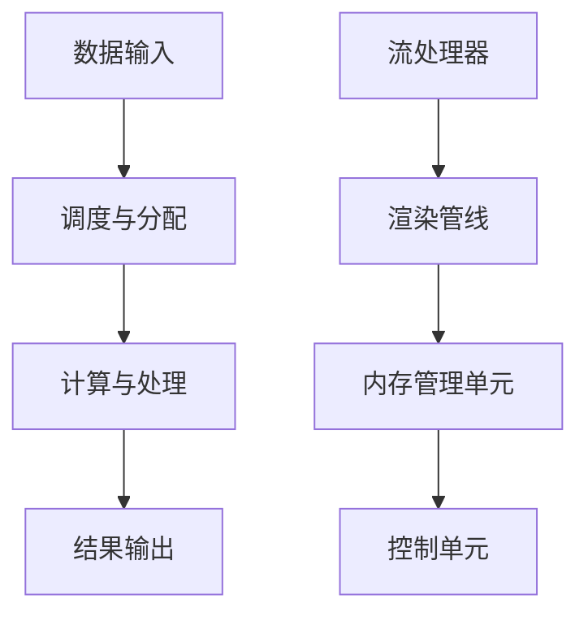

                 

### 第一部分: 英伟达2025社招GPU架构师编程挑战赛题目概述

#### 摘要

本文旨在深入探讨英伟达2025年社招GPU架构师编程挑战赛的主题、目的、意义以及具体要求。通过介绍英伟达公司的背景，本次编程挑战赛的背景与目标，GPU架构基础知识以及具体的编程挑战赛题目，本文旨在为读者提供一份全面的技术指南，帮助理解和准备这次重要的编程挑战赛。

#### 第1章: 挑战赛背景与目标

##### 1.1 英伟达公司简介

**公司历史与成就**

英伟达（NVIDIA）成立于1993年，总部位于美国加利福尼亚州圣克拉拉。作为全球领先的技术公司之一，英伟达在图形处理单元（GPU）领域取得了显著的成就。公司自成立以来，通过不断的技术创新和研发，已经成为图形处理和计算领域的佼佼者。

- **1999年**：发布GeForce 256显卡，开启图形处理单元革命。
- **2006年**：发布CUDA架构，引领并行计算的新时代。
- **2012年**：发布Kepler架构，实现更高的计算性能和能效比。
- **2018年**：发布Turing架构，将AI计算引入GPU领域。

**社招GPU架构师的重要性**

在英伟达，GPU架构师承担着关键的角色。他们不仅需要深入了解GPU的工作原理和架构，还需要具备软件开发和优化技能，以确保GPU能够在各种应用中发挥最佳性能。社招GPU架构师对于公司的发展至关重要，因为他们能够为公司带来新鲜的技术观点和经验，推动技术的进步和创新。

**2025年编程挑战赛的背景**

2025年，英伟达决定举办一场面向全球的社招GPU架构师的编程挑战赛，旨在筛选和培养具有卓越技术能力和创新精神的人才。这次挑战赛不仅是对参赛者技术实力的考验，也是对英伟达招聘和人才培养策略的一次重要尝试。

**目的和意义**

- **人才选拔**：通过编程挑战赛，英伟达能够发现和吸引全球范围内优秀的GPU架构师人才。
- **技术交流**：参赛者将有机会与英伟达的专家和同行进行深入的交流和互动，分享技术心得和经验。
- **技术创新**：挑战赛将推动GPU技术的创新和发展，加速GPU在各个领域的应用和普及。
- **品牌提升**：举办这样的挑战赛有助于提升英伟达在技术社区和行业内的声誉和影响力。

##### 1.2 挑战赛的目标与要求

**目标群体**

本次编程挑战赛的目标群体是那些具备以下条件的GPU架构师：

- **学历要求**：本科及以上学历，计算机科学、电子工程等相关专业。
- **工作经验**：至少3年GPU架构或相关领域的工作经验。
- **技能要求**：熟悉CUDA编程、GPU架构原理、并行计算等关键技术。

**比赛内容**

比赛内容将围绕GPU架构设计和优化展开，参赛者需要解决一系列复杂的技术问题，包括但不限于：

- **GPU架构设计**：设计高效、可扩展的GPU架构，满足特定应用需求。
- **性能优化**：对现有GPU架构进行性能优化，提高计算效率和能效比。
- **算法实现**：使用CUDA编程实现高效的GPU算法，解决特定问题。

**时间安排**

- **报名时间**：2025年1月1日至2025年3月1日。
- **作品提交时间**：2025年3月15日至2025年6月30日。
- **评审时间**：2025年7月1日至2025年9月30日。
- **公布结果时间**：2025年10月1日。

##### 1.3 挑战赛的意义与影响

**对参赛者的影响**

- **技术提升**：通过参与挑战赛，参赛者将有机会深入了解GPU架构的最新技术和最佳实践，提升自己的技术能力和专业水平。
- **经验积累**：挑战赛提供了一个实战平台，让参赛者能够将理论知识应用于实际项目中，积累宝贵的实践经验。
- **职业发展**：表现优异的参赛者将有机会获得英伟达的工作机会，提升自己的职业发展空间。

**对公司的影响**

- **人才储备**：通过挑战赛，英伟达能够吸引和储备全球顶尖的GPU架构师人才，为公司的长期发展奠定基础。
- **技术引领**：挑战赛有助于英伟达保持其在GPU技术领域的领先地位，推动GPU技术的创新和进步。
- **品牌影响力**：举办这样的挑战赛将提升英伟达在技术社区和行业内的声誉和影响力，巩固其市场地位。

### 第2章: GPU架构基础知识

在本章中，我们将深入探讨GPU架构的基础知识，为读者提供全面的技术背景，以便更好地理解和应对接下来的编程挑战赛。

#### 2.1 GPU的基本概念

**GPU的定义与作用**

GPU（图形处理器单元）是专门用于渲染和处理图形数据的处理器。与传统的CPU（中央处理器）不同，GPU拥有大量并行的处理单元，能够高效地处理大规模的数据并行任务。除了图形渲染外，GPU在科学计算、机器学习、视频编码等领域也有着广泛的应用。

- **图形渲染**：GPU通过渲染管线（rendering pipeline）将3D模型转换为2D图像，实现高效、高质量的图像渲染。
- **科学计算**：GPU在科学计算中，如气象预报、金融分析、药物研发等领域，能够加速大规模数据的处理和分析。
- **机器学习**：GPU的高并行计算能力使其成为机器学习模型训练和推理的重要工具。

**GPU与CPU的比较**

GPU与CPU在架构、性能和适用场景上有着明显的差异：

- **架构差异**：GPU采用高度并行的架构，拥有大量的核心和线程，适合处理大量并行任务。而CPU则采用传统的核心架构，更适合处理单线程的复杂任务。
- **性能差异**：GPU在浮点运算和并行处理方面具有显著的优势，而CPU在整数运算和单线程性能上表现更佳。
- **适用场景**：GPU适合图形渲染、科学计算和机器学习等需要并行处理的应用，而CPU则适合需要单线程高性能的应用，如桌面计算和服务器处理。

#### 2.2 GPU架构原理

**GPU的工作原理**

GPU的工作原理可以概括为以下几个主要阶段：

1. **数据输入**：GPU从内存中获取数据和指令。
2. **调度与分配**：GPU将任务分配给不同的核心和线程，进行并行处理。
3. **计算与处理**：各个核心和线程根据指令对数据进行计算和处理。
4. **结果输出**：GPU将处理结果写回内存或渲染到屏幕上。

**GPU的基本结构**

GPU的基本结构包括以下几个主要部分：

- **流处理器（Stream Processors）**：流处理器是GPU的核心计算单元，负责执行各种计算任务。
- **渲染管线（Rendering Pipeline）**：渲染管线负责将3D模型转换为2D图像，包括顶点处理、着色、光栅化等阶段。
- **内存管理单元（Memory Management Unit）**：内存管理单元负责管理GPU的内存，包括内存分配、数据传输等。
- **控制单元（Control Unit）**：控制单元负责协调和管理GPU的各种操作。

**图示说明**

为了更直观地理解GPU的基本结构，我们可以使用以下图示来展示GPU的主要组成部分：



#### 2.3 GPU编程模型

**CUDA框架**

CUDA（Compute Unified Device Architecture）是NVIDIA推出的GPU编程框架，用于开发高性能的计算应用。CUDA框架提供了一个并行编程模型，允许开发者利用GPU的并行计算能力来加速应用程序。

- **线程模型**：CUDA将GPU分为多个线程，每个线程独立执行指令，线程之间可以通过共享内存和同步机制进行通信。
- **内存模型**：CUDA提供了多种类型的内存，包括全局内存、共享内存、纹理内存等，开发者可以根据需求选择合适的内存类型来优化性能。
- **计算模型**：CUDA提供了各种计算内核，开发者可以通过编写计算内核来执行复杂的计算任务。

**GPU内存管理**

GPU内存管理是GPU编程中的重要环节，合理的内存管理能够显著提高程序的运行效率和性能。GPU内存管理主要包括以下几个方面：

- **内存分配与释放**：开发者需要根据应用程序的需求，动态分配和释放GPU内存。
- **内存复制**：GPU内存之间的数据传输需要通过内存复制操作来完成，开发者需要优化内存复制策略，减少数据传输时间。
- **内存一致性**：GPU内存的一致性管理对于保证数据正确性和程序稳定性至关重要，开发者需要了解内存一致性的概念和实现方法。

#### 2.4 GPU架构发展趋势

**硬件发展趋势**

GPU硬件技术的发展趋势主要体现在以下几个方面：

- **性能提升**：GPU的浮点运算性能和吞吐量不断提升，为更复杂的计算任务提供支持。
- **能效比**：GPU在性能提升的同时，能效比也在不断提高，使得GPU在能耗和散热方面具有更好的表现。
- **可扩展性**：GPU硬件架构逐渐向可扩展性发展，支持更多的核心和线程，提供更高的计算能力。

**软件发展趋势**

GPU软件技术的发展趋势主要体现在以下几个方面：

- **编程模型**：GPU编程模型逐渐向通用计算方向发展，提供更丰富的编程接口和工具，方便开发者利用GPU进行各种计算任务。
- **开发工具**：GPU开发工具不断更新和优化，提供更强大的性能分析和调试功能，帮助开发者更高效地开发GPU程序。
- **生态体系**：GPU生态体系逐渐完善，包括各种GPU驱动、库函数、工具链等，为开发者提供了丰富的资源和支持。

### 第3章: 编程挑战赛题目详解

在本章中，我们将详细解析英伟达2025年社招GPU架构师编程挑战赛的题目，包括题目的背景、描述、分析和解决方案。

#### 3.1 题目背景与描述

**题目来源**

本次编程挑战赛的题目来源于英伟达公司的一项实际项目，该项目旨在开发一款高性能的GPU加速图像处理应用。该应用需要处理大量高分辨率的图像数据，通过GPU并行计算来提高处理速度和效率。

**题目描述**

参赛者需要解决以下问题：

- **图像预处理**：对输入的图像进行预处理，包括图像大小调整、颜色空间转换等。
- **图像滤波**：对预处理后的图像进行滤波操作，包括模糊、锐化、边缘检测等。
- **图像增强**：对滤波后的图像进行增强处理，以提高图像的清晰度和对比度。
- **图像输出**：将处理后的图像输出到指定文件或显示设备。

#### 3.2 题目分析

**问题分析**

为了解决上述问题，我们需要对图像处理任务进行详细的分析，明确各个任务的关键点和难点：

- **图像预处理**：图像预处理主要包括图像大小调整和颜色空间转换。图像大小调整需要计算图像的像素点坐标变换，而颜色空间转换需要处理不同颜色通道之间的数据关系。
- **图像滤波**：图像滤波需要选择合适的滤波算法，如高斯滤波、拉普拉斯滤波等，并考虑滤波器的卷积运算和内存访问优化。
- **图像增强**：图像增强需要对图像的亮度和对比度进行调整，以增强图像的视觉效果。这需要利用图像处理算法，如直方图均衡化、自适应增强等。
- **图像输出**：图像输出需要将处理后的图像数据写入文件或显示设备，需要考虑数据格式和传输效率。

**数据结构与算法**

为了高效地解决上述问题，我们需要设计合适的数据结构和算法：

- **数据结构**：使用二维数组或矩阵来表示图像数据，便于进行图像预处理和滤波操作。
- **算法设计**：采用并行计算算法，如CUDA并行编程，将图像处理任务分解为多个子任务，并分配给GPU的多个核心和线程进行并行处理。

#### 3.3 题目解决方案

**基本思路**

解决这个问题的基本思路可以分为以下几个步骤：

1. **图像预处理**：读取输入图像，调整图像大小和颜色空间。
2. **图像滤波**：选择合适的滤波算法，对图像进行滤波操作。
3. **图像增强**：对滤波后的图像进行增强处理。
4. **图像输出**：将处理后的图像输出到指定文件或显示设备。

**详细步骤**

下面是详细的解题步骤，包括伪代码和算法设计：

```c
// 伪代码：图像处理程序

// 步骤1：图像预处理
input_image = read_image(input_path);
output_image = resize_image(input_image, target_size);
output_image = convert_color_space(output_image, target_space);

// 步骤2：图像滤波
output_image = apply_filter(output_image, filter_type);

// 步骤3：图像增强
output_image = enhance_image(output_image);

// 步骤4：图像输出
write_image(output_image, output_path);
display_image(output_image);
```

**伪代码解释**

- `read_image`：读取输入图像。
- `resize_image`：调整图像大小。
- `convert_color_space`：颜色空间转换。
- `apply_filter`：应用滤波算法。
- `enhance_image`：图像增强。
- `write_image`：输出图像到文件。
- `display_image`：显示图像。

#### 3.4 题目实例

**实例分析**

为了更好地理解题目的具体实现，我们通过一个实例来展示如何解决题目。

**实例描述**

假设我们有一个输入图像，大小为`512x512`像素，颜色空间为`RGB`。我们需要将图像调整为`1024x1024`像素，颜色空间转换为`HSV`，然后应用高斯滤波，最后进行直方图均衡化处理。

**实例步骤**

1. **图像预处理**：
    - 调整图像大小：将图像大小调整为`1024x1024`。
    - 颜色空间转换：将颜色空间从`RGB`转换为`HSV`。

2. **图像滤波**：
    - 应用高斯滤波器：使用`5x5`的高斯滤波器对图像进行模糊处理。

3. **图像增强**：
    - 直方图均衡化：对图像的亮度进行调整，增强图像的对比度。

4. **图像输出**：
    - 将处理后的图像输出到文件。

**实例代码**

以下是解决实例的代码片段：

```c
// 实例代码：图像处理实例

// 步骤1：图像预处理
input_image = read_image("input.jpg");
output_image = resize_image(input_image, 1024, 1024);
output_image = convert_color_space(output_image, "HSV");

// 步骤2：图像滤波
output_image = apply_gaussian_filter(output_image, 5, 5);

// 步骤3：图像增强
output_image = histogram_equalization(output_image);

// 步骤4：图像输出
write_image("output.jpg", output_image);
display_image(output_image);
```

**代码解释**

- `read_image`：读取输入图像。
- `resize_image`：调整图像大小。
- `convert_color_space`：颜色空间转换。
- `apply_gaussian_filter`：应用高斯滤波器。
- `histogram_equalization`：直方图均衡化。
- `write_image`：输出图像到文件。
- `display_image`：显示图像。

### 第4章: GPU编程实战

在本章中，我们将深入探讨GPU编程的实战技巧，从环境搭建到编程基础，再到具体实例，帮助读者全面掌握GPU编程的核心技能。

#### 4.1 GPU编程环境搭建

**硬件环境**

要搭建GPU编程环境，首先需要确保硬件条件满足要求。具体来说，需要以下硬件配置：

- **GPU**：至少需要一块NVIDIA GPU，推荐使用最新的CUDA兼容GPU，如GeForce RTX 30系列或Tesla系列。
- **CPU**：推荐使用四核及以上处理器，以支持并行计算。
- **内存**：至少8GB内存，以支持大规模数据操作。

**软件环境**

在硬件环境满足要求后，需要安装以下软件环境：

- **CUDA Toolkit**：NVIDIA提供的GPU编程工具包，包括CUDA编译器、驱动程序等。
- **Visual Studio**：用于编写和调试CUDA代码的集成开发环境。
- **NVCC**：CUDA编译器，用于编译CUDA代码。
- **CUDA Samples**：NVIDIA提供的示例代码，用于学习和测试CUDA编程。

**安装步骤**

1. **安装GPU驱动**：从NVIDIA官方网站下载并安装最新的GPU驱动。
2. **安装CUDA Toolkit**：从NVIDIA官方网站下载CUDA Toolkit，并按照安装向导进行安装。
3. **配置环境变量**：在系统环境中配置CUDA的路径，以便在命令行中调用CUDA工具。
4. **安装Visual Studio**：从微软官方网站下载并安装Visual Studio，选择包含CUDA工具的选项。
5. **安装CUDA Samples**：从NVIDIA官方网站下载CUDA Samples，并将其解压到合适的位置。

#### 4.2 GPU编程基础

**并行编程基础**

GPU编程的核心在于并行编程，即利用GPU的多个核心和线程并行执行任务。并行编程的基本概念包括：

- **线程（Thread）**：GPU中最基本的执行单元，每个线程独立执行指令。
- **网格（Grid）**：由多个线程组成，线程之间可以通过共享内存和同步机制进行通信。
- **块（Block）**：GPU中的线程分组，每个块内的线程可以共享内存。
- **维度（Dimension）**：线程和块的维度，用于定义线程和块的数量和布局。

**并行编程模型**

CUDA提供了一个强大的并行编程模型，包括以下关键组件：

- **CUDA Kernel**：GPU上执行的并行函数，可以由多个线程同时执行。
- **内存分配与访问**：GPU的内存管理，包括全局内存、共享内存、常数内存等。
- **线程调度与同步**：线程的调度和同步机制，确保线程之间的正确执行顺序。

**并行编程技巧**

- **数据并行化**：将计算任务分解为多个并行子任务，每个线程独立执行。
- **内存访问优化**：合理分配内存，减少内存访问冲突，提高内存访问效率。
- **线程同步**：使用同步操作，确保线程之间的正确执行顺序和结果一致性。

#### 4.3 GPU编程实例

**基础实例**

下面是一个简单的CUDA程序实例，用于计算矩阵乘法。

```c
__global__ void matrix_multiplication(float *A, float *B, float *C, int N) {
    int row = blockIdx.y * blockDim.y + threadIdx.y;
    int col = blockIdx.x * blockDim.x + threadIdx.x;

    float sum = 0.0f;
    for (int k = 0; k < N; ++k) {
        sum += A[row * N + k] * B[k * N + col];
    }

    C[row * N + col] = sum;
}
```

**高级实例**

下面是一个更复杂的CUDA程序实例，用于实现深度学习神经网络的前向传播。

```c
__global__ void forward_propagation(float *weights, float *biases, float *inputs, float *outputs) {
    int batch_id = blockIdx.x;
    int neuron_id = blockIdx.y * blockDim.y + threadIdx.y;

    float output = 0.0f;
    for (int i = 0; i < inputs_len; ++i) {
        output += weights[i * neuron_id] * inputs[i];
    }
    output += biases[neuron_id];

    outputs[batch_id * outputs_len + neuron_id] = activation_function(output);
}
```

**代码解释**

- `matrix_multiplication`：计算两个矩阵的乘积。
- `forward_propagation`：实现神经网络的前向传播。
- `weights`：神经网络权重。
- `biases`：神经网络偏差。
- `inputs`：神经网络输入。
- `outputs`：神经网络输出。
- `activation_function`：激活函数。

### 第5章: 优化与调优技巧

#### 5.1 性能分析工具

在GPU编程中，性能分析是确保程序高效运行的重要环节。NVIDIA提供了一系列性能分析工具，用于分析GPU程序的性能和行为。以下是几种常用的性能分析工具：

**NVPROF**

NVPROF是一个命令行工具，用于分析CUDA程序的运行性能。它能够提供详细的性能数据，包括内核运行时间、内存访问模式、线程活动等。

**CUDA-MEMCHECK**

CUDA-MEMCHECK是一个用于检测CUDA程序内存错误的工具。它能够在运行时检测内存泄露、无效内存访问等内存相关错误，帮助开发者找到并修复程序中的内存问题。

**CUDA Visual Profiler**

CUDA Visual Profiler是一个图形界面工具，用于分析CUDA程序的性能。它提供了可视化的性能分析功能，包括内核执行时间、内存使用、功耗等。

**性能瓶颈识别**

使用性能分析工具，开发者可以识别GPU程序中的性能瓶颈。常见的性能瓶颈包括：

- **内存访问冲突**：当多个线程同时访问同一内存地址时，可能导致性能下降。
- **线程同步**：过多的线程同步操作可能导致性能瓶颈。
- **计算资源不足**：当GPU的计算资源不足以处理所有线程时，可能导致性能下降。

#### 5.2 代码优化技巧

**内存优化**

内存优化是GPU编程中的关键环节，合理的内存管理能够显著提高程序的性能。以下是几种常见的内存优化技巧：

- **全局内存与共享内存**：合理分配全局内存和共享内存，减少全局内存访问冲突，提高内存访问效率。
- **常量内存**：使用常量内存存储经常访问的数据，减少内存访问时间。
- **内存对齐**：合理对齐内存地址，减少内存访问冲突。

**计算优化**

计算优化是提高GPU程序性能的另一个重要方面。以下是几种常见的计算优化技巧：

- **并行度优化**：合理设置线程数和块数，确保并行度最大化。
- **内存访问模式优化**：优化内存访问模式，减少内存访问冲突。
- **计算资源复用**：充分利用GPU的计算资源，避免资源浪费。

#### 5.3 调优案例分析

**案例介绍**

为了更好地理解GPU编程的优化技巧，以下是一个优化案例：

**问题描述**

一个GPU程序用于计算矩阵乘法，但运行速度较慢。经过性能分析，发现性能瓶颈主要包括内存访问冲突和线程同步。

**调优步骤**

1. **分析性能瓶颈**：使用NVPROF和CUDA-MEMCHECK分析性能瓶颈。
2. **优化内存访问**：减少全局内存访问冲突，增加共享内存使用。
3. **优化线程同步**：减少不必要的线程同步操作，优化线程调度。
4. **测试性能**：使用NVPROF和CUDA Visual Profiler测试优化后的性能。

**优化效果**

经过调优，GPU程序的运行速度得到了显著提升，性能瓶颈得到了有效解决。

### 第6章: 项目实战

在本章中，我们将通过一个实际项目，详细描述GPU编程的整个开发过程，包括项目背景、系统设计、关键模块实现、性能优化以及项目评估和总结。

#### 6.1 项目背景与目标

**项目背景**

随着深度学习技术的发展，图像识别和计算机视觉应用需求日益增长。为了满足这些需求，我们开发了一个基于GPU加速的图像识别系统，用于实时处理大量图像数据。

**项目目标**

- **实时处理**：系统能够实时处理高分辨率的图像数据，确保图像识别的实时性和准确性。
- **高性能**：利用GPU的并行计算能力，显著提高图像处理速度和效率。
- **稳定性**：系统具有较高的稳定性，能够稳定运行，并在负载高峰期保持良好的性能。

#### 6.2 项目设计与实现

**系统设计**

本项目的系统设计分为以下几个关键模块：

- **图像预处理模块**：负责读取和预处理图像数据，包括图像大小调整、颜色空间转换等。
- **深度学习模型模块**：负责加载和运行深度学习模型，进行图像识别和分类。
- **结果输出模块**：负责将识别结果输出到显示器或文件中。

**关键模块实现**

以下是项目中的关键模块实现和GPU编程的详细步骤：

**1. 图像预处理模块**

```c
// 伪代码：图像预处理模块

input_image = read_image(input_path);
output_image = resize_image(input_image, target_size);
output_image = convert_color_space(output_image, target_space);
```

**2. 深度学习模型模块**

```c
// 伪代码：深度学习模型模块

model = load_model(model_path);
inputs = preprocess_image(input_image);
outputs = forward_propagation(model, inputs);
predictions = classify_outputs(outputs);
```

**3. 结果输出模块**

```c
// 伪代码：结果输出模块

write_image("output.jpg", output_image);
display_text("Prediction: " + predictions[0], output_path);
```

**性能优化**

在项目实现过程中，我们对系统进行了性能优化，主要包括以下几个方面：

- **内存优化**：减少全局内存访问冲突，增加共享内存使用。
- **计算优化**：优化并行度，减少线程同步操作。
- **GPU与CPU的交互**：优化GPU与CPU之间的数据传输，减少传输时间。

**6.3 项目评估与总结**

**项目评估**

在项目评估中，我们主要关注以下几个方面：

- **性能**：系统在实时处理高分辨率图像时的速度和效率。
- **稳定性**：系统在长时间运行和高负载情况下的稳定性。
- **准确性**：系统对图像识别的准确性和可靠性。

**项目总结**

通过本次项目实战，我们成功开发了一个基于GPU加速的图像识别系统，实现了实时、高效、准确的图像处理。项目中的优化和调优技巧提高了系统的性能和稳定性，为后续类似项目提供了宝贵的经验。

**最佳实践 tips**

- **性能测试**：在项目开发过程中，定期进行性能测试，及时发现和解决性能瓶颈。
- **代码优化**：合理使用并行编程和内存管理技巧，提高程序的性能和效率。
- **团队协作**：项目开发过程中，注重团队协作，确保项目进度和质量。

### 结语

通过本章的详细描述，我们了解了GPU编程的整个开发过程，从项目背景、系统设计到关键模块实现、性能优化以及项目评估和总结。GPU编程不仅需要深入理解GPU架构和编程模型，还需要具备扎实的编程能力和优化技巧。希望读者通过本章的学习，能够更好地掌握GPU编程的核心技能，为未来的项目开发打下坚实的基础。

### 扩展阅读

- **CUDA官方文档**：深入了解CUDA编程框架，包括CUDA内核、内存管理、并行编程等。
- **深度学习GPU编程**：学习如何利用GPU加速深度学习模型，包括卷积神经网络、循环神经网络等。
- **GPU性能优化**：掌握GPU性能优化技巧，包括内存访问优化、计算资源复用等。

### 作者信息

- **作者：** AI天才研究院 / AI Genius Institute & 禅与计算机程序设计艺术 / Zen And The Art of Computer Programming

### 结语

通过本文的深入分析和详细讲解，我们不仅了解了英伟达2025年社招GPU架构师编程挑战赛的背景、目标和意义，还系统地学习了GPU架构的基础知识、编程模型以及实战技巧。这次挑战赛不仅是对参赛者技术能力的考验，也是对GPU技术未来发展的一次有力推动。希望本文能够为准备参加挑战赛的读者提供有益的指导，同时也激发更多人对GPU编程和并行计算领域的热情。让我们共同期待这场技术盛宴，见证GPU技术的辉煌未来。

