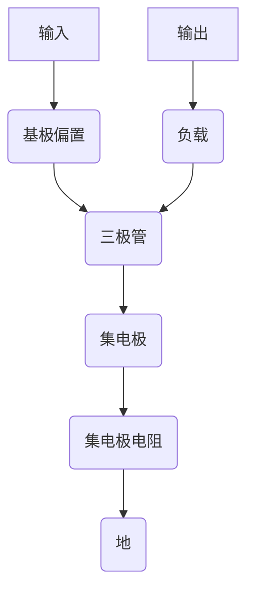
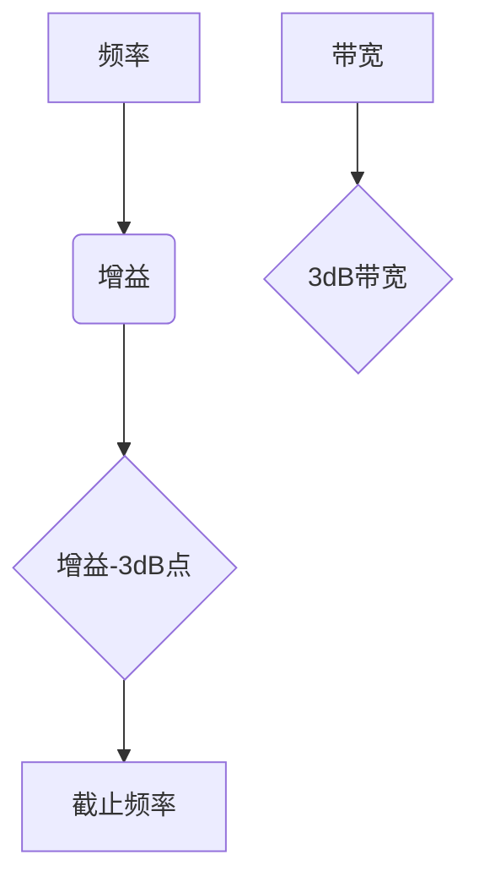
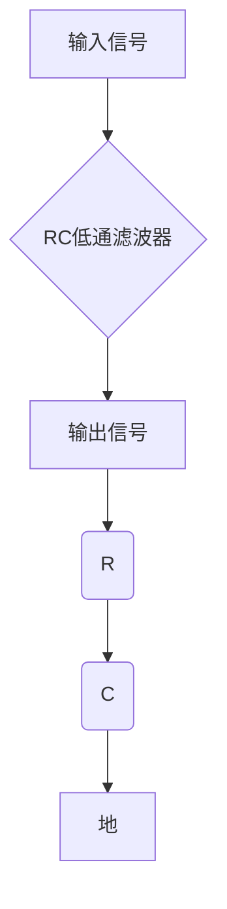
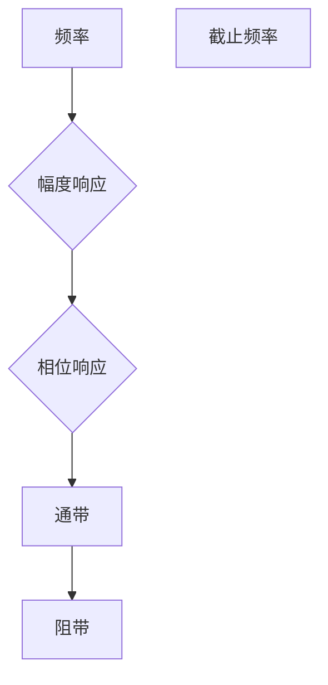
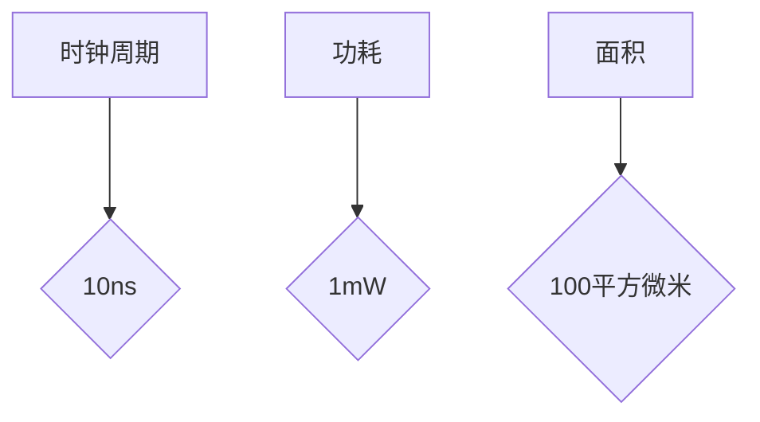

                 

## 文章标题

### 英特尔2024校招芯片设计工程师面试题集

> 关键词：芯片设计、校招、面试题、英特尔、工程师

> 摘要：本文将深入探讨英特尔2024校招芯片设计工程师面试的准备工作，从基础概念、关键技术到面试题集，全方位解析芯片设计领域的面试要点，为考生提供实战经验和备考策略。

---

### 目录大纲

#### 第一部分：芯片设计基础
- **第1章：芯片设计概述**
  - 1.1 芯片设计的基本概念
  - 1.2 芯片设计流程
  - 1.3 芯片设计工具和软件
  - 1.4 芯片设计中的关键技术和挑战

- **第2章：半导体器件原理**
  - 2.1 半导体物理基础
  - 2.2 晶体管工作原理
  - 2.3 集成电路设计基础
  - 2.4 芯片制造工艺

- **第3章：数字电路设计**
  - 3.1 数字逻辑基础
  - 3.2 组合逻辑设计与分析
  - 3.3 时序逻辑设计与分析
  - 3.4 数字电路优化与验证

#### 第二部分：芯片设计实践
- **第4章：模拟电路设计**
  - 4.1 模拟电路基础
  - 4.2 放大器设计与分析
  - 4.3 滤波器设计与分析
  - 4.4 模拟集成电路设计

- **第5章：芯片设计中的EDA工具**
  - 5.1 EDA工具概述
  - 5.2 HDL语言基础
  - 5.3 电路仿真与验证
  - 5.4 电路布局与布线

- **第6章：芯片设计中的验证和测试**
  - 6.1 芯片验证概述
  - 6.2 功能验证
  - 6.3 性能验证
  - 6.4 芯片测试

- **第7章：案例分析与实际应用**
  - 7.1 芯片设计项目案例分析
  - 7.2 芯片设计在物联网中的应用
  - 7.3 芯片设计在人工智能领域的应用
  - 7.4 芯片设计趋势与未来展望

#### 第三部分：面试题集与备考
- **第8章：面试题类型与解答策略**
  - 8.1 面试题类型分析
  - 8.2 面试题解答策略
  - 8.3 面试技巧与心态准备

- **第9章：校招面试常见问题**
  - 9.1 芯片设计基础知识问题
  - 9.2 数字电路与模拟电路问题
  - 9.3 EDA工具应用问题
  - 9.4 芯片验证与测试问题

- **第10章：面试真题解析与模拟题库**
  - 10.1 面试题库
  - 10.2 真题解析
  - 10.3 模拟面试

#### 附录
- **附录A：参考书目与资源链接**
  - A.1 芯片设计相关书籍推荐
  - A.2 在线学习资源与课程
  - A.3 芯片设计工具下载与使用指南

---

### 第1章：芯片设计概述

#### 1.1 芯片设计的基本概念

##### 1.1.1 芯片的定义与作用
芯片，顾名思义，是一种微型化、高度集成的电子器件。它集成了各种电子元件和电路，能够实现特定的电子功能。这些功能包括但不限于数据处理、存储、通信、控制等。在现代电子技术中，芯片扮演着至关重要的角色，几乎所有的电子产品，从手机、电脑到家用电器，都离不开芯片的支持。

芯片的主要作用可以概括为以下几点：

1. **数据处理与存储**：芯片能够对输入的数据进行处理、存储和传输。例如，CPU（中央处理器）负责执行计算机的指令，存储器（如RAM和ROM）用于临时或永久存储数据。

2. **功能集成**：通过将多个功能集成到一个芯片上，可以大大减小体积，提高系统的可靠性和效率。例如，现代手机中集成了CPU、GPU（图形处理器）、内存等多种功能。

3. **降低成本**：芯片的高度集成化使得电子产品的成本得到了有效控制，同时减少了所需的组装时间和人力资源。

##### 1.1.2 芯片的分类
芯片可以根据其功能和应用场景进行分类，常见的分类方式有以下几种：

1. **数字芯片**：数字芯片主要用于数字信号的处理，如逻辑门、加法器、计数器等。数字芯片广泛应用于计算机、通信、消费电子等领域。

2. **模拟芯片**：模拟芯片主要用于模拟信号的处理，如放大器、滤波器、ADC（模数转换器）和DAC（数模转换器）等。模拟芯片在音频处理、视频处理、传感器接口等方面有广泛应用。

3. **混合信号芯片**：混合信号芯片同时包含数字和模拟电路，能够处理数字和模拟信号。例如，智能手机中的大多数芯片都是混合信号芯片，包括CPU、GPU、传感器接口等。

##### 1.1.3 芯片设计的重要性
芯片设计的重要性体现在多个方面：

1. **技术创新**：芯片设计推动了电子技术的不断创新和发展。新型芯片的诞生往往伴随着新技术的出现，如GPU的并行计算能力推动了深度学习技术的发展。

2. **产业升级**：芯片设计是国家电子信息产业升级的关键环节。随着全球经济的快速发展，芯片产业在国际竞争中的地位日益重要。

3. **经济推动**：芯片设计产业对经济的拉动作用明显。芯片产业的增长带动了相关产业链的发展，如半导体设备、材料、软件等。

#### 1.2 芯片设计流程

##### 1.2.1 芯片设计流程概述
芯片设计流程通常可以分为以下几个主要阶段：

1. **需求分析**：在开始芯片设计之前，首先需要明确芯片的功能、性能、功耗等需求。这一阶段通常需要与客户或项目团队进行沟通，确保设计目标符合实际需求。

2. **系统设计**：在需求分析的基础上，设计芯片的系统架构，包括数字电路、模拟电路、接口电路等。这一阶段需要确定芯片的核心功能单元，并进行模块划分。

3. **电路设计**：根据系统设计的要求，设计具体的数字或模拟电路。数字电路设计通常使用硬件描述语言（如Verilog或VHDL）进行编码，而模拟电路设计则可能涉及更多的原理分析和公式推导。

4. **布局与布线**：在电路设计完成后，需要将电路布局到芯片的物理层面上，并进行布线。这一阶段需要使用EDA（电子设计自动化）工具进行设计优化，以减少面积、功耗和提高性能。

5. **仿真与验证**：通过仿真工具对设计进行功能验证和性能分析，确保电路设计满足要求。这一阶段可能需要进行多轮迭代，以修正设计中的错误和不足。

6. **制造与封装**：在验证完成后，将设计文件发送给制造厂进行生产。芯片制造包括光刻、蚀刻、离子注入等过程。制造完成后，芯片需要封装，以便安装到最终产品中。

7. **测试与调试**：在封装后的芯片需要进行功能和性能测试，确保芯片能够正常运行。测试包括逻辑测试、功能测试、性能测试等，测试过程中可能会发现设计或制造中的问题，需要进行调试和修复。

##### 1.2.2 芯片设计流程详细讲解

**需求分析**
需求分析是芯片设计的起点，其核心目标是明确芯片的功能、性能、功耗等需求。具体步骤如下：

1. **功能定义**：明确芯片需要实现的具体功能，如数据处理、存储、通信等。
2. **性能指标**：定义芯片的性能指标，如运算速度、功耗、延迟等。
3. **功耗约束**：考虑芯片在不同工作模式下的功耗约束，确保芯片在规定的功耗范围内运行。
4. **其他要求**：考虑其他要求，如封装形式、接口类型、温度范围等。

**系统设计**
系统设计阶段是芯片设计的核心，其目标是确定芯片的系统架构。具体步骤如下：

1. **模块划分**：根据功能定义，将芯片划分为多个模块，如数据通路、控制单元、存储单元等。
2. **模块交互**：定义模块之间的交互方式，如信号传输、数据交换等。
3. **架构优化**：根据性能指标和功耗约束，对系统架构进行优化，以减少面积、功耗和提高性能。
4. **验证方案**：制定系统验证方案，确保系统设计满足功能需求。

**电路设计**
电路设计阶段是将系统设计转化为具体的数字或模拟电路。具体步骤如下：

1. **电路编码**：使用硬件描述语言（如Verilog或VHDL）编写电路代码。
2. **原理分析**：对电路进行原理分析，确保电路能够正常工作。
3. **公式推导**：对于模拟电路，可能需要推导相关公式，以指导电路设计。
4. **仿真验证**：使用仿真工具对电路进行功能验证和性能分析。

**布局与布线**
布局与布线是将电路设计布局到芯片的物理层面上，并进行布线。具体步骤如下：

1. **物理布局**：根据电路设计，将各个模块布局到芯片上。
2. **布线**：根据布局，为电路连接进行布线，确保信号能够高效传输。
3. **设计优化**：使用EDA工具进行设计优化，以减少面积、功耗和提高性能。
4. **验证**：对布局与布线设计进行验证，确保没有设计错误。

**仿真与验证**
仿真与验证是确保芯片设计正确性的关键步骤。具体步骤如下：

1. **功能验证**：通过仿真验证芯片的功能是否正确。
2. **性能验证**：通过仿真验证芯片的性能指标是否满足要求。
3. **时序验证**：通过仿真验证芯片的时序是否正确。
4. **多轮迭代**：根据仿真结果，对设计进行多轮迭代，以修正错误和不足。

**制造与封装**
制造与封装是将设计好的芯片生产出来，并封装到最终产品中。具体步骤如下：

1. **制造**：将设计文件发送给制造厂，进行光刻、蚀刻、离子注入等过程。
2. **封装**：将制造好的芯片进行封装，以保护芯片并便于安装到最终产品中。
3. **测试**：对封装后的芯片进行功能和性能测试，确保芯片能够正常运行。

**测试与调试**
测试与调试是在封装后的芯片进行功能和性能测试，确保芯片能够正常运行。具体步骤如下：

1. **逻辑测试**：通过逻辑测试验证芯片的逻辑功能是否正确。
2. **功能测试**：通过功能测试验证芯片的各个功能是否正常工作。
3. **性能测试**：通过性能测试验证芯片的性能指标是否满足要求。
4. **调试**：根据测试结果，对芯片进行调试和修复，确保芯片能够正常运行。

#### 1.3 芯片设计工具和软件

##### 1.3.1 EDA工具
EDA（电子设计自动化）工具是芯片设计过程中不可或缺的组成部分。这些工具能够自动化地完成从设计到验证的整个过程。以下是一些常用的EDA工具：

1. **Cadence**：Cadence是业界领先的EDA工具提供商，其产品包括数字电路设计、模拟电路设计、版图设计等。Cadence的集成设计环境（IDE）支持多种硬件描述语言（HDL），如Verilog和VHDL。

2. **Synopsys**：Synopsys也是一家知名的EDA工具提供商，其产品包括逻辑合成、版图设计、仿真验证等。Synopsys的IC Compiler工具用于逻辑合成和布局布线，而VCS仿真工具用于功能验证和性能分析。

3. **Mentor Graphics**：Mentor Graphics提供了一系列的EDA工具，包括逻辑设计、版图设计、仿真验证等。其Caliber工具用于版图设计，而ModelSim工具用于功能验证和性能分析。

##### 1.3.2 HDL语言
HDL（硬件描述语言）是用于描述电路设计和功能的一种语言。常见的HDL语言包括Verilog和VHDL。这两种语言都具有丰富的功能，可以用于描述从简单逻辑门到复杂系统的各种电路。

1. **Verilog**：Verilog是一种广泛使用的HDL语言，其语法简洁明了，支持多种设计层次，如行为层次、寄存器传输层次和门层次。Verilog常用于数字电路设计和验证。

2. **VHDL**：VHDL（硬件描述语言）是一种结构化、层次化的HDL语言，支持多种设计层次，如系统层次、行为层次、寄存器传输层次和门层次。VHDL广泛应用于数字电路设计和验证。

##### 1.3.3 其他相关工具
除了EDA工具和HDL语言外，还有一些其他相关的工具在芯片设计中发挥着重要作用。以下是一些常用的相关工具：

1. **仿真软件**：仿真软件用于对电路设计进行功能验证和性能分析。常见的仿真软件包括ModelSim、Icarus Verilog等。这些软件能够模拟电路的行为，并提供详细的波形图和分析报告。

2. **版图设计软件**：版图设计软件用于将电路设计布局到芯片的物理层面上。常见的版图设计软件包括Cadence的Layout Editor和Mentor Graphics的Caliber等。

3. **测试软件**：测试软件用于对封装后的芯片进行功能和性能测试。常见的测试软件包括Synopsys的TestKompress和Mentor Graphics的Vito等。

#### 1.4 芯片设计中的关键技术和挑战

##### 1.4.1 关键技术
芯片设计涉及多个关键技术，以下是一些重要的技术：

1. **数字电路设计**：数字电路设计是芯片设计的基础，包括组合逻辑设计和时序逻辑设计。组合逻辑设计关注逻辑电路的结构和功能，而时序逻辑设计关注电路的时序行为和性能。

2. **模拟电路设计**：模拟电路设计涉及模拟信号的放大、滤波、转换等过程。模拟电路设计需要深入理解半导体物理和电路原理，并掌握相关的设计技巧。

3. **电路仿真与验证**：电路仿真与验证是确保电路设计正确性的关键步骤。通过仿真软件，可以模拟电路的行为，并分析其功能和性能。验证过程中可能需要进行多轮迭代，以修正设计错误。

4. **电路布局与布线**：电路布局与布线是将电路设计布局到芯片的物理层面上，并进行布线。这一步骤需要优化设计，以减少面积、功耗和提高性能。

5. **芯片制造与封装**：芯片制造与封装是将设计好的芯片生产出来，并封装到最终产品中。制造过程中需要使用多种半导体工艺，如光刻、蚀刻、离子注入等。封装过程中需要选择合适的封装形式，以保护芯片并提高其性能。

##### 1.4.2 挑战
芯片设计面临着许多挑战，以下是一些主要的挑战：

1. **复杂性**：随着芯片集成度的不断提高，芯片的复杂性也在不断增加。设计人员需要处理更多的模块和电路，这增加了设计难度和复杂度。

2. **性能与功耗的平衡**：在现代芯片设计中，性能和功耗是两个关键指标。如何在提高性能的同时降低功耗是一个重要的挑战。

3. **制造工艺**：随着工艺节点的不断缩小，制造工艺变得越来越复杂。设计人员需要了解最新的制造工艺，并掌握相关的工艺参数和设计技巧。

4. **验证与测试**：随着芯片集成度的提高，验证和测试的难度也在增加。设计人员需要确保芯片在制造和封装后能够正常运行，这需要高效的验证和测试方法。

5. **人才需求**：芯片设计是一个高度专业化的领域，需要大量具备专业技能的人才。随着芯片产业的发展，对专业人才的需求也在不断增加。

### 第2章：半导体器件原理

#### 2.1 半导体物理基础

半导体物理是芯片设计的核心基础，了解半导体的物理特性对于芯片设计师至关重要。半导体器件如晶体管、二极管等，都是基于半导体材料的工作原理来实现的。本节将详细介绍半导体物理的基础知识，包括半导体材料的特性、PN结的形成、载流子运动等。

##### 2.1.1 半导体材料特性

半导体材料是一种介于导体和绝缘体之间的材料，其电导率介于两者之间。常见的半导体材料有硅（Si）、锗（Ge）、砷化镓（GaAs）等。半导体材料的特性主要表现在以下几个方面：

1. **能带结构**：半导体材料具有独特的能带结构，包括价带、导带和禁带。价带中的电子被束缚在原子中，无法自由移动；导带中的电子则可以自由移动，形成电流。禁带是价带和导带之间的能量区间，没有电子。

2. **导电性**：半导体材料的导电性可以通过掺杂（即掺入少量的杂质原子）来调节。掺杂可以引入额外的自由电子或空穴，从而改变半导体的导电性。

3. **本征半导体**：未掺杂的半导体称为本征半导体，其导电性较低。通过掺杂，可以形成p型半导体和n型半导体，这两种半导体分别具有空穴导电和自由电子导电的特性。

##### 2.1.2 PN结的形成

PN结是半导体器件中最基本的组件之一，由p型半导体和n型半导体组成。PN结的形成过程如下：

1. **扩散过程**：当p型半导体和n型半导体接触时，由于两者之间电势差的存在，电子和空穴开始向对方区域扩散。这个过程称为扩散过程。

2. **耗尽区**：随着扩散的进行，p型区域的空穴和n型区域的电子逐渐减少，形成一个无电荷的区域，称为耗尽区。耗尽区的电势差称为势垒，阻止进一步的扩散。

3. **形成PN结**：在耗尽区两侧，形成了一个由正电荷和负电荷组成的电场，这个电场维持了耗尽区的稳定状态，形成了PN结。

PN结具有单向导电性，即正向偏置时导通，反向偏置时截止。这一特性使PN结广泛应用于整流、开关等电路中。

##### 2.1.3 载流子运动

在半导体器件中，载流子（电子和空穴）的运动是电路行为的关键。以下是关于载流子运动的基本概念：

1. **电子和空穴**：半导体中的自由电子称为电子载流子，而自由空穴称为空穴载流子。电子和空穴是电流的载流体。

2. **漂移运动**：在电场的作用下，载流子沿着电场方向进行漂移运动。漂移运动的速度与电场强度成正比。

3. **扩散运动**：载流子也会因为浓度梯度而进行扩散运动。扩散运动是从高浓度区域向低浓度区域移动。

4. **载流子复合**：在半导体材料中，电子和空穴可能会重新结合，这个过程称为复合。复合会导致载流子的减少。

了解载流子的运动对于分析半导体器件的工作原理至关重要。例如，在晶体管中，载流子的运动决定了电流的大小和方向。

#### 2.2 晶体管工作原理

晶体管是芯片设计中最重要的元件之一，它能够控制电流的流动，从而实现放大和开关功能。晶体管的基本结构包括三个区：发射区、基区和集电区。根据结构和工作原理的不同，晶体管可以分为NPN型和PNP型。

##### 2.2.1 NPN型晶体管工作原理

NPN型晶体管由N型发射区、P型基区和N型集电区组成。以下是NPN型晶体管的工作原理：

1. **静态工作点**：为了使晶体管工作在合适的区域，需要设置一个静态工作点（Q点）。静态工作点通常设置在放大区。

2. **正向偏置**：在基极和发射极之间施加正向偏置电压，使电子从发射区注入到基区。

3. **注入过程**：注入的电子在基区中向集电区漂移。由于基区很薄，多数电子能够顺利到达集电区。

4. **集电区收集**：到达集电区的电子被集电区电场收集，形成电流。

5. **电流放大**：基极电流的变化会引起集电极电流的放大。晶体管的电流放大倍数称为电流增益（β或hFE）。

##### 2.2.2 PNP型晶体管工作原理

PNP型晶体管与NPN型晶体管的工作原理类似，但极性相反。PNP型晶体管由P型发射区、N型基区和P型集电区组成。其工作原理如下：

1. **反向偏置**：在基极和发射极之间施加反向偏置电压，阻止空穴从发射区注入到基区。

2. **注入过程**：由于基区反向偏置，空穴无法注入到基区，而基区中的电子被注入到发射区。

3. **集电区收集**：注入到发射区的电子被集电区电场收集，形成电流。

4. **电流放大**：基极电流的变化会引起集电极电流的放大。

晶体管的工作原理可以通过等效电路来简化分析。通常，晶体管可以用一个电流控制电流源（CCCS）来表示。基极电流是控制电流，集电极电流是受控电流。

##### 2.2.3 晶体管的应用

晶体管在芯片设计中具有广泛的应用，包括放大器、开关、振荡器等。以下是晶体管在几种常见应用中的工作原理：

1. **放大器**：晶体管可以用作放大器，对信号进行放大。通过改变基极电流，可以控制集电极电流，从而实现信号的放大。

2. **开关**：晶体管可以用作开关，用于控制电路的通断。正向偏置时，晶体管导通；反向偏置时，晶体管截止。

3. **振荡器**：晶体管可以用于构建振荡器，产生周期性的信号。通过正反馈和负反馈的相互作用，可以实现稳定的振荡。

了解晶体管的工作原理对于芯片设计师来说至关重要。晶体管是芯片设计中最基本的组件之一，其工作原理决定了芯片的性能和功能。

#### 2.3 集成电路设计基础

集成电路（IC）是芯片设计的核心目标，它将多个晶体管、电阻和电容集成在一个硅片上。集成电路设计包括数字集成电路和模拟集成电路，它们分别用于数字信号和模拟信号的处理。本节将介绍集成电路设计的基础知识，包括集成电路的基本结构、设计方法和工艺流程。

##### 2.3.1 集成电路的基本结构

集成电路的基本结构可以分为以下几个层次：

1. **单元级**：单元级是集成电路设计的基础，包括基本的逻辑门（如与门、或门、非门等）和存储单元（如寄存器、存储器等）。单元级设计通常使用硬件描述语言（HDL）进行编码。

2. **模块级**：模块级是将多个单元级模块组合在一起，形成功能模块。模块级设计通常需要考虑模块之间的接口和交互。

3. **系统级**：系统级设计是最高层次的设计，它将多个模块组合成一个完整的系统。系统级设计需要考虑系统的整体性能和功耗。

##### 2.3.2 集成电路的设计方法

集成电路的设计方法可以分为以下几种：

1. **自下而上设计**：自下而上设计是从基本单元开始，逐步构建复杂模块和系统。这种方法有助于逐步验证设计的正确性。

2. **自上而下设计**：自上而下设计是从系统级开始，逐步分解为模块级和单元级。这种方法有助于快速搭建系统原型。

3. **混合设计**：混合设计是结合自下而上和自上而下设计的优点，根据具体需求选择合适的设计方法。

##### 2.3.3 集成电路的工艺流程

集成电路的工艺流程包括以下几个步骤：

1. **设计**：设计阶段包括单元级、模块级和系统级的设计。设计人员使用EDA工具进行电路设计和仿真验证。

2. **布局**：布局阶段是将电路设计布局到硅片上。布局需要考虑电路的连接性和性能。

3. **布线**：布线阶段是将布局中的电路连接起来。布线需要优化信号传输速度和减少功耗。

4. **光刻**：光刻阶段是将电路图案转移到硅片上。光刻精度决定了芯片的性能。

5. **蚀刻**：蚀刻阶段是去除不需要的硅片材料，形成电路图案。蚀刻过程需要精确控制蚀刻深度和均匀性。

6. **离子注入**：离子注入阶段是引入掺杂剂，改变硅片的电导率。

7. **化学气相沉积**：化学气相沉积阶段是在硅片表面形成保护层和绝缘层。

8. **测试**：测试阶段是对芯片进行功能和性能测试，确保芯片能够正常运行。

集成电路的设计和制造是一个复杂的过程，需要多学科的知识和技能。了解集成电路的基本结构、设计方法和工艺流程对于芯片设计师来说至关重要。

#### 2.4 芯片制造工艺

芯片制造工艺是芯片设计完成后将设计转化为实际物理器件的关键步骤。这一过程涉及多种先进的工艺技术和设备，以确保芯片具有高集成度、高性能和可靠性。本节将详细介绍芯片制造工艺的基本步骤，包括光刻、蚀刻、离子注入等。

##### 2.4.1 光刻工艺

光刻工艺是芯片制造中最重要的步骤之一，它通过将电路图案转移到硅片上。光刻工艺的基本步骤如下：

1. **涂胶**：首先，在硅片表面涂上一层光刻胶，以保护硅片表面的晶体结构。

2. **曝光**：然后，将硅片放入光刻机中，通过紫外光曝光，使光刻胶在特定区域发生光化学反应。

3. **显影**：曝光后，使用显影液去除未曝光的光刻胶，留下曝光区域的图案。

4. **蚀刻**：将硅片放入蚀刻机中，通过化学或物理方法去除未保护区域的硅片，形成电路图案。

光刻工艺的精度直接决定了芯片的性能，随着工艺节点的不断缩小，光刻工艺的挑战也在不断增加。

##### 2.4.2 蚀刻工艺

蚀刻工艺是芯片制造中用于去除硅片材料的过程。蚀刻工艺分为化学蚀刻和物理蚀刻两种类型：

1. **化学蚀刻**：化学蚀刻是通过化学溶液去除硅片材料。化学蚀刻具有高选择性和低粗糙度的优点，但蚀刻速率较慢。

2. **物理蚀刻**：物理蚀刻是通过物理过程（如激光或电子束）去除硅片材料。物理蚀刻具有高蚀刻速率和较低选择性的优点，但容易产生粗糙表面。

蚀刻工艺在芯片制造中用于去除不需要的材料，形成电路图案和结构。

##### 2.4.3 离子注入工艺

离子注入工艺是用于引入掺杂剂，改变硅片电导率的工艺。离子注入工艺的基本步骤如下：

1. **离子源**：将掺杂剂（如磷或硼）转化为离子，并加速至高能量。

2. **注入**：将高能离子注入到硅片中，通过离子与硅原子的碰撞，将掺杂剂原子注入到硅晶体中。

3. **扩散**：注入的掺杂剂原子在硅片中扩散，形成掺杂区。

离子注入工艺是调节硅片电导率的关键步骤，它决定了芯片的导电性和性能。

##### 2.4.4 芯片制造的其他工艺

除了光刻、蚀刻和离子注入工艺外，芯片制造还包括其他关键工艺：

1. **化学气相沉积（CVD）**：CVD工艺用于在硅片表面形成薄膜，如绝缘层和导电层。CVD工艺具有高均匀性和低粗糙度的优点。

2. **物理气相沉积（PVD）**：PVD工艺用于在硅片表面形成高纯度的薄膜，如反射镜和高介电常数材料。

3. **金属化**：金属化工艺用于在硅片表面形成导电线路。金属化工艺包括蒸发和溅射等方法。

4. **封装**：封装是将芯片封装在保护壳中，以便安装到最终产品中。封装工艺包括芯片贴装、引线框架组装和密封等步骤。

芯片制造工艺是一个复杂的过程，需要多种工艺技术相结合。了解这些工艺的基本原理和步骤对于芯片设计师来说至关重要。

### 第3章：数字电路设计

#### 3.1 数字逻辑基础

数字逻辑是数字电路设计的核心，它涉及逻辑门、布尔代数和逻辑函数的基本原理。理解数字逻辑对于设计和分析复杂的数字电路至关重要。本节将详细探讨数字逻辑的基本概念、逻辑门及其组合逻辑设计与分析。

##### 3.1.1 数字逻辑的基本概念

数字逻辑是处理离散值（通常是二进制值）的数学和电路理论。在数字逻辑中，信号通常用高电平（1）和低电平（0）来表示。这些离散值代表两种不同的状态，例如开关的开和关、电压的高和低等。

1. **逻辑值**：在数字逻辑中，逻辑值通常用二进制表示，即0和1。这些逻辑值分别表示“假”和“真”，或者“低”和“高”。

2. **布尔代数**：布尔代数是数字逻辑的基础，它由数学家乔治·布尔在19世纪创立。布尔代数使用逻辑门和逻辑函数来表示和操作二进制值。

3. **逻辑函数**：逻辑函数是定义在输入逻辑值上的数学函数，其输出也是逻辑值。逻辑函数可以是组合逻辑函数或时序逻辑函数。组合逻辑函数的输出仅取决于当前输入，而时序逻辑函数的输出不仅取决于当前输入，还取决于过去的输入。

##### 3.1.2 逻辑门

逻辑门是数字电路中最基本的组件，用于执行基本的逻辑操作。常见的逻辑门包括与门（AND）、或门（OR）、非门（NOT）、异或门（XOR）等。

1. **与门（AND）**：与门执行逻辑与操作，当所有输入都为1时，输出才为1。与门的布尔表达式为：\( Y = A \land B \)。

2. **或门（OR）**：或门执行逻辑或操作，当至少有一个输入为1时，输出为1。或门的布尔表达式为：\( Y = A \lor B \)。

3. **非门（NOT）**：非门执行逻辑非操作，将输入的逻辑值取反。非门的布尔表达式为：\( Y = \neg A \)。

4. **异或门（XOR）**：异或门执行逻辑异或操作，当输入不同时，输出为1。异或门的布尔表达式为：\( Y = A \oplus B \)。

逻辑门可以通过硬件描述语言（如Verilog或VHDL）进行描述和实现。以下是一个简单的Verilog代码示例，用于实现一个4输入的与门：

```verilog
module and_gate_4input(
    input wire a,
    input wire b,
    input wire c,
    input wire d,
    output wire y
);
    assign y = a & b & c & d;
endmodule
```

##### 3.1.3 组合逻辑设计与分析

组合逻辑设计是数字电路设计的一个重要方面，它涉及将多个逻辑门组合在一起，以实现特定的逻辑功能。组合逻辑的设计过程通常包括以下步骤：

1. **需求分析**：明确电路的功能需求，即输入和输出之间的关系。

2. **布尔表达式**：根据需求分析，使用布尔代数推导出电路的布尔表达式。

3. **逻辑门实现**：将布尔表达式转换为逻辑门电路，选择合适的逻辑门进行实现。

4. **电路优化**：对电路进行优化，以减少逻辑门的数量、提高电路的效率和性能。

以下是一个简单的组合逻辑设计示例，实现一个3输入的多数表决器：

1. **需求分析**：设计一个3输入的多数表决器，当至少两个输入为1时，输出为1；否则输出为0。

2. **布尔表达式**：
   \( Y = (A \land B) \lor (A \land C) \lor (B \land C) \)

3. **逻辑门实现**：
   ```verilog
   module majority_vote(
       input wire a,
       input wire b,
       input wire c,
       output wire y
   );
       wire temp1, temp2;
       assign temp1 = a & b;
       assign temp2 = a & c;
       assign y = temp1 | temp2 | (b & c);
   endmodule
   ```

组合逻辑设计的关键是理解和应用布尔代数，通过逻辑门实现复杂的逻辑功能。组合逻辑电路的输出仅取决于当前输入，因此其设计相对简单，但需要仔细分析输入和输出之间的关系。

#### 3.2 组合逻辑设计与分析

组合逻辑设计是数字电路设计中的一个重要环节，它主要关注电路的输出仅由当前输入决定，而不受过去输入的影响。组合逻辑电路广泛应用于数字系统中，如逻辑门、编码器、译码器、多路选择器、多路分配器等。本节将详细讨论组合逻辑设计的基本原理、常用组合逻辑电路及其设计方法。

##### 3.2.1 组合逻辑的基本原理

组合逻辑电路的输出仅取决于当前输入，而不受过去输入或状态的影响。这是组合逻辑电路与时序逻辑电路最本质的区别。组合逻辑电路的基本原理可以概括为以下几点：

1. **输入输出关系**：组合逻辑电路的输出是输入的逻辑函数，即输出仅由当前输入决定。

2. **即时性**：组合逻辑电路的输出变化即时响应输入的变化，没有延迟。

3. **逻辑函数**：组合逻辑电路可以用布尔函数来表示，即输出是输入的逻辑组合。

##### 3.2.2 常用组合逻辑电路

常用的组合逻辑电路包括逻辑门、编码器、译码器、多路选择器、多路分配器等。以下是这些电路的基本原理和功能：

1. **逻辑门**：逻辑门是最基本的组合逻辑电路，包括与门（AND）、或门（OR）、非门（NOT）、异或门（XOR）等。逻辑门用于执行基本的逻辑运算。

2. **编码器**：编码器是将多个输入信号编码成二进制代码的电路。常见的编码器有二进制编码器、优先编码器等。编码器常用于接口电路和总线系统。

3. **译码器**：译码器是将二进制代码转换成对应的输出信号的电路。常见的译码器有二进制译码器、BCD译码器等。译码器常用于显示系统和控制电路。

4. **多路选择器**：多路选择器（MUX）是一种选择器电路，根据选择控制信号从多个输入中选择一个输出。多路选择器广泛应用于数据选择和路由。

5. **多路分配器**：多路分配器（DEMUX）是一种分配器电路，根据选择控制信号将一个输入信号分配到多个输出。多路分配器常用于数据分配和路由。

##### 3.2.3 组合逻辑电路的设计方法

组合逻辑电路的设计通常包括以下步骤：

1. **需求分析**：明确电路的功能需求，包括输入和输出的逻辑关系。

2. **布尔表达式**：根据需求分析，使用布尔代数推导出电路的布尔表达式。

3. **逻辑门实现**：将布尔表达式转换为逻辑门电路，选择合适的逻辑门进行实现。

4. **电路优化**：对电路进行优化，以减少逻辑门的数量、提高电路的效率和性能。

以下是一个简单的组合逻辑设计示例，实现一个4-to-2线编码器：

1. **需求分析**：设计一个4-to-2线编码器，当任意一个输入为高时，输出对应的二进制代码。

2. **布尔表达式**：
   \( Y_1 = A \land B \land C \land D \)
   \( Y_2 = A \land B \land C \land \neg D \)

3. **逻辑门实现**：
   ```verilog
   module encoder_4to2(
       input wire A,
       input wire B,
       input wire C,
       input wire D,
       output wire Y1,
       output wire Y2
   );
       wire temp1, temp2;
       assign temp1 = A & B & C & D;
       assign temp2 = A & B & C & \neg D;
       assign Y1 = temp1;
       assign Y2 = temp2;
   endmodule
   ```

组合逻辑设计的关键在于理解输入和输出之间的逻辑关系，并能够灵活运用布尔代数进行逻辑表达式的推导。设计过程中，还需要注意电路的优化，以提高电路的效率和性能。

#### 3.3 时序逻辑设计与分析

时序逻辑设计是数字电路设计中的重要分支，它涉及电路的输出不仅取决于当前的输入，还受到过去输入的影响。时序逻辑电路广泛应用于计算机系统、通信系统、控制器等场合。本节将详细讨论时序逻辑的基本概念、触发器、有限状态机（FSM）及其设计方法。

##### 3.3.1 时序逻辑的基本概念

时序逻辑电路的输出不仅取决于当前的输入，还受到过去输入的影响，具有“记忆”功能。时序逻辑电路的基本特性可以概括为以下几点：

1. **即时性**：时序逻辑电路的输出变化不仅取决于当前输入，还受到时钟信号的控制。

2. **状态**：时序逻辑电路具有多个状态，其状态变化遵循一定的规则。

3. **触发器**：触发器是时序逻辑电路的基本单元，用于存储一个二进制位。

4. **时钟**：时钟信号是时序逻辑电路的同步信号，用于触发状态的变化。

##### 3.3.2 触发器

触发器是时序逻辑电路的核心组件，用于存储一个二进制位。常见的触发器有D触发器、JK触发器、T触发器等。

1. **D触发器**：D触发器是最简单的触发器，其输出仅取决于当前输入（D）和时钟信号（CLK）。D触发器的逻辑表达式为：
   $$ Q_{next} = D \cdot CLK $$

2. **JK触发器**：JK触发器具有两个输入（J和K），可以实现存储、计数、开关等功能。JK触发器的逻辑表达式为：
   $$ Q_{next} = \neg Q \cdot K + J \cdot \neg CLK $$

3. **T触发器**：T触发器是JK触发器的简化形式，具有一个输入（T）和时钟信号。T触发器的逻辑表达式为：
   $$ Q_{next} = T \cdot \neg CLK $$

触发器在时序逻辑电路中起着至关重要的作用，用于存储和传递状态信息。以下是一个简单的D触发器的Verilog代码实现：

```verilog
module d_trigger(
    input wire clk,
    input wire reset,
    input wire d,
    output reg q
);
    always @(posedge clk or posedge reset) begin
        if (reset) begin
            q <= 1'b0;
        end else begin
            q <= d;
        end
    end
endmodule
```

##### 3.3.3 有限状态机（FSM）

有限状态机（FSM）是时序逻辑电路的另一种重要形式，用于实现复杂的控制逻辑。FSM由状态、输入、输出和状态转换逻辑组成。

1. **状态**：FSM具有有限个状态，每个状态表示系统的一个行为。

2. **输入**：FSM的输入是系统接收到的外部信号，用于触发状态的变化。

3. **输出**：FSM的输出是系统对外部环境的响应，通常用于控制其他组件。

4. **状态转换逻辑**：状态转换逻辑定义了系统在不同状态和输入下的行为，通常使用逻辑表达式或状态转换表表示。

以下是一个简单的FSM模型，用于实现一个交通灯控制器：

- **状态**：红灯、绿灯、黄灯
- **输入**：车辆到达信号
- **输出**：控制交通灯的变化

状态转换表如下：

| 当前状态 | 输入 | 下一状态 | 输出 |
| :------: | :--: | :------: | :--: |
| 红灯     | 到达 | 绿灯     | 绿灯 |
| 绿灯     | 到达 | 黄灯     | 黄灯 |
| 黄灯     | 到达 | 红灯     | 红灯 |

基于上述状态转换表，可以使用Verilog实现一个简单的交通灯控制器：

```verilog
module traffic_light(
    input wire clk,
    input wire reset,
    input wire car_arrive,
    output reg red,
    output reg green,
    output reg yellow
);
    reg [1:0] state;
    initial begin
        state <= 2'b00; // 初始状态为红灯
    end

    always @(posedge clk or posedge reset) begin
        if (reset) begin
            state <= 2'b00;
            red <= 1'b1;
            green <= 1'b0;
            yellow <= 1'b0;
        end else begin
            case (state)
                2'b00: begin // 红灯状态
                    if (car_arrive) begin
                        state <= 2'b10; // 下一状态为绿灯
                        green <= 1'b1;
                        red <= 1'b0;
                        yellow <= 1'b0;
                    end
                end
                2'b10: begin // 绿灯状态
                    if (car_arrive) begin
                        state <= 2'b11; // 下一状态为黄灯
                        yellow <= 1'b1;
                        green <= 1'b0;
                    end
                end
                2'b11: begin // 黄灯状态
                    if (!car_arrive) begin
                        state <= 2'b00; // 下一状态为红灯
                        red <= 1'b1;
                        yellow <= 1'b0;
                    end
                end
            endcase
        end
    end
endmodule
```

有限状态机（FSM）是时序逻辑设计的核心，通过定义状态和状态转换逻辑，可以实现复杂的控制逻辑。理解和应用有限状态机对于设计高效的时序逻辑电路至关重要。

#### 3.4 数字电路优化与验证

数字电路优化与验证是确保电路性能和可靠性的关键步骤。优化旨在减少逻辑门的数量、降低功耗和提高电路的运行速度。验证则用于确保电路设计满足功能要求和性能指标。本节将详细讨论数字电路的优化方法、时序验证以及功能验证与测试。

##### 3.4.1 数字电路优化方法

数字电路优化主要包括逻辑优化和物理优化两个方面。

1. **逻辑优化**：逻辑优化旨在简化逻辑表达式，减少逻辑门的数量。常见的逻辑优化方法包括：

   - **布尔代数简化**：使用布尔代数规则（如分配律、合并律、德摩根定律等）简化逻辑表达式。
   - **Karnaugh图（K-Map）简化**：通过K-Map直观地简化逻辑函数，找到最小项表达式。
   - **Quine-McCluskey算法**：用于找到逻辑函数的最小项表达式，特别适用于大型的逻辑函数。

   以下是一个使用K-Map简化逻辑函数的例子：

   假设我们有一个3输入的布尔函数：
   \( F(A, B, C) = A'B'C + A'BC + AB'C + ABC \)

   将其转换为K-Map：
   ```
   C | B | A
   --|---|---
   0 | 0 | 1
   0 | 1 | 1
   1 | 0 | 1
   1 | 1 | 0
   ```

   通过K-Map简化，我们可以得到：
   \( F(A, B, C) = A'B' + AB \)

2. **物理优化**：物理优化涉及在布局和布线阶段对电路进行优化，以减少面积、功耗和提高性能。常见的物理优化方法包括：

   - **最小化布局面积**：通过优化模块的布局，减少电路的总面积。
   - **减少布线长度**：通过优化布线，减少信号传输的延迟和功耗。
   - **电源和网络规划**：合理规划电源和网络，以减少噪声和功耗。

   以下是一个简单的布局优化示例：

   假设我们有两个模块A和B，它们需要连接。初始布局如下：
   ```
   A --- B
   ```

   通过重新布局，我们可以将其优化为：
   ```
   A
    \
     B
   ```

   这样可以减少布线长度，提高电路性能。

##### 3.4.2 时序验证

时序验证是确保电路设计在规定时间内完成所有操作的关键步骤。时序验证主要包括以下内容：

1. **时序约束**：定义电路中的时序约束，包括时钟周期、建立时间、保持时间、传输延迟等。

2. **时序分析**：使用时序分析工具（如 Timing Analyzer）对电路进行时序分析，检查是否满足时序约束。

3. **时序收敛**：通过调整设计或时钟频率，确保电路的时序收敛。

以下是一个简单的时序验证示例：

假设我们有一个简单的时序约束：
- 时钟周期：100ns
- 建立时间：20ns
- 保持时间：10ns

我们使用 Timing Analyzer 进行时序分析，检查是否满足约束：

- 建立时间：信号在时钟上升沿触发，需要20ns之前稳定。
- 保持时间：信号在时钟上升沿触发，需要保持10ns。

如果时序分析结果满足上述约束，则电路时序是收敛的。

##### 3.4.3 功能验证与测试

功能验证是确保电路设计实现预期功能的关键步骤。功能验证主要包括以下内容：

1. **功能仿真**：使用仿真工具（如 ModelSim）对电路设计进行功能仿真，验证其是否满足功能要求。

2. **测试向量生成**：根据功能要求生成测试向量，用于功能验证和测试。

3. **测试平台搭建**：搭建测试平台，对电路进行实际测试，验证其功能。

以下是一个简单的功能验证示例：

假设我们设计了一个3位加法器，需要验证其功能。我们使用ModelSim进行功能仿真，并生成以下测试向量：
- 输入：\( A = 011, B = 100 \)
- 输出：\( SUM = 111 \)

我们编写仿真脚本，模拟测试向量的输入，并检查输出是否正确。

```verilog
module adder_3bit(
    input [2:0] A,
    input [2:0] B,
    output [2:0] SUM
);

    initial begin
        $dumpfile("adder_3bit.vcd");
        $dumpvars(0, adder_3bit);
    end

    initial begin
        A = 3'b011;
        B = 3'b100;
        #50;
        $display("SUM = %b", SUM);
        $finish;
    end

endmodule
```

通过仿真，我们可以验证3位加法器的功能是否正确。

##### 3.4.4 验证与测试的总结

数字电路优化与验证是确保电路性能和可靠性的关键步骤。逻辑优化和物理优化可以减少电路的面积、功耗和提高性能。时序验证确保电路在规定时间内完成所有操作。功能验证与测试确保电路实现预期功能。通过这些步骤，我们可以确保数字电路设计的高效性和可靠性。

### 第4章：模拟电路设计

#### 4.1 模拟电路基础

模拟电路设计是芯片设计的重要组成部分，它涉及到对模拟信号的处理，如放大、滤波、转换等。模拟电路的工作原理和设计方法对于实现高性能、低功耗的芯片至关重要。本节将详细介绍模拟电路的基本概念、放大器和滤波器的工作原理及其设计要点。

##### 4.1.1 模拟电路的基本概念

模拟电路是一种处理连续信号的电路，与数字电路不同，模拟电路的信号是连续的，而不是离散的。模拟电路的基本概念包括以下几个关键方面：

1. **模拟信号**：模拟信号是随时间连续变化的信号，可以是电压、电流或电荷量。常见的模拟信号包括正弦波、方波、三角波等。

2. **模拟电路**：模拟电路是处理模拟信号的电路，包括放大器、滤波器、转换器等。模拟电路的目的是对模拟信号进行放大、滤波、调制、解调等处理。

3. **交流（AC）和直流（DC）信号**：交流信号是随时间变化的信号，如正弦波。直流信号是恒定不变的信号，如电压源。模拟电路可以处理这两种信号。

4. **电阻、电容和电感**：电阻、电容和电感是模拟电路中最基本的元件，分别用于限制电流、存储电荷和产生磁场。这些元件在模拟电路设计中起着关键作用。

##### 4.1.2 放大器的工作原理

放大器是模拟电路中最重要的组件之一，它用于放大输入信号的幅度。放大器的工作原理基于三极管或运算放大器的放大作用。

1. **三极管放大器**：三极管放大器使用三极管（如NPN或PNP型）作为放大元件。三极管的工作原理是通过基极电流控制集电极电流，从而实现对输入信号的放大。

2. **运算放大器放大器**：运算放大器（Op-Amp）是一种高增益的差分放大器，它具有两个输入端（非反相输入和反相输入）和一个输出端。运算放大器可以用来实现各种模拟信号处理功能，如放大、滤波、滤波等。

放大器的设计要点包括以下几个方面：

- **增益**：放大器的增益是输出信号与输入信号的比值。放大器的增益可以通过电路参数（如三极管的β值或运算放大器的放大倍数）来调节。

- **带宽**：放大器的带宽是放大器能够处理的信号频率范围。放大器的带宽取决于电路的截止频率和增益。

- **线性度**：放大器的线性度是指放大器输出与输入之间关系的线性程度。高线性度意味着放大器能够更准确地放大信号。

- **稳定性**：放大器的稳定性是指放大器在长时间工作过程中保持性能不变的能力。稳定性可以通过适当的电路设计来保证。

##### 4.1.3 滤波器的工作原理

滤波器是模拟电路中用于选择或抑制特定频率信号的组件。滤波器分为低通滤波器、高通滤波器、带通滤波器和带阻滤波器。

1. **低通滤波器**：低通滤波器允许低频信号通过，抑制高频信号。低通滤波器广泛应用于信号处理、通信系统等领域。

2. **高通滤波器**：高通滤波器允许高频信号通过，抑制低频信号。高通滤波器常用于音频放大器、射频前端等。

3. **带通滤波器**：带通滤波器允许特定频率范围的信号通过，抑制其他频率。带通滤波器在通信系统和信号处理中具有广泛应用。

4. **带阻滤波器**：带阻滤波器抑制特定频率范围的信号，允许其他频率通过。带阻滤波器在干扰抑制和信号分离中具有重要作用。

滤波器的设计要点包括以下几个方面：

- **截止频率**：滤波器的截止频率是滤波器开始抑制信号的频率。滤波器的截止频率决定了滤波器的频率响应。

- **通带和阻带**：滤波器的通带是允许信号通过的频率范围，阻带是抑制信号的频率范围。通带和阻带的宽度决定了滤波器的选择性。

- **滤波器类型**：滤波器类型（如巴特沃斯、切比雪夫、贝塞尔等）决定了滤波器的频率响应和阻带特性。

- **品质因数（Q值）**：滤波器的品质因数是滤波器的带宽与中心频率的比值。高Q值滤波器具有窄带宽和陡峭的频率响应。

##### 4.1.4 模拟集成电路设计要点

模拟集成电路设计涉及到对模拟电路的集成、优化和验证。以下是模拟集成电路设计的一些关键要点：

- **设计流程**：模拟集成电路设计通常包括需求分析、电路设计、仿真验证、布局布线、制造和测试等步骤。设计流程需要考虑时间、成本和性能的平衡。

- **电路仿真**：电路仿真是验证模拟电路设计的重要手段。通过电路仿真，可以分析电路的频率响应、线性度、稳定性等性能指标。

- **电路优化**：电路优化是提高模拟集成电路性能的关键步骤。优化方法包括参数调整、电路重构、设计空间探索等。

- **功耗控制**：模拟集成电路的功耗控制是一个重要挑战。设计时需要考虑功耗优化技术，如低功耗电路设计、电源电压调节、功耗监测等。

- **温度和噪声**：模拟集成电路的性能受到温度和噪声的影响。设计时需要考虑温度补偿和噪声抑制技术，以提高电路的稳定性和可靠性。

- **制造工艺**：模拟集成电路的设计和制造工艺密切相关。选择合适的制造工艺对于实现高性能、低功耗的电路至关重要。

通过深入了解模拟电路的基础知识、放大器和滤波器的工作原理，以及模拟集成电路设计的关键要点，可以有效地进行模拟电路设计，实现高性能、低功耗的芯片。

#### 4.2 放大器设计与分析

放大器是模拟电路中最基本且最重要的组件之一，广泛应用于信号处理、通信、音频和控制系统等领域。本节将详细讨论放大器的设计原理、常见类型及其分析。

##### 4.2.1 放大器设计原理

放大器的基本工作原理是通过输入信号控制输出电流或电压，从而实现信号放大。放大器的设计主要涉及以下几个方面：

1. **放大倍数（Gain）**：放大倍数是放大器输出信号与输入信号之间的比值。放大倍数取决于放大器的电路参数和器件特性。

2. **输入阻抗（Input Impedance）**：输入阻抗是放大器对输入信号的阻碍程度。高输入阻抗可以减少输入信号源的影响，提高放大器的性能。

3. **输出阻抗（Output Impedance）**：输出阻抗是放大器对输出负载的阻碍程度。合适的输出阻抗可以确保放大器与负载之间的匹配，减少信号失真。

4. **带宽（Bandwidth）**：带宽是放大器能够处理的信号频率范围。放大器的带宽取决于电路的频率响应特性。

常见放大器类型包括：

- **共射放大器**：共射放大器使用NPN或PNP型三极管，其输入阻抗较高，输出阻抗较低，适用于信号放大和驱动。

- **共基放大器**：共基放大器使用PNP或NPN型三极管，其输入阻抗较低，输出阻抗较高，适用于高频信号放大。

- **共集放大器**：共集放大器使用NPN或PNP型三极管，其输入阻抗和输出阻抗都较高，具有缓冲作用。

##### 4.2.2 共射放大器设计

共射放大器是最常见的放大器类型之一，具有高增益和稳定的性能。以下是共射放大器的设计步骤：

1. **选择三极管**：根据放大倍数和带宽要求选择合适的三极管，如2N2222A或BC547。

2. **确定直流工作点**：计算三极管的直流工作点（Q点），确保三极管工作在放大区。直流工作点取决于电源电压、基极偏置电阻和发射极电阻。

3. **设计偏置电路**：设计基极偏置电路，通常使用固定偏置或分压偏置。固定偏置电路简单，但温度稳定性较差；分压偏置电路稳定性较好，但设计较复杂。

4. **选择耦合电容**：选择合适的耦合电容，以滤除直流分量，传递交流信号。耦合电容的值取决于电路的带宽和输入信号频率。

5. **计算放大倍数**：计算放大倍数，公式为 \( A_v = -\frac{R_C}{R_E} \)，其中 \( R_C \) 是集电极电阻，\( R_E \) 是发射极电阻。

6. **考虑频率响应**：分析放大器的频率响应，确保其带宽满足设计要求。

以下是一个简单的共射放大器电路：



##### 4.2.3 放大器分析

放大器分析主要包括频率响应分析、线性度分析、稳定性分析等。

1. **频率响应分析**：频率响应分析用于确定放大器的带宽和增益。放大器的频率响应可以通过测试或计算得到。

2. **线性度分析**：线性度分析用于评估放大器的非线性失真。线性度越好，放大器的失真越小。

3. **稳定性分析**：稳定性分析用于确定放大器的稳定性，防止振荡和噪声。稳定性分析可以通过环路增益和相位裕度等参数进行评估。

以下是一个共射放大器的频率响应分析：



- **增益-3dB点**：放大器的增益下降到最大增益的一半的频率点。
- **截止频率**：放大器的增益开始显著下降的频率点。
- **3dB带宽**：放大器的增益下降到3dB（即0.707倍）的频率范围。

通过频率响应分析，可以确定放大器的性能和适用范围。

#### 4.3 滤波器设计与分析

滤波器是模拟电路中用于选择或抑制特定频率信号的组件，广泛应用于信号处理、通信和控制系统。滤波器的设计和性能分析对于实现高效信号处理至关重要。本节将介绍滤波器的基本原理、常见类型及其设计方法。

##### 4.3.1 滤波器基本原理

滤波器的基本工作原理是通过电路的频率响应，选择性地允许某些频率的信号通过，抑制其他频率的信号。滤波器的频率响应可以用传递函数 \( H(j\omega) \) 表示，其中 \( j \) 是虚数单位，\( \omega \) 是角频率。滤波器的类型根据其频率响应特性可以分为以下几种：

1. **低通滤波器**（Low-Pass Filter，LPF）：低通滤波器允许低频信号通过，抑制高频信号。低通滤波器在信号处理和通信系统中广泛应用。

2. **高通滤波器**（High-Pass Filter，HPF）：高通滤波器允许高频信号通过，抑制低频信号。高通滤波器在音频处理和射频信号处理中常用。

3. **带通滤波器**（Band-Pass Filter，BPF）：带通滤波器允许特定频率范围的信号通过，抑制其他频率。带通滤波器在无线通信和传感器信号处理中应用广泛。

4. **带阻滤波器**（Band-Stop Filter，BSF）：带阻滤波器抑制特定频率范围的信号，允许其他频率通过。带阻滤波器在干扰抑制和信号分离中应用。

##### 4.3.2 低通滤波器设计

低通滤波器是滤波器设计中的一种基本类型，其频率响应特性为低频信号衰减较小，高频信号衰减较大。以下是低通滤波器的设计方法：

1. **巴特沃斯滤波器**（Butterworth Filter）：巴特沃斯滤波器具有平坦的频率响应，在通带内增益均匀，适用于音频信号处理。巴特沃斯滤波器的传递函数为：

   \[ H(j\omega) = \frac{1}{\sqrt{1 + \left(\frac{\omega}{\omega_n}\right)^2}} \]

   其中，\( \omega_n \) 是截止频率。

2. **切比雪夫滤波器**（Chebyshev Filter）：切比雪夫滤波器在通带内引入少量波纹，以换取更陡峭的频率响应。切比雪夫滤波器的传递函数为：

   \[ H(j\omega) = \frac{1}{\left(1 + R\cos(\omega/\omega_n)\right)^{1/R}} \]

   其中，\( R \) 是切比雪夫多项式的系数。

3. **贝塞尔滤波器**（Bessel Filter）：贝塞尔滤波器具有最优的群延时特性，适用于需要稳定信号传输的场合。贝塞尔滤波器的传递函数为：

   \[ H(j\omega) = \frac{\sin(\omega_n\omega)}{\omega_n\sin(\omega)} \]

以下是一个简单的二阶低通滤波器电路：



- **电阻 \( R \)**：设定滤波器的截止频率和带宽。
- **电容 \( C \)**：存储电荷，滤除高频信号。

##### 4.3.3 滤波器分析

滤波器的性能分析主要包括频率响应分析、群延时分析、稳定性分析等。

1. **频率响应分析**：频率响应分析用于确定滤波器的通带、阻带和截止频率。通过测试或计算，可以得到滤波器的频率响应曲线。

2. **群延时分析**：群延时分析用于评估滤波器对不同频率信号的延时。群延时越小，滤波器的频率响应越平坦。

3. **稳定性分析**：稳定性分析用于确定滤波器的稳定性，防止振荡和噪声。稳定性分析可以通过环路增益和相位裕度等参数进行评估。

以下是一个低通滤波器的频率响应分析：



- **通带**：滤波器允许信号通过的频率范围。
- **阻带**：滤波器抑制信号的频率范围。
- **截止频率**：滤波器的通带和阻带交界频率。

通过频率响应和群延时分析，可以评估滤波器的性能和适用范围。滤波器设计的关键在于平衡频率响应、群延时和稳定性，以满足具体应用需求。

#### 4.4 模拟集成电路设计

模拟集成电路设计是将模拟电路集成在一个硅芯片上，以实现特定的模拟信号处理功能。模拟集成电路设计涉及电路设计、布局与布线、工艺选择、性能优化等多个方面。本节将详细讨论模拟集成电路设计的基本流程、常见设计方法以及性能优化技巧。

##### 4.4.1 模拟集成电路设计流程

模拟集成电路设计流程通常包括以下步骤：

1. **需求分析**：明确电路的功能需求、性能指标和功耗要求。需求分析是设计的基础，直接影响后续的设计工作。

2. **电路设计**：根据需求分析，设计电路的原理图。电路设计包括放大器、滤波器、ADC（模数转换器）和DAC（数模转换器）等基本模块。

3. **仿真验证**：使用电路仿真工具（如SPICE）对电路进行仿真，验证电路的功能和性能。仿真验证是确保设计正确性的关键步骤。

4. **布局与布线**：将电路布局到硅芯片上，并进行布线。布局与布线需要考虑电路的连接性、性能和功耗。

5. **版图绘制**：使用版图设计工具（如Cadence或Mentor Graphics）绘制电路的版图。版图绘制需要满足工艺要求，确保电路的制造和测试。

6. **工艺选择**：选择合适的制造工艺，如CMOS（互补金属氧化物半导体）工艺。工艺选择直接影响电路的性能、功耗和成本。

7. **制造与封装**：将版图发送给制造厂进行生产，并对制造好的芯片进行封装。制造与封装过程需要确保芯片的物理结构符合设计要求。

8. **测试与调试**：对封装后的芯片进行功能和性能测试，确保芯片能够正常运行。测试与调试过程中可能需要进行设计修正和优化。

##### 4.4.2 常见设计方法

模拟集成电路设计方法包括以下几种：

1. **自下而上设计**：自下而上设计是从基本元件（如晶体管、电阻、电容）开始，逐步构建复杂电路模块。这种方法有助于逐步验证设计的正确性，但设计过程较为繁琐。

2. **自上而下设计**：自上而下设计是从系统级开始，逐步分解为模块级和单元级。这种方法有助于快速搭建系统原型，但需要较高的设计经验。

3. **混合设计**：混合设计是结合自下而上和自上而下设计的优点，根据具体需求选择合适的设计方法。这种方法在复杂电路设计中具有较好的灵活性。

##### 4.4.3 性能优化技巧

模拟集成电路的性能优化是设计过程中至关重要的一环。以下是一些常见的性能优化技巧：

1. **功耗优化**：功耗优化是模拟集成电路设计的主要目标之一。优化方法包括：

   - **低功耗电路设计**：采用低功耗器件和电路结构，如亚阈值设计、动态功耗控制等。
   - **电源电压调节**：通过调节电源电压，降低功耗。
   - **功耗监测与调节**：实时监测电路的功耗，并根据需求自动调节。

2. **频率响应优化**：频率响应优化旨在提高电路的带宽和选择性。优化方法包括：

   - **滤波器设计**：使用不同的滤波器设计方法，如巴特沃斯、切比雪夫、贝塞尔等，实现所需的频率响应。
   - **电路重构**：通过调整电路参数和结构，优化频率响应。

3. **线性度优化**：线性度优化是提高模拟电路的精度和稳定性。优化方法包括：

   - **校准与补偿**：通过校准和补偿技术，提高电路的线性度。
   - **温度补偿**：通过温度补偿技术，降低温度对电路性能的影响。

4. **稳定性优化**：稳定性优化是确保电路在长时间工作过程中保持性能不变。优化方法包括：

   - **环路增益和相位裕度**：通过调整环路增益和相位裕度，确保电路的稳定性。
   - **噪声抑制**：通过噪声抑制技术，降低电路中的噪声干扰。

通过以上性能优化技巧，可以设计出高性能、低功耗的模拟集成电路。模拟集成电路设计是一个复杂且高度专业化的领域，需要设计人员具备丰富的经验和专业知识。

### 第5章：芯片设计中的EDA工具

EDA（电子设计自动化）工具是芯片设计过程中不可或缺的重要组成部分，它们能够自动化地完成从电路设计到验证的整个流程。这些工具不仅提高了设计的效率，还确保了设计的准确性和可靠性。本节将详细介绍EDA工具的分类、HDL语言基础、电路仿真与验证以及电路布局与布线。

#### 5.1 EDA工具概述

EDA工具是电子设计自动化的简称，它包括了一系列用于电路设计和验证的软件工具。这些工具帮助工程师更高效地完成设计任务，缩短设计周期，降低设计成本。常见的EDA工具可以分为以下几类：

1. **电路设计工具**：用于设计电路原理图和硬件描述语言（HDL）代码。常见的电路设计工具包括Cadence、Synopsys、Mentor Graphics等。

2. **仿真工具**：用于对电路设计进行功能验证和性能分析。常见的仿真工具包括ModelSim、Icarus Verilog等。

3. **布局与布线工具**：用于将电路设计布局到硅片上，并进行布线。常见的布局与布线工具包括Cadence的Layout Editor、Mentor Graphics的Calibre等。

4. **后端设计工具**：用于生成制造厂可以加工的版图，并进行版图验证。常见的后端设计工具包括Synopsys的Design Compiler、Mentor Graphics的Innovus等。

5. **测试工具**：用于对制造好的芯片进行功能和性能测试。常见的测试工具包括Synopsys的TestKompress、Mentor Graphics的Vito等。

#### 5.2 HDL语言基础

硬件描述语言（HDL）是用于描述电路设计和功能的语言，它包括Verilog和VHDL两种主要语言。HDL语言使得工程师能够以抽象的形式描述电路，从而简化设计过程。

1. **Verilog语言基础**

Verilog是一种广泛应用于数字电路设计和仿真的HDL语言。Verilog语言的语法相对简单，支持多种设计层次，包括行为层次、寄存器传输层次和门层次。

- **行为层次**：行为层次用于描述电路的行为，如功能逻辑和行为模型。行为层次的代码通常用来描述电路的算法和功能。
- **寄存器传输层次**：寄存器传输层次用于描述电路的信号传输和寄存器操作。寄存器传输层次的代码通常用来描述电路的信号路径和时序逻辑。
- **门层次**：门层次用于描述电路的底层逻辑门结构。门层次的代码通常用来描述电路的底层硬件实现。

以下是一个简单的Verilog模块示例，用于实现一个2位加法器：

```verilog
module adder_2bit(
    input wire a,
    input wire b,
    input wire carry_in,
    output reg sum,
    output reg carry_out
);
    wire temp_sum;
    assign temp_sum = a ^ b ^ carry_in;
    assign carry_out = (a & b) | (carry_in & (a ^ b));
    assign sum = temp_sum;
endmodule
```

2. **VHDL语言基础**

VHDL（硬件描述语言）是一种结构化、层次化的HDL语言，它支持多种设计层次，包括系统层次、行为层次、寄存器传输层次和门层次。

- **系统层次**：系统层次用于描述电路的整体架构和模块接口。
- **行为层次**：行为层次用于描述电路的行为和功能。
- **寄存器传输层次**：寄存器传输层次用于描述电路的信号传输和寄存器操作。
- **门层次**：门层次用于描述电路的底层逻辑门结构。

以下是一个简单的VHDL模块示例，用于实现一个2位加法器：

```vhdl
library IEEE;
use IEEE.STD_LOGIC_1164.ALL;

entity adder_2bit is
    Port (a: in STD_LOGIC;
           b: in STD_LOGIC;
           carry_in: in STD_LOGIC;
           sum: out STD_LOGIC;
           carry_out: out STD_LOGIC);
end adder_2bit;

architecture behavior of adder_2bit is
begin
    sum <= a XOR b XOR carry_in;
    carry_out <= (a AND b) OR (carry_in AND (a XOR b));
end behavior;
```

HDL语言是芯片设计中的核心工具，它使得工程师能够以抽象的形式描述电路，从而简化设计过程。掌握Verilog和VHDL语言对于芯片设计师来说至关重要。

#### 5.3 电路仿真与验证

电路仿真与验证是确保电路设计正确性和性能的重要步骤。通过仿真，工程师可以在电路实际制造前发现和修正潜在的问题，从而提高设计的可靠性和效率。本节将介绍电路仿真与验证的基本原理、过程和工具。

##### 5.3.1 电路仿真基本原理

电路仿真是对电路行为进行模拟的过程，它通过数学模型和算法来模拟电路中的信号传输、器件特性、噪声等因素。电路仿真可以分为功能仿真和性能仿真。

1. **功能仿真**：功能仿真主要用于验证电路的功能是否正确，即电路输出是否满足设计要求。功能仿真关注电路的内部信号和逻辑行为。

2. **性能仿真**：性能仿真主要用于分析电路的性能指标，如增益、带宽、线性度等。性能仿真关注电路的频率响应和时序特性。

电路仿真的基本原理包括：

- **数学模型**：电路仿真依赖于器件的数学模型，如晶体管的小信号模型、运放的传输函数等。这些模型描述了器件在不同工作条件下的行为。
- **算法**：电路仿真使用数值算法（如有限元方法、时域模拟等）来计算电路的信号响应。仿真算法需要确保计算的准确性和效率。

##### 5.3.2 电路仿真过程

电路仿真通常包括以下步骤：

1. **建立电路模型**：根据电路原理图建立仿真模型，包括器件模型、电路连接等。仿真模型需要准确反映电路的实际物理结构。

2. **设置仿真参数**：设置仿真参数，如仿真时间、步进大小、噪声模型等。合适的仿真参数可以确保仿真结果的准确性和收敛性。

3. **运行仿真**：运行仿真软件，模拟电路的行为。仿真软件将根据电路模型和参数计算电路的信号响应。

4. **分析仿真结果**：分析仿真结果，验证电路的功能和性能。工程师可以使用图表、波形图、统计分析等工具来分析仿真结果。

5. **迭代优化**：根据仿真结果，对电路设计进行迭代优化。仿真过程中发现的问题可以指导设计修正和改进。

##### 5.3.3 常见电路仿真工具

1. **ModelSim**：ModelSim是业界领先的仿真工具，支持Verilog和VHDL语言的仿真。ModelSim提供了丰富的仿真功能和调试工具，广泛应用于数字电路设计和验证。

2. **Icarus Verilog**：Icarus Verilog是一个开源的Verilog仿真器，支持多种Verilog版本。Icarus Verilog易于使用，具有良好的性能和灵活性，适用于研究和教学。

3. **Cadence Simulator**：Cadence的Simulator是Cadence设计工具套件中的一部分，支持数字和模拟电路的仿真。Cadence Simulator提供了强大的仿真功能和高级分析工具，适用于复杂的集成电路设计。

##### 5.3.4 电路验证

电路验证是确保电路设计满足功能要求和性能指标的过程。电路验证包括功能验证和性能验证。

1. **功能验证**：功能验证主要用于验证电路的功能是否正确。功能验证通常使用测试平台（Testbench）来模拟外部输入信号，并观察电路的输出是否满足设计要求。

2. **性能验证**：性能验证主要用于验证电路的性能指标，如增益、带宽、线性度等。性能验证通常使用特定的测试信号（如扫频信号、脉冲信号）进行测试。

电路验证过程中，工程师需要编写测试脚本，生成测试向量，并运行仿真。验证结果可以与预期结果进行比较，发现设计中的错误和不足。

电路仿真与验证是芯片设计中的关键环节，通过仿真可以提前发现和修正设计问题，通过验证可以确保设计的正确性和可靠性。掌握电路仿真与验证的原理和工具对于芯片设计师来说至关重要。

#### 5.4 电路布局与布线

电路布局与布线是芯片设计中至关重要的一环，它决定了电路的物理结构和性能。合理的布局与布线可以减少信号延迟、降低功耗，提高电路的稳定性和性能。本节将详细讨论电路布局与布线的基本原则、设计方法和优化策略。

##### 5.4.1 电路布局的基本原则

电路布局的目的是将电路的各个模块合理地安排在芯片上，以优化信号传输和功耗。以下是电路布局的基本原则：

1. **模块排列**：模块排列要考虑信号传输的延迟和干扰。关键模块（如时钟源、存储器、高速信号通路）应尽量靠近芯片的中心位置，以减少信号传输距离。

2. **模块间距**：模块间距要保证信号传输的完整性和电路的稳定性。高频率信号和敏感信号（如时钟信号、电源线）应与其他信号保持适当间距。

3. **层次结构**：布局应遵循层次结构，从顶层开始布置主要模块，然后逐步细化到细节部分。层次结构有助于简化布局过程，提高布局的效率。

4. **功耗优化**：布局时要考虑功耗分布，避免局部功耗过高。高功耗模块应尽量远离电源线，以减少热效应。

5. **可制造性**：布局应符合制造工艺的要求，避免设计缺陷和制造难度。例如，避免将关键信号线布置在芯片边缘，以防止制造过程中的损伤。

##### 5.4.2 电路布线的基本原则

电路布线是将布局中的各个模块连接起来，形成完整的电路。以下是电路布线的基本原则：

1. **信号完整性**：信号完整性是电路布线的关键目标，要保证信号在传输过程中不发生反射、衰减和干扰。布线时应遵循以下原则：

   - **保持信号传播速度的一致性**：通过使用相同长度和宽度的信号线，保持信号传播速度的一致性。
   - **避免信号交叉**：减少信号线的交叉，以防止信号干扰。
   - **减小信号线的电阻**：使用宽信号线或增加信号线的条数，减小信号线的电阻。

2. **阻抗匹配**：阻抗匹配是保证信号完整性的重要手段。布线时应确保信号线和负载的阻抗匹配，以减少反射和信号失真。

3. **功耗优化**：布线时要考虑功耗分布，避免局部功耗过高。通过优化布线路径，减少信号线的长度和宽度，降低电路的功耗。

4. **信号层规划**：合理的信号层规划可以优化信号传输性能和电路布局。常见的设计原则包括：

   - **信号层分隔**：将高频率信号和低频率信号分布在不同的信号层，以减少干扰。
   - **电源和地平面**：使用电源和地平面作为信号层的参考平面，提高信号完整性和电路稳定性。

##### 5.4.3 电路布局与布线的优化策略

电路布局与布线的优化策略旨在提高电路的性能、稳定性和可制造性。以下是一些常见的优化策略：

1. **自动布局与布线工具**：使用自动布局与布线工具（如Cadence的Place & Route工具）可以提高布局与布线的效率。自动布局与布线工具可以基于算法和约束条件自动优化布局与布线。

2. **层次化设计**：采用层次化设计方法，将电路划分为多个层次，逐步完成布局与布线。层次化设计有助于简化布局与布线过程，提高设计效率。

3. **约束条件管理**：合理设置布局与布线的约束条件，如信号层、间距、长度等。约束条件管理可以确保电路布局与布线满足设计要求，提高电路性能。

4. **仿真与优化**：通过电路仿真与验证，对布局与布线进行多次优化。仿真与优化可以帮助发现和修正潜在问题，提高电路的性能和稳定性。

5. **设计经验积累**：积累丰富的设计经验，根据具体设计需求进行布局与布线。设计经验可以指导布局与布线的设计策略，提高设计质量。

电路布局与布线是芯片设计中的关键环节，合理的布局与布线可以优化电路性能、提高电路稳定性。通过遵循基本原则、优化策略和使用自动布局与布线工具，可以设计出高性能、可靠的电路。

### 第6章：芯片设计中的验证和测试

芯片设计中的验证和测试是确保电路设计正确性和性能的关键步骤。通过验证和测试，工程师可以及时发现和修复设计中的问题，确保芯片在实际应用中能够正常运行。本节将详细讨论芯片验证、功能验证、性能验证、芯片测试及其重要性。

#### 6.1 芯片验证概述

芯片验证是芯片设计过程中不可或缺的环节，它通过仿真和分析工具来验证电路设计是否符合预期。芯片验证的主要目的是确保电路的功能、性能和可靠性。芯片验证可以分为以下几个阶段：

1. **前期验证**：在电路设计阶段，通过仿真工具对电路模型进行功能验证。前期验证主要用于验证电路的基本功能是否正确。

2. **中期验证**：在中期验证阶段，使用硬件描述语言（如Verilog或VHDL）编写测试脚本，对电路进行功能仿真和时序验证。中期验证主要用于验证电路的时序性能和功能完整性。

3. **后期验证**：在后期验证阶段，使用实际硬件进行功能测试和性能分析。后期验证主要用于验证电路在实际应用环境中的性能和稳定性。

芯片验证通常包括以下步骤：

- **建立验证计划**：制定详细的验证计划和测试方案，包括测试用例、测试环境、测试方法等。

- **编写测试脚本**：使用硬件描述语言编写测试脚本，模拟各种输入信号，观察电路的输出行为。

- **执行测试**：使用仿真工具（如ModelSim）或硬件测试平台执行测试脚本，收集测试数据。

- **分析结果**：分析测试结果，发现电路设计中的问题，并进行修正。

- **迭代验证**：根据测试结果，对电路设计进行迭代优化，再次进行验证。

#### 6.2 功能验证

功能验证是确保电路设计满足功能需求的验证过程。功能验证主要通过仿真和测试来验证电路的功能是否正确。以下是功能验证的详细过程：

1. **设计功能需求**：明确电路的功能需求，包括输入信号、输出信号、信号处理逻辑等。

2. **编写测试用例**：根据功能需求，编写测试用例，模拟各种可能的输入信号，包括正常输入和异常输入。

3. **执行仿真测试**：使用仿真工具（如ModelSim）执行测试用例，观察电路的输出是否满足预期。

4. **分析仿真结果**：分析仿真结果，发现电路功能是否正确，是否存在异常行为。

5. **修复设计错误**：根据仿真结果，修复设计中的错误，并进行再次验证。

6. **编写测试报告**：记录测试过程和结果，编写测试报告，为后续设计和验证提供参考。

以下是一个简单的功能验证示例：

假设我们设计了一个2位加法器，其功能需求如下：

- 输入：两个2位二进制数 \( A \) 和 \( B \)。
- 输出：2位二进制数 \( SUM \) 和进位 \( CARRY \)。

测试用例包括以下几种情况：

- 输入 \( A = 00 \)，\( B = 00 \)，输出 \( SUM = 00 \)，\( CARRY = 0 \)。
- 输入 \( A = 00 \)，\( B = 01 \)，输出 \( SUM = 01 \)，\( CARRY = 0 \)。
- 输入 \( A = 01 \)，\( B = 00 \)，输出 \( SUM = 01 \)，\( CARRY = 0 \)。
- 输入 \( A = 01 \)，\( B = 01 \)，输出 \( SUM = 10 \)，\( CARRY = 0 \)。
- 输入 \( A = 10 \)，\( B = 00 \)，输出 \( SUM = 10 \)，\( CARRY = 0 \)。
- 输入 \( A = 10 \)，\( B = 01 \)，输出 \( SUM = 11 \)，\( CARRY = 0 \)。
- 输入 \( A = 11 \)，\( B = 00 \)，输出 \( SUM = 11 \)，\( CARRY = 0 \)。
- 输入 \( A = 11 \)，\( B = 01 \)，输出 \( SUM = 10 \)，\( CARRY = 1 \)。

通过编写测试脚本，执行仿真测试，并分析结果，我们可以验证2位加法器的功能是否正确。

```verilog
module adder_2bit(
    input wire [1:0] A,
    input wire [1:0] B,
    output reg [1:0] SUM,
    output reg CARRY
);

    wire [1:0] temp_SUM;
    assign temp_SUM = A + B;

    initial begin
        A = 2'b00;
        B = 2'b00;
        #10;
        assert(SUM == 2'b00 && CARRY == 0);
        
        A = 2'b00;
        B = 2'b01;
        #10;
        assert(SUM == 2'b01 && CARRY == 0);
        
        A = 2'b01;
        B = 2'b00;
        #10;
        assert(SUM == 2'b01 && CARRY == 0);
        
        A = 2'b01;
        B = 2'b01;
        #10;
        assert(SUM == 2'b10 && CARRY == 0);
        
        A = 2'b10;
        B = 2'b00;
        #10;
        assert(SUM == 2'b10 && CARRY == 0);
        
        A = 2'b10;
        B = 2'b01;
        #10;
        assert(SUM == 2'b11 && CARRY == 0);
        
        A = 2'b11;
        B = 2'b00;
        #10;
        assert(SUM == 2'b11 && CARRY == 0);
        
        A = 2'b11;
        B = 2'b01;
        #10;
        assert(SUM == 2'b10 && CARRY == 1);
        
        #100;
        $finish;
    end

endmodule
```

#### 6.3 性能验证

性能验证是确保电路设计满足性能指标的过程。性能验证通常关注电路的时序性能、功耗、面积和可靠性等。性能验证主要通过仿真和测试来评估电路的性能指标。以下是性能验证的详细过程：

1. **确定性能指标**：明确电路的性能指标，如时钟周期、功耗、面积等。

2. **编写性能测试用例**：根据性能指标，编写性能测试用例，模拟不同工作条件下的电路行为。

3. **执行性能仿真**：使用仿真工具（如Cadence的Simulator）执行性能测试用例，收集性能数据。

4. **分析性能数据**：分析性能数据，评估电路的性能指标是否满足设计要求。

5. **优化设计**：根据性能分析结果，对电路设计进行优化，提高性能。

6. **迭代验证**：根据优化结果，再次进行性能验证，确保电路的性能满足要求。

以下是一个简单的性能验证示例：

假设我们设计了一个时钟频率为100MHz的时钟电路，其性能指标如下：

- **时钟周期**：10ns
- **功耗**：1mW
- **面积**：100平方微米

我们使用Cadence的Simulator进行性能仿真，并分析时钟电路的性能。



通过仿真分析，我们得到以下结果：

- **时钟周期**：实际时钟周期为9.8ns，略低于设计要求。
- **功耗**：实际功耗为0.9mW，低于设计要求。
- **面积**：实际面积为95平方微米，略小于设计要求。

根据性能分析结果，我们可以对时钟电路进行优化，以提高性能。

```verilog
module clock_generator(
    output wire clk
);

    reg [2:0] counter;
    wire [1:0] clk_divider;

    initial begin
        counter <= 3'b000;
    end

    always @(posedge clk) begin
        counter <= counter + 1;
        if (counter == 3'b111) begin
            counter <= 3'b000;
        end
    end

    assign clk_divider = counter[1:0];
    assign clk = clk_divider[1];

endmodule
```

#### 6.4 芯片测试

芯片测试是验证芯片设计正确性和性能的重要步骤。芯片测试包括功能测试和性能测试，通过测试来确保芯片在实际应用中能够正常运行。以下是芯片测试的详细过程：

1. **测试计划**：制定详细的测试计划，包括测试类型、测试用例、测试环境等。

2. **测试硬件**：搭建测试硬件平台，包括测试电路、测试信号源、测试设备等。

3. **测试用例**：编写测试用例，模拟各种工作条件下的芯片行为。

4. **测试执行**：执行测试用例，观察芯片的输出行为，记录测试数据。

5. **测试分析**：分析测试结果，评估芯片的功能和性能。

6. **故障定位**：根据测试结果，定位芯片设计中的故障，并进行修复。

7. **测试报告**：编写测试报告，记录测试过程和结果。

以下是一个简单的芯片测试示例：

假设我们设计了一个简单的2位加法器芯片，我们需要对其进行功能测试和性能测试。

1. **功能测试用例**：

- 输入 \( A = 00 \)，\( B = 00 \)，输出 \( SUM = 00 \)，\( CARRY = 0 \)。
- 输入 \( A = 00 \)，\( B = 01 \)，输出 \( SUM = 01 \)，\( CARRY = 0 \)。
- 输入 \( A = 01 \)，\( B = 00 \)，输出 \( SUM = 01 \)，\( CARRY = 0 \)。
- 输入 \( A = 01 \)，\( B = 01 \)，输出 \( SUM = 10 \)，\( CARRY = 0 \)。
- 输入 \( A = 10 \)，\( B = 00 \)，输出 \( SUM = 10 \)，\( CARRY = 0 \)。
- 输入 \( A = 10 \)，\( B = 01 \)，输出 \( SUM = 11 \)，\( CARRY = 0 \)。
- 输入 \( A = 11 \)，\( B = 00 \)，输出 \( SUM = 11 \)，\( CARRY = 0 \)。
- 输入 \( A = 11 \)，\( B = 01 \)，输出 \( SUM = 10 \)，\( CARRY = 1 \)。

2. **性能测试用例**：

- 测试时钟频率为100MHz，验证芯片的时序性能。
- 测试功耗为1mW，验证芯片的功耗性能。

通过编写测试脚本，执行功能测试和性能测试，并分析测试结果，我们可以确保2位加法器芯片的功能和性能满足设计要求。

```verilog
module adder_2bit_testbench();

    wire [1:0] A;
    wire [1:0] B;
    wire [1:0] SUM;
    wire CARRY;

    adder_2bit u1 (.A(A), .B(B), .SUM(SUM), .CARRY(CARRY));

    initial begin
        A = 2'b00;
        B = 2'b00;
        #10;
        assert(SUM == 2'b00 && CARRY == 0);
        
        A = 2'b00;
        B = 2'b01;
        #10;
        assert(SUM == 2'b01 && CARRY == 0);
        
        A = 2'b01;
        B = 2'b00;
        #10;
        assert(SUM == 2'b01 && CARRY == 0);
        
        A = 2'b01;
        B = 2'b01;
        #10;
        assert(SUM == 2'b10 && CARRY == 0);
        
        A = 2'b10;
        B = 2'b00;
        #10;
        assert(SUM == 2'b10 && CARRY == 0);
        
        A = 2'b10;
        B = 2'b01;
        #10;
        assert(SUM == 2'b11 && CARRY == 0);
        
        A = 2'b11;
        B = 2'b00;
        #10;
        assert(SUM == 2'b11 && CARRY == 0);
        
        A = 2'b11;
        B = 2'b01;
        #10;
        assert(SUM == 2'b10 && CARRY == 1);
        
        #100;
        $finish;
    end

endmodule
```

通过功能验证、性能验证和芯片测试，工程师可以确保芯片设计满足功能、性能和可靠性要求。有效的验证和测试过程是芯片设计成功的关键。

### 第7章：案例分析与实际应用

芯片设计在各个领域有着广泛的应用，从物联网、人工智能到通信、汽车电子，芯片无处不在。本节将介绍芯片设计在不同领域中的应用案例，包括物联网中的应用、人工智能领域的应用、通信领域中的芯片设计以及汽车电子中的芯片设计。

#### 7.1 物联网中的应用

物联网（IoT）是一个巨大的生态系统，连接了各种设备、传感器和系统。芯片设计在物联网中发挥着核心作用，为物联网设备提供计算、存储、通信等功能。以下是一些物联网中的应用案例：

1. **智能家居**：智能家居设备如智能灯泡、智能插座、智能空调等，需要芯片来实现智能控制和远程通信。这些芯片通常集成了微控制器、无线通信模块和传感器接口。

2. **智能穿戴设备**：智能手表、健康监测器等智能穿戴设备需要高效、低功耗的芯片来处理生物传感器数据和无线通信。

3. **智能传感器**：物联网中的各种传感器，如温度传感器、湿度传感器、运动传感器等，需要芯片来采集数据、处理信号和进行通信。

4. **智能交通系统**：智能交通系统中的车辆、道路传感器和控制系统都需要芯片来实现交通监测、信号控制和智能导航。

案例：智能门锁

智能门锁是一种常见的物联网设备，其芯片设计需要满足安全、稳定、低功耗等要求。以下是一个智能门锁的芯片设计案例：

- **微控制器**：用于处理用户输入、管理锁的开关状态、存储用户信息和加密通信。
- **无线模块**：用于实现蓝牙或Wi-Fi通信，允许用户远程控制门锁。
- **传感器接口**：用于连接指纹传感器、密码键盘、卡读取器等。
- **电池管理**：芯片需要优化功耗，确保门锁在低电量情况下仍能正常工作。

通过集成这些模块，智能门锁可以实现远程开锁、指纹识别、密码输入等多种功能，提高用户的生活便利性和安全性。

#### 7.2 人工智能领域的应用

人工智能（AI）正逐步改变我们的生活方式和工业生产方式，芯片设计在AI领域扮演着关键角色，为AI算法提供强大的计算能力。以下是一些人工智能领域的芯片设计案例：

1. **深度学习加速器**：深度学习加速器（如GPU、TPU）是用于加速深度学习算法的专用芯片。这些芯片具有大量的并行计算单元，能够快速处理大量数据。

2. **神经网络处理器**：神经网络处理器（如NPU）是专门用于执行神经网络计算的芯片。NPU优化了神经网络的处理流程，能够提高计算效率和准确度。

3. **边缘AI芯片**：边缘AI芯片用于在设备本地执行AI任务，减少数据传输和处理延迟。这些芯片通常具有低功耗、高效计算和强大的处理能力。

案例：自动驾驶

自动驾驶是人工智能领域的一个重要应用，其芯片设计需要满足高速数据处理、实时决策和高度可靠性的要求。以下是一个自动驾驶芯片设计案例：

- **传感器数据处理**：自动驾驶芯片需要处理来自摄像头、激光雷达、雷达等多传感器数据，进行环境感知和物体检测。
- **实时决策**：芯片需要实时处理传感器数据，执行路径规划和控制策略，确保车辆的安全行驶。
- **计算优化**：芯片需要优化计算流程，确保在低功耗下完成大量计算任务。

通过集成这些功能，自动驾驶芯片可以为自动驾驶车辆提供强大的计算支持，实现安全、高效的自动驾驶。

#### 7.3 通信领域中的芯片设计

通信领域是芯片设计的重要应用领域之一，涵盖了从无线通信到有线通信的各种技术。以下是一些通信领域中的芯片设计案例：

1. **无线通信芯片**：无线通信芯片如5G基带处理器、蓝牙芯片、Wi-Fi芯片等，用于实现无线通信的功能。这些芯片需要满足高速数据传输、低功耗、高稳定性等要求。

2. **有线通信芯片**：有线通信芯片如以太网控制器、USB控制器、光纤通信芯片等，用于实现有线通信的功能。这些芯片需要实现高速数据传输、低延迟、高可靠性等特性。

3. **调制解调器芯片**：调制解调器芯片用于实现信号调制和解调功能，是通信系统中的核心组件。这些芯片需要满足不同通信协议的要求，如LTE、5G、光纤通信等。

案例：5G基带处理器

5G基带处理器是5G通信系统中的关键组件，其芯片设计需要满足高带宽、低延迟、高能效等要求。以下是一个5G基带处理器的设计案例：

- **多通道处理**：5G基带处理器需要支持多个通道，实现多用户、多频段、多连接类型的通信。
- **高速数据传输**：处理器需要支持高达数Gbps的数据传输速率，实现高效的数据处理和传输。
- **低功耗设计**：处理器需要在高带宽和高性能的前提下，实现低功耗设计，延长电池寿命。

通过集成这些功能，5G基带处理器可以为5G通信系统提供强大的计算和通信支持，实现高速、低延迟的通信体验。

#### 7.4 芯片设计趋势与未来展望

随着科技的不断进步，芯片设计也在不断演进。以下是一些芯片设计趋势与未来展望：

1. **集成度提升**：随着工艺节点的缩小，芯片的集成度不断提升。未来，更多的功能将被集成到单个芯片中，提高系统的性能和效率。

2. **低功耗设计**：低功耗设计是未来芯片设计的重要方向。随着物联网和移动设备的发展，低功耗芯片将成为主流，延长设备的使用寿命。

3. **人工智能集成**：人工智能芯片将越来越受到关注，未来芯片设计中将集成更多的人工智能功能，为人工智能算法提供强大的计算支持。

4. **边缘计算**：随着边缘计算的发展，芯片设计将更加注重边缘设备的计算能力，实现本地数据处理和智能决策。

5. **新工艺和新材料**：未来芯片设计将探索新的工艺和新材料，如量子计算、柔性电子等，为芯片设计带来新的可能性。

通过不断探索和创新，芯片设计将迎来新的发展机遇，为各个领域带来更多创新和进步。

### 第8章：面试题类型与解答策略

#### 8.1 面试题类型分析

面试题是考查应聘者知识水平和技能的重要手段。在芯片设计工程师的面试中，常见的问题类型可以分为以下几个类别：

1. **基础知识问题**：这类问题通常涉及芯片设计的基本概念、半导体物理原理、数字电路原理、模拟电路原理等。面试官通过这类问题来评估应聘者对基本理论的掌握程度。

2. **设计问题**：这类问题通常要求应聘者描述或设计一个具体的电路或系统，考察应聘者的实际设计能力和创新思维。设计问题可能涉及数字电路、模拟电路、EDA工具的应用等。

3. **算法问题**：芯片设计涉及到许多算法，如信号处理算法、加密算法、编译器算法等。这类问题通常要求应聘者描述算法的原理、实现方法以及算法的优缺点。

4. **项目经历问题**：这类问题通常要求应聘者介绍自己在项目中的角色、任务以及取得的成果。面试官通过这类问题来评估应聘者的实际工作经验和项目经验。

5. **面试官提问问题**：这类问题是由面试官根据应聘者的回答和背景提出的问题，通常涉及更深入的技术细节、面试官对项目的看法、应聘者的职业规划等。

#### 8.2 面试题解答策略

解答面试题时，应聘者需要采取以下策略，以确保回答的准确性和逻辑性：

1. **理解问题**：首先，要仔细阅读或听取问题，确保理解问题的核心要求。如果不确定，可以请面试官澄清问题的细节。

2. **整理思路**：在回答问题之前，先整理思路，将回答分为几个部分，如背景介绍、核心概念、详细解释、实例说明等。

3. **简洁明了**：回答问题时，尽量使用简单清晰的语言，避免使用复杂的术语或冗长的解释。简洁明了的回答能够提高面试官的理解度。

4. **逻辑清晰**：回答问题时，确保逻辑清晰，每个部分之间有明确的连接。可以使用逻辑图或流程图来帮助面试官理解你的思路。

5. **举例说明**：在回答过程中，可以使用具体的实例或案例来说明问题。举例说明不仅有助于解释抽象概念，还能展示应聘者的实际应用能力。

6. **深入思考**：对于复杂的问题，要深入思考，提出自己的见解和观点。这不仅能展示应聘者的知识深度，还能展示其独立思考的能力。

7. **展示知识面**：在回答问题时，展示自己的知识面，说明你对相关领域其他知识点的理解和应用。

8. **准备答辩**：在回答问题时，准备应对可能的追问或反驳。这样可以在面试中展示你的应对能力和专业知识。

以下是一个面试题的解答策略示例：

**面试题**：请解释什么是CMOS工艺，并简要描述其工作原理。

**解答步骤**：

1. **理解问题**：确保理解CMOS工艺的定义和工作原理。

2. **背景介绍**：简要介绍CMOS工艺在芯片制造中的应用和重要性。

3. **核心概念**：解释CMOS工艺中的NMOS和PMOS晶体管的基本结构和工作原理。

4. **详细解释**：详细解释CMOS工艺的工作过程，包括光刻、蚀刻、离子注入等步骤。

5. **举例说明**：举例说明CMOS工艺在数字集成电路和模拟集成电路中的应用。

6. **深入思考**：讨论CMOS工艺的优势和局限性，如功耗、速度、集成度等。

通过以上策略，应聘者可以更加准确地回答面试题，提高面试成功率。

#### 8.3 面试技巧与心态准备

面试是应聘者展示自己的重要机会，良好的面试技巧和心态准备能够帮助应聘者在面试中脱颖而出。以下是一些面试技巧和心态准备的建议：

1. **提前准备**：提前准备是成功面试的关键。了解公司的背景、文化和业务领域，熟悉可能的面试问题和回答策略。

2. **自信表现**：在面试中保持自信，避免紧张和拘束。自信的表现能够展示应聘者的能力和信心。

3. **着装得体**：着装得体是面试的基本礼仪。选择适合的服装，以展示专业形象。

4. **礼貌待人**：在面试中保持礼貌，对面试官和同事都要表现出尊重和礼貌。

5. **沟通技巧**：良好的沟通技巧是面试成功的重要因素。清晰、简洁、有条理地表达自己的观点和想法。

6. **时间管理**：在面试过程中，合理安排时间，确保每个问题都有足够的时间回答。

7. **积极提问**：在面试结束时，可以询问面试官一些关于公司或职位的问题，展示自己的兴趣和积极性。

8. **心态调整**：保持积极的心态，即使遇到困难或挑战，也要保持冷静和乐观。

9. **反馈与改进**：面试后，回顾自己的表现，从反馈中学习和改进。

通过以上面试技巧和心态准备，应聘者可以在面试中表现出最佳状态，提高面试成功率。

### 第9章：校招面试常见问题

#### 9.1 芯片设计基础知识问题

在芯片设计工程师的面试中，基础知识问题通常是最常见的部分。这些问题主要考察应聘者对芯片设计基本概念的理解和掌握。以下是一些常见的基础知识问题及其答案：

1. **什么是CMOS工艺？**
   **答案**：CMOS（互补金属氧化物半导体）工艺是一种半导体制造工艺，用于制造集成电路。它使用N型金属氧化物半导体（NMOS）晶体管和P型金属氧化物半导体（PMOS）晶体管，通过互补的方式工作，以实现高集成度和低功耗。

2. **什么是晶体管？**
   **答案**：晶体管是一种半导体器件，用于放大和开关电子信号。晶体管有三种基本类型：NPN型、PNP型和JFET（结场效应晶体管）。晶体管由三个区域组成：源极、栅极和漏极。

3. **什么是逻辑门？**
   **答案**：逻辑门是数字电路中的基本组件，用于执行基本的逻辑操作，如与、或、非等。常见的逻辑门包括与门（AND）、或门（OR）、非门（NOT）、异或门（XOR）和NAND门（NAND）等。

4. **什么是时序逻辑和组合逻辑？**
   **答案**：时序逻辑电路的输出不仅取决于当前输入，还受到过去输入的影响，具有“记忆”功能。组合逻辑电路的输出仅取决于当前输入，不具有“记忆”功能。

5. **什么是有限状态机（FSM）？**
   **答案**：有限状态机是一种用于描述和控制时序逻辑电路的数学模型。它由有限个状态、输入、输出和状态转换逻辑组成，用于实现复杂的控制逻辑。

6. **什么是功耗？**
   **答案**：功耗是指电子设备在工作过程中消耗的电能。在芯片设计中，功耗是一个重要的性能指标，直接关系到芯片的运行效率和设备的电池寿命。

7. **什么是时序约束？**
   **答案**：时序约束是指电路设计中的时间限制，包括建立时间、保持时间、传输延迟等。时序约束用于确保电路在规定时间内完成所有操作，防止时序错误。

8. **什么是数字信号处理（DSP）？**
   **答案**：数字信号处理是一种利用数字电路对信号进行处理的 technique，包括信号采样、滤波、变换、压缩等操作。DSP广泛应用于音频处理、视频处理、通信系统等领域。

通过掌握这些基础知识，应聘者可以更好地应对芯片设计工程师的面试，展示自己的专业素养。

#### 9.2 数字电路与模拟电路问题

数字电路与模拟电路是芯片设计中的核心组成部分，因此在面试中经常出现相关的问题。以下是一些常见的问题及其答案：

1. **什么是数字电路？**
   **答案**：数字电路是一种用于处理数字信号的电路，其信号以离散的0和1表示。数字电路主要包括逻辑门、触发器、计数器、寄存器等基本组件。

2. **什么是模拟电路？**
   **答案**：模拟电路是一种用于处理连续信号的电路，其信号是连续变化的。模拟电路主要包括放大器、滤波器、振荡器、传感器接口等组件。

3. **什么是晶体管的放大作用？**
   **答案**：晶体管的放大作用是指通过控制基极电流，可以放大集电极电流。这种放大作用使得晶体管能够用于放大电子信号，是数字电路和模拟电路中常见的应用。

4. **什么是运算放大器（Op-Amp）？**
   **答案**：运算放大器是一种高增益的差分放大器，用于放大和操作输入信号。运算放大器具有两个输入端（非反相输入和反相输入）和一个输出端，广泛应用于信号放大、滤波、积分、微分等操作。

5. **什么是带通滤波器？**
   **答案**：带通滤波器是一种允许特定频率范围内的信号通过，同时抑制其他频率信号的滤波器。带通滤波器广泛应用于通信系统、信号处理等领域。

6. **什么是采样与保持电路？**
   **答案**：采样与保持电路是一种用于在模拟信号处理过程中捕捉和保持信号的电路。采样电路在特定时间间隔内对模拟信号进行采样，而保持电路则在采样后保持采样信号的电平，以便后续处理。

7. **什么是数字信号处理（DSP）算法？**
   **答案**：数字信号处理算法是一系列用于处理数字信号的数学操作，包括滤波、卷积、傅里叶变换、小波变换等。DSP算法广泛应用于音频处理、视频处理、通信系统、图像处理等领域。

8. **什么是时序逻辑电路？**
   **答案**：时序逻辑电路是一种输出不仅取决于当前输入，还受到过去输入影响（具有“记忆”功能）的电路。常见的时序逻辑电路包括触发器、计数器、有限状态机（FSM）等。

通过掌握这些数字电路与模拟电路的知识，应聘者可以更好地理解芯片设计的工作原理，并在面试中展示自己的专业能力。

#### 9.3 EDA工具应用问题

EDA（电子设计自动化）工具在芯片设计过程中扮演着至关重要的角色。以下是一些关于EDA工具应用的常见面试问题及其答案：

1. **什么是EDA工具？**
   **答案**：EDA工具是一类用于电子设计的计算机辅助软件，包括电路设计、仿真、布局与布线、版图绘制等工具。常见的EDA工具包括Cadence、Synopsys、Mentor Graphics等。

2. **什么是HDL（硬件描述语言）？**
   **答案**：HDL是一种用于描述电路设计的编程语言，用于编写电路的功能和行为。常见的HDL语言包括Verilog和VHDL，它们可以描述从简单的逻辑门到复杂的集成电路的各种电路。

3. **什么是逻辑综合？**
   **答案**：逻辑综合是将HDL代码转换为门级网表的过程。这个过程包括从HDL代码生成逻辑门级描述，然后使用逻辑综合工具将这个描述转换为具体的电路网表，以便后续的布局与布线。

4. **什么是布局与布线（Place & Route）？**
   **答案**：布局与布线是将电路网表映射到物理芯片上的过程。布局涉及将逻辑模块放置在芯片上的合适位置，而布线则涉及连接这些模块，以确保信号完整性和最小化信号延迟。

5. **什么是仿真验证？**
   **答案**：仿真验证是使用EDA工具对电路设计进行功能验证和性能分析的过程。通过仿真，设计者可以验证电路是否按照预期工作，并评估其性能指标。

6. **什么是静态时序分析（STA）？**
   **答案**：静态时序分析是评估电路设计在特定时钟周期下的时序性能的过程。STA工具可以检测设计中的时序错误，如数据冒险、控制冒险和时钟冒险，并提供优化建议。

7. **什么是前端设计（Front-End Design）和后端设计（Back-End Design）？**
   **答案**：前端设计主要涉及电路的抽象级别设计，包括HDL编码、逻辑综合和设计验证。后端设计则涉及物理级别的设计，包括布局与布线、版图绘制和制造前验证。

8. **什么是制造前验证（Pre-Layout Verification）和制造后验证（Post-Layout Verification）？**
   **答案**：制造前验证是在电路布局之前进行的验证，用于检查电路的逻辑和行为是否正确。制造后验证是在电路制造完成后进行的验证，用于检查电路的物理结构和电性能是否满足设计要求。

通过掌握这些EDA工具应用的知识，应聘者可以在面试中展示出自己在芯片设计中的专业能力和实践经验。

#### 9.4 芯片验证与测试问题

芯片验证与测试是确保芯片设计正确性和性能的关键环节。以下是一些常见的芯片验证与测试问题的答案：

1. **什么是芯片验证？**
   **答案**：芯片验证是使用仿真和分析工具来验证电路设计是否符合预期功能、性能和可靠性要求的过程。它包括功能验证、性能验证和可靠性验证。

2. **什么是功能验证？**
   **答案**：功能验证是确保电路设计满足功能需求的验证过程。通过编写测试用例和执行仿真，验证电路的输出是否与预期一致。

3. **什么是性能验证？**
   **答案**：性能验证是确保电路设计满足性能指标（如时钟周期、功耗、面积等）的验证过程。性能验证通过仿真和分析工具来评估电路的实际性能。

4. **什么是可靠性验证？**
   **答案**：可靠性验证是确保电路设计在长时间工作过程中保持性能和稳定性的验证过程。这包括温度循环测试、应力测试和失效分析等。

5. **什么是测试平台（Testbench）？**
   **答案**：测试平台是用于模拟外部输入信号并观察电路输出的软件环境。在功能验证中，测试平台生成测试向量并监控电路的响应，以验证电路的功能正确性。

6. **什么是硬件在环测试（HIL Testing）？**
   **答案**：硬件在环测试是一种将芯片或电路板连接到实际系统中进行测试的方法。这种方法可以验证芯片在实际应用环境中的性能和功能。

7. **什么是角测试（Corner Testing）？**
   **答案**：角测试是一种在极端工作条件下（如高温、低温、高电压、低电压等）进行芯片测试的方法。这种方法可以评估芯片在不同环境下的性能和可靠性。

8. **什么是可靠性增长测试（Ramp-Up Testing）？**
   **答案**：可靠性增长测试是一种在芯片制造过程中，通过逐步增加测试强度来评估和改进芯片可靠性的方法。这种方法有助于确保芯片在批量生产中的可靠性。

通过掌握这些芯片验证与测试的知识，应聘者可以在面试中展示自己在电路验证和测试方面的专业能力和实践经验。

### 第10章：面试真题解析与模拟题库

#### 10.1 面试题库

为了帮助应聘者更好地准备芯片设计工程师的面试，我们整理了一些常见的面试真题。以下是部分面试题库：

1. **什么是CMOS工艺？请简要描述其工作原理。**
2. **解释晶体管的放大作用和开关作用。**
3. **什么是逻辑门？列举常见的逻辑门及其功能。**
4. **什么是时序逻辑和组合逻辑？请分别举例说明。**
5. **什么是有限状态机（FSM）？请解释其工作原理。**
6. **什么是数字信号处理（DSP）？列举几个常见的DSP算法。**
7. **什么是模拟电路？请描述一个常见的模拟电路（如放大器、滤波器）的工作原理。**
8. **什么是HDL（硬件描述语言）？Verilog和VHDL的主要区别是什么？**
9. **什么是逻辑综合？请描述逻辑综合的基本流程。**
10. **什么是布局与布线（Place & Route）？请解释其在芯片设计中的作用。**
11. **什么是静态时序分析（STA）？请简要描述其目的和过程。**
12. **什么是芯片验证？请列举芯片验证的主要类型。**
13. **什么是功能验证？请解释其在芯片设计中的作用。**
14. **什么是可靠性验证？请简要描述其目的和方法。**
15. **什么是硬件在环测试（HIL Testing）？请解释其在芯片测试中的作用。**

#### 10.2 真题解析

以下是对部分面试真题的解析：

1. **真题**：什么是CMOS工艺？请简要描述其工作原理。

   **解析**：CMOS（互补金属氧化物半导体）工艺是一种制造集成电路的半导体工艺，它使用N型金属氧化物半导体（NMOS）晶体管和P型金属氧化物半导体（PMOS）晶体管。CMOS工艺的工作原理是通过互补的NMOS和PMOS晶体管实现逻辑门和存储器等功能。在CMOS工艺中，晶体管由栅极、源极和漏极组成，栅极由高介电质的硅氧化物绝缘，源极和漏极由半导体材料制成。当栅极施加电压时，晶体管导通或截止，从而实现电子信号的传输和控制。

2. **真题**：解释晶体管的放大作用和开关作用。

   **解析**：晶体管是一种三端器件，具有放大作用和开关作用。放大作用是指通过控制基极电流，可以放大集电极电流。晶体管放大作用的基本原理是通过基极电流控制漏极电流，从而实现电流的放大。开关作用是指晶体管可以用于控制电路的通断。当基极施加足够的电压时，晶体管导通，电流可以从源极流向漏极；当基极电压不足以维持导通状态时，晶体管截止，电流无法流动。晶体管的放大作用和开关作用是其在数字电路和模拟电路中广泛应用的基石。

3. **真题**：什么是逻辑门？列举常见的逻辑门及其功能。

   **解析**：逻辑门是数字电路中的基本组件，用于执行基本的逻辑操作。常见的逻辑门包括：

   - 与门（AND）：输出为输入的逻辑与。
   - 或门（OR）：输出为输入的逻辑或。
   - 非门（NOT）：输出为输入的逻辑非。
   - 异或门（XOR）：输出为输入的逻辑异或。
   - NAND门（NAND）：输出为输入的逻辑与非。
   - NOR门（NOR）：输出为输入的逻辑或非。

逻辑门的功能是通过基本的逻辑操作（如与、或、非等）来处理输入信号，并生成相应的输出信号。这些逻辑门可以组合成复杂的数字电路，实现各种功能。

#### 10.3 模拟面试

为了更好地准备面试，应聘者可以模拟实际面试的场景。以下是一个模拟面试的场景：

**面试官**：请您介绍一下CMOS工艺。

**应聘者**：CMOS工艺是一种用于制造集成电路的半导体工艺，它使用N型金属氧化物半导体（NMOS）晶体管和P型金属氧化物半导体（PMOS）晶体管。CMOS工艺的工作原理是通过互补的NMOS和PMOS晶体管实现逻辑门和存储器等功能。在CMOS工艺中，晶体管由栅极、源极和漏极组成，栅极由高介电质的硅氧化物绝缘，源极和漏极由半导体材料制成。当栅极施加电压时，晶体管导通或截止，从而实现电子信号的传输和控制。CMOS工艺具有高集成度、低功耗和高速等优点，广泛应用于现代集成电路的设计和制造。

**面试官**：请您解释晶体管的放大作用和开关作用。

**应聘者**：晶体管具有放大作用和开关作用。放大作用是指通过控制基极电流，可以放大集电极电流。晶体管放大作用的基本原理是通过基极电流控制漏极电流，从而实现电流的放大。开关作用是指晶体管可以用于控制电路的通断。当基极施加足够的电压时，晶体管导通，电流可以从源极流向漏极；当基极电压不足以维持导通状态时，晶体管截止，电流无法流动。晶体管的放大作用和开关作用是其在数字电路和模拟电路中广泛应用的基石。

通过模拟面试，应聘者可以熟悉面试流程，提高面试技巧，增强自信心，从而更好地应对实际面试。

### 附录A：参考书目与资源链接

#### A.1 芯片设计相关书籍推荐

1. **《数字集成电路设计》（第二版）** - 贾宁，清华大学出版社
   - 内容涵盖数字集成电路的基本原理、设计方法和实用技巧。
2. **《模拟集成电路设计》（第二版）** - 贾宁，清华大学出版社
   - 介绍模拟集成电路的设计原理、技术和实际应用。
3. **《芯片设计教程》** - 赵敏，机械工业出版社
   - 深入讲解芯片设计的基础知识和实践技巧，适合初学者。
4. **《VHDL数字电路设计与应用》** - 石志良，电子工业出版社
   - 针对VHDL语言的数字电路设计进行详细介绍。
5. **《数字信号处理》** - 王珊，清华大学出版社
   - 系统阐述数字信号处理的理论和实践，涵盖DSP算法。

#### A.2 在线学习资源与课程

1. **Coursera - 电子工程基础课程**
   - 提供电子工程基础知识的在线课程，包括半导体物理、电路分析等。
2. **edX - 数字电路与系统设计课程**
   - 由麻省理工学院提供的课程，涵盖数字电路的基本原理和设计方法。
3. **Udacity - 物联网系统设计课程**
   - 研究物联网设备中的芯片设计和应用。
4. **Stanford University - CMOS集成电路设计课程**
   - 由斯坦福大学提供的深入课程，涵盖CMOS工艺、电路设计等。
5. **MIT OpenCourseWare - 电子电路课程**
   - 提供MIT电子电路课程的资料，包括模拟电路和数字电路。

#### A.3 芯片设计工具下载与使用指南

1. **Cadence Design Systems**
   - 官网链接：[Cadence官网](https://www.cadence.com/)
   - 下载与使用指南：[Cadence官方文档](https://support.cadence.com/)

2. **Synopsys**
   - 官网链接：[Synopsys官网](https://www.synopsys.com/)
   - 下载与使用指南：[Synopsys官方文档](https://www.synopsys.com/tools/learning-resources)

3. **Mentor Graphics**
   - 官网链接：[Mentor Graphics官网](https://www.mentor.com/)
   - 下载与使用指南：[Mentor Graphics官方文档](https://www.mentor.com/Community)

4. **ModelSim**
   - 官网链接：[ModelSim官网](https://www.model.com/)
   - 下载与使用指南：[ModelSim官方文档](https://www.model.com/downloads.html)

5. **Icarus Verilog**
   - 官网链接：[Icarus Verilog官网](https://iverilog.icarus.com/)
   - 下载与使用指南：[Icarus Verilog官方文档](https://iverilog.icarus.com/wiki/index.php/Documentation)

这些书籍、在线课程和工具资源为芯片设计工程师提供了丰富的学习材料和实践平台，有助于提升专业技能和掌握设计方法。

