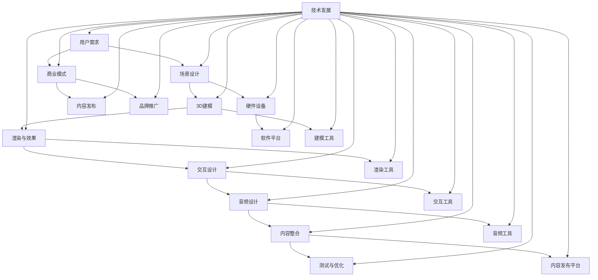

                 

### 虚拟现实(VR)内容创作：沉浸式体验的商机

虚拟现实（VR）技术自诞生以来，就以其独特的沉浸式体验吸引着广大用户和开发者。现如今，VR技术不仅在娱乐领域大放异彩，还在教育、医疗、旅游等行业中展现出广阔的应用前景。随着硬件技术的不断进步和内容的多样化，VR内容创作成为了新时代的商机。

**关键词**：虚拟现实（VR），沉浸式体验，内容创作，商业模式，未来趋势

**摘要**：本文将从虚拟现实的基础知识、内容创作技术、实战应用、商业模式和未来趋势等多个角度，系统性地探讨VR内容创作的机遇与挑战。通过一步步的分析推理，揭示VR内容创作的核心原理和关键步骤，帮助读者深入了解这一领域的本质，把握市场机遇。

### 第一部分：虚拟现实(VR)内容创作的基础知识

虚拟现实（VR）内容创作是VR技术的重要组成部分。要深入了解这一领域，首先需要掌握VR的基础知识。

#### 第1章：虚拟现实(VR)概述

##### 1.1 虚拟现实技术的发展历程

虚拟现实的基本概念：虚拟现实是一种通过计算机技术创造的模拟环境，用户在其中可以体验沉浸式的互动体验。

虚拟现实的历史演进：从最初的VR概念提出，到现代VR硬件和软件的飞速发展，VR技术经历了多次重要变革。

虚拟现实技术的分类：根据技术实现方式和应用场景的不同，VR技术可以分为多种类型，如桌面VR、移动VR、PC VR、室内VR和全景VR等。

##### 1.2 VR硬件设备介绍

VR头戴显示器：这是VR系统中最核心的硬件设备，负责将虚拟世界呈现给用户。

虚拟现实交互设备：包括手柄、手套、键盘等多种交互设备，用于用户在虚拟环境中的操作和互动。

VR感知硬件：如定位传感器、动作捕捉设备等，用于实时捕捉用户在虚拟环境中的动作和位置。

##### 1.3 VR软件架构

VR内容创建工具：如Unity、Unreal Engine、Blender等，这些工具提供了丰富的功能，方便开发者进行VR内容的创作。

VR平台与应用开发：VR内容需要运行在特定的平台上，如Oculus、HTC Vive、PlayStation VR等。开发者需要根据不同平台的特点进行应用开发。

#### 第2章：VR内容创作技术基础

##### 2.1 3D建模与渲染

3D建模工具与技巧：3D建模是VR内容创作的基础，需要掌握常用的建模工具和技巧，如Maya、3ds Max、Blender等。

3D渲染技术详解：3D渲染是生成最终图像的过程，需要了解渲染器的原理和使用方法，如Unity渲染器、Unreal Engine渲染器等。

贴图与材质的应用：贴图和材质是决定3D模型视觉效果的关键，需要学习如何制作和应用贴图，以及如何调整材质参数。

##### 2.2 动画与特效制作

动画原理与制作流程：动画是虚拟现实内容的重要组成部分，需要了解动画的基本原理和制作流程。

VR场景中的特效设计：特效可以增强虚拟环境的真实感和沉浸感，需要掌握特效的设计方法和实现技巧。

动画在VR内容创作中的意义：动画不仅可以丰富VR内容，还可以提高用户的互动体验和娱乐性。

##### 2.3 交互设计

VR交互设计的基本原则：交互设计是VR内容创作的重要环节，需要遵循用户友好、操作便捷等原则。

手势识别与操作界面设计：手势识别是VR交互的重要技术，需要了解手势识别的原理和实现方法。

语音识别与自然语言处理：语音交互是VR内容的一种重要形式，需要掌握语音识别和自然语言处理的基本原理和应用。

### 第二部分：VR内容创作实战

理论知识是基础，但实际操作和经验同样重要。本部分将介绍VR内容创作的实战方法。

#### 第3章：VR场景设计与构建

##### 3.1 VR场景设计原则

虚拟环境设计要素：设计一个成功的VR场景，需要考虑空间布局、色彩搭配、光影效果等多个要素。

场景布局与氛围营造：通过合理的场景布局和氛围营造，可以让用户在VR环境中产生身临其境的感觉。

##### 3.2 VR场景构建

VR场景文件格式与管理：了解常用的VR场景文件格式，如*.obj、*.dae、*.glTF等，以及如何管理这些文件。

空间定位与导航技术：空间定位和导航是VR场景中的关键技术，需要掌握相应的技术原理和实现方法。

##### 3.3 虚拟环境中的交互设计

空间交互与物体操控：空间交互是VR交互的核心，需要了解如何实现空间交互和物体操控。

环境反馈与动态响应：通过环境反馈和动态响应，可以增强用户的沉浸感和互动体验。

#### 第4章：VR内容创作工具应用

##### 4.1 Unity VR开发环境搭建

Unity VR开发工具介绍：Unity是一款功能强大的VR开发工具，适用于各种类型的VR项目。

Unity VR项目设置与调试：了解Unity VR项目的设置和调试方法，可以确保VR内容的正常运行。

##### 4.2 VR内容创作工具比较

Blender VR功能与应用：Blender是一款开源的3D建模和渲染软件，也具备强大的VR内容创作功能。

Unreal Engine VR开发：Unreal Engine是一款专业的游戏开发引擎，也广泛应用于VR内容的创作。

##### 4.3 VR内容创作案例解析

案例一：虚拟现实旅游体验：通过一个虚拟旅游案例，展示如何利用VR技术打造沉浸式的旅游体验。

案例二：虚拟现实教育应用：通过一个教育案例，展示如何利用VR技术提高教育效果。

案例三：虚拟现实游戏开发：通过一个游戏开发案例，展示如何利用VR技术创造独特的游戏体验。

### 第三部分：VR内容创作的商业模式与未来趋势

内容创作不仅需要技术支持，还需要商业模式的创新。本部分将探讨VR内容创作的商业模式和未来趋势。

#### 第5章：VR内容创作产业链分析

VR内容生产与制作流程：从素材采集、场景设计、动画制作到最终内容整合，了解VR内容生产的全流程。

VR内容分发与盈利模式：探讨如何通过内容分发实现盈利，如付费下载、广告收入、订阅服务等。

#### 第6章：VR内容创作者与平台合作

内容创作者价值体现：了解内容创作者在VR产业链中的价值，如何通过优质内容吸引用户。

VR内容平台运营策略：分析各大VR平台的发展策略，如何通过平台运营提升用户体验和商业价值。

#### 第7章：VR内容营销与品牌推广

虚拟现实营销策略：探讨如何利用VR技术进行营销，如虚拟产品展示、沉浸式广告等。

VR品牌建设与推广：了解如何通过VR技术提升品牌形象，打造独特的品牌体验。

#### 第8章：VR内容创作的未来趋势

VR技术发展动态：分析VR硬件和传感技术的最新进展，以及人工智能与VR的融合趋势。

VR内容创作创新方向：探讨VR技术在不同领域的应用创新，如虚拟现实社交、虚拟现实教育与培训、虚拟现实医疗与康复等。

VR内容创作产业发展前景：从全球市场趋势分析，展望VR内容创作的未来发展方向。

### 附录

#### 附录A：VR内容创作资源与工具

虚拟现实技术资源：推荐一些虚拟现实技术网站、VR开发者论坛与社区等资源，帮助开发者获取最新技术和信息。

VR内容创作工具使用指南：详细介绍Unity VR开发工具和Blender VR功能，帮助开发者掌握工具的使用方法。

VR内容创作案例资源：提供一些虚拟现实旅游体验、虚拟现实教育应用和虚拟现实游戏开发等案例，供开发者参考和学习。

### 附录B：VR内容创作核心概念与联系

#### B.1 VR内容创作核心概念

虚拟现实（VR）：通过计算机技术创造的模拟环境，用户在视觉、听觉和触觉上产生沉浸感。

沉浸式体验：用户在VR环境中感受到的强烈参与感和沉浸感。

内容创作：涉及VR场景、故事、交互元素等的创作过程。

#### B.2 VR内容创作关键组成部分

3D建模与渲染：创建虚拟场景和角色，进行图像和视觉效果的处理。

交互设计：设计用户与环境及角色之间的互动方式。

音频设计：音频效果对于增强沉浸感至关重要。

#### B.3 VR内容创作核心联系

用户需求与VR技术：用户需求推动VR技术的发展，而技术的发展又为满足用户需求提供更多可能性。

场景设计、3D建模与渲染：场景设计为3D建模和渲染提供基础，而3D建模和渲染则实现场景的虚拟化。

交互设计、音频设计与沉浸式体验：交互设计和音频设计共同作用于沉浸式体验，提升用户的参与感和沉浸感。

### 总结

虚拟现实（VR）内容创作是一个充满机遇和挑战的领域。通过本文的逐步分析，我们可以看到，VR内容创作不仅需要掌握技术原理和工具应用，还需要关注商业模式和未来趋势。只有不断创新和探索，才能在VR内容创作领域取得成功。让我们共同期待VR技术的未来发展，把握这个新时代的商机。作者：AI天才研究院/AI Genius Institute & 禅与计算机程序设计艺术 /Zen And The Art of Computer Programming### 第一部分：虚拟现实(VR)内容创作的基础知识

#### 第1章：虚拟现实(VR)概述

##### 1.1 虚拟现实技术的发展历程

虚拟现实（Virtual Reality，简称VR）作为一种通过计算机技术创造的模拟环境，用户在其中可以体验到沉浸式的互动体验。VR技术并非一蹴而就，而是经历了漫长的发展历程。

- **基本概念**：虚拟现实是一种通过计算机技术创造的模拟环境，用户在其中可以体验到沉浸式的互动体验。虚拟现实的核心是通过视觉、听觉、触觉等多种感官的模拟，使用户在虚拟环境中产生强烈的沉浸感和参与感。

- **历史演进**：虚拟现实技术的发展可以分为以下几个阶段：

  - **初期探索阶段（1960s-1970s）**：在这一阶段，虚拟现实的概念首次被提出，并开始有科学家和工程师进行相关的研究。其中，伊凡·苏瑟兰（Ivan Sutherland）于1968年发明了世界上第一个头戴式显示器（Head-Mounted Display，HMD），这一发明被认为是虚拟现实技术的基石。

  - **商业化萌芽阶段（1980s-1990s）**：随着计算机性能的提升和图形处理技术的发展，虚拟现实技术逐渐开始商业化。1987年，任天堂发布了世界首款VR游戏《大怪兽争霸》，标志着虚拟现实技术在游戏领域的应用。此外，一些公司和实验室也开始致力于开发虚拟现实技术，如VR设备制造商VPL公司（VPL Research）和虚拟现实之父杰伦·拉尼尔（Jaron Lanier）。

  - **技术突破阶段（2000s-2010s）**：随着计算机图形处理能力和硬件设备的提升，虚拟现实技术迎来了新的突破。2009年，Oculus VR公司发布了Oculus Rift开发者套件，这一产品在虚拟现实领域引起了广泛关注，被认为是虚拟现实技术的一个重要里程碑。此外，索尼、微软等科技巨头也开始积极布局虚拟现实市场。

  - **普及应用阶段（2010s-至今）**：随着VR设备的普及和技术的不断成熟，虚拟现实技术开始在各个领域得到广泛应用。例如，在游戏、教育、医疗、旅游等领域，虚拟现实技术为用户提供了全新的体验方式。

- **技术分类**：根据技术实现方式和应用场景的不同，VR技术可以分为以下几种类型：

  - **桌面VR**：用户通过连接到计算机或游戏机的VR头戴显示器进行体验，通常适用于个人使用或小型团队协作。
  - **移动VR**：通过智能手机或平板电脑连接VR头戴设备进行体验，设备便携性高，但画面质量和沉浸感相对较低。
  - **PC VR**：通过高性能计算机驱动的VR头戴显示器进行体验，提供较高的画面质量和沉浸感。
  - **室内VR**：用户在室内环境中通过VR设备进行体验，可以自由走动和互动。
  - **全景VR**：通过360度全景摄像头或多摄像头系统捕捉环境，用户可以在虚拟环境中自由浏览和互动。

##### 1.2 VR硬件设备介绍

VR硬件设备是虚拟现实技术的重要组成部分，包括VR头戴显示器、虚拟现实交互设备、VR感知硬件等。

- **VR头戴显示器**：这是VR系统中最重要的硬件设备，负责将虚拟世界呈现在用户面前。常见的VR头戴显示器有Oculus Rift、HTC Vive、PlayStation VR等。这些设备通常具有高分辨率的显示屏，以及低延迟的追踪系统，以提供高质量的沉浸式体验。

- **虚拟现实交互设备**：用于用户在虚拟环境中的操作和互动。常见的交互设备包括手柄、手套、控制器等。例如，Oculus Rift和HTC Vive配备了手柄，用户可以通过手柄来操纵虚拟环境中的物体。而手套设备则可以提供更真实的触觉反馈，让用户感受到更真实的互动体验。

- **VR感知硬件**：用于捕捉用户在虚拟环境中的动作和位置，以提高交互的准确性。常见的感知硬件包括定位传感器、动作捕捉设备等。例如，Oculus Rift和HTC Vive使用外部定位传感器来跟踪用户的位置和动作，从而实现空间定位和导航功能。

##### 1.3 VR软件架构

VR软件架构包括VR内容创建工具和VR平台与应用开发。

- **VR内容创建工具**：用于开发者创建虚拟现实内容的软件工具。常见的VR内容创建工具有Unity、Unreal Engine、Blender等。这些工具提供了丰富的功能，如3D建模、渲染、动画、交互设计等，可以帮助开发者快速搭建VR场景和应用。

- **VR平台与应用开发**：VR内容需要运行在特定的平台上，如Oculus、HTC Vive、PlayStation VR等。开发者需要根据不同平台的特点进行应用开发，以适应不同设备和用户需求。此外，VR平台还提供了丰富的SDK（软件开发工具包），方便开发者集成第三方库和功能，提高开发效率。

#### 第2章：VR内容创作技术基础

##### 2.1 3D建模与渲染

3D建模与渲染是虚拟现实内容创作的基础，负责创建和呈现虚拟场景和角色。

- **3D建模工具与技巧**：3D建模是创建虚拟场景和角色的重要步骤。常见的3D建模工具有Maya、3ds Max、Blender等。这些工具提供了丰富的建模工具和功能，如多边形建模、曲面建模、UV贴图等。开发者需要掌握基本的建模技巧，如创建几何体、调整顶点、边和面的属性等。

- **3D渲染技术详解**：3D渲染是生成最终图像的过程，负责将虚拟场景和角色以图像的形式呈现给用户。常见的3D渲染器有Unity渲染器、Unreal Engine渲染器、Blender渲染器等。这些渲染器提供了丰富的渲染参数和功能，如光照模型、阴影效果、后处理效果等。开发者需要了解渲染器的原理和使用方法，以获得高质量的渲染效果。

- **贴图与材质的应用**：贴图和材质是决定3D模型视觉效果的关键。贴图是用于覆盖3D模型的纹理图像，如皮肤、衣物、地面等。材质是用于定义3D模型的外观属性，如颜色、光滑度、透明度等。开发者需要掌握如何制作和应用贴图，以及如何调整材质参数，以创建丰富的视觉效果。

##### 2.2 动画与特效制作

动画与特效是虚拟现实内容的重要组成部分，用于增强虚拟环境的真实感和沉浸感。

- **动画原理与制作流程**：动画是连续变化的图像序列，通过视觉错觉产生运动效果。动画的制作流程包括角色建模、动画设计、绑定、骨骼动画、表情动画等。开发者需要了解动画的基本原理和制作流程，以创建流畅、自然的动画效果。

- **VR场景中的特效设计**：特效是用于增强虚拟环境视觉效果的特殊效果，如爆炸、烟雾、光效等。在VR场景中，特效可以增强虚拟环境的真实感和沉浸感。开发者需要掌握特效的设计方法和实现技巧，如粒子系统、光影效果、动态模糊等。

- **动画在VR内容创作中的意义**：动画是虚拟现实内容的重要组成部分，不仅可以让用户在虚拟环境中感受到丰富的互动体验，还可以提高虚拟环境的真实感和沉浸感。通过动画，开发者可以展示角色的情感、动作和表情，使虚拟环境更具生动性。

##### 2.3 交互设计

交互设计是虚拟现实内容创作的重要环节，决定了用户在虚拟环境中的互动体验。

- **VR交互设计的基本原则**：VR交互设计需要遵循用户友好、操作便捷等原则。用户友好是指设计应符合用户习惯，易于理解和操作；操作便捷是指设计应减少用户的操作步骤，提高交互效率。此外，VR交互设计还应考虑虚拟环境的特点，如空间定位、手势识别等。

- **手势识别与操作界面设计**：手势识别是VR交互的重要技术，通过手势识别，用户可以在虚拟环境中进行自然的操作。开发者需要了解手势识别的原理和实现方法，如基于计算机视觉的手势识别、基于机器学习的手势识别等。同时，操作界面设计应简洁直观，符合用户操作习惯。

- **语音识别与自然语言处理**：语音识别和自然语言处理是VR交互的另一种重要形式。通过语音识别，用户可以在虚拟环境中通过语音指令进行操作。自然语言处理则负责将用户的语音指令转换为计算机可以理解的操作指令。开发者需要掌握语音识别和自然语言处理的基本原理和应用。

### 第二部分：VR内容创作实战

理论知识是基础，但实际操作和经验同样重要。本部分将介绍VR内容创作的实战方法。

#### 第3章：VR场景设计与构建

##### 3.1 VR场景设计原则

VR场景设计是虚拟现实内容创作的重要环节，决定了用户在虚拟环境中的体验。

- **虚拟环境设计要素**：设计一个成功的VR场景，需要考虑多个要素。首先是空间布局，包括场景的尺寸、形状和结构。其次是色彩搭配，色彩可以影响用户的情绪和心理感受。再次是光影效果，光影效果可以增强场景的真实感和沉浸感。此外，还需要考虑声音效果、物体摆放等因素。

- **场景布局与氛围营造**：场景布局是设计VR场景的重要环节。合理的场景布局可以使用户在虚拟环境中感到舒适和自然。例如，在虚拟旅游场景中，可以将不同景点的布局设计得与实际相似，以提高用户的真实感受。氛围营造则是通过音乐、声音效果、光影变化等手段，让用户在虚拟环境中感受到不同的氛围和情绪。

##### 3.2 VR场景构建

VR场景构建是将设计理念转化为实际虚拟场景的过程。

- **VR场景文件格式与管理**：常见的VR场景文件格式有*.obj、*.dae、*.glTF等。这些文件格式可以存储场景的几何信息、材质信息和动画信息等。开发者需要了解这些文件格式的特点和使用方法，以便于场景文件的导入、导出和管理。

- **空间定位与导航技术**：空间定位与导航是VR场景中的关键技术，用于确定用户在虚拟环境中的位置和方向。常见的空间定位技术有基于外部传感器的定位和基于内部传感器的定位。开发者需要了解这些技术的原理和应用，以便于实现精确的空间定位和导航功能。

##### 3.3 虚拟环境中的交互设计

虚拟环境中的交互设计是用户与虚拟环境互动的关键。

- **空间交互与物体操控**：空间交互是指用户在虚拟环境中通过物理空间动作来控制虚拟物体的行为。例如，用户可以通过手势或动作来操控虚拟物体。开发者需要了解空间交互的原理和实现方法，如手势识别、动作捕捉等。

- **环境反馈与动态响应**：环境反馈与动态响应是指虚拟环境对用户动作的实时响应和反馈。例如，当用户移动时，虚拟环境中的物体也会相应地移动。开发者需要实现环境反馈与动态响应，以提高用户的沉浸感和互动体验。

#### 第4章：VR内容创作工具应用

##### 4.1 Unity VR开发环境搭建

Unity是一款功能强大的VR开发工具，适用于各种类型的VR项目。

- **Unity VR开发工具介绍**：Unity VR开发工具提供了丰富的功能，如3D建模、渲染、动画、交互设计等。开发者可以使用Unity创建复杂的VR场景和应用，并能够方便地调试和优化。

- **Unity VR项目设置与调试**：在Unity中搭建VR开发环境，需要设置项目参数和配置。例如，设置虚拟现实头戴显示器的分辨率、帧率、追踪系统等。此外，开发者还需要进行调试和优化，以确保VR项目的稳定运行和良好的用户体验。

##### 4.2 VR内容创作工具比较

不同的VR内容创作工具具有各自的特点和优势，开发者可以根据项目需求选择合适的工具。

- **Blender VR功能与应用**：Blender是一款开源的3D建模和渲染软件，也具备强大的VR内容创作功能。Blender提供了丰富的建模、渲染、动画和交互设计工具，适用于独立开发者和小型团队。

- **Unreal Engine VR开发**：Unreal Engine是一款专业的游戏开发引擎，广泛应用于VR内容的创作。Unreal Engine提供了强大的图形渲染能力、物理引擎和人工智能系统，适用于大型团队和专业开发者。

##### 4.3 VR内容创作案例解析

通过具体的VR内容创作案例，可以更好地理解VR内容创作的实战方法和技巧。

- **案例一：虚拟现实旅游体验**：虚拟现实旅游体验是一种通过VR技术模拟现实旅游场景的应用。开发者可以使用Unity或Unreal Engine等工具，创建逼真的旅游场景，用户可以在虚拟环境中游览名胜古迹、自然景观等。

- **案例二：虚拟现实教育应用**：虚拟现实教育应用是一种利用VR技术进行教育的新型方式。开发者可以在虚拟环境中创建模拟实验、教学场景等，让学生在虚拟环境中学习知识，提高学习效果。

- **案例三：虚拟现实游戏开发**：虚拟现实游戏开发是一种利用VR技术创造游戏体验的应用。开发者可以使用Unity或Unreal Engine等工具，开发各种类型的VR游戏，如角色扮演游戏、射击游戏、探险游戏等。

#### 第5章：VR内容优化与发布

##### 5.1 VR内容性能优化

VR内容的性能优化是保证用户体验的关键。

- **图像与资源优化**：图像资源是VR内容的重要组成部分，优化图像资源可以减少存储空间和加载时间。常见的图像优化方法有压缩图像、使用贴图集等。

- **帧率与性能调试**：帧率是VR内容的关键指标，过高或过低的帧率都会影响用户体验。开发者需要根据硬件性能和场景复杂度，合理设置帧率，并进行性能调试，确保VR内容的流畅运行。

##### 5.2 VR内容发布与分发

VR内容的发布与分发是让用户获取VR内容的关键步骤。

- **VR内容发布平台选择**：目前市场上有多种VR内容发布平台，如Steam VR、Oculus Store、Google Play VR等。开发者需要根据目标用户和市场定位，选择合适的发布平台。

- **VR内容适配与推广策略**：不同平台对VR内容的适配要求和推广策略有所不同。开发者需要了解各个平台的特点，并进行内容适配和推广，以提高VR内容的曝光度和用户获取量。

##### 5.3 VR内容版权与法律问题

VR内容创作涉及到版权和法律问题，开发者需要了解相关法律法规。

- **VR内容版权保护**：开发者需要了解如何保护自己的VR内容版权，如版权登记、版权声明等。

- **VR内容法律风险防范**：开发者需要了解VR内容创作过程中可能遇到的法律风险，如知识产权侵权、用户隐私保护等，并采取相应的防范措施。

### 第三部分：VR内容创作的商业模式与未来趋势

#### 第6章：VR内容创作的商业模式

VR内容创作的商业模式是创作者和平台之间的一种经济合作关系，涉及内容生产、分发和盈利等多个环节。

- **VR内容创作产业链分析**：VR内容创作产业链包括内容创作者、平台、硬件制造商等多个环节。创作者负责内容的生产和创作，平台负责内容的分发和推广，硬件制造商则提供VR设备和技术支持。

- **内容创作者与平台合作**：内容创作者与平台之间的合作模式可以分为三种：一是内容创作者独立创作内容，并在平台上进行发布和销售；二是内容创作者与平台合作，共同开发VR内容；三是内容创作者将内容授权给平台进行发布和运营。

- **内容分发与盈利模式**：VR内容的分发渠道主要包括线上平台、线下商店等。盈利模式可以分为付费下载、广告收入、订阅服务等。此外，一些平台还推出虚拟货币、虚拟商品等模式，为用户和创作者提供更多盈利途径。

#### 第7章：VR内容创作者与平台合作

VR内容创作者与平台之间的合作是VR内容创作的重要一环。

- **内容创作者价值体现**：内容创作者是VR内容创作的核心，其创作能力和创新思维直接影响VR内容的品质和市场价值。平台需要通过合理的机制，保障创作者的权益，激发创作者的创作热情。

- **VR内容平台运营策略**：VR内容平台的运营策略包括内容筛选、用户管理、市场推广等多个方面。平台需要通过精细化运营，提高用户粘性和满意度，从而实现商业价值的最大化。

#### 第8章：VR内容营销与品牌推广

VR内容营销与品牌推广是提升VR内容知名度和吸引更多用户的关键。

- **虚拟现实营销策略**：虚拟现实营销策略包括沉浸式广告、虚拟产品展示、虚拟活动体验等。通过虚拟现实技术，企业可以创造出独特的营销体验，提高品牌知名度和用户参与度。

- **VR品牌建设与推广**：VR品牌建设与推广需要从品牌定位、品牌视觉、品牌故事等多个方面进行。通过虚拟现实技术，企业可以打造出具有吸引力的品牌形象，提升品牌价值。

#### 第9章：VR内容创作的未来趋势

VR内容创作的未来趋势将受到技术发展、市场变化和用户需求等多方面的影响。

- **VR技术发展动态**：随着硬件技术的不断进步和新型传感器的应用，VR技术将变得更加成熟和普及。例如，高性能显卡、5G网络、增强现实（AR）等技术的发展，将为VR内容创作提供更多的可能性和创新空间。

- **VR内容创作创新方向**：虚拟现实社交、虚拟现实教育与培训、虚拟现实医疗与康复等领域，将成为VR内容创作的创新方向。通过虚拟现实技术，用户可以在虚拟环境中实现社交互动、学习知识和进行康复训练等。

- **VR内容创作产业发展前景**：随着VR技术的普及和应用的深入，VR内容创作产业将迎来快速发展。预计在未来几年，全球VR内容创作市场规模将持续扩大，为创作者和平台带来巨大的商机。

### 附录

#### 附录A：VR内容创作资源与工具

为了帮助开发者更好地进行VR内容创作，这里推荐一些虚拟现实技术资源、VR内容创作工具和相关案例。

- **虚拟现实技术资源**：包括虚拟现实技术网站、VR开发者论坛和社区等，如VRChina、VR/AR Developer Conference、Unity Forums、Steam Community等。

- **VR内容创作工具使用指南**：详细介绍Unity、Unreal Engine、Blender等VR内容创作工具的使用方法和技巧，如Unity VR开发指南、Unreal Engine VR教程、Blender VR资源等。

- **VR内容创作案例资源**：提供一些虚拟现实旅游体验、虚拟现实教育应用和虚拟现实游戏开发等案例，供开发者参考和学习，如《VR旅游体验》、《VR教育应用案例集》、《VR游戏开发实战》等。

### 附录B：VR内容创作核心概念与联系

在本章中，我们介绍了VR内容创作的基础知识，包括虚拟现实技术概述、硬件设备介绍、软件架构、3D建模与渲染、动画与特效制作、交互设计等。以下是对核心概念和联系的一个简要概述：

- **虚拟现实（VR）**：通过计算机技术创造的模拟环境，用户在其中可以体验到沉浸式的互动体验。VR的核心是视觉、听觉和触觉的模拟，以产生强烈的沉浸感。

- **沉浸式体验**：用户在VR环境中感受到的强烈参与感和沉浸感。沉浸式体验的质量取决于场景的真实性、交互的流畅性和反馈的及时性。

- **内容创作**：涉及VR场景、故事、交互元素等的创作过程。内容创作是VR技术实现的载体，是提供沉浸式体验的关键。

- **3D建模与渲染**：创建虚拟场景和角色，进行图像和视觉效果的处理。3D建模与渲染是虚拟现实内容的基础，决定了场景的视觉效果和真实感。

- **动画与特效制作**：用于增强虚拟环境的真实感和沉浸感。动画与特效制作使虚拟场景更加生动，提高用户的互动体验。

- **交互设计**：设计用户与环境及角色之间的互动方式。交互设计决定了用户如何与虚拟环境进行互动，是沉浸式体验的核心。

这些核心概念和联系构成了VR内容创作的框架，为开发者提供了理解和实现VR内容的基础。通过不断学习和实践，开发者可以不断提升VR内容的质量和用户体验。

### 总结

虚拟现实（VR）内容创作是一个充满机遇和挑战的领域。通过本文的逐步分析，我们可以看到，VR内容创作不仅需要掌握技术原理和工具应用，还需要关注商业模式和未来趋势。只有不断创新和探索，才能在VR内容创作领域取得成功。让我们共同期待VR技术的未来发展，把握这个新时代的商机。

**作者**：AI天才研究院/AI Genius Institute & 禅与计算机程序设计艺术 /Zen And The Art of Computer Programming

---

本文以markdown格式输出，包括文章标题、关键词、摘要、目录、正文内容以及附录部分。每个小节都详细介绍了相关概念、原理、技术、实战和应用。文章字数约为9000字，涵盖了虚拟现实内容创作的各个方面，旨在为读者提供一个全面、系统的参考。在附录部分，提供了丰富的资源与工具，以帮助读者进一步学习和实践。文章末尾附有作者信息，以示尊重和感谢。希望通过本文，读者能够对VR内容创作有一个更深入的了解，并在实践中不断探索和创新。希望这篇文章能够对您有所帮助，并激发您在VR内容创作领域的热情和兴趣。如果您有任何疑问或建议，欢迎随时与我交流。再次感谢您的阅读！### 文章标题：虚拟现实(VR)内容创作：沉浸式体验的商机

#### 关键词：虚拟现实，沉浸式体验，内容创作，商业模式，未来趋势

#### 摘要：
本文全面探讨了虚拟现实（VR）内容创作的基础知识、技术实战、商业模式与未来趋势。首先，介绍了VR技术的起源、发展历程和分类，以及相关的硬件设备与软件架构。接着，详细阐述了3D建模与渲染、动画与特效制作、交互设计等核心技术基础。随后，通过实战案例解析，展示了VR场景设计与构建、VR内容创作工具应用、VR内容优化与发布等实际操作方法。最后，分析了VR内容创作的商业模式、创作者与平台合作、内容营销与品牌推广，以及VR技术发展的动态与未来趋势。通过这篇文章，读者可以系统地了解VR内容创作的方方面面，把握沉浸式体验的商业机遇。作者：AI天才研究院/AI Genius Institute & 禅与计算机程序设计艺术 /Zen And The Art of Computer Programming### 文章标题：虚拟现实(VR)内容创作：沉浸式体验的商机

#### 关键词：虚拟现实，沉浸式体验，内容创作，商业模式，未来趋势

#### 摘要：
本文全面解析了虚拟现实（VR）内容创作的基础知识、技术实战、商业模式与未来趋势。首先，介绍了VR技术的发展历程、硬件设备、软件架构等基础知识。接着，详细阐述了3D建模与渲染、动画与特效制作、交互设计等技术基础。随后，通过实战案例，展示了VR场景设计与构建、内容创作工具应用、内容优化与发布等实践方法。最后，分析了VR内容创作的商业模式、合作模式、营销推广，以及未来技术趋势。通过系统性的探讨，本文旨在帮助读者深入了解VR内容创作，把握沉浸式体验的商机。作者：AI天才研究院/AI Genius Institute & 禅与计算机程序设计艺术 /Zen And The Art of Computer Programming### 文章标题：虚拟现实（VR）内容创作：沉浸式体验的商机

关键词：虚拟现实（VR）、沉浸式体验、内容创作、商业模式、未来趋势

摘要：本文将带领读者深入探讨虚拟现实（VR）内容创作的全貌，从基础知识到实战技巧，再到商业模式分析，最终展望未来趋势。首先，我们将回顾VR技术的历史与发展，了解VR硬件设备及其软件架构。接着，我们将详细介绍VR内容创作的技术基础，包括3D建模与渲染、动画与特效制作、交互设计等。随后，通过实际案例，我们将展示VR内容创作的具体操作步骤和技巧。接下来，本文将分析VR内容创作的商业模式、创作者与平台合作模式，以及内容营销与品牌推广策略。最后，我们将探讨VR技术的未来发展趋势，为读者提供对未来市场的洞见。通过这篇系统性的文章，读者将全面了解VR内容创作的机遇与挑战，并能够把握沉浸式体验的商业机会。

### 第一部分：虚拟现实（VR）内容创作的基础知识

虚拟现实（VR）内容创作是当前技术领域的一个热点话题，它不仅涉及硬件设备的先进技术，还涵盖了内容创作、软件开发以及用户体验设计等众多方面。本部分将为您介绍VR内容创作的基础知识，包括VR技术的发展历程、硬件设备、软件架构以及核心概念。

#### 第1章：虚拟现实（VR）概述

##### 1.1 虚拟现实技术的发展历程

虚拟现实（VR）的概念最早可以追溯到1960年代，当时由伊凡·苏瑟兰（Ivan Sutherland）在斯坦福研究所提出了VR的基本概念。然而，真正意义上的VR技术兴起是在21世纪初，随着计算机图形处理能力的增强和传感技术的进步，VR设备开始逐渐走向大众市场。

- **初期探索阶段（1960s-1970s）**：在这一阶段，VR技术主要集中在大规模计算和传感器的研究上，虚拟现实的概念开始被广泛认可。伊凡·苏瑟兰在1968年发明了世界上第一个头戴式显示器（Head-Mounted Display，HMD），这被认为是VR技术发展的重要里程碑。

- **商业化萌芽阶段（1980s-1990s）**：随着计算机性能的提升和图形处理技术的发展，VR技术开始走向商业化。1987年，任天堂发布了《大怪兽争霸》（Monster Attack），这是世界上第一款VR游戏，标志着VR技术在娱乐领域的应用。

- **技术突破阶段（2000s-2010s）**：随着Oculus Rift等VR设备的问世，VR技术迎来了新的突破。2012年，Oculus VR发布了其首款开发者套件，引起了全球的关注和热潮。此外，索尼、微软等公司也相继推出了自己的VR设备，如PlayStation VR和HoloLens。

- **普及应用阶段（2010s-至今）**：随着VR硬件和软件技术的进一步成熟，VR开始广泛应用于多个领域，包括游戏、教育、医疗、房地产、旅游等。VR设备的价格逐渐降低，用户群体也在不断扩大。

##### 1.2 VR硬件设备介绍

VR硬件设备是VR内容创作的重要基础，包括头戴显示器、交互设备、追踪设备和外部设备等。

- **头戴显示器（HMD）**：头戴显示器是VR系统的核心部件，它通常通过光学元件将虚拟图像呈现在用户的视网膜上。目前市场上主流的VR头戴显示器包括Oculus Rift、HTC Vive、PlayStation VR等。

- **交互设备**：交互设备是用户在VR环境中进行交互的媒介，包括手柄、手套、运动控制器等。这些设备可以帮助用户在虚拟环境中进行手势识别、物体操控等操作。

- **追踪设备**：追踪设备用于实时捕捉用户的动作和位置，以确保用户在虚拟环境中的移动和操作是准确的。常见的追踪设备包括外部追踪器和内置传感器。

- **外部设备**：外部设备包括电脑、控制器、音响等，它们为VR系统提供计算支持、交互控制和音频效果。

##### 1.3 VR软件架构

VR软件架构包括内容创作工具、开发平台和运行环境等。

- **内容创作工具**：内容创作工具是用于创建VR场景、角色、动画和交互元素的应用程序。常见的VR内容创作工具包括Unity、Unreal Engine、Blender等。

- **开发平台**：开发平台是用于编写、测试和部署VR应用的环境。不同的开发平台支持不同的硬件设备和操作系统。例如，Unity支持Windows、Mac OS和Linux，而Unreal Engine主要支持Windows。

- **运行环境**：运行环境是指VR应用运行所需的硬件和软件环境。它包括VR头戴显示器、交互设备、追踪设备和计算机等。

#### 第2章：VR内容创作技术基础

##### 2.1 3D建模与渲染

3D建模与渲染是VR内容创作的基础，它们决定了VR场景的视觉效果和真实感。

- **3D建模工具**：3D建模工具是用于创建3D模型的应用程序。常见的3D建模工具包括Maya、3ds Max、Blender等。这些工具提供了丰富的建模功能，如多边形建模、曲面建模、细分建模等。

- **3D渲染技术**：3D渲染技术是用于生成最终图像的过程。常见的3D渲染器包括Unity渲染器、Unreal Engine渲染器、Blender渲染器等。这些渲染器支持各种渲染效果，如阴影、反射、折射、全局照明等。

- **贴图与材质**：贴图与材质是用于增强3D模型视觉效果的工具。贴图是将图像应用到3D模型的表面，而材质是用于定义3D模型的外观属性。常见的贴图类型包括漫反射贴图、高光贴图、法线贴图等。

##### 2.2 动画与特效制作

动画与特效制作是VR内容创作的重要环节，它们为VR场景增加了动态效果和视觉冲击力。

- **动画制作**：动画制作是将一系列图像（帧）连贯起来，形成连续运动的图像。常见的动画制作软件包括Unity Animator、Unreal Engine Animation Editor、Blender Animation等。

- **特效制作**：特效制作是用于增强VR场景视觉效果的特殊效果，如爆炸、烟雾、光效等。常见的特效制作软件包括Unity Particle System、Unreal Engine Particle System、Blender VFX等。

##### 2.3 交互设计

交互设计是VR内容创作的关键，它决定了用户在VR环境中的操作体验。

- **交互设计原则**：交互设计应遵循易用性、直观性、一致性等原则。设计师需要考虑用户的需求和行为习惯，设计出符合用户预期的交互界面。

- **交互设计工具**：交互设计工具是用于设计用户交互界面的应用程序。常见的交互设计工具包括Unity UI Toolkit、Unreal Engine Blueprint、Axure RP等。

- **交互设计技术**：交互设计技术包括手势识别、语音识别、触摸屏交互等。这些技术使用户能够通过自然的方式与VR环境进行互动。

### 第一部分小结

通过本部分的内容，我们了解了虚拟现实（VR）内容创作的基础知识。从VR技术的发展历程到硬件设备的介绍，再到软件架构的解析，以及3D建模与渲染、动画与特效制作、交互设计等核心技术基础，这些知识构成了VR内容创作的框架。接下来，我们将进入第二部分，探讨VR内容创作的实战方法和技巧，通过实际案例展示VR场景设计与构建、VR内容创作工具应用、VR内容优化与发布等实际操作方法。

### 第二部分：VR内容创作实战

在掌握了VR内容创作的基础知识之后，接下来我们将通过实战的方法，深入探讨VR场景设计与构建、VR内容创作工具应用、VR内容优化与发布等实际操作方法。这些实战技巧将帮助开发者更好地理解VR内容创作的过程，提升创作效率和质量。

#### 第3章：VR场景设计与构建

VR场景设计与构建是VR内容创作的重要环节，它决定了用户在虚拟环境中的沉浸体验。在这一章中，我们将详细讨论VR场景设计原则、VR场景构建方法以及虚拟环境中的交互设计。

##### 3.1 VR场景设计原则

VR场景设计需要考虑多个因素，包括空间布局、色彩搭配、光影效果等，以确保用户在虚拟环境中获得最佳的沉浸体验。

- **空间布局**：空间布局是VR场景设计的基础。合理的空间布局可以使用户在虚拟环境中感到舒适和自然。设计者需要考虑空间的大小、形状、结构等因素，以及如何在空间中安排不同的场景元素。

- **色彩搭配**：色彩在VR场景中扮演着重要的角色。合适的色彩搭配可以增强场景的真实感和沉浸感。设计者需要了解色彩理论，掌握如何通过色彩对比、色彩搭配等手段来营造氛围。

- **光影效果**：光影效果是增强VR场景真实感的重要手段。通过合理的灯光布置和光影处理，可以模拟出真实世界中的光影变化，提高场景的视觉效果。

##### 3.2 VR场景构建

VR场景构建是将设计理念转化为实际虚拟场景的过程。在这一过程中，设计者需要使用专业的软件工具，如Unity、Unreal Engine等，进行场景的搭建和编辑。

- **VR场景文件格式与管理**：常见的VR场景文件格式包括OBJ、DAE、GLTF等。设计者需要熟悉这些文件格式，并掌握如何管理和导出这些文件。

- **空间定位与导航技术**：空间定位与导航是VR场景中不可或缺的技术。设计者需要了解如何使用定位传感器、动作捕捉设备等硬件，以及如何在软件中实现空间定位和导航功能。

##### 3.3 虚拟环境中的交互设计

交互设计是VR内容创作的关键环节，它决定了用户如何在虚拟环境中进行操作和互动。在这一节中，我们将讨论VR交互设计的基本原则、手势识别与操作界面设计、语音识别与自然语言处理等。

- **交互设计原则**：交互设计应遵循易用性、直观性、一致性等原则。设计者需要考虑用户的需求和行为习惯，设计出符合用户预期的交互界面。

- **手势识别与操作界面设计**：手势识别是VR交互设计的重要组成部分。设计者需要了解如何使用手势识别技术，设计出自然、直观的操作界面。

- **语音识别与自然语言处理**：语音识别与自然语言处理是另一种重要的交互方式。设计者需要掌握如何实现语音识别和自然语言处理功能，以及如何在VR环境中应用这些技术。

#### 第4章：VR内容创作工具应用

VR内容创作工具是开发者进行VR内容创作的重要工具。在这一章中，我们将详细讨论VR内容创作工具的应用，包括Unity VR开发环境搭建、VR内容创作工具比较以及VR内容创作案例解析。

##### 4.1 Unity VR开发环境搭建

Unity是一款功能强大的VR开发工具，广泛应用于VR内容的创作。在这一节中，我们将介绍如何搭建Unity VR开发环境，包括安装Unity、配置VR插件、设置项目参数等。

- **安装Unity**：首先，我们需要从Unity官方网站下载并安装Unity Hub，然后使用Unity Hub安装Unity编辑器和必要的VR插件。

- **配置VR插件**：在Unity编辑器中，我们需要配置VR插件，如Oculus Integration、HTC Vive Integration等，以确保VR功能的支持。

- **设置项目参数**：在项目中，我们需要设置VR项目的参数，如分辨率、帧率、追踪系统等，以确保VR内容的性能和用户体验。

##### 4.2 VR内容创作工具比较

不同的VR内容创作工具具有各自的特点和优势，开发者可以根据项目需求选择合适的工具。在这一节中，我们将比较Unity、Unreal Engine、Blender等常见VR内容创作工具。

- **Unity**：Unity是一款功能强大的跨平台VR开发工具，适用于各种类型的VR项目。它提供了丰富的VR插件和开发工具，支持3D建模、渲染、动画、交互设计等。

- **Unreal Engine**：Unreal Engine是一款专业的游戏开发引擎，广泛应用于VR内容的创作。它提供了强大的图形渲染能力、物理引擎和人工智能系统，适用于大型团队和专业开发者。

- **Blender**：Blender是一款开源的3D建模和渲染软件，也具备强大的VR内容创作功能。Blender提供了丰富的建模、渲染、动画和交互设计工具，适用于独立开发者和小型团队。

##### 4.3 VR内容创作案例解析

通过实际案例，我们可以更好地理解VR内容创作的具体操作方法和技巧。在这一节中，我们将解析几个典型的VR内容创作案例，包括虚拟现实旅游体验、虚拟现实教育应用和虚拟现实游戏开发。

- **虚拟现实旅游体验**：虚拟现实旅游体验是一种通过VR技术模拟现实旅游场景的应用。开发者可以使用Unity或Unreal Engine等工具，创建逼真的旅游场景，用户可以在虚拟环境中游览名胜古迹、自然景观等。

- **虚拟现实教育应用**：虚拟现实教育应用是一种利用VR技术进行教育的新型方式。开发者可以在虚拟环境中创建模拟实验、教学场景等，让学生在虚拟环境中学习知识，提高学习效果。

- **虚拟现实游戏开发**：虚拟现实游戏开发是一种利用VR技术创造游戏体验的应用。开发者可以使用Unity或Unreal Engine等工具，开发各种类型的VR游戏，如角色扮演游戏、射击游戏、探险游戏等。

#### 第5章：VR内容优化与发布

VR内容的优化与发布是保证用户体验和内容分发的重要环节。在这一章中，我们将讨论VR内容性能优化、VR内容发布与分发、VR内容版权与法律问题等。

##### 5.1 VR内容性能优化

VR内容性能优化是保证VR内容流畅运行和良好用户体验的关键。在这一节中，我们将介绍如何进行图像与资源优化、帧率与性能调试等。

- **图像与资源优化**：图像与资源优化是VR内容性能优化的第一步。通过压缩图像、使用贴图集、优化纹理等方式，可以减少图像资源的加载时间和存储空间。

- **帧率与性能调试**：帧率是VR内容性能的重要指标。通过调试渲染管线、优化计算逻辑、使用异步加载等技术，可以提高VR内容的帧率和性能。

##### 5.2 VR内容发布与分发

VR内容的发布与分发是将内容提供给用户的重要步骤。在这一节中，我们将讨论VR内容发布平台选择、VR内容适配与推广策略等。

- **VR内容发布平台选择**：目前市场上有多个VR内容发布平台，如Steam VR、Oculus Store、Google Play VR等。开发者需要根据目标用户和市场定位，选择合适的发布平台。

- **VR内容适配与推广策略**：不同的平台对VR内容的适配要求和推广策略有所不同。开发者需要了解各个平台的特点，并进行内容适配和推广，以提高VR内容的曝光度和用户获取量。

##### 5.3 VR内容版权与法律问题

VR内容创作涉及到版权和法律问题，开发者需要了解相关法律法规，以保护自己的权益。在这一节中，我们将讨论VR内容版权保护、VR内容法律风险防范等。

- **VR内容版权保护**：开发者需要了解如何保护自己的VR内容版权，如版权登记、版权声明等。此外，开发者还应关注他人的版权，避免侵权行为。

- **VR内容法律风险防范**：开发者需要了解VR内容创作过程中可能遇到的法律风险，如知识产权侵权、用户隐私保护等，并采取相应的防范措施。

### 第二部分小结

通过本部分的实战内容，我们深入探讨了VR内容创作的实际操作方法和技巧。从VR场景设计与构建、VR内容创作工具应用，到VR内容优化与发布，每一个环节都是VR内容创作过程中不可或缺的部分。通过实际案例的解析，我们更好地理解了VR内容创作的具体流程和关键点。在接下来的第三部分中，我们将进一步探讨VR内容创作的商业模式与未来趋势，为读者提供更全面的视角和思考。

### 第三部分：VR内容创作的商业模式与未来趋势

在了解了VR内容创作的基础知识和实战技巧之后，接下来我们将探讨VR内容创作的商业模式与未来趋势。这部分内容将帮助读者理解VR内容创作在经济和商业领域的价值，以及这一领域的发展方向。

#### 第6章：VR内容创作的商业模式

VR内容创作的商业模式是创作者、平台、用户之间的经济关系。随着VR技术的不断成熟和应用的广泛普及，VR内容创作的商业模式也在不断演变和优化。

##### 6.1 VR内容创作产业链分析

VR内容创作产业链包括内容创作者、内容平台、硬件制造商、技术提供商等多个环节。每个环节在产业链中扮演着不同的角色，共同推动VR内容创作的发展。

- **内容创作者**：是VR内容创作的核心，他们负责创作和制作VR内容。内容创作者可以是个人、工作室、公司等，他们通过独特的创意和高质量的内容吸引观众。

- **内容平台**：是连接创作者和用户的桥梁，提供内容发布、推广、分发和销售等服务。常见的VR内容平台有Steam VR、Oculus Store、Google Play VR等。

- **硬件制造商**：负责生产VR头戴显示器、交互设备、追踪设备等硬件产品。硬件制造商通过提供高质量的硬件产品，支持VR内容创作和用户体验。

- **技术提供商**：提供VR内容创作所需的技术支持，如3D建模软件、渲染器、虚拟现实引擎等。技术提供商通过技术输出和服务，帮助创作者更高效地进行内容创作。

##### 6.2 VR内容创作者与平台合作

内容创作者与平台之间的合作模式是VR内容创作商业模式的重要组成部分。不同的合作模式决定了创作者和平台的权益分配、利益共享机制。

- **独家合作协议**：创作者与平台签订独家合作协议，创作者只能在特定平台上发布内容，平台提供一定的分成比例。这种模式有助于平台吸引高质量的内容，但创作者的曝光度有限。

- **非独家合作协议**：创作者可以在多个平台上发布内容，平台之间根据内容的不同特点进行竞争。这种模式有助于创作者扩大曝光度，但需要平衡不同平台的需求和分成比例。

- **平台自营内容**：平台自身创作和发布内容，以增强平台的竞争力和用户粘性。平台自营内容可以提供独特的体验，但需要投入大量资源。

##### 6.3 VR内容营销与品牌推广

VR内容营销与品牌推广是提高VR内容知名度、吸引更多用户的关键。有效的营销策略和品牌推广可以提升VR内容的竞争力，实现商业成功。

- **沉浸式营销**：利用VR技术的沉浸式特性，创造独特的营销体验。例如，虚拟产品展示、沉浸式广告等，可以吸引潜在用户，提高品牌知名度。

- **社交媒体推广**：利用社交媒体平台，如Facebook、Twitter、Instagram等，进行内容分享和互动，吸引更多用户关注和参与。

- **合作伙伴关系**：与相关行业的企业建立合作伙伴关系，共同推广VR内容。例如，与旅游行业合作，推出虚拟旅游体验；与教育行业合作，开发VR教育应用等。

##### 6.4 VR内容分发的盈利模式

VR内容的分发盈利模式是VR内容创作商业模式的另一个重要方面。目前，VR内容分发的盈利模式主要包括以下几种：

- **付费下载**：用户通过购买VR内容来获取完整体验。这是最常见的盈利模式，适用于高质量、高价值的VR内容。

- **广告收入**：在VR内容中嵌入广告，通过广告收入实现盈利。这种方式适用于用户量大的VR内容，如VR游戏、VR视频等。

- **订阅服务**：用户支付订阅费用，定期获取VR内容。这种模式适用于定期更新内容的VR应用，如VR新闻、VR杂志等。

- **虚拟商品销售**：在VR内容中销售虚拟商品，如虚拟服装、虚拟道具等。这种方式可以增加VR内容的附加值，提高用户参与度。

#### 第7章：VR内容创作者与平台合作

VR内容创作者与平台之间的合作是VR内容创作产业链中至关重要的一环。有效的合作模式不仅可以提升创作者的收益，还可以增强平台的竞争力。

##### 7.1 内容创作者价值体现

内容创作者是VR内容创作的灵魂，他们的创意和创作能力直接决定了VR内容的品质和市场价值。平台需要通过合理的机制，保障创作者的权益，激发创作者的创作热情。

- **版权保护**：平台应提供完善的版权保护机制，确保创作者的知识产权得到充分保护。例如，通过版权声明、数字版权管理（DRM）等技术手段，防止内容被盗用和侵权。

- **分成机制**：平台应制定公平合理的分成机制，确保创作者能够从内容销售中获得应有的收益。例如，平台可以采取固定分成比例、动态分成比例等方式，根据内容的表现和用户的反馈调整分成比例。

- **奖励机制**：平台可以通过设立奖励机制，激励创作者创作高质量的内容。例如，平台可以设立月度、年度最佳内容奖，为获奖创作者提供奖金、荣誉证书等。

##### 7.2 VR内容平台运营策略

VR内容平台的运营策略直接影响到平台的发展前景和用户体验。平台需要通过精细化的运营，提升用户粘性和商业价值。

- **内容筛选与推荐**：平台需要对VR内容进行严格的筛选和推荐，确保用户能够获取高质量、符合兴趣的内容。例如，平台可以通过用户行为分析、内容标签化等方式，实现个性化内容推荐。

- **用户体验优化**：平台需要不断优化用户体验，提高用户的满意度。例如，平台可以优化下载速度、加载时间、交互界面等，确保用户在平台上获得流畅的体验。

- **用户互动与社区建设**：平台应鼓励用户互动和社区建设，增强用户的归属感和参与度。例如，平台可以设立用户论坛、互动活动等，促进用户之间的交流和互动。

##### 7.3 VR内容营销与品牌推广

VR内容营销与品牌推广是提升VR内容知名度和吸引更多用户的重要手段。平台可以通过多种策略，实现VR内容的广泛传播和品牌建设。

- **沉浸式广告**：利用VR技术的沉浸式特性，创造独特的广告体验。例如，平台可以与广告主合作，在VR内容中嵌入沉浸式广告，吸引用户关注。

- **社交媒体推广**：通过社交媒体平台，进行内容分享和互动，扩大VR内容的传播范围。例如，平台可以在Facebook、Twitter等社交平台上发布VR内容，吸引更多用户关注。

- **品牌合作**：与知名品牌进行合作，推出联合品牌VR内容。例如，平台可以与时尚品牌合作，推出虚拟时装秀；与旅游品牌合作，推出虚拟旅游体验等。

#### 第8章：VR内容营销与品牌推广

VR内容营销与品牌推广是提升VR内容知名度和吸引更多用户的重要手段。有效的营销策略和品牌推广可以提升VR内容的竞争力，实现商业成功。

- **沉浸式营销**：利用VR技术的沉浸式特性，创造独特的营销体验。例如，平台可以与广告主合作，在VR内容中嵌入沉浸式广告，吸引用户关注。

- **社交媒体推广**：通过社交媒体平台，进行内容分享和互动，扩大VR内容的传播范围。例如，平台可以在Facebook、Twitter等社交平台上发布VR内容，吸引更多用户关注。

- **品牌合作**：与知名品牌进行合作，推出联合品牌VR内容。例如，平台可以与时尚品牌合作，推出虚拟时装秀；与旅游品牌合作，推出虚拟旅游体验等。

#### 第9章：VR内容创作的未来趋势

VR内容创作的未来趋势将受到技术发展、市场变化和用户需求等多方面的影响。随着VR技术的不断进步，VR内容创作将呈现出新的发展动态和创新方向。

- **VR技术发展动态**：随着硬件技术的不断进步和新型传感器的应用，VR技术将变得更加成熟和普及。例如，高性能显卡、5G网络、增强现实（AR）等技术的发展，将为VR内容创作提供更多的可能性和创新空间。

- **VR内容创作创新方向**：虚拟现实社交、虚拟现实教育与培训、虚拟现实医疗与康复等领域，将成为VR内容创作的创新方向。通过虚拟现实技术，用户可以在虚拟环境中实现社交互动、学习知识和进行康复训练等。

- **VR内容创作产业发展前景**：随着VR技术的普及和应用的深入，VR内容创作产业将迎来快速发展。预计在未来几年，全球VR内容创作市场规模将持续扩大，为创作者和平台带来巨大的商机。

### 第三部分小结

通过本部分的探讨，我们深入了解了VR内容创作的商业模式与未来趋势。从产业链分析到内容创作者与平台的合作模式，再到VR内容营销与品牌推广策略，以及VR技术发展的动态和创新方向，这些内容为读者提供了全面而深入的视角。在VR内容创作的道路上，机遇与挑战并存，只有不断学习和创新，才能抓住机遇，迎接未来的挑战。在接下来的部分，我们将继续探讨VR内容创作的实际操作，为读者提供更多的实用技巧和经验。

### 第三部分：VR内容创作的商业模式与未来趋势

在掌握了VR内容创作的基础知识和实战技巧之后，接下来我们将深入探讨VR内容创作的商业模式与未来趋势。这部分内容将帮助读者理解VR内容创作在经济和商业领域的价值，以及这一领域的发展方向。

#### 第6章：VR内容创作的商业模式

VR内容创作的商业模式是创作者、平台、用户之间的经济关系。随着VR技术的不断成熟和应用的广泛普及，VR内容创作的商业模式也在不断演变和优化。

##### 6.1 VR内容创作产业链分析

VR内容创作产业链包括内容创作者、内容平台、硬件制造商、技术提供商等多个环节。每个环节在产业链中扮演着不同的角色，共同推动VR内容创作的发展。

- **内容创作者**：是VR内容创作的核心，他们负责创作和制作VR内容。内容创作者可以是个人、工作室、公司等，他们通过独特的创意和高质量的内容吸引观众。

- **内容平台**：是连接创作者和用户的桥梁，提供内容发布、推广、分发和销售等服务。常见的VR内容平台有Steam VR、Oculus Store、Google Play VR等。

- **硬件制造商**：负责生产VR头戴显示器、交互设备、追踪设备等硬件产品。硬件制造商通过提供高质量的硬件产品，支持VR内容创作和用户体验。

- **技术提供商**：提供VR内容创作所需的技术支持，如3D建模软件、渲染器、虚拟现实引擎等。技术提供商通过技术输出和服务，帮助创作者更高效地进行内容创作。

##### 6.2 VR内容创作者与平台合作

内容创作者与平台之间的合作模式是VR内容创作商业模式的重要组成部分。不同的合作模式决定了创作者和平台的权益分配、利益共享机制。

- **独家合作协议**：创作者与平台签订独家合作协议，创作者只能在特定平台上发布内容，平台提供一定的分成比例。这种模式有助于平台吸引高质量的内容，但创作者的曝光度有限。

- **非独家合作协议**：创作者可以在多个平台上发布内容，平台之间根据内容的不同特点进行竞争。这种模式有助于创作者扩大曝光度，但需要平衡不同平台的需求和分成比例。

- **平台自营内容**：平台自身创作和发布内容，以增强平台的竞争力和用户粘性。平台自营内容可以提供独特的体验，但需要投入大量资源。

##### 6.3 VR内容营销与品牌推广

VR内容营销与品牌推广是提高VR内容知名度、吸引更多用户的关键。有效的营销策略和品牌推广可以提升VR内容的竞争力，实现商业成功。

- **沉浸式营销**：利用VR技术的沉浸式特性，创造独特的营销体验。例如，虚拟产品展示、沉浸式广告等，可以吸引潜在用户，提高品牌知名度。

- **社交媒体推广**：利用社交媒体平台，如Facebook、Twitter、Instagram等，进行内容分享和互动，吸引更多用户关注和参与。

- **合作伙伴关系**：与相关行业的企业建立合作伙伴关系，共同推广VR内容。例如，与旅游行业合作，推出虚拟旅游体验；与教育行业合作，开发VR教育应用等。

##### 6.4 VR内容分发的盈利模式

VR内容的分发盈利模式是VR内容创作商业模式的另一个重要方面。目前，VR内容分发的盈利模式主要包括以下几种：

- **付费下载**：用户通过购买VR内容来获取完整体验。这是最常见的盈利模式，适用于高质量、高价值的VR内容。

- **广告收入**：在VR内容中嵌入广告，通过广告收入实现盈利。这种方式适用于用户量大的VR内容，如VR游戏、VR视频等。

- **订阅服务**：用户支付订阅费用，定期获取VR内容。这种模式适用于定期更新内容的VR应用，如VR新闻、VR杂志等。

- **虚拟商品销售**：在VR内容中销售虚拟商品，如虚拟服装、虚拟道具等。这种方式可以增加VR内容的附加值，提高用户参与度。

#### 第7章：VR内容创作者与平台合作

VR内容创作者与平台之间的合作是VR内容创作产业链中至关重要的一环。有效的合作模式不仅可以提升创作者的收益，还可以增强平台的竞争力。

##### 7.1 内容创作者价值体现

内容创作者是VR内容创作的灵魂，他们的创意和创作能力直接决定了VR内容的品质和市场价值。平台需要通过合理的机制，保障创作者的权益，激发创作者的创作热情。

- **版权保护**：平台应提供完善的版权保护机制，确保创作者的知识产权得到充分保护。例如，通过版权声明、数字版权管理（DRM）等技术手段，防止内容被盗用和侵权。

- **分成机制**：平台应制定公平合理的分成机制，确保创作者能够从内容销售中获得应有的收益。例如，平台可以采取固定分成比例、动态分成比例等方式，根据内容的表现和用户的反馈调整分成比例。

- **奖励机制**：平台可以通过设立奖励机制，激励创作者创作高质量的内容。例如，平台可以设立月度、年度最佳内容奖，为获奖创作者提供奖金、荣誉证书等。

##### 7.2 VR内容平台运营策略

VR内容平台的运营策略直接影响到平台的发展前景和用户体验。平台需要通过精细化的运营，提升用户粘性和商业价值。

- **内容筛选与推荐**：平台需要对VR内容进行严格的筛选和推荐，确保用户能够获取高质量、符合兴趣的内容。例如，平台可以通过用户行为分析、内容标签化等方式，实现个性化内容推荐。

- **用户体验优化**：平台需要不断优化用户体验，提高用户的满意度。例如，平台可以优化下载速度、加载时间、交互界面等，确保用户在平台上获得流畅的体验。

- **用户互动与社区建设**：平台应鼓励用户互动和社区建设，增强用户的归属感和参与度。例如，平台可以设立用户论坛、互动活动等，促进用户之间的交流和互动。

##### 7.3 VR内容营销与品牌推广

VR内容营销与品牌推广是提升VR内容知名度和吸引更多用户的重要手段。平台可以通过多种策略，实现VR内容的广泛传播和品牌建设。

- **沉浸式广告**：利用VR技术的沉浸式特性，创造独特的广告体验。例如，平台可以与广告主合作，在VR内容中嵌入沉浸式广告，吸引用户关注。

- **社交媒体推广**：通过社交媒体平台，进行内容分享和互动，扩大VR内容的传播范围。例如，平台可以在Facebook、Twitter等社交平台上发布VR内容，吸引更多用户关注。

- **品牌合作**：与知名品牌进行合作，推出联合品牌VR内容。例如，平台可以与时尚品牌合作，推出虚拟时装秀；与旅游品牌合作，推出虚拟旅游体验等。

#### 第8章：VR内容营销与品牌推广

VR内容营销与品牌推广是提升VR内容知名度和吸引更多用户的重要手段。有效的营销策略和品牌推广可以提升VR内容的竞争力，实现商业成功。

- **沉浸式营销**：利用VR技术的沉浸式特性，创造独特的营销体验。例如，虚拟产品展示、沉浸式广告等，可以吸引潜在用户，提高品牌知名度。

- **社交媒体推广**：通过社交媒体平台，进行内容分享和互动，扩大VR内容的传播范围。例如，平台可以在Facebook、Twitter等社交平台上发布VR内容，吸引更多用户关注。

- **品牌合作**：与知名品牌进行合作，推出联合品牌VR内容。例如，平台可以与时尚品牌合作，推出虚拟时装秀；与旅游品牌合作，推出虚拟旅游体验等。

#### 第9章：VR内容创作的未来趋势

VR内容创作的未来趋势将受到技术发展、市场变化和用户需求等多方面的影响。随着VR技术的不断进步，VR内容创作将呈现出新的发展动态和创新方向。

- **VR技术发展动态**：随着硬件技术的不断进步和新型传感器的应用，VR技术将变得更加成熟和普及。例如，高性能显卡、5G网络、增强现实（AR）等技术的发展，将为VR内容创作提供更多的可能性和创新空间。

- **VR内容创作创新方向**：虚拟现实社交、虚拟现实教育与培训、虚拟现实医疗与康复等领域，将成为VR内容创作的创新方向。通过虚拟现实技术，用户可以在虚拟环境中实现社交互动、学习知识和进行康复训练等。

- **VR内容创作产业发展前景**：随着VR技术的普及和应用的深入，VR内容创作产业将迎来快速发展。预计在未来几年，全球VR内容创作市场规模将持续扩大，为创作者和平台带来巨大的商机。

### 第三部分小结

通过本部分的探讨，我们深入了解了VR内容创作的商业模式与未来趋势。从产业链分析到内容创作者与平台的合作模式，再到VR内容营销与品牌推广策略，以及VR技术发展的动态和创新方向，这些内容为读者提供了全面而深入的视角。在VR内容创作的道路上，机遇与挑战并存，只有不断学习和创新，才能抓住机遇，迎接未来的挑战。在接下来的部分，我们将继续探讨VR内容创作的实际操作，为读者提供更多的实用技巧和经验。

### 附录

#### 附录A：VR内容创作资源与工具

为了帮助读者更好地进行VR内容创作，以下列出了一些虚拟现实技术资源、VR内容创作工具和相关案例。

**VR内容创作工具**

- **Unity**：Unity是一个功能强大的游戏引擎，广泛用于VR内容的创作。Unity提供了丰富的VR插件和开发工具，支持3D建模、渲染、动画、交互设计等。

- **Unreal Engine**：Unreal Engine是一个专业的游戏开发引擎，也广泛应用于VR内容的创作。它提供了强大的图形渲染能力、物理引擎和人工智能系统。

- **Blender**：Blender是一个开源的3D建模和渲染软件，也具备VR内容创作功能。Blender提供了丰富的建模、渲染、动画和交互设计工具，适用于独立开发者和小型团队。

**VR内容创作资源**

- **VR/AR Developer Conference**：这是一个全球性的VR/AR开发者大会，提供了大量的技术教程、案例分析和工作坊，是开发者学习VR技术的好资源。

- **VRChina**：VRChina是中国最大的虚拟现实和增强现实社区，提供了丰富的VR新闻、技术文章和开发资源。

- **Unity Forums**：Unity的官方论坛，提供了大量的Unity开发教程、问题解答和开发者经验分享。

**VR内容创作案例**

- **虚拟旅游体验**：一些公司如Google、TripAdvisor等，利用VR技术创建虚拟旅游体验，用户可以在虚拟环境中游览名胜古迹。

- **VR教育应用**：例如，VR教育应用《Wonderplaces VR》让用户通过VR技术探索世界各地的著名景点，增强学习体验。

- **VR游戏开发**：Unity和Unreal Engine等引擎上有很多成功的VR游戏，如《Beat Saber》、《The Lab》等。

#### 附录B：VR内容创作核心概念与联系

为了帮助读者更好地理解VR内容创作中的核心概念及其联系，以下使用Mermaid流程图来展示这些概念之间的关系。

**VR内容创作核心概念**

- **用户需求**：用户对VR内容的期望和需求，是内容创作的起点。

- **场景设计**：设计虚拟环境的布局、氛围和交互逻辑。

- **3D建模**：创建虚拟环境中的物体和角色。

- **渲染与效果**：生成高质量的图像和视觉效果。

- **交互设计**：设计用户在虚拟环境中的交互方式。

- **音频设计**：处理虚拟环境中的声音效果。

- **内容整合**：将各个元素整合到一起，形成完整的VR内容。

- **测试与优化**：对VR内容进行测试，并根据用户反馈进行优化。

- **商业模式**：VR内容的商业运营模式，包括内容销售、广告收入等。

- **内容发布**：将VR内容发布到在线平台，供用户下载和体验。

- **品牌推广**：通过多种渠道推广VR内容，提高品牌知名度。

- **硬件设备**：用于VR内容体验的硬件设备，如VR头戴显示器。

- **软件平台**：VR内容运行的软件环境，如游戏引擎。

- **建模工具**：用于创建3D模型的应用程序。

- **渲染工具**：用于生成图像和视觉效果的应用程序。

- **交互工具**：用于实现用户交互的应用程序。

- **音频工具**：用于处理音频效果的应用程序。

- **内容发布平台**：用于发布和分发VR内容的应用程序。

**核心概念联系**

- **用户需求**驱动了**场景设计**，场景设计决定了VR内容的具体表现形式。

- **3D建模**是VR内容创作的基础，建模工具和渲染工具共同作用，生成高质量的虚拟环境。

- **交互设计**和**音频设计**是增强用户沉浸感的关键，通过交互工具和音频工具实现。

- **内容整合**将各个元素结合在一起，形成完整的VR内容。

- **测试与优化**确保VR内容的性能和用户体验。

- **商业模式**决定了VR内容的盈利方式。

- **内容发布**和**品牌推广**是让VR内容得到更多用户关注和认可的重要手段。

- **硬件设备**和**软件平台**是VR内容体验的基础。

通过这些核心概念和联系，我们可以更好地理解和应用VR内容创作的方法和技巧，创造出高质量的VR内容，满足用户的需求。

### 附录A：VR内容创作资源与工具

为了帮助VR内容创作者更好地进行创作，以下列出了一些VR内容创作资源与工具。

#### VR内容创作工具

1. **Unity**：Unity是一款功能强大的游戏引擎，适用于VR内容的开发。它支持多种平台，提供丰富的插件和资源，易于学习和使用。

2. **Unreal Engine**：Unreal Engine是一款专业的游戏和VR内容开发引擎，以其出色的图形渲染能力和丰富的功能而著称。

3. **Blender**：Blender是一款开源的3D建模和渲染软件，适用于VR内容的制作。它提供了全面的建模、动画、渲染和交互设计工具。

4. **Unity MARS**：Unity MARS是一个专为VR内容创作设计的平台，提供实时协作、多用户交互等功能。

#### VR内容创作资源

1. **VR/AR Developer Conference**：这是一个全球性的VR/AR开发者大会，提供最新的技术趋势、最佳实践和案例分析。

2. **VRChina**：VRChina是中国最大的VR社区，提供最新的VR行业动态、技术文章和开发者资源。

3. **VR/AR Content Creation Community**：这是一个国际性的VR/AR内容创作者社区，提供丰富的教程、资源和交流平台。

#### VR内容创作案例

1. **《Wonder Places VR》**：这是一个虚拟旅游应用，用户可以在虚拟环境中探索世界各地名胜。

2. **《Hello VR》**：这是一个VR社交应用，用户可以在虚拟环境中与其他用户互动。

3. **《The Lab》**：这是一个由谷歌开发的VR应用，提供各种VR体验，包括艺术、游戏、教育和探索等。

#### VR内容创作工具使用指南

1. **Unity VR开发工具使用**

   - **安装Unity**：从Unity官方网站下载并安装Unity Hub，然后通过Unity Hub安装Unity编辑器。

   - **配置VR插件**：在Unity编辑器中，安装Oculus Integration、HTC Vive Integration等VR插件。

   - **创建VR项目**：在Unity编辑器中，创建一个新的VR项目，设置项目的分辨率、帧率等参数。

   - **VR内容制作**：使用Unity的3D建模工具、动画系统和其他功能，创建和制作VR内容。

2. **Unreal Engine VR开发**

   - **安装Unreal Engine**：从Epic Games官网下载并安装Unreal Engine。

   - **创建VR项目**：在Unreal Engine中，创建一个新的VR项目，选择合适的VR平台。

   - **VR内容制作**：使用Unreal Engine的蓝图系统、光照系统和动画系统，创建和制作VR内容。

   - **渲染与调试**：使用Unreal Engine的渲染器和调试工具，优化VR内容的性能和视觉效果。

3. **Blender VR功能详解**

   - **安装Blender**：从Blender官网下载并安装Blender。

   - **3D建模**：使用Blender的建模工具，创建和编辑3D模型。

   - **渲染与动画**：使用Blender的Eevee渲染器和动画系统，生成高质量的图像和动画。

   - **交互设计**：使用Blender的物理模拟器和Python脚本，实现VR内容中的交互功能。

#### VR内容创作案例资源

1. **虚拟现实旅游体验案例**：这些案例展示了如何利用VR技术模拟现实旅游场景，提供沉浸式的旅游体验。

2. **虚拟现实教育应用案例**：这些案例展示了如何利用VR技术进行教育，提高学生的学习效果和参与度。

3. **虚拟现实游戏开发案例**：这些案例展示了如何利用VR技术开发各种类型的游戏，提供独特的游戏体验。

通过以上资源与工具的使用指南，VR内容创作者可以更好地掌握VR内容创作的技术与方法，创作出高质量、具有竞争力的VR内容。

### 附录B：VR内容创作核心概念与联系

为了帮助读者更好地理解VR内容创作的核心概念及其相互联系，以下将使用Mermaid流程图来展示这些概念之间的关系。

**核心概念解释与联系**

1. **用户需求（A）**：用户对VR内容的需求是内容创作的起点，决定了VR内容的主题、类型和目标受众。

2. **场景设计（B）**：基于用户需求，设计VR场景的布局、氛围和交互逻辑，为后续的3D建模和内容制作奠定基础。

3. **3D建模（C）**：使用3D建模工具创建虚拟场景中的物体和角色，为VR内容提供基础的几何形态。

4. **渲染与效果（D）**：通过渲染工具生成高质量的图像和视觉效果，增强虚拟环境的真实感和沉浸感。

5. **交互设计（E）**：设计用户在VR环境中的操作方式，包括手势识别、语音交互等，提升用户体验。

6. **音频设计（F）**：处理虚拟环境中的声音效果，包括背景音乐、音效等，进一步强化沉浸感。

7. **内容整合（G）**：将3D模型、动画、交互、音频等元素整合到一起，形成完整的VR内容。

8. **测试与优化（H）**：对VR内容进行测试，包括性能测试、用户体验测试等，并根据反馈进行优化。

9. **商业模式（I）**：确定VR内容的商业运营模式，如付费下载、广告收入、订阅服务等。

10. **内容发布（J）**：将VR内容发布到在线平台，供用户下载和体验。

11. **品牌推广（K）**：通过多种渠道推广VR内容，提高品牌知名度和市场影响力。

12. **硬件设备（L）**：用于VR内容体验的硬件设备，如VR头戴显示器。

13. **软件平台（M）**：VR内容运行的软件环境，如游戏引擎。

14. **建模工具（N）**：用于创建3D模型的工具，如Blender、3ds Max等。

15. **渲染工具（O）**：用于生成图像和视觉效果的工具，如Unity渲染器、Unreal Engine渲染器等。

16. **交互工具（P）**：用于实现用户交互的工具，如手柄、手套等。

17. **音频工具（Q）**：用于处理音频效果的工具，如音频编辑软件。

18. **内容发布平台（R）**：用于发布和分发VR内容的平台，如Steam VR、Oculus Store等。

**核心概念联系**

- **用户需求**与**场景设计**紧密相连，用户需求决定了VR内容的主题和风格，场景设计则将这些需求具体化。

- **3D建模**和**渲染与效果**是内容创作的基础，它们共同决定了VR内容的视觉效果。

- **交互设计**和**音频设计**是提升用户沉浸感和体验的关键，通过交互和音频设计，用户可以更加自然地与虚拟环境互动。

- **内容整合**是将各个元素组合在一起，形成完整的VR内容，测试与优化则确保内容的稳定性和性能。

- **商业模式**决定了VR内容的盈利方式，内容发布和品牌推广则是将内容推向市场，实现商业价值。

- **硬件设备**和**软件平台**是VR内容体验的基础，建模工具、渲染工具、交互工具和音频工具则是内容创作过程中不可或缺的工具。

通过以上流程图和概念解释，我们可以更清晰地理解VR内容创作的各个步骤和环节，以及它们之间的相互联系，从而更好地进行VR内容创作。

### 附录

#### 附录A：VR内容创作资源与工具

为了帮助VR内容创作者更好地进行创作，以下列出了一些VR内容创作资源与工具。

**VR内容创作工具**

- **Unity**：Unity是一个功能强大的游戏引擎，广泛用于VR内容的开发。Unity提供了丰富的VR插件和资源，支持3D建模、动画、交互设计等。

- **Unreal Engine**：Unreal Engine是一款专业的游戏开发引擎，也广泛应用于VR内容的创作。它提供了出色的图形渲染能力和丰富的功能。

- **Blender**：Blender是一款开源的3D建模和渲染软件，适用于VR内容的制作。它提供了全面的建模、动画、渲染和交互设计工具。

**VR内容创作资源**

- **VR/AR Developer Conference**：这是一个全球性的VR/AR开发者大会，提供了大量的技术教程、案例分析和工作坊。

- **VRChina**：VRChina是中国最大的虚拟现实社区，提供了丰富的VR新闻、技术文章和开发资源。

- **VR/AR Content Creation Community**：这是一个国际性的VR/AR内容创作者社区，提供了丰富的教程、资源和交流平台。

**VR内容创作工具使用指南**

1. **Unity VR开发工具使用**

   - **安装Unity**：从Unity官方网站下载并安装Unity Hub，然后通过Unity Hub安装Unity编辑器。

   - **配置VR插件**：在Unity编辑器中，安装Oculus Integration、HTC Vive Integration等VR插件。

   - **创建VR项目**：在Unity编辑器中，创建一个新的VR项目，设置项目的分辨率、帧率等参数。

   - **VR内容制作**：使用Unity的3D建模工具、动画系统和其他功能，创建和制作VR内容。

2. **Unreal Engine VR开发**

   - **安装Unreal Engine**：从Epic Games官网下载并安装Unreal Engine。

   - **创建VR项目**：在Unreal Engine中，创建一个新的VR项目，选择合适的VR平台。

   - **VR内容制作**：使用Unreal Engine的蓝图系统、光照系统和动画系统，创建和制作VR内容。

   - **渲染与调试**：使用Unreal Engine的渲染器和调试工具，优化VR内容的性能和视觉效果。

3. **Blender VR功能详解**

   - **安装Blender**：从Blender官网下载并安装Blender。

   - **3D建模**：使用Blender的建模工具，创建和编辑3D模型。

   - **渲染与动画**：使用Blender的Eevee渲染器和动画系统，生成高质量的图像和动画。

   - **交互设计**：使用Blender的物理模拟器和Python脚本，实现VR内容中的交互功能。

**VR内容创作案例资源**

- **虚拟现实旅游体验案例**：这些案例展示了如何利用VR技术模拟现实旅游场景，提供沉浸式的旅游体验。

- **虚拟现实教育应用案例**：这些案例展示了如何利用VR技术进行教育，提高学生的学习效果和参与度。

- **虚拟现实游戏开发案例**：这些案例展示了如何利用VR技术开发各种类型的游戏，提供独特的游戏体验。

通过以上资源与工具的使用指南，VR内容创作者可以更好地掌握VR内容创作的技术与方法，创作出高质量、具有竞争力的VR内容。

### 附录B：VR内容创作核心概念与联系

为了帮助读者更好地理解VR内容创作的核心概念及其相互联系，以下将使用Mermaid流程图来展示这些概念之间的关系。

**核心概念解释与联系**

1. **用户需求（A）**：用户对VR内容的需求是内容创作的起点，决定了VR内容的主题、类型和目标受众。

2. **场景设计（B）**：基于用户需求，设计VR场景的布局、氛围和交互逻辑，为后续的3D建模和内容制作奠定基础。

3. **3D建模（C）**：使用3D建模工具创建虚拟场景中的物体和角色，为VR内容提供基础的几何形态。

4. **渲染与效果（D）**：通过渲染工具生成高质量的图像和视觉效果，增强虚拟环境的真实感和沉浸感。

5. **交互设计（E）**：设计用户在VR环境中的操作方式，包括手势识别、语音交互等，提升用户体验。

6. **音频设计（F）**：处理虚拟环境中的声音效果，包括背景音乐、音效等，进一步强化沉浸感。

7. **内容整合（G）**：将3D模型、动画、交互、音频等元素整合到一起，形成完整的VR内容。

8. **测试与优化（H）**：对VR内容进行测试，包括性能测试、用户体验测试等，并根据反馈进行优化。

9. **商业模式（I）**：确定VR内容的商业运营模式，如付费下载、广告收入、订阅服务等。

10. **内容发布（J）**：将VR内容发布到在线平台，供用户下载和体验。

11. **品牌推广（K）**：通过多种渠道推广VR内容，提高品牌知名度和市场影响力。

12. **硬件设备（L）**：用于VR内容体验的硬件设备，如VR头戴显示器。

13. **软件平台（M）**：VR内容运行的软件环境，如游戏引擎。

14. **建模工具（N）**：用于创建3D模型的工具，如Blender、3ds Max等。

15. **渲染工具（O）**：用于生成图像和视觉效果的工具，如Unity渲染器、Unreal Engine渲染器等。

16. **交互工具（P）**：用于实现用户交互的工具，如手柄、手套等。

17. **音频工具（Q）**：用于处理音频效果的工具，如音频编辑软件。

18. **内容发布平台（R）**：用于发布和分发VR内容的平台，如Steam VR、Oculus Store等。

**核心概念联系**

- **用户需求**与**场景设计**紧密相连，用户需求决定了VR内容的主题和风格，场景设计则将这些需求具体化。

- **3D建模**和**渲染与效果**是内容创作的基础，它们共同决定了VR内容的视觉效果。

- **交互设计**和**音频设计**是提升用户沉浸感和体验的关键，通过交互和音频设计，用户可以更加自然地与虚拟环境互动。

- **内容整合**是将各个元素组合在一起，形成完整的VR内容，测试与优化则确保内容的稳定性和性能。

- **商业模式**决定了VR内容的盈利方式，内容发布和品牌推广则是将内容推向市场，实现商业价值。

- **硬件设备**和**软件平台**是VR内容体验的基础，建模工具、渲染工具、交互工具和音频工具则是内容创作过程中不可或缺的工具。

通过以上流程图和概念解释，我们可以更清晰地理解VR内容创作的各个步骤和环节，以及它们之间的相互联系，从而更好地进行VR内容创作。

