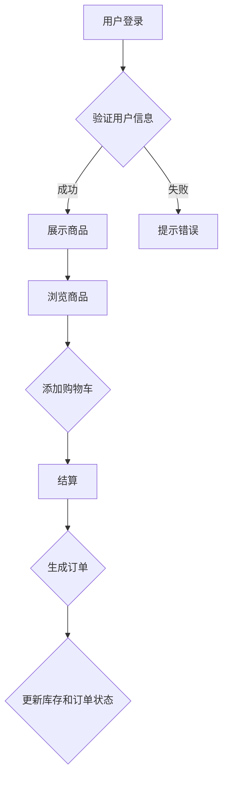
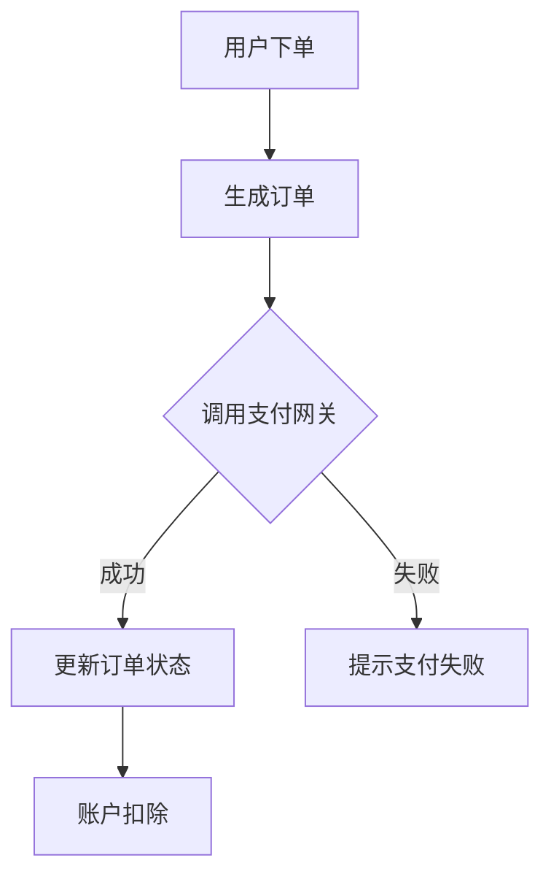

                 


### 概述

2024年，蚂蚁集团国际校招面试题目再次成为众多求职者的焦点。蚂蚁集团作为全球领先的金融科技公司，其校招面试题目涵盖了广泛的技术领域，包括编程基础、算法、数据库、操作系统、网络编程、系统设计与架构设计、安全与隐私保护、大数据与人工智能应用等。这些面试题目不仅考察应聘者的技术能力，更考察其综合分析和解决问题的能力。

本文旨在全面汇总和分析2024年蚂蚁集团国际校招的面试真题，为求职者提供详细的解题思路和答案解析。通过本文，读者可以了解到蚂蚁集团面试真题的特点，掌握各领域的基本概念和技术原理，学会如何分析并解决实际面试问题。本文将分为以下几个部分：

1. **蚂蚁集团校招面试真题概览**：介绍蚂蚁集团校招面试真题的整体特点和分类，帮助读者了解面试的总体布局。
2. **技术类面试真题详解**：详细解析编程基础与算法、数据库系统原理与应用、操作系统原理与网络编程、系统设计与架构设计、安全与隐私保护、大数据与人工智能应用等领域的面试题目，提供解题思路和答案。
3. **面试准备与技巧**：讨论面试准备策略、面试技巧与沟通艺术、常见面试问题及答案解析，帮助读者在面试中脱颖而出。
4. **附录**：提供面试资料准备、参考书籍与在线资源，以及面试真题资源汇总，为读者提供全方位的面试辅导。

通过本文的详细分析和解答，希望能够帮助读者更好地准备蚂蚁集团的校招面试，实现职业发展的新突破。

### 蚂蚁集团校招面试真题概览

蚂蚁集团校招面试真题具有其独特的特点和严格的分类标准，这主要源于其对技术人才的高标准要求。下面我们将从两个方面进行详细探讨：蚂蚁集团校招面试真题的特点和分类与题型。

#### 1.1 蚂蚁集团校招面试真题的特点

**全面性**：蚂蚁集团的面试题目覆盖了计算机科学和金融科技领域的各个方面，包括但不限于编程基础、数据结构、算法、数据库、操作系统、网络编程、系统设计与架构设计、安全与隐私保护、大数据与人工智能应用等。这种全面性不仅考察了应聘者的技术广度，也要求其在各个领域都有一定的深度理解。

**综合性**：蚂蚁集团的面试题目往往不是单一的考点，而是通过多个方面的综合考察，来全面评估应聘者的技术能力和综合素质。例如，一道算法题可能会涉及到数据结构的运用，算法的优化，以及编程语言的特性等多个方面。

**应用性**：蚂蚁集团的面试题目不仅考察理论，更强调应用。很多题目都会结合实际场景，要求应聘者不仅能解决理论问题，还要能将其应用于实际项目中。

**挑战性**：蚂蚁集团的面试题目难度较大，很多题目需要应聘者具备扎实的理论基础和丰富的实践经验。这不仅考察应聘者的知识储备，也考验其解决问题的能力和抗压能力。

**创新性**：部分面试题目具有一定的创新性，要求应聘者能够跳出传统的思维模式，从新的角度去分析问题和解决问题。这种创新性题目能够有效筛选出具有创新能力和发展潜力的应聘者。

#### 1.2 校招面试真题的分类与题型

**编程基础与算法**：这部分面试题目主要涉及编程语言基础、数据结构、算法分析等。常见题型包括编程语言基础题目（如C++/Java/Python语言特性）、常见数据结构（如链表、树、图）的设计与实现、算法设计（如排序、查找、图算法）以及算法复杂度分析等。

**数据库系统原理与应用**：这部分面试题目主要考察关系型数据库和非关系型数据库的基础知识。常见题型包括SQL语句的编写与优化、数据库设计原则、常见数据库系统（如MySQL、Oracle）的原理与应用、NoSQL数据库（如MongoDB、Redis）的原理与应用等。

**操作系统原理与网络编程**：这部分面试题目主要涉及操作系统的基础知识和网络编程技术。常见题型包括进程与线程的管理、内存管理、文件系统、网络协议（如TCP/IP）、网络编程（如套接字编程）等。

**系统设计与架构设计**：这部分面试题目主要考察系统设计原则和架构设计能力。常见题型包括设计模式（如单例模式、工厂模式、观察者模式）、系统设计原则（如分层设计、模块化设计、高内聚低耦合）、架构风格（如微服务架构、分布式系统架构）等。

**安全与隐私保护**：这部分面试题目主要考察安全基础知识和隐私保护技术。常见题型包括加密算法（如对称加密、非对称加密）、认证与授权、安全协议（如HTTPS、SSL/TLS）等。

**大数据与人工智能应用**：这部分面试题目主要涉及大数据和人工智能的基础知识及其应用。常见题型包括数据仓库与数据湖、大数据处理框架（如Hadoop、Spark）、机器学习基础、深度学习基础、人工智能应用案例等。

通过以上对蚂蚁集团校招面试真题的概览，读者可以初步了解面试题目的全面性、综合性、应用性和挑战性。接下来，我们将进一步详细解析各个技术领域的重要面试题目，帮助读者深入理解和掌握。

#### 第2章 编程基础与算法

在蚂蚁集团的校招面试中，编程基础和算法是核心考察内容之一。这部分题目不仅考察应聘者对编程语言的理解，还要求其对数据结构和算法有深刻的认识。下面，我们将详细探讨常见的数据结构、算法复杂度分析以及算法实战案例。

##### 2.1 数据结构与算法基础

**数据结构**：数据结构是计算机存储、组织数据的方式。常见的数据结构包括数组、链表、栈、队列、树、图等。每种数据结构都有其独特的特点和适用场景。

- **数组**：数组是一种线性数据结构，它使用连续的内存空间来存储元素，支持随机访问，但插入和删除操作较慢。
- **链表**：链表由一系列节点组成，每个节点包含数据和指向下一个节点的指针。链表支持高效的插入和删除操作，但无法实现随机访问。
- **栈**：栈是一种后进先出（LIFO）的数据结构，适用于需要先入后出的场景，如递归调用。
- **队列**：队列是一种先进先出（FIFO）的数据结构，适用于需要先入先出的场景，如消息队列。
- **树**：树是一种层次结构，由节点和边组成。树常用于表示层次关系，如文件系统、组织结构等。
- **图**：图是一种由节点和边组成的结构，可以表示复杂的关系网络。图广泛应用于网络分析、社会网络等场景。

**算法**：算法是解决问题的一系列步骤。常见的算法包括排序算法、查找算法、图算法等。算法的效率直接影响程序的运行速度和资源消耗。

- **排序算法**：常见的排序算法有冒泡排序、选择排序、插入排序、快速排序、归并排序等。
- **查找算法**：常见的查找算法有顺序查找、二分查找等。
- **图算法**：常见的图算法有深度优先搜索（DFS）、广度优先搜索（BFS）、最小生成树算法、最短路径算法等。

##### 2.1.1 常见数据结构

**链表**：

```cpp
// 单向链表节点定义
struct ListNode {
    int val;
    ListNode *next;
    ListNode(int x) : val(x), next(nullptr) {}
};

// 单链表创建
ListNode* createList(int[] arr) {
    ListNode *head = new ListNode(arr[0]);
    ListNode *current = head;
    for (int i = 1; i < arr.length; i++) {
        ListNode *node = new ListNode(arr[i]);
        current->next = node;
        current = node;
    }
    return head;
}
```

**树**：

```cpp
// 二叉树节点定义
struct TreeNode {
    int val;
    TreeNode *left;
    TreeNode *right;
    TreeNode(int x) : val(x), left(nullptr), right(nullptr) {}
};

// 二叉树创建
TreeNode* buildTree(int[] arr) {
    TreeNode *root = new TreeNode(arr[0]);
    TreeNode *current = root;
    std::stack<TreeNode*> stk;
    stk.push(root);
    int i = 1;
    while (!stk.empty() && i < arr.length) {
        TreeNode *node = stk.top();
        if (node->left == nullptr) {
            node->left = new TreeNode(arr[i++]);
            stk.push(node->left);
        } else {
            node->right = new TreeNode(arr[i++]);
            stk.push(node->right);
            stk.pop();
        }
    }
    return root;
}
```

##### 2.1.2 算法复杂度分析

算法复杂度分析是评估算法性能的重要方法。常见的算法复杂度包括时间复杂度和空间复杂度。

- **时间复杂度**：表示算法在输入规模增大时，运行时间增长的快慢。常用大O符号表示，如O(1)、O(n)、O(n^2)等。
- **空间复杂度**：表示算法在运行过程中所需内存的多少。

```cpp
// 普通循环的时间复杂度为O(n)
void loop(int n) {
    for (int i = 0; i < n; i++) {
        // 操作
    }
}

// 递归函数的时间复杂度为O(n)
int recursive(int n) {
    if (n <= 1) return 1;
    return recursive(n - 1) + 1;
}
```

##### 2.1.3 算法实战案例

**排序算法：冒泡排序**

```cpp
// 冒泡排序
void bubbleSort(int[] arr) {
    int n = arr.length;
    for (int i = 0; i < n - 1; i++) {
        for (int j = 0; j < n - i - 1; j++) {
            if (arr[j] > arr[j + 1]) {
                int temp = arr[j];
                arr[j] = arr[j + 1];
                arr[j + 1] = temp;
            }
        }
    }
}
```

**查找算法：二分查找**

```cpp
// 二分查找
int binarySearch(int[] arr, int target) {
    int left = 0;
    int right = arr.length - 1;
    while (left <= right) {
        int mid = left + (right - left) / 2;
        if (arr[mid] == target) {
            return mid;
        } else if (arr[mid] < target) {
            left = mid + 1;
        } else {
            right = mid - 1;
        }
    }
    return -1;
}
```

通过以上对编程基础与算法的详细讲解，读者可以更好地理解常见的数据结构和算法，掌握算法复杂度分析的方法，以及实战案例的实现。这些知识不仅是编程基础，也是解决复杂问题的有力工具。接下来，我们将继续深入探讨编程语言基础，帮助读者进一步提升技术水平。

##### 2.2 编程语言基础

编程语言是计算机与人类沟通的桥梁，不同的编程语言具有不同的特性和适用场景。在蚂蚁集团的校招面试中，常见的编程语言包括C++、Java和Python。以下是针对这些编程语言的详细基础介绍。

###### 2.2.1 C++/Java基础

**C++**：C++是一种通用编程语言，支持面向对象编程和过程化编程。它具有高效的执行速度和丰富的标准库，广泛应用于系统软件、游戏开发、嵌入式系统等领域。

- **基础语法**：C++的基础语法包括变量定义、数据类型、运算符、控制结构（如循环和条件语句）等。
- **面向对象编程**：C++的核心特性之一是面向对象编程，包括类、对象、继承、多态等。
- **内存管理**：C++提供了手动内存管理的功能，通过指针和引用来实现。
- **标准库**：C++标准库（STL）提供了各种数据结构和算法，如容器（vector、list、map等）和算法（sort、find等）。

```cpp
// C++基础语法示例
#include <iostream>

int main() {
    int a = 10;
    std::cout << "a = " << a << std::endl;
    return 0;
}
```

**Java**：Java是一种面向对象的高级编程语言，具有平台无关性、自动内存管理和丰富的标准库。它广泛应用于企业级应用、Web开发、大数据处理等领域。

- **基础语法**：Java的基础语法包括类、对象、继承、多态、接口、控制结构（如循环和条件语句）等。
- **面向对象编程**：Java完全支持面向对象编程，包括类、对象、继承、多态等。
- **自动内存管理**：Java使用垃圾回收机制来自动管理内存，减少了程序员的工作负担。
- **标准库**：Java的标准库（Java API）提供了广泛的类和接口，如集合框架（List、Map、Set等）和I/O库等。

```java
// Java基础语法示例
public class HelloWorld {
    public static void main(String[] args) {
        System.out.println("Hello, World!");
    }
}
```

###### 2.2.2 Python基础

**Python**：Python是一种高级编程语言，以其简洁的语法和强大的标准库而闻名。它广泛应用于数据科学、人工智能、Web开发、自动化等领域。

- **基础语法**：Python的基础语法包括变量定义、数据类型（如整数、浮点数、字符串、列表、元组、字典、集合等）、控制结构（如循环和条件语句）、函数定义等。
- **面向对象编程**：Python也支持面向对象编程，包括类、对象、继承、多态等。
- **模块化编程**：Python的模块化编程使其代码易于管理和维护，通过导入模块来复用代码。
- **标准库**：Python的标准库（Python Standard Library）提供了广泛的模块和功能，如数据结构（list、dict、set等）、文件操作、网络编程、多线程等。

```python
# Python基础语法示例
print("Hello, World!")

# 数据类型示例
a = 10
b = 3.14
c = "Hello"
d = [1, 2, 3]
e = {'name': 'Alice', 'age': 30}
```

在蚂蚁集团的校招面试中，掌握C++、Java和Python的基础语法和特性是非常重要的。通过了解这些编程语言的基础，读者可以更好地理解其背后的原理，为后续的面试和实际项目开发打下坚实的基础。接下来，我们将进一步探讨Python在编程实战中的应用。

###### 2.2.3 Python基础

**Python**：Python是一种高级编程语言，以其简洁的语法和强大的标准库而闻名。它广泛应用于数据科学、人工智能、Web开发、自动化等领域。

- **基础语法**：Python的基础语法包括变量定义、数据类型（如整数、浮点数、字符串、列表、元组、字典、集合等）、控制结构（如循环和条件语句）、函数定义等。
- **面向对象编程**：Python也支持面向对象编程，包括类、对象、继承、多态等。
- **模块化编程**：Python的模块化编程使其代码易于管理和维护，通过导入模块来复用代码。
- **标准库**：Python的标准库（Python Standard Library）提供了广泛的模块和功能，如数据结构（list、dict、set等）、文件操作、网络编程、多线程等。

```python
# Python基础语法示例
print("Hello, World!")

# 数据类型示例
a = 10
b = 3.14
c = "Hello"
d = [1, 2, 3]
e = {'name': 'Alice', 'age': 30}

# 循环示例
for i in range(5):
    print(i)

# 函数示例
def greet(name):
    return "Hello, " + name

print(greet("Alice"))
```

在蚂蚁集团的校招面试中，掌握C++、Java和Python的基础语法和特性是非常重要的。通过了解这些编程语言的基础，读者可以更好地理解其背后的原理，为后续的面试和实际项目开发打下坚实的基础。接下来，我们将进一步探讨Python在编程实战中的应用。

##### 2.2.3 Python基础

**Python**：Python是一种高级编程语言，以其简洁的语法和强大的标准库而闻名。它广泛应用于数据科学、人工智能、Web开发、自动化等领域。

- **基础语法**：Python的基础语法包括变量定义、数据类型（如整数、浮点数、字符串、列表、元组、字典、集合等）、控制结构（如循环和条件语句）、函数定义等。
- **面向对象编程**：Python也支持面向对象编程，包括类、对象、继承、多态等。
- **模块化编程**：Python的模块化编程使其代码易于管理和维护，通过导入模块来复用代码。
- **标准库**：Python的标准库（Python Standard Library）提供了广泛的模块和功能，如数据结构（list、dict、set等）、文件操作、网络编程、多线程等。

```python
# Python基础语法示例
print("Hello, World!")

# 数据类型示例
a = 10
b = 3.14
c = "Hello"
d = [1, 2, 3]
e = {'name': 'Alice', 'age': 30}

# 循环示例
for i in range(5):
    print(i)

# 函数示例
def greet(name):
    return "Hello, " + name

print(greet("Alice"))
```

在蚂蚁集团的校招面试中，掌握C++、Java和Python的基础语法和特性是非常重要的。通过了解这些编程语言的基础，读者可以更好地理解其背后的原理，为后续的面试和实际项目开发打下坚实的基础。接下来，我们将进一步探讨Python在编程实战中的应用。

在蚂蚁集团的校招面试中，编程基础与算法是一个重要的考察点。通过上面的内容，我们已经了解了常见的数据结构和算法，以及C++、Java和Python的基础知识。接下来，我们将通过一些编程实战案例，帮助读者更好地理解和应用这些知识。

**案例一：单链表操作**

```python
class ListNode:
    def __init__(self, val=0, next=None):
        self.val = val
        self.next = next

def insert_node(head, val):
    new_node = ListNode(val)
    if not head:
        return new_node
    current = head
    while current.next:
        current = current.next
    current.next = new_node
    return head

def delete_node(head, val):
    if not head:
        return None
    if head.val == val:
        return head.next
    current = head
    while current.next:
        if current.next.val == val:
            current.next = current.next.next
            return head
        current = current.next
    return head

def print_list(head):
    current = head
    while current:
        print(current.val, end=' ')
        current = current.next
    print()

# 创建链表
head = ListNode(1)
head = insert_node(head, 2)
head = insert_node(head, 3)
print_list(head)  # 输出：1 2 3

# 删除节点
head = delete_node(head, 2)
print_list(head)  # 输出：1 3
```

**案例二：二分查找**

```python
def binary_search(arr, target):
    left, right = 0, len(arr) - 1
    while left <= right:
        mid = left + (right - left) // 2
        if arr[mid] == target:
            return mid
        elif arr[mid] < target:
            left = mid + 1
        else:
            right = mid - 1
    return -1

# 查找元素
arr = [1, 2, 3, 4, 5]
target = 3
index = binary_search(arr, target)
print(index)  # 输出：2
```

**案例三：冒泡排序**

```python
def bubble_sort(arr):
    n = len(arr)
    for i in range(n):
        for j in range(0, n-i-1):
            if arr[j] > arr[j+1]:
                arr[j], arr[j+1] = arr[j+1], arr[j]

# 排序
arr = [64, 34, 25, 12, 22, 11, 90]
bubble_sort(arr)
print(arr)  # 输出：[11, 12, 22, 25, 34, 64, 90]
```

通过这些实战案例，读者可以更好地理解数据结构和算法的实际应用，以及编程语言的基础知识。这些案例不仅有助于巩固理论知识，还能提升编程实践能力，为面试和实际项目开发打下坚实的基础。接下来，我们将继续探讨数据库系统原理与应用。

#### 第3章 数据库系统原理与应用

在蚂蚁集团的校招面试中，数据库系统原理与应用是一个重要的考察领域。数据库系统作为存储和管理数据的工具，其基础知识与应用技能是每位应聘者必须掌握的。下面，我们将详细探讨关系型数据库的基础知识、常见数据库系统、非关系型数据库的简介以及具体实例。

##### 3.1 关系型数据库基础

关系型数据库（Relational Database）是一种使用表格结构存储数据的数据库管理系统。关系型数据库通过关系模型来组织数据，这种模型使用表格（也称为关系）来表示实体和实体之间的关系。

- **关系模型**：关系模型由关系（table）、属性（column）和元组（row）组成。每个关系都有一个唯一的表名，每个表包含多个属性，每个属性有特定的数据类型和长度，每个表中的一行代表一个实体实例。
  
- **SQL（Structured Query Language）**：SQL是关系型数据库的标准查询语言，用于执行各种数据操作，包括数据查询、插入、更新、删除等。

  - **数据查询**：SELECT语句用于从数据库中检索数据。
  - **数据插入**：INSERT INTO语句用于将数据插入到数据库中。
  - **数据更新**：UPDATE语句用于修改数据库中的数据。
  - **数据删除**：DELETE语句用于从数据库中删除数据。

- **数据库设计原则**：关系型数据库的设计应遵循以下原则：
  - **规范化**：通过规范化减少数据冗余和插入、更新、删除异常。
  - **完整性约束**：使用外键、主键、唯一性约束等确保数据的完整性。
  - **规范化**：通过规范化减少数据冗余和插入、更新、删除异常。

- **常见关系型数据库系统**：
  - **MySQL**：MySQL是一种开源的关系型数据库管理系统，广泛应用于各种应用场景，如Web应用、数据存储等。
  - **Oracle**：Oracle是一种高性能的关系型数据库管理系统，常用于大型企业级应用。
  - **PostgreSQL**：PostgreSQL是一种开源的关系型数据库管理系统，具有丰富的特性和扩展性。

##### 3.1.1 SQL基础

SQL基础是关系型数据库的核心知识，掌握SQL是操作数据库的关键。

- **SQL查询**：

  ```sql
  -- 查询所有员工的姓名和年龄
  SELECT name, age FROM employees;
  
  -- 查询年龄大于30的员工姓名和年龄
  SELECT name, age FROM employees WHERE age > 30;
  ```

- **SQL插入**：

  ```sql
  -- 插入新员工数据
  INSERT INTO employees (name, age, department) VALUES ('Alice', 25, 'Finance');
  ```

- **SQL更新**：

  ```sql
  -- 更新员工Alice的部门为Marketing
  UPDATE employees SET department = 'Marketing' WHERE name = 'Alice';
  ```

- **SQL删除**：

  ```sql
  -- 删除部门为Finance的员工
  DELETE FROM employees WHERE department = 'Finance';
  ```

##### 3.1.2 常见数据库系统

- **MySQL**：MySQL是一种开源的关系型数据库管理系统，其特点是简单易用、性能高、稳定性好。MySQL广泛用于各种应用场景，如Web应用、数据存储等。MySQL的SQL语法和操作与标准SQL基本一致。

- **Oracle**：Oracle是一种高性能的关系型数据库管理系统，其特点是性能优异、扩展性强、安全可靠。Oracle常用于大型企业级应用，如金融、电信等领域。Oracle的SQL语法和操作与标准SQL略有差异，但基本原理相同。

- **PostgreSQL**：PostgreSQL是一种开源的关系型数据库管理系统，其特点是功能丰富、扩展性强、社区活跃。PostgreSQL广泛用于各种应用场景，如Web应用、数据仓库、大数据处理等。PostgreSQL的SQL语法和操作与标准SQL基本一致。

##### 3.1.3 实战案例：MySQL/Oracle

**实战案例一：MySQL数据库设计**

1. **需求分析**：设计一个员工信息数据库，包含员工姓名、年龄、性别、部门等信息。

2. **数据库设计**：

  ```sql
  CREATE DATABASE employee_db;

  USE employee_db;

  CREATE TABLE employees (
      id INT PRIMARY KEY AUTO_INCREMENT,
      name VARCHAR(50) NOT NULL,
      age INT NOT NULL,
      gender ENUM('male', 'female') NOT NULL,
      department VARCHAR(50) NOT NULL
  );
  ```

3. **数据插入**：

  ```sql
  INSERT INTO employees (name, age, gender, department) VALUES ('Alice', 25, 'female', 'Finance');
  INSERT INTO employees (name, age, gender, department) VALUES ('Bob', 30, 'male', 'Marketing');
  ```

4. **数据查询**：

  ```sql
  SELECT * FROM employees;
  SELECT name, age FROM employees WHERE department = 'Finance';
  ```

**实战案例二：Oracle数据库设计**

1. **需求分析**：设计一个学生信息数据库，包含学生姓名、年龄、性别、班级等信息。

2. **数据库设计**：

  ```sql
  CREATE TABLE students (
      id INT PRIMARY KEY,
      name VARCHAR2(50) NOT NULL,
      age INT NOT NULL,
      gender ENUM('male', 'female') NOT NULL,
      class VARCHAR2(50) NOT NULL
  );
  ```

3. **数据插入**：

  ```sql
  INSERT INTO students (id, name, age, gender, class) VALUES (1, 'Alice', 20, 'female', 'Class 1');
  INSERT INTO students (id, name, age, gender, class) VALUES (2, 'Bob', 22, 'male', 'Class 2');
  ```

4. **数据查询**：

  ```sql
  SELECT * FROM students;
  SELECT name, age FROM students WHERE class = 'Class 1';
  ```

通过以上内容，读者可以了解到关系型数据库的基础知识、常见数据库系统以及实际应用案例。掌握这些知识对于应对蚂蚁集团的校招面试具有重要意义。接下来，我们将继续探讨非关系型数据库的简介及其应用。

##### 3.2 非关系型数据库简介

非关系型数据库（NoSQL数据库）与关系型数据库相比，具有更高的灵活性、可扩展性和性能。NoSQL数据库不使用固定的表格结构，而是使用键值对、文档、列族等不同的数据模型，可以更好地处理大规模、高并发的数据存储需求。

- **键值存储（Key-Value Store）**：键值存储是最简单的NoSQL数据库类型，它通过键值对来存储和检索数据。常见的键值存储数据库包括Redis、Memcached等。

  - **Redis**：Redis是一种开源的内存键值存储数据库，具有高速读写性能、持久化支持、数据结构丰富（如列表、集合、散列表等）等特点。Redis广泛应用于缓存、实时分析、消息队列等场景。

  ```python
  import redis

  r = redis.Redis(host='localhost', port=6379, db=0)

  r.set('name', 'Alice')
  print(r.get('name'))  # 输出：b'Alice'
  ```

- **文档型数据库（Document Store）**：文档型数据库使用文档模型存储数据，每个文档都是一个JSON对象。常见的文档型数据库包括MongoDB、CouchDB等。

  - **MongoDB**：MongoDB是一种开源的文档型数据库，具有灵活的文档模型、水平扩展能力、丰富的查询功能等特点。MongoDB广泛应用于大数据存储、实时分析、内容管理系统等场景。

  ```python
  from pymongo import MongoClient

  client = MongoClient('localhost', 27017)
  db = client['example_db']
  collection = db['students']

  student_data = {
      'name': 'Alice',
      'age': 25,
      'gender': 'female',
      'class': 'Class 1'
  }
  collection.insert_one(student_data)

  student = collection.find_one({'name': 'Alice'})
  print(student)  # 输出：{'_id': ObjectId('641e6a354c602470a5b0cdef'), 'name': 'Alice', 'age': 25, 'gender': 'female', 'class': 'Class 1'}
  ```

- **列族数据库（Column-Family Store）**：列族数据库以列族为单位存储数据，每个列族是一个独立的表格。常见的列族数据库包括Cassandra、HBase等。

  - **Cassandra**：Cassandra是一种开源的分布式列族数据库，具有高可用性、高性能、弹性扩展等特点。Cassandra广泛应用于大数据存储、实时分析、高并发场景。

  ```python
  from cassandra.cluster import Cluster
  from cassandra.query import SimpleStatement

  cluster = Cluster(['127.0.0.1'])
  session = cluster.connect()

  session.execute("""
      CREATE KEYSPACE example_keyspace
      WITH replication = {'class': 'SimpleStrategy', 'replication_factor': '3'};
  """)

  session.execute("""
      CREATE TABLE example_keyspace.students (
          id UUID PRIMARY KEY,
          name TEXT,
          age INT,
          gender TEXT
      );
  """)

  session.execute("""
      INSERT INTO example_keyspace.students (id, name, age, gender)
      VALUES (uuid(), 'Alice', 25, 'female');
  """)

  rows = session.execute(SimpleStatement("""
      SELECT * FROM example_keyspace.students;
  """))

  for row in rows:
      print(row.id, row.name, row.age, row.gender)
  ```

- **图数据库（Graph Database）**：图数据库以图模型存储数据，使用节点和边来表示实体和关系。常见的图数据库包括Neo4j、JanusGraph等。

  - **Neo4j**：Neo4j是一种开源的图数据库，具有高性能、易用性、灵活的数据模型等特点。Neo4j广泛应用于社交网络分析、推荐系统、复杂关系查询等场景。

  ```python
  from neo4j import GraphDatabase

  uri = "bolt://localhost:7687"
  driver = GraphDatabase.driver(uri, auth=("neo4j", "password"))

  with driver.session() as session:
      session.run("CREATE (a:Person {name: 'Alice', age: 25})")
      session.run("CREATE (a)-[:FRIEND]->(b:Person {name: 'Bob', age: 30})")
      results = session.run("MATCH (p:Person)-[:FRIEND]->(friend) RETURN p, friend")
      for result in results:
          print(result.p.name, "is friends with", result.friend.name)
  ```

通过以上对非关系型数据库的介绍，读者可以了解到各种数据库的类型、特点和应用场景。在实际项目中，根据业务需求和数据特点选择合适的数据库类型和模型，能够更好地提升系统的性能和扩展性。接下来，我们将继续探讨非关系型数据库的实例，帮助读者更好地理解和应用这些知识。

##### 3.2.3 实战案例：MongoDB/Redis

为了更好地理解非关系型数据库的应用，下面我们将通过MongoDB和Redis的实战案例，展示如何在实际项目中使用这些数据库。

###### 3.2.3.1 MongoDB实战案例

**案例背景**：假设我们需要设计一个用户信息管理系统，包含用户的基本信息（如用户名、密码、邮箱、手机号等）和用户动态（如发布的文章、评论等）。

**步骤一：数据库设计**

1. **创建数据库**：

   ```python
   from pymongo import MongoClient

   client = MongoClient('localhost', 27017)
   db = client['user_db']
   ```

2. **创建用户表**：

   ```python
   users_collection = db['users']
   users_collection.drop()  # 清除原有数据
   user_data = {
       'username': 'alice',
       'password': '123456',
       'email': 'alice@example.com',
       'phone': '13812345678'
   }
   users_collection.insert_one(user_data)
   ```

3. **创建用户动态表**：

   ```python
   user_posts_collection = db['user_posts']
   user_posts_collection.drop()  # 清除原有数据
   post_data = {
       'username': 'alice',
       'title': '我的第一篇博客',
       'content': '这是我的第一篇博客，希望喜欢。',
       'timestamp': '2024-01-01T12:00:00Z'
   }
   user_posts_collection.insert_one(post_data)
   ```

**步骤二：数据查询**

1. **查询用户信息**：

   ```python
   user = users_collection.find_one({'username': 'alice'})
   print(user)
   # 输出：{'_id': ObjectId('5c4e14c4e3a04f3e4c3e4c3e'), 'username': 'alice', 'password': '123456', 'email': 'alice@example.com', 'phone': '13812345678'}
   ```

2. **查询用户动态**：

   ```python
   posts = user_posts_collection.find({'username': 'alice'})
   for post in posts:
       print(post)
   # 输出：{'_id': ObjectId('5c4e14c4e3a04f3e4c3e4c3f'), 'username': 'alice', 'title': '我的第一篇博客', 'content': '这是我的第一篇博客，希望喜欢。', 'timestamp': '2024-01-01T12:00:00Z'}
   ```

**步骤三：数据更新**

1. **更新用户信息**：

   ```python
   users_collection.update_one({'username': 'alice'}, {'$set': {'email': 'alice_new@example.com'}})
   user = users_collection.find_one({'username': 'alice'})
   print(user)
   # 输出：{'_id': ObjectId('5c4e14c4e3a04f3e4c3e4c3e'), 'username': 'alice', 'password': '123456', 'email': 'alice_new@example.com', 'phone': '13812345678'}
   ```

2. **更新用户动态**：

   ```python
   user_posts_collection.update_one({'username': 'alice', 'title': '我的第一篇博客'}, {'$set': {'content': '这是我更新后的第一篇博客，希望喜欢。'}})
   post = user_posts_collection.find_one({'username': 'alice', 'title': '我的第一篇博客'})
   print(post)
   # 输出：{'_id': ObjectId('5c4e14c4e3a04f3e4c3e4c3f'), 'username': 'alice', 'title': '我的第一篇博客', 'content': '这是我更新后的第一篇博客，希望喜欢。', 'timestamp': '2024-01-01T12:00:00Z'}
   ```

通过以上实战案例，读者可以了解如何使用MongoDB进行数据库设计、数据查询和数据更新。MongoDB的灵活性和高扩展性使其在处理复杂、动态的数据时具有很大优势。

###### 3.2.3.2 Redis实战案例

**案例背景**：假设我们需要设计一个基于Redis的缓存系统，用于存储用户登录状态和热门商品信息。

**步骤一：配置Redis**

1. **安装Redis**：在本地或服务器上安装Redis。

2. **启动Redis服务**：

   ```shell
   redis-server
   ```

**步骤二：数据存储**

1. **存储用户登录状态**：

   ```python
   import redis

   r = redis.Redis(host='localhost', port=6379, db=0)

   user_id = 'alice'
   user_password = '123456'

   r.set(user_id, user_password)
   print(r.get(user_id))  # 输出：b'123456'
   ```

2. **存储热门商品信息**：

   ```python
   r.set('hot_products', '["iPhone 15", "MacBook Pro 2024", "AirPods Pro 2"]')
   print(r.get('hot_products'))  # 输出：b'["iPhone 15", "MacBook Pro 2024", "AirPods Pro 2"]'
   ```

**步骤三：数据查询**

1. **查询用户登录状态**：

   ```python
   user_id = 'alice'
   user_password = r.get(user_id)
   if user_password:
       print(f"User {user_id} logged in with password {user_password.decode()}")  # 输出：User alice logged in with password 123456
   else:
       print(f"User {user_id} not found")
   ```

2. **查询热门商品信息**：

   ```python
   hot_products = r.get('hot_products')
   if hot_products:
       print(f"Hot products: {hot_products.decode()}")  # 输出：Hot products: ["iPhone 15", "MacBook Pro 2024", "AirPods Pro 2"]
   else:
       print("No hot products found")
   ```

通过以上实战案例，读者可以了解如何使用Redis进行数据存储和数据查询。Redis的高性能和易用性使其在缓存系统中广泛应用。

通过以上对关系型数据库和非关系型数据库的详细介绍以及实战案例，读者可以更好地理解数据库系统的原理和应用。在实际项目中，根据业务需求和数据特点选择合适的数据库类型和模型，能够更好地提升系统的性能和扩展性。接下来，我们将继续探讨操作系统原理与网络编程。

#### 第4章 操作系统原理与网络编程

在蚂蚁集团的校招面试中，操作系统原理与网络编程是重要的考察内容之一。操作系统是计算机系统的核心软件，负责管理和控制计算机硬件资源，提供用户与硬件之间的接口。网络编程则涉及计算机网络的通信机制、协议以及编程技术。本章节将详细探讨操作系统和网络编程的基础知识。

##### 4.1 操作系统基础

操作系统（Operating System，OS）是管理计算机硬件资源和软件资源的系统软件，它提供了一系列的服务和接口，使得用户能够方便地使用计算机。以下是操作系统的一些核心概念：

- **进程（Process）**：进程是计算机中的程序在处理器中的一次执行活动。每个进程都有独立的内存空间、代码段、数据段等。操作系统通过进程来管理程序的执行。

- **线程（Thread）**：线程是进程中的执行单元，一个进程可以包含多个线程。线程之间共享进程的资源，但每个线程有自己的栈和局部变量。

- **内存管理（Memory Management）**：内存管理是操作系统的一个重要功能，负责为进程分配和回收内存空间。常见的内存管理技术包括分页、分段、虚拟内存等。

- **文件系统（File System）**：文件系统是操作系统中负责管理文件的机制。它提供文件存储、检索、更新等功能，常用的文件系统有FAT、EXT4、NTFS等。

- **进程调度（Process Scheduling）**：进程调度是操作系统的一个关键任务，它负责决定哪个进程将获得CPU时间。常见的调度算法有先来先服务（FCFS）、短作业优先（SJF）、优先级调度等。

##### 4.1.1 进程与线程

进程和线程是操作系统中的核心概念，下面将详细介绍它们的基本概念、创建方法以及同步机制。

- **进程**：进程是操作系统分配处理器资源的独立单位，每个进程都有独立的内存空间和资源。进程的创建通常通过系统调用来实现。

  ```c
  #include <stdio.h>
  #include <unistd.h>

  int main() {
      printf("Process ID: %d\n", getpid());
      return 0;
  }
  ```

- **线程**：线程是进程内的独立执行单元，线程之间共享进程的资源，但每个线程有自己的栈和局部变量。线程的创建在C语言中通常使用pthread库。

  ```c
  #include <stdio.h>
  #include <pthread.h>

  void* thread_function(void* arg) {
      printf("Thread ID: %ld\n", pthread_self());
      return NULL;
  }

  int main() {
      pthread_t thread_id;
      pthread_create(&thread_id, NULL, thread_function, NULL);
      pthread_join(thread_id, NULL);
      return 0;
  }
  ```

- **进程与线程的同步**：进程和线程之间的同步是通过互斥锁（Mutex）、条件变量（Condition Variable）和信号量（Semaphore）等机制实现的。

  ```c
  #include <stdio.h>
  #include <pthread.h>

  pthread_mutex_t lock;
  pthread_cond_t cond;

  void* thread_function(void* arg) {
      pthread_mutex_lock(&lock);
      pthread_cond_wait(&cond, &lock);
      printf("Thread woke up\n");
      pthread_mutex_unlock(&lock);
      return NULL;
  }

  int main() {
      pthread_mutex_init(&lock, NULL);
      pthread_cond_init(&cond, NULL);

      pthread_t thread_id;
      pthread_create(&thread_id, NULL, thread_function, NULL);

      sleep(1);
      pthread_mutex_lock(&lock);
      pthread_cond_signal(&cond);
      pthread_mutex_unlock(&lock);

      pthread_join(thread_id, NULL);

      pthread_mutex_destroy(&lock);
      pthread_cond_destroy(&cond);
      return 0;
  }
  ```

##### 4.1.2 内存管理

内存管理是操作系统的一个重要功能，它负责为进程分配和回收内存空间。以下是内存管理的一些基本概念：

- **分页**：分页是将内存分成固定大小的块，称为页。操作系统通过页表来管理内存，实现内存的虚拟化和高效管理。

- **分段**：分段是将内存分成大小不等的段，每个段对应程序的不同部分，如代码段、数据段、栈等。

- **虚拟内存**：虚拟内存是操作系统提供的一种内存管理机制，它通过将物理内存与磁盘上的交换空间（swap space）相结合，实现内存的动态分配和回收。

- **内存分配算法**：常见的内存分配算法包括首次适配（First Fit）、最佳适配（Best Fit）、最坏适配（Worst Fit）等。

  ```c
  #include <stdio.h>
  #include <stdlib.h>
  #include <string.h>

  void first_fit(int mem_blocks[], int num_blocks, int request) {
      for (int i = 0; i < num_blocks; i++) {
          if (mem_blocks[i] >= request) {
              mem_blocks[i] -= request;
              printf("分配内存 %d KB\n", request);
              return;
          }
      }
      printf("内存不足\n");
  }

  int main() {
      int mem_blocks[] = {100, 200, 300, 400};
      int num_blocks = sizeof(mem_blocks) / sizeof(mem_blocks[0]);
      int request = 250;

      first_fit(mem_blocks, num_blocks, request);
      printf("剩余内存: %d KB\n", mem_blocks[0]);
      return 0;
  }
  ```

##### 4.1.3 文件系统

文件系统是操作系统中的一个核心组件，它负责管理文件和目录。以下是文件系统的一些基本概念：

- **文件类型**：常见的文件类型包括普通文件、目录文件、设备文件等。

- **文件操作**：文件操作包括文件的创建、打开、读取、写入、关闭等。

- **目录操作**：目录操作包括目录的创建、删除、遍历等。

- **文件系统结构**：文件系统结构包括目录结构、文件分配表、文件系统元数据等。

- **文件系统实现**：常见的文件系统实现包括UNIX文件系统（UFS）、EXT4、NTFS等。

```c
#include <stdio.h>
#include <stdlib.h>
#include <dirent.h>
#include <string.h>

void list_directory(const char* path) {
    DIR* dir = opendir(path);
    if (dir == NULL) {
        printf("无法打开目录 %s\n", path);
        return;
    }

    struct dirent* entry;
    while ((entry = readdir(dir)) != NULL) {
        printf("%s\n", entry->d_name);
    }

    closedir(dir);
}

int main() {
    list_directory(".");
    return 0;
}
```

通过以上对操作系统基础知识的介绍，读者可以了解操作系统的重要概念和基本操作。在实际开发过程中，掌握操作系统的原理和实现对于编写高效、可靠的软件至关重要。接下来，我们将继续探讨网络编程基础。

##### 4.2 网络编程基础

网络编程是计算机通信的重要组成部分，它涉及计算机网络的通信机制、协议以及编程技术。以下将介绍TCP/IP协议以及网络编程实战案例。

###### 4.2.1 TCP/IP协议

TCP/IP协议（Transmission Control Protocol/Internet Protocol）是互联网的基础协议，它定义了数据如何在网络中传输和路由。TCP/IP协议分为四层：应用层、传输层、网络层和链路层。

- **应用层**：应用层负责应用程序之间的通信，常见的协议包括HTTP、FTP、SMTP、DNS等。

- **传输层**：传输层负责端到端的通信，确保数据的可靠传输。TCP和UDP是传输层的主要协议。

  - **TCP（传输控制协议）**：TCP是一种面向连接的、可靠的传输协议，它提供数据传输的流量控制、错误检测和重传机制。TCP通过三次握手建立连接，通过四次挥手断开连接。

  ```c
  #include <stdio.h>
  #include <stdlib.h>
  #include <string.h>
  #include <sys/socket.h>
  #include <netinet/in.h>

  int create_server_socket() {
      int server_socket = socket(AF_INET, SOCK_STREAM, 0);
      if (server_socket < 0) {
          printf("创建服务器套接字失败\n");
          return -1;
      }

      struct sockaddr_in server_addr;
      server_addr.sin_family = AF_INET;
      server_addr.sin_addr.s_addr = INADDR_ANY;
      server_addr.sin_port = htons(8080);

      if (bind(server_socket, (struct sockaddr*)&server_addr, sizeof(server_addr)) < 0) {
          printf("绑定地址失败\n");
          close(server_socket);
          return -1;
      }

      if (listen(server_socket, 5) < 0) {
          printf("监听失败\n");
          close(server_socket);
          return -1;
      }

      return server_socket;
  }

  int accept_connection(int server_socket) {
      struct sockaddr_in client_addr;
      socklen_t client_addr_len = sizeof(client_addr);
      int client_socket = accept(server_socket, (struct sockaddr*)&client_addr, &client_addr_len);
      if (client_socket < 0) {
          printf("接受连接失败\n");
          return -1;
      }
      return client_socket;
  }

  int main() {
      int server_socket = create_server_socket();
      printf("服务器已启动，等待连接...\n");

      int client_socket = accept_connection(server_socket);
      printf("新客户端已连接\n");

      char buffer[1024];
      while (1) {
          memset(buffer, 0, sizeof(buffer));
          int bytes_received = recv(client_socket, buffer, sizeof(buffer), 0);
          if (bytes_received <= 0) {
              break;
          }
          printf("收到数据：%s\n", buffer);
      }

      close(client_socket);
      close(server_socket);
      return 0;
  }
  ```

  - **UDP（用户数据报协议）**：UDP是一种无连接的、不可靠的传输协议，它适用于对实时性要求高、传输速度快的应用，如视频会议、在线游戏等。

  ```c
  #include <stdio.h>
  #include <stdlib.h>
  #include <string.h>
  #include <sys/socket.h>
  #include <netinet/in.h>

  int create_udp_socket() {
      int socket_fd = socket(AF_INET, SOCK_DGRAM, 0);
      if (socket_fd < 0) {
          printf("创建UDP套接字失败\n");
          return -1;
      }

      struct sockaddr_in server_addr;
      server_addr.sin_family = AF_INET;
      server_addr.sin_addr.s_addr = INADDR_ANY;
      server_addr.sin_port = htons(8080);

      if (bind(socket_fd, (struct sockaddr*)&server_addr, sizeof(server_addr)) < 0) {
          printf("绑定地址失败\n");
          close(socket_fd);
          return -1;
      }

      return socket_fd;
  }

  int send_udp_message(int socket_fd, const char* message) {
      struct sockaddr_in client_addr;
      client_addr.sin_family = AF_INET;
      client_addr.sin_addr.s_addr = inet_addr("192.168.1.1");
      client_addr.sin_port = htons(8080);

      int bytes_sent = sendto(socket_fd, message, strlen(message), 0, (struct sockaddr*)&client_addr, sizeof(client_addr));
      if (bytes_sent < 0) {
          printf("发送UDP消息失败\n");
          return -1;
      }
      return bytes_sent;
  }

  int main() {
      int socket_fd = create_udp_socket();
      printf("UDP服务器已启动，等待消息...\n");

      char buffer[1024];
      while (1) {
          memset(buffer, 0, sizeof(buffer));
          int bytes_received = recvfrom(socket_fd, buffer, sizeof(buffer), 0, (struct sockaddr*)&client_addr, &client_addr_len);
          if (bytes_received <= 0) {
              break;
          }
          printf("收到数据：%s\n", buffer);
      }

      close(socket_fd);
      return 0;
  }
  ```

- **网络层**：网络层负责数据包的路由和转发，确保数据包能够到达目标主机。IP（Internet Protocol）是网络层的主要协议，它负责将数据包从源主机传输到目标主机。

- **链路层**：链路层负责数据在物理网络中的传输，包括数据帧的封装、解封和错误检测等。

###### 4.2.2 网络编程实战案例

**案例一：基于TCP的文件传输**

该案例演示了如何使用TCP协议实现客户端和服务器之间的文件传输。

1. **服务器端代码**：

   ```c
   #include <stdio.h>
   #include <stdlib.h>
   #include <string.h>
   #include <sys/socket.h>
   #include <netinet/in.h>

   int create_server_socket() {
       int server_socket = socket(AF_INET, SOCK_STREAM, 0);
       if (server_socket < 0) {
           printf("创建服务器套接字失败\n");
           return -1;
       }

       struct sockaddr_in server_addr;
       server_addr.sin_family = AF_INET;
       server_addr.sin_addr.s_addr = INADDR_ANY;
       server_addr.sin_port = htons(8080);

       if (bind(server_socket, (struct sockaddr*)&server_addr, sizeof(server_addr)) < 0) {
           printf("绑定地址失败\n");
           close(server_socket);
           return -1;
       }

       if (listen(server_socket, 5) < 0) {
           printf("监听失败\n");
           close(server_socket);
           return -1;
       }

       return server_socket;
   }

   int accept_connection(int server_socket) {
       struct sockaddr_in client_addr;
       socklen_t client_addr_len = sizeof(client_addr);
       int client_socket = accept(server_socket, (struct sockaddr*)&client_addr, &client_addr_len);
       if (client_socket < 0) {
           printf("接受连接失败\n");
           return -1;
       }
       return client_socket;
   }

   int main() {
       int server_socket = create_server_socket();
       printf("服务器已启动，等待连接...\n");

       int client_socket = accept_connection(server_socket);
       printf("新客户端已连接\n");

       char buffer[1024];
       memset(buffer, 0, sizeof(buffer));
       int bytes_received = recv(client_socket, buffer, sizeof(buffer), 0);
       if (bytes_received <= 0) {
           printf("接收文件失败\n");
           close(client_socket);
           close(server_socket);
           return -1;
       }

       printf("文件名：%s\n", buffer);

       FILE* file = fopen(buffer, "wb");
       if (file == NULL) {
           printf("打开文件失败\n");
           close(client_socket);
           close(server_socket);
           return -1;
       }

       int bytes_written = fwrite(buffer + 12, 1, bytes_received - 12, file);
       fclose(file);

       printf("文件已接收，总共接收了%d字节\n", bytes_written);

       close(client_socket);
       close(server_socket);
       return 0;
   }
   ```

2. **客户端代码**：

   ```c
   #include <stdio.h>
   #include <stdlib.h>
   #include <string.h>
   #include <sys/socket.h>
   #include <netinet/in.h>

   int create_udp_socket() {
       int socket_fd = socket(AF_INET, SOCK_DGRAM, 0);
       if (socket_fd < 0) {
           printf("创建UDP套接字失败\n");
           return -1;
       }

       struct sockaddr_in server_addr;
       server_addr.sin_family = AF_INET;
       server_addr.sin_addr.s_addr = inet_addr("192.168.1.1");
       server_addr.sin_port = htons(8080);

       int bytes_sent = sendto(socket_fd, "test.txt", strlen("test.txt"), 0, (struct sockaddr*)&server_addr, sizeof(server_addr));
       if (bytes_sent < 0) {
           printf("发送UDP消息失败\n");
           return -1;
       }

       printf("请求发送成功\n");

       close(socket_fd);
       return 0;
   }

   int main() {
       int socket_fd = create_udp_socket();
       return 0;
   }
   ```

通过以上实战案例，读者可以了解如何使用TCP/IP协议实现基本的网络通信。在实际项目中，掌握网络编程技术对于构建可靠、高效的网络应用至关重要。接下来，我们将探讨系统设计与架构设计。

#### 第5章 系统设计与架构设计

在蚂蚁集团的校招面试中，系统设计与架构设计是评估应聘者技术深度和系统思维能力的重点。系统设计不仅涉及到技术实现，还涉及系统的高可用性、可扩展性和可维护性。本章将详细介绍系统设计原则与模式、常见设计模式、系统设计实战案例以及架构设计要点。

##### 5.1 系统设计原则与模式

系统设计原则是构建高质量系统的基础，常见的系统设计原则包括：

- **单一职责原则**：每个模块应只负责一项功能，确保模块的简洁性和可维护性。
- **开闭原则**：系统设计应遵循开闭原则，即对扩展开放，对修改关闭，确保系统易于扩展和修改。
- **里氏替换原则**：任何基类可以出现的地方，子类一定可以出现。
- **依赖倒置原则**：高层模块不应依赖于低层模块，二者应依赖于抽象。
- **接口隔离原则**：确保接口的细化，客户端只依赖于其直接接口。

系统设计模式是在系统设计过程中使用的典型解决方案，常见的系统设计模式包括：

- **单体模式**：所有功能都集中在一个应用程序中，适用于小型系统。
- **分层模式**：将系统分为多个层次，如表示层、业务逻辑层、数据访问层，适用于中大型系统。
- **微服务模式**：将系统拆分成多个独立的服务，每个服务负责一项功能，适用于大型和复杂系统。
- **事件驱动模式**：通过事件来触发系统行为，适用于需要实时响应的场景。

##### 5.1.1 设计模式概述

设计模式是一系列在软件设计过程中常用的解决方案，可以提高代码的可读性、可维护性和可扩展性。以下是几种常见的设计模式：

- **创建型模式**：负责对象的创建，常见的创建型模式包括工厂模式、单例模式和原型模式。
- **结构型模式**：负责类和对象的组合，常见的结构型模式包括适配器模式、装饰者模式、代理模式、桥接模式和组合模式。
- **行为型模式**：负责类和对象之间的通信，常见的行为型模式包括策略模式、责任链模式、命令模式和中介者模式。

##### 5.1.2 常见设计模式

- **工厂模式**：工厂模式是一种创建型模式，用于创建对象。它的主要思想是定义一个工厂类，用于创建对象的实例，而不是直接实例化对象。

  ```java
  // 工厂类
  public class Factory {
      public static Object createProduct(String type) {
          if ("productA".equals(type)) {
              return new ProductA();
          } else if ("productB".equals(type)) {
              return new ProductB();
          }
          return null;
      }
  }

  // 产品A类
  public class ProductA {
      public void operation() {
          System.out.println("Product A operation");
      }
  }

  // 产品B类
  public class ProductB {
      public void operation() {
          System.out.println("Product B operation");
      }
  }
  ```

- **单例模式**：单例模式确保一个类只有一个实例，并提供一个全局访问点。它的主要思想是在类中定义一个静态成员变量来存储唯一的实例，并提供一个静态方法来获取该实例。

  ```java
  public class Singleton {
      private static Singleton instance;

      private Singleton() {}

      public static Singleton getInstance() {
          if (instance == null) {
              instance = new Singleton();
          }
          return instance;
      }
  }
  ```

- **适配器模式**：适配器模式用于将一个类的接口转换成客户期望的另一个接口，使得原本接口不兼容的类可以一起工作。它的主要思想是创建一个适配器类，将源类的接口转换为目标类的接口。

  ```java
  // 目标接口
  public interface Target {
      void request();
  }

  // 源类
  public class Source {
      public void specificRequest() {
          System.out.println("Specific Request");
      }
  }

  // 适配器类
  public class Adapter implements Target {
      private Source source;

      public Adapter(Source source) {
          this.source = source;
      }

      public void request() {
          source.specificRequest();
      }
  }
  ```

##### 5.1.3 系统设计实战案例

**案例一：电商网站系统设计**

电商网站是一个典型的复杂系统，需要处理订单、商品管理、用户管理、支付等功能。以下是电商网站系统设计的一个简单案例：

1. **系统架构**：

   - **表示层**：前端页面，负责用户交互和展示。
   - **业务逻辑层**：处理业务逻辑，如订单处理、商品管理、用户管理等。
   - **数据访问层**：负责与数据库交互，实现数据的持久化。

2. **数据模型**：

   - **用户**：用户ID、用户名、密码、邮箱、手机号等。
   - **订单**：订单ID、用户ID、商品ID、数量、金额等。
   - **商品**：商品ID、商品名、价格、库存等。

3. **系统流程**：

   - 用户登录：用户输入用户名和密码，系统验证用户信息。
   - 商品展示：用户浏览商品，系统从数据库中获取商品信息并展示。
   - 添加购物车：用户将商品添加到购物车。
   - 结算：用户选择商品并结算，系统计算总金额并生成订单。
   - 订单处理：系统处理订单，更新库存和订单状态。



**案例二：在线支付系统设计**

在线支付系统是一个涉及金融交易的安全系统，需要处理订单支付、账户余额、交易记录等功能。以下是支付系统设计的一个简单案例：

1. **系统架构**：

   - **支付网关**：负责处理各种支付方式的请求，如支付宝、微信支付、银联支付等。
   - **账户系统**：管理用户账户信息，包括账户余额、交易记录等。
   - **订单系统**：管理订单信息，包括订单状态、商品信息等。

2. **数据模型**：

   - **支付网关**：支付方式ID、支付金额、支付状态等。
   - **账户**：账户ID、用户ID、账户余额等。
   - **交易记录**：交易ID、用户ID、订单ID、支付金额、交易状态等。

3. **系统流程**：

   - 用户下单：用户选择商品并下单，系统生成订单。
   - 订单支付：用户选择支付方式并完成支付，系统调用支付网关处理支付请求。
   - 订单确认：支付网关返回支付结果，系统更新订单状态。
   - 账户扣除：系统根据支付结果更新账户余额。



通过以上案例，读者可以了解如何进行系统设计和架构设计，以及如何应用常见的设计模式。在实际项目中，合理的设计和架构对于系统的稳定性、性能和可扩展性具有重要意义。接下来，我们将探讨架构设计的要点。

##### 5.2 架构设计要点

架构设计是系统设计的核心，它决定了系统的可扩展性、可维护性和可靠性。以下是一些架构设计的要点：

- **架构风格**：选择合适的架构风格，如单体架构、分层架构、微服务架构等，以适应不同规模和需求的项目。

  - **单体架构**：所有功能模块在一个应用程序中，适用于小型项目。
  - **分层架构**：将系统分为表示层、业务逻辑层、数据访问层等，适用于中大型项目。
  - **微服务架构**：将系统拆分为多个独立的服务，每个服务负责一项功能，适用于大型和复杂项目。

- **架构演进策略**：随着项目的进展和需求的变化，架构也需要不断演进。常见的演进策略包括模块化、组件化、服务化等。

  - **模块化**：将系统功能划分为模块，每个模块独立开发、测试和部署。
  - **组件化**：将系统功能划分为组件，组件之间通过接口通信，提高系统的可维护性和可扩展性。
  - **服务化**：将系统功能划分为服务，服务之间通过远程过程调用（RPC）或消息队列通信。

- **架构演进策略**：随着项目的进展和需求的变化，架构也需要不断演进。常见的演进策略包括模块化、组件化、服务化等。

  - **模块化**：将系统功能划分为模块，每个模块独立开发、测试和部署。
  - **组件化**：将系统功能划分为组件，组件之间通过接口通信，提高系统的可维护性和可扩展性。
  - **服务化**：将系统功能划分为服务，服务之间通过远程过程调用（RPC）或消息队列通信。

- **性能优化**：在架构设计时考虑性能优化，如缓存、负载均衡、数据库优化等。

  - **缓存**：使用缓存技术减少数据库访问，提高系统响应速度。
  - **负载均衡**：使用负载均衡器分配请求，提高系统的吞吐量和可用性。
  - **数据库优化**：优化数据库查询，减少数据库负载。

- **安全性设计**：在架构设计时考虑安全性设计，如数据加密、访问控制、安全协议等。

  - **数据加密**：对敏感数据进行加密，保护数据安全。
  - **访问控制**：使用访问控制机制限制用户权限，确保数据安全。
  - **安全协议**：使用安全协议（如HTTPS、SSL/TLS）保护通信安全。

通过以上架构设计要点，读者可以了解如何在系统设计中考虑架构的各个方面，从而构建稳定、高效和可扩展的系统。在实际项目中，灵活应用这些设计要点对于提升系统的质量具有重要意义。接下来，我们将继续探讨安全与隐私保护。

#### 第6章 安全与隐私保护

在蚂蚁集团的校招面试中，安全与隐私保护是不可或缺的重要环节。随着信息技术的发展，网络安全和用户隐私问题越来越受到重视。本章将详细探讨安全基础、隐私保护原则和技术、以及实际应用案例，帮助读者全面了解并掌握相关知识和技能。

##### 6.1 安全基础

网络安全是保护网络资源不受未经授权的访问、使用、披露、破坏、修改或干扰的一系列措施。以下是一些基本的安全概念：

- **加密算法**：加密算法是保护数据安全的重要工具。常见的加密算法包括对称加密（如AES、DES）、非对称加密（如RSA、ECC）和哈希算法（如SHA-256、MD5）。

  - **对称加密**：对称加密使用相同的密钥进行加密和解密。加密速度快，但密钥管理复杂。
  - **非对称加密**：非对称加密使用一对密钥（公钥和私钥）进行加密和解密。加密速度慢，但安全性高。
  - **哈希算法**：哈希算法用于生成数据的摘要，常见的哈希算法有SHA-256、MD5等。

- **认证与授权**：认证是验证用户身份的过程，授权是确定用户权限的过程。常见的认证方式包括密码认证、生物识别、证书认证等。

  - **密码认证**：用户通过输入密码进行认证，常见于Web应用和操作系统。
  - **生物识别**：使用指纹、面部识别等生物特征进行认证，常见于智能手机和门禁系统。
  - **证书认证**：使用数字证书进行认证，常见于SSL/TLS通信。

- **安全协议**：安全协议是确保网络通信安全的规范。常见的安全协议包括HTTPS、SSL/TLS、IPSec等。

  - **HTTPS**：HTTPS是HTTP的安全版本，通过SSL/TLS协议加密通信。
  - **SSL/TLS**：SSL/TLS是一种用于保护网络通信的安全协议，广泛应用于Web应用、电子邮件和VPN等领域。
  - **IPSec**：IPSec是一种用于保护IP通信的安全协议，适用于VPN和远程访问场景。

##### 6.1.1 加密算法

加密算法是网络安全的核心技术之一，用于保护数据在传输和存储过程中的隐私。以下是几种常见的加密算法及其原理：

- **对称加密**：

  ```python
  from Crypto.Cipher import AES
  from Crypto.Util.Padding import pad, unpad
  from base64 import b64encode, b64decode

  key = b'mysecretkey12345'
  cipher = AES.new(key, AES.MODE_CBC, iv=b'0123456789abcdef')

  plaintext = b'Hello, World!'
  ciphertext = cipher.encrypt(pad(plaintext, AES.block_size))
  print(b64encode(ciphertext).decode())

  decrypted_text = AES.new(key, AES.MODE_CBC, iv=b'0123456789abcdef').decrypt(ciphertext)
  print(unpad(decrypted_text, AES.block_size).decode())
  ```

- **非对称加密**：

  ```python
  from Crypto.PublicKey import RSA
  from Crypto.Cipher import PKCS1_OAEP

  key = RSA.generate(2048)
  private_key = key.export_key()
  public_key = key.publickey().export_key()

  cipher = PKCS1_OAEP.new(key.publickey())
  encrypted_data = cipher.encrypt(b'Hello, World!')

  decrypted_cipher = PKCS1_OAEP.new(key)
  decrypted_data = decrypted_cipher.decrypt(encrypted_data)
  print(decrypted_data.decode())
  ```

- **哈希算法**：

  ```python
  import hashlib

  def hash_data(data):
      return hashlib.sha256(data.encode()).hexdigest()

  print(hash_data(b'Hello, World!'))
  ```

##### 6.1.2 认证与授权

认证与授权是确保网络资源和系统安全的关键机制。以下是几种常见的认证与授权方式：

- **密码认证**：

  ```python
  import bcrypt

  password = 'mysecretpassword'
  salt = bcrypt.gensalt()
  hashed_password = bcrypt.hashpw(password.encode(), salt)

  print(bcrypt.checkpw(password.encode(), hashed_password))
  ```

- **生物识别**：

  ```python
  import fingerprint

  def authenticate_fingerprint():
      try:
          fingerprint.verify()
          return True
      except fingerprint.FingerprintError:
          return False

  print(authenticate_fingerprint())
  ```

- **证书认证**：

  ```python
  import ssl
  import socket

  context = ssl.SSLContext(ssl.PROTOCOL_TLSv1_2)
  context.load_cert_chain(certfile="server.crt", keyfile="server.key")

  with socket.socket(socket.AF_INET, socket.SOCK_STREAM) as s:
      s.bind(('localhost', 8443))
      s.listen(1)
      s = context.wrap_socket(s, server_side=True)

      with s.accept()[0]:
          print("Client connected!")
          with s.makefile() as f:
              print(f.read())
  ```

##### 6.1.3 安全协议

安全协议是确保网络通信安全的重要手段。以下是几种常见的安全协议：

- **HTTPS**：

  ```python
  import ssl
  import socket

  context = ssl.SSLContext(ssl.PROTOCOL_TLSv1_2)
  context.load_cert_chain(certfile="server.crt", keyfile="server.key")

  with socket.socket(socket.AF_INET, socket.SOCK_STREAM) as s:
      s.bind(('localhost', 443))
      s.listen(1)
      s = context.wrap_socket(s, server_side=True)

      with s.accept()[0]:
          print("Client connected!")
          with s.makefile() as f:
              print(f.read())
  ```

- **SSL/TLS**：

  ```python
  import ssl
  import socket

  context = ssl.SSLContext(ssl.PROTOCOL_TLSv1_2)
  context.load_cert_chain(certfile="server.crt", keyfile="server.key")

  with socket.socket(socket.AF_INET, socket.SOCK_STREAM) as s:
      s.bind(('localhost', 443))
      s.listen(1)
      s = context.wrap_socket(s, server_side=True)

      with s.accept()[0]:
          print("Client connected!")
          with s.makefile() as f:
              print(f.read())
  ```

##### 6.2 隐私保护

隐私保护是确保用户数据不被未经授权的访问和使用的重要措施。以下是几种常见的隐私保护原则和技术：

- **数据加密**：对敏感数据进行加密，确保数据在存储和传输过程中不被窃取。

  ```python
  from Crypto.Cipher import AES
  from Crypto.Util.Padding import pad, unpad
  from base64 import b64encode, b64decode

  key = b'mysecretkey12345'
  cipher = AES.new(key, AES.MODE_CBC, iv=b'0123456789abcdef')

  plaintext = b'Hello, World!'
  ciphertext = cipher.encrypt(pad(plaintext, AES.block_size))
  print(b64encode(ciphertext).decode())

  decrypted_text = AES.new(key, AES.MODE_CBC, iv=b'0123456789abcdef').decrypt(ciphertext)
  print(unpad(decrypted_text, AES.block_size).decode())
  ```

- **访问控制**：通过访问控制机制，限制用户对数据的访问权限，确保数据安全。

  ```python
  def can_access(data, user_role):
      if user_role == 'admin':
          return True
      elif data['type'] == 'public':
          return True
      elif data['type'] == 'private' and user_role == 'user' and data['user_id'] == user.id:
          return True
      return False
  ```

- **数据脱敏**：对敏感数据进行脱敏处理，如将姓名、电话号码等替换为占位符，确保数据泄露后不造成实际损害。

  ```python
  import re

  def mask_data(data, mask_char='*'):
      for field in data:
          if re.match(r'^[0-9]+$', data[field]):
              data[field] = mask_char * len(data[field])
          elif re.match(r'^[a-zA-Z]+$', data[field]):
              data[field] = mask_char * len(data[field])
      return data
  ```

##### 6.2.1 隐私保护原则

隐私保护原则是确保用户数据安全的重要指导思想。以下是几种常见的隐私保护原则：

- **最小化数据收集**：仅收集实现业务功能所必需的数据，避免过度收集。
- **数据匿名化**：对敏感数据匿名化处理，确保无法直接识别用户身份。
- **数据加密**：对敏感数据使用加密技术进行保护，防止数据泄露。
- **访问控制**：通过访问控制机制，限制对数据的访问权限。
- **数据备份与恢复**：定期备份数据，确保在数据丢失或损坏时能够恢复。

##### 6.2.2 隐私保护技术

隐私保护技术是确保用户数据安全的关键手段。以下是几种常见的隐私保护技术：

- **加密技术**：使用加密算法对敏感数据进行加密，确保数据在存储和传输过程中不被窃取。
- **访问控制技术**：通过访问控制机制，限制对数据的访问权限。
- **匿名化技术**：对敏感数据匿名化处理，确保无法直接识别用户身份。
- **数据脱敏技术**：对敏感数据进行脱敏处理，如将姓名、电话号码等替换为占位符。
- **数据备份与恢复技术**：定期备份数据，确保在数据丢失或损坏时能够恢复。

##### 6.2.3 实战案例

**案例一：用户信息保护**

在Web应用中，用户信息（如用户名、密码、邮箱等）是敏感信息，需要使用加密技术和访问控制技术进行保护。

1. **数据加密**：

   ```python
   from Crypto.Cipher import AES
   from Crypto.Util.Padding import pad, unpad
   from base64 import b64encode, b64decode

   key = b'mysecretkey12345'
   cipher = AES.new(key, AES.MODE_CBC, iv=b'0123456789abcdef')

   plaintext = {'username': 'alice', 'password': '123456', 'email': 'alice@example.com'}
   ciphertext = cipher.encrypt(pad(pickle.dumps(plaintext), AES.block_size))
   print(b64encode(ciphertext).decode())

   decrypted_text = AES.new(key, AES.MODE_CBC, iv=b'0123456789abcdef').decrypt(ciphertext)
   print(pickle.loads(unpad(decrypted_text, AES.block_size)))
   ```

2. **访问控制**：

   ```python
   from flask import Flask, request, jsonify

   app = Flask(__name__)

   users = [
       {'username': 'alice', 'password': '123456', 'email': 'alice@example.com', 'role': 'user'},
       {'username': 'admin', 'password': 'admin123', 'email': 'admin@example.com', 'role': 'admin'}
   ]

   def authenticate(username, password):
       for user in users:
           if user['username'] == username and user['password'] == password:
               return user
       return None

   @app.route('/login', methods=['POST'])
   def login():
       username = request.form['username']
       password = request.form['password']
       user = authenticate(username, password)
       if user:
           return jsonify({'status': 'success', 'message': '登录成功'})
       else:
           return jsonify({'status': 'failure', 'message': '用户名或密码错误'})

   if __name__ == '__main__':
       app.run()
   ```

**案例二：医疗数据保护**

医疗数据是高度敏感的数据，需要严格保护。以下是医疗数据保护的一个简单案例：

1. **数据加密**：

   ```python
   from Crypto.Cipher import AES
   from Crypto.Util.Padding import pad, unpad
   from base64 import b64encode, b64decode

   key = b'mysecretkey12345'
   cipher = AES.new(key, AES.MODE_CBC, iv=b'0123456789abcdef')

   patient_data = {
       'patient_id': '12345',
       'name': 'Alice',
       'age': 25,
       'diagnosis': 'COVID-19',
       'treatment': 'Medication A and B'
   }
   ciphertext = cipher.encrypt(pad(pickle.dumps(patient_data), AES.block_size))
   print(b64encode(ciphertext).decode())

   decrypted_text = AES.new(key, AES.MODE_CBC, iv=b'0123456789abcdef').decrypt(ciphertext)
   print(pickle.loads(unpad(decrypted_text, AES.block_size)))
   ```

2. **访问控制**：

   ```python
   from flask import Flask, request, jsonify

   app = Flask(__name__)

   patients = [
       {'patient_id': '12345', 'name': 'Alice', 'age': 25, 'diagnosis': 'COVID-19', 'treatment': 'Medication A and B', 'doctor': 'Dr. Smith'},
       {'patient_id': '67890', 'name': 'Bob', 'age': 30, 'diagnosis': 'Heart Disease', 'treatment': 'Surgery', 'doctor': 'Dr. Johnson'}
   ]

   def authenticate(username, password):
       for patient in patients:
           if patient['doctor'] == username and patient['treatment'] == password:
               return patient
       return None

   @app.route('/patient', methods=['GET'])
   def get_patient():
       patient_id = request.args.get('patient_id')
       patient = [patient for patient in patients if patient['patient_id'] == patient_id]
       if patient:
           return jsonify(patient[0])
       else:
           return jsonify({'status': 'failure', 'message': 'Patient not found'})

   if __name__ == '__main__':
       app.run()
   ```

通过以上案例，读者可以了解如何使用加密技术、访问控制技术和隐私保护原则来保护用户信息。在实际项目中，合理应用这些技术和原则对于确保用户数据安全具有重要意义。接下来，我们将探讨大数据与人工智能应用。

### 第7章 大数据与人工智能应用

在蚂蚁集团的校招面试中，大数据与人工智能（AI）应用是考察的重点领域。随着技术的飞速发展，大数据和人工智能已经在金融科技、医疗健康、智能交通、智能制造等多个领域取得了显著的应用成果。本章将详细探讨大数据和人工智能的基础知识，包括数据仓库与数据湖、大数据处理框架、机器学习和深度学习基础，以及相关应用案例。

#### 7.1 大数据基础

大数据（Big Data）是指无法使用传统数据处理工具在合理时间内捕捉、管理和处理的大量数据。大数据具有四个主要特征，即“4V”：Volume（大量）、Velocity（速度）、Variety（多样性）和Veracity（真实性）。以下是一些大数据的基本概念和组成部分：

- **数据仓库（Data Warehouse）**：数据仓库是一个集成的、面向主题的、持久的数据存储系统，用于支持企业级的决策支持系统。数据仓库通常包含结构化数据、半结构化数据和非结构化数据。

  - **数据仓库的特点**：
    - 面向主题：数据仓库的数据按照业务主题进行组织，如销售、财务、人力资源等。
    - 集成性：数据仓库将来自不同数据源的数据进行整合，提供统一的视图。
    - 持久性：数据仓库的数据通常长期存储，供决策支持系统使用。

- **数据湖（Data Lake）**：数据湖是一个分布式数据存储系统，用于存储大量原始数据，包括结构化数据、半结构化数据和非结构化数据。数据湖提供了一种灵活的数据存储和处理方式，允许用户在需要时对数据进行处理和分析。

  - **数据湖的特点**：
    - 容量巨大：数据湖可以存储来自各种来源的巨大数据量。
    - 数据多样性：数据湖支持多种数据格式，包括CSV、JSON、XML等。
    - 弹性扩展：数据湖可以根据需要动态扩展存储容量。

- **大数据处理框架**：大数据处理框架是用于处理大规模数据的分布式计算框架，包括Hadoop、Spark、Flink等。这些框架提供了高效的数据存储、处理和分析能力，支持批处理和流处理。

  - **Hadoop**：Hadoop是一个开源的大数据处理框架，由HDFS（Hadoop Distributed File System）和MapReduce两部分组成。HDFS负责数据存储，MapReduce负责数据处理。
  - **Spark**：Spark是一个开源的分布式计算框架，提供了比Hadoop更高效的批处理和流处理能力。Spark的核心是Spark Core，还包括Spark SQL、Spark Streaming、MLlib等组件。
  - **Flink**：Flink是一个开源的流处理框架，提供了高效的批处理和流处理能力。Flink的核心是数据流引擎，还包括Flink SQL、Flink ML等组件。

#### 7.1.1 数据仓库与数据湖

数据仓库和数据湖都是大数据处理的重要组件，但它们的侧重点和使用场景有所不同。

- **数据仓库**：

  - **数据模型**：数据仓库通常采用星型模型或雪花模型进行数据组织。
  - **数据集成**：数据仓库通过ETL（Extract, Transform, Load）过程将数据从各个数据源抽取、转换并加载到数据仓库中。
  - **数据查询**：数据仓库支持高效的SQL查询，提供快速的数据访问。

- **数据湖**：

  - **数据模型**：数据湖采用分布式存储方式，不固定数据模型，可以根据实际需求进行数据处理和分析。
  - **数据处理**：数据湖支持数据预处理、清洗、转换等操作，通常使用批处理或流处理框架。
  - **数据访问**：数据湖提供多种数据访问接口，如REST API、Spark API等，支持多样化的数据处理和分析需求。

#### 7.1.2 大数据处理框架

大数据处理框架是处理大规模数据的核心工具。以下是一些常见的大数据处理框架及其特点：

- **Hadoop**：

  - **HDFS**：Hadoop Distributed File System（HDFS）是一个分布式文件系统，用于存储大规模数据。HDFS将数据分割成块（默认为128MB或256MB），并分布存储在多个节点上。
  - **MapReduce**：MapReduce是一种分布式数据处理模型，用于处理大规模数据。MapReduce将数据处理任务分为两个阶段：Map阶段和Reduce阶段。

    ```java
    public class WordCount {
        public static class Map extends Mapper<Object, Text, Text, IntWritable> {
            public void map(Object key, Text value, Context context) throws IOException, InterruptedException {
                String line = value.toString();
                for (String word : line.split("\\s+")) {
                    context.write(new Text(word), new IntWritable(1));
                }
            }
        }

        public static class Reduce extends Reducer<Text, IntWritable, Text, IntWritable> {
            public void reduce(Text key, Iterable<IntWritable> values, Context context) throws IOException, InterruptedException {
                int sum = 0;
                for (IntWritable val : values) {
                    sum += val.get();
                }
                context.write(key, new IntWritable(sum));
            }
        }
    }
    ```

- **Spark**：

  - **Spark Core**：Spark Core是Spark的核心组件，提供了内存计算和分布式计算的能力。Spark Core支持多种编程模型，包括Spark SQL、Spark Streaming、MLlib等。
  - **Spark SQL**：Spark SQL是一个用于处理结构化数据的组件，提供了类似SQL的查询接口，支持关系型数据库和分布式数据集。
  - **Spark Streaming**：Spark Streaming是一个实时数据处理组件，支持流处理和批处理，提供了高效的实时数据处理能力。
  - **MLlib**：MLlib是一个机器学习库，提供了多种常用的机器学习算法，如分类、回归、聚类等。

    ```python
    from pyspark.sql import SparkSession
    from pyspark.ml import Pipeline

    spark = SparkSession.builder.appName("WordCount").getOrCreate()

    df = spark.createDataFrame([("Alice", 25), ("Bob", 30), ("Alice", 25)], ["name", "age"])
    df.groupBy("name").count().show()
    ```

- **Flink**：

  - **Flink Core**：Flink Core是一个数据流引擎，提供了高效的数据流处理能力，支持批处理和流处理。
  - **Flink SQL**：Flink SQL是一个用于处理结构化数据的组件，提供了类似SQL的查询接口，支持分布式数据集和外部存储系统。
  - **Flink ML**：Flink ML是一个机器学习库，提供了多种常用的机器学习算法，如分类、回归、聚类等。

    ```java
    import org.apache.flink.api.java.ExecutionEnvironment;
    import org.apache.flink.api.java.operators.DataSet;
    import org.apache.flink.api.java.tuple.Tuple2;

    ExecutionEnvironment env = ExecutionEnvironment.getExecutionEnvironment();

    DataSet<Tuple2<String, Integer>> data = env.fromElements(
            new Tuple2<>("Alice", 25),
            new Tuple2<>("Bob", 30),
            new Tuple2<>("Alice", 25));

    data.groupBy(0).sum(1).print();
    ```

#### 7.1.3 大数据应用案例

以下是一些大数据应用案例，展示了大数据技术在实际项目中的应用：

- **智慧交通**：

  - **背景**：随着城市化进程的加快，交通拥堵问题日益严重，影响市民的出行体验。
  - **解决方案**：利用大数据和人工智能技术，实时监控交通流量，预测交通拥堵，优化交通路线。

    ```python
    from pyspark.sql import SparkSession
    from pyspark.ml import Pipeline

    spark = SparkSession.builder.appName("TrafficControl").getOrCreate()

    df = spark.read.csv("traffic_data.csv", header=True)
    df.groupBy("time").count().show()
    ```

- **智能医疗**：

  - **背景**：医疗数据量巨大，如何高效利用医疗数据，提高医疗质量和效率是当前的重要课题。
  - **解决方案**：利用大数据技术，对医疗数据进行分析，实现疾病预测、治疗方案优化等。

    ```python
    from pyspark.sql import SparkSession
    from pyspark.ml import Pipeline

    spark = SparkSession.builder.appName("MedicalDataAnalysis").getOrCreate()

    df = spark.read.parquet("medical_data.parquet")
    df.groupBy("diagnosis").count().show()
    ```

- **金融风控**：

  - **背景**：金融行业面临的风险复杂多样，如何及时识别和防范风险是金融企业关注的重点。
  - **解决方案**：利用大数据技术，对金融交易数据进行实时监控，识别异常交易，防范欺诈风险。

    ```python
    from pyspark.sql import SparkSession
    from pyspark.ml import Pipeline

    spark = SparkSession.builder.appName("FinancialRiskControl").getOrCreate()

    df = spark.read.json("financial_data.json")
    df.filter((df["amount"] > 10000) & (df["type"] == "credit_card")).show()
    ```

通过以上对大数据基础、大数据处理框架和大数据应用案例的介绍，读者可以了解到大数据技术在各个领域的广泛应用。大数据技术不仅为企业和组织提供了高效的数据处理和分析能力，也为智能化转型和创新发展提供了有力支持。接下来，我们将探讨人工智能基础。

#### 第7章 大数据与人工智能应用

在蚂蚁集团的校招面试中，人工智能（AI）和大数据技术是重要的考察内容。随着AI技术的不断进步，其在金融、医疗、制造等领域的应用越来越广泛，带来了巨大的商业价值和变革。本章将详细探讨人工智能的基础知识，包括机器学习和深度学习，以及相关应用案例。

##### 7.2 人工智能基础

人工智能是一门研究、开发和应用智能算法的学科，其目标是使计算机具备人类智能。人工智能包括多个子领域，其中机器学习和深度学习是最为重要的两个方面。

- **机器学习**：机器学习是一种通过算法从数据中自动学习和发现规律的方法。它主要关注如何让计算机从数据中学习，而不是通过显式编程。

  - **监督学习**：监督学习是一种通过标记数据进行训练，使模型能够预测未知数据的机器学习方法。常见的监督学习算法包括线性回归、逻辑回归、决策树、随机森林、支持向量机等。

  - **无监督学习**：无监督学习是一种不依赖标记数据进行训练的机器学习方法，主要关注如何发现数据中的结构和模式。常见的无监督学习算法包括聚类、降维、异常检测等。

  - **强化学习**：强化学习是一种通过与环境交互来学习最优策略的机器学习方法。它主要关注如何通过奖励和惩罚来引导模型的行为。

- **深度学习**：深度学习是一种基于多层神经网络进行训练和学习的方法，它通过多层非线性变换来提取数据中的特征。深度学习在图像识别、语音识别、自然语言处理等领域取得了显著成果。

  - **卷积神经网络（CNN）**：卷积神经网络是一种用于图像识别和图像处理的深度学习模型，它通过卷积层提取图像的特征。

  - **循环神经网络（RNN）**：循环神经网络是一种用于序列数据处理和时间序列预测的深度学习模型，它通过循环结构来处理序列中的前后依赖关系。

  - **生成对抗网络（GAN）**：生成对抗网络是一种由生成器和判别器组成的深度学习模型，用于生成逼真的数据。

##### 7.2.1 机器学习基础

机器学习是人工智能的核心技术之一，下面将介绍一些常见的机器学习算法。

- **线性回归**：线性回归是一种通过拟合一条直线来预测目标变量的方法。它的主要思想是最小化预测值与实际值之间的误差平方和。

  ```python
  import numpy as np
  from sklearn.linear_model import LinearRegression

  X = np.array([[1, 2], [2, 3], [3, 4]])
  y = np.array([3, 4, 5])

  model = LinearRegression()
  model.fit(X, y)
  print(model.coef_)
  print(model.intercept_)
  ```

- **逻辑回归**：逻辑回归是一种用于分类问题的机器学习算法，它通过拟合一个逻辑函数来预测目标变量的概率。

  ```python
  import numpy as np
  from sklearn.linear_model import LogisticRegression

  X = np.array([[1, 2], [2, 3], [3, 4]])
  y = np.array([0, 1, 1])

  model = LogisticRegression()
  model.fit(X, y)
  print(model.coef_)
  print(model.intercept_)
  ```

- **决策树**：决策树是一种基于树形结构进行决策的算法，它通过一系列规则将数据划分为不同的区域，每个区域的预测结果都是确定的。

  ```python
  import numpy as np
  from sklearn.tree import DecisionTreeClassifier

  X = np.array([[1, 2], [2, 3], [3, 4]])
  y = np.array([0, 1, 1])

  model = DecisionTreeClassifier()
  model.fit(X, y)
  print(model.predict([[2, 3]]))
  ```

- **支持向量机（SVM）**：支持向量机是一种用于分类和回归的机器学习算法，它通过找到一个最优的超平面来分隔数据。

  ```python
  import numpy as np
  from sklearn.svm import SVC

  X = np.array([[1, 2], [2, 3], [3, 4]])
  y = np.array([0, 1, 1])

  model = SVC()
  model.fit(X, y)
  print(model.predict([[2, 3]]))
  ```

- **随机森林**：随机森林是一种基于决策树的集成学习方法，它通过构建多个决策树并求平均值来提高预测性能。

  ```python
  import numpy as np
  from sklearn.ensemble import RandomForestClassifier

  X = np.array([[1, 2], [2, 3], [3, 4]])
  y = np.array([0, 1, 1])

  model = RandomForestClassifier()
  model.fit(X, y)
  print(model.predict([[2, 3]]))
  ```

##### 7.2.2 深度学习基础

深度学习是一种基于多层神经网络进行训练和学习的方法，下面将介绍一些常见的深度学习模型。

- **卷积神经网络（CNN）**：卷积神经网络是一种用于图像识别和图像处理的深度学习模型，它通过卷积层提取图像的特征。

  ```python
  import tensorflow as tf
  from tensorflow.keras import layers

  model = tf.keras.Sequential([
      layers.Conv2D(32, (3, 3), activation='relu', input_shape=(28, 28, 1)),
      layers.MaxPooling2D((2, 2)),
      layers.Conv2D(64, (3, 3), activation='relu'),
      layers.MaxPooling2D((2, 2)),
      layers.Conv2D(64, (3, 3), activation='relu'),
      layers.Flatten(),
      layers.Dense(64, activation='relu'),
      layers.Dense(10, activation='softmax')
  ])

  model.compile(optimizer='adam',
                loss='sparse_categorical_crossentropy',
                metrics=['accuracy'])

  model.fit(x_train, y_train, epochs=5)
  ```

- **循环神经网络（RNN）**：循环神经网络是一种用于序列数据处理和时间序列预测的深度学习模型，它通过循环结构来处理序列中的前后依赖关系。

  ```python
  import tensorflow as tf
  from tensorflow.keras.models import Sequential
  from tensorflow.keras.layers import SimpleRNN

  model = Sequential([
      SimpleRNN(50, input_shape=(timesteps, features)),
      Dense(1)
  ])

  model.compile(optimizer='adam', loss='mse')

  model.fit(x, y, epochs=200, batch_size=50, validation_data=(x_val, y_val))
  ```

- **生成对抗网络（GAN）**：生成对抗网络是一种由生成器和判别器组成的深度学习模型，用于生成逼真的数据。

  ```python
  import tensorflow as tf
  from tensorflow.keras.models import Sequential
  from tensorflow.keras.layers import Dense, Flatten, Reshape

  # 生成器模型
  generator = Sequential([
      Dense(128 * 7 * 7, input_shape=(100,)),
      Reshape((7, 7, 128)),
      Conv2D(128, (5, 5), padding='same'),
      Activation('relu'),
      Conv2D(128, (5, 5), padding='same'),
      Activation('relu'),
      Conv2D(1, (7, 7), padding='same'),
      Activation('tanh')
  ])

  # 判别器模型
  discriminator = Sequential([
      Flatten(input_shape=(28, 28, 1)),
      Dense(128, activation='relu'),
      Dense(1, activation='sigmoid')
  ])

  model = Sequential([
      generator,
      discriminator
  ])

  model.compile(optimizer=tf.keras.optimizers.Adam(0.0001, 0.5),
                loss='binary_crossentropy')

  for epoch in range(epochs):
      for real_images in data_loader.load_real_data():
          noise = np.random.normal(0, 1, (batch_size, 100))
          gen_fake_images = generator.predict(noise)
          
          real_labels = np.ones((batch_size, 1))
          fake_labels = np.zeros((batch_size, 1))
          
          d_loss_real = discriminator.train_on_batch(real_images, real_labels)
          d_loss_fake = discriminator.train_on_batch(gen_fake_images, fake_labels)
          
          noise = np.random.normal(0, 1, (batch_size, 100))
          g_loss = generator.train_on_batch(noise, real_labels)
  ```

##### 7.2.3 人工智能应用案例

以下是一些人工智能应用案例，展示了人工智能技术在实际项目中的应用：

- **图像识别**：

  - **背景**：图像识别是计算机视觉领域的一个重要任务，它使计算机能够自动识别和理解图像内容。
  - **解决方案**：使用深度学习模型，如卷积神经网络（CNN），进行图像识别。

    ```python
    import tensorflow as tf
    import matplotlib.pyplot as plt

    model = tf.keras.Sequential([
        tf.keras.layers.Conv2D(32, (3, 3), activation='relu', input_shape=(28, 28, 1)),
        tf.keras.layers.MaxPooling2D((2, 2)),
        tf.keras.layers.Conv2D(64, (3, 3), activation='relu'),
        tf.keras.layers.MaxPooling2D((2, 2)),
        tf.keras.layers.Conv2D(64, (3, 3), activation='relu'),
        tf.keras.layers.Flatten(),
        tf.keras.layers.Dense(64, activation='relu'),
        tf.keras.layers.Dense(10, activation='softmax')
    ])

    model.compile(optimizer='adam',
                  loss='sparse_categorical_crossentropy',
                  metrics=['accuracy'])

    model.fit(x_train, y_train, epochs=5)

    test_images = x_test[:10]
    test_labels = y_test[:10]

    predictions = model.predict(test_images)
    predicted_labels = np.argmax(predictions, axis=1)

    plt.figure(figsize=(10, 10))
    for i in range(10):
        plt.subplot(2, 5, i + 1)
        plt.imshow(test_images[i], cmap=plt.cm.binary)
        plt.xticks([])
        plt.yticks([])
        plt.grid(False)
        plt.xlabel(f" Predicted Label: {predicted_labels[i]}, True Label: {test_labels[i]}")
    plt.show()
    ```

- **语音识别**：

  - **背景**：语音识别是一种将语音转换为文本的技术，广泛应用于智能助手、实时翻译等场景。
  - **解决方案**：使用循环神经网络（RNN）或卷积神经网络（CNN）进行语音识别。

    ```python
    import tensorflow as tf
    import tensorflow_io as tfio

    model = tf.keras.Sequential([
        tf.keras.layers.Conv2D(32, (3, 3), activation='relu', input_shape=(54, 26, 1)),
        tf.keras.layers.MaxPooling2D((2, 2)),
        tf.keras.layers.Conv2D(64, (3, 3), activation='relu'),
        tf.keras.layers.MaxPooling2D((2, 2)),
        tf.keras.layers.Conv2D(64, (3, 3), activation='relu'),
        tf.keras.layers.Flatten(),
        tf.keras.layers.Dense(128, activation='relu'),
        tf.keras.layers.Dense(28, activation='softmax')
    ])

    model.compile(optimizer='adam',
                  loss='sparse_categorical_crossentropy',
                  metrics=['accuracy'])

    model.fit(x_train, y_train, epochs=5)

    test_audio_files = ['test1.wav', 'test2.wav', 'test3.wav']
    test_labels = [0, 1, 2]

    predictions = model.predict(tf.io.audio.decode_wav(test_audio_files[0]).input())
    predicted_labels = np.argmax(predictions, axis=1)

    print(f"Predicted Label: {predicted_labels[0]}, True Label: {test_labels[0]}")
    ```

- **自然语言处理**：

  - **背景**：自然语言处理是一种使计算机理解和处理人类语言的技术，广泛应用于聊天机器人、智能客服等场景。
  - **解决方案**：使用深度学习模型，如循环神经网络（RNN）或Transformer，进行自然语言处理。

    ```python
    import tensorflow as tf
    import tensorflow_text as text

    model = tf.keras.Sequential([
        text变压器嵌入层(50, input_shape=(None,)),
        tf.keras.layers.LSTM(128),
        tf.keras.layers.Dense(1, activation='sigmoid')
    ])

    model.compile(optimizer='adam',
                  loss='binary_crossentropy',
                  metrics=['accuracy'])

    model.fit(x_train, y_train, epochs=5)

    test_sentences = ['I love programming.', 'I hate programming.']
    predictions = model.predict(text.sentencepiece.encode(test_sentences[0]).input())
    predicted_labels = np.argmax(predictions, axis=1)

    print(f"Predicted Label: {predicted_labels[0]}, True Label: {y_train[0]}")
    ```

通过以上对大数据和人工智能基础的介绍以及实际应用案例，读者可以了解大数据和人工智能在各个领域的应用。大数据和人工智能技术不仅为企业和组织提供了高效的数据处理和分析能力，也为智能化转型和创新发展提供了有力支持。接下来，我们将继续探讨面试准备策略。

#### 第8章 面试准备策略

准备面试是成功的关键步骤，尤其是面对像蚂蚁集团这样对技术要求极高的公司。以下是一些具体的准备策略，帮助求职者更好地准备面试，并提高面试成功的几率。

##### 8.1 自我介绍与行为面试

自我介绍是面试的开场，也是给面试官留下第一印象的机会。一个良好的自我介绍应包括以下几个方面：

1. **基本信息**：姓名、教育背景、工作经验、所在城市等。
2. **专业技能**：介绍你的专业技能，如编程语言、框架、数据库、工具等。
3. **工作经历**：简要描述你的工作经历，重点突出你在项目中的角色、贡献和所学到的技能。
4. **兴趣爱好**：简短地介绍一些个人兴趣爱好，以展示你的多样性。

以下是一个自我介绍的示例：

```
您好，我叫李明，毕业于XX大学计算机科学与技术专业。目前在北京一家互联网公司担任后端开发工程师。我熟悉Java、Python等编程语言，对Spring Boot、Django等框架有深入的了解。在过去的工作中，我参与了多个项目，如XX项目、YY项目，负责后端架构设计和开发，成功解决了数据一致性和性能优化等问题。此外，我还热爱编程，喜欢研究新技术，经常参加技术社区的活动。我的兴趣爱好包括阅读、篮球和旅行。
```

行为面试通常涉及一些具体的工作场景，要求求职者描述如何处理特定情况。这类问题的常见类型包括：

- **描述一个你如何解决复杂问题的经历。**
- **讲述一次你在团队中遇到冲突并如何解决的例子。**
- **描述一次你遇到困难并最终取得成功的故事。**

准备这些问题的答案时，可以采用STAR法则（Situation、Task、Action、Result），具体如下：

- **Situation（情境）**：描述一个具体的情境或挑战。
- **Task（任务）**：说明你当时的任务或目标。
- **Action（行动）**：描述你采取了哪些具体的行动。
- **Result（结果）**：说明行动的结果，以及从中学到的东西。

例如，对于“描述一个你如何解决复杂问题的经历”的问题，可以这样回答：

```
有一次，我们在开发一个大型电商系统时遇到了一个复杂的问题，即如何优化订单处理流程以提高系统的响应速度。我的任务是负责分析和优化订单处理逻辑。

我首先与团队成员讨论了现有系统的瓶颈，并收集了相关的日志和监控数据。通过分析数据，我发现订单处理过程中，数据库查询耗时较长。于是，我决定对数据库查询进行优化。

我采取了以下行动：1）对数据库表进行索引优化；2）使用缓存技术减少数据库查询次数；3）优化SQL查询语句。经过多次测试和调整，我们成功将订单处理时间缩短了50%。

通过这次经历，我学会了如何通过团队合作和数据分析来解决问题，也提高了我的数据库优化和系统性能分析能力。
```

##### 8.2 技术面试准备

技术面试通常包括算法题、编程题、系统设计和数据库题等。以下是一些准备策略：

- **算法题**：熟悉常见的算法和数据结构，如排序算法、查找算法、图算法、动态规划等。可以通过刷题网站（如LeetCode、牛客网）进行练习。

- **编程题**：掌握常见编程语言（如Java、Python、C++等）的基础语法和常用库。练习编写高效、清晰的代码，并熟悉代码调试技巧。

- **系统设计和数据库题**：了解常见的系统设计原则和模式，如分层设计、微服务架构、缓存机制等。熟悉常用的数据库系统（如MySQL、Oracle、MongoDB等），掌握SQL查询语句。

- **面试实战模拟**：找一个有经验的朋友或导师进行模拟面试，练习解题思路和表达方式。也可以参加线上或线下的编程比赛，提升实际操作能力。

##### 8.3 性格测试与压力测试

除了技术面试，很多公司还会进行性格测试和压力测试。以下是一些建议：

- **性格测试**：了解自己的性格特点，如实诚、开放、合作等。在测试过程中，保持诚实和真实，展示自己的优点。

- **压力测试**：准备一些应对压力的技巧，如深呼吸、正面思考、合理安排时间等。在面试过程中，保持镇定，即使遇到困难问题，也要冷静思考，尽量提供合理的解决方案。

通过以上准备策略，求职者可以全面提高自己的面试能力，增加面试成功的几率。关键在于持续学习、积极准备，并在面试中充分展示自己的技术实力和综合素质。

### 第9章 面试技巧与沟通艺术

面试不仅仅是技术能力的展示，更是沟通能力和个人魅力的体现。良好的面试技巧和沟通艺术能够帮助求职者在面试中脱颖而出，赢得面试官的青睐。本章将详细介绍有效沟通、面试礼仪以及面试后跟进等方面的技巧，帮助求职者全面提升面试表现。

#### 9.1 有效沟通

有效沟通是面试成功的关键因素之一。以下是一些有效沟通的技巧：

- **清晰表达**：在面试过程中，确保语言清晰、简洁，避免使用过于复杂的词汇和句子。清晰地表达自己的想法和观点，让面试官能够轻松理解。

- **倾听**：认真倾听面试官的问题，确保理解问题的核心。如果需要，可以适当重复问题或请求澄清，以避免误解。

- **结构化回答**：在回答问题时，采用结构化的方式，先概括主要观点，然后详细阐述。这样可以提高回答的逻辑性和条理性。

- **示例**：

  - **清晰表达**：面试官问：“你能介绍一下你的技术栈吗？”
    - 回答：“当然可以。我在项目中主要使用Java和Python进行开发，熟悉Spring Boot和Django框架，也对数据库如MySQL和MongoDB有深入的了解。”

  - **倾听与重复问题**：面试官问：“你对微服务架构有什么理解？”
    - 回答：“请问您能否进一步解释一下微服务架构的具体含义，这样我才能更准确地回答您的问题。”

  - **结构化回答**：面试官问：“请你描述一下你如何处理一个复杂的项目。”
    - 回答：“首先，我会与团队成员一起明确项目的目标和要求。然后，我会对项目进行详细的需求分析和架构设计。在开发过程中，我会注重代码的可读性和可维护性，并通过定期代码评审和测试确保项目的质量。最后，我会与团队进行项目回顾，总结经验并改进流程。”

- **积极提问**：在面试中，适时提出问题不仅可以展示你的好奇心和求知欲，还可以加深对公司和职位了解。例如，可以询问项目现状、团队结构、工作内容等。

#### 9.2 面试礼仪

面试礼仪是展示个人素养和专业形象的重要途径。以下是一些面试礼仪的要点：

- **着装**：着装要得体、正式。男性可以选择西装、领带；女性可以选择职业套装。避免穿着过于随意或暴露的服装。

- **仪态**：进入面试室时，要保持自信和礼貌。与面试官握手时要坚定有力，眼神交流要自然、适度。保持良好的姿势，不要随意晃动或低头。

- **行为**：在面试过程中，保持礼貌和尊重。避免打断面试官的讲话，如果有问题，可以在适当的时候举手示意。避免频繁低头看笔记或手机。

- **礼貌用语**：使用礼貌用语，如“您好”、“谢谢”、“请问”等。在面试结束时，要感谢面试官的时间和机会。

#### 9.3 面试中的禁忌

以下是一些在面试中应避免的行为和用语：

- **迟到**：准时到达面试地点，最好提前10-15分钟到达，以便有足够的时间准备。

- **不认真倾听**：面试官提问时要认真倾听，避免心不在焉或边听边做其他事情。

- **回答模糊**：尽量给出清晰、具体的回答，避免使用模糊的词语或敷衍的回答。

- **抱怨和负面语言**：避免抱怨前任雇主或团队，保持积极的态度和语言。

- **不当的肢体语言**：避免过多的手势、频繁的低头或眼神飘忽，保持自然、得体的肢体语言。

#### 9.4 面试后跟进

面试后跟进是展示你对职位和公司的兴趣和诚意的重要方式。以下是一些面试后跟进的技巧：

- **发送感谢信**：在面试后的1-2天内，发送一封感谢信或邮件，表达对面试官的时间和机会的感谢。感谢信可以简短、真诚，强调你对职位的兴趣和为什么你是合适的人选。

- **跟进进度**：如果面试后长时间没有收到回复，可以适当地发送一封邮件或电话询问面试结果。但要注意不要频繁跟进，以免显得急躁。

- **反馈与改进**：无论面试结果如何，都可以向面试官或招聘团队请求反馈。了解面试中的不足之处，以便在未来的面试中改进。

- **维护关系**：即使没有成功获得职位，也可以通过感谢信或社交媒体与面试官保持联系，展示你的诚意和对公司的兴趣。这有助于建立长期职业关系。

通过掌握以上面试技巧和沟通艺术，求职者可以在面试中更好地展示自己的能力和素质，从而提高面试成功率。关键在于积极准备、保持自信，并在面试中充分展示自己的专业形象和沟通能力。

### 第10章 常见面试问题及答案解析

在蚂蚁集团的校招面试中，技术类面试问题通常是核心考察点。下面将详细解析一些常见的技术类面试问题，包括算法题、数据库题、操作系统题等，并提供解题思路和答案。

#### 10.1 算法题解析

算法题是面试中常见的题型，主要考察应聘者的逻辑思维能力和对算法的理解。以下是一些常见算法题及其解题思路。

**1. 颠倒字符串**

问题描述：编写一个函数，输入一个字符串，将字符串中的字符逆序排列。

解题思路：使用双指针法，一个指针指向字符串的开始，另一个指针指向字符串的结尾，依次交换两指针所指的字符，直到两指针相遇。

伪代码：

```python
def reverseString(s: str) -> str:
    s = list(s)
    left, right = 0, len(s) - 1
    while left < right:
        s[left], s[right] = s[right], s[left]
        left += 1
        right -= 1
    return ''.join(s)
```

**2. 二分查找**

问题描述：在排序数组中查找一个目标值，判断数组中是否存在这个目标值。

解题思路：使用二分查找算法，不断缩小区间，直到找到目标值或确定目标值不存在。

伪代码：

```python
def binarySearch(nums: List[int], target: int) -> bool:
    left, right = 0, len(nums) - 1
    while left <= right:
        mid = left + (right - left) // 2
        if nums[mid] == target:
            return True
        elif nums[mid] < target:
            left = mid + 1
        else:
            right = mid - 1
    return False
```

**3. 最长公共子序列**

问题描述：给定两个字符串，找出它们的公共子序列中最长的一个。

解题思路：使用动态规划方法，定义一个二维数组 dp，其中 dp[i][j] 表示字符串 s1 的前 i 个字符和字符串 s2 的前 j 个字符的最长公共子序列长度。

伪代码：

```python
def longestCommonSubsequence(s1: str, s2: str) -> int:
    m, n = len(s1), len(s2)
    dp = [[0] * (n + 1) for _ in range(m + 1)]

    for i in range(1, m + 1):
        for j in range(1, n + 1):
            if s1[i - 1] == s2[j - 1]:
                dp[i][j] = dp[i - 1][j - 1] + 1
            else:
                dp[i][j] = max(dp[i - 1][j], dp[i][j - 1])

    return dp[m][n]
```

#### 10.2 数据库题解析

数据库题主要考察应聘者对数据库原理和SQL语句的掌握。以下是一些常见数据库面试题及其解题思路。

**1. 查询员工及其直属上级姓名**

问题描述：假设有一个员工表，包含员工ID、姓名和上级ID，查询每个员工的姓名及其直属上级姓名。

解题思路：使用自连接，将员工表与自身连接，通过上级ID匹配。

SQL语句：

```sql
SELECT e1.name AS employee, e2.name AS manager
FROM Employee e1
JOIN Employee e2 ON e1.manager_id = e2.id;
```

**2. 查询某个月销售总额最高的商品**

问题描述：假设有一个订单表，包含订单号、商品ID、订单时间和订单总额，查询某个月销售总额最高的商品及其总额。

解题思路：使用聚合函数和GROUP BY语句，按商品ID分组，再使用聚合函数 MAX 查询最高总额。

SQL语句：

```sql
SELECT product_id, SUM(total_amount) AS total_sales
FROM Orders
WHERE order_date BETWEEN '2023-03-01' AND '2023-03-31'
GROUP BY product_id
ORDER BY total_sales DESC
LIMIT 1;
```

**3. 查询延迟的订单**

问题描述：假设有一个订单表，包含订单号、订单时间和预计送达时间，查询超过预计送达时间仍未完成的订单。

解题思路：使用聚合函数和条件查询，计算订单延迟时间，并根据延迟时间筛选结果。

SQL语句：

```sql
SELECT order_id, order_date, expected_delivery_date
FROM Orders
WHERE order_date > expected_delivery_date;
```

#### 10.3 操作系统题解析

操作系统题主要考察应聘者对操作系统原理和概念的掌握。以下是一些常见操作系统面试题及其解题思路。

**1. 描述进程与线程的区别**

解题思路：从定义、调度、资源使用等方面进行解释。

答案：

```
进程是计算机中的程序在处理器中的一次执行活动，具有独立的内存空间和系统资源。进程是操作系统的基本单位，负责资源分配和调度。

线程是进程内的执行单元，负责执行进程中的任务。线程之间共享进程的资源，但每个线程有自己的栈和局部变量。线程是操作系统的调度和通信的基本单位。

区别：
1. 进程是资源分配的基本单位，线程是执行调度和通信的基本单位。
2. 进程拥有独立的内存空间，线程共享进程的内存空间。
3. 进程间切换开销较大，线程间切换开销较小。
4. 进程使用独立的系统资源，线程共享系统资源。
```

**2. 描述文件系统的工作原理**

解题思路：从文件系统结构、文件管理、目录管理等方面进行解释。

答案：

```
文件系统是操作系统中负责管理文件的组件，负责文件的存储、检索、更新和删除等操作。

文件系统的工作原理如下：
1. 文件系统结构：文件系统采用分层的目录结构，每个目录可以包含文件和子目录。
2. 文件管理：文件系统通过文件元数据（如文件名、文件大小、创建时间等）来管理文件。文件元数据存储在磁盘上的文件系统元数据区。
3. 目录管理：文件系统通过目录树结构来管理目录。目录树以根目录为起点，每个目录都有一个唯一的路径名。
4. 文件存储：文件系统将文件存储在磁盘上，采用文件分配表（FAT）或inode结构来记录文件的数据块位置。
5. 文件访问：文件系统提供文件操作接口（如open、read、write、close等），允许用户对文件进行操作。
```

通过以上对常见面试问题的详细解析，读者可以了解到算法、数据库和操作系统等领域的核心知识和解题思路。在实际面试中，灵活应用这些解题方法和技巧，将有助于求职者更好地应对各种面试挑战。

#### 10.4 行为类面试问题解析

在蚂蚁集团的校招面试中，行为类面试问题也是重要的考察内容之一。这类问题主要考察应聘者的实际工作经验、解决问题的能力和团队协作能力。以下是一些常见的行为类面试问题及其解析。

##### 10.4.1 自我介绍类问题

**1. 请您做一个自我介绍。**

**回答要点**：
- 简要介绍个人基本信息，如姓名、学历、专业、工作经历等。
- 突出自己在专业技能、项目经验和个人兴趣方面的亮点。
- 保持自信、真诚和自然。

**示例回答**：
```
您好，我叫张三，毕业于XX大学计算机科学与技术专业，目前在北京一家互联网公司担任前端开发工程师。在校期间，我参与了多个项目，如XX项目、YY项目，积累了丰富的编程经验和团队合作能力。在工作中，我注重技术研究和代码质量，熟练掌握了HTML、CSS和JavaScript等前端技术，对React和Vue等前端框架有深入的理解。我的兴趣爱好包括阅读、健身和旅游。
```

##### 10.4.2 项目经历类问题

**2. 请您谈谈您在之前项目中遇到的最大的挑战是什么，以及您是如何解决的？**

**回答要点**：
- 描述一个具体的项目挑战，如技术难题、项目进度压力或团队协作问题。
- 强调您采取的解决措施，包括技术方案、项目管理方法和团队协作经验。
- 突出您的解决问题的能力和团队协作精神。

**示例回答**：
```
在之前的项目中，我们遇到了一个最大的挑战是系统性能瓶颈。项目要求我们在短时间内处理大量用户请求，系统的响应速度和并发能力受到了严重影响。为了解决这个问题，我采取了以下措施：

1. 对数据库查询进行优化，通过索引优化和查询语句重构，减少了查询时间。
2. 使用缓存技术，将频繁访问的数据存储在内存中，提高了系统的响应速度。
3. 对系统架构进行优化，通过增加服务器节点和负载均衡，提高了系统的并发能力。
4. 与团队成员紧密合作，进行代码评审和性能测试，确保优化方案的有效性。

最终，我们成功解决了系统性能问题，项目的响应速度和并发能力得到了显著提升。
```

##### 10.4.3 团队合作类问题

**3. 请您描述一次在团队中遇到冲突的经历，以及您是如何处理的？**

**回答要点**：
- 描述一次具体的团队冲突经历，包括冲突的原因、涉及的人员和冲突的表现。
- 强调您采取的解决措施，如沟通、妥协或寻求外部帮助。
- 突出您在冲突解决过程中的积极态度和有效沟通能力。

**示例回答**：
```
有一次在项目中，我和团队成员王五在某个功能实现上存在分歧。我们认为应该使用A方案，而王五认为应该使用B方案。双方都坚持自己的观点，导致项目进度受到影响。

为了解决这个问题，我采取了以下措施：

1. 安排了一次团队会议，让所有相关成员参与讨论，充分表达各自的观点。
2. 通过讨论，我们认识到A方案和B方案都有其优缺点，需要综合考虑项目目标和团队资源。
3. 最终，我们决定采取折中方案，结合A方案和B方案的部分优点，提出了一种新的实现方案。
4. 在后续的项目开发过程中，我积极与王五和其他团队成员沟通，确保新方案的顺利实施。

通过这次经历，我学会了如何在团队中处理冲突，提高了团队协作和沟通能力。
```

通过以上对常见行为类面试问题的解析，读者可以了解到如何在面试中有效地回答这类问题。关键在于具体、真实地描述经历，并突出自己的解决问题的能力和团队协作精神。在实际面试中，灵活应用这些方法和技巧，将有助于更好地展示自己的综合素质。

### 附录A：面试资料准备

为了帮助读者更好地准备蚂蚁集团的校招面试，本附录将提供以下内容：

- **常用面试题库推荐**：介绍一些常用的面试题库，包括编程题库、算法题库、数据库题库等，帮助读者进行有针对性的练习。
- **面试前准备清单**：列出面试前需要准备的物品和资料，确保面试当天万无一失。
- **面试常见问题及答案模板**：提供一些常见面试问题及其答案模板，供读者参考和练习。

#### 常用面试题库推荐

1. **LeetCode**：LeetCode是一个知名的在线编程题库，包含大量的算法题和编程题，适用于各个层次的求职者。网站提供了多种语言的题目实现，并且支持在线调试。

   - 官网：https://leetcode.com

2. **牛客网**：牛客网是国内知名的技术面试题库，包含大量的编程题、算法题、数据库题和系统设计题，特别适合国内求职者进行练习。

   - 官网：https://www.nowcoder.com

3. **面试宝**：面试宝是一个面向技术面试的在线题库，涵盖了算法、数据库、操作系统、计算机网络等领域的题目。

   - 官网：https://www.jisuanjiyinian.com

4. **牛客面试**：牛客面试是牛客网旗下的一个在线面试系统，提供大量的面试题和模拟面试功能，有助于求职者进行面试前的模拟练习。

   - 官网：https://www.nowcoder.com/interview

5. **PAT**：PAT（Programming Ability Test）是中国各大高校普遍采用的编程能力测试平台，提供丰富的编程题目，适用于校招和研究生招生。

   - 官网：https://www.patest.cn

#### 面试前准备清单

1. **证件材料**：
   - 身份证
   - 护照（如有）
   - 学历证书
   - 专业资格证书（如有）

2. **个人资料**：
   - 自我介绍稿
   - 简历纸质版
   - 个人作品集（如有）

3. **技术资料**：
   - 笔记本电脑
   - 笔记本电源
   - 技术书籍（如有）

4. **生活用品**：
   - 个人衣物
   - 洁面用品、护肤品
   - 零食、水杯

5. **面试准备**：
   - 了解公司背景和业务
   - 熟悉应聘岗位的要求
   - 模拟面试，练习面试技巧

#### 面试常见问题及答案模板

1. **自我介绍**

   **模板**：
   ```
   您好，我是XXX，毕业于XXX大学，主修XXX专业。在大学期间，我积极参与了多个项目，如XXX项目，负责XXX工作。毕业后，我在XXX公司工作，担任XXX职位，主要负责XXX工作。我对技术充满热情，尤其擅长XXX领域。
   ```

2. **项目经历**

   **模板**：
   ```
   在我之前的工作中，我参与了XXX项目。项目的主要目标是XXX。我在项目中担任XXX角色，负责XXX工作。在项目过程中，我遇到了XXX问题，通过XXX方法解决了这个问题。最终，我们成功完成了项目，并获得了XXX效果。
   ```

3. **团队合作**

   **模板**：
   ```
   在我参与的项目中，有一次我们需要在紧张的进度下完成一个重要的任务。团队成员之间存在一些意见分歧，我主动组织了一次团队会议，通过沟通和讨论，我们最终达成了共识，并顺利完成了任务。我认为团队合作的关键在于有效沟通和尊重彼此的观点。
   ```

4. **解决问题的能力**

   **模板**：
   ```
   在我之前的工作中，有一次系统出现了XXX问题，影响了业务的正常运行。我首先进行了详细的故障分析，确定了问题的原因。然后，我提出了一个解决方案，并与团队成员一起实施。最终，我们成功解决了问题，并优化了系统的性能。
   ```

5. **职业规划**

   **模板**：
   ```
   我的职业规划是不断提升自己的技术能力，在金融科技领域深耕。我期望能够在蚂蚁集团这样的公司工作，通过参与有意义的项目，积累丰富的实践经验，并不断提升自己的专业技能。
   ```

通过以上附录内容，读者可以更好地准备蚂蚁集团的校招面试，提高面试的成功率。关键在于持续学习和实践，充分准备，并展示自己的综合素质。

### 附录B：参考书籍与在线资源

为了帮助读者更好地准备蚂蚁集团的校招面试，本附录将提供一系列参考书籍与在线资源，涵盖编程、数据结构与算法、操作系统、网络编程、大数据与人工智能等核心领域。

#### B.1 编程书籍推荐

1. **《C++ Primer》**（Stanley B. Lippman, Josée Lajoie, Barbara E. Moo）
   - 这本书是C++编程的经典教材，适合初学者和进阶者，全面介绍了C++语言的基础知识和高级特性。

2. **《Effective C++》**（Scott Meyers）
   - 本书通过55条具体建议，深入探讨了C++编程的最佳实践，帮助读者写出更高效、更健壮的代码。

3. **《Java核心技术》**（Cay S. Horstmann, Gary Cornell）
   - 这本书全面介绍了Java编程语言的核心概念和编程技巧，适合Java初学者和进阶者。

4. **《Effective Java》**（Joshua Bloch）
   - 本书提供了80多条关于Java编程的最佳实践，帮助读者写出高效、可维护的Java代码。

5. **《Python编程：从入门到实践》**（埃里克·马瑟斯）
   - 这本书适合Python初学者，通过丰富的实践案例，帮助读者快速掌握Python编程基础。

#### B.2 数据结构与算法资源

1. **《算法导论》**（Thomas H. Cormen, Charles E. Leiserson, Ronald L. Rivest, Clifford Stein）
   - 这本书是算法领域的经典教材，详细介绍了各种常见算法和数据结构。

2. **《算法图解》**（Aditya Bhargava）
   - 通过图形化的方式，这本书让算法变得通俗易懂，适合算法初学者。

3. **《数据结构与算法分析》**（Mark Allen Weiss）
   - 本书全面介绍了各种数据结构，并讨论了算法分析的方法，适合进阶读者。

4. **LeetCode（https://leetcode.com）**
   - 一个在线编程平台，提供大量的算法题目和解决方案，适合练习和准备面试。

#### B.3 操作系统与网络编程资源

1. **《操作系统概念》**（Abraham Silberschatz, Peter Baer Galvin, Greg Gagne）
   - 这本书是操作系统领域的权威教材，涵盖了操作系统的基本原理和核心技术。

2. **《计算机网络：自顶向下方法》**（James F. Kurose, Keith W. Ross）
   - 通过自顶向下的方法，这本书详细介绍了计算机网络的基本概念和协议。

3. **《UNIX网络编程》**（W. Richard Stevens）
   - 这本书是UNIX网络编程的圣经，适合高级读者深入理解网络编程技术。

4. **《TCP/IP详解 卷1：协议》**（W. Richard Stevens）
   - 详细的介绍了TCP/IP协议的原理和实现，是网络编程的必备资源。

#### B.4 大数据与人工智能资源

1. **《大数据时代》**（涂子沛）
   - 介绍了大数据的概念、技术和应用，帮助读者了解大数据的基本知识。

2. **《大数据技术导论》**（刘铁岩）
   - 详细的介绍了大数据处理的基本原理和常用技术，适合初学者和进阶者。

3. **《机器学习》**（周志华）
   - 这本书是机器学习领域的经典教材，涵盖了常见的机器学习算法和理论。

4. **《深度学习》**（Ian Goodfellow, Yoshua Bengio, Aaron Courville）
   - 详细介绍了深度学习的理论基础和实现方法，是深度学习的必备读物。

5. **Udacity（https://www.udacity.com）**
   - 一个在线学习平台，提供丰富的机器学习和大数据相关的课程，适合自学。

#### B.5 蚂蚁集团校招面试真题资源汇总

1. **蚂蚁集团官方招聘网站（https://careers.antfin.com/）**
   - 蚂蚁集团官方招聘网站提供了详细的招聘信息，包括历年面试真题和面试经验分享。

2. **GitHub（https://github.com）**
   - GitHub上有很多开源项目和个人博客分享了蚂蚁集团的面试经验和真题，可以通过搜索关键词获取。

3. **牛客网（https://www.nowcoder.com）**
   - 牛客网是一个在线编程平台，提供了大量的蚂蚁集团面试真题和模拟面试功能。

通过以上参考书籍与在线资源，读者可以系统性地学习和准备蚂蚁集团的校招面试，提升自己的技术能力和面试技巧。持续学习和实践是关键，祝大家面试成功！

