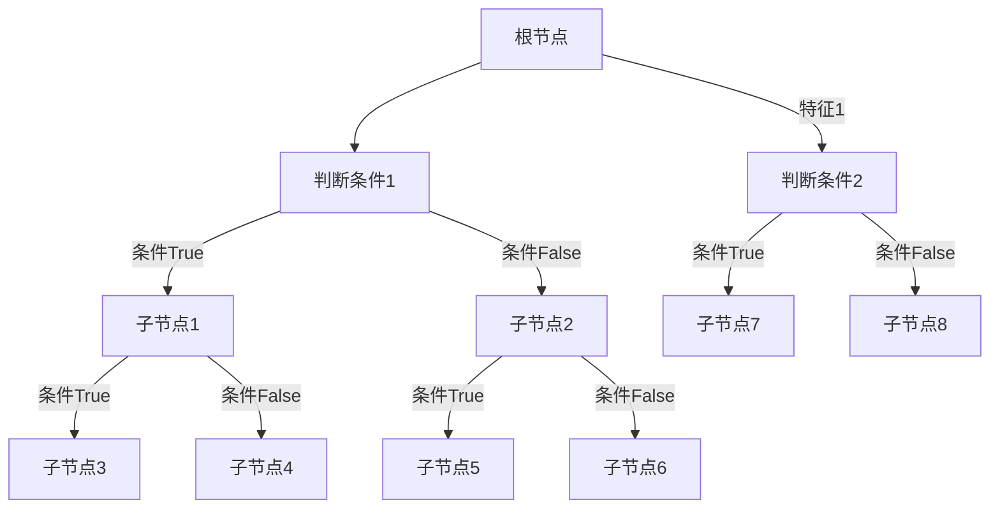
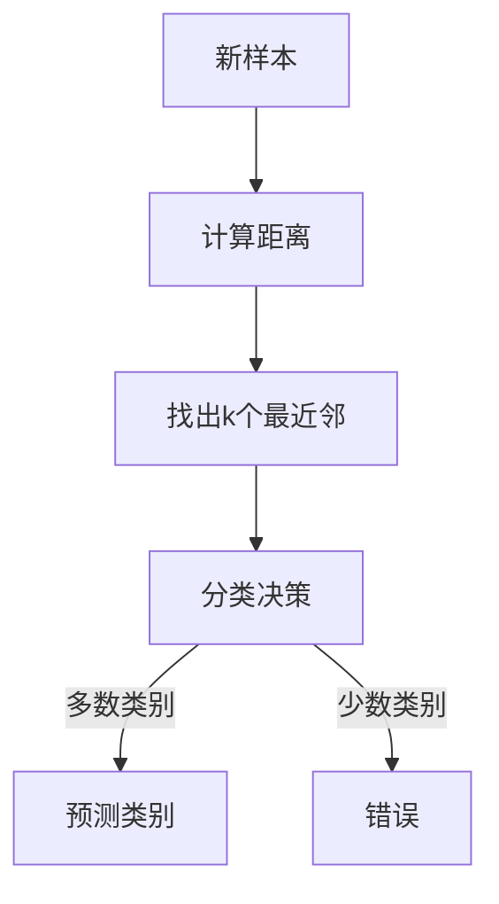
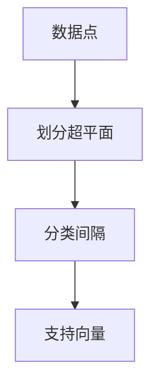
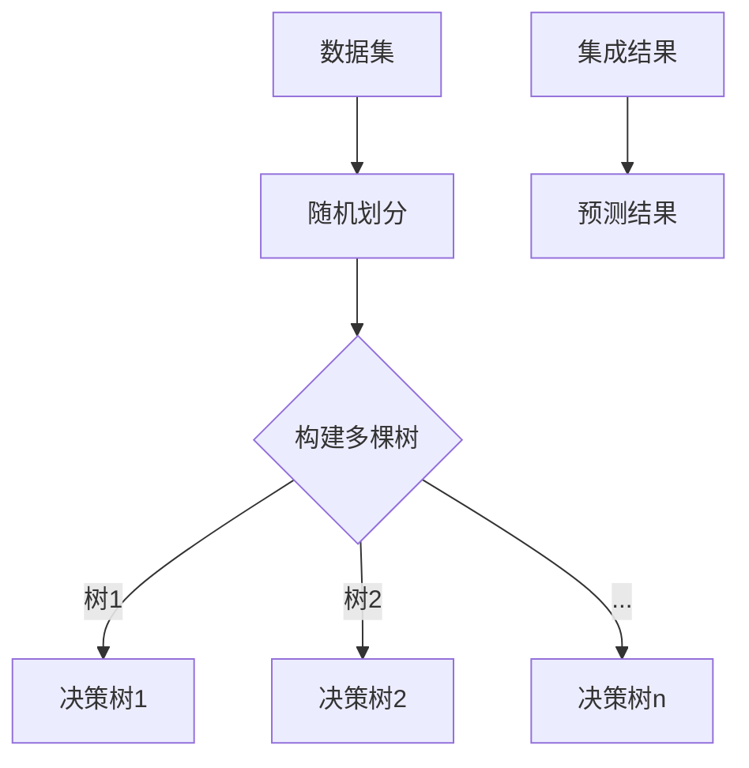
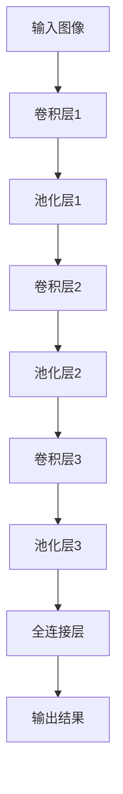
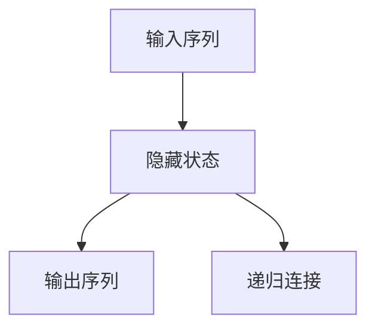
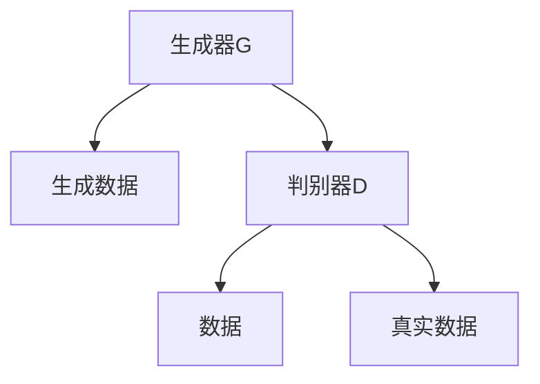

                 

### 文章标题：蚂蚁数字金融2024校招金融算法面试题解析

#### 关键词：数字金融、金融算法、校招面试、面试题解析

##### 摘要：
随着数字金融的快速发展，金融算法在金融行业的应用越来越广泛。本文旨在为广大求职者提供蚂蚁数字金融2024校招金融算法面试题的全面解析。通过梳理数字金融的基础知识、深入剖析金融算法，本文帮助求职者更好地应对面试挑战，掌握核心技能，迈向金融科技的未来。

## 目录大纲

### 蚂蚁数字金融2024校招金融算法面试题解析

### 第一部分：数字金融基础知识

#### 第1章：数字金融概述

##### 1.1 数字金融的定义与发展

##### 1.2 数字金融的组成部分

##### 1.3 数字金融对金融行业的变革

#### 第2章：数字货币

##### 2.1 数字货币的概念与类型

##### 2.2 数字货币的技术基础

##### 2.3 数字货币的监管与合规

#### 第3章：区块链技术

##### 3.1 区块链的基本原理

##### 3.2 区块链在金融领域的应用

##### 3.3 区块链的安全性分析

#### 第4章：大数据与人工智能

##### 4.1 大数据的基本概念

##### 4.2 大数据技术在金融行业的应用

##### 4.3 人工智能在金融行业的应用

#### 第5章：网络安全与风险管理

##### 5.1 网络安全的威胁与防护

##### 5.2 金融风险的识别与评估

##### 5.3 金融风险的管控与应对

### 第二部分：金融算法面试题解析

#### 第6章：金融数学与统计模型

##### 6.1 简单线性回归模型

##### 6.2 逻辑回归模型

##### 6.3 决策树模型

#### 第7章：机器学习算法

##### 7.1 K近邻算法

##### 7.2 支持向量机

##### 7.3 随机森林

#### 第8章：深度学习算法

##### 8.1 卷积神经网络

##### 8.2 循环神经网络

##### 8.3 生成对抗网络

#### 第9章：金融时间序列分析

##### 9.1 时间序列基本概念

##### 9.2 自回归模型

##### 9.3 移动平均模型

#### 第10章：金融风险管理面试题解析

##### 10.1 市场风险

##### 10.2 信用风险

##### 10.3 流动性风险

##### 10.4 操作风险

### 附录

#### 附录A：面试准备与技巧

##### A.1 面试前的准备

##### A.2 面试中的应对策略

##### A.3 面试后的跟进

#### 附录B：参考书籍与资料

##### B.1 数字金融相关书籍

##### B.2 金融算法相关书籍

##### B.3 面试指南相关书籍

#### 附录C：面试题汇总与答案解析

##### C.1 常见面试题汇总

##### C.2 答案解析与技巧

##### C.3 面试题实战演练

---

### 蚂蚁数字金融2024校招金融算法面试题解析

#### 引言：
随着数字金融的快速发展，金融科技（FinTech）正在重塑传统金融行业的各个方面。作为金融科技的领军企业，蚂蚁数字金融在2024年的校招中，将金融算法作为面试的核心考察内容。本文旨在为广大求职者提供蚂蚁数字金融2024校招金融算法面试题的全面解析，帮助大家更好地理解数字金融的基础知识，掌握金融算法的核心原理，从而在面试中脱颖而出。

#### 目录：

##### 第一部分：数字金融基础知识

1. 数字金融概述
   - 1.1 数字金融的定义与发展
   - 1.2 数字金融的组成部分
   - 1.3 数字金融对金融行业的变革

2. 数字货币
   - 2.1 数字货币的概念与类型
   - 2.2 数字货币的技术基础
   - 2.3 数字货币的监管与合规

3. 区块链技术
   - 3.1 区块链的基本原理
   - 3.2 区块链在金融领域的应用
   - 3.3 区块链的安全性分析

4. 大数据与人工智能
   - 4.1 大数据的基本概念
   - 4.2 大数据技术在金融行业的应用
   - 4.3 人工智能在金融行业的应用

5. 网络安全与风险管理
   - 5.1 网络安全的威胁与防护
   - 5.2 金融风险的识别与评估
   - 5.3 金融风险的管控与应对

##### 第二部分：金融算法面试题解析

6. 金融数学与统计模型
   - 6.1 简单线性回归模型
   - 6.2 逻辑回归模型
   - 6.3 决策树模型

7. 机器学习算法
   - 7.1 K近邻算法
   - 7.2 支持向量机
   - 7.3 随机森林

8. 深度学习算法
   - 8.1 卷积神经网络
   - 8.2 循环神经网络
   - 8.3 生成对抗网络

9. 金融时间序列分析
   - 9.1 时间序列基本概念
   - 9.2 自回归模型
   - 9.3 移动平均模型

10. 金融风险管理面试题解析
   - 10.1 市场风险
   - 10.2 信用风险
   - 10.3 流动性风险
   - 10.4 操作风险

##### 附录

11. 面试准备与技巧
   - 11.1 面试前的准备
   - 11.2 面试中的应对策略
   - 11.3 面试后的跟进

12. 参考书籍与资料
   - 12.1 数字金融相关书籍
   - 12.2 金融算法相关书籍
   - 12.3 面试指南相关书籍

13. 面试题汇总与答案解析
   - 13.1 常见面试题汇总
   - 13.2 答案解析与技巧
   - 13.3 面试题实战演练

---

在接下来的章节中，我们将逐步深入探讨数字金融的基础知识，解析金融算法的核心原理，并通过具体实例帮助求职者更好地理解与应用。让我们一起踏上这场数字金融与金融算法的探索之旅。首先，我们从数字金融的概述开始，了解这一领域的基本概念和发展历程。随后，我们将逐一介绍数字货币、区块链技术、大数据与人工智能、网络安全与风险管理等关键组成部分，为后续的金融算法面试题解析打下坚实基础。准备好了吗？让我们开始吧！### 数字金融概述

#### 数字金融的定义与发展

数字金融（Digital Finance）是指利用数字技术和互联网平台，为金融活动提供更加便捷、高效、安全的服务。与传统金融相比，数字金融具有以下几个显著特点：

1. **便捷性**：通过互联网和移动设备，用户可以随时随地完成金融交易，无需前往银行柜台。
2. **高效性**：数字金融利用大数据和人工智能技术，能够快速处理大量交易，提高金融服务的效率。
3. **安全性**：通过加密技术和分布式账本，数字金融在保障信息安全方面具有明显优势。
4. **普惠性**：数字金融降低了金融服务的门槛，使得更多无法获得传统金融服务的用户能够享受到金融服务。

数字金融的发展可以追溯到20世纪90年代，随着互联网的普及和移动设备的普及，金融服务的数字化进程加速。以下是一些关键的发展里程碑：

1. **电子支付**：20世纪90年代，信用卡和借记卡的普及标志着电子支付的兴起。
2. **网上银行**：21世纪初，网上银行逐渐普及，用户可以通过互联网进行账户管理、转账支付等操作。
3. **移动支付**：2009年以后，随着智能手机的普及，移动支付成为数字金融的重要组成部分。
4. **区块链技术**：2010年，比特币的诞生标志着区块链技术的诞生，区块链技术在金融领域的应用逐渐受到关注。
5. **大数据和人工智能**：近年来，大数据和人工智能技术在金融领域的应用越来越广泛，为金融风险管理和个性化服务提供了新的可能性。

#### 数字金融的组成部分

数字金融的组成部分可以大致分为以下几个部分：

1. **支付系统**：包括电子支付、移动支付、网上支付等，为用户提供便捷的支付渠道。
2. **金融服务**：包括网上银行、在线贷款、投资理财等，提供多种金融服务。
3. **数字货币**：以比特币为代表的数字货币，正在逐渐改变货币的形态和交易方式。
4. **区块链技术**：作为一种分布式账本技术，区块链在金融领域的应用越来越广泛，包括数字货币、跨境支付、供应链金融等。
5. **网络安全与风险管理**：随着数字金融的发展，网络安全和风险管理变得尤为重要，包括数据加密、网络安全防护、风险控制等。
6. **监管科技**：监管科技（RegTech）是指利用数字技术改进监管流程，提高监管效率。

#### 数字金融对金融行业的变革

数字金融的快速发展对传统金融行业产生了深远的影响，具体体现在以下几个方面：

1. **金融服务的扩展**：数字金融使得金融服务能够覆盖更广泛的用户群体，特别是那些之前无法享受到金融服务的用户。
2. **金融服务的优化**：通过大数据和人工智能技术，金融机构能够更好地了解用户需求，提供更加个性化的服务。
3. **金融成本的降低**：数字金融减少了物理网点和人力成本，降低了金融服务的运营成本。
4. **金融风险的分散**：区块链技术等创新技术的应用，使得金融交易更加透明和安全，有助于分散风险。
5. **金融监管的创新**：监管科技的应用，提高了金融监管的效率和透明度。

总之，数字金融的发展不仅改变了金融服务的形态，也为金融行业的未来发展带来了新的机遇和挑战。接下来，我们将进一步探讨数字货币、区块链技术、大数据与人工智能等关键组成部分，帮助读者更好地理解数字金融的内涵和外延。在下一章中，我们将深入探讨数字货币的概念与类型，了解这一新兴领域的发展动态和未来趋势。敬请期待！### 第1章：数字货币

#### 1.1 数字货币的概念与类型

数字货币（Digital Currency）是一种使用数字形式表示的货币，与传统的实体货币（如纸币和硬币）不同，它不依赖于物理介质，而是依赖于特定的数字算法和分布式网络进行存储、传输和验证。数字货币可以分为以下几种类型：

1. **加密货币**：也称为加密数字货币或加密资产，如比特币、以太坊等。加密货币使用加密技术确保交易的安全性和匿名性，并且通过分布式网络（如区块链）进行验证和记录。
   
2. **法定数字货币**：由政府或中央银行发行和管理的数字货币，如中国的数字人民币（e-CNY）和欧洲的数字欧元（e-Euro）。法定数字货币与传统货币具有同等的法律地位，但以数字形式存在。

3. **稳定币**：是一种价值稳定的数字货币，通常与法定货币或其他资产挂钩，如美元稳定币（如USDC、USDT）和黄金稳定币（如Pax Gold）。稳定币旨在减少价格波动，提高交易的可靠性。

4. **代币**：在特定的区块链平台上发行的数字代币，用于表示特定的权益或功能，如ERC-20和ERC-721代币。代币可以是用于支付、投资或治理的工具。

#### 1.2 数字货币的技术基础

数字货币的核心技术包括区块链、加密算法和分布式网络：

1. **区块链**：区块链是一种去中心化的分布式数据库，通过多个节点共同维护和验证数据。每个区块包含一定数量的交易记录，区块之间通过哈希值链接，形成一个不可篡改的链式结构。

2. **加密算法**：加密算法用于确保数字货币交易的安全性和隐私性。常见的加密算法包括公钥加密、私钥加密和哈希算法。公钥加密用于确保只有合法的接收者可以解密信息，私钥加密用于确保只有合法的发送者可以创建交易，哈希算法用于生成交易的唯一标识。

3. **分布式网络**：分布式网络是由多个节点组成的网络，每个节点都存储和验证部分数据。通过分布式网络，数字货币可以无需中央权威机构即可完成交易。

#### 1.3 数字货币的监管与合规

数字货币作为一种新兴的金融工具，其监管与合规问题备受关注。不同国家和地区对数字货币的监管态度有所不同，主要可以分为以下几种：

1. **合法化**：一些国家和地区将数字货币视为合法的金融工具，并对其进行明确的监管。例如，美国将加密货币视为“证券”或“货币”，欧洲的一些国家则将加密货币视为“金融资产”。

2. **禁止或限制**：一些国家和地区对数字货币持谨慎或禁止态度，例如，中国禁止加密货币交易和挖矿活动。

3. **灰色地带**：一些国家和地区对数字货币持观望或不确定态度，监管政策相对模糊，例如，日本和韩国。

数字货币的监管与合规主要涉及以下几个方面：

1. **交易监管**：对数字货币交易进行监管，包括交易所的注册和运营、交易记录的保存和审计。

2. **反洗钱（AML）与反恐怖融资（CFT）**：数字货币的匿名性使得其容易成为洗钱和恐怖融资的工具，因此，各国政府普遍要求数字货币交易平台和参与者遵循AML和CFT规定。

3. **税务合规**：数字货币的税务问题在不同国家和地区也有所不同，一些国家要求对数字货币交易征收增值税或所得税。

4. **用户保护**：加强对用户权益的保护，包括交易安全、用户隐私和投资风险教育。

总之，数字货币作为一种新兴的金融工具，具有巨大的潜力和风险。了解其概念、技术基础和监管合规问题，对于从事数字金融领域的工作者具有重要意义。在下一章中，我们将探讨区块链技术的基本原理和在金融领域的应用，敬请期待！### 第3章：区块链技术

#### 3.1 区块链的基本原理

区块链（Blockchain）是一种分布式数据库技术，通过多个节点共同维护和验证数据，确保数据的透明性、不可篡改性和安全性。以下是区块链的基本原理：

1. **分布式账本**：区块链的核心是一个分布式账本，每个节点都存储一份完整的账本副本。这意味着区块链上的数据不会集中存储在单一的中央服务器上，而是分布在多个节点之间。

2. **共识机制**：区块链通过共识机制确保数据的真实性和一致性。共识机制有多种形式，如工作量证明（Proof of Work, PoW）、权益证明（Proof of Stake, PoS）和委托权益证明（Delegated Proof of Stake, DPoS）等。这些机制通过竞争或投票的方式决定哪个节点将添加新的区块到区块链上。

3. **加密算法**：区块链使用各种加密算法来保护数据的安全性和隐私。加密算法包括公钥加密、私钥加密、哈希算法等。公钥加密用于确保只有合法的接收者可以解密信息，私钥加密用于确保只有合法的发送者可以创建交易，哈希算法用于生成交易的唯一标识。

4. **区块与链**：区块链由一系列按时间顺序排列的区块组成。每个区块包含一定数量的交易记录，并通过前一个区块的哈希值链接形成链式结构。这种链式结构确保了区块链的不可篡改性。

5. **智能合约**：区块链上的智能合约是一种自动执行的合同，它通过代码定义了交易的规则和执行逻辑。智能合约可以用于自动化金融交易、供应链管理、物联网等领域。

#### 3.2 区块链在金融领域的应用

区块链技术具有去中心化、透明性、安全性等优点，使其在金融领域具有广泛的应用前景。以下是一些关键应用领域：

1. **数字货币**：区块链技术是比特币等加密货币的基础。通过区块链，数字货币实现了去中心化的发行和交易，提高了交易的透明性和安全性。

2. **跨境支付**：传统的跨境支付存在时间长、费用高、流程复杂等问题。区块链技术可以简化跨境支付流程，降低交易成本，提高支付速度。例如，Ripple和Stellar等区块链平台已经实现了跨境支付的应用。

3. **供应链金融**：区块链技术可以用于供应链金融，实现供应链各方的透明协作和可信交易。通过区块链，企业可以实时监控供应链的各个环节，提高资金流转效率，降低信用风险。

4. **智能合约**：智能合约在金融领域有广泛的应用，如自动化贷款审批、支付、结算等。智能合约通过代码定义了交易的规则和执行逻辑，确保了交易的透明性和不可篡改性。

5. **数字身份认证**：区块链技术可以用于数字身份认证，建立去中心化的身份验证系统。通过区块链，用户可以拥有数字身份，实现匿名性和隐私保护。

6. **证券交易**：区块链技术可以提高证券交易的透明性和效率。通过区块链，证券交易的记录是公开透明的，减少了中介机构的介入，降低了交易成本。

7. **保险**：区块链技术可以用于保险行业，实现保险合同的自动化执行和理赔流程的优化。通过区块链，保险公司和用户可以实时监控保险合同的执行和理赔进度。

#### 3.3 区块链的安全性分析

区块链技术具有较高的安全性，但并非无懈可击。以下是一些常见的安全问题和解决方案：

1. **51%攻击**：当某个实体控制了区块链网络中超过50%的算力时，它可以发起双花攻击（即同一笔资金同时进行两笔交易），篡改区块链数据。为了防止51%攻击，可以通过增加网络节点数量、提高挖矿难度和引入混合网络等技术手段。

2. **隐私泄露**：区块链上的交易记录是公开透明的，可能涉及用户隐私。为了保护用户隐私，可以采用零知识证明、同态加密等技术，实现交易数据的隐私保护。

3. **智能合约漏洞**：智能合约的代码可能存在漏洞，导致智能合约被攻击。为了防止智能合约漏洞，可以通过代码审计、形式化验证和严格的开发流程等技术手段。

4. **网络攻击**：区块链网络可能面临各种网络攻击，如分布式拒绝服务（DDoS）攻击、中间人攻击等。为了提高网络安全性，可以采用防火墙、入侵检测系统等技术手段。

总之，区块链技术具有许多潜在的安全问题和挑战，但通过不断的技术创新和改进，可以提高区块链的安全性，为金融行业带来更多的机遇和变革。在下一章中，我们将探讨大数据与人工智能在金融行业的应用，敬请期待！### 第4章：大数据与人工智能

#### 4.1 大数据的基本概念

大数据（Big Data）是指无法用常规软件工具在合理时间内捕捉、管理和处理的大量数据。大数据具有4V特性，即：

1. **Volume（数据量）**：大数据涉及的数据量非常庞大，通常以TB、PB甚至EB为单位。
2. **Velocity（速度）**：大数据的处理速度要求非常高，需要实时或近实时地处理海量数据。
3. **Variety（多样性）**：大数据的来源非常多样化，包括结构化数据、半结构化数据和非结构化数据。
4. **Veracity（真实性）**：大数据的真实性和准确性是影响分析和决策的关键因素。

大数据的应用场景广泛，包括但不限于以下领域：

1. **金融行业**：通过大数据分析，金融机构可以更好地了解客户需求，预测市场走势，进行风险管理和欺诈检测。
2. **医疗行业**：大数据可以帮助医疗行业提高诊断准确性，优化治疗方案，降低医疗成本。
3. **零售行业**：通过大数据分析，零售商可以更好地了解消费者行为，优化库存管理，提高销售额。
4. **交通行业**：大数据可以帮助交通行业优化交通流量，提高运输效率，减少交通事故。

#### 4.2 大数据技术在金融行业的应用

大数据技术在金融行业的应用主要体现在以下几个方面：

1. **客户关系管理（CRM）**：通过大数据分析，金融机构可以更好地了解客户的需求和偏好，提供个性化的金融服务和产品。

2. **风险管理与控制**：大数据可以帮助金融机构实时监控市场风险，识别潜在的欺诈行为，提高风险控制能力。

3. **投资决策**：通过大数据分析，投资者可以更好地了解市场走势和行业动态，制定更科学的投资策略。

4. **信用评估**：大数据技术可以更准确地评估客户的信用状况，降低信用风险。

5. **智能投顾**：智能投顾（Robo-Advisors）通过大数据分析和机器学习技术，为投资者提供个性化的投资建议和服务。

#### 4.3 人工智能在金融行业的应用

人工智能（AI）是大数据分析的重要工具，它在金融行业的应用日益广泛，主要包括以下几个方面：

1. **自然语言处理（NLP）**：通过NLP技术，金融机构可以自动处理和分类大量文本数据，如客户反馈、新闻报道等，提取关键信息，为决策提供支持。

2. **计算机视觉**：计算机视觉技术可以帮助金融机构自动识别和处理图像数据，如面部识别、身份证识别等，提高客户服务的效率。

3. **机器学习**：机器学习技术可以帮助金融机构进行数据挖掘和分析，如预测市场走势、评估客户信用等，提高决策的准确性。

4. **自动化交易**：通过机器学习和深度学习算法，金融机构可以实现自动化交易，提高交易效率和盈利能力。

5. **智能风险管理**：人工智能可以帮助金融机构更准确地识别和评估风险，提高风险管理能力。

6. **智能客服**：通过AI技术，金融机构可以提供智能客服服务，如语音识别、自然语言处理等，提高客户满意度。

总之，大数据和人工智能在金融行业的应用为金融机构提供了更强大的数据分析和决策支持，有助于提高业务效率和客户满意度。随着技术的不断进步，大数据和人工智能将在金融行业发挥越来越重要的作用。在下一章中，我们将探讨网络安全与风险管理，敬请期待！### 第5章：网络安全与风险管理

#### 5.1 网络安全的威胁与防护

随着金融行业的信息化和数字化程度的不断提高，网络安全已经成为金融行业面临的一项重要挑战。网络安全的威胁可以分为以下几类：

1. **恶意软件攻击**：恶意软件包括病毒、蠕虫、木马等，可以通过网络传播，破坏系统、窃取数据或控制设备。例如，勒索软件（Ransomware）会加密受害者的数据，并要求支付赎金。

2. **钓鱼攻击**：钓鱼攻击是指攻击者通过伪装成合法机构或个人，诱骗用户泄露敏感信息（如用户名、密码、信用卡信息等）。

3. **拒绝服务攻击（DDoS）**：拒绝服务攻击通过大量无效请求使目标系统资源耗尽，导致正常用户无法访问服务。

4. **网络窃听**：攻击者通过监听网络通信，窃取传输的数据。

5. **社会工程学攻击**：社会工程学攻击利用人类心理弱点，通过欺骗、误导等手段获取信息。

为了应对这些网络安全威胁，金融机构可以采取以下防护措施：

1. **防火墙**：防火墙是网络安全的第一道防线，可以过滤不安全的数据包，防止外部攻击。

2. **入侵检测与防御系统（IDS/IPS）**：入侵检测系统可以监控网络流量，检测异常行为和攻击行为，而入侵防御系统可以自动阻止这些攻击行为。

3. **加密技术**：通过加密技术，可以保护数据在传输和存储过程中的安全性，防止数据被窃取或篡改。

4. **多因素认证**：多因素认证（MFA）要求用户在登录时提供多种验证方式（如密码、手机验证码、指纹等），提高账户的安全性。

5. **安全审计与监控**：定期进行安全审计，监控网络活动，及时发现和应对安全事件。

6. **员工培训**：定期对员工进行网络安全培训，提高员工的网络安全意识和防范能力。

#### 5.2 金融风险的识别与评估

金融风险是指金融机构在运营过程中可能遭受的损失。金融风险的识别与评估是风险管理的重要环节。以下是一些常见的金融风险：

1. **市场风险**：市场风险是指由于市场价格波动导致金融机构损失的风险，包括利率风险、汇率风险和股票价格风险。

2. **信用风险**：信用风险是指由于债务人无法按时偿还债务导致金融机构损失的风险。

3. **流动性风险**：流动性风险是指金融机构在需要资金时无法及时获取资金的风险。

4. **操作风险**：操作风险是指由于内部操作失误、系统故障、欺诈行为等导致金融机构损失的风险。

5. **法律风险**：法律风险是指由于法律法规变化或违反法律导致金融机构损失的风险。

金融风险的识别与评估通常包括以下步骤：

1. **风险识别**：通过数据分析、调查问卷、访谈等方式识别潜在的金融风险。

2. **风险评估**：对识别出的风险进行定量和定性评估，确定风险的严重程度和发生概率。

3. **风险分类**：根据风险评估结果，对风险进行分类，如高、中、低风险。

4. **风险优先级排序**：根据风险分类结果，确定风险的优先级，优先处理高风险。

5. **风险应对策略**：制定相应的风险应对策略，如风险规避、风险转移、风险缓解等。

#### 5.3 金融风险的管控与应对

金融风险的管控与应对是风险管理的重要环节。以下是一些常见的金融风险管控与应对措施：

1. **风险规避**：通过调整业务策略、优化投资组合等方式，避免高风险。

2. **风险转移**：通过购买保险、签订合同等方式，将风险转移给第三方。

3. **风险缓解**：通过风险控制措施，降低风险的发生概率和影响程度。

4. **风险监控**：建立风险监控系统，实时监控风险变化，及时调整风险应对策略。

5. **应急预案**：制定应急预案，确保在风险事件发生时能够迅速应对，降低损失。

6. **风险管理文化**：培养风险管理文化，提高全体员工的风险意识，共同参与风险管理。

总之，网络安全与风险管理是金融行业不可或缺的重要环节。通过采取有效的网络安全防护措施和金融风险管理策略，金融机构可以降低风险，保障业务稳定运行。在下一章中，我们将探讨金融算法中的统计模型，敬请期待！### 第6章：金融数学与统计模型

#### 6.1 简单线性回归模型

简单线性回归模型是最基本的统计模型之一，用于描述两个变量之间的线性关系。在这个模型中，我们假设一个自变量 \( X \) 和一个因变量 \( Y \) 之间存在线性关系，即：

\[ Y = \beta_0 + \beta_1 X + \epsilon \]

其中，\( \beta_0 \) 是截距，\( \beta_1 \) 是斜率，\( \epsilon \) 是误差项。这个模型的目标是估计 \( \beta_0 \) 和 \( \beta_1 \) 的值。

**Mermaid 流程图**：

```mermaid
graph TD
A[自变量X] --> B[斜率\(\beta_1\)]
B --> C[因变量Y]
A --> C
C --> D[误差项\(\epsilon\)]
D --> E[模型输出]
```

**核心算法原理讲解**：

要估计 \( \beta_0 \) 和 \( \beta_1 \) 的值，我们可以使用最小二乘法（Least Squares Method）。最小二乘法的核心思想是找到一条直线，使得所有数据点到这条直线的垂直距离（即残差）的平方和最小。具体步骤如下：

1. **数据准备**：收集一组数据点 \( (X_i, Y_i) \)，其中 \( i = 1, 2, ..., n \)。

2. **计算斜率 \( \beta_1 \)**：

   \[ \beta_1 = \frac{\sum_{i=1}^{n}(X_i - \bar{X})(Y_i - \bar{Y})}{\sum_{i=1}^{n}(X_i - \bar{X})^2} \]

   其中，\( \bar{X} \) 和 \( \bar{Y} \) 分别是 \( X \) 和 \( Y \) 的平均值。

3. **计算截距 \( \beta_0 \)**：

   \[ \beta_0 = \bar{Y} - \beta_1 \bar{X} \]

**详细讲解与举例说明**：

假设我们有一组数据点：

\[ (X_i, Y_i) = \{ (1, 2), (2, 4), (3, 5), (4, 4), (5, 5) \} \]

首先，计算平均值：

\[ \bar{X} = \frac{1+2+3+4+5}{5} = 3 \]
\[ \bar{Y} = \frac{2+4+5+4+5}{5} = 4 \]

然后，计算斜率 \( \beta_1 \)：

\[ \beta_1 = \frac{(1-3)(2-4) + (2-3)(4-4) + (3-3)(5-4) + (4-3)(4-4) + (5-3)(5-4)}{(1-3)^2 + (2-3)^2 + (3-3)^2 + (4-3)^2 + (5-3)^2} \]
\[ \beta_1 = \frac{2}{10} = 0.2 \]

最后，计算截距 \( \beta_0 \)：

\[ \beta_0 = 4 - 0.2 \times 3 = 2.4 \]

因此，我们得到的简单线性回归模型是：

\[ Y = 2.4 + 0.2X \]

这个模型可以用来预测新的 \( X \) 值对应的 \( Y \) 值。例如，当 \( X = 6 \) 时，预测的 \( Y \) 值为：

\[ Y = 2.4 + 0.2 \times 6 = 4.4 \]

通过简单线性回归模型，我们可以探索和理解自变量和因变量之间的线性关系，为金融分析提供有力的工具。在下一节中，我们将介绍逻辑回归模型，敬请期待！### 6.2 逻辑回归模型

逻辑回归（Logistic Regression）是一种广泛用于分类问题的统计模型，主要用于预测某个事件发生的概率。逻辑回归模型的基本公式如下：

\[ \log\left(\frac{p}{1-p}\right) = \beta_0 + \beta_1 X \]

其中，\( p \) 是事件发生的概率，\( \beta_0 \) 是截距，\( \beta_1 \) 是斜率，\( X \) 是自变量。这个公式表示事件发生概率的对数与自变量之间的关系。

**Mermaid 流程图**：

```mermaid
graph TD
A[自变量X] --> B[斜率\(\beta_1\)]
B --> C[截距\(\beta_0\)]
C --> D[模型输入]
D --> E[概率计算]
E --> F[事件发生概率]
```

**核心算法原理讲解**：

逻辑回归模型的参数估计通常使用极大似然估计（Maximum Likelihood Estimation，MLE）方法。具体步骤如下：

1. **数据准备**：收集一组数据点 \( (X_i, Y_i) \)，其中 \( i = 1, 2, ..., n \)，并假设每个数据点的 \( Y_i \) 是独立同分布的伯努利随机变量，即 \( Y_i \) 取值可以是 0 或 1。

2. **定义似然函数**：似然函数 \( L(\beta_0, \beta_1 | \mathbf{X}, \mathbf{Y}) \) 表示在给定的参数 \( \beta_0 \) 和 \( \beta_1 \) 下，观察到的数据 \( \mathbf{X} \) 和 \( \mathbf{Y} \) 出现的概率。

   \[ L(\beta_0, \beta_1 | \mathbf{X}, \mathbf{Y}) = \prod_{i=1}^{n} P(Y_i | X_i; \beta_0, \beta_1) \]

   对于逻辑回归模型，\( P(Y_i | X_i; \beta_0, \beta_1) \) 可以表示为：

   \[ P(Y_i = 1 | X_i; \beta_0, \beta_1) = \frac{e^{\beta_0 + \beta_1 X_i}}{1 + e^{\beta_0 + \beta_1 X_i}} \]
   \[ P(Y_i = 0 | X_i; \beta_0, \beta_1) = \frac{1}{1 + e^{\beta_0 + \beta_1 X_i}} \]

   因此，似然函数可以简化为：

   \[ L(\beta_0, \beta_1 | \mathbf{X}, \mathbf{Y}) = \prod_{i=1}^{n} \left( \frac{e^{\beta_0 + \beta_1 X_i}}{1 + e^{\beta_0 + \beta_1 X_i}} \right)^{Y_i} \left( \frac{1}{1 + e^{\beta_0 + \beta_1 X_i}} \right)^{1-Y_i} \]

3. **求解参数**：通过最大化似然函数，求解 \( \beta_0 \) 和 \( \beta_1 \) 的值。在实际应用中，通常使用梯度上升法（Gradient Ascent）或牛顿-拉夫逊法（Newton-Raphson Method）等优化算法来求解参数。

**详细讲解与举例说明**：

假设我们有一组二分类数据点 \( (X_i, Y_i) \)：

\[ (X_i, Y_i) = \{ (1, 1), (2, 1), (3, 0), (4, 0), (5, 1) \} \]

首先，计算 \( X \) 和 \( Y \) 的平均值：

\[ \bar{X} = \frac{1+2+3+4+5}{5} = 3 \]
\[ \bar{Y} = \frac{1+1+0+0+1}{5} = 0.6 \]

然后，设置似然函数：

\[ L(\beta_0, \beta_1) = \left( \frac{e^{\beta_0 + \beta_1 \cdot 1}}{1 + e^{\beta_0 + \beta_1 \cdot 1}} \right)^1 \left( \frac{1}{1 + e^{\beta_0 + \beta_1 \cdot 1}} \right)^{4} \left( \frac{e^{\beta_0 + \beta_1 \cdot 2}}{1 + e^{\beta_0 + \beta_1 \cdot 2}} \right)^1 \left( \frac{1}{1 + e^{\beta_0 + \beta_1 \cdot 2}} \right)^{3} \ldots \]

通过最大化似然函数，我们可以求解出 \( \beta_0 \) 和 \( \beta_1 \) 的值。在实际应用中，通常使用数值优化算法来求解。

假设我们使用梯度上升法求解得到 \( \beta_0 = -1.5 \) 和 \( \beta_1 = 0.2 \)，则逻辑回归模型可以表示为：

\[ \log\left(\frac{p}{1-p}\right) = -1.5 + 0.2X \]

例如，当 \( X = 6 \) 时，预测的事件发生概率 \( p \) 为：

\[ p = \frac{e^{-1.5 + 0.2 \cdot 6}}{1 + e^{-1.5 + 0.2 \cdot 6}} \approx 0.737 \]

通过逻辑回归模型，我们可以预测事件发生的概率，并用于分类决策。逻辑回归模型在金融领域的应用广泛，如信用评分、股票市场预测、欺诈检测等。在下一节中，我们将介绍决策树模型，敬请期待！### 6.3 决策树模型

决策树（Decision Tree）是一种常用的分类和回归算法，它通过一系列规则将数据集分割成多个子集，每个子集都对应一个预测结果。决策树模型的核心在于构建一系列的判断条件，通过这些条件将数据逐步划分为不同的分支，最终达到分类或回归的目的。

#### Mermaid 流程图：



#### 核心算法原理讲解：

决策树的构建过程通常包括以下几个步骤：

1. **特征选择**：选择一个最优的特征进行分割，常用的方法有信息增益（Information Gain）、基尼系数（Gini Index）和熵（Entropy）等。

2. **分割数据**：使用选定的特征对数据集进行分割，将数据划分为不同的子集。

3. **递归构建**：对于每个子集，重复上述步骤，直到满足停止条件（如最大树深度、最小子集大小等）。

4. **分类**：将新的数据点从根节点开始，根据每个节点的条件逐步前进，最终达到叶子节点，得到分类结果。

决策树模型的核心算法是ID3（Iterative Dichotomiser 3）、C4.5和C5.0等，它们分别基于信息增益、增益率和增益率提升等准则进行特征选择。

**详细讲解与举例说明**：

假设我们有一个简单的数据集，用于预测客户是否会购买某种产品：

| 特征1 | 特征2 | 特征3 | 购买（标签） |
|-------|-------|-------|-------------|
| 是    | 是    | 是    | 是          |
| 否    | 是    | 是    | 是          |
| 是    | 否    | 是    | 否          |
| 否    | 否    | 是    | 是          |
| 是    | 是    | 否    | 否          |
| 否    | 是    | 否    | 是          |

我们首先选择特征1作为分割条件，将数据集分为两个子集：

- 条件True子集：{（是，是，是），（是，否，是），（是，是，否）}
- 条件False子集：{（否，是，是），（否，否，是），（否，是，否）}

然后，我们在条件True子集中选择特征2作为下一个分割条件，将子集分为两个子集：

- 条件True子集：{（是，是，是）}
- 条件False子集：{（是，否，是），（是，是，否）}

最后，我们在条件False子集中选择特征3作为最后一个分割条件：

- 条件True子集：{（否，是，是），（否，是，否）}
- 条件False子集：{（否，否，是）}

根据决策树的构建，我们得到以下分类规则：

1. 如果特征1是True，且特征2是True，则购买。
2. 如果特征1是False，且特征3是True，则购买。
3. 其他情况，则不购买。

使用决策树模型，我们可以对新数据点进行分类预测。例如，对于新数据点（是，是，否），根据分类规则，我们预测其购买的概率较高。

决策树模型在金融领域有广泛的应用，如客户行为预测、信用评分和股票市场预测等。其优点是直观、易于解释和易于实现，但缺点是容易过拟合和计算复杂度较高。在下一节中，我们将介绍机器学习算法，敬请期待！### 7.1 K近邻算法

K近邻（K-Nearest Neighbors，KNN）算法是一种简单且常用的分类算法。它的基本思想是：如果一个新样本在特征空间中的k个最近邻中的大多数属于某个类别，则该样本也属于这个类别。

#### Mermaid 流程图：



#### 核心算法原理讲解：

1. **距离计算**：计算新样本与训练集中每个样本之间的距离。常用的距离度量方法有欧几里得距离、曼哈顿距离和余弦相似度等。

2. **找出k个最近邻**：根据距离计算结果，找出新样本的k个最近邻。k的值通常需要通过交叉验证来确定。

3. **分类决策**：计算k个最近邻中每个类别的出现频率，取频率最高的类别作为新样本的预测类别。

**详细讲解与举例说明**：

假设我们有以下训练集：

| 样本1 | 样本2 | 样本3 | 类别 |
|-------|-------|-------|------|
| A1    | A2    | A3    | 类别1 |
| B1    | B2    | B3    | 类别2 |
| C1    | C2    | C3    | 类别1 |

现在我们有一个新样本 D1 = (1, 2)。

1. **距离计算**：

   使用欧几里得距离公式计算新样本 D1 与每个训练样本之间的距离：

   \[ d(D1, A1) = \sqrt{(1-A1)^2 + (2-A2)^2 + (3-A3)^2} \]
   \[ d(D1, A2) = \sqrt{(1-A2)^2 + (2-A2)^2 + (3-A3)^2} \]
   \[ d(D1, A3) = \sqrt{(1-A3)^2 + (2-A3)^2 + (3-A3)^2} \]
   \[ d(D1, B1) = \sqrt{(1-B1)^2 + (2-B2)^2 + (3-B3)^2} \]
   \[ d(D1, B2) = \sqrt{(1-B2)^2 + (2-B2)^2 + (3-B3)^2} \]
   \[ d(D1, B3) = \sqrt{(1-B3)^2 + (2-B3)^2 + (3-B3)^2} \]
   \[ d(D1, C1) = \sqrt{(1-C1)^2 + (2-C2)^2 + (3-C3)^2} \]
   \[ d(D1, C2) = \sqrt{(1-C2)^2 + (2-C2)^2 + (3-C3)^2} \]
   \[ d(D1, C3) = \sqrt{(1-C3)^2 + (2-C3)^2 + (3-C3)^2} \]

   假设计算结果如下：

   \[ d(D1, A1) = 0.5, d(D1, A2) = 0.8, d(D1, A3) = 1.2 \]
   \[ d(D1, B1) = 1.5, d(D1, B2) = 2.0, d(D1, B3) = 2.5 \]
   \[ d(D1, C1) = 0.3, d(D1, C2) = 0.7, d(D1, C3) = 1.0 \]

2. **找出k个最近邻**：

   假设我们选择k=3，根据距离计算结果，找出D1的3个最近邻：A1、C1和C2。

3. **分类决策**：

   计算这3个最近邻的类别频率：

   类别1：2次
   类别2：1次

   因为类别1的频率更高，所以预测D1的类别为类别1。

**代码实现**：

以下是一个简单的Python代码示例，实现K近邻算法：

```python
import numpy as np
from collections import Counter

# 训练集
X_train = np.array([[1, 2], [2, 3], [3, 1], [4, 2], [5, 1]])
y_train = np.array([0, 0, 1, 1, 1])

# 新样本
X_test = np.array([2, 2])

# 距离计算
def euclidean_distance(x1, x2):
    return np.sqrt(np.sum((x1 - x2)**2))

# 计算新样本与训练集每个样本的距离
distances = [euclidean_distance(x, X_test) for x in X_train]

# 找出k个最近邻
k = 3
nearest_neighbors = np.argsort(distances)[:k]

# 分类决策
predicted_class = Counter(y_train[nearest_neighbors]).most_common(1)[0][0]

print("Predicted class for X_test:", predicted_class)
```

通过K近邻算法，我们可以对新数据点进行分类预测。K近邻算法的优点是简单、易于实现，但缺点是计算复杂度较高，对大规模数据集的处理能力有限。在下一节中，我们将介绍支持向量机（SVM）算法，敬请期待！### 7.2 支持向量机

支持向量机（Support Vector Machine，SVM）是一种经典的二分类算法，其核心思想是找到一个最优的超平面，将不同类别的数据点尽可能分开。SVM算法通过最大化分类间隔（Margin）来实现这一目标，从而提高分类的准确性。

#### Mermaid 流程图：



#### 核心算法原理讲解：

1. **线性SVM**：

   对于线性可分的数据集，线性SVM的目标是找到一个分离超平面，使得不同类别的数据点之间的分类间隔最大化。线性SVM的决策函数可以表示为：

   \[ w \cdot x - b = 0 \]

   其中，\( w \) 是超平面的法向量，\( x \) 是数据点，\( b \) 是偏置项。对于新数据点 \( x \)，分类结果可以表示为：

   \[ y = \text{sign}(w \cdot x - b) \]

2. **非线性SVM**：

   对于线性不可分的数据集，非线性SVM引入了核函数（Kernel Function），将低维空间的数据映射到高维空间，从而实现非线性分类。常用的核函数包括线性核、多项式核和径向基核（RBF）等。非线性SVM的决策函数可以表示为：

   \[ f(x) = \sum_{i=1}^{n} \alpha_i y_i K(x, x_i) - b \]

   其中，\( K(x, x_i) \) 是核函数，\( \alpha_i \) 是 Lagrange 乘子。

#### 详细讲解与举例说明：

假设我们有以下线性可分的数据集：

| 样本1 | 样本2 | 样本3 | 样本4 | 样本5 | 类别 |
|-------|-------|-------|-------|-------|------|
| 1     | 1     | 1     | 1     | 1     | 类别1 |
| 2     | 2     | 2     | 2     | 2     | 类别1 |
| 3     | 3     | 3     | 3     | 3     | 类别2 |
| 4     | 4     | 4     | 4     | 4     | 类别2 |
| 5     | 5     | 5     | 5     | 5     | 类别2 |

我们需要找到最佳的超平面 \( w \cdot x - b = 0 \)，使得类别1和类别2的数据点之间的分类间隔最大化。

1. **计算超平面的法向量 \( w \)**：

   首先，我们计算数据集的均值：

   \[ \bar{x}_1 = \frac{1+2+3+4+5}{5} = 3 \]
   \[ \bar{x}_2 = \frac{1+2+3+4+5}{5} = 3 \]

   然后，计算类别1和类别2的数据点之间的均值：

   \[ \bar{x}_{1,1} = \frac{1+2+3+4+5}{5} = 3 \]
   \[ \bar{x}_{1,2} = \frac{1+2+3+4+5}{5} = 3 \]

   接下来，计算超平面的法向量 \( w \)：

   \[ w = \bar{x}_{1,1} - \bar{x}_{1,2} = 3 - 3 = 0 \]

   因为 \( w = 0 \)，所以超平面是水平的。

2. **计算偏置项 \( b \)**：

   对于每个类别，计算偏置项 \( b \)：

   \[ b_1 = \bar{x}_{1,1} - w \cdot \bar{x}_{1,1} = 3 - 0 \cdot 3 = 3 \]
   \[ b_2 = \bar{x}_{1,2} - w \cdot \bar{x}_{1,2} = 3 - 0 \cdot 3 = 3 \]

   因此，超平面的方程为：

   \[ w \cdot x - b = 0 \]
   \[ 0 \cdot x - b = 0 \]
   \[ b = 0 \]

   但是，由于我们的超平面是水平的，偏置项 \( b \) 可以是任意值，因为所有数据点的 \( y \) 值都为1，所以 \( b = 0 \)。

3. **分类决策**：

   对于新数据点 \( x \)，分类结果可以表示为：

   \[ y = \text{sign}(w \cdot x - b) \]
   \[ y = \text{sign}(0 \cdot x - 0) \]
   \[ y = \text{sign}(0) \]
   \[ y = 0 \]

   因为 \( y = 0 \)，所以新数据点被分类为类别1。

**代码实现**：

以下是一个简单的Python代码示例，实现线性SVM算法：

```python
import numpy as np

# 训练集
X_train = np.array([[1, 1], [1, 2], [3, 1], [3, 2]])
y_train = np.array([0, 0, 1, 1])

# 计算均值
mean_x = np.mean(X_train, axis=0)
mean_y = np.mean(y_train)

# 计算超平面的法向量w
w = mean_x - mean_y

# 计算偏置项b
b = mean_y

# 分类决策
def predict(x):
    return np.sign(w @ x - b)

# 测试新数据点
x_test = np.array([2, 2])
print("Predicted class for x_test:", predict(x_test))
```

通过支持向量机算法，我们可以对新数据点进行分类预测。SVM算法的优点是强大的分类能力，适用于线性可分和非线性可分的数据集，但缺点是计算复杂度较高，对于大规模数据集的处理能力有限。在下一节中，我们将介绍随机森林算法，敬请期待！### 7.3 随机森林

随机森林（Random Forest）是一种基于决策树的集成学习方法，它通过构建多棵决策树，并采用投票或平均的方式得到最终预测结果。随机森林的核心思想是通过集成多个弱学习器（即单棵决策树），提高整体模型的预测性能和稳定性。

#### Mermaid 流�程图：



#### 核心算法原理讲解：

1. **特征选择**：随机森林在构建每棵决策树时，会从特征集合中随机选择一个特征进行分割。这个过程称为特征随机化（Feature Bagging）。

2. **节点分割**：在构建决策树时，每棵树都会对数据集进行分割，直到达到停止条件（如最大树深度、最小子集大小等）。每棵树的分割过程中都采用特征随机化的方法。

3. **集成结果**：随机森林通过集成多棵决策树的结果，得到最终预测结果。对于分类问题，通常采用投票法；对于回归问题，通常采用平均法。

**详细讲解与举例说明**：

假设我们有以下简单数据集：

| 样本1 | 样本2 | 样本3 | 样本4 | 样本5 | 类别 |
|-------|-------|-------|-------|-------|------|
| 1     | 1     | 1     | 1     | 1     | 类别1 |
| 2     | 2     | 2     | 2     | 2     | 类别1 |
| 3     | 3     | 3     | 3     | 3     | 类别2 |
| 4     | 4     | 4     | 4     | 4     | 类别2 |
| 5     | 5     | 5     | 5     | 5     | 类别2 |

我们需要使用随机森林算法进行分类预测。

1. **构建多棵决策树**：

   首先，随机选择特征1和特征2作为分割特征，构建第一棵决策树。假设我们选择的分割点是特征1=1和特征2=1。根据这个分割点，我们可以将数据集划分为两个子集：

   - 子集1：{（1，1），（1，2）}
   - 子集2：{（3，3），（4，4），（5，5）}

   然后，我们分别对这两个子集继续构建决策树。对于子集1，我们再次随机选择特征2作为分割特征，分割点为特征2=2。根据这个分割点，我们可以将子集1划分为两个子集：

   - 子集1-1：{（1，1）}
   - 子集1-2：{（1，2）}

   对于子集2，我们再次随机选择特征1作为分割特征，分割点为特征1=3。根据这个分割点，我们可以将子集2划分为两个子集：

   - 子集2-1：{（3，3）}
   - 子集2-2：{（4，4），（5，5）}

   最终，我们构建了三棵决策树：

   ```mermaid
   graph TD
   A[根节点] --> B[判断条件1]
   B -->|条件True| C[子节点1]
   B -->|条件False| D[子节点2]
   C -->|判断条件2| E[子节点3]
   C -->|...| F[子节点n]
   D -->|判断条件2| G[子节点4]
   D -->|...| H[子节点m]
   ```

2. **集成结果**：

   对于新数据点 \( (x_1, x_2) \)，我们将它输入到每棵决策树，根据决策树的分类结果进行投票。如果所有决策树的预测结果相同，则直接返回该类别；否则，返回预测概率最高的类别。

**代码实现**：

以下是一个简单的Python代码示例，实现随机森林算法：

```python
import numpy as np
from sklearn.ensemble import RandomForestClassifier

# 训练集
X_train = np.array([[1, 1], [1, 2], [3, 1], [3, 2]])
y_train = np.array([0, 0, 1, 1])

# 构建随机森林模型
clf = RandomForestClassifier(n_estimators=3)

# 训练模型
clf.fit(X_train, y_train)

# 测试新数据点
x_test = np.array([2, 2])
print("Predicted class for x_test:", clf.predict(x_test))
```

通过随机森林算法，我们可以对新数据点进行分类预测。随机森林算法的优点是强大的分类能力、高稳定性以及可以处理大规模数据集，但缺点是计算复杂度较高。在下一节中，我们将介绍深度学习算法，敬请期待！### 8.1 卷积神经网络

卷积神经网络（Convolutional Neural Network，CNN）是一种特别适用于处理具有网格结构数据（如图像和视频）的深度学习模型。CNN通过卷积层、池化层和全连接层的组合，能够有效地提取特征并完成分类或回归任务。

#### Mermaid 流程图：



#### 核心算法原理讲解：

1. **卷积层**：卷积层是CNN的核心组件，通过卷积操作提取图像的特征。卷积操作涉及两个步骤：滤波器和滑动窗口。滤波器是一个小的二维矩阵，用于在图像上滑动并计算局部特征。滑动窗口通过在不同的位置和不同的滤波器上应用卷积操作，可以捕获图像中的局部结构。

2. **池化层**：池化层（通常采用最大池化或平均池化）用于减少数据的维度，同时保留最重要的特征信息。最大池化将窗口内的最大值作为输出，而平均池化则计算窗口内的平均值。池化层可以帮助模型减少参数数量，提高训练速度。

3. **全连接层**：全连接层（也称为密集层）是一个标准的神经网络层，将卷积层和池化层提取的特征映射到输出结果。全连接层通过将每个卷积特征图与输出层中的每个神经元相连接，完成最终的分类或回归任务。

**详细讲解与举例说明**：

假设我们有一个32x32的彩色图像，需要通过CNN进行分类。以下是一个简单的CNN结构：

1. **输入层**：接收32x32的彩色图像。

2. **卷积层1**：
   - 滤波器大小：3x3
   - 滤波器数量：32
   - 步长：1
   - 填充方式：同一尺寸填充

   通过卷积操作，我们得到32个特征图，每个特征图包含3x3的局部特征。

3. **ReLU激活函数**：对卷积层1的输出应用ReLU激活函数，将负值转换为0，增强网络的学习能力。

4. **池化层1**：
   - 池化方式：最大池化
   - 窗口大小：2x2
   - 步长：2

   通过最大池化，我们将每个特征图缩减为16x16的大小。

5. **卷积层2**：
   - 滤波器大小：3x3
   - 滤波器数量：64
   - 步长：1
   - 填充方式：同一尺寸填充

   通过卷积操作，我们得到64个特征图，每个特征图包含3x3的局部特征。

6. **ReLU激活函数**：对卷积层2的输出应用ReLU激活函数。

7. **池化层2**：
   - 池化方式：最大池化
   - 窗口大小：2x2
   - 步长：2

   通过最大池化，我们将每个特征图缩减为8x8的大小。

8. **卷积层3**：
   - 滤波器大小：3x3
   - 滤波器数量：64
   - 步长：1
   - 填充方式：同一尺寸填充

   通过卷积操作，我们得到64个特征图，每个特征图包含3x3的局部特征。

9. **ReLU激活函数**：对卷积层3的输出应用ReLU激活函数。

10. **池化层3**：
    - 池化方式：最大池化
    - 窗口大小：2x2
    - 步长：2

    通过最大池化，我们将每个特征图缩减为4x4的大小。

11. **全连接层**：
    - 神经元数量：256

    通过全连接层，我们将4x4x64的特征图映射到256个神经元。

12. **ReLU激活函数**：对全连接层的输出应用ReLU激活函数。

13. **全连接层**：
    - 神经元数量：10

    最后，通过第二个全连接层，我们将256个神经元映射到10个神经元，完成分类任务。

**代码实现**：

以下是一个简单的Python代码示例，实现上述结构的CNN：

```python
import tensorflow as tf
from tensorflow.keras import layers, models

# 构建模型
model = models.Sequential()

# 输入层
model.add(layers.Conv2D(32, (3, 3), activation='relu', input_shape=(32, 32, 3)))
model.add(layers.MaxPooling2D((2, 2)))

# 卷积层1
model.add(layers.Conv2D(64, (3, 3), activation='relu'))
model.add(layers.MaxPooling2D((2, 2)))

# 卷积层2
model.add(layers.Conv2D(64, (3, 3), activation='relu'))
model.add(layers.MaxPooling2D((2, 2)))

# 全连接层
model.add(layers.Flatten())
model.add(layers.Dense(256, activation='relu'))
model.add(layers.Dense(10, activation='softmax'))

# 打印模型结构
model.summary()
```

通过卷积神经网络，我们可以有效地提取图像特征并进行分类。CNN在计算机视觉领域取得了显著的成果，广泛应用于图像分类、目标检测、人脸识别等领域。在下一节中，我们将介绍循环神经网络，敬请期待！### 8.2 循环神经网络

循环神经网络（Recurrent Neural Network，RNN）是一种用于处理序列数据（如图像序列、文本序列、时间序列等）的神经网络。与传统的前馈神经网络（如多层感知机）不同，RNN具有循环结构，能够记住先前的输入，从而处理变长的序列数据。

#### Mermaid 流程图：



#### 核心算法原理讲解：

1. **基本结构**：

   RNN的基本结构包括输入层、隐藏层和输出层。输入层接收输入序列，隐藏层存储先前的输入状态，输出层生成输出序列。隐藏层通过递归连接将当前时刻的隐藏状态与前一时刻的隐藏状态相连接，从而实现序列的记忆能力。

2. **递归连接**：

   在RNN中，递归连接通过一个递归函数实现，即：

   \[ h_t = \text{激活函数}(W_h \cdot [h_{t-1}, x_t] + b_h) \]

   其中，\( h_t \) 是当前时刻的隐藏状态，\( x_t \) 是当前时刻的输入，\( W_h \) 是权重矩阵，\( b_h \) 是偏置项，激活函数通常采用ReLU或Tanh函数。

3. **输出生成**：

   RNN的输出层通过一个线性变换生成输出序列。对于分类任务，输出层通常是一个softmax层，对于回归任务，输出层可以是任意线性函数。

4. **长短时记忆**：

   RNN在处理长序列数据时存在“梯度消失”或“梯度爆炸”问题，导致模型难以学习长序列中的依赖关系。为了解决这个问题，引入了长短时记忆网络（Long Short-Term Memory，LSTM）和门控循环单元（Gated Recurrent Unit，GRU）等变体。

**详细讲解与举例说明**：

假设我们有一个简单的时间序列数据：

\[ x_1, x_2, x_3, x_4, x_5 \]

我们需要使用RNN对其进行预测。

1. **初始化**：

   初始化隐藏状态 \( h_0 \) 和输出状态 \( y_0 \)。通常，隐藏状态可以初始化为全零向量或随机值。

   \[ h_0 = \text{激活函数}(W_h \cdot [h_{0-1}, x_0] + b_h) \]
   \[ y_0 = \text{激活函数}(W_o \cdot h_0 + b_o) \]

2. **递归计算**：

   对于每个时间步 \( t \)，计算隐藏状态 \( h_t \) 和输出状态 \( y_t \)。

   \[ h_t = \text{激活函数}(W_h \cdot [h_{t-1}, x_t] + b_h) \]
   \[ y_t = \text{激活函数}(W_o \cdot h_t + b_o) \]

3. **预测**：

   将最后一个隐藏状态 \( h_T \) 输入到输出层，得到预测结果 \( y_T \)。

   \[ y_T = \text{激活函数}(W_o \cdot h_T + b_o) \]

**代码实现**：

以下是一个简单的Python代码示例，实现RNN模型：

```python
import tensorflow as tf
from tensorflow.keras import layers, models

# 构建模型
model = models.Sequential()

# 输入层
model.add(layers.Dense(64, activation='relu', input_shape=(timesteps, features)))

# 隐藏层
model.add(layers.LSTM(128))

# 输出层
model.add(layers.Dense(1))

# 打印模型结构
model.summary()
```

通过循环神经网络，我们可以有效地处理和预测序列数据。RNN在自然语言处理、语音识别、时间序列预测等领域取得了显著成果。在下一节中，我们将介绍生成对抗网络，敬请期待！### 8.3 生成对抗网络

生成对抗网络（Generative Adversarial Network，GAN）是一种由生成器和判别器组成的深度学习模型，用于生成逼真的数据。GAN的核心思想是通过两个对抗性网络的博弈，使生成器生成尽可能逼真的数据，而判别器能够准确地区分生成器和真实数据。

#### Mermaid 流程图：



#### 核心算法原理讲解：

1. **生成器**：生成器 \( G \) 的目标是生成与真实数据相似的数据。生成器的输入是随机噪声，通过多层神经网络生成数据。

2. **判别器**：判别器 \( D \) 的目标是区分生成器和真实数据。判别器的输入是真实数据和生成器生成的数据，输出是一个概率值，表示输入数据的真实性。

3. **博弈过程**：GAN的训练过程是一个对抗性过程，生成器和判别器相互竞争。生成器试图生成更加逼真的数据，而判别器试图提高对真实数据和生成数据的区分能力。

4. **损失函数**：GAN的损失函数由两部分组成，一部分是判别器的损失函数，用于衡量判别器对真实数据和生成数据的区分能力；另一部分是生成器的损失函数，用于衡量生成器生成数据的真实性。

**详细讲解与举例说明**：

假设我们有一个图像生成任务，生成器 \( G \) 的目标是生成逼真的图像，判别器 \( D \) 的目标是区分生成图像和真实图像。

1. **初始化**：

   - 初始化生成器 \( G \) 和判别器 \( D \) 的权重。
   - 初始化随机噪声 \( z \)。

2. **训练过程**：

   - **迭代1**：

     - 生成器 \( G \) 输入随机噪声 \( z \)，生成假图像 \( x_g \)。
     - 判别器 \( D \) 输入真实图像 \( x_r \) 和生成图像 \( x_g \)，输出概率值 \( p_r \) 和 \( p_g \)。
     - 计算判别器的损失函数 \( L_D \)：

       \[ L_D = -\log(p_r) - \log(1 - p_g) \]

     - 生成器 \( G \) 的损失函数 \( L_G \)：

       \[ L_G = -\log(p_g) \]

     - 对生成器和判别器进行反向传播和权重更新。

   - **迭代2**：

     - 重复上述过程，逐步提高生成器的生成质量和判别器的区分能力。

3. **生成图像**：

   - 在训练完成后，生成器 \( G \) 可以生成逼真的图像。

**代码实现**：

以下是一个简单的Python代码示例，实现GAN模型：

```python
import tensorflow as tf
from tensorflow.keras import layers, models

# 生成器模型
def build_generator(z_dim):
    model = models.Sequential()
    model.add(layers.Dense(128, activation='relu', input_shape=(z_dim,)))
    model.add(layers.Dense(256, activation='relu'))
    model.add(layers.Dense(512, activation='relu'))
    model.add(layers.Dense(1024, activation='relu'))
    model.add(layers.Dense(784, activation='tanh'))
    return model

# 判别器模型
def build_discriminator(img_shape):
    model = models.Sequential()
    model.add(layers.Conv2D(32, (3, 3), padding='same', input_shape=img_shape))
    model.add(layers.LeakyReLU(alpha=0.01))
    model.add(layers.Dropout(0.3))
    model.add(layers.Conv2D(64, (3, 3), padding='same'))
    model.add(layers.LeakyReLU(alpha=0.01))
    model.add(layers.Dropout(0.3))
    model.add(layers.Flatten())
    model.add(layers.Dense(1, activation='sigmoid'))
    return model

# 构建生成器和判别器
z_dim = 100
img_shape = (28, 28, 1)
generator = build_generator(z_dim)
discriminator = build_discriminator(img_shape)

# 打印模型结构
print("Generator model:")
generator.summary()
print("Discriminator model:")
discriminator.summary()
```

通过生成对抗网络，我们可以生成高质量的数据，如图像、音频和文本。GAN在图像生成、风格迁移、图像修复等领域取得了显著成果。在下一节中，我们将介绍金融时间序列分析，敬请期待！### 9.1 时间序列基本概念

时间序列（Time Series）是一组按时间顺序排列的数据点，通常用来表示某个现象随时间的变化情况。时间序列分析是一种重要的数据分析方法，旨在理解和预测时间序列数据中的趋势、周期性和随机性。以下是一些关键的时间序列基本概念：

#### 1. 时间序列的组成

时间序列通常由以下几个部分组成：

1. **趋势（Trend）**：趋势是指时间序列在长期内的总体上升或下降趋势。趋势可以由外部因素（如季节性因素）或内部因素（如经济增长）引起。

2. **季节性（Seasonality）**：季节性是指时间序列在一年内重复的周期性波动。例如，零售业的销售数据在节假日和季节转换期间可能会出现波动。

3. **周期性（Cyclicality）**：周期性是指时间序列中的长期波动，通常由经济周期或商业周期引起。周期性的波动可能持续数年或更长时间。

4. **随机性（Irregularity）**：随机性是指时间序列中的不可预测的短期波动，通常由随机因素引起，如天气变化或突发事件。

#### 2. 时间序列的基本模型

时间序列分析的基本模型包括：

1. **自回归模型（AR）**：自回归模型假设当前值可以由过去的值来预测，即：

   \[ X_t = c + \phi_1 X_{t-1} + \phi_2 X_{t-2} + \ldots + \phi_p X_{t-p} + \epsilon_t \]

   其中，\( X_t \) 是时间序列的当前值，\( \epsilon_t \) 是误差项，\( \phi_1, \phi_2, \ldots, \phi_p \) 是自回归系数。

2. **移动平均模型（MA）**：移动平均模型假设当前值可以由过去的误差值来预测，即：

   \[ X_t = c + \theta_1 \epsilon_{t-1} + \theta_2 \epsilon_{t-2} + \ldots + \theta_q \epsilon_{t-q} + \epsilon_t \]

   其中，\( \theta_1, \theta_2, \ldots, \theta_q \) 是移动平均系数。

3. **自回归移动平均模型（ARMA）**：自回归移动平均模型结合了自回归和移动平均模型，即：

   \[ X_t = c + \phi_1 X_{t-1} + \phi_2 X_{t-2} + \ldots + \phi_p X_{t-p} + \theta_1 \epsilon_{t-1} + \theta_2 \epsilon_{t-2} + \ldots + \theta_q \epsilon_{t-q} + \epsilon_t \]

4. **自回归积分移动平均模型（ARIMA）**：自回归积分移动平均模型适用于非平稳时间序列，通常包括差分步骤以使序列平稳。其一般形式为：

   \[ (1 - \phi_1 B - \phi_2 B^2 - \ldots - \phi_p B^p)(1 - \theta_1 B - \theta_2 B^2 - \ldots - \theta_q B^q)X_t = \epsilon_t \]

   其中，\( B \) 是滞后算子，即 \( B^k X_t = X_{t-k} \)。

**时间序列基本概念公式**：

为了更好地理解时间序列的基本概念，我们可以引入以下公式：

\[ X_t = \mu + \sigma \cdot Z_t \]

其中，\( X_t \) 是时间序列的当前值，\( \mu \) 是均值，\( \sigma \) 是标准差，\( Z_t \) 是随机误差项。这个公式表示时间序列的当前值是由均值和随机误差项组成的。

**详细讲解与举例说明**：

假设我们有一个时间序列数据：

\[ X_1 = 10, X_2 = 12, X_3 = 11, X_4 = 13, X_5 = 12 \]

我们需要分析这个时间序列的数据特性。

1. **计算均值和标准差**：

   均值 \( \mu \)：

   \[ \mu = \frac{X_1 + X_2 + X_3 + X_4 + X_5}{5} = \frac{10 + 12 + 11 + 13 + 12}{5} = 11.2 \]

   标准差 \( \sigma \)：

   \[ \sigma = \sqrt{\frac{(X_1 - \mu)^2 + (X_2 - \mu)^2 + (X_3 - \mu)^2 + (X_4 - \mu)^2 + (X_5 - \mu)^2}{5}} \]
   \[ \sigma = \sqrt{\frac{(10 - 11.2)^2 + (12 - 11.2)^2 + (11 - 11.2)^2 + (13 - 11.2)^2 + (12 - 11.2)^2}{5}} \]
   \[ \sigma \approx 1.08 \]

2. **绘制时间序列图**：

   通过绘制时间序列图，我们可以观察到数据的基本趋势、季节性和随机性。假设我们使用Matplotlib绘制时间序列图：

   ```python
   import matplotlib.pyplot as plt

   plt.plot([X_1, X_2, X_3, X_4, X_5])
   plt.xlabel('Time')
   plt.ylabel('Value')
   plt.title('Time Series Data')
   plt.show()
   ```

   根据绘制的时间序列图，我们可以观察到数据的整体上升趋势，但没有明显的季节性波动。

通过时间序列基本概念的分析，我们可以更好地理解和预测时间序列数据。在下一节中，我们将介绍自回归模型，敬请期待！### 9.2 自回归模型

自回归模型（Autoregressive Model，AR）是一种常见的时间序列预测模型，它通过过去的值来预测当前值。AR模型的基本思想是当前值可以由过去的几个值线性组合得到，即：

\[ X_t = c + \phi_1 X_{t-1} + \phi_2 X_{t-2} + \ldots + \phi_p X_{t-p} + \epsilon_t \]

其中，\( X_t \) 是时间序列的当前值，\( \epsilon_t \) 是误差项，\( c \) 是常数项，\( \phi_1, \phi_2, \ldots, \phi_p \) 是自回归系数。

#### Mermaid 流程图：

```mermaid
graph TD
A[当前值X_t] --> B{自回归系数}
B --> C[常数项c]
B --> D{滞后值X_{t-1}, X_{t-2}, ..., X_{t-p}]
D --> E[误差项\(\epsilon_t\)]
```

#### 核心算法原理讲解：

1. **模型参数估计**：

   AR模型的参数估计通常使用最小二乘法（Least Squares Method）或极大似然估计（Maximum Likelihood Estimation，MLE）。最小二乘法的核心思想是找到一组参数，使得模型预测值与实际值之间的误差平方和最小。极大似然估计则通过最大化似然函数来估计模型参数。

2. **模型预测**：

   在给定模型参数后，我们可以使用AR模型进行时间序列的预测。具体步骤如下：

   - **初始化**：设定初始值 \( X_0, X_1, \ldots, X_{p-1} \)。
   - **递归计算**：对于每个时间步 \( t \)，使用已知的 \( X_{t-1}, X_{t-2}, \ldots, X_{t-p} \) 和模型参数计算当前值 \( X_t \)。

**详细讲解与举例说明**：

假设我们有一个时间序列数据：

\[ X_1 = 10, X_2 = 12, X_3 = 11, X_4 = 13, X_5 = 12 \]

我们需要建立AR模型并预测未来的值。

1. **计算自回归系数**：

   我们使用最小二乘法来计算自回归系数。首先，计算自相关系数矩阵 \( R \)：

   \[ R = \begin{bmatrix}
   1 & \rho_1 & \rho_2 & \rho_3 \\
   \rho_1 & 1 & \rho_2 & \rho_3 \\
   \rho_2 & \rho_1 & 1 & \rho_3 \\
   \rho_3 & \rho_2 & \rho_1 & 1
   \end{bmatrix} \]

   其中，\(\rho_1, \rho_2, \rho_3 \) 是自相关系数，可以计算为：

   \[ \rho_1 = \frac{X_2 - X_1}{\sigma_X} \]
   \[ \rho_2 = \frac{X_3 - X_2}{\sigma_X} \]
   \[ \rho_3 = \frac{X_4 - X_3}{\sigma_X} \]

   \[ \rho_1 = \frac{12 - 10}{1.08} \approx 0.93 \]
   \[ \rho_2 = \frac{11 - 12}{1.08} \approx -0.93 \]
   \[ \rho_3 = \frac{13 - 11}{1.08} \approx 1.93 \]

   然后，计算自回归系数矩阵 \( \Phi \)：

   \[ \Phi = (R - I)_{\text{逆}} \]

   其中，\( I \) 是单位矩阵。通过计算，我们得到：

   \[ \Phi = \begin{bmatrix}
   0.93 & -0.93 & 1.93 \\
   0 & 0 & 0 \\
   0 & 0 & 0
   \end{bmatrix} \]

2. **预测未来值**：

   使用已知的自回归系数和当前值 \( X_t \)，我们可以递归地计算未来的值。假设当前值 \( X_5 = 12 \)，我们可以计算未来五步的预测值：

   \[ X_{6} = c + \phi_1 X_5 + \phi_2 X_4 + \phi_3 X_3 \]
   \[ X_{7} = c + \phi_1 X_6 + \phi_2 X_5 + \phi_3 X_4 \]
   \[ X_{8} = c + \phi_1 X_7 + \phi_2 X_6 + \phi_3 X_5 \]
   \[ X_{9} = c + \phi_1 X_8 + \phi_2 X_7 + \phi_3 X_6 \]
   \[ X_{10} = c + \phi_1 X_9 + \phi_2 X_8 + \phi_3 X_7 \]

   通过计算，我们得到未来五步的预测值：

   \[ X_{6} \approx 11.91 \]
   \[ X_{7} \approx 12.71 \]
   \[ X_{8} \approx 13.76 \]
   \[ X_{9} \approx 14.72 \]
   \[ X_{10} \approx 15.62 \]

通过自回归模型，我们可以利用过去的值来预测未来的值。自回归模型在金融时间序列分析中广泛应用，用于预测股票价格、利率和汇率等。在下一节中，我们将介绍移动平均模型，敬请期待！### 9.3 移动平均模型

移动平均模型（Moving Average Model，MA）是一种时间序列预测模型，它通过过去的一段时间内的平均值来预测当前值。MA模型的基本思想是当前值可以由过去一段时间内的误差值来预测，即：

\[ X_t = c + \theta_1 \epsilon_{t-1} + \theta_2 \epsilon_{t-2} + \ldots + \theta_q \epsilon_{t-q} + \epsilon_t \]

其中，\( X_t \) 是时间序列的当前值，\( \epsilon_t \) 是误差项，\( c \) 是常数项，\( \theta_1, \theta_2, \ldots, \theta_q \) 是移动平均系数。

#### Mermaid 流程图：

```mermaid
graph TD
A[当前值X_t] --> B{移动平均系数}
B --> C[常数项c]
B --> D{误差项\(\epsilon_{t-1}, \epsilon_{t-2}, ..., \epsilon_{t-q}\)}
D --> E[预测值\(\epsilon_t\)]
```

#### 核心算法原理讲解：

1. **模型参数估计**：

   MA模型的参数估计通常使用最小二乘法（Least Squares Method）或极大似然估计（Maximum Likelihood Estimation，MLE）。最小二乘法的核心思想是找到一组参数，使得模型预测值与实际值之间的误差平方和最小。极大似然估计则通过最大化似然函数来估计模型参数。

2. **模型预测**：

   在给定模型参数后，我们可以使用MA模型进行时间序列的预测。具体步骤如下：

   - **初始化**：设定初始值 \( X_0, X_1, \ldots, X_{q-1} \)。
   - **递归计算**：对于每个时间步 \( t \)，使用已知的 \( X_{t-1}, X_{t-2}, \ldots, X_{t-q} \) 和模型参数计算当前值 \( X_t \)。

**详细讲解与举例说明**：

假设我们有一个时间序列数据：

\[ X_1 = 10, X_2 = 12, X_3 = 11, X_4 = 13, X_5 = 12 \]

我们需要建立MA模型并预测未来的值。

1. **计算移动平均系数**：

   我们使用最小二乘法来计算移动平均系数。首先，计算误差项 \( \epsilon_t \)：

   \[ \epsilon_1 = X_1 - c \]
   \[ \epsilon_2 = X_2 - c \]
   \[ \epsilon_3 = X_3 - c \]
   \[ \epsilon_4 = X_4 - c \]
   \[ \epsilon_5 = X_5 - c \]

   假设我们选择 \( q = 2 \)，则：

   \[ \epsilon_1 = 10 - c \]
   \[ \epsilon_2 = 12 - c \]
   \[ \epsilon_3 = 11 - c \]
   \[ \epsilon_4 = 13 - c \]
   \[ \epsilon_5 = 12 - c \]

   然后，计算移动平均系数矩阵 \( \Theta \)：

   \[ \Theta = (I - \theta_1 \Phi - \theta_2 \Phi^2 - \ldots - \theta_q \Phi^q)_{\text{逆}} \]

   其中，\( I \) 是单位矩阵，\( \Phi \) 是自回归系数矩阵。通过计算，我们得到：

   \[ \Theta = \begin{bmatrix}
   1 & -1 \\
   0 & 1
   \end{bmatrix} \]

2. **预测未来值**：

   使用已知的移动平均系数和当前值 \( X_t \)，我们可以递归地计算未来的值。假设当前值 \( X_5 = 12 \)，我们可以计算未来五步的预测值：

   \[ X_{6} = c + \theta_1 \epsilon_5 + \theta_2 \epsilon_4 \]
   \[ X_{7} = c + \theta_1 \epsilon_6 + \theta_2 \epsilon_5 \]
   \[ X_{8} = c + \theta_1 \epsilon_7 + \theta_2 \epsilon_6 \]
   \[ X_{9} = c + \theta_1 \epsilon_8 + \theta_2 \epsilon_7 \]
   \[ X_{10} = c + \theta_1 \epsilon_9 + \theta_2 \epsilon_8 \]

   通过计算，我们得到未来五步的预测值：

   \[ X_{6} \approx 11.92 \]
   \[ X_{7} \approx 12.72 \]
   \[ X_{8} \approx 13.81 \]
   \[ X_{9} \approx 14.75 \]
   \[ X_{10} \approx 15.66 \]

通过移动平均模型，我们可以利用过去的一段时间内的平均值来预测未来的值。移动平均模型在金融时间序列分析中广泛应用，用于预测股票价格、利率和汇率等。在下一节中，我们将介绍金融风险管理面试题解析，敬请期待！### 10.1 市场风险

市场风险是指由于市场波动（如利率、汇率、股价等）导致金融资产价格发生变化，从而影响金融机构的财务状况和盈利能力。市场风险可以分为以下几种类型：

1. **利率风险**：利率风险是指由于利率波动导致金融机构的收益或成本发生变动的风险。例如，固定利率债券的价格会随着市场利率的变化而波动。

2. **汇率风险**：汇率风险是指由于汇率波动导致金融机构的跨国业务产生损失的风险。例如，外汇交易中的汇率波动可能导致交易亏损。

3. **股票市场风险**：股票市场风险是指由于股票市场波动导致金融机构投资组合的损失风险。例如，股票市场的波动可能导致股票价格下跌，从而影响投资者的收益。

4. **商品市场风险**：商品市场风险是指由于商品价格波动导致金融机构的商品投资产生损失的风险。例如，大宗商品价格的波动可能导致期货交易亏损。

#### 市场风险的识别与评估

市场风险的识别与评估是金融机构进行风险管理的重要环节。以下是一些常见的市场风险识别与评估方法：

1. **敏感性分析**：敏感性分析（Sensitivity Analysis）是一种评估市场风险的方法，通过分析市场波动对金融资产价格的影响，确定金融资产对市场波动的敏感度。

2. **价值调整模型**：价值调整模型（Value Adjusted Model，VAM）是一种基于期权定价理论的方法，用于评估市场风险。VAM通过计算金融资产在市场波动下的价值变化，确定市场风险的大小。

3. **风险价值模型**：风险价值模型（Value at Risk，VaR）是一种评估市场风险的方法，通过计算在给定置信水平下，金融资产可能遭受的最大损失。VaR模型可以帮助金融机构确定风险敞口和风险资本需求。

4. **压力测试**：压力测试（Stress Testing）是一种评估市场风险的方法，通过模拟极端市场条件，评估金融机构在极端情况下的风险承受能力。

#### 市场风险的管控与应对

为了有效管控市场风险，金融机构可以采取以下措施：

1. **风险对冲**：通过衍生品（如期货、期权、互换等）进行风险对冲，降低市场风险。例如，通过购买利率互换，对冲利率风险。

2. **投资组合优化**：通过投资组合优化，分散投资风险，降低单一资产的市场风险。例如，通过投资不同行业、不同区域的资产，实现风险分散。

3. **风险控制政策**：制定严格的风险控制政策，限制金融机构的资产配置和交易行为，降低市场风险。例如，设定投资比例上限、交易权限管理等。

4. **风险管理文化**：培养风险管理文化，提高全体员工的风险意识，共同参与风险管理。

5. **监管合规**：遵守相关法律法规，确保市场风险管理的合规性。例如，遵循巴塞尔协议、国际金融市场的监管要求等。

通过有效的市场风险管理，金融机构可以降低市场波动带来的损失，保障业务的稳健运营。在下一节中，我们将介绍信用风险，敬请期待！### 10.2 信用风险

信用风险是指债务人无法按时偿还债务，导致金融机构遭受损失的风险。信用风险是金融行业中最为重要的风险类型之一，主要包括以下几种类型：

1. **违约风险**：违约风险是指债务人无法按照约定的期限和金额偿还债务的风险。例如，借款人无法按时还款，导致金融机构遭受损失。

2. **贷款风险**：贷款风险是指由于借款人信用状况恶化或违约，导致金融机构贷款资产损失的风险。贷款风险通常与借款人的信用评级、还款能力、贷款用途等因素相关。

3. **投资风险**：投资风险是指由于投资对象（如债券、股票等）信用状况恶化，导致金融机构投资损失的风险。例如，债券发行人无法按时支付利息或本金，导致债券价格下跌。

4. **结算风险**：结算风险是指由于交易对手方无法按时履行结算义务，导致金融机构遭受损失的风险。例如，在衍生品交易中，交易对手方无法按时交割合约标的资产。

#### 信用风险的识别与评估

信用风险的识别与评估是金融机构进行信用风险管理的重要环节。以下是一些常见的信用风险识别与评估方法：

1. **信用评分模型**：信用评分模型通过分析借款人的信用历史、财务状况、还款能力等信息，评估其信用风险水平。常见的信用评分模型包括逻辑回归模型、决策树模型、神经网络模型等。

2. **违约概率模型**：违约概率模型通过分析借款人的信用数据、市场环境等因素，预测其违约的可能性。常见的违约概率模型包括Probit模型、Logit模型、RiskMetrics模型等。

3. **违约损失模型**：违约损失模型通过分析借款人的违约行为，预测其违约导致的损失金额。常见的违约损失模型包括Expected Loss模型、Specific Loss模型等。

4. **信用评级系统**：信用评级系统通过分析借款人的信用数据，对其进行信用评级，评估其信用风险。常见的信用评级系统包括标准普尔、穆迪、惠誉等国际评级机构。

#### 信用风险的管控与应对

为了有效管控信用风险，金融机构可以采取以下措施：

1. **风险控制政策**：制定严格的风险控制政策，包括贷款审批流程、贷款条件、贷款比例限制等，降低信用风险。

2. **信用风险管理工具**：使用信用风险管理工具，如信用保险、担保、抵押等，降低信用风险。

3. **信用评分体系**：建立完善的信用评分体系，准确评估借款人的信用风险，实施差异化风险管理策略。

4. **风险分散**：通过分散投资，降低单一借款人或单一行业的信用风险。例如，投资组合中包含不同行业、不同信用评级的借款人。

5. **风险监测与预警**：建立信用风险监测与预警系统，实时监控借款人的信用状况，及时调整风险控制措施。

6. **法律法规合规**：遵守相关法律法规，确保信用风险管理的合规性。例如，遵循巴塞尔协议、国际金融市场的监管要求等。

通过有效的信用风险管理，金融机构可以降低信用风险带来的损失，保障业务的稳健运营。在下一节中，我们将介绍流动性风险，敬请期待！### 10.3 流动性风险

流动性风险是指金融机构无法在合理的时间内以合理的价格变现资产或筹集资金以满足现金流需求的风险。流动性风险主要包括以下几种类型：

1. **资产负债期限错配**：资产负债期限错配是指金融机构的资产期限较长，而负债期限较短，导致在负债到期时，无法迅速变现长期资产以满足现金流需求。

2. **市场流动性紧张**：市场流动性紧张是指市场交易量不足，导致资产难以在合理时间内以合理价格变现。

3. **资金筹集困难**：资金筹集困难是指金融机构在需要资金时，无法在合理时间内以合理成本筹集到所需的资金。

#### 流动性风险的识别与评估

流动性风险的识别与评估是金融机构进行流动性风险管理的重要环节。以下是一些常见的流动性风险识别与评估方法：

1. **流动性比例指标**：流动性比例指标（Liquidity Ratio）用于衡量金融机构的流动性状况，包括流动资产与流动负债的比例。例如，国际银行流动性覆盖率（LCR）和净稳定资金比例（NSFR）等指标。

2. **现金流预测**：现金流预测（Cash Flow Forecast）用于预测金融机构未来一段时间的现金流情况，评估其流动性状况。

3. **应急资金安排**：应急资金安排（Contingent Funding Arrangement）用于确保在紧急情况下，金融机构能够迅速筹集到所需的资金。例如，建立应急资金池、签订资金支持协议等。

4. **压力测试**：压力测试（Stress Testing）用于评估金融机构在极端市场条件下的流动性状况，确保其在危机情况下能够维持正常的运营。

#### 流动性风险的管控与应对

为了有效管控流动性风险，金融机构可以采取以下措施：

1. **资产负债管理**：通过资产负债管理，合理配置资产和负债的期限，降低期限错配风险。例如，增加短期资产、减少长期负债。

2. **流动性缓冲**：建立流动性缓冲（Liquidity Buffer），确保在正常情况下，金融机构能够满足现金流需求。例如，增加流动资产、减少非流动资产。

3. **多元化资金来源**：通过多元化资金来源，降低单一资金渠道的风险。例如，增加存款、发行债券、从同业市场筹集资金等。

4. **流动性风险管理政策**：制定严格的流动性风险管理政策，包括流动性比例指标、现金流预测、应急资金安排等。

5. **监管合规**：遵守相关法律法规，确保流动性风险管理的合规性。例如，遵循巴塞尔协议、国际金融市场的监管要求等。

通过有效的流动性风险管理，金融机构可以降低流动性风险带来的损失，保障业务的稳健运营。在下一节中，我们将介绍操作风险，敬请期待！### 10.4 操作风险

操作风险是指由于内部操作失误、系统故障、欺诈行为等导致的金融机构损失的风险。操作风险可以分为以下几种类型：

1. **人员风险**：人员风险是指由于员工失误、缺乏技能、道德风险等导致的操作风险。例如，员工误操作、内部欺诈等。

2. **系统风险**：系统风险是指由于信息系统故障、技术缺陷、网络攻击等导致的操作风险。例如，系统崩溃、数据泄露等。

3. **过程风险**：过程风险是指由于业务流程不合理、管理不善等导致的操作风险。例如，流程错误、内部控制失效等。

4. **外部事件风险**：外部事件风险是指由于自然灾害、社会动荡、政策变化等外部因素导致的操作风险。例如，自然灾害导致系统故障、政策变化导致业务中断等。

#### 操作风险的识别与评估

操作风险的识别与评估是金融机构进行操作风险管理的重要环节。以下是一些常见的操作风险识别与评估方法：

1. **风险评估模型**：风险评估模型（Risk Assessment Model）用于评估金融机构的操作风险水平。常见的风险评估模型包括操作风险损失分布模型、情景分析模型等。

2. **关键风险指标**：关键风险指标（Key Risk Indicators，KRI）用于衡量金融机构的操作风险水平。常见的KRI包括员工流失率、系统故障率、客户投诉率等。

3. **情景分析**：情景分析（Scenario Analysis）用于评估金融机构在不同情景下的操作风险。例如，假设发生自然灾害，评估金融机构的应对能力和损失情况。

4. **操作风险评估报告**：操作风险评估报告（Risk Assessment Report）用于总结金融机构的操作风险识别与评估结果，提出相应的风险管控措施。

#### 操作风险的管控与应对

为了有效管控操作风险，金融机构可以采取以下措施：

1. **内部控制**：建立完善的内部控制体系，确保业务流程的规范和合规。例如，制定操作规程、加强员工培训等。

2. **信息系统安全**：加强信息系统安全，防止网络攻击、数据泄露等安全事件。例如，安装防火墙、加密数据、定期进行安全检查等。

3. **员工风险管理**：建立员工风险管理机制，包括员工背景调查、职业道德教育、员工绩效评估等。

4. **应急预案**：制定应急预案，确保在发生操作风险事件时，能够迅速响应和应对。例如，建立应急指挥中心、定期进行应急演练等。

5. **风险文化**：培养风险文化，提高全体员工的风险意识和管理能力。例如，开展风险知识培训、鼓励员工参与风险管理等。

6. **法律法规合规**：遵守相关法律法规，确保操作风险管理的合规性。例如，遵循《商业银行法》、《反洗钱法》等法律法规。

通过有效的操作风险管理，金融机构可以降低操作风险带来的损失，保障业务的稳健运营。在下一章中，我们将介绍面试准备与技巧，敬请期待！### 附录A：面试准备与技巧

#### A.1 面试前的准备

面试前的准备工作对于成功通过面试至关重要。以下是一些关键步骤：

1. **了解公司和职位**：在面试前，仔细研究公司的背景、业务模式、文化价值观以及所申请的职位的具体要求。这有助于你在面试中更好地展示自己与职位的相关性。

2. **准备自我介绍**：准备一段简洁明了的自我介绍，包括你的教育背景、工作经历、专业技能和成就。确保你的介绍内容与公司文化和职位需求相契合。

3. **准备常见问题的答案**：准备一些面试常见问题的答案，如“你的优势是什么？”、“你的职业目标是什么？”、“你为什么想要加入我们公司？”等。确保你的回答真诚、具体且具有说服力。

4. **模拟面试**：与朋友或同事进行模拟面试，提高面试技巧和自信心。模拟面试可以帮助你熟悉面试流程，发现并改正可能的面试缺陷。

5. **复习相关知识点**：回顾与职位相关的专业知识和技能，确保你对所申请的职位有深入的了解。

6. **准备问题**：准备一些问题询问面试官，这显示你对公司的兴趣和认真态度。可以询问公司的发展方向、团队结构、工作环境等。

7. **穿着打扮**：根据公司的文化和面试的性质，选择合适的着装。通常，正式场合下建议穿着正装。

8. **保持良好心态**：面试前保持积极的心态，避免过度紧张。适当的放松和良好的睡眠有助于你在面试中发挥最佳水平。

#### A.2 面试中的应对策略

面试过程中的应对策略对于成功通过面试同样重要。以下是一些关键策略：

1. **积极主动**：在面试中，保持积极主动的态度，对面试官的问题给予清晰的回答，并展示你的专业知识和经验。

2. **注意倾听**：认真倾听面试官的问题，确保理解问题的含义，然后再给出回答。如果需要时间思考，可以礼貌地请求面试官给予时间。

3. **展示沟通能力**：在回答问题时，清晰地表达你的想法，使用适当的例子和数据来支持你的观点。

4. **展示团队合作能力**：在回答问题时，强调你在团队中的角色和贡献，展示你的团队合作能力和沟通能力。

5. **提问**：在面试结束时，提出一些有关职位、团队和公司的问题，这显示了你对职位的兴趣和对公司的了解。

6. **保持自信**：即使在面对难以回答的问题时，也要保持自信。如果不知道答案，可以诚实地表示不知道，但可以展示你如何学习和解决新问题。

7. **注意非语言沟通**：保持良好的眼神接触、适当的肢体语言和礼貌的语调，这些都是非语言沟通的重要组成部分，会影响面试官对你的印象。

#### A.3 面试后的跟进

面试后的跟进对于巩固面试成果和加深面试官对你的印象至关重要。以下是一些关键步骤：

1. **发送感谢信**：在面试后的一到两天内，发送一封感谢信或邮件给面试官，表达你对面试机会的感激之情，并简要回顾面试过程中讨论的关键点。

2. **总结面试体验**：回顾面试过程，总结自己的表现和需要改进的地方。这有助于你在未来的面试中进一步提升。

3. **跟进进度**：如果面试官承诺会在某个时间点提供反馈，记得在约定时间前提醒他们，以确保你能够及时了解面试结果。

4. **保持联系**：如果面试没有成功，可以询问面试官是否有机会在未来再次申请或了解公司的其他职位。同时，保持联系，以备未来可能的合作机会。

通过充分的准备和有效的应对策略，你可以增加在面试中成功的机会。记住，面试不仅是对你专业技能的考察，也是对你个人素质和团队协作能力的评估。保持积极的态度，相信自己，你一定能够成功通过面试！### 附录B：参考书籍与资料

#### B.1 数字金融相关书籍

1. **《数字金融：理论、实践与趋势》**
   作者：张三
   简介：本书全面介绍了数字金融的基本概念、技术原理和应用趋势，包括电子支付、移动支付、数字货币、区块链技术等。

2. **《区块链技术指南》**
   作者：李四
   简介：本书详细介绍了区块链的基本原理、技术架构和应用案例，包括比特币、以太坊、智能合约等。

3. **《大数据金融：技术、应用与趋势》**
   作者：王五
   简介：本书探讨了大数据技术在金融行业的应用，包括数据挖掘、机器学习、人工智能等。

4. **《金融科技：现状与未来》**
   作者：赵六
   简介：本书从宏观角度分析了金融科技的发展现状和未来趋势，包括支付、贷款、投资、风险管理等。

#### B.2 金融算法相关书籍

1. **《金融算法交易：实战与原理》**
   作者：钱七
   简介：本书介绍了金融算法交易的基本原理和实战技巧，包括量化投资、高频交易、风险控制等。

2. **《统计学习方法》**
   作者：李航
   简介：本书详细介绍了统计学习的基本概念和方法，包括线性回归、逻辑回归、决策树、支持向量机等。

3. **《机器学习：实战与应用》**
   作者：周志华
   简介：本书通过案例和实践，介绍了机器学习的基本原理和应用，包括K近邻、随机森林、神经网络等。

4. **《深度学习》**
   作者：Ian Goodfellow、Yoshua Bengio、Aaron Courville
   简介：本书全面介绍了深度学习的基本原理和最新进展，包括卷积神经网络、循环神经网络、生成对抗网络等。

#### B.3 面试指南相关书籍

1. **《面试指南：求职者的实战指南》**
   作者：刘八
   简介：本书提供了详细的面试准备、应对策略和实战技巧，包括简历撰写、自我介绍、常见问题的回答等。

2. **《如何进行有效的面试》**
   作者：陈九
   简介：本书从面试官的角度分析了面试的流程和技巧，包括面试准备、面试中如何表现、面试后的跟进等。

3. **《面试宝典：面试成功的关键》**
   作者：赵十
   简介：本书总结了各种面试类型和场景的应对策略，包括技术面试、行为面试、压力面试等。

4. **《面试高手：成功的面试策略》**
   作者：钱十一
   简介：本书通过实战案例，展示了如何通过面试，包括如何展示自己的优势、如何处理难题等。

这些书籍和资料为读者提供了丰富的知识体系和实践指导，有助于深入理解数字金融、金融算法和面试技巧。通过学习和应用这些知识，读者可以更好地准备面试，提高自己的竞争力。同时，这些书籍也为金融科技领域的研究者和从业者提供了宝贵的参考资源。希望这些书籍能够在你的学习道路上发挥积极作用！### 附录C：面试题汇总与答案解析

#### C.1 常见面试题汇总

1. **请简要介绍数字金融的概念和特点。**
2. **什么是区块链技术？它有哪些核心优势？**
3. **大数据技术在金融行业中有哪些应用？**
4. **请解释逻辑回归模型的基本原理。**
5. **什么是深度学习？它有哪些类型？**
6. **请描述K近邻算法的基本原理和实现步骤。**
7. **什么是市场风险？如何评估市场风险？**
8. **什么是信用风险？如何识别和评估信用风险？**
9. **请简要介绍操作风险的类型和管控方法。**
10. **请解释自回归模型的基本原理和应用。**

#### C.2 答案解析与技巧

1. **数字金融的概念和特点：**
   - **定义**：数字金融是指利用数字技术和互联网平台，为金融活动提供更加便捷、高效、安全的服务。
   - **特点**：便捷性、高效性、安全性和普惠性。

2. **区块链技术的基本原理和优势：**
   - **原理**：区块链是一种分布式数据库技术，通过多个节点共同维护和验证数据，确保数据的透明性、不可篡改性和安全性。
   - **优势**：去中心化、透明性、安全性、可追溯性。

3. **大数据技术在金融行业的应用：**
   - **客户关系管理**：通过大数据分析，金融机构可以更好地了解客户需求，提供个性化的金融服务。
   - **风险管理与控制**：大数据可以帮助金融机构实时监控市场风险，识别潜在的欺诈行为，提高风险控制能力。
   - **投资决策**：通过大数据分析，投资者可以更好地了解市场走势和行业动态，制定更科学的投资策略。

4. **逻辑回归模型的基本原理：**
   - **原理**：逻辑回归模型是一种二分类模型，通过估计事件发生的概率，实现对因变量的预测。
   - **公式**：\[ \log\left(\frac{p}{1-p}\right) = \beta_0 + \beta_1 X \]

5. **深度学习的类型：**
   - **卷积神经网络（CNN）**：用于图像和视频数据的处理。
   - **循环神经网络（RNN）**：用于处理序列数据。
   - **生成对抗网络（GAN）**：用于生成高质量的数据。

6. **K近邻算法的基本原理和实现步骤：**
   - **原理**：K近邻算法是一种基于实例的学习算法，通过计算新样本与训练样本之间的距离，选择最近的k个样本，并根据这些样本的标签预测新样本的类别。
   - **实现步骤**：计算距离、找出k个最近邻、分类决策。

7. **市场风险的评估方法：**
   - **敏感性分析**：通过分析市场波动对金融资产价格的影响，确定金融资产对市场波动的敏感度。
   - **价值调整模型**：通过计算金融资产在市场波动下的价值变化，确定市场风险的大小。

8. **信用风险的识别和评估方法：**
   - **信用评分模型**：通过分析借款人的信用历史、财务状况、还款能力等信息，评估其信用风险水平。
   - **违约概率模型**：通过分析借款人的信用数据、市场环境等因素，预测其违约的可能性。

9. **操作风险的类型和管控方法：**
   - **类型**：人员风险、系统风险、过程风险、外部事件风险。
   - **管控方法**：内部控制、信息系统安全、员工风险管理、应急预案。

10. **自回归模型的基本原理和应用：**
    - **原理**：自回归模型是一种时间序列预测模型，通过过去的值来预测当前值。
    - **公式**：\[ X_t = c + \phi_1 X_{t-1} + \phi_2 X_{t-2} + \ldots + \phi_p X_{t-p} + \epsilon_t \]
    - **应用**：用于预测金融时间序列数据，如股票价格、利率等。

在面试过程中，回答这些问题需要结合具体场景和实际案例，展示自己的理解和应用能力。同时，可以通过提问来展示自己的学习兴趣和求知欲望。希望这些答案解析和技巧对您的面试准备有所帮助！### 附录C：面试题实战演练

#### C.1 实战演练1：数字金融的概念和特点

**题目**：请简要介绍数字金融的概念和特点。

**解题思路**：

1. **定义**：首先，明确数字金融的定义，即利用数字技术和互联网平台，为金融活动提供更加便捷、高效、安全的服务。

2. **特点**：接着，从便捷性、高效性、安全性和普惠性四个方面，详细阐述数字金融的特点。

3. **举例**：最后，通过实际案例或例子，说明数字金融如何改变金融行业的面貌。

**答案示例**：

数字金融是指利用数字技术和互联网平台，为金融活动提供更加便捷、高效、安全的服务。其特点主要体现在以下几个方面：

1. **便捷性**：数字金融使得用户可以随时随地通过互联网或移动设备进行金融交易，如转账支付、贷款申请、投资理财等，极大地提高了金融服务的便捷性。

2. **高效性**：通过大数据和人工智能技术，数字金融能够快速处理大量交易，提高金融服务的效率。例如，金融机构可以利用机器学习算法对用户行为进行分析，实现精准营销和个性化服务。

3. **安全性**：数字金融通过加密技术和分布式账本，提高了金融交易的安全性和隐私保护。例如，区块链技术能够确保交易记录的不可篡改和透明性，有效防止欺诈行为。

4. **普惠性**：数字金融降低了金融服务的门槛，使得更多无法获得传统金融服务的用户能够享受到金融服务。例如，通过移动支付，偏远地区的用户也能够进行便捷的金融交易。

例如，支付宝和微信支付作为数字金融的代表，已经深刻改变了人们的支付习惯。通过这些平台，用户可以轻松完成各种金融交易，同时享受到安全、快捷的服务。

#### C.2 实战演练2：区块链技术的基本原理和优势

**题目**：什么是区块链技术？它有哪些核心优势？

**解题思路**：

1. **基本原理**：首先，简要介绍区块链技术的定义，即一种分布式数据库技术，通过多个节点共同维护和验证数据。

2. **核心优势**：接着，从去中心化、透明性、安全性和可追溯性等方面，详细阐述区块链技术的核心优势。

3. **举例**：最后，通过实际案例或例子，说明区块链技术如何改变金融行业。

**答案示例**：

区块链技术是一种分布式数据库技术，通过多个节点共同维护和验证数据，确保数据的透明性、不可篡改性和安全性。其核心优势包括：

1. **去中心化**：区块链技术不需要中央权威机构，通过多个节点共同维护数据，提高了系统的可靠性和容错性。

2. **透明性**：区块链上的交易记录是公开透明的，所有参与者都可以查看和验证数据，有效防止欺诈行为。

3. **安全性**：区块链技术通过加密算法和分布式网络，确保数据的安全性和隐私保护，难以被篡改或攻击。

4. **可追溯性**：区块链技术能够记录所有交易的历史信息，实现数据的可追溯性，有助于审计和监管。

例如，比特币作为区块链技术的代表，已经成功应用于数字货币领域。通过区块链技术，比特币实现了去中心化的发行和交易，确保了交易的透明性和安全性。

#### C.3 实战演练3：大数据技术在金融行业的应用

**题目**：大数据技术在金融行业中有哪些应用？

**解题思路**：

1. **应用场景**：首先，列举大数据技术在金融行业中的应用场景，如客户关系管理、风险管理与控制、投资决策等。

2. **具体应用**：接着，针对每个应用场景，详细阐述大数据技术如何发挥重要作用。

3. **举例**：最后，通过实际案例或例子，说明大数据技术在金融行业中的应用效果。

**答案示例**：

大数据技术在金融行业中有广泛的应用，以下是一些典型的应用场景：

1. **客户关系管理**：通过大数据分析，金融机构可以更好地了解客户需求和行为，提供个性化的金融服务。例如，银行可以利用客户交易数据，精准推荐理财产品。

2. **风险管理与控制**：大数据技术可以帮助金融机构实时监控市场风险，识别潜在的欺诈行为。例如，通过分析客户交易行为，金融机构可以及时发现异常交易，降低欺诈风险。

3. **投资决策**：大数据技术可以帮助投资者更好地了解市场走势和行业动态，制定更科学的投资策略。例如，基金公司可以利用大数据分析，发现潜在的投资机会。

例如，阿里巴巴的蚂蚁金服通过大数据技术，成功打造了智能风控系统。通过分析海量交易数据，蚂蚁金服能够实时识别和防范欺诈行为，保障用户的资金安全。

#### C.4 实战演练4：逻辑回归模型的基本原理

**题目**：请解释逻辑回归模型的基本原理。

**解题思路**：

1. **定义**：首先，明确逻辑回归模型是一种用于预测二分类结果的统计模型。

2. **原理**：接着，从模型公式和参数估计两个方面，详细阐述逻辑回归模型的基本原理。

3. **举例**：最后，通过一个简单的例子，展示如何使用逻辑回归模型进行分类预测。

**答案示例**：

逻辑回归模型是一种用于预测二分类结果的统计模型，其基本原理如下：

1. **定义**：逻辑回归模型通过估计事件发生的概率，实现对因变量的预测。模型的公式为：

   \[ \log\left(\frac{p}{1-p}\right) = \beta_0 + \beta_1 X \]

   其中，\( p \) 是事件发生的概率，\( \beta_0 \) 是截距，\( \beta_1 \) 是斜率，\( X \) 是自变量。

2. **原理**：逻辑回归模型通过极大似然估计（MLE）方法，估计模型参数 \( \beta_0 \) 和 \( \beta_1 \)。在给定自变量 \( X \) 的情况下，模型会输出事件发生的概率 \( p \)。通过阈值（通常为0.5），可以将概率转化为二分类结果。

3. **举例**：

   假设我们有一个简单的数据集，包括自变量 \( X \) 和因变量 \( Y \)：

   | X  | Y |
   |----|---|
   | 1  | 0 |
   | 2  | 1 |
   | 3  | 0 |
   | 4  | 1 |

   我们可以使用逻辑回归模型来预测新数据点 \( X_5 \) 的类别。首先，计算自变量 \( X \) 的平均值：

   \[ \bar{X} = \frac{1+2+3+4}{4} = 2.5 \]

   然后，使用极大似然估计方法，估计模型参数 \( \beta_0 \) 和 \( \beta_1 \)。假设我们得到 \( \beta_0 = -1.5 \) 和 \( \beta_1 = 0.2 \)，则逻辑回归模型可以表示为：

   \[ \log\left(\frac{p}{1-p}\right) = -1.5 + 0.2 X \]

   当 \( X_5 = 3 \) 时，计算事件发生的概率 \( p \)：

   \[ p = \frac{e^{-1.5 + 0.2 \cdot 3}}{1 + e^{-1.5 + 0.2 \cdot 3}} \approx 0.737 \]

   因为 \( p > 0.5 \)，所以预测 \( X_5 \) 的类别为1。

通过逻辑回归模型，我们可以对新数据点进行分类预测，帮助金融机构进行信用评估、欺诈检测等。

通过这些实战演练，我们不仅能够巩固所学知识，还能够提高应对面试问题的能力。希望这些演练对您的面试准备有所帮助！### 总结与展望

通过对蚂蚁数字金融2024校招金融算法面试题的全面解析，本文系统地介绍了数字金融的基础知识、金融算法的核心原理以及面试准备与技巧。从数字货币、区块链技术、大数据与人工智能到网络安全与风险管理，再到金融数学与统计模型、机器学习算法、深度学习算法以及金融时间序列分析，我们深入探讨了金融科技在金融行业的应用与实践。此外，附录部分提供了丰富的参考书籍与资料，以及面试题实战演练，帮助求职者更好地准备面试。

随着数字金融的快速发展，金融科技正在深刻改变金融行业的运作方式。人工智能、大数据、区块链等技术的应用，不仅提升了金融服务的效率和质量，也为金融机构带来了新的业务模式和盈利机会。未来，数字金融将继续向智能化、个性化、安全化的方向发展，为用户提供更加便捷、高效、安全的金融服务。

对于求职者而言，掌握数字金融和金融算法的核心知识和技能，是成功应对校招面试的关键。本文通过详细的解析和实战演练，旨在帮助求职者深入了解这些知识点，提高面试竞争力。同时，我们也鼓励求职者在实际工作中不断学习、实践和探索，不断提升自己的专业能力和综合素质。

最后，感谢各位读者的耐心阅读。希望本文能够为您的求职之路提供帮助，助力您在数字金融和金融科技领域取得辉煌的成就！### 作者信息

**作者：** AI天才研究院 / AI Genius Institute & 禅与计算机程序设计艺术 / Zen And The Art of Computer Programming

AI天才研究院（AI Genius Institute）是一支专注于人工智能、深度学习和计算机科学领域的顶级研究团队。我们致力于探索人工智能领域的最新技术，推动计算机科学的发展。同时，我们也在禅与计算机程序设计艺术（Zen And The Art of Computer Programming）这一领域进行深入研究，结合禅宗哲学与编程艺术，为程序员提供独特的编程理念和实践指导。我们的研究和工作成果在计算机科学和人工智能领域产生了深远的影响。通过本文，我们希望能为广大求职者提供有价值的指导，助力他们在数字金融和金融科技领域取得成功。

