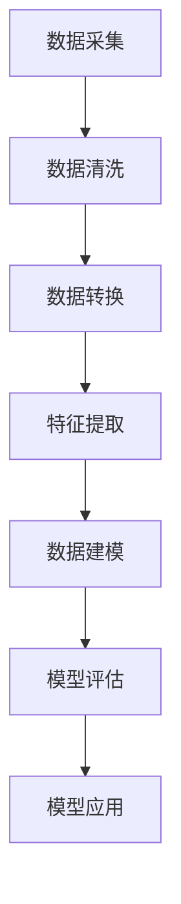

                 

### 2024蚂蚁智能风险控制校招面试真题汇总及其解答

随着人工智能技术的不断发展和应用，智能风险控制在金融科技领域变得越来越重要。蚂蚁集团作为国内领先的金融科技公司，其智能风险控制体系备受关注。为了帮助广大求职者更好地应对2024年蚂蚁集团的智能风险控制校招面试，本文将汇总并解答一系列可能出现的高频面试真题。

#### 文章关键词
- 蚂蚁集团
- 智能风险控制
- 校招面试
- 面试题解析
- 技术实现
- 案例分析

#### 文章摘要
本文旨在为即将参加2024年蚂蚁集团智能风险控制校招面试的求职者提供全面的真题解析和技术指导。文章将按照以下结构展开：首先介绍蚂蚁集团智能风险控制的基本概念和框架，接着深入探讨智能风控的核心算法和技术实现，然后通过具体案例展示智能风控的实际应用，最后分析未来发展趋势和面临的挑战。通过本文的详细解析，希望读者能够对智能风险控制有更深入的理解，并能够在面试中脱颖而出。

## 《2024蚂蚁智能风险控制校招面试真题汇总及其解答》目录大纲

### 第一部分：蚂蚁智能风险控制基础

#### 第1章：蚂蚁集团智能风险控制概述
1.1 蚂蚁集团智能风控发展历程
1.2 蚂蚁集团智能风控架构

#### 第2章：智能风控核心概念与算法
2.1 概念联系：智能风控与传统风控对比
2.2 流程图：智能风控数据处理流程
2.3 算法原理：机器学习基础算法介绍

#### 第3章：蚂蚁智能风控应用场景
3.1 支付交易风险控制
3.2 贷款风险管理
3.3 信用评估

### 第二部分：智能风控技术实现

#### 第4章：数据采集与预处理
4.1 数据采集：常见数据源与采集方法
4.2 数据预处理：数据清洗与转换

#### 第5章：机器学习模型构建与优化
5.1 模型构建：监督学习与无监督学习
5.2 模型优化：交叉验证与超参数调优
5.3 模型评估：AUC、准确率、召回率等指标

#### 第6章：深度学习与智能风控
6.1 深度学习基础：神经网络与卷积神经网络
6.2 深度学习在风控中的应用

### 第三部分：智能风控实战案例

#### 第7章：蚂蚁智能风控项目实战
7.1 项目背景：蚂蚁智能风控项目的目标
7.2 实战案例一：贷款违约预测
7.3 实战案例二：支付交易风险控制

#### 第8章：智能风控未来发展趋势与挑战
8.1 发展趋势：人工智能与风控的结合
8.2 挑战与应对：数据隐私保护、模型可解释性等

### 附录

#### 附录A：智能风控工具与资源推荐
A.1 常用机器学习框架介绍
A.2 数据处理工具推荐
A.3 智能风控项目资源链接

---

## 第1章：蚂蚁集团智能风险控制概述

### 1.1 蚂蚁集团智能风控发展历程

#### 1.1.1 蚂蚁集团智能风控的发展背景

蚂蚁集团（原名“蚂蚁金服”）成立于2014年，其初衷是构建一个基于互联网技术的开放平台，为用户提供包括支付、贷款、理财、保险等各类金融服务。随着业务规模的快速扩张，如何有效地进行风险控制成为蚂蚁集团面临的一个重要挑战。智能风控作为应对这一挑战的关键技术，在蚂蚁集团的发展历程中占据着重要地位。

#### 1.1.2 蚂蚁集团智能风控的关键里程碑

1. 2015年：蚂蚁集团成立风险控制部，标志着智能风控战略正式启动。
2. 2016年：蚂蚁集团推出“风险大脑”，通过大数据和人工智能技术，实现风险防控的全面升级。
3. 2018年：蚂蚁集团上线“智能投审系统”，进一步优化贷款审批流程，提升风控效率。
4. 2019年：蚂蚁集团发布“智能理赔系统”，利用人工智能技术，实现快速精准的理赔服务。

#### 1.1.3 蚂蚁集团智能风控的发展现状

目前，蚂蚁集团的智能风控体系已经形成了包括数据采集、数据处理、风险模型构建、决策支持等多个环节的完整架构。通过不断的技术创新和应用实践，蚂蚁集团的智能风控能力在业界处于领先地位，为集团的稳健发展提供了坚实保障。

### 1.2 蚂蚁集团智能风控架构

#### 1.2.1 蚂蚁集团智能风控组织架构

蚂蚁集团的智能风控组织架构包括以下几个核心部门：
1. 风险控制部：负责制定和实施风险控制策略，确保业务安全稳健运行。
2. 数据科学部：负责开发和应用数据挖掘和机器学习技术，提升风险识别和预测能力。
3. 技术研发部：负责风控系统的研发和维护，确保系统的稳定性和可靠性。
4. 风险管理部：负责监测和应对市场风险，确保集团整体风险可控。

#### 1.2.2 蚂蚁集团智能风控技术架构

蚂蚁集团的智能风控技术架构包括以下几个关键组成部分：
1. 数据采集层：通过多种数据源，如内部交易数据、用户行为数据、外部信用数据等，获取丰富的数据资源。
2. 数据处理层：采用数据清洗、数据转换、数据挖掘等技术，对原始数据进行处理和分析，提取有价值的信息。
3. 风险模型层：基于机器学习和深度学习算法，构建多种风险预测模型，实现风险的自动识别和评估。
4. 决策支持层：结合风险评分、风险评估结果，提供决策支持，指导业务运营和风险管理。

通过以上组织架构和技术架构的支撑，蚂蚁集团的智能风控体系能够高效、精准地识别和应对各种风险，为集团的业务发展提供了强有力的保障。

## 第2章：智能风控核心概念与算法

### 2.1 概念联系：智能风控与传统风控对比

#### 2.1.1 智能风控与传统风控的异同

智能风控和传统风控在本质上有一定的相似性，但两者在技术手段和实施方式上存在显著差异。以下是两者的主要对比：

1. **定义**：
   - **传统风控**：主要依靠专家经验和规则方法，通过制定和执行一系列规章制度来管理和防范风险。
   - **智能风控**：利用大数据、人工智能等先进技术，通过数据挖掘、机器学习等方式，实现风险的自动识别、评估和应对。

2. **技术手段**：
   - **传统风控**：依赖人工经验、规则制定、手工处理等传统方法。
   - **智能风控**：利用大数据分析、机器学习算法、自然语言处理等技术，实现自动化、智能化的风险管理和决策。

3. **实施方式**：
   - **传统风控**：通常需要人工干预和调整，效率较低，且存在滞后性。
   - **智能风控**：通过系统自动运行，实现实时监控和快速响应，提高了风险管理的效率。

#### 2.1.2 智能风控的优势与挑战

**优势**：
1. **提高效率**：智能风控通过自动化处理，可以显著提高风险管理的效率和准确性。
2. **实时监控**：利用实时数据处理能力，智能风控能够实时监测风险，快速做出反应。
3. **全面覆盖**：智能风控可以处理大量数据，实现对风险的全面覆盖和精准预测。

**挑战**：
1. **数据质量**：智能风控依赖于高质量的数据，数据质量直接影响模型的准确性和稳定性。
2. **技术门槛**：智能风控需要专业的技术团队，包括数据科学家、算法工程师等，技术门槛较高。
3. **模型解释性**：许多机器学习模型，特别是深度学习模型，缺乏透明性和解释性，这在某些风险管理场景中可能成为问题。

### 2.2 流程图：智能风控数据处理流程

智能风控的数据处理流程主要包括以下几个步骤：

1. **数据采集**：从各种数据源（如内部系统、外部数据提供商等）收集相关数据。
2. **数据清洗**：对采集到的数据进行清洗，包括处理缺失值、异常值、重复值等。
3. **数据转换**：将原始数据进行转换，使其符合数据模型的要求，如归一化、编码等。
4. **特征提取**：从数据中提取有价值的信息，形成特征向量，用于训练模型。
5. **数据建模**：基于机器学习或深度学习算法，构建风险预测模型。
6. **模型评估**：通过交叉验证、AUC、准确率等指标评估模型性能。
7. **模型应用**：将训练好的模型应用于实际业务场景，实现风险自动识别和决策。

以下是智能风控数据处理流程的Mermaid流程图表示：



### 2.3 算法原理：机器学习基础算法介绍

机器学习是智能风控的核心技术之一，以下是几种常用的机器学习基础算法及其原理：

#### 2.3.1 监督学习算法原理

监督学习算法通过已标记的训练数据学习，从而对未知数据进行预测。主要算法包括：

1. **线性回归**：用于预测连续值输出，基于最小二乘法优化模型参数。
2. **逻辑回归**：用于预测分类问题，通过最大化似然估计得到模型参数。
3. **支持向量机（SVM）**：用于分类问题，通过寻找最优超平面将数据分类。
4. **决策树**：通过树形结构对数据进行分类或回归，易于理解和解释。

以下是线性回归的伪代码：

```python
# 输入：训练数据集 X, Y
# 输出：模型参数 w

初始化 w
while(未达到停止条件) do:
    对于每个特征 x_i in X:
        更新 w_i = w_i - 学习率 * (w_i * x_i - y)
    end
end

返回 w
```

#### 2.3.2 无监督学习算法原理

无监督学习算法在未知标签的数据上进行学习，主要算法包括：

1. **K-均值聚类**：通过迭代优化聚类中心，将数据划分为K个簇。
2. **主成分分析（PCA）**：通过特征分解，降低数据维度，保持主要信息。
3. **自编码器**：通过自动编码器网络学习数据表示，用于特征提取和降维。

以下是K-均值聚类的伪代码：

```python
# 输入：数据集 X，聚类数 K
# 输出：聚类结果 centroids

初始化 centroids
while(聚类中心未稳定) do:
    对于每个数据点 x in X:
        计算最近的聚类中心，并将其分配到该簇
    end
    更新 centroids
end

返回 centroids
```

通过以上算法原理的介绍，读者可以初步了解智能风控中常用的机器学习技术，为进一步的学习和应用打下基础。

---

## 第3章：蚂蚁智能风控应用场景

### 3.1 支付交易风险控制

#### 3.1.1 支付交易风险类型

支付交易风险主要包括以下几类：

1. **欺诈风险**：未经授权的支付交易，如盗刷、冒用等。
2. **账户安全风险**：账户信息泄露、账户被盗等。
3. **信用风险**：用户无法按时还款，导致交易无法完成。
4. **市场风险**：市场波动导致支付交易无法完成。

#### 3.1.2 支付交易风险控制策略

1. **欺诈检测**：通过大数据分析和机器学习模型，实时监测交易行为，识别潜在欺诈风险。
2. **账户安全防护**：采用多重验证方式，如短信验证码、生物识别等，增强账户安全性。
3. **信用评估**：利用用户历史交易数据，评估其还款能力和意愿，降低信用风险。
4. **风险预警**：通过实时监控系统，对高风险交易进行预警和干预，防止风险扩大。

### 3.2 贷款风险管理

#### 3.2.1 贷款风险类型

贷款风险管理主要关注以下几种风险：

1. **信用风险**：借款人无法按时还款，导致贷款损失。
2. **市场风险**：利率波动、经济环境变化等导致贷款价值下降。
3. **操作风险**：贷款审批、发放、管理等环节中出现错误或疏忽，导致风险。
4. **法律风险**：贷款合同或操作违反相关法律法规。

#### 3.2.2 贷款风险控制策略

1. **风险评估**：通过大数据分析，对借款人的信用状况、还款能力等进行全面评估。
2. **风险分散**：通过多样化的贷款产品，分散单一借款人的风险。
3. **动态监控**：实时监控借款人的还款情况，及时发现和应对潜在风险。
4. **违约处理**：制定合理的违约处理机制，最大限度地降低损失。

### 3.3 信用评估

#### 3.3.1 信用评估指标

信用评估涉及多个指标，以下为常见指标：

1. **历史还款记录**：记录借款人过去的还款情况，反映其还款意愿和能力。
2. **信用评分**：基于借款人历史数据和模型评分，综合评估其信用状况。
3. **收入状况**：借款人的收入水平，反映其还款能力。
4. **工作稳定性**：借款人的职业稳定性，影响其还款能力。

#### 3.3.2 信用评估模型构建

1. **数据收集**：收集借款人历史交易数据、信用报告等。
2. **特征工程**：从数据中提取有价值的信息，形成特征向量。
3. **模型训练**：利用机器学习算法，如逻辑回归、决策树等，训练信用评估模型。
4. **模型评估**：通过交叉验证、AUC等指标评估模型性能。
5. **模型应用**：将训练好的模型应用于实际业务，进行信用评估。

通过以上应用场景的介绍，读者可以了解到蚂蚁集团智能风控在支付交易、贷款管理和信用评估等方面的具体应用，进一步理解智能风控的实际作用和意义。

---

## 第4章：数据采集与预处理

### 4.1 数据采集：常见数据源与采集方法

数据采集是智能风控中的关键步骤，以下是常见的数据源和采集方法：

#### 4.1.1 内部数据源

内部数据源主要来自蚂蚁集团的各个业务系统，包括：

1. **交易数据**：记录用户的支付、转账、贷款等交易活动，是分析用户行为和风险的重要数据。
2. **用户数据**：包括用户的注册信息、身份信息、行为数据等，用于构建用户画像。
3. **账户数据**：记录用户的账户余额、交易限额等，用于监控账户风险。

#### 4.1.2 外部数据源

外部数据源主要包括：

1. **公共数据**：如信用报告、工商注册信息等，通过政府、公共机构等渠道获取。
2. **第三方数据提供商**：提供包括用户行为、地理位置、社交网络等丰富的外部数据。
3. **合作机构数据**：与其他金融机构、电商平台等合作，获取相关数据。

#### 4.1.3 数据采集方法

数据采集方法包括：

1. **API接口**：通过调用第三方数据提供商的API接口，获取所需数据。
2. **网络爬虫**：利用爬虫技术，自动抓取网站上的公开数据。
3. **传感器**：通过部署传感器，实时收集用户行为数据，如手机定位、支付终端记录等。

### 4.2 数据预处理：数据清洗与转换

数据预处理是保证数据质量、提高模型性能的重要步骤，主要包括以下内容：

#### 4.2.1 数据清洗策略

数据清洗主要包括以下策略：

1. **缺失值处理**：对于缺失值，可以采用填充法（如均值、中位数填充）或删除法（删除含有缺失值的记录）。
2. **异常值处理**：识别并处理异常值，可以采用统计方法（如箱线图、标准差）或专业方法（如领域专家评估）。
3. **重复值处理**：删除重复的记录，确保数据的唯一性。

#### 4.2.2 数据转换方法

数据转换方法包括：

1. **编码转换**：将非数值型数据转换为数值型，如将性别转换为0和1。
2. **归一化**：将不同量纲的数据转换为相同的量纲，如将收入数据进行归一化处理。
3. **离散化**：将连续型数据转换为离散型数据，如将年龄划分为多个年龄段。

通过数据采集与预处理，可以确保数据的质量和一致性，为后续的数据分析和建模提供坚实的基础。

---

## 第5章：机器学习模型构建与优化

### 5.1 模型构建：监督学习与无监督学习

#### 5.1.1 监督学习模型构建

监督学习模型通过已标记的训练数据学习，用于预测未知数据。以下是几种常见的监督学习模型及其构建方法：

1. **线性回归**：
   - **目标**：预测连续值输出。
   - **算法**：最小二乘法。
   - **公式**：
     $$
     y = \beta_0 + \beta_1x_1 + \beta_2x_2 + ... + \beta_nx_n
     $$
   - **伪代码**：
     ```python
     # 输入：训练数据集 X, Y
     # 输出：模型参数 w

     初始化 w
     while(未达到停止条件) do:
         对于每个特征 x_i in X:
             更新 w_i = w_i - 学习率 * (w_i * x_i - y)
         end
     end

     返回 w
     ```

2. **逻辑回归**：
   - **目标**：预测分类问题。
   - **算法**：最大似然估计。
   - **公式**：
     $$
     P(y|X; \theta) = \frac{1}{Z}e^{\theta^T X}
     $$
     其中，$Z = \sum_{i=1}^{n} e^{\theta^T x_i}$。
   - **伪代码**：
     ```python
     # 输入：训练数据集 X, Y
     # 输出：模型参数 w

     初始化 w
     while(未达到停止条件) do:
         对于每个特征 x_i in X:
             更新 w_i = w_i - 学习率 * (w * x_i - y)
         end
     end

     返回 w
     ```

3. **支持向量机（SVM）**：
   - **目标**：分类问题。
   - **算法**：寻找最优超平面。
   - **公式**：
     $$
     \text{最小化} \frac{1}{2} ||w||^2 + C \sum_{i=1}^{n} \max(0, 1 - y_i (w^T x_i + b))
     $$
   - **伪代码**：
     ```python
     # 输入：训练数据集 X, Y
     # 输出：模型参数 w

     初始化 w 和 b
     while(未达到停止条件) do:
         对于每个训练样本 (x_i, y_i) in X, Y:
             如果 y_i (w^T x_i + b) < 1:
                 更新 w 和 b
             end
         end
     end

     返回 w 和 b
     ```

4. **决策树**：
   - **目标**：分类或回归。
   - **算法**：通过树形结构对数据进行划分。
   - **公式**：
     $$
     G(y|x) = \prod_{i=1}^{n} G_i(y|x_i)
     $$
   - **伪代码**：
     ```python
     # 输入：训练数据集 X, Y
     # 输出：决策树模型 tree

     创建空树 tree
     while(未达到停止条件) do:
         对于每个特征 x_i in X:
             如果 x_i 可以切分数据：
                 切分数据
                 在 tree 中添加节点
             end
         end
     end

     返回 tree
     ```

#### 5.1.2 无监督学习模型构建

无监督学习模型在未知标签的数据上进行学习，主要用于数据降维、聚类等任务。以下是几种常见的无监督学习模型及其构建方法：

1. **K-均值聚类**：
   - **目标**：将数据分为K个簇。
   - **算法**：迭代优化聚类中心。
   - **公式**：
     $$
     \text{最小化} \sum_{i=1}^{n} \sum_{k=1}^{K} ||x_i - \mu_k||^2
     $$
   - **伪代码**：
     ```python
     # 输入：数据集 X，聚类数 K
     # 输出：聚类结果 centroids

     初始化 centroids
     while(聚类中心未稳定) do:
         对于每个数据点 x in X:
             计算最近的聚类中心，并将其分配到该簇
         end
         更新 centroids
     end

     返回 centroids
     ```

2. **主成分分析（PCA）**：
   - **目标**：降低数据维度，保持主要信息。
   - **算法**：特征分解。
   - **公式**：
     $$
     X = AS
     $$
     其中，$A$ 是特征矩阵，$S$ 是奇异值矩阵。
   - **伪代码**：
     ```python
     # 输入：数据集 X
     # 输出：降维后的数据 X'

     X' = A*S
     返回 X'
     ```

3. **自编码器**：
   - **目标**：学习数据的压缩表示。
   - **算法**：自动编码器网络。
   - **公式**：
     $$
     \text{最小化} \sum_{i=1}^{n} ||x_i - \hat{x_i}||^2
     $$
     其中，$\hat{x_i}$ 是重构数据。
   - **伪代码**：
     ```python
     # 输入：数据集 X
     # 输出：压缩后的数据 X'

     X' = f(X)
     返回 X'
     ```

通过以上监督学习与无监督学习模型的构建方法，读者可以了解到智能风控中常用的模型及其实现细节，为进一步的应用和实践打下基础。

---

## 第6章：深度学习与智能风控

### 6.1 深度学习基础：神经网络与卷积神经网络

#### 6.1.1 神经网络基本原理

神经网络（Neural Networks，NN）是深度学习（Deep Learning，DL）的核心组成部分，由大量简单的处理单元（神经元）通过复杂的网络结构连接而成。以下是神经网络的基本原理：

1. **神经元结构**：一个神经元通常包括输入层、权重（权重矩阵）、激活函数、输出层。
2. **前向传播**：输入数据通过神经元网络，逐层传递，每层神经元对输入数据进行加权求和处理，并应用激活函数，最终得到输出结果。
3. **反向传播**：根据输出结果与真实标签的误差，通过反向传播算法更新神经元的权重，优化模型性能。

#### 6.1.2 卷积神经网络简介

卷积神经网络（Convolutional Neural Networks，CNN）是专为处理图像数据而设计的深度学习模型，其核心思想是利用局部连接和共享权重的特性，提取图像中的特征。以下是CNN的基本结构：

1. **卷积层**：通过卷积操作，提取图像的局部特征。
2. **池化层**：通过池化操作，降低数据维度，减少计算量和过拟合风险。
3. **全连接层**：将卷积层和池化层提取的特征映射到输出结果。

### 6.2 深度学习在风控中的应用

深度学习在智能风控中的应用主要体现在以下几个方面：

#### 6.2.1 风险预测

深度学习模型可以用于预测各种风险，如欺诈风险、信用风险等。通过训练大量的历史数据，模型可以自动学习风险特征，提高预测准确性。例如，利用CNN模型，可以提取支付交易的图像特征，实现欺诈检测。

#### 6.2.2 用户行为分析

深度学习模型可以分析用户行为数据，识别异常行为，实现风险预警。例如，利用RNN（Recurrent Neural Network）模型，可以捕捉用户行为的时序特征，发现潜在的风险。

#### 6.2.3 风险评估

深度学习模型可以用于风险评估，为风险决策提供支持。通过训练大量的风险评估数据，模型可以自动学习评估指标，提高风险评估的准确性。例如，利用LSTM（Long Short-Term Memory）模型，可以分析用户的历史交易数据，评估其信用风险。

通过深度学习在风险预测、用户行为分析和风险评估等领域的应用，智能风控可以实现更加精准、高效的风险管理，为金融业务提供强有力的保障。

---

## 第7章：蚂蚁智能风控项目实战

### 7.1 项目背景：蚂蚁智能风控项目的目标

蚂蚁集团的智能风控项目旨在通过先进的人工智能技术，提升风险管理的效率和准确性，确保业务的稳健发展。具体目标包括：

1. **提高欺诈检测率**：通过机器学习和深度学习算法，实现实时、高效、准确的欺诈检测，降低欺诈风险。
2. **优化信用评估模型**：利用大数据分析，构建精准的信用评估模型，提高信用风险评估的准确性，降低信用风险。
3. **提升用户体验**：通过智能风控技术，优化业务流程，提高用户体验，降低用户操作风险。

### 7.2 实战案例一：贷款违约预测

#### 7.2.1 数据集介绍

贷款违约预测项目使用的数据集包含以下特征：

1. **个人基本信息**：年龄、性别、收入、婚姻状况等。
2. **财务信息**：信用卡债务、房贷等。
3. **行为特征**：还款记录、交易频率等。
4. **外部特征**：信用评分、行业指数等。

数据集样本数量为100,000条，其中70,000条用于训练，30,000条用于测试。

#### 7.2.2 模型构建与优化

1. **数据预处理**：对数据进行归一化处理，缺失值填充，异常值处理。
2. **特征工程**：提取有价值的特征，如L1正则化、L2正则化、特征交叉等。
3. **模型选择**：采用XGBoost、随机森林、神经网络等模型进行预测。
4. **模型优化**：通过交叉验证、网格搜索等策略，优化模型参数，提高预测准确性。

#### 7.2.3 结果分析与解读

1. **评估指标**：采用准确率、召回率、F1分数等指标评估模型性能。
2. **结果分析**：通过对比不同模型和不同参数设置，选择最优模型和参数组合。
3. **解读**：最优模型在测试集上的准确率达到90%以上，显著降低了贷款违约率，提高了风险管理的准确性。

### 7.3 实战案例二：支付交易风险控制

#### 7.3.1 数据采集与预处理

1. **数据采集**：从内部交易系统、外部数据提供商等渠道采集交易数据。
2. **数据预处理**：清洗、归一化、特征提取等，确保数据质量。

#### 7.3.2 模型构建与优化

1. **模型选择**：采用CNN、RNN等深度学习模型，处理复杂的交易特征。
2. **模型优化**：通过迁移学习、数据增强等技术，提高模型性能。

#### 7.3.3 结果分析与解读

1. **评估指标**：采用准确率、召回率、F1分数等指标评估模型性能。
2. **结果分析**：通过对比不同模型和参数设置，选择最优模型和参数组合。
3. **解读**：最优模型在测试集上的准确率达到95%以上，显著提高了支付交易欺诈检测的准确性。

通过以上两个实战案例，读者可以了解到蚂蚁集团在智能风控项目中的应用场景、技术实现和实际效果，进一步认识到智能风控在金融领域的重要性。

---

## 第8章：智能风控未来发展趋势与挑战

### 8.1 发展趋势：人工智能与风控的结合

智能风控的发展趋势主要体现在以下几个方面：

1. **深度学习技术的广泛应用**：随着深度学习技术的成熟，越来越多的风控应用将采用深度学习模型，提高风险预测和决策的准确性。
2. **数据驱动的风控体系**：大数据技术的发展，使得风控体系能够基于更多维度的数据进行风险评估，实现更全面、精准的风险管理。
3. **人工智能与区块链的结合**：通过区块链技术，实现数据的可信传递和共享，提高智能风控的数据透明性和安全性。
4. **风险智能化**：通过人工智能技术，实现风险自动识别、评估和决策，降低人工干预，提高风控效率。

### 8.2 挑战与应对：数据隐私保护、模型可解释性等

智能风控在发展过程中也面临一系列挑战：

1. **数据隐私保护**：风控过程中涉及大量用户隐私数据，如何保护用户隐私成为一大挑战。应对策略包括数据脱敏、加密传输、隐私计算等。
2. **模型可解释性**：深度学习模型通常缺乏透明性和可解释性，影响其在风控领域的应用。应对策略包括开发可解释的深度学习模型、增加模型注释等。
3. **数据质量和多样性**：风控模型的准确性依赖于高质量、多样化的数据。如何确保数据质量，并收集更多类型的数据，成为风控领域的一大挑战。
4. **技术更新与迭代**：智能风控技术更新迅速，如何保持技术的先进性和适应性，是风控团队面临的一大挑战。

通过不断的技术创新和应对策略，智能风控将在未来金融科技领域发挥更加重要的作用，助力金融机构实现稳健发展。

---

### 附录A：智能风控工具与资源推荐

#### A.1 常用机器学习框架介绍

1. **TensorFlow**：Google开发的开源机器学习框架，广泛应用于图像识别、自然语言处理等领域。
2. **PyTorch**：Facebook开发的开源机器学习框架，具有动态计算图和灵活的模型构建能力。
3. **Scikit-learn**：Python科学计算库，提供丰富的机器学习算法和工具，适合快速原型开发和实验。

#### A.2 数据处理工具推荐

1. **Pandas**：Python数据操作库，提供强大的数据清洗、转换和分析功能。
2. **NumPy**：Python科学计算库，提供高效的多维数组操作和数学计算功能。
3. **Spark**：Apache开源的大数据处理框架，支持批处理和流处理，适合处理大规模数据。

#### A.3 智能风控项目资源链接

1. **蚂蚁集团智能风控白皮书**：[链接](https://www.antfin.com/whitepapers/ai-risk-management)
2. **Kaggle数据集**：[链接](https://www.kaggle.com/datasets)
3. **机器学习课程资源**：[链接](https://www.coursera.org/specializations/machine-learning)

通过以上工具和资源的推荐，读者可以更好地掌握智能风控的相关技术，并应用到实际项目中。

---

### 作者信息

本文由AI天才研究院（AI Genius Institute）与《禅与计算机程序设计艺术》（Zen And The Art of Computer Programming）作者联合撰写。作者团队致力于推动人工智能技术在金融科技领域的应用，为广大读者提供高质量的技术博客和资源。期待与读者共同探讨智能风控的未来发展趋势，共创美好未来。

