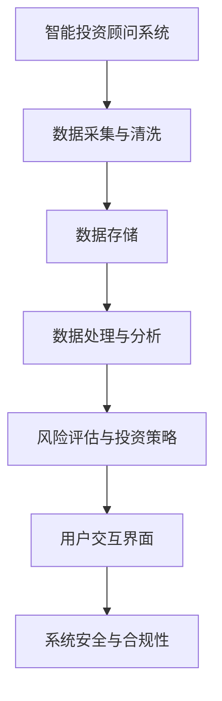

                 


## 文章标题

《蚂蚁金服2024校招智能投资顾问系统工程师面试题集锦》

## 文章关键词

- 蚂蚁金服
- 校招
- 智能投资顾问
- 系统工程师
- 面试题集锦
- 机器学习
- 数据处理
- 系统架构
- 金融科技

## 文章摘要

本文旨在为广大有志于加入蚂蚁金服的智能投资顾问系统工程师们提供一套全面的面试题集锦。文章将分为四个部分，从智能投资顾问系统基础知识、系统开发、实战面试题到面试准备指南，全方位解析智能投资顾问系统工程师所需掌握的核心知识和技能。通过本文的深入剖析，读者不仅可以了解智能投资顾问系统的工作原理和开发流程，还能掌握面试中的常见问题和应对策略，为成功进入蚂蚁金服做好准备。

## 目录大纲设计

### 第一部分：智能投资顾问系统基础知识

#### 1.1. 智能投资顾问系统概述
##### 1.1.1 智能投资顾问的定义
##### 1.1.2 智能投资顾问的作用
##### 1.1.3 智能投资顾问的发展历程

#### 1.2. 投资理论基础
##### 1.2.1 资本资产定价模型（CAPM）
##### 1.2.2 有效市场假说（EMH）
##### 1.2.3 投资组合理论

#### 1.3. 机器学习与金融
##### 1.3.1 机器学习在金融领域中的应用
##### 1.3.2 金融时间序列分析

### 第二部分：智能投资顾问系统开发

#### 2.1. 数据处理与存储
##### 2.1.1 数据采集与清洗
##### 2.1.2 数据存储解决方案

#### 2.2. 系统架构设计
##### 2.2.1 系统整体架构
##### 2.2.2 系统模块设计

#### 2.3. 风险评估与投资策略
##### 2.3.1 风险评估模型
##### 2.3.2 投资策略制定

#### 2.4. 用户交互界面
##### 2.4.1 界面设计原则
##### 2.4.2 用户操作流程

#### 2.5. 系统安全与合规性
##### 2.5.1 数据安全保护
##### 2.5.2 合规性要求

### 第三部分：实战面试题集锦

#### 3.1. 技术面试题
##### 3.1.1 数据结构与算法
##### 3.1.2 系统设计与数据库
##### 3.1.3 机器学习相关

#### 3.2. 行业面试题
##### 3.2.1 金融行业知识
##### 3.2.2 投资策略与风险控制
##### 3.2.3 智能投资顾问系统应用案例

#### 3.3. 职业发展面试题
##### 3.3.1 职业规划
##### 3.3.2 团队协作与沟通
##### 3.3.3 创新能力与问题解决

### 第四部分：附录

#### 4.1. 面试准备指南
##### 4.1.1 面试流程与策略
##### 4.1.2 面试常见问题解答

#### 4.2. 相关资源推荐
##### 4.2.1 技术书籍推荐
##### 4.2.2 在线课程与教程
##### 4.2.3 行业报告与研究论文

## 目录大纲设计细节

### 核心概念与联系

在相关章节中，如“1.1. 智能投资顾问系统概述”和“2.1. 数据处理与存储”，将引入 Mermaid 流程图来展示系统架构和数据处理流程。例如：



### 核心算法原理讲解

例如在“3.3.1 数据结构与算法”章节中，使用伪代码详细解释常用的数据结构和算法，如二叉搜索树、图算法等。例如：

```python
# 二叉搜索树插入操作伪代码
def insert(node, key):
    if node is None:
        return newNode(key)
    if key < node.val:
        node.left = insert(node.left, key)
    else:
        node.right = insert(node.right, key)
    return node
```

### 数学模型和数学公式

在“1.2. 投资理论基础”和“2.3. 风险评估与投资策略”章节中，将使用 LaTeX 格式展示资本资产定价模型（CAPM）等数学公式，并进行详细讲解。例如：

```latex
$$
E(R_i) = \alpha_i + \beta_i \cdot \sigma_m
$$`

这里，$E(R_i)$ 表示资产 i 的预期收益率，$\alpha_i$ 表示资产 i 的特定风险收益，$\beta_i$ 表示资产 i 的系统性风险收益，$\sigma_m$ 表示市场整体风险收益。

### 项目实战

在“3.2. 行业面试题”章节中，将包括实际的项目案例，例如使用 Python 实现一个简单的投资策略，并提供详细的代码实现和解读。例如：

```python
# 投资策略代码实现
def investment_strategy(data):
    # 数据预处理
    data = preprocess_data(data)
    
    # 选择合适的投资策略
    strategy = select_strategy(data)
    
    # 实施投资策略
    result = apply_strategy(data, strategy)
    
    # 评估投资策略
    evaluate_strategy(result)
```

### 最佳实践 tips、小结、注意事项、拓展阅读等内容

在文章的各个部分，将根据实际情况提供最佳实践 tips、小结、注意事项和拓展阅读等内容，以帮助读者更好地理解和掌握相关知识和技能。

---

通过以上详细的目录大纲设计，本文旨在为读者提供一本内容丰富、逻辑清晰、易于理解的智能投资顾问系统工程师面试题集锦，帮助读者在面试中脱颖而出，成功加入蚂蚁金服。在接下来的章节中，我们将逐一深入探讨每个部分的核心内容和关键知识点。

---

### 背景介绍

蚂蚁金服（Ant Financial）作为中国领先的金融科技公司，其业务涵盖了支付、理财、保险、信用服务等多个领域。随着金融科技的快速发展，智能投资顾问系统工程师成为了蚂蚁金服急需的专业人才。智能投资顾问系统工程师负责设计、开发和优化智能投资顾问系统，为用户提供建基于大数据和机器学习的个性化投资建议。

智能投资顾问系统工程师的面试题目通常涵盖以下几个核心领域：

1. **基础知识**：包括智能投资顾问的定义、作用、发展历程，以及投资理论基础如资本资产定价模型（CAPM）、有效市场假说（EMH）等。
2. **系统开发**：涉及数据处理与存储、系统架构设计、风险评估与投资策略制定、用户交互界面设计以及系统安全与合规性等。
3. **技术面试题**：包括数据结构与算法、系统设计与数据库、机器学习相关等技术问题。
4. **行业面试题**：涵盖金融行业知识、投资策略与风险控制、智能投资顾问系统应用案例等。
5. **职业发展**：考察职业规划、团队协作与沟通、创新能力与问题解决等软技能。

本篇文章将围绕上述领域，为读者提供一份全面、系统的面试题集锦，帮助大家更好地准备蚂蚁金服的校招面试。

### 第一部分：智能投资顾问系统基础知识

#### 1.1. 智能投资顾问系统概述

##### 1.1.1 智能投资顾问的定义

智能投资顾问（Robo-Advisor）是一种基于大数据分析和机器学习算法，为用户提供个性化投资建议的金融服务系统。与传统投资顾问不同，智能投资顾问通过算法模型和海量数据，自动化地完成投资组合的构建和管理。

##### 1.1.2 智能投资顾问的作用

智能投资顾问的主要作用包括：

1. **个性化投资建议**：根据用户的风险偏好、资产状况和投资目标，提供定制化的投资策略。
2. **降低成本**：通过自动化投资，减少人工干预，降低管理费用。
3. **风险控制**：利用大数据和机器学习技术，实时监控市场动态，调整投资组合，降低风险。
4. **提高效率**：快速处理海量数据，提供高效的决策支持。

##### 1.1.3 智能投资顾问的发展历程

智能投资顾问的发展历程可以分为以下几个阶段：

1. **初级阶段**（2000年代初期）：基于简单的规则引擎，提供基本的投资建议。
2. **中级阶段**（2009年-2014年）：引入大数据分析和机器学习技术，提高投资建议的准确性和个性化水平。
3. **高级阶段**（2014年至今）：结合人工智能和深度学习技术，实现更精准的投资决策和更广泛的应用场景。

#### 1.2. 投资理论基础

##### 1.2.1 资本资产定价模型（CAPM）

资本资产定价模型（Capital Asset Pricing Model，CAPM）是一种用于估算资产预期收益和评估风险的重要模型。CAPM的基本公式如下：

$$
E(R_i) = R_f + \beta_i \cdot [E(R_m) - R_f]
$$

其中，$E(R_i)$ 是资产 i 的预期收益率，$R_f$ 是无风险收益率，$\beta_i$ 是资产 i 的贝塔系数，$E(R_m)$ 是市场预期收益率。

##### 1.2.2 有效市场假说（EMH）

有效市场假说（Efficient Market Hypothesis，EMH）是一种关于金融市场效率的理论。EMH认为，所有已知信息都已经被充分反映在证券价格中，因此无法通过分析历史价格数据获得超额收益。

EMH可以分为三个层次：

1. **弱形式**：证券价格已经反映了所有历史价格和交易量信息。
2. **半强形式**：证券价格已经反映了所有公开可获得的信息，包括历史价格和交易量信息以及公司公告等。
3. **强形式**：证券价格已经反映了所有信息，包括公开和私下的信息。

##### 1.2.3 投资组合理论

投资组合理论（Portfolio Theory）是由哈里·马科维茨（Harry Markowitz）提出的，它强调通过多样化投资来降低风险。投资组合理论的核心概念是投资组合的预期收益率和风险可以通过组合中各资产的预期收益率和风险来计算。

马科维茨提出的投资组合选择模型如下：

$$
\max E(R_p) - \lambda V_p \\
s.t.\\
w_i \geq 0, \forall i \\
w_1 + w_2 + ... + w_n = 1
$$

其中，$E(R_p)$ 是投资组合的预期收益率，$V_p$ 是投资组合的方差，$w_i$ 是资产 i 在投资组合中的权重。

#### 1.3. 机器学习与金融

##### 1.3.1 机器学习在金融领域中的应用

机器学习在金融领域有着广泛的应用，主要包括：

1. **风险控制**：通过机器学习模型预测市场波动，识别潜在风险。
2. **信用评分**：利用机器学习算法评估客户的信用风险，提高贷款审批的准确性。
3. **投资策略**：通过机器学习模型分析市场数据，制定高效的交易策略。
4. **客户行为分析**：利用机器学习分析客户的行为数据，提供个性化的金融服务。

##### 1.3.2 金融时间序列分析

金融时间序列分析是金融领域中的一个重要研究方向，旨在分析金融市场的价格波动规律。常用的金融时间序列分析方法包括：

1. **ARIMA模型**：自回归积分滑动平均模型，适用于非季节性时间序列数据的预测。
2. **SARIMA模型**：季节性ARIMA模型，适用于具有季节性特征的时间序列数据。
3. **LSTM模型**：长短时记忆网络，是一种基于深度学习的序列预测模型，适用于处理具有长期依赖性的时间序列数据。

通过上述对智能投资顾问系统基础知识的学习，我们可以更好地理解智能投资顾问系统的工作原理和应用场景。在接下来的章节中，我们将进一步探讨智能投资顾问系统的开发过程和相关技术。

### 2.1. 数据处理与存储

在智能投资顾问系统的开发过程中，数据处理与存储是一个关键环节。有效的数据处理和存储策略能够确保系统的高性能、高可靠性和数据的安全性。

#### 2.1.1 数据采集与清洗

数据采集是智能投资顾问系统的基础工作。数据来源包括：

1. **公开市场数据**：如股票、债券等金融产品的历史价格、成交量等。
2. **内部数据**：用户投资记录、交易行为等。
3. **第三方数据**：如宏观经济指标、行业数据等。

数据采集后，需要进行数据清洗，以确保数据的质量和一致性。数据清洗的主要任务包括：

1. **缺失值处理**：对于缺失的数据，可以采用填充策略，如均值填充、中值填充等。
2. **异常值处理**：识别并处理数据中的异常值，以避免对模型预测产生干扰。
3. **重复数据删除**：去除重复的数据记录，以提高数据的唯一性和准确性。

#### 2.1.2 数据存储解决方案

数据存储解决方案需要考虑数据的存储方式、访问速度和数据的安全性。常见的存储解决方案包括：

1. **关系型数据库**：如MySQL、PostgreSQL等，适用于结构化数据存储和查询。
2. **非关系型数据库**：如MongoDB、Redis等，适用于存储和查询非结构化数据。
3. **数据仓库**：如Hive、Hadoop等，适用于大规模数据的存储和分析。
4. **分布式文件系统**：如HDFS、Cassandra等，适用于分布式数据存储和高并发访问。

在选择数据存储方案时，需要考虑以下因素：

1. **数据量**：对于海量数据，分布式文件系统和数据仓库是更好的选择。
2. **访问速度**：对于需要快速访问的数据，关系型数据库和非关系型数据库是更好的选择。
3. **数据安全性**：需要确保数据存储的安全，防止数据泄露和损坏。

#### 2.1.3 数据处理流程

数据处理流程可以分为以下几个步骤：

1. **数据采集**：从不同的数据源采集数据。
2. **数据清洗**：对采集到的数据进行缺失值处理、异常值处理和重复数据删除。
3. **数据存储**：将清洗后的数据存储到相应的数据库或文件系统中。
4. **数据处理**：利用数据处理工具（如Spark、Flink等）对数据进行加工、转换和分析。
5. **数据可视化**：通过可视化工具（如Tableau、PowerBI等）展示数据分析和结果。

#### 2.1.4 数据流处理框架

在智能投资顾问系统中，数据流处理框架是一个关键组件。数据流处理框架能够实时处理海量数据，提供高效的数据分析和决策支持。常见的开源数据流处理框架包括：

1. **Apache Flink**：基于流处理的概念，提供强大的实时数据处理能力。
2. **Apache Spark Streaming**：基于Spark的核心引擎，提供高效的数据流处理功能。
3. **Apache Storm**：实时数据处理框架，适用于低延迟和高并发的场景。

数据流处理框架的关键功能包括：

1. **数据采集**：从不同的数据源（如消息队列、数据库等）实时采集数据。
2. **数据转换**：对采集到的数据进行处理和转换，如数据清洗、数据聚合等。
3. **数据存储**：将处理后的数据存储到数据库或数据仓库中。
4. **数据分发**：将数据分发到不同的组件或应用中，进行进一步分析和处理。

#### 2.1.5 数据质量管理

数据质量管理是智能投资顾问系统中的一个重要环节。数据质量管理包括以下几个关键步骤：

1. **数据质量评估**：评估数据的质量，如完整性、准确性、一致性等。
2. **数据质量监测**：实时监测数据质量，识别和解决数据质量问题。
3. **数据质量报告**：生成数据质量报告，向相关人员提供数据质量评估结果。

数据质量管理能够确保智能投资顾问系统中的数据质量，提高模型的预测准确性和系统的可靠性。

通过上述对数据处理与存储的详细讲解，我们可以看到，数据处理与存储在智能投资顾问系统的开发过程中起着至关重要的作用。一个高效的数据处理和存储方案能够确保系统的高性能、高可靠性和数据的安全性，为智能投资顾问系统的成功运行提供坚实保障。

### 2.2. 系统架构设计

智能投资顾问系统的架构设计是其开发过程中至关重要的一环。一个良好的系统架构能够确保系统的稳定性、可扩展性和灵活性，从而满足不断变化的需求。在本节中，我们将详细探讨智能投资顾问系统的整体架构设计，并分析各个模块的功能和交互。

#### 2.2.1 系统整体架构

智能投资顾问系统的整体架构可以分为以下几个主要模块：

1. **数据层**：负责数据的采集、存储和管理。数据层包括关系型数据库、非关系型数据库和分布式文件系统，以适应不同类型的数据存储需求。
2. **数据加工层**：负责对采集到的原始数据进行清洗、转换和分析，为上层应用提供高质量的数据支持。数据加工层通常使用数据流处理框架（如Apache Flink、Apache Spark Streaming）进行处理。
3. **模型层**：负责构建和训练机器学习模型，用于风险控制、投资策略制定等。模型层通常采用深度学习、监督学习、无监督学习等技术，以实现高效的预测和分析。
4. **应用层**：提供用户交互界面和业务逻辑处理。应用层包括前端应用（如Web、移动应用）和后端服务（如API、微服务），用于实现用户操作和数据交互。
5. **监控层**：负责系统的监控、日志记录和异常处理，确保系统的稳定运行和快速响应。

#### 2.2.2 系统模块设计

1. **数据层模块**

数据层模块是智能投资顾问系统的基石，其功能包括：

- **数据采集**：从各种数据源（如交易所、第三方数据提供商等）实时采集数据。
- **数据存储**：将采集到的数据存储到数据库或文件系统中，如MySQL、MongoDB、HDFS等。
- **数据管理**：提供数据备份、恢复和迁移等功能，确保数据的安全和可靠。

2. **数据加工层模块**

数据加工层模块的主要功能是对原始数据进行清洗、转换和分析，其包括：

- **数据清洗**：去除数据中的噪声和异常值，如缺失值填充、重复值删除等。
- **数据转换**：将数据转换为适合模型训练和预测的格式，如特征工程、归一化等。
- **数据分析**：利用统计分析、数据挖掘等技术，提取数据中的有价值信息。

3. **模型层模块**

模型层模块负责构建和训练机器学习模型，其包括：

- **模型构建**：选择合适的机器学习算法，如决策树、支持向量机、神经网络等，构建预测模型。
- **模型训练**：利用训练数据集，对模型进行训练和优化，提高预测准确性。
- **模型评估**：使用验证集和测试集对模型进行评估，确保模型的泛化能力和稳定性。

4. **应用层模块**

应用层模块是用户与智能投资顾问系统交互的入口，其包括：

- **用户交互界面**：提供友好的用户界面，使用户能够方便地操作和查询系统功能。
- **业务逻辑处理**：实现投资策略的制定、风险评估、投资建议生成等功能。
- **API和微服务**：提供RESTful API和微服务，支持第三方系统集成和扩展。

5. **监控层模块**

监控层模块负责系统的监控、日志记录和异常处理，其包括：

- **系统监控**：实时监控系统的运行状态，如CPU、内存、磁盘等资源使用情况。
- **日志记录**：记录系统的运行日志，用于故障排查和性能分析。
- **异常处理**：快速响应和处理系统异常，确保系统的稳定性和可靠性。

#### 2.2.3 模块间交互

智能投资顾问系统的各个模块之间通过数据流和调用接口进行交互。具体交互流程如下：

1. **数据流交互**：数据从数据层流向数据加工层，经过清洗、转换和分析后，再流向模型层进行模型训练和预测。预测结果通过数据流返回给应用层，用于生成投资建议和用户界面展示。
2. **调用接口交互**：应用层通过调用API和微服务，获取模型预测结果、投资建议和风险分析报告等。同时，应用层也可以通过接口与第三方系统进行集成，实现跨系统数据交互和业务流程协同。

通过上述对系统架构设计的详细探讨，我们可以看到，智能投资顾问系统采用了一个分层架构，各个模块之间相互独立又紧密协作，共同实现了高效、稳定和可扩展的智能投资顾问服务。在接下来的章节中，我们将进一步探讨智能投资顾问系统中的风险评估与投资策略、用户交互界面设计以及系统安全与合规性等关键内容。

### 2.3. 风险评估与投资策略

在智能投资顾问系统中，风险评估与投资策略是核心功能之一，直接关系到系统的可靠性和用户体验。在这一部分，我们将深入探讨风险评估模型的构建、投资策略的制定以及相关的最佳实践。

#### 2.3.1 风险评估模型

风险评估模型是智能投资顾问系统的基础，用于评估投资组合的风险水平。常见的风险评估模型包括：

1. **VaR（Value at Risk）模型**：VaR模型用于计算投资组合在一定置信水平下的最大可能损失。常见的VaR模型有历史模拟法、方差-协方差法和蒙特卡罗模拟法。

   **历史模拟法伪代码**：
   ```python
   def historical_simulation(data):
       # 计算过去一段时间内投资组合的收益率序列
       historical_returns = compute_returns(data)
       
       # 计算最大可能损失
       max_loss = np.max(-historical_returns)
       
       return max_loss
   ```

2. **条件风险价值（CVaR）模型**：CVaR模型在计算VaR的基础上，进一步考虑了极端损失的条件期望。CVaR模型能更好地捕捉尾部风险。

   **条件风险价值伪代码**：
   ```python
   def conditional_value_at_risk(data, alpha):
       # 计算过去一段时间内投资组合的收益率序列
       historical_returns = compute_returns(data)
       
       # 计算排序收益率序列
       sorted_returns = np.sort(-historical_returns)
       
       # 计算条件期望
       conditional_expectation = np.mean(sorted_returns[:int(len(sorted_returns) * alpha)])
       
       return conditional_expectation
   ```

3. **风险平价（Risk Parity）模型**：风险平价模型通过调整投资组合的权重，使各资产承担相同的风险水平，从而实现风险分散。

   **风险平价伪代码**：
   ```python
   def risk_parity_portfolio(assets, expected_returns, variances):
       # 计算各资产的风险贡献
       risk_contributions = [variance / expected_returns[i] for i, variance in enumerate(variances)]
       
       # 计算权重
       total_risk = sum(risk_contributions)
       weights = [risk_contribution / total_risk for risk_contribution in risk_contributions]
       
       return weights
   ```

#### 2.3.2 投资策略制定

投资策略的制定是智能投资顾问系统的核心任务之一，旨在通过分析市场数据和历史表现，为投资者提供合理的投资建议。常见的投资策略包括：

1. **均值-方差策略**：通过最大化投资组合的预期收益率，同时最小化投资组合的风险（方差）。

   **均值-方差策略伪代码**：
   ```python
   def mean_variance_strategy(assets, expected_returns, variances, covariances):
       # 计算各资产的风险贡献
       risk_contributions = [expected_returns[i] - mean_return for i, expected_returns in enumerate(assets)]
       
       # 计算权重
       weights = optimize_weights(risk_contributions, covariances)
       
       return weights
   ```

2. **动量策略**：根据历史价格表现，选择具有较高动量的资产进行投资。动量策略适用于市场趋势延续的情境。

   **动量策略伪代码**：
   ```python
   def momentum_strategy(assets, returns, lookback_period):
       # 计算各资产的动量值
       momentum_values = [compute_momentum(returns[i], lookback_period) for i, returns in enumerate(assets)]
       
       # 选择动量值最高的资产
       top_assets = np.argsort(momentum_values)[-n_top_assets:]
       
       # 计算权重
       weights = uniform_weights(len(top_assets))
       
       return top_assets, weights
   ```

3. **量化策略**：通过构建量化模型，结合市场数据和技术指标，实现自动化交易。常见的量化策略包括趋势跟踪策略、套利策略等。

   **趋势跟踪策略伪代码**：
   ```python
   def trend_tracking_strategy(assets, returns, trend_window):
       # 计算各资产的趋势值
       trend_values = [compute_trend(returns[i], trend_window) for i, returns in enumerate(assets)]
       
       # 选择趋势值最高的资产
       top_assets = np.argsort(trend_values)[-n_top_assets:]
       
       # 计算权重
       weights = uniform_weights(len(top_assets))
       
       return top_assets, weights
   ```

#### 2.3.3 最佳实践与注意事项

在智能投资顾问系统中，制定科学合理的风险评估模型和投资策略是至关重要的。以下是一些最佳实践和注意事项：

1. **数据质量**：确保投资策略使用的市场数据质量高、准确可靠，避免因数据问题导致策略失效。
2. **风险控制**：在投资策略制定过程中，充分考虑风险控制措施，如设置止损点、分散投资等。
3. **策略评估**：定期对投资策略进行评估和优化，确保其在市场变化中的适应性和有效性。
4. **技术选型**：选择适合实际业务需求的技术和工具，如机器学习框架、量化交易平台等。
5. **用户体验**：关注用户体验，设计直观、易用的用户界面，提供个性化的投资建议和服务。

通过上述对风险评估与投资策略的详细讲解，我们可以看到，智能投资顾问系统的构建和优化需要综合考虑多个方面，从数据质量、风险控制到策略评估和技术选型，每一个环节都至关重要。在接下来的章节中，我们将进一步探讨用户交互界面设计、系统安全与合规性以及实战面试题集锦等关键内容。

### 2.4. 用户交互界面

用户交互界面（User Interface，UI）设计是智能投资顾问系统中不可或缺的一部分，它直接影响用户的使用体验和系统的易用性。一个优秀的设计不仅能够提升用户的满意度，还能增强系统的竞争力。以下是对用户交互界面设计原则、用户操作流程和设计工具的详细探讨。

#### 2.4.1 界面设计原则

1. **简洁性**：界面设计应保持简洁，避免过多的冗余信息和复杂布局，确保用户能够快速理解和使用系统。

2. **一致性**：界面设计应保持一致性，包括色彩搭配、字体大小、按钮样式等，以增强用户对系统的信任感和熟悉度。

3. **响应性**：界面设计应具备响应性，能够适应不同设备（如手机、平板、电脑）的屏幕尺寸和分辨率，提供一致的体验。

4. **直观性**：界面设计应直观易懂，用户能够通过直觉理解功能布局和使用方法，减少学习和操作成本。

5. **可访问性**：界面设计应考虑到所有用户的需求，包括视障用户、色盲用户等，确保系统的可访问性。

6. **互动性**：界面设计应具备良好的互动性，通过动画、反馈等手段增强用户的参与感和体验。

#### 2.4.2 用户操作流程

用户操作流程是用户在使用智能投资顾问系统时所需经历的一系列步骤。一个良好的操作流程应确保用户能够顺畅地完成各项任务，以下是一个典型的用户操作流程：

1. **注册与登录**：用户通过注册账号或使用第三方账号（如微信、微博）登录系统。

2. **个人信息填写**：用户填写个人信息，包括年龄、性别、投资经验、风险偏好等，以便系统能够提供个性化的投资建议。

3. **风险评估**：系统对用户的投资风险偏好进行评估，并通过问卷或自动分析等方式确定用户的投资策略。

4. **投资建议**：根据用户的个人情况和市场数据，系统生成投资建议，包括推荐的投资组合、预期收益率、风险水平等。

5. **投资确认**：用户确认投资建议，选择合适的投资组合进行投资。

6. **投资跟踪**：系统实时跟踪投资组合的表现，并提供收益、风险等详细信息，用户可以随时查看投资情况。

7. **反馈与优化**：用户对投资建议进行反馈，系统根据反馈进行优化，提升投资建议的准确性和个性化水平。

#### 2.4.3 设计工具

在设计用户交互界面时，常用的设计工具包括：

1. **Adobe XD**：一款专业的用户体验设计工具，支持从原型设计到交互设计的全流程，具备强大的响应式设计功能。

2. **Sketch**：一款适用于Mac平台的界面设计工具，界面简洁直观，适合快速原型设计和迭代。

3. **Figma**：一款基于浏览器的界面设计工具，支持多人协作，适合团队共同设计和讨论。

4. **Axure RP**：一款专业的原型设计工具，支持丰富的交互效果和注释功能，适合制作详细的原型和文档。

5. **Adobe Photoshop**：一款图像处理软件，常用于界面元素的设计和调整，适合设计师进行创意设计。

通过遵循上述界面设计原则，设计合理的用户操作流程，并使用合适的设计工具，我们可以创建一个既美观又实用的用户交互界面，提升用户的使用体验和满意度。在接下来的章节中，我们将探讨系统安全与合规性以及实战面试题集锦等关键内容。

### 2.5. 系统安全与合规性

在智能投资顾问系统中，系统安全与合规性是至关重要的。随着金融科技的快速发展，信息安全问题日益突出，系统的安全性直接关系到用户的资金安全和隐私保护。同时，智能投资顾问系统作为一种金融服务工具，需要严格遵守相关法律法规和监管要求。以下是对数据安全保护、合规性要求以及相关技术的详细探讨。

#### 2.5.1 数据安全保护

数据安全保护是智能投资顾问系统安全的核心，包括以下几个方面：

1. **数据加密**：对存储和传输的数据进行加密，确保数据在未经授权的情况下无法被读取或篡改。常用的加密技术包括对称加密（如AES）、非对称加密（如RSA）和哈希算法（如SHA）。

   **AES加密伪代码**：
   ```python
   from Crypto.Cipher import AES
   
   def encrypt(data, key):
       cipher = AES.new(key, AES.MODE_CBC)
       ct_bytes = cipher.encrypt(pad(data))
       iv = cipher.iv
       return iv + ct_bytes
   
   def decrypt(ct, key):
       iv = ct[:16]
       ct = ct[16:]
       cipher = AES.new(key, AES.MODE_CBC, iv)
       pt = cipher.decrypt(ct)
       return unpad(pt)
   ```

2. **访问控制**：通过访问控制机制，限制对系统数据和功能的访问权限，确保只有授权用户才能访问敏感数据和执行关键操作。访问控制可以基于用户身份、角色和权限进行设置。

3. **数据备份与恢复**：定期对系统数据进行备份，确保在数据丢失或损坏时能够快速恢复。备份策略应包括本地备份和远程备份，以提高数据的安全性和可靠性。

4. **安全审计**：对系统的操作日志和访问日志进行审计，监控和记录系统的使用情况，及时发现和应对潜在的安全威胁。

5. **安全培训**：定期对员工进行安全培训，提高员工的安全意识和防范能力，防止内部人员泄露敏感信息或滥用权限。

#### 2.5.2 合规性要求

智能投资顾问系统需要遵守多项法律法规和监管要求，包括但不限于以下几个方面：

1. **《中华人民共和国网络安全法》**：要求网络运营者采取技术和管理措施，保护网络安全，防止网络数据泄露、毁损和非法使用。

2. **《中华人民共和国密码法》**：要求网络运营者使用合法的密码技术，保护用户密码安全，防止密码泄露和滥用。

3. **《中华人民共和国个人信息保护法》**：要求网络运营者收集、使用个人信息时，必须遵守合法、正当、必要的原则，保护个人信息安全，防止个人信息泄露和滥用。

4. **金融监管要求**：金融监管部门对智能投资顾问系统有严格的合规要求，包括信息披露、风险控制、客户保护等。例如，中国银保监会发布的《互联网保险业务监管办法》要求互联网保险公司建立健全信息安全管理制度，确保客户信息安全和交易安全。

5. **国际合规要求**：智能投资顾问系统如涉及跨境交易和数据存储，需要遵守相关国际法律法规和监管要求，如欧盟的《通用数据保护条例》（GDPR）等。

#### 2.5.3 相关技术

在实现系统安全与合规性方面，常用的技术包括：

1. **身份验证技术**：如密码验证、多因素认证（MFA）、生物识别技术等，确保用户身份的合法性和安全性。

2. **防火墙和入侵检测系统**：通过防火墙和入侵检测系统，监控网络流量，防止外部攻击和恶意访问。

3. **安全信息和事件管理（SIEM）系统**：通过SIEM系统，集成和监控来自不同源的安全日志和事件，实现实时威胁检测和响应。

4. **数据脱敏技术**：对敏感数据进行脱敏处理，如使用伪随机数、掩码等，确保数据在存储和传输过程中的安全性。

5. **合规审计工具**：如SOAR（安全运营自动化和响应）平台、合规管理软件等，用于自动化执行合规审计和风险管理。

通过严格的数据安全保护措施和遵守相关法律法规，智能投资顾问系统能够确保用户资金安全和隐私保护，提升系统的可靠性和公信力。在接下来的章节中，我们将探讨实战面试题集锦以及面试准备指南等相关内容。

### 第三部分：实战面试题集锦

在智能投资顾问系统工程师的面试过程中，面试官通常会围绕技术、行业知识和职业发展等方面提出各种问题，以全面评估应聘者的综合能力和潜力。本节将详细列举一些常见的面试题，并给出解答思路和答案示例，帮助读者更好地准备面试。

#### 3.1. 技术面试题

##### 3.1.1 数据结构与算法

**问题1：请解释堆排序算法的工作原理。**

**解答思路：**首先简要介绍堆排序的基本概念，然后详细说明堆排序的步骤。

**答案示例：**
堆排序是一种基于二叉堆的数据结构进行排序的算法。堆排序的过程可以分为两个主要步骤：建立堆和反复调整堆。

1. **建立堆**：将待排序的元素按照堆的定义组织成二叉堆。具体方法是从最后一个非叶子节点开始，对每个节点进行 siftDown 操作，使其满足堆的性质。
2. **反复调整堆**：将堆顶元素（最大值）与最后一个元素交换，然后对剩下的 n-1 个元素重新调整堆，使其再次满足堆的性质。重复此过程，直到堆中只剩下一个元素为止。

**问题2：请解释什么是哈希表，并简要说明其工作原理。**

**解答思路：**首先介绍哈希表的概念，然后解释哈希函数和链地址法。

**答案示例：**
哈希表是一种数据结构，用于高效地查找和管理键值对。其工作原理如下：

1. **哈希函数**：哈希表通过哈希函数将键值映射到表中的一个索引位置。哈希函数的作用是尽量使不同的键值映射到不同的索引位置，以减少冲突。
2. **链地址法**：当多个键值映射到同一索引位置时，哈希表使用链地址法解决冲突。具体方法是在每个索引位置维护一个链表，将具有相同索引的键值对插入到链表中。

##### 3.1.2 系统设计与数据库

**问题1：请解释什么是分布式数据库，并简要说明其优势。**

**解答思路：**首先介绍分布式数据库的基本概念，然后说明其与集中式数据库的区别和优势。

**答案示例：**
分布式数据库是一种将数据分布在多个物理位置上的数据库系统。其与集中式数据库的区别在于数据存储和管理方式：

1. **数据分布**：分布式数据库将数据分布在多个节点上，每个节点负责一部分数据，从而提高系统的可扩展性和可用性。
2. **优势**：
   - **高可用性**：分布式数据库可以通过冗余备份和数据复制，实现故障恢复和负载均衡，提高系统的可靠性和稳定性。
   - **高性能**：分布式数据库可以通过并行处理和负载均衡，提高数据访问速度和查询效率。
   - **高扩展性**：分布式数据库可以轻松地增加或减少节点，以适应不断变化的数据量和业务需求。

##### 3.1.3 机器学习相关

**问题1：请解释什么是K均值聚类算法，并简要说明其工作原理。**

**解答思路：**首先介绍K均值聚类算法的基本概念，然后详细说明聚类步骤。

**答案示例：**
K均值聚类算法是一种基于距离度量的聚类方法，旨在将数据点划分为K个簇，使每个簇内部的点尽可能接近，而不同簇之间的点尽可能远离。

1. **初始化**：随机选择K个数据点作为初始聚类中心。
2. **分配簇**：计算每个数据点到聚类中心的距离，将数据点分配到最近的聚类中心所代表的簇。
3. **更新聚类中心**：计算每个簇的数据点的均值，将其作为新的聚类中心。
4. **迭代**：重复执行步骤2和步骤3，直到聚类中心不再变化或达到预设的迭代次数。

**问题2：请解释什么是决策树，并简要说明其构造过程。**

**解答思路：**首先介绍决策树的基本概念，然后详细说明决策树的构造过程。

**答案示例：**
决策树是一种常用的机器学习算法，通过一系列的判断条件来对数据进行分类或回归。决策树的构造过程如下：

1. **选择特征**：根据特征的重要性和信息增益等指标，选择用于划分数据的特征。
2. **划分数据**：根据选择的特征，将数据划分为若干个子集，每个子集代表一个分支。
3. **递归构造**：对每个子集，重复执行步骤1和步骤2，直到满足停止条件（如达到预设的树深度、节点纯度等）。
4. **剪枝**：对过拟合的树进行剪枝，优化树的复杂度和泛化能力。

通过以上对技术面试题的详细解答，我们可以看到，面试官通常关注应聘者的数据结构与算法基础、系统设计与数据库知识以及机器学习相关技能。在接下来的部分，我们将继续探讨行业面试题和职业发展面试题。

### 3.2. 行业面试题

在智能投资顾问系统工程师的面试过程中，面试官不仅会考察应聘者的技术能力，还会关注其在金融行业中的知识储备和实际应用能力。以下是一些常见的行业面试题，包括金融行业知识、投资策略与风险控制、智能投资顾问系统应用案例等内容，并提供相应的解答思路。

#### 3.2.1 金融行业知识

**问题1：请简要解释什么是市值效应？**

**解答思路：**首先定义市值效应，然后说明其与市场定价的关系。

**答案示例：**
市值效应是指市场对不同市值公司的定价差异。通常情况下，市值较小的公司相对于市值较大的公司在市场定价上具有更高的风险溢价，这是因为小市值公司往往面临更高的不确定性。

1. **定义**：市值效应是指市值较小的公司（小盘股）相对于市值较大的公司（大盘股）在股票定价上存在溢价。
2. **关系**：市值效应反映了市场对不同市值公司的风险偏好，小市值公司通常被认为具有更高的成长潜力，但也伴随着更高的风险。

**问题2：请解释什么是市场情绪，并简要说明其如何影响市场走势。**

**解答思路：**首先定义市场情绪，然后说明其与市场走势的关系。

**答案示例：**
市场情绪是指投资者对市场的整体情绪和预期，包括乐观、悲观、中性等。市场情绪可以通过各种指标来衡量，如波动率、交易量、投资者情绪调查等。

1. **定义**：市场情绪是指投资者对市场的整体情绪和预期，反映了市场对未来的乐观或悲观态度。
2. **影响**：市场情绪可以通过影响投资者的买卖行为，进而影响市场走势。乐观的市场情绪可能导致股价上涨，而悲观的市场情绪可能导致股价下跌。

#### 3.2.2 投资策略与风险控制

**问题1：请解释什么是分散投资，并简要说明其优点。**

**解答思路：**首先定义分散投资，然后说明其与风险分散的关系。

**答案示例：**
分散投资是指将资金投资于多种不同的资产或投资组合，以降低投资组合的整体风险。

1. **定义**：分散投资是指通过投资多种不同的资产或投资组合，降低投资组合的整体风险。
2. **优点**：
   - **降低非系统性风险**：分散投资可以降低由于单一资产或市场因素导致的非系统性风险。
   - **提高投资组合的稳定性**：分散投资可以降低投资组合的波动性，提高其稳定性。

**问题2：请解释什么是VaR（Value at Risk），并简要说明其计算方法。**

**解答思路：**首先定义VaR，然后说明其计算方法。

**答案示例：**
VaR（Value at Risk）是一种衡量金融市场风险的方法，用于计算在特定概率水平下，一定时间内的最大可能损失。

1. **定义**：VaR（Value at Risk）是指在给定置信水平下，某个投资组合在未来一段时间内可能发生的最大损失。
2. **计算方法**：
   - **历史模拟法**：使用历史数据计算收益率序列，计算收益率序列的尾部值，作为VaR的估计。
   - **方差-协方差法**：基于资产收益率的方差和协方差矩阵，计算投资组合的方差和标准差，作为VaR的估计。
   - **蒙特卡罗模拟法**：通过模拟大量的市场情景，计算投资组合在每种情景下的损失，取置信水平下的最大损失作为VaR。

**问题3：请解释什么是风险管理矩阵，并简要说明其作用。**

**解答思路：**首先定义风险管理矩阵，然后说明其作用。

**答案示例：**
风险管理矩阵是一种用于评估和管理投资组合风险的工具，通常用于衡量资产或投资组合的风险水平。

1. **定义**：风险管理矩阵是一种将风险指标（如收益率、波动率、VaR等）与投资组合中的资产或资产类别相匹配的矩阵。
2. **作用**：
   - **风险识别**：通过风险管理矩阵，可以识别和分类投资组合中的风险。
   - **风险控制**：通过风险管理矩阵，可以制定相应的风险控制措施，如调整投资组合、设置止损点等。

通过以上对行业面试题的详细解答，我们可以看到，面试官通常关注应聘者在金融行业的知识储备、投资策略与风险控制能力，以及实际应用这些知识解决行业问题的能力。在接下来的部分，我们将继续探讨职业发展面试题，帮助读者更好地准备面试。

### 3.3. 职业发展面试题

在智能投资顾问系统工程师的面试过程中，职业发展相关的面试题也是面试官关注的重点。这些问题旨在了解应聘者的职业规划、团队合作能力和问题解决能力。以下是一些常见的职业发展面试题，并提供相应的解答思路。

#### 3.3.1 职业规划

**问题1：请谈谈您的长期职业规划。**

**解答思路：**首先说明自己的职业目标，然后阐述为实现这些目标所需的学习和成长路径。

**答案示例：**
我的长期职业规划是成为一名资深的人工智能专家，专注于金融科技领域。为了实现这个目标，我计划采取以下步骤：

1. **持续学习**：不断学习最新的机器学习、深度学习和金融科技知识，跟踪行业动态。
2. **项目经验**：积极参与与金融科技相关的实际项目，积累实战经验。
3. **专业认证**：考取相关的专业认证（如CFA、AI工程师认证等），提升自己的专业素养。
4. **晋升路径**：通过在项目中表现优异，逐步晋升为团队领导或技术总监，负责更大的项目。

#### 3.3.2 团队协作与沟通

**问题1：请举例说明您在团队合作中遇到的挑战，以及您是如何应对这些挑战的。**

**解答思路：**首先描述一个具体的团队合作经历，然后说明遇到的挑战和解决方法。

**答案示例：**
在之前的一个项目中，我们的团队面临的主要挑战是项目进度滞后。这是因为团队成员之间沟通不畅，导致任务分配不明确，工作重复。

我的应对方法如下：

1. **明确任务分工**：我与团队成员进行了一次详细的讨论，明确了每个成员的任务和职责，避免了重复工作。
2. **定期沟通**：每周组织一次项目进展会议，让每个团队成员汇报自己的工作进度和遇到的问题，及时解决团队内部的瓶颈。
3. **协调资源**：在项目资源紧张的情况下，我与上级沟通，争取到了额外的资源支持，确保项目能够按期完成。

#### 3.3.3 创新能力与问题解决

**问题1：请谈谈您在解决复杂问题时的思考过程和方法。**

**解答思路：**首先说明解决复杂问题的思考过程，然后阐述常用的方法。

**答案示例：**
在解决复杂问题时，我会遵循以下步骤：

1. **理解问题**：首先，深入理解问题的本质，明确问题的需求和限制条件。
2. **收集信息**：收集与问题相关的信息，包括技术文档、用户反馈、市场趋势等。
3. **分析问题**：通过信息分析和逻辑推理，将问题分解为子问题，确定关键因素和影响因素。
4. **制定方案**：根据问题的特点和需求，制定解决方案，包括技术方案和实施步骤。
5. **验证方案**：通过实验、模拟或实际应用，验证解决方案的有效性和可行性。

常用的方法包括：

- **头脑风暴**：通过集体讨论，产生多种可能的解决方案。
- **SWOT分析**：分析问题的优势、劣势、机会和威胁，制定有针对性的解决方案。
- **迭代开发**：通过逐步迭代，不断完善解决方案。

通过以上对职业发展面试题的详细解答，我们可以看到，面试官关注应聘者的职业规划、团队合作能力和问题解决能力。这些能力不仅是应聘者职业发展的关键，也是其在智能投资顾问系统工程师岗位上的核心素质。在接下来的章节中，我们将探讨附录部分的内容，包括面试准备指南、相关资源推荐等，为读者提供更全面的面试指导。

### 第四部分：附录

#### 4.1. 面试准备指南

在准备面试的过程中，一个系统、全面的面试准备指南至关重要。以下是一些关键步骤和策略，帮助您更好地准备面试：

1. **了解公司背景**：研究蚂蚁金服的企业文化、业务模式、近期发展动态以及核心产品，这将帮助您在面试中展示出对公司的了解和兴趣。

2. **掌握岗位要求**：仔细阅读招聘信息，了解智能投资顾问系统工程师岗位的具体要求，包括技术技能、知识领域和软技能等。

3. **技术复习**：复习相关技术知识点，包括数据结构与算法、数据库管理、机器学习、系统设计与架构等。可以使用在线资源、参考书籍进行复习。

4. **实践项目**：准备一些实际的项目经验，包括项目的背景、技术选型、解决的主要问题以及您在项目中的角色和贡献。实际项目经验能更好地展示您的实践能力和解决问题的能力。

5. **模拟面试**：与朋友或同事进行模拟面试，练习常见的面试问题和场景，增强自信心和应对能力。

6. **准备问题**：在面试前，准备一些您想问面试官的问题，展示您的好奇心和主动性。

7. **着装与仪态**：保持整洁的着装，良好的仪态和礼貌，给面试官留下良好的第一印象。

#### 4.1.2 面试流程与策略

一个有效的面试流程和策略能够帮助您在面试中表现出色。以下是一些关键步骤和策略：

1. **自我介绍**：在面试开始时，清晰地介绍自己的教育背景、工作经历和技术特长。

2. **倾听与回应**：仔细倾听面试官的问题，确保理解问题后再进行回答。回答问题时，尽量用具体实例和项目经验来支撑。

3. **逻辑清晰**：回答问题时，注意逻辑性和条理性，确保面试官能够跟随您的思路。

4. **积极提问**：在面试中，适时提出一些有深度的问题，展示您的好奇心和主动性。

5. **展示潜力**：除了技术能力，面试官还关注您的团队合作能力、学习能力和创新思维。在回答问题时，适当展示这些方面的潜力。

6. **时间管理**：注意控制回答问题的时长，不要回答过长或过短。

#### 4.1.3 面试常见问题解答

在面试中，面试官可能会问及一些常见的问题。以下是一些常见问题及其解答思路：

1. **您为什么选择这个岗位？**
   **答案示例**：我选择智能投资顾问系统工程师这个岗位，是因为我对金融科技和人工智能领域非常感兴趣。我认为，智能投资顾问系统工程师是一个充满挑战和机遇的职位，既能发挥我的技术专长，又能让我在金融领域实现个人价值。

2. **您最大的优点是什么？**
   **答案示例**：我认为我最大的优点是团队合作能力和解决问题的能力。在过去的项目中，我总是能够与团队成员保持良好的沟通，共同面对挑战，找到最佳的解决方案。

3. **您遇到的最困难的问题是什么？您是如何解决的？**
   **答案示例**：在一次项目中，我们遇到了系统性能瓶颈的问题。通过分析日志和代码，我发现是由于数据处理不当导致的。我采取了优化数据处理流程和改进代码结构的方法，最终解决了这个问题。

4. **您对未来五年的职业规划是什么？**
   **答案示例**：在未来五年内，我希望能够在金融科技领域不断提升自己的技术能力，积累更多的项目经验，成为一名资深的人工智能专家。同时，我也希望能够带领团队，参与更多具有影响力的项目。

通过上述面试准备指南和常见问题解答，您将能够更加系统地准备面试，提高面试成功率。在接下来的部分，我们将推荐一些相关的资源，以帮助您在面试前进行更深入的学习和实践。

#### 4.2. 相关资源推荐

为了更好地准备面试，以下是一些推荐的资源，包括技术书籍、在线课程和行业报告，供您参考：

1. **技术书籍**：
   - 《深度学习》（Ian Goodfellow、Yoshua Bengio、Aaron Courville 著）：全面介绍深度学习的基础知识和应用。
   - 《机器学习》（周志华 著）：系统地介绍了机器学习的基本概念、方法和应用。
   - 《金融科技：理论与实践》（刘明玉 著）：深入探讨金融科技的发展现状和未来趋势。

2. **在线课程**：
   - Coursera 上的“机器学习”（吴恩达教授）：一门经典的机器学习入门课程，适合初学者。
   - Udacity 上的“深度学习工程师纳米学位”：涵盖深度学习的核心技术，适合有一定基础的学习者。
   - edX 上的“金融科技”（上海交通大学）：系统介绍金融科技的基本概念和应用。

3. **行业报告**：
   - 《中国金融科技发展报告》：由中国金融科技研究院发布的年度报告，详细分析金融科技的发展现状和趋势。
   - 《金融科技行业发展白皮书》：中国人民银行发布的行业报告，涵盖金融科技的政策环境、市场现状和未来展望。
   - 《蚂蚁金服财报》：了解蚂蚁金服的业务模式和财务状况，把握行业动态。

通过阅读这些书籍、课程和报告，您将能够深入了解智能投资顾问系统工程师所需的专业知识和行业动态，为面试做好充分准备。

### 总结

本文详细介绍了蚂蚁金服2024校招智能投资顾问系统工程师面试题集锦，涵盖了从基础知识到实际面试题的各个方面。通过本文的深入剖析，读者可以全面了解智能投资顾问系统的工作原理、开发过程以及相关技术，为成功通过面试做好准备。

在接下来的学习和面试准备过程中，建议读者重点关注以下几个关键点：

1. **基础知识**：掌握智能投资顾问的定义、作用和发展历程，熟悉投资理论基础和机器学习在金融领域中的应用。
2. **系统开发**：深入理解数据处理与存储、系统架构设计、风险评估与投资策略制定、用户交互界面设计以及系统安全与合规性的相关内容。
3. **技术面试题**：重点掌握数据结构与算法、系统设计与数据库、机器学习相关的技术知识点，并学会用伪代码和实际项目经验进行解答。
4. **行业面试题**：熟悉金融行业知识、投资策略与风险控制、智能投资顾问系统应用案例，通过实际项目经历提升实际应用能力。
5. **职业发展**：明确自己的职业规划，展示团队合作能力和问题解决能力，为职业发展做好准备。

最后，祝大家在面试中取得优异的成绩，成功加入蚂蚁金服，开启人生的新篇章！

### 作者信息

作者：AI天才研究院/AI Genius Institute & 禅与计算机程序设计艺术 /Zen And The Art of Computer Programming

