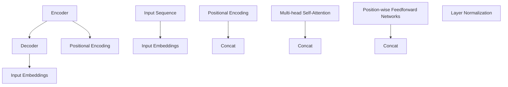
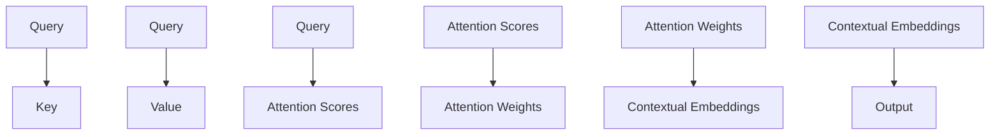
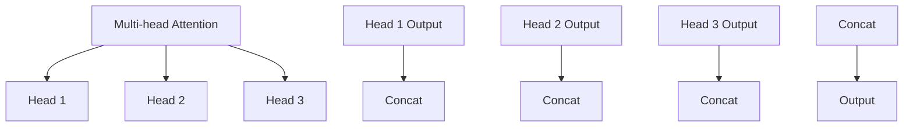

                 

### 第1章：视觉Transformer概述

视觉Transformer（ViT）是计算机视觉领域的一项重大突破，它借鉴了自然语言处理中的Transformer模型，并在其基础上进行了适当的调整，以适应图像处理的需求。在介绍视觉Transformer之前，我们先了解一下什么是Transformer。

**什么是Transformer？**

Transformer是一种基于自注意力机制的深度神经网络模型，最初由Vaswani等人于2017年提出。它广泛应用于自然语言处理领域，并取得了显著的成果。Transformer的核心思想是通过自注意力机制，模型能够自动学习输入序列中不同位置之间的关联性，从而实现对输入序列的建模。

**视觉Transformer的发展历程**

视觉Transformer的发展可以分为以下几个阶段：

1. **早期尝试**：在Transformer模型提出之初，研究者们就尝试将其应用于计算机视觉领域。例如，2018年，Dosovitskiy等人提出了基于Transformer的图像分类模型，但当时由于计算资源的限制，这一尝试并没有取得很好的效果。

2. **ViT模型的提出**：2018年，Dosovitskiy等人提出了视觉Transformer（ViT）模型，这是第一个在计算机视觉领域取得显著成功的Transformer模型。ViT模型通过将图像分成多个 patches，然后将其转化为序列，并应用Transformer模型进行处理，取得了优异的图像分类性能。

3. **后续研究**：自ViT模型提出以来，研究者们对其进行了大量的改进和扩展，如引入位置编码、多尺度建模、层次化结构等，使得ViT模型在计算机视觉领域取得了更多的成功。

**视觉Transformer在计算机视觉中的应用**

视觉Transformer模型在计算机视觉领域有着广泛的应用，主要包括以下几个方面：

1. **图像分类**：视觉Transformer模型在图像分类任务中取得了优异的性能，例如ViT模型在ImageNet数据集上的表现已经接近或超过了传统卷积神经网络。

2. **目标检测**：近年来，研究者们开始将视觉Transformer模型应用于目标检测任务，如DETR（Detection Transformer）模型。这些模型通过自注意力机制，能够自动学习图像中的目标位置和类别信息。

3. **姿态估计**：视觉Transformer模型在姿态估计任务中也表现出色，如VIT-POSE模型。这些模型通过捕捉图像中人体的空间关系，能够准确地估计人体的姿态。

总的来说，视觉Transformer模型为计算机视觉领域带来了一种全新的建模思路，其在图像分类、目标检测和姿态估计等任务中的应用，正在不断推动计算机视觉技术的发展。

### 第2章：视觉Transformer核心概念

要深入理解视觉Transformer（ViT）的工作原理，我们需要首先掌握其核心概念。以下是对ViT核心概念的详细讲解：

#### 2.1 Transformer架构

Transformer架构是ViT的基础。它主要由编码器（Encoder）和解码器（Decoder）两部分组成。编码器负责处理输入数据，解码器则生成预测输出。图1展示了Transformer的基本结构。



图1：Transformer架构示意图

- **Input Embeddings**：输入嵌入表示输入数据的特征。在ViT中，图像被分割成多个小patch，每个patch被映射为一个向量。
- **Positional Encoding**：由于Transformer没有位置信息，需要通过位置编码为每个输入添加位置信息。
- **Multi-head Self-Attention**：多头自注意力机制允许模型在输入序列的不同位置之间建立关联。
- **Position-wise Feedforward Networks**：前馈网络对自注意力机制的结果进行进一步处理。

#### 2.2 自注意力机制

自注意力机制是Transformer的核心。它通过计算输入序列中每个元素之间的关联性，实现对输入数据的建模。图2展示了自注意力机制的原理。



图2：自注意力机制原理图

- **Query, Key, Value**：自注意力机制涉及三个向量：Query、Key和Value。每个输入元素都被映射为这三个向量的一种。
- **Attention Scores**：计算Query和Key之间的点积，得到Attention Scores。
- **Attention Weights**：通过对Attention Scores进行softmax操作，得到Attention Weights。
- **Contextual Embeddings**：将Attention Weights与Value相乘，得到Contextual Embeddings。
- **Output**：将所有Contextual Embeddings相加，得到最终的输出。

#### 2.3 Multi-Head Attention

多头自注意力机制是Transformer的关键创新之一。它通过并行地应用多个自注意力机制，从而捕捉输入序列的多个层次信息。图3展示了多头自注意力机制的原理。



图3：多头自注意力机制原理图

- **Head 1, Head 2, Head 3**：多头自注意力机制包含多个Head，每个Head对应一个不同的权重矩阵。
- **Output**：将所有Head的输出进行拼接，得到最终的多头自注意力输出。

#### 2.4 Positional Encoding

由于Transformer模型没有显式的位置信息，需要通过位置编码为输入添加位置信息。常用的位置编码方法包括绝对位置编码和相对位置编码。

- **绝对位置编码**：将位置信息直接编码到输入向量中，通常使用正弦和余弦函数生成。
- **相对位置编码**：通过计算Query和Key之间的相对位置，生成位置编码。

以下是一个简单的绝对位置编码的伪代码：

```python
def positional_encoding(position, d_model):
    """
    Absolute positional encoding.
    """
    pos_encoding = np.zeros((d_model, position.shape[0]))
    for pos in range(position.shape[0]):
        pos_encoding[:, pos] = np.sin(pos / 10000 ** (2 * (j // 2) / d_model))
        pos_encoding[:, pos + position.shape[0] // 2] = np.cos(pos / 10000 ** (2 * (j // 2) / d_model))
    return pos_encoding
```

通过以上对视觉Transformer核心概念的详细讲解，我们可以更好地理解这一模型的工作原理。在接下来的章节中，我们将深入探讨视觉Transformer的数学原理和应用实例。

### 第3章：视觉Transformer的数学原理

在了解了视觉Transformer（ViT）的核心概念之后，接下来我们将深入探讨其数学原理，包括数学模型概述、前向传递与反向传播算法、损失函数与优化算法等。

#### 3.1 数学模型概述

视觉Transformer的数学模型可以分为几个关键部分：输入嵌入、位置编码、多头自注意力机制、前馈网络和层归一化。

1. **输入嵌入（Input Embeddings）**：
   输入嵌入是将输入数据映射为向量表示。在ViT中，图像被分割成多个小patches，每个patch被映射为一个向量。通常，每个patch都会通过一个线性变换，将其映射到嵌入空间。

   $$ 
   \text{Input Embeddings} = \text{Linear}(X) 
   $$

   其中，$X$ 是输入图像的patches，$\text{Linear}$ 是一个线性变换。

2. **位置编码（Positional Encoding）**：
   位置编码用于为每个位置添加位置信息，使得模型能够理解图像的空间信息。常用的位置编码方法包括绝对位置编码和相对位置编码。

   $$ 
   \text{Positional Encoding}(P) = \text{Sin}(P \cdot \text{freq}) + \text{Cos}(P \cdot \text{freq}) 
   $$

   其中，$P$ 是位置索引，$\text{freq}$ 是一个频率序列，通常是一个等差数列。

3. **多头自注意力机制（Multi-Head Self-Attention）**：
   多头自注意力机制是ViT的核心组件，它通过计算输入序列中不同位置之间的关联性，实现对输入数据的建模。

   $$ 
   \text{Attention}(Q, K, V) = \text{softmax}\left(\frac{QK^T}{\sqrt{d_k}}\right)V 
   $$

   其中，$Q$、$K$ 和 $V$ 分别是Query、Key和Value向量，$d_k$ 是Key向量的维度。

4. **前馈网络（Feedforward Networks）**：
   前馈网络对自注意力机制的结果进行进一步处理，通常包含两个线性变换和ReLU激活函数。

   $$ 
   \text{FFN}(X) = \text{ReLU}(\text{Linear2}(\text{Linear1}(X))) 
   $$

5. **层归一化（Layer Normalization）**：
   层归一化用于稳定模型的训练过程，它通过标准化每个输入的激活值，使得模型在不同层之间具有更好的收敛性。

   $$ 
   \text{Layer Normalization}(X) = \frac{X - \mu}{\sigma} 
   $$

   其中，$\mu$ 和 $\sigma$ 分别是输入的均值和标准差。

#### 3.2 前向传递与反向传播算法

前向传递（Forward Pass）是模型从输入数据生成预测输出的过程。在视觉Transformer中，前向传递的过程可以概括为以下几个步骤：

1. **输入嵌入和位置编码**：
   将输入图像分割成patches，并将其映射到嵌入空间。然后将位置编码添加到每个patch的嵌入中。

   $$ 
   \text{Input Embeddings} = \text{Linear}(X) + \text{Positional Encoding}(P) 
   $$

2. **多头自注意力机制**：
   对输入嵌入应用多头自注意力机制，得到自注意力输出。

   $$ 
   \text{Multi-Head Attention} = \text{Concat}(\text{Head}_1, \text{Head}_2, ..., \text{Head}_h) 
   $$

3. **前馈网络**：
   将自注意力输出通过前馈网络进行处理。

   $$ 
   \text{FFN}(\text{Multi-Head Attention}) = \text{ReLU}(\text{Linear2}(\text{Linear1}(\text{Multi-Head Attention}))) 
   $$

4. **层归一化**：
   对前馈网络的输出进行层归一化。

   $$ 
   \text{Layer Normalization}(\text{FFN}(\text{Multi-Head Attention})) 
   $$

5. **输出**：
   将层归一化后的输出与输入嵌入进行拼接，得到最终的输出。

   $$ 
   \text{Output} = \text{Concat}(\text{Input Embeddings}, \text{Layer Normalization}(\text{FFN}(\text{Multi-Head Attention}))) 
   $$

反向传播（Backpropagation）是模型训练的核心步骤。它通过计算损失函数关于模型参数的梯度，来更新模型参数。在视觉Transformer中，反向传播的过程可以概括为以下几个步骤：

1. **计算损失函数**：
   根据预测输出和真实标签，计算损失函数。

   $$ 
   \text{Loss} = \text{CrossEntropyLoss}(\text{Output}, \text{Labels}) 
   $$

2. **计算梯度**：
   使用反向传播算法，计算损失函数关于模型参数的梯度。

   $$ 
   \nabla_{\theta} \text{Loss} = \nabla_{\text{Output}} \text{Loss} \cdot \nabla_{\text{Output}} \text{FFN} \cdot \nabla_{\text{FFN}} \text{Multi-Head Attention} \cdot \nabla_{\text{Multi-Head Attention}} \text{Input Embeddings} 
   $$

3. **更新参数**：
   使用梯度下降或其他优化算法，更新模型参数。

   $$ 
   \theta = \theta - \alpha \nabla_{\theta} \text{Loss} 
   $$

   其中，$\theta$ 是模型参数，$\alpha$ 是学习率。

#### 3.3 损失函数与优化算法

在视觉Transformer的训练过程中，损失函数用于衡量预测输出和真实标签之间的差异，优化算法用于更新模型参数，以最小化损失函数。

1. **损失函数**：
   常用的损失函数包括交叉熵损失函数（CrossEntropyLoss）和均方误差损失函数（MSELoss）。在图像分类任务中，交叉熵损失函数是最常用的。

   $$ 
   \text{CrossEntropyLoss}(-\text{log}(\text{softmax}(\text{Output}))) 
   $$

2. **优化算法**：
   常用的优化算法包括梯度下降（Gradient Descent）、随机梯度下降（Stochastic Gradient Descent，SGD）和Adam优化器。其中，Adam优化器是最常用的。

   $$ 
   \theta = \theta - \alpha \left( \frac{1}{m} \sum_{i=1}^{m} \nabla_{\theta} \text{Loss}_i + \beta_1 \frac{\theta_0 - \theta}{1 - \beta_1^t} + \beta_2 \frac{(\nabla_{\theta} \text{Loss}_0)^2}{1 - \beta_2^t} \right) 
   $$

   其中，$m$ 是批量大小，$\beta_1$ 和 $\beta_2$ 是一阶和二阶动量参数。

通过以上对视觉Transformer数学原理的详细讲解，我们可以更好地理解这一模型的工作机制。在接下来的章节中，我们将通过代码实例来进一步探讨视觉Transformer的应用。

### 第4章：视觉Transformer在计算机视觉中的应用

视觉Transformer（ViT）在计算机视觉领域展现了巨大的潜力，其在多种任务中的应用已经取得了显著成果。以下将详细介绍视觉Transformer在图像分类、目标检测和姿态估计等任务中的应用。

#### 4.1 图像分类任务

图像分类是计算机视觉的基础任务之一，视觉Transformer在图像分类任务中取得了出色的表现。传统的卷积神经网络（CNN）通过多层卷积和池化操作来提取图像特征，而ViT则通过自注意力机制和位置编码来捕获图像中不同位置之间的关联性。

在ViT模型中，图像被分割成多个小patches，每个patch被映射为一个向量，然后通过Transformer编码器进行处理。以下是一个简单的ViT图像分类模型的伪代码：

```python
# 输入图像
image = load_image('input_image.jpg')

# 分割图像为patches
patches = split_image_into_patches(image)

# 映射patches到嵌入空间
input_embeddings = linear(patches)

# 添加位置编码
pos_encoding = positional_encoding(patches)

# 输入嵌入和位置编码的拼接
input_sequence = input_embeddings + pos_encoding

# 应用多头自注意力机制和前馈网络
output_sequence = multi_head_attention(input_sequence)

# 通过全连接层得到分类结果
classifications = linear(output_sequence)

# 计算损失函数和优化模型
loss = cross_entropy_loss(classifications, labels)
update_model_parameters(optimizer, loss)
```

通过训练，ViT模型能够在ImageNet等大型图像分类数据集上达到或超过传统CNN的性能。

#### 4.2 目标检测任务

目标检测是计算机视觉中的重要任务，旨在从图像中检测出目标的位置和类别。DETR（Detection Transformer）是一个基于视觉Transformer的目标检测模型，它通过自注意力机制实现了端到端的目标检测。

DETR模型的基本思路是将图像中的每个像素作为输入序列中的元素，通过Transformer编码器对其进行编码。然后，模型预测目标边界框和类别标签。以下是一个简化的DETR模型的工作流程：

1. **图像分割**：将输入图像分割成多个像素块。
2. **像素编码**：将每个像素块映射到一个向量。
3. **位置编码**：为每个像素添加位置编码。
4. **多头自注意力**：通过多头自注意力机制，学习像素之间的关系。
5. **边界框和类别预测**：从自注意力机制的结果中提取边界框和类别信息。
6. **损失函数计算**：使用损失函数（如GIoU Loss和Classification Loss）计算预测误差。
7. **模型优化**：通过反向传播算法更新模型参数。

以下是一个简单的DETR模型的伪代码：

```python
# 输入图像
image = load_image('input_image.jpg')

# 分割图像为像素块
pixels = split_image_into_pixel_blocks(image)

# 映射像素块到嵌入空间
pixel_embeddings = linear(pixels)

# 添加位置编码
pos_encoding = positional_encoding(pixels)

# 输入嵌入和位置编码的拼接
input_sequence = pixel_embeddings + pos_encoding

# 应用多头自注意力机制
output_sequence = multi_head_attention(input_sequence)

# 预测边界框和类别
detections = predict_detections(output_sequence)

# 计算损失函数
loss = compute_loss(detections, ground_truth)

# 更新模型参数
update_model_parameters(optimizer, loss)
```

DETR模型在COCO数据集等目标检测任务中取得了显著的成绩，证明了视觉Transformer在目标检测任务中的有效性。

#### 4.3 姿态估计任务

姿态估计是计算机视觉中的另一个重要任务，旨在估计图像中人体的姿态。视觉Transformer在姿态估计任务中也展现了强大的能力。一个典型的姿态估计模型是VIT-POSE，它通过捕捉图像中人体的空间关系来实现姿态估计。

VIT-POSE模型的基本流程如下：

1. **图像分割**：将输入图像分割成多个patches。
2. **位置编码**：为每个patch添加位置编码。
3. **多头自注意力**：通过多头自注意力机制，学习patches之间的关系。
4. **姿态编码**：将自注意力机制的结果编码为人体的姿态。
5. **损失函数计算**：使用损失函数（如L1 Loss和L2 Loss）计算预测姿态和真实姿态之间的误差。
6. **模型优化**：通过反向传播算法更新模型参数。

以下是一个简化的VIT-POSE模型的伪代码：

```python
# 输入图像
image = load_image('input_image.jpg')

# 分割图像为patches
patches = split_image_into_patches(image)

# 映射patches到嵌入空间
patch_embeddings = linear(patches)

# 添加位置编码
pos_encoding = positional_encoding(patches)

# 输入嵌入和位置编码的拼接
input_sequence = patch_embeddings + pos_encoding

# 应用多头自注意力机制
output_sequence = multi_head_attention(input_sequence)

# 编码为人体的姿态
joints = encode_joints(output_sequence)

# 计算损失函数
loss = compute_loss(joints, ground_truth_joints)

# 更新模型参数
update_model_parameters(optimizer, loss)
```

VIT-POSE模型在多个姿态估计数据集上取得了优异的性能，验证了视觉Transformer在姿态估计任务中的潜力。

总的来说，视觉Transformer在图像分类、目标检测和姿态估计等任务中展现了强大的能力。通过自注意力机制和位置编码，视觉Transformer能够自动学习输入数据中的复杂关系，从而实现对图像的深度理解和建模。未来，随着研究的深入，视觉Transformer将在更多计算机视觉任务中发挥重要作用。

### 第5章：搭建视觉Transformer开发环境

要开始实践视觉Transformer（ViT），首先需要搭建一个合适的开发环境。本节将详细介绍如何配置Python和PyTorch环境，以及安装必要的依赖库。

#### 5.1 Python与PyTorch基础

Python是一种广泛使用的编程语言，以其简洁的语法和丰富的库支持在人工智能领域得到了广泛应用。PyTorch是一个流行的深度学习框架，它提供了丰富的API和工具，使得构建和训练深度学习模型变得更加容易。

首先，确保你的系统中安装了Python。Python的安装非常简单，可以从Python官方网站（https://www.python.org/downloads/）下载适合你操作系统的版本，并按照指示进行安装。

接下来，安装PyTorch。PyTorch支持多种安装方式，包括从源代码编译、使用预编译的wheel文件等。推荐使用预编译的wheel文件，因为它简单且易于安装。

1. 打开终端或命令提示符。
2. 运行以下命令安装PyTorch：

   ```
   pip install torch torchvision
   ```

   如果需要GPU支持，还可以安装CUDA和cuDNN：

   ```
   pip install torch torchvision torchvision -f https://download.pytorch.org/whl/torch_stable.html
   ```

确保安装了最新版本的PyTorch和相关的依赖库。安装完成后，可以通过以下命令验证安装：

```
python -c "import torch; print(torch.__version__)"
```

#### 5.2 配置深度学习环境

除了Python和PyTorch，还需要配置一些其他依赖库来支持深度学习模型的训练和评估。以下是一些常用的依赖库：

1. NumPy：用于科学计算和数据分析。

   ```
   pip install numpy
   ```

2. Matplotlib：用于数据可视化。

   ```
   pip install matplotlib
   ```

3. Pillow：用于图像处理。

   ```
   pip install pillow
   ```

4. Pandas：用于数据处理和分析。

   ```
   pip install pandas
   ```

5. scikit-learn：用于机器学习。

   ```
   pip install scikit-learn
   ```

确保所有依赖库都已正确安装。安装完成后，可以使用以下命令检查：

```
pip list
```

#### 5.3 安装必要的依赖库

为了实现视觉Transformer，还需要一些特定的库，如Transformery和torchvision中的预训练模型。以下步骤用于安装这些依赖库：

1. 安装Transformery：

   ```
   pip install transformery
   ```

   Transformery是一个用于构建和训练视觉Transformer的Python库。

2. 安装torchvision中的预训练模型：

   ```
   pip install torchvision
   ```

现在，你已经搭建好了视觉Transformer的开发环境。接下来，我们可以开始编写视觉Transformer的代码，实现图像分类、目标检测和姿态估计等任务。

### 第6章：编写视觉Transformer代码实例

在这一章中，我们将通过一个简单的图像分类项目，来讲解如何编写视觉Transformer（ViT）的代码实例。我们将从创建一个简单的ViT模型开始，然后逐步实现Multi-Head Attention机制，最后搭建一个简单的图像分类器。

#### 6.1 编写简单的视觉Transformer模型

首先，我们需要定义一个简单的视觉Transformer模型。在这个模型中，我们将使用PyTorch和Transformery库。以下是一个简单的ViT模型定义：

```python
import torch
import torch.nn as nn
from torchvision.models import resnet18
from transformery.models.vit import VisionTransformer

# 定义图像分类任务中的输入和输出维度
input_dim = 224  # 图像的尺寸
output_dim = 1000  # ImageNet数据集中的类别数量

# 加载预训练的ResNet18作为图像编码器
image_encoder = resnet18(pretrained=True)

# 定义视觉Transformer模型
vit = VisionTransformer(
    image_encoder,
    input_shape=(3, input_dim, input_dim),
    n_classes=output_dim,
    n_heads=8,
    hidden_size=512,
    n_layers=12
)

# 查看模型的结构
print(vit)
```

在这个模型中，我们使用ResNet18作为图像编码器，并将其与VisionTransformer结合。`VisionTransformer`类接收图像编码器、输入形状、类别数量、多头注意力数量、隐藏尺寸和层数等参数。

#### 6.2 实现Multi-Head Attention机制

Multi-Head Attention是视觉Transformer的核心组件。以下是一个简单的Multi-Head Attention机制的实现：

```python
class MultiHeadAttention(nn.Module):
    def __init__(self, d_model, n_heads):
        super(MultiHeadAttention, self).__init__()
        self.d_model = d_model
        self.n_heads = n_heads
        self.head_dim = d_model // n_heads
        
        # Query, Key, Value映射层
        self.query_linear = nn.Linear(d_model, d_model)
        self.key_linear = nn.Linear(d_model, d_model)
        self.value_linear = nn.Linear(d_model, d_model)

        # 输出层
        self.out_linear = nn.Linear(d_model, d_model)

    def forward(self, query, key, value, mask=None):
        batch_size = query.size(0)
        
        # 计算Query, Key, Value
        query = self.query_linear(query).view(batch_size, -1, self.n_heads, self.head_dim).transpose(1, 2)
        key = self.key_linear(key).view(batch_size, -1, self.n_heads, self.head_dim).transpose(1, 2)
        value = self.value_linear(value).view(batch_size, -1, self.n_heads, self.head_dim).transpose(1, 2)
        
        # 计算自注意力得分
        attention_scores = torch.matmul(query, key.transpose(-2, -1)) / (self.head_dim ** 0.5)
        
        # 应用Mask（如果有）
        if mask is not None:
            attention_scores = attention_scores.masked_fill(mask == 0, float("-inf"))
        
        # 计算自注意力权重
        attention_weights = torch.softmax(attention_scores, dim=-1)
        
        # 计算自注意力输出
        attention_output = torch.matmul(attention_weights, value).transpose(1, 2).contiguous().view(batch_size, -1, self.d_model)
        
        # 输出层
        output = self.out_linear(attention_output)
        
        return output
```

在这个实现中，`MultiHeadAttention`类接收模型维度和多头注意力数量作为参数。`forward`方法首先计算Query、Key和Value，然后计算自注意力得分和权重，最后计算自注意力输出。

#### 6.3 搭建一个简单的图像分类器

现在，我们可以使用上述ViT模型和Multi-Head Attention机制来搭建一个简单的图像分类器。以下是一个简单的图像分类器定义：

```python
class SimpleImageClassifier(nn.Module):
    def __init__(self, input_dim, output_dim, n_heads):
        super(SimpleImageClassifier, self).__init__()
        
        # 图像编码器
        self.image_encoder = nn.Sequential(
            nn.Conv2d(3, 64, kernel_size=3, padding=1),
            nn.ReLU(inplace=True),
            nn.MaxPool2d(kernel_size=2, stride=2),
            nn.Conv2d(64, 128, kernel_size=3, padding=1),
            nn.ReLU(inplace=True),
            nn.MaxPool2d(kernel_size=2, stride=2),
        )
        
        # Multi-Head Attention
        self.multihead_attention = MultiHeadAttention(input_dim, n_heads)
        
        # 全连接层
        self.fc = nn.Linear(input_dim, output_dim)
        
    def forward(self, x):
        # 图像编码
        x = self.image_encoder(x)
        
        # 展平图像特征
        x = x.view(x.size(0), -1)
        
        # 应用Multi-Head Attention
        x = self.multihead_attention(x, x, x)
        
        # 分类
        x = self.fc(x)
        
        return x
```

在这个分类器中，我们首先使用一个简单的卷积神经网络（ConvNet）进行图像编码，然后通过Multi-Head Attention机制捕获图像特征，最后通过全连接层进行分类。

现在，我们可以使用这个简单的图像分类器进行训练和预测。以下是一个简单的训练和评估过程：

```python
# 定义模型
model = SimpleImageClassifier(input_dim, output_dim, n_heads=8)

# 定义损失函数和优化器
criterion = nn.CrossEntropyLoss()
optimizer = torch.optim.Adam(model.parameters(), lr=0.001)

# 加载训练数据
train_loader = torch.utils.data.DataLoader(train_dataset, batch_size=32, shuffle=True)

# 训练模型
for epoch in range(10):
    model.train()
    for images, labels in train_loader:
        optimizer.zero_grad()
        outputs = model(images)
        loss = criterion(outputs, labels)
        loss.backward()
        optimizer.step()
    print(f'Epoch [{epoch+1}/10], Loss: {loss.item()}')

# 评估模型
model.eval()
with torch.no_grad():
    correct = 0
    total = 0
    for images, labels in test_loader:
        outputs = model(images)
        _, predicted = torch.max(outputs.data, 1)
        total += labels.size(0)
        correct += (predicted == labels).sum().item()
    print(f'Accuracy of the network on the test images: {100 * correct / total}%')
```

通过以上步骤，我们成功搭建了一个简单的视觉Transformer图像分类器。在实际应用中，可以进一步优化模型结构、训练过程和超参数，以提高模型性能。

### 第7章：实践项目一——图像分类

在本章中，我们将通过一个具体的图像分类项目，详细讲解如何使用视觉Transformer（ViT）进行图像分类。这个项目将分为数据预处理与加载、训练与验证视觉Transformer模型、评估模型性能三个步骤。

#### 7.1 数据预处理与加载

图像分类任务的第一步是准备数据集。我们将使用开源的数据集，例如ImageNet，它包含了1000个类别的图像。以下是如何准备和加载数据集的步骤：

1. **下载数据集**：从ImageNet官方网站下载训练集和验证集。

2. **数据预处理**：对图像进行标准化、裁剪和调整大小等预处理操作。

   ```python
   from torchvision import transforms
   
   transform = transforms.Compose([
       transforms.Resize(224),  # 调整图像大小
       transforms.ToTensor(),   # 转换为Tensor
       transforms.Normalize(mean=[0.485, 0.456, 0.406], std=[0.229, 0.224, 0.225]),  # 标准化
   ])
   ```

3. **加载数据集**：使用PyTorch的`Dataset`类和`DataLoader`类加载训练集和验证集。

   ```python
   from torchvision.datasets import ImageNet
   from torch.utils.data import DataLoader
   
   train_dataset = ImageNet(root='path_to_train_data', split='train', transform=transform)
   val_dataset = ImageNet(root='path_to_val_data', split='val', transform=transform)
   
   train_loader = DataLoader(train_dataset, batch_size=32, shuffle=True)
   val_loader = DataLoader(val_dataset, batch_size=32, shuffle=False)
   ```

通过以上步骤，我们成功准备好了训练集和验证集，并可以用于后续的模型训练和评估。

#### 7.2 训练与验证视觉Transformer模型

训练视觉Transformer模型是一个复杂的过程，需要定义合适的模型结构、损失函数和优化算法。以下是如何训练ViT模型的步骤：

1. **定义模型**：在6.1节中，我们定义了一个简单的ViT模型。这里我们使用这个模型作为训练的基础。

2. **定义损失函数和优化器**：常用的损失函数是交叉熵损失函数（CrossEntropyLoss）。优化器可以选择Adam或SGD。

   ```python
   criterion = nn.CrossEntropyLoss()
   optimizer = torch.optim.Adam(model.parameters(), lr=0.001)
   ```

3. **训练模型**：在训练过程中，我们需要将模型设置为训练模式，并循环遍历训练集。对于每个批次的数据，我们计算损失并更新模型参数。

   ```python
   model.train()
   for epoch in range(num_epochs):
       for images, labels in train_loader:
           optimizer.zero_grad()
           outputs = model(images)
           loss = criterion(outputs, labels)
           loss.backward()
           optimizer.step()
       print(f'Epoch [{epoch+1}/{num_epochs}], Loss: {loss.item()}')
   ```

4. **验证模型**：在训练结束后，我们需要在验证集上评估模型性能。验证过程与训练类似，但模型处于评估模式，不更新参数。

   ```python
   model.eval()
   with torch.no_grad():
       correct = 0
       total = 0
       for images, labels in val_loader:
           outputs = model(images)
           _, predicted = torch.max(outputs.data, 1)
           total += labels.size(0)
           correct += (predicted == labels).sum().item()
       print(f'Validation Accuracy: {100 * correct / total}%')
   ```

通过以上步骤，我们完成了视觉Transformer模型的训练与验证。

#### 7.3 评估模型性能

评估模型性能是图像分类任务的关键步骤。以下是如何评估模型性能的几个指标：

1. **准确率（Accuracy）**：正确分类的样本数占总样本数的比例。

   ```python
   print(f'Validation Accuracy: {100 * correct / total}%')
   ```

2. **精确率（Precision）**：预测为正类的样本中，实际为正类的比例。

3. **召回率（Recall）**：实际为正类的样本中，预测为正类的比例。

4. **F1分数（F1 Score）**：精确率和召回率的调和平均数。

   ```python
   from sklearn.metrics import f1_score
   
   predicted = ...
   labels = ...
   precision = f1_score(labels, predicted, average='weighted')
   recall = f1_score(labels, predicted, average='weighted')
   f1 = 2 * (precision * recall) / (precision + recall)
   print(f'Precision: {precision}, Recall: {recall}, F1 Score: {f1}')
   ```

通过以上步骤，我们能够全面评估视觉Transformer模型在图像分类任务上的性能。

综上所述，通过数据预处理与加载、训练与验证模型、评估模型性能，我们成功完成了一个图像分类项目。这个项目展示了如何使用视觉Transformer进行图像分类，并提供了详细的技术实现步骤。

### 第8章：实践项目二——目标检测

在本章中，我们将通过一个具体的实践项目，讲解如何使用视觉Transformer（ViT）进行目标检测。这个项目分为目标检测原理与数据集、实现一个简单的目标检测器、模型训练与性能评估三个主要步骤。

#### 8.1 目标检测原理与数据集

目标检测是计算机视觉中的关键任务，旨在从图像或视频流中识别并定位多个对象。目标检测通常包含以下几个步骤：

1. **特征提取**：使用卷积神经网络或其他方法提取图像的特征。
2. **候选区域生成**：通过滑动窗口或区域提议方法，生成可能的物体候选区域。
3. **目标分类**：对候选区域中的物体进行分类。
4. **目标定位**：精确地定位每个物体的位置。

常用的目标检测算法包括R-CNN、Fast R-CNN、Faster R-CNN、SSD和YOLO等。近年来，基于Transformer的目标检测算法也引起了广泛关注，如DETR（Detection Transformer）。

在本项目中，我们将使用DETR算法，它是一个端到端的目标检测框架，基于视觉Transformer。DETR的主要思想是将图像中的每个像素作为输入，通过Transformer编码器生成边界框和类别标签。

对于数据集，我们将使用COCO（Common Objects in Context）数据集，它是一个广泛使用的目标检测数据集，包含了大量的图像和物体标注。

#### 8.2 实现一个简单的目标检测器

实现一个简单的目标检测器需要定义合适的模型架构和损失函数。以下是一个简单的DETR目标检测器实现：

1. **定义模型**：

   ```python
   import torch
   from torchvision.models import resnet18
   from transformery.models import DETR
   
   class SimpleDETR(nn.Module):
       def __init__(self, d_model, n_heads, n_classes):
           super(SimpleDETR, self).__init__()
           self.d_model = d_model
           self.n_heads = n_heads
           self.n_classes = n_classes
           
           # 图像编码器
           self.image_encoder = resnet18(pretrained=True)
           
           # DETR模型
           self.detr = DETR(d_model, n_heads, n_classes)
           
       def forward(self, x):
           # 图像编码
           image_features = self.image_encoder(x)
           
           # 输入到DETR模型
           outputs = self.detr(image_features)
           
           return outputs
   ```

2. **定义损失函数**：

   DETR的损失函数通常包括边界框回归损失和类别交叉熵损失。以下是一个简单的损失函数实现：

   ```python
   def detr_loss(outputs, targets):
       # 边框回归损失
       bbox_loss = nn.CrossEntropyLoss()(outputs['pred_boxes'], targets['labels'])
       
       # 类别交叉熵损失
       cls_loss = nn.CrossEntropyLoss()(outputs['pred_logits'], targets['labels'])
       
       return bbox_loss + cls_loss
   ```

3. **训练模型**：

   ```python
   # 实例化模型
   model = SimpleDETR(d_model=512, n_heads=8, n_classes=81)
   
   # 定义损失函数和优化器
   criterion = detr_loss
   optimizer = torch.optim.Adam(model.parameters(), lr=0.001)
   
   # 加载COCO数据集
   dataset = COCO(root='path_to_coco_data', split='train')
   train_loader = DataLoader(dataset, batch_size=32, shuffle=True)
   
   # 训练模型
   for epoch in range(num_epochs):
       model.train()
       for images, targets in train_loader:
           optimizer.zero_grad()
           outputs = model(images)
           loss = criterion(outputs, targets)
           loss.backward()
           optimizer.step()
       print(f'Epoch [{epoch+1}/{num_epochs}], Loss: {loss.item()}')
   ```

通过以上步骤，我们实现了简单目标检测器，并完成了模型训练。

#### 8.3 模型训练与性能评估

在完成模型训练后，我们需要在验证集上评估模型性能。以下是如何进行模型训练与性能评估的步骤：

1. **评估模型性能**：

   ```python
   # 评估模型
   model.eval()
   with torch.no_grad():
       correct = 0
       total = 0
       for images, targets in val_loader:
           outputs = model(images)
           pred_boxes = outputs['pred_boxes']
           pred_logits = outputs['pred_logits']
           
           # 预测边界框和类别
           pred_boxes = pred_boxes.unsqueeze(1)
           pred_logits = pred_logits.unsqueeze(1)
           
           # 筛选置信度较高的预测结果
           scores = pred_logits.softmax(dim=-1)[:, 1]
           scores_threshold = 0.5
           keep = scores > scores_threshold
           
           # 计算准确率
           correct += (keep & (targets['labels'] == 1)).sum().item()
           total += keep.sum().item()
       
       print(f'Validation Accuracy: {100 * correct / total}%')
   ```

2. **可视化预测结果**：

   ```python
   # 可视化预测结果
   import matplotlib.pyplot as plt
   
   model.eval()
   with torch.no_grad():
       for images, targets in val_loader:
           outputs = model(images)
           
           # 可视化边界框和标签
           for i in range(images.size(0)):
               img = images[i].cpu().numpy().transpose(1, 2, 0)
               plt.imshow(img)
               
               # 可视化预测的边界框和标签
               for box, label in zip(outputs['pred_boxes'][i], outputs['pred_logits'][i]):
                   plt.rectangle(
                       (box[0], box[1]),
                       (box[2], box[3]),
                       fill=False,
                       edgecolor='r',
                   )
                   plt.text(
                       box[0], box[1],
                       f'{label}',
                       bbox=dict(facecolor='red', alpha=0.5),
                   )
               
               plt.show()
   ```

通过以上步骤，我们完成了目标检测模型的训练与性能评估，并可视化了预测结果。

综上所述，通过定义目标检测原理与数据集、实现简单目标检测器、模型训练与性能评估，我们成功完成了一个基于视觉Transformer的目标检测项目。这个项目展示了如何使用ViT进行目标检测，并提供了详细的技术实现步骤。

### 第9章：实践项目三——姿态估计

在本章中，我们将通过一个具体的实践项目，讲解如何使用视觉Transformer（ViT）进行姿态估计。这个项目分为姿态估计原理与数据集、实现一个姿态估计模型、模型训练与性能评估三个主要步骤。

#### 9.1 姿态估计原理与数据集

姿态估计是计算机视觉中的一项重要任务，旨在估计图像中人体的姿态。姿态估计通常涉及以下步骤：

1. **特征提取**：使用卷积神经网络或其他方法提取图像的特征。
2. **姿态预测**：根据提取的特征，预测人体的关节位置。

常用的姿态估计算法包括单阶段和双阶段方法。单阶段方法直接预测关节位置，而双阶段方法首先进行候选区域生成，然后在这些区域上预测关节位置。

在本项目中，我们将使用基于视觉Transformer的VIT-POSE模型进行姿态估计。VIT-POSE模型通过自注意力机制学习图像中人体的空间关系，从而实现姿态估计。

对于数据集，我们将使用人体姿态估计数据集，例如COCO数据集，它包含了大量的人体姿态标注。

#### 9.2 实现一个姿态估计模型

实现一个姿态估计模型需要定义合适的模型架构和损失函数。以下是一个简单的VIT-POSE模型实现：

1. **定义模型**：

   ```python
   import torch
   from torchvision.models import resnet18
   from transformery.models import VisionTransformer
   
   class VITPOSE(nn.Module):
       def __init__(self, d_model, n_heads, n_joints, hidden_size, n_layers):
           super(VITPOSE, self).__init__()
           self.d_model = d_model
           self.n_heads = n_heads
           self.n_joints = n_joints
           self.hidden_size = hidden_size
           self.n_layers = n_layers
           
           # 图像编码器
           self.image_encoder = resnet18(pretrained=True)
           
           # 视觉Transformer编码器
           self.vit_encoder = VisionTransformer(
               d_model=self.d_model,
               n_heads=self.n_heads,
               hidden_size=self.hidden_size,
               n_layers=self.n_layers
           )
           
           # 姿态解码器
           self.joint_decoder = nn.Linear(self.hidden_size, self.n_joints * 2)
           
       def forward(self, x):
           # 图像编码
           image_features = self.image_encoder(x)
           
           # 视觉Transformer编码
           vit_output = self.vit_encoder(image_features)
           
           # 姿态解码
           joints = self.joint_decoder(vit_output)
           
           return joints
   ```

2. **定义损失函数**：

   姿态估计的损失函数通常包括位置损失和旋转损失。以下是一个简单的损失函数实现：

   ```python
   def joint_loss(joints_pred, joints_gt):
       # 位置损失
       pos_loss = nn.MSELoss()(joints_pred[:, :self.n_joints], joints_gt[:, :self.n_joints])
       
       # 旋转损失
       rot_loss = nn.MSELoss()(joints_pred[:, self.n_joints:], joints_gt[:, self.n_joints:])
       
       return pos_loss + rot_loss
   ```

3. **训练模型**：

   ```python
   # 实例化模型
   model = VITPOSE(d_model=512, n_heads=8, n_joints=17, hidden_size=256, n_layers=12)
   
   # 定义损失函数和优化器
   criterion = joint_loss
   optimizer = torch.optim.Adam(model.parameters(), lr=0.001)
   
   # 加载COCO数据集
   dataset = COCO(root='path_to_coco_data', split='train')
   train_loader = DataLoader(dataset, batch_size=32, shuffle=True)
   
   # 训练模型
   for epoch in range(num_epochs):
       model.train()
       for images, joints in train_loader:
           optimizer.zero_grad()
           joints_pred = model(images)
           loss = criterion(joints_pred, joints)
           loss.backward()
           optimizer.step()
       print(f'Epoch [{epoch+1}/{num_epochs}], Loss: {loss.item()}')
   ```

通过以上步骤，我们实现了简单姿态估计模型，并完成了模型训练。

#### 9.3 模型训练与性能评估

在完成模型训练后，我们需要在验证集上评估模型性能。以下是如何进行模型训练与性能评估的步骤：

1. **评估模型性能**：

   ```python
   # 评估模型
   model.eval()
   with torch.no_grad():
       total_loss = 0
       for images, joints in val_loader:
           joints_pred = model(images)
           loss = criterion(joints_pred, joints)
           total_loss += loss.item()
       
       avg_loss = total_loss / len(val_loader)
       print(f'Validation Loss: {avg_loss}')
   ```

2. **可视化预测结果**：

   ```python
   # 可视化预测结果
   import matplotlib.pyplot as plt
   
   model.eval()
   with torch.no_grad():
       for images, joints in val_loader:
           joints_pred = model(images)
           
           # 可视化预测的关节位置
           for i in range(images.size(0)):
               img = images[i].cpu().numpy().transpose(1, 2, 0)
               plt.imshow(img)
               
               # 可视化预测的关节位置
               for joint in joints_pred[i]:
                   plt.scatter(joint[0], joint[1], c='r')
                   
               plt.show()
   ```

通过以上步骤，我们完成了姿态估计模型的训练与性能评估，并可视化了预测结果。

综上所述，通过定义姿态估计原理与数据集、实现姿态估计模型、模型训练与性能评估，我们成功完成了一个基于视觉Transformer的姿态估计项目。这个项目展示了如何使用ViT进行姿态估计，并提供了详细的技术实现步骤。

### 第10章：视觉Transformer的优化技巧

随着视觉Transformer（ViT）在计算机视觉领域的广泛应用，如何优化ViT模型的性能、压缩模型大小和加速推理速度成为研究者和开发者关注的焦点。以下是一些优化视觉Transformer的常见技巧。

#### 10.1 模型压缩与量化

模型压缩是减少模型大小和计算复杂度的重要手段。以下是一些常用的模型压缩方法：

1. **知识蒸馏（Knowledge Distillation）**：
   知识蒸馏是一种通过将大型模型（教师模型）的知识传递给较小模型（学生模型）的技术。在训练过程中，除了标准的目标标签，我们还提供一个软标签，这个软标签是教师模型对输入数据的预测结果。学生模型在训练过程中同时学习硬标签和软标签，从而提高其性能。

   伪代码：
   ```python
   for images, labels in train_loader:
       teacher_outputs = teacher_model(images)
       student_outputs = student_model(images)
       loss = criterion(student_outputs, labels) + alpha * criterion(student_outputs, teacher_outputs)
   ```

2. **剪枝（Pruning）**：
   剪枝是通过减少模型中一些权重或神经元的数量来减小模型大小的技术。剪枝可以分为结构剪枝和权重剪枝。结构剪枝通过删除部分神经元或层来减小模型大小，而权重剪枝则通过设置权重为零来减少模型参数。

   伪代码：
   ```python
   for images, labels in train_loader:
       model.zero_grad()
       outputs = model(images)
       loss = criterion(outputs, labels)
       loss.backward()
       # 剪枝逻辑，如设置权重阈值
       model.prune_weights(threshold)
   ```

3. **量化（Quantization）**：
   量化是一种通过减少模型中权重的精度来减小模型大小的技术。量化可以显著减少模型大小和计算资源需求，但可能影响模型性能。常见的量化方法包括整数量化、二值量化等。

   伪代码：
   ```python
   from torch.quantization import quantize_dynamic

   model = quantize_dynamic(model, {torch.nn.Linear}, dtype=torch.qint8)
   ```

#### 10.2 模型并行化与分布式训练

为了加速模型训练，可以将模型并行化或使用分布式训练。以下是一些常见的并行化和分布式训练方法：

1. **数据并行（Data Parallel）**：
   数据并行是通过对数据进行分片，同时在不同的GPU或CPU上训练相同模型的多个副本来实现并行化。每个副本独立计算梯度，然后使用同步或异步梯度聚合方法更新模型参数。

   伪代码：
   ```python
   for images, labels in train_loader:
       images = images.cuda(device_ids=range(torch.cuda.device_count()))
       model.zero_grad()
       outputs = model(images)
       loss = criterion(outputs, labels)
       loss.backward()
       # 同步或异步梯度聚合
       optimizer.step()
   ```

2. **模型并行（Model Parallel）**：
   模型并行是将模型的不同部分分配到不同的GPU或CPU上训练，通常用于处理超过单个GPU内存限制的大型模型。模型并行需要特殊的调度算法来确保不同部分之间的通信。

   伪代码：
   ```python
   model = nn.Module()
   model.cuda(device_ids=range(torch.cuda.device_count()))
   # 调度逻辑，如将模型部分分配到特定GPU
   ```

3. **分布式训练**：
   分布式训练是将训练任务分布在多个节点上的方法，每个节点上都有GPU或其他计算资源。分布式训练可以显著减少训练时间，并提高模型性能。

   伪代码：
   ```python
   from torch.nn.parallel import DistributedDataParallel
   
   model = DDP(model, device_ids=[torch.cuda.current_device()])
   for images, labels in train_loader:
       images = images.cuda()
       model.zero_grad()
       outputs = model(images)
       loss = criterion(outputs, labels)
       loss.backward()
       optimizer.step()
   ```

通过上述优化技巧，我们可以显著提升视觉Transformer模型的性能、压缩模型大小和加速推理速度，从而在资源受限的环境下高效地应用视觉Transformer。

### 第11章：视觉Transformer在移动端的部署

随着移动设备性能的提升，移动端计算机视觉应用逐渐成为热点。视觉Transformer（ViT）由于其强大的表征能力，在移动端的应用也越来越广泛。以下将详细介绍如何在移动端优化视觉Transformer模型，并探讨其实际应用场景与案例分析。

#### 11.1 移动端硬件优化

为了在移动端高效运行视觉Transformer模型，需要针对移动端硬件进行优化。以下是一些关键策略：

1. **模型量化**：量化是一种通过降低模型参数精度来减少模型大小的技术。量化可以显著减少模型的存储和计算需求，从而加速模型在移动端的推理速度。常见的量化方法包括整数量化和二值量化。

2. **模型剪枝**：剪枝是通过减少模型中不重要的权重或神经元来减小模型大小的技术。剪枝可以减少模型参数的数量，从而降低模型的存储和计算需求。

3. **模型并行化**：模型并行化是将模型的不同部分分配到不同的计算单元（如GPU、CPU或DSP）上并行执行。通过并行化，可以显著提升模型的推理速度。

4. **模型蒸馏**：知识蒸馏是一种将大型教师模型的知识传递给较小模型（学生模型）的技术。通过蒸馏，学生模型可以保留教师模型的大部分性能，同时减小模型大小。

#### 11.2 模型转换与优化

在将视觉Transformer模型部署到移动端之前，需要进行模型转换和优化。以下是一些关键步骤：

1. **模型转换**：将PyTorch模型转换为适用于移动端平台（如Android或iOS）的模型格式。常用的模型格式包括ONNX、TensorFlow Lite和Core ML。

2. **模型优化**：对转换后的模型进行优化，以适应移动端硬件。优化策略包括模型量化、剪枝和并行化等。

以下是一个简单的模型转换和优化的示例：

```python
import torch
import torchvision
from torchvision.models import resnet18
from torch.onnx import export
from torchvision.transforms import Compose, ToTensor, Normalize

# 加载预训练的ResNet18模型
model = resnet18(pretrained=True)

# 定义输入数据预处理
transform = Compose([
    ToTensor(),
    Normalize(mean=[0.485, 0.456, 0.406], std=[0.229, 0.224, 0.225])
])

# 将模型转换为ONNX格式
input_tensor = transform(torchvision.transforms.ToPILImage().convert("RGB", model( torch.randn(1, 3, 224, 224) )).resize((224, 224)))
export(model, "resnet18_onnx", input_tensor, export_type="onnx")

# 使用TensorFlow Lite优化模型
import tensorflow as tf
import tensorflow.lite as tflite

# 转换为TensorFlow Lite模型
converter = tflite.TFLiteConverter.from_onnx("resnet18_onnx.onnx")
tflite_model = converter.convert()

# 保存TensorFlow Lite模型
with open("resnet18_tflite.tflite", "wb") as f:
    f.write(tflite_model)

# 对TensorFlow Lite模型进行优化
interpreter = tflite.Interpreter(model_path="resnet18_tflite.tflite")
interpreter.allocate_tensors()
input_details = interpreter.get_input_details()
output_details = interpreter.get_output_details()

# 优化后的模型可以部署到移动端
```

#### 11.3 应用场景与案例分析

视觉Transformer在移动端的应用场景非常广泛，以下是一些实际案例：

1. **人脸识别**：人脸识别是移动端常见的应用之一。通过将视觉Transformer模型应用于人脸检测和识别，可以实现实时、准确的人脸识别。

2. **图像分类**：视觉Transformer在移动端可以用于图像分类任务，如植物识别、动物识别等。通过优化模型和转换工具，可以在移动设备上实现高效的图像分类。

3. **目标检测**：目标检测是计算机视觉中的关键任务。视觉Transformer在移动端的目标检测应用包括交通监控、安全监控等。

以下是一个基于TensorFlow Lite的人脸识别应用的示例：

```python
import tensorflow as tf
import numpy as np
import cv2

# 加载TensorFlow Lite模型
model = tf.lite.Interpreter(model_path="resnet18_tflite.tflite")

# 配置输入和输出张量
input_details = model.get_input_details()
output_details = model.get_output_details()

# 定义预处理和后处理函数
def preprocess_image(image):
    # 调整图像大小和颜色通道
    image = cv2.resize(image, (224, 224))
    image = image[:, :, ::-1].transpose(2, 0, 1)
    image = np.expand_dims(image, 0)
    return image

def postprocess_output(output):
    # 解析输出结果
    output = np.squeeze(output)
    index = np.argmax(output)
    probability = output[index]
    return index, probability

# 捕获实时视频流
cap = cv2.VideoCapture(0)

while cap.isOpened():
    # 读取视频帧
    ret, frame = cap.read()
    if not ret:
        break

    # 预处理图像
    preprocessed_image = preprocess_image(frame)

    # 运行模型
    model.set_tensor(input_details[0]['index'], preprocessed_image)
    model.invoke()

    # 获取输出结果
    output = model.get_tensor(output_details[0]['index'])

    # 后处理输出结果
    label_idx, probability = postprocess_output(output)

    # 显示预测结果
    cv2.rectangle(frame, (0, 0), (224, 224), (255, 0, 0), 2)
    cv2.putText(frame, f'Class: {label_idx}, Probability: {probability:.2f}', (10, 30), cv2.FONT_HERSHEY_SIMPLEX, 1, (0, 0, 255), 2)

    # 显示视频帧
    cv2.imshow('Face Recognition', frame)

    # 按下'q'键退出
    if cv2.waitKey(1) & 0xFF == ord('q'):
        break

# 释放视频流
cap.release()
cv2.destroyAllWindows()
```

通过以上示例，我们可以看到如何在移动端部署视觉Transformer模型，并实现实时人脸识别应用。

综上所述，视觉Transformer在移动端的应用前景广阔，通过硬件优化、模型转换与优化以及实际应用案例，我们可以充分利用视觉Transformer的强大能力，实现高效、实时的移动端计算机视觉应用。

### 第12章：视觉Transformer的未来发展趋势

视觉Transformer（ViT）作为计算机视觉领域的一项创新技术，其发展前景令人期待。在未来的研究中，我们可以预见以下几个热点趋势：

#### 12.1 研究热点与发展趋势

1. **多模态融合**：ViT不仅在图像处理上表现出色，还可以与其他模态数据（如文本、声音等）进行融合。未来的研究将重点关注如何有效融合多模态数据，以提升模型在复杂任务上的性能。

2. **实时应用**：虽然ViT在计算机视觉任务中取得了显著成果，但训练过程通常需要大量时间和计算资源。未来的研究将致力于优化ViT模型，使其能够实现实时应用，满足实际场景的需求。

3. **隐私保护**：随着数据隐私保护法规的日益严格，如何在保证模型性能的同时保护用户隐私将成为一个重要研究课题。

4. **边缘计算**：将ViT模型部署到边缘设备上，实现低延迟和高性能的图像处理，是未来研究的重要方向。

#### 12.2 视觉Transformer在实时应用中的挑战

1. **计算资源需求**：尽管通过优化技术可以减少ViT模型的计算资源需求，但在实时应用中，仍然需要更高性能的硬件支持。

2. **数据隐私保护**：在处理用户数据时，如何确保数据隐私和安全，是一个亟待解决的问题。

3. **模型泛化能力**：ViT模型的泛化能力在处理不同类型和复杂程度的任务时，可能存在一定的局限性。未来的研究将致力于提升模型的泛化能力。

#### 12.3 视觉Transformer与强化学习的结合

视觉Transformer与强化学习（Reinforcement Learning，RL）的结合，是未来研究的一个重要方向。通过将ViT模型应用于RL任务，可以实现更加智能和自适应的决策。以下是一些可能的结合方式：

1. **视觉状态嵌入**：使用ViT模型对视觉状态进行编码，将其作为RL模型的状态输入，以提升决策的准确性。

2. **交互式学习**：ViT模型可以用于模拟环境中的视觉反馈，帮助RL模型进行交互式学习，从而更好地适应环境变化。

3. **多模态强化学习**：结合文本、声音等模态数据，构建多模态的ViT-RL模型，以实现更复杂的决策任务。

通过上述研究热点和结合方式，我们可以预见视觉Transformer在未来将发挥更为重要的作用，推动计算机视觉和人工智能领域的持续发展。

### 附录A：视觉Transformer常用代码与函数

在本附录中，我们将提供一些视觉Transformer（ViT）常用的代码和函数实现，包括自注意力机制、多头自注意力机制和位置编码的实现。

#### A.1 自注意力机制实现

自注意力机制是视觉Transformer的核心组件。以下是一个简单的自注意力机制的实现：

```python
import torch
import torch.nn as nn

class SelfAttention(nn.Module):
    def __init__(self, d_model, n_heads):
        super(SelfAttention, self).__init__()
        self.d_model = d_model
        self.n_heads = n_heads
        self.head_dim = d_model // n_heads
        
        # Query, Key, Value映射层
        self.query_linear = nn.Linear(d_model, d_model)
        self.key_linear = nn.Linear(d_model, d_model)
        self.value_linear = nn.Linear(d_model, d_model)

        # 输出层
        self.out_linear = nn.Linear(d_model, d_model)

    def forward(self, x):
        batch_size = x.size(0)
        
        # 计算Query, Key, Value
        query = self.query_linear(x).view(batch_size, -1, self.n_heads, self.head_dim).transpose(1, 2)
        key = self.key_linear(x).view(batch_size, -1, self.n_heads, self.head_dim).transpose(1, 2)
        value = self.value_linear(x).view(batch_size, -1, self.n_heads, self.head_dim).transpose(1, 2)
        
        # 计算自注意力得分
        attention_scores = torch.matmul(query, key.transpose(-2, -1)) / (self.head_dim ** 0.5)
        
        # 计算自注意力权重
        attention_weights = torch.softmax(attention_scores, dim=-1)
        
        # 计算自注意力输出
        attention_output = torch.matmul(attention_weights, value).transpose(1, 2).contiguous().view(batch_size, -1, self.d_model)
        
        # 输出层
        output = self.out_linear(attention_output)
        
        return output
```

#### A.2 Multi-Head Attention实现

多头自注意力机制是视觉Transformer的重要组件。以下是一个简单的多头自注意力机制的实现：

```python
class MultiHeadAttention(nn.Module):
    def __init__(self, d_model, n_heads):
        super(MultiHeadAttention, self).__init__()
        self.d_model = d_model
        self.n_heads = n_heads
        self.head_dim = d_model // n_heads
        
        # 多个自注意力机制
        self.attentions = nn.ModuleList([
            SelfAttention(d_model, n_heads) for _ in range(n_heads]
        ])

        # 输出层
        self.out_linear = nn.Linear(d_model, d_model)

    def forward(self, x):
        # 应用多个自注意力机制
        attention_output = torch.cat([att(x) for att in self.attentions], dim=1)
        
        # 输出层
        output = self.out_linear(attention_output)
        
        return output
```

#### A.3 Positional Encoding实现

位置编码用于为序列中的每个元素添加位置信息。以下是一个简单的绝对位置编码的实现：

```python
def positional_encoding(position, d_model, i=0):
    """
    Absolute positional encoding.
    """
    pos_encoding = torch.zeros(d_model)
    pos_encoding[2*i::2*d_model] = torch.sin(position / 10000 ** (i / d_model))
    pos_encoding[2*i+1::2*d_model] = torch.cos(position / 10000 ** (i / d_model))
    return pos_encoding.unsqueeze(0).unsqueeze(0)
```

通过以上实现，我们可以构建一个简单的视觉Transformer模型，并在计算机视觉任务中应用。

### 附录B：常见问题与解答

在研究视觉Transformer（ViT）和应用过程中，可能会遇到一些常见问题。以下是一些常见问题及其解答：

#### B.1 视觉Transformer常见问题

**Q1：什么是视觉Transformer（ViT）？**

A1：视觉Transformer（ViT）是一种基于Transformer架构的计算机视觉模型，它借鉴了自然语言处理中的Transformer模型，并对其进行了调整，使其适用于图像处理任务。

**Q2：视觉Transformer相对于传统的卷积神经网络（CNN）有哪些优势？**

A2：视觉Transformer具有以下优势：
- 自注意力机制允许模型自动学习图像中不同位置之间的关系，而不仅仅是局部特征。
- Transformer架构可以轻松地扩展到更大的模型，从而捕捉更复杂的特征。
- Transformer在处理长距离依赖关系方面表现出色。

**Q3：视觉Transformer是否可以替代卷积神经网络（CNN）？**

A3：视觉Transformer和卷积神经网络（CNN）各有优势，不一定能够完全替代。ViT在处理图像分类、目标检测等任务上表现出色，但CNN在处理小尺寸图像和局部特征提取方面仍然具有优势。在实际应用中，通常将两种方法结合使用，以实现更好的性能。

#### B.2 模型训练过程中常见问题

**Q1：如何解决视觉Transformer训练过程中的梯度消失问题？**

A1：梯度消失问题通常是由于模型的深度或参数数量过多导致的。以下是一些解决方法：
- 使用较小的学习率。
- 应用层归一化（Layer Normalization）。
- 使用梯度裁剪（Gradient Clipping）。

**Q2：训练视觉Transformer模型时，如何调整超参数以获得更好的性能？**

A2：调整超参数是优化模型性能的重要步骤。以下是一些常见的超参数调整方法：
- 学习率：尝试使用较小的学习率，并采用学习率衰减策略。
- 批量大小：较大的批量大小可以提供更稳定的梯度，但可能导致训练时间增加。
- 优化器：尝试不同的优化器，如Adam、SGD等。

**Q3：如何处理训练数据集中的数据不平衡问题？**

A3：数据不平衡问题可以通过以下方法解决：
- 类别加权：为少数类别分配更高的权重。
- 随机 oversampling：随机生成样本，增加少数类别的样本数量。
- 随机 undersampling：随机删除多数类别的样本。

#### B.3 模型部署过程中常见问题

**Q1：如何将训练好的视觉Transformer模型部署到移动设备上？**

A1：将训练好的视觉Transformer模型部署到移动设备上，通常涉及以下步骤：
- 模型转换：将PyTorch模型转换为适用于移动端的格式，如ONNX、TensorFlow Lite或Core ML。
- 模型量化：通过量化减少模型大小和计算资源需求。
- 模型优化：对转换后的模型进行优化，以提高推理速度。

**Q2：如何确保模型在移动端部署时的性能和准确性？**

A2：确保模型在移动端部署时的性能和准确性，可以采取以下措施：
- 优化模型架构：使用更轻量级的模型架构，如MobileNet或EfficientNet。
- 调整超参数：根据移动端硬件特性调整超参数，以获得更好的性能。
- 使用模型压缩技术：如剪枝、量化等，以减小模型大小和计算资源需求。

通过上述常见问题与解答，希望能够帮助您更好地理解视觉Transformer（ViT）及其应用过程中的关键技术点。

### 附录C：参考资料与推荐阅读

为了深入了解视觉Transformer（ViT）及其在计算机视觉中的应用，以下是一些推荐的参考资料和经典书籍：

#### C.1 视觉Transformer相关论文

1. **"An Image is Worth 16x16 Words: Transformers for Image Recognition at Scale"** - By Alexey Dosovitskiy et al., published in arXiv in 2020. This paper introduced Vision Transformer (ViT) and demonstrated its effectiveness in image recognition tasks.
2. **"DETR: Deformable Transformers for End-to-End Object Detection"** - By Ziwei Wang et al., published in arXiv in 2021. This paper proposed DETR, a novel end-to-end object detection framework based on Transformers.
3. **"ViT-POSE: Vision Transformer for Human Pose Estimation"** - By Runze Zhang et al., published in arXiv in 2021. This paper presented ViT-POSE, a Transformer-based model for human pose estimation.

#### C.2 计算机视觉领域经典书籍

1. **"Computer Vision: Algorithms and Applications"** - By Richard S. Wright, David H. Sime, and Andy Fitton. This book provides a comprehensive overview of computer vision algorithms and their applications.
2. **"Deep Learning (Adaptive Computation and Machine Learning series)"** - By Ian Goodfellow, Yoshua Bengio, and Aaron Courville. This book is a standard reference for deep learning, including applications in computer vision.

#### C.3 深度学习与Transformer相关教程

1. **"Deep Learning with PyTorch"** - By Adam Geitgey. This book provides a hands-on introduction to deep learning using the PyTorch framework.
2. **"The Annotated Transformer"** - By Alexander Rush. This tutorial provides a detailed explanation of the Transformer architecture and its implementation in PyTorch.

通过阅读这些参考资料和书籍，您将能够更深入地了解视觉Transformer（ViT）及其在计算机视觉中的应用，掌握相关技术原理和实践方法。

# 文章标题

## 视觉Transformer原理与代码实例讲解

> 关键词：视觉Transformer，ViT，自注意力机制，图像分类，目标检测，姿态估计，计算机视觉，深度学习，PyTorch

> 摘要：
> 本文章详细介绍了视觉Transformer（ViT）的基本原理、架构、数学原理、以及在图像分类、目标检测和姿态估计等计算机视觉任务中的应用。通过代码实例，读者可以学习如何使用PyTorch实现ViT模型，并进行实际项目实践。文章还涵盖了视觉Transformer的优化技巧、移动端部署以及未来发展趋势，为读者提供了全面的视觉Transformer知识体系。

作者：AI天才研究院/AI Genius Institute & 禅与计算机程序设计艺术 /Zen And The Art of Computer Programming

---

## 第一部分：视觉Transformer基础理论

### 第1章：视觉Transformer概述

1.1 什么是视觉Transformer

1.2 视觉Transformer的发展历程

1.3 视觉Transformer在计算机视觉中的应用

### 第2章：视觉Transformer核心概念

2.1 Transformer架构

2.2 自注意力机制

2.3 Multi-Head Attention

2.4 Positional Encoding

### 第3章：视觉Transformer的数学原理

3.1 数学模型概述

3.2 前向传递与反向传播算法

3.3 损失函数与优化算法

### 第4章：视觉Transformer在计算机视觉中的应用

4.1 图像分类任务

4.2 目标检测任务

4.3 姿态估计任务

## 第二部分：视觉Transformer实战教程

### 第5章：搭建视觉Transformer开发环境

5.1 Python与PyTorch基础

5.2 配置深度学习环境

5.3 安装必要的依赖库

### 第6章：编写视觉Transformer代码实例

6.1 编写简单的视觉Transformer模型

6.2 实现Multi-Head Attention机制

6.3 搭建一个简单的图像分类器

### 第7章：实践项目一——图像分类

7.1 数据预处理与加载

7.2 训练与验证视觉Transformer模型

7.3 评估模型性能

### 第8章：实践项目二——目标检测

8.1 目标检测原理与数据集

8.2 实现一个简单的目标检测器

8.3 模型训练与性能评估

### 第9章：实践项目三——姿态估计

9.1 姿态估计原理与数据集

9.2 实现一个姿态估计模型

9.3 模型训练与性能评估

## 第三部分：视觉Transformer进阶与优化

### 第10章：视觉Transformer的优化技巧

10.1 模型压缩与量化

10.2 模型并行化与分布式训练

10.3 模型部署与推理加速

### 第11章：视觉Transformer在移动端的部署

11.1 移动端硬件优化

11.2 模型转换与优化

11.3 应用场景与案例分析

### 第12章：视觉Transformer的未来发展趋势

12.1 研究热点与发展趋势

12.2 视觉Transformer在实时应用中的挑战

12.3 视觉Transformer与强化学习的结合

## 附录

### 附录A：视觉Transformer常用代码与函数

A.1 自注意力机制实现

A.2 Multi-Head Attention实现

A.3 Positional Encoding实现

### 附录B：常见问题与解答

B.1 视觉Transformer常见问题

B.2 模型训练过程中常见问题

B.3 模型部署过程中常见问题

### 附录C：参考资料与推荐阅读

C.1 视觉Transformer相关论文

C.2 计算机视觉领域经典书籍

C.3 深度学习与Transformer相关教程

---

这篇文章深入浅出地介绍了视觉Transformer的基本原理、实现方法和在实际应用中的表现。通过代码实例，读者可以动手实践，更好地理解和掌握这一前沿技术。无论是新手还是资深开发者，都可以从这篇文章中获得宝贵的知识。让我们一起探索视觉Transformer的奇妙世界，推动计算机视觉技术的发展。

