                 


## 文章标题

《视频编辑软件：人人都是内容创作者》

## 文章关键词

视频编辑软件，内容创作者，剪辑技巧，特效制作，色彩调整，音频处理，学习资源

## 摘要

随着视频内容的爆炸式增长，视频编辑软件已经成为现代数字创作的重要组成部分。本文旨在探讨如何使用视频编辑软件，使每个人都能成为内容创作者。文章将分为五个部分，首先介绍视频编辑的基础概念和入门技巧，然后深入探讨进阶视频编辑技巧，接着通过实战案例展示视频编辑的实际应用，最后介绍视频编辑工具与资源，并提供一些实用的技巧和经验。

---

## 第一部分：视频编辑基础入门

### 1.1 视频编辑的基本概念

**背景介绍：**

视频编辑是数字媒体创作的一个重要环节，它涉及到对视频素材的剪辑、调整、特效添加等操作。随着互联网的发展，视频内容逐渐成为人们获取信息、娱乐的重要方式，因此，掌握视频编辑技能变得尤为重要。

**核心概念与联系：**


如图所示，视频编辑的基本流程包括素材采集、剪辑、调色、音频处理、特效添加等步骤。

**Mermaid 流程图：**

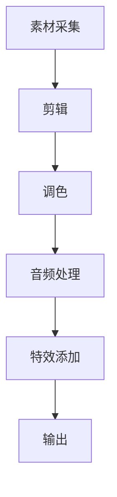

**核心算法原理讲解：**

视频编辑软件通常使用以下算法原理：

- **帧率调整（fps）:** 通过增加或减少视频帧率来控制播放速度。

- **颜色空间转换（color space conversion）:** 将视频的颜色空间从一种格式转换为另一种格式，如YUV到RGB。

**数学模型和公式：**

$$\text{帧率}(fps) = \frac{\text{总帧数}}{\text{总时间}}$$

**举例说明：**

假设一个视频总时长为60秒，包含1800帧，那么其帧率为：

$$\text{帧率}(fps) = \frac{1800}{60} = 30$$

**详细讲解：**

帧率是视频播放流畅度的一个重要指标。不同的视频编辑软件和设备支持的帧率范围不同，因此在编辑时需要根据目标输出设备的要求来调整帧率。

### 1.2 基础剪辑技巧

**核心概念与联系：**

剪辑是将视频素材按照一定的顺序和时间长度进行组合和调整的过程。剪辑技巧包括切割、拼接、时间线调整等。

**Mermaid 流程图：**

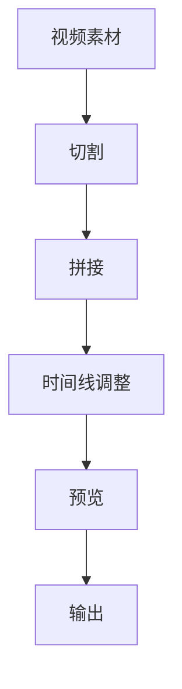

**核心算法原理讲解：**

视频剪辑通常使用以下算法原理：

- **时间线操作（timeline operation）:** 在时间线上对视频素材进行拖拽、剪切、复制、粘贴等操作。

- **轨道管理（track management）:** 管理视频和音频轨道的层次和叠加。

**数学模型和公式：**

剪辑过程中不需要复杂的数学模型，主要依赖于时间管理和轨道操作。

**举例说明：**

假设有一个视频片段，需要将其分成两个部分，并在时间线上重新排列。可以通过以下步骤实现：

1. 选择视频片段。
2. 使用切割工具将视频分成两部分。
3. 将两部分重新排列到时间线上。

**详细讲解：**

基础剪辑技巧是视频编辑的基础，掌握切割、拼接和时间线调整是制作高质量视频的关键。

### 1.3 视频色彩调整与特效添加

**核心概念与联系：**

色彩调整和特效添加是提升视频视觉效果的重要环节。色彩调整包括亮度、对比度、饱和度等调整，特效添加包括滤镜、动画等。

**Mermaid 流程图：**

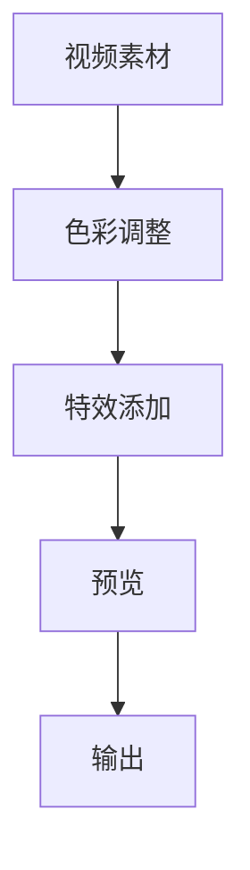

**核心算法原理讲解：**

视频色彩调整和特效添加通常使用以下算法原理：

- **色彩空间调整（color space adjustment）:** 调整视频的亮度、对比度、饱和度等色彩参数。

- **特效合成（effect synthesis）:** 使用各种特效算法对视频进行加工。

**数学模型和公式：**

色彩调整和特效添加主要依赖于色彩理论和图像处理算法。

**举例说明：**

假设需要对一个视频进行色彩调整，使其更加鲜艳。可以通过以下步骤实现：

1. 选择视频素材。
2. 调整亮度、对比度和饱和度。
3. 预览调整后的效果。
4. 输出调整后的视频。

**详细讲解：**

视频色彩调整和特效添加是视频编辑中提升视觉效果的关键技巧，掌握这些技巧可以使视频更加生动和吸引人。

## 第二部分：进阶视频编辑技巧

### 2.1 高级剪辑与特效

**核心概念与联系：**

高级剪辑与特效包括多层剪辑、嵌套剪辑、高级特效制作和视频合成等。

**Mermaid 流程图：**

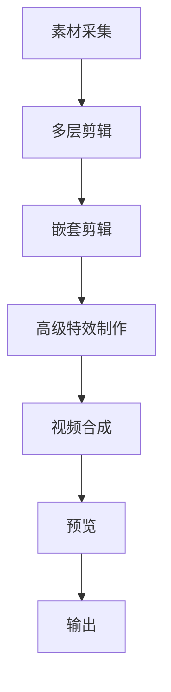

**核心算法原理讲解：**

高级剪辑与特效使用以下算法原理：

- **多层编辑（multi-track editing）:** 在多个轨道上对视频素材进行编辑。

- **嵌套剪辑（nested editing）:** 在剪辑过程中使用嵌套剪辑来创建复杂的剪辑效果。

- **特效合成（effect synthesis）:** 使用各种特效算法进行视频加工。

**数学模型和公式：**

多层剪辑和嵌套剪辑主要依赖于时间管理和轨道操作。

**举例说明：**

假设需要制作一个包含多个视频层的动画效果，可以通过以下步骤实现：

1. 创建多个视频层。
2. 在每个视频层上添加不同的特效。
3. 使用嵌套剪辑技术创建动画效果。
4. 预览并调整效果。
5. 输出最终视频。

**详细讲解：**

高级剪辑与特效可以使视频编辑更加复杂和多样化，掌握这些技巧可以制作出令人印象深刻的作品。

### 2.2 视频转场与动画效果

**核心概念与联系：**

视频转场和动画效果是视频编辑中的重要组成部分，它们可以增强视频的节奏感和视觉吸引力。

**Mermaid 流程图：**

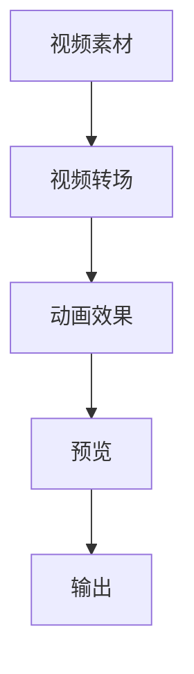

**核心算法原理讲解：**

视频转场和动画效果使用以下算法原理：

- **转场效果（transition effect）:** 在视频之间添加过渡效果。

- **动画效果（animation effect）:** 对视频素材进行动态调整。

**数学模型和公式：**

视频转场和动画效果主要依赖于时间管理和图像处理算法。

**举例说明：**

假设需要在两个视频之间添加一个淡入淡出转场效果，可以通过以下步骤实现：

1. 选择两个视频素材。
2. 在时间线中选择第一个视频的结尾部分。
3. 添加淡入淡出转场效果。
4. 选择第二个视频的开始部分。
5. 添加淡入淡出转场效果。
6. 预览并调整效果。
7. 输出最终视频。

**详细讲解：**

视频转场和动画效果可以增强视频的视觉效果，掌握这些技巧可以使视频编辑更加生动和有趣。

### 2.3 视频调色与色彩管理

**核心概念与联系：**

视频调色和色彩管理是提升视频视觉效果的重要环节，它们可以改变视频的色彩平衡、对比度和饱和度。

**Mermaid 流程图：**

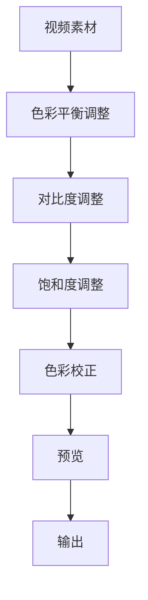

**核心算法原理讲解：**

视频调色和色彩管理使用以下算法原理：

- **色彩平衡调整（color balance adjustment）:** 调整视频的亮度、对比度和饱和度。

- **色彩校正（color correction）:** 对视频的色彩进行精细调整。

**数学模型和公式：**

视频调色和色彩管理主要依赖于色彩理论和图像处理算法。

**举例说明：**

假设需要对一个视频进行色彩校正，使其更加自然，可以通过以下步骤实现：

1. 选择视频素材。
2. 调整色彩平衡，使其更加自然。
3. 调整对比度，增强视觉冲击力。
4. 调整饱和度，提升色彩鲜艳度。
5. 进行色彩校正，修正色彩偏差。
6. 预览并调整效果。
7. 输出最终视频。

**详细讲解：**

视频调色和色彩管理是视频编辑中的重要技巧，掌握这些技巧可以使视频更加美观和吸引人。

## 第三部分：视频编辑软件实战

### 3.1 初识视频编辑软件

**核心概念与联系：**

视频编辑软件是进行视频编辑的工具，不同软件具有不同的特点和功能。

**Mermaid 流程图：**

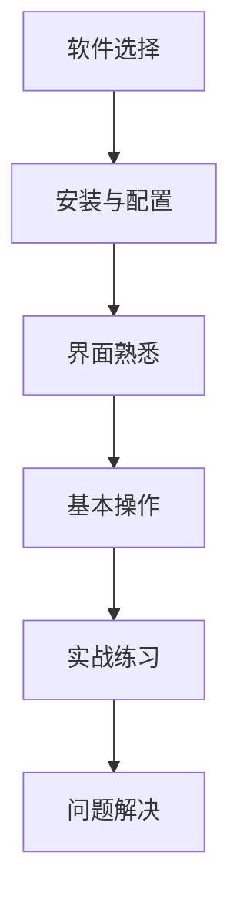

**核心算法原理讲解：**

视频编辑软件主要依赖于用户界面设计和图像处理算法。

**数学模型和公式：**

视频编辑软件的操作主要依赖于用户交互和图像处理。

**举例说明：**

假设需要选择一款适合初学者的视频编辑软件，可以通过以下步骤实现：

1. 研究不同视频编辑软件的特点和功能。
2. 根据需求和预算选择合适的软件。
3. 安装并配置软件。
4. 熟悉软件的界面和基本操作。
5. 进行实战练习，提高编辑技巧。
6. 遇到问题时，查阅教程或寻求帮助。

**详细讲解：**

初识视频编辑软件是学习视频编辑的第一步，选择合适的软件和熟悉基本操作是成功进行视频编辑的关键。

### 3.2 实战案例一：制作简单的短视频

**核心概念与联系：**

短视频制作是视频编辑的基本应用，它包括素材选择、剪辑、特效添加和音频处理等步骤。

**Mermaid 流程图：**

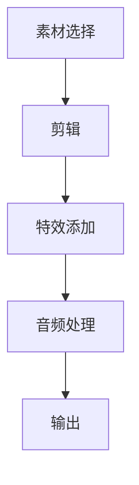

**核心算法原理讲解：**

短视频制作主要依赖于剪辑算法、特效算法和音频处理算法。

**数学模型和公式：**

短视频制作主要依赖于时间管理和图像处理。

**举例说明：**

假设需要制作一个简单的短视频，可以通过以下步骤实现：

1. 选择合适的视频素材。
2. 使用剪辑工具进行剪辑，调整时间线。
3. 添加特效，如转场效果和滤镜。
4. 处理音频，添加背景音乐和音效。
5. 预览并调整效果。
6. 输出最终的短视频。

**详细讲解：**

制作简单的短视频是视频编辑的基础，掌握基本步骤和技巧是进行复杂视频编辑的前提。

### 3.3 实战案例二：制作专业的广告视频

**核心概念与联系：**

广告视频制作是视频编辑的高级应用，它需要更高的创意和技术要求。

**Mermaid 流程图：**

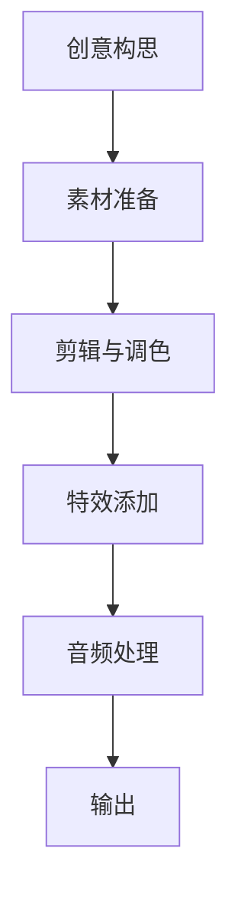

**核心算法原理讲解：**

广告视频制作主要依赖于剪辑算法、特效算法和音频处理算法，同时还需要创意构思和审美能力。

**数学模型和公式：**

广告视频制作主要依赖于时间管理和图像处理。

**举例说明：**

假设需要制作一个专业的广告视频，可以通过以下步骤实现：

1. 进行创意构思，确定视频的主题和风格。
2. 准备视频素材，包括画面和音频。
3. 使用剪辑工具进行剪辑和调色，调整画面色彩和亮度。
4. 添加特效，如动画和滤镜，增强视觉吸引力。
5. 处理音频，添加背景音乐和音效。
6. 预览并调整效果。
7. 输出最终的视频广告。

**详细讲解：**

制作专业的广告视频是视频编辑的高级挑战，需要综合运用各种编辑技巧和创意构思能力。

## 第四部分：视频编辑的进阶技巧

### 4.1 高级音频处理

**核心概念与联系：**

高级音频处理是提升视频质量的重要环节，它包括声音的捕捉、编辑、效果添加等。

**Mermaid 流程图：**

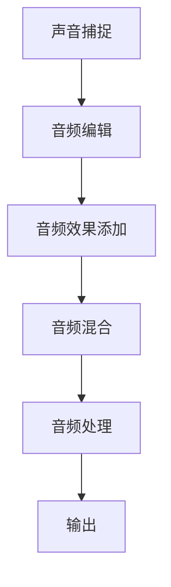

**核心算法原理讲解：**

高级音频处理主要依赖于音频处理算法，如滤波、压缩、混响等。

**数学模型和公式：**

音频处理主要依赖于信号处理算法。

**举例说明：**

假设需要处理一段音频，可以通过以下步骤实现：

1. 捕捉声音素材，如现场录音或音乐。
2. 使用音频编辑工具进行剪辑，调整音量、淡入淡出等。
3. 添加音频效果，如混响、回声等。
4. 进行音频混合，调整各个音轨的平衡。
5. 预览并调整效果。
6. 输出最终的音频文件。

**详细讲解：**

高级音频处理是视频编辑中的重要环节，掌握这些技巧可以提升视频的音质和观看体验。

### 4.2 视频特效的高级应用

**核心概念与联系：**

视频特效的高级应用是提升视频视觉效果的关键，它包括各种特效的制作和调试。

**Mermaid 流程图：**

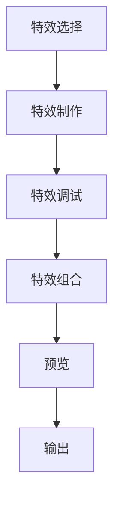

**核心算法原理讲解：**

视频特效的高级应用主要依赖于图像处理算法和特效合成技术。

**数学模型和公式：**

视频特效的高级应用主要依赖于图像处理算法。

**举例说明：**

假设需要制作一个包含多种特效的视频，可以通过以下步骤实现：

1. 选择合适的特效，如粒子效果、动态模糊等。
2. 制作特效，调整参数，使其符合预期效果。
3. 调试特效，确保其在视频中的表现良好。
4. 将多个特效组合在一起，形成复杂的视觉效果。
5. 预览并调整效果。
6. 输出最终的特效视频。

**详细讲解：**

视频特效的高级应用可以大大提升视频的视觉吸引力，掌握这些技巧可以制作出令人惊叹的作品。

### 4.3 视频剪辑的艺术

**核心概念与联系：**

视频剪辑的艺术是视频编辑的高级领域，它涉及到剪辑节奏、画面构图和情感表达等。

**Mermaid 流程图：**

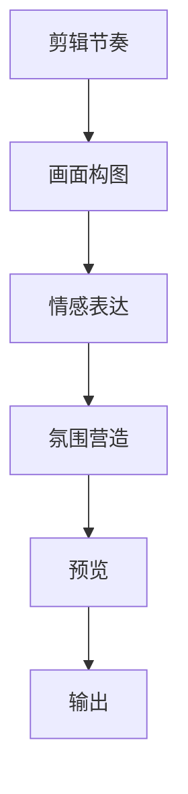

**核心算法原理讲解：**

视频剪辑的艺术主要依赖于剪辑技巧和审美能力。

**数学模型和公式：**

视频剪辑的艺术主要依赖于剪辑节奏和画面构图。

**举例说明：**

假设需要制作一个具有强烈情感表达的视频，可以通过以下步骤实现：

1. 根据视频内容确定剪辑节奏，使其充满活力或安静。
2. 调整画面构图，使其具有视觉吸引力。
3. 通过剪辑和画面切换表达情感，如喜悦、悲伤等。
4. 营造适当的氛围，如使用音乐和特效增强情感表达。
5. 预览并调整效果。
6. 输出最终的视频作品。

**详细讲解：**

视频剪辑的艺术是视频编辑的高级技巧，掌握这些技巧可以使视频更具艺术感和观赏性。

## 第五部分：视频编辑工具与资源

### 5.1 常用视频编辑工具介绍

**核心概念与联系：**

常用视频编辑工具包括Adobe Premiere Pro、Final Cut Pro、DaVinci Resolve等，每种工具都有其独特的特点和功能。

**Mermaid 流程图：**

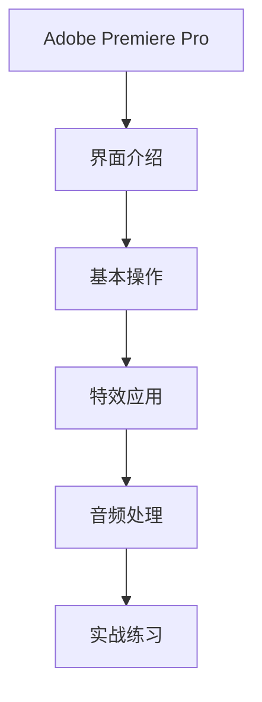

**核心算法原理讲解：**

这些视频编辑工具主要依赖于用户界面设计和图像处理算法。

**数学模型和公式：**

视频编辑工具的操作主要依赖于用户交互和图像处理。

**举例说明：**

假设需要学习Adobe Premiere Pro，可以通过以下步骤实现：

1. 了解其界面和基本操作。
2. 学习剪辑、调色和音频处理等基本技能。
3. 学习特效制作和音频效果添加。
4. 进行实战练习，提高编辑技巧。
5. 解决遇到的问题，查阅教程或寻求帮助。

**详细讲解：**

常用视频编辑工具是视频编辑的重要工具，掌握这些工具的使用可以大大提升视频编辑的效率和质量。

### 5.2 视频编辑资源推荐

**核心概念与联系：**

视频编辑资源包括在线教程、视频素材网站和学习资源，这些资源有助于提高视频编辑技能。

**Mermaid 流程图：**

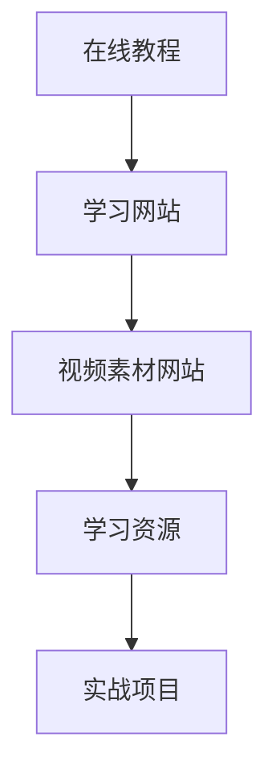

**核心算法原理讲解：**

视频编辑资源主要依赖于网络资源和学习平台。

**数学模型和公式：**

视频编辑资源主要依赖于网络技术和学习策略。

**举例说明：**

假设需要提高视频编辑技能，可以通过以下步骤实现：

1. 寻找优质的在线教程和学习网站。
2. 下载和收集视频素材，为编辑提供丰富的素材库。
3. 利用学习资源进行自我学习和练习。
4. 参与实战项目，提高实际操作能力。
5. 不断总结经验，持续提高技能。

**详细讲解：**

视频编辑资源是学习视频编辑的重要辅助，合理利用这些资源可以事半功倍。

## 附录：视频编辑实用技巧与经验

### 附录1：视频编辑常见问题解答

**核心概念与联系：**

视频编辑常见问题解答包括软件安装、操作错误、性能优化等。

**Mermaid 流程图：**

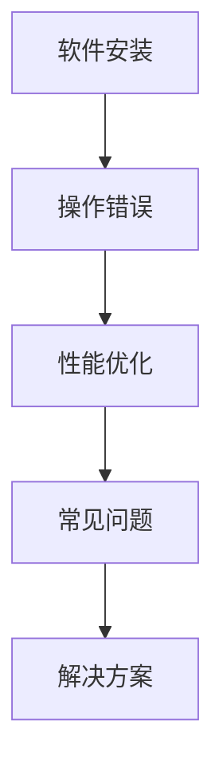

**核心算法原理讲解：**

视频编辑常见问题解答主要依赖于软件技术和用户支持。

**数学模型和公式：**

视频编辑常见问题解答主要依赖于技术支持和用户反馈。

**举例说明：**

假设在视频编辑过程中遇到软件安装错误，可以通过以下步骤解决：

1. 重新下载软件并安装。
2. 检查操作系统版本是否符合要求。
3. 寻求技术支持或查阅教程。
4. 更新软件或操作系统。

**详细讲解：**

视频编辑常见问题解答是解决编辑过程中遇到的问题的重要途径，掌握这些解决方案可以减少编辑过程中的困扰。

### 附录2：视频编辑软件快捷键汇总

**核心概念与联系：**

视频编辑软件快捷键汇总包括各种操作和功能的快捷键，提高编辑效率。

**Mermaid 流程图：**

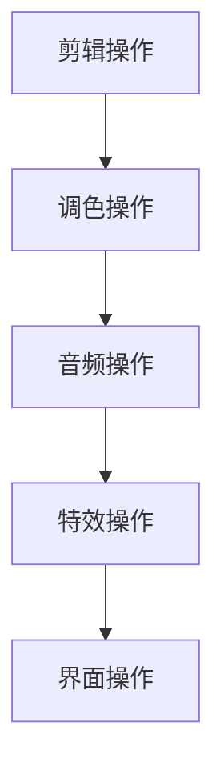

**核心算法原理讲解：**

视频编辑软件快捷键汇总主要依赖于用户界面设计和操作习惯。

**数学模型和公式：**

视频编辑软件快捷键汇总主要依赖于操作效率和用户体验。

**举例说明：**

以下是一些常用的视频编辑软件快捷键：

- **Adobe Premiere Pro:**
  - 剪切：Ctrl + X
  - 复制：Ctrl + C
  - 粘贴：Ctrl + V
  - 撤销：Ctrl + Z
  - 前进：Ctrl + Shift + Z

- **Final Cut Pro:**
  - 剪切：Cmd + X
  - 复制：Cmd + C
  - 粘贴：Cmd + V
  - 撤销：Cmd + Z
  - 前进：Cmd + Shift + Z

**详细讲解：**

视频编辑软件快捷键汇总是提高编辑效率的重要工具，熟练掌握这些快捷键可以大幅提升编辑速度。

### 附录3：视频编辑项目案例解读

**核心概念与联系：**

视频编辑项目案例解读包括实际项目的开发环境搭建、源代码实现和案例分析。

**Mermaid 流�程图：**

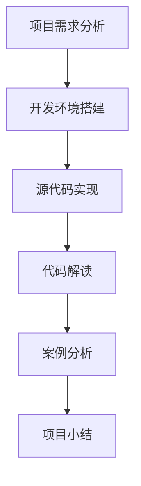

**核心算法原理讲解：**

视频编辑项目案例解读主要依赖于软件开发和项目管理。

**数学模型和公式：**

视频编辑项目案例解读主要依赖于技术方案和项目管理。

**举例说明：**

以下是一个简单的视频编辑项目案例：

**项目需求：** 制作一个简单的视频剪辑软件，支持剪辑、转场、特效添加和音频处理。

**开发环境：** 
- 操作系统：Windows 10
- 编程语言：Python
- 编辑器：PyCharm

**源代码实现：**

```python
# 源代码示例
def clip_video(input_file, output_file):
    # 读取输入视频文件
    video = VideoFileClip(input_file)
    
    # 剪辑视频
    video = video.subclip(0, 10)
    
    # 添加转场效果
    video = video.transition_to_next_frame(duration=5)
    
    # 添加特效
    video = video.overlay(Effect())
    
    # 添加音频
    video = video.audio-cliip().交叉淡化()
    
    # 输出最终视频
    video.write_vide

