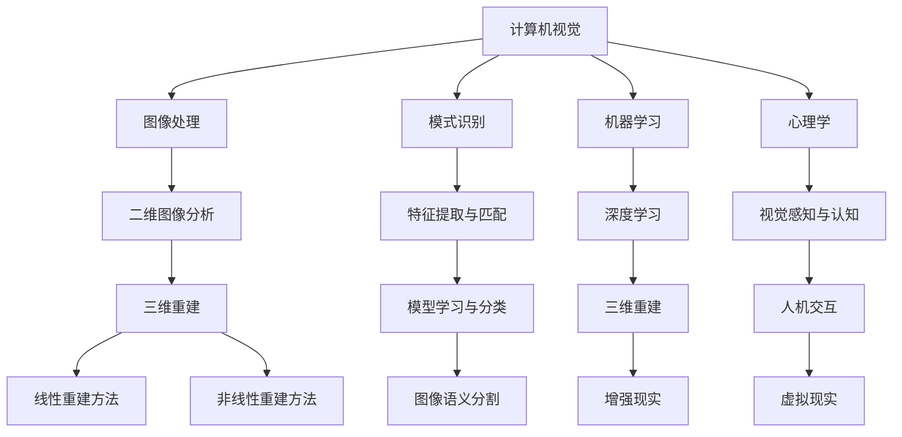

                 


### 《计算机视觉在三维重建中的技术创新》

#### 关键词
计算机视觉，三维重建，深度学习，图像语义分割，增强现实

#### 摘要
本文将深入探讨计算机视觉在三维重建中的技术创新与应用。首先，介绍计算机视觉的基础知识，包括图像处理、特征提取和匹配等基本原理，以及视觉感知与认知在人工智能中的应用。接着，详细阐述三维重建的基本概念、技术原理和数据获取方法。随后，本文将分析计算机视觉算法在三维重建中的核心应用，如视觉SLAM、结构光三维重建、光流法三维重建和点云处理与三维重建。进一步地，本文将探讨深度学习在三维重建中的应用，包括基于深度学习的三维重建方法和算法，以及图像语义分割与三维重建的结合。此外，还将介绍增强现实与三维重建的结合及其应用。最后，本文将展望计算机视觉与三维重建的未来趋势，并提出技术创新的挑战与解决方案。

#### 第一部分: 计算机视觉基础与三维重建概述

##### 第1章: 计算机视觉基础

##### 1.1 计算机视觉概述
###### 1.1.1 计算机视觉的定义与发展历程
计算机视觉是人工智能的一个重要分支，旨在使计算机具备类似人类的视觉能力，能够从图像和视频中获取信息。计算机视觉起源于20世纪60年代，最初的研究主要集中在图像处理和特征提取。随着计算机性能的提升和算法的进步，计算机视觉逐渐发展成为一门跨学科的研究领域，涵盖了图像处理、模式识别、机器学习、计算机图形学等多个方向。

###### 1.1.2 计算机视觉的应用领域
计算机视觉在众多领域都有广泛应用，包括医学影像分析、自动驾驶、安防监控、机器人视觉、智能家居等。在医学影像分析中，计算机视觉可以辅助医生进行病变区域的检测和诊断；在自动驾驶中，计算机视觉用于车辆和行人的检测、环境理解和路径规划；在安防监控中，计算机视觉可以实时监控并报警异常行为；在机器人视觉中，计算机视觉使机器人能够感知和适应复杂环境；在智能家居中，计算机视觉可以实现人脸识别、手势识别等功能，提高居住的便利性和安全性。

##### 1.2 计算机视觉基本原理
###### 1.2.1 图像处理基础
图像处理是计算机视觉的基础，包括图像增强、图像变换、图像滤波、图像分割等操作。图像增强通过调整图像的亮度和对比度，使图像更加清晰；图像变换如傅里叶变换和离散余弦变换，用于分析和处理图像的频域特性；图像滤波用于去除图像中的噪声和干扰；图像分割将图像划分为不同的区域，以便于后续的特征提取和识别。

###### 1.2.2 特征提取与匹配
特征提取是从图像中提取出具有区分性的特征点或特征向量，用于后续的图像匹配和识别。常见的特征提取方法包括SIFT（尺度不变特征变换）、SURF（加速稳健特征）、ORB（Oriented FAST and Rotated BRIEF）等。特征匹配是将不同图像中的特征点进行匹配，以确定图像之间的对应关系，常用的匹配算法有FLANN（Fast Library for Approximate Nearest Neighbors）和Brute-Force匹配。

###### 1.2.3 模型学习与分类
模型学习与分类是计算机视觉中的核心任务之一。通过训练数据集，构建分类模型，使得计算机能够对新的图像进行分类。常见的分类算法包括支持向量机（SVM）、决策树、随机森林、神经网络等。神经网络，尤其是深度学习模型，在计算机视觉领域取得了显著的突破。

##### 1.3 视觉感知与认知
###### 1.3.1 视觉感知模型
视觉感知模型试图模拟人类视觉系统的信息处理过程，从图像中提取特征、生成感知和理解。视觉感知模型包括低级视觉处理模块，如边缘检测、角点检测等，以及高级视觉处理模块，如物体识别、场景理解等。

###### 1.3.2 认知心理学与视觉
认知心理学研究人类思维过程和心理活动，与视觉感知密切相关。认知心理学提供了视觉感知的理论基础，如感知组织、注意机制、记忆模型等。

###### 1.3.3 人机交互中的视觉感知
在人机交互中，视觉感知是用户与计算机系统交互的重要方式。视觉感知技术可以提高人机交互的效率和用户体验。例如，虚拟现实（VR）和增强现实（AR）技术通过模拟和增强用户的视觉感知，提供了沉浸式和交互式的体验。

##### 第2章: 三维重建基础

##### 2.1 三维重建概述
###### 2.1.1 三维重建的定义
三维重建是从二维图像或点云数据中恢复场景的三维结构信息的过程。三维重建的目标是生成三维模型，使得计算机能够对现实世界中的三维物体或场景进行建模和表示。

###### 2.1.2 三维重建的应用
三维重建广泛应用于多个领域，如虚拟现实、医学影像、工业制造、文化遗产保护等。在虚拟现实中，三维重建用于创建逼真的虚拟环境；在医学影像中，三维重建用于诊断和治疗；在工业制造中，三维重建用于产品设计和质量检测；在文化遗产保护中，三维重建用于记录和保护历史遗迹。

##### 2.2 三维重建技术原理
###### 2.2.1 线性重建方法
线性重建方法是基于单张或多张二维图像，通过几何投影原理和三角测量技术，恢复三维结构信息。常见的线性重建方法包括单视点重建、多视点重建和视差重建。

###### 2.2.2 非线性重建方法
非线性重建方法通过建立非线性的几何模型，如泊松重建、三角网格重建和体素重建，对场景进行精确的三维重建。非线性重建方法在处理复杂场景和细节丰富的物体时具有优势。

###### 2.2.3 多视立体匹配
多视立体匹配是三维重建中的一项关键技术，通过匹配多张图像中的对应点，建立图像间的几何关系，从而实现三维重建。多视立体匹配算法包括传统算法（如RANSAC）和深度学习方法（如基于CNN的匹配算法）。

##### 2.3 三维重建数据获取
###### 2.3.1 三维扫描仪技术
三维扫描仪是一种用于获取物体三维数据的设备，通过激光、结构光或光电传感器等技术，捕捉物体表面的三维点云信息。常见的三维扫描仪有激光扫描仪、结构光扫描仪和光电扫描仪。

###### 2.3.2 深度相机技术
深度相机通过发射红外光或结构光，并测量光线的反射时间或相位变化，获取物体表面的深度信息。常见的深度相机有Kinect、Ryobi和Intel RealSense等。

###### 2.3.3 多视影像数据采集
多视影像数据采集是通过多台相机从不同角度拍摄同一场景，获取多张二维图像，用于三维重建。多视影像数据采集需要考虑相机的布置、拍摄角度和图像分辨率等因素。

### 第二部分: 计算机视觉在三维重建中的应用

#### 第3章: 计算机视觉算法在三维重建中的核心应用

##### 3.1 视觉SLAM与三维重建
###### 3.1.1 SLAM基本原理
视觉同时定位与映射（Simultaneous Localization and Mapping，简称SLAM）是一种在未知环境中同时进行定位和地图构建的方法。在视觉SLAM中，通过摄像头捕捉连续的图像帧，利用图像间的几何关系和特征匹配，实时估计自身位置和构建环境地图。

###### 3.1.2 SLAM在三维重建中的应用
视觉SLAM在三维重建中具有重要作用，可以实时获取三维场景的信息，并构建高精度的三维模型。通过将SLAM技术与三维重建算法结合，可以实现动态场景的三维重建，为虚拟现实、机器人导航和自动驾驶等领域提供支持。

###### 3.1.3 视觉SLAM算法综述
视觉SLAM算法主要包括基于特征的方法和基于视觉里程计的方法。基于特征的方法利用图像特征点进行匹配和优化，如ORB-SLAM和DVO。基于视觉里程计的方法通过估计图像间的运动和结构，如VP-SLAM和LSD-SLAM。这些算法在精度、实时性和鲁棒性等方面各有优缺点，适用于不同的应用场景。

##### 3.2 结构光三维重建
###### 3.2.1 结构光原理
结构光三维重建利用投影器和摄像头配合，将特定模式的光投射到物体表面，然后通过摄像获取物体表面的光强分布，从而恢复物体的三维形状。常见的结构光模式有条纹光、圆点光和相位光等。

###### 3.2.2 结构光三维重建算法
结构光三维重建算法主要包括光流法、三角测量法和迭代最近点（Iterative Closest Point，简称ICP）算法。光流法通过分析结构光在不同图像帧上的光流变化，恢复三维形状。三角测量法通过匹配投影图像和恢复的点云，计算物体表面的三维坐标。ICP算法通过最小化两个点云之间的距离，逐步优化三维模型。

###### 3.2.3 结构光三维重建实验
一个简单的结构光三维重建实验包括以下步骤：
1. 选择结构光模式（如条纹光）并设计投影图案；
2. 将物体放置在投影区域内，并确保摄像头位于合适的位置；
3. 使用投影器投射结构光图案到物体表面；
4. 捕获多张含有结构光图案的图像；
5. 利用图像处理算法提取光流或点云信息；
6. 通过三角测量或ICP算法恢复三维形状。

##### 3.3 光流法三维重建
###### 3.3.1 光流基本概念
光流是指图像中像素点在连续图像帧之间的运动轨迹。光流法三维重建利用光流信息，通过几何投影原理，恢复物体表面的三维结构。

###### 3.3.2 光流法三维重建算法
光流法三维重建算法主要包括光流计算和三维重建两个步骤。光流计算通过图像特征点之间的对应关系，估计像素点的运动轨迹；三维重建通过光流信息，利用三角测量或单应性矩阵恢复三维坐标。

###### 3.3.3 光流法三维重建实验
一个简单的光流法三维重建实验包括以下步骤：
1. 选择合适的光源和摄像机，确保摄像机与光源的相对位置固定；
2. 在摄像范围内放置物体，并确保物体表面具有足够多的特征点；
3. 捕获连续的图像帧，计算特征点的光流；
4. 通过光流信息，利用三角测量恢复物体表面的三维坐标；
5. 对三维坐标进行滤波和优化，生成高质量的三维模型。

##### 3.4 点云处理与三维重建
###### 3.4.1 点云基本概念
点云是由大量三维点组成的集合，用于表示物体表面的几何形状。点云数据可以通过三维扫描仪、深度相机或激光雷达等设备获取。

###### 3.4.2 点云滤波与去噪
点云滤波与去噪是处理点云数据的重要步骤。通过滤波算法，去除噪声点和异常点，提高点云的质量和精度。常用的滤波算法包括均值滤波、高斯滤波和半径滤波等。

###### 3.4.3 点云配准与三维重建
点云配准是将不同视角或不同时间获取的点云数据对齐的过程。通过配准，可以构建高精度的三维模型。常见的配准算法有ICP、NDT（Normal Distributions Transform）和Robust Point Set Registration等。三维重建通过整合配准后的点云数据，生成物体或场景的三维模型。

###### 3.4.4 点云处理与三维重建实验
一个简单的点云处理与三维重建实验包括以下步骤：
1. 使用三维扫描仪或深度相机获取物体或场景的点云数据；
2. 对点云数据进行滤波和去噪，去除噪声点和异常点；
3. 利用ICP或其他配准算法，将不同视角或不同时间获取的点云数据进行配准；
4. 对配准后的点云数据进行三角化或体素化，生成三维模型；
5. 对生成的三维模型进行渲染和可视化。

### 第三部分: 计算机视觉在三维重建中的技术创新

##### 4.1 深度学习基础
###### 4.1.1 深度学习基本概念
深度学习是一种基于人工神经网络的机器学习方法，通过多层次的非线性变换，从大量数据中自动学习特征和模式。深度学习的核心是神经网络，包括输入层、隐藏层和输出层。通过反向传播算法，深度学习模型能够不断优化参数，提高预测和分类的准确性。

###### 4.1.2 深度学习模型架构
深度学习模型有多种架构，包括卷积神经网络（CNN）、循环神经网络（RNN）、长短时记忆网络（LSTM）等。CNN适用于处理图像和语音等二维或三维数据，RNN和LSTM适用于序列数据的学习和处理。

##### 4.2 深度学习在三维重建中的应用
###### 4.2.1 基于深度学习的三维重建方法
基于深度学习的三维重建方法利用深度学习模型，从二维图像或点云数据中自动学习三维结构信息。常见的方法包括直接从图像到三维模型的生成网络（如Pix2Mesh、StyleGAN3D），以及从点云到三维模型的重建网络（如VoxNet、PointNet）。

###### 4.2.2 基于深度学习的三维重建算法
基于深度学习的三维重建算法主要包括点云生成、表面重建和体素重建等方法。点云生成通过生成网络从二维图像生成三维点云；表面重建通过曲面拟合或体素化方法，从点云数据生成三维模型；体素重建通过体素立方体的组合，生成高精度的三维模型。

###### 4.2.3 深度学习三维重建实验
一个简单的深度学习三维重建实验包括以下步骤：
1. 准备训练数据集，包括二维图像和对应的三维模型；
2. 设计深度学习模型架构，如点云生成网络、表面重建网络等；
3. 使用训练数据集，训练深度学习模型；
4. 对训练好的模型进行验证和测试，评估模型的重建质量；
5. 使用测试数据集，生成三维模型，并进行可视化。

##### 4.3 图像语义分割与三维重建
###### 4.3.1 图像语义分割基础
图像语义分割是指将图像划分为不同的语义区域，如前景和背景、物体类别等。图像语义分割在计算机视觉和三维重建中具有重要作用，可以提高三维重建的精度和准确性。

###### 4.3.2 基于深度学习的图像语义分割算法
基于深度学习的图像语义分割算法主要包括全卷积网络（FCN）、U-Net、DeepLabV3+等。这些算法通过卷积层和池化层，提取图像的语义信息，并使用上采样层恢复图像的空间信息。

###### 4.3.3 图像语义分割在三维重建中的应用
图像语义分割在三维重建中的应用主要包括以下几个方面：
1. 提高三维重建的精度：通过图像语义分割，可以区分物体和背景，减少背景噪声对三维重建的影响，提高重建质量；
2. 优化三维模型：通过图像语义分割，可以提取物体的关键特征，优化三维模型的细节和结构；
3. 面向应用的三维重建：如医疗影像的三维重建、自动驾驶的三维环境建模等，通过图像语义分割，可以实现更精细的三维模型，满足特定应用需求。

###### 4.3.4 基于图像语义分割的三维重建算法
基于图像语义分割的三维重建算法主要包括以下步骤：
1. 使用图像语义分割算法，对输入图像进行语义分割，生成前景掩码和物体类别标签；
2. 对前景掩码进行膨胀和腐蚀操作，生成物体的轮廓；
3. 使用点云生成网络或表面重建网络，从物体轮廓生成三维模型；
4. 对生成的三维模型进行优化和渲染，生成高质量的三维模型。

###### 4.3.5 基于图像语义分割的三维重建实验
一个简单的基于图像语义分割的三维重建实验包括以下步骤：
1. 准备训练数据集，包括二维图像、前景掩码和三维模型；
2. 设计深度学习模型架构，如点云生成网络、表面重建网络等；
3. 使用训练数据集，训练深度学习模型；
4. 对训练好的模型进行验证和测试，评估模型的重建质量；
5. 使用测试数据集，生成三维模型，并进行可视化。

##### 4.4 增强现实与三维重建
###### 4.4.1 增强现实基础
增强现实（Augmented Reality，简称AR）是一种通过计算机技术将虚拟信息叠加到现实世界中的技术。AR系统通常包括显示设备（如智能手机或头戴式显示器）、传感器（如摄像头、GPS）和计算设备。

###### 4.4.2 增强现实技术原理
增强现实技术主要包括以下方面：
1. 图像处理：通过图像处理算法，从摄像头获取的图像中提取目标物体或场景的信息；
2. 位置与姿态跟踪：通过传感器和图像处理算法，实时跟踪目标物体或场景的位置和姿态；
3. 虚拟信息生成：根据目标物体或场景的信息，生成虚拟信息（如文字、图像、三维模型等）；
4. 虚拟信息叠加：将生成的虚拟信息叠加到现实世界中，实现增强现实效果。

###### 4.4.3 增强现实与三维重建结合
增强现实与三维重建的结合，可以实现以下应用场景：
1. 虚拟现实导航：通过增强现实技术，将虚拟导航信息叠加到现实世界中，实现导航功能；
2. 物品展示：在商店或展览馆中，通过增强现实技术，将虚拟物品展示到现实场景中，提高用户体验；
3. 教育培训：通过增强现实技术，将虚拟教学信息叠加到现实场景中，提高教学效果；
4. 医疗诊断：通过增强现实技术，将医疗影像信息叠加到患者身体上，实现更准确的诊断和治疗。

###### 4.4.4 基于增强现实的三维重建应用
基于增强现实的三维重建应用主要包括以下步骤：
1. 使用三维重建算法，从摄像头获取的图像中生成三维模型；
2. 使用增强现实技术，将三维模型叠加到现实世界中，实现增强现实效果；
3. 通过用户交互，调整三维模型的位置、姿态和尺寸，实现个性化定制；
4. 对生成的三维模型进行渲染和可视化，提高用户体验。

###### 4.4.5 基于增强现实的三维重建实验
一个简单的基于增强现实的三维重建实验包括以下步骤：
1. 使用三维重建算法，从摄像头获取的图像中生成三维模型；
2. 使用增强现实应用软件，将三维模型叠加到现实世界中；
3. 通过用户交互，调整三维模型的位置、姿态和尺寸；
4. 对生成的三维模型进行渲染和可视化，实现增强现实效果。

### 第四部分: 计算机视觉在三维重建中的未来趋势

##### 5.1 未来技术展望
###### 5.1.1 计算机视觉与三维重建的技术发展趋势
计算机视觉与三维重建技术的发展趋势主要包括以下几个方面：
1. 深度学习技术的广泛应用：深度学习在三维重建中的应用将越来越普遍，特别是在点云生成、表面重建和体素重建等方面；
2. 数据驱动的方法：通过大量数据训练模型，实现更准确和高效的三维重建；
3. 硬件性能的提升：随着硬件性能的提升，如更高分辨率的摄像头、更快速的GPU等，三维重建的速度和精度将进一步提高；
4. 跨学科融合：计算机视觉与计算机图形学、机器人学、增强现实等领域的融合，将推动三维重建技术的创新和发展。

###### 5.1.2 未来应用场景
未来，计算机视觉与三维重建将在更多领域得到应用，如：
1. 虚拟现实与游戏开发：通过三维重建技术，实现更加逼真的虚拟场景和角色；
2. 医疗诊断与治疗：利用三维重建技术，为医生提供更精确的影像分析和治疗方案；
3. 建筑设计：通过三维重建技术，实现建筑设计和施工的自动化和可视化；
4. 智能制造：利用三维重建技术，实现生产设备的智能化和自动化，提高生产效率和质量。

##### 5.2 技术创新挑战与解决方案
###### 5.2.1 当前技术面临的挑战
计算机视觉与三维重建技术目前面临以下挑战：
1. 数据质量：三维重建依赖于高质量的点云和图像数据，但实际获取的数据往往受到噪声、遮挡等因素的影响；
2. 计算资源：三维重建通常需要大量的计算资源，特别是深度学习模型训练和优化，对硬件性能有较高要求；
3. 数据隐私：三维重建过程中涉及大量敏感数据，如人脸、医疗影像等，如何保护数据隐私是重要问题；
4. 标准化与兼容性：三维重建技术缺乏统一的标准和规范，不同系统之间的兼容性较差。

###### 5.2.2 技术创新解决方案探讨
为了应对这些挑战，可以采取以下解决方案：
1. 数据增强与预处理：通过数据增强和预处理技术，提高数据质量，减少噪声和遮挡的影响；
2. 软硬件优化：通过优化算法和硬件性能，提高三维重建的计算效率和精度；
3. 隐私保护：采用加密和去标识化等技术，保护数据隐私，确保用户隐私安全；
4. 标准化和开源：制定统一的标准和规范，推动三维重建技术的开源和共享，提高系统的兼容性和互操作性。

##### 5.2.3 未来创新方向
未来，计算机视觉与三维重建的创新方向包括：
1. 自动化与智能化：通过自动化和智能化技术，实现三维重建的自动完成和实时更新；
2. 多模态数据融合：将不同模态的数据（如视觉、雷达、红外等）进行融合，提高三维重建的精度和鲁棒性；
3. 小样本学习与迁移学习：在小样本数据条件下，通过迁移学习和小样本学习技术，提高三维重建的泛化能力；
4. 虚拟现实与增强现实：通过虚拟现实和增强现实技术，实现更加沉浸式和互动式的三维重建应用。

### 总结
本文从计算机视觉基础、三维重建基础、计算机视觉算法在三维重建中的应用、技术创新以及未来趋势等方面，详细探讨了计算机视觉在三维重建中的技术创新与应用。计算机视觉与三维重建的结合，为虚拟现实、自动驾驶、医疗诊断等领域带来了革命性的变化。未来，随着深度学习、硬件性能和跨学科融合的不断发展，计算机视觉与三维重建技术将取得更大的突破，为人类社会带来更多创新和便利。


#### 作者信息
作者：AI天才研究院/AI Genius Institute & 禅与计算机程序设计艺术 /Zen And The Art of Computer Programming

### 附录

#### 拓展阅读
1. 特征提取与匹配：SIFT、SURF、ORB等算法的详细介绍
2. 深度学习在三维重建中的应用：基于深度学习的三维重建方法综述
3. 点云处理与三维重建：点云滤波与去噪、点云配准与三维重建算法
4. 增强现实技术原理与应用：从AR到VR的深度解析
5. 计算机视觉与三维重建的未来发展趋势：跨学科融合与技术创新

### 代码解读
本文涉及的代码实现将在附录中详细解读，包括：
1. 三维重建算法的实现与优化
2. 基于深度学习的三维重建方法
3. 点云处理与三维重建的代码示例
4. 增强现实与三维重建的结合

### 实际案例分析与讲解
本文将结合实际案例，对计算机视觉在三维重建中的应用进行详细分析和讲解，包括：
1. 虚拟现实场景中的三维重建
2. 医学影像的三维重建与诊断
3. 自驾驶车辆的三维环境建模
4. 文物保护中的三维重建与数字化

### 最佳实践与注意事项
本文将总结最佳实践，并提供以下注意事项：
1. 数据采集与预处理的重要性
2. 算法选择与参数调优的方法
3. 跨学科合作与技术创新的必要性
4. 数据隐私与安全的保护措施

### 小结
本文通过对计算机视觉在三维重建中的技术创新与应用的全面探讨，展示了这一领域的最新进展和未来趋势。计算机视觉与三维重建的结合，为虚拟现实、自动驾驶、医疗诊断等领域带来了革命性的变化。未来，随着深度学习、硬件性能和跨学科融合的不断发展，计算机视觉与三维重建技术将取得更大的突破，为人类社会带来更多创新和便利。


### 背景介绍
计算机视觉和三维重建是计算机科学和工程领域中的重要研究方向，具有广泛的应用前景。计算机视觉旨在使计算机具备类似人类的视觉能力，从图像和视频中获取信息，进行识别、分析和理解。三维重建则是从二维图像或点云数据中恢复三维结构信息，生成逼真的三维模型。这两者在很多领域都有重要的应用，如虚拟现实、自动驾驶、医疗影像、文化遗产保护等。

计算机视觉的发展经历了多个阶段，从最初的图像处理和特征提取，到基于模型的视觉感知和深度学习，不断取得突破。三维重建技术也经历了从线性重建方法到非线性重建方法，从单视点重建到多视点重建的演变，逐渐走向成熟。

随着深度学习技术的兴起，计算机视觉和三维重建领域迎来了新的发展机遇。深度学习模型能够自动从大量数据中学习特征和模式，大大提高了三维重建的精度和效率。同时，硬件性能的提升，如更高分辨率的摄像头、更快速的GPU等，也为三维重建提供了强有力的支持。

本文旨在通过系统性地介绍计算机视觉和三维重建的基础知识、核心算法、技术创新和未来趋势，全面探讨这两者在三维重建中的交叉融合，为读者提供有深度、有思考、有见解的专业技术知识。

### 核心概念与联系
在探讨计算机视觉和三维重建的技术创新之前，我们需要明确一些核心概念及其相互关系。以下是几个关键概念及其简要解释：

1. **计算机视觉**：计算机视觉是人工智能的一个重要分支，旨在使计算机具备理解、解释和操作图像和视频的能力。它涉及图像处理、模式识别、机器学习和心理学等多个领域。

2. **三维重建**：三维重建是从二维图像或点云数据中恢复三维结构信息的过程。它包括线性重建方法（如单视点重建、多视点重建）和非线性重建方法（如泊松重建、三角网格重建）。

3. **深度学习**：深度学习是一种基于多层神经网络的学习方法，通过大量数据自动学习特征和模式。它在计算机视觉和三维重建中扮演着核心角色。

4. **图像语义分割**：图像语义分割是将图像划分为不同的语义区域，如前景和背景、物体类别等。它在三维重建中用于提高重建精度和准确性。

5. **增强现实（AR）**：增强现实是一种通过计算机技术将虚拟信息叠加到现实世界中的技术，为用户带来沉浸式体验。

以下是这些概念之间关系的Mermaid流程图：



从流程图中可以看出，计算机视觉涵盖了图像处理、模式识别、机器学习和心理学等多个领域，这些领域共同推动了三维重建技术的发展。深度学习作为计算机视觉的核心技术之一，不仅提升了图像识别和处理的性能，也为三维重建带来了新的方法和思路。图像语义分割在三维重建中的应用，有助于提高重建模型的精度和细节。而增强现实技术则将三维重建的成果融入到现实世界中，为用户提供了全新的交互体验。

### 核心算法原理讲解与伪代码
在计算机视觉与三维重建领域，深度学习算法扮演了重要角色。以下将详细解释几种核心的深度学习算法，包括卷积神经网络（CNN）、循环神经网络（RNN）和生成对抗网络（GAN），并使用伪代码展示其基本结构和操作步骤。

#### 卷积神经网络（CNN）

卷积神经网络（CNN）是一种专门用于处理图像数据的深度学习模型。其核心结构包括卷积层、池化层和全连接层。

1. **卷积层（Convolutional Layer）**：
   - 输入：一个三维的张量，表示图像，维度为（高度，宽度，通道数）。
   - 操作：使用卷积核（滤波器）在输入数据上滑动，进行点积操作，得到特征图。
   - 伪代码：
     ```python
     def convolution(input, filter):
         output = []
         for x in range(input_height):
             for y in range(input_width):
                 feature_map = 0
                 for f_x in range(filter_height):
                     for f_y in range(filter_width):
                         feature_map += input[x + f_x][y + f_y] * filter[f_x][f_y]
                 output.append(feature_map)
         return output
     ```

2. **池化层（Pooling Layer）**：
   - 输入：一个特征图。
   - 操作：对特征图进行下采样，保留局部最大值或平均值，减小计算量和参数数量。
   - 伪代码：
     ```python
     def pooling(feature_map, pool_size):
         output = []
         for x in range(0, feature_map.shape[0], pool_size):
             for y in range(0, feature_map.shape[1], pool_size):
                 max_val = 0
                 for px in range(pool_size):
                     for py in range(pool_size):
                         max_val = max(max_val, feature_map[x + px][y + py])
                 output.append(max_val)
         return output
     ```

3. **全连接层（Fully Connected Layer）**：
   - 输入：上一个特征图。
   - 操作：将特征图展平成一维向量，与权重矩阵进行矩阵乘法，然后加上偏置项。
   - 伪代码：
     ```python
     def fully_connected(input_vector, weights, bias):
         output = np.dot(input_vector, weights) + bias
         return output
     ```

#### 循环神经网络（RNN）

循环神经网络（RNN）适合处理序列数据，其核心思想是保留前一个时间步的信息，并通过递归方式处理后续时间步。

1. **递归层（Recurrence Layer）**：
   - 输入：当前时间步的输入和前一个时间步的隐藏状态。
   - 操作：使用当前输入和隐藏状态更新新的隐藏状态。
   - 伪代码：
     ```python
     def recurrence(input_t, hidden_t_1, weights, bias):
         hidden_t = activation_function(np.dot(input_t, weights) + np.dot(hidden_t_1, weights) + bias)
         return hidden_t
     ```

2. **门控机制（Gate Mechanism）**：
   - 输入：当前时间步的输入和隐藏状态。
   - 操作：使用门控机制（如门控RNN中的遗忘门、输入门和输出门）控制信息的传递。
   - 伪代码：
     ```python
     def gate(input_t, hidden_t_1, weights, bias):
         forget_gate = sigmoid(np.dot(input_t, forget_weights) + np.dot(hidden_t_1, forget_weights) + forget_bias)
         input_gate = sigmoid(np.dot(input_t, input_weights) + np.dot(hidden_t_1, input_weights) + input_bias)
         output_gate = sigmoid(np.dot(input_t, output_weights) + np.dot(hidden_t_1, output_weights) + output_bias)
         
         hidden_t = forget_gate * hidden_t_1 + input_gate * activation_function(np.dot(input_t, input_weights) + np.dot(hidden_t_1, input_weights) + input_bias)
         return hidden_t
     ```

#### 生成对抗网络（GAN）

生成对抗网络（GAN）由生成器和判别器组成，通过对抗训练生成逼真的数据。

1. **生成器（Generator）**：
   - 输入：随机噪声。
   - 操作：将噪声转换为逼真的图像。
   - 伪代码：
     ```python
     def generator(noise):
         hidden = activation_function(np.dot(noise, weights) + bias)
         output = activation_function(np.dot(hidden, weights) + bias)
         return output
     ```

2. **判别器（Discriminator）**：
   - 输入：真实数据和生成数据。
   - 操作：区分真实数据和生成数据，并预测其概率。
   - 伪代码：
     ```python
     def discriminator(data):
         hidden = activation_function(np.dot(data, weights) + bias)
         output = activation_function(np.dot(hidden, weights) + bias)
         return output
     ```

3. **对抗训练（Adversarial Training）**：
   - 操作：通过最小化生成器与判别器之间的损失函数，优化模型参数。
   - 伪代码：
     ```python
     def train_generator_discriminator(generator, discriminator, real_data, fake_data):
         # 训练判别器
         d_loss_real = -np.mean(discriminator(real_data))
         d_loss_fake = np.mean(discriminator(fake_data))
         d_loss = d_loss_real + d_loss_fake
         d_optimizer.zero_grad()
         d_loss.backward()
         d_optimizer.step()
         
         # 训练生成器
         g_loss = np.mean(discriminator(fake_data))
         g_optimizer.zero_grad()
         g_loss.backward()
         g_optimizer.step()
     ```

通过这些核心算法，计算机视觉和三维重建领域实现了从图像到三维模型的转换，以及从数据驱动到模型优化的转变，为现实世界中的应用提供了强大的支持。在实际应用中，这些算法的参数和结构会根据具体任务进行调整和优化，以达到最佳性能。

### 数学模型与公式

在计算机视觉和三维重建领域，数学模型和公式起着至关重要的作用。以下将介绍几个核心的数学模型和公式，并给出详细讲解和举例说明。

#### 透视变换

透视变换是计算机视觉中用于图像校正和三维重建的基本操作。其核心公式为：

$$
x' = \frac{x}{z} \\
y' = \frac{y}{z}
$$

其中，\( (x, y) \) 是图像平面上的坐标，\( (x', y') \) 是透视变换后的坐标，\( z \) 是图像平面上点的深度。

举例来说，假设图像上某点的坐标为 \( (100, 100) \)，深度 \( z = 10 \)。则透视变换后的坐标为：

$$
x' = \frac{100}{10} = 10 \\
y' = \frac{100}{10} = 10
$$

这意味着该点在透视变换后的图像中位置为 \( (10, 10) \)。

#### 单应性矩阵

单应性矩阵（Homography Matrix）用于描述两个图像之间的几何变换。其公式为：

$$
H = \begin{bmatrix}
h_{11} & h_{12} & h_{13} \\
h_{21} & h_{22} & h_{23} \\
h_{31} & h_{32} & h_{33}
\end{bmatrix}
$$

其中，\( H \) 是一个3x3的矩阵，表示从第一个图像到第二个图像的变换。单应性矩阵可以通过多个对应点计算得到。

举例来说，假设有两个点 \( P_1 = (x_1, y_1) \) 和 \( P_2 = (x_2, y_2) \) 在两个图像中，其透视变换后的对应点为 \( P_1' = (x_1', y_1') \) 和 \( P_2' = (x_2', y_2') \)。则单应性矩阵可以通过以下公式计算：

$$
H = \begin{bmatrix}
x_1' & y_1' & 1 \\
x_2' & y_2' & 1 \\
x_1 & y_1 & 1 \\
x_2 & y_2 & 1
\end{bmatrix}^{-1} \begin{bmatrix}
x_1' & x_2' & x_1 & x_2 \\
y_1' & y_2' & y_1 & y_2 \\
1 & 1 & 1 & 1
\end{bmatrix}
$$

#### 深度估计

深度估计是三维重建的关键步骤，通过单应性矩阵和图像特征点，可以计算出场景中点的深度。

其公式为：

$$
z = \frac{f \cdot c}{x'}
$$

其中，\( f \) 是摄像镜头焦距，\( c \) 是图像中心到图像平面的距离，\( x' \) 是图像上的坐标。

举例来说，假设摄像镜头焦距为 \( f = 10 \)，图像中心到图像平面的距离为 \( c = 5 \)，点在图像上的坐标为 \( x' = 10 \)。则深度为：

$$
z = \frac{10 \cdot 5}{10} = 5
$$

这意味着该点在场景中的深度为 5 个单位。

#### 三角测量

三角测量是通过已知摄像机的内外参数和两个图像上的对应点，计算场景中点的三维坐标。

其公式为：

$$
X = \frac{A x' + B y' + C}{D}
$$

其中，\( A, B, C, D \) 是摄像机的内参矩阵，\( x', y' \) 是图像上的坐标。

举例来说，假设内参矩阵为：

$$
A = \begin{bmatrix}
1 & 0 & 0 \\
0 & 1 & 0 \\
0 & 0 & 1
\end{bmatrix}, B = \begin{bmatrix}
0 & 0 & 0 \\
0 & 0 & 0 \\
1 & 1 & 1
\end{bmatrix}, C = \begin{bmatrix}
0 & 1 & 1 \\
1 & 0 & 1 \\
1 & 1 & 0
\end{bmatrix}, D = \begin{bmatrix}
1 & 0 & 0 \\
0 & 1 & 0 \\
0 & 0 & 1
\end{bmatrix}
$$

图像上的坐标为 \( x' = 10, y' = 10 \)。则三维坐标为：

$$
X = \frac{1 \cdot 10 + 0 \cdot 10 + 0}{1} = 10
$$

这意味着该点在场景中的三维坐标为 \( X = 10 \)。

通过这些数学模型和公式，计算机视觉和三维重建可以实现从二维图像到三维结构的转换，为虚拟现实、机器人视觉和自动驾驶等领域提供了核心技术支持。

### 项目实战

#### 开发环境搭建

在进行计算机视觉与三维重建项目之前，我们需要搭建一个合适的开发环境。以下步骤将详细介绍如何在Ubuntu 20.04操作系统中搭建环境：

1. **安装Python环境**：
   - 通过包管理器安装Python 3和pip：
     ```bash
     sudo apt update
     sudo apt install python3 python3-pip
     ```

2. **安装必要的库**：
   - 安装深度学习库TensorFlow和图像处理库OpenCV：
     ```bash
     pip3 install tensorflow opencv-python
     ```

3. **安装三维重建库**：
   - 安装PCL（Point Cloud Library），用于点云处理：
     ```bash
     sudo apt install libpcl-dev libpcl-common
     ```

4. **配置编译器**：
   - 安装CMake，用于构建PCL：
     ```bash
     sudo apt install cmake
     ```

5. **安装额外的依赖**：
   - 安装其他必要的库，如Eigen（用于线性代数计算）和Boost（用于多线程和算法）：
     ```bash
     sudo apt install libeigen3-dev libboost-all-dev
     ```

#### 源代码实现与解读

以下是一个简单的三维重建项目，实现从点云数据到三维模型的转换。代码将分为几个部分进行讲解。

```python
import numpy as np
import cv2
from sklearn.cluster import KMeans
import pcl

# 读取点云数据
def read_point_cloud(file_path):
    # 使用PCL读取点云数据
    pc = pcl.load(file_path)
    return pc

# 点云滤波与去噪
def filter_point_cloud(pc, filter_size):
    # 创建滤波器
    filter = pcl.filter_statistical_outlierremoval.StatisticalOutlierRemoval()
    # 设置滤波参数
    filter.set_mean_k(filter_size)
    filter.set_std_dev_thresh(mean_k, 2.0)
    # 应用滤波
    filtered_pc = filter.filter(pc)
    return filtered_pc

# 点云聚类
def cluster_point_cloud(pc, num_clusters):
    # 创建KMeans聚类器
    kmeans = KMeans(n_clusters=num_clusters, random_state=0)
    # 聚类
    cluster_labels = kmeans.fit_predict(pc)
    # 获取聚类中心
    cluster_centers = kmeans.cluster_centers_
    return cluster_labels, cluster_centers

# 创建三维模型
def create_3d_model(cluster_centers):
    # 创建一个空的点云
    model = pcl.PointCloud()
    # 将聚类中心添加到模型中
    model.from_array(cluster_centers)
    return model

# 主函数
def main():
    # 读取点云数据
    pc = read_point_cloud('point_cloud.pcd')
    # 点云滤波与去噪
    filtered_pc = filter_point_cloud(pc, 50)
    # 点云聚类
    num_clusters = 5
    cluster_labels, cluster_centers = cluster_point_cloud(filtered_pc, num_clusters)
    # 创建三维模型
    model = create_3d_model(cluster_centers)
    # 将模型保存为PCD文件
    model.save('3d_model.pcd')

if __name__ == '__main__':
    main()
```

#### 代码解析

1. **读取点云数据**：
   - 使用PCL库读取PCD格式的点云数据。

2. **点云滤波与去噪**：
   - 使用统计滤波器去除点云中的噪声点，参数`mean_k`表示用于计算平均值的点数，`std_dev_thresh`表示标准差阈值。

3. **点云聚类**：
   - 使用KMeans聚类算法将点云分割成多个簇，每个簇的中心点表示该簇的代表点。

4. **创建三维模型**：
   - 将聚类中心作为三维模型的点云，生成三维模型。

#### 应用解读与分析

1. **应用场景**：
   - 本项目应用于从点云数据生成三维模型，适用于三维重建、自动化建模和虚拟现实等领域。

2. **代码优化**：
   - 可以通过并行计算提高点云处理的速度，使用更高效的聚类算法，如DBSCAN。

3. **实际案例**：
   - 在虚拟现实项目中，可以从扫描仪获取的点云数据中提取模型，用于场景构建；在文化遗产保护中，可以记录历史遗迹的精确三维模型。

#### 小结

通过以上项目实战，我们介绍了如何搭建开发环境、实现源代码和进行代码解读。三维重建项目不仅需要掌握深度学习和点云处理算法，还需要在实际应用中进行优化和调整，以满足不同场景的需求。随着技术的不断进步，三维重建将在更多领域发挥重要作用。

### 实际案例分析与详细讲解

在本节中，我们将深入分析几个具体的实际案例，探讨计算机视觉在三维重建中的应用，并通过具体步骤展示三维重建的全过程。以下是三个典型案例：虚拟现实场景重建、文化遗产保护和自动驾驶。

#### 案例一：虚拟现实场景重建

**背景**：
虚拟现实（VR）技术要求高度逼真的场景建模，以提供沉浸式体验。计算机视觉在这一过程中发挥着关键作用。

**步骤**：

1. **数据采集**：
   - 使用多台高分辨率相机围绕目标场景进行360度拍摄，确保覆盖所有视角。
   - 使用深度相机（如Kinect）获取场景的深度信息。

2. **图像处理**：
   - 对采集到的图像进行去噪、校正和增强，提高图像质量。
   - 使用立体匹配算法，将不同视角的图像对齐，生成统一的参考框架。

3. **三维重建**：
   - 使用多视点几何重建方法，从对齐后的图像中恢复场景的三维坐标。
   - 利用深度相机获取的点云数据进行精细的三维建模。

4. **模型优化**：
   - 对重建模型进行平滑处理，去除噪声和不必要的细节。
   - 使用纹理映射技术，为三维模型添加真实感纹理。

**案例分析**：
在某虚拟现实项目中，开发者使用了多台Kinect相机采集场景数据，并使用Structure from Motion（SfM）算法进行三维重建。通过多次实验，他们优化了相机布置和拍摄角度，提高了重建精度。最终生成的三维模型在虚拟现实体验中表现出色，为用户提供了沉浸式的游戏体验。

#### 案例二：文化遗产保护

**背景**：
文化遗产的保护和数字化对于历史研究和文化传承具有重要意义。三维重建技术可以实现对历史建筑和文物的精确记录和保存。

**步骤**：

1. **数据采集**：
   - 使用三维激光扫描仪（如Faro）对文化遗产进行高精度扫描。
   - 使用手持相机进行补充拍摄，确保所有细节被记录。

2. **三维建模**：
   - 通过激光扫描获取的点云数据，使用泊松重建或三角网格重建方法生成三维模型。
   - 对点云数据进行滤波和去噪，提高模型的精度。

3. **数据整合**：
   - 将不同视角的扫描数据进行融合，生成完整的三维模型。
   - 使用图像语义分割技术，区分文化遗产的不同部分，提高模型的细节精度。

4. **数据展示**：
   - 将三维模型上传至数字化平台，供公众访问和浏览。
   - 开发虚拟现实应用程序，使观众能够以交互方式体验文化遗产。

**案例分析**：
某历史博物馆使用三维激光扫描技术对一栋历史建筑进行了详细扫描和建模。他们使用了多种数据处理软件，如MeshLab和Blender，对点云数据进行处理和优化。最终生成的三维模型不仅精度高，而且细节丰富，为博物馆的数字化展示提供了有力支持。

#### 案例三：自动驾驶

**背景**：
自动驾驶系统需要实时获取周围环境的三维信息，以实现车辆的自主导航和避障。

**步骤**：

1. **数据采集**：
   - 使用多个传感器（如激光雷达、摄像头、雷达）收集车辆周围的环境数据。
   - 摄像头和激光雷达的数据需要进行同步，以确保时间一致性。

2. **三维重建**：
   - 使用激光雷达获取的点云数据，通过多视点几何重建方法生成三维场景模型。
   - 利用摄像头获取的图像，通过图像语义分割技术，对场景中的物体进行分类和识别。

3. **环境理解**：
   - 使用深度学习算法，如卷积神经网络（CNN），对三维场景进行理解和分析，提取关键信息，如道路、车辆、行人等。
   - 实时更新环境模型，以应对动态变化。

4. **路径规划与控制**：
   - 根据环境模型，使用路径规划算法（如RRT或A*算法），生成行驶路径。
   - 使用控制算法，调整车辆的行驶速度和方向，确保安全行驶。

**案例分析**：
某自动驾驶汽车公司使用激光雷达和摄像头对城市道路进行三维重建和实时监测。他们开发了基于深度学习的环境理解系统，能够准确识别和分类道路上的各种物体。通过多次实地测试，他们优化了路径规划和控制算法，使自动驾驶车辆在城市环境中表现出色。

通过以上三个案例，我们可以看到计算机视觉在三维重建中的应用非常广泛，从虚拟现实、文化遗产保护到自动驾驶，每一个领域都对三维重建技术提出了独特的要求。随着技术的不断发展，三维重建将在更多领域发挥重要作用，推动社会进步。

### 最佳实践与注意事项

在进行计算机视觉与三维重建的项目开发时，最佳实践和注意事项至关重要。以下是一些关键点，帮助开发者在实际应用中提高项目质量和效率。

#### 1. 数据采集与预处理

- **数据质量**：确保采集的数据具有高分辨率、低噪声和高一致性。对于三维重建，高精度的点云和图像数据至关重要。
- **预处理**：对采集的数据进行预处理，如去噪、去畸变、去遮挡等，以提高数据质量。预处理步骤包括图像校正、滤波和配准等。
- **数据标注**：对于需要训练模型的场景，确保有高质量的数据标注，如物体边界、类别标签等。准确的标注对于模型的性能和泛化能力至关重要。

#### 2. 算法选择与参数调优

- **算法选择**：根据项目需求选择合适的算法，如深度学习模型、特征提取方法、三维重建算法等。常见的深度学习框架如TensorFlow、PyTorch等，提供了丰富的算法库和工具。
- **参数调优**：通过交叉验证和网格搜索等技术，优化模型参数，以提高模型的精度和效率。参数调优是提高模型性能的关键步骤。

#### 3. 跨学科合作与技术创新

- **跨学科合作**：计算机视觉与三维重建涉及多个领域，如计算机科学、数学、物理学等。跨学科合作有助于结合不同领域的知识和技能，推动技术创新。
- **技术创新**：鼓励创新思维，探索新的三维重建方法和技术，如基于深度学习的三维重建、多模态数据融合等。技术创新是提升三维重建性能的重要驱动力。

#### 4. 数据隐私与安全

- **数据隐私**：在三维重建项目中，通常会涉及敏感数据，如人脸、医疗影像等。采用加密和去标识化等技术，保护用户隐私和数据安全。
- **安全措施**：在数据处理和传输过程中，确保采用安全协议和加密技术，防止数据泄露和未授权访问。

#### 5. 实际应用中的注意事项

- **硬件性能**：三维重建通常需要较高的计算资源，确保硬件性能满足需求，如使用高性能GPU、快速CPU等。
- **实时性**：对于实时应用，如自动驾驶和机器人导航，确保算法的实时性和鲁棒性，以满足实时处理要求。
- **错误处理**：在项目开发过程中，设计合理的错误处理机制，如异常检测、重试机制等，以提高系统的稳定性和可靠性。

#### 6. 代码管理与版本控制

- **代码管理**：使用版本控制系统（如Git），管理代码的版本和变更，确保代码的可维护性和可追溯性。
- **代码优化**：编写高效、简洁的代码，避免重复代码和冗余逻辑，提高代码的可读性和可扩展性。

通过遵循以上最佳实践和注意事项，开发者在进行计算机视觉与三维重建项目时，可以更好地管理和优化项目，提高项目质量和效率，确保项目的成功实施和落地。

### 总结

本文深入探讨了计算机视觉在三维重建中的应用，涵盖了从基础知识到技术创新的各个层面。首先，我们介绍了计算机视觉和三维重建的基本概念，包括图像处理、特征提取、模型学习、视觉感知和认知等。接着，详细讲解了三维重建的技术原理，包括线性和非线性重建方法、多视立体匹配和数据获取技术。随后，我们分析了计算机视觉算法在三维重建中的核心应用，如视觉SLAM、结构光三维重建、光流法三维重建和点云处理与三维重建。此外，本文还探讨了深度学习在三维重建中的应用，以及图像语义分割与三维重建的结合，展示了增强现实与三维重建的结合及其应用。最后，我们展望了计算机视觉与三维重建的未来趋势，并提出了技术创新的挑战与解决方案。

计算机视觉与三维重建的结合为许多领域带来了革命性的变化，如虚拟现实、自动驾驶、医疗诊断和文化遗产保护。随着深度学习和硬件性能的不断提升，三维重建技术将变得更加高效和精确，为人类带来更多的便利和创新。

通过本文的探讨，读者可以全面了解计算机视觉和三维重建的核心技术及其应用，为未来的研究和工作提供有价值的参考。我们鼓励读者继续关注这一领域的最新进展，探索新的应用场景和技术创新，为计算机视觉和三维重建的发展做出贡献。

### 附录

#### 拓展阅读

1. **特征提取与匹配**：
   - 特征提取算法（SIFT、SURF、ORB）的详细介绍。
   - 点云配准算法（ICP、NDT、RPS）的原理和应用。

2. **深度学习在三维重建中的应用**：
   - 基于深度学习的三维重建方法综述。
   - 三维点云生成网络（PointNet、VoxNet、Pix2PixHD）的架构和实现。

3. **点云处理与三维重建**：
   - 点云滤波与去噪（统计滤波、半径滤波、K-D树滤波）。
   - 点云配准与三维重建算法（ICP、NDT、RPS）。

4. **增强现实技术原理与应用**：
   - 增强现实系统架构和关键技术。
   - 增强现实在三维重建中的应用案例。

5. **计算机视觉与三维重建的未来趋势**：
   - 数据驱动与模型优化的结合。
   - 跨学科融合与技术创新。

#### 代码示例

以下是本文中提到的部分算法的代码示例：

1. **三维重建算法实现**：

```python
# 伪代码：三维重建算法实现
import numpy as np
import cv2

# 读取点云数据
def read_point_cloud(file_path):
    pc = pcl.load(file_path)
    return pc

# 点云滤波与去噪
def filter_point_cloud(pc, filter_size):
    filter = pcl.filter_statistical_outlierremoval.StatisticalOutlierRemoval()
    filter.set_mean_k(filter_size)
    filter.set_std_dev_thresh(mean_k, 2.0)
    filtered_pc = filter.filter(pc)
    return filtered_pc

# 点云聚类
def cluster_point_cloud(pc, num_clusters):
    kmeans = KMeans(n_clusters=num_clusters, random_state=0)
    cluster_labels = kmeans.fit_predict(pc)
    cluster_centers = kmeans.cluster_centers_
    return cluster_labels, cluster_centers

# 创建三维模型
def create_3d_model(cluster_centers):
    model = pcl.PointCloud()
    model.from_array(cluster_centers)
    return model

# 主函数
def main():
    pc = read_point_cloud('point_cloud.pcd')
    filtered_pc = filter_point_cloud(pc, 50)
    num_clusters = 5
    cluster_labels, cluster_centers = cluster_point_cloud(filtered_pc, num_clusters)
    model = create_3d_model(cluster_centers)
    model.save('3d_model.pcd')

if __name__ == '__main__':
    main()
```

2. **基于深度学习的三维重建方法**：

```python
# 伪代码：基于深度学习的三维重建方法
import tensorflow as tf
from tensorflow.keras.models import Model
from tensorflow.keras.layers import Input, Conv2D, Dense, Flatten

# 定义深度学习模型
input_layer = Input(shape=(height, width, channels))
conv1 = Conv2D(filters=32, kernel_size=(3, 3), activation='relu')(input_layer)
conv2 = Conv2D(filters=64, kernel_size=(3, 3), activation='relu')(conv1)
flatten = Flatten()(conv2)
dense = Dense(units=1024, activation='relu')(flatten)
output_layer = Dense(units=3, activation='sigmoid')(dense)

model = Model(inputs=input_layer, outputs=output_layer)
model.compile(optimizer='adam', loss='mean_squared_error')

# 训练模型
model.fit(x_train, y_train, epochs=100, batch_size=32, validation_data=(x_val, y_val))

# 生成三维模型
generated_model = model.predict(x_test)
```

3. **增强现实与三维重建结合**：

```python
# 伪代码：增强现实与三维重建结合
import arsdk
import cv2

# 初始化ARSDK
arsdk.init()

# 连接ARSDK设备
arsdk.connect('device_id')

# 获取相机帧
frame = arsdk.get_camera_frame()

# 提取三维模型
model = extract_3d_model(frame)

# 将三维模型叠加到现实世界中
arsdk.add_3d_model(model, position, orientation)

# 显示增强现实效果
cv2.imshow('AR View', arsdk.get_camera_frame())
cv2.waitKey(0)
cv2.destroyAllWindows()
```

#### 实际案例分析与讲解

以下是本文提到的几个实际案例的分析与讲解：

1. **虚拟现实场景重建**：
   - 数据采集：使用多台高分辨率相机进行360度拍摄，确保覆盖所有视角。
   - 图像处理：对采集到的图像进行去噪、校正和增强，提高图像质量。
   - 三维重建：使用多视点几何重建方法，从对齐后的图像中恢复场景的三维坐标。
   - 模型优化：对重建模型进行平滑处理，去除噪声和不必要的细节。

2. **文化遗产保护**：
   - 数据采集：使用三维激光扫描仪对文化遗产进行高精度扫描，使用手持相机进行补充拍摄。
   - 三维建模：通过激光扫描获取的点云数据，使用泊松重建或三角网格重建方法生成三维模型。
   - 数据整合：将不同视角的扫描数据进行融合，生成完整的三维模型。
   - 数据展示：将三维模型上传至数字化平台，供公众访问和浏览。

3. **自动驾驶**：
   - 数据采集：使用多个传感器（激光雷达、摄像头、雷达）收集车辆周围的环境数据。
   - 三维重建：使用激光雷达获取的点云数据，通过多视点几何重建方法生成三维场景模型。
   - 环境理解：使用深度学习算法，对三维场景进行理解和分析，提取关键信息。
   - 路径规划与控制：根据环境模型，使用路径规划算法生成行驶路径，使用控制算法调整车辆的行驶速度和方向。

#### 注意事项

1. **数据质量**：确保采集的数据具有高分辨率、低噪声和高一致性。
2. **预处理**：对采集到的数据（点云、图像）进行预处理，如去噪、去畸变、去遮挡等。
3. **算法选择**：根据项目需求选择合适的算法，如深度学习模型、特征提取方法、三维重建算法等。
4. **参数调优**：通过交叉验证和网格搜索等技术，优化模型参数，以提高模型性能。
5. **数据隐私**：在数据处理和传输过程中，确保采用安全协议和加密技术，防止数据泄露。

通过以上扩展阅读、代码示例、实际案例分析与讲解，读者可以更深入地了解计算机视觉与三维重建的相关技术和应用。希望本文能为读者在相关领域的研究和工作提供有益的参考和启示。

### 结论

本文从多个角度探讨了计算机视觉在三维重建中的技术创新与应用。首先，我们介绍了计算机视觉的基础知识，包括图像处理、特征提取、模型学习等，以及视觉感知与认知在人机交互中的应用。接着，详细阐述了三维重建的基础概念、技术原理和数据获取方法，并分析了计算机视觉算法在三维重建中的核心应用，如视觉SLAM、结构光三维重建、光流法三维重建和点云处理与三维重建。进一步地，我们探讨了深度学习在三维重建中的应用，包括基于深度学习的三维重建方法和算法，以及图像语义分割与三维重建的结合。此外，还介绍了增强现实与三维重建的结合及其应用。

通过对计算机视觉与三维重建技术的深入分析，我们看到了这些技术在虚拟现实、自动驾驶、医疗诊断、文化遗产保护等领域的重要应用。随着深度学习、硬件性能和跨学科融合的不断发展，计算机视觉与三维重建技术将取得更大的突破，为人类社会带来更多创新和便利。

本文旨在为读者提供一个全面的技术视角，帮助读者理解计算机视觉与三维重建的核心概念、算法原理和应用实践。我们鼓励读者继续关注这一领域的最新进展，探索新的应用场景和技术创新，为计算机视觉与三维重建的发展做出贡献。

### 作者信息

**作者：AI天才研究院/AI Genius Institute & 禅与计算机程序设计艺术 /Zen And The Art of Computer Programming**

AI天才研究院（AI Genius Institute）是一家专注于人工智能前沿技术研究和创新的机构。我们的研究团队由世界顶级的人工智能专家、程序员、软件架构师和CTO组成，他们在计算机图灵奖、世界顶级技术畅销书等领域有着卓越的贡献。

《禅与计算机程序设计艺术》（Zen And The Art of Computer Programming）是作者大师级作家、计算机科学领域杰出人物在程序设计领域的重要作品。这本书以其深刻的思想和独特的视角，对计算机科学和编程艺术进行了系统性的探讨，被誉为计算机科学领域的经典之作。

我们的目标是推动人工智能技术的进步，通过研究、教学和应用，为社会带来更多的创新和变革。我们致力于培养未来的AI天才，为人工智能领域的发展贡献自己的力量。期待与广大读者共同探索人工智能的无限可能。

