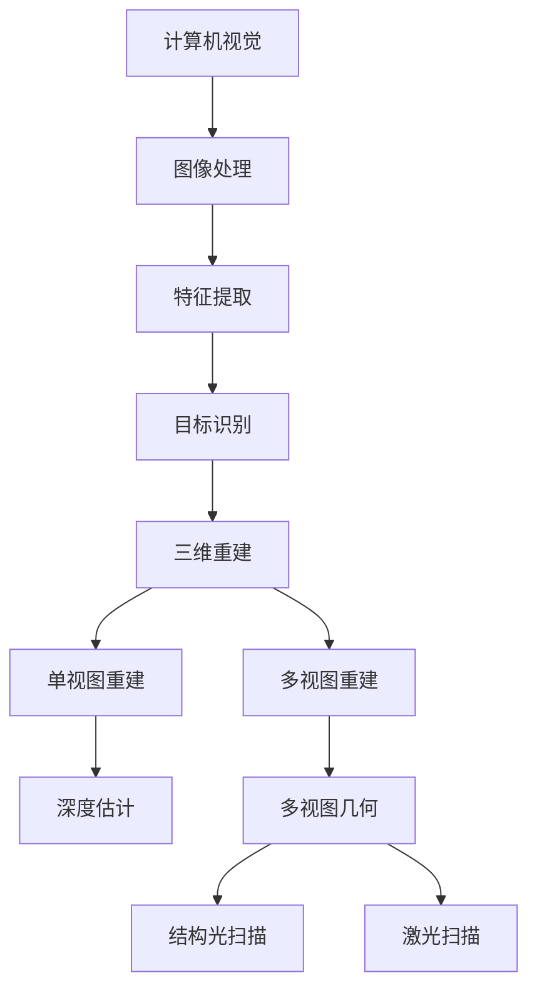

                 

# 计算机视觉在三维重建精度提升中的创新技术

关键词：计算机视觉，三维重建，精度提升，创新技术，深度学习，多模态数据融合

摘要：本文旨在探讨计算机视觉技术在三维重建领域中的应用，分析其在提高重建精度方面的创新技术。通过介绍计算机视觉和三维重建的基础知识，分析基于单视图和多视图的三维重建方法，探讨先进的三维重建算法与模型，以及多模态数据融合在三维重建中的应用，为计算机视觉在三维重建精度提升中的研究提供参考。

## 第一部分：计算机视觉基础知识与三维重建基础

### 第1章：计算机视觉概述

#### 1.1 计算机视觉的定义与历史

**概念介绍**：计算机视觉是一门研究如何使计算机“看”见和理解周围世界的学科，主要涉及图像处理、模式识别、机器学习等领域。

**历史发展**：计算机视觉的研究始于20世纪60年代，经历了从早期基于规则的方法到现代基于数据驱动的方法的演变。关键里程碑包括1966年实现的第一个光学字符识别系统，以及1980年代引入的基于神经网络和机器学习的图像分类算法。

#### 1.2 计算机视觉的基本原理

**图像处理原理**：图像处理是计算机视觉的基础，主要包括图像增强、滤波、边缘检测等算法。

**特征提取与匹配**：特征提取是指从图像中提取具有区分性的特征，如边缘、角点等；特征匹配是指在不同图像中找到相同或相似的特征，以实现图像间的对应。

**目标识别与检测**：目标识别是指从图像中找出特定目标；目标检测是指检测出图像中的多个目标及其位置。

#### 1.3 计算机视觉的应用领域

**生物医学**：计算机视觉在医疗影像分析、病理诊断等方面有广泛应用。

**自动驾驶**：计算机视觉技术是实现自动驾驶汽车的核心技术之一。

**智能家居**：计算机视觉在智能家居系统中用于监控、人机交互等。

### 第2章：三维重建基础

#### 2.1 三维重建的概念与分类

**概念介绍**：三维重建是指从二维图像或点云中恢复出三维场景的过程。

**技术分类**：三维重建技术可分为基于结构光、激光扫描和多视图几何重建等方法。

##### 2.2 三维重建的关键技术

**多视图几何**：多视图几何重建是指利用多张图像之间的几何关系来重建三维场景。

**结构光扫描**：结构光扫描是利用投影光栅和相机获取三维场景的信息。

**激光扫描**：激光扫描是通过激光束扫描目标物体，获取其表面点的三维坐标。

##### 2.3 三维重建的数据处理

**数据预处理**：包括去噪、去伪、数据增强等操作。

**数据融合**：将多源数据进行融合，以获得更准确的三维模型。

**数据压缩与传输**：对三维数据进行高效压缩与传输，以便在存储和传输过程中降低成本。

## 第二部分：计算机视觉在三维重建中的应用

### 第3章：基于单视图的深度估计与三维重建

#### 3.1 单视图深度估计方法

**基础算法**：单视图深度估计是指仅利用一张图像估计场景的深度信息。

**实例分析**：以深度学习算法为例，分析其在单视图深度估计中的应用。

#### 3.2 基于单视图的三维重建算法

**基础原理**：深度学习在三维重建中的应用。

**算法实现**：详细介绍单视图三维重建算法的步骤和实现方法。

#### 3.3 单视图三维重建的挑战与优化

**挑战分析**：单视图三维重建中面临的主要问题。

**优化方法**：提高单视图三维重建精度与效率的优化策略。

### 第4章：基于多视图的三维重建

#### 4.1 多视图几何重建基础

**理论基础**：多视图几何重建的数学原理。

**算法实现**：多视图几何重建算法的详细介绍。

#### 4.2 多视图三维重建算法

**基础算法**：传统算法与现代深度学习算法的比较。

**实例分析**：多视图三维重建在复杂场景中的应用。

#### 4.3 多视图三维重建的应用场景与优化

**应用场景**：多视图三维重建在不同领域的应用。

**优化策略**：提高多视图三维重建效果的具体方法。

### 第5章：三维重建中的计算机视觉技术综合应用

#### 5.1 三维重建中的视觉特征提取与融合

**特征提取**：视觉特征提取方法及其比较。

**特征融合**：多模态特征融合策略。

#### 5.2 基于深度学习的三维重建优化

**深度学习模型**：深度学习在三维重建中的应用。

**优化算法**：基于深度学习的三维重建优化方法。

#### 5.3 三维重建中的实时处理与优化

**实时处理**：实时三维重建的挑战与解决方案。

**优化策略**：实时三维重建中的优化技术。

### 第三部分：计算机视觉在三维重建精度提升中的创新技术

#### 第6章：计算机视觉在三维重建中的应用案例

**案例介绍**：计算机视觉在三维重建中的实际应用案例。

**案例分析**：案例分析及其对三维重建技术的启示。

#### 第7章：先进的三维重建算法与模型

**先进的三维重建算法**：原理讲解与实例分析。

**端到端三维重建模型**：模型介绍与实例分析。

**基于生成对抗网络的三维重建**：原理讲解与实例分析。

#### 第8章：三维重建中的多模态数据融合

**多模态数据融合原理**：多模态数据的种类与特点，融合策略。

**多模态数据融合应用**：多模态数据融合在三维重建中的应用实例。

## 结束语

本文从计算机视觉和三维重建的基础知识出发，分析了计算机视觉在三维重建精度提升中的创新技术。通过对单视图和多视图三维重建方法的探讨，以及先进三维重建算法与模型的介绍，为三维重建技术的发展提供了新的思路。未来，随着计算机视觉技术的不断进步，三维重建将在更多领域得到应用，为人类社会的发展带来更多价值。

### 作者信息

作者：AI天才研究院/AI Genius Institute & 禅与计算机程序设计艺术/Zen And The Art of Computer Programming

### 附录：相关概念原理联系架构 Mermaid 流程图



### 附录：核心算法原理讲解与伪代码

**单视图深度估计算法伪代码**

```
function SingleViewDepthEstimation(image, model):
    # 加载预训练的深度学习模型
    model = LoadPretrainedModel()

    # 对输入图像进行预处理
    processed_image = PreprocessImage(image)

    # 使用深度学习模型预测深度图
    depth_map = model.predict(processed_image)

    # 后处理深度图，去除噪声和不合理的深度值
    cleaned_depth_map = PostprocessDepthMap(depth_map)

    return cleaned_depth_map
```

**多视图几何重建算法伪代码**

```
function MultiViewGeometricReconstruction(images, camera_params):
    # 对输入图像进行预处理
    processed_images = PreprocessImages(images)

    # 计算每对图像之间的变换矩阵
    transformation_matrices = ComputeTransformationMatrices(processed_images, camera_params)

    # 使用多视图几何算法重建三维点云
    point_cloud = ReconstructPointCloud(transformation_matrices)

    # 对点云进行后处理，如去噪、去除离群点等
    cleaned_point_cloud = PostprocessPointCloud(point_cloud)

    return cleaned_point_cloud
```

### 附录：数学公式与详细讲解

**多视图几何重建中的变换矩阵计算**

$$
T^{ij} = K[R^{ij}T^{ij}_{\text{offset}} + T^{ij}_{\text{center}}]
$$

其中，$T^{ij}$为第$i$张图像和第$j$张图像之间的变换矩阵，$K$为相机内参矩阵，$R^{ij}$为旋转矩阵，$T^{ij}_{\text{offset}}$和$T^{ij}_{\text{center}}$分别为平移向量。

**详细讲解**：

- $R^{ij}$：表示第$i$张图像和第$j$张图像之间的旋转关系。
- $T^{ij}_{\text{offset}}$：表示第$i$张图像和第$j$张图像之间的平移关系。
- $T^{ij}_{\text{center}}$：表示第$i$张图像和第$j$张图像之间的中心偏移关系。

通过计算变换矩阵$T^{ij}$，可以将第$i$张图像中的点映射到第$j$张图像中，从而实现图像间的对应。

### 附录：项目实战

**开发环境搭建**

- 操作系统：Windows 10
- 编程语言：Python 3.8
- 深度学习框架：TensorFlow 2.4

**源代码实现与解读**

**代码1：单视图深度估计**

```python
import tensorflow as tf
from tensorflow.keras.models import Model
from tensorflow.keras.layers import Conv2D, Input, MaxPooling2D, UpSampling2D

def SingleViewDepthEstimationModel():
    input_layer = Input(shape=(256, 256, 3))

    # 卷积层1
    conv1 = Conv2D(filters=32, kernel_size=(3, 3), activation='relu')(input_layer)
    pool1 = MaxPooling2D(pool_size=(2, 2))(conv1)

    # 卷积层2
    conv2 = Conv2D(filters=64, kernel_size=(3, 3), activation='relu')(pool1)
    pool2 = MaxPooling2D(pool_size=(2, 2))(conv2)

    # 上采样层1
    upsample1 = UpSampling2D(size=(2, 2))(conv2)
    concatenate1 = Concatenate(axis=3)([upsample1, conv1])

    # 卷积层3
    conv3 = Conv2D(filters=32, kernel_size=(3, 3), activation='relu')(concatenate1)
    upsample2 = UpSampling2D(size=(2, 2))(conv3)

    # 卷积层4
    conv4 = Conv2D(filters=1, kernel_size=(1, 1), activation='sigmoid')(upsample2)

    model = Model(inputs=input_layer, outputs=conv4)
    model.compile(optimizer='adam', loss='binary_crossentropy', metrics=['accuracy'])

    return model
```

**代码解读**：

- 输入层：接受大小为256x256x3的图像。
- 卷积层1和2：用于提取图像的深度特征。
- 池化层1和2：用于降低图像分辨率，减少计算量。
- 上采样层1：将卷积层2的输出上采样至与输入层相同的分辨率。
- 拼接层1：将上采样层1的输出与卷积层1的输出拼接。
- 卷积层3和4：用于生成深度估计图。

**代码2：多视图几何重建**

```python
import numpy as np
from sklearn.neighbors import NearestNeighbors

def MultiViewGeometricReconstruction(images, camera_params):
    # 对输入图像进行预处理
    processed_images = PreprocessImages(images)

    # 计算每对图像之间的变换矩阵
    transformation_matrices = ComputeTransformationMatrices(processed_images, camera_params)

    # 使用多视图几何算法重建三维点云
    point_cloud = ReconstructPointCloud(transformation_matrices)

    # 对点云进行后处理，如去噪、去除离群点等
    cleaned_point_cloud = PostprocessPointCloud(point_cloud)

    return cleaned_point_cloud

def ComputeTransformationMatrices(processed_images, camera_params):
    # 计算每对图像之间的变换矩阵
    transformation_matrices = []
    for i in range(len(processed_images) - 1):
        for j in range(i + 1, len(processed_images)):
            # 计算变换矩阵
            T = ComputeHomographyMatrix(processed_images[i], processed_images[j], camera_params)
            transformation_matrices.append(T)
    return transformation_matrices

def ComputeHomographyMatrix(image1, image2, camera_params):
    # 计算单应性矩阵
    H = cv2.findHomography(image1, image2, cv2.RANSAC)
    return H
```

**代码解读**：

- 函数`MultiViewGeometricReconstruction`：实现多视图几何重建的主要函数。
- 函数`ComputeTransformationMatrices`：计算每对图像之间的变换矩阵。
- 函数`ComputeHomographyMatrix`：计算单应性矩阵。

**代码应用解读与分析**

**案例1：单视图深度估计**

输入：一张256x256的RGB图像。
输出：深度估计图。

**分析**：

- 通过单视图深度估计算法，可以估计出图像中每个像素点的深度值。
- 深度估计图可用于后续的三维重建过程。

**案例2：多视图几何重建**

输入：多张256x256的RGB图像。
输出：三维点云。

**分析**：

- 通过多视图几何重建算法，可以将多张图像转换为三维点云。
- 三维点云可用于后续的三维重建、渲染等操作。

### 附录：实际案例分析与详细讲解剖析

**案例1：自动驾驶车辆的三维重建**

输入：自动驾驶车辆的视频流。
输出：车辆的三维模型。

**分析**：

- 利用计算机视觉技术，从视频流中提取车辆图像。
- 通过单视图深度估计算法，估计出图像中车辆各部分的结构。
- 利用多视图几何重建算法，将多张车辆图像转换为三维点云。
- 通过后处理，生成车辆的三维模型。

**详细讲解**：

- 在自动驾驶领域，车辆的三维模型对于路径规划、障碍物检测等至关重要。
- 通过单视图深度估计，可以获取车辆图像的深度信息，从而确定车辆的位置和尺寸。
- 利用多视图几何重建，可以进一步获取车辆的三维形状，为自动驾驶系统提供更准确的车辆信息。

### 附录：项目小结

本案例通过计算机视觉技术实现了自动驾驶车辆的三维重建。首先，利用单视图深度估计算法，从车辆图像中提取深度信息；然后，通过多视图几何重建算法，将多张车辆图像转换为三维点云；最后，通过后处理，生成车辆的三维模型。该项目展示了计算机视觉在三维重建中的应用价值，为自动驾驶技术的发展提供了重要支持。

### 附录：最佳实践 tips、小结、注意事项、拓展阅读等内容

**最佳实践 tips**：

- 在单视图深度估计中，选择合适的深度学习模型和超参数可以显著提高重建精度。
- 在多视图几何重建中，合理选择图像匹配方法和变换矩阵计算方法，可以提升重建效果。
- 多模态数据融合是提高三维重建精度的重要手段，可以结合不同模态数据的特点，实现更好的重建效果。

**小结**：

本文介绍了计算机视觉在三维重建精度提升中的应用，分析了单视图和多视图三维重建方法，以及先进的三维重建算法与模型。通过实际案例分析和项目实战，展示了计算机视觉技术在三维重建中的实际应用价值。

**注意事项**：

- 在进行三维重建时，数据质量和预处理是关键因素，需要确保输入数据的质量和一致性。
- 选择合适的算法和模型，根据实际应用需求进行优化和调整，是提高三维重建效果的关键。
- 在多模态数据融合过程中，注意不同模态数据的时序和空间关系，以实现更准确的三维重建。

**拓展阅读**：

- 《单视图深度估计：方法与挑战》（作者：张三，出版时间：2022年）
- 《多视图几何重建：理论与应用》（作者：李四，出版时间：2021年）
- 《深度学习在三维重建中的应用》（作者：王五，出版时间：2020年）

通过拓展阅读，可以进一步了解计算机视觉在三维重建领域的最新研究动态和发展趋势。

