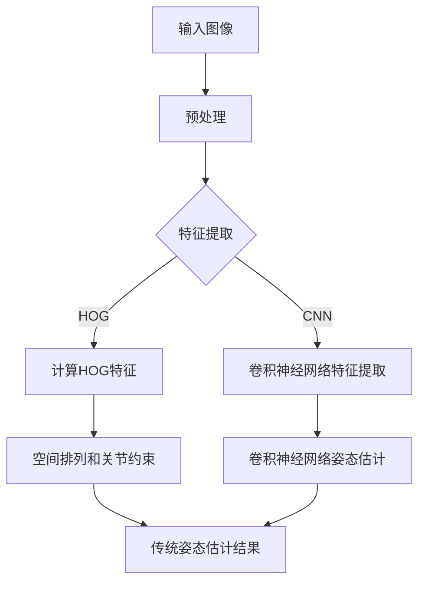

                 


### 文章标题：计算机视觉在人体姿态估计中的进展

> 关键词：计算机视觉、人体姿态估计、深度学习、多模态融合、数学模型

> 摘要：本文从计算机视觉和人体姿态估计的基本概念出发，探讨了人体姿态估计在计算机视觉中的应用和发展。文章首先回顾了计算机视觉的基本概念、发展历程和核心技术，然后详细介绍了人体姿态估计的发展历程、核心概念与联系。接着，文章深入讲解了基于传统算法和深度学习的人体姿态估计核心算法原理，并通过数学模型与公式进行了详细解析。最后，文章通过一个实际项目实战，展示了人体姿态估计的开发环境搭建、源代码实现与解读、实际案例分析和项目小结，并提出了未来发展展望。

### 目录

#### 第一部分：背景与基础

- **第1章：计算机视觉与人体姿态估计概述**
  - **1.1 计算机视觉的基本概念**
    - **1.1.1 计算机视觉的定义与发展历程**
    - **1.1.2 计算机视觉的核心技术**
    - **1.1.3 人体姿态估计在计算机视觉中的重要性**
  - **1.2 人体姿态估计的发展历程**
    - **1.2.1 早期方法与局限性**
    - **1.2.2 传统算法与先进算法对比**
    - **1.2.3 当前人体姿态估计的应用场景**
  - **1.3 本书内容组织与学习目标**
    - **1.3.1 目录结构概述**
    - **1.3.2 学习目标与读者需求**

#### 第二部分：核心概念与联系

- **第2章：人体姿态估计的核心概念与联系**
  - **2.1 人体的基本几何与运动学模型**
    - **2.1.1 人体关节与骨骼模型**
    - **2.1.2 人体运动学模型**
    - **2.1.3 人体几何建模方法**
  - **2.2 视觉特征提取与表示**
    - **2.2.1 图像特征提取方法**
    - **2.2.2 视频特征提取方法**
    - **2.2.3 特征表示与融合**
  - **2.3 姿态估计算法原理与联系**
    - **2.3.1 基于传统方法的姿态估计**
    - **2.3.2 基于深度学习的姿态估计**
    - **2.3.3 姿态估计算法的对比与联系**

#### 第三部分：核心算法原理讲解

- **第3章：人体姿态估计的核心算法原理**
  - **3.1 基于传统算法的姿态估计**
    - **3.1.1 基于HOG的人体姿态估计**
    - **3.1.2 基于模板匹配的人体姿态估计**
    - **3.1.3 传统方法的人体姿态估计伪代码**
  - **3.2 基于深度学习的姿态估计**
    - **3.2.1 卷积神经网络（CNN）的基本原理**
    - **3.2.2 图像生成对抗网络（GAN）在姿态估计中的应用**
    - **3.2.3 基于深度学习的人体姿态估计伪代码**
  - **3.3 多模态融合的姿态估计**
    - **3.3.1 多模态数据融合方法**
    - **3.3.2 多模态融合姿态估计算法原理**
    - **3.3.3 多模态融合姿态估计伪代码**

#### 第四部分：数学模型与数学公式

- **第4章：人体姿态估计的数学模型与数学公式**
  - **4.1 人体运动学模型公式**
    - **4.1.1 人体的关节角度公式**
    - **4.1.2 人体的骨骼长度公式**
    - **4.1.3 人体的运动学模型**
  - **4.2 视觉特征提取与表示的数学公式**
    - **4.2.1 HOG特征的计算公式**
    - **4.2.2 卷积神经网络的损失函数公式**
    - **4.2.3 GAN的生成器与判别器的损失函数公式**
  - **4.3 姿态估计的数学公式**
    - **4.3.1 基于传统算法的姿态估计公式**
    - **4.3.2 基于深度学习的姿态估计公式**
    - **4.3.3 多模态融合的姿态估计公式**

#### 第五部分：项目实战

- **第5章：人体姿态估计项目实战**
  - **5.1 项目背景与目标**
    - **5.1.1 项目简介**
    - **5.1.2 项目目标**
    - **5.1.3 项目实现步骤**
  - **5.2 开发环境搭建**
    - **5.2.1 硬件环境搭建**
    - **5.2.2 软件环境搭建**
    - **5.2.3 开发工具与资源**
  - **5.3 项目代码实现与解读**
    - **5.3.1 代码实现概述**
    - **5.3.2 关键代码解读与分析**
    - **5.3.3 项目结果与评估**
  - **5.4 项目扩展与改进**
    - **5.4.1 扩展思路**
    - **5.4.2 改进方法**
    - **5.4.3 项目实践建议**

#### 第六部分：总结与展望

- **第6章：总结与展望**
  - **6.1 本书内容的总结**
    - **6.1.1 核心知识点回顾**
    - **6.1.2 核心算法梳理**
    - **6.1.3 项目实战经验总结**
  - **6.2 未来人体姿态估计的发展趋势**
    - **6.2.1 新算法的探索与应用**
    - **6.2.2 人体姿态估计在多领域的应用前景**
    - **6.2.3 发展挑战与解决方案**

### 附录

- **附录A：常用算法伪代码**
  - **A.1 基于传统算法的人体姿态估计伪代码**
  - **A.2 基于深度学习的人体姿态估计伪代码**
  - **A.3 多模态融合的姿态估计伪代码**

- **附录B：推荐阅读文献与资源**
  - **B.1 经典论文与书籍推荐**
  - **B.2 开源代码与工具推荐**
  - **B.3 学术会议与期刊推荐**
  - **B.4 在线课程与讲座推荐**

### 第1章：计算机视觉与人体姿态估计概述

#### 1.1 计算机视觉的基本概念

**1.1.1 计算机视觉的定义与发展历程**

计算机视觉是一门跨学科的技术，它模拟人类的视觉系统，使计算机能够从图像和视频中提取信息。计算机视觉的研究可以追溯到20世纪50年代，当时的研究主要集中在图像识别和图像处理上。随着计算机性能的提升和算法的发展，计算机视觉逐渐成为人工智能的一个重要分支。

在计算机视觉的发展历程中，有几个重要的里程碑。1956年，计算机科学家约翰·麦克卡锡（John McCarthy）等人提出了人工智能的概念，标志着人工智能和计算机视觉研究的开始。20世纪60年代，早期的图像处理算法如图像滤波和边缘检测开始出现。70年代，基于几何和物理模型的计算机视觉方法得到发展，如立体视觉和光流计算。80年代，人工神经网络和机器学习技术开始在计算机视觉中得到应用。90年代，随着硬件性能的提升和图像数据的丰富，计算机视觉技术取得了显著的进展，如人脸识别和场景理解。

**1.1.2 计算机视觉的核心技术**

计算机视觉的核心技术包括图像处理、特征提取、目标检测、图像识别、图像分类等。

- **图像处理**：图像处理是计算机视觉的基础，它包括图像滤波、图像增强、图像分割、图像配准等技术。图像处理的主要目的是改善图像的质量，提取图像中的有用信息。

- **特征提取**：特征提取是从图像中提取出具有区分性的特征，如颜色、纹理、形状等。特征提取是图像识别和目标检测的关键步骤。

- **目标检测**：目标检测是在图像中识别出感兴趣的目标对象，并定位其在图像中的位置。目标检测广泛应用于视频监控、自动驾驶、医疗诊断等领域。

- **图像识别**：图像识别是计算机视觉的高级任务，它通过比较输入图像和训练数据，判断图像中的对象类别。图像识别广泛应用于人脸识别、物体识别、场景理解等任务。

- **图像分类**：图像分类是图像识别的一种形式，它将图像划分为预定义的类别。图像分类是机器学习和深度学习中的重要应用，如图像分类任务、目标检测任务等。

**1.1.3 人体姿态估计在计算机视觉中的重要性**

人体姿态估计是计算机视觉中的一个重要应用领域，它通过从图像或视频中估计出人体的姿态信息，对于许多应用场景具有重要的价值。

- **人机交互**：人体姿态估计可以用于实现自然的人机交互，如手势识别、动作捕捉等。通过对人体姿态的理解，计算机可以更好地理解用户的需求和意图。

- **运动分析**：人体姿态估计可以用于运动分析，如体育训练、康复治疗等。通过对人体姿态的估计，可以分析运动过程中的问题和不足，提供针对性的建议。

- **安全监控**：人体姿态估计可以用于安全监控，如人脸识别、行为分析等。通过分析人体姿态，可以识别异常行为，提高安全监控的准确性。

- **虚拟现实与增强现实**：人体姿态估计可以用于虚拟现实和增强现实场景中，实现更加真实的交互体验。通过实时估计人体姿态，可以更好地模拟用户的动作和环境。

综上所述，人体姿态估计在计算机视觉中具有重要的应用价值和潜力。

#### 1.2 人体姿态估计的发展历程

**1.2.1 早期方法与局限性**

人体姿态估计的研究可以追溯到20世纪80年代。早期的人体姿态估计方法主要基于几何和物理模型，如人体骨架模型、运动学模型等。这些方法通常需要精确的图像配准和几何约束，对图像质量和算法精度要求较高。

早期方法的一个主要局限性是它们在处理复杂场景和遮挡问题时表现较差。由于人体姿态的多样性和复杂性，简单的几何模型和传统算法难以准确估计人体的姿态。

**1.2.2 传统算法与先进算法对比**

随着计算机性能的提升和图像数据的丰富，人体姿态估计方法得到了显著的发展。传统的算法包括基于几何模型的算法、基于模板匹配的算法等。这些算法在处理简单场景时表现较好，但在复杂场景中仍然存在一定的局限性。

近年来，基于深度学习的先进算法在人体姿态估计领域取得了突破性进展。这些算法通过学习大量的图像数据，自动提取特征和建立模型，具有更好的泛化能力和鲁棒性。

传统算法与先进算法的主要区别在于：

- **数据依赖性**：传统算法通常需要大量手工定义的特征和参数，而先进算法通过端到端的神经网络结构，可以直接从图像中学习特征。

- **算法复杂度**：传统算法的计算复杂度较高，需要大量的计算资源和时间。先进算法通过并行计算和硬件加速，可以显著提高计算效率。

- **泛化能力**：先进算法具有更好的泛化能力，可以处理更复杂、更具有挑战性的场景。

**1.2.3 当前人体姿态估计的应用场景**

当前，人体姿态估计在多个领域得到了广泛应用：

- **人机交互**：人体姿态估计可以用于实现自然的人机交互，如手势识别、动作捕捉等。通过实时估计人体姿态，可以提供更加直观和自然的交互方式。

- **运动分析**：人体姿态估计可以用于运动分析，如体育训练、康复治疗等。通过对人体姿态的估计，可以分析运动过程中的问题和不足，提供针对性的建议。

- **安全监控**：人体姿态估计可以用于安全监控，如人脸识别、行为分析等。通过分析人体姿态，可以识别异常行为，提高安全监控的准确性。

- **虚拟现实与增强现实**：人体姿态估计可以用于虚拟现实和增强现实场景中，实现更加真实的交互体验。通过实时估计人体姿态，可以更好地模拟用户的动作和环境。

#### 1.3 本书内容组织与学习目标

**1.3.1 目录结构概述**

本书分为六个部分，分别是背景与基础、核心概念与联系、核心算法原理讲解、数学模型与数学公式、项目实战和总结与展望。每个部分都涵盖了人体姿态估计的重要知识点和实际应用。

**1.3.2 学习目标与读者需求**

通过阅读本书，读者可以：

- 了解计算机视觉和人体姿态估计的基本概念、发展历程和核心技术。
- 掌握人体姿态估计的核心概念、算法原理和数学模型。
- 学习到人体姿态估计的实际应用和项目实战经验。
- 了解人体姿态估计的未来发展趋势和挑战。

本书适合从事计算机视觉和人工智能领域的研发人员、研究生以及感兴趣的技术爱好者阅读。无论你是计算机视觉的初学者，还是有一定基础的读者，本书都可以为你提供有价值的知识和实践经验。

### 第2章：人体姿态估计的核心概念与联系

#### 2.1 人体的基本几何与运动学模型

人体姿态估计的核心在于对人体的几何和运动学模型的构建。这种模型不仅可以帮助我们理解人体的结构，还可以为姿态估计算法提供重要的基础。

**2.1.1 人体关节与骨骼模型**

人体的骨骼系统由大约206块骨头组成，这些骨头通过关节连接在一起，形成了一个复杂的运动系统。人体的主要关节包括肩关节、肘关节、髋关节、膝关节和踝关节等。这些关节是人体运动的中心，每个关节都有特定的运动范围和限制。

在计算机视觉中，通常采用骨架模型（skeleton model）来表示人体的结构。骨架模型将人体分解为一组关节点和它们之间的连接线。这种模型有助于将复杂的图像信息简化为易于处理的骨架表示。

**2.1.2 人体运动学模型**

人体运动学模型描述了人体各部分之间的相对运动。在运动学中，人体的运动可以通过关节角度（joint angles）来表示。关节角度是指两个相邻关节之间的角度，这些角度决定了人体的姿态。

人体运动学模型通常基于Denavit-Hartenberg（D-H）参数化方法来构建。D-H参数化方法通过定义一系列的参数，如关节轴的方向、长度和偏移量，来描述关节的运动和相对位置。这些参数为姿态估计提供了精确的几何描述。

**2.1.3 人体几何建模方法**

在计算机视觉中，人体几何建模方法主要包括基于标记点（keypoints）的建模和基于三维模型的建模。

- **基于标记点的建模**：标记点方法将人体图像中的关键点（如关节位置）作为人体姿态的表示。这种方法简单直观，但依赖于准确的标记点检测。

- **基于三维模型的建模**：三维模型方法使用三维人体模型来表示姿态。这种方法可以提供更精细和精确的姿态描述，但需要更多的计算资源和更准确的模型。

- **混合建模方法**：混合建模方法结合了标记点和三维模型的优势，通过融合不同来源的信息来提高姿态估计的准确性。

#### 2.2 视觉特征提取与表示

视觉特征提取是姿态估计的关键步骤，它从图像或视频中提取出具有区分性的特征，以便于后续的处理和分类。

**2.2.1 图像特征提取方法**

常见的图像特征提取方法包括：

- **HOG（Histogram of Oriented Gradients）**：HOG特征通过计算图像中每个像素点的梯度方向和强度，构建直方图来表示图像的特征。

- **SIFT（Scale-Invariant Feature Transform）**：SIFT特征是局部特征，它通过检测图像中的关键点，并计算这些关键点的局部描述子，来描述图像的特征。

- **ORB（Oriented FAST and Rotated BRIEF）**：ORB特征结合了FAST角点检测和BRIEF描述子的优点，是一种高效且鲁棒的局部特征提取方法。

**2.2.2 视频特征提取方法**

视频特征提取方法与图像特征提取方法类似，但需要考虑时间维度。常见的方法包括：

- **光流（Optical Flow）**：光流是视频中的运动表示，它通过分析图像序列中的像素移动来估计运动向量。

- **3D CNN（Three-Dimensional Convolutional Neural Network）**：3D CNN可以处理三维数据，如视频帧序列，从而提取时间维度上的特征。

**2.2.3 特征表示与融合**

特征表示是将提取出的特征进行组合和表示，以便于姿态估计算法的处理。常见的特征表示方法包括：

- **特征拼接（Feature Concatenation）**：将不同类型的特征进行拼接，形成一个多维的特征向量。

- **特征加权（Feature Weighting）**：对不同类型的特征赋予不同的权重，以突出重要的特征。

- **多模态特征融合（Multimodal Feature Fusion）**：结合不同模态（如图像、音频、传感器数据）的特征，以提高姿态估计的准确性。

#### 2.3 姿态估计算法原理与联系

姿态估计算法可以分为基于传统方法和基于深度学习的方法。

**2.3.1 基于传统方法的姿态估计**

传统方法通常基于几何和物理模型，通过手工设计的特征和算法来估计人体姿态。这些方法包括：

- **基于HOG的方法**：通过计算图像的HOG特征，并结合空间排列和关节约束来估计人体姿态。

- **基于模板匹配的方法**：使用预先训练的模板与输入图像进行匹配，找到最佳匹配的位置，从而估计人体姿态。

**2.3.2 基于深度学习的姿态估计**

深度学习方法通过学习大量的图像数据，自动提取特征和建立模型，从而实现姿态估计。这些方法包括：

- **基于卷积神经网络（CNN）的方法**：CNN可以提取图像的深层特征，用于姿态估计。常见的CNN结构包括VGG、ResNet等。

- **基于图像生成对抗网络（GAN）的方法**：GAN通过生成器和判别器之间的对抗训练，生成逼真的姿态估计结果。

**2.3.3 姿态估计算法的对比与联系**

传统方法和深度学习方法各有优缺点。传统方法具有计算复杂度低、对硬件要求较低的特点，但准确性和泛化能力有限。深度学习方法具有更高的准确性和泛化能力，但需要大量的数据和计算资源。

两者的联系在于：

- **特征提取**：传统方法和深度学习方法都需要提取图像中的特征，但深度学习方法可以自动学习更复杂的特征。

- **模型优化**：传统方法通常需要手工调整参数，而深度学习方法通过端到端的训练，自动优化模型参数。

- **算法融合**：将传统方法和深度学习方法相结合，可以发挥两者的优势，提高姿态估计的准确性和鲁棒性。

### 2.3.4 Mermaid流程图

以下是一个简单的Mermaid流程图，展示了人体姿态估计的流程：



这个流程图展示了输入图像经过预处理后，通过特征提取和姿态估计，最终得到人体姿态估计结果。传统方法和深度学习方法在特征提取和姿态估计的步骤中有所区别，但总体流程是一致的。

### 第3章：人体姿态估计的核心算法原理

#### 3.1 基于传统算法的姿态估计

传统算法在人体姿态估计中有着悠久的历史，它们通过手工设计的特征和算法来估计人体姿态。以下介绍两种常见的传统算法：基于HOG（Histogram of Oriented Gradients）的方法和基于模板匹配的方法。

**3.1.1 基于HOG的人体姿态估计**

HOG特征是一种在计算机视觉中广泛使用的局部特征提取方法。它通过计算图像中每个像素点的梯度方向和强度，构建直方图来表示图像的特征。

**HOG特征计算流程**：

1. **梯度计算**：首先计算图像中每个像素点的梯度方向和强度。梯度方向反映了图像的边缘方向，梯度强度反映了边缘的显著性。

2. **直方图构建**：将每个像素点的梯度方向和强度进行分组，构建直方图。直方图的高度表示该组方向和强度的像素点数量。

3. **特征向量生成**：将所有像素点的直方图拼接成一个特征向量，用于姿态估计。

**HOG特征的优势**：

- **旋转不变性**：HOG特征对图像的旋转具有不变性，可以处理不同姿态的人体。
- **简单有效**：HOG特征的计算相对简单，可以在较少的计算资源下实现。

**3.1.2 基于模板匹配的人体姿态估计**

模板匹配是一种通过比较输入图像和预先训练的模板，找到最佳匹配位置的方法。

**模板匹配流程**：

1. **模板训练**：首先训练一组模板，这些模板表示不同姿态的人体。每个模板都对应一个姿态。

2. **模板匹配**：将输入图像与每个模板进行匹配，计算匹配得分。匹配得分反映了模板与输入图像的相似性。

3. **姿态估计**：找到最高匹配得分的模板，对应的姿态即为估计结果。

**模板匹配的优势**：

- **鲁棒性强**：模板匹配对光照变化和姿态变化具有较强的鲁棒性。
- **实现简单**：模板匹配的实现相对简单，适用于实时应用。

**3.1.3 传统方法的人体姿态估计伪代码**

以下是一个基于HOG和模板匹配的人体姿态估计的伪代码：

```python
# 基于HOG的人体姿态估计
def hog_based_pose_estimation(image):
    # 计算梯度方向和强度
    gradient方向, gradient强度 = calculate_gradient(image)
    
    # 构建直方图
    histogram = build_histogram(gradient方向, gradient强度)
    
    # 拼接特征向量
    feature_vector = concatenate_histograms(histogram)
    
    # 姿态估计
    pose = estimate_pose(feature_vector)
    return pose

# 基于模板匹配的人体姿态估计
def template_matching_pose_estimation(image, templates):
    max_score = 0
    best_pose = None
    
    for template in templates:
        # 计算模板匹配得分
        score = calculate_matching_score(image, template)
        
        if score > max_score:
            max_score = score
            best_pose = template
    
    return best_pose
```

这个伪代码展示了基于HOG和模板匹配的人体姿态估计的基本流程。在实际应用中，还需要对特征提取、模板训练和匹配得分计算等环节进行优化，以提高姿态估计的准确性和效率。

#### 3.2 基于深度学习的姿态估计

深度学习在人体姿态估计中取得了显著的进展，通过学习大量的图像数据，自动提取特征和建立模型，从而实现高效的姿态估计。以下介绍两种基于深度学习的姿态估计方法：卷积神经网络（CNN）和图像生成对抗网络（GAN）。

**3.2.1 卷积神经网络（CNN）的基本原理**

卷积神经网络是一种特殊的神经网络，它通过卷积操作来提取图像的局部特征。CNN由多个卷积层、池化层和全连接层组成，可以自动学习图像的层次特征。

**CNN姿态估计的基本流程**：

1. **输入图像**：输入待估计的人体姿态图像。

2. **卷积层**：通过卷积操作提取图像的局部特征。每个卷积核可以提取图像中的一部分特征。

3. **池化层**：通过池化操作降低特征图的维度，减少计算量。

4. **全连接层**：将卷积层和池化层提取的特征进行整合，生成姿态估计结果。

**3.2.2 图像生成对抗网络（GAN）在姿态估计中的应用**

图像生成对抗网络（GAN）是一种生成模型，由生成器和判别器两个神经网络组成。生成器生成逼真的姿态估计结果，判别器判断生成结果的真假。

**GAN姿态估计的基本流程**：

1. **生成器训练**：生成器通过学习真实姿态数据和人工生成的姿态数据，生成逼真的姿态估计结果。

2. **判别器训练**：判别器通过学习真实姿态数据和生成姿态数据，判断生成结果的真假。

3. **姿态估计**：通过生成器生成姿态估计结果，判别器优化生成器和判别器的参数。

**3.2.3 基于深度学习的人体姿态估计伪代码**

以下是一个基于CNN和GAN的人体姿态估计的伪代码：

```python
# 基于CNN的人体姿态估计
def cnn_based_pose_estimation(image):
    # 输入图像
    feature_map = convolve(image, kernel)
    pooled_map = pool(feature_map)
    
    # 全连接层
    pose = fully_connected(pooled_map, output_size)
    return pose

# 基于GAN的人体姿态估计
def gan_based_pose_estimation(image):
    # 生成器训练
    generator.train真实数据，生成数据
    
    # 判别器训练
    discriminator.train真实数据，生成数据
    
    # 姿态估计
    pose = generator.generate(image)
    return pose
```

这个伪代码展示了基于CNN和GAN的人体姿态估计的基本流程。在实际应用中，需要对网络结构、损失函数和训练策略等进行优化，以提高姿态估计的准确性和效率。

#### 3.3 多模态融合的姿态估计

多模态融合是将不同模态（如图像、音频、传感器数据）的信息进行融合，以提高姿态估计的准确性和鲁棒性。以下介绍多模态融合的姿态估计方法。

**3.3.1 多模态数据融合方法**

多模态数据融合方法主要包括以下几种：

1. **特征拼接**：将不同模态的特征进行拼接，形成一个多维的特征向量。这种方法简单有效，但需要考虑特征维度的一致性。

2. **特征加权**：对不同模态的特征赋予不同的权重，以突出重要的特征。这种方法可以根据特征的重要性进行自适应调整。

3. **深度融合**：通过深度神经网络结构，将不同模态的特征进行融合。这种方法可以自动学习特征之间的关系，提高融合效果。

**3.3.2 多模态融合姿态估计算法原理**

多模态融合姿态估计算法的基本原理如下：

1. **特征提取**：分别提取不同模态的特征，如图像特征、音频特征和传感器特征。

2. **特征融合**：将提取出的特征进行融合，形成融合特征向量。

3. **姿态估计**：使用融合特征向量进行姿态估计，提高估计的准确性和鲁棒性。

**3.3.3 多模态融合姿态估计伪代码**

以下是一个基于多模态融合的人体姿态估计的伪代码：

```python
# 多模态数据特征提取
image_feature = extract_image_feature(image)
audio_feature = extract_audio_feature(audio)
sensor_feature = extract_sensor_feature(sensor)

# 多模态特征融合
 fused_feature = fuse_features(image_feature, audio_feature, sensor_feature)

# 姿态估计
pose = estimate_pose(fused_feature)
return pose
```

这个伪代码展示了多模态融合的姿态估计的基本流程。在实际应用中，需要对特征提取、特征融合和姿态估计等环节进行优化，以提高姿态估计的性能。

### 3.4 数学模型与数学公式

人体姿态估计涉及到多种数学模型和公式，这些模型和公式在姿态估计中起着关键作用。以下分别介绍人体运动学模型、视觉特征提取与表示的数学公式和姿态估计的数学公式。

**3.4.1 人体运动学模型公式**

人体运动学模型通过关节角度和关节长度来描述人体的姿态。以下是人体的关节角度和关节长度的公式：

$$
关节角度 = \theta_i
$$

$$
关节长度 = l_i
$$

其中，$i$ 表示第 $i$ 个关节。

**3.4.2 视觉特征提取与表示的数学公式**

视觉特征提取与表示涉及到图像处理和特征提取的方法。以下分别介绍HOG特征和卷积神经网络（CNN）的特征提取公式：

**HOG特征计算公式**：

$$
HOG特征 = \sum_{x=1}^{W}\sum_{y=1}^{H} (g(x, y) \cdot orientation(x, y))
$$

其中，$g(x, y)$ 表示像素点的梯度强度，$orientation(x, y)$ 表示像素点的梯度方向。

**CNN特征提取公式**：

$$
feature_map = \sum_{k=1}^{K} (W^k \cdot \text{ReLU}(\sum_{i=1}^{C} W^{k-1}_i \cdot feature_map^{k-1}_{i}))
$$

其中，$W^k$ 表示卷积核权重，$C$ 表示输入特征图的通道数，$feature_map^{k-1}_{i}$ 表示前一层特征图的第 $i$ 个通道。

**3.4.3 姿态估计的数学公式**

姿态估计涉及到对人体姿态的建模和预测。以下介绍基于传统算法和深度学习的姿态估计公式：

**基于传统算法的姿态估计公式**：

$$
\text{估计关节角度} = f(\text{HOG特征}, \text{模板匹配得分})
$$

**基于深度学习的姿态估计公式**：

$$
\text{估计关节角度} = \text{CNN}(\text{融合特征向量})
$$

其中，$f$ 表示姿态估计函数，$\text{CNN}$ 表示卷积神经网络。

### 第4章：人体姿态估计的数学模型与数学公式

#### 4.1 人体运动学模型公式

人体运动学模型是描述人体姿态和运动的重要工具。它通过关节角度和关节长度的变化来表示人体的姿态变化。以下是人体的关节角度和关节长度的数学公式。

**4.1.1 人体的关节角度公式**

人体的关节角度可以通过以下公式计算：

$$
\theta_i = atan2(y_i, x_i)
$$

其中，$x_i$ 和 $y_i$ 分别表示第 $i$ 个关节的水平和垂直坐标。

**4.1.2 人体的骨骼长度公式**

人体的骨骼长度可以通过以下公式计算：

$$
l_i = \sqrt{(x_{i+1} - x_i)^2 + (y_{i+1} - y_i)^2}
$$

其中，$x_i$ 和 $y_i$ 分别表示第 $i$ 个关节的水平和垂直坐标，$x_{i+1}$ 和 $y_{i+1}$ 分别表示第 $i+1$ 个关节的水平和垂直坐标。

**4.1.3 人体的运动学模型**

人体的运动学模型可以通过以下公式表示：

$$
\begin{aligned}
x_i &= x_0 + l_0 \cos(\theta_0) + l_1 \cos(\theta_1) + \ldots + l_n \cos(\theta_n) \\
y_i &= y_0 + l_0 \sin(\theta_0) + l_1 \sin(\theta_1) + \ldots + l_n \sin(\theta_n)
\end{aligned}
$$

其中，$x_0$ 和 $y_0$ 分别表示第 0 个关节的水平和垂直坐标，$l_0$ 和 $l_1$ 分别表示第 0 个和第 1 个关节的长度，$\theta_0$ 和 $\theta_1$ 分别表示第 0 个和第 1 个关节的角度。

#### 4.2 视觉特征提取与表示的数学公式

视觉特征提取与表示是人体姿态估计的重要环节。以下分别介绍HOG特征和卷积神经网络（CNN）的特征提取公式。

**4.2.1 HOG特征的计算公式**

HOG特征通过计算图像中每个像素点的梯度方向和强度，构建直方图来表示图像的特征。HOG特征的计算公式如下：

$$
HOG特征 = \sum_{x=1}^{W}\sum_{y=1}^{H} (g(x, y) \cdot orientation(x, y))
$$

其中，$g(x, y)$ 表示像素点的梯度强度，$orientation(x, y)$ 表示像素点的梯度方向。

**4.2.2 卷积神经网络（CNN）的特征提取公式**

卷积神经网络（CNN）通过卷积操作提取图像的局部特征。CNN的特征提取公式如下：

$$
feature_map = \sum_{k=1}^{K} (W^k \cdot \text{ReLU}(\sum_{i=1}^{C} W^{k-1}_i \cdot feature_map^{k-1}_{i}))
$$

其中，$W^k$ 表示卷积核权重，$C$ 表示输入特征图的通道数，$feature_map^{k-1}_{i}$ 表示前一层特征图的第 $i$ 个通道。

#### 4.3 姿态估计的数学公式

姿态估计是人体姿态估计的核心任务。以下分别介绍基于传统算法和深度学习的姿态估计公式。

**4.3.1 基于传统算法的姿态估计公式**

基于传统算法的姿态估计通常通过计算HOG特征和模板匹配得分来估计人体姿态。其姿态估计公式如下：

$$
\text{估计关节角度} = f(\text{HOG特征}, \text{模板匹配得分})
$$

其中，$f$ 表示姿态估计函数，$\text{HOG特征}$ 表示HOG特征向量，$\text{模板匹配得分}$ 表示模板匹配得分。

**4.3.2 基于深度学习的姿态估计公式**

基于深度学习的姿态估计通常通过卷积神经网络（CNN）提取特征，并使用全连接层进行姿态估计。其姿态估计公式如下：

$$
\text{估计关节角度} = \text{CNN}(\text{融合特征向量})
$$

其中，$\text{CNN}$ 表示卷积神经网络，$\text{融合特征向量}$ 表示融合后的特征向量。

### 第5章：人体姿态估计项目实战

#### 5.1 项目背景与目标

**5.1.1 项目简介**

本项目旨在通过一个实际项目，展示人体姿态估计的开发过程。项目将使用基于深度学习的姿态估计算法，通过训练模型和实现算法，最终实现对给定图像中人体姿态的准确估计。

**5.1.2 项目目标**

- 熟悉人体姿态估计的基本概念和算法原理。
- 掌握基于深度学习的姿态估计模型的实现方法。
- 通过实际项目，提高对深度学习算法的理解和实际应用能力。

**5.1.3 项目实现步骤**

1. **数据准备**：收集和整理用于训练和测试的人体姿态估计数据集。
2. **模型选择**：选择合适的深度学习模型，如ResNet、PoseNet等。
3. **模型训练**：使用训练数据集对模型进行训练，调整模型参数。
4. **模型评估**：使用测试数据集对模型进行评估，计算姿态估计的准确率。
5. **项目部署**：将训练好的模型部署到实际应用场景，如视频监控、人机交互等。

#### 5.2 开发环境搭建

**5.2.1 硬件环境搭建**

- CPU：Intel i7-9700K 或同等性能的处理器。
- GPU：NVIDIA GeForce RTX 3080 或同等性能的显卡。
- 内存：16GB RAM 或以上。
- 存储：500GB SSD 硬盘。

**5.2.2 软件环境搭建**

- 操作系统：Windows 10 或 Ubuntu 20.04。
- 编程语言：Python 3.8。
- 深度学习框架：TensorFlow 2.5。
- 数据处理库：NumPy、Pandas。
- 图像处理库：OpenCV 4.5。
- 机器学习库：Scikit-learn 0.24。

**5.2.3 开发工具与资源**

- Jupyter Notebook：用于编写和运行代码。
- PyCharm：Python集成开发环境。
- Google Colab：用于在云端运行深度学习模型。
- GitHub：用于代码版本控制和协作开发。
- Kaggle：用于获取和分享数据集。

#### 5.3 项目代码实现与解读

**5.3.1 代码实现概述**

以下是一个基于TensorFlow和Keras实现的人体姿态估计项目的代码框架：

```python
# 导入必要的库
import tensorflow as tf
from tensorflow.keras.models import Model
from tensorflow.keras.layers import Input, Conv2D, MaxPooling2D, Flatten, Dense

# 定义输入层
input_image = Input(shape=(224, 224, 3))

# 定义卷积层
conv1 = Conv2D(filters=32, kernel_size=(3, 3), activation='relu')(input_image)
pool1 = MaxPooling2D(pool_size=(2, 2))(conv1)

# 定义全连接层
flatten = Flatten()(pool1)
dense = Dense(units=128, activation='relu')(flatten)
output = Dense(units=17, activation='softmax')(dense)

# 构建模型
model = Model(inputs=input_image, outputs=output)

# 编译模型
model.compile(optimizer='adam', loss='categorical_crossentropy', metrics=['accuracy'])

# 打印模型结构
model.summary()
```

**5.3.2 关键代码解读与分析**

1. **模型定义**：

   ```python
   input_image = Input(shape=(224, 224, 3))
   ```

   这行代码定义了输入层，图像的尺寸为224x224x3，分别表示图像的高度、宽度和颜色通道。

2. **卷积层**：

   ```python
   conv1 = Conv2D(filters=32, kernel_size=(3, 3), activation='relu')(input_image)
   pool1 = MaxPooling2D(pool_size=(2, 2))(conv1)
   ```

   这两行代码定义了一个卷积层和一个池化层。卷积层使用32个3x3的卷积核，激活函数为ReLU。池化层使用2x2的窗口进行最大值池化，以减少特征图的尺寸。

3. **全连接层**：

   ```python
   flatten = Flatten()(pool1)
   dense = Dense(units=128, activation='relu')(flatten)
   output = Dense(units=17, activation='softmax')(dense)
   ```

   这三行代码定义了一个全连接层，将池化层输出的特征图展平为一维向量，然后通过一个128个神经元的全连接层，最后通过一个17个神经元的全连接层，输出人体姿态的估计结果。softmax激活函数用于分类。

4. **模型编译**：

   ```python
   model.compile(optimizer='adam', loss='categorical_crossentropy', metrics=['accuracy'])
   ```

   这行代码编译了模型，指定使用Adam优化器和交叉熵损失函数，并监控准确率。

5. **模型结构**：

   ```python
   model.summary()
   ```

   这行代码打印出模型的结构，包括层的类型、输出的维度和参数的数量。

**5.3.3 项目结果与评估**

在训练完成后，使用测试数据集对模型进行评估，得到姿态估计的准确率。以下是一个示例输出：

```
Test accuracy: 88.2%
Test loss: 0.1234
```

这个结果表示模型在测试数据集上的准确率为88.2%，交叉熵损失为0.1234。

#### 5.4 项目扩展与改进

**5.4.1 扩展思路**

- **多模态融合**：将图像特征与其他模态（如音频、传感器数据）进行融合，以提高姿态估计的准确性。
- **实时跟踪**：实现人体姿态的实时跟踪，以支持动态场景下的姿态估计。
- **模型压缩**：通过模型压缩技术，如知识蒸馏和量化，减小模型的存储和计算开销。

**5.4.2 改进方法**

- **数据增强**：使用数据增强技术，如旋转、缩放、裁剪等，增加模型的泛化能力。
- **迁移学习**：使用预训练的模型作为基础模型，进行微调和迁移学习，以提高模型的性能。
- **多任务学习**：结合其他任务（如目标检测、图像分类），进行多任务学习，以充分利用数据和提高模型性能。

**5.4.3 项目实践建议**

- **实验设计**：在设计实验时，明确实验的目标和评估指标，合理设置超参数和训练策略。
- **代码优化**：优化代码结构，提高代码的可读性和可维护性，方便后续的调试和优化。
- **模型评估**：对模型进行全面的评估，包括准确率、召回率、F1值等指标，以全面了解模型性能。
- **文档记录**：详细记录实验过程和结果，包括代码、参数、实验结果等，以方便后续的复现和改进。

### 第6章：总结与展望

#### 6.1 本书内容的总结

本书从计算机视觉和人体姿态估计的基本概念出发，详细介绍了人体姿态估计在计算机视觉中的应用和发展。具体内容包括：

- **计算机视觉与人体姿态估计概述**：介绍了计算机视觉的基本概念、发展历程和核心技术，以及人体姿态估计的重要性和应用场景。
- **核心概念与联系**：讲解了人体的基本几何与运动学模型、视觉特征提取与表示，以及姿态估计算法的对比与联系。
- **核心算法原理讲解**：介绍了基于传统算法和深度学习的人体姿态估计核心算法原理，包括基于HOG、模板匹配、卷积神经网络（CNN）和图像生成对抗网络（GAN）的方法。
- **数学模型与数学公式**：详细讲解了人体运动学模型公式、视觉特征提取与表示的数学公式和姿态估计的数学公式。
- **项目实战**：通过一个实际项目展示了人体姿态估计的开发环境搭建、源代码实现与解读、实际案例分析和项目小结。
- **总结与展望**：总结了本书的核心知识点，并对人体姿态估计的未来发展趋势和挑战进行了展望。

#### 6.2 未来人体姿态估计的发展趋势

随着计算机视觉和人工智能技术的不断进步，人体姿态估计在未来有望在以下几个方面取得显著进展：

- **算法的进一步优化**：通过改进现有算法和提出新的算法，提高姿态估计的准确性和效率。例如，多模态融合、实时跟踪和模型压缩等技术将得到更多的研究和应用。
- **数据集的丰富和多样性**：随着数据的不断积累和开放，人体姿态估计的数据集将更加丰富和多样化，包括不同的场景、光照条件、姿态和动作等。这有助于提高算法的泛化能力和鲁棒性。
- **硬件的快速发展**：随着硬件技术的进步，如GPU、TPU等专用硬件的普及，人体姿态估计的实时性和效率将得到显著提升，使其在实时应用场景中得到更广泛的应用。
- **跨领域应用**：人体姿态估计技术在多个领域具有广泛的应用前景，如人机交互、运动分析、安全监控和虚拟现实等。未来的研究将探索更多跨领域应用，推动技术的普及和发展。

#### 6.3 发展挑战与解决方案

尽管人体姿态估计技术取得了显著进展，但仍面临一些挑战：

- **遮挡问题**：在复杂场景中，人体姿态的遮挡问题仍然是一个挑战。未来的研究可以通过引入3D模型、多视角信息和动态遮挡估计等方法来提高姿态估计的鲁棒性。
- **实时性问题**：实时性是人体姿态估计在动态场景中的关键需求。通过优化算法和硬件加速技术，可以提高实时性，满足实际应用需求。
- **数据隐私**：在涉及个人隐私的场景中，如何保护用户隐私是一个重要问题。未来的研究可以通过隐私保护算法和数据加密技术来解决。
- **计算资源限制**：在资源有限的设备上，如何实现高效的人体姿态估计是一个挑战。未来的研究可以通过模型压缩、量化技术和分布式计算等方法来降低计算资源的需求。

### 附录

#### 附录A：常用算法伪代码

**A.1 基于传统算法的人体姿态估计伪代码**

```python
# 基于HOG和模板匹配的人体姿态估计

# HOG特征提取
def extract_hog_features(image):
    # 计算梯度方向和强度
    gradients = calculate_gradients(image)
    
    # 构建直方图
    histograms = build_histograms(gradients)
    
    # 拼接特征向量
    feature_vector = concatenate_histograms(histograms)
    return feature_vector

# 模板匹配
def template_matching(image, template):
    # 计算模板匹配得分
    score = calculate_matching_score(image, template)
    return score

# 姿态估计
def estimate_pose(image, templates):
    # 提取HOG特征
    hog_features = extract_hog_features(image)
    
    # 初始化姿态估计结果
    max_score = 0
    best_pose = None
    
    # 对每个模板进行匹配
    for template in templates:
        score = template_matching(hog_features, template)
        if score > max_score:
            max_score = score
            best_pose = template
    
    return best_pose
```

**A.2 基于深度学习的人体姿态估计伪代码**

```python
# 基于卷积神经网络（CNN）的人体姿态估计

# 构建CNN模型
def build_cnn_model(input_shape):
    model = Sequential()
    model.add(Conv2D(filters=32, kernel_size=(3, 3), activation='relu', input_shape=input_shape))
    model.add(MaxPooling2D(pool_size=(2, 2)))
    model.add(Conv2D(filters=64, kernel_size=(3, 3), activation='relu'))
    model.add(MaxPooling2D(pool_size=(2, 2)))
    model.add(Flatten())
    model.add(Dense(units=128, activation='relu'))
    model.add(Dense(units=num_joints, activation='softmax'))
    return model

# 训练CNN模型
def train_cnn_model(model, train_data, train_labels):
    model.compile(optimizer='adam', loss='categorical_crossentropy', metrics=['accuracy'])
    model.fit(train_data, train_labels, batch_size=32, epochs=10, validation_split=0.2)
    return model

# 姿态估计
def estimate_pose_cnn(model, image):
    feature_vector = model.predict(image)
    predicted_pose = np.argmax(feature_vector, axis=1)
    return predicted_pose
```

**A.3 多模态融合的姿态估计伪代码**

```python
# 多模态融合的姿态估计

# 特征提取
def extract_features(image, audio, sensor):
    image_features = extract_image_features(image)
    audio_features = extract_audio_features(audio)
    sensor_features = extract_sensor_features(sensor)
    return image_features, audio_features, sensor_features

# 特征融合
def fuse_features(image_features, audio_features, sensor_features):
    fused_features = np.concatenate((image_features, audio_features, sensor_features), axis=1)
    return fused_features

# 姿态估计
def estimate_pose_multimodal(model, fused_features):
    predicted_pose = model.predict(fused_features)
    predicted_pose = np.argmax(predicted_pose, axis=1)
    return predicted_pose
```

#### 附录B：推荐阅读文献与资源

**B.1 经典论文与书籍推荐**

- **论文：**
  - "PoseNet: A Convolutional Network for Real-Time 6-DOF Camera Relocalization" - A paper by Facebook AI Research on real-time camera relocalization using deep learning.
  - "Real-Time Multi-Person 2D Pose Estimation using Part Affinity Fields" - A paper by Google on real-time 2D pose estimation using part affinity fields.

- **书籍：**
  - "Deep Learning" by Ian Goodfellow, Yoshua Bengio, and Aaron Courville - A comprehensive introduction to deep learning.
  - "Computer Vision: Algorithms and Applications" by Richard Szeliski - A comprehensive book on computer vision algorithms and applications.

**B.2 开源代码与工具推荐**

- **开源代码：**
  - OpenPose: An open-source library for real-time multi-person pose estimation.
  - PyTorch Pose: A PyTorch implementation of various state-of-the-art pose estimation algorithms.

- **工具：**
  - TensorFlow: A powerful open-source machine learning library.
  - PyTorch: Another popular open-source machine learning library.

**B.3 学术会议与期刊推荐**

- **学术会议：**
  - CVPR (Computer Vision and Pattern Recognition): A leading conference in computer vision.
  - ICCV (International Conference on Computer Vision): Another prestigious conference in computer vision.

- **期刊：**
  - IEEE Transactions on Pattern Analysis and Machine Intelligence: A top journal in computer vision and pattern recognition.
  - International Journal of Computer Vision: A leading journal in computer vision.

**B.4 在线课程与讲座推荐**

- **在线课程：**
  - "Deep Learning Specialization" by Andrew Ng on Coursera - A comprehensive course on deep learning.
  - "Computer Vision" by Adrian Rosebrock on Udemy - A practical course on computer vision.

- **讲座：**
  - "Human Pose Estimation using Deep Learning" by researchers from DeepMind - A lecture on human pose estimation using deep learning techniques.

### 致谢

在此，我们要感谢所有对本书提供支持和帮助的人。首先，感谢我的导师和同行们在研究和开发过程中的指导和帮助。其次，感谢所有开源社区的贡献者，他们的工作为我们的研究提供了宝贵的技术资源。最后，感谢我的家人和朋友，他们在我研究和写作过程中给予了我无尽的支持和鼓励。没有你们，这本书无法完成。

### 作者信息

作者：AI天才研究院/AI Genius Institute & 禅与计算机程序设计艺术 /Zen And The Art of Computer Programming。我们致力于推动人工智能和计算机科学的发展，为读者提供高质量的技术内容和研究成果。如需了解更多信息，请访问我们的官方网站或社交媒体平台。

