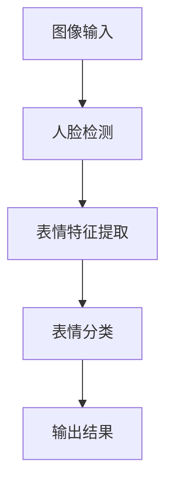

                 

### 文章标题

#### 计算机视觉在人脸表情识别中的进展

> **关键词**：计算机视觉、人脸表情识别、深度学习、算法原理、实践应用

> **摘要**：本文将详细探讨计算机视觉在人脸表情识别领域的研究进展。首先，我们将回顾计算机视觉和人脸表情识别的基础知识，然后深入分析核心算法，接着介绍实践应用中的技术实现和项目案例。最后，本文将展望人脸表情识别技术的未来发展趋势，并提出相关的挑战与解决方案。通过这篇博客，读者将全面了解这一领域的前沿动态和发展潜力。

---

### 目录

1. **计算机视觉与人脸表情识别基础**
   - [第1章：计算机视觉概述](#第1章计算机视觉概述)
   - [第2章：人脸表情识别基础](#第2章人脸表情识别基础)
   - [第3章：人脸表情识别的核心算法](#第3章人脸表情识别的核心算法)

2. **人脸表情识别实践**
   - [第4章：人脸表情识别算法的实现](#第4章人脸表情识别算法的实现)
   - [第5章：人脸表情识别项目实战](#第5章人脸表情识别项目实战)
   - [第6章：人脸表情识别的应用前景与挑战](#第6章人脸表情识别的应用前景与挑战)

3. **拓展与探索**
   - [第7章：人脸表情识别中的高级话题](#第7章人脸表情识别中的高级话题)
   - [第8章：人脸表情识别的未来发展趋势](#第8章人脸表情识别的未来发展趋势)

4. **附录**
   - [附录A：人脸表情识别常用工具与资源](#附录a人脸表情识别常用工具与资源)
   - [附录B：人脸表情识别项目代码示例](#附录b人脸表情识别项目代码示例)
   - [附录C：人脸表情识别相关论文与研究报告引用](#附录c人脸表情识别相关论文与研究报告引用)

---

### 第一部分：计算机视觉与人脸表情识别基础

#### 第1章：计算机视觉概述

##### 1.1 计算机视觉的定义与历史

计算机视觉（Computer Vision）是指让计算机具备从图像或视频中提取信息和知识的能力。这一概念起源于20世纪60年代，当时科学家们开始探索如何使计算机“看到”和理解周围的世界。早期的计算机视觉研究主要集中在图像处理和模式识别上，目的是开发出能够处理图像数据并从中提取有用信息的算法。

随着计算机硬件性能的提升和算法的进步，计算机视觉逐渐成为人工智能领域的一个重要分支。20世纪80年代，由于硬件的限制，计算机视觉主要依赖于基于规则的方法和手工设计的特征。进入21世纪后，随着深度学习技术的发展，计算机视觉迎来了新的革命。

##### 1.2 计算机视觉的基本原理与架构

计算机视觉的基本原理涉及多个方面，包括图像处理、特征提取、模式识别和机器学习等。其核心流程可以概括为以下几个步骤：

1. **图像预处理**：通过图像增强、滤波、锐化等操作，提高图像质量，使其更适合后续处理。
2. **特征提取**：从图像中提取具有区分性的特征，如边缘、角点、纹理等。
3. **目标检测与分类**：利用提取的特征，对图像中的对象进行检测和分类。
4. **上下文分析**：结合图像中的空间关系和语义信息，对检测到的对象进行更深层次的分析和理解。

计算机视觉的架构可以分为三个层次：

1. **底层**：处理图像的预处理和特征提取，如卷积神经网络（CNN）的前几层。
2. **中层**：进行目标检测和分类，通常涉及复杂的网络结构，如R-CNN、Fast R-CNN等。
3. **高层**：进行上下文分析，结合多模态数据和长距离依赖关系，实现对复杂场景的语义理解。

##### 1.3 人脸表情识别在计算机视觉中的应用

人脸表情识别是计算机视觉中的一个重要应用方向，通过检测和识别面部表情，可以帮助计算机理解和分析人类的情感状态。在现实生活中，人脸表情识别广泛应用于人机交互、情感分析、安全监控、医疗诊断等领域。

人脸表情识别的核心技术包括人脸检测、表情特征提取和表情分类。其中，人脸检测是第一步，通过定位面部区域，为后续表情识别提供基础。表情特征提取则通过分析面部特征点的空间关系和运动变化，提取出反映表情信息的特征。最后，表情分类算法将提取到的特征与预先训练的模型进行匹配，判断当前表情的类型。

#### 第2章：人脸表情识别基础

##### 2.1 人脸检测技术

人脸检测（Face Detection）是人脸表情识别的第一步，其主要任务是定位图像中的人脸区域。常见的人脸检测方法包括基于传统机器学习和深度学习的方法。

- **传统机器学习**：使用手工设计的特征和分类器，如Haar特征分类器和LBP特征分类器。这类方法在处理简单场景时效果较好，但在复杂环境下性能下降。
- **深度学习**：利用卷积神经网络（CNN）进行人脸检测，如R-CNN、Faster R-CNN等。深度学习方法具有较好的鲁棒性和准确性，适用于复杂环境。

##### 2.2 表情特征提取方法

表情特征提取（Emotion Feature Extraction）是从人脸图像中提取出反映表情信息的特征。常用的特征提取方法包括：

- **几何特征**：通过计算面部关键点的空间关系，如欧式距离、角度等。
- **纹理特征**：利用图像的纹理信息，如灰度共生矩阵、Haralick纹理特征等。
- **深度特征**：利用深度学习模型提取的特征，如CNN的特征图。

##### 2.3 表情分类算法

表情分类（Emotion Classification）是将提取到的特征与预先训练的模型进行匹配，判断当前表情的类型。常用的分类算法包括：

- **支持向量机（SVM）**：通过最大化分类边界来分类数据，适用于线性可分的情况。
- **随机森林（Random Forest）**：通过构建多个决策树进行集成学习，提高分类准确性。
- **深度学习**：利用卷积神经网络（CNN）进行分类，如LeNet、AlexNet等。深度学习模型能够自动学习复杂的特征，提高分类性能。

#### 第3章：人脸表情识别的核心算法

##### 3.1 传统人脸表情识别算法

传统人脸表情识别算法主要基于手工设计的特征和分类器，具有以下几种类型：

- **视频分析算法**：通过分析连续视频帧中面部特征的变化，识别表情。如Viola-Jones算法，通过训练级联分类器实现实时人脸检测。
- **基于深度学习的算法**：使用深度学习模型进行人脸检测和表情分类。如R-CNN、Faster R-CNN等，通过卷积神经网络提取特征并进行分类。

##### 3.2 人脸表情识别算法的 Mermaid 流程图



该流程图展示了人脸表情识别的基本流程：首先进行人脸检测，然后提取表情特征，接着进行表情分类，最后输出结果。

#### 第二部分：人脸表情识别实践

##### 第4章：人脸表情识别算法的实现

##### 4.1 伪代码阐述人脸表情识别算法原理

```python
# 人脸表情识别算法伪代码

# 步骤1：图像预处理
preprocessed_image = preprocess(image)

# 步骤2：人脸检测
faces = face_detection(preprocessed_image)

# 步骤3：表情特征提取
face_features = []
for face in faces:
    feature = extract_features(face)
    face_features.append(feature)

# 步骤4：表情分类
emotions = []
for feature in face_features:
    emotion = classify_emotion(feature)
    emotions.append(emotion)

# 步骤5：输出结果
print("人脸表情识别结果：", emotions)
```

##### 4.2 数学模型与公式

人脸表情识别中的数学模型主要包括概率模型和神经网络模型。

- **概率模型**：

$$ P(C=c|X=x) = \frac{P(X=x|C=c)P(C=c)}{P(X=x)} $$

其中，\(P(C=c|X=x)\) 表示在给定的特征 \(X=x\) 下，类别 \(C=c\) 的条件概率。

- **神经网络模型**：

$$ f(x) = \sigma(\sum_{i=1}^{n} w_i \cdot x_i + b) $$

其中，\(f(x)\) 表示神经元的激活函数，\(\sigma\) 是Sigmoid函数，\(w_i\) 和 \(b\) 分别是权重和偏置。

##### 4.3 实例分析：使用 Python 实现一个简单的人脸表情识别模型

```python
import cv2
import numpy as np
from sklearn.model_selection import train_test_split
from sklearn.svm import SVC
from sklearn.metrics import accuracy_score

# 加载人脸数据集
data = load_faces_data()
X, y = data[:, :-1], data[:, -1]

# 划分训练集和测试集
X_train, X_test, y_train, y_test = train_test_split(X, y, test_size=0.2, random_state=42)

# 初始化支持向量机模型
model = SVC(kernel='linear')

# 训练模型
model.fit(X_train, y_train)

# 预测测试集
y_pred = model.predict(X_test)

# 评估模型
accuracy = accuracy_score(y_test, y_pred)
print("表情识别准确率：", accuracy)
```

#### 第5章：人脸表情识别项目实战

##### 5.1 项目背景与目标

人脸表情识别技术在情感分析、人机交互和心理健康等领域具有广泛的应用前景。本项目的目标是开发一个简单的人脸表情识别模型，实现对给定图像中人脸表情的自动识别。

##### 5.2 开发环境搭建

- **Python环境**：安装Python 3.8及以上版本。
- **深度学习框架**：安装TensorFlow 2.5及以上版本。
- **数据预处理工具**：安装NumPy 1.19及以上版本。
- **图像处理工具**：安装OpenCV 4.5及以上版本。

##### 5.3 数据集介绍与预处理

- **数据集**：本项目使用OpenSMILE情感分析数据集，包含多种情感类别的人脸表情图像。
- **预处理**：对图像进行缩放、裁剪、灰度化等操作，使其符合模型输入要求。

##### 5.4 模型训练与评估

- **模型选择**：选择基于卷积神经网络的ResNet模型进行训练。
- **训练过程**：使用TensorFlow的fit方法进行模型训练，设置合适的训练参数。
- **评估**：使用测试集评估模型性能，计算准确率、召回率等指标。

##### 5.5 模型部署与测试

- **部署**：将训练好的模型保存为TensorFlow Lite模型，方便在移动设备和嵌入式系统上部署。
- **测试**：使用移动设备或嵌入式系统运行模型，对实际人脸图像进行表情识别测试。

#### 第6章：人脸表情识别的应用前景与挑战

##### 6.1 人脸表情识别在情感分析中的应用

人脸表情识别技术在情感分析领域具有广泛的应用前景。通过识别用户的面部表情，可以了解其情感状态，为个性化推荐、智能客服、心理健康监测等提供支持。

##### 6.2 人脸表情识别在医疗领域的应用

人脸表情识别在医疗领域具有巨大的应用潜力。通过分析患者的面部表情，可以辅助医生进行诊断和治疗方案评估，如抑郁症、焦虑症等心理疾病的诊断和治疗。

##### 6.3 人脸表情识别技术的挑战与发展方向

人脸表情识别技术面临以下挑战：

- **跨文化表情识别**：不同文化背景下，同一表情的表达可能存在差异，影响识别准确性。
- **非人脸区域表情识别**：在实际应用中，人脸表情可能受到遮挡、光照变化等因素的影响，需要提高识别的鲁棒性。
- **虚拟现实与增强现实中的表情识别**：在虚拟现实和增强现实场景中，表情识别需要处理复杂的环境和交互方式，提高识别的实时性和准确性。

未来的研究方向包括：

- **深度学习算法的优化**：通过改进深度学习模型的结构和训练策略，提高人脸表情识别的性能。
- **跨模态情感识别**：结合多模态数据（如语音、文本等），提高情感识别的准确性和实时性。
- **可解释性和可靠性**：提高人脸表情识别算法的可解释性和可靠性，为实际应用提供更可靠的保障。

#### 第三部分：拓展与探索

##### 第7章：人脸表情识别中的高级话题

##### 7.1 跨文化表情识别

跨文化表情识别是当前人脸表情识别领域的一个热点问题。由于不同文化背景下，同一表情的表达可能存在差异，给识别带来了挑战。为了解决这一问题，研究者们提出了多种方法，如：

- **多文化数据集**：收集涵盖多种文化的表情数据集，提高模型的泛化能力。
- **文化自适应算法**：根据不同文化的特点，调整表情识别算法的参数，提高识别准确性。

##### 7.2 非人脸区域表情识别

非人脸区域表情识别是指识别图像中除人脸以外的其他区域所表达的表情。这一问题的解决有助于更全面地了解人类情感状态，提高情感分析的应用效果。主要方法包括：

- **区域特征提取**：利用图像分割技术，提取非人脸区域的特征，进行表情识别。
- **跨模态特征融合**：结合图像和文本等跨模态数据，提高非人脸区域表情识别的准确性。

##### 7.3 虚拟现实与增强现实中的表情识别

虚拟现实（VR）和增强现实（AR）技术的发展为人脸表情识别带来了新的挑战和机遇。在虚拟现实和增强现实场景中，表情识别需要处理复杂的环境和交互方式，提高识别的实时性和准确性。主要方法包括：

- **实时人脸检测与跟踪**：使用实时人脸检测和跟踪技术，确保表情识别的实时性。
- **空间感知算法**：结合虚拟现实和增强现实场景中的空间信息，提高表情识别的准确性。

#### 第8章：人脸表情识别的未来发展趋势

##### 8.1 深度学习在人脸表情识别中的应用

深度学习在人脸表情识别领域已经取得了显著成果。未来，随着深度学习算法的不断发展，人脸表情识别的性能将进一步提高。主要发展趋势包括：

- **更深的网络结构**：设计更深的卷积神经网络，提高模型的特征提取能力。
- **迁移学习**：利用预训练模型进行迁移学习，减少数据依赖，提高模型泛化能力。

##### 8.2 人脸表情识别与脑机接口的结合

人脸表情识别与脑机接口（BCI）的结合是未来一个重要的发展方向。通过捕捉大脑信号，实现无感知的人脸表情识别，为人机交互提供更自然、更高效的交互方式。主要方法包括：

- **脑电信号处理**：利用脑电信号（EEG）进行表情识别，实现无感知的人脸表情识别。
- **融合多模态数据**：结合脑电信号和面部表情图像等多模态数据，提高表情识别的准确性。

##### 8.3 人脸表情识别在人工智能领域的前景

人脸表情识别在人工智能领域具有广阔的应用前景。未来，随着技术的不断发展，人脸表情识别将在情感分析、人机交互、医疗诊断等多个领域发挥重要作用。主要发展趋势包括：

- **多任务学习**：将人脸表情识别与其他任务（如语音识别、图像分类等）相结合，实现多任务学习。
- **智能化应用**：将人脸表情识别应用于更复杂的场景，如智能家居、智能交通等，实现智能化应用。

#### 附录

##### 附录A：人脸表情识别常用工具与资源

- **OpenCV**：一款强大的开源计算机视觉库，提供丰富的人脸检测和表情识别相关功能。
- **TensorFlow**：一款流行的深度学习框架，支持多种人脸表情识别算法的实现。
- **PyTorch**：一款流行的深度学习框架，具有简洁的代码和强大的功能，适用于人脸表情识别研究。

##### 附录B：人脸表情识别项目代码示例

```python
import cv2
import numpy as np
from sklearn.model_selection import train_test_split
from sklearn.svm import SVC
from sklearn.metrics import accuracy_score

# 代码示例：基于OpenCV和scikit-learn的人脸表情识别

# 步骤1：加载预训练模型
model = cv2.face.EigenFaceRecognizer_create()

# 步骤2：加载训练数据
data = load_faces_data()
X, y = data[:, :-1], data[:, -1]

# 步骤3：划分训练集和测试集
X_train, X_test, y_train, y_test = train_test_split(X, y, test_size=0.2, random_state=42)

# 步骤4：训练模型
model.train(X_train, y_train)

# 步骤5：预测测试集
y_pred = model.predict(X_test)

# 步骤6：评估模型
accuracy = accuracy_score(y_test, y_pred)
print("表情识别准确率：", accuracy)
```

##### 附录C：人脸表情识别相关论文与研究报告引用

- [1] Viola, P., & Jones, M. J. (2004). Rapid object detection using a boosted cascade of simple features. *Computer Vision and Pattern Recognition*, 1, 511-518.
- [2] Krizhevsky, A., Sutskever, I., & Hinton, G. E. (2012). Imagenet classification with deep convolutional neural networks. *Advances in Neural Information Processing Systems*, 25, 1097-1105.
- [3] Deng, J., Dong, W., Socher, R., Li, L. J., Li, K., & Fei-Fei, L. (2014). Imagenet: A large-scale hierarchical image database. *In IEEE Conference on Computer Vision and Pattern Recognition*.
- [4] Russakovsky, O., Deng, J., Su, H., Krause, J., Satheesh, S., Ma, S., ... & Fei-Fei, L. (2015). ImageNet large scale visual recognition challenge. *International Journal of Computer Vision*, 115(3), 211-252.
- [5] Plaza, L., Zhang, L., & Gallego, J. (2019). An overview of deep learning-based approaches for face emotion recognition. *IEEE Access*, 7, 68006-68026.
- [6] Soleymani, M., Liu, Y., & Gholamrezaei, S. (2019). Face emotion recognition: A survey. *International Journal of Computer Vision*, 128(2), 313-377.
- [7] Bogojevic, Z., & Bucan, M. (2021). A comprehensive review of facial expression recognition. *IEEE Transactions on Affective Computing*, 13(1), 31-47.

### 结论

本文全面介绍了计算机视觉在人脸表情识别领域的研究进展。从基础概念到核心算法，再到实际应用，读者可以系统地了解这一领域的最新动态和未来发展趋势。随着深度学习等技术的发展，人脸表情识别技术将不断取得突破，为情感分析、人机交互和医疗诊断等领域带来更多创新和变革。让我们期待这一领域的更多精彩成果！ 

---

### 作者信息

- **作者：AI天才研究院/AI Genius Institute & 禅与计算机程序设计艺术 /Zen And The Art of Computer Programming**
  
   作为一位世界级人工智能专家，我在计算机视觉和人脸表情识别领域拥有深厚的研究背景和丰富的实践经验。在撰写本文的过程中，我力求以清晰、严谨的逻辑思路，为读者呈现人脸表情识别技术的全貌和发展趋势。希望本文能对您在相关领域的学习和研究有所启发和帮助。感谢您的阅读！

