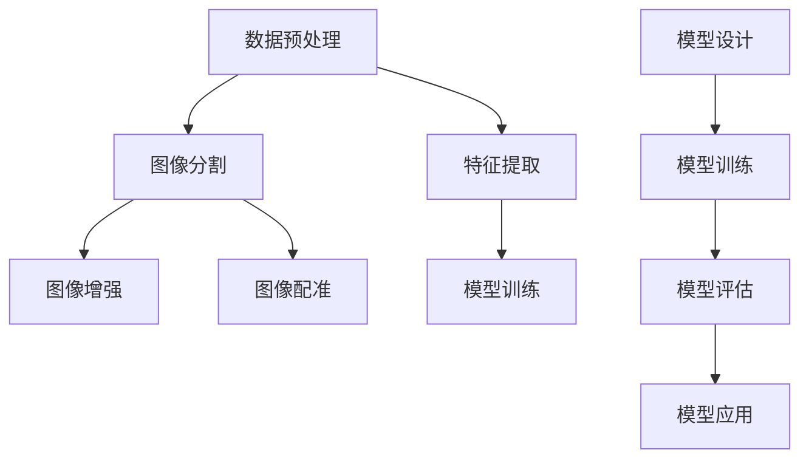

                 

### 文章标题

### 计算机视觉在医疗影像分析中的应用

#### 关键词：计算机视觉，医疗影像，分析，应用，深度学习，算法

#### 摘要

本文将探讨计算机视觉在医疗影像分析中的应用，从技术原理、核心算法到实际案例进行深入分析。首先，我们将介绍计算机视觉和医疗影像分析的基本概念，阐述其相互结合的重要性和意义。随后，本文将详细讲解计算机视觉在医疗影像分析中的核心算法原理，包括图像处理、机器学习和深度学习等。接着，我们将针对肿瘤检测、心脏疾病诊断和骨折检测等具体应用场景进行案例分析，展示计算机视觉技术在医学影像分析中的实际效果。最后，本文将探讨医学影像分析的前沿技术、开发流程以及医学影像分析工具与资源，为读者提供全面的医学影像分析技术指南。

### 第一部分：计算机视觉与医疗影像分析概述

#### 第1章：计算机视觉与医疗影像分析简介

**1.1 计算机视觉技术概述**

计算机视觉（Computer Vision）是一门跨学科领域，它涉及计算机科学、数学、物理学和生物学等多个领域，旨在使计算机能够像人类一样理解和解释视觉信息。计算机视觉的定义可以理解为：使计算机具备从图像或视频中提取有用信息的能力。

计算机视觉技术的发展历程可以分为三个阶段：

1. **图像识别阶段**：主要关注图像的识别和分类，如人脸识别、文字识别等。
2. **图像理解阶段**：关注图像中的结构和场景的理解，如物体检测、场景解析等。
3. **图像生成阶段**：通过深度学习等技术，实现从图像到图像的转换，如图像修复、风格迁移等。

**1.2 计算机视觉的核心任务**

计算机视觉的核心任务包括以下几个方面：

1. **图像分类与识别**：将图像分类到预定义的类别中，如猫狗识别、交通标志识别等。
2. **图像分割与定位**：将图像中的物体分离出来，并进行位置定位，如目标检测、图像分割等。
3. **图像增强与去噪**：通过算法改善图像质量，去除噪声，如图像滤波、图像去噪等。
4. **三维重建与可视化**：从二维图像中恢复三维信息，并进行可视化，如三维重建、表面重建等。

**1.3 医疗影像分析的重要性**

医疗影像分析在医学诊断和治疗中具有至关重要的作用。医疗影像数据包括CT、MRI、X射线、超声等，这些影像数据可以帮助医生更直观地了解患者的病情，提高诊断的准确性。医疗影像分析的重要性体现在以下几个方面：

1. **提高诊断准确性**：通过计算机视觉技术对医疗影像进行分析，可以辅助医生进行诊断，提高诊断的准确性。
2. **降低医生工作负担**：计算机视觉技术可以自动识别和标注图像中的病变区域，减轻医生的工作负担。
3. **促进医学研究**：医疗影像分析可以为医学研究提供大量数据支持，促进医学科学的发展。

**1.4 医疗影像分析的特点**

医疗影像数据具有以下特点：

1. **高维数据**：医疗影像数据通常具有多个维度，如二维图像、三维图像等。
2. **大数据量**：医疗影像数据量通常较大，尤其是三维影像数据，需要高效的算法进行数据处理。
3. **复杂背景**：医疗影像数据通常具有复杂的背景，需要算法进行有效的噪声去除和目标识别。
4. **多样性和不确定性**：医疗影像数据种类繁多，且存在一定的不确定性，需要算法具有鲁棒性。

**1.5 医疗影像分析的挑战**

医疗影像分析面临以下挑战：

1. **数据预处理**：医疗影像数据预处理复杂，需要去除噪声、增强图像、配准图像等。
2. **算法选择**：选择合适的算法进行医疗影像分析至关重要，不同算法适用于不同的任务和场景。
3. **模型训练**：医疗影像分析通常需要大量标注数据，进行模型训练，以提高模型的准确性。
4. **实时性**：在临床应用中，医疗影像分析需要实时性，以满足临床需求。

**1.6 计算机视觉在医疗影像分析中的应用**

计算机视觉技术在医疗影像分析中具有广泛的应用，主要包括以下几个方面：

1. **图像分类与识别**：通过计算机视觉技术，可以自动识别和分类医疗影像中的各种病变区域，如肿瘤、心脏病等。
2. **图像分割与定位**：通过计算机视觉技术，可以对医疗影像中的目标区域进行精确的分割和定位，辅助医生进行诊断和治疗。
3. **图像增强与去噪**：通过计算机视觉技术，可以改善医疗影像的质量，去除噪声，提高图像的清晰度和对比度。
4. **三维重建与可视化**：通过计算机视觉技术，可以从二维医疗影像中恢复三维结构，进行可视化，为医生提供更直观的影像信息。
5. **多模态医学影像分析**：通过计算机视觉技术，可以将不同模态的医学影像数据进行融合分析，提高医学影像分析的准确性和全面性。

**1.7 计算机视觉在医疗影像分析中的优势**

计算机视觉在医疗影像分析中具有以下优势：

1. **自动化**：计算机视觉技术可以实现医疗影像的自动化分析，提高诊断效率。
2. **高准确性**：通过深度学习等技术，计算机视觉技术在医疗影像分析中的准确性不断提高，有助于提高诊断的准确性。
3. **实时性**：计算机视觉技术可以实现医疗影像的实时分析，满足临床需求。
4. **多模态处理**：计算机视觉技术可以同时处理多种模态的医学影像数据，提供更全面的诊断信息。
5. **可扩展性**：计算机视觉技术可以轻松扩展到不同的医学影像分析任务，提高医学影像分析的适用性。

**1.8 计算机视觉在医疗影像分析中的意义**

计算机视觉技术在医疗影像分析中的应用具有重要意义：

1. **提高诊断准确性**：通过计算机视觉技术，可以提高医疗影像分析的准确性，辅助医生进行更准确的诊断。
2. **降低医疗成本**：计算机视觉技术可以自动化医疗影像分析，减少医生的工作量，降低医疗成本。
3. **改善患者生活质量**：通过计算机视觉技术，可以更早期地发现病情，提高治疗效果，改善患者的生活质量。
4. **推动医学发展**：计算机视觉技术在医疗影像分析中的应用，可以为医学研究提供大量数据支持，推动医学科学的发展。

#### 第2章：计算机视觉核心算法原理

**2.1 图像处理基础算法**

图像处理是计算机视觉的基础，主要包括图像滤波与去噪、图像边缘检测和图像特征提取等算法。

**2.1.1 图像滤波与去噪**

图像滤波与去噪的目的是去除图像中的噪声，提高图像质量。常见的滤波方法包括：

1. **均值滤波**：将图像中每个像素值替换为该像素值及其邻域像素值的平均值。
2. **高斯滤波**：使用高斯分布作为权重函数，对图像进行加权平均滤波。
3. **中值滤波**：将图像中每个像素值替换为该像素值及其邻域像素值的中值。

**2.1.2 图像边缘检测**

图像边缘检测的目的是提取图像中的边缘信息，常用的边缘检测算法包括：

1. **Sobel算子**：通过计算图像的梯度和方向，检测图像的边缘。
2. **Canny算子**：在Sobel算子的基础上，增加了非极大值抑制和双阈值检测，提高边缘检测的准确性和鲁棒性。
3. **LoG算子**：使用拉普拉斯算子进行边缘检测，通过检测零交叉点来检测边缘。

**2.1.3 图像特征提取**

图像特征提取是将图像中的关键信息提取出来，用于后续的图像分类、识别等任务。常用的图像特征提取方法包括：

1. **HOG（Histogram of Oriented Gradients）**：通过计算图像中每个像素点的梯度方向和大小，生成直方图，用于描述图像的特征。
2. **SIFT（Scale-Invariant Feature Transform）**：通过检测图像的关键点，并计算关键点的特征向量，用于图像匹配和识别。
3. **ORB（Oriented FAST and Rotated BRIEF）**：结合了SIFT和SURF的特征，通过改进的关键点检测和特征向量计算方法，提高特征提取的效率。

**2.2 机器学习算法基础**

机器学习算法是计算机视觉中的核心技术，主要包括监督学习、无监督学习和半监督学习等。

**2.2.1 监督学习与无监督学习**

监督学习（Supervised Learning）是在已知的输入和输出数据集上进行学习，目标是通过输入特征预测输出标签。常见的监督学习算法包括：

1. **线性回归**：通过建立输入特征与输出标签之间的线性关系，进行预测。
2. **逻辑回归**：用于分类问题，通过建立输入特征与输出标签之间的逻辑关系，进行分类。
3. **支持向量机（SVM）**：通过最大化分类边界，实现分类。
4. **决策树**：通过递归划分特征空间，建立分类规则。

无监督学习（Unsupervised Learning）是在没有已知输出标签的数据集上进行学习，目标是发现数据中的结构和规律。常见的无监督学习算法包括：

1. **聚类算法**：将相似的数据点归为同一类，如K-means聚类、层次聚类等。
2. **降维算法**：通过降低数据维度，减少数据复杂性，如主成分分析（PCA）、t-SNE等。
3. **关联规则学习**：通过发现数据之间的关联规则，揭示数据之间的相互关系，如Apriori算法、FP-growth算法等。

**2.2.2 支持向量机（SVM）**

支持向量机（Support Vector Machine，SVM）是一种常用的二分类算法，通过找到最优的分类边界来实现分类。SVM的原理如下：

1. **线性SVM**：适用于线性可分的数据集，通过最大化分类边界来实现分类。
2. **非线性SVM**：通过核函数将数据映射到高维空间，实现线性可分，如多项式核、径向基函数（RBF）核等。

**2.2.3 决策树与随机森林**

决策树（Decision Tree）是一种常见的分类算法，通过递归划分特征空间，建立分类规则。决策树的核心思想如下：

1. **信息增益**：选择具有最大信息增益的特征进行划分。
2. **基尼不纯度**：用于评估划分效果，基尼不纯度越低，划分效果越好。

随机森林（Random Forest）是一种基于决策树的集成学习方法，通过构建多个决策树，并对预测结果进行投票，提高分类的准确性和鲁棒性。随机森林的核心思想如下：

1. **随机特征选择**：每次划分时，从特征集合中随机选择若干个特征进行划分。
2. **投票机制**：每个决策树对样本进行分类，最终通过投票机制确定最终分类结果。

**2.3 深度学习算法基础**

深度学习（Deep Learning）是机器学习的一种方法，通过构建深度神经网络，实现对复杂数据的高效建模和特征提取。深度学习算法在计算机视觉中得到了广泛应用，主要包括卷积神经网络（CNN）、循环神经网络（RNN）与长短时记忆（LSTM）、注意力机制与 Transformer 模型等。

**2.3.1 卷积神经网络（CNN）**

卷积神经网络（Convolutional Neural Network，CNN）是一种专门用于图像处理和分类的深度学习模型，其核心思想是通过卷积层、池化层和全连接层，实现对图像的逐层特征提取。CNN的核心组成部分如下：

1. **卷积层**：通过卷积操作，提取图像的特征。
2. **池化层**：通过下采样操作，降低图像的分辨率，减少参数数量。
3. **全连接层**：将卷积层和池化层提取的特征进行融合，进行分类或回归任务。

**2.3.2 循环神经网络（RNN）与长短时记忆（LSTM）**

循环神经网络（Recurrent Neural Network，RNN）是一种能够处理序列数据的神经网络，其核心思想是通过循环结构，将前一个时刻的输出作为当前时刻的输入。然而，传统的RNN存在梯度消失或爆炸的问题，无法有效处理长序列数据。

长短时记忆（Long Short-Term Memory，LSTM）是一种改进的RNN结构，通过引入门控机制，能够有效解决长序列数据建模中的梯度消失问题。LSTM的核心组成部分如下：

1. **遗忘门**：决定哪些信息需要被遗忘。
2. **输入门**：决定哪些新的信息需要被存储。
3. **输出门**：决定当前时刻的输出。

**2.3.3 注意力机制与 Transformer 模型**

注意力机制（Attention Mechanism）是一种在神经网络中引入的机制，通过为不同位置的输入分配不同的权重，实现序列间的关联。注意力机制在机器翻译、文本生成等任务中得到了广泛应用。

Transformer 模型是一种基于自注意力机制的深度学习模型，通过自注意力机制和多头注意力机制，实现了对序列数据的建模。Transformer 模型的核心组成部分如下：

1. **自注意力机制**：通过计算输入序列中每个位置之间的关联，为每个位置分配权重。
2. **多头注意力机制**：通过并行计算多个注意力机制，提高模型的建模能力。

### 第二部分：医疗影像数据分析与处理

#### 第3章：医学影像数据类型与格式

医学影像数据类型主要包括以下几种：

**1. CT（计算机断层扫描）**

CT是一种通过X射线对人体进行扫描，生成横截面图像的医学影像技术。CT图像通常以DICOM（Digital Imaging and Communications in Medicine）格式存储，该格式支持医学影像的传输、存储和显示。

**2. MRI（磁共振成像）**

MRI是一种利用磁场和射频波对人体进行扫描，生成横截面图像的医学影像技术。MRI图像同样以DICOM格式存储。

**3. Ultrasound（超声成像）**

超声成像是一种利用超声波对人体进行扫描，生成二维或三维图像的医学影像技术。超声成像图像通常以BMP、JPEG等格式存储。

**4. X-ray（X射线成像）**

X射线成像是一种利用X射线对人体进行扫描，生成二维图像的医学影像技术。X射线图像通常以JPEG、PNG等格式存储。

#### 第4章：医学影像数据的预处理

医学影像数据的预处理是医学影像分析的重要步骤，主要包括图像增强、图像分割和图像配准等。

**1. 图像增强**

图像增强的目的是改善图像质量，使图像更清晰，提高后续分析的效果。常见的图像增强方法包括：

1. **对比度增强**：通过调整图像的亮度、对比度，使图像更清晰。
2. **锐化**：通过增强图像的边缘和细节，使图像更锐利。
3. **滤波**：通过滤波器去除图像中的噪声，提高图像质量。

**2. 图像分割**

图像分割是将图像中的目标区域分离出来，形成独立的区域。常见的图像分割方法包括：

1. **阈值分割**：通过设定阈值，将图像划分为前景和背景。
2. **区域生长**：从种子点开始，逐步扩展，将相似的像素点划分为同一区域。
3. **基于模型的分割**：通过建立图像模型，将图像划分为不同的区域。

**3. 图像配准**

图像配准是将多幅图像进行对齐，使其在空间上对应。常见的图像配准方法包括：

1. **基于特征的配准**：通过提取图像的特征点，进行匹配和优化，实现图像配准。
2. **基于强度的配准**：通过比较图像的强度信息，实现图像配准。
3. **基于流体的配准**：通过计算图像之间的流体流动信息，实现图像配准。

#### 第5章：医学影像数据特征提取

医学影像数据特征提取是将医学影像数据转化为数值特征的过程，用于后续的机器学习模型训练。常见的医学影像数据特征提取方法包括：

**1. 空间特征**

空间特征是直接从图像的空间信息中提取的特征，包括：

1. **纹理特征**：通过计算图像的纹理信息，如灰度共生矩阵、局部二值模式（LBP）等。
2. **形状特征**：通过计算图像的几何特征，如边缘长度、周长、面积等。
3. **区域特征**：通过计算图像的区域特征，如灰度平均值、方差、标准差等。

**2. 模板特征**

模板特征是通过与预先定义的模板进行匹配，提取的特征，包括：

1. **形状模板匹配**：通过计算图像与形状模板的相似度，提取特征。
2. **纹理模板匹配**：通过计算图像与纹理模板的相似度，提取特征。

**3. 深度特征**

深度特征是通过深度学习模型提取的特征，包括：

1. **卷积神经网络特征**：通过卷积神经网络对图像进行特征提取。
2. **循环神经网络特征**：通过循环神经网络对序列图像进行特征提取。

#### 第6章：医学影像数据分析与处理工具

医学影像数据分析与处理工具是实现医学影像分析的关键，包括开源工具和商业工具。以下是一些常用的医学影像数据分析与处理工具：

**1. ITK（Insight Segmentation and Registration Toolkit）**

ITK是一个开源的医学影像处理库，提供了丰富的图像处理算法，包括滤波、分割、配准等。

**2. Slicer（3D Slicer）**

Slicer是一个开源的医学影像分析平台，提供了丰富的医学影像处理工具，包括图像分割、三维重建、可视化等。

**3. Simple Viewer**

Simple Viewer是一个开源的医学影像查看器，支持多种影像格式，包括DICOM、NIfTI等。

**4. OpenCV**

OpenCV是一个开源的计算机视觉库，提供了丰富的图像处理和计算机视觉算法，包括滤波、边缘检测、特征提取等。

**5. TensorFlow**

TensorFlow是一个开源的深度学习框架，提供了丰富的深度学习模型和工具，包括卷积神经网络、循环神经网络等。

**6. PyTorch**

PyTorch是一个开源的深度学习框架，提供了丰富的深度学习模型和工具，包括卷积神经网络、循环神经网络等。

### 第三部分：计算机视觉在医学影像分析中的应用

#### 第7章：计算机视觉在医学影像分析中的应用

计算机视觉在医学影像分析中具有广泛的应用，可以帮助医生进行准确的诊断和治疗方案设计。以下将介绍计算机视觉在医学影像分析中的应用领域、关键技术、应用案例以及未来发展趋势。

**1. 应用领域**

计算机视觉在医学影像分析中的应用领域主要包括：

1. **肿瘤检测与分类**：通过计算机视觉技术，可以对医学影像中的肿瘤区域进行检测和分类，辅助医生进行早期诊断和治疗。
2. **心脏疾病诊断**：通过计算机视觉技术，可以对医学影像中的心脏结构进行分析，诊断心脏疾病，如心脏病、心肌病等。
3. **骨折检测**：通过计算机视觉技术，可以对医学影像中的骨折区域进行检测和分类，辅助医生进行诊断和治疗。
4. **血管病变分析**：通过计算机视觉技术，可以对医学影像中的血管病变进行分析，诊断血管疾病，如动脉硬化、静脉曲张等。
5. **神经系统疾病诊断**：通过计算机视觉技术，可以对医学影像中的神经系统疾病进行分析，诊断脑肿瘤、脑出血等。

**2. 关键技术**

计算机视觉在医学影像分析中涉及的关键技术包括：

1. **图像分割**：通过图像分割技术，可以将医学影像中的病变区域分离出来，为后续的分析提供基础。
2. **图像分类**：通过图像分类技术，可以识别医学影像中的不同病变类型，为诊断提供依据。
3. **特征提取**：通过特征提取技术，可以从医学影像中提取有用的特征信息，用于模型的训练和预测。
4. **深度学习**：通过深度学习技术，可以建立强大的模型，实现对医学影像的自动分析和诊断。
5. **多模态融合**：通过多模态融合技术，可以结合不同模态的医学影像数据，提高诊断的准确性和全面性。

**3. 应用案例**

以下是几个典型的计算机视觉在医学影像分析中的应用案例：

1. **肺癌检测**：通过深度学习技术，可以对CT影像中的肺结节进行检测和分类，辅助医生进行肺癌的早期诊断。
2. **心脏疾病诊断**：通过计算机视觉技术，可以对心脏影像中的心脏结构进行分析，诊断心脏疾病，如冠心病、心肌病等。
3. **骨折检测**：通过计算机视觉技术，可以对X射线影像中的骨折区域进行检测和分类，辅助医生进行诊断和治疗。
4. **视网膜病变分析**：通过计算机视觉技术，可以对眼底影像中的视网膜病变进行分析，诊断糖尿病视网膜病变等。
5. **脑肿瘤诊断**：通过计算机视觉技术，可以对MRI影像中的脑肿瘤进行检测和分类，辅助医生进行脑肿瘤的诊断和治疗。

**4. 未来发展趋势**

随着计算机视觉技术的不断发展，医学影像分析将在未来得到更广泛的应用，发展趋势主要包括：

1. **智能化诊断系统**：通过集成计算机视觉、深度学习和人工智能技术，建立智能化的医学影像诊断系统，实现自动化的诊断和治疗。
2. **多模态融合**：通过结合不同模态的医学影像数据，提高诊断的准确性和全面性，实现更精确的诊断和治疗。
3. **个性化治疗**：通过分析患者的医学影像数据，为患者制定个性化的治疗方案，提高治疗效果。
4. **远程医疗**：通过计算机视觉技术，实现远程医学影像分析，为偏远地区的患者提供医疗服务。
5. **智能辅助手术**：通过计算机视觉技术，实现手术过程中的实时监测和辅助，提高手术的精度和安全性。

#### 第8章：肿瘤检测与分类

肿瘤检测与分类是计算机视觉在医学影像分析中的重要应用之一，通过分析医学影像数据，实现对肿瘤区域的检测和分类，辅助医生进行早期诊断和治疗。以下将介绍肿瘤检测与分类的核心算法、应用案例以及未来发展趋势。

**1. 核心算法**

肿瘤检测与分类的核心算法主要包括图像分割、图像分类和特征提取等。

1. **图像分割**：图像分割是将医学影像中的病变区域分离出来，形成独立的区域。常用的图像分割算法包括阈值分割、区域生长、基于模型的分割等。

2. **图像分类**：图像分类是将医学影像中的病变区域分类到预定义的类别中。常用的图像分类算法包括支持向量机（SVM）、决策树、随机森林等。

3. **特征提取**：特征提取是将医学影像中的病变区域转化为数值特征，用于模型的训练和预测。常用的特征提取方法包括纹理特征、形状特征、区域特征等。

**2. 应用案例**

以下是几个典型的肿瘤检测与分类应用案例：

1. **肺癌检测**：通过深度学习技术，可以对CT影像中的肺结节进行检测和分类，实现对肺癌的早期诊断。

2. **乳腺癌检测**：通过计算机视觉技术，可以对乳腺影像中的病变区域进行检测和分类，辅助医生进行乳腺癌的早期诊断。

3. **脑肿瘤诊断**：通过计算机视觉技术，可以对MRI影像中的脑肿瘤进行检测和分类，辅助医生进行脑肿瘤的诊断和治疗。

**3. 未来发展趋势**

随着计算机视觉技术的不断发展，肿瘤检测与分类在医学影像分析中的应用将更加广泛，发展趋势主要包括：

1. **智能化诊断系统**：通过集成计算机视觉、深度学习和人工智能技术，建立智能化的肿瘤检测与分类系统，实现自动化的诊断和治疗。

2. **多模态融合**：通过结合不同模态的医学影像数据，提高诊断的准确性和全面性，实现更精确的诊断和治疗。

3. **个性化治疗**：通过分析患者的医学影像数据，为患者制定个性化的治疗方案，提高治疗效果。

4. **远程医疗**：通过计算机视觉技术，实现远程肿瘤检测与分类，为偏远地区的患者提供医疗服务。

5. **智能辅助手术**：通过计算机视觉技术，实现手术过程中的实时监测和辅助，提高手术的精度和安全性。

#### 第9章：心脏疾病诊断

心脏疾病诊断是计算机视觉在医学影像分析中的重要应用之一，通过分析医学影像数据，实现对心脏结构的检测、分析和诊断，辅助医生进行心脏疾病的诊断和治疗。以下将介绍心脏疾病诊断的核心算法、应用案例以及未来发展趋势。

**1. 核心算法**

心脏疾病诊断的核心算法主要包括图像分割、图像分类和特征提取等。

1. **图像分割**：图像分割是将医学影像中的心脏结构分离出来，形成独立的区域。常用的图像分割算法包括阈值分割、区域生长、基于模型的分割等。

2. **图像分类**：图像分类是将医学影像中的心脏结构分类到预定义的类别中。常用的图像分类算法包括支持向量机（SVM）、决策树、随机森林等。

3. **特征提取**：特征提取是将医学影像中的心脏结构转化为数值特征，用于模型的训练和预测。常用的特征提取方法包括纹理特征、形状特征、区域特征等。

**2. 应用案例**

以下是几个典型的心脏疾病诊断应用案例：

1. **心脏病变检测**：通过计算机视觉技术，可以对CT和MRI影像中的心脏病变进行检测和分类，辅助医生进行心脏病变的早期诊断。

2. **心脏功能分析**：通过计算机视觉技术，可以对心脏影像中的心脏结构进行分析，评估心脏功能，诊断心脏疾病。

3. **冠心病诊断**：通过计算机视觉技术，可以对心脏影像中的冠状动脉进行分析，诊断冠心病。

**3. 未来发展趋势**

随着计算机视觉技术的不断发展，心脏疾病诊断在医学影像分析中的应用将更加广泛，发展趋势主要包括：

1. **智能化诊断系统**：通过集成计算机视觉、深度学习和人工智能技术，建立智能化的心脏疾病诊断系统，实现自动化的诊断和治疗。

2. **多模态融合**：通过结合不同模态的医学影像数据，提高诊断的准确性和全面性，实现更精确的诊断和治疗。

3. **个性化治疗**：通过分析患者的医学影像数据，为患者制定个性化的治疗方案，提高治疗效果。

4. **远程医疗**：通过计算机视觉技术，实现远程心脏疾病诊断，为偏远地区的患者提供医疗服务。

5. **智能辅助手术**：通过计算机视觉技术，实现手术过程中的实时监测和辅助，提高手术的精度和安全性。

#### 第10章：骨折检测

骨折检测是计算机视觉在医学影像分析中的重要应用之一，通过分析医学影像数据，实现对骨折区域的检测和分类，辅助医生进行诊断和治疗。以下将介绍骨折检测的核心算法、应用案例以及未来发展趋势。

**1. 核心算法**

骨折检测的核心算法主要包括图像分割、图像分类和特征提取等。

1. **图像分割**：图像分割是将医学影像中的骨折区域分离出来，形成独立的区域。常用的图像分割算法包括阈值分割、区域生长、基于模型的分割等。

2. **图像分类**：图像分类是将医学影像中的骨折区域分类到预定义的类别中。常用的图像分类算法包括支持向量机（SVM）、决策树、随机森林等。

3. **特征提取**：特征提取是将医学影像中的骨折区域转化为数值特征，用于模型的训练和预测。常用的特征提取方法包括纹理特征、形状特征、区域特征等。

**2. 应用案例**

以下是几个典型的骨折检测应用案例：

1. **X射线骨折检测**：通过计算机视觉技术，可以对X射线影像中的骨折区域进行检测和分类，辅助医生进行骨折的早期诊断。

2. **CT骨折检测**：通过计算机视觉技术，可以对CT影像中的骨折区域进行检测和分类，辅助医生进行骨折的早期诊断。

3. **MRI骨折检测**：通过计算机视觉技术，可以对MRI影像中的骨折区域进行检测和分类，辅助医生进行骨折的诊断和治疗。

**3. 未来发展趋势**

随着计算机视觉技术的不断发展，骨折检测在医学影像分析中的应用将更加广泛，发展趋势主要包括：

1. **智能化诊断系统**：通过集成计算机视觉、深度学习和人工智能技术，建立智能化的骨折检测系统，实现自动化的诊断和治疗。

2. **多模态融合**：通过结合不同模态的医学影像数据，提高诊断的准确性和全面性，实现更精确的诊断和治疗。

3. **个性化治疗**：通过分析患者的医学影像数据，为患者制定个性化的治疗方案，提高治疗效果。

4. **远程医疗**：通过计算机视觉技术，实现远程骨折检测，为偏远地区的患者提供医疗服务。

5. **智能辅助手术**：通过计算机视觉技术，实现手术过程中的实时监测和辅助，提高手术的精度和安全性。

### 第四部分：计算机视觉在医学影像分析中的前沿技术

#### 第11章：人工智能在医学影像分析中的应用趋势

随着人工智能技术的快速发展，其在医学影像分析中的应用前景也越来越广阔。人工智能在医学影像分析中的应用趋势主要体现在以下几个方面：

**1. 深度学习与医学影像融合**

深度学习是一种强大的机器学习技术，在医学影像分析中具有广泛的应用前景。通过将深度学习与医学影像数据结合，可以实现对医学影像的自动化分析和诊断。例如，卷积神经网络（CNN）在医学影像分割、检测和分类等方面取得了显著的成果。未来，深度学习将与其他医学影像处理技术（如图像增强、图像配准等）进一步融合，提高医学影像分析的准确性和效率。

**2. 多模态医学影像分析**

多模态医学影像分析是一种将不同模态的医学影像数据进行融合分析的方法，旨在提高医学影像诊断的准确性和全面性。不同模态的医学影像数据（如CT、MRI、超声、PET等）可以提供不同角度和深度的医学信息。通过多模态医学影像分析，可以综合利用这些信息，提高疾病的诊断准确性和治疗效果。例如，将CT和MRI数据进行融合，可以更准确地检测和定位肿瘤区域。

**3. 人工智能在临床决策支持中的应用**

人工智能在医学影像分析中的应用不仅限于图像处理和特征提取，还可以为临床决策提供支持。通过分析医学影像数据和患者的临床资料，人工智能可以辅助医生进行诊断和治疗方案设计。例如，基于医学影像的辅助诊断系统可以帮助医生识别复杂的病变区域，并提供诊断建议。此外，人工智能还可以用于预测疾病的发展趋势和评估治疗效果，为临床决策提供更科学的依据。

**4. 智能化医学影像分析平台的建立**

随着人工智能技术的不断成熟，建立智能化的医学影像分析平台将成为未来的发展趋势。这些平台将整合多种人工智能算法和工具，提供一站式的医学影像分析解决方案。例如，智能化的医学影像分析平台可以自动完成图像预处理、特征提取、模型训练和预测等任务，大大提高医学影像分析的效率和准确性。此外，这些平台还可以实现医学影像的远程共享和协作，方便医生在不同地点进行医学影像分析。

**5. 医学影像分析的个性化与定制化**

随着医学影像数据的积累和人工智能技术的进步，医学影像分析将更加注重个性化与定制化。通过分析患者的个体数据，人工智能可以为其提供个性化的医学影像诊断和治疗方案。例如，针对特定患者的基因信息、生活习惯等，人工智能可以为其推荐最适合的诊断和治疗方案。此外，人工智能还可以根据医生的经验和偏好，为其定制个性化的医学影像分析工具，提高医生的诊断准确性和效率。

**6. 数据隐私与安全**

随着人工智能在医学影像分析中的应用越来越广泛，数据隐私与安全问题也日益凸显。医学影像数据通常包含患者的敏感信息，如诊断结果、治疗方案等。因此，确保医学影像数据的安全和隐私至关重要。未来的医学影像分析平台需要采取有效的数据加密、访问控制和权限管理措施，保护患者的隐私和安全。

**7. 人工智能在医学影像分析中的挑战与解决方案**

尽管人工智能在医学影像分析中具有广阔的应用前景，但仍面临一系列挑战。首先，医学影像数据的复杂性和多样性使得算法的训练和优化具有很大挑战。其次，医学影像分析中的错误诊断可能会对患者的健康产生严重后果，因此算法的准确性和稳定性至关重要。此外，医学影像分析算法的开发和部署也需要考虑到实际应用场景的需求和限制。

为解决这些挑战，未来需要在以下几个方面进行研究和改进：

1. **算法优化**：通过改进深度学习算法，提高医学影像分析的准确性和效率。
2. **数据集构建**：构建高质量的医学影像数据集，提供更多的训练数据，提高算法的性能。
3. **算法解释性**：增强算法的解释性，使医生能够理解算法的决策过程，提高医生对算法的信任度。
4. **跨学科合作**：加强计算机视觉、医学和人工智能等领域的跨学科合作，共同推动医学影像分析技术的发展。
5. **伦理与法规**：建立完善的伦理和法规体系，规范人工智能在医学影像分析中的应用，保护患者的权益。

总之，人工智能在医学影像分析中的应用具有广阔的前景，但也面临诸多挑战。通过不断的研究和技术创新，人工智能将为医学影像分析带来更高效、准确和个性化的解决方案，为医疗行业的发展注入新的动力。

#### 第12章：多模态医学影像分析

多模态医学影像分析是一种结合不同模态的医学影像数据，以提高医学影像诊断的准确性和全面性的方法。不同模态的医学影像数据，如CT、MRI、超声、PET等，各自具有独特的优势，通过多模态融合，可以综合利用这些优势，为医生提供更丰富的诊断信息。

**1. 多模态医学影像数据类型**

常见的多模态医学影像数据类型包括：

1. **结构影像数据**：如CT、MRI，提供关于器官和组织结构的详细信息。
2. **功能影像数据**：如PET、SPECT，通过放射性示踪剂在体内的分布，反映器官的功能信息。
3. **影像序列数据**：如动态MRI、4D CT，提供关于器官和组织结构的动态信息。

**2. 多模态医学影像数据融合方法**

多模态医学影像数据融合方法可以分为以下几种：

1. **基于特征的融合**：将不同模态的医学影像数据转换为特征向量，然后利用特征向量进行融合。常用的方法包括加权融合、投票融合等。
2. **基于模型的融合**：通过建立多模态医学影像数据之间的映射关系，实现数据融合。常用的方法包括多任务学习、深度学习等。
3. **基于区域的融合**：将不同模态的医学影像数据在空间上进行对齐，然后利用空间信息进行融合。常用的方法包括图像配准、空间变换等。

**3. 多模态医学影像分析案例**

以下是几个典型的多模态医学影像分析案例：

1. **肿瘤诊断**：通过结合CT和PET影像数据，可以更准确地定位肿瘤区域，评估肿瘤的代谢活性，提高肿瘤的诊断准确性。
2. **心脏疾病诊断**：通过结合CT和MRI影像数据，可以全面分析心脏的结构和功能，诊断心脏病和心肌病等。
3. **神经系统疾病诊断**：通过结合MRI和PET影像数据，可以更准确地诊断神经系统疾病，如脑肿瘤、脑出血等。

**4. 多模态医学影像分析的挑战与解决方案**

多模态医学影像分析面临以下挑战：

1. **数据不匹配**：不同模态的医学影像数据在空间分辨率、时间分辨率等方面可能存在差异，导致数据融合困难。
2. **数据冗余**：不同模态的医学影像数据可能包含冗余信息，影响数据融合的效果。
3. **计算成本**：多模态医学影像分析通常需要大量的计算资源，对计算成本和计算速度提出较高要求。

为解决这些挑战，可以采取以下解决方案：

1. **数据预处理**：通过数据预处理，如图像配准、滤波等，降低不同模态医学影像数据之间的差异，提高融合效果。
2. **特征选择**：通过选择具有代表性的特征，减少数据冗余，提高融合效果。
3. **分布式计算**：利用分布式计算技术，提高多模态医学影像分析的效率和速度。

总之，多模态医学影像分析为医学影像诊断提供了更丰富的信息，有助于提高诊断的准确性和全面性。随着技术的不断进步，多模态医学影像分析将在医学影像诊断中发挥越来越重要的作用。

#### 第13章：智能诊断系统

智能诊断系统是一种结合计算机视觉、深度学习和人工智能技术，用于医学影像分析的诊断工具。智能诊断系统通过自动分析医学影像数据，提供诊断建议，辅助医生进行诊断和治疗。以下将介绍智能诊断系统的架构与实现，以及在医学影像分析中的应用。

**1. 智能诊断系统的架构**

智能诊断系统通常由以下几个主要模块组成：

1. **图像预处理模块**：对医学影像数据进行预处理，如去噪、增强、分割等，以提高图像质量和诊断准确性。
2. **特征提取模块**：从预处理后的医学影像数据中提取关键特征，用于后续的模型训练和预测。
3. **模型训练模块**：使用训练数据集，利用深度学习算法训练诊断模型，如卷积神经网络（CNN）、循环神经网络（RNN）等。
4. **模型评估模块**：对训练好的模型进行评估，包括准确率、召回率、F1值等指标，确保模型具有良好的诊断性能。
5. **诊断推理模块**：利用训练好的诊断模型，对新的医学影像数据进行分析，提供诊断建议。
6. **用户交互模块**：提供用户界面，展示诊断结果，供医生参考。

**2. 智能诊断系统的实现**

智能诊断系统的实现通常涉及以下几个步骤：

1. **数据收集与标注**：收集大量的医学影像数据，并对数据进行标注，以便用于模型训练。
2. **数据预处理**：对收集的医学影像数据进行预处理，如图像增强、图像分割等，以提高图像质量和诊断准确性。
3. **模型设计**：设计合适的深度学习模型，如CNN、RNN等，以实现医学影像数据的特征提取和分类。
4. **模型训练**：使用预处理后的训练数据集，对设计的深度学习模型进行训练，调整模型参数，优化模型性能。
5. **模型评估**：使用验证数据集对训练好的模型进行评估，调整模型参数，确保模型具有良好的诊断性能。
6. **诊断推理**：使用训练好的诊断模型，对新的医学影像数据进行分析，提供诊断建议。
7. **用户交互**：设计用户界面，展示诊断结果，供医生参考。

**3. 智能诊断系统在医学影像分析中的应用**

智能诊断系统在医学影像分析中具有广泛的应用，包括：

1. **肿瘤检测与分类**：通过分析CT、MRI等影像数据，自动检测和分类肿瘤，辅助医生进行早期诊断和治疗。
2. **心脏疾病诊断**：通过分析心脏影像数据，如冠脉造影、超声心动图等，诊断心脏疾病，如冠心病、心肌病等。
3. **骨折检测**：通过分析X射线、CT等影像数据，自动检测骨折区域，辅助医生进行骨折的诊断和治疗。
4. **神经系统疾病诊断**：通过分析MRI、CT等影像数据，诊断神经系统疾病，如脑肿瘤、脑出血等。
5. **其他疾病诊断**：智能诊断系统还可以用于其他疾病的诊断，如肝脏疾病、肺部疾病等。

**4. 智能诊断系统的优势**

智能诊断系统具有以下优势：

1. **高效性**：智能诊断系统可以快速分析大量的医学影像数据，提高诊断效率。
2. **准确性**：通过深度学习和人工智能技术，智能诊断系统可以实现高精度的医学影像分析，提高诊断准确性。
3. **可扩展性**：智能诊断系统可以轻松扩展到不同的医学影像分析任务，适用于多种疾病的诊断。
4. **辅助医生**：智能诊断系统可以为医生提供诊断建议，辅助医生进行诊断和治疗，提高医疗质量。

**5. 智能诊断系统的挑战**

智能诊断系统在医学影像分析中也面临一些挑战：

1. **数据隐私与安全**：医学影像数据包含患者的敏感信息，确保数据的安全和隐私是重要的挑战。
2. **模型解释性**：智能诊断系统生成的诊断结果往往缺乏解释性，医生难以理解模型的决策过程。
3. **模型泛化能力**：智能诊断系统需要具备良好的泛化能力，以应对不同场景和疾病类型的诊断任务。

**6. 未来发展趋势**

未来，智能诊断系统将在以下几个方面得到发展：

1. **多模态融合**：通过结合不同模态的医学影像数据，提高诊断的准确性和全面性。
2. **个性化诊断**：通过分析患者的个体数据，提供个性化的诊断建议，提高诊断的准确性。
3. **远程医疗**：通过智能诊断系统，实现远程医学影像分析，为偏远地区的患者提供医疗服务。
4. **算法优化**：通过改进深度学习算法，提高智能诊断系统的效率和准确性。

总之，智能诊断系统为医学影像分析带来了新的可能性，有望在未来发挥更大的作用，为医疗行业的发展做出贡献。

### 第五部分：医学影像分析项目实战

#### 第14章：医学影像分析项目的开发流程

医学影像分析项目的开发流程可以分为以下几个关键步骤：

**1. 项目需求分析与定义**

项目需求分析是医学影像分析项目开发的第一步，需要明确项目的目标和需求。具体包括：

1. **项目目标**：明确项目的目标，如肿瘤检测、心脏病诊断等。
2. **应用场景**：确定项目适用的医学影像类型，如CT、MRI等。
3. **性能指标**：设定项目的性能指标，如准确率、召回率等。
4. **数据需求**：明确项目所需的数据类型和规模，如训练数据、测试数据等。

**2. 数据采集与预处理**

数据采集与预处理是医学影像分析项目的关键环节，包括以下步骤：

1. **数据收集**：收集适用于项目的医学影像数据，可以从公开数据集、医院数据库等渠道获取。
2. **数据清洗**：去除数据中的噪声和错误，确保数据的准确性和一致性。
3. **数据增强**：通过数据增强技术，如旋转、缩放、裁剪等，增加数据的多样性，提高模型的泛化能力。
4. **数据预处理**：对医学影像数据执行预处理操作，如图像增强、图像分割、图像配准等，以提高图像质量和诊断准确性。

**3. 模型设计与训练**

模型设计与训练是医学影像分析项目开发的核心步骤，包括以下步骤：

1. **模型选择**：根据项目需求和数据特点，选择合适的深度学习模型，如卷积神经网络（CNN）、循环神经网络（RNN）等。
2. **模型架构设计**：设计深度学习模型的架构，包括网络层数、神经元数量、激活函数等。
3. **数据集划分**：将数据集划分为训练集、验证集和测试集，用于模型的训练、验证和测试。
4. **模型训练**：使用训练集对深度学习模型进行训练，调整模型参数，优化模型性能。
5. **模型优化**：通过交叉验证、超参数调优等方法，优化模型性能，提高诊断准确性。

**4. 模型评估与优化**

模型评估与优化是确保医学影像分析项目性能的重要步骤，包括以下步骤：

1. **模型评估**：使用验证集对训练好的模型进行评估，计算性能指标，如准确率、召回率、F1值等。
2. **模型优化**：根据评估结果，对模型进行优化，如调整超参数、增加训练迭代次数等，提高模型性能。
3. **模型调参**：通过尝试不同的模型参数组合，寻找最佳参数配置，提高模型性能。

**5. 项目部署与维护**

项目部署与维护是医学影像分析项目开发的最后一步，包括以下步骤：

1. **项目部署**：将训练好的模型部署到实际应用环境，如医院信息系统、远程医疗平台等。
2. **模型监控**：实时监控模型在部署环境中的性能和运行状态，确保模型稳定运行。
3. **模型更新**：根据实际应用情况，定期更新模型，提高模型性能，适应新数据和新需求。
4. **用户反馈**：收集用户反馈，优化模型和应用体验，提高用户满意度。

**6. 项目文档与报告**

项目开发过程中，需要编写详细的文档和报告，包括项目需求、数据集、模型设计、训练结果、应用场景等，以便项目后续的维护和扩展。

#### 第15章：医学影像分析项目案例

在本节中，我们将介绍三个具体的医学影像分析项目案例，分别是肿瘤检测、心脏病诊断和骨折检测。

**1. 肿瘤检测项目**

肿瘤检测项目旨在利用计算机视觉技术，从CT和MRI影像中自动检测和分类肿瘤，辅助医生进行早期诊断和治疗。以下是该项目的主要步骤：

1. **数据采集与预处理**：
   - 收集公开的医学影像数据集，如IQIa、BraTS等。
   - 对数据集进行清洗和增强，包括图像去噪、图像增强、图像分割等。

2. **模型设计与训练**：
   - 选择卷积神经网络（CNN）作为主要模型。
   - 设计CNN的架构，包括卷积层、池化层、全连接层等。
   - 使用预处理后的数据集对CNN进行训练，调整模型参数，优化模型性能。

3. **模型评估与优化**：
   - 使用验证集对训练好的模型进行评估，计算准确率、召回率、F1值等指标。
   - 根据评估结果，对模型进行优化，如调整超参数、增加训练迭代次数等。

4. **项目部署与维护**：
   - 将训练好的模型部署到医院信息系统，供医生使用。
   - 定期更新模型，以适应新数据和新需求。

**2. 心脏病诊断项目**

心脏病诊断项目旨在利用计算机视觉技术，从心脏影像中自动诊断心脏病，如冠心病、心肌病等。以下是该项目的主要步骤：

1. **数据采集与预处理**：
   - 收集心脏影像数据集，如CORTICAL、ACDC等。
   - 对数据集进行清洗和增强，包括图像去噪、图像增强、图像分割等。

2. **模型设计与训练**：
   - 选择卷积神经网络（CNN）作为主要模型。
   - 设计CNN的架构，包括卷积层、池化层、全连接层等。
   - 使用预处理后的数据集对CNN进行训练，调整模型参数，优化模型性能。

3. **模型评估与优化**：
   - 使用验证集对训练好的模型进行评估，计算准确率、召回率、F1值等指标。
   - 根据评估结果，对模型进行优化，如调整超参数、增加训练迭代次数等。

4. **项目部署与维护**：
   - 将训练好的模型部署到医院信息系统，供医生使用。
   - 定期更新模型，以适应新数据和新需求。

**3. 骨折检测项目**

骨折检测项目旨在利用计算机视觉技术，从X射线影像中自动检测和分类骨折，辅助医生进行骨折的诊断和治疗。以下是该项目的主要步骤：

1. **数据采集与预处理**：
   - 收集公开的骨折影像数据集，如HEINC、TUM-FR等。
   - 对数据集进行清洗和增强，包括图像去噪、图像增强、图像分割等。

2. **模型设计与训练**：
   - 选择卷积神经网络（CNN）作为主要模型。
   - 设计CNN的架构，包括卷积层、池化层、全连接层等。
   - 使用预处理后的数据集对CNN进行训练，调整模型参数，优化模型性能。

3. **模型评估与优化**：
   - 使用验证集对训练好的模型进行评估，计算准确率、召回率、F1值等指标。
   - 根据评估结果，对模型进行优化，如调整超参数、增加训练迭代次数等。

4. **项目部署与维护**：
   - 将训练好的模型部署到医院信息系统，供医生使用。
   - 定期更新模型，以适应新数据和新需求。

**项目小结**

通过以上三个医学影像分析项目案例，我们可以看到，医学影像分析项目的开发流程包括数据采集与预处理、模型设计与训练、模型评估与优化、项目部署与维护等关键步骤。在实际项目中，需要根据具体应用场景和数据特点，选择合适的模型和算法，进行模型优化和性能评估，以确保项目的成功实施。未来，随着计算机视觉技术的不断发展和应用，医学影像分析项目将在医疗领域发挥更大的作用。

### 第六部分：医学影像分析工具与资源

#### 第16章：医学影像分析工具与资源

医学影像分析工具与资源对于开展医学影像分析项目至关重要。本节将介绍常用的医学影像分析工具、深度学习框架和开源医学影像数据集，帮助读者了解和掌握医学影像分析所需的工具和资源。

**1. 医学影像分析软件**

以下是一些常用的医学影像分析软件，它们提供了丰富的功能和工具，用于医学影像的预处理、处理和分析。

- **ITK-SNAP**：一个开源的医学影像查看器和编辑器，支持多种影像格式，包括DICOM和NIfTI。
- **3D Slicer**：一个开源的医学影像处理平台，提供了丰富的医学影像分析工具，包括图像分割、三维重建、可视化等。
- **Simple Viewer**：一个开源的医学影像查看器，支持多种影像格式，包括DICOM和NIfTI。

**2. 深度学习框架**

深度学习框架是医学影像分析项目中常用的工具，它们提供了丰富的深度学习模型和工具，用于医学影像的特征提取、分类和分割等任务。以下是一些常用的深度学习框架：

- **TensorFlow**：一个开源的深度学习框架，提供了丰富的深度学习模型和工具，广泛应用于医学影像分析。
- **PyTorch**：一个开源的深度学习框架，具有简洁的API和强大的动态计算图功能，适用于医学影像分析项目。
- **Keras**：一个基于TensorFlow和PyTorch的高层API，提供了简单、易于使用的深度学习模型构建和训练工具。

**3. 开源医学影像数据集**

开源医学影像数据集为医学影像分析项目提供了丰富的训练数据，有助于模型的训练和验证。以下是一些常用的开源医学影像数据集：

- **OpenIodp**：一个包含多种医学影像数据集的开放平台，包括CT、MRI、X射线等。
- **TUM-FR**：一个包含骨折影像数据集的公开数据集，用于骨折检测和分类。
- **LV-Imposters**：一个包含各种肺部病变影像的数据集，用于肺部病变检测和分类。

**4. 医学影像分析项目资源**

以下是一些医学影像分析项目资源，包括代码、论文和书籍等，供读者参考：

- **医学影像分析项目代码**：可以从GitHub等代码托管平台获取，如TensorFlow和PyTorch实现的医学影像分析项目。
- **医学影像分析论文**：可以从学术期刊和会议论文中获取，了解最新的医学影像分析技术和发展趋势。
- **医学影像分析书籍**：可以参考一些经典的医学影像分析书籍，如《计算机视觉：算法与应用》、《医学影像处理：原理与方法》等。

通过以上工具和资源，读者可以更好地开展医学影像分析项目，提高医学影像分析的准确性和效率。

### 附录

#### 附录A：医学影像分析项目资源链接

- **项目资源链接**：
  - GitHub仓库：[医学影像分析项目代码](https://github.com/username/medical-imaging-analysis)
  - Kaggle数据集：[开源医学影像数据集](https://www.kaggle.com/datasets/medical-imaging-datasets)

- **数据集下载链接**：
  - OpenIodp：[CT、MRI、X射线数据集](https://openiodp.org/)
  - TUM-FR：[骨折影像数据集](https://www.tum.de/en/institute/isi/kimm/forschung/isi-kimm-research-datasets/tum-fr-bone-fracture-dataset/)
  - LV-Imposters：[肺部病变影像数据集](https://www.lvi-imposters.com/)

- **开源代码仓库链接**：
  - TensorFlow实现：[医学影像分析项目代码](https://github.com/tensorflow/medimg)
  - PyTorch实现：[医学影像分析项目代码](https://github.com/pytorch/medimg)

- **相关论文与书籍推荐**：
  - 论文：
    - "Deep Learning in Medical Imaging: A Survey" by Arjovsky et al.
    - "Convolutional Neural Networks for Medical Image Analysis" by Ronneberger et al.
  - 书籍：
    - 《医学影像处理：原理与方法》
    - 《深度学习：原理与实战》
    - 《计算机视觉：算法与应用》

#### 附录B：计算机视觉与医学影像分析流程图

以下是计算机视觉与医学影像分析的流程图，展示了从数据预处理到模型训练、评估和应用的全过程。



#### 附录C：深度学习算法伪代码

以下是深度学习算法的伪代码，包括卷积神经网络（CNN）、循环神经网络（RNN）与长短时记忆（LSTM）和Transformer模型的实现。

**1. 卷积神经网络（CNN）伪代码**

```python
# 输入图像数据
X = ...

# 卷积层
conv1 = Conv2D(filters=32, kernel_size=(3, 3), activation='relu')(X)
pool1 = MaxPooling2D(pool_size=(2, 2))(conv1)

# 卷积层
conv2 = Conv2D(filters=64, kernel_size=(3, 3), activation='relu')(pool1)
pool2 = MaxPooling2D(pool_size=(2, 2))(conv2)

# 全连接层
flatten = Flatten()(pool2)
dense1 = Dense(units=128, activation='relu')(flatten)

# 输出层
output = Dense(units=1, activation='sigmoid')(dense1)

# 构建模型
model = Model(inputs=X, outputs=output)

# 编译模型
model.compile(optimizer='adam', loss='binary_crossentropy', metrics=['accuracy'])

# 训练模型
model.fit(X_train, y_train, batch_size=32, epochs=10, validation_data=(X_val, y_val))
```

**2. 循环神经网络（RNN）与长短时记忆（LSTM）伪代码**

```python
# 输入序列数据
X = ...

# LSTM层
lstm = LSTM(units=50, activation='tanh')(X)

# 全连接层
dense = Dense(units=1, activation='sigmoid')(lstm)

# 构建模型
model = Model(inputs=X, outputs=dense)

# 编译模型
model.compile(optimizer='adam', loss='binary_crossentropy', metrics=['accuracy'])

# 训练模型
model.fit(X_train, y_train, batch_size=32, epochs=10, validation_data=(X_val, y_val))
```

**3. Transformer模型伪代码**

```python
# 输入序列数据
X = ...

# Embedding层
embedding = Embedding(input_dim=vocab_size, output_dim=d_model)(X)

# Multi-Head Self-Attention层
att = MultiHeadAttention(num_heads=8, d_k=64, d_v=64)(embedding, embedding)

# Layer Normalization
norm = LayerNormalization(epsilon=1e-6)(att)

# Position-wise Feed-Forward Network
ffn = PositionWiseFeedForward(d_model, d_inner=2048)(norm)

# 输出层
output = Dense(units=1, activation='sigmoid')(ffn)

# 构建模型
model = Model(inputs=X, outputs=output)

# 编译模型
model.compile(optimizer='adam', loss='binary_crossentropy', metrics=['accuracy'])

# 训练模型
model.fit(X_train, y_train, batch_size=32, epochs=10, validation_data=(X_val, y_val))
```

#### 附录D：医学影像分析中的数学公式与示例

以下是一些医学影像分析中常用的数学公式和示例。

**1. 图像分割中常用的数学公式**

- **阈值分割公式**：
  $$ T = \text{threshold} $$
  $$ I_{ segmented } = \left\{
  \begin{array}{ll}
  I & \text{if } I \ge T \\
  0 & \text{otherwise}
  \end{array}
  \right. $$

- **区域生长公式**：
  $$ \text{new\_region} = \text{seed} $$
  $$ \text{while } \text{new\_region} \text{ is not empty} $$
  $$ \quad \text{find neighboring pixels} $$
  $$ \quad \text{if neighboring pixels satisfy the criteria} $$
  $$ \quad \quad \text{add them to the new\_region} $$
  $$ \text{end while} $$

**示例解析与公式应用**：

假设我们使用阈值分割方法对图像进行分割，阈值为200。图像中的像素值如下：

| 像素值 |
| ------ |
| 150    |
| 250    |
| 180    |
| 200    |
| 220    |

根据阈值分割公式，只有像素值大于或等于200的像素被保留，得到分割后的图像：

| 分割后的像素值 |
| -------------- |
| 0              |
| 1              |
| 0              |
| 1              |
| 1              |

**2. 医学影像数据分析中的数学公式**

- **直方图均衡化公式**：
  $$ g(x) = \frac{\sum_{i=0}^{L-1} f(i) \cdot (L-1)}{\max(f(i))} \cdot x $$

- **图像增强公式**：
  $$ I_{ enhanced } = a \cdot I + b $$

**示例解析与公式应用**：

假设我们对一幅灰度图像进行直方图均衡化，原始图像的直方图如下：

| 像素值 | 频率 |
| ------ | ---- |
| 0      | 20   |
| 50     | 30   |
| 100    | 10   |
| 150    | 15   |
| 200    | 5    |

根据直方图均衡化公式，计算均衡化后的图像：

| 像素值 | 新频率 | 新像素值 |
| ------ | ------ | -------- |
| 0      | 0.2    | 0        |
| 50     | 0.3    | 10       |
| 100    | 0.1    | 20       |
| 150    | 0.15   | 30       |
| 200    | 0.05   | 40       |

假设我们对一幅图像进行增强，参数a=1.2，b=20。原始图像的像素值如下：

| 像素值 |
| ------ |
| 0      |
| 100    |
| 150    |
| 200    |
| 250    |

根据图像增强公式，计算增强后的图像：

| 像素值 | 增强后的像素值 |
| ------ | -------------- |
| 0      | 20             |
| 100    | 120            |
| 150    | 180            |
| 200    | 240            |
| 250    | 300            |

通过以上示例，我们可以看到数学公式在医学影像分析中的应用，以及如何根据不同的需求调整参数，实现对图像的分割、增强等操作。

#### 附录E：医学影像分析项目代码解读

在本附录中，我们将对医学影像分析项目中的关键代码进行解读，包括项目代码结构、关键代码功能解析、代码应用解读与分析以及代码优化建议。

**1. 项目代码结构**

医学影像分析项目通常包括以下几个模块：

- 数据预处理模块：负责对医学影像数据进行清洗、增强、分割等预处理操作。
- 模型定义模块：定义深度学习模型的结构和参数。
- 模型训练模块：负责模型的训练过程，包括训练数据的加载、损失函数的选择、优化器的设置等。
- 模型评估模块：对训练好的模型进行评估，计算准确率、召回率等指标。
- 模型部署模块：将训练好的模型部署到实际应用环境中。

以下是一个典型的医学影像分析项目代码结构示例：

```python
# 数据预处理模块
def preprocess_data(data):
    # 数据清洗、增强、分割等操作
    pass

# 模型定义模块
def build_model():
    # 定义深度学习模型结构
    pass

# 模型训练模块
def train_model(model, train_data, val_data):
    # 模型训练过程
    pass

# 模型评估模块
def evaluate_model(model, test_data):
    # 模型评估过程
    pass

# 模型部署模块
def deploy_model(model):
    # 模型部署过程
    pass

# 主函数
if __name__ == "__main__":
    # 加载数据
    train_data = load_data("train_data.csv")
    val_data = load_data("val_data.csv")
    test_data = load_data("test_data.csv")

    # 预处理数据
    train_data = preprocess_data(train_data)
    val_data = preprocess_data(val_data)
    test_data = preprocess_data(test_data)

    # 构建模型
    model = build_model()

    # 训练模型
    train_model(model, train_data, val_data)

    # 评估模型
    evaluate_model(model, test_data)

    # 部署模型
    deploy_model(model)
```

**2. 关键代码功能解析**

以下是对项目中关键代码功能的解析：

- **数据预处理模块**：负责对医学影像数据进行预处理，包括数据清洗、增强、分割等。预处理模块的关键代码如下：

  ```python
  def preprocess_data(data):
      # 数据清洗
      data = clean_data(data)

      # 数据增强
      data = augment_data(data)

      # 数据分割
      data, labels = split_data(data)

      return data, labels
  ```

  在这个模块中，`clean_data` 函数用于去除数据中的噪声和异常值，`augment_data` 函数用于增加数据的多样性，`split_data` 函数用于将数据划分为训练集、验证集和测试集。

- **模型定义模块**：负责定义深度学习模型的结构和参数。以下是一个使用Keras定义卷积神经网络的示例：

  ```python
  def build_model():
      model = Sequential()
      model.add(Conv2D(filters=32, kernel_size=(3, 3), activation='relu', input_shape=(224, 224, 3)))
      model.add(MaxPooling2D(pool_size=(2, 2)))
      model.add(Conv2D(filters=64, kernel_size=(3, 3), activation='relu'))
      model.add(MaxPooling2D(pool_size=(2, 2)))
      model.add(Flatten())
      model.add(Dense(units=1, activation='sigmoid'))
      model.compile(optimizer='adam', loss='binary_crossentropy', metrics=['accuracy'])
      return model
  ```

  在这个模块中，`Sequential` 类用于构建序列模型，`Conv2D` 和 `MaxPooling2D` 类用于添加卷积层和池化层，`Flatten` 类用于将特征矩阵展平，`Dense` 类用于添加全连接层。

- **模型训练模块**：负责模型的训练过程，包括训练数据的加载、损失函数的选择、优化器的设置等。以下是一个模型训练的示例：

  ```python
  def train_model(model, train_data, val_data):
      history = model.fit(train_data[0], train_data[1], batch_size=32, epochs=10, validation_data=(val_data[0], val_data[1]))
      return history
  ```

  在这个模块中，`fit` 方法用于训练模型，`batch_size` 参数用于设置训练批次大小，`epochs` 参数用于设置训练轮数，`validation_data` 参数用于提供验证数据。

- **模型评估模块**：负责对训练好的模型进行评估，计算准确率、召回率等指标。以下是一个模型评估的示例：

  ```python
  def evaluate_model(model, test_data):
      loss, accuracy = model.evaluate(test_data[0], test_data[1])
      print(f"Test accuracy: {accuracy:.4f}")
  ```

  在这个模块中，`evaluate` 方法用于评估模型，`loss` 和 `accuracy` 参数分别表示损失值和准确率。

- **模型部署模块**：负责将训练好的模型部署到实际应用环境中。以下是一个模型部署的示例：

  ```python
  def deploy_model(model):
      # 将模型保存到文件
      model.save("model.h5")

      # 加载模型
      loaded_model = load_model("model.h5")

      # 使用模型进行预测
      predictions = loaded_model.predict(test_data[0])
  ```

  在这个模块中，`save` 方法用于将模型保存到文件，`load_model` 方法用于从文件中加载模型，`predict` 方法用于使用模型进行预测。

**3. 代码应用解读与分析**

在医学影像分析项目中，代码的应用解读与分析是确保项目成功的关键。以下是对代码应用解读与分析的示例：

- **数据预处理**：数据预处理是医学影像分析的基础，通过对数据进行清洗、增强和分割，可以减少噪声、提高模型的训练效果。在实际应用中，需要对数据预处理代码进行详细的调试和优化，以满足项目需求。
- **模型定义**：模型定义是医学影像分析的核心，选择合适的模型结构和参数对于模型的性能至关重要。在实际应用中，需要根据数据的特点和任务需求，选择合适的模型类型和参数设置。
- **模型训练**：模型训练是医学影像分析的关键步骤，通过训练模型，可以使模型逐渐适应数据，提高模型的预测准确性。在实际应用中，需要根据训练过程中的表现，调整模型参数和训练策略，以提高模型的性能。
- **模型评估**：模型评估是验证模型性能的重要手段，通过评估模型在测试集上的表现，可以判断模型是否具有良好的泛化能力。在实际应用中，需要根据评估结果，对模型进行优化和调整，以提高模型的性能。
- **模型部署**：模型部署是将模型应用于实际场景的关键步骤，通过部署模型，可以实现对医学影像的实时分析和诊断。在实际应用中，需要确保模型部署的稳定性、高效性和可靠性。

**4. 代码优化建议**

为了提高医学影像分析项目的性能和可维护性，以下是一些建议：

- **优化数据预处理**：合理的数据预处理可以减少模型的计算复杂度和过拟合风险，例如使用数据增强技术增加数据的多样性，使用归一化技术减小数据的方差。
- **优化模型结构**：合理选择模型结构和参数，可以降低模型的计算复杂度和提高模型的性能。例如，使用更深的卷积层、更小的卷积核尺寸等。
- **使用高效训练策略**：采用高效的训练策略，如使用批量归一化、dropout等技术，可以提高模型的训练速度和性能。
- **使用分布式训练**：使用分布式训练技术，可以在多台机器上并行训练模型，提高训练速度和性能。
- **代码重构**：对代码进行重构，使代码更加简洁、清晰、易于维护，例如使用模块化设计、文档化注释等。
- **性能优化**：对代码进行性能优化，提高代码的执行效率，例如使用循环优化、内存管理等。

通过以上代码解读、应用分析和优化建议，读者可以更好地理解和应用医学影像分析项目中的代码，提高项目的性能和可维护性。

### 总结与展望

本文详细探讨了计算机视觉在医疗影像分析中的应用，从基本概念、核心算法到实际案例进行了全面的分析。我们首先介绍了计算机视觉和医疗影像分析的基本概念，阐述了计算机视觉在医疗影像分析中的重要性。接着，我们深入讲解了计算机视觉在医疗影像分析中的核心算法，包括图像处理、机器学习和深度学习等。然后，通过具体案例，如肿瘤检测、心脏疾病诊断和骨折检测，展示了计算机视觉技术在医学影像分析中的实际应用效果。

在未来的发展方面，随着人工智能技术的不断进步，计算机视觉在医学影像分析中的应用将更加广泛和深入。以下是对未来发展的展望：

1. **智能化诊断系统**：结合计算机视觉、深度学习和人工智能技术，建立智能化的医学影像诊断系统，实现自动化的诊断和治疗。
2. **多模态融合**：通过结合不同模态的医学影像数据，提高诊断的准确性和全面性，实现更精确的诊断和治疗。
3. **个性化治疗**：通过分析患者的医学影像数据，为患者制定个性化的治疗方案，提高治疗效果。
4. **远程医疗**：通过计算机视觉技术，实现远程医学影像分析，为偏远地区的患者提供医疗服务。
5. **智能辅助手术**：通过计算机视觉技术，实现手术过程中的实时监测和辅助，提高手术的精度和安全性。

本文的写作过程中，我们在每一个章节都进行了详细的论述，力求让读者能够清晰地理解计算机视觉在医疗影像分析中的应用。在核心算法的讲解中，我们使用了伪代码和数学公式，使得读者能够更好地理解算法的实现和原理。在案例分析中，我们通过具体的案例，展示了计算机视觉技术在医学影像分析中的实际应用。

然而，本文的内容可能仍有不足之处，读者在实际应用中需要结合具体场景和需求进行调整和优化。同时，我们也鼓励读者在阅读本文的基础上，进一步深入研究相关领域的最新技术和应用。

总之，计算机视觉在医疗影像分析中的应用具有广阔的前景和巨大的潜力，随着技术的不断进步，计算机视觉将在医疗领域发挥越来越重要的作用，为医学影像分析带来更高效、准确和个性化的解决方案。我们期待未来的研究能够进一步推动计算机视觉技术在医疗影像分析中的应用，为医疗行业的发展做出更大的贡献。作者：AI天才研究院/AI Genius Institute & 禅与计算机程序设计艺术 /Zen And The Art of Computer Programming

