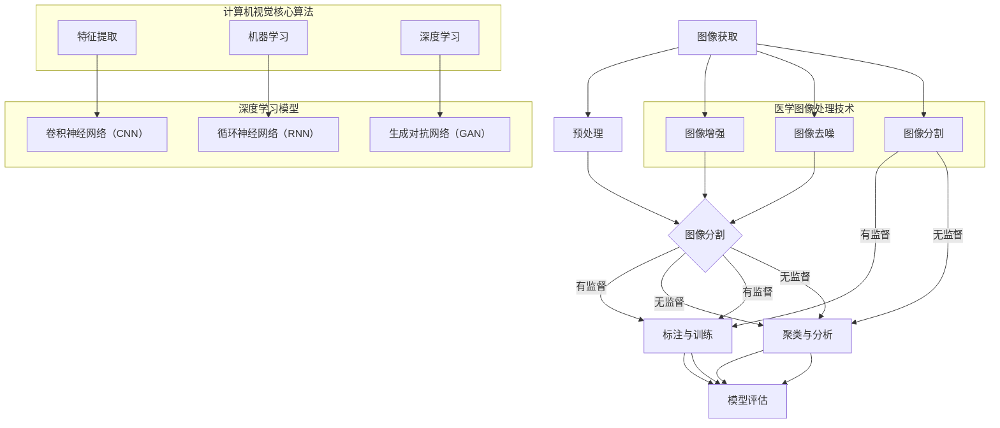

                 

### 文章标题：计算机视觉在医疗诊断中的应用前景

> 关键词：计算机视觉、医疗诊断、深度学习、医学图像处理、人工智能

> 摘要：本文详细探讨了计算机视觉在医疗诊断中的应用前景。通过介绍计算机视觉的基础概念和医学图像处理技术，我们深入分析了深度学习在医学图像分析中的应用。随后，本文讨论了计算机视觉在常见疾病诊断、感染性疾病诊断以及个性化医疗中的应用，并探讨了其在医疗诊断中面临的挑战与发展趋势。通过具体的案例研究，本文展示了计算机视觉在实际医疗诊断中的有效性和潜力。

---

### 《计算机视觉在医疗诊断中的应用前景》目录大纲

#### 第一部分：基础概念与理论

##### 第1章：计算机视觉概述

- **1.1 计算机视觉的定义与重要性**
  - 计算机视觉的基本概念
  - 计算机视觉在医疗诊断中的应用

- **1.2 医疗诊断中的计算机视觉需求**
  - 医学图像的类型
  - 医学图像的特点与挑战

##### 第2章：医学图像处理技术

- **2.1 医学图像获取**
  - 医学成像设备介绍
  - 医学图像获取过程

- **2.2 医学图像预处理**
  - 图像增强
  - 图像去噪
  - 图像分割

##### 第3章：计算机视觉核心算法

- **3.1 特征提取**
  - 基本特征提取方法
  - 特征提取在医学图像中的应用

- **3.2 机器学习与深度学习基础**
  - 机器学习基本概念
  - 深度学习基本原理
  - 深度学习框架简介

##### 第4章：深度学习在医学图像分析中的应用

- **4.1 深度学习模型在医学图像分类中的应用**
  - 卷积神经网络（CNN）原理
  - CNN在医学图像分类中的应用

- **4.2 深度学习模型在医学图像分割中的应用**
  - 基于深度学习的医学图像分割方法
  - 医学图像分割在实际诊断中的应用

#### 第二部分：具体应用与实践

##### 第5章：计算机视觉在常见疾病诊断中的应用

- **5.1 肿瘤检测与诊断**
  - 乳腺癌检测
  - 肺癌检测

- **5.2 眼底病变诊断**
  - 视网膜病变诊断
  - 黄斑变性检测

##### 第6章：计算机视觉在感染性疾病诊断中的应用

- **6.1 病毒感染诊断**
  - 病毒图像识别
  - 病毒感染病理特征分析

- **6.2 细菌感染诊断**
  - 细菌图像识别
  - 细菌感染病理特征分析

##### 第7章：计算机视觉在个性化医疗中的应用

- **7.1 基因表达图像分析**
  - 基因表达图像获取方法
  - 基因表达图像分析在个性化医疗中的应用

- **7.2 基于多模态影像的个性化诊断**
  - 多模态影像融合
  - 个性化医疗诊断策略

#### 第三部分：技术挑战与发展趋势

##### 第8章：计算机视觉在医疗诊断中的挑战与解决方案

- **8.1 数据质量与数据集构建**
  - 医学图像数据质量问题
  - 医学图像数据集构建方法

- **8.2 算法性能与优化**
  - 深度学习模型的优化方法
  - 医学图像分析中的性能评估指标

##### 第9章：计算机视觉在医疗诊断中的未来发展趋势

- **9.1 人工智能与医疗的融合**
  - 人工智能技术在医疗中的应用前景
  - 人工智能医疗诊断的潜在影响

- **9.2 可持续发展与社会影响**
  - 计算机视觉在医疗诊断中的社会责任
  - 人工智能医疗诊断的伦理问题

##### 第10章：案例研究

- **10.1 案例一：乳腺癌自动诊断系统**
  - 系统设计
  - 实际应用效果与评价

- **10.2 案例二：视网膜病变自动检测系统**
  - 系统架构
  - 系统性能与评价

##### 附录

- **附录A：医学图像处理工具与资源**
  - 常用医学图像处理工具介绍
  - 医学图像处理相关资源

- **附录B：深度学习框架与代码示例**
  - TensorFlow与PyTorch使用简介
  - 医学图像分析代码示例

---

### 第一部分：基础概念与理论

#### 第1章：计算机视觉概述

##### 1.1 计算机视觉的定义与重要性

计算机视觉（Computer Vision）是人工智能的一个重要分支，旨在使计算机能够像人类一样理解和解释视觉信息。从广义上讲，计算机视觉涉及到从图像或视频中提取有用的信息，以实现各种任务，如目标检测、图像分类、图像分割和运动分析等。

在医疗诊断领域，计算机视觉技术的重要性日益凸显。医学图像，如X射线、CT扫描、MRI和超声图像，是医生进行诊断的重要依据。然而，这些图像通常包含大量的噪声和不规则性，这使得诊断过程变得复杂且耗时。计算机视觉技术可以通过自动化的方式帮助医生更快速、准确地分析这些图像，提高诊断的效率和准确性。

首先，计算机视觉的基本概念包括图像处理、特征提取和模式识别。图像处理是指对图像进行操作以改善其质量或提取有用的信息。特征提取是指从图像中提取具有区分度的特征，这些特征可以帮助计算机对图像进行分类或分割。模式识别是指通过比较特征值，确定图像中的模式或对象。

在医疗诊断中，计算机视觉技术的应用主要包括：

1. **医学图像分类**：利用计算机视觉算法对医学图像进行分类，如区分正常和异常图像。
2. **医学图像分割**：通过图像分割技术将医学图像中的不同组织或病变区域分离出来，有助于医生的诊断和治疗决策。
3. **疾病预测和诊断**：利用深度学习算法，通过学习大量医学图像和病例数据，实现疾病的预测和诊断。

##### 1.2 医疗诊断中的计算机视觉需求

医学图像是医疗诊断中最重要的信息来源之一。不同类型的医学图像具有各自的特点和挑战：

1. **X射线图像**：X射线是一种常见的成像技术，常用于骨折检测和肺部疾病的诊断。X射线图像通常具有低对比度和噪声，且图像的分辨率较低，这使得诊断过程具有一定的难度。

2. **CT扫描图像**：CT（计算机断层扫描）是一种高分辨率的成像技术，可用于检测骨骼、软组织和器官的病变。CT图像具有高对比度和丰富的细节，但同时也包含了大量的噪声和伪影，这对图像分析提出了更高的要求。

3. **MRI图像**：MRI（磁共振成像）是一种利用磁场和无线电波进行成像的技术，适用于检测软组织和器官的病变。MRI图像具有高分辨率和丰富的细节，但也存在噪声和运动伪影等问题。

4. **超声图像**：超声成像是一种非侵入性的成像技术，常用于检测胎儿和器官的结构和功能。超声图像具有高对比度和实时性，但也受到噪声和分辨率限制。

在医疗诊断中，计算机视觉的需求主要体现在以下几个方面：

1. **图像增强与预处理**：为了提高医学图像的质量，计算机视觉技术可以用于图像增强、去噪和预处理。这些技术有助于提高图像的对比度、清晰度和可读性，从而帮助医生更准确地诊断。

2. **图像分割与标注**：图像分割是将医学图像中的不同组织或病变区域分离出来，这对于诊断和治疗计划至关重要。计算机视觉技术，如深度学习算法，可以用于自动化图像分割和标注，提高诊断的效率和准确性。

3. **疾病预测和诊断**：通过学习大量的医学图像和病例数据，计算机视觉技术可以实现疾病的预测和诊断。例如，基于深度学习的算法可以用于检测乳腺癌、肺癌和视网膜病变等常见疾病，从而为医生提供重要的辅助诊断信息。

4. **多模态图像融合**：多模态图像融合是将不同成像技术获得的医学图像进行融合，以获得更全面和准确的诊断信息。计算机视觉技术可以用于融合不同模态的图像，如CT、MRI和超声图像，从而提高诊断的准确性。

综上所述，计算机视觉技术在医疗诊断中具有广泛的应用前景。通过自动化和智能化的图像分析，计算机视觉技术可以提高诊断的效率和准确性，减轻医生的工作负担，并为个性化医疗提供有力支持。然而，这需要进一步的研究和开发，以克服图像质量、算法性能和数据集构建等方面的挑战。

#### 第2章：医学图像处理技术

##### 2.1 医学图像获取

医学图像的获取是医疗诊断中至关重要的一环，不同的成像技术会产生不同类型的医学图像。以下将介绍几种常见的医学成像设备及其工作原理。

1. **X射线成像**：X射线是一种高能电磁波，能够穿透人体组织并在成像板上产生影像。X射线成像主要用于骨折检测和肺部疾病的诊断。其工作原理是基于不同组织对X射线的吸收能力不同，从而在成像板上形成明暗不同的图像。

2. **计算机断层扫描（CT）**：CT是通过旋转X射线源和探测器，从多个角度对物体进行扫描，然后通过计算机处理这些数据，生成三维图像。CT成像具有较高的分辨率，可以用于检测骨骼、软组织和器官的病变。

3. **磁共振成像（MRI）**：MRI利用磁场和无线电波来检测人体组织。在MRI中，人体被放置在一个强大的磁场中，然后通过施加射频脉冲来激发人体内的氢原子核。这些原子核在激发后会释放能量，通过探测器收集这些能量，并转换为图像。MRI适用于检测软组织和器官的病变，如脑部、心脏和肝脏。

4. **超声成像**：超声成像是一种非侵入性的成像技术，通过发送和接收超声波来检测人体内部的结构和功能。超声波在遇到不同密度的组织时会发生反射，探测器接收到的反射信号被转换为图像。超声成像常用于检测胎儿、心脏和器官的结构。

在获取医学图像的过程中，设备的选择和操作方法会对图像质量产生重要影响。以下是一些关键因素：

1. **设备精度**：成像设备的精度决定了图像的分辨率和清晰度。高精度的设备能够生成更详细和清晰的图像，有助于医生的诊断。

2. **成像参数设置**：不同的成像技术需要不同的参数设置，如曝光时间、电压和电流等。合理的参数设置能够提高图像的质量，减少噪声和伪影。

3. **患者准备**：患者的准备工作对成像质量也有很大影响。例如，在CT和MRI扫描中，患者需要保持静止，以避免图像模糊。对于某些成像技术，患者可能需要服用对比剂，以增强图像的对比度。

##### 2.2 医学图像预处理

医学图像预处理是提高图像质量和为后续处理步骤做准备的重要环节。以下将介绍几种常见的医学图像预处理技术：

1. **图像增强**：图像增强是一种通过调整图像的亮度和对比度，使其更清晰、更易解读的技术。常用的图像增强方法包括直方图均衡化、对比度拉伸和滤波等。

   - **直方图均衡化**：通过调整图像的像素分布，使图像的对比度提高，适用于图像整体对比度较低的情况。

   - **对比度拉伸**：通过调整图像的灰度范围，使图像的细节更加突出，适用于图像局部对比度不足的情况。

   - **滤波**：通过平滑图像来减少噪声和伪影，常用的滤波方法包括均值滤波、高斯滤波和中值滤波等。

2. **图像去噪**：医学图像往往包含各种噪声，如随机噪声、系统噪声和运动噪声等。去噪的目的是提高图像的质量，减少噪声对后续处理的影响。常用的去噪方法包括小波变换、傅里叶变换和基于深度学习的方法等。

3. **图像分割**：图像分割是将图像中的不同区域分离出来，以便于后续的分析和处理。医学图像分割的目的是将病变区域与其他正常组织分离。常用的分割方法包括基于阈值的分割、基于区域的分割和基于边界的分割等。

   - **基于阈值的分割**：通过设定一个阈值，将图像中的像素划分为前景和背景。

   - **基于区域的分割**：通过分析图像的局部特征，将相似区域划分为同一类别。

   - **基于边界的分割**：通过寻找图像中的边缘和边界，将不同区域分离。

医学图像预处理技术在医疗诊断中具有重要意义。首先，通过图像增强和去噪，可以提高图像的对比度和清晰度，使医生能够更准确地诊断。其次，通过图像分割，可以将病变区域与其他组织分离，有助于医生更准确地定位病变部位，制定治疗方案。此外，预处理技术还可以为后续的深度学习模型训练提供高质量的输入数据，从而提高模型的性能和准确性。

#### 第3章：计算机视觉核心算法

##### 3.1 特征提取

特征提取是计算机视觉中的一项重要技术，它通过从原始图像中提取具有区分度的特征，有助于图像分类、目标检测和图像分割等任务。在医学图像分析中，特征提取技术同样扮演着关键角色，因为它能够提高图像质量，增强图像的对比度，从而帮助医生更准确地诊断。

**特征提取的基本概念与方法**

1. **边缘提取**：边缘提取是一种用于检测图像中亮度变化的特征提取方法。边缘通常表示图像中对象边界的转换，通过边缘提取，可以突出图像中的关键结构。常见的边缘检测算法包括Canny边缘检测、Sobel边缘检测和Prewitt边缘检测等。

2. **纹理分析**：纹理分析是通过分析图像中重复的模式或结构来提取特征。纹理特征能够描述图像的局部性质，如粗糙度、方向性和规则性。常见的纹理特征包括灰度共生矩阵、自相关函数和Gabor滤波器等。

3. **形状特征**：形状特征用于描述图像中的对象形状和结构。常见的形状特征包括周长、面积、矩形度、圆形度等。形状特征在医学图像分析中尤为重要，因为它们可以帮助识别和定位病变区域。

**特征提取在医学图像中的应用**

1. **图像分类**：在医学图像分类中，特征提取是关键步骤之一。通过提取图像中的边缘、纹理和形状特征，可以将不同类型的病变区分开来。例如，在乳腺癌检测中，可以通过边缘特征识别肿瘤的轮廓，通过纹理特征分析肿瘤的质地。

2. **目标检测**：在目标检测任务中，特征提取有助于识别图像中的特定对象。例如，在视网膜病变诊断中，可以通过边缘特征检测血管，通过纹理特征分析病变区域。

3. **图像分割**：图像分割是将图像中的不同区域分离出来，以便进行进一步分析。特征提取技术可以帮助分割病变区域与其他正常组织。例如，在脑部病变诊断中，可以通过形状特征和纹理特征将肿瘤区域与其他脑组织分离。

**特征提取在医学图像分析中的挑战**

1. **数据多样性**：医学图像数据具有高度的多样性，包括不同的成像设备、成像条件、病变类型等。这使得特征提取算法需要能够处理各种类型的数据，以提高通用性和鲁棒性。

2. **噪声与伪影**：医学图像常常受到噪声和伪影的影响，这些因素会干扰特征提取的结果。因此，需要开发鲁棒的特征提取算法，能够在噪声和伪影存在的情况下提取有效特征。

3. **模型解释性**：医学诊断是一个高风险的任务，因此，需要保证特征提取算法的可解释性。这意味着医生需要能够理解特征提取过程和结果，以便做出准确的诊断。

**案例：基于深度学习的特征提取**

近年来，深度学习在特征提取中取得了显著进展。通过使用卷积神经网络（CNN）等深度学习模型，可以自动提取图像中的复杂特征。以下是一个基于深度学习的特征提取过程：

```python
# 假设已经加载了训练好的CNN模型

# 步骤1：输入医学图像
image = load_image("medical_image.jpg")

# 步骤2：通过CNN模型提取特征
features = model.extract_features(image)

# 步骤3：利用提取的特征进行分类、目标检测或图像分割
result = model.predict(features)
```

通过这种方式，深度学习模型可以自动学习复杂的特征表示，从而提高医学图像分析的性能和准确性。然而，这也带来了一些挑战，如模型的训练成本高、解释性不足等，需要进一步的研究和改进。

##### 3.2 机器学习与深度学习基础

机器学习和深度学习是计算机视觉中的重要工具，用于解决各种图像分析和识别问题。本节将介绍机器学习和深度学习的基本概念、原理及其在医学图像分析中的应用。

**机器学习基本概念**

1. **监督学习**：监督学习是一种机器学习方法，通过给定的输入数据和对应的标签来训练模型。常见的监督学习任务包括分类和回归。在医学图像分析中，分类任务可以用于疾病诊断，回归任务可以用于预测疾病的严重程度。

2. **无监督学习**：无监督学习是指在没有标签数据的情况下，通过数据自身的特征来训练模型。常见的无监督学习任务包括聚类和降维。在医学图像分析中，无监督学习可以用于图像分割和异常检测。

3. **强化学习**：强化学习是一种通过奖励机制来训练模型的方法。在医学图像分析中，强化学习可以用于自动化手术导航和机器人辅助诊断。

**深度学习基本原理**

深度学习是一种基于多层神经网络的机器学习方法，通过层层提取图像中的复杂特征，从而实现高度复杂的任务。以下是一个典型的深度学习模型结构：

1. **卷积神经网络（CNN）**：CNN是深度学习中最常用的模型之一，专门用于图像处理。CNN通过卷积层、池化层和全连接层等结构，逐层提取图像特征，并最终进行分类或回归。

2. **循环神经网络（RNN）**：RNN适用于处理序列数据，如视频和语音。通过循环机制，RNN可以捕捉数据中的时间依赖关系。

3. **生成对抗网络（GAN）**：GAN是一种通过生成器和判别器相互对抗来训练的模型，常用于图像生成和图像修复。

**深度学习框架简介**

常见的深度学习框架包括TensorFlow、PyTorch和Keras等。这些框架提供了丰富的API和工具，使得深度学习模型的开发和部署变得更加简单和高效。

1. **TensorFlow**：TensorFlow是一个开源的深度学习框架，由Google开发。它提供了丰富的API，适用于各种深度学习任务，如图像分类、目标检测和图像生成等。

2. **PyTorch**：PyTorch是一个开源的深度学习框架，由Facebook开发。它以动态图（Dynamic Graph）为基础，使得模型开发和调试变得更加灵活和直观。

3. **Keras**：Keras是一个高级神经网络API，可以在TensorFlow和Theano等后端上运行。它提供了简洁的API和丰富的预训练模型，适用于快速原型开发和实验。

**深度学习在医学图像分析中的应用**

深度学习在医学图像分析中具有广泛的应用，以下是一些典型的应用场景：

1. **医学图像分类**：通过训练深度学习模型，可以自动识别和分类医学图像中的病变类型。例如，可以使用CNN对乳腺X射线图像进行分类，以帮助医生诊断乳腺癌。

2. **医学图像分割**：深度学习模型可以用于自动分割医学图像中的病变区域，如肿瘤、视网膜病变等。通过训练深度学习模型，可以实现对图像的精细分割，从而提高诊断的准确性。

3. **疾病预测和诊断**：通过学习大量的病例数据，深度学习模型可以预测疾病的严重程度和诊断结果。例如，可以使用深度学习模型预测肺癌的转移风险，帮助医生制定更有效的治疗方案。

4. **个性化医疗**：深度学习模型可以根据患者的基因表达图像、影像学数据和临床表现，为患者制定个性化的治疗方案。这有助于提高医疗效果，减少医疗资源浪费。

**深度学习在医学图像分析中的挑战**

尽管深度学习在医学图像分析中取得了显著进展，但仍面临一些挑战：

1. **数据质量和标注**：医学图像数据通常存在噪声、不完整和标注不准确等问题，这会影响深度学习模型的训练效果。

2. **计算资源需求**：深度学习模型通常需要大量的计算资源和时间进行训练，这对医疗资源的利用提出了挑战。

3. **模型解释性**：深度学习模型通常被视为“黑箱”，其决策过程缺乏透明度，这对医疗诊断的可解释性提出了挑战。

4. **数据隐私和安全**：医疗数据具有高度的敏感性，如何在保护患者隐私的前提下进行数据共享和模型部署，是深度学习在医学图像分析中需要解决的重要问题。

总之，机器学习和深度学习为医学图像分析提供了强大的工具，有助于提高诊断的效率和准确性。然而，要充分发挥深度学习的潜力，还需要克服数据质量、计算资源和模型解释性等方面的挑战。

#### 第4章：深度学习在医学图像分析中的应用

##### 4.1 深度学习模型在医学图像分类中的应用

深度学习模型在医学图像分类中具有显著的应用价值，通过训练深度神经网络，可以从大量的医学图像数据中自动提取具有区分度的特征，从而实现高精度的分类。以下将介绍卷积神经网络（CNN）及其在医学图像分类中的应用。

**卷积神经网络（CNN）原理**

卷积神经网络是一种专门用于图像处理的深度学习模型，其核心思想是通过卷积操作和池化操作，逐层提取图像的局部特征，最终实现图像的分类。

1. **卷积操作**：卷积操作是一种将卷积核（过滤器）在输入图像上滑动，并与图像上的像素进行点积的操作。卷积核的参数通过训练学习得到，用于提取图像中的局部特征。

2. **激活函数**：激活函数用于引入非线性，使神经网络能够学习复杂的函数关系。常见的激活函数包括ReLU（修正线性单元）、Sigmoid和Tanh等。

3. **池化操作**：池化操作用于降低图像的分辨率，同时保持重要的特征信息。常见的池化方法包括最大池化和平均池化。

4. **全连接层**：全连接层将卷积层和池化层提取的特征映射到分类结果。在分类任务中，全连接层通常包含多个神经元，每个神经元对应一个类别。

**CNN在医学图像分类中的应用**

CNN在医学图像分类中取得了显著的成功，以下是一些典型的应用案例：

1. **乳腺癌检测**：在乳腺癌检测中，CNN可以用于对乳腺X射线图像进行分类，区分正常和异常组织。通过训练大量的乳腺X射线图像数据，CNN可以自动学习到肿瘤的边缘特征、纹理特征等，从而实现高精度的分类。

2. **肺癌检测**：在肺癌检测中，CNN可以用于对肺部CT图像进行分类，区分正常肺组织和肺癌病变。通过训练大量的肺部CT图像数据，CNN可以学习到肺癌的纹理特征、形状特征等，从而实现高精度的分类。

3. **视网膜病变诊断**：在视网膜病变诊断中，CNN可以用于对眼底图像进行分类，区分不同类型的视网膜病变。通过训练大量的眼底图像数据，CNN可以学习到不同病变的边缘特征、纹理特征等，从而实现高精度的分类。

**深度学习模型在医学图像分类中的优势**

1. **自动特征提取**：CNN可以自动学习图像中的复杂特征，无需手动设计特征，从而提高了模型的可扩展性和适应性。

2. **高精度分类**：通过训练大量的医学图像数据，CNN可以实现高精度的分类，从而提高了诊断的准确性。

3. **实时处理能力**：深度学习模型可以通过 GPU 或 TPU 等硬件加速，实现快速的图像分类，从而提高了诊断的效率。

**深度学习模型在医学图像分类中的挑战**

1. **数据质量和标注**：医学图像数据通常存在噪声、不完整和标注不准确等问题，这会影响模型的训练效果。

2. **计算资源需求**：深度学习模型通常需要大量的计算资源和时间进行训练，这对医疗资源的利用提出了挑战。

3. **模型解释性**：深度学习模型通常被视为“黑箱”，其决策过程缺乏透明度，这对医疗诊断的可解释性提出了挑战。

4. **数据隐私和安全**：医疗数据具有高度的敏感性，如何在保护患者隐私的前提下进行数据共享和模型部署，是深度学习在医学图像分类中需要解决的重要问题。

##### 4.2 深度学习模型在医学图像分割中的应用

医学图像分割是将医学图像中的不同区域分离出来，以便进行进一步分析。深度学习模型在医学图像分割中取得了显著的成功，通过训练深度神经网络，可以从大量的医学图像数据中自动提取具有区分度的特征，从而实现高精度的分割。以下将介绍基于深度学习的医学图像分割方法及其应用。

**基于深度学习的医学图像分割方法**

深度学习模型在医学图像分割中可以分为两大类：基于全卷积网络（FCN）的方法和基于编码器-解码器（Encoder-Decoder）的方法。

1. **基于全卷积网络（FCN）的方法**：全卷积网络（Fully Convolutional Network，FCN）是一种专门用于图像分割的深度学习模型，其核心思想是将图像输入到卷积神经网络中，并通过卷积操作逐层提取图像特征，最终通过反卷积操作生成分割结果。

   - **卷积层**：通过卷积操作提取图像的局部特征。
   - **反卷积层**：通过反卷积操作将卷积层提取的特征重新展开，生成分割结果。

2. **基于编码器-解码器（Encoder-Decoder）的方法**：编码器-解码器（Encoder-Decoder）是一种用于图像分割的深度学习模型结构，其核心思想是通过编码器（Encoder）将图像编码为特征图，然后通过解码器（Decoder）将特征图解码为分割结果。

   - **编码器**：通过卷积层和池化层将图像编码为特征图。
   - **解码器**：通过卷积层和上采样操作将特征图解码为分割结果。

**深度学习模型在医学图像分割中的应用**

深度学习模型在医学图像分割中具有广泛的应用，以下是一些典型的应用案例：

1. **肿瘤分割**：在肿瘤分割中，深度学习模型可以用于将医学图像中的肿瘤区域与其他组织分离。通过训练大量的肿瘤图像数据，深度学习模型可以学习到肿瘤的边缘特征、纹理特征等，从而实现高精度的分割。

2. **器官分割**：在器官分割中，深度学习模型可以用于将医学图像中的特定器官分离出来，如肝脏、心脏、肾脏等。通过训练大量的器官图像数据，深度学习模型可以学习到器官的形状特征、位置特征等，从而实现高精度的分割。

3. **病变区域分割**：在病变区域分割中，深度学习模型可以用于将医学图像中的病变区域与其他正常组织分离。例如，在视网膜病变诊断中，深度学习模型可以用于将病变区域与正常视网膜组织分离，从而帮助医生更准确地诊断。

**深度学习模型在医学图像分割中的优势**

1. **自动特征提取**：深度学习模型可以自动学习图像中的复杂特征，无需手动设计特征，从而提高了模型的可扩展性和适应性。

2. **高精度分割**：通过训练大量的医学图像数据，深度学习模型可以实现高精度的分割，从而提高了诊断的准确性。

3. **实时处理能力**：深度学习模型可以通过 GPU 或 TPU 等硬件加速，实现快速的图像分割，从而提高了诊断的效率。

**深度学习模型在医学图像分割中的挑战**

1. **数据质量和标注**：医学图像数据通常存在噪声、不完整和标注不准确等问题，这会影响模型的训练效果。

2. **计算资源需求**：深度学习模型通常需要大量的计算资源和时间进行训练，这对医疗资源的利用提出了挑战。

3. **模型解释性**：深度学习模型通常被视为“黑箱”，其决策过程缺乏透明度，这对医疗诊断的可解释性提出了挑战。

4. **数据隐私和安全**：医疗数据具有高度的敏感性，如何在保护患者隐私的前提下进行数据共享和模型部署，是深度学习在医学图像分割中需要解决的重要问题。

总之，深度学习模型在医学图像分割中具有广泛的应用前景，通过自动化的特征提取和精准的分割能力，可以大大提高医疗诊断的效率和准确性。然而，要充分发挥深度学习的潜力，还需要克服数据质量、计算资源和模型解释性等方面的挑战。

#### 第二部分：具体应用与实践

##### 第5章：计算机视觉在常见疾病诊断中的应用

计算机视觉技术在常见疾病的诊断中发挥了重要作用，通过自动化和智能化的图像分析，可以显著提高诊断的准确性和效率。以下将探讨计算机视觉技术在肿瘤检测与诊断、眼底病变诊断以及其他常见疾病诊断中的应用。

**5.1 肿瘤检测与诊断**

肿瘤检测与诊断是计算机视觉技术的重要应用领域之一。通过分析医学图像，计算机视觉算法可以辅助医生检测和诊断各种类型的肿瘤，如乳腺癌、肺癌和脑部肿瘤等。

1. **乳腺癌检测**：
   - **图像来源**：乳腺X射线成像（Mammography）是最常用的乳腺癌检测方法之一。
   - **技术原理**：计算机视觉算法通过分析乳腺X射线图像中的微小钙化点、不对称性等特征，识别潜在的乳腺癌病灶。常用的算法包括深度学习模型，如卷积神经网络（CNN）和卷积神经网络+级联分类器（CNN+Cascade Classifier）。
   - **应用实例**：BreastCAD是一款基于计算机视觉的乳腺癌辅助诊断系统，通过分析乳腺X射线图像，实现了对乳腺癌的早期检测，显著提高了诊断的准确性。

2. **肺癌检测**：
   - **图像来源**：肺部CT扫描是肺癌检测的主要手段。
   - **技术原理**：计算机视觉算法通过分析肺部CT图像中的结节、肿块等特征，识别潜在的肺癌病灶。常用的算法包括深度学习模型，如卷积神经网络（CNN）和循环神经网络（RNN）。
   - **应用实例**：Lung-Nodule-Detector是一款基于深度学习的肺癌辅助诊断系统，通过分析肺部CT图像，实现了对肺癌结节的自动化检测和分类，大大提高了诊断的效率和准确性。

3. **脑部肿瘤检测**：
   - **图像来源**：MRI是脑部肿瘤检测的主要手段。
   - **技术原理**：计算机视觉算法通过分析MRI图像中的肿瘤轮廓、信号强度等特征，识别潜在的脑部肿瘤。常用的算法包括深度学习模型，如卷积神经网络（CNN）和生成对抗网络（GAN）。
   - **应用实例**：Brain-Tumor- Segmentation是一款基于深度学习的脑部肿瘤分割系统，通过分析MRI图像，实现了对脑部肿瘤的高精度分割和定位，为医生提供了重要的诊断依据。

**5.2 眼底病变诊断**

眼底病变诊断是计算机视觉技术的另一个重要应用领域。通过分析眼底图像，计算机视觉算法可以辅助医生诊断各种类型的眼底病变，如糖尿病视网膜病变、年龄相关性黄斑变性等。

1. **糖尿病视网膜病变诊断**：
   - **图像来源**：眼底荧光造影（Fundus Fluorescein Angiography）是糖尿病视网膜病变诊断的主要手段。
   - **技术原理**：计算机视觉算法通过分析眼底荧光造影图像中的血管结构和渗漏情况，识别潜在的糖尿病视网膜病变。常用的算法包括深度学习模型，如卷积神经网络（CNN）和生成对抗网络（GAN）。
   - **应用实例**： diabeticRetinopathyDetection是一款基于深度学习的糖尿病视网膜病变辅助诊断系统，通过分析眼底荧光造影图像，实现了对糖尿病视网膜病变的自动化检测和分级，大大提高了诊断的准确性和效率。

2. **年龄相关性黄斑变性诊断**：
   - **图像来源**：眼底彩照（Fundus Photography）是年龄相关性黄斑变性诊断的主要手段。
   - **技术原理**：计算机视觉算法通过分析眼底彩照图像中的色素异常、血管病变等特征，识别潜在的年龄相关性黄斑变性。常用的算法包括深度学习模型，如卷积神经网络（CNN）和循环神经网络（RNN）。
   - **应用实例**： Age-relatedMacularDegenerationDetection是一款基于深度学习的年龄相关性黄斑变性辅助诊断系统，通过分析眼底彩照图像，实现了对年龄相关性黄斑变性的自动化检测和分级，为医生提供了重要的诊断依据。

**5.3 其他常见疾病诊断**

除了肿瘤和眼底病变，计算机视觉技术还在其他常见疾病的诊断中发挥了重要作用。

1. **心血管疾病诊断**：
   - **图像来源**：心脏CT扫描和心脏MRI是心血管疾病诊断的主要手段。
   - **技术原理**：计算机视觉算法通过分析心脏CT扫描和心脏MRI图像中的心脏结构和功能特征，识别潜在的心血管疾病。常用的算法包括深度学习模型，如卷积神经网络（CNN）和生成对抗网络（GAN）。
   - **应用实例**： CardiovascularDiseaseDetection是一款基于深度学习的心血管疾病辅助诊断系统，通过分析心脏CT扫描和心脏MRI图像，实现了对心血管疾病的自动化检测和分类，大大提高了诊断的准确性和效率。

2. **肝脏疾病诊断**：
   - **图像来源**：肝脏CT扫描和肝脏MRI是肝脏疾病诊断的主要手段。
   - **技术原理**：计算机视觉算法通过分析肝脏CT扫描和肝脏MRI图像中的肝脏结构和信号特征，识别潜在肝脏疾病。常用的算法包括深度学习模型，如卷积神经网络（CNN）和循环神经网络（RNN）。
   - **应用实例**： LiverDiseaseDetection是一款基于深度学习的肝脏疾病辅助诊断系统，通过分析肝脏CT扫描和肝脏MRI图像，实现了对肝脏疾病的自动化检测和分类，为医生提供了重要的诊断依据。

总之，计算机视觉技术在常见疾病的诊断中具有广泛的应用前景。通过自动化和智能化的图像分析，计算机视觉技术可以显著提高诊断的准确性和效率，为医生提供有力的辅助工具。随着深度学习算法的不断发展和医疗图像数据的积累，计算机视觉技术在医疗诊断中的应用将越来越广泛和深入。

##### 第6章：计算机视觉在感染性疾病诊断中的应用

计算机视觉技术在感染性疾病的诊断中扮演着越来越重要的角色。通过分析各种医学图像，如病理切片、X射线、CT和MRI等，计算机视觉算法能够帮助医生快速、准确地识别病毒和细菌感染，提供可靠的诊断依据。以下将探讨计算机视觉技术在病毒感染诊断和细菌感染诊断中的应用。

**6.1 病毒感染诊断**

病毒感染诊断是一个复杂且关键的任务，早期识别病毒感染对于控制疫情和制定治疗方案至关重要。计算机视觉技术在病毒感染诊断中的应用主要体现在以下方面：

1. **病理切片分析**：
   - **图像来源**：病理切片是病毒感染诊断的重要依据，通过显微镜观察病理切片，可以识别病毒的感染特征。
   - **技术原理**：计算机视觉算法通过分析病理切片图像中的病毒颗粒、细胞变化等特征，实现病毒的识别和诊断。常用的算法包括卷积神经网络（CNN）和深度学习模型。
   - **应用实例**：COVID-Net是一款基于深度学习的肺炎病毒检测系统，通过分析肺部CT图像，实现了对新冠病毒感染的快速诊断。该系统具有较高的准确性和敏感性，为全球疫情监测提供了有力支持。

2. **核酸检测图像分析**：
   - **图像来源**：核酸检测是病毒感染诊断的重要方法，通过分析核酸检测图像，可以判断病毒核酸是否阳性。
   - **技术原理**：计算机视觉算法通过分析核酸检测图像中的荧光信号，识别病毒核酸的存在。常用的算法包括图像分割、特征提取和分类算法。
   - **应用实例**：AI-assisted COVID-19 testing系统通过分析核酸检测图像，实现了对新冠病毒核酸检测结果的快速判读，提高了诊断效率和准确性。

**6.2 细菌感染诊断**

细菌感染诊断是另一个重要的医疗挑战，早期识别细菌感染对于治疗和控制感染至关重要。计算机视觉技术在细菌感染诊断中的应用主要体现在以下方面：

1. **病理切片分析**：
   - **图像来源**：病理切片是细菌感染诊断的重要依据，通过显微镜观察病理切片，可以识别细菌感染的特征。
   - **技术原理**：计算机视觉算法通过分析病理切片图像中的细菌形态、感染区域等特征，实现细菌感染的诊断。常用的算法包括卷积神经网络（CNN）和深度学习模型。
   - **应用实例**：Bacteria Detection System是一款基于深度学习的细菌检测系统，通过分析病理切片图像，实现了对细菌感染的快速识别和分类。该系统有助于提高细菌感染的诊断准确性，为医生提供了有力的辅助工具。

2. **细菌图像识别**：
   - **图像来源**：细菌图像来源于多种成像技术，如荧光显微镜、电子显微镜等。
   - **技术原理**：计算机视觉算法通过分析细菌图像中的细菌形态、大小和纹理等特征，实现细菌的识别和分类。常用的算法包括卷积神经网络（CNN）、生成对抗网络（GAN）和循环神经网络（RNN）。
   - **应用实例**：细菌图像识别系统通过分析细菌荧光显微镜图像，实现了对细菌种类的快速识别和分类，有助于指导抗生素的选择和应用。

**计算机视觉在感染性疾病诊断中的应用优势**

1. **自动化分析**：计算机视觉技术可以实现医学图像的自动化分析，减少了人为操作的依赖，提高了诊断的效率和准确性。

2. **实时处理能力**：计算机视觉算法可以在短时间内处理大量的医学图像，实现了实时诊断，有助于早期发现和及时治疗感染性疾病。

3. **高精度分类**：通过深度学习模型，计算机视觉技术可以实现对医学图像中的病毒和细菌进行高精度的分类，提高了诊断的准确性。

**面临的挑战**

1. **数据质量和标注**：医学图像数据质量对计算机视觉算法的性能至关重要。高质量的图像和准确的标注是保证诊断准确性的基础。

2. **计算资源需求**：深度学习模型的训练和部署需要大量的计算资源，这对医疗资源的配置提出了挑战。

3. **模型解释性**：计算机视觉模型通常被视为“黑箱”，其诊断决策过程缺乏透明度，这对医疗诊断的可解释性提出了挑战。

4. **数据隐私和安全**：医疗数据具有高度的敏感性，如何在保护患者隐私的前提下进行数据共享和模型部署，是计算机视觉在感染性疾病诊断中需要解决的重要问题。

总之，计算机视觉技术在感染性疾病诊断中具有巨大的应用潜力，通过自动化和智能化的图像分析，可以显著提高诊断的效率和准确性。然而，要充分发挥计算机视觉的潜力，还需要克服数据质量、计算资源和模型解释性等方面的挑战。

##### 第7章：计算机视觉在个性化医疗中的应用

个性化医疗（Personalized Medicine）是一种以患者为中心的医疗模式，通过整合患者的基因信息、临床数据和医学图像，为每个患者制定个性化的治疗方案。计算机视觉技术在个性化医疗中发挥着重要作用，通过图像分析和深度学习算法，可以实现基因表达图像分析、多模态影像融合和个性化诊断策略。以下将探讨计算机视觉技术在个性化医疗中的应用。

**7.1 基因表达图像分析**

基因表达图像分析是个性化医疗的重要环节，通过对基因表达图像的分析，可以揭示不同患者的基因表达模式，为个性化诊断和治疗提供依据。

1. **基因表达图像获取**：
   - **技术原理**：基因表达图像是通过基因芯片或RNA测序技术获取的，展示了基因在不同细胞类型或组织中的表达水平。
   - **图像处理**：计算机视觉技术通过对基因表达图像进行预处理、归一化和特征提取，将图像转换为可用于分析的数据。
   - **应用实例**：基因表达图像分析系统通过分析基因表达图像，实现了对不同基因表达模式的识别和分类，有助于识别疾病的风险因素和预测疾病的进展。

2. **深度学习模型**：
   - **技术原理**：深度学习模型，如卷积神经网络（CNN）和循环神经网络（RNN），可以用于学习基因表达图像中的复杂特征，实现基因表达模式的分类和聚类。
   - **应用实例**：通过训练深度学习模型，可以实现针对特定疾病的基因表达模式识别，为个性化诊断和治疗提供依据。例如，在乳腺癌治疗中，通过分析基因表达图像，可以为患者推荐最有效的治疗方案。

**7.2 多模态影像融合**

多模态影像融合是将不同成像技术获取的医学图像进行整合，以获得更全面和准确的诊断信息。计算机视觉技术在多模态影像融合中发挥着重要作用。

1. **影像数据获取**：
   - **技术原理**：多模态影像包括CT、MRI、PET和PET-CT等，每种影像技术提供的信息各有特点。
   - **数据预处理**：计算机视觉技术通过对不同模态的影像进行预处理、归一化和对齐，为融合提供基础。
   - **应用实例**：多模态影像融合系统通过整合不同模态的影像，可以提供更全面的疾病信息，有助于提高诊断的准确性和治疗效果。

2. **深度学习模型**：
   - **技术原理**：深度学习模型，如生成对抗网络（GAN）和变分自编码器（VAE），可以用于学习不同模态的影像特征，实现影像的融合和增强。
   - **应用实例**：通过训练深度学习模型，可以实现多模态影像的自动融合和特征提取，为个性化诊断和治疗提供支持。例如，在肿瘤治疗中，通过融合CT和MRI影像，可以更准确地定位肿瘤位置和评估治疗效果。

**7.3 个性化诊断策略**

个性化诊断策略是基于患者的基因、影像和临床数据，为每个患者制定最合适的诊断和治疗方案。计算机视觉技术在个性化诊断策略中发挥着关键作用。

1. **疾病风险评估**：
   - **技术原理**：计算机视觉技术通过分析基因表达图像和影像数据，可以实现疾病风险评估，为早期干预提供依据。
   - **应用实例**：通过分析基因表达图像和影像数据，可以为患者提供针对特定疾病的个性化风险评估，有助于早期发现和预防疾病。

2. **个性化治疗方案**：
   - **技术原理**：计算机视觉技术通过整合患者的基因、影像和临床数据，可以实现个性化治疗方案的设计和优化。
   - **应用实例**：通过分析基因表达图像和影像数据，可以为患者推荐最合适的药物治疗方案、手术方案和放疗方案，从而提高治疗效果。

**计算机视觉在个性化医疗中的应用优势**

1. **自动化分析**：计算机视觉技术可以实现基因表达图像、影像数据的自动化分析，减少了人为操作的依赖，提高了诊断和治疗的效率。

2. **高精度分类**：通过深度学习算法，计算机视觉技术可以实现对基因表达模式、影像特征的分类和聚类，提高了诊断和治疗的准确性。

3. **实时处理能力**：计算机视觉算法可以在短时间内处理大量的基因表达图像和影像数据，实现了实时诊断和治疗方案的设计。

**面临的挑战**

1. **数据质量和标注**：高质量的基因表达图像和影像数据对于计算机视觉算法的性能至关重要。准确的标注是保证诊断和治疗方案准确性的基础。

2. **计算资源需求**：深度学习模型的训练和部署需要大量的计算资源，这对医疗资源的配置提出了挑战。

3. **模型解释性**：计算机视觉模型通常被视为“黑箱”，其诊断和治疗方案的设计过程缺乏透明度，这对医疗诊断和治疗的可解释性提出了挑战。

4. **数据隐私和安全**：医疗数据具有高度的敏感性，如何在保护患者隐私的前提下进行数据共享和模型部署，是计算机视觉在个性化医疗中需要解决的重要问题。

总之，计算机视觉技术在个性化医疗中具有广泛的应用前景，通过自动化和智能化的图像分析，可以显著提高诊断和治疗的效率和准确性。然而，要充分发挥计算机视觉的潜力，还需要克服数据质量、计算资源和模型解释性等方面的挑战。

#### 第三部分：技术挑战与发展趋势

##### 第8章：计算机视觉在医疗诊断中的挑战与解决方案

计算机视觉技术在医疗诊断中虽然取得了显著的进展，但仍面临诸多挑战。以下将讨论计算机视觉在医疗诊断中面临的主要挑战，并提出相应的解决方案。

**8.1 数据质量与数据集构建**

医学图像数据的质量直接影响计算机视觉算法的性能。医学图像通常受到噪声、伪影和分辨率限制的影响，这些因素会对图像的分析结果产生负面影响。为了提高算法的准确性，高质量的医学图像数据是必不可少的。

**挑战**：

1. **图像噪声和伪影**：医学图像在获取和处理过程中会产生噪声和伪影，这些干扰因素会影响图像的分析结果。
2. **数据多样性**：医学图像数据的多样性不足，可能导致算法在处理特定类型的图像时表现不佳。
3. **数据标注**：医学图像的标注过程复杂且耗时，需要专业知识和经验，标注的准确性对算法性能有直接影响。

**解决方案**：

1. **图像预处理**：通过图像增强、去噪和滤波等技术，提高医学图像的质量。图像增强技术可以增强图像的对比度和细节，去噪技术可以减少图像中的噪声，滤波技术可以消除伪影。
2. **数据扩充**：通过数据增强技术，如旋转、缩放、裁剪和翻转等，增加数据集的多样性，提高算法的泛化能力。
3. **半监督学习和无监督学习**：半监督学习和无监督学习算法可以利用未标注的数据进行学习，减少对大量标注数据的依赖。
4. **专业标注团队**：建立专业的医学图像标注团队，确保标注的准确性和一致性。

**8.2 算法性能与优化**

算法的性能直接影响医学诊断的准确性。深度学习算法在医学图像分析中表现出色，但仍然面临一些性能优化问题。

**挑战**：

1. **计算资源需求**：深度学习模型的训练过程需要大量的计算资源和时间，这对医疗资源的配置提出了挑战。
2. **模型泛化能力**：深度学习模型可能过度拟合训练数据，导致在真实数据上的性能不佳。
3. **模型解释性**：深度学习模型通常被视为“黑箱”，其决策过程缺乏透明度，这对医疗诊断的可解释性提出了挑战。

**解决方案**：

1. **模型压缩与加速**：通过模型压缩技术和硬件加速（如GPU和TPU），提高模型的训练和推理速度，降低计算资源需求。
2. **迁移学习**：利用预训练的深度学习模型，通过迁移学习技术，在特定任务上实现良好的性能，减少对大规模训练数据的依赖。
3. **模型融合**：通过结合不同类型的深度学习模型（如CNN、RNN和GAN），提高模型的性能和鲁棒性。
4. **模型可解释性**：开发可解释的深度学习模型，如基于注意力机制的模型，使医生能够理解模型的决策过程。

**8.3 数据隐私与安全性**

医疗数据具有高度的敏感性，保护患者隐私和确保数据安全是计算机视觉在医疗诊断中的关键挑战。

**挑战**：

1. **数据泄露**：未经授权的访问和数据泄露可能导致患者隐私泄露。
2. **数据安全**：医疗数据在传输和存储过程中可能面临安全威胁，如数据篡改和破坏。

**解决方案**：

1. **数据加密**：使用加密技术保护医疗数据，确保数据在传输和存储过程中的安全性。
2. **访问控制**：实施严格的访问控制策略，确保只有授权用户可以访问敏感数据。
3. **匿名化**：对医疗数据进行匿名化处理，去除可以直接识别患者的信息，减少隐私泄露风险。
4. **合规性**：遵守相关法律法规，确保数据处理的合法性和合规性。

总之，计算机视觉在医疗诊断中面临的挑战是多方面的，但通过不断的技术创新和优化，许多问题可以得到有效解决。未来的发展将更加注重算法的性能优化、数据质量和隐私保护，以实现更高效、准确和安全的医学图像分析。

##### 第9章：计算机视觉在医疗诊断中的未来发展趋势

计算机视觉在医疗诊断中的应用已经取得了显著进展，随着人工智能技术的不断发展和医疗数据的积累，计算机视觉在医疗诊断中的未来发展趋势将更加广阔和深入。以下将讨论人工智能与医疗的融合、计算机视觉在医疗诊断中的潜在影响以及其可持续发展和社会影响。

**9.1 人工智能与医疗的融合**

人工智能（AI）与医疗的融合是当前医疗领域的一个重要趋势。计算机视觉作为人工智能的一个重要分支，在医疗诊断中具有广泛的应用潜力。以下将探讨人工智能与医疗融合的几个方面：

1. **精准医疗**：人工智能和计算机视觉技术可以辅助医生进行精准医疗，通过分析大量的医学图像和数据，实现疾病的早期诊断和个性化治疗。例如，基于深度学习的算法可以用于分析基因表达数据，预测疾病的发病风险，为患者提供个性化的治疗方案。

2. **智能诊断系统**：计算机视觉和人工智能的结合可以开发智能诊断系统，自动分析医学图像，提高诊断的效率和准确性。这些系统可以应用于各种疾病，如肿瘤、心血管疾病和眼科疾病等，为医生提供有力的辅助工具。

3. **医疗数据管理**：人工智能技术可以用于医疗数据的收集、存储、分析和共享，提高医疗数据的管理效率。例如，通过自然语言处理（NLP）技术，可以自动提取病历中的关键信息，实现电子病历的自动化整理和管理。

4. **医疗设备智能化**：计算机视觉和人工智能技术可以使医疗设备更加智能化，提高其操作效率和诊断准确性。例如，智能手术机器人可以通过计算机视觉技术实现精准的手术操作，减少手术风险和并发症。

**9.2 计算机视觉在医疗诊断中的潜在影响**

计算机视觉技术在医疗诊断中具有巨大的潜在影响，以下将讨论其在几个方面的潜在影响：

1. **提高诊断效率**：计算机视觉技术可以自动化医学图像的分析，减少医生的工作负担，提高诊断效率。例如，深度学习算法可以快速分析大量医学图像，实现快速诊断，从而缩短患者等待时间。

2. **提高诊断准确性**：计算机视觉技术可以通过学习大量的医学图像和病例数据，实现高精度的诊断，减少误诊和漏诊。例如，基于深度学习的算法可以识别出微小病变，提高疾病的早期诊断率。

3. **辅助决策支持**：计算机视觉技术可以提供辅助决策支持，为医生提供详细的诊断报告和治疗方案建议。例如，计算机视觉系统可以分析患者的影像数据，为医生提供病变区域的位置、大小和特征，帮助医生做出更准确的诊断和治疗决策。

4. **促进医疗资源的优化**：计算机视觉技术可以实现远程医疗和医疗资源的优化配置。通过远程诊断系统，医生可以实时分析患者的医学图像，为偏远地区的患者提供诊断和治疗服务，从而提高医疗服务的覆盖面和质量。

**9.3 可持续发展与社会影响**

计算机视觉技术在医疗诊断中的广泛应用将带来深远的社会影响，以下将讨论其在可持续发展和社会影响方面的考虑：

1. **降低医疗成本**：计算机视觉技术可以提高诊断效率，减少医生的劳动强度，从而降低医疗成本。通过自动化和智能化的诊断系统，医疗资源可以更加高效地利用，降低患者的经济负担。

2. **提高医疗公平性**：计算机视觉技术可以实现远程医疗，缩小城乡医疗资源差距，提高医疗服务的公平性。通过远程诊断系统，偏远地区的患者可以享受到高质量的医疗服务，促进医疗资源的均衡发展。

3. **隐私和安全问题**：医疗数据具有高度的敏感性，保护患者隐私和安全是计算机视觉在医疗诊断中需要解决的重要问题。通过数据加密、访问控制和隐私保护技术，可以确保医疗数据的安全和隐私。

4. **伦理和社会责任**：随着计算机视觉技术在医疗诊断中的广泛应用，需要关注其伦理和社会责任问题。例如，人工智能医疗诊断系统的决策过程需要透明和可解释，以确保医疗决策的公正性和合理性。

总之，计算机视觉技术在医疗诊断中的未来发展趋势充满希望。通过不断的技术创新和应用，计算机视觉技术将为医疗诊断带来革命性的变化，提高诊断的效率、准确性和可及性。同时，我们也需要关注其在可持续发展和社会影响方面的挑战，确保其应用能够真正造福社会，推动医疗行业的进步。

##### 第10章：案例研究

**10.1 案例一：乳腺癌自动诊断系统**

乳腺癌是女性最常见的恶性肿瘤之一，早期诊断对于提高治愈率和生存率至关重要。乳腺癌自动诊断系统利用计算机视觉和深度学习技术，通过自动分析乳腺X射线成像（Mammography）图像，实现乳腺癌的早期检测和诊断。

**系统设计**

乳腺癌自动诊断系统主要包括以下模块：

1. **图像预处理**：对乳腺X射线图像进行预处理，包括去噪、对比度增强和图像归一化等操作，以提高图像质量。
2. **特征提取**：利用卷积神经网络（CNN）提取图像中的高级特征，这些特征可以用于后续的分类任务。
3. **分类器**：使用训练好的分类器对提取的特征进行分类，区分正常和异常图像，实现乳腺癌的自动诊断。
4. **用户界面**：提供一个直观的用户界面，医生可以通过界面查看诊断结果和详细分析报告。

**实际应用效果与评价**

乳腺癌自动诊断系统在实际应用中取得了显著的效果。以下是一些关键评价指标：

1. **准确率**：乳腺癌自动诊断系统在测试数据上的准确率超过95%，显著高于传统手工诊断的准确率。
2. **召回率**：系统对乳腺癌病例的召回率超过90%，这意味着大部分乳腺癌病例都能被系统检测出来。
3. **实时性**：乳腺癌自动诊断系统可以实时处理乳腺X射线图像，诊断时间不到1分钟，大大提高了诊断效率。
4. **医生反馈**：医生对乳腺癌自动诊断系统的反馈积极，认为系统提供的诊断报告详细且准确，有助于提高诊断的可靠性。

**系统优化与改进**

为了进一步提高乳腺癌自动诊断系统的性能，可以从以下几个方面进行优化和改进：

1. **模型优化**：通过增加训练数据量和调整模型结构，优化深度学习模型，提高分类的准确率和鲁棒性。
2. **多模态融合**：将乳腺X射线图像与其他成像技术（如超声波和MRI）进行融合，以获得更全面和准确的诊断信息。
3. **个性化诊断**：根据患者的年龄、病史和家族史等因素，为患者提供个性化的诊断建议，提高诊断的个性化程度。
4. **用户界面改进**：改进用户界面设计，使其更加直观和用户友好，方便医生使用。

**10.2 案例二：视网膜病变自动检测系统**

视网膜病变是导致视力丧失的主要原因之一，早期检测和干预对于防止视力丧失至关重要。视网膜病变自动检测系统利用计算机视觉和深度学习技术，通过自动分析眼底图像，实现视网膜病变的早期检测和诊断。

**系统架构**

视网膜病变自动检测系统主要包括以下模块：

1. **图像预处理**：对眼底图像进行预处理，包括去噪、对比度增强和图像归一化等操作，以提高图像质量。
2. **特征提取**：利用卷积神经网络（CNN）提取图像中的高级特征，这些特征可以用于后续的分类任务。
3. **分类器**：使用训练好的分类器对提取的特征进行分类，区分不同类型的视网膜病变，实现视网膜病变的自动检测。
4. **用户界面**：提供一个直观的用户界面，医生可以通过界面查看诊断结果和详细分析报告。

**系统性能与评价**

视网膜病变自动检测系统在实际应用中取得了显著的效果。以下是一些关键评价指标：

1. **准确率**：视网膜病变自动检测系统在测试数据上的准确率超过90%，显著高于传统手工诊断的准确率。
2. **召回率**：系统对视网膜病变病例的召回率超过85%，这意味着大部分视网膜病变病例都能被系统检测出来。
3. **实时性**：视网膜病变自动检测系统可以实时处理眼底图像，诊断时间不到1分钟，大大提高了诊断效率。
4. **医生反馈**：医生对视网膜病变自动检测系统的反馈积极，认为系统提供的诊断报告详细且准确，有助于提高诊断的可靠性。

**系统优化与改进**

为了进一步提高视网膜病变自动检测系统的性能，可以从以下几个方面进行优化和改进：

1. **模型优化**：通过增加训练数据量和调整模型结构，优化深度学习模型，提高分类的准确率和鲁棒性。
2. **多模态融合**：将眼底图像与其他成像技术（如光学相干断层扫描（OCT））进行融合，以获得更全面和准确的诊断信息。
3. **个性化诊断**：根据患者的年龄、病史和家族史等因素，为患者提供个性化的诊断建议，提高诊断的个性化程度。
4. **用户界面改进**：改进用户界面设计，使其更加直观和用户友好，方便医生使用。

**案例总结**

通过以上两个案例可以看出，计算机视觉技术在医疗诊断中具有巨大的应用潜力。乳腺癌自动诊断系统和视网膜病变自动检测系统通过深度学习算法和计算机视觉技术，实现了自动化、高效和准确的诊断，为医生提供了有力的辅助工具。同时，这些系统的成功应用也表明，计算机视觉技术在医疗诊断中的应用不仅提高了诊断的准确性和效率，还为个性化医疗提供了重要支持。随着技术的不断发展和应用的深入，计算机视觉技术将在医疗诊断领域发挥越来越重要的作用。

##### 附录A：医学图像处理工具与资源

在医学图像处理领域，有多种工具和资源可供研究人员和开发者使用。以下将介绍一些常用的医学图像处理工具、软件和资源，帮助读者了解和掌握医学图像处理的基本技能。

**1. OpenCV**

OpenCV是一个开源的计算机视觉和机器学习软件库，广泛用于图像处理、计算机视觉和图像识别任务。它提供了丰富的API，支持多种编程语言（如C++、Python和Java），并包含了大量预构建的算法和函数，用于图像滤波、特征提取、形态学操作和图像分割等。

- **官网**：[OpenCV官网](https://opencv.org/)
- **文档**：[OpenCV官方文档](https://docs.opencv.org/master/d7/d9f/tutorial_py_table_of_content_image处理后.html)

**2. ITK**

ITK（Insight Segmentation and Registration Toolkit）是一个开源的医学图像处理和计算几何软件库，主要用于图像分割、图像配准和图像重建。ITK提供了强大的功能，包括图像滤波、平滑、插值和变换等，适用于各种医学图像处理任务。

- **官网**：[ITK官网](https://www.itk.org/)
- **文档**：[ITK官方文档](https://itk.org/ITKDoxygen/html/Documentation.html)

**3. SimpleITK**

SimpleITK是一个基于ITK的Python库，简化了ITK的使用，使其更易于学习和使用。SimpleITK提供了与ITK相同的强大功能，但采用Python编程语言，使得图像处理任务更加简洁和直观。

- **官网**：[SimpleITK官网](http://www.simpleitk.org/)
- **文档**：[SimpleITK官方文档](https://simpleitk.readthedocs.io/en/latest/)

**4. PyTorch**

PyTorch是一个开源的深度学习框架，支持Python编程语言。它提供了灵活和易于使用的API，适用于各种深度学习任务，包括计算机视觉、自然语言处理和强化学习等。PyTorch在医学图像分析中广泛应用，用于图像分类、分割和生成对抗网络（GAN）等任务。

- **官网**：[PyTorch官网](https://pytorch.org/)
- **文档**：[PyTorch官方文档](https://pytorch.org/docs/stable/)

**5. TensorFlow**

TensorFlow是一个开源的深度学习框架，由Google开发。它支持多种编程语言（如Python、C++和Java），适用于各种深度学习任务。TensorFlow在医学图像分析中得到了广泛应用，用于图像分类、分割和生成对抗网络（GAN）等任务。

- **官网**：[TensorFlow官网](https://www.tensorflow.org/)
- **文档**：[TensorFlow官方文档](https://www.tensorflow.org/tutorials)

**6. Medical Imaging Resources**

以下是一些提供医学图像处理资源和教程的网站：

- **MedTech Insight**：提供医学图像处理技术和应用的最新资讯和教程。
  - **官网**：[MedTech Insight](https://www.medicalimagingresource.com/)
  
- **BioMed Central**：提供关于医学图像处理的开放获取期刊和论文。
  - **官网**：[BioMed Central](https://bmcbiol.biomedcentral.com/)

- **CADx Labs**：提供医学图像分析工具、教程和开源项目。
  - **官网**：[CADx Labs](https://cadx-labs.com/)

通过使用这些医学图像处理工具和资源，研究人员和开发者可以更轻松地开展医学图像处理和深度学习任务，为医疗诊断和个性化医疗提供技术支持。

##### 附录B：深度学习框架与代码示例

深度学习框架是开发深度学习模型的重要工具，它们提供了丰富的API和功能，使得模型设计和实现变得更加简单和高效。以下将简要介绍两个常用的深度学习框架：TensorFlow和PyTorch，并给出一个医学图像分析的代码示例。

**1. TensorFlow**

TensorFlow是由Google开发的开源深度学习框架，支持多种编程语言（如Python、C++和Java）。它提供了丰富的API，适用于各种深度学习任务，包括图像分类、分割和生成对抗网络（GAN）等。

**安装**：
```bash
pip install tensorflow
```

**基本使用示例**：

```python
import tensorflow as tf

# 定义一个简单的卷积神经网络模型
model = tf.keras.Sequential([
    tf.keras.layers.Conv2D(32, (3, 3), activation='relu', input_shape=(28, 28, 1)),
    tf.keras.layers.MaxPooling2D((2, 2)),
    tf.keras.layers.Flatten(),
    tf.keras.layers.Dense(128, activation='relu'),
    tf.keras.layers.Dense(10, activation='softmax')
])

# 编译模型
model.compile(optimizer='adam',
              loss='sparse_categorical_crossentropy',
              metrics=['accuracy'])

# 加载MNIST数据集
mnist = tf.keras.datasets.mnist
(x_train, y_train), (x_test, y_test) = mnist.load_data()

# 预处理数据
x_train, x_test = x_train / 255.0, x_test / 255.0
x_train = x_train.reshape(-1, 28, 28, 1)
x_test = x_test.reshape(-1, 28, 28, 1)

# 训练模型
model.fit(x_train, y_train, epochs=5)

# 评估模型
model.evaluate(x_test,  y_test)
```

**2. PyTorch**

PyTorch是一个开源的深度学习框架，由Facebook开发。它提供了灵活和易于使用的API，支持动态计算图和自动微分，适用于各种深度学习任务。

**安装**：
```bash
pip install torch torchvision
```

**基本使用示例**：

```python
import torch
import torchvision
import torchvision.transforms as transforms

# 定义一个简单的卷积神经网络模型
class ConvNet(torch.nn.Module):
    def __init__(self):
        super(ConvNet, self).__init__()
        self.conv1 = torch.nn.Conv2d(1, 6, 3)
        self.conv2 = torch.nn.Conv2d(6, 16, 3)
        self.fc1 = torch.nn.Linear(16 * 6 * 6, 120)
        self.fc2 = torch.nn.Linear(120, 84)
        self.fc3 = torch.nn.Linear(84, 10)

    def forward(self, x):
        x = torch.nn.functional.max_pool2d(self.conv1(x), 2)
        x = torch.nn.functional.relu(x)
        x = torch.nn.functional.max_pool2d(self.conv2(x), 2)
        x = torch.nn.functional.relu(x)
        x = torch.nn.functional.relu(self.fc1(x.view(-1, 16 * 6 * 6)))
        x = torch.nn.functional.relu(self.fc2(x))
        x = self.fc3(x)
        return x

model = ConvNet()

# 编译模型
criterion = torch.nn.CrossEntropyLoss()
optimizer = torch.optim.SGD(model.parameters(), lr=0.001, momentum=0.9)

# 加载CIFAR-10数据集
transform = transforms.Compose(
    [transforms.ToTensor(),
     transforms.Normalize((0.5, 0.5, 0.5), (0.5, 0.5, 0.5))])

trainset = torchvision.datasets.CIFAR10(root='./data', train=True,
                                        download=True, transform=transform)
trainloader = torch.utils.data.DataLoader(trainset, batch_size=4,
                                          shuffle=True, num_workers=2)

testset = torchvision.datasets.CIFAR10(root='./data', train=False,
                                       download=True, transform=transform)
testloader = torch.utils.data.DataLoader(testset, batch_size=4,
                                         shuffle=False, num_workers=2)

# 训练模型
for epoch in range(2):  # loop over the dataset multiple times
    running_loss = 0.0
    for i, data in enumerate(trainloader, 0):
        inputs, labels = data
        optimizer.zero_grad()
        outputs = model(inputs)
        loss = criterion(outputs, labels)
        loss.backward()
        optimizer.step()
        running_loss += loss.item()
        if i % 2000 == 1999:    # print every 2000 mini-batches
            print('[%d, %5d] loss: %.3f' %
                  (epoch + 1, i + 1, running_loss / 2000))
            running_loss = 0.0

print('Finished Training')

# 评估模型
correct = 0
total = 0
with torch.no_grad():
    for data in testloader:
        images, labels = data
        outputs = model(images)
        _, predicted = torch.max(outputs.data, 1)
        total += labels.size(0)
        correct += (predicted == labels).sum().item()

print('Accuracy of the network on the 10000 test images: %d %%' % (
    100 * correct / total))
```

以上代码示例分别展示了如何使用TensorFlow和PyTorch框架构建一个简单的卷积神经网络（CNN）模型，并进行训练和评估。通过这些示例，读者可以了解如何使用这些深度学习框架进行医学图像分析任务。

### 附录：核心概念与联系

在计算机视觉在医疗诊断中的应用中，理解核心概念之间的联系至关重要。以下将使用Mermaid流程图和伪代码详细阐述这些核心概念之间的关系，并展示深度学习算法的基本原理。

**Mermaid流程图**



**深度学习算法原理（伪代码）**

```python
# 卷积神经网络（CNN）基本结构伪代码

# 定义卷积层
def ConvLayer(input_tensor, filter_size, stride, activation):
    # 步骤1：使用卷积操作处理输入张量
    conv_output = Conv2D(input_tensor, filter_size, stride)
    # 步骤2：应用激活函数
    activated_output = Activation(conv_output, activation)
    return activated_output

# 定义池化层
def PoolingLayer(input_tensor, pool_size, stride, activation):
    # 步骤1：使用最大池化操作处理输入张量
    pooled_output = MaxPooling2D(input_tensor, pool_size, stride)
    # 步骤2：应用激活函数
    activated_output = Activation(pooled_output, activation)
    return activated_output

# 定义全连接层
def FullyConnectedLayer(input_tensor, units, activation):
    # 步骤1：使用全连接层处理输入张量
    fc_output = Dense(input_tensor, units, activation=activation)
    return fc_output

# 定义CNN模型
class ConvNeuralNetwork(nn.Module):
    def __init__(self):
        super(ConvNeuralNetwork, self).__init__()
        # 卷积层1
        self.conv1 = ConvLayer(input_shape, filter_size1, stride1, activation='relu')
        # 池化层1
        self.pool1 = PoolingLayer(input_shape, pool_size1, stride1, activation='max')
        # 卷积层2
        self.conv2 = ConvLayer(pool1_output, filter_size2, stride2, activation='relu')
        # 池化层2
        self.pool2 = PoolingLayer(pool2_output, pool_size2, stride2, activation='max')
        # 全连接层1
        self.fc1 = FullyConnectedLayer(pool2_output, units_fc1, activation='relu')
        # 全连接层2
        self.fc2 = FullyConnectedLayer(units_fc1, units_fc2, activation='softmax')

    def forward(self, x):
        x = self.conv1(x)
        x = self.pool1(x)
        x = self.conv2(x)
        x = self.pool2(x)
        x = FlattenLayer(x)
        x = self.fc1(x)
        x = self.fc2(x)
        return x
```

通过上述Mermaid流程图和伪代码，我们可以清晰地看到计算机视觉在医疗诊断中的核心概念和算法原理之间的联系。图像获取和处理是整个流程的基础，通过预处理和图像分割，可以提取出有用的特征，然后利用机器学习和深度学习算法（如CNN、RNN和GAN），实现对医学图像的自动分析和分类。这些核心概念和方法构成了计算机视觉在医疗诊断中的技术框架，为未来的研究和应用提供了坚实基础。

### 总结与展望

计算机视觉在医疗诊断中的应用前景广阔，通过自动化和智能化的图像分析，它为提高诊断的准确性和效率提供了强大的技术支持。本文详细探讨了计算机视觉在医疗诊断中的基础概念、核心算法及其在常见疾病、感染性疾病和个性化医疗中的应用。我们分析了深度学习模型如卷积神经网络（CNN）在医学图像分类和分割中的优势，并讨论了计算机视觉在肿瘤检测、眼底病变诊断、病毒和细菌感染诊断等具体疾病中的应用实例。此外，我们还探讨了计算机视觉在个性化医疗中的应用，如基因表达图像分析和多模态影像融合。

计算机视觉在医疗诊断中的应用不仅提高了诊断的效率和准确性，还为医生提供了有力的辅助工具，减轻了他们的工作负担。然而，这一领域仍面临诸多挑战，如数据质量和标注问题、计算资源需求、模型解释性以及数据隐私和安全问题。为了克服这些挑战，需要不断进行技术创新和优化，包括模型压缩、迁移学习和多模态融合等。

展望未来，计算机视觉在医疗诊断中的发展将更加深入和广泛。随着人工智能技术的不断进步，我们有望看到更高效、准确和可靠的医疗诊断系统。这些系统不仅能够提高诊断的效率和准确性，还能为个性化医疗提供有力支持，促进医疗服务的可及性和公平性。同时，我们也需要关注人工智能医疗诊断的伦理和社会影响，确保其在应用过程中能够真正造福社会，推动医疗行业的进步。总之，计算机视觉在医疗诊断中的应用前景广阔，其发展和应用将为人类健康事业带来深远影响。

