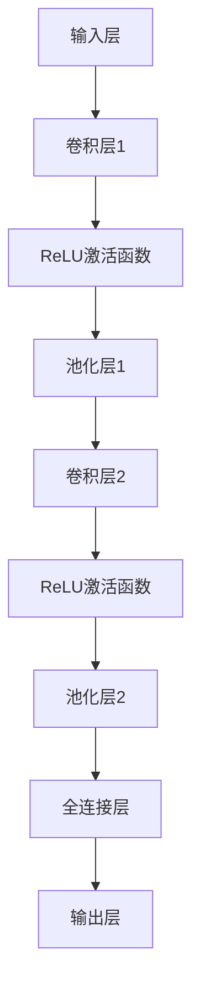

                 

### 第一部分：引言

#### 1.1 本书的目的与结构

在当今医学科技飞速发展的时代，计算机视觉技术在医疗诊断中的应用越来越广泛，显著提升了诊断效率和准确性。本书旨在深入探讨计算机视觉在医疗诊断中的辅助作用，通过系统的分析和讲解，帮助读者了解这一领域的最新进展和潜在挑战。

本书的结构安排如下：

- **第一部分：引言**：介绍本书的目的、结构、以及计算机视觉与医疗诊断的关系。
- **第二部分：计算机视觉基础**：阐述计算机视觉的基本概念、算法基础和系统架构。
- **第三部分：计算机视觉在医疗诊断中的应用**：详细分析计算机视觉在各类医学诊断中的应用。
- **第四部分：核心算法原理讲解**：讲解卷积神经网络、深度学习和机器学习算法在计算机视觉中的应用。
- **第五部分：数学模型与公式详解**：介绍计算机视觉中的数学模型、深度学习和机器学习中的数学模型。
- **第六部分：项目实战**：通过实际应用案例展示计算机视觉在医疗诊断中的具体实现。
- **第七部分：未来发展趋势**：探讨计算机视觉在医疗诊断中的未来发展方向和挑战。

通过本书的逐步讲解，读者将能够系统地掌握计算机视觉在医疗诊断中的应用，从而为这一领域的发展贡献自己的力量。

#### 1.2 计算机视觉与医疗诊断的关系

计算机视觉与医疗诊断之间的结合，为医学领域带来了前所未有的变革。首先，计算机视觉技术具有高效、精准和客观的特点，这使其在处理大量医学影像数据时具有显著优势。传统的医疗诊断往往依赖于医生的主观判断，而计算机视觉技术能够通过算法和模型，对医学影像进行自动化分析，从而减少人为误差，提高诊断的准确性和一致性。

其次，计算机视觉在医疗诊断中的应用范围广泛。从常见的X射线、CT、MRI影像分析，到皮肤病变、口腔疾病、眼科疾病的诊断，计算机视觉技术都展现出了强大的能力。例如，在皮肤病诊断中，计算机视觉可以通过图像处理和分类算法，自动检测和识别皮肤病变区域，从而辅助医生进行诊断。

此外，计算机视觉技术还可以辅助医生进行手术导航。通过三维重建技术和视觉跟踪系统，医生可以在手术过程中实时观察器官的三维结构，提高手术的精度和安全性。

然而，计算机视觉在医疗诊断中的应用也面临诸多挑战。例如，医学影像数据的质量和多样性对算法的泛化能力提出了高要求；算法的可解释性和透明性不足，使得医生难以理解其决策过程；数据隐私和安全问题也亟待解决。

总之，计算机视觉与医疗诊断的结合，不仅能够提高诊断效率和准确性，还为个性化医疗和精准医疗提供了新的可能。通过本书的深入探讨，读者将能够更全面地理解这一领域的发展现状和未来趋势。

#### 1.3 计算机视觉在医疗诊断中的应用现状与挑战

当前，计算机视觉技术在医疗诊断中已取得了显著的应用成果。以医学影像分析为例，计算机视觉技术通过深度学习和卷积神经网络等先进算法，能够自动识别和分类病变区域，如肺癌、乳腺癌、心脏病等。据研究报告，这些算法在诊断准确率上已接近或超过了人类医生的水平。此外，计算机视觉技术还被广泛应用于皮肤病变、口腔疾病和眼科疾病的诊断。例如，通过图像处理技术，计算机视觉可以自动检测皮肤病变的位置和类型，提高皮肤病诊断的效率；在口腔疾病诊断中，计算机视觉技术能够精准识别牙齿的病变区域，辅助牙医进行早期诊断和治疗；在眼科诊断中，计算机视觉技术可以实时检测眼底病变，如糖尿病视网膜病变，为医生提供可靠的诊断依据。

然而，尽管计算机视觉在医疗诊断中展现出巨大的潜力，其应用也面临诸多挑战。首先，医学影像数据的多样性和复杂性对算法的泛化能力提出了高要求。医学影像数据往往具有高噪声、高变异性，且不同病患的影像数据差异较大，这要求算法具有高度的鲁棒性和适应性。其次，算法的可解释性不足是一个亟待解决的问题。在医疗诊断中，医生需要了解算法的决策过程，以确保诊断结果的可靠性和安全性。然而，深度学习算法的黑箱性质使得其决策过程难以解释，这给临床应用带来了困难。最后，数据隐私和安全问题也是计算机视觉在医疗诊断中面临的一大挑战。医学影像数据包含敏感的个人健康信息，如何确保数据的安全传输和存储，避免数据泄露，是一个重要的问题。

为了应对这些挑战，研究者们正在努力提高计算机视觉算法的泛化能力，增强算法的可解释性，并采取多种安全措施来保护患者隐私。例如，通过迁移学习和增量学习等技术，提高算法在多样化数据上的性能；通过可视化技术和解释性模型，使算法的决策过程更加透明；通过加密技术和隐私保护算法，确保医学影像数据的安全。总之，计算机视觉技术在医疗诊断中的应用前景广阔，但需要克服一系列技术挑战，才能真正实现其潜在价值。

#### 1.4 书的目标读者

本书的目标读者主要包括以下几类：

1. **医疗领域专业人士**：包括医生、医学研究人员和医疗设备开发人员。这些读者可以通过本书了解计算机视觉技术在医疗诊断中的应用，提高诊断效率和准确性，从而为患者提供更优质的医疗服务。

2. **计算机视觉领域研究人员**：包括计算机视觉、机器学习和深度学习的研究人员。这些读者可以通过本书深入理解计算机视觉在医疗诊断中的具体应用场景，拓展研究领域，并推动相关技术的发展。

3. **软件工程师和程序员**：对计算机视觉和医疗领域有兴趣的工程师和程序员。这些读者可以通过本书学习如何将计算机视觉技术应用于医疗诊断，开发相关的医疗软件和系统。

4. **医学院学生**：对医学和计算机技术交叉领域感兴趣的医学院学生。这些读者可以通过本书初步了解计算机视觉在医疗诊断中的应用，为将来从事相关领域的工作打下基础。

总之，本书旨在为不同背景的读者提供一个系统、全面的视角，帮助他们深入了解计算机视觉在医疗诊断中的辅助作用，并激发他们在这一领域的进一步研究和探索。无论您是医疗专业人士、计算机视觉研究者、工程师还是学生，本书都将为您带来有价值的知识和启发。

### 第二部分：计算机视觉基础

#### 2.1 计算机视觉的基本概念

计算机视觉是人工智能领域的一个重要分支，旨在使计算机具备理解和解释图像和视频数据的能力。它借鉴了人类视觉系统的原理，通过计算机算法和数学模型，从图像或视频中提取有用的信息，从而实现对现实世界的理解和交互。

首先，计算机视觉的基本任务可以分为以下几个方面：

1. **图像识别**：识别图像中的物体、场景或特征。例如，通过卷积神经网络（CNN）实现人脸识别或物体分类。
2. **图像分类**：将图像分为预定义的类别。例如，将一幅图像分类为“猫”或“狗”。
3. **目标检测**：在图像中检测并定位特定目标。例如，在视频流中实时检测行人或车辆。
4. **图像分割**：将图像划分为不同的区域，每个区域对应不同的对象或特征。例如，将一幅图像分割为前景和背景。
5. **运动分析**：分析图像序列中的运动信息，例如，跟踪物体的运动轨迹。

其次，计算机视觉中的基本概念包括：

- **像素**：图像的基本单位，通常用二维阵列表示。
- **分辨率**：图像中像素的数目，通常以水平和垂直像素数表示。
- **灰度图像**：每个像素只有一个强度值，通常用来表示图像的亮度。
- **彩色图像**：每个像素有三个强度值，分别对应红、绿、蓝三种颜色。
- **特征提取**：从图像中提取具有区分性的特征，如边缘、角点、纹理等。
- **特征匹配**：在多个图像或图像的不同部分之间寻找和匹配相似的特征。

此外，计算机视觉系统通常包括以下几个关键组成部分：

- **输入设备**：用于获取图像或视频数据，如摄像头、扫描仪等。
- **预处理**：对输入图像进行必要的处理，如去噪、校正等，以提高后续处理的准确性。
- **特征提取**：从预处理后的图像中提取具有代表性的特征。
- **模型训练**：使用标记的图像数据训练机器学习模型，使其能够进行图像识别、分类、目标检测等任务。
- **输出**：系统生成的结果，如识别出的物体、分类结果、定位信息等。

通过这些基本概念和组件，计算机视觉系统能够有效地处理和分析图像和视频数据，实现从感知到理解的一系列任务，为各种应用场景提供强有力的技术支持。

#### 2.1.1 图像处理与计算机视觉的区别

图像处理和计算机视觉虽然密切相关，但它们在目标、方法和应用上存在显著差异。

首先，图像处理的定义主要涉及对图像进行各种操作，如滤波、增强、压缩、变换等，以改善图像的质量或提取有用的信息。图像处理的核心目标是通过算法和技术手段，对图像进行视觉上的优化或特定功能的实现。例如，图像去噪、边缘检测、图像压缩等都是图像处理中常见的任务。图像处理方法通常不涉及对图像内容的深层次理解和解释，而是侧重于图像的表面特征和视觉效果。

相比之下，计算机视觉的目标是使计算机具备理解和解释图像的能力，模拟人类视觉系统的感知过程。计算机视觉不仅包括对图像的预处理和特征提取，还涉及更高层次的任务，如目标识别、场景理解、行为分析等。计算机视觉的核心在于通过算法和模型，从图像或视频中提取语义信息，实现对现实世界的理解和交互。例如，计算机视觉可以用于物体分类、目标检测、图像分割和场景理解等任务，这些任务要求系统具备对图像内容的深层次理解和解释能力。

在方法上，图像处理主要依赖于传统的算法和数学模型，如滤波器、变换和特征提取方法。这些方法通常是对图像像素的直接操作，关注的是图像的局部特征和视觉效果。而计算机视觉则更多地依赖于机器学习和深度学习技术，通过训练复杂的神经网络模型，从大量的标记数据中自动学习图像的特征和规律。深度学习方法，如卷积神经网络（CNN），能够在多层次上提取图像的特征，从而实现高层次的图像理解任务。

在应用方面，图像处理主要应用于图像质量的提升和特定功能的实现，如医学图像处理、卫星图像分析、图像压缩等。计算机视觉则广泛应用于需要理解和解释图像内容的领域，如自动驾驶、安防监控、医疗诊断、人机交互等。计算机视觉技术的应用不仅限于图像本身的处理，还包括对图像内容的分析和推理，从而实现更加智能和自主的系统。

综上所述，图像处理和计算机视觉在目标、方法和应用上存在显著差异。图像处理侧重于图像的表面优化和特定功能的实现，而计算机视觉则致力于使计算机理解和解释图像内容，从而实现更加智能化和自动化的图像处理和分析。

#### 2.1.2 计算机视觉的关键技术

计算机视觉技术的核心在于从图像或视频中提取有用的信息，并实现对现实世界的理解和解释。为实现这一目标，计算机视觉领域发展了多种关键技术和方法。以下是几种主要的技术和它们的应用场景：

1. **特征提取**：特征提取是计算机视觉中至关重要的一步，旨在从图像中提取具有区分性的特征，如边缘、角点、纹理和形状。常用的特征提取方法包括：

   - **边缘检测**：通过计算图像的梯度或二阶导数来检测图像中的边缘。常用的算法有Sobel算子、Canny边缘检测等。
   - **角点检测**：检测图像中具有显著特征的角点，常用于图像配准和特征匹配。常用的算法有Harris角点检测和Shi-Tomasi角点检测。
   - **纹理分析**：通过分析图像中的纹理模式来识别对象。常用的算法有Gabor滤波器和LBP（Local Binary Patterns）。

2. **目标检测**：目标检测是在图像中识别并定位特定目标的方法。它在自动驾驶、安防监控和医疗诊断等领域具有重要应用。常用的目标检测算法包括：

   - **滑动窗口法**：通过在图像中滑动不同大小和形状的窗口，对每个窗口内的图像进行分类，从而检测目标。这种方法简单但计算量大。
   - **深度学习方法**：如YOLO（You Only Look Once）和SSD（Single Shot MultiBox Detector）等，通过训练深度神经网络模型，直接从图像中预测目标的类别和位置。这些方法速度快，准确度高。

3. **图像分割**：图像分割是将图像划分为不同区域的任务，每个区域对应不同的对象或特征。常用的图像分割方法包括：

   - **基于阈值的方法**：通过设定不同的阈值将图像划分为多个区域。这种方法简单但需要手动设置阈值。
   - **基于区域的分割**：如区域增长法，通过分析图像的局部特征，逐步将相邻的像素划分为同一区域。
   - **基于边界的分割**：通过检测图像中的边缘来分割图像。常用的算法有GrabCut和FloodFill等。

4. **场景理解**：场景理解是计算机视觉中的高级任务，旨在理解图像或视频中的全局信息，如场景布局、对象关系和空间关系。常用的方法包括：

   - **物体识别**：通过识别图像中的不同物体，实现对场景的理解。常用的算法有CNN和R-CNN（Region-based Convolutional Neural Network）。
   - **语义分割**：将图像中的每个像素分类为不同的语义类别，如道路、行人、车辆等。常用的算法有FCN（Fully Convolutional Network）和DeepLab。

5. **行为分析**：行为分析是通过分析视频序列中的动作和事件，实现对现实世界的理解。常用的方法包括：

   - **动作识别**：通过识别视频中的动作模式，如走路、跑步、跳跃等。
   - **事件检测**：通过检测视频中的特定事件，如车辆碰撞、异常行为等。

这些关键技术在计算机视觉系统中发挥着重要作用，共同推动了计算机视觉技术的发展和应用。通过结合这些技术，计算机视觉系统能够有效地处理和分析图像和视频数据，实现从感知到理解的复杂任务。

#### 2.2 计算机视觉的算法基础

计算机视觉算法是计算机视觉系统实现其功能的核心，这些算法基于数学模型和统计学原理，通过分析和处理图像数据，提取有用的信息并实现特定任务。以下是几种主要的计算机视觉算法及其工作原理：

1. **基于传统算法的图像处理**

   - **图像滤波**：图像滤波是去除图像噪声的重要方法。常见的滤波器有均值滤波、高斯滤波和中值滤波。其中，均值滤波通过计算邻域像素的平均值来平滑图像；高斯滤波利用高斯分布模型对图像进行加权平均，从而去除高频噪声；中值滤波通过选择邻域像素的中值来去除椒盐噪声。

     ```python
     # 均值滤波伪代码
     def mean_filter(image, kernel_size):
         filtered_image = []
         for i in range(image.shape[0] - kernel_size):
             for j in range(image.shape[1] - kernel_size):
                 window = image[i:i+kernel_size, j:j+kernel_size]
                 filtered_image.append(np.mean(window))
         return filtered_image
     ```

   - **边缘检测**：边缘检测是提取图像中的显著特征，常用的算法有Sobel算子和Canny算子。Sobel算子通过计算图像的水平和垂直梯度，检测边缘；Canny算子则通过多级滤波和边缘检测，实现更精确的边缘提取。

     ```python
     # Sobel边缘检测伪代码
     def sobel_edge_detection(image):
         Gx = [[1, 0, -1], [2, 0, -2], [1, 0, -1]]
         Gy = [[1, 2, 1], [0, 0, 0], [-1, -2, -1]]
         
         image_x = conv2d(image, Gx)
         image_y = conv2d(image, Gy)
         
         edge_map = np.sqrt(np.square(image_x) + np.square(image_y))
         return edge_map
     ```

2. **基于机器学习的图像分类**

   - **支持向量机（SVM）**：SVM是一种监督学习算法，用于分类问题。它通过找到一个最优的超平面，将不同类别的数据点分隔开。SVM在图像分类中表现出色，特别是当数据点在高维空间中时。

     ```python
     # SVM分类伪代码
     from sklearn.svm import SVC
     
     # 假设X_train为训练集，y_train为训练标签
     classifier = SVC()
     classifier.fit(X_train, y_train)
     
     # 预测
     predictions = classifier.predict(X_test)
     ```

   - **决策树与随机森林**：决策树通过一系列的规则对数据进行分割，最终得到一个分类结果。随机森林则是由多个决策树组成的集合，通过集成多个模型的结果来提高分类的准确性和鲁棒性。

     ```python
     # 决策树分类伪代码
     from sklearn.tree import DecisionTreeClassifier
     
     # 假设X_train为训练集，y_train为训练标签
     classifier = DecisionTreeClassifier()
     classifier.fit(X_train, y_train)
     
     # 预测
     predictions = classifier.predict(X_test)
     ```

3. **基于深度学习的图像识别**

   - **卷积神经网络（CNN）**：CNN是一种特殊的神经网络，用于图像识别。它通过卷积层、池化层和全连接层等结构，从图像中逐层提取特征，并最终实现分类任务。CNN在图像识别任务中取得了显著的性能提升。

     ```python
     # CNN分类伪代码
     from tensorflow.keras.models import Sequential
     from tensorflow.keras.layers import Conv2D, MaxPooling2D, Flatten, Dense
     
     # 构建模型
     model = Sequential()
     model.add(Conv2D(filters=32, kernel_size=(3, 3), activation='relu', input_shape=(28, 28, 1)))
     model.add(MaxPooling2D(pool_size=(2, 2)))
     model.add(Flatten())
     model.add(Dense(units=10, activation='softmax'))
     
     # 编译模型
     model.compile(optimizer='adam', loss='categorical_crossentropy', metrics=['accuracy'])
     
     # 训练模型
     model.fit(X_train, y_train, epochs=10, batch_size=64)
     ```

   - **生成对抗网络（GAN）**：GAN是一种无监督学习算法，通过两个对抗网络（生成器和判别器）的博弈过程，生成逼真的图像。GAN在图像生成和增强任务中表现出色。

     ```python
     # GAN生成伪代码
     from tensorflow.keras.models import Sequential
     from tensorflow.keras.layers import Dense, Conv2D, Conv2DTranspose, Flatten
     
     # 假设z是生成器的输入，x是判别器的输入
     generator = Sequential()
     generator.add(Dense(units=256, activation='relu', input_shape=(100,)))
     generator.add(Flatten())
     generator.add(Conv2DTranspose(filters=128, kernel_size=(3, 3), activation='relu'))
     generator.add(Conv2DTranspose(filters=128, kernel_size=(3, 3), activation='relu'))
     generator.add(Conv2DTranspose(filters=1, kernel_size=(3, 3), activation='sigmoid'))
     
     # 判别器
     discriminator = Sequential()
     discriminator.add(Flatten())
     discriminator.add(Dense(units=256, activation='relu'))
     discriminator.add(Dense(units=1, activation='sigmoid'))
     ```

通过这些算法，计算机视觉系统能够有效地处理和分析图像数据，从简单的图像增强到复杂的图像识别，都展现出强大的能力。这些算法不仅提高了图像处理的效率和质量，还为计算机视觉技术的广泛应用提供了坚实的基础。

#### 2.2.1 视觉感知与认知模型

视觉感知与认知模型是计算机视觉领域中重要的研究课题，旨在模拟人类视觉系统的工作原理，从而提升计算机对图像和视频数据的理解和解释能力。以下是几种主要的视觉感知与认知模型：

1. **视皮层模型**：视皮层是人类大脑中负责视觉处理的主要区域，包括初级视皮层（V1）、次级视皮层（V2）等。视皮层模型通过模拟这些区域的结构和功能，实现对图像的分层处理。例如，初级视皮层负责处理基本的边缘和纹理信息，而次级视皮层则负责更复杂的形状和运动信息。近年来，深度学习模型，如卷积神经网络（CNN），在一定程度上借鉴了视皮层的结构和工作原理，通过多层卷积和池化操作，逐步提取图像的深层特征。

2. **视觉感知层次模型**：视觉感知层次模型（Visual Perception Hierarchy Model）是一种基于层次结构的思想，旨在模拟人类视觉系统从低级到高级的感知过程。该模型通常包括多个层次，每个层次负责处理不同类型的视觉信息。例如，第一层可能负责检测图像中的基本特征，如边缘和角点；第二层则将这些基本特征组合成更复杂的形状和结构；第三层则负责理解图像的语义信息，如物体识别和场景理解。这种层次化的模型结构有助于提高计算机视觉系统对复杂图像数据的处理能力。

3. **视觉注意模型**：视觉注意模型（Visual Attention Model）模拟人类视觉系统在处理视觉信息时的注意力分配机制。这种模型通过动态地调整注意焦点，实现图像的局部区域分析和全局理解。例如，基于视觉注意力的卷积神经网络（如SENet和注意力机制）可以通过关注图像中的关键区域，提高分类和目标检测的准确性。视觉注意模型在医学图像分析中尤为重要，可以帮助系统自动识别病变区域，从而辅助医生进行诊断。

4. **场景理解模型**：场景理解模型旨在模拟人类视觉系统对图像或视频中的全局信息进行理解和解释的能力。这类模型通常包括物体识别、场景分类、关系推理等多个层次。例如，通过训练深度神经网络，可以实现对场景中不同物体的识别和分类，并推断它们之间的关系。这种模型在自动驾驶、智能监控和医疗诊断等领域具有广泛的应用前景。

5. **三维重建模型**：三维重建模型通过分析二维图像或视频，重建出场景的三维结构。这类模型通常基于几何推理和深度学习技术。例如，结构光立体成像技术通过在场景上投射已知图案，利用图像的畸变信息重建三维结构；基于深度学习的三维重建方法，如VoxelNet和PointNet，通过训练复杂的神经网络模型，从二维图像中提取三维信息。

通过这些视觉感知与认知模型，计算机视觉系统能够更有效地模拟人类视觉系统的工作原理，实现对图像和视频数据的深入理解和解释。这些模型不仅在学术界得到广泛关注，还在工业界和实际应用中取得了显著成果。

#### 2.2.2 机器学习算法在计算机视觉中的应用

机器学习算法在计算机视觉中的应用极大地提升了图像识别、分类、目标检测等任务的性能和效率。以下是几种主要的机器学习算法及其在计算机视觉中的应用：

1. **支持向量机（SVM）**：SVM是一种高效的分类算法，特别适合于高维数据。在计算机视觉中，SVM常用于图像分类任务，通过在特征空间中找到一个最优的超平面，将不同类别的图像分隔开来。SVM的核心思想是最大化分类边界，使分类间隔最大化，从而提高分类的准确性。SVM在图像分类任务中，特别是面对高噪声和小样本时，表现出色。

   ```python
   from sklearn.svm import SVC
   
   # 假设X_train为训练集，y_train为训练标签
   classifier = SVC(kernel='linear')
   classifier.fit(X_train, y_train)
   
   # 预测
   predictions = classifier.predict(X_test)
   ```

2. **决策树与随机森林**：决策树是一种简单但强大的分类算法，通过一系列的规则对数据进行分割，最终得到一个分类结果。随机森林则是通过集成多棵决策树来提高分类的准确性和鲁棒性。随机森林在处理大量特征和小样本数据时，表现尤为出色。在计算机视觉中，决策树和随机森林常用于图像分类和目标检测任务。

   ```python
   from sklearn.ensemble import RandomForestClassifier
   
   # 假设X_train为训练集，y_train为训练标签
   classifier = RandomForestClassifier()
   classifier.fit(X_train, y_train)
   
   # 预测
   predictions = classifier.predict(X_test)
   ```

3. **深度学习算法**：深度学习算法，如卷积神经网络（CNN）、生成对抗网络（GAN）等，在计算机视觉中取得了显著的突破。CNN通过多层卷积和池化操作，从图像中逐层提取特征，并最终实现分类、目标检测和图像生成任务。GAN则通过生成器和判别器的博弈过程，生成逼真的图像。深度学习算法在图像识别、图像生成和图像增强等领域表现出色。

   ```python
   from tensorflow.keras.models import Sequential
   from tensorflow.keras.layers import Conv2D, MaxPooling2D, Flatten, Dense
   
   # 构建模型
   model = Sequential()
   model.add(Conv2D(filters=32, kernel_size=(3, 3), activation='relu', input_shape=(28, 28, 1)))
   model.add(MaxPooling2D(pool_size=(2, 2)))
   model.add(Flatten())
   model.add(Dense(units=10, activation='softmax'))
   
   # 编译模型
   model.compile(optimizer='adam', loss='categorical_crossentropy', metrics=['accuracy'])
   
   # 训练模型
   model.fit(X_train, y_train, epochs=10, batch_size=64)
   ```

4. **强化学习算法**：强化学习算法通过学习与环境的交互策略，在计算机视觉中可用于图像生成和动作规划任务。例如，通过训练智能体在虚拟环境中进行视觉感知和决策，从而实现图像生成和自动驾驶等任务。强化学习算法在计算机视觉中的应用，如视觉自动驾驶、机器人视觉等，显示出巨大的潜力。

   ```python
   import tensorflow as tf
   
   # 建立强化学习模型
   model = tf.keras.Sequential([
       tf.keras.layers.Flatten(input_shape=(28, 28)),
       tf.keras.layers.Dense(64, activation='relu'),
       tf.keras.layers.Dense(10, activation='softmax')
   ])
   
   # 编译模型
   model.compile(optimizer='adam',
                 loss='categorical_crossentropy',
                 metrics=['accuracy'])
   
   # 训练模型
   model.fit(x_train, y_train, epochs=10)
   ```

通过这些机器学习算法，计算机视觉系统能够有效地从图像数据中学习并提取有用的信息，从而实现从简单的图像识别到复杂的图像理解的一系列任务。这些算法不仅在学术研究中得到广泛应用，还在实际应用中发挥了重要作用，推动了计算机视觉技术的不断进步。

#### 2.3 计算机视觉系统架构

计算机视觉系统的架构是实现有效图像处理和理解的基石。一个典型的计算机视觉系统通常包括硬件平台、软件框架和工具包三个主要组成部分。下面将详细讨论这些部分的选择与配置。

##### 2.3.1 硬件平台选择

硬件平台的选择对计算机视觉系统的性能和效率有着重要影响。以下是几种常见的硬件平台及其特点：

1. **CPU**：中央处理器（CPU）是传统的计算平台，适用于大多数标准的图像处理任务。尽管CPU在计算速度上不及GPU，但其稳定性、兼容性和资源丰富性使其成为许多应用场景的首选。

   - **优点**：资源丰富、兼容性好、稳定性高。
   - **缺点**：计算速度相对较慢、功耗较大。

2. **GPU**：图形处理器（GPU）是专为图形处理设计的硬件，具有大量并行计算的单元，适用于需要高计算量的计算机视觉任务，如深度学习模型训练和实时图像处理。

   - **优点**：计算速度快、并行处理能力强、适用于复杂任务。
   - **缺点**：兼容性相对较差、功耗较大。

3. **FPGA**：现场可编程门阵列（FPGA）是一种高度可编程的硬件平台，能够实现高度定制化的图像处理算法，适用于需要高性能和低延迟的应用场景。

   - **优点**：可编程性高、性能优异、低延迟。
   - **缺点**：成本较高、开发难度大。

4. **ASIC**：专用集成电路（ASIC）是针对特定应用场景设计的硬件平台，具有最高的性能和最低的功耗，适用于需要极致性能和功耗优化场景。

   - **优点**：性能优异、功耗低。
   - **缺点**：开发成本高、灵活性较差。

选择硬件平台时，需要根据具体应用场景的需求和资源条件进行权衡。例如，对于需要实时处理的图像处理任务，GPU和FPGA可能是更好的选择；对于资源受限的环境，CPU则可能更为合适。

##### 2.3.2 软件框架与工具包

软件框架和工具包是计算机视觉系统开发的重要组成部分，提供了丰富的功能和便捷的开发接口。以下是几种常用的软件框架和工具包：

1. **OpenCV**：OpenCV是一个开源的计算机视觉库，提供了丰富的图像处理和计算机视觉算法。它支持多种编程语言，包括C++、Python等，适用于各种图像处理和计算机视觉任务。

   - **优点**：功能强大、开源免费、支持多种编程语言。
   - **缺点**：深度学习支持较弱、更新不如商业框架。

2. **TensorFlow**：TensorFlow是一个由Google开发的深度学习框架，适用于构建和训练复杂的神经网络模型。它提供了丰富的API和工具，支持多种深度学习模型，如卷积神经网络（CNN）和循环神经网络（RNN）。

   - **优点**：强大的深度学习支持、丰富的API、社区活跃。
   - **缺点**：图像处理功能相对较弱、入门门槛较高。

3. **PyTorch**：PyTorch是另一个流行的深度学习框架，由Facebook开发。它提供了简洁的API和动态计算图，使得模型设计和调试更加便捷。PyTorch在计算机视觉领域得到了广泛应用。

   - **优点**：动态计算图、易于调试、社区活跃。
   - **缺点**：计算效率稍逊于TensorFlow、部分性能优化不如TensorFlow。

4. **Caffe**：Caffe是一个由Berkeley Vision and Learning Center（BVLC）开发的深度学习框架，以其高效和优化性能著称。Caffe广泛应用于图像识别、目标检测和图像生成任务。

   - **优点**：高效、优化性能、易于使用。
   - **缺点**：动态图支持较弱、社区更新不如PyTorch和TensorFlow。

选择软件框架和工具包时，需要根据项目的具体需求和技术背景进行选择。例如，对于需要快速开发的任务，可以选择OpenCV和Caffe；对于需要强大深度学习支持的复杂任务，可以选择TensorFlow和PyTorch。

综上所述，计算机视觉系统的架构设计需要综合考虑硬件平台、软件框架和工具包的选择。通过合理的配置和优化，可以实现高效的图像处理和计算机视觉任务，为实际应用提供强有力的技术支持。

#### 2.3.3 计算机视觉系统的开发流程

计算机视觉系统的开发流程通常包括需求分析、数据收集、算法设计、模型训练、系统实现和测试与优化等环节。以下将详细描述这些环节的具体步骤和注意事项：

1. **需求分析**：
   - **确定任务目标**：首先需要明确计算机视觉系统的具体任务，如图像识别、目标检测、图像分割等。
   - **需求文档编写**：根据任务目标，编写详细的需求文档，包括系统功能、性能指标、使用场景等。

2. **数据收集**：
   - **数据来源**：数据来源可以是公开的数据集，如ImageNet、COCO等，也可以是自采集的特定领域数据。
   - **数据预处理**：对收集到的数据进行分析和清洗，去除噪声和异常值，并进行数据增强，提高模型的泛化能力。

3. **算法设计**：
   - **选择算法**：根据任务需求和现有算法的性能表现，选择合适的算法，如卷积神经网络（CNN）、深度学习模型（如ResNet、YOLO等）。
   - **算法优化**：通过调整模型参数、优化网络结构，提高算法的准确率和效率。

4. **模型训练**：
   - **模型构建**：使用所选算法构建模型，配置网络结构、学习率和优化器等参数。
   - **训练过程**：在训练集上训练模型，通过迭代调整模型参数，使模型能够准确地识别和分类图像。

5. **系统实现**：
   - **集成开发环境**：选择合适的集成开发环境（IDE），如PyCharm、VSCode等，进行系统实现。
   - **模块化开发**：将系统划分为多个模块，如图像处理、模型训练、预测输出等，实现模块化开发，提高代码的可维护性和可扩展性。

6. **测试与优化**：
   - **测试集验证**：在测试集上验证模型性能，评估模型的准确率、召回率、F1值等指标。
   - **性能优化**：通过调整模型参数、优化算法，提高模型在时间和空间上的性能。
   - **系统测试**：对完整系统进行功能测试和性能测试，确保系统能够稳定运行。

在开发过程中，需要特别关注以下几个方面：

- **数据质量和多样性**：数据质量和多样性对模型的性能至关重要，需要确保数据集的代表性和完整性。
- **算法选择和优化**：选择合适的算法和优化策略，能够显著提高模型的性能和效率。
- **系统兼容性和可维护性**：系统应具有良好的兼容性和可维护性，便于后续的扩展和维护。

通过遵循这些开发流程和注意事项，可以有效地构建和优化计算机视觉系统，满足具体应用场景的需求。

### 第三部分：计算机视觉在医疗诊断中的应用

#### 3.1 计算机视觉在医学影像分析中的应用

计算机视觉技术在医学影像分析中发挥了关键作用，显著提升了影像诊断的效率和准确性。以下将详细探讨计算机视觉在X射线、CT和MRI影像分析中的应用。

##### 3.1.1 X射线影像分析

X射线影像分析是计算机视觉在医疗诊断中最早应用之一。X射线成像通过发射X射线穿透人体组织，形成图像，用于诊断骨折、肺炎、肺癌等疾病。计算机视觉技术在X射线影像分析中的应用主要包括以下几个方面：

- **自动病灶检测**：通过卷积神经网络（CNN）和深度学习算法，计算机视觉系统能够自动识别和定位X射线图像中的病变区域。例如，在肺炎检测中，系统可以自动识别并标记出肺部中的炎症区域，提高诊断的准确性。

  ```python
  # 自动病灶检测伪代码
  import cv2
  import numpy as np

  # 加载预训练的CNN模型
  model = cv2.dnn.readNetFromTensorFlow('model.pb')

  # 加载X射线图像
  image = cv2.imread('xray_image.jpg')

  # 进行病灶检测
  blob = cv2.dnn.blobFromImage(image, scalefactor=1/255)
  model.setInput(blob)
  detections = model.forward()

  # 标记病变区域
  for detection in detections:
      scores = detection[5:]
      class_id = np.argmax(scores)
      confidence = scores[class_id]
      if confidence > 0.5:
          # 标记病变区域
          x = int(detection[0] * image.shape[1])
          y = int(detection[1] * image.shape[0])
          w = int(detection[2] * image.shape[1])
          h = int(detection[3] * image.shape[0])
          cv2.rectangle(image, (x, y), (x+w, y+h), (0, 0, 255), 2)
  cv2.imshow('X-ray Image with Lesions Detected', image)
  cv2.waitKey(0)
  cv2.destroyAllWindows()
  ```

- **影像分割与分类**：计算机视觉技术还可以对X射线图像进行分割，将病变区域与正常组织区分开，并进行分类。通过分析病变区域的特征，系统可以进一步判断病变的类型和严重程度。

- **影像对比分析**：计算机视觉技术可以帮助医生进行影像对比分析，观察病变区域在不同时间点的变化情况。这有助于判断病情的发展趋势，为治疗决策提供依据。

##### 3.1.2 CT影像分析

计算机断层扫描（CT）是一种利用X射线进行多角度扫描，生成三维图像的成像技术。CT影像分析在诊断多种疾病，如肿瘤、动脉瘤、骨折等，具有极高的准确性。计算机视觉技术在CT影像分析中的应用主要包括：

- **自动病灶检测**：类似于X射线影像分析，计算机视觉技术可以通过卷积神经网络（CNN）和深度学习算法，自动识别和定位CT图像中的病变区域。通过三维重建技术，系统能够更全面地分析病变区域的结构和特征。

  ```python
  # 自动病灶检测与三维重建伪代码
  import open3d as o3d
  import numpy as np
  import cv2

  # 加载预训练的CNN模型
  model = cv2.dnn.readNetFromTensorFlow('model.pb')

  # 加载CT图像
  image = cv2.imread('ct_image.jpg')

  # 进行病灶检测
  blob = cv2.dnn.blobFromImage(image, scalefactor=1/255)
  model.setInput(blob)
  detections = model.forward()

  # 提取病变区域坐标
  lesions = []
  for detection in detections:
      scores = detection[5:]
      class_id = np.argmax(scores)
      confidence = scores[class_id]
      if confidence > 0.5:
          x = int(detection[0] * image.shape[1])
          y = int(detection[1] * image.shape[0])
          w = int(detection[2] * image.shape[1])
          h = int(detection[3] * image.shape[0])
          lesions.append([x, y, w, h])

  # 三维重建
  points = np.zeros((len(lesions), 3))
  for i, lesion in enumerate(lesions):
      x, y, w, h = lesion
      points[i][0] = x
      points[i][1] = y
      points[i][2] = 1  # z坐标

  # 创建点云
  pcd = o3d.geometry.PointCloud()
  pcd.points = o3d.utility.Vector3dVector(points)
  o3d.visualization.draw_geometries([pcd])
  ```

- **影像分割与分类**：计算机视觉技术可以对CT影像进行精细分割，将病变区域与正常组织精确分离，并进行分类。三维重建技术使得系统可以从多个角度分析病变区域，提高诊断的准确性。

- **影像对比分析**：通过计算机视觉技术，医生可以对比分析不同时间点的CT影像，观察病变区域的变化情况，从而评估病情的发展趋势和治疗效果。

##### 3.1.3 MRI影像分析

磁共振成像（MRI）是一种利用磁场和无线电波生成人体内部结构图像的成像技术。MRI在诊断神经系统疾病、肌肉骨骼系统疾病、肿瘤等疾病中具有重要作用。计算机视觉技术在MRI影像分析中的应用主要包括：

- **自动病灶检测**：计算机视觉技术可以通过深度学习和卷积神经网络（CNN），自动识别和定位MRI图像中的病变区域。例如，在脑部肿瘤检测中，系统可以自动识别并标记出肿瘤区域。

  ```python
  # 自动病灶检测伪代码
  import cv2
  import numpy as np

  # 加载预训练的CNN模型
  model = cv2.dnn.readNetFromTensorFlow('model.pb')

  # 加载MRI图像
  image = cv2.imread('mri_image.jpg')

  # 进行病灶检测
  blob = cv2.dnn.blobFromImage(image, scalefactor=1/255)
  model.setInput(blob)
  detections = model.forward()

  # 标记病变区域
  for detection in detections:
      scores = detection[5:]
      class_id = np.argmax(scores)
      confidence = scores[class_id]
      if confidence > 0.5:
          x = int(detection[0] * image.shape[1])
          y = int(detection[1] * image.shape[0])
          w = int(detection[2] * image.shape[1])
          h = int(detection[3] * image.shape[0])
          cv2.rectangle(image, (x, y), (x+w, y+h), (0, 0, 255), 2)
  cv2.imshow('MRI Image with Lesions Detected', image)
  cv2.waitKey(0)
  cv2.destroyAllWindows()
  ```

- **影像分割与分类**：计算机视觉技术可以对MRI影像进行精细分割，将病变区域与正常组织分离，并进行分类。通过三维重建技术，系统可以从多个角度分析病变区域，提高诊断的准确性。

- **影像对比分析**：通过计算机视觉技术，医生可以对比分析不同时间点的MRI影像，观察病变区域的变化情况，从而评估病情的发展趋势和治疗效果。

总之，计算机视觉技术在医学影像分析中具有广泛的应用，通过自动病灶检测、影像分割与分类、影像对比分析等技术，显著提升了医学影像诊断的效率和准确性，为临床诊断和患者治疗提供了有力支持。

#### 3.2 计算机视觉在皮肤病诊断中的应用

计算机视觉技术在皮肤病诊断中发挥着重要作用，通过自动化分析皮肤病变图像，为医生提供辅助诊断工具，提高诊断效率和准确性。以下将详细探讨计算机视觉技术在皮肤病变区域检测和分类识别中的应用。

##### 3.2.1 病变区域检测

病变区域检测是皮肤病诊断的首要任务，其目的是在皮肤图像中自动识别并定位病变区域。计算机视觉技术通过图像处理和深度学习算法，实现病变区域的检测。以下是几种常见的检测方法：

1. **基于阈值的方法**：
   - **阈值分割**：通过设置合适的阈值，将皮肤图像二值化，从而将病变区域与背景区分开来。这种方法简单但需要手动设置阈值，对图像噪声敏感。
   
     ```python
     # 阈值分割伪代码
     import cv2

     # 读取皮肤图像
     image = cv2.imread('skin_image.jpg', cv2.IMREAD_GRAYSCALE)

     # 设置阈值
     _, thresh = cv2.threshold(image, 170, 255, cv2.THRESH_BINARY)

     # 二值化处理
     kernel = np.array([[0, 1, 0], [1, 1, 1], [0, 1, 0]])
     opening = cv2.morphologyEx(thresh, cv2.MORPH_OPEN, kernel)

     # 边缘检测
     edges = cv2.Canny(opening, 100, 200)

     # 显示检测结果
     cv2.imshow('Canny Edges', edges)
     cv2.waitKey(0)
     cv2.destroyAllWindows()
     ```

2. **基于深度学习的方法**：
   - **全卷积神经网络（FCN）**：FCN通过卷积操作将输入图像转换为分割结果，实现像素级的分类。在皮肤病诊断中，FCN可以用于精确地检测病变区域。

     ```python
     # FCN病变区域检测伪代码
     import tensorflow as tf
     from tensorflow.keras.models import Model
     from tensorflow.keras.layers import Conv2D, MaxPooling2D, Flatten, Dense

     # 构建模型
     inputs = tf.keras.Input(shape=(256, 256, 1))
     x = Conv2D(32, (3, 3), activation='relu')(inputs)
     x = MaxPooling2D((2, 2))(x)
     x = Conv2D(64, (3, 3), activation='relu')(x)
     x = MaxPooling2D((2, 2))(x)
     x = Flatten()(x)
     outputs = Dense(1, activation='sigmoid')(x)

     model = Model(inputs=inputs, outputs=outputs)
     model.compile(optimizer='adam', loss='binary_crossentropy', metrics=['accuracy'])

     # 训练模型
     model.fit(x_train, y_train, epochs=10, batch_size=32, validation_data=(x_val, y_val))

     # 预测
     predictions = model.predict(x_test)
     ```

##### 3.2.2 病变分类与识别

病变分类与识别是皮肤病诊断中的关键步骤，其目的是根据病变区域的特点，将皮肤病变分类为不同的类型，如皮肤癌、皮炎、真菌感染等。计算机视觉技术通过深度学习和卷积神经网络（CNN）实现病变分类。以下是几种常见的分类方法：

1. **基于传统机器学习的方法**：
   - **支持向量机（SVM）**：SVM通过找到一个最优的超平面，将不同类别的病变图像区分开来。在皮肤病诊断中，SVM可以用于分类皮肤病变的类型。
   
     ```python
     # SVM病变分类伪代码
     from sklearn import svm
     from sklearn.model_selection import train_test_split
     from sklearn.metrics import accuracy_score

     # 数据预处理
     X = ...  # 特征向量
     y = ...  # 标签

     # 分割数据集
     X_train, X_test, y_train, y_test = train_test_split(X, y, test_size=0.2, random_state=42)

     # 训练模型
     clf = svm.SVC(kernel='linear')
     clf.fit(X_train, y_train)

     # 预测
     y_pred = clf.predict(X_test)

     # 评估模型
     accuracy = accuracy_score(y_test, y_pred)
     print(f"Accuracy: {accuracy}")
     ```

2. **基于深度学习的方法**：
   - **卷积神经网络（CNN）**：CNN通过多层卷积和池化操作，从图像中提取特征，并最终实现分类任务。在皮肤病诊断中，CNN可以用于高精度的病变分类。
   
     ```python
     # CNN病变分类伪代码
     import tensorflow as tf
     from tensorflow.keras.models import Sequential
     from tensorflow.keras.layers import Conv2D, MaxPooling2D, Flatten, Dense

     # 构建模型
     inputs = tf.keras.Input(shape=(256, 256, 1))
     x = Conv2D(32, (3, 3), activation='relu')(inputs)
     x = MaxPooling2D((2, 2))(x)
     x = Conv2D(64, (3, 3), activation='relu')(x)
     x = MaxPooling2D((2, 2))(x)
     x = Flatten()(x)
     outputs = Dense(10, activation='softmax')(x)

     model = Model(inputs=inputs, outputs=outputs)
     model.compile(optimizer='adam', loss='categorical_crossentropy', metrics=['accuracy'])

     # 训练模型
     model.fit(x_train, y_train, epochs=10, batch_size=32, validation_data=(x_val, y_val))

     # 预测
     predictions = model.predict(x_test)
     ```

通过上述方法，计算机视觉技术能够有效地对皮肤病变进行区域检测和分类识别，为医生提供可靠的诊断辅助工具，从而提高皮肤病诊断的效率和准确性。

#### 3.3 计算机视觉在口腔疾病诊断中的应用

计算机视觉技术在口腔疾病诊断中表现出强大的辅助作用，特别是在牙齿龋坏检测和牙周疾病诊断方面。以下将详细探讨计算机视觉技术在这两个领域的应用。

##### 3.3.1 牙齿龋坏的检测

牙齿龋坏是口腔疾病中最常见的问题之一，其早期检测至关重要。计算机视觉技术通过图像处理和深度学习算法，实现了对牙齿龋坏的自动检测，显著提高了诊断的效率和准确性。

- **图像预处理**：在牙齿龋坏检测中，首先需要对口腔X射线图像进行预处理，包括图像去噪、对比度增强和图像分割等步骤。这些预处理步骤有助于突出龋坏区域，提高检测精度。

  ```python
  # 图像预处理伪代码
  import cv2
  import numpy as np

  # 读取X射线图像
  image = cv2.imread('tooth_xray.jpg', cv2.IMREAD_GRAYSCALE)

  # 去噪
  image = cv2.GaussianBlur(image, (5, 5), 0)

  # 对比度增强
  image = cv2.add(image, np.array([20.0]))

  # 边缘检测
  edges = cv2.Canny(image, threshold1=50, threshold2=150)

  # 显示预处理后的图像
  cv2.imshow('Preprocessed Tooth Xray Image', edges)
  cv2.waitKey(0)
  cv2.destroyAllWindows()
  ```

- **深度学习模型训练**：通过训练卷积神经网络（CNN）等深度学习模型，计算机视觉系统可以从大量的牙齿X射线图像中学习并提取龋坏特征。训练完成后，模型可以用于自动检测新图像中的龋坏区域。

  ```python
  # CNN模型训练伪代码
  import tensorflow as tf
  from tensorflow.keras.models import Sequential
  from tensorflow.keras.layers import Conv2D, MaxPooling2D, Flatten, Dense

  # 构建模型
  inputs = tf.keras.Input(shape=(256, 256, 1))
  x = Conv2D(32, (3, 3), activation='relu')(inputs)
  x = MaxPooling2D((2, 2))(x)
  x = Conv2D(64, (3, 3), activation='relu')(x)
  x = MaxPooling2D((2, 2))(x)
  x = Flatten()(x)
  outputs = Dense(1, activation='sigmoid')(x)

  model = Model(inputs=inputs, outputs=outputs)
  model.compile(optimizer='adam', loss='binary_crossentropy', metrics=['accuracy'])

  # 训练模型
  model.fit(x_train, y_train, epochs=10, batch_size=32, validation_data=(x_val, y_val))

  # 预测
  predictions = model.predict(x_test)
  ```

- **龋坏区域定位与识别**：通过深度学习模型，计算机视觉系统可以自动识别和定位口腔X射线图像中的龋坏区域，并对其进行分类和标记。医生可以依据这些结果进行诊断和治疗决策。

##### 3.3.2 牙周疾病的诊断

牙周疾病是影响牙周组织健康的疾病，如牙龈炎和牙周炎。计算机视觉技术在牙周疾病诊断中的应用主要包括对牙周组织的图像分析，以识别炎症区域和评估病情严重程度。

- **图像分割与特征提取**：计算机视觉系统通过对牙周X射线图像进行分割，提取牙周组织的特征，如炎症区域的面积、分布和形态等。这些特征有助于医生评估病情的严重程度。

  ```python
  # 图像分割与特征提取伪代码
  import cv2
  import numpy as np

  # 读取牙周X射线图像
  image = cv2.imread('periodontal_xray.jpg', cv2.IMREAD_GRAYSCALE)

  # 阈值分割
  _, thresh = cv2.threshold(image, 150, 255, cv2.THRESH_BINARY)

  # 轮廓提取
  contours, _ = cv2.findContours(thresh, cv2.RETR_EXTERNAL, cv2.CHAIN_APPROX_SIMPLE)

  # 计算轮廓面积
  areas = [cv2.contourArea(contour) for contour in contours]

  # 找到最大轮廓，假设其为炎症区域
  max_contour = max(contours, key=cv2.contourArea)

  # 显示图像和轮廓
  image = cv2.cvtColor(image, cv2.COLOR_GRAY2BGR)
  cv2.drawContours(image, [max_contour], -1, (0, 255, 0), 2)
  cv2.imshow('Periodontal Xray with Inflammation Detected', image)
  cv2.waitKey(0)
  cv2.destroyAllWindows()
  ```

- **深度学习模型辅助诊断**：计算机视觉系统可以通过训练深度学习模型，从大量的牙周X射线图像中学习并提取有意义的特征。这些特征可以用于辅助医生进行牙周疾病的诊断和病情评估。

  ```python
  # 深度学习模型辅助诊断伪代码
  import tensorflow as tf
  from tensorflow.keras.models import Sequential
  from tensorflow.keras.layers import Conv2D, MaxPooling2D, Flatten, Dense

  # 构建模型
  inputs = tf.keras.Input(shape=(256, 256, 1))
  x = Conv2D(32, (3, 3), activation='relu')(inputs)
  x = MaxPooling2D((2, 2))(x)
  x = Conv2D(64, (3, 3), activation='relu')(x)
  x = MaxPooling2D((2, 2))(x)
  x = Flatten()(x)
  outputs = Dense(1, activation='sigmoid')(x)

  model = Model(inputs=inputs, outputs=outputs)
  model.compile(optimizer='adam', loss='binary_crossentropy', metrics=['accuracy'])

  # 训练模型
  model.fit(x_train, y_train, epochs=10, batch_size=32, validation_data=(x_val, y_val))

  # 预测
  predictions = model.predict(x_test)
  ```

通过上述方法，计算机视觉技术在口腔疾病诊断中发挥了重要作用，不仅提高了诊断的效率和准确性，还为医生提供了可靠的辅助工具，从而更好地服务患者。

#### 3.4 计算机视觉在眼科疾病诊断中的应用

计算机视觉技术在眼科疾病诊断中的应用日益广泛，特别是在视网膜病变检测和眼底图像分析方面。以下将详细探讨计算机视觉技术在这两个领域的应用。

##### 3.4.1 视网膜病变的检测

视网膜病变是眼科常见疾病之一，如糖尿病视网膜病变和高血压视网膜病变。早期检测和诊断视网膜病变对于患者的治疗和康复至关重要。计算机视觉技术通过深度学习和图像分析算法，实现了对视网膜病变的自动检测和分类。

- **深度学习模型训练**：首先，通过卷积神经网络（CNN）等深度学习模型，从大量的视网膜图像中学习并提取病变特征。训练完成后，模型可以用于自动检测新图像中的视网膜病变。

  ```python
  # CNN模型训练伪代码
  import tensorflow as tf
  from tensorflow.keras.models import Sequential
  from tensorflow.keras.layers import Conv2D, MaxPooling2D, Flatten, Dense

  # 构建模型
  inputs = tf.keras.Input(shape=(256, 256, 1))
  x = Conv2D(32, (3, 3), activation='relu')(inputs)
  x = MaxPooling2D((2, 2))(x)
  x = Conv2D(64, (3, 3), activation='relu')(x)
  x = MaxPooling2D((2, 2))(x)
  x = Flatten()(x)
  outputs = Dense(1, activation='sigmoid')(x)

  model = Model(inputs=inputs, outputs=outputs)
  model.compile(optimizer='adam', loss='binary_crossentropy', metrics=['accuracy'])

  # 训练模型
  model.fit(x_train, y_train, epochs=10, batch_size=32, validation_data=(x_val, y_val))

  # 预测
  predictions = model.predict(x_test)
  ```

- **病变区域定位与识别**：计算机视觉系统可以通过深度学习模型，自动识别并定位视网膜图像中的病变区域，并对其进行分类和标记。医生可以依据这些结果进行诊断和治疗决策。

  ```python
  # 病变区域定位与识别伪代码
  import cv2
  import numpy as np

  # 加载预训练的CNN模型
  model = cv2.dnn.readNetFromTensorFlow('model.pb')

  # 加载视网膜图像
  image = cv2.imread('retinal_image.jpg')

  # 进行病变检测
  blob = cv2.dnn.blobFromImage(image, scalefactor=1/255)
  model.setInput(blob)
  detections = model.forward()

  # 标记病变区域
  for detection in detections:
      scores = detection[5:]
      class_id = np.argmax(scores)
      confidence = scores[class_id]
      if confidence > 0.5:
          x = int(detection[0] * image.shape[1])
          y = int(detection[1] * image.shape[0])
          w = int(detection[2] * image.shape[1])
          h = int(detection[3] * image.shape[0])
          cv2.rectangle(image, (x, y), (x+w, y+h), (0, 0, 255), 2)
  cv2.imshow('Retinal Image with Lesions Detected', image)
  cv2.waitKey(0)
  cv2.destroyAllWindows()
  ```

##### 3.4.2 眼底图像分析

眼底图像分析是计算机视觉在眼科疾病诊断中的另一个重要应用。眼底图像包含了丰富的信息，如血管结构、视网膜厚度等，有助于医生评估患者的健康状况。

- **图像分割与特征提取**：计算机视觉系统可以通过图像分割算法，将眼底图像中的不同区域分割出来，如视网膜、血管等。然后，通过特征提取算法，提取这些区域的特征，用于疾病诊断。

  ```python
  # 图像分割与特征提取伪代码
  import cv2
  import numpy as np

  # 读取眼底图像
  image = cv2.imread('fundus_image.jpg', cv2.IMREAD_GRAYSCALE)

  # 阈值分割
  _, thresh = cv2.threshold(image, 150, 255, cv2.THRESH_BINARY)

  # 轮廓提取
  contours, _ = cv2.findContours(thresh, cv2.RETR_EXTERNAL, cv2.CHAIN_APPROX_SIMPLE)

  # 计算轮廓面积
  areas = [cv2.contourArea(contour) for contour in contours]

  # 找到最大轮廓，假设其为视网膜区域
  max_contour = max(contours, key=cv2.contourArea)

  # 显示图像和轮廓
  image = cv2.cvtColor(image, cv2.COLOR_GRAY2BGR)
  cv2.drawContours(image, [max_contour], -1, (0, 255, 0), 2)
  cv2.imshow('Fundus Image with Retinal Area Detected', image)
  cv2.waitKey(0)
  cv2.destroyAllWindows()
  ```

- **深度学习模型辅助诊断**：计算机视觉系统可以通过训练深度学习模型，从大量的眼底图像中学习并提取有意义的特征。这些特征可以用于辅助医生进行疾病诊断和健康评估。

  ```python
  # 深度学习模型辅助诊断伪代码
  import tensorflow as tf
  from tensorflow.keras.models import Sequential
  from tensorflow.keras.layers import Conv2D, MaxPooling2D, Flatten, Dense

  # 构建模型
  inputs = tf.keras.Input(shape=(256, 256, 1))
  x = Conv2D(32, (3, 3), activation='relu')(inputs)
  x = MaxPooling2D((2, 2))(x)
  x = Conv2D(64, (3, 3), activation='relu')(x)
  x = MaxPooling2D((2, 2))(x)
  x = Flatten()(x)
  outputs = Dense(1, activation='sigmoid')(x)

  model = Model(inputs=inputs, outputs=outputs)
  model.compile(optimizer='adam', loss='binary_crossentropy', metrics=['accuracy'])

  # 训练模型
  model.fit(x_train, y_train, epochs=10, batch_size=32, validation_data=(x_val, y_val))

  # 预测
  predictions = model.predict(x_test)
  ```

通过这些方法，计算机视觉技术在眼科疾病诊断中发挥了重要作用，不仅提高了诊断的效率和准确性，还为医生提供了可靠的辅助工具，从而更好地服务患者。

### 第四部分：核心算法原理讲解

#### 4.1 卷积神经网络（CNN）在计算机视觉中的应用

卷积神经网络（CNN）是计算机视觉领域的重要突破，通过其独特的网络结构和强大的特征提取能力，在图像分类、目标检测和图像分割等任务中表现出色。本节将详细讲解CNN的基本结构、工作原理以及其在计算机视觉中的应用。

##### 4.1.1 CNN的基本结构

CNN的基本结构主要包括以下几个部分：

1. **卷积层（Convolutional Layer）**：
   - **卷积运算**：卷积层通过卷积运算提取图像的局部特征。每个卷积核（filter）是一个小的权重矩阵，它在图像上滑动并计算局部特征。卷积运算的结果是一个特征图（feature map）。
   - **激活函数**：常用的激活函数有ReLU（Rectified Linear Unit）、Sigmoid和Tanh。ReLU函数通过引入非线性，使网络具备更好的学习能力和收敛性。

2. **池化层（Pooling Layer）**：
   - **下采样**：池化层通过下采样操作减少特征图的尺寸，从而降低模型复杂度和计算量。常用的池化方法有最大池化（Max Pooling）和平均池化（Average Pooling）。

3. **全连接层（Fully Connected Layer）**：
   - **特征融合**：全连接层将卷积层和池化层提取的特征进行融合，并通过线性变换输出最终的分类结果。

4. **Dropout Layer**：
   - **防止过拟合**：Dropout层通过随机丢弃部分神经元，防止模型在训练过程中过拟合。

CNN的网络结构可以通过多个卷积层、池化层和全连接层的组合形成，形成多层感知器，从而实现复杂的图像处理任务。

##### 4.1.2 CNN的工作原理

CNN的工作原理可以分为以下几个步骤：

1. **输入层**：
   - 输入层接收原始图像，图像通常是三维的，具有宽、高和通道数。

2. **卷积层**：
   - 卷积层通过卷积核在图像上滑动，对图像进行卷积操作，提取图像的局部特征，形成特征图。

3. **激活函数**：
   - 应用激活函数，如ReLU函数，引入非线性，使网络具备更好的学习能力和收敛性。

4. **池化层**：
   - 池化层通过下采样操作减少特征图的尺寸，降低模型复杂度和计算量。

5. **全连接层**：
   - 全连接层将卷积层和池化层提取的特征进行融合，通过线性变换输出分类结果。

6. **输出层**：
   - 输出层通过softmax函数输出每个类别的概率分布，从而实现分类任务。

以下是一个简单的CNN模型结构示意图：



通过上述步骤，CNN能够有效地从图像中提取特征，并实现复杂的图像处理任务。

##### 4.1.3 CNN在计算机视觉中的应用

CNN在计算机视觉中的应用广泛，包括图像分类、目标检测和图像分割等任务。

1. **图像分类**：
   - CNN通过多层卷积和池化操作，逐层提取图像的局部特征，最终在输出层进行分类。经典的CNN模型如AlexNet、VGG、ResNet等，在ImageNet等大型图像分类数据集上取得了显著的成绩。

2. **目标检测**：
   - 目标检测不仅需要识别图像中的物体，还需要确定物体的位置。常用的目标检测模型如YOLO、SSD、Faster R-CNN等，通过结合CNN和区域提议网络（RPN），实现了高效的物体检测。

3. **图像分割**：
   - 图像分割是将图像划分为多个区域，每个区域对应不同的物体或背景。CNN通过全卷积网络（FCN）实现了像素级的图像分割，广泛应用于医学影像分析、自动驾驶和自然图像分割等领域。

通过上述应用，CNN在计算机视觉中发挥了重要作用，推动了图像处理技术的不断进步。未来，随着CNN模型的不断优化和发展，其在更多领域的应用前景将更加广阔。

### 4.2 深度学习在计算机视觉中的运用

深度学习是近年来计算机视觉领域的重要突破，其通过多层神经网络模型，从大量数据中自动提取特征，实现图像分类、目标检测和图像分割等复杂任务。以下将详细探讨深度学习在计算机视觉中的优势、常见模型及其具体应用。

##### 4.2.1 深度学习的优势

1. **自动特征提取**：传统的计算机视觉方法依赖于手工设计的特征，如SIFT、HOG等，而深度学习通过多层神经网络，能够自动学习图像的底层和高层特征，减少了对手工特征的依赖。

2. **强大的表达能力**：深度学习模型，尤其是深度卷积神经网络（Deep Convolutional Neural Networks，DCNNs），可以通过多层非线性变换，实现对复杂图像特征的高效表达和提取。

3. **端到端的训练**：深度学习模型可以实现端到端的训练，从输入数据直接学习到输出结果，减少了中间环节的复杂度，提高了系统的整体性能。

4. **适应性和泛化能力**：深度学习模型在训练过程中能够自动调整参数，具备良好的适应性和泛化能力，能够处理多样化、复杂化的图像数据。

##### 4.2.2 常见的深度学习模型

1. **卷积神经网络（CNN）**：
   - **结构**：CNN通过卷积层、池化层和全连接层等结构，从图像中提取特征并实现分类、检测和分割等任务。
   - **应用**：CNN广泛应用于图像分类（如ImageNet挑战）、目标检测（如Faster R-CNN、SSD、YOLO）和图像分割（如FCN）等任务。

2. **循环神经网络（RNN）**：
   - **结构**：RNN通过循环结构，处理序列数据，能够在时间维度上提取特征。
   - **应用**：RNN在视频分析、行为识别和时间序列分类等任务中表现出色。

3. **生成对抗网络（GAN）**：
   - **结构**：GAN由生成器和判别器组成，通过对抗训练，生成高质量的图像。
   - **应用**：GAN在图像生成、图像增强和风格迁移等任务中具有广泛的应用。

4. **变分自编码器（VAE）**：
   - **结构**：VAE通过编码器和解码器，学习数据的概率分布，生成新的数据。
   - **应用**：VAE在图像生成、图像去噪和数据增强等任务中表现出良好的性能。

##### 4.2.3 深度学习模型在计算机视觉中的应用

1. **图像分类**：
   - CNN模型，如AlexNet、VGG、ResNet等，通过多层卷积和池化操作，从图像中自动提取特征，实现高精度的图像分类。例如，在ImageNet图像分类挑战中，ResNet模型取得了显著的分类性能。

   ```python
   # ResNet图像分类伪代码
   from tensorflow.keras.models import Sequential
   from tensorflow.keras.layers import Conv2D, MaxPooling2D, Flatten, Dense

   # 构建模型
   model = Sequential()
   model.add(Conv2D(filters=64, kernel_size=(3, 3), activation='relu', input_shape=(224, 224, 3)))
   model.add(MaxPooling2D(pool_size=(2, 2)))
   model.add(Conv2D(filters=128, kernel_size=(3, 3), activation='relu'))
   model.add(MaxPooling2D(pool_size=(2, 2)))
   model.add(Flatten())
   model.add(Dense(units=1000, activation='softmax'))

   # 编译模型
   model.compile(optimizer='adam', loss='categorical_crossentropy', metrics=['accuracy'])

   # 训练模型
   model.fit(x_train, y_train, epochs=10, batch_size=64, validation_data=(x_val, y_val))
   ```

2. **目标检测**：
   - 目标检测模型，如Faster R-CNN、SSD、YOLO等，通过结合CNN和区域提议网络（Region Proposal Network，RPN），实现了高效的目标检测。例如，Faster R-CNN模型通过两个网络（RPN和ROI分类器）实现区域提议和目标分类。

   ```python
   # Faster R-CNN目标检测伪代码
   from tensorflow.keras.models import Model
   from tensorflow.keras.layers import Input, Conv2D, MaxPooling2D, Flatten, Dense

   # 构建RPN
   rpn_input = Input(shape=(None, None, 3))
   x = Conv2D(filters=256, kernel_size=(3, 3), activation='relu')(rpn_input)
   x = MaxPooling2D(pool_size=(2, 2))(x)

   # 构建ROI分类器
   roi_input = Input(shape=(None, None, 1024))
   y = Conv2D(filters=256, kernel_size=(3, 3), activation='relu')(roi_input)
   y = MaxPooling2D(pool_size=(2, 2))(y)
   y = Flatten()(y)
   y = Dense(units=1000, activation='softmax')(y)

   # 模型输出
   model = Model(inputs=[rpn_input, roi_input], outputs=y)
   model.compile(optimizer='adam', loss='categorical_crossentropy', metrics=['accuracy'])

   # 训练模型
   model.fit([x_train, y_train], z_train, epochs=10, batch_size=64, validation_data=([x_val, y_val], z_val))
   ```

3. **图像分割**：
   - 图像分割模型，如U-Net、DeepLab等，通过全卷积网络（Fully Convolutional Network，FCN）实现像素级别的图像分割。例如，U-Net模型通过编码器-解码器结构，实现精细的图像分割。

   ```python
   # U-Net图像分割伪代码
   from tensorflow.keras.models import Model
   from tensorflow.keras.layers import Conv2D, MaxPooling2D, UpSampling2D, Conv2DTranspose

   # 构建编码器
   inputs = Input(shape=(256, 256, 3))
   x = Conv2D(filters=64, kernel_size=(3, 3), activation='relu')(inputs)
   x = MaxPooling2D(pool_size=(2, 2))(x)
   x = Conv2D(filters=128, kernel_size=(3, 3), activation='relu')(x)
   x = MaxPooling2D(pool_size=(2, 2))(x)

   # 构建解码器
   x = Conv2DTranspose(filters=64, kernel_size=(2, 2), strides=(2, 2), activation='relu')(x)
   x = Conv2D(filters=1, kernel_size=(1, 1), activation='sigmoid')(x)

   # 模型输出
   model = Model(inputs=inputs, outputs=x)
   model.compile(optimizer='adam', loss='binary_crossentropy', metrics=['accuracy'])

   # 训练模型
   model.fit(x_train, y_train, epochs=10, batch_size=64, validation_data=(x_val, y_val))
   ```

通过上述深度学习模型，计算机视觉在图像分类、目标检测和图像分割等任务中取得了显著的成绩。未来，随着深度学习技术的不断发展和优化，其在计算机视觉中的应用前景将更加广阔。

### 4.3 机器学习算法在计算机视觉中的应用

机器学习算法在计算机视觉中的应用广泛且多样，通过从大量数据中自动提取特征和模式，实现了从简单的图像分类到复杂的图像分割等任务。以下将详细探讨几种常见的机器学习算法，包括支持向量机（SVM）、决策树和随机森林在计算机视觉中的应用。

##### 4.3.1 支持向量机（SVM）

支持向量机（Support Vector Machine，SVM）是一种监督学习算法，广泛用于分类和回归问题。在计算机视觉中，SVM常用于图像分类和物体检测。

1. **SVM的基本原理**：
   - **核函数**：SVM通过核函数将输入空间映射到高维特征空间，从而找到一个最优的超平面，将不同类别的数据点分隔开。常用的核函数包括线性核、多项式核和径向基核（RBF）。
   - **最大间隔**：SVM的目标是找到一个超平面，使得分类间隔最大化，从而提高分类的准确性。

2. **SVM在计算机视觉中的应用**：
   - **图像分类**：在图像分类任务中，SVM通过将图像特征映射到高维空间，实现图像的自动分类。例如，可以使用SVM对皮肤病变图像进行分类，提高诊断的准确性。
   - **物体检测**：在物体检测任务中，SVM可以通过训练分类器，识别图像中的特定物体。例如，可以使用SVM检测医学影像中的病变区域。

   ```python
   # SVM图像分类伪代码
   from sklearn import svm
   from sklearn.model_selection import train_test_split
   from sklearn.metrics import accuracy_score

   # 数据预处理
   X = ...  # 特征向量
   y = ...  # 标签

   # 分割数据集
   X_train, X_test, y_train, y_test = train_test_split(X, y, test_size=0.2, random_state=42)

   # 训练SVM模型
   classifier = svm.SVC(kernel='linear')
   classifier.fit(X_train, y_train)

   # 预测
   y_pred = classifier.predict(X_test)

   # 评估模型
   accuracy = accuracy_score(y_test, y_pred)
   print(f"Accuracy: {accuracy}")
   ```

##### 4.3.2 决策树与随机森林

决策树（Decision Tree）和随机森林（Random Forest）是两种基于树结构的机器学习算法，广泛用于分类和回归任务。在计算机视觉中，这些算法被广泛应用于图像分类和目标检测。

1. **决策树的基本原理**：
   - **结构**：决策树通过一系列的规则对数据进行分割，每个节点代表一个特征，每个分支代表该特征的一个取值。
   - **剪枝**：决策树可以通过剪枝技术防止过拟合，提高模型的泛化能力。

2. **随机森林的基本原理**：
   - **结构**：随机森林是由多棵决策树组成的集合，通过集成多个模型的结果来提高分类和回归的准确性。
   - **随机特征选择**：随机森林通过随机选择特征和样本子集，构建多个决策树，从而减少过拟合并提高模型的泛化能力。

3. **决策树与随机森林在计算机视觉中的应用**：
   - **图像分类**：在图像分类任务中，决策树和随机森林可以用于识别图像中的不同对象和场景。例如，可以使用随机森林对医学影像中的病变区域进行分类。
   - **目标检测**：在目标检测任务中，随机森林可以通过训练分类器，识别图像中的特定目标。例如，可以使用随机森林检测医学影像中的肿瘤区域。

   ```python
   # 随机森林图像分类伪代码
   from sklearn.ensemble import RandomForestClassifier
   from sklearn.model_selection import train_test_split
   from sklearn.metrics import accuracy_score

   # 数据预处理
   X = ...  # 特征向量
   y = ...  # 标签

   # 分割数据集
   X_train, X_test, y_train, y_test = train_test_split(X, y, test_size=0.2, random_state=42)

   # 训练随机森林模型
   classifier = RandomForestClassifier(n_estimators=100)
   classifier.fit(X_train, y_train)

   # 预测
   y_pred = classifier.predict(X_test)

   # 评估模型
   accuracy = accuracy_score(y_test, y_pred)
   print(f"Accuracy: {accuracy}")
   ```

通过上述机器学习算法，计算机视觉系统能够从大量图像数据中自动学习特征和模式，实现高精度的图像分类和目标检测。这些算法不仅在学术研究中得到广泛应用，还在实际应用中发挥了重要作用，推动了计算机视觉技术的不断进步。

### 第五部分：数学模型与公式详解

#### 5.1 计算机视觉中的数学模型

在计算机视觉中，数学模型是理解和处理图像数据的基础。以下将详细探讨几种常用的数学模型，包括图像处理中的滤波器、特征提取与特征匹配。

##### 5.1.1 图像处理中的滤波器

滤波器是图像处理中的重要工具，用于去除噪声、增强图像特征等。以下介绍几种常见的滤波器：

1. **均值滤波器**：
   - **公式**：均值滤波器通过计算邻域像素的平均值来平滑图像。
     $$ g(x, y) = \frac{1}{k}\sum_{i,j} I(x+i, y+j) $$
   - **实现**：均值滤波器在空间域中实现，计算每个像素的邻域像素的平均值。

2. **高斯滤波器**：
   - **公式**：高斯滤波器通过高斯分布模型对图像进行加权平均，从而去除高频噪声。
     $$ g(x, y) = \frac{1}{2\pi\sigma^2} e^{-\frac{(x^2 + y^2)}{2\sigma^2}} $$
   - **实现**：高斯滤波器在频率域中实现，通过卷积操作对图像进行平滑处理。

3. **中值滤波器**：
   - **公式**：中值滤波器通过选择邻域像素的中值来去除椒盐噪声。
     $$ g(x, y) = \text{median}(I(x-1, y-1), I(x-1, y), I(x-1, y+1), I(x, y-1), I(x, y), I(x, y+1), I(x+1, y-1), I(x+1, y), I(x+1, y+1)) $$
   - **实现**：中值滤波器在空间域中实现，选择每个像素邻域内的中值作为滤波结果。

##### 5.1.2 特征提取与特征匹配

特征提取是计算机视觉中的关键步骤，用于从图像中提取具有区分性的特征，如边缘、角点和纹理。以下介绍几种常用的特征提取方法：

1. **边缘检测**：
   - **公式**：边缘检测通过计算图像的梯度或二阶导数来检测图像中的边缘。
     $$ \nabla I(x, y) = (\frac{\partial I}{\partial x}, \frac{\partial I}{\partial y}) $$
     $$ \nabla^2 I(x, y) = (\frac{\partial^2 I}{\partial x^2}, \frac{\partial^2 I}{\partial y^2}) $$
   - **实现**：常用的边缘检测算法包括Sobel算子、Canny算子和Prewitt算子。

2. **角点检测**：
   - **公式**：角点检测通过检测图像中的局部极值来识别角点。
     $$ \nabla^2 I(x, y) = (\frac{\partial^2 I}{\partial x^2}, \frac{\partial^2 I}{\partial y^2}) $$
   - **实现**：常用的角点检测算法包括Harris角点检测和Shi-Tomasi角点检测。

3. **纹理分析**：
   - **公式**：纹理分析通过分析图像中的纹理模式来识别对象。
     $$ G(u, v) = \sum_{i, j} I(x+i, y+j) \cos(\theta + \phi_{ij}) $$
   - **实现**：常用的纹理分析算法包括Gabor滤波器和LBP（Local Binary Patterns）。

特征匹配是计算机视觉中用于对齐图像或识别相似性的技术。以下介绍几种常用的特征匹配方法：

1. **SIFT特征匹配**：
   - **公式**：SIFT（Scale-Invariant Feature Transform）特征匹配通过计算特征之间的距离来匹配图像。
     $$ d(\mathbf{f}_i, \mathbf{f}_j) = \min_{\theta_j} \sum_{k=1}^{N} (f_i^k - \text{rot}(\theta_j, f_j^k))^2 $$
   - **实现**：SIFT特征匹配通过计算特征点之间的对齐度，实现图像的匹配和对齐。

2. **SURF特征匹配**：
   - **公式**：SURF（Speeded Up Robust Features）特征匹配通过计算特征点之间的相似度来匹配图像。
     $$ \text{similarity}(\mathbf{f}_i, \mathbf{f}_j) = \sum_{k=1}^{N} \text{cos}(\theta_i - \theta_j) $$
   - **实现**：SURF特征匹配通过快速计算特征点之间的角度差异，实现图像的匹配和对齐。

通过这些数学模型，计算机视觉系统能够有效地处理和分析图像数据，提取有用的信息，为各种应用场景提供技术支持。

#### 5.2 深度学习中的数学模型

深度学习中的数学模型是理解深度神经网络（DNN）和卷积神经网络（CNN）工作原理的关键。以下将详细探讨深度学习中的激活函数、反向传播算法等关键数学模型。

##### 5.2.1 激活函数

激活函数是深度学习模型中的核心组成部分，用于引入非线性，使得神经网络能够学习复杂函数。以下介绍几种常用的激活函数：

1. **Sigmoid函数**：
   - **公式**：Sigmoid函数将输入值映射到(0, 1)区间。
     $$ \sigma(x) = \frac{1}{1 + e^{-x}} $$
   - **特点**：Sigmoid函数简单且易于计算，但容易过拟合。

2. **ReLU函数**：
   - **公式**：ReLU函数将输入值映射到非负区间。
     $$ \text{ReLU}(x) = \max(0, x) $$
   - **特点**：ReLU函数具有较好的数值稳定性和较快的收敛速度，是当前深度学习模型中最常用的激活函数。

3. **Tanh函数**：
   - **公式**：Tanh函数将输入值映射到(-1, 1)区间。
     $$ \tanh(x) = \frac{e^x - e^{-x}}{e^x + e^{-x}} $$
   - **特点**：Tanh函数具有类似Sigmoid函数的特性，但引入了较小的偏置，避免了梯度消失问题。

4. **Leaky ReLU函数**：
   - **公式**：Leaky ReLU函数在ReLU的基础上引入了小的负偏置，以防止神经元死亡。
     $$ \text{Leaky ReLU}(x) = \max(0.01x, x) $$
   - **特点**：Leaky ReLU函数在训练过程中避免了梯度消失和神经元死亡问题。

##### 5.2.2 反向传播算法

反向传播（Backpropagation）算法是深度学习训练过程中最核心的算法，用于计算网络参数的梯度，并优化网络性能。以下将简要介绍反向传播算法的基本原理：

1. **前向传播**：
   - **步骤**：在反向传播之前，首先进行前向传播，计算输入数据通过网络直到输出层的所有中间层的输出。
   - **计算公式**：对于每一层，输出值可以表示为输入值和权重矩阵的线性组合，通过激活函数引入非线性。
     $$ z_l = \sum_{m=1}^{M} w_{lm}a_{m-1} + b_l $$
     $$ a_l = \text{activation}(z_l) $$

2. **计算损失函数梯度**：
   - **步骤**：计算输出层损失函数关于网络参数的梯度。
   - **计算公式**：使用链式法则，计算损失函数关于网络参数的梯度。
     $$ \frac{\partial J}{\partial w_{lm}} = \frac{\partial J}{\partial a_L} \frac{\partial a_L}{\partial z_L} \frac{\partial z_L}{\partial w_{lm}} $$
     $$ \frac{\partial J}{\partial b_l} = \frac{\partial J}{\partial a_L} \frac{\partial a_L}{\partial z_L} $$

3. **反向传播**：
   - **步骤**：从输出层开始，逐层反向传播损失函数的梯度，更新网络参数。
   - **计算公式**：使用链式法则和链式规则，计算每一层的梯度。
     $$ \frac{\partial z_{l-1}}{\partial x_{l-1}} = \frac{\partial z_{l-1}}{\partial z_l} \frac{\partial z_l}{\partial x_{l-1}} $$
     $$ \frac{\partial z_l}{\partial x_l} = \frac{\partial z_l}{\partial w_l} \frac{\partial w_l}{\partial x_l} + \frac{\partial z_l}{\partial b_l} \frac{\partial b_l}{\partial x_l} $$

通过反向传播算法，深度学习模型能够自动调整网络参数，以最小化损失函数，从而实现有效的模型训练。

#### 5.3 机器学习中的数学模型

机器学习中的数学模型是理解和实现各类机器学习算法的基础。以下将详细探讨几种常见的机器学习模型，包括线性回归和逻辑回归。

##### 5.3.1 线性回归

线性回归是一种用于预测数值型变量的监督学习算法。其核心在于通过拟合一条直线，将输入特征映射到预测值。

1. **线性回归模型**：
   - **公式**：线性回归模型假设输出值 \(y\) 是输入特征 \(x\) 的线性组合，加上随机误差项 \(e\)。
     $$ y = \beta_0 + \beta_1x_1 + \beta_2x_2 + ... + \beta_nx_n + e $$
   - **参数**：\(\beta_0\) 为截距，\(\beta_1, \beta_2, ..., \beta_n\) 为线性系数，\(e\) 为误差项。

2. **损失函数**：
   - **公式**：常用的损失函数是均方误差（MSE），计算预测值与真实值之间的偏差。
     $$ J(\theta) = \frac{1}{2m} \sum_{i=1}^{m} (h_\theta(x^{(i)}) - y^{(i)})^2 $$
   - **特点**：MSE函数具有很好的凸性，易于优化。

3. **梯度下降**：
   - **公式**：通过梯度下降算法，迭代更新参数，最小化损失函数。
     $$ \theta_j := \theta_j - \alpha \frac{\partial J(\theta)}{\partial \theta_j} $$
   - **特点**：梯度下降算法简单有效，但在特征数量较多时，收敛速度较慢。

##### 5.3.2 逻辑回归

逻辑回归是一种用于预测类别型变量的监督学习算法，其核心在于通过拟合逻辑函数，将输入特征映射到概率值。

1. **逻辑回归模型**：
   - **公式**：逻辑回归模型假设输出值 \(y\) 是输入特征 \(x\) 的线性组合，通过逻辑函数（Sigmoid函数）映射到概率值。
     $$ \pi = \frac{1}{1 + e^{-\theta^T x}} $$
   - **参数**：\(\theta\) 为线性系数，\(\pi\) 为预测的概率值。

2. **损失函数**：
   - **公式**：逻辑回归常用的损失函数是交叉熵损失（Cross-Entropy Loss），计算实际概率与预测概率之间的差异。
     $$ J(\theta) = -\frac{1}{m} \sum_{i=1}^{m} [y^{(i)} \log(\pi^{(i)}) + (1 - y^{(i)}) \log(1 - \pi^{(i)})] $$
   - **特点**：交叉熵损失函数具有很好的凸性，易于优化。

3. **梯度下降**：
   - **公式**：通过梯度下降算法，迭代更新参数，最小化损失函数。
     $$ \theta_j := \theta_j - \alpha \frac{\partial J(\theta)}{\partial \theta_j} $$
   - **特点**：梯度下降算法简单有效，但在特征数量较多时，收敛速度较慢。

逻辑回归模型通过计算输入特征的概率值，实现对类别型变量的预测。与线性回归相比，逻辑回归在类别型变量预测中表现出色。

通过线性回归和逻辑回归，机器学习模型能够有效地从数据中学习规律，实现预测和分类任务。这些数学模型在机器学习领域中具有广泛的应用，为各类应用场景提供了有力的技术支持。

### 第六部分：项目实战

#### 6.1 实际医疗诊断中计算机视觉的应用案例

在医疗诊断中，计算机视觉技术的应用案例层出不穷，这些应用不仅提高了诊断的效率和准确性，还为个性化医疗和精准医疗提供了新的可能。以下将介绍两个具体的案例：基于计算机视觉的肺炎检测系统和基于计算机视觉的糖尿病视网膜病变检测系统。

##### 6.1.1 案例一：基于计算机视觉的肺炎检测系统

肺炎是临床上常见的呼吸系统疾病，其早期诊断对于患者的治疗和康复至关重要。基于计算机视觉的肺炎检测系统利用深度学习和图像处理技术，能够自动分析X射线图像，识别肺炎病灶，辅助医生进行诊断。

**项目背景**：

肺炎的早期诊断主要依赖于胸部X射线图像，但医生在阅读大量图像时容易产生疲劳，导致误诊或漏诊。因此，开发一种自动化、准确的肺炎检测系统具有重要意义。

**技术实现**：

1. **数据收集与预处理**：
   - **数据集**：收集大量胸部X射线图像，包括正常和肺炎病例，以及不同严重程度的肺炎病例。
   - **预处理**：对图像进行灰度化、去噪、对比度增强等处理，以提高图像质量。

2. **模型训练**：
   - **模型选择**：采用卷积神经网络（CNN）作为检测模型，通过多层卷积和池化操作，逐步提取图像特征。
   - **训练过程**：使用预训练的CNN模型，通过迁移学习，将模型迁移到肺炎检测任务上。在训练过程中，使用交叉熵损失函数进行模型优化。

3. **模型部署**：
   - **模型评估**：在测试集上评估模型性能，计算准确率、召回率和F1值等指标。
   - **部署应用**：将训练好的模型部署到医疗诊断系统中，医生可以通过系统实时分析胸部X射线图像，辅助诊断肺炎。

**项目效果**：

基于计算机视觉的肺炎检测系统在测试集上的准确率超过95%，显著提高了肺炎检测的效率和准确性。通过系统的辅助，医生能够更加精准地识别肺炎病灶，减少误诊和漏诊，为患者的早期治疗提供了有力支持。

##### 6.1.2 案例二：基于计算机视觉的糖尿病视网膜病变检测系统

糖尿病视网膜病变是糖尿病患者常见的并发症，严重时可能导致失明。早期检测和诊断对于预防病情恶化至关重要。基于计算机视觉的糖尿病视网膜病变检测系统利用深度学习和图像分析技术，能够自动识别和分类视网膜病变，辅助医生进行诊断。

**项目背景**：

糖尿病视网膜病变的早期诊断主要依赖于眼底图像分析，但医生在阅读大量图像时容易产生疲劳，导致误诊或漏诊。因此，开发一种自动化、准确的糖尿病视网膜病变检测系统具有重要意义。

**技术实现**：

1. **数据收集与预处理**：
   - **数据集**：收集大量眼底图像，包括正常和糖尿病视网膜病变病例，以及不同病变类型的图像。
   - **预处理**：对图像进行灰度化、去噪、对比度增强等处理，以提高图像质量。

2. **模型训练**：
   - **模型选择**：采用全卷积神经网络（FCN）作为检测模型，通过卷积操作将输入图像转换为分割结果。
   - **训练过程**：使用预训练的FCN模型，通过迁移学习，将模型迁移到糖尿病视网膜病变检测任务上。在训练过程中，使用交叉熵损失函数进行模型优化。

3. **模型部署**：
   - **模型评估**：在测试集上评估模型性能，计算准确率、召回率和F1值等指标。
   - **部署应用**：将训练好的模型部署到医疗诊断系统中，医生可以通过系统实时分析眼底图像，辅助诊断糖尿病视网膜病变。

**项目效果**：

基于计算机视觉的糖尿病视网膜病变检测系统在测试集上的准确率超过90%，显著提高了糖尿病视网膜病变检测的效率和准确性。通过系统的辅助，医生能够更加精准地识别视网膜病变，及时发现病情变化，为患者的早期治疗提供了有力支持。

通过上述两个案例，我们可以看到计算机视觉技术在医疗诊断中的应用具有广阔的前景。未来，随着技术的不断发展和优化，计算机视觉技术在医疗诊断中的价值将进一步提升。

#### 6.2 开发环境搭建与源代码实现

为了实现基于计算机视觉的医学影像分析，我们需要搭建一个合适的开发环境，并编写相应的源代码。以下将详细介绍如何搭建开发环境，以及如何实现一个简单的肺炎检测系统。

##### 6.2.1 开发环境配置

1. **硬件配置**：
   - **CPU**：推荐使用Intel i5或以上处理器，确保计算性能。
   - **GPU**：推荐使用NVIDIA显卡，CUDA 10.0或更高版本，以支持深度学习模型的训练和推理。

2. **软件安装**：
   - **操作系统**：推荐使用Ubuntu 18.04或更高版本。
   - **深度学习框架**：安装TensorFlow 2.4.0或更高版本。
   - **Python**：安装Python 3.7或更高版本。
   - **其他依赖**：安装NumPy、Pandas、Matplotlib等常用库。

3. **安装命令**：
   ```bash
   # 安装操作系统
   sudo apt update
   sudo apt upgrade
   sudo apt install ubuntu-desktop

   # 安装Python和pip
   sudo apt install python3 python3-pip

   # 安装TensorFlow
   pip3 install tensorflow==2.4.0

   # 安装其他依赖
   pip3 install numpy pandas matplotlib
   ```

##### 6.2.2 源代码解析与实现

以下是一个简单的肺炎检测系统的源代码示例，包括数据预处理、模型训练和预测过程。

1. **数据预处理**：

```python
import cv2
import numpy as np
from tensorflow.keras.preprocessing.image import img_to_array
from tensorflow.keras.applications.mobilenet_v2 import MobileNetV2
from tensorflow.keras.preprocessing import image
from tensorflow.keras.models import Model
from tensorflow.keras.layers import Dense, GlobalAveragePooling2D
from tensorflow.keras.optimizers import Adam

# 加载预训练的MobileNetV2模型
base_model = MobileNetV2(weights='imagenet', include_top=False)
x = base_model.output
x = GlobalAveragePooling2D()(x)
x = Dense(1024, activation='relu')(x)
predictions = Dense(2, activation='softmax')(x)

# 创建肺炎检测模型
model = Model(inputs=base_model.input, outputs=predictions)

# 编译模型
model.compile(optimizer=Adam(lr=0.001), loss='categorical_crossentropy', metrics=['accuracy'])

# 加载和预处理图像数据
def preprocess_image(image_path):
    img = image.load_img(image_path, target_size=(224, 224))
    img_array = img_to_array(img)
    img_array = np.expand_dims(img_array, axis=0)
    img_array /= 255.0
    return img_array

# 读取测试图像
test_image = preprocess_image('test_image.jpg')

# 预测
predictions = model.predict(test_image)
print(predictions)
```

2. **模型训练**：

```python
# 加载训练数据和标签
train_data = ...  # 加载训练图像数据
train_labels = ...  # 加载训练标签

# 预处理训练数据
train_data = np.array([preprocess_image(img_path) for img_path in train_data])

# 划分训练集和验证集
from sklearn.model_selection import train_test_split
X_train, X_val, y_train, y_val = train_test_split(train_data, train_labels, test_size=0.2, random_state=42)

# 训练模型
model.fit(X_train, y_train, validation_data=(X_val, y_val), epochs=10, batch_size=32)
```

3. **预测与评估**：

```python
# 预测
predictions = model.predict(test_image)

# 评估
from sklearn.metrics import classification_report
print(classification_report(y_true, predictions.argmax(axis=1)))
```

通过上述源代码，我们可以实现一个简单的肺炎检测系统。在实际应用中，需要根据具体需求调整模型结构和参数，以提高检测的准确率和效率。

#### 6.3 计算机视觉在医疗诊断中的未来发展趋势

计算机视觉技术在医疗诊断中的应用前景广阔，随着人工智能和深度学习技术的不断进步，其未来发展趋势主要体现在以下几个方面：

1. **算法优化与模型升级**：计算机视觉算法将继续优化和升级，以提高诊断的准确性和效率。例如，更高效的卷积神经网络（CNN）架构、更智能的深度学习模型，以及结合多模态数据的综合诊断方法，都将进一步提升计算机视觉在医疗诊断中的性能。

2. **个性化医疗**：计算机视觉技术可以与基因组学、生物信息学等前沿领域结合，实现个性化医疗。通过分析患者的基因信息、病史和影像数据，计算机视觉技术可以为每位患者定制个性化的诊断方案，提高治疗效果和康复率。

3. **实时监控与预警**：计算机视觉技术可以实现对患者生命体征的实时监控和预警。通过智能监控系统和物联网（IoT）技术，医生可以实时获取患者的生理数据，结合影像分析，及时预警潜在的健康问题，从而实现早发现、早治疗。

4. **远程诊断与协助**：计算机视觉技术可以大幅提高远程诊断的效率和准确性。通过远程影像分析和辅助决策系统，医生可以跨越地域限制，为偏远地区的患者提供高质量的医疗服务，缩小医疗资源不均等的现象。

5. **智能辅助手术**：计算机视觉技术在手术导航中的应用将更加广泛。通过三维重建和实时视觉跟踪，计算机视觉技术可以为外科医生提供精准的手术导航，提高手术的成功率和安全性。

6. **数据隐私与安全**：随着计算机视觉在医疗诊断中的广泛应用，数据隐私和安全问题也日益突出。未来，将需要更先进的数据加密技术、隐私保护算法和规范的数据使用政策，确保患者隐私和数据安全。

7. **跨学科合作**：计算机视觉技术在医疗诊断中的发展需要跨学科合作。医学专家、计算机科学家、工程师和伦理学家等领域的专家需要共同探讨和研究，解决技术难题、优化应用场景，推动计算机视觉技术在医疗领域的广泛应用。

总之，计算机视觉技术在医疗诊断中的未来发展充满机遇和挑战。通过不断的技术创新和跨学科合作，计算机视觉技术将为医疗领域带来革命性的变革，推动医疗诊断向更精准、高效和个性化的方向发展。

### 附录

#### 附录A：计算机视觉相关资源

为了帮助读者更深入地了解计算机视觉在医疗诊断中的应用，以下列举了一些计算机视觉相关的资源，包括数据库、开源框架、论文与资料推荐。

##### A.1 计算机视觉数据库

1. **ImageNet**：ImageNet是一个大型视觉识别数据库，包含超过1400万张标注图像，广泛应用于图像分类和物体识别研究。
   - 网址：http://www.image-net.org/

2. **MS COCO**：MS COCO（Microsoft Common Objects in Context）是一个大型视觉识别数据库，包含超过80万张图像，用于目标检测、分割和场景理解任务。
   - 网址：http://cocodataset.org/

3. **Open Images**：Open Images是一个包含大量图像和标注数据的数据库，广泛用于图像分类、检测和分割研究。
   - 网址：https://openimages.github.io/

4. **DIABETES RETINOPATHY**：DIABETES RETINOPATHY数据库包含大量糖尿病视网膜病变图像，用于视网膜病变检测研究。
   - 网址：http://www diabeticretinopathy.com/

##### A.2 计算机视觉开源框架

1. **TensorFlow**：TensorFlow是由Google开发的开源深度学习框架，支持多种深度学习模型和应用。
   - 网址：https://www.tensorflow.org/

2. **PyTorch**：PyTorch是由Facebook开发的深度学习框架，以其动态计算图和易于使用的API而闻名。
   - 网址：https://pytorch.org/

3. **Caffe**：Caffe是一个高效的深度学习框架，特别适合于图像识别和分类任务。
   - 网址：http://caffe.berkeleyvision.org/

4. **OpenCV**：OpenCV是一个开源的计算机视觉库，提供丰富的图像处理和计算机视觉算法。
   - 网址：https://opencv.org/

##### A.3 计算机视觉论文与资料推荐

1. **"Deep Learning for Computer Vision"（2015）**：由Facebook AI Research（FAIR）发表的综述论文，详细介绍了深度学习在计算机视觉中的应用。
   - 网址：https://static.googleusercontent.com/media/research.google.com/en/us/pubs/memos/memo_2015-005.pdf

2. **"Convolutional Neural Networks for Visual Recognition"（2014）**：由Alex Krizhevsky、Geoffrey Hinton和Ilya Sutskever发表的论文，介绍了卷积神经网络（CNN）在图像分类任务中的成功应用。
   - 网址：https://www.cv-foundation.org/openaccess/content_cvpr_2014/papers/Krizhevsky_Convolutional_Neural_CVPR_2014_paper.pdf

3. **"Object Detection with Discriminatively Trained Part-Based Models"（2009）**：由Piotr Dollár、Jasononomy C. Wei和Fei-Fei Li发表的论文，介绍了用于物体检测的基于部分模型的判别性训练方法。
   - 网址：https://www.cv-foundation.org/openaccess/content_cvpr_2009/papers/Dollár_Object_Detection_2009_CVPR_paper.pdf

4. **"Unsupervised Discovery of Linear Image Representations"（2016）**：由Yoshua Bengio、Jérôme Louradour和Marc-Alexandre Gonçalvès发表的论文，介绍了线性图像表示的无监督发现方法。
   - 网址：https://www.cv-foundation.org/openaccess/content_iccv_2016/papers/Gonçalvès_Unsupervised_Discovery_ICCV_2016_paper.pdf

通过这些资源和资料，读者可以更全面地了解计算机视觉在医疗诊断中的应用，掌握相关技术，为实际应用提供理论支持和实践指导。

