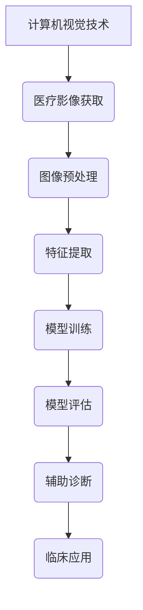

                 

### 文章标题

# 《计算机视觉在医疗辅助诊断中的应用》

### 关键词

- 计算机视觉
- 医疗辅助诊断
- 机器学习
- 深度学习
- 医学图像分析

### 摘要

本文旨在探讨计算机视觉技术在医疗辅助诊断中的应用。首先，我们简要介绍了计算机视觉的基本原理和医疗辅助诊断的背景与挑战。接着，深入分析了计算机视觉的核心技术，包括图像处理、机器学习与深度学习，以及医学图像分析的方法。文章随后详细阐述了计算机视觉在眼科疾病、皮肤疾病和心血管疾病诊断中的应用案例，并探讨了应用策略与发展趋势。最后，通过附录提供了相关资源与流程图示例，旨在为读者提供全面的技术指南。

### 引言

随着人工智能和计算机视觉技术的飞速发展，医疗辅助诊断领域迎来了新的机遇和挑战。计算机视觉作为一种基于图像处理和机器学习的先进技术，在医疗领域的应用逐渐扩展，特别是在辅助疾病诊断方面展现出巨大的潜力。本文将深入探讨计算机视觉在医疗辅助诊断中的应用，从技术原理到实际案例，为读者提供一个全面的技术解读。

### 第一部分：计算机视觉与医疗辅助诊断概述

## 第1章：计算机视觉与医疗辅助诊断简介

### 1.1 计算机视觉的基本原理

计算机视觉是指使计算机能够像人眼一样感知和理解视觉信息的技术。其基本原理包括图像获取、图像处理、特征提取和目标识别等几个步骤。

1. **图像获取**：通过摄像头、扫描仪等设备获取图像数据。
2. **图像处理**：对获取的图像进行预处理，如去噪、增强和分割。
3. **特征提取**：从预处理后的图像中提取关键特征，如边缘、纹理和形状。
4. **目标识别**：利用提取的特征对图像中的目标进行识别和分类。

### 1.2 医疗辅助诊断的背景与挑战

医疗辅助诊断是指利用计算机技术和人工智能方法辅助医生进行疾病诊断的过程。这一领域面临着如下挑战：

1. **数据量大**：医学图像数据量巨大，对处理速度和存储提出了高要求。
2. **诊断复杂**：医学诊断需要处理复杂的图像信息，并且涉及多种疾病和症状。
3. **误诊风险**：计算机视觉技术尚未完全成熟，存在一定的误诊风险。
4. **专业知识需求**：医疗诊断不仅需要技术支持，还需要医生的专业知识。

### 1.3 计算机视觉在医疗辅助诊断中的应用前景

计算机视觉技术在医疗辅助诊断中的应用前景广阔：

1. **提高诊断效率**：通过自动化处理，大幅提高诊断速度。
2. **减少误诊率**：利用深度学习等先进技术，提高诊断准确性。
3. **辅助医生决策**：为医生提供更加全面和客观的辅助信息。
4. **远程医疗**：通过计算机视觉技术，实现远程诊断和监控。

## 第2章：计算机视觉核心技术基础

### 2.1 图像处理基础

图像处理是计算机视觉的基础，主要包括图像获取与预处理、图像增强与滤波、特征提取与特征表示。

1. **图像获取与预处理**：包括图像去噪、去模糊、校正等步骤。
2. **图像增强与滤波**：通过滤波器对图像进行增强，如锐化、对比度调整等。
3. **特征提取与特征表示**：提取图像的边缘、纹理、形状等特征，如SIFT、HOG等算法。

### 2.2 机器学习与深度学习基础

机器学习和深度学习是计算机视觉的核心技术，主要包括监督学习与无监督学习、深度学习框架简介、神经网络与卷积神经网络。

1. **监督学习与无监督学习**：监督学习有标签数据，无监督学习无标签数据。
2. **深度学习框架简介**：如TensorFlow、PyTorch等。
3. **神经网络与卷积神经网络**：神经网络用于特征提取，卷积神经网络在图像处理中表现尤为出色。

### 2.3 计算机视觉在医学图像分析中的应用

计算机视觉在医学图像分析中的应用主要包括医学图像类型、医学图像分割、医学图像分类与识别。

1. **医学图像类型**：如X光片、CT、MRI等。
2. **医学图像分割**：将医学图像分割为感兴趣区域。
3. **医学图像分类与识别**：对医学图像进行分类，如病变识别。

### 第二部分：计算机视觉在常见医疗诊断中的应用

## 第3章：计算机视觉在眼科疾病诊断中的应用

### 3.1 视网膜图像分析

视网膜图像分析是计算机视觉在眼科疾病诊断中的重要应用，主要包括视网膜图像获取与预处理、视网膜病变检测、视网膜病变分类与量化。

1. **视网膜图像获取与预处理**：通过眼底相机获取图像，进行去噪、增强等预处理。
2. **视网膜病变检测**：使用深度学习模型检测视网膜病变，如糖尿病视网膜病变。
3. **视网膜病变分类与量化**：对视网膜病变进行分类和量化，为医生提供辅助信息。

### 3.2 角膜图像分析

角膜图像分析主要用于角膜疾病诊断，包括角膜图像获取与预处理、角膜病变检测与识别、角膜形态学分析。

1. **角膜图像获取与预处理**：通过角膜成像设备获取图像，进行预处理。
2. **角膜病变检测与识别**：使用计算机视觉技术检测角膜病变。
3. **角膜形态学分析**：分析角膜形态学特征，如曲率、厚度等。

## 第4章：计算机视觉在皮肤疾病诊断中的应用

### 4.1 皮肤病变图像识别

皮肤病变图像识别是计算机视觉在皮肤疾病诊断中的应用之一，主要包括皮肤病变图像获取与预处理、皮肤病变检测与分割、皮肤病变分类与诊断。

1. **皮肤病变图像获取与预处理**：通过皮肤成像设备获取图像，进行预处理。
2. **皮肤病变检测与分割**：使用深度学习模型检测皮肤病变，进行分割。
3. **皮肤病变分类与诊断**：对皮肤病变进行分类，辅助医生诊断。

### 4.2 皮肤癌筛查

皮肤癌筛查是计算机视觉在皮肤疾病诊断中的重要应用，主要包括皮肤癌图像识别方法、皮肤癌筛查系统设计、皮肤癌筛查效果评估。

1. **皮肤癌图像识别方法**：使用深度学习模型识别皮肤癌图像。
2. **皮肤癌筛查系统设计**：设计皮肤癌筛查系统，包括图像预处理、模型训练与评估等步骤。
3. **皮肤癌筛查效果评估**：评估皮肤癌筛查系统的准确性和可靠性。

## 第5章：计算机视觉在心血管疾病诊断中的应用

### 5.1 心电图分析

心电图分析是计算机视觉在心血管疾病诊断中的应用之一，主要包括心电图获取与预处理、心律失常检测、心电图特征提取与分类。

1. **心电图获取与预处理**：通过心电图设备获取数据，进行预处理。
2. **心律失常检测**：使用深度学习模型检测心律失常。
3. **心电图特征提取与分类**：提取心电图特征，进行分类。

### 5.2 超声心动图分析

超声心动图分析是计算机视觉在心血管疾病诊断中的另一个重要应用，主要包括超声心动图获取与预处理、心脏形态学分析、心功能评估。

1. **超声心动图获取与预处理**：通过超声心动图设备获取图像，进行预处理。
2. **心脏形态学分析**：分析心脏形态学特征，如心脏各腔室的面积、容积等。
3. **心功能评估**：评估心脏功能，如射血分数、心排出量等。

### 第三部分：计算机视觉在医疗辅助诊断中的应用策略与发展趋势

## 第6章：计算机视觉在医疗辅助诊断中的应用策略

### 6.1 医疗辅助诊断系统设计

医疗辅助诊断系统设计主要包括系统架构与流程、数据采集与管理、医学专业知识融入。

1. **系统架构与流程**：设计系统的整体架构，明确数据处理和分析流程。
2. **数据采集与管理**：确保数据的准确性和完整性，进行数据管理。
3. **医学专业知识融入**：将医学专业知识整合到系统中，提高诊断准确性。

### 6.2 人工智能在医学影像诊断中的伦理与法规

人工智能在医学影像诊断中面临伦理与法规的挑战，主要包括伦理问题、法规挑战、应对策略。

1. **伦理问题**：如隐私保护、算法透明度等。
2. **法规挑战**：如监管政策、数据安全等。
3. **应对策略**：通过技术手段和法规政策解决伦理与法规问题。

## 第7章：计算机视觉在医疗辅助诊断中的应用发展趋势

### 7.1 新技术对医学影像分析的影响

新技术对医学影像分析的影响主要包括融合深度学习与其他技术、医学影像数据共享与开放、跨学科合作与多模态医学影像分析。

1. **融合深度学习与其他技术**：如增强学习、迁移学习等。
2. **医学影像数据共享与开放**：促进数据共享，提高研究效率。
3. **跨学科合作与多模态医学影像分析**：结合不同学科和模态，提高诊断准确性。

### 7.2 未来发展趋势与挑战

未来发展趋势与挑战主要包括高效、准确的诊断系统开发、个性化医疗与精准医疗、医疗辅助诊断系统的普及与推广。

1. **高效、准确的诊断系统开发**：提高系统的准确性和效率。
2. **个性化医疗与精准医疗**：根据患者个体差异，提供个性化治疗方案。
3. **医疗辅助诊断系统的普及与推广**：降低成本，提高可及性。

### 附录

#### 附录 A：计算机视觉与医疗辅助诊断相关资源

附录 A 提供了计算机视觉与医疗辅助诊断相关的学术论文、开源代码与工具库、在线课程与培训资源。

1. **学术论文与会议报告**：收集最新的研究论文和会议报告。
2. **开源代码与工具库**：提供常用的开源代码和工具库。
3. **在线课程与培训资源**：推荐优质的在线课程和培训资源。

#### 附录 B：Mermaid 流程图示例

附录 B 展示了计算机视觉在医疗辅助诊断中的应用流程图，通过 Mermaid 语言描述，方便读者理解和应用。

### 结论

计算机视觉技术在医疗辅助诊断中的应用具有巨大的潜力和前景。通过深入分析核心技术、实际应用案例和应用策略，我们看到了计算机视觉在提高诊断效率、减少误诊率和辅助医生决策方面的优势。未来，随着技术的不断发展和完善，计算机视觉将在医疗领域发挥更加重要的作用，推动个性化医疗和精准医疗的发展。作者：AI天才研究院/AI Genius Institute & 禅与计算机程序设计艺术/Zen And The Art of Computer Programming。

