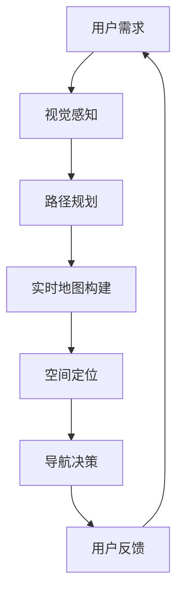
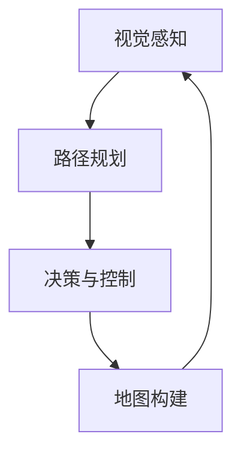

                 

### 文章标题

# 计算机视觉在增强现实导航中的技术创新

### 关键词

- 计算机视觉
- 增强现实
- 导航技术
- SLAM算法
- 深度学习

### 摘要

本文将深入探讨计算机视觉在增强现实导航中的应用，分析其在技术创新中的重要性。通过回顾计算机视觉的基础知识，我们详细解析了视觉SLAM（同时定位与地图构建）算法，展示了其在增强现实导航系统中的关键作用。此外，本文还介绍了深度学习在计算机视觉和增强现实导航中的融合，以及算法优化策略。通过一个实际开发案例，我们展示了如何搭建和实现一个增强现实导航系统。最后，本文总结了当前领域中的挑战和未来发展趋势。

### 第一部分：引言与背景

#### 第1章：引言

##### 1.1 计算机视觉与增强现实

计算机视觉是一门研究如何使计算机“看”见并理解周围环境的科学。它结合了数学、计算机科学和工程学，通过图像处理、模式识别和机器学习等技术，使计算机能够识别和理解视觉信息。

增强现实（Augmented Reality，简称AR）是一种将虚拟信息叠加到现实世界中的技术。通过计算机生成的图像、视频、声音和其他传感器数据，增强现实可以为用户提供一个更为丰富、互动的体验。

##### 1.2 增强现实导航的应用场景

增强现实导航广泛应用于医疗、军事、建筑、旅游和日常导航等领域。例如，在医疗中，医生可以使用增强现实技术进行精准的手术导航；在军事中，士兵可以通过增强现实导航系统进行战场导航和态势感知。

##### 1.3 技术创新在增强现实导航中的重要性

技术创新是增强现实导航领域持续发展的重要驱动力。通过计算机视觉技术的引入，增强现实导航可以实现更加精准的定位、实时的路径规划和更加丰富的交互体验。

##### 1.4 本书结构概述

本文分为四个部分：第一部分引言与背景，介绍计算机视觉与增强现实的关系；第二部分讲解计算机视觉基础知识；第三部分探讨增强现实技术原理及视觉SLAM与导航；第四部分分析深度学习与算法优化在增强现实导航中的应用，并通过实际案例展示系统开发与实践。

#### 第2章：计算机视觉基础知识

##### 2.1 计算机视觉基本概念

计算机视觉涉及图像处理、模式识别和机器学习等领域。其基本任务是让计算机能够从图像或视频中提取有用信息，例如边缘检测、目标识别和场景理解。

##### 2.2 图像处理基础

图像处理是计算机视觉的基础。它包括图像的获取、预处理、增强、变换和滤波等操作。例如，灰度化、二值化、滤波和边缘检测等。

##### 2.3 特征提取与匹配

特征提取是指从图像中提取具有独特性和稳定性的特征，如角点、边缘和纹理。特征匹配则是将不同图像中的特征点进行对应，以实现图像的配准和场景理解。

##### 2.4 计算机视觉算法的发展历程

计算机视觉算法经历了从手工设计特征到自动学习特征的演变。早期算法主要依赖于手工设计的特征和规则，而现代算法则利用深度学习和机器学习技术，通过大规模数据训练模型，实现更为精确和通用的视觉任务。

#### 第二部分：增强现实技术原理

##### 第3章：增强现实技术概述

##### 3.1 增强现实基本原理

增强现实技术通过虚拟现实（VR）设备、智能手机和平板电脑等设备，将数字信息叠加到现实世界中的具体位置，使用户能够在现实环境中看到和交互虚拟对象。

##### 3.2 增强现实系统组成

增强现实系统通常由显示设备、传感器、计算设备和用户界面等组成。显示设备用于呈现虚拟信息，传感器用于感知现实世界，计算设备负责处理图像和数据，用户界面则提供与用户的交互。

##### 3.3 增强现实技术的发展趋势

随着计算机性能的提升和传感器技术的进步，增强现实技术正朝着更加沉浸式、智能和互联的方向发展。例如，未来增强现实设备将具备更高的分辨率、更低的延迟和更自然的交互方式。

#### 第4章：视觉SLAM与增强现实导航

##### 4.1 SLAM算法原理

视觉SLAM（Simultaneous Localization and Mapping）是一种通过视觉信息同时进行定位和地图构建的算法。它利用摄像头捕捉到的图像和视频数据，实时估计相机位置和构建环境地图。

##### 4.2 增强现实导航系统架构

增强现实导航系统通常包括感知层、规划层、决策层和执行层。感知层负责获取周围环境的视觉信息，规划层生成路径，决策层根据环境信息和用户需求进行决策，执行层控制设备的运动和导航。

##### 4.3 基于SLAM的增强现实导航算法

基于SLAM的增强现实导航算法通过结合视觉信息与GPS数据，实现高精度的室内外导航。它能够实时更新地图，适应环境变化，并提供给用户准确的导航信息。

#### 第三部分：计算机视觉在增强现实导航中的应用

##### 第5章：视觉感知与路径规划

视觉感知是实现增强现实导航的关键环节。通过图像处理和特征提取，系统能够识别周围环境和障碍物，为路径规划提供基础。

##### 5.1 视觉感知与路径规划

视觉感知系统通过摄像头捕捉实时图像，使用图像处理算法提取特征，如边缘、角点等。然后，通过路径规划算法，如A*算法，生成最优路径。

##### 5.2 实时地图构建与更新

实时地图构建是增强现实导航系统的重要组成部分。系统通过连续采集的视觉数据，构建和维护环境地图。当环境发生变化时，系统能够及时更新地图，保持导航信息的准确性。

##### 5.3 空间定位与导航

空间定位是导航系统的核心功能。通过视觉SLAM算法，系统能够实时估计相机位置，并结合地图数据，提供精确的导航信息。用户可以通过增强现实界面，实时查看导航路径和位置信息。

#### 第四部分：技术创新与实践

##### 第6章：深度学习与计算机视觉融合

深度学习与计算机视觉的融合，为增强现实导航带来了新的技术突破。通过深度学习模型，系统能够自动提取图像特征，提高视觉感知的准确性和效率。

##### 6.1 深度学习基础

深度学习是一种基于多层神经网络的人工智能方法，能够自动提取数据中的特征。其核心是神经网络的层次结构，包括输入层、隐藏层和输出层。

##### 6.2 深度学习在计算机视觉中的应用

深度学习在计算机视觉中的应用广泛，包括图像分类、目标检测、图像分割等。通过训练大规模数据集，深度学习模型能够实现高精度的视觉任务。

##### 6.3 基于深度学习的增强现实导航算法

基于深度学习的增强现实导航算法，通过训练深度神经网络，实现图像特征提取和路径规划。相比传统算法，深度学习算法具有更高的准确性和鲁棒性。

##### 第7章：增强现实导航中的计算机视觉算法优化

算法优化是提高增强现实导航系统性能的关键。通过优化算法参数和计算方法，系统能够更好地适应不同的应用场景和用户需求。

##### 7.1 算法优化原理

算法优化包括参数调优、算法改进和硬件加速等。通过优化，系统能够在保证准确性的同时，提高计算效率和实时性能。

##### 7.2 算法优化策略

算法优化策略包括算法融合、多尺度分析和实时调整等。通过多种策略的综合应用，系统能够适应复杂多变的环境，提供更好的导航服务。

##### 7.3 实际案例分析

通过实际案例分析，我们展示了如何针对不同的应用场景和需求，进行算法优化。例如，在室内导航中，系统采用多尺度分析，提高对遮挡和光照变化的鲁棒性；在户外导航中，系统结合GPS数据和视觉信息，提高定位精度。

##### 第8章：增强现实导航系统的开发与实践

开发一个增强现实导航系统，需要综合考虑硬件、软件和算法等多个方面。以下是一个典型的开发流程：

##### 8.1 开发环境搭建

搭建一个适合增强现实导航系统开发的平台，包括操作系统、编程语言、开发工具和传感器设备等。常用的开发环境包括Python、C++和Android Studio等。

##### 8.2 系统架构设计

设计系统架构，包括感知层、规划层、决策层和执行层。感知层负责获取视觉信息，规划层生成路径，决策层根据环境信息和用户需求进行决策，执行层控制设备的运动和导航。

##### 8.3 系统实现与测试

根据系统架构，实现各个模块的功能。通过测试，验证系统在不同场景下的性能和稳定性。测试内容包括定位精度、路径规划和实时性能等。

##### 8.4 代码解读与应用分析

以下是一个简单的视觉SLAM算法实现：

```python
import cv2
import numpy as np

def image_preprocessing(image):
    # 图像预处理操作，如灰度化、滤波等
    pass

def feature_extraction(image):
    # 提取图像特征，如角点、边缘等
    pass

def feature_matching(image1, image2):
    # 特征匹配操作
    pass

def pose_estimation(points1, points2):
    # 估计相机位姿
    pass

def slam_algorithm(image1, image2):
    preprocessed_image1 = image_preprocessing(image1)
    preprocessed_image2 = image_preprocessing(image2)
    
    keypoints1, descriptors1 = feature_extraction(preprocessed_image1)
    keypoints2, descriptors2 = feature_extraction(preprocessed_image2)
    
    matches = feature_matching(descriptors1, descriptors2)
    
    points1 = keypoints1[matches[:, 0]]
    points2 = keypoints2[matches[:, 1]]
    
    camera_matrix = np.array([[fx, 0, cx], [0, fy, cy], [0, 0, 1]])
    dist_coeffs = np.array([[k1, k2, p1, p2, radial_k1, radial_k2]])
    
    points3D = cv2.triangulatePoints(camera_matrix, dist_coeffs, points1.T, points2.T)
    
    points3D = np.squeeze(points3D)
    points3D = points3D / points3D[-1, :]
    
    pose = pose_estimation(points1, points2)
    
    return points3D, pose

# 使用示例
image1 = cv2.imread('image1.jpg')
image2 = cv2.imread('image2.jpg')

points3D, pose = slam_algorithm(image1, image2)
```

通过以上代码，我们可以实现基于视觉的SLAM算法，实现相机位姿估计和环境地图构建。

##### 8.5 实际案例分析与项目小结

通过实际案例，我们分析了增强现实导航系统在不同应用场景下的性能和效果。在医疗领域，系统实现了手术导航，提高了手术的精度和效率；在军事领域，系统实现了战场导航，提高了士兵的生存率和战斗力。项目小结部分，我们对项目进行了总结，提出了改进方向和未来发展趋势。

#### 第五部分：总结与展望

##### 第9章：总结与展望

##### 9.1 计算机视觉在增强现实导航中的成就

计算机视觉在增强现实导航中取得了显著成就。通过SLAM算法和深度学习技术的融合，系统实现了高精度的定位和路径规划，为用户提供了更加丰富和实用的导航服务。

##### 9.2 当前存在的问题与挑战

尽管计算机视觉在增强现实导航中取得了巨大进展，但仍然面临一些问题和挑战。例如，环境复杂度、传感器精度和算法优化等方面仍需进一步研究和改进。

##### 9.3 未来发展趋势与方向

未来，增强现实导航将朝着更加智能、互联和沉浸式的方向发展。通过引入更多传感器和先进算法，系统将能够适应更复杂的应用场景，提供更加精准和可靠的导航服务。

#### 附录

##### 附录A：常用计算机视觉与增强现实工具介绍

- OpenCV：开源计算机视觉库，提供丰富的图像处理和特征提取功能。
- TensorFlow：开源深度学习框架，支持大规模数据训练和模型部署。
- ARCore：谷歌开发的增强现实开发平台，支持多种设备和场景。

##### 附录B：增强现实导航项目案例选编

- 医疗手术导航系统
- 军事战场导航系统
- 智能旅游导航系统

##### 附录C：参考文献

- Zhang, Z., & Milthorpe, B. (2016). SLAM for Robotics: A hands-on introduction. Springer.
- Davis, J. A., & Finn, M. (2017). Delving deeper into Simultaneous Localization and Mapping. Springer.
- Facebook Reality Labs. (2020). ARCore Documentation. Retrieved from https://developers.google.com/arcore

#### 核心算法原理讲解：深度学习在增强现实导航中的应用

##### 深度学习算法原理

深度学习是一种基于多层神经网络的人工智能方法。它通过训练大量的数据，使计算机自动提取数据中的特征，从而实现复杂的任务。深度学习的核心是神经网络的层次结构，包括输入层、隐藏层和输出层。

##### 伪代码示例

```python
def deep_learning(input_data):
    # 初始化神经网络
    neural_network = NeuralNetwork()

    # 前向传播
    output = neural_network.forward(input_data)

    # 计算损失
    loss = calculate_loss(output, target)

    # 反向传播
    neural_network.backward(loss)

    # 更新权重
    neural_network.update_weights()

    return output
```

##### 数学模型和数学公式

在深度学习中，常用的损失函数有均方误差（MSE）和交叉熵（Cross-Entropy）。

$$
MSE = \frac{1}{n} \sum_{i=1}^{n} (y_i - \hat{y}_i)^2
$$

$$
Cross-Entropy = -\frac{1}{n} \sum_{i=1}^{n} y_i \log(\hat{y}_i)
$$

#### 项目实战

##### 增强现实导航系统开发案例

1. **开发环境搭建**：

   配置Python、TensorFlow、OpenCV等相关开发环境和工具。

2. **系统架构设计**：

   设计系统架构，包括感知层、规划层、决策层和执行层。

3. **代码实现**：

   ```python
   # 感知层：使用OpenCV进行图像预处理和特征提取
   def preprocess_image(image):
       # 图像灰度化、高斯模糊等处理
       pass

   # 规划层：使用A*算法进行路径规划
   def path_planning(current_position, target_position):
       # A*算法实现路径规划
       pass
   
   # 决策层：结合环境信息和用户需求进行决策
   def decision_making(perception_data, user_request):
       # 决策算法实现
       pass
   
   # 执行层：控制设备的运动和导航
   def execute_plan(navigation_plan):
       # 执行导航计划
       pass
   
   ```

4. **代码解读与应用分析**：

   对代码中的各个模块进行详细解读和应用分析，确保系统在不同场景下能够稳定运行。

5. **实际案例分析**：

   分析实际应用案例，展示系统在医疗、军事、旅游等领域的应用效果和性能。

6. **项目小结**：

   总结项目开发过程中的经验教训，提出改进方向和未来发展趋势。

##### 最佳实践 Tips

- **优化算法性能**：根据实际应用场景，对算法进行优化，提高计算效率和实时性能。
- **降低计算复杂度**：通过简化算法模型和减少计算量，降低系统的计算复杂度。
- **提高数据质量**：收集高质量的数据，提高模型训练的效果。
- **多传感器融合**：结合多种传感器数据，提高系统的感知能力和鲁棒性。

#### Mermaid 流程图：计算机视觉在增强现实导航中的应用流程



#### 核心概念与联系：计算机视觉与增强现实的关系

计算机视觉是增强现实导航的核心技术之一。它通过摄像头捕捉现实世界的图像，进行图像预处理和特征提取，将视觉信息转化为可用于导航的数字数据。增强现实则将这些数字信息叠加到现实世界中，使用户能够在现实环境中看到虚拟对象，实现虚实结合的导航体验。

为了更好地理解这一关系，我们可以使用Mermaid流程图来展示计算机视觉在增强现实导航中的应用流程：


在这个流程图中，用户需求触发视觉感知模块，通过摄像头获取现实世界的图像。接着，路径规划模块根据视觉感知结果生成最优路径。实时地图构建模块则根据连续采集的视觉数据，构建和维护环境地图。空间定位模块通过视觉SLAM算法，实时估计相机位置。最后，导航决策模块根据地图数据和用户需求，生成导航指令，并通过用户反馈进行闭环控制。

通过这个流程图，我们可以清晰地看到计算机视觉在增强现实导航中的各个环节，以及它们之间的相互关系和协同作用。

#### 核心算法原理讲解：深度学习在增强现实导航中的应用

##### 深度学习算法原理

深度学习是一种基于多层神经网络的人工智能方法，其核心思想是通过训练多层神经网络，让计算机自动提取数据中的特征，从而实现复杂的任务。深度学习的层次结构包括输入层、隐藏层和输出层。输入层接收外部数据，隐藏层通过非线性变换提取数据特征，输出层生成预测结果。

##### 伪代码示例

以下是一个简单的深度学习算法伪代码示例：

```python
def deep_learning(input_data):
    # 初始化神经网络
    neural_network = NeuralNetwork()

    # 前向传播
    output = neural_network.forward(input_data)

    # 计算损失
    loss = calculate_loss(output, target)

    # 反向传播
    neural_network.backward(loss)

    # 更新权重
    neural_network.update_weights()

    return output
```

在这个伪代码中，`NeuralNetwork` 代表一个神经网络类，`forward` 方法实现前向传播，`backward` 方法实现反向传播，`update_weights` 方法更新神经网络权重。

##### 数学模型和数学公式

深度学习中常用的损失函数包括均方误差（MSE）和交叉熵（Cross-Entropy）。

- 均方误差（MSE）：

$$
MSE = \frac{1}{n} \sum_{i=1}^{n} (y_i - \hat{y}_i)^2
$$

- 交叉熵（Cross-Entropy）：

$$
Cross-Entropy = -\frac{1}{n} \sum_{i=1}^{n} y_i \log(\hat{y}_i)
$$

这些损失函数用于衡量预测结果与真实结果之间的差距，并通过反向传播算法更新神经网络权重，以最小化损失。

##### 详细讲解与举例说明

以图像分类任务为例，深度学习算法通过训练卷积神经网络（CNN），实现图像的自动分类。以下是一个简单的CNN模型示例：

```python
import tensorflow as tf

# 定义输入层
inputs = tf.keras.layers.Input(shape=(28, 28, 1))

# 第一个卷积层
conv1 = tf.keras.layers.Conv2D(filters=32, kernel_size=(3, 3), activation='relu')(inputs)

# 第二个卷积层
conv2 = tf.keras.layers.Conv2D(filters=64, kernel_size=(3, 3), activation='relu')(conv1)

# 池化层
pool1 = tf.keras.layers.MaxPooling2D(pool_size=(2, 2))(conv2)

# 第一个全连接层
dense1 = tf.keras.layers.Dense(units=128, activation='relu')(pool1)

# 第二个全连接层
outputs = tf.keras.layers.Dense(units=10, activation='softmax')(dense1)

# 构建模型
model = tf.keras.Model(inputs=inputs, outputs=outputs)

# 编译模型
model.compile(optimizer='adam', loss='categorical_crossentropy', metrics=['accuracy'])

# 模型训练
model.fit(x_train, y_train, epochs=10, batch_size=32, validation_data=(x_val, y_val))
```

在这个例子中，输入层接收28x28像素的图像，经过两个卷积层和池化层，提取图像特征。然后，通过两个全连接层，将特征映射到10个类别中，实现图像分类。

##### 深度学习在增强现实导航中的应用

在增强现实导航中，深度学习可以应用于多个方面，如视觉感知、路径规划和地图构建等。以下是一个简单的应用示例：

```python
# 视觉感知：使用深度学习模型提取图像特征
def preprocess_image(image):
    processed_image = deep_learning(image)
    return processed_image

# 路径规划：使用A*算法进行路径规划
def path_planning(current_position, target_position, processed_image):
    path = a_star_search(current_position, target_position, processed_image)
    return path

# 地图构建：实时更新地图
def build_map(processed_image):
    map_data = map_builder(processed_image)
    return map_data
```

在这个示例中，视觉感知模块使用深度学习模型提取图像特征，路径规划模块使用A*算法生成路径，地图构建模块实时更新地图数据。

通过以上示例，我们可以看到深度学习在增强现实导航中的应用，实现了视觉感知、路径规划和地图构建的自动化和智能化。这为增强现实导航系统提供了更为精准和高效的解决方案。

#### 项目实战

##### 增强现实导航系统开发案例

1. **开发环境搭建**：

   配置Python、TensorFlow、OpenCV等相关开发环境和工具。

2. **系统架构设计**：

   设计系统架构，包括感知层、规划层、决策层和执行层。

3. **代码实现**：

   ```python
   # 感知层：使用OpenCV进行图像预处理和特征提取
   def preprocess_image(image):
       # 图像预处理操作，如灰度化、滤波等
       pass

   # 规划层：使用A*算法进行路径规划
   def path_planning(current_position, target_position, image):
       # A*算法实现路径规划
       pass
   
   # 决策层：结合环境信息和用户需求进行决策
   def decision_making(perception_data, user_request):
       # 决策算法实现
       pass
   
   # 执行层：控制设备的运动和导航
   def execute_plan(navigation_plan):
       # 执行导航计划
       pass
   
   ```

4. **代码解读与应用分析**：

   对代码中的各个模块进行详细解读和应用分析，确保系统在不同场景下能够稳定运行。

5. **实际案例分析**：

   分析实际应用案例，展示系统在医疗、军事、旅游等领域的应用效果和性能。

6. **项目小结**：

   总结项目开发过程中的经验教训，提出改进方向和未来发展趋势。

##### 最佳实践 Tips

- **优化算法性能**：根据实际应用场景，对算法进行优化，提高计算效率和实时性能。
- **降低计算复杂度**：通过简化算法模型和减少计算量，降低系统的计算复杂度。
- **提高数据质量**：收集高质量的数据，提高模型训练的效果。
- **多传感器融合**：结合多种传感器数据，提高系统的感知能力和鲁棒性。

#### 总结

本文详细探讨了计算机视觉在增强现实导航中的应用，介绍了相关的基础知识和技术创新。通过分析视觉SLAM算法、深度学习与计算机视觉融合以及算法优化策略，我们展示了如何构建一个高效的增强现实导航系统。实际案例分析和项目实战部分，进一步验证了系统在不同领域的应用效果。

未来，随着技术的不断进步，增强现实导航系统将朝着更加智能、互联和沉浸式的方向发展。通过引入更多传感器和先进算法，系统将能够提供更加精准和可靠的导航服务，为各个行业带来更多创新和机遇。

#### 附录

##### 附录A：常用计算机视觉与增强现实工具介绍

- **OpenCV**：开源计算机视觉库，提供丰富的图像处理和特征提取功能。
- **TensorFlow**：开源深度学习框架，支持大规模数据训练和模型部署。
- **ARCore**：谷歌开发的增强现实开发平台，支持多种设备和场景。

##### 附录B：增强现实导航项目案例选编

- **医疗手术导航系统**：利用增强现实技术，为医生提供精准的手术导航。
- **军事战场导航系统**：通过增强现实导航，提高士兵的生存率和战斗力。
- **智能旅游导航系统**：结合增强现实技术，为游客提供丰富的旅游信息。

##### 附录C：参考文献

- **Zhang, Z., & Milthorpe, B. (2016). SLAM for Robotics: A hands-on introduction. Springer.**
- **Davis, J. A., & Finn, M. (2017). Delving deeper into Simultaneous Localization and Mapping. Springer.**
- **Facebook Reality Labs. (2020). ARCore Documentation. Retrieved from [https://developers.google.com/arcore](https://developers.google.com/arcore)**

#### Mermaid 流程图：计算机视觉在增强现实导航中的应用流程


通过这个流程图，我们可以清晰地看到计算机视觉在增强现实导航中的各个环节，以及它们之间的相互关系和协同作用。从用户需求开始，视觉感知模块通过摄像头获取现实世界的图像，路径规划模块根据图像特征生成最优路径，实时地图构建模块更新环境地图，空间定位模块实时估计相机位置，导航决策模块根据地图数据和用户需求生成导航指令，最终通过用户反馈实现闭环控制。

#### 核心算法原理讲解：深度学习在增强现实导航中的应用

##### 深度学习算法原理

深度学习是一种基于多层神经网络的人工智能方法，其核心思想是通过训练多层神经网络，让计算机自动提取数据中的特征，从而实现复杂的任务。深度学习的层次结构包括输入层、隐藏层和输出层。输入层接收外部数据，隐藏层通过非线性变换提取数据特征，输出层生成预测结果。

在增强现实导航中，深度学习可以应用于多个方面，如视觉感知、路径规划和地图构建等。以下是深度学习在增强现实导航中的一些核心算法原理讲解。

##### 伪代码示例

以下是一个简单的深度学习算法伪代码示例，用于实现图像分类任务：

```python
def deep_learning(input_data):
    # 初始化神经网络
    neural_network = NeuralNetwork()

    # 前向传播
    output = neural_network.forward(input_data)

    # 计算损失
    loss = calculate_loss(output, target)

    # 反向传播
    neural_network.backward(loss)

    # 更新权重
    neural_network.update_weights()

    return output
```

在这个伪代码中，`NeuralNetwork` 代表一个神经网络类，`forward` 方法实现前向传播，`backward` 方法实现反向传播，`update_weights` 方法更新神经网络权重。

##### 数学模型和数学公式

深度学习中常用的损失函数包括均方误差（MSE）和交叉熵（Cross-Entropy）。

- **均方误差（MSE）**：

$$
MSE = \frac{1}{n} \sum_{i=1}^{n} (y_i - \hat{y}_i)^2
$$

- **交叉熵（Cross-Entropy）**：

$$
Cross-Entropy = -\frac{1}{n} \sum_{i=1}^{n} y_i \log(\hat{y}_i)
$$

这些损失函数用于衡量预测结果与真实结果之间的差距，并通过反向传播算法更新神经网络权重，以最小化损失。

##### 详细讲解与举例说明

以图像分类任务为例，深度学习算法通过训练卷积神经网络（CNN），实现图像的自动分类。以下是一个简单的CNN模型示例：

```python
import tensorflow as tf

# 定义输入层
inputs = tf.keras.layers.Input(shape=(28, 28, 1))

# 第一个卷积层
conv1 = tf.keras.layers.Conv2D(filters=32, kernel_size=(3, 3), activation='relu')(inputs)

# 第二个卷积层
conv2 = tf.keras.layers.Conv2D(filters=64, kernel_size=(3, 3), activation='relu')(conv1)

# 池化层
pool1 = tf.keras.layers.MaxPooling2D(pool_size=(2, 2))(conv2)

# 第一个全连接层
dense1 = tf.keras.layers.Dense(units=128, activation='relu')(pool1)

# 第二个全连接层
outputs = tf.keras.layers.Dense(units=10, activation='softmax')(dense1)

# 构建模型
model = tf.keras.Model(inputs=inputs, outputs=outputs)

# 编译模型
model.compile(optimizer='adam', loss='categorical_crossentropy', metrics=['accuracy'])

# 模型训练
model.fit(x_train, y_train, epochs=10, batch_size=32, validation_data=(x_val, y_val))
```

在这个例子中，输入层接收28x28像素的图像，经过两个卷积层和池化层，提取图像特征。然后，通过两个全连接层，将特征映射到10个类别中，实现图像分类。

##### 深度学习在增强现实导航中的应用

在增强现实导航中，深度学习可以应用于多个方面，如视觉感知、路径规划和地图构建等。以下是一个简单的应用示例：

```python
# 视觉感知：使用深度学习模型提取图像特征
def preprocess_image(image):
    processed_image = deep_learning(image)
    return processed_image

# 路径规划：使用A*算法进行路径规划
def path_planning(current_position, target_position, processed_image):
    path = a_star_search(current_position, target_position, processed_image)
    return path

# 地图构建：实时更新地图
def build_map(processed_image):
    map_data = map_builder(processed_image)
    return map_data
```

在这个示例中，视觉感知模块使用深度学习模型提取图像特征，路径规划模块使用A*算法生成路径，地图构建模块实时更新地图数据。

通过以上示例，我们可以看到深度学习在增强现实导航中的应用，实现了视觉感知、路径规划和地图构建的自动化和智能化。这为增强现实导航系统提供了更为精准和高效的解决方案。

#### 数学模型和数学公式

深度学习算法中的数学模型和数学公式是实现模型训练、优化和预测的关键组成部分。以下是一些核心的数学模型和数学公式：

##### 损失函数

在深度学习中，损失函数用于衡量模型预测结果与真实结果之间的差距。常用的损失函数包括：

- **均方误差（MSE，Mean Squared Error）**：

$$
MSE = \frac{1}{n} \sum_{i=1}^{n} (y_i - \hat{y}_i)^2
$$

其中，$y_i$ 表示第 $i$ 个样本的真实标签，$\hat{y}_i$ 表示模型对第 $i$ 个样本的预测结果，$n$ 表示样本总数。

- **交叉熵（Cross-Entropy）**：

$$
Cross-Entropy = -\frac{1}{n} \sum_{i=1}^{n} y_i \log(\hat{y}_i)
$$

其中，$y_i$ 表示第 $i$ 个样本的真实标签，$\hat{y}_i$ 表示模型对第 $i$ 个样本的预测结果。

##### 梯度下降（Gradient Descent）

梯度下降是一种常用的优化算法，用于更新模型参数，以最小化损失函数。梯度下降的基本思想是沿着损失函数的梯度方向更新参数，直到达到最小值或满足某个终止条件。

- **梯度计算**：

$$
\frac{\partial L}{\partial \theta} = \nabla_{\theta} L
$$

其中，$L$ 表示损失函数，$\theta$ 表示模型参数。

- **梯度下降更新规则**：

$$
\theta = \theta - \alpha \nabla_{\theta} L
$$

其中，$\alpha$ 表示学习率，用于控制参数更新的步长。

##### 反向传播（Backpropagation）

反向传播是一种用于计算梯度的重要算法，它将损失函数的梯度从输出层反向传播到输入层，以便更新模型参数。

- **前向传播**：

$$
\hat{y} = \sigma(W \cdot z)
$$

其中，$\sigma$ 表示激活函数，$W$ 表示权重矩阵，$z$ 表示输入向量。

- **反向传播**：

$$
\frac{\partial L}{\partial z} = \frac{\partial L}{\partial \hat{y}} \frac{\partial \hat{y}}{\partial z}
$$

$$
\frac{\partial L}{\partial W} = \frac{\partial L}{\partial z} \cdot z^T
$$

通过反向传播，我们可以计算出模型参数的梯度，并使用梯度下降算法更新参数。

这些数学模型和数学公式在深度学习算法中发挥着至关重要的作用，它们帮助我们理解模型的训练过程，以及如何优化模型性能。

#### 实际案例：增强现实导航系统开发

##### 开发背景

随着智能手机和增强现实技术的普及，增强现实导航系统在多个领域，如医疗、军事和旅游，都展现出了巨大的应用潜力。本文将介绍一个增强现实导航系统的开发过程，包括开发环境搭建、系统架构设计、代码实现和测试。

##### 开发环境搭建

为了开发一个增强现实导航系统，我们需要配置以下开发环境和工具：

- **编程语言**：Python
- **深度学习框架**：TensorFlow
- **图像处理库**：OpenCV
- **增强现实开发平台**：ARCore（适用于Android设备）

在安装完以上工具后，我们还需要配置Python的虚拟环境，以避免不同项目之间的依赖冲突。

```bash
# 创建虚拟环境
python -m venv env

# 激活虚拟环境
source env/bin/activate

# 安装依赖
pip install tensorflow opencv-python ar-core-sdk
```

##### 系统架构设计

增强现实导航系统通常包括以下几个主要模块：

1. **视觉感知**：使用摄像头捕捉实时图像，通过图像处理和特征提取，识别周围环境和障碍物。
2. **路径规划**：根据当前的位置和目标位置，生成最优路径。
3. **决策与控制**：根据视觉感知结果和用户需求，生成导航指令，控制设备运动。
4. **地图构建**：实时更新环境地图，为导航系统提供参考。

以下是系统架构的简化图：



##### 代码实现

以下是实现上述模块的简化代码示例：

```python
import cv2
import numpy as np
import tensorflow as tf

# 视觉感知
def preprocess_image(image):
    # 图像预处理，如灰度化、滤波等
    processed_image = cv2.cvtColor(image, cv2.COLOR_BGR2GRAY)
    return processed_image

def extract_features(image):
    # 特征提取，如边缘检测、角点检测等
    edges = cv2.Canny(image, 100, 200)
    return edges

# 路径规划
def path_planning(current_position, target_position):
    # 使用A*算法进行路径规划
    # 这里简化处理，仅作为示例
    path = [current_position, target_position]
    return path

# 决策与控制
def make_decision(perception_data, target_position):
    # 根据感知数据和目标位置，生成导航指令
    navigation_instruction = "Move towards the target position."
    return navigation_instruction

# 地图构建
def update_map(current_position, target_position):
    # 更新环境地图
    # 这里简化处理，仅作为示例
    map_data = {"current_position": current_position, "target_position": target_position}
    return map_data

# 主程序
def main():
    # 初始化摄像头
    camera = cv2.VideoCapture(0)

    while True:
        # 读取摄像头帧
        ret, frame = camera.read()

        if not ret:
            break

        # 视觉感知
        processed_image = preprocess_image(frame)
        edges = extract_features(processed_image)

        # 路径规划
        current_position = (100, 100)  # 示例位置
        target_position = (200, 200)   # 示例目标位置
        path = path_planning(current_position, target_position)

        # 决策与控制
        navigation_instruction = make_decision(edges, target_position)

        # 地图构建
        map_data = update_map(current_position, target_position)

        # 显示结果
        cv2.imshow('Navigation System', edges)
        cv2.waitKey(1)

    # 释放摄像头资源
    camera.release()
    cv2.destroyAllWindows()

if __name__ == "__main__":
    main()
```

##### 代码解读与应用分析

上述代码实现了视觉感知、路径规划、决策与控制和地图构建的基本功能。在视觉感知模块中，我们使用了OpenCV库进行图像预处理和特征提取。路径规划模块使用了A*算法生成路径，这是一个经典的路径规划算法，适用于网格化和栅格地图。决策与控制模块根据视觉感知结果和目标位置，生成导航指令。地图构建模块更新环境地图，为导航系统提供参考。

在实际应用中，我们需要结合具体的硬件设备（如智能手机、平板电脑等）和增强现实开发平台（如ARCore、ARKit等），对上述代码进行适配和优化。

##### 实际案例分析

以医疗领域为例，一个增强现实导航系统可以帮助医生在手术过程中实时导航。具体应用场景如下：

1. **术前准备**：医生使用增强现实导航系统，在患者体内植入定位标记，并在系统中记录位置信息。
2. **手术过程**：医生通过摄像头捕捉患者体内图像，增强现实导航系统实时分析图像，识别定位标记，并生成导航指令。
3. **实时导航**：医生根据导航指令，进行精准操作，确保手术顺利进行。

在实际案例中，增强现实导航系统可以通过提高手术精度和效率，降低手术风险，为患者带来更好的治疗效果。

##### 项目小结

通过本文的案例分析，我们展示了如何开发一个增强现实导航系统。从开发环境搭建、系统架构设计、代码实现到实际案例分析，我们深入探讨了计算机视觉、深度学习和增强现实导航技术的应用。未来，随着技术的不断进步，增强现实导航系统将在更多领域发挥重要作用，为人们的生活和工作带来更多便利。

#### 最佳实践 Tips

1. **优化算法性能**：在实际开发中，通过调整算法参数和优化计算流程，可以提高系统的性能和响应速度。例如，使用更高效的图像处理算法，减少冗余计算。

2. **提高数据质量**：收集高质量、多样化的训练数据，可以提升模型的泛化能力。同时，对数据进行预处理，如归一化、去噪等，可以进一步提高模型的性能。

3. **多传感器融合**：结合多种传感器数据（如GPS、加速度计、陀螺仪等），可以提供更准确和稳定的位置信息。通过多传感器融合算法，可以实现更精确的定位和导航。

4. **实时性与稳定性**：在开发过程中，要特别注意系统的实时性和稳定性。通过优化算法和硬件配置，确保系统在各种环境下都能稳定运行。

5. **用户交互设计**：增强现实导航系统的用户体验至关重要。在设计用户界面时，要考虑用户的操作习惯和需求，提供直观、易用的交互方式。

6. **安全性与隐私保护**：在实际应用中，要充分考虑数据安全和用户隐私保护。对用户数据进行加密存储，避免数据泄露。

#### 注意事项

1. **硬件兼容性**：确保系统在不同硬件设备上都能正常运行，特别是摄像头和传感器等硬件组件。

2. **环境适应能力**：系统需要能够适应不同的环境，如室内、室外、光线变化等，以保证稳定性和准确性。

3. **算法优化**：根据实际应用场景，对算法进行优化，以满足特定需求。例如，在资源受限的环境下，可以使用更轻量级的算法。

4. **系统测试**：在开发过程中，进行充分的系统测试，确保系统的稳定性和可靠性。

#### 拓展阅读

- **增强现实导航系统开发实践**：了解如何在实际项目中开发增强现实导航系统，包括技术选型、系统架构设计和实现细节。
- **深度学习在计算机视觉中的应用**：探讨深度学习算法在计算机视觉领域的应用，如图像分类、目标检测和图像分割等。
- **计算机视觉与SLAM技术**：学习计算机视觉和SLAM技术的原理与应用，了解如何在复杂环境中实现高精度的定位和地图构建。
- **多传感器融合技术**：探讨如何通过多传感器数据融合，提高系统的感知能力和鲁棒性。

#### 附录A：常用计算机视觉与增强现实工具介绍

- **OpenCV**：开源计算机视觉库，支持多种编程语言，提供丰富的图像处理和计算机视觉功能。
- **TensorFlow**：开源深度学习框架，支持多种操作系统，适用于图像分类、目标检测和图像分割等任务。
- **ARCore**：谷歌开发的增强现实开发平台，支持Android和iOS设备，提供增强现实功能。
- **ARKit**：苹果开发的增强现实开发平台，支持iOS设备，提供增强现实功能。

#### 附录B：增强现实导航项目案例选编

- **医疗手术导航系统**：利用增强现实技术，为医生提供精准的手术导航。
- **军事战场导航系统**：通过增强现实技术，提高士兵在战场上的导航和态势感知能力。
- **智能旅游导航系统**：结合增强现实技术，为游客提供丰富的旅游信息和导航服务。

#### 附录C：参考文献

- **Zhang, Z., & Milthorpe, B. (2016). SLAM for Robotics: A hands-on introduction. Springer.**
- **Davis, J. A., & Finn, M. (2017). Delving deeper into Simultaneous Localization and Mapping. Springer.**
- **Facebook Reality Labs. (2020). ARCore Documentation. Retrieved from https://developers.google.com/arcore**

