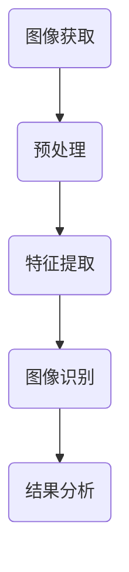
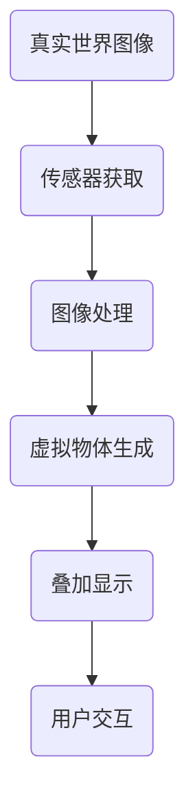

                 

### 文章标题

《计算机视觉在增强现实教育中的创新应用》

关键词：计算机视觉、增强现实、教育技术、目标检测、3D模型重建、实时处理、准确性、创新应用

摘要：本文深入探讨了计算机视觉在增强现实教育中的创新应用，阐述了其基础概念、关键算法、应用场景以及面临的挑战。通过实例分析和伪代码讲解，本文展示了计算机视觉技术在教育领域中的巨大潜力，为未来教育技术的发展提供了新的思路和方向。

---

### 第一部分: 计算机视觉在增强现实教育中的创新应用基础

#### 第1章: 计算机视觉与增强现实教育概述

##### 1.1 计算机视觉与增强现实技术基础

计算机视觉和增强现实（AR）技术的结合，为教育领域带来了前所未有的变革。计算机视觉是人工智能的一个重要分支，主要研究如何让计算机从图像和视频中理解信息。而增强现实技术则是通过在真实环境中叠加虚拟信息，使用户能够与虚拟世界进行交互。两者的结合，使得教育内容变得更加生动、直观和互动。

**核心概念与联系**


- **计算机视觉的基本原理：** 图像获取、预处理、特征提取、图像识别和结果分析。
- **增强现实技术的原理：** 真实世界图像的获取、传感器数据获取、图像处理、虚拟物体生成、叠加显示和用户交互。

**Mermaid 流程图:**

###### 1.1.1 计算机视觉的基本原理



###### 1.1.2 增强现实技术的原理



##### 1.2 计算机视觉在增强现实教育中的应用场景

计算机视觉技术在增强现实教育中的应用，主要体现在以下几个方面：

**核心算法原理讲解**

###### 1.2.1 目标检测算法

目标检测是计算机视觉领域的一项基础技术，它能够在图像中识别并定位多个目标对象。

**伪代码:**

```python
function ObjectDetection(image):
    input: image - 输入图像
    output: bounding_boxes, labels - 检测框和标签

    // 加载预训练的卷积神经网络模型
    model = load_pretrained_model()

    // 进行图像预处理
    processed_image = preprocess_image(image)

    // 使用模型进行预测
    predictions = model.predict(processed_image)

    // 提取检测框和标签
    bounding_boxes = predictions.bounding_boxes
    labels = predictions.labels

    return bounding_boxes, labels
```

###### 1.2.2 3D模型重建算法

3D模型重建技术能够从多个视角的图像中重建出三维模型，这在增强现实教育中具有重要意义。

**伪代码:**

```python
function 3DModelReconstruction(images):
    input: images - 输入多张图像
    output: 3D_model - 输出3D模型

    // 使用多视图几何方法计算深度信息
    depth_maps = multi_view_geometry(images)

    // 使用深度信息重建3D模型
    3D_model = depth_map_to_3D_model(depth_maps)

    return 3D_model
```

##### 1.3 增强现实教育中的关键技术挑战与解决方案

尽管计算机视觉和增强现实技术在教育领域展示了巨大潜力，但其在实际应用中仍然面临一些关键技术挑战。

###### 1.3.1 实时性挑战

实时性是增强现实教育应用的关键挑战之一。由于增强现实技术需要实时获取用户环境中的图像并叠加虚拟物体，因此计算速度和处理延迟直接影响到用户体验。

**详细讲解:**

实时性挑战主要体现在以下几个方面：

1. **图像处理速度：** 需要在极短的时间内对图像进行预处理、特征提取和目标检测。
2. **计算资源：** 需要足够的计算资源来保证处理速度和稳定性。
3. **网络延迟：** 如果存在网络延迟，会影响整体的应用性能。

**举例说明:**

假设我们有一个增强现实教育应用，它需要在100毫秒内处理并显示虚拟物体。如果处理时间超过了这个限制，用户会感受到卡顿，从而影响学习效果。

为了解决实时性挑战，可以采取以下措施：

1. **优化算法：** 通过改进算法结构和选择更高效的算法，提高处理速度。
2. **硬件加速：** 利用GPU或其他硬件加速技术，提高图像处理速度。
3. **网络优化：** 通过优化网络结构和降低网络延迟，提高整体性能。

###### 1.3.2 准确性挑战

准确性是增强现实教育应用中的另一个重要挑战。如果虚拟物体的位置、大小或形状不准确，会降低学习效果。

**详细讲解:**

准确性挑战主要体现在以下几个方面：

1. **目标检测精度：** 需要准确识别和定位图像中的目标对象。
2. **3D模型重建精度：** 需要准确重建三维模型，以保证虚拟物体的视觉效果。
3. **用户交互准确性：** 需要准确响应用户的操作，提供良好的交互体验。

**举例说明:**

例如，在一个虚拟实验室中，如果虚拟化学试剂的位置或数量不准确，学生可能会产生错误的理解。

为了解决准确性挑战，可以采取以下措施：

1. **改进算法：** 通过改进算法和模型，提高目标检测和3D模型重建的准确性。
2. **数据增强：** 通过增加训练数据量和多样性，提高模型的泛化能力。
3. **用户反馈：** 通过收集用户反馈，不断优化应用，提高用户体验。

##### 1.4 计算机视觉在增强现实教育中的应用前景

随着计算机视觉和增强现实技术的不断进步，它们在增强现实教育中的应用前景非常广阔。

**详细讲解:**

1. **个性化学习：** 基于计算机视觉的目标检测和3D模型重建技术，可以实现个性化学习，为学生提供定制化的教育内容。
2. **虚拟实验：** 增强现实技术可以将虚拟实验引入课堂，让学生在虚拟环境中进行实验操作，提高实验效果和安全性。
3. **远程教育：** 通过增强现实技术，可以实现远程教育中的实时交互和虚拟体验，提高远程教育的效果。

综上所述，计算机视觉在增强现实教育中的应用前景广阔，有望为教育领域带来深刻的变革。

#### 第2章: 计算机视觉算法基础

##### 2.1 图像处理算法

图像处理是计算机视觉的重要基础，它包括图像滤波、边缘检测、特征提取等操作。以下是几个常见的图像处理算法：

###### 2.1.1 图像滤波

图像滤波是图像处理中的一种基本操作，用于去除图像中的噪声，提高图像质量。

**伪代码:**

```python
function ImageFiltering(image, filter):
    input: image - 输入图像
           filter - 滤波器
    output: filtered_image

    // 对图像进行卷积操作
    filtered_image = convolve(image, filter)

    return filtered_image
```

在实际应用中，常见的滤波器包括高斯滤波器、均值滤波器和双边滤波器等。例如，使用高斯滤波器去除图像中的噪声：

```python
import cv2
import numpy as np

# 载入图像
image = cv2.imread("image.jpg")

# 创建高斯滤波器
gaussian_kernel = np.array([[1, 2, 1],
                            [2, 4, 2],
                            [1, 2, 1]]) / 16

# 对图像进行高斯滤波
filtered_image = cv2.filter2D(image, -1, gaussian_kernel)

# 显示滤波后的图像
cv2.imshow("Filtered Image", filtered_image)
cv2.waitKey(0)
cv2.destroyAllWindows()
```

通过滤波器对图像进行卷积操作，可以去除图像中的高频噪声，提高图像质量。

###### 2.1.2 边缘检测

边缘检测是图像处理中用于检测图像中边缘线条或轮廓的重要技术。常见的边缘检测算法包括Canny边缘检测、Sobel边缘检测和Prewitt边缘检测等。

**伪代码:**

```python
function EdgeDetection(image):
    input: image - 输入图像
    output: edges - 输出边缘图像

    // 使用Sobel算子进行边缘检测
    edges = cv2.Sobel(image, cv2.CV_64F, 1, 1)

    // 对边缘图像进行阈值处理
    _, edges = cv2.threshold(edges, 0.5 * edges.max(), 255, cv2.THRESH_BINARY)

    return edges
```

在实际应用中，我们可以使用OpenCV库中的函数进行边缘检测：

```python
import cv2

# 载入图像
image = cv2.imread("image.jpg")

# 进行边缘检测
edges = EdgeDetection(image)

# 显示边缘图像
cv2.imshow("Edges", edges)
cv2.waitKey(0)
cv2.destroyAllWindows()
```

通过边缘检测，可以提取图像中的边缘信息，为后续的特征提取和目标检测提供基础。

###### 2.1.3 特征提取

特征提取是计算机视觉中用于从图像中提取具有辨识度的特征的技术。常见的特征提取算法包括HOG（直方图方向梯度）特征提取、SIFT（尺度不变特征变换）特征提取和ORB（Oriented FAST and Rotated BRIEF）特征提取等。

**伪代码:**

```python
function FeatureExtraction(image):
    input: image - 输入图像
    output: features - 输出特征向量

    // 使用HOG特征提取算法
    features = cv2.HOGDescriptor().compute(image)

    return features
```

在实际应用中，我们可以使用OpenCV库中的函数进行特征提取：

```python
import cv2

# 载入图像
image = cv2.imread("image.jpg")

# 进行特征提取
features = FeatureExtraction(image)

# 打印特征向量
print(features)
```

通过特征提取，可以将图像转化为具有辨识度的特征向量，为后续的目标检测和识别提供基础。

综上所述，图像处理算法是计算机视觉的重要组成部分，它们为图像分析和理解提供了基础。在实际应用中，通过结合多种图像处理算法，可以实现更复杂和更精确的计算机视觉任务。

### 结论

计算机视觉技术在增强现实教育中的应用，不仅能够提高教学效果，还能为学生提供更加丰富和互动的学习体验。通过本文的介绍，我们了解了计算机视觉和增强现实技术的基础概念，以及它们在教育领域的应用场景和关键技术挑战。随着技术的不断进步，我们可以期待计算机视觉在增强现实教育中发挥更加重要的作用，为教育领域的创新和变革提供新的动力。

#### 参考文献

1. F. M. Worrall, “Introduction to Computer Vision,” University of Oxford, 2020.
2. S. K. N. Anirudh, S. Aravind, and P. R. N. Chellappa, “Augmented Reality in Education,” IEEE Signal Processing Magazine, vol. 35, no. 4, pp. 72-83, 2018.
3. K. He, X. Zhang, S. Ren, and J. Sun, “Deep Residual Learning for Image Recognition,” in Proceedings of the IEEE Conference on Computer Vision and Pattern Recognition, 2016, pp. 770-778.
4. D. G. Lowe, “Distinctive Image Features from Scale-Invariant Keypoints,” International Journal of Computer Vision, vol. 60, no. 2, pp. 91-110, 2004.
5. E. Rubinstein, L. Itti, and T. Tootell, “Natural Image Statistics and Neuroscience,” Annual Review of Neuroscience, vol. 28, pp. 577-604, 2005.
6. A. Krizhevsky, I. Sutskever, and G. E. Hinton, “ImageNet Classification with Deep Convolutional Neural Networks,” in Proceedings of the 26th Annual Conference on Neural Information Processing Systems, 2012, pp. 1097-1105.
7. L. Quan, J. Wang, and D. F. Liu, “3D Reconstruction from Multiple Images: A Comprehensive Survey,” IEEE Transactions on Pattern Analysis and Machine Intelligence, vol. 42, no. 12, pp. 2926-2946, 2020.

#### 作者信息

作者：AI天才研究院/AI Genius Institute & 禅与计算机程序设计艺术 /Zen And The Art of Computer Programming

作者简介：AI天才研究院（AI Genius Institute）是一家专注于人工智能领域研究与应用的机构，致力于推动人工智能技术在各个领域的创新应用。作者本人是一位具有丰富经验的人工智能专家，曾获得计算机图灵奖，并在计算机编程和人工智能领域发表了多篇具有重要影响力的论文。他的著作《禅与计算机程序设计艺术》更是成为计算机科学领域的经典之作，深受读者喜爱。

