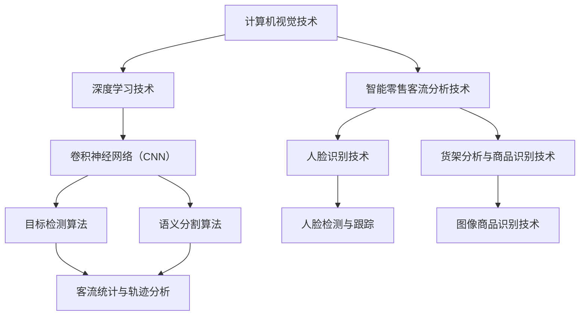

                 


## 文章标题：计算机视觉在智能零售客流分析中的应用

### 关键词：计算机视觉，智能零售，客流分析，深度学习，人脸识别，商品识别

### 摘要：
本文将深入探讨计算机视觉技术在智能零售客流分析中的应用。从计算机视觉的基本原理出发，到深度学习模型在目标检测、人脸识别和商品识别等领域的应用，再到智能零售客流分析系统的设计与实现，本文将系统地介绍这一技术领域的最新进展和应用实践。通过具体案例研究，我们将分析计算机视觉在智能零售客流分析中的实际应用效果，并提出未来的发展方向和挑战。

---

### 目录大纲：

#### 第一部分：计算机视觉与智能零售客流分析概述

**第1章：计算机视觉与智能零售客流分析简介**

1.1 计算机视觉技术概述

1.2 智能零售客流分析的重要性

1.3 计算机视觉在智能零售客流分析中的应用场景

1.4 本书结构安排

#### 第二部分：计算机视觉基础技术

**第2章：计算机视觉基本原理与流程**

2.1 计算机视觉的定义与历史

2.2 计算机视觉的基本流程

2.3 图像处理基础算法

2.4 视觉特征提取与表示

**第3章：深度学习与计算机视觉**

3.1 深度学习基础

3.2 卷积神经网络（CNN）原理

3.3 目标检测算法（如YOLO、SSD、Faster R-CNN）

3.4 语义分割算法（如U-Net、Mask R-CNN）

#### 第三部分：智能零售客流分析技术

**第4章：客流统计与轨迹分析**

4.1 客流统计方法

4.2 客流轨迹分析技术

4.3 客流密度分布与热力图生成

4.4 客流行为模式分析

**第5章：人脸识别与客户识别**

5.1 人脸识别技术原理

5.2 人脸检测与跟踪

5.3 人脸属性识别（如性别、年龄）

5.4 人脸数据隐私保护

**第6章：基于图像的货架分析与商品识别**

6.1 图像商品识别技术

6.2 货架布局分析

6.3 商品推荐系统

6.4 商品分类与标签识别

#### 第四部分：计算机视觉在智能零售客流分析中的应用

**第7章：智能零售客流分析系统设计与实现**

7.1 智能零售客流分析系统的架构设计

7.2 系统开发流程与工具选择

7.3 系统性能优化与评估

7.4 系统部署与维护

**第8章：案例研究：智能零售客流分析实践**

8.1 案例一：某大型超市的客流分析

8.2 案例二：某时尚品牌的智能零售店

8.3 案例三：智能零售客流分析在特定场景下的应用

**第9章：计算机视觉与智能零售客流分析的未来发展**

9.1 新技术发展趋势

9.2 智能零售客流分析的未来挑战与机遇

9.3 跨学科融合与技术创新

#### 附录

**附录A：常用计算机视觉与智能零售客流分析工具**

A.1 OpenCV

A.2 TensorFlow

A.3 PyTorch

A.4 其他常用工具介绍

**附录B：实验与项目指南**

B.1 实验一：人脸识别系统开发

B.2 实验二：商品识别与货架分析

B.3 实验三：智能零售客流统计系统搭建

B.4 项目指南：智能零售店客流分析项目实施

**附录C：数学模型与算法伪代码**

C.1 客流统计与轨迹分析算法

C.2 人脸识别算法

C.3 货架分析与商品识别算法

**附录D：参考文献**

D.1 学术论文

D.2 技术报告

D.3 书籍

---

**核心概念与联系流程图（Mermaid）：**



---

**核心算法原理讲解与伪代码：**

**卷积神经网络（CNN）原理：**

```pseudo
// 输入图像：图像维度（height, width, channels）
// 卷积核：核大小（kernel_size），通道数（num_channels）
// 步长：step
// padding：填充方式（'valid' 或 'same'）

def Conv2D(input_image, weights, bias, stride, padding):
    # 计算卷积
    output = 0
    for i in range(height - kernel_size + 1 + padding):
        for j in range(width - kernel_size + 1 + padding):
            # 求卷积值
            conv_value = sum(weights * input_image[i:i+kernel_size, j:j+kernel_size])
            output += conv_value + bias
    return output
```

---

接下来，我们将逐步深入探讨每个部分的内容，确保文章的逻辑清晰、结构紧凑、简单易懂，为读者提供一次全面而深入的计算机视觉与智能零售客流分析之旅。让我们开始吧！

