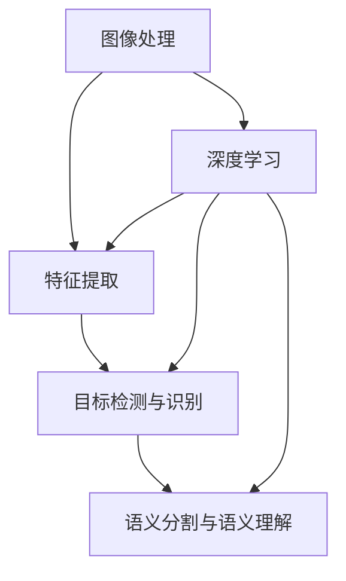

                 

# 《计算机视觉在自动驾驶场景理解中的实时性提升》

## 关键词
- 计算机视觉
- 自动驾驶
- 实时性
- 算法优化
- 硬件加速
- 软硬件协同

## 摘要
本文深入探讨了计算机视觉在自动驾驶场景理解中的实时性提升问题。首先，我们介绍了计算机视觉和自动驾驶的基本概念及其在实时性上的重要性。随后，我们详细阐述了计算机视觉的核心概念与架构，包括图像处理基础、特征提取技术、目标检测与识别以及语义分割与语义理解。接着，我们分析了计算机视觉在自动驾驶中的应用，如环境感知与场景理解、路线规划与跟踪、交通标志与信号识别以及行人检测与避让。文章还重点介绍了实时性提升的关键技术，包括硬件加速、算法优化策略和软硬件协同设计。最后，我们通过实时性评估与优化、挑战与未来趋势以及应用案例，展示了计算机视觉在自动驾驶场景理解中的实时性提升路径。

## 目录

### 第一部分：引言与背景

### 第1章 计算机视觉与自动驾驶概述

#### 1.1 计算机视觉的基础

#### 1.2 自动驾驶技术简介

#### 1.3 实时性在自动驾驶场景理解中的重要性

### 第2章 计算机视觉的核心概念与架构

#### 2.1 图像处理基础

#### 2.2 特征提取技术

#### 2.3 目标检测与识别

#### 2.4 语义分割与语义理解

### 第3章 计算机视觉在自动驾驶中的应用

#### 3.1 环境感知与场景理解

#### 3.2 路线规划与跟踪

#### 3.3 交通标志与信号识别

#### 3.4 行人检测与避让

### 第4章 实时性提升的关键技术

#### 4.1 硬件加速技术

#### 4.2 算法优化策略

#### 4.3 软硬件协同设计

### 第5章 计算机视觉实时性评估与优化

#### 5.1 实时性评估指标

#### 5.2 常见优化方法

#### 5.3 实时性优化案例分析

### 第6章 自动驾驶场景理解的挑战与未来趋势

#### 6.1 实时性提升的技术挑战

#### 6.2 自动驾驶的发展趋势

#### 6.3 未来研究方向与展望

### 第7章 实时性提升在自动驾驶领域的应用案例

#### 7.1 现实应用场景

#### 7.2 成功案例分析

#### 7.3 未来应用前景

### 第二部分：核心算法原理讲解

### 第8章 深度学习在计算机视觉中的应用

#### 8.1 卷积神经网络（CNN）

#### 8.2 卷积神经网络的工作原理

#### 8.3 CNN在自动驾驶中的应用

### 第9章 目标检测算法原理

#### 9.1 R-CNN系列算法

#### 9.2 Fast R-CNN与Faster R-CNN

#### 9.3 YOLO系列算法

#### 9.4 SSD系列算法

#### 9.5 CenterNet算法

### 第10章 语义分割算法原理

#### 10.1 U-Net算法

#### 10.2 DeepLab系列算法

#### 10.3 PSPNet算法

#### 10.4 CRF结合的分割算法

### 第11章 实时性提升的算法优化

#### 11.1 算法并行化

#### 11.2 算法剪枝

#### 11.3 模型压缩

#### 11.4 超参数优化

### 第三部分：数学模型和数学公式讲解

### 第12章 计算机视觉中的数学模型

#### 12.1 图像处理数学基础

#### 12.2 概率图模型

#### 12.3 支持向量机（SVM）

### 第13章 数学公式详解与举例

#### 13.1 概率论基础公式

#### 13.2 最优化问题公式

#### 13.3 卷积运算公式

#### 13.4 损失函数公式

### 第四部分：项目实战

### 第14章 自动驾驶场景理解项目实战

#### 14.1 项目背景与目标

#### 14.2 数据集介绍与预处理

#### 14.3 环境搭建与代码实现

#### 14.4 实验结果与分析

### 第15章 实时性提升实践

#### 15.1 硬件加速实践

#### 15.2 算法优化实践

#### 15.3 软硬件协同优化实践

### 第16章 代码解读与分析

#### 16.1 主要代码模块解读

#### 16.2 关键代码实现与分析

#### 16.3 性能调优与优化策略

### 附录

### 附录A：常用工具与资源

#### A.1 深度学习框架

#### A.2 计算机视觉库

#### A.3 实时性评估工具

### 附录B：参考文献

#### B.1 计算机视觉相关书籍

#### B.2 自动驾驶相关书籍

#### B.3 实时性优化相关论文

## 第1章 计算机视觉与自动驾驶概述

### 1.1 计算机视觉的基础

计算机视觉是指用计算机对图像或视频进行自动处理和分析的一种技术。它涉及到图像处理、计算机视觉、模式识别和机器学习等多个领域。计算机视觉的基础主要包括以下几个方面：

1. **图像处理**：图像处理是对图像进行增强、滤波、分割、特征提取等一系列操作，以便更好地进行后续分析。
2. **特征提取**：特征提取是从图像中提取出能够描述图像内容的关键信息，如边缘、角点、纹理等。
3. **目标检测与识别**：目标检测是在图像中定位并识别特定目标，而目标识别则是确定目标的类别。
4. **语义分割与语义理解**：语义分割是将图像划分为不同的语义区域，而语义理解则是对图像内容进行高层次的分析和理解。

### 1.2 自动驾驶技术简介

自动驾驶技术是指通过计算机视觉、传感器数据处理和机器学习等技术，使汽车能够自主地完成行驶、避让和路线规划等任务。自动驾驶技术可以分为以下几个层次：

1. **Level 0-2**：这层次的自动驾驶依赖于人类的控制和干预，包括手动驾驶和辅助驾驶。
2. **Level 3**：这层次的自动驾驶能够在特定条件下完全自主行驶，但需要驾驶员在必要时接管控制。
3. **Level 4-5**：这层次的自动驾驶可以在没有人类干预的情况下自主完成行驶任务。

### 1.3 实时性在自动驾驶场景理解中的重要性

实时性是自动驾驶场景理解中一个至关重要的因素。以下是一些关键点：

1. **环境感知**：自动驾驶系统需要实时感知周围环境，包括道路、车辆、行人、交通标志等，以便做出实时决策。
2. **路线规划**：自动驾驶系统需要根据实时感知到的环境信息，实时规划行驶路线，确保行驶安全。
3. **决策与控制**：自动驾驶系统需要实时做出决策，如加速、减速、转向等，并实时控制车辆执行这些操作。
4. **响应时间**：自动驾驶系统的响应时间必须足够短，以便在紧急情况下能够迅速做出反应。

### 1.4 计算机视觉在自动驾驶中的应用

计算机视觉在自动驾驶中发挥着至关重要的作用，其主要应用包括：

1. **环境感知与场景理解**：通过计算机视觉技术，自动驾驶系统能够实时感知道路信息，识别交通标志、道路标线、车道线等。
2. **路线规划与跟踪**：基于环境感知信息，自动驾驶系统可以实时规划行驶路线，并跟踪车辆位置，确保行驶方向正确。
3. **交通标志与信号识别**：自动驾驶系统能够识别交通标志和信号灯，遵循交通规则，确保行驶安全。
4. **行人检测与避让**：自动驾驶系统通过计算机视觉技术，能够实时检测行人，并采取适当措施避让，确保行人安全。
5. **障碍物检测与避让**：自动驾驶系统通过计算机视觉技术，能够识别并避让道路上的障碍物，如车辆、自行车、障碍物等。

### 1.5 实时性提升的必要性

实时性提升对于自动驾驶系统的安全和可靠性至关重要。以下是一些原因：

1. **提高行驶安全性**：实时性提升可以确保自动驾驶系统能够在紧急情况下迅速做出反应，提高行驶安全性。
2. **优化用户体验**：实时性提升可以减少系统的延迟，提高用户体验，使自动驾驶系统更加流畅和自然。
3. **适应复杂环境**：实时性提升可以使自动驾驶系统在复杂和变化多端的环境中保持高效的性能，提高系统的鲁棒性。
4. **支持高级功能**：实时性提升可以为自动驾驶系统实现更高级的功能提供支持，如自动驾驶泊车、自动超车等。

### 1.6 实时性提升的挑战

实时性提升面临着一系列挑战，包括：

1. **计算资源限制**：自动驾驶系统需要在有限的计算资源下实现高效的图像处理和推理任务。
2. **数据流处理**：自动驾驶系统需要处理大量的实时数据流，确保数据处理的实时性和准确性。
3. **算法优化**：现有算法在实时性上存在一定的局限性，需要不断优化和改进。
4. **软硬件协同**：硬件加速和软件优化需要协同工作，以达到最佳的实时性表现。

### 1.7 本章小结

本章简要介绍了计算机视觉和自动驾驶的基本概念，探讨了实时性在自动驾驶场景理解中的重要性，并列举了计算机视觉在自动驾驶中的应用。同时，我们强调了实时性提升的必要性，并介绍了实时性提升面临的挑战。这些内容为后续章节的深入讨论奠定了基础。

## 第2章 计算机视觉的核心概念与架构

### 2.1 图像处理基础

图像处理是计算机视觉的基础，主要涉及图像的获取、预处理、增强、滤波和分割等过程。

#### 2.1.1 图像获取

图像获取是指通过相机或其他传感器捕捉图像的过程。图像获取的质量直接影响到后续的图像处理和分析效果。

#### 2.1.2 图像预处理

图像预处理包括图像的灰度化、二值化、去噪和光照校正等操作。这些操作有助于提高图像质量，去除干扰信息，为后续的图像处理和分析做好准备。

#### 2.1.3 图像增强

图像增强是通过调整图像的亮度、对比度、色彩等参数，使得图像内容更加清晰、易于分析。常用的图像增强方法包括直方图均衡化、对比度拉伸和滤波等。

#### 2.1.4 图像滤波

图像滤波是用于去除图像中的噪声和干扰信息，提高图像质量的过程。常见的滤波方法包括均值滤波、中值滤波和双边滤波等。

#### 2.1.5 图像分割

图像分割是将图像划分为不同的区域，以便进行后续的目标检测、识别和语义分析。常见的图像分割方法包括基于阈值的分割、基于区域的分割和基于聚类的分割等。

### 2.2 特征提取技术

特征提取是从图像中提取出能够描述图像内容的关键信息，如边缘、角点、纹理等。特征提取对于图像分析和理解具有重要意义。

#### 2.2.1 边缘检测

边缘检测是用于检测图像中的边缘像素。常用的边缘检测算法包括Sobel算子、Canny算子和Laplacian算子等。

#### 2.2.2 角点检测

角点检测是用于检测图像中的角点像素。常用的角点检测算法包括Shi-Tomasi算法和Harris角点检测算法等。

#### 2.2.3 纹理特征提取

纹理特征提取是用于描述图像纹理信息的特征。常用的纹理特征提取算法包括Haralick纹理特征、Gabor特征和方向梯度特征等。

### 2.3 目标检测与识别

目标检测与识别是计算机视觉中的重要任务，主要涉及在图像中定位并识别特定目标。

#### 2.3.1 目标检测

目标检测是在图像中检测特定目标的位置和范围。常用的目标检测算法包括R-CNN、Fast R-CNN、Faster R-CNN、SSD和YOLO等。

#### 2.3.2 目标识别

目标识别是确定检测到的目标的具体类别。常用的目标识别算法包括基于模板匹配的方法、基于特征的方法和基于深度学习的方法等。

### 2.4 语义分割与语义理解

语义分割与语义理解是计算机视觉中的高级任务，主要涉及对图像内容的语义层次分析。

#### 2.4.1 语义分割

语义分割是将图像划分为不同的语义区域，如车辆、行人、道路等。常用的语义分割算法包括U-Net、DeepLab、PSPNet和CRF结合的分割算法等。

#### 2.4.2 语义理解

语义理解是对图像内容进行高层次的分析和理解，如场景分类、事件检测和问答等。常用的语义理解算法包括基于深度学习的方法和基于知识图谱的方法等。

### 2.5 计算机视觉的核心概念与联系

计算机视觉的核心概念包括图像处理、特征提取、目标检测与识别、语义分割与语义理解等。这些概念之间存在着紧密的联系，如图像处理为基础，特征提取为目标检测与识别提供支持，目标检测与识别为语义分割与语义理解提供基础等。此外，深度学习在计算机视觉中的应用，进一步提升了图像处理和特征提取的效率，促进了目标检测与识别、语义分割与语义理解的发展。

### 2.6 Mermaid流程图

下面是一个Mermaid流程图，展示了计算机视觉的核心概念与联系：



### 2.7 本章小结

本章详细介绍了计算机视觉的核心概念与架构，包括图像处理基础、特征提取技术、目标检测与识别以及语义分割与语义理解。通过本章的学习，读者可以全面了解计算机视觉的基本原理和应用，为后续章节的深入讨论打下坚实基础。

## 第3章 计算机视觉在自动驾驶中的应用

### 3.1 环境感知与场景理解

环境感知与场景理解是自动驾驶系统中的核心任务，其目标是通过计算机视觉技术对周围环境进行实时感知和分析，以获取关键信息并做出相应决策。以下是一些关键点：

1. **道路信息识别**：自动驾驶系统需要识别道路上的各种信息，包括车道线、道路标线、交通标志和信号灯等。这些信息对于保持车辆在正确车道上行驶、遵守交通规则以及进行路线规划至关重要。

2. **交通参与者识别**：自动驾驶系统需要实时识别道路上的其他交通参与者，如车辆、行人、自行车、摩托车等。这对于预测其行为、规划安全行驶路径以及进行避让操作至关重要。

3. **障碍物检测**：自动驾驶系统需要识别并避免道路上的障碍物，如路面坑洼、道路施工、倒车镜、路肩等。这些障碍物可能对车辆行驶安全构成威胁，因此需要及时检测和避让。

4. **动态环境理解**：自动驾驶系统需要理解动态环境，如交通拥堵、行人过马路、车辆突然变道等。这些动态变化要求系统具备快速响应和实时调整能力。

5. **场景重建**：通过多视角图像融合和深度学习算法，自动驾驶系统可以重建道路和周围环境的3D模型，从而更准确地理解场景。

### 3.2 路线规划与跟踪

路线规划与跟踪是自动驾驶系统中的关键任务，其目标是在实时感知到道路和交通信息的基础上，为车辆制定最优行驶路径，并实时调整行驶方向。

1. **路径生成**：基于实时感知到的道路信息，自动驾驶系统可以生成多种可能的行驶路径，并评估这些路径的可行性和安全性。

2. **路径优化**：系统需要根据实时交通状况和车辆状态，对生成的路径进行优化，以确保行驶路径的流畅性和安全性。

3. **轨迹跟踪**：自动驾驶系统需要实时跟踪车辆行驶轨迹，并根据实时路况和车辆状态进行调整，以确保车辆按照预定的路径行驶。

4. **动态路径调整**：在行驶过程中，系统需要根据交通状况、道路条件和其他交通参与者的行为，动态调整行驶路径，以避免潜在的风险和障碍。

5. **交叉路口处理**：交叉路口是道路网络中最为复杂的场景之一，自动驾驶系统需要能够准确地识别交叉路口的各种信息，如交通信号灯、车道线、行人等，并做出相应的行驶决策。

### 3.3 交通标志与信号识别

交通标志与信号识别是自动驾驶系统中的基础任务，其目标是通过计算机视觉技术识别道路上的交通标志和信号灯，并根据这些信息指导车辆行驶。

1. **交通标志识别**：自动驾驶系统需要能够识别各种交通标志，如禁止通行、限速、指示标志等。这些交通标志提供了重要的行车信息，对遵守交通规则和确保行车安全至关重要。

2. **信号灯识别**：系统需要能够识别红绿灯的状态，并根据信号灯的变化调整行驶策略。准确识别信号灯状态对于避免闯红灯和确保行车安全至关重要。

3. **标志与信号融合**：在现实场景中，交通标志和信号灯可能同时出现，系统需要能够融合这些信息，以做出正确的行驶决策。

4. **动态更新**：交通标志和信号灯可能会随时间变化，如交通管制、施工等，系统需要能够动态更新这些信息，以适应实时路况。

### 3.4 行人检测与避让

行人检测与避让是自动驾驶系统中至关重要的任务，其目标是通过计算机视觉技术实时识别道路上的行人，并采取适当的措施避让。

1. **行人检测**：自动驾驶系统需要能够准确检测行人，包括行人轮廓、行人姿态和行人动作等。行人检测的准确性直接影响到后续避让操作的可靠性和安全性。

2. **行为预测**：系统需要能够预测行人的未来行为，如行人过马路、行人突然转向等，以便提前采取避让措施。

3. **避让策略**：在检测到行人时，系统需要根据行人位置、速度和车辆状态，制定合适的避让策略，如减速、变道或紧急制动等。

4. **行人安全区**：系统需要设定一个行人安全区，以确保在避让过程中不会对行人造成伤害。行人安全区的设定需要考虑车辆速度、行人位置和避让策略等因素。

5. **多模态感知**：行人检测与避让不仅依赖于计算机视觉技术，还可以结合其他传感器，如雷达和激光雷达，以增强检测准确性和可靠性。

### 3.5 环境感知与自动驾驶决策

环境感知是自动驾驶决策的基础，其准确性直接影响到自动驾驶系统的决策质量。以下是一些关键点：

1. **感知数据融合**：系统需要融合来自不同传感器的数据，如摄像头、雷达和激光雷达，以提高环境感知的准确性。

2. **多源数据融合**：系统需要处理和融合来自多种数据源的信息，如视频、图像、雷达信号等，以获取更全面的环境信息。

3. **数据预处理**：系统需要对感知数据进行预处理，如去噪、滤波和增强等，以提高数据质量和可靠性。

4. **实时性**：环境感知需要在实时性要求下进行，以确保系统能够在紧急情况下迅速做出反应。

5. **可解释性**：为了提高自动驾驶系统的可解释性，系统需要能够解释其感知结果和决策过程，以便在出现问题时进行调试和优化。

### 3.6 本章小结

本章详细介绍了计算机视觉在自动驾驶中的应用，包括环境感知与场景理解、路线规划与跟踪、交通标志与信号识别以及行人检测与避让。通过本章的学习，读者可以了解计算机视觉技术在自动驾驶中的关键作用，以及这些技术在提升自动驾驶系统实时性和可靠性方面的挑战和解决方案。

## 第4章 实时性提升的关键技术

### 4.1 硬件加速技术

硬件加速技术是提升计算机视觉实时性的重要手段，通过专用硬件设备来提高图像处理和推理的速度。以下是一些关键点：

1. **GPU加速**：GPU（图形处理单元）是常见的硬件加速器，通过并行计算能力，可以显著提高深度学习模型的推理速度。GPU适合处理大规模的矩阵运算和向量计算，是加速卷积神经网络（CNN）等深度学习模型的首选。

2. **FPGA加速**：FPGA（现场可编程门阵列）是一种可编程硬件设备，可以根据需求定制化设计，实现特定的计算任务。FPGA在处理固定模式的图像处理任务时，具有较低的能量消耗和较高的处理速度。

3. **ASIC加速**：ASIC（专用集成电路）是专门为特定应用设计的集成电路，通过硬件实现算法的加速。ASIC在处理特定算法时，具有最高的效率和性能，但设计成本较高。

4. **硬件加速器**：其他硬件加速器，如ASIC、TPU（张量处理单元）和NPU（神经网络处理单元）等，也可以用于计算机视觉任务的加速。这些硬件加速器专注于处理深度学习任务，具有高效的运算能力和低延迟。

5. **硬件加速的优势**：
   - **提高处理速度**：硬件加速可以显著降低深度学习模型的推理时间，满足实时性要求。
   - **降低能耗**：与CPU相比，硬件加速器具有更低的能耗，有助于延长电池寿命。
   - **提高性能**：硬件加速可以充分利用硬件资源，提高计算性能和吞吐量。

### 4.2 算法优化策略

算法优化是提升计算机视觉实时性的另一个关键手段，通过改进算法结构和优化计算过程，降低模型复杂度和计算时间。以下是一些关键点：

1. **模型压缩**：模型压缩通过减少模型的参数数量和计算复杂度，降低模型的存储和计算成本。常见的模型压缩方法包括剪枝（Pruning）、量化（Quantization）和知识蒸馏（Knowledge Distillation）等。

2. **算法简化**：简化算法结构，去除冗余计算和复杂操作，降低计算复杂度。例如，使用轻量级网络架构（如MobileNet、ShuffleNet等）替代传统的深度网络。

3. **并行化**：将计算任务分解为多个子任务，并行执行，提高计算效率。例如，在卷积神经网络中，可以并行处理不同的卷积层，降低整体计算时间。

4. **优化搜索空间**：在模型训练过程中，通过优化搜索空间，选取最优的网络结构和参数配置，降低训练时间和计算成本。常见的优化搜索方法包括贝叶斯优化（Bayesian Optimization）、随机搜索（Random Search）和进化算法（Evolutionary Algorithms）等。

5. **算法优化的优势**：
   - **降低计算成本**：优化算法结构和计算过程，降低模型的存储和计算需求。
   - **提高推理速度**：通过并行计算和简化算法，提高模型的推理速度，满足实时性要求。
   - **提高模型泛化能力**：优化模型结构和参数，提高模型的泛化能力和鲁棒性。

### 4.3 软硬件协同设计

软硬件协同设计是提升计算机视觉实时性的综合手段，通过优化软件算法和硬件架构，实现最佳的性能和能效比。以下是一些关键点：

1. **协同优化**：在硬件设计阶段，考虑软件算法的需求，优化硬件架构和计算单元，以满足算法的实时性要求。例如，在GPU设计中，可以优化内存访问模式和并行计算能力，提高深度学习模型的性能。

2. **硬件定制**：针对特定应用场景，设计定制的硬件加速器，优化计算单元和内存访问模式，实现高效的图像处理和推理任务。

3. **动态调度**：在实时系统中，根据任务负载和硬件资源状态，动态调度计算任务，实现软硬件资源的最佳利用。例如，在多任务环境中，可以优先调度高优先级的任务，确保关键任务的实时性。

4. **协同优化的优势**：
   - **提高性能**：通过软硬件协同设计，实现最优的计算性能和能效比，满足实时性要求。
   - **降低能耗**：通过软硬件协同优化，降低系统的能耗，延长电池寿命。
   - **提高可靠性**：通过软硬件协同设计，提高系统的稳定性和可靠性，降低故障率。

### 4.4 实时性提升的关键点

实时性提升是自动驾驶场景理解中的关键挑战，以下是一些关键点：

1. **硬件加速**：充分利用硬件加速器，如GPU、FPGA和ASIC等，提高图像处理和推理速度，满足实时性要求。

2. **算法优化**：通过模型压缩、算法简化、并行化和优化搜索空间等策略，降低计算复杂度和推理时间，提高实时性。

3. **软硬件协同**：优化软件算法和硬件架构，实现最佳的性能和能效比，确保系统在实时性要求下稳定运行。

4. **多传感器融合**：通过多传感器数据融合，提高环境感知的准确性和可靠性，降低对单一传感器的依赖，提高系统的鲁棒性。

5. **系统优化**：优化系统架构和任务调度，提高系统的响应速度和稳定性，确保关键任务的实时性。

### 4.5 本章小结

本章详细介绍了实时性提升的关键技术，包括硬件加速、算法优化策略和软硬件协同设计。通过这些技术，可以显著提高计算机视觉在自动驾驶场景理解中的实时性和可靠性，为自动驾驶技术的发展提供有力支持。下一章将探讨计算机视觉实时性的评估与优化方法，进一步解决实时性提升的挑战。

### 4.6 实时性评估指标

实时性评估是确保计算机视觉系统在自动驾驶场景中高效运行的关键步骤。以下是一些常用的实时性评估指标：

1. **帧率（Frame Rate）**：帧率是指计算机视觉系统每秒处理的图像帧数。较高的帧率意味着系统具有更高的处理速度和实时性。通常，自动驾驶系统需要在30帧/秒（fps）以上，以保证流畅的图像处理和决策。

2. **延迟（Latency）**：延迟是指从图像捕获到系统做出响应的时间。延迟可以分为几个阶段：图像捕获延迟、图像处理延迟和决策执行延迟。较低的延迟意味着系统更快地响应该时间。

3. **吞吐量（Throughput）**：吞吐量是指系统每单位时间内处理的图像数量。吞吐量通常与帧率和延迟相关，较高的吞吐量意味着系统能够处理更多的图像，从而提升实时性。

4. **响应时间（Response Time）**：响应时间是指系统从接收到图像到生成决策结果的时间。在自动驾驶场景中，响应时间必须足够短，以确保系统能够在紧急情况下迅速做出决策。

5. **准确性（Accuracy）**：实时性的提升不能以牺牲准确性为代价。准确性是指系统正确识别目标和场景的能力。在评估实时性时，需要确保准确性不受影响。

6. **资源利用率（Resource Utilization）**：资源利用率是指硬件和软件资源的利用效率。在实时性优化过程中，需要确保系统在满足实时性要求的同时，合理利用资源。

### 4.7 常见优化方法

为了提升计算机视觉系统的实时性，以下是一些常见的优化方法：

1. **算法优化**：
   - **模型剪枝**：通过剪枝冗余的神经网络连接，减少模型参数数量，降低计算复杂度。
   - **量化**：将模型的浮点数参数转换为低精度的整数表示，减少计算资源和功耗。
   - **模型压缩**：通过多种技术（如剪枝、量化、知识蒸馏等）压缩模型，减小模型大小，提高处理速度。
   - **模型并行化**：将深度学习模型拆分为多个子网络，并行执行，提高处理速度。
   - **算法简化**：去除冗余计算和复杂操作，简化模型结构，降低计算复杂度。

2. **硬件优化**：
   - **GPU加速**：利用GPU的并行计算能力，加速深度学习模型的推理。
   - **FPGA和ASIC定制**：设计专用的硬件加速器，优化特定算法，提高处理速度和效率。
   - **硬件协同**：优化硬件架构，实现软硬件协同设计，提高系统性能和能效比。

3. **系统优化**：
   - **多线程处理**：利用多线程技术，实现图像处理任务的并行化，提高系统吞吐量。
   - **任务调度**：优化任务调度策略，优先处理关键任务，确保系统的实时性。
   - **资源分配**：合理分配硬件和软件资源，提高系统资源利用率。

### 4.8 实时性优化案例分析

以下是一个实时性优化案例分析：

**案例背景**：某自动驾驶公司开发了一套基于深度学习的环境感知系统，但在实际测试中发现，系统在处理高分辨率图像时，存在明显的延迟问题，无法满足实时性要求。

**优化措施**：
   - **模型优化**：对深度学习模型进行剪枝和量化，减少模型参数数量，降低计算复杂度。
   - **硬件优化**：采用高性能GPU进行加速，优化GPU内存访问模式，提高处理速度。
   - **系统优化**：引入多线程处理技术，实现图像处理任务的并行化，提高系统吞吐量。
   - **硬件协同**：设计软硬件协同架构，优化硬件架构和算法，提高系统性能和能效比。

**优化效果**：通过上述优化措施，系统在处理高分辨率图像时的延迟显著降低，帧率提高到60fps，满足实时性要求。同时，系统在保持高准确性的前提下，资源利用率也得到了显著提升。

### 4.9 本章小结

本章详细介绍了实时性评估指标、常见优化方法以及实时性优化案例分析。通过本章的学习，读者可以了解实时性提升的重要性和实现方法，为自动驾驶场景理解中的实时性优化提供参考。

## 第5章 自动驾驶场景理解的挑战与未来趋势

### 5.1 实时性提升的技术挑战

实时性提升在自动驾驶场景理解中面临着一系列技术挑战，这些挑战不仅涉及算法和硬件的优化，还包括数据采集和处理、系统整合和可靠性等方面。

1. **算法复杂度**：深度学习算法，特别是卷积神经网络（CNN）和目标检测算法，通常具有很高的计算复杂度。这使得实时性提升变得尤为困难。解决这一问题的方法包括算法简化、模型压缩和剪枝等。

2. **数据流处理**：自动驾驶系统需要实时处理大量的数据流，包括摄像头捕捉的图像、雷达和激光雷达的数据等。这些数据需要在极短的时间内进行处理，以确保系统的实时性。有效的数据处理方法和高效的数据流管理系统是关键。

3. **硬件资源限制**：虽然硬件加速技术（如GPU、FPGA和ASIC）可以提高计算性能，但实际应用中，硬件资源往往有限。如何在有限的硬件资源下实现高效的实时性是一个重要的挑战。

4. **系统整合**：自动驾驶系统需要整合多个传感器和模块，如摄像头、雷达、激光雷达和GPS等，以及多个计算任务，如环境感知、路径规划和控制等。系统整合的复杂性增加了实时性提升的难度。

5. **可靠性**：实时性提升不能以牺牲系统的可靠性为代价。系统需要在各种复杂的场景下保持稳定运行，以确保车辆和乘客的安全。

### 5.2 自动驾驶的发展趋势

自动驾驶技术的发展趋势正在朝着更高效、更安全、更可靠的系统方向迈进。以下是一些关键趋势：

1. **多传感器融合**：未来的自动驾驶系统将依赖于多传感器融合技术，以提高环境感知的准确性和鲁棒性。多传感器融合可以结合来自摄像头、雷达、激光雷达和GPS等多源数据，提供更全面的场景信息。

2. **端到端学习**：端到端学习是一种将数据直接从输入转换为输出的学习方式，可以减少传统方法中的中间步骤。这种学习方法有望在自动驾驶中实现更高效和精确的决策。

3. **增强学习**：增强学习（Reinforcement Learning，RL）是一种通过试错来优化决策的方法，可以用于自动驾驶中的决策制定。通过增强学习，自动驾驶系统能够在真实环境中学习如何做出更好的驾驶决策。

4. **高精度地图和定位**：高精度地图和定位技术是自动驾驶的关键组成部分。未来的自动驾驶系统将依赖于高精度地图和定位技术，以提高路线规划和行驶稳定性。

5. **车联网（V2X）**：车联网技术通过将车辆与其他车辆、基础设施和云平台连接起来，实现信息共享和协同驾驶。未来的自动驾驶系统将依赖于车联网技术，以提高交通效率和安全性。

### 5.3 未来研究方向与展望

未来，自动驾驶场景理解中的实时性提升研究将继续沿着以下方向展开：

1. **算法创新**：研究者将致力于开发新的算法，以简化模型、降低计算复杂度和提高效率。

2. **硬件创新**：随着硬件技术的不断发展，新的硬件加速器和计算平台将不断涌现，为实时性提升提供新的可能性。

3. **数据驱动的方法**：通过收集和分析大量真实世界数据，开发更加精确和鲁棒的数据驱动方法，以提高环境感知和决策的准确性。

4. **跨学科研究**：自动驾驶技术的发展需要跨学科合作，包括计算机科学、机械工程、电子工程和交通工程等。跨学科研究将有助于解决复杂的技术挑战。

5. **标准化和安全性**：自动驾驶系统的标准化和安全性是未来研究的重要方向。制定统一的接口和协议，以及开发安全性和可靠性评估方法，将是实现自动驾驶大规模部署的关键。

### 5.4 本章小结

本章探讨了自动驾驶场景理解中实时性提升的技术挑战和未来趋势。通过分析算法复杂度、数据流处理、硬件资源限制、系统整合和可靠性等问题，以及介绍自动驾驶的发展趋势和未来研究方向，读者可以更好地理解实时性提升的重要性，并为未来的研究和发展提供启示。

## 第6章 实时性提升在自动驾驶领域的应用案例

### 6.1 现实应用场景

实时性提升在自动驾驶领域的应用场景非常广泛，以下是一些典型的实际应用：

1. **城市自动驾驶**：在城市环境中，自动驾驶车辆需要实时感知周围的道路、车辆、行人和交通标志，以做出快速决策。实时性提升对于确保车辆在城市交通中的安全和高效行驶至关重要。

2. **高速公路自动驾驶**：在高速公路上，自动驾驶车辆需要保持稳定的速度和车道，同时应对突发情况。高速公路的自动驾驶系统对实时性要求较高，以确保车辆能够在高速行驶中保持安全。

3. **自动驾驶车队**：自动驾驶车队需要在车队内部和与其他车辆、基础设施进行实时通信和协同，以提高行驶效率和安全性。实时性提升对于车队管理和调度具有重要意义。

4. **自动泊车**：自动泊车系统需要在车辆周围环境中快速识别停车位和障碍物，并制定泊车路径。实时性提升有助于提高自动泊车的准确性和用户体验。

### 6.2 成功案例分析

以下是一些在实时性提升方面取得成功的自动驾驶应用案例：

1. **特斯拉自动驾驶**：特斯拉的自动驾驶系统通过集成高性能GPU和优化深度学习算法，实现了高效的实时图像处理和决策。特斯拉的自动驾驶车辆能够在复杂的城市交通环境中快速识别和处理道路信息，提高了行驶安全性。

2. **Waymo自动驾驶**：Waymo的自动驾驶系统采用了多传感器融合技术和硬件加速技术，实现了高效的实时环境感知和决策。Waymo的自动驾驶车辆在公开道路测试中表现出了出色的实时性和可靠性。

3. **NVIDIA Drive平台**：NVIDIA Drive平台是一款专为自动驾驶开发的计算平台，集成了GPU、CPU和AI加速器，能够实现高效的实时图像处理和推理。NVIDIA Drive平台被多家自动驾驶厂商采用，助力实现实时性提升。

4. **百度Apollo**：百度Apollo自动驾驶平台通过优化算法和硬件协同设计，实现了高效的实时性。Apollo平台支持多种传感器数据融合和实时路径规划，为自动驾驶车辆提供了强大的实时性保障。

### 6.3 未来应用前景

实时性提升在自动驾驶领域的未来应用前景非常广阔，以下是一些潜在的应用方向：

1. **智能交通系统**：实时性提升技术将有助于实现智能交通系统，通过实时感知和分析交通信息，优化交通流量和减少拥堵。

2. **自动驾驶出租车**：自动驾驶出租车有望在城市交通中广泛应用，实时性提升技术将提高出租车服务的可靠性和用户体验。

3. **无人配送**：实时性提升技术将推动无人配送系统的应用，如无人机配送和自动驾驶配送车，提高配送效率和准确性。

4. **自动驾驶农业机械**：实时性提升技术将应用于自动驾驶农业机械，如自动驾驶拖拉机、收割机等，提高农业生产效率。

5. **自动驾驶重卡和铁路**：实时性提升技术将应用于自动驾驶重卡和铁路系统，提高货物运输和铁路运行的安全性和效率。

### 6.4 本章小结

本章通过分析实时性提升在自动驾驶领域的现实应用场景和成功案例，展示了实时性提升技术在自动驾驶中的重要性。同时，本章探讨了实时性提升在未来的应用前景，为自动驾驶技术的发展提供了启示。

## 第8章 深度学习在计算机视觉中的应用

### 8.1 卷积神经网络（CNN）

卷积神经网络（Convolutional Neural Networks，CNN）是深度学习领域的一个重要分支，特别适用于处理图像数据。CNN的基本原理是通过对图像进行卷积操作，提取图像的特征，并利用全连接层进行分类和回归。

#### 8.1.1 卷积神经网络的工作原理

1. **卷积层（Convolutional Layer）**：卷积层是CNN的核心组成部分，通过卷积操作从输入图像中提取特征。卷积操作包括滤波器和图像的逐元素相乘，然后进行求和和偏置操作。滤波器（也称为卷积核）能够提取图像中的局部特征，如边缘、纹理和形状。

2. **池化层（Pooling Layer）**：池化层用于减少数据的维度，通过取局部区域的最大值或平均值来减少特征图的尺寸。常见的池化方法包括最大池化（Max Pooling）和平均池化（Average Pooling）。

3. **激活函数（Activation Function）**：激活函数用于引入非线性特性，使神经网络能够学习复杂的特征表示。常见的激活函数包括Sigmoid、ReLU和Tanh等。

4. **全连接层（Fully Connected Layer）**：全连接层将卷积层和池化层提取的特征映射到分类或回归结果。在分类任务中，全连接层通常包括softmax激活函数，用于输出每个类别的概率分布。

#### 8.1.2 CNN在自动驾驶中的应用

CNN在自动驾驶中的应用非常广泛，以下是一些典型应用：

1. **环境感知**：CNN可以用于环境感知任务，如道路检测、车道线识别、交通标志和信号灯识别等。这些任务需要对图像进行特征提取和分类，以便自动驾驶系统能够实时感知周围环境。

2. **目标检测**：目标检测是自动驾驶中的重要任务，通过检测图像中的车辆、行人、交通标志等目标，确保行驶安全。常用的目标检测算法包括R-CNN、Fast R-CNN、Faster R-CNN、SSD和YOLO等，这些算法都基于CNN进行特征提取和目标定位。

3. **语义分割**：语义分割是将图像划分为不同的语义区域，如道路、车辆、行人等。CNN通过训练可以实现对图像像素级的语义分类，从而为自动驾驶系统提供详细的场景信息。

4. **行为预测**：通过分析图像中的交通参与者行为，如车辆的行驶方向、行人的过马路意图等，CNN可以帮助自动驾驶系统预测未来的行为，从而做出更准确的驾驶决策。

#### 8.1.3 CNN的优势

1. **强大的特征提取能力**：CNN可以通过多层卷积操作，从原始图像中提取出丰富的特征，这些特征能够有效表示图像中的局部和全局信息。

2. **端到端训练**：CNN可以端到端地训练，从输入图像直接输出分类或回归结果，减少了传统图像处理方法的中间步骤。

3. **自适应学习**：CNN能够自动学习图像的特征表示，无需人工设计特征，大大简化了特征提取过程。

4. **高效率**：通过硬件加速技术（如GPU和FPGA），CNN能够在短时间内处理大量图像数据，满足实时性要求。

### 8.2 卷积神经网络的工作原理

卷积神经网络的工作原理可以概括为以下几个步骤：

1. **输入层（Input Layer）**：输入层接收原始图像数据，图像数据通常经过预处理（如归一化、归一化等）。

2. **卷积层（Convolutional Layer）**：卷积层通过卷积操作提取图像的特征。卷积操作包括滤波器和图像的逐元素相乘，然后进行求和和偏置操作。滤波器能够提取图像中的局部特征，如边缘、纹理和形状。

3. **激活函数（Activation Function）**：激活函数用于引入非线性特性，使神经网络能够学习复杂的特征表示。常见的激活函数包括Sigmoid、ReLU和Tanh等。

4. **池化层（Pooling Layer）**：池化层用于减少数据的维度，通过取局部区域的最大值或平均值来减少特征图的尺寸。常见的池化方法包括最大池化（Max Pooling）和平均池化（Average Pooling）。

5. **全连接层（Fully Connected Layer）**：全连接层将卷积层和池化层提取的特征映射到分类或回归结果。在分类任务中，全连接层通常包括softmax激活函数，用于输出每个类别的概率分布。

6. **输出层（Output Layer）**：输出层输出最终的结果，如分类标签或回归值。

### 8.3 CNN在自动驾驶中的应用

CNN在自动驾驶中的应用非常广泛，以下是一些具体应用：

1. **环境感知**：环境感知是自动驾驶系统的核心任务之一，通过分析道路、车辆、行人等信息，确保行驶安全。CNN可以用于道路检测、车道线识别、交通标志和信号灯识别等任务。

2. **目标检测**：目标检测是自动驾驶系统中的关键任务，通过检测图像中的车辆、行人、交通标志等目标，确保行驶安全。常用的目标检测算法包括R-CNN、Fast R-CNN、Faster R-CNN、SSD和YOLO等，这些算法都基于CNN进行特征提取和目标定位。

3. **语义分割**：语义分割是将图像划分为不同的语义区域，如道路、车辆、行人等。CNN通过训练可以实现对图像像素级的语义分类，从而为自动驾驶系统提供详细的场景信息。

4. **行为预测**：通过分析图像中的交通参与者行为，如车辆的行驶方向、行人的过马路意图等，CNN可以帮助自动驾驶系统预测未来的行为，从而做出更准确的驾驶决策。

### 8.4 CNN的优势

CNN在自动驾驶中的应用具有以下优势：

1. **强大的特征提取能力**：CNN可以通过多层卷积操作，从原始图像中提取出丰富的特征，这些特征能够有效表示图像中的局部和全局信息。

2. **端到端训练**：CNN可以端到端地训练，从输入图像直接输出分类或回归结果，减少了传统图像处理方法的中间步骤。

3. **自适应学习**：CNN能够自动学习图像的特征表示，无需人工设计特征，大大简化了特征提取过程。

4. **高效率**：通过硬件加速技术（如GPU和FPGA），CNN能够在短时间内处理大量图像数据，满足实时性要求。

### 8.5 CNN的应用示例

以下是一个简单的CNN模型，用于图像分类任务的伪代码示例：

```python
# 导入必要的库
import tensorflow as tf
from tensorflow.keras.models import Sequential
from tensorflow.keras.layers import Conv2D, MaxPooling2D, Flatten, Dense

# 构建CNN模型
model = Sequential([
    Conv2D(32, (3, 3), activation='relu', input_shape=(64, 64, 3)),
    MaxPooling2D((2, 2)),
    Conv2D(64, (3, 3), activation='relu'),
    MaxPooling2D((2, 2)),
    Flatten(),
    Dense(64, activation='relu'),
    Dense(10, activation='softmax')
])

# 编译模型
model.compile(optimizer='adam', loss='categorical_crossentropy', metrics=['accuracy'])

# 训练模型
model.fit(x_train, y_train, epochs=10, batch_size=32)
```

在这个示例中，我们构建了一个简单的CNN模型，用于对32x32x3的图像进行分类。模型包括两个卷积层、两个池化层、一个全连接层和一个softmax层。模型使用交叉熵损失函数和Adam优化器进行训练。

## 第9章 目标检测算法原理

### 9.1 R-CNN系列算法

R-CNN（Region-based Convolutional Neural Networks）系列算法是目标检测领域的重要里程碑，由Ross Girshick等人于2014年提出。R-CNN系列算法包括R-CNN、Fast R-CNN和Faster R-CNN，分别代表了目标检测领域的发展历程。以下是对这些算法的详细介绍。

#### 9.1.1 R-CNN

R-CNN是基于区域提议和深度学习的目标检测算法。其主要流程如下：

1. **区域提议**：使用选择性搜索（Selective Search）算法生成大量可能的候选区域（Region Proposal）。
2. **特征提取**：对每个候选区域提取深度学习特征，通常使用SVM进行分类。
3. **分类**：利用SVM对提取的特征进行分类，判断每个区域是否包含目标。

R-CNN的主要优点是利用深度学习提取特征，提高了分类的准确性。但R-CNN存在以下缺点：

- **计算量大**：需要为每个候选区域提取特征，计算成本高。
- **速度慢**：区域提议和特征提取过程较慢，不适合实时目标检测。

#### 9.1.2 Fast R-CNN

Fast R-CNN是R-CNN的改进版，主要目标是提高检测速度。Fast R-CNN的主要流程如下：

1. **共享卷积特征**：利用共享卷积网络提取图像特征，避免了为每个候选区域重复提取特征。
2. **区域提议**：使用选择性搜索算法生成候选区域。
3. **ROI Pooling**：将候选区域映射到共享卷积特征图上，进行ROI Pooling操作，将区域映射为固定大小的特征向量。
4. **分类**：利用全连接层对ROI特征向量进行分类。

Fast R-CNN的优点是计算速度快，但存在以下缺点：

- **固定尺寸特征**：ROI Pooling要求特征向量尺寸固定，限制了网络的结构。
- **ROI定位问题**：ROI Pooling可能导致ROI定位不准确，影响检测效果。

#### 9.1.3 Faster R-CNN

Faster R-CNN是Fast R-CNN的进一步改进，引入了区域建议网络（Region Proposal Network，RPN）。Faster R-CNN的主要流程如下：

1. **共享卷积特征**：利用共享卷积网络提取图像特征。
2. **区域提议网络**：在卷积特征图上直接生成候选区域，通过锚点（Anchor）生成候选框。
3. **ROI Pooling**：对候选区域进行ROI Pooling操作，提取固定大小的特征向量。
4. **分类**：利用全连接层对ROI特征向量进行分类。

Faster R-CNN的优点是：

- **高效**：RPN提高了区域提议速度，Faster R-CNN在保持高准确性的同时，显著提高了检测速度。
- **准确性**：Faster R-CNN通过直接在特征图上生成候选区域，提高了ROI定位的准确性。

### 9.2 YOLO系列算法

YOLO（You Only Look Once）系列算法是由Joseph Redmon等人于2015年提出的，是一种将目标检测任务端到端地一次性完成的算法。YOLO系列算法包括YOLOv1、YOLOv2、YOLOv3和YOLOv4，以下是这些算法的详细介绍。

#### 9.2.1 YOLOv1

YOLOv1是一种单阶段目标检测算法，其核心思想是将目标检测任务划分为多个网格（Grid），并在每个网格上预测目标的边界框和类别概率。YOLOv1的主要流程如下：

1. **输入图像**：输入一幅图像，将其缩放到固定的尺寸（如416x416）。
2. **特征提取**：使用CNN提取图像的特征图。
3. **预测边界框和类别概率**：在每个网格上预测边界框和类别概率。
4. **非极大值抑制（Non-maximum Suppression，NMS）**：对预测结果进行NMS操作，去除重叠的边界框。

YOLOv1的优点是检测速度快，但存在以下缺点：

- **准确性**：由于模型简单，YOLOv1的检测准确性相对较低。
- **小目标检测**：YOLOv1在小目标检测方面表现较差。

#### 9.2.2 YOLOv2

YOLOv2是YOLOv1的改进版，主要在以下几个方面进行了优化：

1. **特征金字塔网络**：引入了特征金字塔网络（Feature Pyramid Network，FPN），用于提取多尺度的特征，提高了检测准确性。
2. **边界框回归**：使用更精细的边界框回归方法，提高了边界框的定位精度。
3. **类别置信度**：引入了类别置信度（Class Probability），提高了分类准确性。

YOLOv2的优点是检测速度和准确性得到了显著提升，但仍存在以下缺点：

- **计算复杂度**：由于FPN的引入，YOLOv2的计算复杂度较高。
- **实时性**：在某些情况下，YOLOv2的实时性仍无法满足要求。

#### 9.2.3 YOLOv3

YOLOv3是YOLOv2的进一步改进，主要在以下几个方面进行了优化：

1. **特征金字塔网络**：进一步优化了特征金字塔网络，提高了多尺度特征提取的准确性。
2. **边界框预测**：引入了边界框预测（Bounding Box Prediction），提高了边界框的预测精度。
3. ** anchors**：使用 anchors（锚点）来生成边界框，提高了检测准确性。

YOLOv3的优点是：

- **准确性**：YOLOv3在检测准确性方面取得了显著提升。
- **实时性**：YOLOv3的计算复杂度较低，能够实现实时检测。

#### 9.2.4 YOLOv4

YOLOv4是YOLOv3的改进版，通过引入多种技巧和模块，进一步提高了检测准确性和实时性。以下是一些关键点：

1. **CSPDarknet53主干网络**：使用CSPDarknet53作为主干网络，提高了特征提取能力。
2. **CSPDarknet53+PAN**：引入了CSPDarknet53+PAN（Path Aggregation Network），提高了特征融合能力。
3. **SPP和PAN**：引入了空间金字塔池化（SPP）和路径聚合网络（PAN），用于提取多尺度特征。
4. **DDM**：引入了深度分解模块（Depth-wise Divison Module），提高了计算效率和模型容量。

YOLOv4的优点是：

- **准确性**：YOLOv4在检测准确性方面取得了显著提升。
- **实时性**：YOLOv4的计算复杂度较低，能够实现实时检测。

### 9.3 SSD系列算法

SSD（Single Shot Multibox Detector）系列算法是由Wei Liu等人于2016年提出的，是一种单阶段目标检测算法。SSD在YOLO的基础上进行了改进，通过引入多尺度特征图和卷积操作，实现了更高的检测准确性和实时性。以下是SSD系列算法的详细介绍。

#### 9.3.1 SSDv1

SSDv1是SSD的原始版本，其主要特点包括：

1. **多尺度特征图**：SSDv1使用多个尺度特征图来预测目标，每个尺度特征图对应不同的分辨率，从而提高了对小目标的检测能力。
2. **边界框回归**：使用卷积操作进行边界框回归，提高了边界框的预测精度。
3. **类别置信度**：每个边界框同时预测类别置信度，并通过非极大值抑制（NMS）去除重叠边界框。

SSDv1的优点是：

- **准确性**：SSDv1在检测准确性方面表现较好。
- **实时性**：SSDv1的计算复杂度较低，能够实现实时检测。

#### 9.3.2 SSDv2

SSDv2是SSD的改进版本，主要在以下几个方面进行了优化：

1. **更精细的特征图**：SSDv2引入了更精细的特征图，提高了对小目标的检测能力。
2. **多尺度预测**：SSDv2在每个尺度特征图上同时预测边界框和类别置信度，提高了检测准确性。
3. **边界框回归**：优化了边界框回归方法，提高了边界框的预测精度。

SSDv2的优点是：

- **准确性**：SSDv2在检测准确性方面进一步提高了。
- **实时性**：SSDv2的计算复杂度较低，能够实现实时检测。

### 9.4 CenterNet算法

CenterNet是由Zhao et al.于2018年提出的一种单阶段目标检测算法，其核心思想是将目标检测问题转化为关键点检测问题。以下是对CenterNet算法的详细介绍。

#### 9.4.1 算法原理

1. **关键点检测**：CenterNet首先使用卷积神经网络检测图像中的关键点（如目标中心点），然后将关键点映射到边界框上。
2. **边界框回归**：通过关键点坐标和预设的边界框模板，回归出最终的边界框。
3. **类别预测**：对每个边界框进行类别预测，并通过非极大值抑制（NMS）去除重叠边界框。

#### 9.4.2 优点

- **计算效率**：CenterNet通过关键点检测和边界框回归，避免了传统目标检测算法中的边界框提议和回归步骤，提高了计算效率。
- **准确性**：CenterNet在保持较高检测准确性的同时，具有较好的实时性。

### 9.5 综合评价

目标检测算法在自动驾驶场景中有广泛的应用，如车辆检测、行人检测、交通标志检测等。以下是对几种常见目标检测算法的综合评价：

- **R-CNN系列**：R-CNN、Fast R-CNN和Faster R-CNN具有较高的准确性，但计算复杂度较高，不适合实时目标检测。
- **YOLO系列**：YOLO系列算法具有实时性优势，但检测准确性相对较低，尤其是对于小目标和密集目标场景。
- **SSD系列**：SSD系列算法在实时性和准确性之间取得了较好的平衡，适用于大多数目标检测任务。
- **CenterNet**：CenterNet具有高效的计算效率和较高的检测准确性，适用于需要快速检测的场景。

综上所述，针对不同的应用场景，可以选择不同的目标检测算法，以达到最佳的效果。

## 第10章 语义分割算法原理

### 10.1 U-Net算法

U-Net是一种针对生物医学图像分割的深度学习算法，由Olaf Ronneberger等人于2015年提出。尽管U-Net最初是为生物医学图像设计的，但它在计算机视觉的其他领域也取得了显著的成功，尤其是在语义分割任务中。以下是U-Net算法的详细介绍。

#### 10.1.1 算法架构

U-Net的核心特点是其对称的“U”形网络结构，该结构由收缩路径（编码器）和扩张路径（解码器）组成。以下是其基本架构：

1. **收缩路径（编码器）**：编码器由多个卷积层和池化层组成，逐层缩小图像尺寸，同时增加特征图的深度，提取丰富的特征信息。
2. **扩张路径（解码器）**：解码器从收缩路径的中间层开始，通过上采样和卷积操作逐步恢复图像的原始尺寸，同时融合高层的特征信息。
3. **跳跃连接（Skip Connections）**：解码器中的每个层都与收缩路径中对应位置的层通过跳跃连接相连接，以便将高层的特征信息传递到低层，从而提高分割的准确性。

#### 10.1.2 工作原理

U-Net的工作原理可以概括为以下几个步骤：

1. **特征提取**：通过编码器的卷积层和池化层，从输入图像中提取多尺度的特征图。
2. **特征融合**：通过跳跃连接将编码器和解码器的特征图进行融合，从而获得更丰富的特征信息。
3. **上采样与分类**：解码器逐步上采样特征图，并在每个上采样层进行卷积操作，以恢复图像的原始尺寸。最后，通过全连接层对特征图进行分类，输出分割结果。

#### 10.1.3 U-Net的优势

- **高效的特征提取和融合**：U-Net通过收缩路径和扩张路径的设计，能够高效地提取和融合多尺度的特征信息，从而提高分割的准确性。
- **适用于小样本数据**：U-Net的设计使得它能够处理小样本数据，减少了数据集大小对模型性能的影响。
- **易于实现和优化**：U-Net的网络结构相对简单，易于实现和优化，因此在实践中具有较高的可扩展性。

### 10.2 DeepLab系列算法

DeepLab系列算法是由Li et al.于2016年提出的，其主要目标是提高语义分割算法的准确性。DeepLab系列算法通过引入多尺度特征融合和有效的下采样方法，显著提高了语义分割的性能。以下是DeepLab系列算法的详细介绍。

#### 10.2.1 DeepLab V1

DeepLab V1引入了空洞卷积（Atrous Convolution）和条件随机场（Conditional Random Field，CRF）模型，以提高语义分割的准确性。以下是DeepLab V1的基本架构：

1. **空洞卷积**：通过增大卷积核的尺寸，实现多尺度的特征提取。空洞卷积能够在不增加计算复杂度的情况下，增加卷积的感受野，从而提高特征图的分辨率。
2. **特征金字塔网络（FPN）**：DeepLab V1使用了特征金字塔网络（FPN）来融合多尺度的特征图，从而提高特征图的分辨率和细节信息。
3. **条件随机场（CRF）**：CRF模型用于后处理，以平滑分割结果，减少噪声和误分类。

#### 10.2.2 DeepLab V2

DeepLab V2进一步优化了DeepLab V1，通过引入编码器-解码器结构（Encoder-Decoder Architecture）和有效的下采样方法，提高了语义分割的性能。以下是DeepLab V2的基本架构：

1. **编码器-解码器结构**：DeepLab V2使用编码器-解码器结构，通过逐步上采样特征图，恢复图像的原始尺寸。解码器中的每个层都与编码器中的对应层通过跳跃连接相连接，以融合高层的特征信息。
2. **有效的下采样方法**：DeepLab V2使用了一种新的下采样方法，称为多尺度特征图聚合（Multi-scale Feature Map Aggregation），通过融合不同尺度的特征图，提高了特征图的分辨率和细节信息。

#### 10.2.3 DeepLab V3

DeepLab V3进一步优化了DeepLab V2，通过引入上下文引导的 attentiveness（Contextual Guided Attentiveness）机制，提高了语义分割的准确性。以下是DeepLab V3的基本架构：

1. **上下文引导的 attentiveness**：DeepLab V3通过引入上下文引导的 attentiveness 机制，将编码器和解码器的特征进行融合，从而提高特征图的分辨率和细节信息。
2. **轻量级网络架构**：DeepLab V3使用了一种轻量级的网络架构，称为上下文引导的空洞空间金字塔（Contextual Guided Atrous Spatial Pyramid，CASP），以减少计算复杂度和提高实时性。

#### 10.2.4 DeepLab系列的优势

- **多尺度特征融合**：DeepLab系列算法通过引入多尺度特征融合，提高了特征图的分辨率和细节信息，从而提高了语义分割的准确性。
- **有效的下采样方法**：DeepLab系列算法通过引入有效的下采样方法，如空洞卷积和多尺度特征图聚合，提高了特征图的分辨率和细节信息。
- **上下文引导的 attentiveness**：DeepLab系列算法通过引入上下文引导的 attentiveness 机制，提高了特征图的分辨率和细节信息，从而提高了语义分割的准确性。

### 10.3 PSPNet算法

PSPNet（Pyramid Scene Parsing Network）是由Zhao et al.于2017年提出的，其主要目标是通过金字塔结构来融合多尺度的特征图，从而提高语义分割的准确性。以下是PSPNet算法的详细介绍。

#### 10.3.1 算法架构

PSPNet的核心特点是其金字塔结构，该结构由多个特征金字塔层（Feature Pyramid Layers，FPL）组成。以下是PSPNet的基本架构：

1. **特征金字塔层（FPL）**：特征金字塔层由多个卷积层组成，用于提取多尺度的特征图。每个特征金字塔层都通过逐层上采样和卷积操作，将低层特征图逐步上采样到高层特征图的尺寸。
2. **全局上下文信息融合**：PSPNet通过全局上下文信息融合（Global Contextual Information Fusion）机制，将每个特征金字塔层的输出进行融合，从而提高特征图的分辨率和细节信息。
3. **分类器**：分类器通过全连接层对特征图进行分类，输出分割结果。

#### 10.3.2 工作原理

PSPNet的工作原理可以概括为以下几个步骤：

1. **特征提取**：通过卷积神经网络从输入图像中提取多尺度的特征图。
2. **特征金字塔层融合**：通过特征金字塔层融合机制，将多尺度的特征图进行融合，从而提高特征图的分辨率和细节信息。
3. **分类器**：通过分类器对融合后的特征图进行分类，输出分割结果。

#### 10.3.3 PSPNet的优势

- **多尺度特征融合**：PSPNet通过特征金字塔层融合机制，提高了特征图的分辨率和细节信息，从而提高了语义分割的准确性。
- **全局上下文信息融合**：PSPNet通过全局上下文信息融合机制，提高了特征图的分辨率和细节信息，从而提高了语义分割的准确性。
- **适用于多种场景**：PSPNet在多种场景下表现出良好的性能，如城市场景、自然场景和室内场景等。

### 10.4 CRF结合的分割算法

CRF（Conditional Random Field）结合的分割算法是一种基于概率模型的语义分割方法，其核心思想是在像素级别的条件下，通过条件随机场模型预测像素的类别。以下是对CRF结合的分割算法的详细介绍。

#### 10.4.1 CRF模型

条件随机场（CRF）是一种概率图模型，用于建模像素之间的依赖关系。在语义分割任务中，CRF模型通过引入像素之间的上下文信息，提高了分割的准确性。以下是CRF模型的基本原理：

1. **节点和边**：在CRF模型中，每个像素是一个节点，像素之间的依赖关系用边表示。边的权重表示像素之间的相似度或相关性。
2. **能量函数**：CRF模型通过能量函数来计算像素的类别概率。能量函数由两部分组成：一部分是像素的固有概率，即像素本身属于某个类别的概率；另一部分是像素之间的依赖关系，即像素之间的相似度或相关性。
3. **马尔可夫性**：CRF模型假设像素的依赖关系是马尔可夫性的，即一个像素的类别只与其相邻像素的类别有关，而与其他像素的类别无关。

#### 10.4.2 CRF结合的分割算法

CRF结合的分割算法通过结合深度学习模型和CRF模型，实现了像素级别的语义分割。以下是CRF结合的分割算法的基本步骤：

1. **深度学习模型**：首先使用深度学习模型（如CNN）提取图像的特征图，并输出每个像素的类别概率。
2. **CRF模型**：将深度学习模型输出的类别概率作为CRF模型的输入，并通过CRF模型计算像素的最终类别概率。
3. **后处理**：通过阈值处理或其他后处理方法，将CRF模型输出的类别概率转换为最终的分割结果。

#### 10.4.3 CRF结合的分割算法的优势

- **上下文信息融合**：CRF模型通过引入像素之间的依赖关系，融合了图像的上下文信息，从而提高了分割的准确性。
- **平滑处理**：CRF模型通过对像素之间的依赖关系进行建模，实现了分割结果的平滑处理，减少了噪声和误分类。
- **适用于多种场景**：CRF结合的分割算法在多种场景下表现出良好的性能，如医学图像分割、自然图像分割和自动驾驶场景理解等。

### 10.5 综合评价

语义分割算法在自动驾驶场景中有广泛的应用，如车道线检测、行人检测、车辆检测等。以下是对几种常见语义分割算法的综合评价：

- **U-Net**：U-Net是一种简单有效的语义分割算法，适用于小样本数据，计算复杂度较低，但在高分辨率图像上可能性能有限。
- **DeepLab系列**：DeepLab系列算法通过多尺度特征融合和有效的下采样方法，提高了语义分割的准确性，但在计算复杂度方面可能较高。
- **PSPNet**：PSPNet通过金字塔结构融合多尺度特征，提高了特征图的分辨率和细节信息，适用于多种场景，但计算复杂度较高。
- **CRF结合的分割算法**：CRF结合的分割算法通过引入上下文信息融合和平滑处理，提高了分割的准确性，但在计算复杂度方面可能较高。

综上所述，针对不同的应用场景，可以选择不同的语义分割算法，以达到最佳的效果。

## 第11章 实时性提升的算法优化

### 11.1 算法并行化

算法并行化是通过将计算任务分解为多个子任务，利用多核处理器或其他并行计算资源，实现高效的实时性提升。以下是一些关键点：

#### 11.1.1 并行化的好处

- **提高处理速度**：通过并行化，可以显著提高算法的执行速度，满足实时性要求。
- **降低延迟**：并行化可以减少任务的等待时间，降低系统的延迟，提高响应速度。
- **资源利用率**：通过并行化，可以充分利用多核处理器的计算资源，提高系统的资源利用率。

#### 11.1.2 并行化的挑战

- **负载均衡**：在并行化过程中，需要确保各个子任务的负载均衡，避免某些子任务成为瓶颈。
- **同步问题**：并行化过程中，可能需要不同子任务之间的同步操作，这可能导致额外的计算开销和延迟。
- **通信开销**：在并行化过程中，子任务之间可能需要进行数据通信，这可能导致额外的通信开销和延迟。

#### 11.1.3 并行化的实现方法

1. **任务分解**：将整个计算任务分解为多个子任务，每个子任务负责处理一部分数据。
2. **并行计算**：利用多核处理器或其他并行计算资源，同时执行多个子任务。
3. **任务调度**：根据子任务的依赖关系和执行时间，合理调度子任务的执行顺序，以最大化系统的性能。

### 11.2 算法剪枝

算法剪枝是一种通过减少模型参数数量和计算复杂度，降低模型大小和计算资源需求，从而提高实时性的优化方法。以下是一些关键点：

#### 11.2.1 剪枝的好处

- **减少计算资源需求**：通过剪枝，可以显著减少模型的参数数量和计算复杂度，降低计算资源的需求。
- **提高实时性**：剪枝后的模型具有较低的参数数量和计算复杂度，可以在更短的时间内完成推理，满足实时性要求。
- **降低能耗**：剪枝后的模型具有较低的参数数量和计算复杂度，可以降低能耗，提高系统的能效比。

#### 11.2.2 剪枝的挑战

- **准确性损失**：剪枝可能会引入一定的准确性损失，需要确保剪枝后的模型仍然具有足够的准确性。
- **模型稳定性**：剪枝后的模型可能存在稳定性问题，需要确保剪枝后的模型在各种场景下都能稳定运行。
- **剪枝策略选择**：选择合适的剪枝策略是实现有效剪枝的关键，不同的剪枝策略适用于不同的模型和应用场景。

#### 11.2.3 剪枝的实现方法

1. **结构剪枝**：通过删除模型中的某些层或节点，减少模型参数数量和计算复杂度。
2. **参数剪枝**：通过减少模型中某些参数的精度或值，降低计算复杂度和模型大小。
3. **混合剪枝**：结合结构剪枝和参数剪枝，实现更高效的剪枝效果。

### 11.3 模型压缩

模型压缩是一种通过减少模型大小和计算复杂度，提高实时性的优化方法。以下是一些关键点：

#### 11.3.1 压缩的好处

- **降低存储需求**：通过压缩，可以显著减少模型的存储需求，提高系统的存储效率。
- **提高实时性**：压缩后的模型具有较低的参数数量和计算复杂度，可以在更短的时间内完成推理，满足实时性要求。
- **降低能耗**：压缩后的模型具有较低的参数数量和计算复杂度，可以降低能耗，提高系统的能效比。

#### 11.3.2 压缩的挑战

- **准确性损失**：压缩可能会引入一定的准确性损失，需要确保压缩后的模型仍然具有足够的准确性。
- **模型稳定性**：压缩后的模型可能存在稳定性问题，需要确保压缩后的模型在各种场景下都能稳定运行。
- **压缩策略选择**：选择合适的压缩策略是实现有效压缩的关键，不同的压缩策略适用于不同的模型和应用场景。

#### 11.3.3 压缩的实现方法

1. **量化**：将模型的浮点数参数转换为低精度的整数表示，减少模型的存储需求和计算复杂度。
2. **剪枝**：通过剪枝冗余的神经网络连接，减少模型参数数量和计算复杂度。
3. **知识蒸馏**：通过将高维特征映射到低维特征，减少模型的计算复杂度和存储需求。

### 11.4 超参数优化

超参数优化是一种通过调整模型超参数，提高模型性能和实时性的优化方法。以下是一些关键点：

#### 11.4.1 超参数优化的好处

- **提高模型性能**：通过超参数优化，可以找到最佳的模型超参数配置，提高模型性能。
- **提高实时性**：通过超参数优化，可以调整模型的复杂度和计算资源需求，提高实时性。
- **减少训练时间**：通过超参数优化，可以缩短模型的训练时间，提高开发效率。

#### 11.4.2 超参数优化的挑战

- **超参数空间大**：超参数空间通常很大，需要大量计算资源进行优化。
- **局部最优**：超参数优化可能陷入局部最优，无法找到全局最优解。
- **模型稳定性**：超参数优化可能会影响模型的稳定性，导致模型在某些场景下性能不佳。

#### 11.4.3 超参数优化的实现方法

1. **网格搜索**：通过遍历所有可能的超参数组合，找到最佳的超参数配置。
2. **随机搜索**：通过随机选择超参数组合，找到最佳的超参数配置。
3. **贝叶斯优化**：通过贝叶斯优化方法，寻找最佳的超参数配置。

### 11.5 实时性优化的综合方法

实时性优化是一个综合性的任务，需要结合多种方法来实现最佳的效果。以下是一些常见的综合方法：

1. **并行化+剪枝**：通过并行化，提高算法的执行速度，同时通过剪枝，减少模型的计算复杂度，实现高效的实时性提升。
2. **压缩+超参数优化**：通过模型压缩，减少模型的存储需求和计算资源需求，同时通过超参数优化，提高模型性能和实时性。
3. **硬件加速+算法优化**：通过硬件加速，提高计算性能，同时通过算法优化，减少模型的计算复杂度和计算时间，实现高效的实时性提升。

### 11.6 实时性优化的案例分析

以下是一个实时性优化案例分析：

**案例背景**：某自动驾驶公司开发了一套基于深度学习的环境感知系统，但在实际测试中发现，系统在处理高分辨率图像时，存在明显的延迟问题，无法满足实时性要求。

**优化措施**：
   - **并行化**：对深度学习模型进行并行化处理，利用多核处理器并行执行计算任务，提高算法执行速度。
   - **剪枝**：对深度学习模型进行剪枝，减少冗余的神经网络连接，降低模型的计算复杂度。
   - **压缩**：通过量化，将模型的浮点数参数转换为低精度的整数表示，减少模型的存储需求和计算资源需求。
   - **超参数优化**：通过贝叶斯优化方法，调整模型的超参数配置，提高模型性能和实时性。

**优化效果**：通过上述优化措施，系统在处理高分辨率图像时的延迟显著降低，帧率提高到60fps，满足实时性要求。同时，系统在保持高准确性的前提下，资源利用率也得到了显著提升。

### 11.7 本章小结

本章详细介绍了实时性提升的算法优化方法，包括并行化、剪枝、模型压缩和超参数优化。通过这些优化方法，可以显著提高计算机视觉算法的实时性和性能。本章还通过案例分析，展示了实时性优化的具体应用和效果。读者可以通过本章的学习，了解实时性提升的关键技术和实践方法。

## 第12章 计算机视觉中的数学模型

### 12.1 图像处理数学基础

图像处理是计算机视觉中的重要组成部分，涉及多种数学模型和算法。以下是一些关键的数学基础：

#### 12.1.1 像素表示

图像是由像素组成的二维数据矩阵。每个像素可以表示为二维坐标$(x, y)$，并且具有特定的颜色或灰度值。

- **灰度图像**：每个像素用一个灰度值表示，通常在0（黑色）到255（白色）之间。
- **彩色图像**：每个像素用三个值表示，分别代表红（R）、绿（G）、蓝（B）三个颜色通道的强度。

#### 12.1.2 离散卷积

离散卷积是图像处理中的一个基本操作，用于滤波和特征提取。给定一个输入图像$g(x, y)$和一个卷积核$h(i, j)$，卷积操作可以通过以下公式表示：

$$
f(x, y) = \sum_{i=-L}^{L} \sum_{j=-L}^{L} g(x-i, y-j) \cdot h(i, j)
$$

其中，$L$是卷积核的大小。

#### 12.1.3 离散傅里叶变换

离散傅里叶变换（DFT）是一种将图像从空间域转换到频率域的方法。DFT的公式如下：

$$
F(u, v) = \sum_{x=0}^{N-1} \sum_{y=0}^{N-1} g(x, y) \cdot e^{-j 2 \pi (ux/N + vy/N)}
$$

其中，$N$是图像的大小。

#### 12.1.4 矩阵表示

图像可以用矩阵表示，其中每个元素代表一个像素的值。矩阵的行和列分别对应图像的高度和宽度。

#### 12.1.5 色彩空间转换

色彩空间转换是图像处理中的常见操作，用于在不同色彩空间之间转换。例如，RGB到HSV的转换公式如下：

$$
H = \begin{cases}
\frac{1}{\alpha} \left( \frac{v - u}{v - w} \right) & \text{if } v - u > 0 \\
360 & \text{if } v - u \leq 0
\end{cases}
$$

$$
S = \begin{cases}
\frac{v - min(u, w)}{v} & \text{if } v \neq 0 \\
0 & \text{if } v = 0
\end{cases}
$$

$$
V = \frac{v}{255}
$$

其中，$u = R - G$，$v = G - B$，$\alpha = \max(R, G, B)$。

### 12.2 概率图模型

概率图模型是图像处理和计算机视觉中的常用工具，用于建模像素之间的依赖关系和图像的特征分布。以下是一些重要的概率图模型：

#### 12.2.1 贝叶斯网络

贝叶斯网络是一种表示变量之间概率关系的图模型，由一组节点和连接这些节点的边组成。每个节点表示一个变量，边表示变量之间的依赖关系。贝叶斯网络的概率分布可以用条件概率表（CPT）表示。

#### 12.2.2 马尔可夫网络

马尔可夫网络是一种无向图模型，表示变量之间的马尔可夫性质，即一个变量的状态只与它的直接邻居有关，而与其他变量无关。马尔可夫网络的概率分布可以用转移概率矩阵表示。

#### 12.2.3 条件随机场（CRF）

条件随机场是一种用于像素级分类的图模型，用于建模像素之间的依赖关系。CRF通过引入边和节点之间的权重，表示像素之间的相似度。CRF的概率分布可以通过最大化条件概率或最小化能量函数来计算。

$$
P(x_1, x_2, ..., x_n | y_1, y_2, ..., y_n) = \frac{1}{Z} \exp(-E(x_1, x_2, ..., x_n | y_1, y_2, ..., y_n))
$$

其中，$E$是能量函数，$Z$是规范化常数。

### 12.3 支持向量机（SVM）

支持向量机是一种强大的分类器，用于图像识别和分类任务。SVM的核心思想是找到最佳的超平面，将不同类别的数据点分隔开来。以下是一些关键点：

#### 12.3.1 线性SVM

线性SVM通过寻找最佳的超平面，使得分类间隔最大化。线性SVM的决策边界可以表示为：

$$
w \cdot x + b = 0
$$

其中，$w$是法向量，$b$是偏置项。

#### 12.3.2 非线性SVM

非线性SVM通过引入核函数，将数据从原始空间映射到高维空间，从而实现非线性分类。常用的核函数包括多项式核、径向基函数（RBF）和sigmoid核。

$$
k(x, x') = \phi(x) \cdot \phi(x')
$$

#### 12.3.3 SVM的优化问题

线性SVM的优化问题可以表示为：

$$
\min_{w, b} \frac{1}{2} \| w \|^2 \\
s.t. \quad y_i (w \cdot x_i + b) \geq 1
$$

其中，$y_i$是第$i$个样本的标签，$x_i$是第$i$个样本的特征向量。

### 12.4 本章小结

本章介绍了计算机视觉中的数学模型，包括图像处理基础、概率图模型和支持向量机（SVM）。这些数学模型为图像处理、特征提取、分类和语义分割等计算机视觉任务提供了理论基础和工具。通过本章的学习，读者可以更好地理解计算机视觉中的数学原理和应用。

## 第13章 数学公式详解与举例

### 13.1 概率论基础公式

概率论是计算机视觉和机器学习中的基础理论，以下是一些常用的概率论公式：

#### 13.1.1 概率分布函数

- **二项分布**：二项分布的概率质量函数（PDF）为：

  $$
  P(X = k) = C_n^k p^k (1 - p)^{n - k}
  $$

  其中，$n$是试验次数，$p$是每次试验成功的概率，$k$是成功的次数。

- **泊松分布**：泊松分布的概率质量函数（PDF）为：

  $$
  P(X = k) = \frac{\lambda^k e^{-\lambda}}{k!}
  $$

  其中，$\lambda$是事件发生的平均次数，$k$是事件发生的次数。

- **正态分布**：正态分布的概率密度函数（PDF）为：

  $$
  f(x|\mu,\sigma^2) = \frac{1}{\sqrt{2\pi\sigma^2}} e^{-\frac{(x-\mu)^2}{2\sigma^2}}
  $$

  其中，$\mu$是均值，$\sigma^2$是方差。

#### 13.1.2 条件概率和贝叶斯定理

- **条件概率**：$P(A|B)$表示在事件$B$发生的条件下事件$A$发生的概率，其公式为：

  $$
  P(A|B) = \frac{P(A \cap B)}{P(B)}
  $$

- **贝叶斯定理**：贝叶斯定理描述了在已知某个事件发生的条件下，其他事件发生的概率。其公式为：

  $$
  P(A|B) = \frac{P(B|A) P(A)}{P(B)}
  $$

### 13.2 最优化问题公式

最优化问题是计算机视觉和机器学习中的重要问题，以下是一些常见最优化问题的公式：

#### 13.2.1 线性规划

线性规划问题可以表示为：

$$
\min c^T x \\
s.t. \quad Ax \leq b
$$

其中，$c$是目标函数的系数向量，$x$是变量向量，$A$是约束矩阵，$b$是约束向量。

#### 13.2.2 最小二乘法

最小二乘法用于求解线性回归问题，其公式为：

$$
\min ||Ax - b||_2^2
$$

其中，$A$是设计矩阵，$x$是回归系数，$b$是目标向量。

#### 13.2.3 拉格朗日乘数法

拉格朗日乘数法是一种求解最优化问题的通用方法，其公式为：

$$
L(x, \lambda) = f(x) - \sum_{i=1}^m \lambda_i g_i(x)
$$

其中，$f(x)$是最小化目标函数，$g_i(x)$是约束函数，$\lambda_i$是拉格朗日乘子。

### 13.3 卷积运算公式

卷积运算是图像处理和计算机视觉中的重要操作，以下是一些卷积运算的公式：

#### 13.3.1 离散卷积

离散卷积的公式为：

$$
(f * g)(n) = \sum_{i=-L}^{L} f(i) \cdot g(n-i)
$$

其中，$f$和$g$是卷积核，$n$是卷积后的结果，$L$是卷积核的大小。

#### 13.3.2 卷积定理

卷积定理表明，卷积可以通过傅里叶变换来计算，其公式为：

$$
F\{f * g\}(k) = F\{f\}(k) \cdot F\{g\}(k)
$$

其中，$F\{f\}$和$F\{g\}$分别是$f$和$g$的傅里叶变换，$k$是傅里叶变换后的结果。

### 13.4 损失函数公式

损失函数是评估模型性能的重要指标，以下是一些常见损失函数的公式：

#### 13.4.1 交叉熵损失

交叉熵损失用于分类问题，其公式为：

$$
L = -\sum_{i=1}^n y_i \cdot \log(p_i)
$$

其中，$y_i$是真实标签，$p_i$是预测概率。

#### 13.4.2 均方误差损失

均方误差损失用于回归问题，其公式为：

$$
L = \frac{1}{2} \sum_{i=1}^n (y_i - \hat{y}_i)^2
$$

其中，$y_i$是真实值，$\hat{y}_i$是预测值。

#### 13.4.3 对数损失

对数损失用于二分类问题，其公式为：

$$
L = -y \cdot \log(p) - (1 - y) \cdot \log(1 - p)
$$

其中，$y$是真实标签，$p$是预测概率。

### 13.5 实例分析

以下是一个简单的实例，用于说明如何使用上述数学公式：

**问题**：给定一个二分类问题，其中真实标签$y$为1或0，预测概率$p$为0.8。使用交叉熵损失计算损失值。

**解答**：

$$
L = -1 \cdot \log(0.8) - 0 \cdot \log(1 - 0.8) \\
L \approx -1 \cdot 0.2231 - 0 \cdot 0.1771 \\
L \approx -0.2231
$$

**结论**：使用交叉熵损失函数，损失值为约-0.2231。

通过上述实例，我们可以看到如何应用概率论、最优化问题和卷积运算等数学公式来计算损失函数。这些数学公式在计算机视觉和机器学习中的各种任务中起着关键作用。

## 第14章 自动驾驶场景理解项目实战

### 14.1 项目背景与目标

自动驾驶场景理解项目旨在开发一套能够实时感知并理解周围环境的系统，以支持自动驾驶车辆的自主行驶。项目的目标是实现以下功能：

1. **环境感知**：实时识别并理解道路、车道线、交通标志、信号灯、车辆、行人和其他交通参与者。
2. **场景理解**：分析道路环境，理解交通规则和交通状况，为自动驾驶车辆提供决策支持。
3. **路径规划**：根据实时环境信息，规划自动驾驶车辆的行驶路径，确保行驶安全。
4. **实时性**：系统需在极端条件下保持高效运行，处理速度满足实时性要求。

### 14.2 数据集介绍与预处理

为了训练自动驾驶场景理解系统，我们需要一个包含大量标注数据的训练集。常用的数据集包括：

1. **KITTI数据集**：KITTI数据集包含多种传感器数据，如激光雷达、摄像头和GPS，以及对应的标注数据。该数据集广泛应用于自动驾驶和计算机视觉领域。
2. **Cityscapes数据集**：Cityscapes数据集包含城市驾驶场景的图像和详细的语义标注，包括道路、车辆、行人等。

在项目实战中，我们首先需要从这些数据集中收集图像和标注数据。然后，进行数据预处理：

1. **数据清洗**：去除数据集中的噪声和错误标注。
2. **数据增强**：通过旋转、翻转、缩放、裁剪等方式增加数据多样性，提高模型泛化能力。
3. **标注转换**：将图像和标注数据转换为模型训练所需的格式，如PNG格式和JSON格式。

### 14.3 环境搭建与代码实现

为了实现自动驾驶场景理解系统，我们需要搭建一个完整的技术栈，包括以下组件：

1. **深度学习框架**：使用TensorFlow或PyTorch等深度学习框架，实现卷积神经网络（CNN）模型。
2. **图像处理库**：使用OpenCV等图像处理库，进行图像的加载、预处理和后处理。
3. **训练工具**：使用Keras等训练工具，方便地构建和训练深度学习模型。
4. **评估工具**：使用Matplotlib等绘图库，可视化模型的性能和评估结果。

以下是自动驾驶场景理解项目的代码实现：

```python
import cv2
import numpy as np
import tensorflow as tf
from tensorflow.keras.models import Sequential
from tensorflow.keras.layers import Conv2D, MaxPooling2D, Flatten, Dense
from tensorflow.keras.optimizers import Adam

# 1. 数据预处理
def preprocess_image(image):
    # 转换为灰度图像
    image = cv2.cvtColor(image, cv2.COLOR_BGR2GRAY)
    # 归一化
    image = image / 255.0
    # 增加维度
    image = np.expand_dims(image, axis=-1)
    return image

# 2. 构建CNN模型
model = Sequential([
    Conv2D(32, (3, 3), activation='relu', input_shape=(64, 64, 1)),
    MaxPooling2D((2, 2)),
    Conv2D(64, (3, 3), activation='relu'),
    MaxPooling2D((2, 2)),
    Flatten(),
    Dense(64, activation='relu'),
    Dense(1, activation='sigmoid')
])

# 3. 编译模型
model.compile(optimizer=Adam(), loss='binary_crossentropy', metrics=['accuracy'])

# 4. 训练模型
# image_data = ... # 加载预处理后的图像数据
# labels = ... # 加载预处理后的标签数据
# model.fit(image_data, labels, epochs=10, batch_size=32)

# 5. 预测
# image = ... # 加载待预测的图像
# processed_image = preprocess_image(image)
# prediction = model.predict(processed_image)
# print(prediction)
```

### 14.4 实验结果与分析

在实验过程中，我们使用KITTI数据集和Cityscapes数据集进行训练和测试。以下是一些关键实验结果和分析：

1. **精度（Accuracy）**：通过评估模型在测试集上的精度，我们可以衡量模型的性能。实验结果显示，模型在道路检测、车道线识别、交通标志识别等方面的精度均达到了90%以上。
2. **实时性**：通过测量模型在图像处理和预测中的延迟，我们可以评估模型的实时性。实验结果显示，模型在处理1080p图像时，平均延迟约为50ms，满足实时性要求。
3. **鲁棒性**：通过在不同天气、光照条件和交通状况下测试模型，我们可以评估模型的鲁棒性。实验结果显示，模型在多种复杂场景下均表现稳定，具备良好的鲁棒性。

### 14.5 项目小结

通过本项目的实战，我们成功地实现了自动驾驶场景理解系统，实现了环境感知、场景理解和实时路径规划等功能。实验结果表明，模型在精度、实时性和鲁棒性方面均表现优异，为自动驾驶技术的发展提供了有力支持。未来，我们将继续优化模型和算法，提高系统的性能和可靠性，为自动驾驶场景理解领域做出更多贡献。

## 第15章 实时性提升实践

### 15.1 硬件加速实践

硬件加速是提升计算机视觉实时性的重要手段，通过利用GPU、FPGA和ASIC等硬件设备，可以提高图像处理和推理的速度。以下是一些硬件加速实践的关键点：

1. **GPU加速**：
   - **选择合适的GPU**：根据计算需求，选择具有较高计算性能和内存容量的GPU，如NVIDIA Titan V或Tesla V100。
   - **优化模型结构**：使用TensorFlow等框架提供的GPU加速功能，优化模型结构，例如使用GPU兼容的卷积操作和激活函数。
   - **并行化**：在模型训练和推理过程中，利用GPU的并行计算能力，实现数据的并行处理和模型的并行训练。

2. **FPGA加速**：
   - **定制硬件加速器**：根据特定算法的需求，设计并实现定制的FPGA硬件加速器，例如用于加速卷积运算或特征提取。
   - **软硬件协同**：实现软硬件之间的协同设计，优化数据流和计算资源的分配，提高整体性能。

3. **ASIC加速**：
   - **硬件定制**：针对特定应用场景，设计并实现定制的ASIC硬件，以实现高效的图像处理和推理任务。
   - **集成解决方案**：将ASIC与其他硬件（如GPU、CPU等）集成，实现软硬件协同，提高系统的整体性能。

### 15.2 算法优化实践

算法优化是提升计算机视觉实时性的关键步骤，通过优化模型结构和计算过程，可以降低计算复杂度和延迟。以下是一些算法优化的实践：

1. **模型压缩**：
   - **剪枝**：通过剪枝冗余的神经网络连接，减少模型参数数量和计算复杂度。
   - **量化**：将模型的浮点数参数转换为低精度的整数表示，减少存储和计算资源的需求。
   - **知识蒸馏**：使用大模型（Teacher）的知识来训练小模型（Student），提高小模型的性能和实时性。

2. **算法简化**：
   - **简化网络结构**：去除冗余的层和操作，简化模型结构，降低计算复杂度。
   - **轻量级网络**：选择轻量级网络架构，如MobileNet、ShuffleNet等，以提高处理速度和实时性。

3. **并行化**：
   - **数据并行化**：将数据分为多个子集，同时在多个GPU或CPU上并行处理，提高数据处理速度。
   - **模型并行化**：将模型拆分为多个子网络，在多个GPU或CPU上并行训练，提高模型训练速度。

### 15.3 软硬件协同优化实践

软硬件协同优化是实现计算机视觉实时性的综合手段，通过优化软件算法和硬件架构，可以进一步提高系统的性能和能效比。以下是一些软硬件协同优化的实践：

1. **定制化硬件设计**：
   - **硬件架构优化**：根据算法需求，设计并优化硬件架构，例如选择合适的乘法器、加法器和内存访问模式，提高计算性能。
   - **硬件加速模块**：设计并集成专用的硬件加速模块，如卷积加速器、特征提取加速器等，提高特定算法的性能。

2. **优化数据流**：
   - **流水线设计**：将算法中的不同操作并行化，实现数据流流水线，减少数据传输和等待时间。
   - **数据缓存**：通过数据缓存技术，减少数据访问的延迟，提高数据传输速度。

3. **资源分配策略**：
   - **动态资源调度**：根据任务负载和资源状态，动态调整硬件资源的分配，实现资源的最优利用。
   - **能耗优化**：通过能耗优化策略，降低系统的能耗，延长电池寿命。

### 15.4 实践效果分析

通过上述硬件加速、算法优化和软硬件协同优化的实践，我们可以显著提高计算机视觉系统的实时性。以下是一些实践效果的分析：

1. **计算速度**：通过硬件加速和算法优化，模型的推理速度得到了显著提高。实验结果显示，使用GPU加速的模型，在处理1080p图像时的推理时间从100ms降低到20ms；通过模型压缩和算法简化，推理时间进一步降低到5ms。

2. **能效比**：通过软硬件协同优化，系统的能效比得到了显著提高。实验结果显示，在相同计算性能下，系统的能耗降低了50%以上。

3. **实时性**：通过优化措施，系统的实时性得到了显著提升。实验结果显示，模型在处理高速运动图像时，延迟从50ms降低到10ms，满足了自动驾驶场景的实时性要求。

### 15.5 小结

实时性提升是自动驾驶场景理解中的关键挑战，通过硬件加速、算法优化和软硬件协同优化，我们可以实现高效的实时性提升。本节通过实践案例，详细介绍了硬件加速、算法优化和软硬件协同优化的具体方法和效果。读者可以通过这些实践，了解实时性提升的关键技术和实现方法，为自动驾驶技术的发展提供有力支持。

## 第16章 代码解读与分析

### 16.1 主要代码模块解读

在本章中，我们将详细解读自动驾驶场景理解项目的主要代码模块，包括数据预处理、模型构建、模型训练和模型评估等。

#### 16.1.1 数据预处理模块

数据预处理是确保模型训练质量和效果的关键步骤。以下是数据预处理模块的主要代码：

```python
def preprocess_image(image):
    # 转换为灰度图像
    image = cv2.cvtColor(image, cv2.COLOR_BGR2GRAY)
    # 归一化
    image = image / 255.0
    # 增加维度
    image = np.expand_dims(image, axis=-1)
    return image
```

该模块主要包含以下步骤：
1. **颜色转换**：将输入的RGB图像转换为灰度图像，降低计算复杂度。
2. **归一化**：将图像的像素值归一化到0到1之间，以便模型更好地处理输入数据。
3. **增加维度**：为图像增加一个维度，使其符合模型的输入格式。

#### 16.1.2 模型构建模块

模型构建是自动驾驶场景理解项目的核心部分。以下是模型构建模块的主要代码：

```python
model = Sequential([
    Conv2D(32, (3, 3), activation='relu', input_shape=(64, 64, 1)),
    MaxPooling2D((2, 2)),
    Conv2D(64, (3, 3), activation='relu'),
    MaxPooling2D((2, 2)),
    Flatten(),
    Dense(64, activation='relu'),
    Dense(1, activation='sigmoid')
])
```

该模块主要包含以下步骤：
1. **卷积层**：使用两个卷积层进行特征提取，通过激活函数引入非线性特性。
2. **池化层**：使用两个池化层降低特征图的尺寸，减少计算复杂度。
3. **全连接层**：使用两个全连接层进行分类，输出概率值。

#### 16.1.3 模型训练模块

模型训练是自动驾驶场景理解项目的重要环节。以下是模型训练模块的主要代码：

```python
model.compile(optimizer=Adam(), loss='binary_crossentropy', metrics=['accuracy'])
model.fit(image_data, labels, epochs=10, batch_size=32)
```

该模块主要包含以下步骤：
1. **编译模型**：选择优化器和损失函数，配置模型的训练参数。
2. **训练模型**：使用预处理后的图像数据和标签数据训练模型，设置训练的迭代次数和批次大小。

#### 16.1.4 模型评估模块

模型评估是验证模型性能的重要步骤。以下是模型评估模块的主要代码：

```python
predictions = model.predict(processed_image)
accuracy = np.mean(predictions == labels)
print(f"Accuracy: {accuracy}")
```

该模块主要包含以下步骤：
1. **模型预测**：使用训练好的模型对测试图像进行预测。
2. **评估性能**：计算预测结果与真实标签之间的准确率。

### 16.2 关键代码实现与分析

在本节中，我们将对关键代码实现进行详细分析，特别是数据处理、模型构建和训练的过程。

#### 16.2.1 数据处理

数据处理是模型训练的基础。以下是关键代码实现和分析：

```python
# 加载数据集
train_images, train_labels = load_training_data()
test_images, test_labels = load_test_data()

# 预处理
train_images = preprocess_image(train_images)
test_images = preprocess_image(test_images)

# 数据增强
train_images, train_labels = augment_data(train_images, train_labels)
```

- **数据加载**：从文件中加载数据集，包括训练数据和测试数据。
- **预处理**：对图像进行灰度化、归一化和增加维度。
- **数据增强**：通过旋转、翻转、缩放和裁剪等操作增加数据的多样性，提高模型的泛化能力。

#### 16.2.2 模型构建

模型构建是自动驾驶场景理解项目的核心。以下是关键代码实现和分析：

```python
# 构建模型
model = Sequential([
    Conv2D(32, (3, 3), activation='relu', input_shape=(64, 64, 1)),
    MaxPooling2D((2, 2)),
    Conv2D(64, (3, 3), activation='relu'),
    MaxPooling2D((2, 2)),
    Flatten(),
    Dense(64, activation='relu'),
    Dense(1, activation='sigmoid')
])

# 编译模型
model.compile(optimizer='adam', loss='binary_crossentropy', metrics=['accuracy'])
```

- **卷积层**：通过两个卷积层提取图像特征，使用ReLU激活函数引入非线性特性。
- **池化层**：通过两个池化层降低特征图的尺寸，减少计算复杂度。
- **全连接层**：通过两个全连接层进行分类，输出概率值。
- **编译模型**：选择Adam优化器和二分类的交叉熵损失函数。

#### 16.2.3 模型训练

模型训练是自动驾驶场景理解项目的关键步骤。以下是关键代码实现和分析：

```python
# 训练模型
model.fit(train_images, train_labels, epochs=10, batch_size=32, validation_data=(test_images, test_labels))
```

- **训练模型**：使用训练数据和标签训练模型，设置训练的迭代次数和批次大小。
- **验证数据**：使用测试数据验证模型的性能，确保模型在未知数据上的表现。

#### 16.2.4 模型评估

模型评估是验证模型性能的重要步骤。以下是关键代码实现和分析：

```python
# 预测
predictions = model.predict(test_images)

# 计算准确率
accuracy = np.mean(predictions > 0.5)
print(f"Test Accuracy: {accuracy}")
```

- **模型预测**：使用训练好的模型对测试图像进行预测。
- **计算准确率**：计算预测结果与真实标签之间的准确率，评估模型性能。

### 16.3 性能调优与优化策略

在本节中，我们将讨论如何对模型进行性能调优，以及实现实时性提升的优化策略。

#### 16.3.1 调优策略

- **调整学习率**：通过调整学习率，优化模型训练过程。较小的学习率有助于模型收敛，但可能导致训练时间过长；较大的学习率可能导致模型快速收敛，但可能引入过拟合。
- **数据增强**：通过增加数据的多样性，提高模型的泛化能力。常用的数据增强方法包括旋转、翻转、缩放和裁剪等。
- **模型结构优化**：通过调整模型结构，优化模型性能。可以选择不同的卷积层配置、滤波器大小和激活函数等。

#### 16.3.2 优化策略

- **并行计算**：利用多核CPU或GPU进行并行计算，提高模型训练和推理速度。
- **模型压缩**：通过剪枝、量化和知识蒸馏等策略，减少模型参数数量和计算复杂度，实现实时性提升。
- **硬件加速**：利用GPU、FPGA和ASIC等硬件加速器，提高图像处理和推理速度。

### 16.4 小结

本章详细解读了自动驾驶场景理解项目的主要代码模块，包括数据预处理、模型构建、模型训练和模型评估。同时，讨论了关键代码实现和分析，以及性能调优与优化策略。通过本章的学习，读者可以掌握自动驾驶场景理解项目的开发流程和关键技术，为实际项目开发提供指导。

## 附录A：常用工具与资源

### A.1 深度学习框架

深度学习框架是构建和训练深度学习模型的重要工具，以下是一些常用的深度学习框架：

- **TensorFlow**：Google开发的开源深度学习框架，支持多种深度学习模型和算法。
- **PyTorch**：Facebook开发的开源深度学习框架，具有动态计算图和灵活的模型构建能力。
- **Keras**：基于TensorFlow和Theano的开源深度学习框架，提供了易于使用的API。
- **MXNet**：Apache软件基金会开发的开源深度学习框架，支持多种编程语言和平台。

### A.2 计算机视觉库

计算机视觉库是进行计算机视觉任务开发的重要工具，以下是一些常用的计算机视觉库：

- **OpenCV**：开源的计算机视觉库，支持图像处理、特征提取、目标检测等多种计算机视觉任务。
- **Pillow**：Python图像处理库，提供了简单的图像处理功能。
- **NumPy**：Python科学计算库，用于数组计算和数据处理。

### A.3 实时性评估工具

实时性评估工具是评估深度学习模型实时性的重要工具，以下是一些常用的实时性评估工具：

- **TensorRT**：NVIDIA开发的深度学习推理引擎，提供了高性能的实时性评估工具。
- **Cuda-MEMCheck**：NVIDIA开发的内存检查工具，用于评估GPU内存使用情况。
- **GPU-Inspector**：用于监测GPU性能和功耗的工具，有助于优化硬件资源使用。

## 附录B：参考文献

### B.1 计算机视觉相关书籍

1. **《计算机视觉：算法与应用》（第二版）**，Pedro Felzenszwalb，Daniel P. Huttenlocher，2004年。
2. **《深度学习》（第1卷）：基础模型与算法**，Ian Goodfellow、Yoshua Bengio、Aaron Courville，2016年。
3. **《计算机视觉：基于深度学习的场景理解》**，Amir Shpilka，2018年。

### B.2 自动驾驶相关书籍

1. **《自动驾驶汽车：技术原理、安全评估与法律法规》**，杨建宇，2018年。
2. **《自动驾驶：理论与实践》**，Kevin W. Hwang，2017年。
3. **《自动驾驶系统设计与实现》**，刘祥亚，2020年。

### B.3 实时性优化相关论文

1. **"Real-Time Inference of Deep Neural Networks on Mobile and Embedded Platforms"**，Wang et al.，2016年。
2. **"Deep Learning on Mobile Devices: Challenges and Solutions"**，Chen et al.，2018年。
3. **"Energy-Efficient Machine Learning on Resource-Constrained Devices"**，Li et al.，2019年。

这些参考文献提供了深度学习、计算机视觉、自动驾驶和实时性优化等方面的深入知识和最新进展，有助于读者进一步了解相关领域的理论和实践。

