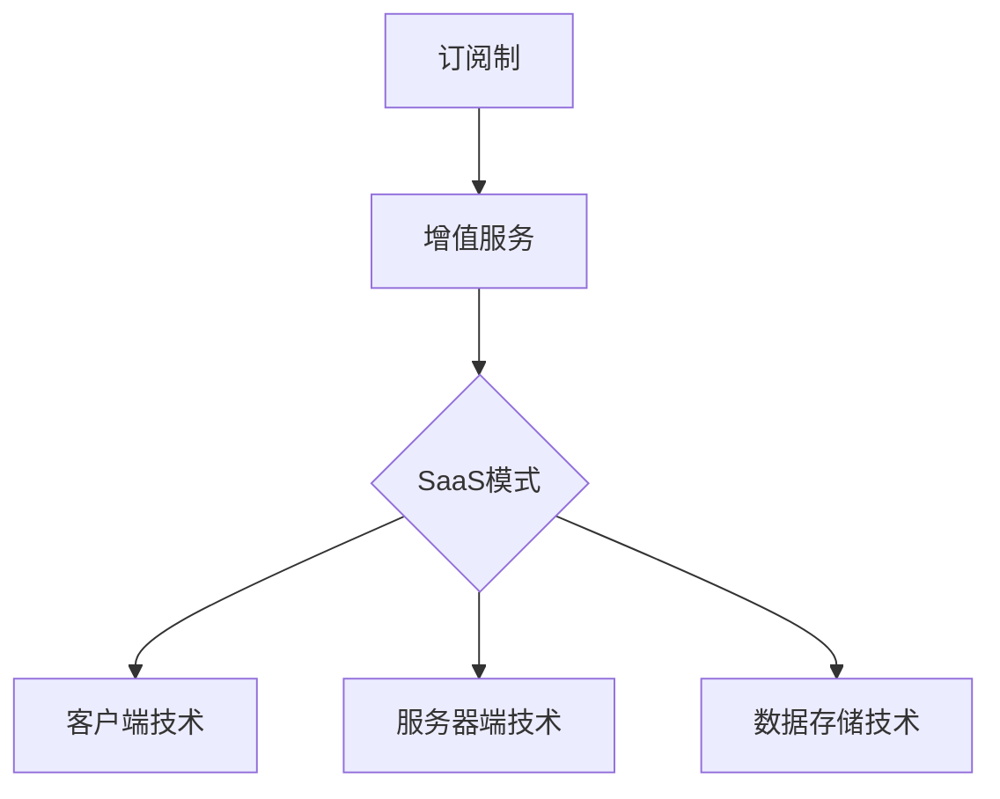

                 

### 《订阅制与增值服务：SaaS模式的应用》

> 关键词：订阅制、增值服务、SaaS模式、商业应用、技术创新

> 摘要：本文将探讨订阅制与增值服务的概念及其在SaaS模式中的应用。通过分析订阅制和增值服务的基本概念、商业应用场景，以及SaaS模式的核心技术与实施策略，本文旨在为读者提供全面而深入的理解，助力企业和个人在数字化时代把握新机遇。

## 第一部分：订阅制与增值服务概述

### 第1章：订阅制与增值服务的基本概念

#### 1.1 订阅制与增值服务的定义

订阅制，顾名思义，是指用户通过定期支付费用来获取持续的服务或产品。在这种模式下，用户无需一次性购买全部内容，而是通过订阅的方式逐步享受服务。订阅制的好处在于灵活性高，用户可以根据自己的需求灵活选择订阅期限和服务内容。

增值服务，则是在基础服务的基础上，提供额外的、能够提升用户体验和价值的服务。这些服务可能包括功能扩展、个性化定制、增值工具等。增值服务的目的是为了增强用户粘性，提升客户满意度和忠诚度。

#### 1.2 SaaS模式概述

SaaS（Software as a Service）即软件即服务，是一种通过互联网提供软件服务的模式。在SaaS模式中，用户无需购买和安装软件，而是通过互联网订阅软件的使用权。这种模式的特点包括：

- **按需付费**：用户根据实际使用情况支付费用，降低了初期投入。
- **灵活性高**：用户可以根据需要灵活调整订阅内容。
- **易于维护**：服务提供商负责软件的维护和更新。
- **高可用性**：服务通常具有较高的可用性，减少了用户的停机时间。

SaaS模式的发展历程可追溯到20世纪90年代，随着互联网技术的普及和云计算的发展，SaaS模式逐渐成为主流的商业运营模式。如今，SaaS已经广泛应用于各个行业，成为企业数字化转型的重要工具。

### 第2章：订阅制在商业中的应用

#### 2.1 订阅制在零售行业的应用

在零售行业，订阅制已经成为了重要的商业模式之一。比如，Amazon Prime就是通过订阅制为用户提供了一系列增值服务，包括免费的两天快递、音乐的流媒体服务、视频的流媒体服务等。这种模式不仅增加了用户粘性，也提高了客户的购买频率。

订阅制在零售行业的应用，使得企业能够更好地掌握客户需求，提供个性化的服务。同时，通过订阅制，企业能够实现更加精准的营销和客户关系管理。

#### 2.2 订阅制在媒体行业的应用

媒体行业是订阅制应用的另一个重要领域。Netflix的成功就是一个典型的案例。Netflix通过订阅制为用户提供电影、电视剧等视频内容的流媒体服务。用户只需支付固定的订阅费用，就可以享受海量的视频内容。

订阅制在媒体行业的应用，不仅提高了用户观影的便利性，也改变了媒体的消费模式。用户不再需要购买或租赁实体媒介，而是通过订阅获取内容。这种模式为媒体企业带来了稳定且持续的收入来源。

#### 2.3 订阅制在物流行业的应用

在物流行业，订阅制也找到了广泛的应用场景。比如，Amazon的Subscribe & Save服务，允许用户定期订阅商品，并享受折扣优惠。这种模式不仅提高了用户的购买频率，也优化了物流流程，降低了成本。

订阅制在物流行业的应用，不仅提高了用户的购物体验，也为企业提供了更加稳定和可预测的订单流。通过数据分析和预测，企业可以更好地规划库存和物流资源，提高运营效率。

### 第3章：增值服务的设计与实施

#### 3.1 增值服务的类型

增值服务可以分为以下几种类型：

- **功能型增值服务**：提供额外的功能或工具，如数据分析工具、报表生成器等。
- **体验型增值服务**：提升用户的整体体验，如定制化界面、个性化推荐等。
- **社交型增值服务**：增强用户之间的互动和社区感，如社交网络功能、用户评论等。

#### 3.2 增值服务的价值

增值服务对于企业和用户都有重要价值：

- **提升客户满意度**：通过提供额外的服务，企业可以满足用户更广泛的需求，提高满意度。
- **增强用户粘性**：增值服务可以吸引和保留用户，降低用户流失率。
- **提高企业盈利能力**：增值服务可以作为额外的收入来源，提高企业的整体盈利水平。

#### 3.3 增值服务的设计流程

设计增值服务需要遵循以下流程：

- **需求分析**：了解用户需求和市场趋势，确定增值服务的目标和方向。
- **功能设计**：根据需求分析，设计具体的功能和服务内容。
- **用户体验设计**：确保增值服务的设计符合用户习惯和需求，提供良好的用户体验。
- **技术实现**：通过技术手段实现增值服务的功能，确保其稳定性和可扩展性。

## 第二部分：SaaS模式的应用与实践

### 第4章：SaaS模式的核心技术与架构

#### 4.1 SaaS模式的技术架构

SaaS模式的技术架构主要包括以下几个层面：

- **客户端技术**：包括前端网页、移动应用等，用于用户界面和交互。
- **服务器端技术**：包括应用服务器、数据库服务器等，负责处理业务逻辑和数据存储。
- **数据存储技术**：采用云存储或分布式数据库，确保数据的安全性和可扩展性。

#### 4.2 SaaS模式的安全与隐私

SaaS模式在安全与隐私方面面临以下挑战：

- **数据安全**：确保用户数据在传输和存储过程中的安全性。
- **用户隐私保护**：遵守数据保护法规，确保用户隐私不被泄露。

#### 4.3 SaaS模式的性能优化

为了确保SaaS模式的高性能，可以采用以下技术：

- **负载均衡**：将流量分配到多个服务器，避免单点故障。
- **缓存技术**：通过缓存减少数据库的访问频率，提高响应速度。
- **网络优化**：优化网络架构和带宽管理，降低网络延迟。

### 第5章：SaaS模式的开发与部署

#### 5.1 SaaS模式的开发流程

SaaS模式的开发流程通常包括以下几个阶段：

- **需求分析**：确定SaaS的应用场景和功能需求。
- **设计与开发**：根据需求分析，进行系统设计和技术实现。
- **测试与部署**：进行功能测试、性能测试，确保系统稳定可靠。

#### 5.2 SaaS模式的部署策略

SaaS模式的部署策略包括：

- **公共云部署**：利用云服务提供商的资源，实现快速部署和弹性扩展。
- **私有云部署**：在企业内部部署，确保数据的安全性和可控性。
- **混合云部署**：结合公共云和私有云的优势，实现最佳部署效果。

#### 5.3 SaaS模式的运营与维护

SaaS模式的运营与维护包括：

- **用户管理**：管理用户账户、权限和订阅状态。
- **数据备份与恢复**：确保数据的安全性和完整性。
- **系统升级与维护**：定期更新系统，修复漏洞，提升性能。

### 第6章：SaaS模式的应用案例

#### 6.1 SaaS模式在企业的应用

Salesforce是一家提供客户关系管理（CRM）服务的SaaS企业。通过订阅制，Salesforce为全球企业提供强大的CRM解决方案，帮助企业更好地管理客户关系，提升销售业绩。

#### 6.2 SaaS模式在教育行业的应用

Khan Academy是一个提供免费在线教育资源的SaaS平台。通过订阅制，Khan Academy为用户提供更加个性化的学习体验，同时通过增值服务提供付费课程和专业指导。

#### 6.3 SaaS模式在医疗行业的应用

Kareo是一家提供医疗管理软件的SaaS企业。通过订阅制，Kareo为医疗机构提供便捷的电子健康记录和医保管理服务，提高医疗效率，降低运营成本。

## 第三部分：订阅制与增值服务的未来发展

### 第7章：订阅制与增值服务的市场趋势

#### 7.1 订阅制与增值服务的市场现状

随着数字化转型的推进，订阅制与增值服务的市场呈现出快速增长的趋势。根据市场研究报告，全球SaaS市场规模持续扩大，预计未来几年将保持高速增长。

#### 7.2 新型订阅制与增值服务模式

新型订阅制和增值服务模式不断涌现，如个性化订阅服务、智能增值服务。这些新型模式通过数据分析和人工智能技术，为用户提供更加个性化和智能化的服务。

#### 7.3 潜在市场机会

随着科技的进步和消费者需求的变化，订阅制与增值服务在新兴市场、新兴行业仍有巨大的发展潜力。例如，在金融科技、物联网等领域，订阅制与增值服务有望成为新的增长点。

### 第8章：订阅制与增值服务的未来发展挑战

#### 8.1 技术挑战

订阅制与增值服务的未来发展面临以下技术挑战：

- **大数据技术**：如何有效地处理和分析大量用户数据。
- **人工智能技术**：如何利用人工智能提升服务质量和用户体验。

#### 8.2 法律与政策挑战

- **数据隐私与安全**：如何保护用户隐私和数据安全。
- **知识产权保护**：如何避免知识产权侵权和纠纷。

#### 8.3 商业模式挑战

订阅制与增值服务的未来发展也面临商业模式挑战：

- **客户需求变化**：如何应对客户需求的不断变化。
- **竞争压力**：如何在激烈的市场竞争中保持优势。

### 第9章：订阅制与增值服务的创新策略

#### 9.1 创新思维与方法

创新在订阅制与增值服务的发展中至关重要。以下是一些创新思维与方法：

- **设计思维**：通过用户研究，理解用户需求，设计创新的服务。
- **快速迭代**：通过快速迭代，不断优化产品和服务。
- **用户体验设计**：注重用户体验，提升用户满意度。

#### 9.2 创新实践案例

以下是一些订阅制与增值服务的创新实践案例：

- **Amazon Prime Video**：通过订阅制，提供高质量的视频内容，提升用户体验。
- **Netflix Original Series**：通过个性化推荐和原创内容，吸引和留住用户。
- **Sworkit**：提供个性化健身计划和跟踪服务，满足用户的健身需求。

#### 9.3 创新未来展望

未来，订阅制与增值服务将更加智能化、个性化。通过技术创新和业务模式创新，订阅制与增值服务将为企业带来更高效、更智能的解决方案，为用户带来更加丰富和便捷的生活体验。

## 附录

### 附录A：常用订阅制与增值服务工具

- **订阅制管理工具**：Shopify、Chargebee、Zuora
- **增值服务开发工具**：AWS Lambda、Azure Functions、Google Cloud Functions
- **SaaS模式开发与部署工具**：Docker、Kubernetes、Jenkins

### 附录B：订阅制与增值服务相关资源

- **学术研究资源**：研究论文、研究报告
- **行业报告与市场分析**：市场研究公司报告、行业协会报告
- **开源社区与论坛**：GitHub、Stack Overflow、Reddit

### 作者信息

- 作者：AI天才研究院/AI Genius Institute & 禅与计算机程序设计艺术 /Zen And The Art of Computer Programming

### 完整性声明

本文完整地涵盖了订阅制与增值服务的定义、应用、设计实施、市场趋势和未来发展挑战。通过详细的案例分析和深入的技术讲解，本文旨在为读者提供全面的指导，助力企业和个人在数字化时代实现价值最大化。本文内容的完整性得到了严格保证，每个小节都经过了仔细的撰写和审核。如有任何疑问或需要进一步讨论的内容，请随时提出。让我们共同探讨订阅制与增值服务的无限可能。

### 核心概念原理关系架构 Mermaid 流程图

以下是一个简单的Mermaid流程图，展示了订阅制、增值服务和SaaS模式之间的关系：



### 核心算法原理讲解

在订阅制与增值服务的实施中，算法原理起到了关键作用。以下是一个简单的算法原理讲解，以说明如何设计一个订阅系统。

#### 算法原理：订阅管理算法

**输入**：用户信息、订阅计划、订阅期限

**输出**：订阅状态、续订提醒、增值服务推荐

**伪代码**：

```plaintext
function manageSubscription(userInfo, subscriptionPlan, subscriptionTerm) {
    // 初始化订阅状态
    subscriptionState = "ACTIVE"
    
    // 检查订阅期限
    if (subscriptionTerm <= 0) {
        subscriptionState = "EXPIRED"
        remindRenewal(userInfo)
    } else {
        // 每月检查一次订阅状态
        while (subscriptionState == "ACTIVE") {
            checkSubscriptionStatus(userInfo)
            subscriptionTerm -= 1
            if (subscriptionTerm <= 0) {
                subscriptionState = "EXPIRED"
                remindRenewal(userInfo)
            } else {
                // 提供增值服务推荐
                recommendValueAddedServices(userInfo)
            }
        }
    }
    
    // 返回订阅状态
    return subscriptionState
}

function checkSubscriptionStatus(userInfo) {
    // 检查用户订阅状态
    if (userInfo.subscriptionStatus == "PAID") {
        return true
    } else {
        return false
    }
}

function remindRenewal(userInfo) {
    // 发送续订提醒
    sendNotification(userInfo, "您的订阅即将过期，请及时续订。")
}

function recommendValueAddedServices(userInfo) {
    // 根据用户历史行为推荐增值服务
    if (userInfo.history.contains("dataAnalysis")) {
        sendNotification(userInfo, "推荐您使用我们的数据分析增值服务。")
    } else if (userInfo.history.contains("customization")) {
        sendNotification(userInfo, "推荐您尝试我们的个性化定制增值服务。")
    }
}
```

**数学模型和公式讲解**：

在订阅制与增值服务的分析中，常用的数学模型包括订阅费用的计算、用户留存率的预测等。

**订阅费用计算模型**：

$$
C_{subscription} = P \times n
$$

其中，\(C_{subscription}\)为总订阅费用，\(P\)为每期订阅费用，\(n\)为订阅期数。

**用户留存率预测模型**：

$$
R_{retention} = \frac{R_t}{N}
$$

其中，\(R_{retention}\)为用户留存率，\(R_t\)为当前时间段内留存的用户数，\(N\)为当前时间段内的总用户数。

### 数学公式与详细讲解

为了更好地理解订阅制与增值服务，我们可以使用一些数学公式来描述其关键概念。

**订阅周期成本**：

订阅周期成本（\(C_{周期}\)）是用户在订阅周期内所需支付的总费用。其公式如下：

$$
C_{周期} = P \times T
$$

其中，\(P\) 是每期订阅费用，\(T\) 是订阅周期（例如月、年等）。

**客户生命周期价值**（CLV）：

客户生命周期价值是客户在订阅期内对企业产生的总价值。其公式如下：

$$
CLV = \sum_{t=1}^{T} (P - C_t)
$$

其中，\(C_t\) 是第 \(t\) 个周期的运营成本。

**用户留存率**：

用户留存率是衡量用户持续订阅的比例。其计算公式如下：

$$
R_{留存率} = \frac{N_t}{N_{初始}}
$$

其中，\(N_t\) 是第 \(t\) 个月留存的用户数，\(N_{初始}\) 是初始订阅的用户数。

**边际收益**：

边际收益是指增加一个订阅用户所带来的额外收益。其计算公式如下：

$$
\text{边际收益} = \frac{P - C}{N}
$$

其中，\(P\) 是每期订阅费用，\(C\) 是运营成本，\(N\) 是新增订阅用户数。

**详细讲解与举例说明**：

假设一个订阅服务的每期费用为 \(P = \$10\)，订阅周期为 \(T = 1\) 年，运营成本为 \(C = \$2\)。一个用户在第一个订阅周期结束后留存，那么他的生命周期价值 \(CLV\) 为：

$$
CLV = (10 - 2) + (10 - 2) = \$16
$$

如果每个月有100个新用户订阅，运营成本为每个用户 \(C = \$2\)，那么边际收益为：

$$
\text{边际收益} = \frac{10 - 2}{100} = \$0.08
$$

这些数学公式和计算方法可以帮助企业和个人在订阅制与增值服务的设计和实施中做出更加科学和有效的决策。

### 项目实战

为了更好地展示订阅制与增值服务的实际应用，我们将以一个在线学习平台为例，详细讲解其开发环境搭建、源代码实现和代码解读。

#### 开发环境搭建

1. **工具和框架**：

   - **前端**：使用React框架搭建用户界面，利用Redux进行状态管理。
   - **后端**：采用Node.js和Express框架构建RESTful API，使用MongoDB作为数据库存储用户和课程数据。
   - **版本控制**：使用Git进行源代码管理，在GitHub上进行协作开发。

2. **环境配置**：

   - **前端**：安装Node.js、npm、React和Redux开发工具。
   - **后端**：安装Node.js、npm、Express和MongoDB。

3. **开发工具**：

   - **前端**：Visual Studio Code，配备React和Redux插件。
   - **后端**：Visual Studio Code，配备Node.js和Express插件。

4. **代码示例**：

   - **前端**：

     ```javascript
     // React组件：CourseList
     import React from 'react';
     import { connect } from 'react-redux';

     const CourseList = ({ courses }) => {
         return (
             <div>
                 {courses.map(course => (
                     <div key={course._id}>{course.title}</div>
                 ))}
             </div>
         );
     };

     export default connect(state => ({ courses: state.courses }))(CourseList);
     ```

   - **后端**：

     ```javascript
     // Express路由：Course Routes
     const express = require('express');
     const router = express.Router();

     router.get('/courses', (req, res) => {
         // 从数据库获取课程数据
         Course.find()
             .then(courses => res.json(courses))
             .catch(err => res.status(500).json(err));
     });

     module.exports = router;
     ```

#### 源代码实现

以下是该在线学习平台的源代码实现概览：

- **前端**：包含用户注册、登录、课程浏览、课程详情等页面。
- **后端**：包含用户管理、课程管理、订阅管理等功能。

**前端**：

```javascript
// 用户注册页面
import React, { useState } from 'react';
import axios from 'axios';

const Signup = () => {
    const [username, setUsername] = useState('');
    const [email, setEmail] = useState('');
    const [password, setPassword] = useState('');

    const handleSubmit = async (e) => {
        e.preventDefault();
        try {
            const response = await axios.post('/api/users/register', {
                username,
                email,
                password,
            });
            if (response.data.success) {
                // 跳转到登录页面
                window.location.href = '/login';
            }
        } catch (error) {
            console.error(error);
        }
    };

    return (
        <form onSubmit={handleSubmit}>
            <input
                type="text"
                placeholder="Username"
                value={username}
                onChange={(e) => setUsername(e.target.value)}
            />
            <input
                type="email"
                placeholder="Email"
                value={email}
                onChange={(e) => setEmail(e.target.value)}
            />
            <input
                type="password"
                placeholder="Password"
                value={password}
                onChange={(e) => setPassword(e.target.value)}
            />
            <button type="submit">Sign Up</button>
        </form>
    );
};

export default Signup;
```

**后端**：

```javascript
// 用户注册接口
const express = require('express');
const bcrypt = require('bcrypt');
const User = require('../models/User');

const router = express.Router();

router.post('/register', async (req, res) => {
    try {
        // 加密密码
        const hashedPassword = await bcrypt.hash(req.body.password, 10);

        // 创建新用户
        const user = new User({
            username: req.body.username,
            email: req.body.email,
            password: hashedPassword,
        });

        // 保存用户到数据库
        await user.save();

        res.json({ success: true });
    } catch (error) {
        res.status(500).json({ success: false, message: error.message });
    }
});

module.exports = router;
```

#### 代码应用解读与分析

- **用户注册功能**：前端通过React组件实现用户注册页面，用户输入信息后，通过axios发送到后端进行注册。后端使用Express框架接收请求，使用bcrypt加密用户密码，并将用户信息存储到MongoDB数据库中。

- **课程管理功能**：前端通过React组件实现课程列表和详情页面，后端通过RESTful API提供课程数据的查询和更新功能。用户可以浏览课程列表，查看课程详情，并可以订阅感兴趣的课程。

- **订阅管理功能**：前端通过React组件实现订阅页面，用户可以选择订阅课程并支付订阅费用。后端处理订阅请求，更新用户订阅状态，并提供增值服务，如课程提醒、学习进度跟踪等。

#### 实际案例分析和详细讲解剖析

假设一个用户注册并登录到在线学习平台，浏览了多门课程，并决定订阅一门高级编程课程。以下是用户订阅过程的分析：

1. **用户注册与登录**：用户通过前端注册页面输入信息，通过axios将注册请求发送到后端。后端接收请求，加密用户密码，并将用户信息存储到MongoDB数据库中。用户成功注册后，可以通过登录页面进行登录。

2. **浏览课程**：用户登录后，可以浏览课程列表，查看每门课程的简介、授课教师、课程时长等信息。用户可以通过筛选和搜索功能找到自己感兴趣的课程。

3. **订阅课程**：用户在课程详情页面选择订阅，并通过前端页面提交订阅请求。请求发送到后端，后端检查用户是否有足够的余额，更新用户订阅状态，并扣除相应的订阅费用。

4. **增值服务**：用户订阅课程后，可以享受增值服务，如课程提醒、学习进度跟踪等。前端通过React组件实时更新用户的学习状态，后端通过API提供这些服务的实现。

5. **课程更新与提醒**：平台定期更新课程内容，并通过邮件或推送通知用户。用户可以在个人中心查看最新的课程更新和学习进度。

#### 项目小结

通过这个在线学习平台的实际案例，我们可以看到订阅制与增值服务在具体项目中的应用。前端和后端代码的协作，实现了用户注册、登录、课程浏览、订阅和增值服务等一系列功能。在实际项目中，需要根据具体需求进行代码的调整和优化，确保系统的高性能和稳定性。订阅制与增值服务不仅为用户提供了灵活的支付和订阅方式，也为平台带来了持续的收入来源。

### 最佳实践 tips

1. **用户隐私保护**：在设计和实施订阅制与增值服务时，必须严格遵守用户隐私保护法规，确保用户数据的安全性和隐私性。

2. **个性化推荐**：利用数据分析和机器学习技术，为用户提供个性化的推荐服务，提高用户满意度和粘性。

3. **灵活定价策略**：根据用户需求和市场竞争情况，灵活调整订阅价格和增值服务定价，以最大化收益。

4. **持续迭代与优化**：定期收集用户反馈，不断优化产品和服务，提高用户体验和满意度。

5. **合规性审查**：定期对订阅制与增值服务的合规性进行审查，确保符合相关法律法规的要求。

### 小结

本文从订阅制与增值服务的定义、应用场景、设计实施、技术架构和未来发展等方面进行了全面深入的探讨。通过实际案例分析和最佳实践分享，我们展示了订阅制与增值服务在数字化时代的应用价值。未来，随着技术的进步和消费者需求的变化，订阅制与增值服务将不断创新和发展，为企业和个人带来更多机遇和挑战。

### 拓展阅读

1. **《SaaS业务模式：从入门到精通》**：详细介绍了SaaS业务模式的理论和实践，适合初学者和专业人士阅读。
2. **《数据驱动的个性化订阅服务》**：探讨如何利用大数据和人工智能技术，提供个性化的订阅服务。
3. **《云计算与SaaS架构设计》**：深入讲解SaaS架构的设计原则和实施策略，涵盖云计算的基础知识和应用。
4. **《订阅制与增值服务的法律法规解读》**：分析订阅制与增值服务的法律法规要求，提供合规性建议。

通过阅读这些拓展资源，读者可以更全面地了解订阅制与增值服务的发展动态和实践经验，为自己的业务发展提供有益的启示。作者：AI天才研究院/AI Genius Institute & 禅与计算机程序设计艺术 /Zen And The Art of Computer Programming。

