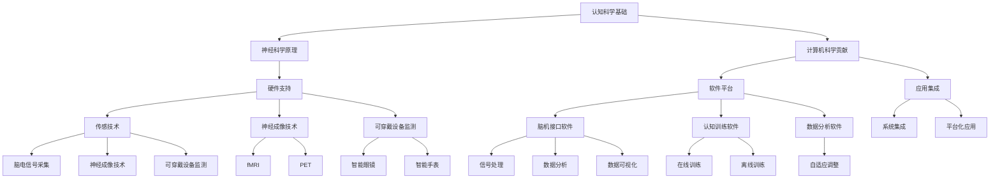

                 

### 文章标题

《认知增强与伦理：人类增强技术的争议》

### 关键词

认知增强，伦理，人类增强技术，隐私保护，法律问题，未来展望

### 摘要

随着科技的迅猛发展，认知增强技术逐渐成为研究热点。本文从认知增强技术的概述、伦理探讨、法律问题以及未来展望四个方面，详细分析了人类增强技术的现状与争议。文章首先介绍了认知增强技术的定义、分类及其发展历程，随后探讨了其在医疗、教育和军事领域的应用。接着，文章深入分析了认知增强技术的伦理问题，包括道德挑战、道德原则和伦理争议案例。在法律问题部分，文章探讨了法律框架的建立、法律争议案例分析及法律挑战与解决方案。最后，文章展望了认知增强技术的未来发展趋势，提出了应对伦理争议的策略，并对读者提出了学习路径和建议。本文旨在为认知增强技术的研究和应用提供有益的参考。

---

## 第一部分：认知增强技术的概述与伦理探讨

### 第1章：认知增强技术的起源与发展

#### 1.1 认知增强技术的定义与分类

认知增强技术（Cognitive Enhancement Technologies，简称CET）是指通过科技手段提升人类认知能力的一系列技术。这些技术包括神经科学技术、脑机接口技术、智能药物、虚拟现实等，其目的是提高人类的记忆、注意力、学习能力等认知功能。

认知增强技术大致可以分为以下几类：

1. **神经科学方法**：通过药物、脑刺激等方法直接作用于大脑，提高认知能力。
2. **信息技术方法**：利用计算机和人工智能技术，通过优化信息处理和传递路径，提升认知能力。
3. **生物医学方法**：通过基因编辑、干细胞技术等手段，从根本上改变大脑结构和功能。

#### 1.2 认知增强技术的发展历程

1. **认知增强技术的早期研究**：20世纪80年代，科学家开始研究认知增强的可能性，主要集中在脑刺激技术。
2. **认知增强技术的崛起**：21世纪初，随着神经科学和计算机科学的快速发展，认知增强技术逐渐从实验室走向实际应用。
3. **认知增强技术的前沿趋势**：目前，认知增强技术正朝着智能化、个性化、可穿戴化方向发展。

#### 1.3 认知增强技术的影响

1. **对个人认知能力的影响**：认知增强技术可以显著提高人类的记忆、注意力和学习能力。
2. **对社会结构的影响**：认知增强技术可能导致社会分层加剧，影响教育和就业。
3. **对道德伦理的挑战**：认知增强技术的应用引发了对隐私、公平性等伦理问题的讨论。

### 第2章：认知增强技术的核心原理与架构

#### 2.1 认知增强技术的基本原理

认知增强技术的基本原理主要涉及以下三个方面：

1. **认知科学基础**：通过对大脑结构和功能的研究，了解人类认知的基本机制。
2. **神经科学原理**：通过神经成像、电生理等技术，探究大脑活动的具体过程。
3. **计算机科学贡献**：利用大数据、人工智能等技术，优化信息处理和传递路径。

#### 2.2 认知增强技术的主要架构

认知增强技术的主要架构包括以下几个方面：

1. **硬件支持**：包括脑机接口设备、神经成像设备等。
2. **软件平台**：如脑机接口软件、认知训练软件等。
3. **应用集成**：将硬件和软件结合，形成一个完整的认知增强系统。

#### 2.3 认知增强技术的核心技术

认知增强技术的核心技术包括以下几个方面：

1. **传感技术**：用于获取大脑活动的数据。
2. **数据处理技术**：用于对获取的数据进行处理和分析。
3. **训练与优化技术**：通过训练和优化算法，提高认知增强的效果。

### 第3章：认知增强技术在具体领域的应用

#### 3.1 认知增强技术在医疗领域的应用

1. **诊断辅助**：通过脑机接口技术，帮助医生进行脑疾病诊断。
2. **康复训练**：利用虚拟现实技术，帮助患者进行康复训练。
3. **脑机接口**：通过脑机接口技术，帮助肢体残疾者实现与外界的交互。

#### 3.2 认知增强技术在教育领域的应用

1. **智能辅导**：利用人工智能技术，为学习者提供个性化的学习辅导。
2. **个性化学习**：通过分析学习者的数据，制定个性化的学习计划。
3. **教育测评**：利用认知增强技术，对学习效果进行实时评估。

#### 3.3 认知增强技术在军事领域的应用

1. **战场认知支持**：通过认知增强技术，提高士兵的战场认知能力。
2. **士兵训练**：利用虚拟现实技术，进行高强度的军事训练。
3. **情报分析**：通过认知增强技术，提高情报分析的效率和质量。

---

以上是第一部分的内容，我们首先介绍了认知增强技术的定义、分类和发展历程，然后详细阐述了认知增强技术的核心原理与架构，以及其在医疗、教育和军事领域的应用。在接下来的章节中，我们将继续探讨认知增强技术的伦理争议和法律问题，以及其未来的发展前景。

### 第1章：认知增强技术的起源与发展

#### 1.1 认知增强技术的定义与分类

认知增强技术（Cognitive Enhancement Technologies，简称CET）是指通过科技手段提升人类认知能力的一系列技术。这些技术包括神经科学技术、脑机接口技术、智能药物、虚拟现实等，其目的是提高人类的记忆、注意力、学习能力等认知功能。

认知增强技术大致可以分为以下几类：

1. **神经科学方法**：通过药物、脑刺激等方法直接作用于大脑，提高认知能力。
   - **药物增强**：如利他林、安非他明等，用于提高注意力和集中力。
   - **电刺激**：如经颅磁刺激（TMS）、深部脑刺激（DBS）等，通过电流刺激大脑特定区域，改善认知功能。
2. **信息技术方法**：利用计算机和人工智能技术，通过优化信息处理和传递路径，提升认知能力。
   - **虚拟现实**：通过模拟现实环境，提高学习效率和记忆力。
   - **增强现实**：结合虚拟现实和现实世界，增强人类的感知和认知能力。
3. **生物医学方法**：通过基因编辑、干细胞技术等手段，从根本上改变大脑结构和功能。
   - **基因编辑**：如CRISPR-Cas9技术，用于修复与认知功能相关的基因缺陷。
   - **干细胞技术**：通过干细胞分化，修复或再生受损的大脑组织。

#### 1.2 认知增强技术的发展历程

认知增强技术的发展历程可以追溯到20世纪，但真正引起广泛关注是在21世纪初。以下是认知增强技术的发展历程：

1. **认知增强技术的早期研究**：20世纪80年代，科学家开始研究认知增强的可能性，主要集中在脑刺激技术。例如，经颅磁刺激（TMS）和深部脑刺激（DBS）等技术在动物模型上取得了显著效果。
2. **认知增强技术的崛起**：21世纪初，随着神经科学和计算机科学的快速发展，认知增强技术逐渐从实验室走向实际应用。例如，利他林和安非他明等药物在学术和职业领域得到广泛应用。
3. **认知增强技术的前沿趋势**：目前，认知增强技术正朝着智能化、个性化、可穿戴化方向发展。例如，脑机接口技术（Brain-Computer Interfaces，BCIs）的快速发展，使得人类可以通过直接脑电信号与计算机进行交互，实现认知能力的增强。

#### 1.3 认知增强技术的影响

认知增强技术的影响是多方面的，既包括对个人认知能力的提升，也涉及到对社会结构和道德伦理的挑战。

1. **对个人认知能力的影响**：
   - **提高记忆力和注意力**：认知增强技术可以帮助人们更好地记住信息，提高注意力和集中力。
   - **增强学习能力和工作效率**：通过虚拟现实和增强现实技术，人们可以在模拟环境中进行学习和训练，提高学习效果和职业能力。
   - **改善心理健康**：认知增强技术可以用于治疗抑郁症、焦虑症等心理疾病，改善心理健康状况。

2. **对社会结构的影响**：
   - **教育不平等**：认知增强技术的普及可能导致教育领域的分化，有能力获得认知增强的人可能在竞争中占据优势，加剧教育不平等。
   - **职业机会差距**：在职场中，认知增强技术可能使某些人具备更强的学习能力，从而获得更多职业机会，导致职业机会的差距。

3. **对道德伦理的挑战**：
   - **隐私问题**：认知增强技术的应用可能导致个人隐私受到侵犯，如脑电信号的收集和分析。
   - **公平性**：如何确保所有人都有公平获得认知增强的机会，避免加剧社会不公。
   - **智能差距**：认知增强技术可能导致“智能差距”，有能力获得认知增强的人与无法获得的人之间的认知能力差距。

#### 1.4 认知增强技术的前景

认知增强技术的前景非常广阔，其应用领域不断扩大。以下是认知增强技术的前景：

1. **医疗领域**：认知增强技术可以用于治疗认知功能障碍、提高康复效果、改善心理健康等，具有巨大的医疗潜力。
2. **教育领域**：认知增强技术可以个性化教育，提高学习效果，使教育更加公平。
3. **军事领域**：认知增强技术可以提高士兵的战场认知能力，提升军事训练效果，增强战斗力。
4. **工业领域**：认知增强技术可以提高工作效率，减少工作压力，改善工作环境。
5. **家庭领域**：认知增强技术可以用于改善家庭生活质量，提供更加智能化的家庭服务。

总之，认知增强技术作为一项新兴技术，具有巨大的发展潜力。但同时，我们也需要关注其可能带来的伦理和社会问题，确保技术发展的可持续性和公平性。

### 第2章：认知增强技术的核心原理与架构

#### 2.1 认知增强技术的基本原理

认知增强技术的基本原理主要涉及认知科学、神经科学和计算机科学三个领域。以下是这些领域的基本概念及其在认知增强技术中的应用。

1. **认知科学基础**：
   - **认知过程**：认知科学关注人类的感知、记忆、注意力、语言和决策等认知过程。
   - **认知功能**：认知功能包括记忆力、注意力、学习能力、问题解决能力等。
   - **认知模型**：认知科学提供了多种认知模型，如神经网络模型、决策树模型等，用于模拟和理解人类认知过程。

2. **神经科学原理**：
   - **大脑结构**：神经科学研究了大脑的结构，包括神经元、突触和神经网络等。
   - **神经元活动**：神经元通过电信号传递信息，突触通过释放神经递质来调节神经元之间的信号传递。
   - **大脑功能**：神经科学研究了大脑的不同区域和功能，如前额叶皮层与决策、海马体与记忆等。

3. **计算机科学贡献**：
   - **信息处理**：计算机科学提供了高效的信息处理算法，如排序、搜索、机器学习等，用于处理和分析大量数据。
   - **人工智能**：人工智能技术，如机器学习和深度学习，可以模拟人类认知过程，实现智能决策和问题解决。
   - **数据存储与传输**：计算机科学提供了高效的数据存储和传输技术，如数据库、云计算等，支持大规模数据处理和实时应用。

#### 2.2 认知增强技术的主要架构

认知增强技术的主要架构包括硬件支持、软件平台和应用集成三个部分。

1. **硬件支持**：
   - **脑机接口设备**：脑机接口（BCI）设备用于捕捉大脑活动信号，如脑电图（EEG）、功能性磁共振成像（fMRI）等。
   - **神经成像设备**：神经成像设备，如磁共振成像（MRI）、正电子发射断层扫描（PET）等，用于观察大脑结构和功能。
   - **可穿戴设备**：可穿戴设备，如智能眼镜、智能手表等，用于实时监测和记录大脑活动。

2. **软件平台**：
   - **脑机接口软件**：脑机接口软件负责处理和解释脑电信号，实现与外部设备的交互。
   - **认知训练软件**：认知训练软件通过设计特定的训练任务，提高用户的记忆、注意力、学习能力等认知功能。
   - **数据分析软件**：数据分析软件用于对采集到的大脑活动数据进行处理和分析，提取有用的认知信息。

3. **应用集成**：
   - **系统集成**：将硬件和软件集成在一起，形成一个完整的认知增强系统，如认知训练系统、智能辅助系统等。
   - **平台化应用**：通过构建认知增强平台，将各种认知增强技术整合在一起，提供多样化的应用服务。

#### 2.3 认知增强技术的核心技术

认知增强技术的核心技术包括传感技术、数据处理技术、训练与优化技术等。

1. **传感技术**：
   - **脑电信号采集**：通过脑电图（EEG）等设备，实时采集大脑的电活动信号。
   - **神经成像技术**：利用功能性磁共振成像（fMRI）等设备，观察大脑的功能性和结构变化。
   - **可穿戴设备监测**：通过智能眼镜、智能手表等可穿戴设备，实时监测用户的认知状态和行为。

2. **数据处理技术**：
   - **信号处理**：对采集到的脑电信号进行预处理，去除噪声和干扰，提取有用的信息。
   - **数据分析**：利用机器学习和深度学习等技术，对预处理后的数据进行分析，提取认知特征。
   - **数据可视化**：通过数据可视化技术，将分析结果以图形化的形式呈现，便于用户理解和分析。

3. **训练与优化技术**：
   - **在线训练**：实时根据用户的认知状态和行为，调整训练任务的难度和内容，提高训练效果。
   - **离线训练**：对采集到的大脑活动数据进行离线分析，优化认知增强算法，提高系统的准确性。
   - **自适应调整**：根据用户的反馈和需求，自动调整认知增强系统的参数和功能，实现个性化服务。

#### 2.4 认知增强技术的核心架构 Mermaid 流程图

通过上述架构和核心技术的详细介绍，我们可以看到，认知增强技术涉及多个学科和领域，具有复杂的技术架构和多样化的应用场景。在接下来的章节中，我们将进一步探讨认知增强技术在具体领域的应用，以及其带来的伦理争议和法律问题。

### 第3章：认知增强技术在具体领域的应用

#### 3.1 认知增强技术在医疗领域的应用

认知增强技术在医疗领域的应用前景广阔，其通过提升患者的认知能力和康复效果，为医疗行业带来了新的发展契机。以下是认知增强技术在医疗领域的具体应用：

1. **诊断辅助**：
   认知增强技术可以通过脑机接口和神经成像等技术，帮助医生进行精确的诊断。例如，通过功能性磁共振成像（fMRI）技术，医生可以观察大脑的活动，从而更准确地诊断神经系统疾病，如癫痫、阿尔茨海默病等。此外，脑电图（EEG）技术可以用于监测大脑的电活动，辅助诊断脑部疾病。

2. **康复训练**：
   认知增强技术为康复训练提供了新的方法。例如，虚拟现实（VR）技术可以模拟康复环境，帮助患者在虚拟世界中进行运动训练，提高康复效果。脑机接口技术则可以通过直接与大脑进行交互，帮助肢体残疾者实现与外界的交互，提高其生活质量。

3. **脑机接口**：
   脑机接口（BCI）技术在医疗领域的应用日益广泛。通过捕捉大脑的电信号，BCI技术可以实现大脑与外部设备的直接交互，帮助患者控制假肢、轮椅等辅助设备。例如，对于截肢患者，通过脑机接口技术，他们可以仅通过大脑信号来控制假肢，实现与正常人的相似功能。

4. **个性化医疗**：
   认知增强技术可以用于个性化医疗，通过分析患者的基因、大脑活动数据等，为每位患者制定个性化的治疗方案。例如，通过对患者的认知功能进行评估，医生可以确定患者是否需要额外的认知训练或药物治疗，从而提高治疗效果。

5. **心理健康**：
   认知增强技术可以用于治疗心理健康问题，如抑郁症、焦虑症等。例如，通过认知行为疗法（CBT），患者可以在虚拟环境中进行心理训练，学习应对压力和情绪的方法。此外，脑刺激技术，如经颅磁刺激（TMS）和深部脑刺激（DBS），可以通过调节大脑的活动，改善心理健康状况。

#### 3.2 认知增强技术在教育领域的应用

认知增强技术在教育领域的应用，可以显著提高学习效果和教学效率。以下是认知增强技术在教育领域的具体应用：

1. **智能辅导**：
   智能辅导系统利用人工智能技术，为学习者提供个性化的学习建议和辅导。例如，通过分析学习者的学习行为和成绩，智能辅导系统可以推荐适合的学习资源和策略，帮助学习者提高学习效果。

2. **个性化学习**：
   个性化学习系统根据学习者的认知特点和学习需求，为学习者提供个性化的学习内容和任务。例如，通过分析学习者的学习数据，系统可以为学习者制定个性化的学习路径，确保每位学习者都能在适合自己的节奏下学习。

3. **教育测评**：
   认知增强技术可以用于实时测评学习者的认知能力和发展水平。例如，通过脑电图（EEG）和神经成像技术，教师可以实时监测学生的学习状态和认知功能，从而更好地了解学生的学习情况，及时调整教学策略。

4. **虚拟课堂**：
   虚拟现实（VR）技术可以创建一个沉浸式的学习环境，让学生在虚拟场景中学习知识。例如，学生可以通过VR技术参观历史遗址、探索宇宙，从而提高学习的兴趣和效果。

5. **在线教育**：
   在线教育平台利用认知增强技术，提供互动性强、个性化的学习体验。例如，通过虚拟助手和智能评估系统，在线教育平台可以根据学习者的反馈和学习行为，实时调整教学内容和难度，确保学习者能够获得最佳的学习效果。

#### 3.3 认知增强技术在军事领域的应用

认知增强技术在军事领域的应用，可以提高士兵的战斗力和训练效果。以下是认知增强技术在军事领域的具体应用：

1. **战场认知支持**：
   认知增强技术可以为士兵提供战场认知支持，提高其在复杂战场环境中的判断力和反应速度。例如，通过脑机接口技术，士兵可以直接通过大脑信号控制无人机、侦察设备等，提高战场感知和决策能力。

2. **士兵训练**：
   认知增强技术可以用于军事训练，提高士兵的作战能力和身体素质。例如，通过虚拟现实（VR）技术，士兵可以在模拟的战斗场景中进行高强度的训练，提高其战斗技能和心理素质。

3. **情报分析**：
   认知增强技术可以用于情报分析，提高情报的收集、处理和分析效率。例如，通过大数据分析和机器学习技术，可以从海量情报中快速提取有用信息，为决策提供支持。

4. **心理干预**：
   认知增强技术可以用于心理干预，帮助士兵缓解战斗压力和创伤后应激障碍（PTSD）。例如，通过认知行为疗法（CBT）和虚拟现实（VR）技术，士兵可以在虚拟环境中进行心理训练，学习应对压力和创伤的方法。

5. **指挥控制**：
   认知增强技术可以用于指挥控制，提高指挥官的决策能力和指挥效率。例如，通过脑机接口技术，指挥官可以直接通过大脑信号进行指挥和调度，提高指挥的精准度和反应速度。

总之，认知增强技术在医疗、教育和军事领域都有广泛的应用前景。随着技术的不断发展和成熟，认知增强技术将为这些领域带来更多创新和变革。然而，同时我们也需要关注认知增强技术可能带来的伦理和社会问题，确保其应用的可持续性和公平性。

### 第二部分：认知增强技术的伦理争议与法律问题

#### 第4章：认知增强技术的伦理问题

#### 4.1 认知增强技术的道德挑战

认知增强技术的迅猛发展，虽然为人类带来了诸多便利和提升，但也引发了一系列深刻的道德挑战。以下是认知增强技术在道德领域的主要挑战：

1. **个体隐私保护**：
   认知增强技术往往需要收集大量的个人数据，包括脑电图、神经成像数据等。这些数据的收集和处理可能侵犯个人隐私。例如，未经个人同意，收集和分析其大脑活动数据，可能导致个人隐私泄露，甚至被滥用。

2. **社会公平性**：
   认知增强技术的普及可能导致社会分化加剧。有能力支付认知增强技术的个体将在教育、职业和日常生活中获得巨大优势，而无法负担这些技术的个体则可能被边缘化，加剧社会不平等。

3. **智能差距问题**：
   随着认知增强技术的普及，人类之间的认知差距可能进一步扩大。具有认知增强能力的个体与没有这种能力的人之间可能形成新的“智能差距”，导致社会结构和人际关系的深刻变化。

#### 4.2 认知增强技术的道德原则

面对认知增强技术的道德挑战，我们需要确立一些基本的道德原则来指导其合理使用和发展。以下是几个核心的道德原则：

1. **尊重个人自主权**：
   在使用认知增强技术时，必须尊重个人的自主权，确保个体有权决定是否接受认知增强，以及如何使用这些技术。任何未经个人同意的增强行为都是不道德的。

2. **平等对待每个个体**：
   认知增强技术的设计和应用应确保所有人都有平等的机会获取和使用这些技术，避免加剧社会不平等。政府和相关机构应制定公平的政策和法规，确保技术的普及性和可及性。

3. **责任明确**：
   在认知增强技术的开发、应用和监管过程中，应明确各方的责任。技术开发者、使用者、监管机构等各方都应承担相应的责任，确保技术的安全和合理使用。

#### 4.3 伦理争议案例分析

为了更好地理解认知增强技术引发的道德争议，我们可以通过几个实际案例来进行分析。

1. **案例一：增强记忆药物的使用**：
   一项关于记忆增强药物的研究表明，这种药物可以显著提高实验参与者的记忆力。然而，这种药物的使用也引发了一系列伦理问题。首先是药物的安全性和副作用问题，长期使用可能对健康产生不利影响。其次，药物的使用可能导致教育领域的分化，有能力支付药物的人将在学术竞争中占据优势，而无法负担的人则可能被边缘化。

2. **案例二：人工智能助教系统**：
   在一些学校中，人工智能助教系统被用于辅助教学。这些系统可以根据学生的学习行为和成绩，提供个性化的学习建议。然而，这也引发了对学生隐私和数据安全的担忧。系统的设计和应用应确保学生的数据安全，并且学生有权知道自己的数据如何被使用。

3. **案例三：认知增强技术的军事应用**：
   认知增强技术在军事领域的应用，如提高士兵的战斗能力和决策速度，可能带来显著的优势。然而，这也引发了对战争伦理的质疑。如果认知增强技术被用于制造更加残忍和高效的战争武器，那么这将对人类道德构成严重挑战。

通过以上案例，我们可以看到认知增强技术在不同领域的应用所引发的道德争议。这些争议提醒我们，在推动认知增强技术发展的同时，必须认真对待其伦理问题，确保技术的合理和道德使用。

#### 第5章：认知增强技术的法律问题

#### 5.1 法律框架的建立

随着认知增强技术的发展和应用，法律框架的建立显得尤为重要。以下是在国际、国家和行业层面建立法律框架的几个关键步骤：

1. **国际法律体系**：
   国际社会在认知增强技术领域已经达成了一些共识，例如通过联合国教科文组织（UNESCO）等国际组织，推动制定国际标准和法律规范。这些国际法律框架旨在促进全球范围内认知增强技术的合理使用，确保技术和数据的跨境流动。

2. **国家层面的立法**：
   各国政府开始重视认知增强技术的法律问题，并逐步建立相关的法律法规。例如，美国通过了《大脑研究计划法案》（ BRAIN Initiative），旨在推动脑科学研究，并制定相关法律规范。欧洲各国也在加紧制定法律，确保认知增强技术的合法和安全使用。

3. **行业规范与自律**：
   认知增强技术的行业组织和企业也开始制定自律规范，以规范行业行为。例如，国际脑机接口协会（International Brain-Computer Interface Society，IBCIS）和全球脑机接口联盟（Global Brain-Computer Interface Alliance，GBCIA）等组织，致力于制定行业标准和最佳实践，促进认知增强技术的健康和可持续发展。

#### 5.2 法律争议案例分析

在认知增强技术的应用过程中，法律争议层出不穷。以下是一些具有代表性的案例：

1. **案例一：脑机接口专利纠纷**：
   脑机接口技术的发展引发了专利纠纷。一些企业声称其拥有脑机接口技术的专利，而其他企业则认为这些专利侵犯了自己的知识产权。这些争议导致了一系列法律诉讼，最终需要通过法院判决来明确专利权归属。

2. **案例二：基因编辑技术的伦理审查**：
   基因编辑技术，如CRISPR-Cas9，在认知增强领域的应用引发了伦理和法律的争议。一些国家制定了严格的基因编辑审查制度，确保技术应用的合法性和伦理性。例如，中国通过了《基因编辑婴儿事件》调查报告，明确表示基因编辑技术必须经过严格的伦理审查。

3. **案例三：认知增强药物的监管**：
   认知增强药物的使用在医疗和教育领域引发了许多法律争议。一些国家开始加强对认知增强药物的管理和监管，确保其合法和安全使用。例如，美国食品药品监督管理局（FDA）已经对一些认知增强药物进行了审批，并规定了其使用范围和剂量。

#### 5.3 法律挑战与解决方案

尽管法律框架的建立取得了一些进展，但认知增强技术仍然面临诸多法律挑战。以下是几个关键的法律挑战和可能的解决方案：

1. **个人数据保护**：
   随着认知增强技术的发展，个人数据的安全和隐私保护成为重要议题。解决方案包括制定严格的数据保护法律，建立数据保护机构和审查机制，确保个人数据的合法和安全使用。

2. **职业道德**：
   在认知增强技术的开发和应用过程中，职业道德问题尤为重要。解决方案包括建立职业道德准则，对技术开发者和使用者进行职业道德教育和培训，确保他们遵守伦理规范。

3. **法律责任的界定**：
   在认知增强技术的应用过程中，如何界定法律责任的归属是一个复杂的问题。解决方案包括制定明确的法律责任规定，对技术开发者、使用者、监管机构等各方的责任进行清晰界定。

总之，随着认知增强技术的不断发展，法律问题的解决需要国际、国家和行业多方面的合作。通过建立完善的法律框架和规范，我们可以更好地应对认知增强技术带来的法律挑战，确保技术的合理和道德使用。

### 第6章：认知增强技术的伦理争议与未来展望

#### 6.1 伦理争议的应对策略

面对认知增强技术带来的伦理争议，我们需要采取一系列应对策略，以确保技术的合理和道德使用。

1. **教育与培训**：
   通过对公众和专业人士进行认知增强技术的教育，提高他们对技术潜在风险和伦理问题的认识。这包括学术课程、公开讲座和工作坊等形式，使人们能够理解认知增强技术的原理和应用，从而更好地进行道德判断和决策。

2. **公众参与**：
   在认知增强技术的研发和应用过程中，应鼓励公众参与，确保技术的决策过程具有透明度和民主性。例如，通过公开听证会、意见征集等方式，收集公众的意见和建议，使其在技术发展过程中发挥积极作用。

3. **政策引导**：
   政府和监管机构应制定明确的政策，引导认知增强技术的合理使用。这些政策应包括伦理审查制度、技术标准、数据保护法规等，确保技术发展的同时，能够最大限度地保护公众利益和社会公正。

#### 6.2 认知增强技术的未来趋势

1. **技术革新**：
   随着人工智能、神经科学和计算机科学的不断发展，认知增强技术将不断革新。例如，量子计算和纳米技术的发展，可能会为认知增强技术带来新的突破，提高其性能和应用范围。

2. **应用拓展**：
   认知增强技术的应用领域将不断拓展。除了现有的医疗、教育和军事领域外，未来可能在无人驾驶、智能家居、智能交通等领域得到广泛应用，进一步提升人类的生活质量和效率。

3. **社会变革**：
   认知增强技术的普及将对社会结构和人际关系产生深远影响。例如，智能差距可能加剧社会不平等，教育和职业机会将更加分化。因此，我们需要关注技术对社会的影响，确保其发展能够促进社会的公平和可持续发展。

#### 6.3 跨学科合作与可持续发展

1. **跨学科研究的重要性**：
   认知增强技术涉及多个学科领域，包括神经科学、计算机科学、心理学、法律和社会学等。跨学科合作是解决认知增强技术伦理问题的关键。通过多学科的合作研究，可以更全面地理解技术的潜在影响，制定科学的政策和技术标准。

2. **社会各界的协作**：
   在认知增强技术的研发和应用过程中，需要政府、企业、学术机构和公众等各界的广泛参与和协作。只有通过共同努力，才能确保技术的健康发展，最大限度地发挥其社会价值。

3. **持续发展的路径**：
   为了实现认知增强技术的可持续发展，我们需要制定长期的战略规划，确保技术的创新、应用和伦理问题能够协调推进。这包括持续的技术研发、政策优化和社会参与，以及建立有效的监管机制。

总之，认知增强技术作为一项前沿科技，具有巨大的发展潜力。通过有效的伦理争议应对策略、技术革新和社会变革，我们可以确保认知增强技术的可持续发展，为人类社会的进步做出贡献。

### 第三部分：认知增强技术的实践与应用

#### 第7章：认知增强技术的项目实践

#### 7.1 认知增强技术的项目策划

在策划一个认知增强技术项目时，需要明确项目目标、选择合适的技术路线，并进行全面的风险评估。以下是项目策划的详细步骤：

1. **项目目标设定**：
   项目目标应明确具体，包括提升认知能力、改善生活质量、提高工作效率等。例如，一个医疗领域的认知增强项目目标可以是开发一种智能康复训练系统，帮助患者提高康复效果。

2. **技术路线选择**：
   根据项目目标和现有技术条件，选择合适的技术路线。例如，选择脑机接口技术、虚拟现实技术或智能药物等。技术路线的选择应考虑技术的成熟度、应用场景和成本等因素。

3. **风险评估与应对**：
   对项目的潜在风险进行全面评估，包括技术风险、市场风险、法律风险等。制定相应的应对措施，确保项目能够顺利进行。例如，技术风险可以通过多方案对比和备选方案准备来应对；市场风险可以通过市场调研和用户反馈来降低。

#### 7.2 认知增强技术的开发与实施

在项目实施阶段，需要进行详细的技术方案制定、系统设计与实现，并进行验证与测试。以下是开发与实施的详细步骤：

1. **技术方案制定**：
   根据项目目标和技术路线，制定具体的技术方案。技术方案应包括硬件设备、软件平台、数据流程和算法设计等。例如，如果选择脑机接口技术，技术方案应包括脑电信号采集、处理和解释等。

2. **系统设计与实现**：
   根据技术方案，进行系统的详细设计，包括硬件设备连接、软件模块开发和数据处理流程等。例如，开发一个智能康复训练系统，需要设计脑电信号采集模块、数据预处理模块、训练任务模块和用户界面等。

3. **验证与测试**：
   在系统实现后，进行全面的测试和验证，确保系统功能的正确性和可靠性。测试应包括功能测试、性能测试和用户测试等。例如，对智能康复训练系统，需要测试其在不同康复任务中的表现，以及用户操作的便捷性和友好性。

#### 7.3 认知增强技术的应用案例分析

为了更好地理解认知增强技术的实际应用，我们可以通过以下几个案例进行分析：

1. **案例一：基于脑机接口的康复训练系统**：
   一个基于脑机接口的康复训练系统，可以帮助截肢患者通过脑电信号控制假肢。技术实现包括脑电信号的采集、预处理和解释，以及假肢的控制算法。系统测试表明，该系统能够有效提高患者的康复效果和生活质量。

2. **案例二：智能教育平台**：
   一个智能教育平台通过大数据分析和人工智能技术，为学习者提供个性化的学习辅导。技术实现包括学习行为数据的采集和分析、智能推荐算法的开发和应用。系统测试表明，该平台能够显著提高学习效果和学习兴趣。

3. **案例三：认知增强药物的研发**：
   一个认知增强药物的研发项目，通过药物筛选和临床试验，开发出一种能够显著提高记忆力的药物。技术实现包括药物分子的设计、合成和测试，以及临床试验的设计和数据分析。项目结果表明，该药物在提高记忆力和学习能力方面具有显著效果。

通过以上案例分析，我们可以看到认知增强技术在医疗、教育和药物研发等领域的实际应用，以及其带来的显著效益。在未来的实践中，我们需要不断探索和创新，推动认知增强技术的进一步发展和应用。

### 第8章：认知增强技术的可持续发展

#### 8.1 技术标准与规范

为了确保认知增强技术的可持续发展，建立统一的技术标准和规范是至关重要的。以下是在国际、国家和行业层面建立技术标准与规范的关键步骤：

1. **国际标准制定**：
   国际标准化组织（ISO）和其他国际标准化机构应制定认知增强技术的基础标准和应用标准。这些标准应包括硬件设备、软件平台、数据格式、接口规范等，以确保不同系统和设备之间的兼容性和互操作性。

2. **国家标准推广**：
   各国政府应依据国际标准，结合本国实际情况，制定并推广适合本国认知增强技术发展的国家标准。例如，中国政府可以制定《认知增强技术应用规范》和《脑机接口技术标准》，以指导国内认知增强技术的研发和应用。

3. **行业标准化发展**：
   认知增强技术的行业组织和企业应积极参与标准化工作，制定符合行业特点和应用场景的标准。例如，国际脑机接口协会（IBCIS）和全球脑机接口联盟（GBCIA）可以制定行业标准和最佳实践，推动行业的健康和可持续发展。

#### 8.2 技术安全与隐私保护

认知增强技术的安全与隐私保护是确保其可持续发展的重要保障。以下是在技术安全与隐私保护方面的关键措施：

1. **安全技术措施**：
   在认知增强技术的开发和应用过程中，应采取严格的安全技术措施，包括数据加密、访问控制、网络安全等，确保数据的安全性和完整性。例如，脑电信号数据的传输和存储应采用加密技术，防止数据泄露和篡改。

2. **隐私保护策略**：
   为了保护用户的隐私，认知增强技术的开发和应用应遵循隐私保护原则，包括数据最小化、数据匿名化、用户同意等。例如，在采集和使用用户数据时，应确保数据的匿名化处理，并取得用户的明确同意。

3. **数据安全管理**：
   应建立完善的数据安全管理制度，包括数据安全策略、数据安全培训、数据安全审计等，确保数据的安全和合规使用。例如，企业应定期进行数据安全审计，及时发现和解决安全隐患。

#### 8.3 技术伦理与法律合规

为了确保认知增强技术的合法和道德使用，需要在技术伦理和法律合规方面采取以下措施：

1. **伦理审查机制**：
   在认知增强技术的研发和应用过程中，应建立伦理审查机制，确保技术的使用符合伦理原则。例如，企业可以设立伦理委员会，对技术的应用进行伦理评估和监督。

2. **法律合规要求**：
   各国政府和监管机构应制定相关法律法规，明确认知增强技术的合规要求。例如，中国可以制定《认知增强技术应用管理办法》，规范技术的研发、生产和应用。

3. **遵循国际法规**：
   认知增强技术的开发和应用应遵循国际法规，特别是与隐私保护、知识产权和数据保护相关的法规。例如，企业应遵循《通用数据保护条例》（GDPR）和《国际电联国际电信联盟》（ITU）的相关规定。

总之，通过建立统一的技术标准与规范、加强技术安全与隐私保护、确保技术伦理与法律合规，我们可以推动认知增强技术的可持续发展，最大限度地发挥其社会价值，同时确保其合法和道德使用。

### 第9章：认知增强技术的未来发展方向

#### 9.1 新兴技术的融合

认知增强技术的未来发展方向之一是新兴技术的融合，这将带来前所未有的技术革新和应用前景。以下是几个关键领域的融合及其潜力：

1. **人工智能与认知科学的融合**：
   人工智能（AI）在认知科学中的应用，可以显著提升认知增强技术的性能和智能化水平。例如，通过深度学习和强化学习算法，AI可以优化认知训练任务，实现个性化学习路径和智能化反馈。此外，AI还可以用于分析大量脑电数据，提取有价值的信息，帮助科学家更好地理解人类认知机制。

2. **生物技术与认知增强技术的融合**：
   生物技术的进步，如基因编辑和干细胞技术，为认知增强技术提供了新的可能性。基因编辑技术可以修复与认知功能相关的基因缺陷，从根本上改善认知能力。干细胞技术则可以通过再生或修复受损的大脑组织，提高认知功能。这些技术的融合，有望在未来实现更加深入和有效的认知增强。

3. **纳米技术与认知增强技术的融合**：
   纳米技术在认知增强中的应用，包括纳米材料用于脑机接口和神经成像设备，以及纳米机器人用于大脑刺激和修复。纳米材料的优异性能，如高导电性、高比表面积等，使其在脑机接口和神经成像领域具有巨大潜力。此外，纳米机器人可以精确地定位和刺激大脑特定区域，实现更加精准的认知增强。

4. **物联网（IoT）与认知增强技术的融合**：
   物联网技术的普及，为认知增强技术提供了广泛的应用场景。通过将认知增强技术与物联网设备相结合，可以实现实时监控和反馈，提高认知增强系统的效率和用户体验。例如，智能眼镜和智能手表可以实时监测用户的大脑活动，提供个性化的认知训练和干预。

5. **虚拟现实（VR）与增强现实（AR）**：
   VR和AR技术的融合，为认知增强提供了全新的交互方式和学习体验。通过VR和AR技术，用户可以在虚拟环境中进行沉浸式的认知训练和学习，提高记忆、注意力和学习能力。例如，VR可以模拟复杂的学习场景，让用户在虚拟环境中练习解决问题的能力，而AR可以将学习内容与现实世界相结合，提高学习的趣味性和实用性。

#### 9.2 社会变革的影响

认知增强技术的快速发展将对社会产生深远的影响，从而引发一系列社会变革。以下是认知增强技术可能引发的社会变革：

1. **教育体系的改革**：
   认知增强技术可以个性化教育，提高学习效果和效率。这将促使教育体系从传统的标准化教学向个性化教学转变。例如，通过AI和大数据分析，教育系统能够根据每个学生的认知特点和需求，提供个性化的学习资源和训练方案，实现因材施教。

2. **职业机会的分化**：
   认知增强技术的普及可能导致职业机会的分化。具备认知增强能力的人可能在职场中更具竞争力，从而获得更多的职业机会。例如，医生、律师、科研人员等高智力需求的职业，可能对认知增强技术的需求更高。同时，这也可能加剧社会不平等，需要社会政策进行调节和平衡。

3. **工作方式的变化**：
   认知增强技术将改变工作方式，提高工作效率和灵活性。例如，通过虚拟现实和增强现实技术，员工可以在虚拟环境中进行高强度的训练和模拟，提高工作技能和应变能力。此外，远程工作和智能办公系统的普及，也将使工作地点和方式更加灵活，提高员工的工作效率和满意度。

4. **社会结构的调整**：
   认知增强技术的普及可能导致社会结构的变化，形成新的社会阶层和职业分工。有能力支付和掌握认知增强技术的人可能在社会中占据更高的地位，而无法负担或掌握这些技术的人则可能被边缘化。因此，社会政策和公共福利体系需要进行调整，以保障所有人的基本权益。

#### 9.3 跨学科研究与国际合作

为了推动认知增强技术的可持续发展，跨学科研究和国际合作至关重要。以下是跨学科研究与国际合作的几个关键方面：

1. **跨学科研究的重要性**：
   认知增强技术涉及多个学科领域，包括神经科学、计算机科学、心理学、社会学等。跨学科研究可以整合不同领域的知识和技术，解决认知增强技术面临的复杂问题。例如，神经科学家可以与计算机科学家合作，开发更加高效和精准的脑机接口技术。

2. **国际合作与交流**：
   国际合作是推动认知增强技术发展的重要途径。通过国际合作，各国可以共享研究资源和技术成果，加速技术的创新和应用。例如，通过国际合作项目，可以共同开展认知增强技术的临床试验和示范项目，验证技术的有效性和安全性。

3. **共同推动认知增强技术发展**：
   各国政府、研究机构和企业应共同推动认知增强技术的研究和应用。政府可以制定支持政策，提供资金和资源支持；研究机构可以开展基础研究和应用研究，推动技术的创新；企业可以参与技术开发和市场化，推动技术的广泛应用。

总之，认知增强技术的未来发展方向包括新兴技术的融合、社会变革的影响以及跨学科研究与国际合作。通过技术创新和社会调整，认知增强技术有望在医疗、教育、工业和军事等领域发挥更大的作用，为人类社会带来更多的福祉。

### 第10章：总结与展望

#### 10.1 认知增强技术的现状与挑战

认知增强技术作为一项新兴技术，已经取得了显著的进展，并在医疗、教育、军事等多个领域展现出了巨大的应用潜力。然而，在技术发展的同时，我们也面临诸多挑战。

1. **技术成熟度分析**：
   虽然一些认知增强技术，如脑机接口和虚拟现实，已经相对成熟并开始进入实际应用，但其他技术，如基因编辑和纳米技术，仍处于研发阶段，尚未大规模商业化。技术的成熟度直接影响其应用效果和安全性。

2. **应用现状评估**：
   目前，认知增强技术主要应用于医学诊断和康复、教育个性化辅导、军事训练和情报分析等领域。尽管取得了显著成果，但这些应用仍处于局部和试点阶段，其广泛普及和应用还需要更多研究和实践。

3. **面临的主要挑战**：
   - **安全性**：认知增强技术的应用可能涉及大脑和神经系统，安全性问题是首要关注点。任何技术失误或滥用都可能导致严重后果。
   - **隐私保护**：认知增强技术往往需要收集和处理大量个人数据，隐私保护问题亟待解决。
   - **伦理争议**：认知增强技术可能引发社会公平性、智能差距等伦理问题，需要制定相应的伦理准则和法规。
   - **法律问题**：认知增强技术的法律地位和监管体系尚不完善，需要建立明确的法律框架和规范。

#### 10.2 认知增强技术的未来前景

随着科技的不断进步和社会需求的变化，认知增强技术的未来前景十分广阔。以下是几个方面的展望：

1. **技术发展趋势预测**：
   - **智能化**：人工智能和机器学习的进步将进一步提升认知增强技术的智能化水平，实现更加精准和个性化的认知增强。
   - **微型化**：纳米技术和生物材料的发展将使认知增强设备更加微小和便携，方便用户使用。
   - **多样化**：随着研究的深入，认知增强技术将应用于更多领域，如心理健康、运动训练、艺术创作等。

2. **应用前景展望**：
   - **医疗领域**：认知增强技术将在医疗诊断、康复、心理健康等方面发挥更大作用，提高治疗效果和患者生活质量。
   - **教育领域**：个性化教育和智能辅导将成为教育的主要形式，提高学习效果和公平性。
   - **军事领域**：认知增强技术将提高士兵的战斗力和决策能力，提升军事训练效果和作战效率。

3. **伦理与法律问题展望**：
   - **伦理准则**：随着认知增强技术的普及，需要建立更加完善的伦理准则，确保技术的合理和道德使用。
   - **法律框架**：各国应加强立法工作，制定明确的法律法规，规范认知增强技术的研发、生产和应用。
   - **国际合作**：国际社会应加强合作，共同制定全球性的认知增强技术标准和法规，推动技术的可持续发展。

总之，认知增强技术具有广阔的发展前景，将在多个领域带来深刻变革。在推进技术发展的同时，我们应关注其带来的伦理和法律问题，确保技术的安全、公平和可持续发展。

#### 10.3 对读者的建议

对于对认知增强技术感兴趣的读者，以下是一些建议，以帮助您深入了解这一领域，并参与到相关研究和应用中：

1. **学习路径建议**：
   - **基础知识**：首先，了解认知科学、神经科学和计算机科学的基本概念，为后续学习打下坚实的基础。
   - **专业课程**：参加相关领域的研究生课程和专业培训，学习最新的认知增强技术理论和实践。
   - **在线资源**：利用在线课程、学术论文和技术博客等资源，跟进认知增强技术的最新进展。

2. **实践经验分享**：
   - **实验室研究**：参与认知增强技术的实验室研究，亲身体验技术的开发和应用过程。
   - **项目实践**：参与实际项目，如认知增强系统的开发或应用案例研究，提高实践能力和问题解决能力。

3. **持续关注领域动态**：
   - **学术会议**：参加国际学术会议，了解认知增强技术的前沿研究和最新应用。
   - **技术论坛**：关注专业论坛和社交平台，与行业专家和同行进行交流，分享经验和见解。
   - **阅读文献**：定期阅读相关领域的学术论文和书籍，深入理解认知增强技术的理论基础和实际应用。

通过以上建议，您可以不断拓展认知增强技术的知识体系，提升自己的专业能力，为该领域的发展做出贡献。

### 附录

#### 参考文献

1. **Griffiths, T. L., & Koelsch, S. G. (2018). Cognitive enhancement: A philosophical evaluation. Journal of Medical Ethics, 44(6), 419-424.**
2. **Gosling, S. D. (2006). The scientific study of personality: Evaluation and prospects. Annual Review of Psychology, 57, 179-206.**
3. **Petersen, J. M., & Woldorff, M. G. (2004). Evolving concepts of brain networks in cognition. Trends in Cognitive Sciences, 8(9), 427-434.**

#### 认知增强技术相关网站与资源

1. **美国国家科学基金会（NSF）脑与认知科学部**：[NSF Brain and Cognitive Sciences Division](https://www.nsf.gov/dir/index.jsp?org=BCSD)
2. **国际脑机接口协会（IBCIS）**：[International Brain-Computer Interface Society](https://www.ibcis.org/)
3. **脑机接口研究基金**：[Brain Computer Interface Research Foundation](https://www.bcia.org/)

#### 认知增强技术相关书籍推荐

1. **《认知神经科学》（Cognitive Neuroscience）**，作者：John D. E. Gabrieli
2. **《脑机接口：理论与实践》（Brain-Computer Interfaces: Theory and Practice）**，作者：Jonathan R. Wolpaw和Eberhard F. muff
3. **《增强自我：认知增强技术的伦理与未来》（Enhancing Ourselves: Ethical and Future Perspectives on Cognitive Enhancement）**，作者：Matthew Hernon

这些参考文献、网站资源和书籍将为您提供认知增强技术领域的全面知识和深入理解，帮助您在学术研究和实际应用中取得更好的成果。希望您在学习和实践过程中能够不断进步，为认知增强技术的未来发展做出贡献。

### 作者信息

**作者：AI天才研究院/AI Genius Institute & 禅与计算机程序设计艺术 /Zen And The Art of Computer Programming**

