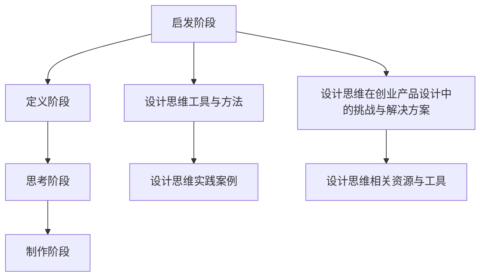

                 

### 设计思维：概念与原则

**设计思维**是一种以用户为中心的系统性思维方式，旨在通过创造性的解决方案解决复杂问题。它不仅关注产品的功能性和可用性，更强调用户体验和情感共鸣。设计思维的核心在于通过不断的迭代和反思，逐步优化产品设计，以满足用户需求并创造商业价值。

#### **1.1 设计思维的起源与发展**

设计思维起源于工业设计领域，20世纪初，以美国设计师迪特·拉姆斯（Dieter Rams）为代表的北欧设计运动，提出了“少即是多”的设计理念，强调简约、功能性和可持续性。随着时代的发展，设计思维逐渐从工业设计扩展到产品设计、用户体验设计、服务设计等多个领域。

2009年，美国斯坦福大学D-School提出“设计思维”概念，将设计思维作为解决复杂社会问题的一种方法论，并广泛应用于教育、商业、医疗等多个领域。设计思维在这一过程中不断发展，逐渐形成了一套完整的理论体系和实践方法。

#### **1.2 设计思维的核心原则**

设计思维的核心原则可以归纳为以下几点：

1. **以用户为中心**：设计思维强调关注用户需求，将用户置于设计的核心位置，通过深入了解用户的行为、需求和痛点，指导产品设计和创新。

2. **迭代与反思**：设计思维是一个循环往复的过程，通过不断的迭代和反思，逐步优化产品设计。这种方法不仅提高了设计的准确性，也使设计过程更加灵活和适应变化。

3. **跨学科协作**：设计思维强调跨学科的团队合作，通过多角度、多领域的思维碰撞，激发创意和解决问题的能力。

4. **快速原型与测试**：设计思维鼓励快速构建原型并进行用户测试，通过实践验证设计的可行性，及时发现问题并进行修正。

5. **实验与试错**：设计思维鼓励实验和试错，将失败视为学习和成长的机会，通过不断尝试和优化，找到最佳解决方案。

#### **1.3 设计思维与创业产品设计的关系**

在创业产品设计中，设计思维扮演着至关重要的角色。以下从几个方面阐述设计思维与创业产品设计的关系：

1. **问题定义与市场调研**：设计思维强调以用户需求为导向，通过深入了解用户和市场，准确把握创业机会，避免盲目跟风和资源浪费。

2. **产品原型与迭代**：设计思维鼓励快速构建原型并进行用户测试，通过不断的迭代和优化，提高产品的市场竞争力。

3. **团队协作与创新**：设计思维强调跨学科的团队合作，通过多元化的思维碰撞，激发创新潜能，提高创业团队的整体创新能力。

4. **用户体验与用户留存**：设计思维关注用户体验，通过不断优化产品设计，提高用户满意度，增加用户留存率，为创业产品的持续发展奠定基础。

5. **市场反馈与持续改进**：设计思维强调及时收集用户反馈，根据市场变化不断调整和优化产品设计，确保创业产品能够适应市场变化，持续满足用户需求。

综上所述，设计思维在创业产品设计中具有重要的应用价值，通过以用户为中心、迭代优化、跨学科协作等核心原则，帮助创业者更好地应对市场挑战，实现产品的持续迭代和商业成功。

#### **2. 设计思维在创业产品设计中的应用**

创业产品设计的核心在于解决用户需求、创造用户价值和实现商业目标。设计思维作为一种系统性、创造性的方法论，为创业产品设计提供了有力的工具和框架。以下是设计思维在创业产品设计中的具体应用：

##### **2.1 创业产品设计中的挑战与机遇**

创业产品设计面临的挑战和机遇主要集中在以下几个方面：

1. **市场不确定性与用户需求的变化**：初创企业在市场竞争中往往面临不确定性，用户需求也在不断变化，如何快速适应市场变化、满足用户需求成为关键挑战。

2. **资源有限**：初创企业通常在资金、人力资源等方面受限，如何在有限的资源下进行高效的设计和创新，确保产品质量和用户体验，是创业者需要面对的重要问题。

3. **产品迭代与优化**：创业产品通常需要经历多次迭代和优化，如何快速构建原型、进行用户测试和迭代，以确保产品能够持续满足用户需求并具备市场竞争力。

4. **团队协作与沟通**：创业团队往往由不同背景和专业领域的成员组成，如何进行有效的团队协作和沟通，确保设计思路的一致性和执行力，是产品设计成功的关键。

5. **用户体验与用户留存**：初创企业需要关注用户体验，通过设计思维中的同理心和用户研究，深入了解用户需求和行为，提高用户满意度和留存率。

##### **2.2 设计思维在创业项目规划中的应用**

在创业项目规划阶段，设计思维的应用主要体现在以下几个方面：

1. **问题定义与机会识别**：设计思维强调以用户需求为导向，通过用户研究和市场调研，准确识别创业机会和用户痛点，为项目规划提供方向。

2. **用户画像与目标用户**：通过创建用户画像，明确目标用户群体，深入了解其行为、需求和痛点，为产品设计提供依据。

3. **功能规划与优先级排序**：根据用户需求和项目目标，明确产品功能模块，并进行优先级排序，确保资源投入集中在关键功能和用户痛点上。

4. **风险评估与应对策略**：在设计过程中，识别潜在的风险和问题，并制定相应的应对策略，降低项目风险。

5. **资源分配与时间规划**：根据项目目标和资源状况，合理分配人力资源和资金，制定项目进度计划，确保项目顺利进行。

##### **2.3 设计思维在产品迭代中的应用**

在产品迭代阶段，设计思维的应用主要体现在以下几个方面：

1. **快速原型与用户测试**：设计思维鼓励快速构建原型并进行用户测试，通过实际操作和反馈，验证产品设计的可行性和用户满意度。

2. **迭代优化与反馈循环**：通过用户测试和反馈，不断优化产品设计，形成反馈循环，确保产品持续改进和用户需求的满足。

3. **敏捷开发与迭代迭代**：采用敏捷开发方法，快速迭代和交付产品功能，根据用户反馈和市场需求，灵活调整开发方向。

4. **团队协作与知识共享**：设计思维强调跨学科团队合作，通过知识共享和协作，提高团队整体创新能力和执行力。

5. **用户留存与产品持续改进**：通过设计思维中的用户研究和同理心，深入了解用户需求和行为，提高用户满意度和留存率，推动产品持续改进。

总之，设计思维在创业产品设计中的应用，不仅有助于解决创业过程中的各种挑战，还能提高产品的市场竞争力，实现商业成功。通过以用户为中心、迭代优化和跨学科协作等核心原则，创业者可以更好地应对市场变化，实现产品的持续迭代和商业成功。

#### **3. 设计思维工作流程**

设计思维是一种系统性、循环性的方法论，其核心在于通过一系列结构化的步骤，从问题定义到解决方案的迭代和优化。设计思维的工作流程可以分为四个主要阶段：启发阶段、定义阶段、思考阶段和制作阶段。以下是每个阶段的详细解析。

##### **3.1 启发阶段**

**3.1.1 发现问题**

在设计思维的启发阶段，首先需要明确问题。这一步骤包括发现和识别当前存在的问题或挑战。问题的来源可以是用户调研、市场分析、用户反馈、团队讨论等。通过多方面的信息收集，确保问题定义的准确性和全面性。

**3.1.2 理解用户需求**

在发现问题后，下一步是深入理解用户需求。这不仅仅是了解用户想要什么，更重要的是了解用户为什么想要它。通过用户访谈、用户调研、用户行为分析等方法，获取用户对产品或服务的真实感受和需求，从而为后续的设计提供依据。

**3.1.3 建立用户画像**

建立用户画像是一个重要的步骤，它有助于设计团队更深入地了解目标用户。用户画像包括用户的年龄、性别、职业、生活习惯、行为特征等多个方面。通过绘制用户画像，可以更好地把握用户需求，确保设计决策与用户实际需求相符。

##### **3.2 定义阶段**

**3.2.1 设定目标**

在定义阶段，需要明确项目目标和设计目标。项目目标通常包括商业目标、用户体验目标等，而设计目标则具体到产品的功能、界面、交互等方面。设定明确的目标有助于指导设计工作，确保最终产品能够满足预期。

**3.2.2 定义项目范围**

项目范围定义是指明确项目的边界和限制。这包括功能范围、时间范围、预算范围等。通过定义项目范围，可以避免设计过程中的资源浪费和时间延误，确保项目能够按时、按预算完成。

**3.2.3 确定关键指标**

关键指标（KPI）是衡量项目成功与否的重要标准。在设计思维的定义阶段，需要确定能够量化评估项目成功的关键指标，如用户满意度、市场占有率、用户留存率等。这些指标将在后续的设计迭代过程中持续跟踪和优化。

##### **3.3 思考阶段**

**3.3.1 创意生成**

思考阶段是设计思维的核心环节，旨在通过发散性思维和创意生成，提出各种可能的解决方案。这一步骤可以采用头脑风暴、思维导图、创意卡片等方法，鼓励团队成员自由发挥，提出各种创新的想法。

**3.3.2 方案评估**

在创意生成后，需要对各种方案进行评估。评估标准包括可行性、创新性、用户满意度、成本效益等。通过筛选和评估，选择最优的方案进行进一步开发。

**3.3.3 原型设计**

原型设计是将方案转化为实际可操作的产品模型的过程。这个阶段的原型可以是低保真度原型、中保真度原型，甚至是高保真度原型。原型设计不仅有助于验证方案可行性，还可以通过用户测试，收集用户反馈，为后续优化提供依据。

##### **3.4 制作阶段**

**3.4.1 原型构建**

原型构建阶段是将设计方案转化为实际产品的过程。这个阶段需要技术团队进行编码、界面设计、交互设计等，确保原型能够正常运行。

**3.4.2 用户测试**

用户测试是验证产品设计和功能的重要步骤。通过让真实用户使用产品，收集用户的反馈和意见，可以及时发现问题和不足，并进行优化。

**3.4.3 反馈迭代**

用户测试后的反馈是设计思维循环迭代的关键。根据用户反馈，对产品进行优化和改进，然后再次进行用户测试，形成反馈循环。这个过程将不断重复，直到产品达到预期的质量和用户体验。

通过设计思维的四个阶段，创业者可以系统地分析和解决产品设计中的问题，提高产品的市场竞争力，实现商业成功。设计思维的核心在于以用户为中心、不断迭代和优化，确保产品设计能够真正满足用户需求，创造用户价值。

#### **4. 设计思维工具与应用**

在设计思维过程中，使用合适的工具和方法可以大大提高工作效率和设计质量。以下是设计思维中常用的一些工具和应用：

##### **4.1 用户画像工具**

**4.1.1 用户画像的定义与作用**

用户画像是指对目标用户进行详细描述的过程，通常包括用户的年龄、性别、职业、生活习惯、行为特征等多个方面。通过用户画像，设计团队能够更深入地了解目标用户，从而为产品设计提供有力的支持。

**4.1.2 用户画像的制作方法**

1. **用户调研**：通过问卷调查、用户访谈、焦点小组等方法，收集用户的基本信息和行为数据。

2. **数据分析**：利用数据分析工具（如Excel、SPSS等），对收集到的用户数据进行整理和分析。

3. **用户画像绘制**：根据分析结果，绘制用户画像，包括用户的基本信息、行为特征、需求等。

##### **4.2 用户调研工具**

**4.2.1 用户调研的目的与方法**

用户调研的目的是了解用户的需求、行为和痛点，为产品设计提供依据。常用的用户调研方法包括：

1. **问卷调查**：通过在线或离线方式收集用户反馈，获取大量数据。

2. **用户访谈**：与目标用户进行一对一或小组讨论，深入了解用户需求和行为。

3. **焦点小组**：邀请一组用户参与讨论，探讨产品设计和功能。

**4.2.2 用户调研的工具与技巧**

1. **问卷调查工具**：如Google表格、问卷星、金数据等，可以方便地创建、分发和收集问卷。

2. **用户访谈工具**：如Zoom、Skype等视频会议工具，可以进行远程用户访谈。

3. **访谈提纲**：设计详细的访谈提纲，确保访谈内容系统全面。

##### **4.3 原型设计工具**

**4.3.1 原型设计的重要性**

原型设计是产品设计过程中的重要环节，它可以帮助设计团队验证设计思路和方案，发现潜在问题，提高设计的可行性和用户体验。

**4.3.2 原型设计的工具选择**

1. **低保真度原型工具**：如Sketch、Figma等，适用于快速搭建界面布局和交互逻辑。

2. **中保真度原型工具**：如Axure、Mockplus等，可以创建接近实际产品的原型，适用于详细交互设计和测试。

3. **高保真度原型工具**：如Adobe XD、Figma等，可以创建高度逼真的原型，适用于最终设计和用户测试。

通过这些工具和方法，设计团队可以更加高效地完成设计思维中的各个步骤，确保产品设计符合用户需求，具有市场竞争力。

#### **5. 设计思维方法详解**

设计思维方法是一种以用户为中心的系统化方法论，通过一系列结构化的步骤，实现从问题定义到解决方案的迭代和优化。以下是设计思维方法的详细解析，包括快速迭代与迭代思维、同理心与用户研究、创新思维与创意生成。

##### **5.1 快速迭代与迭代思维**

**5.1.1 迭代思维的基本原理**

迭代思维是设计思维的核心原则之一，它强调通过反复的试验和优化，逐步完善产品设计。迭代思维的基本原理可以概括为以下几个步骤：

1. **问题定义**：明确设计目标和用户需求，界定需要解决的问题。

2. **方案设计**：基于问题定义，提出各种可能的解决方案。

3. **原型构建**：快速构建原型，验证方案的基本可行性。

4. **用户测试**：通过用户测试，收集用户反馈，评估方案的适用性和用户体验。

5. **反馈优化**：根据用户反馈，对设计方案进行优化和调整。

6. **再次迭代**：将优化后的方案再次进行用户测试，形成循环往复的迭代过程。

**5.1.2 迭代在创业产品设计中的应用**

在创业产品设计过程中，迭代思维的应用尤为重要。以下是一些具体的实践方法：

1. **快速原型开发**：使用低保真度原型工具，快速构建产品原型，以便快速验证设计思路。

2. **用户测试反馈**：定期进行用户测试，收集用户反馈，及时发现和解决问题。

3. **敏捷开发**：采用敏捷开发方法，灵活调整开发方向，确保产品能够快速适应市场变化。

4. **持续集成与部署**：通过持续集成与部署，确保每次迭代都能快速上线，便于用户测试和反馈。

通过快速迭代，创业团队可以不断优化产品设计，提高产品的市场竞争力，确保产品能够更好地满足用户需求。

##### **5.2 同理心与用户研究**

**5.2.1 同理心的概念与意义**

同理心是指站在用户的角度，理解和感受用户的需求和情感。同理心在设计思维中具有重要意义，因为它可以帮助设计团队更加深入地了解用户，从而设计出更符合用户期望的产品。

**5.2.2 用户研究的方法与技巧**

1. **用户访谈**：通过与目标用户进行一对一或小组访谈，深入了解用户的需求、行为和痛点。

2. **用户调研**：通过问卷调查、用户调研报告等，收集大量用户数据，进行数据分析。

3. **用户行为分析**：通过分析用户在产品上的行为数据，了解用户的使用习惯和偏好。

4. **情境模拟**：创建用户使用产品的情境，观察用户的行为和反馈，模拟真实使用场景。

5. **用户画像**：基于用户研究数据，绘制用户画像，明确目标用户群体，为设计提供依据。

通过同理心和用户研究，设计团队可以更好地把握用户需求，确保产品设计符合用户期望，提高用户满意度。

##### **5.3 创新思维与创意生成**

**5.3.1 创新思维的重要性**

创新思维是设计思维的核心，它强调通过创造性的解决方案，解决复杂问题。创新思维的重要性在于：

1. **提高产品设计竞争力**：通过创新思维，设计出独特的产品功能和用户体验，提高产品的市场竞争力。

2. **满足用户多元化需求**：创新思维可以挖掘用户未满足的需求，提供更好的产品解决方案。

3. **推动产业进步**：创新思维可以带动相关产业的技术进步和商业模式创新。

**5.3.2 创意生成的方法与实践**

1. **头脑风暴**：鼓励团队成员自由发表创意，通过思维碰撞，激发创意。

2. **思维导图**：使用思维导图工具，将创意和想法可视化，便于整理和梳理。

3. **设计竞赛**：组织设计竞赛，鼓励团队成员提出创新方案，激发创造力。

4. **创意卡片**：使用创意卡片，将各种创意记录下来，方便筛选和整理。

5. **借鉴与模仿**：从其他领域和产品中汲取灵感，进行创新和改进。

通过创新思维和创意生成，设计团队可以不断探索新的设计方向，提供独特的解决方案，推动产品设计的发展。

综上所述，设计思维方法通过快速迭代、同理心与用户研究、创新思维与创意生成，帮助设计团队更有效地解决产品设计中的问题，提高产品的市场竞争力，实现商业成功。

### **6. 设计思维在创业产品中的成功应用**

设计思维作为一种系统性、创造性的方法论，在创业产品中得到了广泛的应用，并取得了显著的成效。以下是两个具体案例，展示了设计思维在不同领域的成功应用。

##### **6.1 案例一：智能家居产品的设计**

**6.1.1 案例背景**

智能家居产品作为物联网（IoT）领域的重要组成部分，近年来得到了快速发展。然而，如何在激烈的市场竞争中脱颖而出，成为创业企业面临的重要挑战。

**6.1.2 用户调研与需求分析**

为了设计出符合用户需求的智能家居产品，创业团队进行了深入的用户调研。通过用户访谈、问卷调查和用户行为分析，团队发现用户对智能家居产品的需求主要集中在以下几个方面：

1. **便利性**：用户希望智能家居产品能够简化日常操作，提高生活便利性。

2. **易用性**：用户对产品的操作界面和交互设计有较高的要求，希望产品易于上手和使用。

3. **安全性**：用户对智能家居产品的安全性有较高关注，担心数据泄露和设备被恶意攻击。

**6.1.3 原型设计与用户测试**

基于用户调研结果，创业团队设计了多个原型，包括智能灯泡、智能门锁、智能摄像头等。在原型设计过程中，团队采用了低保真度和中保真度原型，以便快速验证设计思路和功能。

随后，团队进行了用户测试，邀请目标用户使用产品并进行反馈。通过用户测试，团队发现了以下问题：

1. **操作复杂**：部分用户反映产品操作过于复杂，难以快速上手。

2. **兼容性问题**：部分智能家居产品与其他设备存在兼容性问题，无法实现无缝连接。

3. **隐私保护**：用户对隐私保护有较高要求，担心设备监控自己的行为。

**6.1.4 产品迭代与市场反馈**

基于用户测试反馈，创业团队对产品进行了多次迭代和优化。具体措施包括：

1. **简化操作界面**：优化产品界面设计，提高易用性。

2. **增加兼容性**：与更多设备进行对接，提高产品的兼容性。

3. **加强隐私保护**：增强数据加密和隐私保护措施，提高用户信任度。

在产品迭代过程中，创业团队继续进行用户测试，并根据市场反馈进行调整。经过多次迭代，智能家居产品的用户体验得到了显著提升，市场反馈也变得更加积极。

##### **6.2 案例二：在线教育平台的设计**

**6.2.1 案例背景**

在线教育作为新兴教育模式，受到了越来越多用户的关注。然而，如何提供高质量的教育内容，提高用户的学习体验，成为在线教育平台创业企业面临的重要挑战。

**6.2.2 用户调研与需求分析**

为了设计出满足用户需求的在线教育平台，创业团队进行了全面的用户调研。通过用户访谈、问卷调查和用户行为分析，团队发现用户对在线教育平台的需求主要集中在以下几个方面：

1. **课程质量**：用户对课程内容的质量有较高要求，希望获得高质量的教育资源。

2. **学习灵活性**：用户希望学习时间灵活，可以根据自己的时间安排进行学习。

3. **互动性**：用户希望在线教育平台能够提供丰富的互动功能，提高学习体验。

**6.2.3 原型设计与用户测试**

基于用户调研结果，创业团队设计了多个在线教育平台原型，包括课程展示界面、互动功能模块、学习进度跟踪系统等。在原型设计过程中，团队采用了低保真度和中保真度原型，以便快速验证设计思路和功能。

随后，团队进行了用户测试，邀请目标用户使用平台并进行反馈。通过用户测试，团队发现了以下问题：

1. **课程内容不丰富**：部分用户反映课程内容不够丰富，难以满足多样化的学习需求。

2. **学习过程枯燥**：用户反馈学习过程过于单调，缺乏互动性。

3. **学习进度跟踪不准确**：部分用户反映学习进度跟踪系统不准确，影响学习效果。

**6.2.4 产品迭代与市场反馈**

基于用户测试反馈，创业团队对在线教育平台进行了多次迭代和优化。具体措施包括：

1. **丰富课程内容**：引入更多优质课程，满足用户多样化的学习需求。

2. **增加互动功能**：提供丰富的互动功能，如在线讨论区、问答环节等，提高学习体验。

3. **优化学习进度跟踪**：改进学习进度跟踪系统，确保准确记录用户的学习进度。

在产品迭代过程中，创业团队继续进行用户测试，并根据市场反馈进行调整。经过多次迭代，在线教育平台的学习体验得到了显著提升，市场反馈也变得更加积极。

**6.3 总结**

通过以上两个案例，我们可以看到设计思维在创业产品中的成功应用。设计思维帮助创业团队深入了解用户需求，通过不断的迭代和优化，提高产品的市场竞争力。在创业过程中，设计思维不仅是解决问题的重要工具，更是实现商业成功的基石。

#### **7. 设计思维在创业产品设计中的挑战与解决方案**

在设计思维在创业产品设计过程中，尽管其具有显著的优越性，但仍然面临诸多挑战。以下将详细探讨这些挑战，并针对性地提出解决方案。

##### **7.1 如何平衡用户需求与商业目标**

**7.1.1 问题阐述**

在创业产品设计中，平衡用户需求与商业目标是一个关键挑战。用户需求往往多样化且多变，而商业目标则需要考虑市场定位、盈利模式、资源限制等因素。如何在满足用户需求的同时，实现商业成功，是创业者需要面对的难题。

**7.1.2 解决方案与实践**

1. **用户需求优先级排序**：首先，明确用户需求的重要性和紧迫性，将需求按照优先级进行排序。对于核心功能和高频使用场景，给予更高的关注和资源投入。

2. **目标分解与实现策略**：将商业目标分解为具体可操作的任务，制定实现策略。通过逐步实现各个小目标，最终实现整体商业目标。

3. **用户反馈与迭代优化**：持续收集用户反馈，根据用户需求进行产品迭代和优化。通过反馈循环，及时调整产品设计和功能，确保产品既能满足用户需求，又能实现商业目标。

##### **7.2 如何在资源有限的情况下进行高效设计**

**7.2.1 问题阐述**

初创企业在资源有限的情况下，如何在预算、人力和时间等方面进行高效的设计，是另一大挑战。资源限制可能导致设计工作无法顺利进行，影响产品质量和进度。

**7.2.2 解决方案与实践**

1. **敏捷开发与迭代**：采用敏捷开发方法，通过快速迭代和持续交付，确保产品在有限资源下能够逐步完善。敏捷开发强调灵活性和适应性，有助于在资源有限的情况下实现高效设计。

2. **优先级管理**：合理分配资源，优先处理关键功能和用户痛点的优化。通过优先级管理，确保资源投入能够带来最大的价值。

3. **团队协作与分工**：建立高效团队合作机制，明确分工和职责，提高团队协作效率。通过团队合作，弥补资源不足的短板。

4. **利用开源工具和资源**：充分利用开源工具和资源，降低开发和维护成本。例如，使用开源框架和库，减少从零开始的开发和测试时间。

##### **7.3 如何确保产品设计的可持续性**

**7.3.1 问题阐述**

产品设计的可持续性是长期商业成功的关键因素。然而，在创业环境中，资源有限、时间紧迫，可能导致产品设计缺乏长远规划，影响产品的可持续性和生命力。

**7.3.2 解决方案与实践**

1. **长期规划与目标设定**：在产品设计中，设定长期目标和规划，确保产品设计不仅仅满足短期需求，还能够适应未来市场变化。通过长期规划，为产品设计的可持续性奠定基础。

2. **模块化设计**：采用模块化设计方法，将产品功能模块化，提高设计的灵活性和可扩展性。模块化设计不仅有助于降低开发成本，还能提高产品的可持续性和可维护性。

3. **可持续性评估**：在产品设计过程中，定期进行可持续性评估，检查产品在功能、性能、成本、环境等方面是否符合可持续性要求。通过持续评估，及时发现和解决可持续性问题。

4. **用户反馈与持续改进**：通过用户反馈和持续改进，确保产品能够持续满足用户需求，同时提高产品的可持续性和用户体验。用户反馈是设计改进的重要依据，有助于优化产品设计，提升产品的可持续性。

总之，设计思维在创业产品设计中的应用，虽然面临诸多挑战，但通过合理的解决方案和实践，可以有效地克服这些困难，确保产品设计的成功和企业的长期发展。

### **8. 设计思维相关资源与工具**

在设计和实施设计思维的过程中，利用合适的书籍、在线课程、社区和工具，可以大大提升工作效率和效果。以下是一些推荐资源，帮助设计思维的实践者更好地应用和深化设计思维。

#### **8.1 设计思维书籍推荐**

1. **《设计思维：创新设计的方法论》（Design Thinking: A Common Sense Approach to Problem Solving and Creativity）** - Tim Brown
   - 这本书详细介绍了设计思维的起源、原则和实践方法，适合初学者深入了解设计思维。

2. **《设计思维实战手册》（Design Thinking for Business）** - Lisa Hong
   - 本书结合实际案例，介绍了设计思维在企业中的应用，提供了实用的方法和工具。

3. **《设计思维与创造力培养》（Creative Confidence）** - Tom and David Kelly
   - 本书讲述了设计思维如何激发创造力和创新，对设计师和非设计师都非常有启发性。

#### **8.2 设计思维在线课程**

1. **斯坦福大学D-School设计思维课程** - Stanford University
   - 该课程由斯坦福大学D-School提供，涵盖了设计思维的基础理论、实践方法和案例分析。

2. **Coursera上的设计思维课程** - Coursera
   - Coursera上有多门关于设计思维的课程，包括《设计思维与产品设计》等，适合不同层次的学习者。

3. **edX上的设计思维课程** - edX
   - edX提供的《设计思维与创新解决方案》课程，涵盖了设计思维的各个方面，并提供实践项目。

#### **8.3 设计思维社区与论坛**

1. **设计思维社区** - Design Thinking Community
   - 这是一个专门针对设计思维交流的社区，提供设计思维资源、案例分析、讨论区等。

2. **Behance** - Behance
   - 作为创意设计的展示平台，Behance上有大量设计案例，可以启发设计思维的应用。

3. **UI/UX设计社区** - Dribbble
   - Dribbble是一个设计师展示和交流的平台，设计思维的应用案例和灵感在这里可以找到。

#### **8.4 设计思维工具集锦**

1. **Miro** - Miro
   - Miro是一个在线协作工具，适合团队进行头脑风暴、思维导图、用户画像等活动。

2. **Figma** - Figma
   - Figma是一个流行的UI/UX设计工具，支持协作设计和原型制作，适合设计思维实践。

3. **Mural** - Mural
   - Mural是一个视觉化的协作工具，可以帮助团队创建思维导图、用户画像等，支持多人实时协作。

4. **Sketch** - Sketch
   - Sketch是一个专业的UI/UX设计工具，适用于创建高保真度原型，适合设计思维中的原型设计环节。

通过这些书籍、在线课程、社区和工具，设计思维的实践者可以系统地学习和应用设计思维方法，提高产品设计质量和效率，实现创新和商业成功。

#### **Mermaid 流程图**

以下是一个使用Mermaid语言编写的流程图示例，展示了设计思维工作流程的四个阶段：

该流程图清晰地展示了设计思维的各个阶段和关键步骤，便于理解和实施。通过Mermaid语言，可以在Markdown文档中嵌入这种可视化流程图，增强文章的可读性和直观性。

