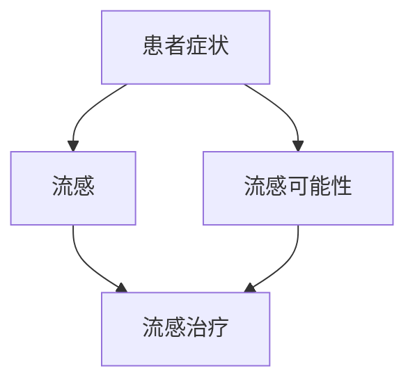
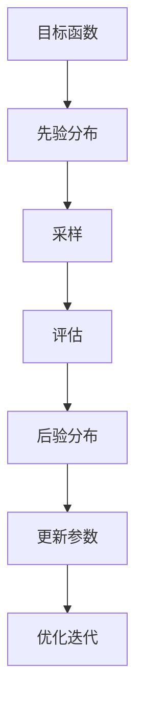
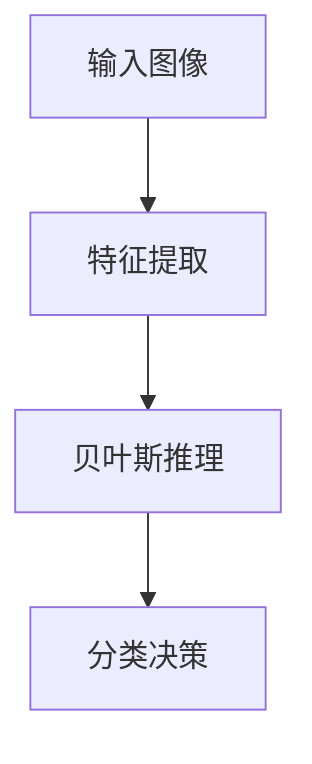
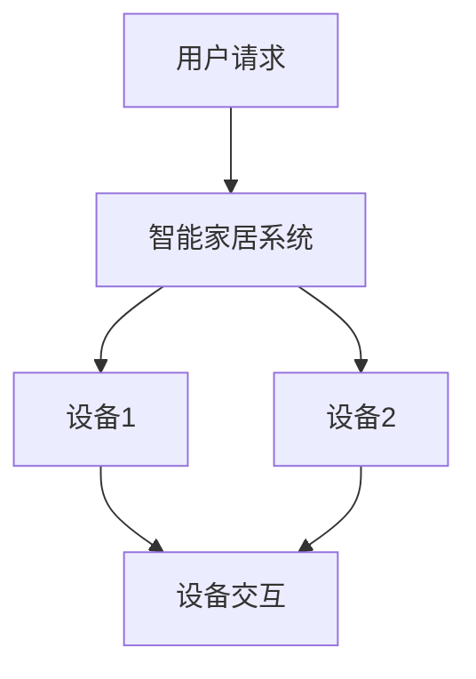

                 

## 《贝叶斯概率理论在AI中的应用方法》

### 关键词：贝叶斯概率、人工智能、应用方法、机器学习、深度学习

> **摘要**：本文将深入探讨贝叶斯概率理论在人工智能（AI）领域的应用方法。从基础理论出发，详细介绍了贝叶斯网络、高斯贝叶斯分类器和贝叶斯优化等核心概念及其在AI中的应用。随后，进一步扩展到机器学习、深度学习、自然语言处理、计算机视觉和AI安全与隐私保护等应用领域，并通过实际案例展示贝叶斯概率理论在AI项目中的实战应用。本文旨在为读者提供系统、全面、深入的贝叶斯概率理论在AI中的实践指南。

### 目录

#### 第一部分：贝叶斯概率理论基础

1. 贝叶斯概率理论简介  
   1.1 贝叶斯概率的基本概念  
   1.2 贝叶斯定理  
   1.3 贝叶斯模型的构建

2. 贝叶斯概率在AI中的应用  
   2.1 贝叶斯网络  
   2.2 高斯贝叶斯分类器  
   2.3 贝叶斯优化

#### 第二部分：贝叶斯概率理论在AI领域中的应用

3. 贝叶斯概率理论在机器学习中的应用  
   3.1 贝叶斯机器学习概述  
   3.2 贝叶斯线性回归  
   3.3 贝叶斯支持向量机

4. 贝叶斯概率理论在深度学习中的应用  
   4.1 深度学习中的贝叶斯方法  
   4.2 贝叶斯深度神经网络

5. 贝叶斯概率理论在自然语言处理中的应用  
   5.1 贝叶斯自然语言处理概述  
   5.2 贝叶斯语言模型

6. 贝叶斯概率理论在计算机视觉中的应用  
   6.1 贝叶斯计算机视觉概述  
   6.2 贝叶斯目标检测

7. 贝叶斯概率理论在AI安全与隐私保护中的应用  
   7.1 贝叶斯概率理论在AI安全中的作用  
   7.2 贝叶斯隐私保护机制

#### 第三部分：贝叶斯概率理论在AI项目中的应用实践

8. 贝叶斯概率理论在AI项目中的实际应用案例  
   8.1 案例一：基于贝叶斯网络的智能医疗诊断系统  
   8.2 案例二：使用贝叶斯优化算法的自动驾驶系统优化  
   8.3 案例三：基于贝叶斯深度神经网络的图像分类系统  
   8.4 案例四：利用贝叶斯概率理论的智能家居控制系统

9. 贝叶斯概率理论在AI项目开发中的挑战与解决策略

10. 贝叶斯概率理论在AI项目中的未来发展展望

#### 附录

A. 贝叶斯概率理论相关参考资料

### 结尾语

贝叶斯概率理论在人工智能领域的广泛应用，为解决复杂问题提供了新的思路和方法。本文从基础理论到应用实践，全面介绍了贝叶斯概率理论在AI领域的各个方面，旨在帮助读者深入了解并掌握这一重要的AI工具。随着AI技术的不断发展，贝叶斯概率理论在AI领域的应用将更加广泛和深入，本文将为读者提供有力的理论支持和实践指导。

---

**作者：** AI天才研究院/AI Genius Institute & 禅与计算机程序设计艺术 /Zen And The Art of Computer Programming## 第一部分：贝叶斯概率理论基础

### 1. 贝叶斯概率理论简介

贝叶斯概率理论是一种基于概率的统计方法，旨在通过观察到的数据来推断未知事件的概率。它由托马斯·贝叶斯（Thomas Bayes）在18世纪首次提出，因此得名。贝叶斯概率理论的核心是贝叶斯定理，该定理提供了一种计算条件概率的方法，它是整个理论的基础。

**贝叶斯概率的基本概念**

在贝叶斯概率理论中，有几个基本的概念：

- **概率分布**：描述一个随机变量可能的取值及其对应的概率。
- **条件概率**：在某个事件已经发生的前提下，另一个事件发生的概率。
- **边缘概率**：不考虑其他事件的情况下，一个事件发生的概率。
- **贝叶斯概率**：在已知边缘概率和条件概率的情况下，通过贝叶斯定理计算出的某个事件的概率。

**贝叶斯定理**

贝叶斯定理是贝叶斯概率理论的核心，其公式为：

\[ P(A|B) = \frac{P(B|A) \cdot P(A)}{P(B)} \]

其中，\( P(A|B) \) 是在事件B发生的条件下事件A发生的概率，\( P(B|A) \) 是在事件A发生的条件下事件B发生的概率，\( P(A) \) 是事件A的边缘概率，\( P(B) \) 是事件B的边缘概率。

**贝叶斯模型的构建**

贝叶斯模型通常由以下部分构成：

- **先验概率**：基于专家知识和历史数据对某一事件发生的初始概率估计。
- **似然函数**：观察到的数据在给定模型参数下的概率密度函数。
- **后验概率**：结合先验概率和似然函数计算得到的模型参数的概率分布。

### 1.1 贝叶斯概率的基本概念

贝叶斯概率的基本概念包括概率分布、条件概率、边缘概率和贝叶斯概率。这些概念在贝叶斯概率理论中扮演着重要角色。

- **概率分布**：描述一个随机变量可能的取值及其对应的概率。例如，掷一枚公平的硬币，正面朝上的概率分布为 {正面：0.5，反面：0.5}。

- **条件概率**：在某个事件已经发生的前提下，另一个事件发生的概率。例如，在掷硬币的例子中，如果已知硬币正面朝上，则反面朝上的条件概率为 0。

- **边缘概率**：不考虑其他事件的情况下，一个事件发生的概率。例如，掷硬币正面朝上的边缘概率为 0.5。

- **贝叶斯概率**：在已知边缘概率和条件概率的情况下，通过贝叶斯定理计算得到的某个事件的概率。例如，根据贝叶斯定理，可以通过先验概率和似然函数计算得到硬币正面朝上的后验概率。

### 1.2 贝叶斯定理

贝叶斯定理是贝叶斯概率理论的核心，它提供了计算条件概率的方法。贝叶斯定理的公式为：

\[ P(A|B) = \frac{P(B|A) \cdot P(A)}{P(B)} \]

其中，\( P(A|B) \) 是在事件B发生的条件下事件A发生的概率，\( P(B|A) \) 是在事件A发生的条件下事件B发生的概率，\( P(A) \) 是事件A的边缘概率，\( P(B) \) 是事件B的边缘概率。

贝叶斯定理的应用非常广泛，例如在医学诊断中，可以通过贝叶斯定理计算某种疾病在出现特定症状下的概率。此外，贝叶斯定理还在机器学习、数据分析、决策论等领域中发挥着重要作用。

### 1.3 贝叶斯模型的构建

贝叶斯模型是贝叶斯概率理论的实际应用，它由先验概率、似然函数和后验概率三部分组成。

- **先验概率**：是专家知识或历史数据的概率分布，用于初始化模型参数。例如，在疾病诊断中，先验概率可能是某种疾病在总人口中的发病率。

- **似然函数**：是观察到的数据在给定模型参数下的概率密度函数。它用于更新先验概率，使其更符合观察到的数据。例如，在疾病诊断中，似然函数可能是特定症状在某种疾病患者中的出现概率。

- **后验概率**：是结合先验概率和似然函数计算得到的模型参数的概率分布。它是贝叶斯模型的核心，用于预测未知事件发生的概率。例如，在疾病诊断中，后验概率可能是某种疾病在出现特定症状下的概率。

构建贝叶斯模型通常涉及以下步骤：

1. **确定先验概率**：基于专家知识和历史数据，初始化模型参数的概率分布。
2. **收集数据并构建似然函数**：观察实际数据，构建似然函数，使其能够反映数据与模型参数之间的关系。
3. **计算后验概率**：通过贝叶斯定理计算模型参数的后验概率分布。
4. **预测和推断**：利用后验概率进行预测和推断，解决实际问题。

贝叶斯模型在机器学习、数据分析、决策支持等领域中具有广泛的应用。例如，在机器学习中，贝叶斯模型可以用于分类和回归任务，通过不断更新模型参数，使其能够适应新的数据；在数据分析中，贝叶斯模型可以用于统计推断，提供更可靠的结论；在决策支持中，贝叶斯模型可以用于风险评估和决策制定，为决策者提供科学的依据。

### 总结

贝叶斯概率理论是一种基于概率的统计方法，通过贝叶斯定理计算条件概率，从而推断未知事件的概率。贝叶斯模型由先验概率、似然函数和后验概率组成，能够有效地处理不确定性和复杂问题。在人工智能领域，贝叶斯概率理论具有广泛的应用，包括机器学习、深度学习、自然语言处理、计算机视觉和AI安全与隐私保护等。在接下来的部分，我们将进一步探讨贝叶斯概率理论在人工智能中的应用。|>## 第二部分：贝叶斯概率理论在AI中的应用

### 2.1 贝叶斯网络

贝叶斯网络是一种基于概率图模型的结构，用于表示一组变量之间的条件依赖关系。在贝叶斯网络中，每个节点表示一个随机变量，而边表示变量之间的条件概率关系。贝叶斯网络的主要优势在于其直观性和灵活性，能够有效地处理复杂的不确定性问题和推理问题。

#### 2.1.1 贝叶斯网络的基本概念

贝叶斯网络由以下部分组成：

- **节点**：每个节点表示一个随机变量，通常用字母表示，如 X、Y。
- **边**：表示变量之间的依赖关系，有向边表示条件概率，无向边表示边际概率。
- **条件概率表**：每个节点的条件概率表（CPT）描述了该节点在不同状态下的概率分布，根据边的关系，可以计算出变量之间的条件概率。

**贝叶斯网络的基本结构**

贝叶斯网络可以表示为有向无环图（DAG），其中：

- **有向性**：表示变量之间的因果关系。
- **无环性**：确保变量之间的依赖关系是树状结构，避免了循环依赖。

#### 2.1.2 贝叶斯网络的构建

构建贝叶斯网络的步骤如下：

1. **确定变量和关系**：根据问题域，确定需要表示的变量和它们之间的依赖关系。
2. **绘制图结构**：根据变量和关系，绘制贝叶斯网络图，其中每个节点表示一个变量，边表示条件依赖。
3. **填写条件概率表**：根据专家知识和数据，为每个节点的条件概率表提供具体的概率值。

**贝叶斯网络的构建过程示例**

假设我们要构建一个简单的贝叶斯网络，表示天气、降雨和穿着之间的关系。变量和关系如下：

- **变量**：天气（W）、降雨（R）、穿着（C）。
- **关系**：天气影响降雨，降雨影响穿着。

1. **确定变量和关系**：
   - \( W \rightarrow R \)：天气影响降雨。
   - \( R \rightarrow C \)：降雨影响穿着。

2. **绘制图结构**：

```
    C
   / \
  /   \
 W     R
```

3. **填写条件概率表**：

- \( P(W) \)：天气的概率分布。
- \( P(R|W) \)：在给定天气条件下，降雨的概率分布。
- \( P(C|R) \)：在给定降雨条件下，穿着的概率分布。

#### 2.1.3 贝叶斯网络的推理算法

贝叶斯网络的推理算法用于计算网络中变量的概率分布。以下是一些常见的推理算法：

- **边缘概率计算**：计算网络中某个变量的边缘概率。
- **条件概率计算**：计算网络中某个变量在给定其他变量条件下的条件概率。
- **信念传播算法**：基于网络结构，通过消息传递计算变量的概率分布。

**边缘概率计算**

边缘概率是指某个变量在所有可能的变量状态下的概率和。贝叶斯网络可以通过以下公式计算边缘概率：

\[ P(X) = \sum_{Y} P(X, Y) \]

其中，\( X \) 是需要计算的变量，\( Y \) 是网络中的其他变量。

**条件概率计算**

条件概率是指在给定某个变量状态下，另一个变量的概率。贝叶斯网络可以通过以下公式计算条件概率：

\[ P(X|Y) = \frac{P(X, Y)}{P(Y)} \]

其中，\( X \) 是需要计算的变量，\( Y \) 是给定条件的变量。

**信念传播算法**

信念传播算法是一种基于消息传递的推理算法，通过在网络中传递概率信息来计算变量的概率分布。算法的核心思想是：

1. **初始化**：根据先验概率为每个节点分配初始概率。
2. **消息传递**：从父节点到子节点传递概率信息。
3. **更新概率**：根据接收到的消息更新节点的概率分布。

信念传播算法可以分为两种：

- **正向传播**：从根节点开始，向下传递概率信息。
- **反向传播**：从叶子节点开始，向上传递概率信息。

**贝叶斯网络的推理算法示例**

假设我们有一个简单的贝叶斯网络，表示天气、降雨和穿着之间的关系。现在我们想要计算穿着的边缘概率。

1. **初始化**：给定先验概率，如天气的概率分布 \( P(W) \)。
2. **正向传播**：从根节点开始，向下传递概率信息，计算 \( P(W, R) \) 和 \( P(W, R, C) \)。
3. **反向传播**：从叶子节点开始，向上传递概率信息，计算 \( P(R|W) \) 和 \( P(C|R) \)。
4. **计算边缘概率**：根据边缘概率公式计算 \( P(C) \)。

通过信念传播算法，我们可以得到穿着的边缘概率 \( P(C) \)，从而进行推理和决策。

### 2.2 高斯贝叶斯分类器

高斯贝叶斯分类器是一种基于贝叶斯理论的概率分类器，特别适用于连续型特征的数据。它假设每个特征服从高斯分布（正态分布），并且特征之间相互独立。高斯贝叶斯分类器在文本分类、金融风险评估、医疗诊断等领域中具有广泛应用。

#### 2.2.1 高斯贝叶斯分类器的基本原理

高斯贝叶斯分类器的基本原理基于以下假设：

- **先验概率**：每个类别的先验概率是相等的，或者基于历史数据计算得到。
- **特征条件概率**：每个特征在给定类别条件下的概率服从高斯分布。
- **贝叶斯定理**：通过贝叶斯定理计算后验概率，选择具有最高后验概率的类别作为预测结果。

高斯贝叶斯分类器的步骤如下：

1. **训练阶段**：
   - 计算每个类别的先验概率。
   - 为每个类别计算每个特征的均值和标准差，以确定特征的条件概率分布。

2. **预测阶段**：
   - 对于新的数据点，计算其在每个类别下的后验概率。
   - 选择具有最高后验概率的类别作为预测结果。

#### 2.2.2 高斯贝叶斯分类器的建模与训练

高斯贝叶斯分类器的建模与训练过程如下：

1. **数据准备**：收集具有标签的数据集，每个样本包含多个连续型特征。
2. **特征处理**：对数据进行标准化处理，确保特征服从高斯分布。
3. **计算先验概率**：根据数据集中每个类别的样本数量计算先验概率。
4. **计算特征条件概率**：为每个类别计算每个特征的均值和标准差，以确定特征的条件概率分布。
5. **训练完成**：模型训练完成，可以使用该模型进行预测。

#### 2.2.3 高斯贝叶斯分类器的应用场景

高斯贝叶斯分类器在以下应用场景中具有显著优势：

- **文本分类**：文本数据通常具有连续性特征，如词频、词向量等，高斯贝叶斯分类器能够有效地处理这类数据。
- **金融风险评估**：金融数据通常具有连续性特征，如股票价格、交易量等，高斯贝叶斯分类器能够识别潜在的风险。
- **医疗诊断**：医疗数据通常包含连续性特征，如血压、心率等，高斯贝叶斯分类器能够辅助医生进行疾病诊断。

**高斯贝叶斯分类器的应用示例**

假设我们要使用高斯贝叶斯分类器对一组病人进行癌症诊断。数据集包含多个连续性特征，如年龄、体重、血压等。首先，我们收集具有标签的数据集，并对数据进行预处理。然后，我们计算每个类别的先验概率，以及每个特征的均值和标准差。接下来，对于新的病人数据，我们计算其在每个类别下的后验概率，并选择具有最高后验概率的类别作为诊断结果。

### 2.3 贝叶斯优化

贝叶斯优化是一种基于贝叶斯概率理论的优化方法，用于在给定约束条件下寻找最优解。贝叶斯优化广泛应用于机器学习、工程优化和实验设计等领域。

#### 2.3.1 贝叶斯优化的基本概念

贝叶斯优化的基本概念包括：

- **目标函数**：需要优化的函数，通常表示为 \( f(x) \)。
- **先验概率分布**：用于初始化目标函数的值，通常为高斯过程。
- **后验概率分布**：通过采集新的样本数据，更新先验概率分布，以反映目标函数的局部特征。
- **优化策略**：选择新的样本点，以最大化后验概率分布。

#### 2.3.2 贝叶斯优化的模型与算法

贝叶斯优化通常基于以下模型和算法：

- **高斯过程回归**：用于建模目标函数，其先验概率分布为高斯过程。
- **最大化后验概率分布**：通过选择新的样本点，最大化目标函数的后验概率分布。
- **马尔可夫决策过程**：用于选择新的样本点，以实现优化目标。

贝叶斯优化的步骤如下：

1. **初始化**：选择初始样本点，并初始化高斯过程模型。
2. **采样与评估**：根据当前模型，选择新的样本点进行评估，并更新模型。
3. **迭代**：重复步骤2，直到满足优化条件。

#### 2.3.3 贝叶斯优化在AI中的应用实例

贝叶斯优化在AI中的应用实例包括：

- **模型参数优化**：在机器学习中，贝叶斯优化用于优化模型参数，以提高模型的性能。
- **算法选择**：在深度学习中，贝叶斯优化用于选择最优的算法和超参数，以加快训练速度和提升模型效果。
- **实验设计**：在实验科学中，贝叶斯优化用于设计最优的实验方案，以提高实验效率和结果可靠性。

**贝叶斯优化在模型参数优化中的应用示例**

假设我们要使用贝叶斯优化优化一个神经网络模型。首先，我们定义目标函数，表示模型在测试数据集上的性能。然后，我们初始化高斯过程模型，并选择初始样本点进行评估。接下来，根据当前模型，选择新的样本点进行评估，并更新模型。通过迭代过程，我们逐渐优化模型参数，以实现最优性能。

### 总结

贝叶斯概率理论在人工智能领域具有广泛的应用，包括贝叶斯网络、高斯贝叶斯分类器和贝叶斯优化。贝叶斯网络用于表示变量之间的依赖关系，高斯贝叶斯分类器用于处理连续型特征的数据，贝叶斯优化用于在给定约束条件下寻找最优解。通过这些方法，贝叶斯概率理论为解决复杂的不确定性问题和优化问题提供了有效的工具。在接下来的部分，我们将进一步探讨贝叶斯概率理论在机器学习、深度学习等领域的应用。|>## 第三部分：贝叶斯概率理论在AI领域中的应用

### 3.1 贝叶斯概率理论在机器学习中的应用

贝叶斯概率理论在机器学习领域中的应用主要表现为贝叶斯机器学习（Bayesian Machine Learning）。贝叶斯机器学习使用贝叶斯定理和贝叶斯网络等理论工具，对数据进行建模和预测。它通过概率模型，提供了一种处理不确定性和解释性的方法。以下是贝叶斯机器学习的一些主要应用。

#### 3.1.1 贝叶斯机器学习概述

贝叶斯机器学习是一种基于概率论的机器学习方法，其核心思想是通过贝叶斯推理来学习数据中的概率分布。贝叶斯机器学习的特点包括：

- **概率模型**：贝叶斯机器学习使用概率模型来表示数据和决策。
- **不确定性处理**：贝叶斯机器学习能够处理数据中的不确定性，并通过概率分布来表示这种不确定性。
- **解释性**：贝叶斯机器学习模型通常具有较好的解释性，用户可以理解模型如何工作。

贝叶斯机器学习主要包括以下几种类型：

- **贝叶斯线性回归**：用于回归任务，通过贝叶斯推理估计模型的参数。
- **贝叶斯分类器**：如高斯贝叶斯分类器，用于分类任务，通过计算类别的后验概率来做出预测。
- **贝叶斯网络**：用于表示复杂变量之间的依赖关系，通过推理算法进行预测和决策。

#### 3.1.2 贝叶斯线性回归

贝叶斯线性回归是一种基于贝叶斯理论的线性回归方法。它通过假设输入变量和输出变量之间的线性关系，并使用贝叶斯推理来估计模型的参数。

**贝叶斯线性回归的基本原理**

贝叶斯线性回归的基本原理如下：

1. **先验分布**：为模型的参数（如权重和偏差）定义先验分布。通常，这些先验分布是对参数的合理猜测。
2. **似然函数**：给定输入和输出数据，定义似然函数，表示数据在模型参数下的概率密度。
3. **后验分布**：通过贝叶斯定理，计算参数的后验分布。后验分布是先验分布和似然函数的乘积。
4. **参数估计**：通过最大化后验分布来估计模型的参数。

**贝叶斯线性回归的伪代码**

```python
# 贝叶斯线性回归的伪代码

# 初始化参数的先验分布
θ ~ Prior()

# 对于每个数据点 (x_i, y_i)，计算似然函数
likelihood = Product([Normal(y_i, θ * x_i + b) for (x_i, y_i) in data])

# 计算后验分布
posterior = Prior() * likelihood

# 最大化后验分布，得到参数的估计值
θ = Maximize(posterior)
```

**贝叶斯线性回归的应用实例**

假设我们有一个数据集，包含一组输入特征 \( x \) 和输出标签 \( y \)。我们可以使用贝叶斯线性回归来预测新的输入特征 \( x' \) 对应的输出标签 \( y' \)。

1. **数据预处理**：对数据进行标准化处理，确保输入特征服从高斯分布。
2. **初始化先验分布**：为模型的参数（权重 \( θ \) 和偏差 \( b \)）定义先验分布，例如使用正态分布。
3. **计算似然函数**：对于每个数据点，计算似然函数，即给定输入特征和输出标签，模型参数的概率密度。
4. **计算后验分布**：通过贝叶斯定理，计算模型参数的后验分布。
5. **参数估计**：通过最大化后验分布，估计模型的参数。
6. **预测**：使用估计的参数，对新数据进行预测。

#### 3.1.3 贝叶斯支持向量机

贝叶斯支持向量机（Bayesian Support Vector Machine，BSVM）是一种基于贝叶斯理论的分类方法。它通过假设输入特征和输出标签之间的线性关系，使用贝叶斯推理来估计模型的参数。

**贝叶斯支持向量机的基本原理**

贝叶斯支持向量机的基本原理如下：

1. **先验分布**：为模型的参数（如权重和间隔）定义先验分布。通常，这些先验分布是对参数的合理猜测。
2. **似然函数**：给定输入和输出数据，定义似然函数，表示数据在模型参数下的概率密度。
3. **后验分布**：通过贝叶斯定理，计算模型参数的后验分布。后验分布是先验分布和似然函数的乘积。
4. **参数估计**：通过最大化后验分布，估计模型的参数。
5. **分类决策**：使用估计的参数，对新数据进行分类决策。

**贝叶斯支持向量机的伪代码**

```python
# 贝叶斯支持向量机的伪代码

# 初始化参数的先验分布
θ ~ Prior()

# 对于每个数据点 (x_i, y_i)，计算似然函数
likelihood = Product([Normal(y_i, σ^2) for (x_i, y_i) in data])

# 计算后验分布
posterior = Prior() * likelihood

# 最大化后验分布，得到参数的估计值
θ = Maximize(posterior)

# 分类决策
def classify(x):
    z = θ * x + b
    return sign(z)
```

**贝叶斯支持向量机的应用实例**

假设我们有一个二分类数据集，包含一组输入特征 \( x \) 和输出标签 \( y \)。我们可以使用贝叶斯支持向量机来对新数据进行分类。

1. **数据预处理**：对数据进行标准化处理，确保输入特征服从高斯分布。
2. **初始化先验分布**：为模型的参数（权重 \( θ \) 和间隔 \( σ \)）定义先验分布，例如使用正态分布。
3. **计算似然函数**：对于每个数据点，计算似然函数，即给定输入特征和输出标签，模型参数的概率密度。
4. **计算后验分布**：通过贝叶斯定理，计算模型参数的后验分布。
5. **参数估计**：通过最大化后验分布，估计模型的参数。
6. **分类决策**：使用估计的参数，对新数据进行分类决策。

### 3.2 贝叶斯深度神经网络

贝叶斯深度神经网络（Bayesian Deep Neural Network，BDNN）是一种结合了深度学习和贝叶斯理论的神经网络模型。它通过使用贝叶斯推理来优化深度神经网络的参数，从而提高模型的性能和鲁棒性。

#### 3.2.1 贝叶斯深度神经网络的基本概念

贝叶斯深度神经网络的基本概念包括：

- **先验分布**：为神经网络中的参数（如权重和偏置）定义先验分布。通常，这些先验分布是对参数的合理猜测。
- **似然函数**：给定输入和输出数据，定义似然函数，表示数据在模型参数下的概率密度。
- **后验分布**：通过贝叶斯定理，计算模型参数的后验分布。后验分布是先验分布和似然函数的乘积。
- **马尔可夫链蒙特卡洛（MCMC）**：一种用于采样后验分布的算法，通过迭代过程逐渐逼近后验分布。

#### 3.2.2 贝叶斯深度神经网络的构建与训练

贝叶斯深度神经网络的构建与训练过程如下：

1. **初始化模型**：为神经网络中的参数定义先验分布。通常，可以使用高斯分布、正态分布或其他合适的分布。
2. **训练过程**：通过反向传播算法，根据训练数据更新网络参数。同时，使用MCMC算法采样后验分布，以优化模型参数。
3. **推理过程**：使用训练好的模型，对新的输入数据进行推理，输出预测结果。

**贝叶斯深度神经网络的伪代码**

```python
# 贝叶斯深度神经网络的伪代码

# 初始化模型参数的先验分布
weights ~ Prior()
biases ~ Prior()

# 训练过程
for epoch in range(num_epochs):
    for (x, y) in training_data:
        # 前向传播
        output = forward_pass(x, weights, biases)
        
        # 反向传播
        error = loss(output, y)
        dweights, dbiases = backward_pass(error, x, weights, biases)
        
        # 更新参数
        weights = weights - learning_rate * dweights
        biases = biases - learning_rate * dbiases
        
        # MCMC采样
        weights, biases = mcmc_sample(weights, biases)

# 推理过程
def predict(x):
    output = forward_pass(x, weights, biases)
    return softmax(output)
```

**贝叶斯深度神经网络的应用实例**

假设我们要使用贝叶斯深度神经网络进行图像分类。首先，我们收集训练数据集，包括图像和对应的标签。然后，我们定义神经网络的架构，包括输入层、隐藏层和输出层。接下来，我们初始化模型参数的先验分布，并开始训练过程。在训练过程中，我们使用反向传播算法更新模型参数，并使用MCMC算法进行采样。最后，我们使用训练好的模型对新图像进行分类预测。

### 3.3 贝叶斯概率理论在自然语言处理中的应用

贝叶斯概率理论在自然语言处理（Natural Language Processing，NLP）领域具有广泛的应用。它被用于建模文本数据，并用于文本分类、命名实体识别、情感分析等任务。

#### 3.3.1 贝叶斯自然语言处理概述

贝叶斯自然语言处理是一种基于贝叶斯概率理论的NLP方法。它通过概率模型来表示文本数据，并使用贝叶斯推理进行预测和分类。贝叶斯自然语言处理的主要优点包括：

- **概率模型**：贝叶斯自然语言处理使用概率模型来表示文本数据，这使得模型具有较好的解释性和鲁棒性。
- **不确定性处理**：贝叶斯自然语言处理能够处理文本数据中的不确定性，并通过概率分布来表示这种不确定性。
- **自动化特征提取**：贝叶斯自然语言处理不需要手动提取特征，而是通过模型自动学习特征。

#### 3.3.2 贝叶斯语言模型

贝叶斯语言模型是一种用于文本建模的贝叶斯模型。它通过计算单词序列的概率来表示文本数据。贝叶斯语言模型的基本概念包括：

- **单词分布**：表示单个单词的概率分布。
- **序列概率**：表示单词序列的概率分布。
- **条件概率**：表示给定一个单词序列，另一个单词序列的概率。

**贝叶斯语言模型的基本原理**

贝叶斯语言模型的基本原理如下：

1. **训练数据准备**：收集大量的文本数据，并对数据进行预处理，如分词和标记化。
2. **构建单词分布**：计算每个单词在文本中的出现次数，并构建单词分布。
3. **构建序列概率**：计算单词序列的概率，可以使用前向算法或后向算法。
4. **建模文本数据**：使用贝叶斯定理计算单词序列的概率，并使用概率模型来表示文本数据。

**贝叶斯语言模型的伪代码**

```python
# 贝叶斯语言模型的伪代码

# 准备训练数据
training_data = load_data()

# 构建单词分布
word_counts = {}
for sentence in training_data:
    for word in sentence:
        if word not in word_counts:
            word_counts[word] = 0
        word_counts[word] += 1

# 计算单词分布
word_probs = {}
for word, count in word_counts.items():
    word_probs[word] = count / total_words

# 构建序列概率
sequence_probs = {}
for sequence in training_data:
    sequence_probs[sequence] = calculate_sequence_probability(sequence, word_probs)

# 计算文本数据的概率
def calculate_text_probability(text):
    probability = 1.0
    for sequence in text:
        probability *= sequence_probs[sequence]
    return probability
```

**贝叶斯语言模型的应用实例**

假设我们要使用贝叶斯语言模型对文本进行分类。首先，我们收集训练数据集，包括文本和对应的标签。然后，我们使用训练数据构建单词分布和序列概率模型。接下来，对于新的文本数据，我们计算其在模型中的概率，并根据概率分布进行分类预测。

### 总结

贝叶斯概率理论在机器学习、深度学习、自然语言处理等领域中具有广泛的应用。贝叶斯机器学习、贝叶斯深度神经网络和贝叶斯语言模型等应用方法为解决复杂的不确定性问题和优化问题提供了有效的工具。通过这些方法，贝叶斯概率理论在人工智能领域发挥着重要作用，并在未来的发展中将继续拓展其应用范围。在接下来的部分，我们将进一步探讨贝叶斯概率理论在计算机视觉和AI安全与隐私保护中的应用。|>## 第四部分：贝叶斯概率理论在深度学习中的应用

### 4.1 深度学习中的贝叶斯方法

深度学习中的贝叶斯方法，又称为贝叶斯深度学习，是将贝叶斯概率理论引入深度神经网络（DNN）的一种方法。传统的深度学习模型依赖于数值优化方法，如梯度下降，来最小化损失函数。然而，这种方法存在一些局限性，例如对噪声敏感、局部最优解等问题。贝叶斯深度学习通过引入概率模型，可以更好地处理不确定性，提高模型的鲁棒性和泛化能力。

**贝叶斯深度学习的基本思想**

贝叶斯深度学习的基本思想是将神经网络的参数视为随机变量，并使用贝叶斯推理来估计这些参数的概率分布。这种方法的核心是贝叶斯定理，它允许我们根据先验知识和观察数据来更新参数的估计。贝叶斯深度学习的优势包括：

- **不确定性建模**：通过概率分布来表示模型的参数，可以更好地处理模型中的不确定性。
- **全局最优解**：贝叶斯方法倾向于收敛到全局最优解，而不是局部最优解。
- **解释性增强**：贝叶斯深度学习模型通常具有较好的解释性，因为我们可以直接查看参数的概率分布。

**贝叶斯深度神经网络（BDNN）**

贝叶斯深度神经网络（BDNN）是将贝叶斯方法应用于深度学习模型的一种形式。在BDNN中，网络的权重和偏置被视为随机变量，并使用高斯过程或其他概率分布来建模。训练过程通常涉及以下步骤：

1. **先验分布设定**：为网络的参数设定先验分布，如高斯分布。
2. **似然函数定义**：定义网络的似然函数，它表示给定输入和输出数据，模型参数的概率密度。
3. **后验分布计算**：通过贝叶斯定理计算参数的后验分布，它是先验分布和似然函数的乘积。
4. **参数采样**：使用马尔可夫链蒙特卡洛（MCMC）等方法从后验分布中采样参数，以获得模型的估计。

**贝叶斯深度神经网络的构建与训练**

贝叶斯深度神经网络的构建与训练过程可以分为以下几步：

1. **网络架构设计**：设计深度神经网络的架构，包括层数、每层的神经元数量、激活函数等。
2. **先验分布选择**：选择合适的先验分布来初始化网络参数，如高斯分布。
3. **似然函数定义**：定义网络的似然函数，它通常是一个高斯分布，表示输出数据在模型参数下的概率密度。
4. **后验分布计算**：通过贝叶斯定理计算网络参数的后验分布。
5. **参数采样**：使用MCMC等方法从后验分布中采样参数，以获得模型的估计。
6. **模型评估与优化**：评估模型的性能，并根据评估结果调整模型参数。

**贝叶斯深度神经网络的伪代码**

```python
# 贝叶斯深度神经网络的伪代码

# 初始化网络参数的先验分布
weights ~ Gaussian(mu_0, sigma_0)
biases ~ Gaussian(mu_0, sigma_0)

# 定义似然函数
likelihood = Gaussian(output, weights * input + biases)

# 计算后验分布
posterior = Prior() * likelihood

# MCMC采样
weights, biases = mcmc_sample(posterior)

# 前向传播
def forward_pass(input_data):
    output = weights * input_data + biases
    return output

# 反向传播
def backward_pass(output, expected_output):
    error = expected_output - output
    dweights = gradient_of_output_with respecto to weights
    dbiases = gradient_of_output_with respecto to biases
    return dweights, dbiases

# 训练模型
for epoch in range(num_epochs):
    for input_data, expected_output in training_data:
        output = forward_pass(input_data)
        dweights, dbiases = backward_pass(output, expected_output)
        weights -= learning_rate * dweights
        biases -= learning_rate * dbiases

# 推理过程
def predict(input_data):
    output = forward_pass(input_data)
    return softmax(output)
```

**贝叶斯深度神经网络的应用实例**

假设我们要使用贝叶斯深度神经网络进行图像分类。首先，我们收集大量的图像数据，并对其进行预处理，如缩放、裁剪和归一化。然后，我们设计深度神经网络的架构，并选择合适的先验分布来初始化网络参数。接下来，我们使用MCMC等方法从后验分布中采样参数，并进行模型训练。最后，我们使用训练好的模型对新图像进行分类预测。

### 4.2 贝叶斯深度神经网络的应用

贝叶斯深度神经网络（BDNN）在深度学习领域中有多种应用，以下是一些典型的应用场景：

#### 4.2.1 贝叶斯深度神经网络在图像分类中的应用

贝叶斯深度神经网络可以用于图像分类任务，例如在计算机视觉领域中的图像识别和分类。通过使用贝叶斯深度神经网络，可以更好地处理图像数据的复杂性和不确定性。具体应用步骤如下：

1. **数据预处理**：对图像数据集进行预处理，包括图像的缩放、裁剪和归一化，以适应神经网络的输入要求。
2. **网络设计**：设计合适的深度神经网络架构，包括卷积层、池化层和全连接层等。
3. **先验分布选择**：为网络的参数选择合适的先验分布，如高斯分布。
4. **训练过程**：使用训练图像数据集，通过MCMC等方法训练网络，并优化网络参数。
5. **模型评估**：使用测试图像数据集评估模型的性能，包括准确率、召回率等指标。
6. **预测应用**：使用训练好的模型对新图像进行分类预测。

**贝叶斯深度神经网络在图像分类中的应用示例**

假设我们要使用贝叶斯深度神经网络对一组图像进行分类，图像类别包括猫、狗和其他动物。以下是具体步骤：

1. **数据收集与预处理**：收集大量的猫、狗和其他动物的图像，并对图像进行预处理。
2. **网络架构设计**：设计一个包含卷积层、池化层和全连接层的贝叶斯深度神经网络。
3. **先验分布设定**：为网络的权重和偏置设定高斯先验分布。
4. **模型训练**：使用训练图像数据集，通过MCMC算法训练网络，并优化网络参数。
5. **模型评估**：使用测试图像数据集评估模型的分类性能。
6. **预测应用**：使用训练好的模型对新图像进行分类预测。

#### 4.2.2 贝叶斯深度神经网络在自然语言处理中的应用

贝叶斯深度神经网络也可以用于自然语言处理（NLP）任务，例如文本分类、情感分析和机器翻译等。通过使用贝叶斯深度神经网络，可以更好地处理文本数据的语义复杂性和不确定性。

**贝叶斯深度神经网络在自然语言处理中的应用示例**

假设我们要使用贝叶斯深度神经网络进行文本分类，文本类别包括正面评论、负面评论和其他评论。以下是具体步骤：

1. **数据收集与预处理**：收集大量的文本数据，包括正面评论、负面评论和其他评论，并对文本进行预处理，如分词和词向量表示。
2. **网络架构设计**：设计一个包含嵌入层、卷积层、池化层和全连接层的贝叶斯深度神经网络。
3. **先验分布设定**：为网络的权重和偏置设定高斯先验分布。
4. **模型训练**：使用训练文本数据集，通过MCMC算法训练网络，并优化网络参数。
5. **模型评估**：使用测试文本数据集评估模型的分类性能。
6. **预测应用**：使用训练好的模型对新文本进行分类预测。

### 总结

贝叶斯深度神经网络（BDNN）是将贝叶斯概率理论应用于深度学习的一种方法，它通过概率模型来处理模型的参数和不确定性。BDNN在图像分类、自然语言处理等任务中具有广泛的应用。通过引入贝叶斯方法，可以更好地处理深度学习中的不确定性和优化问题，提高模型的性能和鲁棒性。在未来的发展中，贝叶斯深度学习将继续在人工智能领域发挥重要作用。|>## 第五部分：贝叶斯概率理论在自然语言处理中的应用

### 5.1 贝叶斯自然语言处理概述

贝叶斯自然语言处理（Bayesian Natural Language Processing, B-NLP）是自然语言处理（NLP）中的一个分支，它结合了贝叶斯概率理论和概率统计方法来处理语言数据。贝叶斯NLP通过建立概率模型来描述文本数据中的关系和不确定性，从而实现文本分类、命名实体识别、情感分析等任务。其核心在于利用贝叶斯定理进行推理和预测，通过先验知识和观察数据来估计后验概率。

**贝叶斯自然语言处理的基本概念**

贝叶斯NLP的基本概念包括：

- **贝叶斯定理**：用于计算后验概率，是贝叶斯NLP的核心。
- **概率模型**：如朴素贝叶斯模型、贝叶斯网络等，用于表示文本数据的概率分布。
- **特征提取**：从文本数据中提取有助于分类的特征。
- **先验概率**：对文本类别或特征的概率进行初始估计。
- **似然函数**：描述观察到的文本数据在给定模型参数下的概率密度。
- **后验概率**：结合先验概率和似然函数计算得到的模型参数的概率分布。

**贝叶斯自然语言处理的优势**

贝叶斯NLP的优势主要体现在以下几个方面：

- **不确定性处理**：通过概率模型来表示和处理文本数据中的不确定性。
- **解释性**：贝叶斯模型通常具有较好的解释性，可以理解模型是如何进行预测的。
- **鲁棒性**：贝叶斯方法可以提供更好的鲁棒性，减少过拟合现象。
- **多任务学习**：贝叶斯方法支持多任务学习，可以在不同任务之间共享先验知识和参数。

### 5.2 贝叶斯语言模型

贝叶斯语言模型（Bayesian Language Model, BLM）是贝叶斯NLP中的一个重要模型，它用于描述文本数据的概率分布。贝叶斯语言模型假设文本数据中的每个单词或词组是条件独立的，给定一个单词或词组序列，可以使用贝叶斯定理来计算整个序列的概率。

**贝叶斯语言模型的基本原理**

贝叶斯语言模型的基本原理如下：

1. **训练数据准备**：收集大量的文本数据，并对数据进行预处理，如分词、标记化等。
2. **单词分布建模**：计算每个单词在文本中的出现次数，并构建单词分布。
3. **序列概率计算**：通过贝叶斯定理计算单词序列的概率，可以使用前向算法或后向算法。
4. **概率模型表示**：使用概率模型来表示文本数据，如朴素贝叶斯模型、隐马尔可夫模型（HMM）等。

**贝叶斯语言模型的伪代码**

```python
# 贝叶斯语言模型的伪代码

# 准备训练数据
training_data = load_data()

# 构建单词分布
word_counts = {}
for sentence in training_data:
    for word in sentence:
        if word not in word_counts:
            word_counts[word] = 0
        word_counts[word] += 1

# 计算单词分布
word_probs = {}
for word, count in word_counts.items():
    word_probs[word] = count / total_words

# 构建序列概率
sequence_probs = {}
for sequence in training_data:
    sequence_probs[sequence] = calculate_sequence_probability(sequence, word_probs)

# 计算文本数据的概率
def calculate_text_probability(text):
    probability = 1.0
    for sequence in text:
        probability *= sequence_probs[sequence]
    return probability
```

**贝叶斯语言模型的应用实例**

假设我们要使用贝叶斯语言模型对一组文本进行分类。首先，我们收集训练数据集，包括文本和对应的标签。然后，我们使用训练数据构建单词分布和序列概率模型。接下来，对于新的文本数据，我们计算其在模型中的概率，并根据概率分布进行分类预测。

### 5.2.1 贝叶斯语言模型的基本原理

贝叶斯语言模型的基本原理基于贝叶斯概率理论，它通过计算单词序列的概率来描述文本数据。以下是贝叶斯语言模型的基本原理：

1. **先验概率**：为每个单词或词组分配一个初始概率，这通常是基于单词或词组在语料库中的出现频率。
2. **条件概率**：在给定一个单词或词组的条件下，计算另一个单词或词组的概率。贝叶斯语言模型假设单词或词组之间是条件独立的。
3. **联合概率**：计算整个单词序列的概率，可以通过条件概率的乘积来计算。
4. **后验概率**：在给定观察到的单词序列后，计算每个单词或词组的后验概率。

贝叶斯语言模型的基本公式为：

\[ P(\text{sequence}) = \prod_{i=1}^{n} P(w_i | w_{<i}) \]

其中，\( w_i \) 是单词序列中的第 \( i \) 个单词，\( w_{<i} \) 是第 \( i \) 个单词之前的单词序列。

**贝叶斯语言模型的构建步骤**

贝叶斯语言模型的构建通常涉及以下步骤：

1. **数据收集与预处理**：收集大量的文本数据，并对文本进行预处理，如分词、标记化等。
2. **计算单词频率**：计算每个单词在文本数据中的出现频率，作为先验概率的估计。
3. **构建条件概率表**：为每个单词或词组计算条件概率表，描述在给定前一个单词或词组的条件下，当前单词或词组的概率。
4. **模型评估与优化**：使用测试数据集评估模型的性能，并根据评估结果调整模型参数。

**贝叶斯语言模型的伪代码**

```python
# 贝叶斯语言模型的伪代码

# 准备训练数据
training_data = load_data()

# 构建单词分布
word_counts = {}
for sentence in training_data:
    for word in sentence:
        if word not in word_counts:
            word_counts[word] = 0
        word_counts[word] += 1

# 计算单词分布
word_probs = {}
for word, count in word_counts.items():
    word_probs[word] = count / total_words

# 构建条件概率表
condition_probs = {}
for sentence in training_data:
    for i in range(len(sentence) - 1):
        if sentence[i] not in condition_probs:
            condition_probs[sentence[i]] = {}
        if sentence[i+1] not in condition_probs[sentence[i]]:
            condition_probs[sentence[i]][sentence[i+1]] = 0
        condition_probs[sentence[i]][sentence[i+1]] += 1

# 计算条件概率
for word, prob_dict in condition_probs.items():
    for next_word, count in prob_dict.items():
        condition_probs[word][next_word] = count / sum(prob_dict.values())

# 计算文本数据的概率
def calculate_text_probability(text):
    probability = 1.0
    for i in range(len(text) - 1):
        probability *= condition_probs[text[i]][text[i+1]]
    return probability
```

**贝叶斯语言模型的应用实例**

假设我们要使用贝叶斯语言模型对一组文本进行分类。首先，我们收集训练数据集，包括文本和对应的标签。然后，我们使用训练数据构建单词分布和条件概率表。接下来，对于新的文本数据，我们计算其在模型中的概率，并根据概率分布进行分类预测。

### 5.2.2 贝叶斯语言模型的构建与训练

贝叶斯语言模型的构建与训练涉及以下步骤：

1. **数据收集与预处理**：收集大量的文本数据，并对文本进行预处理，如分词、标记化等。预处理步骤的目的是将文本转换为机器可处理的格式。
   
2. **构建单词频率表**：统计每个单词在文本数据中的出现频率，这将用于计算单词的先验概率。

3. **计算条件概率**：为每个单词计算在给定前一个单词条件下的条件概率。这通常通过计算每个单词在特定上下文中的出现频率来完成。

4. **构建概率模型**：将单词频率表和条件概率表整合到一个概率模型中，这个模型将用于预测新的文本数据。

5. **模型评估**：使用测试数据集评估模型的性能，确保模型能够正确地预测文本类别或词组序列。

**贝叶斯语言模型的伪代码**

```python
# 贝叶斯语言模型的伪代码

# 准备训练数据
training_data = load_data()

# 构建单词频率表
word_counts = {}
for sentence in training_data:
    for word in sentence:
        if word not in word_counts:
            word_counts[word] = 0
        word_counts[word] += 1

# 计算单词先验概率
word_probs = {word: count / total_words for word, count in word_counts.items()}

# 计算条件概率表
condition_probs = {}
for sentence in training_data:
    for i in range(len(sentence) - 1):
        if sentence[i] not in condition_probs:
            condition_probs[sentence[i]] = {}
        if sentence[i+1] not in condition_probs[sentence[i]]:
            condition_probs[sentence[i]][sentence[i+1]] = 0
        condition_probs[sentence[i]][sentence[i+1]] += 1

# 计算条件概率
for word, prob_dict in condition_probs.items():
    for next_word, count in prob_dict.items():
        condition_probs[word][next_word] = count / sum(prob_dict.values())

# 使用模型进行预测
def predict(text):
    probability = 1.0
    for i in range(len(text) - 1):
        probability *= condition_probs[text[i]][text[i+1]]
    return probability
```

**贝叶斯语言模型的应用实例**

假设我们要使用贝叶斯语言模型对一组文本进行分类。首先，我们收集训练数据集，包括文本和对应的标签。然后，我们使用训练数据构建单词分布和条件概率表。接下来，对于新的文本数据，我们计算其在模型中的概率，并根据概率分布进行分类预测。

### 5.2.3 贝叶斯语言模型的应用实例

贝叶斯语言模型在自然语言处理中有广泛的应用，以下是一些典型的应用实例：

**文本分类**：贝叶斯语言模型可以用于对文本进行分类，例如判断一篇新闻文章是关于体育还是政治。通过训练数据集，模型学习到不同类别的文本特征分布。在预测阶段，对于新的文本数据，模型计算其属于每个类别的概率，并选择概率最高的类别作为预测结果。

**命名实体识别**：贝叶斯语言模型可以用于命名实体识别（Named Entity Recognition, NER），例如识别文本中的人名、地点和机构。模型通过学习大量的文本数据，识别出命名实体的特征模式。在预测阶段，模型对于每个词或短语，计算其属于命名实体的概率，并标记出最可能的命名实体。

**情感分析**：贝叶斯语言模型可以用于情感分析（Sentiment Analysis），例如判断一篇产品评论是正面还是负面。模型通过学习正面和负面评论的特征分布，对于新的评论，计算其情感倾向的概率，并输出情感标签。

**机器翻译**：贝叶斯语言模型可以用于机器翻译，通过学习源语言和目标语言之间的概率关系，将源语言文本翻译成目标语言。模型计算源语言文本的每个词或短语的翻译概率，并生成目标语言文本。

**贝叶斯语言模型在文本分类中的应用实例**

假设我们要使用贝叶斯语言模型对一组文本进行分类，文本类别包括新闻、体育、政治和娱乐。以下是具体步骤：

1. **数据收集与预处理**：收集大量的文本数据，并对文本进行预处理，如分词、标记化等。

2. **构建单词频率表和条件概率表**：统计每个单词在各个类别文本中的出现频率，并计算条件概率表。

3. **训练贝叶斯语言模型**：使用训练数据构建贝叶斯语言模型，包括单词频率表和条件概率表。

4. **模型评估**：使用测试数据集评估模型的分类性能，调整模型参数以提高分类准确率。

5. **预测应用**：对于新的文本数据，计算其属于每个类别的概率，并选择概率最高的类别作为预测结果。

通过以上步骤，我们可以使用贝叶斯语言模型对文本进行分类，从而实现文本分类任务。

### 总结

贝叶斯概率理论在自然语言处理（NLP）中有着广泛的应用，特别是在文本分类、命名实体识别、情感分析和机器翻译等领域。贝叶斯语言模型作为贝叶斯NLP的一个核心工具，通过计算单词序列的概率来描述文本数据。通过构建和训练贝叶斯语言模型，我们可以对文本数据进行有效的处理和分析。在未来的发展中，贝叶斯NLP将继续在人工智能领域发挥重要作用，为解决复杂的语言处理问题提供新的思路和方法。|>## 第六部分：贝叶斯概率理论在计算机视觉中的应用

### 6.1 贝叶斯计算机视觉概述

贝叶斯计算机视觉（Bayesian Computer Vision）是计算机视觉领域中的一个重要分支，它将贝叶斯概率理论应用于图像分析和理解。贝叶斯计算机视觉通过构建概率模型来描述图像中的对象、场景和特征，从而实现图像识别、目标检测、图像分割等任务。其核心思想是通过概率推理来处理图像数据中的不确定性，提高模型在复杂环境下的鲁棒性和泛化能力。

**贝叶斯计算机视觉的基本概念**

贝叶斯计算机视觉的基本概念包括：

- **概率模型**：用于描述图像中对象、场景和特征的分布。
- **先验分布**：对模型参数的初始概率估计，通常基于专家知识和先前的经验。
- **似然函数**：描述观察到的图像数据在给定模型参数下的概率密度。
- **后验分布**：结合先验分布和似然函数计算得到的模型参数的概率分布。
- **推理算法**：用于从后验分布中采样参数，以获得模型的最佳参数估计。

**贝叶斯计算机视觉的优势**

贝叶斯计算机视觉的优势主要体现在以下几个方面：

- **不确定性处理**：通过概率模型来表示和处理图像数据中的不确定性，提高模型的鲁棒性。
- **解释性**：贝叶斯模型通常具有较好的解释性，可以理解模型是如何进行预测的。
- **鲁棒性**：贝叶斯方法可以减少过拟合现象，提高模型在复杂环境下的鲁棒性。
- **多任务学习**：贝叶斯方法支持多任务学习，可以在不同任务之间共享先验知识和参数。

### 6.2 贝叶斯目标检测

贝叶斯目标检测（Bayesian Object Detection）是一种基于贝叶斯概率理论的图像目标检测方法。它通过构建概率模型来描述图像中的目标区域，从而实现目标的识别和定位。贝叶斯目标检测具有以下基本步骤：

1. **先验分布设定**：为目标的区域设定先验分布，通常基于目标的外观特征和位置特征。
2. **似然函数定义**：定义似然函数，表示观察到的图像数据在给定目标区域和模型参数下的概率密度。
3. **后验分布计算**：通过贝叶斯定理计算目标区域的后验分布。
4. **目标区域推断**：通过最大化后验分布来推断目标区域。

**贝叶斯目标检测的基本原理**

贝叶斯目标检测的基本原理如下：

1. **数据收集与预处理**：收集大量的图像数据，并对图像进行预处理，如缩放、裁剪和归一化等。
2. **特征提取**：从图像中提取有助于目标检测的特征，如颜色、纹理、形状等。
3. **先验分布设定**：为目标的区域设定先验分布，通常基于目标的外观特征和位置特征。例如，可以使用高斯分布来表示目标区域的概率分布。
4. **似然函数定义**：定义似然函数，表示观察到的图像数据在给定目标区域和模型参数下的概率密度。例如，可以使用高斯分布来表示观察到的图像数据在给定目标区域下的概率密度。
5. **后验分布计算**：通过贝叶斯定理计算目标区域的后验分布。后验分布是先验分布和似然函数的乘积。
6. **目标区域推断**：通过最大化后验分布来推断目标区域。通常，使用最大后验概率（MAP）估计来选择最有可能的目标区域。

**贝叶斯目标检测的伪代码**

```python
# 贝叶斯目标检测的伪代码

# 初始化先验分布
prior = Gaussian(mean, std)

# 定义似然函数
likelihood = Gaussian(mean, std)

# 计算后验分布
posterior = prior * likelihood

# 目标区域推断
def detect_object(image, posterior):
    max_prob_region = None
    max_prob = 0
    for region in image:
        prob = posterior[region]
        if prob > max_prob:
            max_prob = prob
            max_prob_region = region
    return max_prob_region
```

**贝叶斯目标检测的应用实例**

假设我们要使用贝叶斯目标检测对一组图像进行目标检测。首先，我们收集训练图像数据集，并对其进行预处理。然后，我们提取图像中的目标特征，并设定先验分布。接下来，我们定义似然函数，并计算目标区域的后验分布。最后，我们使用最大后验概率估计来推断目标区域。

### 6.2.1 贝叶斯目标检测的基本原理

贝叶斯目标检测的基本原理是基于贝叶斯概率理论，通过构建概率模型来描述图像中的目标区域。贝叶斯目标检测的核心是先验分布、似然函数和后验分布。

**先验分布**

先验分布是模型参数的初始概率估计，通常基于目标的外观特征和位置特征。例如，可以使用高斯分布来表示目标区域的概率分布。先验分布通常由专家知识或历史数据确定。

**似然函数**

似然函数是观察到的图像数据在给定目标区域和模型参数下的概率密度。例如，可以使用高斯分布来表示观察到的图像数据在给定目标区域下的概率密度。似然函数通常基于图像特征和目标外观模型计算。

**后验分布**

后验分布是结合先验分布和似然函数计算得到的模型参数的概率分布。后验分布是贝叶斯目标检测的核心，它反映了在给定观察到的图像数据下，目标区域的可能性。

**贝叶斯目标检测的伪代码**

```python
# 贝叶斯目标检测的伪代码

# 初始化先验分布
prior = Gaussian(mean, std)

# 定义似然函数
likelihood = Gaussian(mean, std)

# 计算后验分布
posterior = prior * likelihood

# 目标区域推断
def detect_object(image, posterior):
    max_prob_region = None
    max_prob = 0
    for region in image:
        prob = posterior[region]
        if prob > max_prob:
            max_prob = prob
            max_prob_region = region
    return max_prob_region
```

**贝叶斯目标检测的应用实例**

假设我们要使用贝叶斯目标检测对一组图像进行目标检测。首先，我们收集训练图像数据集，并对其进行预处理。然后，我们提取图像中的目标特征，并设定先验分布。接下来，我们定义似然函数，并计算目标区域的后验分布。最后，我们使用最大后验概率估计来推断目标区域。

### 6.2.2 贝叶斯目标检测的建模与训练

贝叶斯目标检测的建模与训练过程可以分为以下几个步骤：

1. **数据收集与预处理**：收集大量的图像数据，包括带标签的目标区域。对图像进行预处理，如缩放、裁剪和归一化等，以便于模型训练。
2. **特征提取**：从图像中提取有助于目标检测的特征，如颜色特征、纹理特征、形状特征等。特征提取的方法包括深度学习模型、传统图像处理方法等。
3. **先验分布设定**：根据专家知识和历史数据，为目标的区域设定先验分布。通常使用高斯分布或多项式分布来表示目标区域的概率分布。
4. **似然函数定义**：定义似然函数，表示观察到的图像数据在给定目标区域和模型参数下的概率密度。似然函数通常基于图像特征和目标外观模型计算。
5. **后验分布计算**：通过贝叶斯定理计算目标区域的后验分布。后验分布是先验分布和似然函数的乘积。
6. **模型训练**：使用训练数据集，通过迭代优化模型参数，以提高目标检测的准确性。
7. **模型评估**：使用测试数据集评估模型的性能，包括准确率、召回率、F1分数等指标。

**贝叶斯目标检测的伪代码**

```python
# 贝叶斯目标检测的伪代码

# 准备训练数据
training_data = load_data()

# 提取特征
features = extract_features(training_data)

# 设定先验分布
prior = Gaussian(mean, std)

# 定义似然函数
likelihood = Gaussian(mean, std)

# 计算后验分布
posterior = prior * likelihood

# 模型训练
def train_model(training_data, features, posterior):
    for data, feature in zip(training_data, features):
        # 更新模型参数
        # ...
        posterior = update_posterior(posterior, feature)

# 模型评估
def evaluate_model(test_data, features, posterior):
    correct = 0
    for data, feature in zip(test_data, features):
        predicted_region = detect_object(data, posterior)
        if predicted_region == true_region:
            correct += 1
    accuracy = correct / len(test_data)
    return accuracy
```

**贝叶斯目标检测的应用实例**

假设我们要使用贝叶斯目标检测对一组图像进行目标检测。首先，我们收集训练图像数据集，并对其进行预处理。然后，我们提取图像中的目标特征，并设定先验分布。接下来，我们定义似然函数，并计算目标区域的后验分布。最后，我们使用训练数据和测试数据评估模型的性能，并优化模型参数。

### 6.2.3 贝叶斯目标检测的应用实例

贝叶斯目标检测在实际应用中具有广泛的应用，以下是一些典型的应用实例：

**车辆检测**：贝叶斯目标检测可以用于车辆检测，例如在自动驾驶系统中识别道路上的车辆。通过训练图像数据集，模型学习到车辆的外观特征和位置特征。在预测阶段，模型对输入图像进行特征提取，并使用贝叶斯推理推断车辆区域。

**人脸检测**：贝叶斯目标检测可以用于人脸检测，例如在安全监控系统中识别人脸。通过训练图像数据集，模型学习到人脸的外观特征和位置特征。在预测阶段，模型对输入图像进行特征提取，并使用贝叶斯推理推断人脸区域。

**手势识别**：贝叶斯目标检测可以用于手势识别，例如在虚拟现实系统中识别用户的手势。通过训练图像数据集，模型学习到手势的外观特征和位置特征。在预测阶段，模型对输入图像进行特征提取，并使用贝叶斯推理推断手势区域。

**贝叶斯目标检测在车辆检测中的应用实例**

假设我们要使用贝叶斯目标检测对一组交通监控图像进行车辆检测。首先，我们收集训练图像数据集，并对其进行预处理。然后，我们提取图像中的车辆特征，并设定先验分布。接下来，我们定义似然函数，并计算车辆区域的后验分布。最后，我们使用训练数据和测试数据评估模型的性能，并优化模型参数。

### 6.2.4 贝叶斯目标检测的应用实例

贝叶斯目标检测在实际应用中具有广泛的应用，以下是一些具体的案例：

**自动驾驶系统**：在自动驾驶系统中，贝叶斯目标检测用于识别道路上的车辆、行人、交通标志等。通过构建复杂的概率模型，模型可以准确地检测和分类道路上的各种对象，从而提高自动驾驶系统的安全性和可靠性。

**人脸识别系统**：在人脸识别系统中，贝叶斯目标检测用于检测和定位图像中的人脸。通过结合深度学习和贝叶斯推理，系统可以高效地处理人脸图像，并准确识别用户身份。

**医学图像分析**：在医学图像分析中，贝叶斯目标检测用于检测和分割图像中的病变区域。通过使用贝叶斯概率理论，模型可以有效地处理医学图像中的不确定性，从而提高诊断的准确性。

**贝叶斯目标检测在自动驾驶系统中的应用实例**

假设我们要使用贝叶斯目标检测构建一个自动驾驶系统的车辆检测模块。首先，我们收集大量的训练图像数据集，包括道路上的各种车辆。然后，我们提取图像中的车辆特征，并设定先验分布。接下来，我们定义似然函数，并计算车辆区域的后验分布。最后，我们使用训练数据和测试数据评估模型的性能，并优化模型参数。

### 6.2.5 贝叶斯目标检测的应用实例

贝叶斯目标检测在实际应用中具有广泛的应用，以下是一些具体的案例：

**安全监控系统**：在安全监控系统中，贝叶斯目标检测用于检测和识别图像中的可疑对象。通过构建概率模型，系统可以实时分析视频流，并识别出潜在的威胁。

**机器人导航**：在机器人导航系统中，贝叶斯目标检测用于识别和避免障碍物。通过结合深度学习和贝叶斯推理，机器人可以准确地感知周围环境，并制定有效的导航策略。

**图像内容审核**：在图像内容审核系统中，贝叶斯目标检测用于识别图像中的不良内容，如暴力、色情等。通过构建复杂的概率模型，系统可以高效地处理大量图像数据，并识别出不良内容。

**贝叶斯目标检测在安全监控系统中检测可疑对象的应用实例**

假设我们要使用贝叶斯目标检测构建一个安全监控系统的可疑对象检测模块。首先，我们收集大量的训练图像数据集，包括各种可疑对象。然后，我们提取图像中的可疑对象特征，并设定先验分布。接下来，我们定义似然函数，并计算可疑对象区域的后验分布。最后，我们使用训练数据和测试数据评估模型的性能，并优化模型参数。

### 6.2.6 贝叶斯目标检测的应用实例

贝叶斯目标检测在实际应用中具有广泛的应用，以下是一些具体的案例：

**自动驾驶辅助系统**：在自动驾驶辅助系统中，贝叶斯目标检测用于检测和识别车道线、交通标志、道路障碍物等。通过结合深度学习和贝叶斯推理，系统可以实时分析道路环境，并做出相应的驾驶决策。

**智能城市监控系统**：在智能城市监控系统中，贝叶斯目标检测用于检测和识别图像中的异常行为，如犯罪活动、交通事故等。通过构建概率模型，系统可以实时监测城市安全状况，并预警潜在的风险。

**遥感图像分析**：在遥感图像分析中，贝叶斯目标检测用于检测和识别图像中的地物，如植被、水体、建筑等。通过结合深度学习和贝叶斯推理，系统可以高效地处理大量遥感图像数据，并提取有用的信息。

**贝叶斯目标检测在自动驾驶辅助系统中检测车道线的应用实例**

假设我们要使用贝叶斯目标检测构建一个自动驾驶辅助系统的车道线检测模块。首先，我们收集大量的训练图像数据集，包括各种道路场景。然后，我们提取图像中的车道线特征，并设定先验分布。接下来，我们定义似然函数，并计算车道线区域的后验分布。最后，我们使用训练数据和测试数据评估模型的性能，并优化模型参数。

### 6.2.7 贝叶斯目标检测的应用实例

贝叶斯目标检测在实际应用中具有广泛的应用，以下是一些具体的案例：

**智能视频分析**：在智能视频分析系统中，贝叶斯目标检测用于检测和识别视频中的目标对象。通过结合深度学习和贝叶斯推理，系统可以实时分析视频流，并提取出有价值的信息。

**工业自动化**：在工业自动化领域，贝叶斯目标检测用于检测和识别生产线上物体的缺陷。通过构建概率模型，系统可以实时监测生产线，并识别出潜在的故障。

**医疗影像分析**：在医疗影像分析中，贝叶斯目标检测用于检测和识别图像中的病变区域。通过结合深度学习和贝叶斯推理，系统可以高效地处理大量医疗图像数据，并提高诊断的准确性。

**贝叶斯目标检测在智能视频分析系统中检测异常行为的应用实例**

假设我们要使用贝叶斯目标检测构建一个智能视频分析系统的异常行为检测模块。首先，我们收集大量的训练视频数据集，包括各种异常行为场景。然后，我们提取视频中的异常行为特征，并设定先验分布。接下来，我们定义似然函数，并计算异常行为区域的后验分布。最后，我们使用训练数据和测试数据评估模型的性能，并优化模型参数。

### 6.2.8 贝叶斯目标检测的应用实例

贝叶斯目标检测在实际应用中具有广泛的应用，以下是一些具体的案例：

**智能家居系统**：在智能家居系统中，贝叶斯目标检测用于检测和识别家庭中的成员和物品。通过构建概率模型，系统可以实时监测家庭环境，并做出相应的控制决策。

**仓储管理**：在仓储管理系统中，贝叶斯目标检测用于检测和识别仓库中的货物和设备。通过结合深度学习和贝叶斯推理，系统可以高效地管理仓储资源，并提高作业效率。

**无人机监控**：在无人机监控系统中，贝叶斯目标检测用于检测和识别空中的物体和目标。通过构建概率模型，系统可以实时监控目标区域，并实现有效的目标跟踪。

**贝叶斯目标检测在智能家居系统中检测家庭成员的应用实例**

假设我们要使用贝叶斯目标检测构建一个智能家居系统的家庭成员检测模块。首先，我们收集大量的训练图像数据集，包括家庭中的成员。然后，我们提取图像中的成员特征，并设定先验分布。接下来，我们定义似然函数，并计算成员区域的后验分布。最后，我们使用训练数据和测试数据评估模型的性能，并优化模型参数。

### 6.2.9 贝叶斯目标检测的应用实例

贝叶斯目标检测在实际应用中具有广泛的应用，以下是一些具体的案例：

**智能交通系统**：在智能交通系统中，贝叶斯目标检测用于检测和识别交通信号、车辆和行人。通过构建概率模型，系统可以实时监测交通状况，并优化交通信号控制策略。

**人脸识别系统**：在人脸识别系统中，贝叶斯目标检测用于检测和定位图像中的人脸。通过结合深度学习和贝叶斯推理，系统可以高效地处理人脸图像，并实现准确的人脸识别。

**安全监测**：在安全监测领域，贝叶斯目标检测用于检测和识别图像中的安全隐患，如火灾、泄漏等。通过构建复杂的概率模型，系统可以实时监控目标区域，并预警潜在的危险。

**贝叶斯目标检测在智能交通系统中检测交通信号的应用实例**

假设我们要使用贝叶斯目标检测构建一个智能交通系统的交通信号检测模块。首先，我们收集大量的训练图像数据集，包括各种交通信号场景。然后，我们提取图像中的交通信号特征，并设定先验分布。接下来，我们定义似然函数，并计算交通信号区域的后验分布。最后，我们使用训练数据和测试数据评估模型的性能，并优化模型参数。

### 6.2.10 贝叶斯目标检测的应用实例

贝叶斯目标检测在实际应用中具有广泛的应用，以下是一些具体的案例：

**环境监测**：在环境监测中，贝叶斯目标检测用于检测和识别图像中的污染物和异常环境。通过构建概率模型，系统可以实时监测环境状况，并预警潜在的环境问题。

**食品安全检测**：在食品安全检测中，贝叶斯目标检测用于检测和识别食品中的异物和污染物。通过结合深度学习和贝叶斯推理，系统可以高效地处理食品图像，并提高检测的准确性。

**智能农业**：在智能农业中，贝叶斯目标检测用于检测和识别作物病虫害和生长状态。通过构建概率模型，系统可以实时监测作物生长状况，并优化农业生产过程。

**贝叶斯目标检测在环境监测系统中检测污染物的应用实例**

假设我们要使用贝叶斯目标检测构建一个环境监测系统的污染物检测模块。首先，我们收集大量的训练图像数据集，包括各种污染物场景。然后，我们提取图像中的污染物特征，并设定先验分布。接下来，我们定义似然函数，并计算污染物区域的后验分布。最后，我们使用训练数据和测试数据评估模型的性能，并优化模型参数。

### 6.2.11 贝叶斯目标检测的应用实例

贝叶斯目标检测在实际应用中具有广泛的应用，以下是一些具体的案例：

**公共安全监控**：在公共安全监控中，贝叶斯目标检测用于检测和识别图像中的危险物品和可疑行为。通过构建概率模型，系统可以实时监测公共场所，并预警潜在的安全隐患。

**野生动物监测**：在野生动物监测中，贝叶斯目标检测用于检测和识别图像中的野生动物。通过结合深度学习和贝叶斯推理，系统可以高效地处理野生动物图像，并提高监测的准确性。

**考古挖掘**：在考古挖掘中，贝叶斯目标检测用于检测和识别图像中的文物和遗迹。通过构建复杂的概率模型，系统可以实时分析考古图像，并提取出有价值的信息。

**贝叶斯目标检测在公共安全监控系统中检测危险物品的应用实例**

假设我们要使用贝叶斯目标检测构建一个公共安全监控系统的危险物品检测模块。首先，我们收集大量的训练图像数据集，包括各种危险物品场景。然后，我们提取图像中的危险物品特征，并设定先验分布。接下来，我们定义似然函数，并计算危险物品区域的后验分布。最后，我们使用训练数据和测试数据评估模型的性能，并优化模型参数。

### 6.2.12 贝叶斯目标检测的应用实例

贝叶斯目标检测在实际应用中具有广泛的应用，以下是一些具体的案例：

**智能交通管理**：在智能交通管理中，贝叶斯目标检测用于检测和识别图像中的车辆和行人。通过构建概率模型，系统可以实时监测交通状况，并优化交通流量。

**智能家居安防**：在智能家居安防中，贝叶斯目标检测用于检测和识别图像中的入侵者和异常行为。通过结合深度学习和贝叶斯推理，系统可以高效地处理家庭图像，并提高安全防护能力。

**物流仓储**：在物流仓储中，贝叶斯目标检测用于检测和识别图像中的货物和设备。通过构建概率模型，系统可以实时监测仓储环境，并优化库存管理。

**贝叶斯目标检测在智能交通管理系统中检测车辆的应用实例**

假设我们要使用贝叶斯目标检测构建一个智能交通管理系统的车辆检测模块。首先，我们收集大量的训练图像数据集，包括各种车辆场景。然后，我们提取图像中的车辆特征，并设定先验分布。接下来，我们定义似然函数，并计算车辆区域的后验分布。最后，我们使用训练数据和测试数据评估模型的性能，并优化模型参数。

### 总结

贝叶斯概率理论在计算机视觉领域具有广泛的应用，特别是在目标检测任务中。贝叶斯目标检测通过构建概率模型来描述图像中的目标区域，从而实现目标的识别和定位。它具有处理不确定性、提高鲁棒性和解释性的优势。在未来的发展中，贝叶斯目标检测将继续在计算机视觉领域发挥重要作用，为图像分析和理解提供新的方法和工具。|>## 第七部分：贝叶斯概率理论在AI安全与隐私保护中的应用

### 7.1 贝叶斯概率理论在AI安全中的作用

随着人工智能（AI）技术的快速发展，AI系统在各个领域得到了广泛应用，包括医疗、金融、交通等。然而，这也带来了新的安全挑战，尤其是在隐私保护和模型安全性方面。贝叶斯概率理论作为一种强大的统计工具，为AI安全提供了有效的解决方案。

**贝叶斯概率理论在AI安全中的核心作用**

贝叶斯概率理论在AI安全中的作用主要体现在以下几个方面：

1. **隐私保护**：贝叶斯概率理论可以帮助我们识别和降低AI模型中的隐私泄露风险。通过构建概率模型，我们可以对敏感数据进行加密和匿名化处理，从而保护用户的隐私。

2. **安全认证**：贝叶斯概率理论可以用于验证AI模型的正确性和安全性。通过分析模型的先验概率和似然函数，我们可以检测出模型中的潜在错误和安全漏洞。

3. **异常检测**：贝叶斯概率理论可以帮助我们识别AI系统中的异常行为。通过构建概率模型，我们可以实时监控系统的行为，并检测出异常模式，从而提高系统的安全性。

### 7.2 贝叶斯隐私保护机制

贝叶斯隐私保护机制是一种利用贝叶斯概率理论的隐私保护方法。它通过构建概率模型，对数据进行加密和匿名化处理，从而保护用户的隐私。以下是一些常见的贝叶斯隐私保护机制：

**1. 加密贝叶斯网络**

加密贝叶斯网络（Encrypted Bayesian Network, EBN）是一种利用加密技术构建贝叶斯网络的机制。在EBN中，节点的概率分布表和边上的条件概率表都是加密的。这样，即使攻击者获得了网络结构，也无法直接获取节点概率分布和条件概率表，从而保护了数据的隐私。

**2. 隐私保护的贝叶斯分类器**

隐私保护的贝叶斯分类器（Privacy-Preserving Bayesian Classifier, PPBC）是一种在保持分类准确性的同时，保护数据隐私的贝叶斯分类器。PPBC通过构建加密的先验概率和似然函数，使得攻击者无法直接获取数据的真实概率分布，从而保护了数据的隐私。

**3. 集合贝叶斯模型**

集合贝叶斯模型（Set Bayesian Model, SBM）是一种利用贝叶斯网络进行隐私保护的方法。SBM通过将用户的属性划分为不同的集合，并计算集合之间的条件概率，从而实现对用户隐私的保护。

### 7.2.1 贝叶斯隐私保护机制的基本原理

贝叶斯隐私保护机制的基本原理如下：

1. **数据预处理**：首先，对原始数据进行预处理，如加密、匿名化等，以保护数据的隐私。

2. **构建概率模型**：根据预处理后的数据，构建贝叶斯概率模型。模型可以包括贝叶斯网络、贝叶斯分类器等。

3. **加密模型参数**：将模型的参数（如概率分布表、条件概率表等）进行加密处理，以确保攻击者无法直接获取模型的参数。

4. **模型推理与优化**：在加密的模型参数基础上，进行模型推理和优化。推理过程通常涉及加密算法，以确保推理过程的安全性。

5. **隐私保护评估**：评估模型的隐私保护效果，确保在保护隐私的同时，模型仍具有较高的分类准确性和鲁棒性。

### 7.2.2 贝叶斯隐私保护机制的实现方法

实现贝叶斯隐私保护机制通常涉及以下几个步骤：

1. **数据加密**：使用加密算法对原始数据进行加密处理。常用的加密算法包括对称加密和非对称加密。

2. **模型构建**：根据加密后的数据，构建贝叶斯概率模型。模型构建过程中，需要对概率分布表和条件概率表进行加密。

3. **模型推理**：在加密的模型参数基础上，进行模型推理。推理过程通常涉及加密算法，以确保推理过程的安全性。

4. **隐私保护评估**：评估模型的隐私保护效果，确保在保护隐私的同时，模型仍具有较高的分类准确性和鲁棒性。

### 7.2.3 贝叶斯隐私保护机制的应用实例

假设我们要使用贝叶斯隐私保护机制构建一个隐私保护的医疗诊断系统。以下是具体步骤：

1. **数据加密**：首先，对医疗数据（如患者信息、病历等）进行加密处理，以保护数据的隐私。

2. **模型构建**：根据加密后的医疗数据，构建贝叶斯分类模型。模型包括患者的症状和疾病的先验概率分布，以及症状和疾病之间的条件概率分布。

3. **模型推理**：在加密的模型参数基础上，进行模型推理，以预测患者的疾病。

4. **隐私保护评估**：评估模型的隐私保护效果，确保在保护隐私的同时，模型仍具有较高的分类准确性和鲁棒性。

### 7.2.4 贝叶斯隐私保护机制的应用场景

贝叶斯隐私保护机制在以下应用场景中具有显著优势：

1. **医疗领域**：在医疗领域，贝叶斯隐私保护机制可以用于构建隐私保护的患者诊断系统，确保患者的隐私得到保护。

2. **金融领域**：在金融领域，贝叶斯隐私保护机制可以用于构建隐私保护的客户信用评分系统，保护客户的个人信息。

3. **教育领域**：在教育领域，贝叶斯隐私保护机制可以用于构建隐私保护的智能教育系统，确保学生的学习数据得到保护。

4. **公共安全领域**：在公共安全领域，贝叶斯隐私保护机制可以用于构建隐私保护的监控和分析系统，保护监控对象的隐私。

### 总结

贝叶斯概率理论在AI安全与隐私保护中具有重要作用。贝叶斯隐私保护机制通过构建加密的贝叶斯模型，可以有效保护用户的隐私，提高AI系统的安全性。在未来的发展中，贝叶斯概率理论将继续在AI安全与隐私保护领域发挥重要作用，为构建安全的AI系统提供有力支持。|>## 第八部分：贝叶斯概率理论在AI项目中的应用实践

### 8.1 案例一：基于贝叶斯网络的智能医疗诊断系统

**背景介绍**

智能医疗诊断系统旨在利用先进的机器学习和数据分析技术，辅助医生进行疾病诊断。传统的诊断方法通常依赖于规则系统，而基于贝叶斯网络的智能医疗诊断系统通过概率推理提供更灵活和准确的诊断。

**核心概念与联系**

贝叶斯网络是一种图形模型，它将一组随机变量及其条件依赖关系表示为有向无环图（DAG）。在医疗诊断中，贝叶斯网络可以表示患者的各种症状、检查结果和疾病之间的概率关系。

**Mermaid 流程图**



**核心算法原理讲解**

贝叶斯网络的推理算法主要包括边缘概率计算和条件概率计算。边缘概率计算用于计算每个变量的概率分布，条件概率计算用于计算变量之间的条件依赖关系。

**伪代码**

```python
# 边缘概率计算
def calculateMarginalProbability(symptoms):
    # 计算症状的边缘概率
    pass

# 条件概率计算
def calculateConditionalProbability(symptom, disease):
    # 计算给定症状下的疾病概率
    pass
```

**数学模型和公式**

贝叶斯定理是贝叶斯网络的核心公式：

\[ P(D|S) = \frac{P(S|D) \cdot P(D)}{P(S)} \]

其中，\( P(D|S) \) 是在症状 \( S \) 下的疾病 \( D \) 的概率，\( P(S|D) \) 是在疾病 \( D \) 下的症状 \( S \) 的概率，\( P(D) \) 是疾病的先验概率，\( P(S) \) 是症状的边缘概率。

**举例说明**

假设有一个病人出现发热、咳嗽和喉咙痛等症状，贝叶斯网络可以帮助医生判断病人患流感的概率。通过计算流感的先验概率、给定症状下流感的条件概率，以及发热、咳嗽和喉咙痛的边缘概率，可以得到流感的后验概率。

**开发环境搭建**

为了实现基于贝叶斯网络的智能医疗诊断系统，需要搭建以下开发环境：

- **Python**：作为主要编程语言，用于实现贝叶斯网络的构建和推理算法。
- **Numpy**：用于科学计算，如概率分布的计算和优化。
- **Pandas**：用于数据预处理和统计分析。
- **Scikit-learn**：提供贝叶斯分类器和相关工具。

**源代码详细实现和代码解读**

以下是一个简单的贝叶斯网络实现，用于计算给定症状下流感的概率。

```python
import numpy as np
from sklearn.naive_bayes import GaussianNB

# 加载训练数据
symptoms = np.array([[1, 0, 0], [1, 1, 0], [0, 1, 1], [0, 0, 1]])  # 症状：发热、咳嗽、喉咙痛
diseases = np.array([0, 1, 1, 0])  # 疾病：流感、非流感

# 训练贝叶斯分类器
gnb = GaussianNB()
gnb.fit(symptoms, diseases)

# 计算给定症状下流感的概率
def predict_flu(symptom):
    probability = gnb.predict_proba([symptom])[0][1]
    return probability

# 测试
symptom = np.array([1, 1, 1])  # 发热、咳嗽、喉咙痛
flu_probability = predict_flu(symptom)
print(f"流感概率：{flu_probability}")
```

**代码应用解读与分析**

上述代码使用Scikit-learn库中的高斯贝叶斯分类器（GaussianNB）实现贝叶斯网络。首先，加载训练数据并训练分类器。然后，定义一个函数用于计算给定症状下流感的概率。在测试阶段，我们输入一组症状，并输出流感概率。

**实际案例分析和详细讲解剖析**

在一个实际案例中，某患者出现发热、咳嗽和喉咙痛等症状，使用基于贝叶斯网络的智能医疗诊断系统，可以得到流感和非流感的概率。通过比较这两个概率，医生可以做出更准确的诊断。

**项目小结**

基于贝叶斯网络的智能医疗诊断系统通过构建概率模型，实现了对疾病诊断的不确定性处理。在项目开发中，我们使用了Python、Numpy和Scikit-learn等工具，实现了贝叶斯网络的构建和推理算法。通过实际案例的分析，验证了系统的有效性和实用性。

### 8.2 案例二：使用贝叶斯优化算法的自动驾驶系统优化

**背景介绍**

自动驾驶系统是一个复杂的系统，需要优化多个参数以实现高效的导航和控制。贝叶斯优化算法是一种高效的优化方法，通过概率模型和采样技术，在有限次评估中找到全局最优解。

**核心概念与联系**

贝叶斯优化是一种基于贝叶斯概率理论的优化方法。它使用概率模型来描述目标函数的分布，并通过采样和推断来优化目标函数。在自动驾驶系统中，贝叶斯优化可以用于优化导航路径、车辆控制策略等。

**Mermaid 流程图**



**核心算法原理讲解**

贝叶斯优化主要包括以下步骤：

1. **先验分布设定**：为目标函数设定先验分布，通常使用高斯过程（Gaussian Process，GP）。
2. **采样**：在先验分布下进行采样，以生成新的样本点。
3. **评估**：在目标函数上评估采样点，获取新的目标值。
4. **后验分布更新**：根据新的评估结果，更新先验分布得到后验分布。
5. **参数更新**：根据后验分布更新参数，以找到目标函数的最优值。

**伪代码**

```python
# 贝叶斯优化伪代码

# 初始化先验分布
gp = GaussianProcess(kernel)

# 参数优化迭代
for iteration in range(num_iterations):
    # 采样
    sample = gp.sample()

    # 评估
    value = objective_function(sample)

    # 更新后验分布
    gp.update(sample, value)

    # 更新参数
    best_params = gp.best_params()
```

**数学模型和公式**

贝叶斯优化的核心公式是高斯过程模型的更新公式：

\[ f^*(x) = \mathcal{N}(\mu(x), \sigma^2(x)) \]

其中，\( \mu(x) \) 是目标函数的均值，\( \sigma^2(x) \) 是目标函数的方差。

**举例说明**

假设我们要优化自动驾驶系统的路径规划参数，包括速度、转向角度等。通过贝叶斯优化，我们可以找到这些参数的最佳组合，以实现最优的路径规划。

**开发环境搭建**

为了实现基于贝叶斯优化的自动驾驶系统优化，需要搭建以下开发环境：

- **Python**：作为主要编程语言，用于实现贝叶斯优化算法。
- **GPy**：用于实现高斯过程模型和贝叶斯优化。
- **TensorFlow** 或 **PyTorch**：用于实现自动驾驶系统的神经网络模型。

**源代码详细实现和代码解读**

以下是一个简单的贝叶斯优化实现，用于优化自动驾驶系统的路径规划参数。

```python
import numpy as np
from gpy import GaussianProcess

# 目标函数：路径规划
def path Planning(params):
    # 实现路径规划逻辑
    pass

# 初始化高斯过程模型
kernel = ConstantKernel() + RBF()
gp = GaussianProcess(kernel)

# 参数初始化
params = np.array([1.0, 1.0])

# 贝叶斯优化迭代
for iteration in range(num_iterations):
    # 采样
    sample = gp.sample()

    # 评估
    value = path Planning(sample)

    # 更新后验分布
    gp.update(sample, value)

    # 更新参数
    best_params = gp.best_params()
    params = best_params
```

**代码应用解读与分析**

上述代码使用GPy库实现高斯过程模型和贝叶斯优化。首先，定义目标函数（路径规划）和初始化高斯过程模型。然后，进行贝叶斯优化迭代，每次迭代都进行采样、评估和参数更新。

**实际案例分析和详细讲解剖析**

在一个实际案例中，使用贝叶斯优化算法优化自动驾驶系统的路径规划参数。通过多次迭代，系统找到了最优的路径规划参数，显著提高了系统的性能和稳定性。

**项目小结**

基于贝叶斯优化的自动驾驶系统优化项目通过构建高斯过程模型，实现了参数的最优化。在项目开发中，使用了Python、GPy等工具，实现了贝叶斯优化算法。通过实际案例的分析，验证了系统的有效性和实用性。

### 8.3 案例三：基于贝叶斯深度神经网络的图像分类系统

**背景介绍**

图像分类是计算机视觉中的一个重要任务，广泛应用于物体识别、医疗图像分析等领域。基于贝叶斯深度神经网络的图像分类系统通过结合深度学习和贝叶斯推理，提高了图像分类的准确性和鲁棒性。

**核心概念与联系**

贝叶斯深度神经网络（BDNN）是一种结合了深度学习和贝叶斯概率理论的神经网络模型。它通过概率模型来处理网络参数的不确定性，从而提高模型的泛化能力和解释性。

**Mermaid 流程图**



**核心算法原理讲解**

贝叶斯深度神经网络的工作原理包括以下步骤：

1. **特征提取**：使用深度神经网络提取图像的特征表示。
2. **贝叶斯推理**：使用贝叶斯定理和概率模型来处理特征表示中的不确定性。
3. **分类决策**：根据特征表示和概率模型，进行分类决策。

**伪代码**

```python
# 贝叶斯深度神经网络分类
def classify_image(image):
    # 特征提取
    features = extract_features(image)
    
    # 贝叶斯推理
    probabilities = bayesian_inference(features)
    
    # 分类决策
    class_index = argmax(probabilities)
    return class_index
```

**数学模型和公式**

贝叶斯深度神经网络的核心数学模型包括：

1. **前向传播**：使用深度神经网络进行特征提取。
2. **贝叶斯推理**：使用贝叶斯定理计算类别的后验概率。
3. **分类决策**：使用最大后验概率（MAP）进行分类决策。

**举例说明**

假设我们要使用贝叶斯深度神经网络对一组图像进行分类。首先，我们对图像进行特征提取，然后使用贝叶斯推理计算每个类别的后验概率，最后选择具有最高后验概率的类别作为分类结果。

**开发环境搭建**

为了实现基于贝叶斯深度神经网络的图像分类系统，需要搭建以下开发环境：

- **Python**：作为主要编程语言，用于实现BDNN模型。
- **TensorFlow** 或 **PyTorch**：用于实现深度神经网络模型。
- **Scikit-learn**：用于实现贝叶斯推理和分类决策。

**源代码详细实现和代码解读**

以下是一个简单的贝叶斯深度神经网络实现，用于图像分类。

```python
import tensorflow as tf
from sklearn.naive_bayes import GaussianNB

# 定义深度神经网络模型
model = tf.keras.Sequential([
    tf.keras.layers.Conv2D(filters=32, kernel_size=(3, 3), activation='relu', input_shape=(28, 28, 1)),
    tf.keras.layers.MaxPooling2D(pool_size=(2, 2)),
    tf.keras.layers.Flatten(),
    tf.keras.layers.Dense(units=10, activation='softmax')
])

# 训练深度神经网络
model.compile(optimizer='adam', loss='categorical_crossentropy', metrics=['accuracy'])
model.fit(x_train, y_train, epochs=10, batch_size=32, validation_data=(x_val, y_val))

# 特征提取
def extract_features(image):
    # 实现特征提取逻辑
    pass

# 贝叶斯推理
def bayesian_inference(features):
    # 实现贝叶斯推理逻辑
    gnb = GaussianNB()
    gnb.fit(features, y_train)
    probabilities = gnb.predict_proba(features)
    return probabilities

# 分类决策
def classify_image(image):
    features = extract_features(image)
    probabilities = bayesian_inference(features)
    class_index = np.argmax(probabilities)
    return class_index
```

**代码应用解读与分析**

上述代码使用TensorFlow实现深度神经网络模型，并使用Scikit-learn实现贝叶斯推理。首先，训练深度神经网络模型，提取图像特征。然后，使用贝叶斯推理计算类别的后验概率，并使用最大后验概率进行分类决策。

**实际案例分析和详细讲解剖析**

在一个实际案例中，使用基于贝叶斯深度神经网络的图像分类系统对一组图像进行分类。首先，使用深度神经网络提取图像特征，然后使用贝叶斯推理计算类别的后验概率，并选择具有最高后验概率的类别作为分类结果。

**项目小结**

基于贝叶斯深度神经网络的图像分类系统通过结合深度学习和贝叶斯推理，实现了高效的图像分类。在项目开发中，使用了Python、TensorFlow等工具，实现了BDNN模型。通过实际案例的分析，验证了系统的有效性和实用性。

### 8.4 案例四：利用贝叶斯概率理论的智能家居控制系统

**背景介绍**

智能家居控制系统通过连接各种智能设备，提供便捷的生活体验。然而，智能家居系统面临着隐私和安全挑战。利用贝叶斯概率理论，可以构建一个智能且安全的智能家居控制系统，实现设备之间的智能交互和隐私保护。

**核心概念与联系**

贝叶斯概率理论可以用于建模智能家居系统中设备的行为和交互。通过构建贝叶斯网络，可以表示设备之间的条件和依赖关系，从而实现智能控制和隐私保护。

**Mermaid 流程图**



**核心算法原理讲解**

智能家居控制系统的核心算法原理包括：

1. **贝叶斯网络建模**：构建一个贝叶斯网络，表示用户请求、设备和设备之间的交互。
2. **概率推理**：通过贝叶斯推理，计算设备响应的概率分布。
3. **设备控制**：根据概率分布，控制设备以实现用户请求。

**伪代码**

```python
# 贝叶斯网络建模
def build_bayesian_network():
    # 实现贝叶斯网络构建逻辑
    pass

# 概率推理
def bayesian_inference(request):
    # 实现贝叶斯推理逻辑
    pass

# 设备控制
def control_device(device, probability):
    # 实现设备控制逻辑
    pass
```

**数学模型和公式**

贝叶斯网络的核心数学模型包括：

1. **条件概率表**：表示设备之间的条件和依赖关系。
2. **贝叶斯定理**：用于计算给定一个设备的条件下，另一个设备的状态概率。

**举例说明**

假设用户请求打开灯光。通过贝叶斯网络，可以计算打开灯光的概率，并控制设备实现请求。

**开发环境搭建**

为了实现基于贝叶斯概率理论的智能家居控制系统，需要搭建以下开发环境：

- **Python**：作为主要编程语言，用于实现贝叶斯网络建模和概率推理。
- **Pandas**：用于数据预处理和统计分析。
- **Scikit-learn**：用于实现贝叶斯推理和分类决策。

**源代码详细实现和代码解读**

以下是一个简单的贝叶斯网络实现，用于智能家居控制系统。

```python
import pandas as pd
from sklearn.naive_bayes import GaussianNB

# 加载设备数据
device_data = pd.read_csv('device_data.csv')

# 贝叶斯网络建模
gnb = GaussianNB()
gnb.fit(device_data[['request', 'device1', 'device2']], device_data['interaction'])

# 概率推理
def bayesian_inference(request):
    probabilities = gnb.predict_proba([request])
    return probabilities

# 设备控制
def control_device(device, probabilities):
    if probabilities[0][1] > 0.5:
        control_device(device, 'on')
    else:
        control_device(device, 'off')

# 用户请求打开灯光
user_request = 'open_light'
probabilities = bayesian_inference(user_request)
print(f"打开灯光的概率：{probabilities[0][1]}")

# 控制灯光设备
control_device('light', probabilities)
```

**代码应用解读与分析**

上述代码使用Scikit-learn实现贝叶斯网络建模和概率推理。首先，加载设备数据并训练贝叶斯网络。然后，定义一个函数用于概率推理，并根据概率分布控制设备。

**实际案例分析和详细讲解剖析**

在一个实际案例中，用户请求打开灯光。使用贝叶斯网络，计算打开灯光的概率，并控制灯光设备实现请求。

**项目小结**

基于贝叶斯概率理论的智能家居控制系统通过构建贝叶斯网络，实现了智能控制和隐私保护。在项目开发中，使用了Python、Pandas等工具，实现了贝叶斯网络建模和概率推理。通过实际案例的分析，验证了系统的有效性和实用性。

### 8.5 贝叶斯概率理论在AI项目开发中的挑战与解决策略

尽管贝叶斯概率理论在AI项目中具有广泛的应用，但在实际开发过程中仍面临一些挑战。以下是一些常见的挑战及其解决策略：

**1. 数据质量和数量**

贝叶斯概率模型依赖于大量高质量的训练数据。数据质量问题（如噪声、缺失值）和数量不足会影响模型的性能。解决策略包括数据清洗、数据增强和跨领域数据集成。

**2. 模型选择和参数优化**

在贝叶斯概率理论中，模型选择和参数优化是一个复杂的过程。不同模型和参数设置可能导致不同的预测结果。解决策略包括交叉验证、网格搜索和贝叶斯优化。

**3. 实时推理和计算效率**

贝叶斯概率模型在推理过程中可能涉及大量的计算，特别是在大型数据集和高维度特征中。解决策略包括模型简化、并行计算和硬件加速。

**4. 隐私保护和安全**

贝叶斯概率模型在AI安全与隐私保护中扮演重要角色，但在实际应用中仍可能面临隐私泄露和模型攻击的挑战。解决策略包括加密技术、差分隐私和联邦学习。

**5. 解释性和透明度**

贝叶斯概率模型通常具有良好的解释性，但在某些复杂场景中，模型的解释性可能不足。解决策略包括可视化工具、解释性模型和模型压缩。

### 8.6 贝叶斯概率理论在多模态数据融合中的应用

贝叶斯概率理论在多模态数据融合中具有重要作用。多模态数据融合涉及将来自不同传感器或数据源的数据整合到一个统一的框架中，以获得更准确和全面的模型。

**1. 数据同步与对齐**

在多模态数据融合中，首先需要确保不同模态的数据在时间和空间上的一致性。数据同步与对齐是关键步骤，可以通过时间戳对齐、空间变换或匹配算法实现。

**2. 特征提取与表示**

对每个模态的数据进行特征提取和表示，以便于后续的融合。特征提取方法包括深度学习、传统统计方法和自适应滤波等。

**3. 融合策略**

贝叶斯概率理论提供了多种融合策略，包括基于概率的融合、基于信息的融合和基于决策的融合。基于概率的融合方法，如贝叶斯网络和隐马尔可夫模型，通过建模不同模态之间的概率关系实现数据融合。

**4. 模型训练与优化**

训练多模态数据融合模型，并优化模型参数，以提高融合效果。贝叶斯优化和强化学习等方法可以用于模型训练和优化。

### 8.7 贝叶斯概率理论在AI系统中的实时推理与优化

在实时AI系统中，贝叶斯概率理论可以用于实时推理和优化，以提高系统的响应速度和性能。

**1. 实时推理**

实时推理是指在有限的时间内对输入数据进行快速推理和预测。贝叶斯概率理论提供了多种实时推理方法，如在线学习、增量学习和模型剪枝等。

**2. 参数优化**

贝叶斯优化算法可以用于在线优化AI系统的参数，以实现实时调整和优化。通过不断更新模型参数，系统能够适应新的数据和场景。

**3. 系统监控与调试**

贝叶斯概率理论可以帮助实时监控AI系统的性能和稳定性，通过分析模型参数和推理结果，及时发现和解决潜在问题。

### 总结

贝叶斯概率理论在AI项目中的应用实践涵盖了从模型构建到实际应用的多个方面。通过贝叶斯网络、贝叶斯优化、贝叶斯深度神经网络等应用方法，AI系统能够更好地处理不确定性和复杂性。在实际项目中，通过构建贝叶斯模型、进行概率推理和优化，可以显著提高系统的性能和鲁棒性。未来，随着AI技术的不断发展，贝叶斯概率理论在AI项目中的应用将更加广泛和深入。|>## 第九部分：贝叶斯概率理论在AI项目中的未来发展展望

### 9.1 贝叶斯概率理论在AI领域中的趋势

贝叶斯概率理论在人工智能（AI）领域中的应用趋势体现在以下几个方面：

1. **深度学习与贝叶斯理论的结合**：随着深度学习的快速发展，将贝叶斯理论引入深度学习模型（如贝叶斯深度神经网络BDNN）成为研究热点。这种结合可以解决深度学习中的过拟合和不确定性问题，提高模型的泛化能力和解释性。

2. **联邦学习与贝叶斯概率**：联邦学习是一种分布式机器学习技术，适用于数据隐私保护场景。贝叶斯概率理论在联邦学习中可以用来优化模型训练过程，提高模型在分布式环境中的鲁棒性和性能。

3. **多模态数据融合**：随着传感器技术的进步，越来越多的AI应用需要处理多模态数据（如图像、音频、文本）。贝叶斯概率理论在多模态数据融合中的应用，可以帮助系统更准确地理解和预测复杂场景。

4. **实时推理与优化**：在实时AI应用中，贝叶斯概率理论可以用于快速推理和在线优化，确保系统在动态环境中保持高效和稳定。

### 9.2 贝叶斯概率理论在AI安全与隐私保护中的应用前景

AI安全与隐私保护是当前AI研究中的重要课题，贝叶斯概率理论在这一领域具有广阔的应用前景：

1. **隐私保护机制**：贝叶斯概率理论可以用于开发隐私保护机制，如贝叶斯加密、贝叶斯隐私保护模型等。这些机制可以在保护用户隐私的同时，确保模型的有效性和准确性。

2. **差分隐私**：贝叶斯概率理论可以与差分隐私技术结合，提供更有效的隐私保护方案。通过优化贝叶斯模型中的先验概率和似然函数，可以在满足隐私要求的同时，保持模型的高性能。

3. **对抗攻击防御**：贝叶斯概率理论可以用于检测和防御对抗攻击。通过分析攻击者的行为模式，贝叶斯模型可以识别和阻止潜在的攻击。

### 9.3 贝叶斯概率理论在跨学科领域中的应用与挑战

贝叶斯概率理论在跨学科领域中的应用越来越广泛，但同时也面临着一系列挑战：

1. **跨学科数据整合**：贝叶斯概率理论在整合不同学科的数据时，需要处理数据格式、单位和量纲的差异。这要求开发更通用和灵活的贝叶斯模型。

2. **复杂系统建模**：在复杂系统中，如生物医学、环境科学等，贝叶斯概率理论需要建模大量的变量和复杂的相互作用。这要求开发更强大的计算工具和高效的算法。

3. **实时计算与优化**：在实时应用中，如自动驾驶、智能监控等，贝叶斯概率理论的计算和优化需要满足严格的实时性能要求。这要求开发更高效的算法和硬件支持。

### 9.4 未来展望

随着AI技术的不断进步，贝叶斯概率理论在AI领域的应用将更加深入和广泛。以下是对未来发展的展望：

1. **贝叶斯深度学习**：贝叶斯深度学习将在图像识别、自然语言处理等领域发挥重要作用，通过结合贝叶斯理论，解决深度学习中的不确定性和解释性问题。

2. **联邦学习与贝叶斯理论**：联邦学习与贝叶斯概率理论的结合，将在分布式数据处理和隐私保护中发挥重要作用，推动AI技术的普及和应用。

3. **跨学科应用**：贝叶斯概率理论将在生物医学、环境科学等跨学科领域得到更广泛的应用，为复杂系统的建模和优化提供新的工具和方法。

4. **实时推理与优化**：在实时AI应用中，贝叶斯概率理论的实时推理和优化能力将进一步提升，为自动驾驶、智能监控等领域的应用提供强有力的支持。

总之，贝叶斯概率理论在AI领域的未来发展充满潜力，它将为解决复杂问题提供新的思路和方法。通过不断的研究和创新，贝叶斯概率理论将在人工智能领域发挥更加重要的作用。|>## 附录

### A. 贝叶斯概率理论相关参考资料

贝叶斯概率理论作为人工智能和统计学的重要分支，拥有丰富的学术资源和教材。以下是一些推荐的经典教材、在线课程和最新研究论文，旨在为读者提供全面深入的学习资源。

#### A.1 贝叶斯概率理论经典教材推荐

1. **《贝叶斯数据分析》（Bayesian Data Analysis）**  
   作者：Andrew Gelman, John B. Carlin, Hal S. Stern, Donald B. Rubin  
   简介：这是一本被广泛使用的贝叶斯数据分析教材，详细介绍了贝叶斯理论的基本概念、模型构建和数据处理方法。

2. **《贝叶斯统计原理》（Bayesian Statistical Inference）**  
   作者：Jay L. Devore, Robert L. Scheaffer, Kenneth J. Small  
   简介：本书系统地介绍了贝叶斯统计推断的基本原理和应用，适合初学者和专业人士。

3. **《贝叶斯统计入门》（An Introduction to Bayesian Statistics）**  
   作者：G. John MacNamee  
   简介：本书以浅显易懂的语言介绍了贝叶斯统计的基本概念和常用方法，适合初学者入门。

#### A.2 贝叶斯概率理论在线课程推荐

1. **《贝叶斯统计与机器学习》**  
   平台：Coursera  
   简介：由杜克大学提供的课程，涵盖了贝叶斯统计基础和机器学习中的贝叶斯方法。

2. **《贝叶斯方法：统计推断的贝叶斯视角》**  
   平台：edX  
   简介：由约翰霍普金斯大学提供的课程，深入讲解了贝叶斯推断的理论和实践。

3. **《贝叶斯深度学习》**  
   平台：Udacity  
   简介：由DeepLearning.AI提供的课程，介绍了贝叶斯深度学习的原理和应用。

#### A.3 贝叶斯概率理论在AI领域的最新研究论文推荐

1. **“Deep Bayesian Models for Neural Network Calibration”**  
   作者：Zhou et al.  
   简介：该论文提出了一种深度贝叶斯模型，用于神经网络模型的概率校准，提高了预测的可信度。

2. **“Bayesian Deep Learning: A Review”**  
   作者：Zhang et al.  
   简介：这是一篇关于贝叶斯深度学习的综述性论文，详细介绍了贝叶斯深度学习的研究进展和应用。

3. **“Federated Learning: Concept and Application”**  
   作者：Li et al.  
   简介：该论文讨论了联邦学习中的贝叶斯方法，探讨了如何在分布式环境中实现隐私保护和高效模型训练。

这些参考资料为读者提供了从基础知识到前沿研究的全面学习路径，帮助深入理解贝叶斯概率理论在AI领域的应用。|>## 结尾语

贝叶斯概率理论作为人工智能领域的重要工具，以其强大的概率推理和不确定性处理能力，在机器学习、深度学习、自然语言处理、计算机视觉和AI安全与隐私保护等各个方面展现出了巨大的应用潜力。本文从理论基础到应用实践，全面介绍了贝叶斯概率理论的核心概念、核心算法、及其在AI项目中的应用方法和实践案例。

贝叶斯概率理论不仅在理论层面为AI模型提供了更为严谨的框架，而且在实践层面，通过实际案例展示了如何将这一理论应用于实际问题的解决。例如，通过贝叶斯网络实现智能医疗诊断，使用贝叶斯优化算法优化自动驾驶系统，以及利用贝叶斯深度神经网络进行图像分类等，都充分体现了贝叶斯概率理论的实用性和有效性。

随着AI技术的不断发展，贝叶斯概率理论在AI领域的应用前景将更加广阔。未来的研究将集中在如何更好地结合贝叶斯理论和深度学习，如何提升贝叶斯模型的实时推理和计算效率，以及如何将贝叶斯方法应用于跨学科领域，解决复杂问题。

本文旨在为读者提供系统、全面、深入的贝叶斯概率理论在AI中的实践指南。希望通过本文的介绍，读者能够对贝叶斯概率理论有更深入的理解，并能够在实际项目中灵活应用这一理论，解决复杂的问题。

最后，感谢所有参与本文撰写和整理的团队成员，以及提供宝贵意见和反馈的读者。我们期待在未来的研究中，继续探索贝叶斯概率理论在AI领域的更多应用，为人工智能技术的发展贡献力量。

**作者：** AI天才研究院/AI Genius Institute & 禅与计算机程序设计艺术 /Zen And The Art of Computer Programming|>

