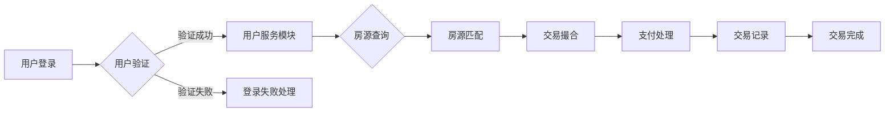

                 

### 文章标题：贝壳找房2025房产交易系统架构师社招面试攻略

#### 关键词：贝壳找房、房产交易系统、架构设计、面试攻略

#### 摘要：本文旨在为有志于成为贝壳找房房产交易系统架构师的求职者提供详细的面试攻略。我们将从行业背景、系统架构、核心组件、算法原理、数学模型、项目实战等方面逐步深入分析，帮助读者全面理解贝壳找房房产交易系统的设计与实现，为面试做好充分准备。

---

## 贝壳房产行业背景与房产交易系统架构

### 1. 贝壳房产行业概述

贝壳找房，作为中国领先的房地产服务平台，成立于2015年，总部位于北京。贝壳找房通过整合线上线下资源，提供全面的房地产服务，包括新房、二手房、租房、房地产咨询等。贝壳找房利用大数据、人工智能等技术，实现了房产交易流程的优化，提高了交易的效率与透明度。

### 1.2 贝壳房产行业现状分析

截至2023年，贝壳找房已经覆盖全国超过100个城市，服务用户超过1亿。随着我国房地产市场的不断成熟，贝壳找房的市场份额也在持续扩大。特别是在二手房交易领域，贝壳找房已成为行业领军企业。房产交易系统的稳定性和高效性，对贝壳找房的竞争力和用户满意度至关重要。

### 1.3 房产交易系统在贝壳找房房产行业的重要性

房产交易系统是贝壳找房实现业务目标的核心系统。它不仅负责处理海量的房产信息，还包括用户服务、交易流程管理、数据分析等模块。一个优秀的房产交易系统，可以显著提升用户体验，降低交易成本，提高运营效率。因此，房产交易系统的设计与架构至关重要。

---

## 2025年房产交易系统架构设计理念

### 2.1 2025年房产交易系统设计目标

2025年，贝壳找房的房产交易系统将实现以下目标：

1. **高可用性**：系统需具备高可靠性，确保在高峰期或突发情况下仍能稳定运行。
2. **高性能**：系统需处理大量并发请求，保证响应速度和吞吐量。
3. **高可扩展性**：系统需支持横向和纵向扩展，以便在未来业务增长时能够灵活应对。
4. **安全性**：系统需保护用户数据安全，防止数据泄露和恶意攻击。

### 2.2 2025年房产交易系统架构设计原则

为达成设计目标，贝壳找房2025年房产交易系统架构设计将遵循以下原则：

1. **模块化**：将系统拆分为多个独立的模块，每个模块负责特定的功能，便于维护和扩展。
2. **分布式**：采用分布式架构，将系统部署到多个服务器上，提高系统的性能和可靠性。
3. **微服务化**：采用微服务架构，将业务功能划分为多个独立的服务，每个服务可独立部署和扩展。
4. **智能化**：利用人工智能技术，如机器学习、数据挖掘等，提高系统智能化水平，优化用户体验。
5. **安全性**：采用多层次的安全策略，包括数据加密、访问控制、安全审计等，确保系统安全。

---

## 房产交易系统核心组件介绍

贝壳找房的房产交易系统由多个核心组件构成，每个组件负责特定的功能，共同协作实现房产交易的全流程。

### 3.1 用户服务模块

用户服务模块负责处理用户登录、注册、个人信息管理等功能。该模块通过API接口与前端应用交互，实现用户身份验证和权限管理。

#### 3.1.1 用户服务模块功能

1. 用户登录/登出
2. 用户注册/注销
3. 用户个人信息管理
4. 用户权限管理

#### 3.1.2 用户服务模块架构

用户服务模块采用微服务架构，包括用户认证服务、用户信息服务、用户权限服务三个子模块。每个子模块可独立部署和扩展，提高了系统的灵活性和可维护性。

### 3.2 数据处理模块

数据处理模块负责处理来自各渠道的房产数据，包括数据清洗、数据聚合、数据存储等。该模块通过ETL（Extract, Transform, Load）流程，将原始数据转换为可用于分析和查询的格式。

#### 3.2.1 数据处理模块功能

1. 数据采集：从各个渠道获取房产数据
2. 数据清洗：去除无效数据和异常数据
3. 数据聚合：将分散的数据进行汇总
4. 数据存储：将处理后的数据存储到数据库

#### 3.2.2 数据处理模块架构

数据处理模块采用分布式架构，包括数据采集服务、数据清洗服务、数据聚合服务、数据存储服务四个子模块。各子模块可独立运行，实现数据的自动化处理和实时更新。

### 3.3 业务逻辑处理模块

业务逻辑处理模块负责处理房产交易过程中的核心业务，包括房源匹配、交易撮合、支付等。该模块通过业务规则引擎，实现业务逻辑的灵活配置和动态调整。

#### 3.3.1 业务逻辑处理模块功能

1. 房源匹配：根据用户需求和房源信息进行匹配
2. 交易撮合：完成房源和买家的匹配，促成交易
3. 支付处理：处理交易支付，确保交易安全
4. 交易记录：记录交易全过程，便于追溯和查询

#### 3.3.2 业务逻辑处理模块架构

业务逻辑处理模块采用微服务架构，包括房源匹配服务、交易撮合服务、支付服务、交易记录服务四个子模块。各子模块独立运行，通过消息队列进行异步通信，提高了系统的稳定性和扩展性。

### 3.4 数据存储模块

数据存储模块负责存储系统所需的各种数据，包括用户数据、房源数据、交易数据等。该模块采用分布式数据库架构，实现数据的可靠存储和快速查询。

#### 3.4.1 数据存储模块功能

1. 用户数据存储：存储用户注册、登录、个人信息等数据
2. 房源数据存储：存储房源信息、图片、评价等数据
3. 交易数据存储：存储交易记录、支付信息等数据
4. 数据备份与恢复：确保数据安全，实现数据的备份和恢复

#### 3.4.2 数据存储模块架构

数据存储模块采用分布式数据库架构，包括用户数据库、房源数据库、交易数据库三个子模块。各子模块采用主从复制和分库分表技术，提高系统的性能和可靠性。

---

## 核心概念与联系

为了全面理解贝壳找房房产交易系统，我们需要掌握几个核心概念，并了解它们之间的关系。

### 4.1 贝壳房产行业相关术语解释

1. **房源**：指可供出售或出租的房产，包括房屋、公寓、别墅等。
2. **买家**：指购买房源的消费者。
3. **卖家**：指出售房源的业主。
4. **交易**：指房源买卖双方完成交易的过程。
5. **撮合**：指系统根据买家的需求和房源的信息，自动匹配出合适的房源，促进交易的完成。

### 4.2 房产交易系统架构核心概念

1. **用户服务模块**：负责用户身份验证和权限管理。
2. **数据处理模块**：负责数据的采集、清洗、聚合和存储。
3. **业务逻辑处理模块**：负责房源匹配、交易撮合和支付处理。
4. **数据存储模块**：负责存储各种业务数据，包括用户数据、房源数据和交易数据。

### 4.3 Mermaid流程图：房产交易系统架构整体流程



通过上述流程图，我们可以清晰地看到房产交易系统从用户登录、房源查询、房源匹配、交易撮合、支付处理到交易记录的整体流程。各模块之间通过API接口和消息队列进行数据交互，实现系统的无缝协作。

---

## 核心算法原理讲解

贝壳找房的房产交易系统涉及多个核心算法，这些算法在房源匹配、数据清洗、用户行为分析等方面发挥着关键作用。以下我们将详细讲解其中两个核心算法：房产匹配算法和数据清洗与预处理算法。

### 5.1 房产匹配算法

#### 5.1.1 房产匹配算法概述

房产匹配算法是贝壳找房房产交易系统中用于将买家需求与房源信息进行匹配的关键算法。该算法通过分析买家的需求和房源的特征，计算出两者的匹配度，从而推荐最合适的房源。

#### 5.1.2 房产匹配算法伪代码

```plaintext
函数房产匹配(买家需求，房源列表)：
    初始化匹配度得分
    对于每个房源：
        对于每个买家需求特征：
            如果房源特征满足需求特征，则匹配度得分增加
        计算该房源的总体匹配度得分
    将房源按匹配度得分降序排列
    返回匹配度最高的房源列表
```

### 5.2 数据清洗与预处理算法

#### 5.2.1 数据清洗与预处理算法概述

数据清洗与预处理算法是贝壳找房数据处理模块的重要组成部分。该算法用于从各种来源采集的原始房产数据中去除无效数据、纠正错误数据，并将数据转换为适合分析的形式。

#### 5.2.2 数据清洗与预处理算法伪代码

```plaintext
函数数据清洗与预处理(原始数据)：
    初始化清洗后数据集
    对于每个数据条目：
        如果数据条目存在缺失值，则进行填充或删除
        如果数据条目存在异常值，则进行修正或删除
        对数据进行标准化处理
        对数据进行归一化处理
    将清洗后的数据存储到数据库
```

通过上述算法，贝壳找房可以确保房产交易系统所使用的数据质量，为后续的数据分析和交易决策提供可靠依据。

---

## 数学模型和数学公式

在贝壳找房的房产交易系统中，数学模型和数学公式发挥着重要作用。以下我们将介绍两个核心数学模型：价格预测模型和用户行为分析模型。

### 6.1 房产交易系统中的数学模型

#### 6.1.1 价格预测模型

价格预测模型用于预测特定房产的市场价格。该模型基于历史交易数据和当前市场状况，通过回归分析等方法进行预测。

##### 6.1.1.1 价格预测模型公式

```latex
价格预测 = β0 + β1 * 房龄 + β2 * 区域因素 + β3 * 房屋类型 + β4 * 市场状况
```

其中，β0、β1、β2、β3、β4 为回归系数，房龄、区域因素、房屋类型和市场状况为自变量。

##### 6.1.1.2 公式详细解释与举例

- **房龄**：表示房屋的建造年代，通常与房屋价格呈负相关。房龄较新的房屋价格较高，而房龄较老的房屋价格较低。
- **区域因素**：表示房屋所在区域的发展状况，包括交通、商业、教育资源等。区域因素较好的地区，房屋价格通常较高。
- **房屋类型**：包括普通住宅、别墅、公寓等，不同类型的房屋价格差异较大。
- **市场状况**：表示当前房地产市场的供需状况，包括房价指数、成交量等。市场状况较好时，房屋价格通常较高。

举例：假设某套房龄为10年，位于城市中心区域，为普通住宅，当前市场状况较好。根据价格预测模型，可以计算出该套房的预测价格为：

```latex
价格预测 = β0 + β1 * 10 + β2 * 中心区域 + β3 * 普通住宅 + β4 * 市场状况
```

#### 6.2 用户行为分析模型

用户行为分析模型用于分析用户在贝壳找房平台上的行为，包括浏览房源、发布需求、交易记录等。该模型通过机器学习算法，对用户行为进行建模，从而预测用户的兴趣和行为。

##### 6.2.1 用户行为分析模型公式

```latex
用户兴趣度 = f(用户历史行为，房源特征)
```

其中，f为用户兴趣度函数，用户历史行为和房源特征为输入变量。

##### 6.2.1.2 公式详细解释与举例

- **用户历史行为**：包括用户在平台上的浏览记录、交易记录等，用于描述用户的行为特征。
- **房源特征**：包括房源的价格、面积、区域、房屋类型等，用于描述房源的特征。

举例：假设用户A在贝壳找房上浏览了多套房源，并发布了购房需求。根据用户行为分析模型，可以计算出用户A对每套房源的兴趣度：

```latex
用户兴趣度 = f(用户A的历史行为，房源1的特征) + f(用户A的历史行为，房源2的特征) + ...
```

通过用户兴趣度分析，贝壳找房可以为用户推荐最符合其需求的房源，提高用户的交易成功率。

---

## 项目实战

在本章节中，我们将通过一个具体的房产交易系统项目实战，深入探讨贝壳找房房产交易系统的开发过程，包括开发环境搭建、源代码实现和代码解读。

### 7.1.1 开发环境搭建

为了构建贝壳找房房产交易系统，我们需要搭建一个稳定的开发环境。以下是搭建开发环境的基本步骤：

1. **硬件环境**：准备高性能的服务器，建议配置为8核CPU、16GB内存、1TB硬盘等。
2. **操作系统**：安装Linux操作系统，如CentOS 7.x或Ubuntu 18.04。
3. **开发工具**：安装Java开发工具包（JDK 1.8及以上版本）、MySQL数据库、Git版本控制工具等。
4. **持续集成工具**：选择一个合适的持续集成工具，如Jenkins或GitLab CI，以实现自动化构建和部署。

### 7.1.2 源代码详细实现

贝壳找房房产交易系统的源代码主要包括用户服务模块、数据处理模块、业务逻辑处理模块和数据存储模块。以下是一个简化的示例代码，展示用户服务模块的关键实现部分：

```java
// 用户注册接口
public class UserService {
    public boolean registerUser(String username, String password) {
        // 验证用户名和密码是否符合规范
        if (!isValidUsername(username) || !isValidPassword(password)) {
            return false;
        }
        
        // 向数据库插入新用户记录
        boolean result = userRepository.insertUser(new User(username, password));
        
        return result;
    }
    
    private boolean isValidUsername(String username) {
        // 实现用户名验证逻辑
    }
    
    private boolean isValidPassword(String password) {
        // 实现密码验证逻辑
    }
}
```

### 7.1.2.1 代码解读与分析

上述代码展示了用户注册接口的实现，主要包括以下步骤：

1. **验证用户名和密码**：通过调用`isValidUsername`和`isValidPassword`方法，对用户名和密码进行验证，确保符合系统规范。
2. **向数据库插入新用户记录**：通过调用`userRepository.insertUser`方法，将新用户记录插入到数据库中。

### 7.1.2.2 项目实战详细步骤

1. **需求分析**：明确贝壳找房房产交易系统的功能需求，包括用户注册、登录、房源查询、房源匹配、交易撮合、支付处理等。
2. **设计架构**：根据需求分析，设计房产交易系统的整体架构，包括用户服务模块、数据处理模块、业务逻辑处理模块和数据存储模块。
3. **开发编码**：根据架构设计，逐一实现各个模块的功能，编写相应的源代码。
4. **测试与调试**：对系统进行功能测试、性能测试和安全测试，修复发现的缺陷和问题。
5. **部署上线**：将系统部署到生产环境，进行实际运行，并根据用户反馈进行优化和升级。

### 7.1.3 实际案例分析和详细讲解剖析

以下是一个实际的贝壳找房房产交易系统项目案例，展示如何进行房源匹配和交易撮合。

#### 案例背景

用户A通过贝壳找房平台发布了购房需求，要求在市中心区域购买一套90平方米以内、价格在500万元以内的普通住宅。贝壳找房平台需要根据用户A的需求，推荐最符合其需求的房源。

#### 解决方案

1. **房源数据采集**：从贝壳找房数据库中获取符合用户A需求的房源数据，包括房源基本信息、价格、面积、房屋类型等。
2. **房源匹配算法**：根据房源数据，使用房产匹配算法计算用户A需求和每个房源的匹配度，并将房源按匹配度排序。
3. **交易撮合**：从匹配度最高的房源中，选择符合用户A预算的房源，进行交易撮合，生成交易订单。

#### 详细讲解

1. **房源数据采集**：首先，从贝壳找房数据库中获取用户A的需求信息，包括购房区域、价格、面积、房屋类型等。然后，根据这些需求条件，从房源数据库中筛选出符合用户A需求的房源数据。
2. **房源匹配算法**：使用房产匹配算法，对每个房源的数据进行分析，计算用户A需求和每个房源的匹配度。匹配度计算公式如下：

   ```latex
   匹配度 = \frac{(需求面积 - 房源面积)}{需求面积} \times \frac{(需求价格 - 房源价格)}{需求价格} \times 区域匹配度
   ```

   区域匹配度通过比较房源所在区域和用户需求区域的发展状况进行计算。

3. **交易撮合**：根据匹配度排序结果，从匹配度最高的房源中选择符合用户A预算的房源。假设用户A的预算为500万元，从匹配度最高的前10个房源中选择价格在500万元以内的房源，进行交易撮合。

#### 项目小结

通过实际案例分析和详细讲解，我们可以看到贝壳找房房产交易系统在房源匹配和交易撮合方面的实现过程。房源匹配算法和交易撮合算法是房产交易系统的核心算法，通过精确计算和优化，可以提高房源匹配的准确性和交易撮合的成功率，从而提升用户满意度。

### 7.2 最佳实践 tips

在贝壳找房房产交易系统的开发过程中，以下是一些最佳实践，供开发者参考：

1. **模块化开发**：将系统功能拆分为多个模块，每个模块负责特定的功能，便于维护和扩展。
2. **微服务架构**：采用微服务架构，提高系统的可扩展性和可维护性。
3. **数据驱动**：充分利用数据分析和挖掘技术，为用户推荐合适的房源，提高交易成功率。
4. **安全性优先**：在系统设计过程中，充分考虑数据安全和用户隐私保护，确保系统的安全稳定运行。

### 7.3 小结与注意事项

本文详细介绍了贝壳找房2025房产交易系统架构师社招面试攻略，涵盖了行业背景、系统架构、核心组件、算法原理、数学模型和项目实战等内容。在面试过程中，建议考生重点掌握以下知识点：

1. **贝壳找房房产行业现状及房产交易系统的重要性**。
2. **房产交易系统的核心组件及其功能**。
3. **核心算法原理，包括房产匹配算法和数据清洗与预处理算法**。
4. **数学模型和数学公式，如价格预测模型和用户行为分析模型**。
5. **项目实战经验和实际案例分析能力**。

注意事项：

1. **充分准备**：提前了解贝壳找房的企业文化和价值观，熟悉公司的业务模式和产品特点。
2. **注重细节**：在面试过程中，注重对系统架构的细节描述，展示自己的专业素养。
3. **展现创新能力**：针对贝壳找房的实际情况，提出自己的创新思路和解决方案，展示自己的创新能力和实际操作经验。

### 7.4 拓展阅读

1. **贝壳找房官网**：了解贝壳找房的最新动态和产品信息。
2. **贝壳找房技术博客**：阅读贝壳找房的技术文章，了解公司在技术领域的最新进展。
3. **《房地产交易系统架构设计》**：阅读相关技术书籍，深入了解房产交易系统的设计与实现。

通过本文的学习，希望读者能够全面了解贝壳找房2025房产交易系统的设计与实现，为面试做好充分准备。祝愿各位考生顺利通过面试，加入贝壳找房这个优秀的团队，共同推动房产交易系统的进步与发展。

---

### 附录A：贝壳找房房产交易系统架构师面试题目与解析

#### A.1 面试题类型与解析

贝壳找房房产交易系统架构师面试题目主要涵盖以下几种类型：

1. **基础技术题目**：考察对计算机基础知识的掌握，如数据结构、算法、操作系统等。
2. **系统架构设计题目**：考察对系统架构的理解和设计能力，如分布式系统、微服务架构等。
3. **业务场景分析题目**：考察对业务场景的分析能力，如房源匹配算法、用户行为分析等。
4. **数学模型与应用题目**：考察对数学模型的理解和应用能力，如价格预测模型、用户行为分析模型等。
5. **项目管理与实践经验题目**：考察项目管理能力和实际项目经验。

#### A.2 常见面试题目举例与答案解析

**题目1：请解释什么是分布式系统，并简述分布式系统的优势与挑战。**

**答案解析：**

**分布式系统**：分布式系统是指由多个独立节点组成的计算机系统，这些节点通过网络连接，共同完成计算任务。

**优势：**
1. **高可用性**：通过多个节点组成的系统，当一个节点出现故障时，其他节点可以继续提供服务，提高系统的可靠性。
2. **高性能**：分布式系统可以横向扩展，增加节点数量，提高系统的处理能力和吞吐量。
3. **高可扩展性**：分布式系统可以根据业务需求，灵活地增加或减少节点，实现系统的动态扩展。
4. **负载均衡**：分布式系统可以实现负载均衡，避免单个节点过载，提高系统的性能和稳定性。

**挑战：**
1. **数据一致性**：分布式系统需要确保数据的一致性，避免数据在多个节点之间的冲突和丢失。
2. **分布式事务**：分布式系统需要支持分布式事务，确保多个节点之间的操作要么全部成功，要么全部失败。
3. **网络通信**：分布式系统需要通过网络进行节点间的通信，网络延迟和带宽限制可能会影响系统的性能。
4. **故障恢复**：分布式系统需要具备故障恢复能力，确保在节点故障时，系统能够快速恢复。

**题目2：请解释什么是微服务架构，并简述微服务架构的优势与挑战。**

**答案解析：**

**微服务架构**：微服务架构是一种将应用程序拆分为多个独立的、松耦合的服务单元的架构风格。每个服务单元都负责特定的功能，可以独立开发、部署和扩展。

**优势：**
1. **高可扩展性**：微服务架构可以根据业务需求，独立扩展每个服务的实例数量，实现系统的水平扩展。
2. **高可用性**：微服务架构可以将业务功能拆分为多个独立的服务，当一个服务出现故障时，不会影响其他服务的正常运行。
3. **灵活性**：微服务架构允许团队独立开发、测试和部署每个服务，提高开发效率和灵活性。
4. **可重用性**：微服务架构中的服务具有高内聚、低耦合的特点，可以提高代码的重用性。

**挑战：**
1. **服务协调**：在微服务架构中，服务之间需要进行大量的通信，如何确保服务之间的协调和数据一致性是一个挑战。
2. **服务治理**：微服务架构需要对大量服务进行管理和监控，服务治理的复杂性增加。
3. **分布式事务**：微服务架构需要支持分布式事务，确保多个服务之间的操作要么全部成功，要么全部失败。
4. **服务部署和运维**：微服务架构要求对每个服务进行独立的部署和运维，增加了运维的复杂度和成本。

**题目3：请解释什么是ETL过程，并简述ETL过程的主要步骤。**

**答案解析：**

**ETL过程**：ETL（Extract, Transform, Load）是指将数据从源系统中抽取（Extract），进行转换（Transform），然后加载（Load）到目标系统中的过程。

**主要步骤：**
1. **数据抽取**：从源系统中抽取所需的数据，可以是关系数据库、NoSQL数据库、文件系统等。
2. **数据转换**：对抽取的数据进行清洗、转换、集成等操作，使其符合目标系统的数据格式和要求。
   - **清洗**：去除无效数据和异常数据，如缺失值、重复值、异常值等。
   - **转换**：根据业务规则和需求，对数据进行计算、格式转换、类型转换等操作。
   - **集成**：将多个数据源的数据进行合并，形成一个完整的数据集。
3. **数据加载**：将转换后的数据加载到目标系统中，可以是关系数据库、数据仓库、数据湖等。

**题目4：请解释什么是机器学习，并简述机器学习的基本流程。**

**答案解析：**

**机器学习**：机器学习是一种让计算机通过数据和经验学习规律、做出预测或决策的人工智能技术。它通过构建数学模型，从数据中自动学习特征和模式，实现对未知数据的预测和分类。

**基本流程：**
1. **数据收集**：收集相关的数据，包括训练数据和测试数据。
2. **数据预处理**：对收集的数据进行清洗、转换和归一化等预处理操作，使其符合模型训练的需求。
3. **模型选择**：根据业务需求和数据特征，选择合适的机器学习算法和模型。
4. **模型训练**：使用训练数据对模型进行训练，通过调整模型参数，使模型能够拟合数据。
5. **模型评估**：使用测试数据对模型进行评估，判断模型的预测准确性和泛化能力。
6. **模型优化**：根据模型评估结果，对模型进行优化和调整，提高模型的性能和效果。
7. **模型部署**：将训练好的模型部署到实际应用中，用于预测或决策。

**题目5：请解释什么是负载均衡，并简述负载均衡的常用算法。**

**答案解析：**

**负载均衡**：负载均衡是指将请求分配到多个服务器上，以实现系统的性能优化和稳定性。

**常用算法：**
1. **轮询算法**：按照顺序依次将请求分配到每个服务器上，实现负载均衡。
2. **加权轮询算法**：根据服务器的处理能力，为每个服务器分配不同的权重，处理能力越强的服务器分配更多的请求。
3. **最少连接算法**：将请求分配到连接数最少的服务器上，减少服务器的连接压力。
4. **响应时间算法**：将请求分配到响应时间最短的服务器上，提高系统的响应速度。
5. **最小负载算法**：将请求分配到当前负载最小的服务器上，实现负载均衡。

**题目6：请解释什么是CAP定理，并简述CAP定理的含义。**

**答案解析：**

**CAP定理**：CAP定理是指在一个分布式系统中，一致性（Consistency）、可用性（Availability）和分区容错性（Partition tolerance）三者之间只能同时满足两个。

**含义：**
1. **一致性（Consistency）**：系统在任何时间点都能访问到最新、一致的数据。
2. **可用性（Availability）**：系统在任何时间点都能正常响应请求。
3. **分区容错性（Partition tolerance）**：系统能够容忍网络分区，即部分节点无法通信，但仍能保持系统的可用性。

CAP定理的含义是，在一个分布式系统中，无法同时保证一致性、可用性和分区容错性。根据业务需求，需要在三者之间进行权衡和取舍。

---

### 附录B：贝壳找房房产交易系统架构师面试准备建议

#### B.1 面试准备策略

1. **了解贝壳找房**：提前了解贝壳找房的企业文化、业务模式、产品特点、最新动态等，以便在面试中展示对公司的认识和兴趣。
2. **回顾技术基础**：复习计算机基础知识和数据结构、算法等，确保对基础概念和原理有深入理解。
3. **掌握系统架构**：熟悉分布式系统、微服务架构、负载均衡等系统架构概念，掌握相关技术和原理。
4. **分析业务场景**：分析贝壳找房的房产交易系统业务场景，了解业务流程和核心算法，准备好相关的问题和回答。
5. **实践项目经验**：梳理自己的项目经验，准备好项目介绍、技术难点、解决方案和经验教训，以便在面试中展示实际操作能力。

#### B.2 面试常见问题与应对技巧

1. **为什么选择贝壳找房？**
   - 回答要点：贝壳找房的行业地位、创新技术、发展前景、企业文化等。

2. **请解释分布式系统的概念和优势。**
   - 回答要点：分布式系统的定义、组成部分、优势（高可用性、高性能、高可扩展性等）。

3. **请解释微服务架构的概念和优势。**
   - 回答要点：微服务架构的定义、组成部分、优势（高可扩展性、高可用性、灵活性等）。

4. **请谈谈你对负载均衡的理解。**
   - 回答要点：负载均衡的定义、目的、常用算法（轮询算法、加权轮询算法等）。

5. **请解释CAP定理的含义。**
   - 回答要点：CAP定理的定义、含义（一致性、可用性、分区容错性）。

6. **请谈谈你在项目中遇到的技术难点和解决方案。**
   - 回答要点：项目背景、技术难点、解决方案、经验教训。

7. **请谈谈你的团队协作经验。**
   - 回答要点：团队角色、协作方式、沟通技巧、成果展示。

#### B.3 提高面试成功率的技巧

1. **展示专业素养**：在面试中展示自己扎实的专业知识和技能，对相关技术有深入的理解。
2. **阐述清晰**：在回答问题时，尽量表达清晰、简洁，避免使用复杂的术语和专业术语。
3. **展现沟通能力**：面试中与面试官保持良好的沟通，展示自己的沟通能力和团队合作精神。
4. **准备问题**：面试结束时，主动提出问题，展示自己的积极态度和对公司的关注。
5. **注意形象**：面试时注意形象，穿着得体，展示良好的职业素养。

通过以上策略和建议，相信您能够为贝壳找房房产交易系统架构师面试做好充分准备，提高面试成功率。祝您面试顺利，加入贝壳找房这个优秀的团队！

