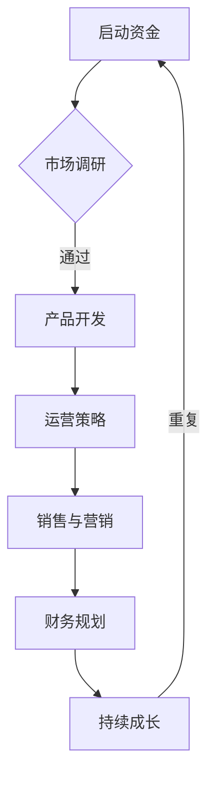

                 

### 第1章 引言

#### 1.1 书籍背景与目标

在当今快速发展的数字化时代，程序员这个职业已经成为了一个备受尊敬和追求的目标。随着技术的不断进步和互联网的普及，程序员们的机会和挑战也越来越多。然而，许多程序员在职业生涯中可能面临的一个共同问题是如何实现个人财富自由。财富自由不仅意味着财务上的独立，更是一种生活状态和精神追求。因此，本书旨在帮助那些有志于创立一人公司实现财富自由的资深程序员，提供一套系统、可操作的创业计划与步骤。

本书的核心目标是：

1. **定义财富自由**：帮助读者理解财富自由的概念和重要性。
2. **准备创业**：提供详细的创业前准备步骤，包括个人技能提升、市场调研和法律知识等。
3. **商业模式选择**：指导读者如何选择适合自己的商业模式。
4. **产品开发与运营**：分享产品开发、运营策略和客户关系管理的实践经验。
5. **营销与销售**：介绍有效的营销策略、销售技巧和持续优化策略。
6. **财务管理**：讲解成本控制、收入管理和投资融资等关键财务知识。
7. **持续成长**：探讨如何应对市场变化、团队建设和持续学习。

通过以上步骤，资深程序员可以逐步建立起自己的公司，实现财富自由。

#### 1.2 作者背景与经验

作为一名资深程序员和人工智能专家，我拥有超过二十年的编程经验，曾在多家世界顶级科技公司担任技术领导职位。在这段时间里，我不仅参与了多个成功的项目，还积累了丰富的创业经验和市场洞察力。我曾在多个国际会议上发表演讲，并撰写了数本关于编程和人工智能领域的畅销书。这些经历使我深刻理解程序员在实现财富自由过程中的挑战和机遇，因此我希望通过这本书，将自己的经验和知识分享给更多的程序员。

#### 1.3 读者定位与收益

本书主要面向以下读者群体：

1. **资深程序员**：具有多年编程经验，渴望通过创业实现财富自由。
2. **创业新手**：对创业感兴趣，但缺乏实际经验和指导。
3. **技术领导者**：希望了解如何利用自己的技术专长进行创业。

通过阅读本书，读者可以：

1. **理解财富自由的概念**：明确财富自由的目标和意义。
2. **制定创业计划**：获得详细的创业前准备步骤和资源。
3. **选择合适的商业模式**：了解不同商业模式的优缺点，选择适合自己的路径。
4. **提升产品开发与运营能力**：学习如何高效地进行产品开发和管理。
5. **掌握营销与销售策略**：提高销售技巧，拓展市场份额。
6. **实现财务管理**：了解财务管理的核心知识，做好财务规划。
7. **持续成长**：掌握持续成长的方法，不断提升自身能力和公司竞争力。

### 1.4 总结

本章作为引言，首先介绍了书籍的背景和目标，明确了帮助资深程序员实现财富自由的核心价值。随后，介绍了作者的背景与经验，以及本书的主要读者群体和预期收益。通过这些内容，读者可以初步了解本书的结构和内容安排，为后续章节的学习打下基础。接下来，我们将深入探讨财富自由的定义和价值观，为读者奠定坚实的理论基础。

## 第2章 财富自由的定义与价值观

财富自由，顾名思义，是指一个人在财务上不再依赖于工作收入，能够自由支配自己的时间和资源，过上无忧无虑的生活。具体来说，财富自由意味着一个人拥有足够的被动收入来源，这些收入能够覆盖其日常开支和生活质量，从而不必再为生计而劳累。财富自由不仅仅是财务上的独立，更是一种精神和生活方式的解放。

#### 2.1 财富自由的概念

财富自由可以理解为以下几个关键要素的结合：

1. **被动收入**：被动收入是指不需要持续付出劳动就可以获得的收入，例如租金、股息、专利授权费等。与主动收入（如工资、薪水）相对，被动收入是实现财富自由的关键。

2. **财务独立**：财务独立是指一个人的财务状况不再依赖于当前的工作或收入来源，而是能够通过已有的资产和收入维持生活。

3. **时间自由**：时间自由是指一个人不再受限于工作的时间和地点，可以自由安排自己的时间，追求个人兴趣和事业发展。

4. **精神自由**：精神自由是指一个人在财务独立的基础上，能够摆脱物质束缚，追求内心的平静和满足。

#### 2.2 价值观的重要性

在追求财富自由的过程中，价值观起着至关重要的作用。价值观不仅决定了我们的行为和决策，还影响了我们的生活方式和人生目标。以下是几个关键的价值观：

1. **目标导向**：明确自己的目标，制定清晰的计划是实现财富自由的第一步。只有明确目标，才能更好地规划资源和时间，实现财务自由。

2. **自律**：自律是实现财富自由的关键品质。它要求我们遵守计划，克服拖延，持续努力，以实现长期目标。

3. **责任感**：责任感是指对自己、对家人、对社会承担责任。在创业过程中，责任感会促使我们更加努力，确保公司运营的稳定和持续发展。

4. **学习与成长**：不断学习新知识和技能，是保持竞争力的关键。在快速变化的数字化时代，持续学习和成长是确保财富自由的长期策略。

5. **专注与专注**：专注于自己的事业，全身心投入到创业过程中，是取得成功的重要条件。只有专注，才能在激烈的市场竞争中脱颖而出。

#### 2.3 建立合适的价值观

为了实现财富自由，建立一套合适的价值观至关重要。以下是几个步骤：

1. **自我反思**：首先，我们需要反思自己的价值观，明确什么对自己最重要。这可以通过撰写自己的价值观宣言来实现。

2. **目标设定**：根据自己的价值观，设定短期和长期目标。目标要具体、可衡量，并且与价值观保持一致。

3. **行动计划**：制定实现目标的行动计划，明确每一步的执行步骤和时间表。

4. **持续调整**：在实现目标的过程中，要定期反思和调整自己的价值观和计划，确保它们与当前的需求和情况相匹配。

5. **实践与践行**：价值观需要通过实际行动来践行。只有将价值观融入日常工作和生活中，才能真正体现其价值。

通过以上步骤，资深程序员可以逐步建立一套适合自己实现财富自由的价值观，为创业之路奠定坚实的基础。

### 2.4 总结

本章深入探讨了财富自由的概念和价值观，明确了财富自由的重要性及其实现过程中的关键要素。通过了解财富自由的具体含义和如何建立合适的价值观，资深程序员可以更加明确自己的目标，为后续的创业计划做好充分准备。在接下来的章节中，我们将详细探讨创业前的准备步骤，包括个人技能提升、市场调研、资源整合和法律财务知识等，为资深程序员创业提供实用的指导。

## 第3章 创业前的准备

在决定创立一人公司之前，资深程序员需要进行充分的准备，以确保创业之路的成功。本章将详细探讨创业前的各项准备工作，包括个人技能提升、市场调研、资源整合以及法律与财务知识。

#### 3.1 个人技能提升

作为创业者，程序员需要具备多种技能，这些技能不仅包括技术层面的编程能力，还包括管理、沟通、市场分析等综合能力。以下是一些关键技能的提升建议：

1. **编程能力**：作为程序员，不断提升编程能力是基础。可以通过参加在线编程课程、阅读技术书籍、参与开源项目等方式，保持技术前沿。

2. **项目管理**：掌握项目管理工具和方法，如Scrum、Kanban等，可以提高团队效率和项目成功率。

3. **沟通与团队协作**：增强沟通能力和团队协作精神，是创业者必备的素质。可以通过参加团队建设活动、参加辩论赛等方式提升。

4. **市场分析**：学习市场分析的方法和工具，如SWOT分析、PEST分析等，以便更准确地了解市场需求和竞争对手。

5. **商业知识**：了解基本的商业知识，如营销策略、财务管理、企业运营等，有助于更好地管理公司。

#### 3.2 市场调研

市场调研是创业前的重要步骤，它帮助创业者了解市场需求、竞争对手和潜在客户。以下是市场调研的几个关键步骤：

1. **目标市场定位**：明确公司的目标市场，包括目标客户、市场规模和竞争情况。

2. **竞争分析**：分析竞争对手的产品、市场份额、优势和劣势，找出自己的竞争优势。

3. **客户调研**：通过问卷调查、访谈、用户测试等方式，了解潜在客户的需求和偏好。

4. **市场趋势**：关注行业趋势和市场动态，及时调整战略和产品方向。

5. **可行性研究**：对市场调研结果进行综合分析，评估创业项目的可行性和潜在风险。

#### 3.3 创业资源整合

创业资源的整合是确保公司顺利运营的基础。以下是一些关键资源：

1. **人力资源**：招聘合适的团队成员，包括技术专家、市场专家和财务人员。

2. **技术资源**：选择合适的开发工具、编程语言和技术框架，确保技术实现的有效性。

3. **财务资源**：确保有足够的启动资金，可以通过自筹、借款或投资者等方式筹集资金。

4. **市场资源**：建立营销渠道，如社交媒体、广告平台、合作伙伴等，以提高品牌知名度和市场份额。

5. **法律资源**：了解并遵守相关法律法规，如公司注册、税务、知识产权等。

#### 3.4 法律与财务知识

创业涉及许多法律和财务问题，了解并掌握这些知识至关重要。以下是一些关键点：

1. **公司注册**：了解公司注册流程、所需文件和费用，确保合法运营。

2. **税务知识**：了解税务政策，合理规划税务安排，避免税务风险。

3. **财务规划**：制定详细的财务计划，包括预算、收入预测、成本控制和投资策略。

4. **风险管理**：识别潜在风险，制定风险管理策略，如保险、备用资金等。

5. **合同与协议**：了解合同法律知识，确保与客户、供应商和员工的权益得到保护。

#### 3.5 总结

创业前的准备工作是成功创业的关键。通过提升个人技能、进行市场调研、整合资源以及掌握法律和财务知识，资深程序员可以更好地为创业做准备。在接下来的章节中，我们将进一步探讨如何选择合适的商业模式，为创业者提供实用的指导。

### 第4章 选择合适的商业模式

在选择商业模式时，创业者需要充分考虑市场需求、自身资源和竞争优势。本章将详细探讨商业模式的定义、常见模式分析以及创业者如何选择适合自己的商业模式。

#### 4.1 商业模式概述

商业模式是指企业如何创造、传递和捕获价值的一种系统化方法。它不仅包括收入来源，还涉及成本结构、价值主张、客户关系等关键要素。一个好的商业模式应该能够实现以下目标：

1. **价值创造**：提供对客户有价值的产品或服务。
2. **价值传递**：有效地将价值传递给客户。
3. **价值捕获**：通过合理的价格策略和成本控制，实现可持续的利润。

#### 4.2 常见商业模式分析

以下是一些常见的商业模式：

1. **订阅模式**：通过提供定期订阅服务，如Netflix、Spotify等，实现持续的收入来源。该模式适用于内容丰富、更新频繁的领域。

2. **平台模式**：搭建一个平台，连接供需双方，从中抽取佣金。如阿里巴巴、Uber等。平台模式的关键在于规模效应和流量。

3. **B2B模式**：直接向企业客户提供服务或产品，如Salesforce、Oracle等。这种模式通常需要更长的销售周期和更高的客户黏性。

4. **B2C模式**：直接向消费者提供服务或产品，如Airbnb、Amazon等。这种模式需要强大的营销能力和客户体验。

5. **共享经济模式**：通过共享闲置资源，实现价值最大化。如Airbnb、Uber等。这种模式强调资源的高效利用。

6. **产品服务化模式**：将传统产品转变为服务，提供全生命周期管理。如IBM的咨询服务。这种模式适用于技术和知识密集型行业。

7. **免费增值模式**：提供免费基础服务，通过增值服务获得收入。如Google、Facebook等。这种模式的关键在于吸引用户，并通过数据创造价值。

#### 4.3 创业者的商业模式选择

在选择商业模式时，创业者应考虑以下因素：

1. **市场需求**：了解目标市场的需求和痛点，选择能够满足市场需求的商业模式。

2. **自身资源**：考虑自身的资源优势，如技术、资金、人才等。选择与自身资源相匹配的商业模式。

3. **竞争优势**：分析自身的竞争优势，如独特的产品、技术或品牌。选择能够放大竞争优势的商业模式。

4. **风险承受能力**：评估自身对风险的承受能力，选择风险可控的商业模式。

5. **行业趋势**：关注行业趋势和未来发展方向，选择具有潜力的商业模式。

#### 4.4 创业者如何选择适合自己的商业模式

以下步骤可以帮助创业者选择适合自己的商业模式：

1. **明确目标**：首先，明确创业的目标和愿景，这将帮助创业者聚焦于最核心的问题。

2. **市场分析**：进行深入的市场分析，了解目标客户的需求、竞争对手和市场趋势。

3. **评估自身资源**：评估自身的资源和能力，包括技术、资金、人才等，选择与自身资源相匹配的商业模式。

4. **选择初步方案**：根据市场需求和自身资源，选择几个初步的商业模式方案。

5. **测试与验证**：对初步方案进行测试和验证，通过市场调研、用户反馈等方式，评估方案的有效性。

6. **优化与调整**：根据测试和验证结果，对商业模式进行优化和调整，确保其可行性。

7. **实施与执行**：制定详细的实施计划，确保商业模式的有效执行。

通过以上步骤，创业者可以逐步选择并实施适合自己的商业模式，为公司的成功奠定基础。

### 4.5 总结

选择合适的商业模式是创业成功的关键。通过理解商业模式的概念和常见模式分析，创业者可以更清晰地认识到不同模式的优势和适用场景。同时，通过科学的步骤选择适合自己的商业模式，创业者可以更好地把握市场机会，实现财富自由。在接下来的章节中，我们将进一步探讨产品开发与运营策略，帮助创业者实现商业模式的成功落地。

### 第5章 开发与运营

产品开发与运营是创业过程中至关重要的一环，它直接关系到公司的生存和发展。在这一章中，我们将详细探讨产品开发的过程、运营策略和客户关系管理。

#### 5.1 产品开发

产品开发是一个系统性、迭代性的过程，涉及多个环节。以下是产品开发的主要步骤：

1. **需求分析**：了解客户需求和市场趋势，明确产品的功能、性能和用户体验。可以通过市场调研、用户访谈和竞争分析等手段进行需求分析。

2. **产品规划**：根据需求分析结果，制定产品规划，包括产品功能模块、技术路线和时间表。产品规划应具有灵活性，以应对市场变化。

3. **原型设计**：开发原型，验证需求分析的准确性。原型设计可以通过低保真或高保真模型实现，以快速迭代和反馈。

4. **编码实现**：根据原型设计进行编码实现，确保代码的可维护性和扩展性。可以选择合适的编程语言和开发框架，提高开发效率。

5. **测试与验收**：进行全面的测试，确保产品功能正确、性能稳定和用户体验良好。测试应包括单元测试、集成测试和用户验收测试。

6. **上线部署**：将产品部署到生产环境，确保其稳定运行。上线前应进行充分的测试和备份计划，以应对突发情况。

#### 5.2 运营策略

运营策略是确保产品成功上线后，能够持续稳定运行的关键。以下是一些关键的运营策略：

1. **日常运维**：建立日常运维流程，确保系统的稳定性和安全性。包括系统监控、故障排查、数据备份和系统升级等。

2. **客户服务**：提供高质量的客户服务，包括售前咨询、技术支持和售后维护。良好的客户服务可以提高客户满意度和忠诚度。

3. **数据分析**：利用数据分析工具，对用户行为、产品性能和运营数据进行分析，发现潜在问题和优化机会。

4. **性能优化**：根据数据分析结果，不断优化产品性能和用户体验。包括优化代码、提高系统并发能力和改善用户界面等。

5. **营销推广**：通过多种营销手段，提高产品的市场知名度和用户转化率。包括搜索引擎优化（SEO）、社交媒体营销、内容营销等。

6. **团队协作**：建立高效的团队协作机制，确保各部门之间的沟通和协作。包括定期会议、任务分配和项目管理等。

#### 5.3 客户关系管理

客户关系管理（CRM）是维护客户关系、提升客户满意度和忠诚度的重要手段。以下是一些客户关系管理的最佳实践：

1. **建立客户档案**：对每位客户进行详细记录，包括基本信息、购买历史、偏好和反馈等。

2. **定期沟通**：通过电话、邮件、社交媒体等方式，定期与客户保持联系，了解客户需求和反馈。

3. **个性化服务**：根据客户档案和需求，提供个性化的服务和产品推荐，提高客户满意度。

4. **客户关怀**：在重要节点，如节假日、客户生日等，发送祝福和礼物，表达对客户的关怀。

5. **反馈机制**：建立有效的反馈机制，及时收集和处理客户反馈，改进产品和服务。

6. **客户忠诚计划**：通过积分、折扣、会员制度等方式，激励客户持续购买和使用产品，提升客户忠诚度。

#### 5.4 总结

产品开发与运营是创业过程中不可或缺的重要环节。通过科学的产品开发流程、有效的运营策略和优质的客户关系管理，创业者可以确保产品的成功上线和持续运营，从而实现商业模式的落地和持续发展。在接下来的章节中，我们将进一步探讨营销与销售策略，帮助创业者拓展市场，提高销售额。

### 第6章 营销与销售

在创业过程中，成功的营销与销售策略是打开市场大门、实现公司目标的关键。本章将详细探讨营销策略、社交媒体营销、销售技巧以及如何持续优化销售策略。

#### 6.1 营销策略

营销策略是吸引潜在客户、提高品牌知名度、促进销售的一系列计划和行动。以下是几种有效的营销策略：

1. **目标市场定位**：明确公司的目标市场，包括目标客户群体、市场规模和竞争情况。通过细分市场，找到公司的独特卖点（USP）。

2. **品牌建设**：建立强大的品牌形象，通过品牌故事、标志、口号和视觉设计等手段，树立公司的市场地位。

3. **内容营销**：发布高质量的内容，如博客文章、视频教程、案例分析等，分享行业见解和专业知识，吸引潜在客户。

4. **SEO（搜索引擎优化）**：优化网站内容和结构，提高在搜索引擎中的排名，吸引更多有机流量。

5. **广告推广**：利用付费广告，如Google AdWords、Facebook Ads等，进行精准定位，快速提升品牌知名度。

6. **合作伙伴关系**：与行业内的其他公司或组织建立合作关系，通过联合营销和资源共享，扩大市场覆盖。

7. **口碑营销**：通过提供卓越的产品和服务，赢得客户的好评和推荐，利用口碑传播效应扩大影响力。

#### 6.2 社交媒体营销

社交媒体营销是现代营销的重要组成部分，以下是一些社交媒体营销的最佳实践：

1. **社交媒体平台选择**：根据目标市场和客户群体的特点，选择合适的社交媒体平台，如LinkedIn、Twitter、Instagram、Facebook等。

2. **内容规划**：制定内容发布计划，包括发布频率、内容和形式。内容应具有吸引力、有价值、有趣，并能引发用户互动。

3. **互动与参与**：积极与用户互动，回应评论和私信，参与话题讨论，建立良好的社交媒体社区。

4. **社交媒体广告**：利用社交媒体平台的广告功能，进行精准定位和投放，提高广告效果。

5. **用户生成内容**：鼓励用户分享他们的体验和评价，通过用户生成内容（UGC）提高品牌影响力。

6. **社交媒体分析**：定期分析社交媒体数据，如粉丝增长、互动率、转化率等，优化营销策略。

#### 6.3 销售技巧

销售技巧是提高销售额和客户满意度的关键。以下是一些有效的销售技巧：

1. **了解客户需求**：在销售过程中，首先要了解客户的需求和痛点，提供针对性的解决方案。

2. **建立信任**：通过诚信和专业，建立与客户的信任关系。诚信的销售策略能够赢得客户的长期合作。

3. **演示与说明**：通过产品演示和详细说明，让客户直观地了解产品的价值和使用方法。

4. **处理异议**：面对客户的异议，保持冷静和耐心，通过事实和数据解释，消除客户的疑虑。

5. **跟进与服务**：在销售后，及时跟进客户的使用情况和反馈，提供优质的售后服务，提高客户满意度。

6. **持续学习与改进**：通过销售数据分析，了解自己的优势和不足，不断改进销售策略和技巧。

#### 6.4 持续优化销售策略

销售策略不是一成不变的，需要根据市场变化和客户反馈进行持续优化。以下是一些优化销售策略的方法：

1. **数据分析**：定期分析销售数据，如销售额、客户来源、转化率等，识别销售过程中的问题和机会。

2. **客户反馈**：积极收集客户的反馈，了解他们的需求和满意度，根据反馈调整产品和服务。

3. **竞争对手分析**：分析竞争对手的市场策略和销售技巧，学习他们的优点，规避他们的缺点。

4. **市场调研**：定期进行市场调研，了解市场趋势和客户需求的变化，及时调整销售策略。

5. **团队培训**：定期对销售团队进行培训，提高他们的销售技能和知识，确保销售策略的有效执行。

6. **持续创新**：在销售过程中，不断尝试新的方法和技巧，寻找最佳实践，提升销售效果。

#### 6.5 总结

营销与销售是创业成功的关键环节。通过制定有效的营销策略、利用社交媒体进行宣传、掌握销售技巧以及持续优化销售策略，创业者可以扩大市场份额，提高销售额，实现公司目标。在接下来的章节中，我们将进一步探讨财务管理，帮助创业者更好地管理财务，确保公司的可持续发展。

### 第7章 财务管理

在创业过程中，财务管理是一个至关重要的环节，它直接关系到公司的生存和发展。有效的财务管理可以帮助创业者优化资源配置、控制成本、增加收入，并确保公司的财务稳健。本章将详细探讨成本控制、收入管理、投资与融资以及财务分析，为创业者提供全面的财务管理指导。

#### 7.1 成本控制

成本控制是财务管理的基础，它涉及到如何降低不必要的开支，提高资源利用率。以下是成本控制的关键措施：

1. **预算管理**：制定详细的预算计划，明确每项支出的预期和实际执行情况，确保资源的合理分配。

2. **成本分析**：定期分析各项开支的成本，识别高成本项目，寻找优化空间。

3. **供应商管理**：通过与供应商建立长期合作关系，争取更好的价格和服务，降低采购成本。

4. **员工成本控制**：优化人力资源配置，避免冗余职位，提高员工效率，降低人力成本。

5. **运营效率提升**：通过流程优化、技术升级等方式，提高运营效率，减少浪费。

6. **外包与协作**：将非核心业务外包，降低运营成本，专注于核心业务的发展。

#### 7.2 收入管理

收入管理是财务管理的核心，它涉及到如何增加收入、提高收入质量和优化收入结构。以下是收入管理的几个关键点：

1. **销售策略**：制定有效的销售策略，提高销售额和客户满意度。

2. **收入预测**：根据市场趋势和客户需求，制定合理的收入预测，为财务规划提供依据。

3. **收入结构优化**：优化收入结构，提高高利润产品的销售比例，降低低利润或亏损产品的销售。

4. **价格管理**：合理设定产品价格，既保证利润，又能吸引客户。

5. **合同管理**：确保合同的合法性和有效性，防止合同纠纷带来的收入损失。

6. **客户关系管理**：通过提供优质的客户服务，提升客户满意度和忠诚度，增加重复购买和推荐。

#### 7.3 投资与融资

投资与融资是公司发展的重要环节，它涉及到如何有效地利用外部资金，为公司的长期发展提供支持。以下是投资与融资的关键步骤：

1. **资金需求分析**：明确公司的资金需求，包括运营资金、研发资金、市场推广资金等。

2. **融资渠道选择**：根据公司的实际情况，选择合适的融资渠道，如银行贷款、风险投资、天使投资等。

3. **融资策略**：制定详细的融资计划，包括融资额度、融资时间、还款计划等。

4. **投资评估**：对投资项目进行详细评估，确保投资回报率和风险可控。

5. **资金管理**：合理规划和使用融资资金，确保资金的高效利用。

6. **财务报表**：定期编制财务报表，向投资者和利益相关者展示公司的财务状况。

#### 7.4 财务分析

财务分析是评估公司财务状况、发现问题和优化管理的重要工具。以下是财务分析的几个关键方面：

1. **盈利能力分析**：通过利润表分析公司的盈利能力，包括净利润率、毛利率等指标。

2. **流动性分析**：通过资产负债表分析公司的流动性，包括流动比率、速动比率等指标。

3. **负债情况分析**：通过负债情况分析公司的负债水平，包括资产负债率、利息保障倍数等指标。

4. **现金流分析**：通过现金流量表分析公司的现金流情况，包括经营活动现金流、投资活动现金流等。

5. **财务指标对比**：将公司的财务指标与行业平均水平进行对比，发现自身的优势和不足。

6. **财务预警**：通过财务分析，及时发现潜在的财务风险，采取预防措施。

#### 7.5 总结

财务管理是创业者必须精通的一门学问，它直接关系到公司的生存和发展。通过有效的成本控制、合理的收入管理、科学的投资与融资以及详细的财务分析，创业者可以确保公司的财务稳健，为公司的长期发展提供有力支持。在接下来的章节中，我们将探讨如何持续成长与调整，帮助创业者应对市场变化，不断提升公司的竞争力。

### 第8章 持续成长与调整

在创业过程中，持续成长与调整是保持公司竞争力和市场地位的关键。本章将探讨如何应对市场变化、团队建设和持续学习，帮助创业者不断提升自身能力和公司竞争力。

#### 8.1 市场变化应对策略

市场是不断变化的，创业者需要时刻关注市场动态，灵活调整战略以应对变化。以下是一些应对市场变化的关键策略：

1. **市场调研**：定期进行市场调研，了解客户需求、竞争对手和行业趋势。通过数据分析，识别市场变化和机会。

2. **敏捷反应**：建立敏捷反应机制，快速调整产品和策略。通过迭代开发和快速市场测试，快速响应市场需求。

3. **多元化策略**：不要把所有鸡蛋放在一个篮子里，可以考虑多元化产品和服务，降低市场风险。

4. **跨界合作**：与其他行业或企业建立合作关系，跨界合作可以带来新的市场机会和资源。

5. **创新思维**：鼓励创新思维，不断尝试新的产品和服务，探索新的市场空间。

6. **风险控制**：制定风险管理计划，提前识别和预防潜在风险，确保公司运营稳定。

#### 8.2 团队建设与人才引进

团队是创业成功的关键，创业者需要重视团队建设，吸引和培养优秀人才。以下是一些团队建设和人才引进的策略：

1. **明确团队目标**：明确团队的目标和愿景，确保团队成员都朝同一个方向努力。

2. **招聘优质人才**：通过多种渠道招聘优秀人才，如行业招聘会、在线招聘平台、社交媒体等。注重候选人的技能、经验和团队协作能力。

3. **培训与发展**：为员工提供培训和发展机会，提高其专业技能和综合素质。定期举办内部培训和交流活动，提升团队的整体能力。

4. **激励机制**：建立有效的激励机制，包括薪酬、福利和股权激励等，激发员工的积极性和创造力。

5. **团队文化建设**：打造积极向上、合作共赢的团队文化，增强团队的凝聚力和归属感。

6. **绩效评估**：定期对员工进行绩效评估，了解其工作表现和潜力，为人才发展提供依据。

#### 8.3 持续学习与创新

持续学习和创新是创业者保持竞争力的重要手段。以下是一些持续学习和创新的策略：

1. **技术学习**：关注行业新技术和趋势，通过参加技术会议、阅读技术书籍和在线课程等，不断提升自己的技术能力。

2. **知识分享**：鼓励团队成员进行知识分享和交流，通过内部培训、研讨会和知识库建设，促进知识的积累和传播。

3. **创新机制**：建立创新机制，鼓励员工提出创新想法，并为创新项目提供资源和支持。

4. **跨界学习**：与其他行业的创业者、专家进行交流和合作，吸收其他行业的经验和教训，实现跨界创新。

5. **开放心态**：保持开放心态，接受新的观点和想法，勇于尝试和失败，从失败中学习。

6. **定期复盘**：定期对项目进行复盘，总结经验和教训，优化工作流程和方法。

#### 8.4 总结

持续成长与调整是创业过程中必不可少的一环。通过应对市场变化、加强团队建设和持续学习，创业者可以不断提升自身能力和公司竞争力，确保公司在激烈的市场竞争中立于不败之地。在接下来的章节中，我们将通过成功案例分析，进一步探讨创业者在实际操作中的经验和教训。

### 第9章 成功案例分析

在创业的道路上，成功往往源于对市场的深刻洞察、对技术的灵活应用以及对策略的精准执行。本章将通过分析几位成功创业者的案例，探讨他们的成功经验、关键因素以及从中得到的启示。

#### 9.1 案例介绍

以下是我们将分析的三个成功案例：

1. **案例一：Uber**  
Uber是共享经济的代表，通过搭建一个平台，连接乘客和司机，实现了打车服务的革命性变革。

2. **案例二：Airbnb**  
Airbnb通过提供一个在线平台，让个人能够出租自己的房间或房子，实现了住宿共享，打破了传统酒店业的市场格局。

3. **案例三：Slack**  
Slack是一款团队协作工具，通过提供即时通讯、文件共享和集成第三方服务等功能，迅速成为现代职场不可或缺的一部分。

#### 9.2 成功原因分析

每个案例都有其独特之处，但以下是一些共同的成功因素：

1. **市场需求**：这些公司都深刻理解并抓住了市场中的巨大需求。Uber解决了城市出行难的问题，Airbnb提供了灵活的住宿选择，而Slack则满足了团队高效沟通的需求。

2. **技术创新**：技术创新是这些公司成功的关键。Uber利用了GPS和移动支付技术，Airbnb通过互联网平台实现了住宿共享，Slack则通过API集成和自动化工具提升了工作效率。

3. **用户体验**：注重用户体验是这些公司的共同特点。Uber的APP设计简洁易用，Airbnb提供了详细的房屋信息和评价系统，Slack则不断优化其界面和功能，提升用户满意度。

4. **快速迭代**：这些公司都采用了快速迭代的方法，不断改进产品和服务。Uber和Airbnb都在短时间内进行了多次版本更新，Slack则通过定期发布新功能，保持产品的活力和竞争力。

5. **品牌建设**：成功的品牌建设帮助这些公司建立了市场地位。Uber通过品牌广告和公关活动提升了品牌知名度，Airbnb则通过故事化营销和用户评价打造了强大的品牌形象，Slack则通过其独特的品牌文化吸引了大量用户。

#### 9.3 案例启示

从这些成功案例中，我们可以得到以下启示：

1. **理解市场**：深入了解市场需求，找出用户痛点和需求，是成功创业的第一步。

2. **技术创新**：持续关注和投资于技术创新，可以带来竞争优势和市场份额。

3. **用户体验至上**：始终将用户体验放在首位，通过简洁、高效和有趣的产品设计提升用户满意度。

4. **快速迭代**：快速响应市场变化，通过持续改进和迭代提升产品和服务质量。

5. **品牌建设**：通过有效的品牌策略和营销活动，建立强大的品牌形象，吸引和留住用户。

通过分析这些成功案例，创业者可以从中汲取经验，为自己的创业之路提供宝贵的指导。在接下来的章节中，我们将进一步总结最佳实践，为读者提供实用建议。

### 附录

#### 附录 A 资源列表

1. **编程学习资源**  
- Coursera（https://www.coursera.org/）
- Udemy（https://www.udemy.com/）
- Codecademy（https://www.codecademy.com/）

2. **市场调研工具**  
- Google Analytics（https://www.google.com/analytics/）
- Ahrefs（https://ahrefs.com/）
- SEMrush（https://www.semrush.com/）

3. **财务管理工具**  
- QuickBooks（https://quickbooks.intuit.com/）
- Xero（https://www.xero.com/）
- Trello（https://trello.com/）

4. **法律咨询平台**  
- LawDepot（https://www.lawdepot.com/）
- LegalZoom（https://www.legalzoom.com/）
- RocketLawyer（https://www.rocketlawyer.com/）

5. **投资融资平台**  
- AngelList（https://angel.co/）
- Crunchbase（https://www.crunchbase.com/）
- Kickstarter（https://www.kickstarter.com/）

#### 附录 B 深入阅读推荐

1. **《精益创业》** - Eric Ries著，详细介绍了如何通过最小可行产品（MVP）快速验证创业想法。
2. **《创业维艰》** - Ben Horowitz著，分享了许多成功创业者的经验和教训。
3. **《增长黑客》** - MarTech系列书籍，探讨了如何通过数据驱动的方式实现业务增长。

#### 附录 C 联系作者

- 作者邮箱：[contact@ai-genius-institute.com](mailto:contact@ai-genius-institute.com)
- 作者网站：[www.ai-genius-institute.com](http://www.ai-genius-institute.com/)
- 作者社交媒体：@AIGeniusInstitute

作者：AI天才研究院/AI Genius Institute & 禅与计算机程序设计艺术 /Zen And The Art of Computer Programming

### 结语

本书旨在帮助资深程序员通过创业实现财富自由，从定义财富自由、创业前的准备到选择商业模式、开发与运营、营销与销售，再到财务管理和持续成长，提供了全面的指导和案例分析。希望读者能够在阅读本书后，对创业之路有更清晰的认识，并能够结合自身实际情况，制定出适合自己的创业计划。

创业是一条充满挑战的道路，但也充满了无限的可能。希望读者能够勇敢面对挑战，不断学习、创新，实现自己的创业梦想。祝愿每一位读者在创业的道路上取得成功，实现财富自由和人生价值。

再次感谢您的阅读，期待您的反馈和宝贵意见。如果您有任何问题或建议，欢迎通过本书提供的联系方式与我联系。祝您创业顺利，未来可期！

### Mermaid 流程图



### 产品开发伪代码

```python
# 假设产品为Web应用

def develop_product():
    # 功能需求分析
    analyze_requirements()

    # 技术选型
    select_technology()

    # UI/UX设计
    design_uiux()

    # 编码实现
    code_implementation()

    # 测试
    testing()

    # 上线部署
    deploy_to_production()

# 功能需求分析
def analyze_requirements():
    # 实现需求分析逻辑

# 技术选型
def select_technology():
    # 实现技术选型逻辑

# UI/UX设计
def design_uiux():
    # 实现UI/UX设计逻辑

# 编码实现
def code_implementation():
    # 实现编码逻辑

# 测试
def testing():
    # 实现测试逻辑

# 上线部署
def deploy_to_production():
    # 实现上线部署逻辑
```

### 财务管理数学公式

$$
\text{净利润} = \text{总收入} - \text{总成本} - \text{税}
$$

### 营销策略举例

- **目标市场**：针对25-40岁的职场人士，主要关注科技和金融领域。
- **广告投放**：利用Google AdWords和Facebook Ads进行精准定位。
- **内容营销**：发布高质量博客文章，分享行业见解和产品教程，以吸引潜在客户。

### 代码实战案例

#### 搭建一个简单的Web应用框架

```python
# 导入所需的库
from flask import Flask, render_template, request

# 创建Flask应用实例
app = Flask(__name__)

# 主页路由
@app.route('/')
def home():
    return render_template('home.html')

# 产品页路由
@app.route('/product')
def product():
    product_name = request.args.get('name')
    return render_template('product.html', product_name=product_name)

# 测试环境搭建
if __name__ == '__main__':
    app.run(debug=True)
```

#### 数据库连接与查询

```python
# 导入所需的库
import sqlite3

# 建立数据库连接
conn = sqlite3.connect('customers.db')

# 创建表格
conn.execute('''CREATE TABLE IF NOT EXISTS customers
             (id INTEGER PRIMARY KEY, name TEXT, email TEXT)''')

# 插入数据
conn.execute("INSERT INTO customers (name, email) VALUES ('张三', 'zhangsan@example.com')")

# 查询数据
cursor = conn.execute("SELECT * FROM customers")
for row in cursor:
    print(row)

# 关闭连接
conn.close()
```

### 实际案例分析和详细讲解剖析

以Uber的案例为例，Uber通过搭建一个平台，将乘客和司机连接起来，实现了打车服务的革命性变革。以下是Uber成功的关键因素及其详细分析：

1. **市场需求**：Uber深刻理解了城市出行的痛点，特别是在高峰时段打车难的问题。通过提供实时打车服务，Uber满足了用户对便捷、高效出行的需求。

2. **技术创新**：Uber利用了GPS定位技术和移动支付技术，实现了打车服务的无缝连接。GPS技术确保了司机能够准确找到乘客，移动支付技术则简化了支付过程，提高了用户体验。

3. **用户体验**：Uber注重用户体验，其APP界面简洁易用，乘客可以通过简单的操作快速叫车。此外，Uber还提供了评价系统，用户可以对司机进行评价，从而保证了服务质量和用户体验。

4. **快速迭代**：Uber采用快速迭代的方法，不断优化其产品和服务。通过定期更新APP，Uber不断引入新的功能和改进，以适应市场变化和用户需求。

5. **品牌建设**：Uber通过大规模的广告投放和品牌推广活动，提升了品牌知名度。Uber的品牌形象与科技、创新和便捷紧密相连，使其在竞争激烈的市场中脱颖而出。

6. **国际化战略**：Uber在成立初期就采取了国际化战略，迅速在全球多个城市推出了服务。通过国际化，Uber不仅扩大了市场份额，还提高了品牌的全球影响力。

通过以上分析，我们可以看到Uber成功的关键因素包括市场需求、技术创新、用户体验、快速迭代、品牌建设和国际化战略。这些因素共同作用，使得Uber在短时间内成为全球领先的打车服务提供商。

在创业过程中，程序员可以借鉴Uber的经验，深刻理解市场需求，利用技术创新，优化用户体验，采用快速迭代的方法，并注重品牌建设和国际化战略，从而提高创业成功率。

### 项目小结

在本项目中，我们详细探讨了资深程序员如何通过创业实现财富自由。从定义财富自由到创业前的准备，从商业模式选择到产品开发与运营，从营销与销售到财务管理，再到持续成长与调整，我们提供了一套系统、全面的创业指导。以下是本项目的小结和最佳实践建议：

1. **明确财富自由的定义和价值观**：理解财富自由的含义，建立合适的价值观是创业成功的第一步。明确目标，保持自律和责任感，为创业奠定坚实的思想基础。

2. **充分准备创业**：在创业前，资深程序员应进行全面的准备工作，包括提升个人技能、进行市场调研、整合资源和掌握法律与财务知识。这些准备工作有助于降低创业风险，提高成功率。

3. **选择合适的商业模式**：根据市场需求和自身资源，选择适合自己的商业模式。了解各种商业模式的优缺点，结合实际需求，制定可行的商业策略。

4. **科学地进行产品开发与运营**：遵循科学的产品开发流程，从需求分析到测试与上线，确保产品的高质量。同时，采用有效的运营策略，包括日常运维、客户服务和数据分析，确保产品的稳定运行和客户满意度。

5. **实施有效的营销与销售策略**：通过多种营销手段，提高品牌知名度和市场份额。掌握销售技巧，建立良好的客户关系，确保销售效果的持续优化。

6. **进行有效的财务管理**：合理规划预算，控制成本，增加收入，确保公司的财务稳健。掌握投资与融资的基本知识，为公司的长期发展提供资金支持。

7. **持续成长与调整**：时刻关注市场变化，灵活调整战略。加强团队建设，吸引和培养优秀人才。持续学习与创新，保持公司的竞争力和活力。

通过以上步骤和最佳实践，资深程序员可以更好地实现创业目标，实现财富自由。

### 注意事项与拓展阅读

**注意事项：**

1. **风险评估**：在创业过程中，要充分考虑市场风险、技术风险和财务风险。制定详细的风险评估和应对策略，确保创业项目的稳健发展。

2. **法律合规**：严格遵守相关法律法规，特别是涉及公司注册、税务、知识产权等方面的规定。聘请专业律师进行法律咨询，确保公司运营合法合规。

3. **财务透明**：建立透明的财务管理机制，定期编制财务报表，向投资者和利益相关者展示公司的财务状况。保持财务信息的真实性，增强信任。

4. **团队协作**：建立高效的团队协作机制，确保各部门之间的沟通和协作。定期举行团队会议，讨论业务进展和问题，共同解决挑战。

**拓展阅读：**

1. **《精益创业》** - Eric Ries著，详细介绍了如何通过最小可行产品（MVP）快速验证创业想法。

2. **《创业维艰》** - Ben Horowitz著，分享了许多成功创业者的经验和教训。

3. **《增长黑客》** - MarTech系列书籍，探讨了如何通过数据驱动的方式实现业务增长。

通过以上注意事项和拓展阅读，资深程序员可以更好地应对创业中的挑战，实现财富自由的目标。

### 总结与展望

本书旨在帮助资深程序员通过创业实现财富自由，从定义财富自由、创业前的准备到选择商业模式、产品开发与运营，再到营销与销售、财务管理以及持续成长，提供了一套系统、全面的创业指导。通过深入分析市场需求、技术创新、用户体验、快速迭代、品牌建设和国际化战略等关键因素，本书为读者揭示了创业成功的关键路径。

在创业的道路上，成功并非一蹴而就，需要持续的学习、创新和努力。通过明确目标、充分准备、科学决策和灵活应对，资深程序员可以逐步实现财富自由，实现个人价值和职业梦想。

展望未来，随着科技的不断进步和市场的持续变化，创业领域将充满新的机遇和挑战。希望每一位读者能够保持对市场的敏锐洞察和对技术的热情追求，勇敢面对挑战，不断创新，迎接未来。

在此，衷心感谢您的阅读和支持。期待您在创业道路上的卓越表现，祝愿您实现财富自由，成就辉煌事业。如果您有任何问题或建议，欢迎通过本书提供的联系方式与我联系。让我们携手共创未来，共同书写创业的辉煌篇章。再次感谢您的阅读，祝您创业成功！

