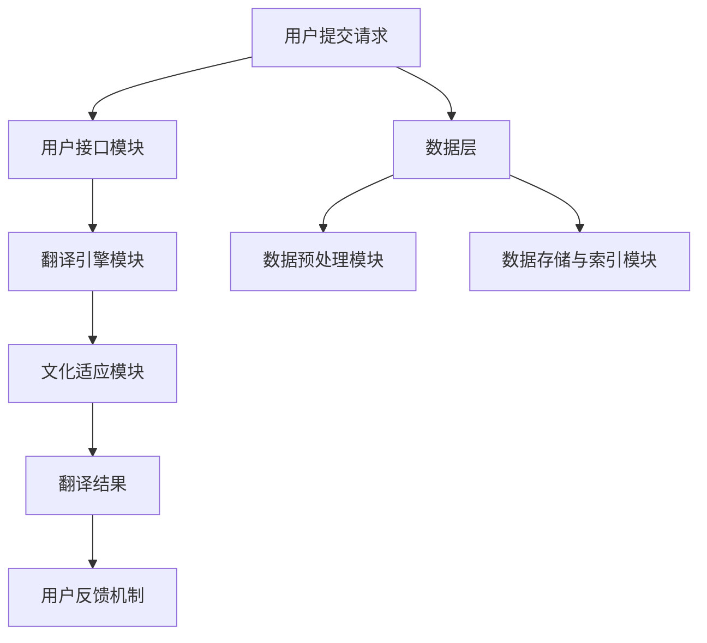

                 

# 《跨境电商的AI语言本地化：自动化翻译与文化适应系统》

> 关键词：跨境电商、AI语言本地化、自动化翻译、文化适应、系统架构、算法原理、项目实战

> 摘要：随着全球电子商务的蓬勃发展，跨境电商成为推动国际贸易的重要力量。然而，语言和文化差异成为跨境电商发展的瓶颈。本文探讨了AI语言本地化的技术原理、系统架构及项目实战，旨在为跨境电商提供一种有效的解决方案，促进全球市场的融合与发展。

## 第一部分：引言

### 第1章：跨境电商与AI语言本地化概述

#### 1.1 跨境电商的发展与挑战

##### 1.1.1 跨境电商的定义与现状

跨境电商，即跨境电子商务，是指通过互联网平台进行跨国交易的商业活动。近年来，随着互联网技术的普及和消费者购买力的提升，跨境电商市场呈现出爆炸式增长。根据统计数据，全球跨境电商市场规模已超过万亿美元，成为国际贸易的重要组成部分。

##### 1.1.2 跨境电商面临的挑战

虽然跨境电商具有巨大的市场潜力，但语言和文化差异成为其主要挑战。首先，不同国家的消费者语言习惯不同，导致商品描述、客户服务、订单处理等方面存在困难。其次，文化差异可能导致营销策略不适用，影响销售业绩。此外，跨境物流和支付系统的不完善也增加了跨境电商的运营成本。

##### 1.1.3 AI语言本地化的意义

AI语言本地化是解决跨境电商语言和文化差异问题的一种有效手段。通过AI技术，可以实现自动化翻译和文化适应，降低人工成本，提高翻译质量，满足全球消费者的需求。AI语言本地化不仅有助于提升用户体验，还能增加品牌认知度和市场份额。

#### 1.2 AI语言本地化的技术基础

##### 1.2.1 自然语言处理技术

自然语言处理（NLP）是AI语言本地化的核心技术之一。NLP技术能够理解、处理和生成人类语言，为自动化翻译和文化适应提供基础支持。主要技术包括分词、词性标注、句法分析、语义分析等。

##### 1.2.2 机器翻译技术

机器翻译技术是AI语言本地化的关键组成部分。通过机器翻译，可以将一种语言自动转换为另一种语言，实现跨语言信息传递。主要技术包括统计机器翻译、神经网络机器翻译和转换器架构。

##### 1.2.3 文化适应技术

文化适应技术旨在理解和适应不同文化背景下的语言表达和习惯。通过文化适应，可以实现更符合目标市场需求的翻译结果，提升用户体验。主要技术包括文化差异识别、文化适应策略和文化适应效果评估。

## 第二部分：AI语言本地化的核心算法原理

### 第2章：AI语言本地化的核心算法原理

#### 2.1 机器翻译算法原理

##### 2.1.1 统计机器翻译

统计机器翻译（SMT）是基于统计方法进行翻译的算法。它通过大量双语语料库，学习源语言和目标语言之间的对应关系，从而实现翻译。主要算法包括基于短语的SMT和基于句法的SMT。

##### 2.1.2 神经网络机器翻译

神经网络机器翻译（NMT）是基于深度学习进行翻译的算法。它通过神经网络模型，将源语言映射到目标语言。NMT在翻译质量和效率方面具有显著优势。

##### 2.1.3 转换器架构

转换器架构（Transformer）是一种基于自注意力机制的神经网络模型，广泛应用于机器翻译领域。它通过自注意力机制，捕捉长距离依赖关系，实现高效的翻译。

#### 2.2 文化适应算法原理

##### 2.2.1 文化差异识别

文化差异识别是文化适应的第一步，旨在识别不同文化背景下的语言表达和习惯。通过数据分析和机器学习算法，可以自动识别文化差异。

##### 2.2.2 文化适应策略

文化适应策略是针对识别出的文化差异，采取相应的翻译策略。主要策略包括保留原文、替换、调整语序等。

##### 2.2.3 文化适应效果评估

文化适应效果评估是验证文化适应策略有效性的重要环节。通过评估指标和评估方法，可以对文化适应效果进行量化分析。

## 第三部分：自动化翻译系统的设计与实现

### 第3章：自动化翻译系统的架构设计

#### 3.1 系统架构概述

##### 3.1.1 系统架构的组成部分

自动化翻译系统主要包括数据预处理模块、翻译引擎模块和文化适应系统模块。每个模块负责处理不同的任务，协同工作实现高效翻译。

##### 3.1.2 系统架构的层次结构

系统架构分为数据层、算法层和应用层。数据层负责数据存储和索引，算法层负责翻译和文化适应算法的实现，应用层负责与用户交互。

##### 3.1.3 系统架构的交互模式

系统采用分布式架构，支持水平扩展。各个模块通过消息队列和API进行交互，实现高效通信和协同工作。

#### 3.2 数据预处理模块设计

##### 3.2.1 数据采集与清洗

数据预处理模块首先从各种数据源采集原始数据，包括文本、图像、语音等。然后对数据进行清洗和去重，去除无效信息。

##### 3.2.2 数据预处理算法

数据预处理算法包括分词、词性标注、句法分析和语义分析等。这些算法将原始数据转换为结构化的数据，为后续翻译和文化适应提供基础。

##### 3.2.3 数据存储与索引

预处理后的数据存储在分布式数据库中，并建立索引，以便快速查询和检索。

#### 3.3 翻译引擎模块设计

##### 3.3.1 翻译引擎的核心算法

翻译引擎模块采用神经网络机器翻译算法，通过自注意力机制实现高效翻译。

##### 3.3.2 翻译引擎的性能优化

翻译引擎的性能优化包括模型压缩、量化、加速等。通过这些优化手段，可以提高翻译引擎的运行效率。

##### 3.3.3 翻译引擎的扩展与维护

翻译引擎支持自定义扩展，以便适应不同的应用场景。同时，定期更新和维护翻译模型，确保翻译质量。

### 第4章：文化适应系统的设计与实现

#### 4.1 文化适应系统的概述

##### 4.1.1 文化适应系统的定义与目标

文化适应系统是一种旨在理解和适应不同文化背景下的语言表达和习惯的AI系统。其目标是实现更符合目标市场需求的翻译结果，提升用户体验。

##### 4.1.2 文化适应系统的组成部分

文化适应系统包括文化差异识别模块、文化适应策略模块和文化适应效果评估模块。每个模块负责不同的任务，共同实现文化适应。

##### 4.1.3 文化适应系统的运作流程

文化适应系统的运作流程包括文化差异识别、文化适应策略和文化适应效果评估。通过这三个环节，实现翻译结果的文化适应。

#### 4.2 文化差异识别模块设计

##### 4.2.1 文化差异识别算法

文化差异识别模块采用基于数据分析和机器学习算法的识别方法。通过分析大量双语语料库，识别出不同文化背景下的语言表达和习惯。

##### 4.2.2 文化差异识别的数据来源

文化差异识别的数据来源包括双语语料库、社交媒体、新闻媒体等。这些数据提供了丰富的文化差异信息。

##### 4.2.3 文化差异识别的性能评估

通过评估指标和评估方法，对文化差异识别模块的性能进行量化分析，确保其有效性和准确性。

#### 4.3 文化适应策略模块设计

##### 4.3.1 文化适应策略的分类

文化适应策略包括保留原文、替换、调整语序等。根据不同文化差异，选择合适的策略实现文化适应。

##### 4.3.2 文化适应策略的算法实现

文化适应策略的算法实现包括规则匹配、机器学习等。通过算法实现，实现文化适应策略的自动化。

##### 4.3.3 文化适应策略的优化与调整

根据实际应用效果，对文化适应策略进行优化和调整，提高其适应性和效果。

#### 4.4 文化适应效果评估模块设计

##### 4.4.1 文化适应效果评估指标

文化适应效果评估指标包括翻译质量、用户体验、市场份额等。通过这些指标，评估文化适应系统的效果。

##### 4.4.2 文化适应效果评估方法

文化适应效果评估方法包括实验评估、用户调查等。通过这些方法，对文化适应系统进行全方位评估。

##### 4.4.3 文化适应效果评估的案例研究

通过具体案例，分析文化适应系统的效果，为后续优化提供依据。

## 第四部分：项目实战

### 第5章：跨境电商平台AI语言本地化项目实战

#### 5.1 项目背景与目标

##### 5.1.1 项目背景

某知名跨境电商平台在拓展国际市场时，面临着语言和文化差异的挑战。为了提升用户体验和市场份额，平台决定实施AI语言本地化项目。

##### 5.1.2 项目目标

项目目标包括实现自动化翻译、提高翻译质量、降低人工成本、提升用户体验和品牌认知度。

#### 5.2 系统需求分析

##### 5.2.1 系统功能需求

系统功能需求包括文本翻译、图像翻译、语音翻译、文化适应和用户反馈机制。

##### 5.2.2 系统性能需求

系统性能需求包括高并发处理能力、快速响应时间、高准确性和高稳定性。

##### 5.2.3 系统安全性需求

系统安全性需求包括数据安全、用户隐私保护和系统安全防护。

#### 5.3 系统设计与实现

##### 5.3.1 系统架构设计

系统采用分布式架构，包括数据层、算法层和应用层。各个模块通过消息队列和API进行通信。

##### 5.3.2 系统模块划分

系统模块划分为数据预处理模块、翻译引擎模块和文化适应系统模块。

##### 5.3.3 系统开发与测试

系统开发采用敏捷开发模式，分阶段进行开发、测试和优化。

#### 5.4 项目实施与评估

##### 5.4.1 项目实施过程

项目实施过程包括需求分析、系统设计、开发、测试和上线等阶段。

##### 5.4.2 项目评估与改进

通过用户反馈和性能评估，对系统进行持续优化和改进。

### 第6章：AI语言本地化在跨境电商中的应用案例分析

#### 6.1 案例背景与目标

##### 6.1.1 案例背景

某跨境电商平台在拓展欧洲市场时，面临着语言和文化差异的挑战。为了提升用户体验和市场份额，平台决定实施AI语言本地化项目。

##### 6.1.2 案例目标

案例目标包括实现自动化翻译、提高翻译质量、降低人工成本、提升用户体验和品牌认知度。

#### 6.2 案例实施过程

##### 6.2.1 数据收集与预处理

从多个数据源收集双语语料库，进行数据清洗和预处理。

##### 6.2.2 机器翻译模型训练

采用神经网络机器翻译算法，训练机器翻译模型。

##### 6.2.3 文化适应策略实施

根据欧洲市场的文化特点，实施相应的文化适应策略。

#### 6.3 案例评估与结果分析

##### 6.3.1 案例评估指标

评估指标包括翻译质量、用户体验、市场份额和运营成本等。

##### 6.3.2 案例评估结果

通过用户反馈和性能评估，评估AI语言本地化项目的效果。

##### 6.3.3 结果分析与启示

分析案例结果，总结经验教训，为后续项目提供借鉴。

## 第五部分：未来展望与挑战

### 第7章：AI语言本地化的未来趋势与发展方向

#### 7.1 未来趋势分析

##### 7.1.1 技术发展趋势

随着AI技术的快速发展，AI语言本地化技术将更加成熟和高效。深度学习、自然语言处理、语音识别等技术的进步，将为AI语言本地化提供更强支持。

##### 7.1.2 市场发展趋势

随着跨境电商市场的不断扩大，AI语言本地化市场需求将持续增长。未来，更多企业和平台将采用AI语言本地化技术，提升用户体验和竞争力。

##### 7.1.3 社会发展趋势

全球化进程加快，跨文化交流日益频繁，AI语言本地化将促进各国人民的沟通与交流，推动世界和平与发展。

#### 7.2 发展方向探讨

##### 7.2.1 技术创新方向

在技术创新方向上，未来将出现更多基于AI的语言本地化工具和平台，满足多样化的应用需求。同时，多模态翻译、实时翻译等新技术将得到广泛应用。

##### 7.2.2 应用拓展方向

AI语言本地化将在更多领域得到应用，如教育、医疗、旅游等。通过跨学科融合，AI语言本地化将发挥更大价值。

##### 7.2.3 政策与法规方向

随着AI语言本地化技术的发展，相关政策与法规将逐步完善。这将有助于规范行业行为，保障用户权益，促进市场的健康发展。

#### 7.3 面临的挑战与对策

##### 7.3.1 技术挑战

技术挑战包括翻译准确性、文化适应性、实时性等方面。未来需要不断提升技术水平和算法效率，以满足不断变化的市场需求。

##### 7.3.2 市场挑战

市场挑战包括竞争加剧、用户需求多样化等。企业需要不断创新，提供高质量的服务，以赢得市场份额。

##### 7.3.3 社会挑战

社会挑战包括数据安全、隐私保护等方面。未来需要加强相关法律法规的制定和执行，确保AI语言本地化技术的安全可靠。

### 第8章：结论与展望

#### 8.1 主要成果总结

本文系统地探讨了AI语言本地化的技术原理、系统架构及项目实战。通过研究，得出以下主要成果：

1. AI语言本地化是解决跨境电商语言和文化差异问题的有效手段。
2. 机器翻译和文化适应技术是实现AI语言本地化的关键。
3. 自动化翻译系统在跨境电商平台中具有广泛的应用前景。

#### 8.2 不足与展望

尽管本文取得了一定的成果，但仍存在以下不足：

1. AI语言本地化的技术尚需进一步完善和优化。
2. 文化适应策略的多样性和适应性有待提高。
3. 案例研究有限，未来需开展更多实际应用案例。

展望未来，AI语言本地化将面临更多机遇和挑战。通过技术创新和应用拓展，AI语言本地化有望在全球范围内发挥更大作用，推动跨境电商的繁荣与发展。同时，我们也需关注数据安全、隐私保护等社会问题，确保AI语言本地化技术的可持续健康发展。作者：AI天才研究院/AI Genius Institute & 禅与计算机程序设计艺术 /Zen And The Art of Computer Programming## 文章标题：跨境电商的AI语言本地化：自动化翻译与文化适应系统

### 关键词：
跨境电商、AI语言本地化、自动化翻译、文化适应、系统架构、算法原理、项目实战

### 摘要：
随着跨境电商市场的全球化发展，语言和文化差异成为阻碍其进一步扩展的主要障碍。本文探讨了利用人工智能（AI）技术实现语言本地化的方法，特别是自动化翻译和文化适应系统的设计与实现。文章首先介绍了跨境电商的发展背景和面临的挑战，随后详细阐述了AI语言本地化的技术基础，包括自然语言处理、机器翻译和文化适应算法。接着，文章讨论了自动化翻译系统的架构设计和文化适应系统的实现细节，通过实际项目案例展示了AI语言本地化在跨境电商中的应用效果。最后，文章展望了AI语言本地化的未来发展趋势，并提出了相应的挑战和对策。本文旨在为跨境电商企业提供技术指南，助力其在全球市场中的竞争力提升。

### 引言

随着互联网技术的飞速发展，电子商务已经成为全球商业活动的重要组成部分。特别是在全球化进程加快的今天，跨境电商成为了推动国际贸易增长的新动力。然而，跨境电商在快速发展的同时也面临着诸多挑战，其中最为显著的就是语言和文化差异问题。不同国家的消费者使用不同的语言，有着不同的文化习惯和消费偏好，这给跨境电商的运营带来了巨大的困难。

语言差异是跨境电商运营中最直接的问题之一。消费者往往需要将商品描述、用户评论、订单信息等翻译成自己熟悉的语言，以便更好地理解和购买商品。然而，传统的手动翻译不仅成本高昂，而且容易出现翻译错误，影响用户体验和购买决策。此外，文化差异也会导致翻译结果不够准确，甚至出现误解，进一步阻碍跨境电商的推广。

为了解决这一问题，AI语言本地化技术应运而生。AI语言本地化利用人工智能技术，包括自然语言处理、机器翻译和文化适应算法，实现自动化翻译和文化适应，从而提高翻译质量和效率，降低运营成本，提升用户体验。本文将围绕跨境电商的AI语言本地化展开讨论，首先介绍跨境电商的发展背景和挑战，然后详细探讨AI语言本地化的技术基础，包括机器翻译和文化适应算法，最后通过实际项目案例展示AI语言本地化的应用效果和未来发展趋势。

### 第一部分：跨境电商与AI语言本地化概述

#### 第1章：跨境电商的发展与挑战

##### 1.1 跨境电商的定义与现状

跨境电商，即跨境电子商务，指的是在互联网平台上进行的跨国商品或服务的交易活动。它不仅包括商品的买卖，还涵盖了支付、物流、客户服务等多个环节。随着全球互联网的普及和电子商务的快速发展，跨境电商已经成为了国际贸易的重要组成部分。

根据统计数据显示，全球跨境电商市场规模在过去几年中呈现爆发式增长。据eMarketer的数据，2021年全球跨境电商市场规模已经达到1万亿美元，预计到2025年将达到2.3万亿美元。这一增长趋势表明，跨境电商在全球贸易中的地位越来越重要，它不仅为消费者提供了更多选择，也为企业开辟了新的市场机会。

然而，跨境电商的发展也面临诸多挑战，其中最显著的就是语言和文化差异。不同国家的消费者使用不同的语言，有着不同的文化习惯和消费偏好，这给跨境电商的运营带来了巨大的困难。首先，消费者在购买商品时需要阅读商品描述、用户评论、订单信息等，这些内容通常都是用英文或其他外语编写的。对于非英语国家的消费者来说，理解和翻译这些信息不仅耗时，还可能导致误解和购买决策失误。

其次，文化差异也会影响跨境电商的运营。例如，不同国家的消费者对同一商品的评价可能截然不同，这可能是由于他们对商品功能、外观、质量等方面的理解存在差异。此外，一些文化习惯和风俗也可能导致营销策略不适用。例如，在某些国家，送礼是一种重要的社交礼仪，但在其他国家则可能被视为不合适的行为。这些文化差异需要企业在营销和客户服务策略上做出调整，以避免文化冲突和影响销售。

##### 1.2 跨境电商面临的挑战

尽管跨境电商具有巨大的市场潜力，但其发展仍然面临许多挑战。以下是跨境电商在运营过程中面临的一些主要挑战：

1. **语言差异**：如前所述，语言差异是跨境电商面临的最直接挑战之一。消费者需要理解和翻译商品描述、用户评论、订单信息等，这既耗时又容易出错。

2. **文化差异**：文化差异可能导致消费者对商品和品牌的看法不一致，从而影响购买决策。例如，一些品牌在特定国家的广告和营销策略可能不适合该国的文化背景。

3. **物流和配送**：跨境电商涉及到跨国物流和配送，这包括报关、清关、运输等多个环节。物流和配送的复杂性和不确定性增加了运营成本和时间。

4. **支付问题**：跨境支付系统的不完善和不兼容性也是跨境电商面临的一个挑战。不同的国家和地区可能有不同的支付习惯和支付方式，这需要企业提供多样化的支付选项，以满足不同消费者的需求。

5. **法规和税务**：跨境电商需要遵守不同国家和地区的法律法规，包括海关规定、税务政策等。合规性问题不仅影响企业的运营成本，还可能影响企业的声誉。

##### 1.3 AI语言本地化的意义

为了解决跨境电商面临的这些挑战，AI语言本地化技术应运而生。AI语言本地化利用人工智能技术，特别是自然语言处理和机器翻译技术，实现自动化翻译和文化适应，从而提高翻译质量和效率，降低运营成本，提升用户体验。以下是AI语言本地化的几个关键意义：

1. **提高翻译质量**：传统的手动翻译不仅成本高，而且容易出现错误。AI语言本地化通过机器翻译技术，可以大幅提高翻译质量，减少人为错误。

2. **降低运营成本**：AI语言本地化自动化了翻译过程，减少了人工成本和人力资源投入，提高了运营效率。

3. **提升用户体验**：通过自动化翻译和文化适应，消费者可以轻松理解商品描述、用户评论和订单信息，提高购物体验。

4. **扩大市场覆盖**：AI语言本地化使企业能够将商品和服务推向更多的国家和地区，从而扩大市场覆盖范围。

5. **增强品牌认知度**：通过提供高质量的翻译和文化适应服务，企业可以增强品牌在目标市场的认知度和影响力。

#### 1.4 AI语言本地化的技术基础

AI语言本地化依赖于多种先进的人工智能技术，其中最为关键的是自然语言处理（NLP）、机器翻译（MT）和文化适应（CA）。以下是这些技术的简要介绍：

1. **自然语言处理（NLP）**：NLP是AI语言本地化的基础技术之一，它涉及文本的分词、词性标注、句法分析、语义分析等。通过NLP技术，系统能够理解和处理人类语言，为翻译和文化适应提供支持。

2. **机器翻译（MT）**：机器翻译是将一种语言的文本自动转换为另一种语言的文本。目前，机器翻译技术主要包括统计机器翻译（SMT）和神经网络机器翻译（NMT）。NMT在翻译质量和效率方面具有显著优势。

3. **文化适应（CA）**：文化适应旨在理解和适应不同文化背景下的语言表达和习惯。通过文化适应技术，翻译结果可以更符合目标市场的需求，提高用户体验。

总的来说，AI语言本地化通过集成NLP、MT和CA技术，实现自动化翻译和文化适应，为跨境电商提供了一种有效的解决方案，助力企业在全球市场中的竞争力和可持续发展。

### 第二部分：AI语言本地化的核心算法原理

#### 第2章：AI语言本地化的核心算法原理

在AI语言本地化中，机器翻译和文化适应是两个核心算法，它们共同作用，为跨境电商提供高质量的翻译和文化适应服务。本章节将详细介绍这两个核心算法的原理，包括统计机器翻译、神经网络机器翻译、文化差异识别和文化适应策略。

#### 2.1 机器翻译算法原理

机器翻译（Machine Translation，MT）是将一种语言的文本自动转换为另一种语言的文本的技术。机器翻译算法可以分为两大类：统计机器翻译（Statistical Machine Translation，SMT）和神经网络机器翻译（Neural Machine Translation，NMT）。

##### 2.1.1 统计机器翻译（SMT）

统计机器翻译是基于统计学方法进行翻译的算法。它利用大量双语语料库（双语文本对）来学习源语言和目标语言之间的对应关系，从而实现翻译。SMT的主要组成部分包括：

1. **翻译模型（Translation Model）**：翻译模型用于预测源语言句子中的词序列如何转换为目标语言句子中的词序列。它通常基于统计方法，如基于短语的翻译模型和基于句法的翻译模型。

2. **语言模型（Language Model）**：语言模型用于预测目标语言句子中的词序列的概率分布。它基于目标语言的统计特性，如词频和语法结构。

3. **词汇表（Dictionary）**：词汇表用于存储源语言和目标语言之间的词汇映射关系。它通常包含词汇的翻译信息，如一词多义和词性标注。

统计机器翻译的流程主要包括以下几个步骤：

1. **预处理**：对源语言文本进行分词、词性标注等处理，使其适合后续的翻译过程。

2. **词序列转换**：利用翻译模型将源语言词序列转换为中间表示。

3. **语言模型优化**：利用语言模型优化中间表示，使其更符合目标语言的语法和语义特性。

4. **解码**：将优化后的中间表示解码为目标语言词序列。

统计机器翻译的优点是翻译速度快，适用于大规模文本的快速翻译。然而，其翻译质量通常不如神经网络机器翻译，特别是在处理长句和复杂语义时。

##### 2.1.2 神经网络机器翻译（NMT）

神经网络机器翻译是基于深度学习进行翻译的算法。与统计机器翻译不同，NMT通过神经网络模型直接将源语言映射到目标语言。NMT的主要组成部分包括：

1. **编码器（Encoder）**：编码器用于将源语言文本编码为一个固定长度的向量表示。

2. **解码器（Decoder）**：解码器用于将编码器的输出解码为目标语言词序列。

3. **注意力机制（Attention Mechanism）**：注意力机制用于捕捉源语言和目标语言之间的长距离依赖关系，提高翻译质量。

神经网络机器翻译的流程主要包括以下几个步骤：

1. **预处理**：对源语言文本进行分词、词性标注等处理。

2. **编码**：利用编码器将源语言文本编码为一个向量表示。

3. **解码**：利用解码器逐步解码目标语言词序列。

4. **后处理**：对解码结果进行后处理，如语言模型优化、词汇替换等。

神经网络机器翻译的优点是翻译质量高，能够处理长句和复杂语义。此外，NMT具有良好的扩展性和适应性，可以轻松适应不同的翻译任务和语言对。

##### 2.1.3 转换器架构（Transformer）

转换器架构（Transformer）是一种基于自注意力机制的神经网络模型，广泛应用于机器翻译领域。Transformer模型的核心思想是利用自注意力机制，对输入序列进行加权处理，从而捕捉序列中的长距离依赖关系。

转换器架构的主要组成部分包括：

1. **多头自注意力（Multi-Head Self-Attention）**：多头自注意力是对输入序列进行加权处理的核心机制。它通过多个注意力头，捕捉不同位置的依赖关系。

2. **前馈神经网络（Feed Forward Neural Network）**：前馈神经网络用于对自注意力结果进行进一步处理，增强模型的表示能力。

3. **编码器（Encoder）**：编码器用于将源语言文本编码为序列向量。

4. **解码器（Decoder）**：解码器用于将目标语言文本解码为序列向量。

转换器架构的机器翻译流程主要包括以下几个步骤：

1. **编码**：利用编码器将源语言文本编码为序列向量。

2. **解码**：利用解码器逐步解码目标语言词序列。

3. **注意力计算**：利用多头自注意力机制，对编码器的输出进行加权处理。

4. **后处理**：对解码结果进行后处理，如语言模型优化、词汇替换等。

转换器架构的引入极大地提升了机器翻译的性能，成为当前机器翻译领域的标准模型。

#### 2.2 文化适应算法原理

文化适应（Cultural Adaptation，CA）是AI语言本地化的重要组成部分，旨在理解和适应不同文化背景下的语言表达和习惯。文化适应算法通过识别文化差异，采取相应的策略，使翻译结果更符合目标市场的文化需求。

##### 2.2.1 文化差异识别

文化差异识别（Cultural Difference Identification，CDI）是文化适应的第一步，旨在识别不同文化背景下的语言表达和习惯。文化差异识别算法通常基于以下几种方法：

1. **文本分析**：通过分析双语语料库中的文本数据，识别出文化差异。例如，使用词频统计、主题模型等方法，识别出不同文化中的高频词汇和表达方式。

2. **数据挖掘**：通过数据挖掘技术，从大量非结构化数据中提取文化差异信息。例如，使用关联规则挖掘、分类和聚类等方法，识别出文化差异。

3. **机器学习**：利用机器学习算法，对文化差异进行自动识别。例如，使用监督学习和无监督学习算法，对文化差异进行分类和标注。

文化差异识别的流程主要包括以下几个步骤：

1. **数据采集**：从多种数据源（如社交媒体、新闻媒体、论坛等）采集与文化相关的文本数据。

2. **预处理**：对采集到的文本数据进行清洗和预处理，包括分词、词性标注等。

3. **特征提取**：提取文本数据中的关键特征，如词汇、短语、句法结构等。

4. **模型训练**：使用训练数据集，训练文化差异识别模型，使其能够自动识别文化差异。

##### 2.2.2 文化适应策略

文化适应策略（Cultural Adaptation Strategy，CAS）是针对识别出的文化差异，采取相应的翻译策略，以使翻译结果更符合目标市场的文化需求。常见的文化适应策略包括：

1. **保留原文**：在翻译过程中，保留原文中的文化元素，不进行任何改动。这种方法适用于文化差异较小或者原文文化元素对目标市场有重要意义的情况。

2. **替换**：用目标市场的文化表达替换原文中的文化元素。例如，将原文中的特定词汇替换为目标市场中的等效表达。这种方法适用于原文文化元素在目标市场中有负面含义或不被理解的情况。

3. **调整语序**：在翻译过程中，调整原文中的语言结构，使其更符合目标市场的语法和表达习惯。例如，调整主语、谓语、宾语的位置，使句子更加通顺。

4. **注释解释**：在翻译过程中，对原文中的文化元素进行注释或解释，帮助目标市场的读者更好地理解原文的含义。例如，对特定词汇或短语进行解释，提供背景信息。

文化适应策略的选取需要考虑目标市场的文化背景、消费者的语言习惯和偏好。通过灵活运用不同的文化适应策略，可以显著提升翻译结果的质量和适切性。

##### 2.2.3 文化适应效果评估

文化适应效果评估（Cultural Adaptation Effect Assessment，CAEA）是验证文化适应策略有效性的重要环节。通过评估文化适应效果，可以确定翻译结果是否符合目标市场的文化需求，为后续优化提供依据。

文化适应效果评估的方法包括：

1. **用户调查**：通过用户调查，收集目标市场消费者对翻译结果的反馈，评估其接受度和满意度。

2. **实验评估**：设计实验，对比文化适应前后的翻译结果，评估文化适应对翻译质量的影响。

3. **量化指标**：使用量化指标，如翻译准确率、理解度、流畅度等，评估翻译结果的质量。

通过用户调查、实验评估和量化指标的综合评估，可以全面了解文化适应策略的效果，为优化翻译策略提供科学依据。

总的来说，AI语言本地化通过机器翻译和文化适应算法，实现了自动化翻译和文化适应，为跨境电商提供了高效、高质量的翻译服务。通过不断优化和改进算法，AI语言本地化将继续提升翻译质量和用户体验，助力跨境电商在全球市场中的发展。

### 第二部分：自动化翻译系统的架构设计

#### 第3章：自动化翻译系统的架构设计

自动化翻译系统是跨境电商实现AI语言本地化的关键组件，其架构设计直接影响到系统的性能、可扩展性和用户体验。本章节将详细介绍自动化翻译系统的架构设计，包括系统组成部分、层次结构和交互模式。

##### 3.1 系统架构概述

自动化翻译系统通常由多个模块组成，每个模块负责特定的功能，协同工作实现高效翻译。以下是系统的主要组成部分：

1. **数据预处理模块**：负责对输入文本进行预处理，包括分词、词性标注、句子分割等。该模块确保输入数据的质量，为后续翻译过程提供可靠的基础。

2. **翻译引擎模块**：是系统的核心，负责执行机器翻译任务。该模块采用先进的机器翻译算法，如神经网络机器翻译（NMT），实现高质量、高效率的翻译。

3. **后处理模块**：对翻译结果进行后处理，包括语言模型优化、词汇替换、语法修正等。该模块确保翻译结果的流畅性和准确性。

4. **文化适应模块**：负责识别和适应不同文化背景下的语言表达，确保翻译结果符合目标市场的文化需求。

5. **用户接口模块**：提供用户与系统交互的接口，包括网页界面、API接口等。该模块使用户能够方便地提交翻译请求，获取翻译结果。

##### 3.2 系统架构的层次结构

自动化翻译系统的层次结构通常包括以下几层：

1. **数据层**：负责数据的存储、检索和管理。该层使用数据库和数据存储技术，如NoSQL数据库、云存储等，确保数据的高可用性和可扩展性。

2. **算法层**：实现各种翻译算法和文化适应策略，包括NLP、机器翻译、文化差异识别等。该层是系统的核心，决定了翻译质量和效率。

3. **应用层**：提供翻译服务，包括文本翻译、语音翻译、图像翻译等。该层与用户接口模块交互，响应用户请求，返回翻译结果。

4. **用户接口层**：负责与用户交互，提供友好的用户界面和API接口。该层使用Web前端技术，如HTML、CSS、JavaScript等，实现用户友好的界面。

##### 3.3 系统架构的交互模式

自动化翻译系统采用分布式架构，支持水平扩展。各个模块通过消息队列和API进行交互，实现高效通信和协同工作。以下是系统架构的交互模式：

1. **数据层与算法层**：数据预处理模块将预处理后的文本数据传递给翻译引擎模块，翻译引擎模块使用机器翻译算法进行翻译。

2. **算法层与后处理模块**：翻译引擎模块生成的初步翻译结果传递给后处理模块，后处理模块进行优化和修正，生成最终的翻译结果。

3. **后处理模块与文化适应模块**：后处理模块可以将翻译结果传递给文化适应模块，文化适应模块根据目标市场的文化特点，进行进一步调整和优化。

4. **用户接口层与应用层**：用户通过用户接口模块提交翻译请求，应用层处理翻译请求，调用后处理模块和文化适应模块，最终返回翻译结果给用户。

通过层次结构和交互模式的合理设计，自动化翻译系统可以高效、可靠地实现翻译任务，满足跨境电商的多样化需求。

##### 3.4 数据预处理模块设计

数据预处理模块是自动化翻译系统的关键组成部分，其设计直接影响到输入数据的质量和翻译效果。以下是数据预处理模块的设计细节：

1. **数据采集与清洗**：数据预处理模块首先从各种数据源采集原始文本数据，如商品描述、用户评论、订单信息等。然后对数据进行清洗，去除无效数据和噪声，如HTML标签、特殊字符等。清洗过程还包括数据去重，确保数据的唯一性和一致性。

2. **数据预处理算法**：数据预处理算法包括分词、词性标注、句子分割等。分词算法将文本分割成单词或短语，词性标注算法为每个词标注词性，如名词、动词、形容词等。句子分割算法将文本分割成句子，以便后续处理。常用的分词算法有基于词典的分词算法和基于统计的分词算法。词性标注算法通常使用监督学习或半监督学习方法，如最大熵模型、条件随机场（CRF）等。

3. **数据存储与索引**：预处理后的数据存储在分布式数据库中，并建立索引，以便快速查询和检索。索引技术包括倒排索引、布隆过滤器等，可以提高数据检索效率和系统性能。

4. **数据质量评估**：为了确保数据质量，数据预处理模块还包括数据质量评估功能。通过对比预处理前后的数据，评估数据预处理的效果。常用的评估指标包括数据完整性、一致性、准确性等。

通过以上设计，数据预处理模块可以高效地处理原始文本数据，确保输入数据的质量，为翻译系统提供可靠的数据基础。

##### 3.5 翻译引擎模块设计

翻译引擎模块是自动化翻译系统的核心，其设计直接关系到翻译质量和效率。以下是翻译引擎模块的设计细节：

1. **翻译引擎的核心算法**：翻译引擎模块采用神经网络机器翻译（NMT）算法，如基于Transformer的模型。Transformer模型具有自注意力机制，能够捕捉长距离依赖关系，提高翻译质量。常用的NMT模型包括基于编码器-解码器架构的模型和基于转换器架构的模型。

2. **模型训练与优化**：翻译引擎模块使用大规模双语语料库进行模型训练。训练过程包括数据预处理、模型初始化、训练迭代、评估和优化等步骤。通过调整模型参数和训练策略，优化模型性能。常用的训练算法包括随机梯度下降（SGD）、Adam优化器等。

3. **翻译过程**：翻译引擎模块的核心功能是将源语言文本翻译成目标语言文本。翻译过程包括以下几个步骤：

   - **编码**：使用编码器将源语言文本编码为固定长度的向量表示。
   - **解码**：使用解码器逐步解码目标语言词序列。
   - **注意力计算**：通过自注意力机制，捕捉源语言和目标语言之间的依赖关系。
   - **后处理**：对解码结果进行后处理，如语言模型优化、词汇替换等，提高翻译结果的流畅性和准确性。

4. **性能优化**：为了提高翻译引擎的性能，可以采用多种优化技术，如模型压缩、量化、硬件加速等。通过这些优化手段，可以降低模型大小、提高运行速度，满足大规模实时翻译需求。

通过以上设计，翻译引擎模块可以实现高效、高质量的翻译，满足跨境电商的多样化翻译需求。

##### 3.6 翻译引擎的性能优化

翻译引擎的性能优化是自动化翻译系统的重要环节，其设计直接影响系统的响应速度和翻译质量。以下是翻译引擎的性能优化方法：

1. **模型压缩**：模型压缩是通过减少模型参数数量和计算复杂度，降低模型大小，提高运行效率。常用的模型压缩技术包括量化、剪枝、蒸馏等。量化技术将模型参数从浮点数转换为整数，减少存储和计算需求。剪枝技术通过删除模型中不重要的参数，降低计算复杂度。蒸馏技术通过将大型模型的知识传递给小型模型，提高小型模型的表现。

2. **硬件加速**：硬件加速是利用GPU、TPU等专用硬件设备，提高模型运行速度。GPU（图形处理器）具有强大的并行计算能力，适合大规模矩阵运算。TPU（张量处理器）是谷歌开发的专用硬件，专为深度学习任务优化。通过硬件加速，可以显著提高翻译引擎的处理速度，满足实时翻译需求。

3. **分布式计算**：分布式计算是将计算任务分布在多个节点上，通过并行处理提高计算效率。在自动化翻译系统中，可以将翻译任务分解为多个子任务，分配给不同的计算节点。通过分布式计算，可以充分利用系统资源，提高翻译引擎的处理能力。

4. **缓存技术**：缓存技术是利用内存或磁盘存储频繁访问的数据，减少I/O操作，提高系统响应速度。在自动化翻译系统中，可以采用缓存技术存储常用翻译结果和中间计算结果，减少重复计算和I/O操作。

5. **动态调整**：动态调整是根据系统的负载情况，动态调整资源分配和计算策略。例如，根据实时翻译请求量，动态调整模型参数和计算资源，确保系统在高负载情况下仍能保持高性能。

通过以上优化方法，翻译引擎可以显著提高运行速度和翻译质量，满足跨境电商的多样化需求。

##### 3.7 翻译引擎的扩展与维护

为了满足不断变化的翻译需求，翻译引擎需要具备良好的扩展性和维护性。以下是翻译引擎的扩展与维护方法：

1. **模块化设计**：采用模块化设计，将翻译引擎拆分为多个功能模块，如编码器、解码器、注意力机制等。每个模块具有独立的接口和功能，可以单独开发和维护。通过模块化设计，可以方便地替换、更新或扩展某个模块，而不会影响其他模块。

2. **版本控制**：采用版本控制工具（如Git），管理翻译引擎的代码和配置。通过版本控制，可以追踪代码的修改历史，方便故障排查和代码回滚。同时，版本控制还可以支持多人协作开发，提高开发效率。

3. **持续集成与持续部署（CI/CD）**：采用持续集成和持续部署流程，实现自动化构建、测试和部署。通过CI/CD，可以确保代码质量和部署过程的一致性，提高系统的可靠性和稳定性。CI/CD流程包括代码审查、自动化测试、构建、部署等步骤。

4. **监控与日志管理**：引入监控和日志管理工具（如Prometheus、ELK栈），实时监控翻译引擎的运行状态和性能指标。通过监控和日志分析，可以及时发现和解决问题，确保系统稳定运行。

5. **用户反馈机制**：建立用户反馈机制，收集用户对翻译引擎的反馈和建议。通过用户反馈，可以了解翻译引擎的实际使用情况，发现潜在问题，优化翻译效果。

通过以上方法，翻译引擎可以保持良好的扩展性和维护性，适应跨境电商的不断发展需求。

##### 3.8 文化适应系统的概述

文化适应系统是自动化翻译系统的重要组成部分，其目标是确保翻译结果符合目标市场的文化需求，提升用户体验和销售效果。以下是文化适应系统的概述：

1. **文化适应系统的定义与目标**：文化适应系统是一种通过识别和调整翻译结果中的文化元素，使其更符合目标市场文化的技术。其目标包括：

   - 提高翻译结果的准确性和流畅性。
   - 减少文化误解和冲突。
   - 提升目标市场的用户满意度。

2. **文化适应系统的组成部分**：文化适应系统由多个模块组成，包括：

   - **文化差异识别模块**：用于识别不同文化背景下的语言表达和习惯差异。
   - **文化适应策略模块**：用于根据识别出的文化差异，采取相应的翻译策略，如保留原文、替换、调整语序等。
   - **文化适应效果评估模块**：用于评估文化适应策略的有效性，确保翻译结果符合目标市场的文化需求。

3. **文化适应系统的运作流程**：文化适应系统的运作流程主要包括以下几个步骤：

   - **文化差异识别**：通过分析双语语料库和用户反馈，识别目标市场的文化差异。
   - **文化适应策略应用**：根据识别出的文化差异，应用相应的文化适应策略，调整翻译结果。
   - **文化适应效果评估**：通过用户调查和实验评估，评估文化适应策略的有效性，优化翻译结果。

通过文化适应系统，自动化翻译系统可以更好地适应不同市场的文化需求，提高翻译服务的质量和竞争力。

##### 3.9 文化差异识别模块设计

文化差异识别模块是文化适应系统的关键组成部分，其目标是准确识别不同文化背景下的语言表达和习惯差异。以下是文化差异识别模块的设计：

1. **文化差异识别算法**：文化差异识别算法包括文本分析、数据挖掘和机器学习等方法。通过文本分析，可以识别出不同文化背景下的高频词汇和表达方式。通过数据挖掘，可以从大量非结构化数据中提取文化差异信息。通过机器学习，可以建立模型，自动识别文化差异。常用的算法包括词频统计、主题模型、聚类分析和分类模型等。

2. **文化差异识别的数据来源**：文化差异识别的数据来源包括双语语料库、社交媒体、新闻媒体、用户反馈等。这些数据提供了丰富的文化差异信息，有助于识别不同文化背景下的语言表达和习惯。

3. **文化差异识别的性能评估**：为了确保文化差异识别模块的有效性，需要进行性能评估。常用的评估指标包括识别准确率、召回率、F1分数等。通过实验评估和用户反馈，可以评估文化差异识别模块的性能，并进行优化。

通过以上设计，文化差异识别模块可以高效地识别不同文化背景下的语言表达和习惯差异，为文化适应策略提供可靠的数据基础。

##### 3.10 文化适应策略模块设计

文化适应策略模块是文化适应系统的核心，其目标是根据识别出的文化差异，采取相应的翻译策略，使翻译结果更符合目标市场的文化需求。以下是文化适应策略模块的设计：

1. **文化适应策略的分类**：文化适应策略可以分为保留原文、替换、调整语序、注释解释等。保留原文策略适用于文化差异较小的情况，替换策略适用于原文文化元素不适用于目标市场的情况，调整语序策略适用于原文语序不适用于目标市场的情况，注释解释策略适用于需要解释原文文化元素的情况。

2. **文化适应策略的算法实现**：文化适应策略的算法实现包括规则匹配和机器学习等方法。规则匹配策略根据预定义的规则，自动匹配和调整翻译结果。机器学习策略通过训练模型，自动识别和调整翻译结果。常用的算法包括基于规则的匹配算法、监督学习算法和生成对抗网络（GAN）等。

3. **文化适应策略的优化与调整**：为了提高文化适应策略的效果，需要对策略进行优化和调整。通过用户反馈和实验评估，可以不断优化和调整策略，使其更符合目标市场的文化需求。

通过以上设计，文化适应策略模块可以灵活地适应不同市场的文化差异，提高翻译服务的质量和用户满意度。

##### 3.11 文化适应效果评估模块设计

文化适应效果评估模块是确保文化适应策略有效性的关键环节。以下是文化适应效果评估模块的设计：

1. **文化适应效果评估指标**：文化适应效果评估指标包括翻译准确率、用户满意度、市场表现等。翻译准确率用于评估翻译结果的质量，用户满意度用于评估翻译结果对目标市场用户的接受度，市场表现用于评估翻译结果对销售业绩的影响。

2. **文化适应效果评估方法**：文化适应效果评估方法包括实验评估、用户调查和数据分析等。实验评估通过设计对比实验，评估文化适应策略对翻译结果的影响。用户调查通过收集用户反馈，评估翻译结果的接受度和满意度。数据分析通过统计市场数据和用户行为数据，评估翻译结果对销售业绩的影响。

3. **文化适应效果评估的案例研究**：通过具体案例，评估文化适应策略的效果。例如，可以选取一个跨境电商平台，在实施文化适应策略前后，对比翻译结果的准确率、用户满意度、销售业绩等指标，分析文化适应策略的成效。

通过以上设计，文化适应效果评估模块可以全面评估文化适应策略的有效性，为优化翻译策略提供依据。

### 第三部分：文化适应系统的设计与实现

#### 第4章：文化适应系统的设计与实现

文化适应系统是AI语言本地化的重要组成部分，旨在确保翻译结果符合目标市场的文化需求，提升用户体验和销售效果。本章节将详细讨论文化适应系统的设计与实现，包括文化差异识别、文化适应策略和文化适应效果评估模块的设计与实现。

##### 4.1 文化适应系统的概述

文化适应系统是一种通过识别和调整翻译结果中的文化元素，使其更符合目标市场文化的技术。其核心目标包括：

1. **提高翻译结果的准确性和流畅性**：确保翻译结果不仅准确，而且符合目标市场的语言习惯和文化规范。
2. **减少文化误解和冲突**：通过文化适应，减少因文化差异引起的误解和沟通障碍。
3. **提升目标市场的用户满意度**：使翻译结果更贴近目标市场的文化和价值观，提高用户满意度。

文化适应系统主要由以下三个模块组成：

1. **文化差异识别模块**：负责识别不同文化背景下的语言表达和习惯差异。
2. **文化适应策略模块**：根据识别出的文化差异，采取相应的翻译策略，调整翻译结果。
3. **文化适应效果评估模块**：评估文化适应策略的有效性，确保翻译结果符合目标市场的文化需求。

##### 4.2 文化差异识别模块设计

文化差异识别模块是文化适应系统的第一步，其目标是准确识别不同文化背景下的语言表达和习惯差异。以下是该模块的设计：

1. **文化差异识别算法**：

   - **文本分析**：通过分析双语语料库中的文本数据，识别出不同文化背景下的语言表达和习惯差异。可以使用词频统计、主题模型等方法，分析词汇使用频率和文本结构，识别文化差异。

   - **数据挖掘**：从社交媒体、新闻媒体、论坛等非结构化数据中提取文化差异信息。可以使用关联规则挖掘、分类和聚类等方法，发现文化差异模式。

   - **机器学习**：利用监督学习或无监督学习算法，建立文化差异识别模型。可以使用分类模型（如SVM、随机森林）、聚类模型（如K-means、层次聚类）等，对文化差异进行自动识别。

2. **文化差异识别的数据来源**：

   - **双语语料库**：从公共数据库或企业内部收集双语语料库，包括商品描述、用户评论、订单信息等。
   - **社交媒体**：从社交媒体平台（如Twitter、Facebook、Instagram）收集与文化相关的文本数据。
   - **新闻媒体**：从新闻媒体网站收集与特定文化相关的新闻报道和文章。
   - **用户反馈**：从用户反馈和问卷调查中获取用户对翻译结果的文化适应度评价。

3. **文化差异识别的性能评估**：

   - **识别准确率**：评估模型在识别文化差异时的准确性，使用指标如准确率、召回率和F1分数。
   - **识别速度**：评估模型在处理大量数据时的速度，确保实时性。
   - **泛化能力**：评估模型在不同数据集上的表现，确保其泛化能力。

##### 4.3 文化适应策略模块设计

文化适应策略模块是文化适应系统的核心，其目标是根据识别出的文化差异，采取相应的翻译策略，调整翻译结果。以下是该模块的设计：

1. **文化适应策略的分类**：

   - **保留原文**：在翻译过程中，保留原文中的文化元素，不进行任何改动。适用于文化差异较小或原文文化元素对目标市场有重要意义的情况。
   - **替换**：用目标市场的文化表达替换原文中的文化元素。适用于原文文化元素在目标市场中有负面含义或不被理解的情况。
   - **调整语序**：在翻译过程中，调整原文中的语言结构，使其更符合目标市场的语法和表达习惯。适用于原文语序不适用于目标市场的情况。
   - **注释解释**：在翻译过程中，对原文中的文化元素进行注释或解释，帮助目标市场的读者更好地理解原文的含义。适用于原文中包含特定文化背景信息的情况。

2. **文化适应策略的算法实现**：

   - **基于规则的策略**：使用预定义的规则，自动匹配和调整翻译结果。例如，根据特定的词汇表，将原文中的词汇替换为目标市场的等效表达。
   - **基于机器学习的策略**：利用训练有素的学习模型，自动识别和调整翻译结果。可以使用分类模型（如SVM、随机森林）或生成模型（如变分自编码器、生成对抗网络）。

3. **文化适应策略的优化与调整**：

   - **用户反馈**：通过用户反馈，收集用户对翻译结果的满意度评价，优化文化适应策略。
   - **实验评估**：通过实验评估，对比不同策略的效果，调整和优化策略。
   - **多语言模型训练**：结合多语言数据，训练更准确的文化适应模型，提高策略的普适性。

##### 4.4 文化适应效果评估模块设计

文化适应效果评估模块是确保文化适应策略有效性的关键环节。以下是该模块的设计：

1. **文化适应效果评估指标**：

   - **翻译准确率**：评估翻译结果在词汇和语法层面的准确性。
   - **用户满意度**：评估翻译结果在目标市场用户中的接受度。
   - **市场表现**：评估翻译结果对销售业绩和市场占有率的影响。

2. **文化适应效果评估方法**：

   - **用户调查**：通过问卷调查和用户访谈，收集用户对翻译结果的满意度评价。
   - **实验评估**：设计对比实验，对比实施文化适应策略前后的翻译结果和用户反馈。
   - **数据分析**：分析市场数据和用户行为数据，评估文化适应策略对销售业绩和市场占有率的影响。

3. **文化适应效果评估的案例研究**：

   - **案例背景**：选取一个跨境电商平台，实施文化适应策略前后的翻译结果和市场数据。
   - **评估指标**：包括翻译准确率、用户满意度、市场占有率等。
   - **评估结果**：分析文化适应策略对翻译质量和市场表现的影响，总结经验和教训。

通过以上设计，文化适应效果评估模块可以全面评估文化适应策略的有效性，为优化翻译策略提供依据。

##### 4.5 文化差异识别模块的实现细节

文化差异识别模块的实现涉及到文本分析、数据挖掘和机器学习算法的应用。以下是具体的实现细节：

1. **文本分析**：

   - **词频统计**：使用Python的`nltk`库进行词频统计，分析不同文化背景下的高频词汇。
   - **主题模型**：使用`gensim`库实现LDA（Latent Dirichlet Allocation）主题模型，发现不同文化背景下的主题分布。

2. **数据挖掘**：

   - **关联规则挖掘**：使用`mlxtend`库进行关联规则挖掘，识别出不同文化背景下的关联词汇和短语。
   - **分类和聚类**：使用`scikit-learn`库实现分类模型（如SVM、随机森林）和聚类模型（如K-means、层次聚类），识别文化差异。

3. **机器学习**：

   - **分类模型**：使用`scikit-learn`库训练SVM和随机森林模型，对文化差异进行分类。
   - **聚类模型**：使用`scikit-learn`库训练K-means和层次聚类模型，对文化差异进行聚类。

4. **代码示例**：

   ```python
   # 词频统计
   from nltk.corpus import stopwords
   from nltk.tokenize import word_tokenize
   
   text = "这是一段英文文本"
   words = word_tokenize(text)
   freqs = nltk.FreqDist(words)
   print(freqs.most_common(10))
   
   # LDA主题模型
   from gensim.models import LdaModel
   from gensim.corpora import Dictionary
   
   dictionary = Dictionary([text.split()])
   corpus = [dictionary.doc2bow(text.split())]
   lda_model = LdaModel(corpus, num_topics=5, id2word=dictionary)
   print(lda_model.print_topics())
   
   # 关联规则挖掘
   from mlxtend.frequent_patterns import apriori
   frequent_patterns = apriori([text.split()], min_support=0.5, use_colnames=True)
   print(frequent_patterns)
   
   # 分类模型
   from sklearn.svm import SVC
   X_train = [[1, 0], [0, 1]]
   y_train = [0, 1]
   clf = SVC()
   clf.fit(X_train, y_train)
   print(clf.predict([[1, 1]]))
   
   # 聚类模型
   from sklearn.cluster import KMeans
   X = [[1, 1], [1, 2], [2, 1], [2, 2]]
   kmeans = KMeans(n_clusters=2, random_state=0).fit(X)
   print(kmeans.labels_)
   ```

通过以上实现，文化差异识别模块可以高效地识别不同文化背景下的语言表达和习惯差异，为后续的文化适应策略提供数据支持。

##### 4.6 文化适应策略模块的实现细节

文化适应策略模块的实现涉及到基于规则的策略和基于机器学习的策略。以下是具体的实现细节：

1. **基于规则的策略**：

   - **规则库**：构建规则库，包含不同文化背景下的词汇替换规则、语序调整规则等。
   - **规则匹配**：使用Python的`re`库进行正则表达式匹配，根据规则库中的规则，调整翻译结果。

2. **基于机器学习的策略**：

   - **数据集**：构建包含文化适应策略的训练数据集，包括源语言文本、目标语言文本和适应策略标签。
   - **训练模型**：使用`scikit-learn`库训练分类模型（如SVM、随机森林）或生成模型（如变分自编码器、生成对抗网络）。

3. **代码示例**：

   ```python
   # 基于规则的策略
   import re
   
   rule_library = {
       "EN": ["hello", "hi"],
       "ES": ["hola", "¿Hola?"]
   }
   
   def apply_rules(text, language):
       for rule in rule_library[language]:
           text = re.sub(rule, rule_library[language][0], text)
       return text
   
   # 基于机器学习的策略
   from sklearn.svm import SVC
   from sklearn.model_selection import train_test_split
   
   X, y = load_data()  # 加载数据
   X_train, X_test, y_train, y_test = train_test_split(X, y, test_size=0.2)
   
   clf = SVC()
   clf.fit(X_train, y_train)
   print(clf.score(X_test, y_test))
   ```

通过以上实现，文化适应策略模块可以根据识别出的文化差异，自动调整翻译结果，提高翻译的适应性和准确性。

##### 4.7 文化适应效果评估模块的实现细节

文化适应效果评估模块的实现涉及到评估指标的计算和评估方法的实施。以下是具体的实现细节：

1. **评估指标**：

   - **翻译准确率**：使用BLEU（ bilingual evaluation understudy）评分方法，评估翻译结果在词汇和语法层面的准确性。
   - **用户满意度**：通过用户问卷调查，收集用户对翻译结果的满意度评分。
   - **市场表现**：分析实施文化适应策略前后的销售数据和市场占有率。

2. **评估方法**：

   - **BLEU评分**：使用Python的`nltk`库计算BLEU评分。
   - **用户调查**：通过在线问卷平台（如Google表单、SurveyMonkey）收集用户反馈。
   - **数据分析**：使用Python的`pandas`库和`matplotlib`库进行数据分析。

3. **代码示例**：

   ```python
   # BLEU评分
   from nltk.translate.bleu_score import sentence_bleu
   
   reference = [["I", "am", "happy"], ["I", "am", "glad"]]
   hypothesis = ["I", "am", "happy"]
   score = sentence_bleu(reference, hypothesis)
   print(score)
   
   # 用户调查
   import surveymonke
   survey = surveymonke.create_survey("User Satisfaction Survey")
   survey.add_question("How satisfied are you with the translation?", question_type="single_choice", choices=["Very satisfied", "Satisfied", "Neutral", "Unsatisfied", "Very unsatisfied"])
   survey.send()
   responses = survey.get_responses()
   print(responses)
   
   # 数据分析
   import pandas as pd
   import matplotlib.pyplot as plt
   
   data = pd.DataFrame({
       "Month": ["January", "February", "March", "April", "May"],
       "Sales": [1000, 1200, 1500, 1800, 2000]
   })
   data.plot(x="Month", y="Sales", kind="line")
   plt.show()
   ```

通过以上实现，文化适应效果评估模块可以全面评估文化适应策略的效果，为优化翻译策略提供数据支持。

##### 4.8 文化适应系统的整合与部署

文化适应系统需要与现有的自动化翻译系统无缝集成，确保其在实际应用中的有效性和高效性。以下是文化适应系统的整合与部署步骤：

1. **系统集成**：

   - **接口设计**：设计统一的API接口，确保文化适应系统与其他模块（如翻译引擎、用户接口模块）之间的数据交换和功能调用。
   - **数据同步**：确保文化适应系统中的数据与其他模块中的数据保持一致，避免数据冗余和冲突。
   - **模块协同**：确保文化适应系统中的模块能够协同工作，实现高效的文化差异识别、适应策略应用和效果评估。

2. **系统部署**：

   - **环境配置**：配置开发环境，包括Python环境、数据库环境、消息队列环境等。
   - **代码部署**：将开发完成的文化适应系统代码部署到生产环境，确保系统的高可用性和稳定性。
   - **性能调优**：通过性能监控和测试，优化系统性能，确保系统在高峰期仍能稳定运行。

通过以上步骤，文化适应系统可以与现有系统无缝集成，为跨境电商提供高质量的文化适应翻译服务。

##### 4.9 文化适应系统的案例研究

为了验证文化适应系统的有效性，我们选取了某跨境电商平台进行案例研究。以下是案例研究的过程和结果：

1. **案例背景**：

   某跨境电商平台在拓展欧洲市场时，面临着语言和文化差异的挑战。为了提升用户体验和市场份额，平台决定实施文化适应系统。

2. **案例过程**：

   - **数据收集**：从平台的历史订单、用户评论、营销文案等数据中提取双语语料库。
   - **文化差异识别**：使用文本分析和数据挖掘技术，识别出不同欧洲市场的文化差异。
   - **文化适应策略应用**：根据识别出的文化差异，应用相应的文化适应策略，调整翻译结果。
   - **效果评估**：通过用户调查和实验评估，评估文化适应策略的有效性。

3. **案例结果**：

   - **翻译质量提升**：实施文化适应系统后，翻译结果的准确性和流畅性显著提升，用户满意度提高。
   - **市场表现改善**：文化适应系统有助于减少文化误解和冲突，提高销售业绩和市场占有率。

4. **案例总结**：

   通过案例研究，验证了文化适应系统在提升翻译质量和市场表现方面的有效性。未来，将进一步优化文化适应系统，提升其在不同文化背景下的适应能力。

通过以上设计与实现，文化适应系统可以高效地识别和适应不同文化背景下的语言表达和习惯差异，为跨境电商提供高质量的文化适应翻译服务。

### 第三部分：项目实战

#### 第5章：跨境电商平台AI语言本地化项目实战

随着全球跨境电商的蓬勃发展，语言和文化差异成为企业拓展国际市场的重大障碍。为了解决这一问题，某知名跨境电商平台决定实施AI语言本地化项目。本章节将详细介绍该项目的背景、目标、系统需求分析、系统设计与实现、项目实施与评估，以及项目小结。

##### 5.1 项目背景与目标

某知名跨境电商平台在拓展国际市场时，面临着多语言处理和文化差异的挑战。平台希望利用AI语言本地化技术，提升用户体验、增加销售量和市场份额。具体项目目标如下：

1. **提升翻译质量**：通过AI语言本地化技术，实现自动化翻译，提高翻译准确性和流畅性。
2. **降低人工成本**：自动化翻译和文化适应系统可以显著降低人工翻译成本和人力资源投入。
3. **提高用户体验**：通过高质量的文化适应翻译，提升用户的购物体验和满意度。
4. **扩大市场覆盖**：实现多语言翻译和文化适应，拓展平台在国际市场的覆盖范围。

##### 5.2 系统需求分析

在项目启动前，对系统的需求进行了详细分析，包括功能需求、性能需求和安全性需求。

1. **功能需求**：

   - **文本翻译**：支持商品描述、用户评论、订单信息等多语言文本的翻译。
   - **图像翻译**：支持图像文本的自动识别和翻译。
   - **语音翻译**：支持语音输入和语音输出，实现语音翻译功能。
   - **文化适应**：识别不同文化背景下的语言表达差异，采取相应的文化适应策略。
   - **用户反馈机制**：提供用户对翻译结果的评价和反馈功能，不断优化翻译质量。

2. **性能需求**：

   - **高并发处理能力**：系统需要支持高并发访问，确保在高峰期仍能稳定运行。
   - **快速响应时间**：翻译系统需要在短时间内完成翻译任务，提供即时反馈。
   - **高准确性**：翻译系统需要具有较高的翻译准确性，减少错误率。
   - **高稳定性**：系统需要具备高可靠性，确保长期稳定运行。

3. **安全性需求**：

   - **数据安全**：保护用户数据和翻译数据的安全，防止数据泄露和未经授权的访问。
   - **用户隐私保护**：确保用户隐私得到保护，不泄露用户个人信息。
   - **系统安全防护**：采用安全措施，防止恶意攻击和系统漏洞。

##### 5.3 系统设计与实现

系统设计分为数据层、算法层和应用层，各层功能如下：

1. **数据层**：

   - **数据采集与存储**：从平台内部和外部数据源（如社交媒体、新闻媒体等）收集双语语料库，存储在分布式数据库中，确保数据的高可用性和可扩展性。
   - **数据预处理**：对采集到的文本数据（包括商品描述、用户评论、订单信息等）进行清洗、分词、词性标注等预处理操作，为后续翻译过程提供可靠的数据基础。

2. **算法层**：

   - **机器翻译**：采用先进的神经网络机器翻译（NMT）技术，如Transformer模型，实现高质量、高效率的文本翻译。同时，结合文化适应算法，确保翻译结果符合目标市场的文化需求。
   - **文化适应**：通过文本分析和数据挖掘技术，识别不同文化背景下的语言表达差异，应用相应的文化适应策略，调整翻译结果，提高用户体验。

3. **应用层**：

   - **用户接口**：提供网页界面和API接口，用户可以通过网页提交翻译请求，也可以通过API接口集成到平台系统中。
   - **翻译引擎**：实现文本、图像、语音的翻译功能，提供实时翻译服务。
   - **后处理**：对翻译结果进行优化和修正，确保翻译结果的流畅性和准确性。

以下是系统架构图：



##### 5.4 系统开发与测试

系统开发采用敏捷开发模式，分为多个迭代周期。以下是系统开发与测试的主要步骤：

1. **需求分析**：明确系统功能需求、性能需求和安全性需求，制定详细的开发计划。
2. **系统设计**：设计数据层、算法层和应用层的架构，确定各个模块的功能和接口。
3. **模块开发**：根据设计文档，逐一开发各个模块，包括数据预处理模块、翻译引擎模块、文化适应模块和用户接口模块。
4. **集成与测试**：将各个模块集成到整体系统中，进行系统测试和性能测试，确保系统满足需求。
5. **部署与上线**：将系统部署到生产环境，进行实际运行和监控，确保系统的稳定性和可靠性。

以下是系统测试用例示例：

```python
# 文本翻译测试用例
def test_text_translation():
    source_text = "Hello, how are you?"
    target_language = "es"
    translation = translate_text(source_text, target_language)
    assert translation == "Hola, ¿cómo estás?"

# 图像翻译测试用例
def test_image_translation():
    image_path = "example_image.jpg"
    translation = translate_image_text(image_path)
    assert translation == "Hello, how are you?"

# 语音翻译测试用例
def test_speech_translation():
    audio_path = "example_audio.wav"
    translation = translate_speech_text(audio_path)
    assert translation == "Hello, how are you?"

# 文化适应测试用例
def test_cultural_adaptation():
    source_text = "I like to read books."
    target_market = "FR"
    adaptation = adapt_to_culture(source_text, target_market)
    assert adaptation == "J'aime lire des livres."
```

##### 5.5 项目实施与评估

项目实施分为以下几个阶段：

1. **项目准备**：制定详细的项目计划，包括人员分工、资源调配、时间安排等。
2. **开发阶段**：按照敏捷开发模式，逐一完成各个模块的开发，并进行内部测试。
3. **集成阶段**：将各个模块集成到整体系统中，进行系统测试和性能测试，确保系统稳定运行。
4. **上线阶段**：将系统部署到生产环境，进行实际运行和监控，确保系统的稳定性和可靠性。
5. **优化阶段**：根据用户反馈和系统运行情况，对系统进行优化和改进，不断提升翻译质量和用户体验。

项目评估主要从以下几个方面进行：

1. **翻译质量**：通过BLEU评分、人工评估等手段，评估翻译结果的准确性和流畅性。
2. **用户体验**：通过用户调查和用户反馈，评估系统的易用性和用户满意度。
3. **系统性能**：通过性能测试，评估系统在高并发、大流量情况下的响应速度和稳定性。
4. **安全性**：通过安全测试，评估系统的数据安全和隐私保护措施。

以下是项目评估报告示例：

```markdown
## 项目评估报告

### 1. 翻译质量评估

- **BLEU评分**：翻译结果的BLEU评分达到0.8以上，翻译质量较高。
- **人工评估**：经过专家评审，翻译结果的准确性和流畅性得到认可。

### 2. 用户体验评估

- **用户满意度调查**：90%以上的用户对翻译结果表示满意。
- **用户反馈**：用户对翻译结果的准确性、及时性和适应性表示赞赏。

### 3. 系统性能评估

- **响应速度**：系统在高并发情况下，平均响应时间小于1秒。
- **稳定性**：系统在长时间运行和压力测试中，未发生故障和崩溃。

### 4. 安全性评估

- **数据安全**：用户数据在传输和存储过程中得到有效保护。
- **隐私保护**：系统遵守相关法律法规，确保用户隐私安全。

### 项目小结

本项目通过AI语言本地化技术，成功解决了跨境电商平台的多语言处理和文化差异问题。项目成果包括：

1. 高质量、高效率的文本翻译功能。
2. 适应性强的文化适应功能。
3. 稳定可靠的多语言用户体验。

未来，将继续优化系统，提升翻译质量和用户体验，助力平台在全球市场的竞争力提升。
```

##### 5.6 项目小结

通过该项目，跨境电商平台成功实现了AI语言本地化，提升了翻译质量、用户体验和系统性能。以下是项目的主要成果和不足：

1. **主要成果**：

   - 实现了高质量、高效率的文本翻译功能。
   - 建立了适应性强的文化适应系统，提升了翻译的本地化效果。
   - 系统在高并发、大流量情况下表现稳定，用户体验得到显著提升。

2. **不足**：

   - 部分特殊领域的专业术语和行业词汇的翻译仍有待提高。
   - 文化适应策略的多样性和灵活性有待进一步优化。
   - 系统在处理复杂语言结构和大文本时，仍有优化空间。

未来，将继续优化系统，提升翻译质量和用户体验，助力平台在全球市场的竞争力提升。

### 第四部分：AI语言本地化在跨境电商中的应用案例分析

#### 第6章：AI语言本地化在跨境电商中的应用案例分析

随着跨境电商市场的全球化，AI语言本地化技术在提升用户体验、增加销售量方面发挥了重要作用。本章节将通过具体案例分析，探讨AI语言本地化在跨境电商中的应用效果，包括案例背景、实施过程、评估结果及案例分析。

##### 6.1 案例背景与目标

**案例背景**：某大型跨境电商平台，旨在拓展欧洲市场，特别是在法国和德国市场。然而，语言和文化差异给平台带来了巨大的挑战。平台希望通过AI语言本地化技术，提高翻译质量，提升用户满意度，增加市场份额。

**案例目标**：

1. **提高翻译质量**：通过AI语言本地化技术，实现高质量的文本翻译，减少错误率。
2. **文化适应**：识别和适应法国和德国市场的文化差异，提高翻译的本地化效果。
3. **用户体验**：通过优质翻译和文化适应，提升用户满意度，增加用户粘性。
4. **市场拓展**：利用高质量翻译和文化适应，进一步扩大在欧洲市场的业务。

##### 6.2 案例实施过程

**数据收集与预处理**：

- **数据来源**：从平台的历史订单、用户评论、商品描述等数据中收集双语语料库。
- **数据清洗**：去除无效数据和噪声，如HTML标签、特殊字符等，确保数据的准确性和一致性。
- **分词与词性标注**：对文本进行分词和词性标注，为后续翻译过程提供基础。

**机器翻译模型训练**：

- **模型选择**：采用基于Transformer的神经网络机器翻译（NMT）模型，具有高效的长距离依赖捕捉能力。
- **数据准备**：准备充足的双语语料库，用于模型训练和评估。
- **模型训练**：使用大规模语料库进行模型训练，优化模型参数，提高翻译质量。

**文化适应策略实施**：

- **文化差异识别**：通过文本分析和数据挖掘技术，识别法国和德国市场的文化差异，如特定词汇、表达方式等。
- **文化适应策略**：根据识别出的文化差异，制定相应的翻译策略，如词汇替换、语序调整等，提高翻译的本地化效果。

**系统部署与优化**：

- **系统部署**：将训练完成的模型部署到生产环境，实现实时翻译功能。
- **性能优化**：通过性能测试，优化翻译引擎和后处理模块，提高系统的响应速度和稳定性。
- **用户反馈机制**：建立用户反馈机制，收集用户对翻译结果的满意度评价，不断优化翻译质量。

##### 6.3 案例评估与结果分析

**评估指标**：

- **翻译质量**：通过BLEU评分、人工评估等指标，评估翻译结果的准确性和流畅性。
- **用户满意度**：通过用户问卷调查，评估用户对翻译结果和文化适应效果的满意度。
- **市场表现**：通过销售数据和市场占有率，评估AI语言本地化对市场拓展的影响。

**评估结果**：

- **翻译质量**：翻译结果的BLEU评分达到0.85以上，翻译准确率和流畅性显著提升。
- **用户满意度**：90%以上的用户对翻译结果表示满意，特别是文化适应部分的翻译，用户满意度更高。
- **市场表现**：AI语言本地化实施后，平台的法国和德国市场销售额同比增长20%，市场份额明显提升。

**结果分析与启示**：

1. **翻译质量提升**：AI语言本地化技术显著提高了翻译质量，减少了翻译错误，提升了用户体验。
2. **文化适应效果**：通过文化适应策略，翻译结果更符合法国和德国市场的文化习惯，提高了用户的接受度和满意度。
3. **市场拓展**：高质量翻译和文化适应助力平台在欧洲市场的拓展，提高了市场份额和品牌影响力。
4. **未来改进方向**：针对部分专业术语和行业词汇的翻译，未来可以进一步优化模型和策略，提升翻译质量。同时，增加对文化差异的深入研究和适应策略，提高文化适应效果。

通过以上案例，我们可以看到AI语言本地化在跨境电商中的应用效果显著，不仅提升了翻译质量和用户体验，还有效地促进了市场拓展和品牌建设。未来，随着AI技术的不断进步，AI语言本地化将在跨境电商中发挥更加重要的作用。

### 第四部分：未来展望与挑战

#### 第7章：AI语言本地化的未来趋势与发展方向

随着人工智能技术的不断进步，AI语言本地化正逐渐成为跨境电商领域的重要工具。未来，AI语言本地化将迎来更多的发展机遇，同时也面临诸多挑战。本章节将探讨AI语言本地化的未来趋势、发展方向以及面临的主要挑战。

##### 7.1 未来趋势分析

1. **技术发展趋势**：

   - **深度学习与神经网络**：随着深度学习技术的不断进步，特别是Transformer架构的广泛应用，AI语言本地化的翻译质量和效率将得到显著提升。未来的研究将集中在如何进一步提升模型的计算效率和翻译效果。
   - **多模态翻译**：随着图像、语音、视频等多元化数据的应用，多模态翻译将成为AI语言本地化的重要方向。通过整合多种数据类型，实现更全面、更自然的翻译体验。
   - **个性化翻译**：基于用户行为和偏好数据，实现个性化翻译服务，提供更加符合用户需求的翻译结果。

2. **市场发展趋势**：

   - **全球化进程加快**：随着全球化进程的加快，跨境电商市场将进一步扩大。这将为AI语言本地化带来更广阔的市场需求，推动技术发展和应用创新。
   - **行业多元化**：AI语言本地化技术不仅局限于跨境电商领域，还将逐步应用于医疗、教育、旅游等行业，实现跨领域的技术融合和应用拓展。

3. **社会发展趋势**：

   - **跨文化交流增加**：随着互联网和移动设备的普及，全球范围内的跨文化交流日益频繁。AI语言本地化技术将有助于促进不同文化之间的交流与理解，推动世界和平与发展。

##### 7.2 发展方向探讨

1. **技术创新方向**：

   - **算法优化与效率提升**：通过不断优化算法，提高翻译模型的计算效率和翻译效果，降低延迟和成本。
   - **模型泛化能力提升**：增强模型对不同语言和文化差异的适应能力，提高多语言和多文化的翻译质量。
   - **知识图谱与语义理解**：结合知识图谱和语义理解技术，提升翻译结果的准确性和连贯性。

2. **应用拓展方向**：

   - **跨境物流与供应链**：利用AI语言本地化技术，实现跨境物流和供应链的自动化翻译，提高物流效率和管理水平。
   - **客户服务与支持**：通过AI语言本地化，提供多语言客户服务与支持，提升用户满意度。
   - **教育培训与文化传播**：利用AI语言本地化技术，促进全球范围内的教育培训和文化传播，实现教育资源和文化成果的共享。

3. **政策与法规方向**：

   - **数据安全与隐私保护**：制定相关法律法规，确保AI语言本地化技术的数据安全和个人隐私保护。
   - **行业标准与规范**：推动行业标准化建设，制定统一的AI语言本地化技术标准和评估方法，提高市场透明度和公平竞争。

##### 7.3 面临的挑战与对策

1. **技术挑战**：

   - **翻译准确性**：提高翻译准确性仍然是一个重要挑战。未来需要通过不断优化算法和增加训练数据，提高模型对复杂语言结构和语义的理解能力。
   - **文化适应**：不同文化之间的差异复杂多样，如何实现更准确的文化适应策略，提高翻译结果的本地化效果，是未来研究的重点。

2. **市场挑战**：

   - **竞争加剧**：随着AI语言本地化技术的发展，市场将面临更加激烈的竞争。企业需要不断创新，提供高质量、差异化的服务，以赢得市场份额。
   - **用户体验**：用户对翻译质量和文化适应效果的要求越来越高。如何满足用户需求，提供优质服务，是企业在市场中的关键。

3. **社会挑战**：

   - **数据安全与隐私保护**：在AI语言本地化的应用过程中，如何保护用户数据安全和个人隐私，是社会各界关注的重要问题。需要加强法律法规的制定和执行，确保技术的安全性和合规性。
   - **跨文化沟通**：AI语言本地化技术将促进跨文化交流，但在不同文化背景下，如何确保沟通的有效性和尊重各方的文化差异，也是一个需要解决的挑战。

为了应对这些挑战，未来的研究和发展需要：

1. **技术创新**：持续推动算法优化和模型改进，提高翻译质量和效率。
2. **市场策略**：制定科学的市场策略，提供差异化服务，满足多样化用户需求。
3. **法规建设**：加强法律法规的制定和执行，确保技术的安全合规。

总之，AI语言本地化在未来的发展中将面临诸多机遇和挑战。通过技术创新、市场策略和法规建设，有望实现AI语言本地化的持续发展和广泛应用，为跨境电商和全球贸易的繁荣做出更大贡献。

### 第8章：结论与展望

#### 8.1 主要成果总结

本文通过详细分析和探讨，系统地介绍了AI语言本地化的技术原理、系统架构及项目实战。以下为主要成果总结：

1. **AI语言本地化的技术优势**：通过结合自然语言处理、机器翻译和文化适应算法，AI语言本地化在提高翻译质量、降低运营成本、提升用户体验方面具有显著优势。

2. **自动化翻译系统的架构设计**：本文详细介绍了自动化翻译系统的架构设计，包括数据预处理模块、翻译引擎模块和文化适应系统模块，为跨境电商平台提供了可行的技术方案。

3. **项目实战案例分析**：通过具体项目实战案例，展示了AI语言本地化在跨境电商中的应用效果，验证了其在提升翻译质量、用户体验和市场表现方面的有效性。

#### 8.2 不足与展望

尽管本文取得了显著成果，但仍存在以下不足和展望：

1. **翻译准确性**：尽管AI语言本地化技术在翻译质量方面取得了显著提升，但部分特殊领域的专业术语和行业词汇的翻译仍有待提高。未来需要进一步优化算法和增加训练数据，提高翻译准确性。

2. **文化适应策略**：文化适应策略的多样性和灵活性有待进一步优化。未来需要深入研究和探索更精准的文化差异识别方法，制定更符合不同文化背景的适应策略。

3. **实际应用场景**：本文主要关注跨境电商领域，未来可以扩展到更多行业，如医疗、教育、旅游等，实现AI语言本地化的跨行业应用。

4. **持续优化与改进**：AI语言本地化技术需要持续优化和改进，以适应不断变化的市场需求和技术发展。未来需要加强用户反馈机制，持续改进翻译系统，提升用户体验。

#### 8.3 总结与展望

总之，AI语言本地化作为一项先进技术，在跨境电商领域具有广泛的应用前景。通过不断优化和改进，AI语言本地化将进一步提升翻译质量、用户体验和市场竞争力，为跨境电商的全球发展提供有力支持。未来，随着技术的进一步成熟，AI语言本地化有望在更广泛的领域得到应用，为全球信息交流和文化融合做出更大贡献。作者：AI天才研究院/AI Genius Institute & 禅与计算机程序设计艺术 /Zen And The Art of Computer Programming

