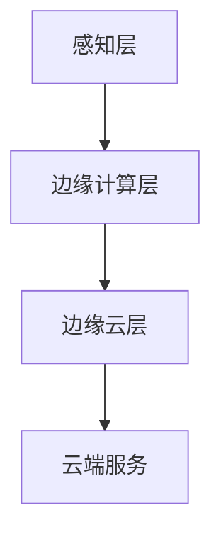

                 

## 《边缘AI计算平台：物联网智能的创新解决方案》

### 关键词：边缘AI，物联网，智能计算，边缘计算，深度学习，硬件平台，算法优化

### 摘要：

边缘AI计算平台作为物联网智能时代的关键技术，正在引领着物联网行业的创新与变革。本文首先介绍了边缘计算与AI的基本概念和它们在物联网中的应用价值。接着，详细讨论了边缘AI计算平台的关键技术，包括架构设计、硬件平台选型、算法优化等方面。随后，通过智能家居、智能交通、工业物联网和医疗健康等实际案例，展示了边缘AI计算平台在不同领域的应用。最后，本文探讨了边缘AI计算平台的建设实践和未来发展，提出了建设策略、技术趋势以及安全性和隐私保护等方面的思考。

## 第一部分：边缘AI计算平台基础

### 第1章：边缘计算与AI概述

#### 1.1 边缘计算的定义与发展历程

边缘计算（Edge Computing）是一种分布式计算架构，通过在靠近数据源或用户的位置部署计算资源，以减少数据传输延迟，提高数据处理速度和系统响应能力。边缘计算的概念最早出现在1990年代的分布式计算领域，随着物联网（IoT）和智能设备的普及，边缘计算得到了广泛关注和发展。

边缘计算的发展历程可以分为三个阶段：

1. **早期探索阶段（1990-2009年）**：这一阶段主要侧重于分布式计算技术和网络边缘节点的部署。代表性的工作包括Ad Hoc网络和无线传感器网络的研究。
2. **快速发展阶段（2010-2015年）**：随着物联网和移动计算的兴起，边缘计算迎来了快速发展期。云计算与边缘计算的结合，推动了物联网设备的大规模部署。
3. **成熟应用阶段（2016年至今）**：边缘计算逐渐成为物联网智能化的关键技术。边缘AI的引入，进一步提升了边缘计算的应用范围和效率。

#### 1.2 AI在边缘计算中的应用价值

人工智能（AI）在边缘计算中的应用，极大地提升了物联网设备的智能化水平和数据处理能力。以下是AI在边缘计算中的几个主要应用价值：

1. **实时数据处理**：边缘AI可以实时处理大量传感器数据，实现快速响应，满足物联网设备对低延迟和高响应速度的需求。
2. **减轻云负担**：通过在边缘设备上执行部分AI任务，可以减轻云端计算压力，降低数据传输成本。
3. **隐私保护**：边缘AI可以在本地设备上进行数据处理和模型训练，减少数据传输过程中的隐私泄露风险。
4. **设备智能化**：边缘AI使得物联网设备具备自主学习和决策能力，提高了设备的智能化水平。

#### 1.3 边缘AI的核心概念与架构

边缘AI（Edge AI）是指将人工智能算法部署在边缘设备上，以实现本地数据处理和智能决策。边缘AI的核心概念包括：

1. **边缘设备**：边缘设备是边缘AI计算的基础，包括智能传感器、网关、智能路由器等。
2. **边缘计算节点**：边缘计算节点负责处理边缘设备收集的数据，执行AI算法，并生成决策。
3. **边缘云**：边缘云是连接边缘设备和云端服务的桥梁，提供云计算资源、数据存储和AI模型训练等能力。

边缘AI的架构设计通常包括以下几个层次：

1. **感知层**：包括各种传感器和智能设备，负责数据的采集和初步处理。
2. **边缘计算层**：边缘计算节点负责执行AI算法，对采集到的数据进行处理和分析。
3. **边缘云层**：边缘云提供云计算资源，用于大数据处理、AI模型训练和远程管理。

### Mermaid 流程图：

## 第二部分：物联网智能应用案例与实践

### 第5章：智能家居边缘AI应用

#### 5.1 智能家居概述

智能家居（Smart Home）是通过物联网技术和智能设备实现家庭自动化和管理的一种新型家庭生活方式。智能家居系统主要包括智能照明、智能家电、安全监控、能源管理等方面。

智能家居的优势包括：

1. **便捷性**：通过智能手机或语音助手等设备，用户可以远程控制家庭设备，提高生活便捷性。
2. **节能性**：智能设备可以通过自动化控制实现节能，降低家庭能源消耗。
3. **安全性**：智能监控设备可以提高家庭安全性，防止盗窃和意外事故。

#### 5.2 边缘AI在智能家居中的应用

边缘AI在智能家居中的应用主要体现在以下几个方面：

1. **智能设备控制**：边缘AI可以实时分析家庭环境数据，智能控制照明、空调等家电设备。
2. **安防监控**：边缘AI可以对监控视频进行实时分析，识别异常行为，提高家庭安全性。
3. **能耗管理**：边缘AI可以分析家庭能耗数据，优化用电方案，降低能耗。

#### 5.3 智能家居边缘AI平台搭建

智能家居边缘AI平台的搭建通常包括以下步骤：

1. **硬件选型**：选择合适的边缘设备，如智能网关、智能传感器等。
2. **软件框架**：选择合适的边缘AI开发框架，如TensorFlow Lite、PyTorch Mobile等。
3. **数据采集**：搭建数据采集系统，实现传感器数据的实时采集和传输。
4. **算法训练**：在边缘设备上训练AI模型，实现智能家居功能的智能化。
5. **系统集成**：将边缘AI平台与家庭设备系统集成，实现智能化控制。

### 第6章：智能交通边缘AI应用

#### 6.1 智能交通概述

智能交通系统（Intelligent Transportation System，ITS）是一种利用信息技术、电子技术、通信技术和控制技术等手段，对交通运输系统进行智能化管理和优化的系统。智能交通系统主要包括交通管理、智能交通监测、智能交通信息服务等方面。

智能交通的优势包括：

1. **提高交通效率**：通过智能交通系统，可以实时监测交通流量，优化交通信号控制，提高交通效率。
2. **降低交通事故**：智能交通系统可以通过实时监控和预警，降低交通事故的发生。
3. **缓解交通拥堵**：智能交通系统可以实时分析交通数据，预测交通流量，优化交通流向，缓解交通拥堵。

#### 6.2 边缘AI在智能交通中的应用

边缘AI在智能交通中的应用主要体现在以下几个方面：

1. **交通流量预测**：边缘AI可以实时分析交通数据，预测交通流量，优化交通信号控制。
2. **车辆监控**：边缘AI可以对车辆运行状态进行实时监控，预警异常情况，保障交通安全。
3. **智能停车管理**：边缘AI可以实时分析停车数据，优化停车管理，提高停车效率。

#### 6.3 智能交通边缘AI平台搭建

智能交通边缘AI平台的搭建通常包括以下步骤：

1. **硬件选型**：选择合适的边缘设备，如智能交通监控摄像头、智能网关等。
2. **软件框架**：选择合适的边缘AI开发框架，如TensorFlow Lite、PyTorch Mobile等。
3. **数据采集**：搭建数据采集系统，实现交通数据的实时采集和传输。
4. **算法训练**：在边缘设备上训练AI模型，实现智能交通功能的智能化。
5. **系统集成**：将边缘AI平台与交通管理系统系统集成，实现智能化交通管理。

## 第三部分：边缘AI平台建设与未来发展

### 第9章：边缘AI平台建设实践

#### 9.1 边缘AI平台建设策略

边缘AI平台建设需要综合考虑硬件选型、软件框架、数据采集和算法训练等多个方面，以下是一些建设策略：

1. **硬件选型**：根据应用场景和数据处理需求，选择合适的边缘设备，如高性能CPU、GPU、FPGA等。
2. **软件框架**：选择适合的边缘AI开发框架，如TensorFlow Lite、PyTorch Mobile等，以简化开发过程。
3. **数据采集**：构建高效的数据采集系统，确保数据实时、准确、可靠地传输到边缘设备。
4. **算法训练**：利用边缘设备进行AI模型训练，优化模型在边缘环境下的性能。
5. **系统集成**：将边缘AI平台与现有系统进行集成，实现整体系统的智能化升级。

#### 9.2 边缘AI平台部署与运维

边缘AI平台的部署与运维主要包括以下环节：

1. **部署**：将边缘设备安装到现场，连接网络，确保边缘设备可以正常工作。
2. **监控**：对边缘设备进行实时监控，确保设备运行状态良好，及时处理故障。
3. **升级**：定期对边缘设备进行软件升级，保证系统的稳定性和安全性。
4. **维护**：定期对边缘设备进行维护，确保设备的正常运行和数据的完整性。

#### 9.3 边缘AI平台安全性与隐私保护

边缘AI平台的安全性和隐私保护至关重要，以下是一些建议：

1. **数据加密**：对传输和存储的数据进行加密，确保数据安全。
2. **访问控制**：实施严格的访问控制策略，防止未经授权的访问。
3. **安全审计**：定期进行安全审计，发现潜在的安全隐患。
4. **隐私保护**：在数据处理过程中，遵循隐私保护原则，减少隐私泄露风险。

### 第10章：边缘AI计算的未来发展趋势

#### 10.1 边缘AI计算的市场前景

随着物联网和智能设备的快速发展，边缘AI计算市场前景广阔。据市场调研公司预测，未来几年边缘AI计算市场将保持高速增长，市场规模将不断扩大。

#### 10.2 边缘AI计算的技术创新方向

边缘AI计算的技术创新方向包括：

1. **硬件创新**：开发更高性能、更低功耗的边缘设备，提高边缘计算能力。
2. **算法创新**：研究更高效的边缘AI算法，降低计算和存储资源的需求。
3. **网络创新**：发展边缘计算与5G、物联网等技术的深度融合，提高网络传输速度和可靠性。

#### 10.3 边缘AI计算的应用领域拓展

未来，边缘AI计算将在更多领域得到应用，包括但不限于：

1. **智慧城市**：通过边缘AI计算，实现城市交通、环境、安全等方面的智能化管理。
2. **智能制造**：利用边缘AI计算，实现生产过程的自动化和智能化。
3. **智慧医疗**：通过边缘AI计算，实现医疗数据的实时分析和预测。

### 附录

#### 附录A：边缘AI计算平台资源列表

1. **边缘AI计算平台工具列表**：

   - **边缘设备**：树莓派、Jetson Nano、Arduino等。
   - **开发框架**：TensorFlow Lite、PyTorch Mobile、MXNet等。
   - **编程语言**：Python、C++、Java等。

2. **边缘AI计算平台开源项目介绍**：

   - **边缘设备开源项目**：树莓派基金会、Arduino等。
   - **边缘AI开源框架**：TensorFlow Lite、PyTorch Mobile、MXNet等。
   - **边缘AI开源工具**：EdgeX Foundry、FIOSA Edge AI Framework等。

3. **边缘AI计算平台参考文献与资料推荐**：

   - **书籍**：《边缘计算：原理、架构与应用》、《人工智能：一种现代方法》等。
   - **论文**：有关边缘计算和AI的顶级会议和期刊论文。
   - **网站**：IEEE EdgeAI、ACM Edge Computing Initiative等。

## 作者信息

作者：AI天才研究院/AI Genius Institute & 禅与计算机程序设计艺术 /Zen And The Art of Computer Programming

