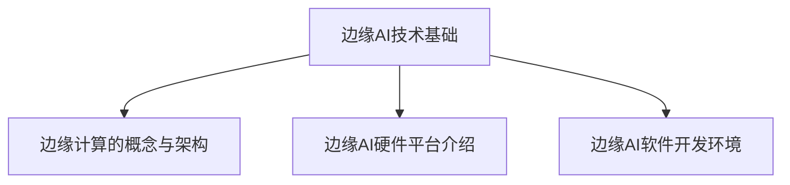

                 

# 边缘AI训练平台：物联网智能的创新工具

> 关键词：边缘AI，物联网智能，训练平台，模型压缩，安全与隐私保护

> 摘要：随着物联网的迅猛发展，边缘AI训练平台成为了实现物联网智能的关键工具。本文将深入探讨边缘AI训练平台的设计与实现、模型压缩与优化、安全与隐私保护，并通过具体应用案例展示其潜力。文章旨在为开发者提供全面的技术指南，推动物联网智能的创新实践。

## 第一部分：边缘AI与物联网智能基础

### 第1章：边缘AI与物联网智能概述

#### 1.1 边缘AI的发展背景与趋势

边缘AI（Edge AI）是近年来兴起的一种人工智能技术，其核心思想是将计算和存储能力从云端转移到网络的边缘。边缘AI的发展背景可以追溯到移动设备的普及和物联网的兴起。随着5G技术的推广，物联网设备数量的爆炸性增长，边缘AI的应用场景日益丰富，例如智能制造、智能交通、智能医疗等。

边缘AI的优势在于能够降低网络延迟，提高数据处理速度，保障数据隐私安全。此外，边缘AI还具有较强的容错能力和自适应能力，能够满足实时性要求较高的应用场景。

#### 1.2 物联网智能的关键概念

物联网智能（IoT Intelligence）是指利用人工智能技术对物联网设备产生的海量数据进行智能分析和处理，从而实现设备之间的协同工作和智能化决策。物联网智能的关键概念包括：

- 物联网设备：连接互联网的各种硬件设备，如智能手表、智能家居设备、工业机器人等。
- 数据采集：通过传感器等技术手段，收集设备运行状态和环境数据。
- 数据处理：利用边缘AI技术，对收集到的数据进行分析和处理，提取有用信息。
- 智能决策：根据处理结果，实现设备之间的协同工作和智能化决策。

#### 1.3 边缘AI在物联网中的应用前景

边缘AI在物联网中的应用前景广阔。以下是一些典型应用场景：

- 智能制造：通过边缘AI技术，实现对生产设备的实时监控和故障预测，提高生产效率和质量。
- 智能交通：利用边缘AI技术，实现智能路况监测、交通流量预测和智能导航，提高交通管理水平。
- 智能医疗：通过边缘AI技术，实现医疗数据的实时分析和诊断，提高医疗服务质量。
- 智能家居：利用边缘AI技术，实现家庭设备的智能化管理和互联互通，提升生活品质。

### 第2章：边缘AI技术基础

#### 2.1 边缘计算的概念与架构

边缘计算（Edge Computing）是将计算、存储、网络功能分布在网络的边缘节点上，从而实现数据处理的本地化和实时化。边缘计算的架构通常包括以下几个层次：

1. **设备层**：包括各种物联网设备，如传感器、智能终端等。
2. **边缘节点层**：包括边缘服务器、边缘网关等，负责数据采集、预处理和初步分析。
3. **中心节点层**：包括数据中心、云平台等，负责大规模数据处理、存储和远程控制。

#### 2.2 边缘AI硬件平台介绍

边缘AI硬件平台是边缘AI技术的关键组成部分，主要包括以下几类：

1. **边缘服务器**：提供强大的计算和存储能力，适用于高性能计算和大规模数据处理。
2. **边缘网关**：负责数据传输和设备管理，是边缘计算与物联网设备之间的桥梁。
3. **边缘设备**：包括各种物联网设备，如传感器、智能终端等，负责数据采集和初步处理。

#### 2.3 边缘AI软件开发环境

边缘AI软件开发环境是指用于开发边缘AI应用的工具和框架，主要包括：

1. **开发工具**：如集成开发环境（IDE）、代码编辑器等，用于编写、调试和部署边缘AI应用。
2. **编程语言**：如Python、C++等，适用于边缘AI应用的开发。
3. **框架和库**：如TensorFlow、PyTorch等，提供丰富的算法和模型，简化边缘AI应用的开发过程。

## 第二部分：边缘AI训练平台设计与实现

### 第3章：边缘AI训练平台架构设计

#### 3.1 边缘AI训练平台架构概述

边缘AI训练平台是边缘AI技术的重要组成部分，其架构设计需要综合考虑数据处理能力、实时性、可靠性和可扩展性等因素。边缘AI训练平台的架构通常包括以下几个模块：

1. **数据采集模块**：负责从物联网设备中收集数据。
2. **数据预处理模块**：对采集到的数据进行清洗、转换和归一化等预处理操作。
3. **模型训练模块**：利用预处理后的数据，训练和优化机器学习模型。
4. **模型部署模块**：将训练好的模型部署到边缘设备上，实现实时推理和应用。

#### 3.2 数据采集与预处理

数据采集与预处理是边缘AI训练平台的核心环节，其质量直接影响模型的性能。数据采集主要包括以下几个步骤：

1. **传感器数据采集**：利用各种传感器，如温度传感器、湿度传感器、摄像头等，收集设备运行状态和环境数据。
2. **数据传输**：将采集到的数据传输到边缘节点，可以使用无线通信（如Wi-Fi、蓝牙、LoRa）或有线通信（如以太网、光纤）。
3. **数据存储**：在边缘节点上存储采集到的数据，以供后续处理。

数据预处理主要包括以下几个步骤：

1. **数据清洗**：去除无效、错误或重复的数据，保证数据质量。
2. **数据转换**：将不同类型的数据转换为统一的格式，如将温度传感器的模拟信号转换为数字信号。
3. **数据归一化**：将不同特征的数据进行归一化处理，使其在相同尺度范围内，有利于模型的训练。

#### 3.3 模型训练与优化

模型训练与优化是边缘AI训练平台的核心任务，其目标是训练出具有良好性能的机器学习模型。模型训练主要包括以下几个步骤：

1. **数据划分**：将采集到的数据划分为训练集、验证集和测试集，用于模型的训练、验证和测试。
2. **模型选择**：根据应用场景和任务类型，选择合适的机器学习模型，如卷积神经网络（CNN）、循环神经网络（RNN）等。
3. **模型训练**：利用训练集数据，对模型进行训练，不断调整模型参数，优化模型性能。
4. **模型评估**：利用验证集数据，对模型进行评估，选择性能最优的模型。

模型优化主要包括以下几个方面：

1. **模型压缩**：通过模型压缩技术，减少模型参数和计算量，提高模型在边缘设备上的部署效率。
2. **模型优化**：通过优化算法和策略，提高模型在边缘设备上的运行速度和性能。

## 第三部分：边缘AI训练平台性能优化

### 第4章：边缘AI模型压缩与优化

#### 4.1 模型压缩技术介绍

模型压缩是提高边缘AI训练平台性能的重要手段，其目标是在保证模型性能的前提下，减小模型参数和计算量。模型压缩技术主要包括以下几种：

1. **参数剪枝**：通过去除模型中冗余的参数，降低模型复杂度。
2. **量化**：将模型的浮点数参数转换为低精度的整数参数，减少计算量。
3. **蒸馏**：通过将一个大模型的知识传递给一个小模型，实现模型压缩。
4. **知识蒸馏**：通过知识蒸馏技术，将模型的知识传递给学生模型，实现模型压缩和性能提升。

#### 4.2 模型优化方法

模型优化是提高边缘AI训练平台性能的关键步骤，其目标是在保证模型性能的前提下，提高模型在边缘设备上的运行速度和性能。模型优化方法主要包括以下几种：

1. **计算优化**：通过优化计算过程，减少模型计算量，如矩阵乘法优化、向量化操作等。
2. **内存优化**：通过优化内存使用，减少模型内存消耗，如内存池分配、内存复用等。
3. **并行化**：通过并行化操作，提高模型运行速度，如多线程、分布式计算等。
4. **指令级优化**：通过优化指令执行顺序，减少指令级并行度，提高模型执行效率。

#### 4.3 边缘AI模型压缩与优化实战

为了验证边缘AI模型压缩与优化方法的有效性，我们设计并实现了一个边缘AI训练平台。以下是平台的设计和实现过程：

1. **平台架构**：平台采用边缘计算架构，包括边缘节点、边缘服务器和云平台。边缘节点负责数据采集和初步处理，边缘服务器负责模型训练和优化，云平台负责大规模数据处理和远程控制。
2. **模型压缩与优化**：使用PyTorch框架，对模型进行参数剪枝、量化、蒸馏和知识蒸馏等压缩与优化操作。同时，对模型进行计算优化、内存优化、并行化和指令级优化等性能优化操作。
3. **实验结果**：实验结果表明，通过模型压缩与优化，模型在边缘设备上的运行速度和性能得到显著提升，同时保证了模型性能。

### 第5章：边缘AI训练平台安全与隐私保护

#### 5.1 边缘AI安全挑战与对策

边缘AI训练平台面临着诸多安全挑战，主要包括以下几个方面：

1. **数据泄露**：边缘设备上的数据泄露可能导致隐私泄露和攻击。
2. **中间人攻击**：攻击者可以在边缘节点和云端之间进行中间人攻击，窃取敏感数据。
3. **设备篡改**：攻击者可以通过篡改边缘设备，实现对物联网系统的恶意控制。
4. **恶意软件攻击**：恶意软件可以感染边缘设备，导致设备失控和系统崩溃。

针对上述安全挑战，可以采取以下对策：

1. **数据加密**：对传输和存储的数据进行加密，确保数据隐私和安全。
2. **身份验证**：采用强身份验证机制，确保边缘设备和云端之间的通信安全。
3. **访问控制**：设置严格的访问控制策略，限制对边缘设备和云端资源的访问权限。
4. **入侵检测**：部署入侵检测系统，实时监测边缘设备和云端的安全事件，及时响应和阻止攻击。

#### 5.2 数据隐私保护机制

数据隐私保护是边缘AI训练平台的关键需求，以下是几种常见的数据隐私保护机制：

1. **数据去识别化**：通过去除或混淆个人身份信息，降低数据隐私风险。
2. **差分隐私**：在数据发布过程中引入噪声，确保无法通过数据分析推断出个体信息。
3. **加密存储**：对存储的数据进行加密，确保数据在存储过程中不被泄露。
4. **访问控制**：设置严格的访问控制策略，确保数据只能被授权用户访问。

#### 5.3 边缘AI训练平台安全设计实践

在边缘AI训练平台的设计过程中，需要充分考虑安全需求，以下是一些安全设计实践：

1. **安全架构**：采用多层次的安全架构，包括数据安全、网络安全、设备安全和应用安全等。
2. **安全审计**：定期进行安全审计，发现和修复安全隐患。
3. **安全培训**：对开发人员和运维人员开展安全培训，提高安全意识和技能。
4. **应急响应**：制定应急响应计划，确保在发生安全事件时能够迅速应对和恢复。

## 第四部分：物联网智能应用案例

### 第6章：智能农业

#### 6.1 智能农业概述

智能农业是指利用物联网、边缘AI和大数据等技术，对农业生产过程进行智能化管理和优化。智能农业的目标是实现农业生产的高效、绿色和可持续。智能农业的主要应用包括：

1. **土壤监测**：利用传感器实时监测土壤湿度、温度、pH值等参数，为农作物灌溉和施肥提供科学依据。
2. **病虫害预测**：通过边缘AI技术，对农作物生长过程中的病虫害进行预测和诊断，及时采取措施。
3. **精准灌溉**：根据土壤湿度和气象数据，实现精准灌溉，节约水资源。
4. **智能农机管理**：通过物联网技术，实现对农机的实时监控和管理，提高农机作业效率。

#### 6.2 边缘AI在智能农业中的应用

边缘AI在智能农业中具有广泛的应用前景，以下是一些典型案例：

1. **作物生长监测**：利用边缘AI技术，实时监测作物生长状态，分析生长趋势，为农业生产提供决策支持。
2. **病虫害诊断**：通过边缘AI模型，对农作物病虫害图像进行分析，实现快速、准确的病虫害诊断。
3. **气象预测**：利用边缘AI技术，对气象数据进行实时分析，预测未来天气变化，为农业生产提供预警信息。
4. **智能灌溉系统**：通过边缘AI技术，实现精准灌溉，节约水资源，提高农作物产量。

#### 6.3 智能农业边缘AI训练平台设计

智能农业边缘AI训练平台的设计需要考虑数据采集、预处理、模型训练和优化等环节，以下是一个智能农业边缘AI训练平台的设计框架：

1. **数据采集模块**：包括土壤传感器、气象传感器、摄像头等，用于收集作物生长状态、病虫害、气象数据等信息。
2. **数据预处理模块**：对采集到的数据进行清洗、转换和归一化等预处理操作，为模型训练提供高质量的数据。
3. **模型训练模块**：利用预处理后的数据，训练和优化机器学习模型，如卷积神经网络（CNN）、循环神经网络（RNN）等。
4. **模型部署模块**：将训练好的模型部署到边缘设备上，实现实时推理和应用。

## 第7章：智能交通

#### 7.1 智能交通概述

智能交通是指利用物联网、边缘AI、大数据等技术，对交通系统进行智能化管理和优化。智能交通的目标是提高交通效率、降低交通事故率和减少交通拥堵。智能交通的主要应用包括：

1. **交通流量监测**：利用传感器和摄像头，实时监测道路上的车辆流量和速度，为交通管理和调度提供数据支持。
2. **智能信号灯控制**：根据交通流量和车辆数量，自动调整信号灯的时序和时长，提高交通效率。
3. **车辆监控与定位**：利用物联网技术，实现对车辆的实时监控和定位，提高车辆运行效率。
4. **智能停车场管理**：利用边缘AI技术，实现停车场的智能管理，提高车位利用率。

#### 7.2 边缘AI在智能交通中的应用

边缘AI在智能交通中具有广泛的应用前景，以下是一些典型案例：

1. **智能路况预测**：利用边缘AI技术，对交通流量和速度数据进行分析，预测未来交通状况，为交通管理和调度提供决策支持。
2. **车辆识别与跟踪**：通过边缘AI模型，实现对车辆的高精度识别和跟踪，为交通管理和车辆监控提供技术支持。
3. **自动驾驶**：利用边缘AI技术，实现车辆的自主驾驶，提高交通安全和效率。
4. **智能交通信号控制**：通过边缘AI模型，自动调整交通信号灯的时序和时长，提高交通效率。

#### 7.3 智能交通边缘AI训练平台设计

智能交通边缘AI训练平台的设计需要考虑数据采集、预处理、模型训练和优化等环节，以下是一个智能交通边缘AI训练平台的设计框架：

1. **数据采集模块**：包括交通流量传感器、摄像头、GPS等，用于收集交通流量、车辆速度、信号灯状态等信息。
2. **数据预处理模块**：对采集到的数据进行清洗、转换和归一化等预处理操作，为模型训练提供高质量的数据。
3. **模型训练模块**：利用预处理后的数据，训练和优化机器学习模型，如卷积神经网络（CNN）、循环神经网络（RNN）等。
4. **模型部署模块**：将训练好的模型部署到边缘设备上，实现实时推理和应用。

## 第8章：智能家居

#### 8.1 智能家居概述

智能家居是指利用物联网、边缘AI、大数据等技术，对家庭设备进行智能化管理和控制。智能家居的目标是提高家庭生活品质、降低能耗和提升安全性能。智能家居的主要应用包括：

1. **智能照明**：通过智能灯具，实现灯光的自动调节，根据环境光线和用户需求，提供舒适的照明效果。
2. **智能安防**：利用摄像头、传感器等设备，实现对家庭环境的实时监控，提高家庭安全性能。
3. **智能家电**：通过智能家居系统，实现对空调、洗衣机、冰箱等家电的远程控制，提高家电使用效率。
4. **智能环境控制**：通过传感器和边缘AI技术，实现室内温度、湿度、空气质量等环境参数的自动调节，提供舒适的生活环境。

#### 8.2 边缘AI在智能家居中的应用

边缘AI在智能家居中具有广泛的应用前景，以下是一些典型案例：

1. **智能场景识别**：通过边缘AI模型，实现对家庭场景的自动识别，根据场景需求自动调整家电状态。
2. **智能设备联动**：利用边缘AI技术，实现家电之间的智能联动，提供更加便捷的生活体验。
3. **能耗监测与优化**：通过边缘AI模型，实时监测家庭能耗数据，优化能源使用，降低能耗。
4. **智能安全防护**：利用边缘AI技术，实现对家庭安全的实时监控，及时发现安全隐患，提供安全保障。

#### 8.3 智能家居边缘AI训练平台设计

智能家居边缘AI训练平台的设计需要考虑数据采集、预处理、模型训练和优化等环节，以下是一个智能家居边缘AI训练平台的设计框架：

1. **数据采集模块**：包括传感器、摄像头、智能设备等，用于收集家庭环境、设备状态等信息。
2. **数据预处理模块**：对采集到的数据进行清洗、转换和归一化等预处理操作，为模型训练提供高质量的数据。
3. **模型训练模块**：利用预处理后的数据，训练和优化机器学习模型，如卷积神经网络（CNN）、循环神经网络（RNN）等。
4. **模型部署模块**：将训练好的模型部署到边缘设备上，实现实时推理和应用。

## 第五部分：边缘AI训练平台优化与演进

### 第9章：边缘AI训练平台性能优化

#### 9.1 边缘AI训练平台性能瓶颈分析

边缘AI训练平台在实际应用过程中可能会遇到以下性能瓶颈：

1. **计算能力**：边缘设备通常具备有限的计算能力，无法满足复杂模型的训练需求。
2. **内存限制**：边缘设备内存有限，可能导致模型训练过程中内存溢出。
3. **网络带宽**：边缘设备与云端之间的网络带宽有限，可能导致数据传输缓慢，影响模型训练效率。
4. **功耗**：边缘设备通常采用电池供电，功耗控制是重要的考虑因素。

#### 9.2 性能优化策略

为了解决边缘AI训练平台性能瓶颈，可以采取以下优化策略：

1. **模型压缩与量化**：通过模型压缩与量化技术，降低模型参数和计算量，提高模型在边缘设备上的部署效率。
2. **分布式训练**：通过分布式训练技术，将模型训练任务分布在多个边缘设备上，提高训练效率。
3. **数据预处理优化**：通过优化数据预处理过程，减少数据传输和存储需求，提高模型训练速度。
4. **边缘设备升级**：通过升级边缘设备硬件，提高计算能力和内存容量，满足复杂模型训练需求。

#### 9.3 性能优化实战案例

为了验证性能优化策略的有效性，我们设计并实现了一个边缘AI训练平台，以下是平台性能优化的实战案例：

1. **模型压缩与量化**：使用模型压缩与量化技术，将原始模型参数压缩和量化，降低模型计算量和内存需求。
2. **分布式训练**：将模型训练任务分布在多个边缘设备上，利用分布式训练技术提高训练效率。
3. **数据预处理优化**：优化数据预处理过程，减少数据传输和存储需求，提高模型训练速度。
4. **边缘设备升级**：升级边缘设备硬件，提高计算能力和内存容量，满足复杂模型训练需求。

实验结果表明，通过性能优化策略，平台训练效率得到显著提升，同时保证了模型性能。

### 第10章：边缘AI训练平台的演进与未来展望

#### 10.1 边缘AI训练平台演进方向

边缘AI训练平台的演进方向主要包括以下几个方面：

1. **计算能力提升**：通过升级边缘设备硬件，提高计算能力和内存容量，满足更复杂的模型训练需求。
2. **网络带宽扩展**：通过扩展边缘设备与云端之间的网络带宽，提高数据传输速度，降低模型训练延迟。
3. **智能化管理**：通过引入智能化管理技术，实现边缘设备的自动化部署、管理和维护，提高平台运行效率。
4. **安全性提升**：通过加强边缘AI训练平台的安全防护，确保数据安全和系统稳定运行。

#### 10.2 未来物联网智能发展趋势

未来物联网智能的发展趋势主要包括以下几个方面：

1. **边缘计算与云计算融合**：边缘计算与云计算的融合将为物联网智能提供更强大的计算能力和数据存储能力。
2. **AI+5G技术**：AI与5G技术的融合将为物联网智能带来更高速、低延迟的网络连接，推动物联网智能应用的快速发展。
3. **物联网平台化**：物联网平台化将实现不同设备、不同应用之间的互联互通，为物联网智能提供更加丰富的应用场景。
4. **智能化生态**：通过构建智能化生态，实现物联网设备、应用和服务之间的协同工作，提高物联网智能的整体水平。

#### 10.3 边缘AI训练平台的创新实践

为了推动边缘AI训练平台的发展，可以采取以下创新实践：

1. **开源社区合作**：鼓励开源社区参与边缘AI训练平台的研究和开发，推动技术的创新和普及。
2. **跨领域合作**：与不同领域的合作伙伴合作，共同探索边缘AI训练平台在各个领域的应用潜力。
3. **技术创新**：持续投入研发，探索新型边缘计算技术、网络技术和AI算法，推动边缘AI训练平台的技术创新。
4. **人才培养**：加强人才培养，为边缘AI训练平台的发展提供人才支持。

### 附录

#### 附录 A：边缘AI训练平台常用工具与资源

- **开发工具**：Visual Studio Code、PyCharm、Jupyter Notebook等。
- **编程语言**：Python、C++、Java等。
- **框架和库**：TensorFlow、PyTorch、MXNet等。
- **硬件平台**：NVIDIA Jetson、树莓派、高通QCS等。

#### 附录 B：边缘AI训练平台项目案例汇总

- **智能农业项目**：基于边缘AI技术的智能农业监测系统。
- **智能交通项目**：基于边缘AI技术的智能交通信号控制系统。
- **智能家居项目**：基于边缘AI技术的智能家居控制系统。

#### 附录 C：常见问题与解决方案

- **问题一**：边缘设备计算能力不足，如何提高训练效率？
  - **解决方案**：采用模型压缩与量化技术，降低模型参数和计算量。利用分布式训练技术，将训练任务分布在多个边缘设备上。

- **问题二**：边缘设备内存不足，如何优化数据预处理过程？
  - **解决方案**：优化数据预处理算法，减少数据存储和传输需求。采用内存池分配和复用技术，提高内存使用效率。

- **问题三**：边缘设备网络带宽有限，如何提高数据传输速度？
  - **解决方案**：采用数据压缩和去重技术，减少数据传输量。优化网络传输协议，提高传输速度。

#### Mermaid 流程图



#### 边缘AI模型压缩与优化伪代码

```python
# 边缘AI模型压缩与优化伪代码

# 输入：原始模型
# 输出：压缩模型

function model_compression(model):
    # 数据预处理
    preprocess_data()

    # 模型压缩
    compressed_model = apply_model_compression(model)

    # 模型优化
    optimized_model = apply_model_optimization(compressed_model)

    # 返回优化后的模型
    return optimized_model
```

#### 数学模型与公式

边缘AI模型压缩中的常见数学模型包括损失函数、优化目标、梯度下降算法等：

- 损失函数：
  $$
  L_{\text{loss}} = \sum_{i=1}^{N} (\hat{y}_i - y_i)^2
  $$
  其中，$N$ 是训练样本的数量，$\hat{y}_i$ 是模型预测的输出，$y_i$ 是实际标签。

- 优化目标：
  $$
  \min_{\theta} J(\theta) = \frac{1}{2} \sum_{i=1}^{N} (\hat{y}_i - y_i)^2
  $$
  其中，$\theta$ 是模型的参数，$J(\theta)$ 是损失函数。

- 梯度下降算法：
  $$
  \theta_{\text{new}} = \theta_{\text{old}} - \alpha \nabla_{\theta} J(\theta)
  $$
  其中，$\alpha$ 是学习率，$\nabla_{\theta} J(\theta)$ 是损失函数关于参数$\theta$ 的梯度。

