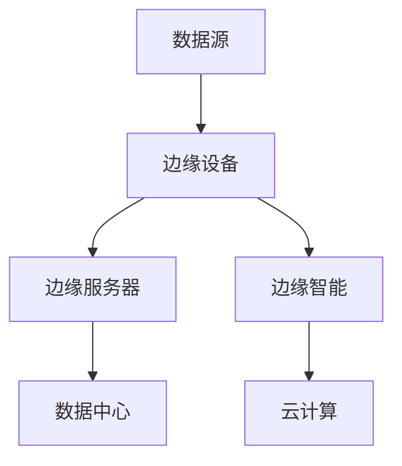
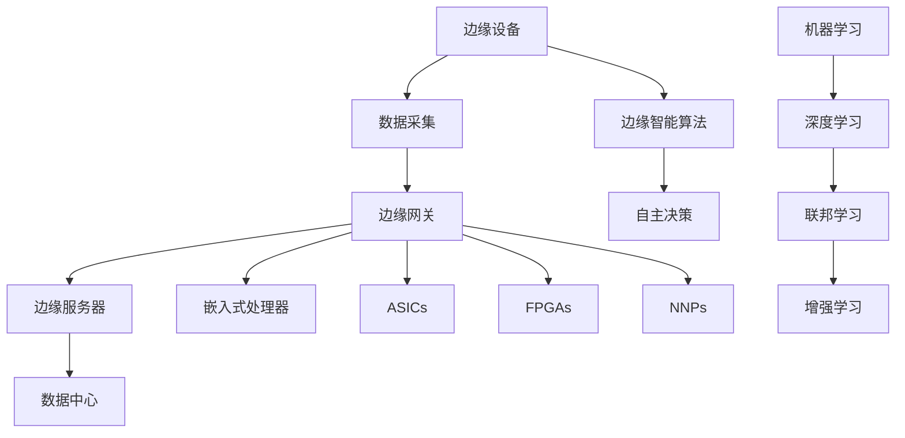
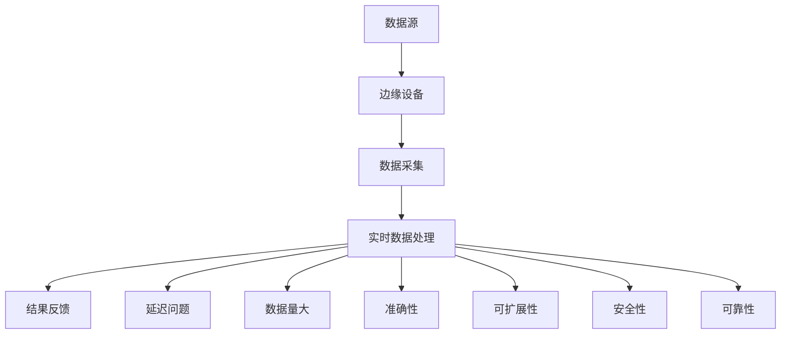
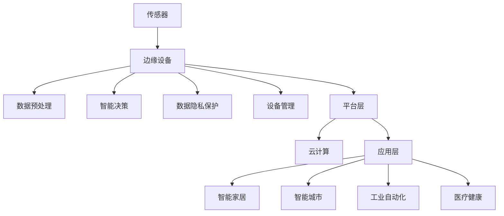
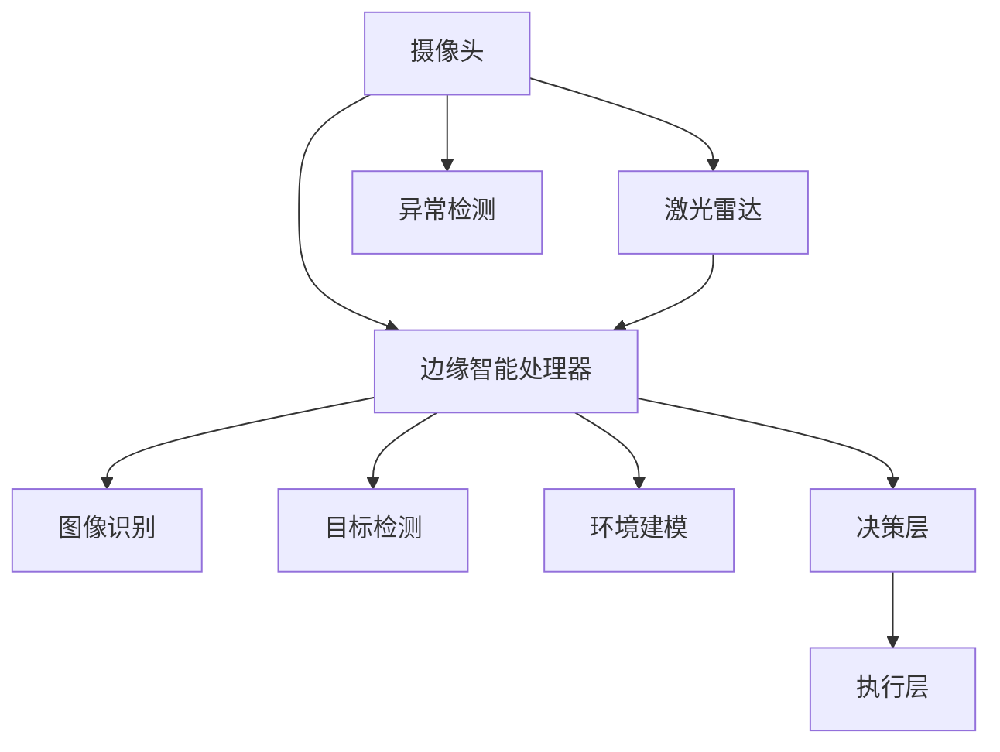
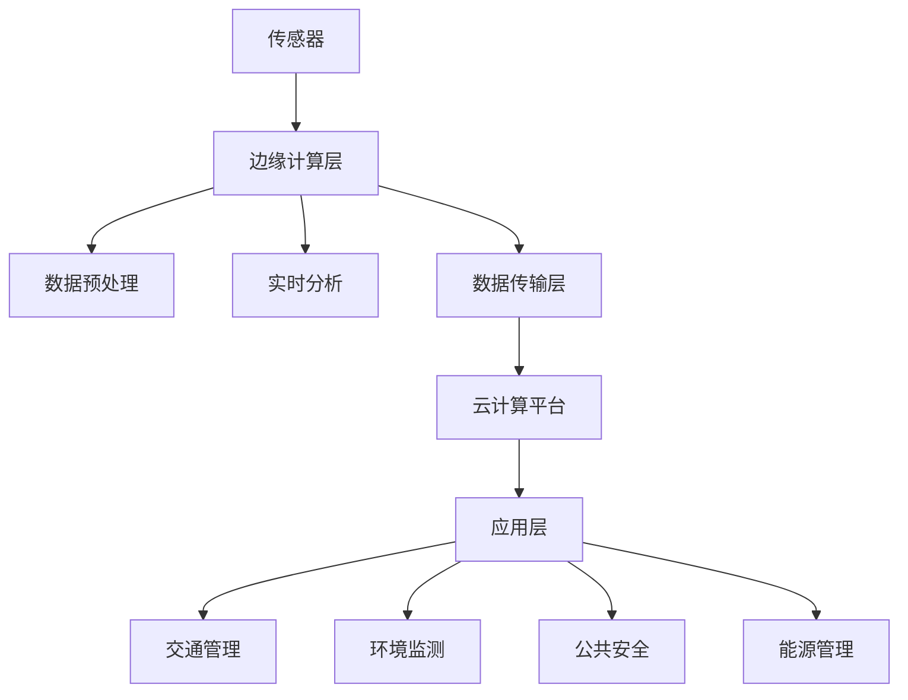
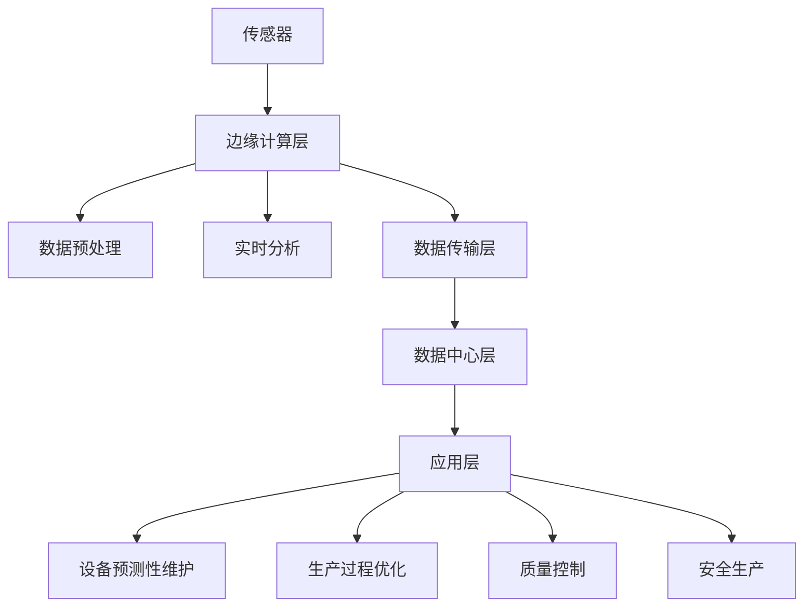
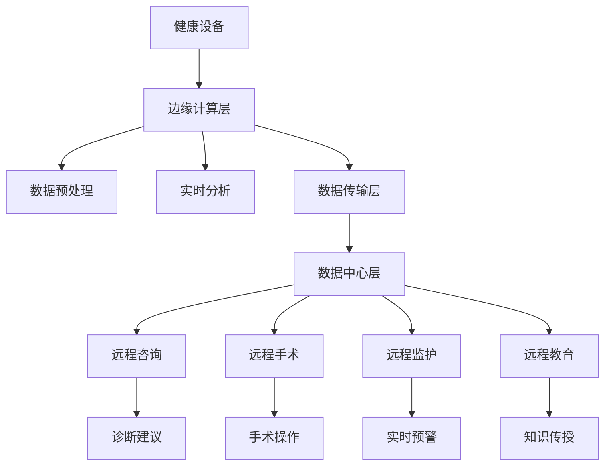
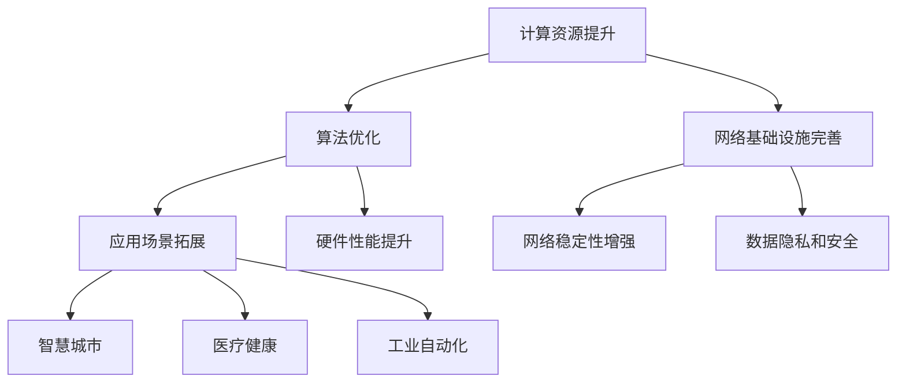
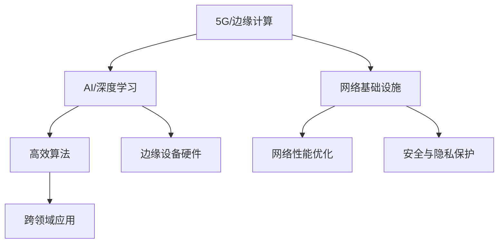

                 

### 边缘智能在实时数据处理中的优势

#### 关键词：
边缘计算，实时数据处理，物联网，自动驾驶，智慧城市，工业互联网，医疗健康

#### 摘要：
边缘智能在实时数据处理中的应用正变得越来越重要。本文旨在详细探讨边缘智能在实时数据处理中的优势，包括其概念、技术、应用场景、优势分析以及未来展望。通过分析边缘计算与云计算的关系、关键技术的应用以及在不同领域的实践案例，本文展示了边缘智能在实时数据处理中的巨大潜力和优势。

---

## 边缘计算与实时数据处理概述

### 第1章：边缘计算与边缘智能的概念

#### 1.1 边缘计算的定义与背景

边缘计算（Edge Computing）是一种分布式计算架构，通过在数据生成源头附近进行数据处理，从而减少对中心化数据中心的依赖。边缘计算的出现，是为了解决云计算在处理大量数据时存在的延迟、带宽限制和安全问题。

边缘计算的历史可以追溯到20世纪90年代的分布式计算研究。随着物联网（IoT）和智能设备的普及，边缘计算逐渐成为研究热点，并在2010年后迎来了快速发展。

#### 1.2 边缘计算与云计算的关系

边缘计算并不是取代云计算，而是与云计算相辅相成的一种计算模式。云计算负责处理大规模的数据存储和复杂的计算任务，而边缘计算则专注于实时数据处理和低延迟应用。

两者之间的区别主要体现在数据处理的位置、响应时间和安全要求上。云计算通常处理离线数据处理任务，而边缘计算则更侧重于在线数据处理和即时响应。

#### 1.3 边缘智能的概念与重要性

边缘智能（Edge Intelligence）是边缘计算的高级形态，它结合了边缘计算和人工智能（AI）技术，使得边缘设备能够实现自主学习和决策。边缘智能的重要性体现在以下几个方面：

1. **降低延迟**：通过在边缘设备上进行数据处理，边缘智能可以显著降低数据传输的延迟，满足实时应用的需求。
2. **提高安全性**：边缘智能可以减少数据传输到云端的风险，从而提高数据的安全性。
3. **节省带宽**：边缘智能能够在本地处理大量数据，减少了数据传输的需求，节省了带宽资源。
4. **增强自主性**：边缘智能使得边缘设备能够实现自主学习和决策，提高了系统的智能化水平。

### 关键概念与联系

为了更好地理解边缘计算和边缘智能的概念，我们可以使用以下Mermaid流程图展示其基本架构：

在这个架构中，数据源产生的数据首先在边缘设备上进行初步处理，然后可以传输到边缘服务器或直接在边缘设备上进行复杂处理。边缘智能则通过集成人工智能算法，使得边缘设备能够实现自主学习和决策。

#### 总结

边缘计算和边缘智能是现代计算体系中的重要组成部分，它们通过分布式计算和人工智能技术的结合，为实时数据处理带来了巨大的优势。接下来，我们将进一步探讨边缘智能的关键技术，以及其在实时数据处理中的具体应用。

### 第2章：边缘智能的关键技术

#### 2.1 边缘计算网络架构

边缘计算网络架构是实现边缘智能的基础，它通常包括以下几个层次：

1. **边缘设备（Edge Devices）**：这是边缘计算网络的基础，包括智能传感器、智能手机、嵌入式系统等。它们负责数据的采集和初步处理。
   
2. **边缘网关（Edge Gateways）**：边缘网关是连接边缘设备和云服务的桥梁，它负责数据的收集、聚合、初步处理和安全控制。

3. **边缘服务器（Edge Servers）**：边缘服务器是运行在边缘数据中心的计算资源，它们负责更复杂的数据处理任务，如实时分析和机器学习模型的部署。

4. **数据中心（Data Centers）**：数据中心负责存储和管理大量数据，同时也提供复杂的计算资源，如高性能计算和大数据分析。

边缘计算网络架构的目的是通过分布式计算，实现数据处理的近源化，从而减少延迟和带宽压力。

#### 2.2 边缘智能处理器与硬件

边缘智能的处理器和硬件是实现高效数据处理的关键。以下是一些关键的硬件组件：

1. **嵌入式处理器（Embedded Processors）**：嵌入式处理器具有低功耗、高效率的特点，适合在边缘设备上运行。

2. **专用集成电路（ASICs）**：ASICs是专门为特定应用设计的集成电路，可以提高边缘设备的处理速度和效率。

3. **现场可编程门阵列（FPGAs）**：FPGAs可以通过编程来改变其功能，适合实现定制化的边缘计算任务。

4. **神经网络处理器（NNPs）**：NNPs是专门为深度学习任务设计的处理器，可以提高边缘设备在处理图像和语音等数据时的性能。

边缘智能处理器和硬件的选择需要根据具体应用场景的需求进行优化，以达到最佳的性能和功耗平衡。

#### 2.3 边缘智能算法与模型

边缘智能算法是实现边缘设备自主学习和决策的核心。以下是一些关键的算法和模型：

1. **机器学习（Machine Learning）**：机器学习算法可以在边缘设备上运行，使得边缘设备能够自主学习和优化。

2. **深度学习（Deep Learning）**：深度学习算法在图像和语音识别等领域具有强大的性能，适合在边缘设备上部署。

3. **联邦学习（Federated Learning）**：联邦学习允许多个边缘设备协同工作，共享学习模型，而不需要传输原始数据，提高了数据安全和隐私保护。

4. **增强学习（Reinforcement Learning）**：增强学习算法适合在动态环境中进行决策，可以应用于自动驾驶和智能机器人等领域。

边缘智能算法的选择和优化需要结合具体应用场景，以达到最佳的效果。

#### 关键概念与联系

为了更好地理解边缘智能的关键技术，我们可以使用以下Mermaid流程图展示其技术架构：

在这个架构中，边缘设备通过数据采集模块收集数据，然后通过边缘网关传输到边缘服务器和数据中心。边缘智能算法在这些计算资源上运行，实现数据的处理和自主决策。

#### 总结

边缘智能的关键技术包括边缘计算网络架构、边缘智能处理器与硬件以及边缘智能算法与模型。这些技术的结合，使得边缘设备能够实现高效、实时、安全的自主学习和决策，为实时数据处理带来了巨大的优势。接下来，我们将进一步探讨实时数据处理的需求与挑战。

### 第3章：实时数据处理的需求与挑战

#### 3.1 实时数据处理的定义

实时数据处理（Real-Time Data Processing）是指对产生于网络边缘的数据进行即时分析和处理，通常需要在毫秒或秒级的延迟内完成。实时数据处理的核心目标是提供快速、准确的决策支持，以满足高带宽、低延迟的应用需求。

实时数据处理与传统离线数据处理的主要区别在于其时间敏感性和实时性要求。传统离线数据处理通常在小时、天或更长时间尺度上进行，而实时数据处理则要求在实时或接近实时的尺度上完成。

#### 3.2 实时数据处理的应用场景

实时数据处理在众多领域都有着广泛的应用，以下是几个典型的应用场景：

1. **物联网（IoT）**：物联网设备产生的数据量巨大，且实时性要求高，例如智能家居、智能城市、工业自动化等领域。

2. **自动驾驶**：自动驾驶系统需要在毫秒级延迟内处理来自传感器和摄像头的大量数据，以实现安全的驾驶决策。

3. **金融交易**：金融市场中的交易数据处理要求极高的实时性，以快速响应市场变化。

4. **医疗健康**：实时数据处理在医疗健康领域有着重要应用，如远程监测、紧急事件响应等。

5. **智慧城市**：智慧城市中的交通管理、环境监测、公共安全等系统都需要实时数据处理，以提升城市管理效率和居民生活质量。

#### 3.3 实时数据处理的技术挑战

实时数据处理面临以下几项主要技术挑战：

1. **延迟问题**：实时数据处理需要在极短时间内完成，这要求系统具备低延迟的特性。

2. **数据量大**：实时数据处理通常需要处理大量数据，这要求系统具备高效的数据处理能力。

3. **准确性**：实时数据处理的结果需要高度准确，任何错误都可能导致严重后果。

4. **可扩展性**：实时数据处理系统需要具备良好的可扩展性，以应对不断增长的数据量和用户需求。

5. **安全性**：实时数据处理通常涉及敏感数据，需要确保数据的安全性和隐私保护。

6. **系统可靠性**：实时数据处理系统需要高可靠性，以避免系统故障导致数据丢失或处理延迟。

#### 关键概念与联系

为了更好地理解实时数据处理的需求与挑战，我们可以使用以下Mermaid流程图展示其技术架构：

在这个架构中，数据源产生的数据通过边缘设备进行采集，然后实时数据处理模块对数据进行分析和处理，并将结果反馈给用户。在这个过程中，实时数据处理面临多个技术挑战，如延迟问题、数据量大、准确性要求高等。

#### 总结

实时数据处理在现代应用中扮演着重要角色，其应用场景广泛，但同时也面临多项技术挑战。通过深入了解实时数据处理的需求与挑战，我们可以更好地理解和应对这些挑战，推动实时数据处理技术的不断进步。

### 第4章：边缘智能在物联网中的应用

#### 4.1 物联网边缘智能架构

物联网（IoT）是边缘智能的重要应用领域之一。物联网边缘智能架构通常包括以下几个层次：

1. **感知层**：感知层包括各种传感器和智能设备，它们负责数据的采集和初步处理。

2. **网络层**：网络层包括边缘网关和无线通信网络，它们负责数据的传输和路由。

3. **平台层**：平台层包括边缘服务器和云计算平台，它们负责数据处理、存储和高级应用。

4. **应用层**：应用层包括各种物联网应用，如智能家居、智能城市、工业自动化等。

物联网边缘智能架构的特点是分布式、低延迟、高可靠性和高安全性。通过这种架构，物联网设备能够在本地进行数据预处理和部分计算，从而减少对中心化数据中心的依赖，提高系统效率和响应速度。

#### 4.2 边缘智能在物联网设备中的应用

边缘智能在物联网设备中的应用主要包括以下几个方面：

1. **数据预处理**：物联网设备产生的数据量巨大，通过边缘智能设备进行预处理，可以减少数据传输的带宽需求，同时提高数据处理的速度和准确性。

2. **智能决策**：边缘智能设备能够通过机器学习和深度学习算法，对物联网设备采集的数据进行实时分析和预测，从而实现智能决策。

3. **数据隐私保护**：物联网设备通常涉及敏感数据，边缘智能可以通过加密、匿名化等技术，提高数据的安全性和隐私保护。

4. **设备管理**：边缘智能设备可以远程监控和管理物联网设备，如进行固件更新、状态监测和故障诊断等。

#### 4.3 物联网边缘智能的案例分析

以下是几个物联网边缘智能的案例分析：

1. **智能家居**：智能家居是物联网边缘智能的典型应用场景。通过边缘智能设备，可以实现家庭设备的智能联动和远程控制。例如，智能空调可以通过边缘智能算法，根据用户的行为模式和天气条件，自动调整温度，提高家庭舒适度。

2. **智能城市**：智能城市中的边缘智能应用包括交通管理、环境监测、公共安全等。例如，通过边缘智能设备，可以实时监控城市交通流量，并根据实时数据优化交通信号灯，减少交通拥堵。

3. **工业自动化**：在工业自动化领域，边缘智能设备可以实时监控生产设备的运行状态，通过机器学习算法预测设备故障，从而实现预防性维护，提高生产效率。

4. **医疗健康**：在医疗健康领域，边缘智能设备可以实时监测患者的健康数据，如心率、血压等，通过边缘智能算法分析数据，及时发现异常情况，提供及时的医疗建议。

#### 关键概念与联系

为了更好地理解物联网边缘智能的应用，我们可以使用以下Mermaid流程图展示其架构：

在这个架构中，传感器采集的数据通过边缘设备进行预处理和智能决策，然后传输到平台层和云计算平台，最终在应用层实现各种物联网应用。

#### 总结

物联网边缘智能通过分布式计算和人工智能技术，为物联网设备提供了高效、实时、安全的数据处理和智能决策支持。在实际应用中，物联网边缘智能在智能家居、智能城市、工业自动化和医疗健康等领域取得了显著成效，展示了其巨大的潜力和价值。

### 第5章：边缘智能在自动驾驶中的应用

#### 5.1 自动驾驶边缘智能系统

自动驾驶是边缘智能的另一个重要应用领域。自动驾驶边缘智能系统通过在车辆附近的数据处理，实现实时、安全、高效的自动驾驶功能。自动驾驶边缘智能系统通常包括以下几个关键组成部分：

1. **感知层**：感知层包括各种传感器，如摄像头、激光雷达、超声波传感器等，它们负责采集车辆周围的环境数据。

2. **边缘智能处理器**：边缘智能处理器负责对感知层采集到的数据进行实时处理，包括图像识别、目标检测、路径规划等。

3. **决策层**：决策层根据边缘智能处理器提供的环境数据，生成驾驶指令，包括加速、减速、转向等。

4. **执行层**：执行层负责执行决策层的指令，包括发动机、制动系统和转向系统等。

自动驾驶边缘智能系统的核心在于其感知、决策和执行的高速响应，以及数据的安全性和隐私保护。

#### 5.2 边缘智能在自动驾驶感知中的应用

边缘智能在自动驾驶感知中的应用至关重要，主要体现在以下几个方面：

1. **图像识别**：边缘智能处理器能够快速处理摄像头捕捉的图像，识别道路标志、行人和车辆等。

2. **目标检测**：通过激光雷达和摄像头数据，边缘智能处理器能够检测和跟踪车辆、行人等动态目标。

3. **环境建模**：边缘智能系统能够构建车辆周围的三维环境模型，为路径规划和驾驶决策提供精确数据。

4. **异常检测**：边缘智能系统能够实时监测车辆状态和环境变化，检测潜在的异常情况，如障碍物、道路损坏等。

#### 5.3 自动驾驶边缘智能的案例分析

以下是几个自动驾驶边缘智能的案例分析：

1. **特斯拉（Tesla）**：特斯拉的自动驾驶系统集成了先进的边缘智能技术，其车辆上的计算机能够实时处理来自各种传感器的数据，实现自动车道保持、自动变道、自动泊车等功能。

2. **谷歌（Google）**：谷歌的Waymo项目利用边缘智能技术，其自动驾驶车辆能够在复杂的城市环境中实现高水平的自动驾驶。Waymo的边缘智能系统包括高效的图像识别和目标检测算法，能够实时处理大量数据。

3. **通用汽车（General Motors）**：通用的Cruise自动驾驶项目也采用了边缘智能技术。Cruise的自动驾驶车辆在边缘处理器上运行深度学习算法，能够实时分析道路和环境数据，实现安全、可靠的自动驾驶。

4. **百度（Baidu）**：百度的Apollo自动驾驶平台利用边缘智能技术，为其自动驾驶车辆提供高效、实时的感知、决策和执行支持。Apollo平台上的边缘智能系统能够快速处理来自传感器的大量数据，实现自动驾驶功能的自动化和智能化。

#### 关键概念与联系

为了更好地理解自动驾驶边缘智能的应用，我们可以使用以下Mermaid流程图展示其架构：

在这个架构中，摄像头和激光雷达采集的环境数据通过边缘智能处理器进行实时处理，生成驾驶指令，并最终由执行层执行。

#### 总结

边缘智能在自动驾驶中的应用，通过提高感知、决策和执行的实时性和准确性，显著提升了自动驾驶系统的性能和安全性。随着边缘智能技术的不断发展，自动驾驶技术将更加成熟和普及，为人们的出行带来更多便利和安全。

### 第6章：边缘智能在智慧城市中的应用

#### 6.1 智慧城市边缘智能系统

智慧城市是边缘智能技术的重要应用领域之一。智慧城市边缘智能系统通过分布式计算和实时数据处理，实现了城市资源的优化配置、公共服务的提升和居民生活质量的改善。智慧城市边缘智能系统通常包括以下几个关键组成部分：

1. **感知层**：感知层包括各种传感器和智能设备，如摄像头、气象传感器、交通监测设备等，它们负责实时采集城市运行数据。

2. **边缘计算层**：边缘计算层包括边缘服务器和边缘智能设备，它们负责对感知层采集到的数据进行分析和初步处理。

3. **数据传输层**：数据传输层负责将边缘计算层处理后的数据传输到云计算平台，进行更复杂的数据分析和存储。

4. **应用层**：应用层包括智慧城市的各种应用，如交通管理、环境监测、公共安全等，它们通过云计算平台提供的数据和算法实现智能化管理和服务。

智慧城市边缘智能系统的特点在于其分布式架构、实时数据处理能力和高效的数据利用。

#### 6.2 边缘智能在智慧城市管理中的应用

边缘智能在智慧城市管理中的应用，通过以下几个方面实现了城市管理的智能化和高效化：

1. **交通管理**：边缘智能系统可以实时监控城市交通状况，通过数据分析优化交通信号灯配置，减少交通拥堵，提高交通效率。

2. **环境监测**：边缘智能系统可以实时监测空气、水质和噪音等环境指标，通过数据分析和预警机制，及时采取措施保护环境和公共健康。

3. **公共安全**：边缘智能系统可以实时监控城市公共场所的安全状况，通过视频监控和异常检测，及时发现和应对潜在的安全威胁。

4. **能源管理**：边缘智能系统可以实时监测和管理城市能源使用情况，通过数据分析和预测，实现能源的优化配置和节能减排。

#### 6.3 智慧城市边缘智能的案例分析

以下是几个智慧城市边缘智能的案例分析：

1. **新加坡（Singapore）**：新加坡是智慧城市的先驱之一，其“智能国家2030”计划通过边缘智能技术实现了城市管理的智能化。例如，新加坡的智能交通系统通过边缘智能设备实时监控交通流量，优化交通信号灯控制，显著减少了交通拥堵。

2. **洛杉矶（Los Angeles）**：洛杉矶通过部署边缘智能设备，实现了城市环境监测和公共安全的智能化管理。例如，洛杉矶的空气质量监测系统通过边缘智能设备实时监测空气质量，并向市民提供实时数据，帮助人们做出健康决策。

3. **中国深圳（Shenzhen）**：中国深圳利用边缘智能技术实现了智慧交通、智慧能源和智慧公共安全的全面覆盖。例如，深圳的智慧交通系统通过边缘智能设备实时监控交通流量，优化交通信号灯控制，提高了交通效率。

4. **美国丹佛（Denver）**：丹佛通过部署边缘智能设备，实现了城市环境监测和能源管理的智能化。例如，丹佛的智能电网系统通过边缘智能设备实时监控能源使用情况，优化能源分配，实现了节能减排。

#### 关键概念与联系

为了更好地理解智慧城市边缘智能的应用，我们可以使用以下Mermaid流程图展示其架构：

在这个架构中，传感器采集的数据通过边缘计算层进行实时处理和分析，然后传输到云计算平台，最终在应用层实现智慧城市的各种应用。

#### 总结

智慧城市边缘智能系统通过分布式计算和实时数据处理，实现了城市资源的优化配置和公共服务的提升。通过实际案例可以看出，智慧城市边缘智能在交通管理、环境监测、公共安全和能源管理等方面取得了显著成效，为城市管理和居民生活带来了便利和提升。随着边缘智能技术的不断发展，智慧城市的建设将更加智能化和高效化。

### 第7章：边缘智能在工业互联网中的应用

#### 7.1 工业互联网边缘智能架构

工业互联网（IIoT）是边缘智能技术的另一个重要应用领域。工业互联网边缘智能架构通过在工业现场进行数据处理和智能分析，实现了生产过程的优化和效率提升。工业互联网边缘智能架构通常包括以下几个层次：

1. **感知层**：感知层包括各种传感器和设备，如温度传感器、压力传感器、振动传感器等，它们负责实时监测设备的运行状态和关键参数。

2. **边缘计算层**：边缘计算层包括边缘服务器和边缘智能设备，它们负责对感知层采集到的数据进行实时处理和分析，包括数据过滤、异常检测和初步的预测分析。

3. **网络层**：网络层包括工业以太网和无线通信网络，它们负责将边缘计算层处理后的数据传输到工业数据中心。

4. **数据中心层**：数据中心层包括高性能计算资源和大数据分析平台，它们负责对来自边缘计算层的数据进行更深入的分析和处理，包括数据存储、数据挖掘和高级预测分析。

5. **应用层**：应用层包括各种工业应用，如设备维护、生产优化、质量控制等，它们通过数据中心层提供的数据和算法实现智能化管理。

工业互联网边缘智能架构的特点是实时性、高效性和可扩展性，通过这种架构，工业设备能够实现自主监控和智能决策，从而提高生产效率和产品质量。

#### 7.2 边缘智能在工业自动化中的应用

边缘智能在工业自动化中的应用主要体现在以下几个方面：

1. **设备预测性维护**：边缘智能系统能够实时监控设备的运行状态，通过数据分析和异常检测，预测设备故障的发生，从而实现预防性维护，减少设备停机时间和维护成本。

2. **生产过程优化**：边缘智能系统能够对生产过程中的实时数据进行实时分析，发现生产瓶颈和优化点，从而提高生产效率和产品质量。

3. **质量控制**：边缘智能系统能够对生产过程中的产品质量进行实时监测，通过数据分析和异常检测，及时发现和纠正质量问题，确保产品质量。

4. **安全生产**：边缘智能系统能够实时监测生产环境中的危险因素，如温度、压力等，通过数据分析和预警机制，及时发现和应对潜在的安全隐患，确保生产安全。

#### 7.3 工业互联网边缘智能的案例分析

以下是几个工业互联网边缘智能的案例分析：

1. **西门子（Siemens）**：西门子通过部署边缘智能技术，实现了生产线的智能化和高效化。西门子的工业互联网平台通过边缘智能设备实时监控生产设备的运行状态，预测设备故障，从而实现预防性维护，提高了生产效率和设备利用率。

2. **通用电气（General Electric）**：通用电气通过部署边缘智能技术，实现了工业设备的自主监控和智能决策。通用电气的Predix平台通过边缘智能设备实时采集设备数据，进行实时分析和预测，优化生产过程，提高生产效率和产品质量。

3. **宝钢集团（Baosteel Group）**：宝钢集团通过部署边缘智能技术，实现了生产过程的全面监控和优化。宝钢集团的智能工厂通过边缘智能设备实时监控生产设备的运行状态和产品质量，通过数据分析和优化，提高了生产效率和产品质量。

4. **卡特彼勒（Caterpillar）**：卡特彼勒通过部署边缘智能技术，实现了设备的远程监控和维护。卡特彼勒的设备健康管理系统通过边缘智能设备实时监控设备状态，预测设备故障，并提供远程诊断和维护服务，提高了设备的可靠性和利用率。

#### 关键概念与联系

为了更好地理解工业互联网边缘智能的应用，我们可以使用以下Mermaid流程图展示其架构：

在这个架构中，传感器采集的数据通过边缘计算层进行实时处理和分析，然后传输到数据中心层，最终在应用层实现工业自动化和智能化的各种应用。

#### 总结

边缘智能在工业互联网中的应用，通过实时数据处理和智能分析，实现了设备预测性维护、生产过程优化、质量控制和安全生产，提高了生产效率和产品质量。实际案例表明，边缘智能技术在工业领域具有巨大的应用潜力和市场前景。随着边缘智能技术的不断发展，工业互联网将更加智能化和高效化，为工业生产带来更多的创新和变革。

### 第8章：边缘智能在医疗健康中的应用

#### 8.1 边缘智能在医疗健康监测中的应用

边缘智能在医疗健康监测中的应用，通过实时数据处理和智能分析，实现了对患者健康状况的实时监控和预警。以下是边缘智能在医疗健康监测中的具体应用：

1. **远程健康监测**：边缘智能设备可以实时监测患者的心率、血压、血糖等生理参数，通过边缘计算分析数据，及时发现异常情况，提供及时的医疗建议。

2. **慢性病管理**：边缘智能系统可以监测慢性病患者的病情变化，通过数据分析预测病情恶化，提前采取预防措施，降低疾病发作风险。

3. **手术辅助**：边缘智能技术在手术过程中可以提供实时数据分析和辅助决策，如手术机器人的导航、术中图像处理和实时监测等，提高手术的准确性和安全性。

4. **疾病筛查**：边缘智能系统可以通过实时分析大量健康数据，早期发现疾病隐患，如癌症筛查、传染病监控等，提高疾病筛查的准确性和效率。

#### 8.2 边缘智能在远程诊断中的应用

边缘智能在远程诊断中的应用，通过远程医疗技术，实现了医疗资源的优化配置和医疗服务的便捷性。以下是边缘智能在远程诊断中的具体应用：

1. **远程咨询**：边缘智能系统可以通过视频通话和健康数据传输，实现患者与医生的远程咨询，提供诊断建议和治疗方案。

2. **远程手术**：边缘智能技术支持远程手术的实施，通过实时数据传输和智能分析，实现远程手术的精准操作和实时监控，提高手术成功率。

3. **远程监护**：边缘智能设备可以实时监测患者的生命体征，通过边缘计算分析数据，实现远程监护和实时预警，确保患者安全。

4. **远程教育**：边缘智能技术支持远程医疗教育的实施，通过视频直播和在线互动，实现医生和患者的远程交流和知识传授，提升医疗教育的覆盖面和质量。

#### 8.3 边缘智能在医疗健康领域的案例分析

以下是几个边缘智能在医疗健康领域的案例分析：

1. **苹果（Apple）**：苹果的HealthKit平台通过边缘智能技术，实现了对用户健康数据的实时监控和分析。HealthKit平台可以整合来自各种健康设备的数据，通过边缘计算分析，提供个性化的健康建议和预警。

2. **京东（JD.com）**：京东利用边缘智能技术，实现了远程医疗咨询和诊断服务。京东健康平台通过边缘智能设备实时监测用户的健康数据，提供远程医疗咨询和诊断服务，方便用户获取专业医疗建议。

3. **IBM（IBM）**：IBM的Watson健康平台利用边缘智能技术，实现了对医疗数据的实时分析和诊断。Watson健康平台可以通过边缘计算分析海量的医疗数据，提供准确的诊断建议和治疗方案。

4. **微软（Microsoft）**：微软的Azure云平台通过边缘智能技术，支持远程手术的实施。Azure云平台提供实时数据传输和智能分析功能，支持医生远程进行手术操作，提高手术的安全性和成功率。

#### 关键概念与联系

为了更好地理解边缘智能在医疗健康监测和远程诊断中的应用，我们可以使用以下Mermaid流程图展示其架构：

在这个架构中，健康设备采集的数据通过边缘计算层进行实时处理和分析，然后传输到数据中心层，最终在远程咨询、远程手术、远程监护和远程教育等应用层实现医疗健康监测和远程诊断。

#### 总结

边缘智能在医疗健康中的应用，通过实时数据处理和智能分析，实现了健康监测的实时性、远程诊断的准确性和医疗资源的优化配置。实际案例表明，边缘智能技术在医疗健康领域具有巨大的应用潜力和市场前景。随着边缘智能技术的不断发展，医疗健康领域将迎来更加智能化和高效化的变革。

### 第9章：边缘智能的优势与挑战

#### 9.1 边缘智能的优势分析

边缘智能在实时数据处理中的优势主要体现在以下几个方面：

1. **降低延迟**：通过在边缘设备上实时处理数据，边缘智能可以显著降低数据传输的延迟，满足实时应用的需求。这对于需要快速响应的应用场景，如自动驾驶、金融交易等，尤为重要。

2. **提高安全性**：边缘智能减少了数据传输到云端的次数，从而降低了数据泄露的风险。同时，通过在本地设备上进行数据处理，可以更好地保护敏感数据。

3. **节省带宽**：边缘智能通过在本地设备上进行数据处理，减少了数据传输的需求，节省了带宽资源。这对于数据量大且传输成本高的应用场景，如物联网、视频流媒体等，具有显著的优势。

4. **增强自主性**：边缘智能使得边缘设备能够实现自主学习和决策，提高了系统的智能化水平。这对于需要高度自主性的应用场景，如智能家居、工业自动化等，具有重要意义。

#### 9.2 边缘智能的挑战与对策

尽管边缘智能具有诸多优势，但在实际应用中仍然面临一些挑战：

1. **计算资源有限**：边缘设备通常具有有限的计算资源和存储容量，这限制了其数据处理能力。对策是采用高效的算法和模型，优化资源利用。

2. **数据隐私和安全**：边缘设备处理的数据涉及隐私和安全问题，需要采取有效的数据加密和安全措施。对策是采用加密技术和隐私保护算法，确保数据安全和隐私。

3. **网络不稳定**：边缘设备通常处于复杂的网络环境中，网络不稳定可能会影响数据处理效果。对策是采用容错和备份机制，提高系统的鲁棒性。

4. **算法复杂度**：边缘智能算法通常较为复杂，实现和优化需要高水平的技术。对策是采用模块化和标准化的算法设计，简化实现和优化过程。

#### 9.3 边缘智能发展的趋势与前景

随着边缘智能技术的不断发展，未来将在以下几个方面取得重要进展：

1. **硬件性能提升**：随着硬件技术的进步，边缘设备将拥有更强大的计算和存储能力，这将进一步提升边缘智能的处理能力。

2. **算法优化**：随着算法研究的发展，边缘智能算法将更加高效、准确，能够更好地适应各种应用场景。

3. **网络基础设施完善**：随着5G和物联网技术的发展，边缘计算网络将更加完善，为边缘智能提供更好的支持。

4. **应用场景拓展**：随着技术的成熟，边缘智能将在更多领域得到应用，如智慧城市、医疗健康、工业自动化等，为各个领域带来创新和变革。

#### 关键概念与联系

为了更好地理解边缘智能的优势与挑战，我们可以使用以下Mermaid流程图展示其发展趋势：

在这个架构中，硬件性能的提升、算法的优化、网络基础设施的完善以及应用场景的拓展，共同推动了边缘智能技术的不断进步。

#### 总结

边缘智能在实时数据处理中具有显著的优势，但同时也面临诸多挑战。通过不断的技术进步和应用创新，边缘智能将在更多领域得到广泛应用，为实时数据处理带来更加智能、高效和安全的解决方案。

### 第10章：案例研究与未来展望

#### 10.1 案例研究

为了更好地理解边缘智能在实时数据处理中的应用，我们来看几个具体的案例研究：

**案例一：智能交通系统**
某城市交通管理部门采用了边缘智能技术，在主要交通节点部署了边缘服务器，用于实时处理交通流量数据。通过边缘智能算法，系统能够实时分析交通流量，优化交通信号灯的控制策略，有效减少了交通拥堵。此外，边缘智能系统还能对交通事故进行实时监测和预警，提高了交通管理的效率和安全性。

**案例二：智慧农业**
在农业生产中，边缘智能技术被应用于土壤监测和作物生长分析。通过在农田中部署边缘传感器，实时采集土壤湿度、温度和养分等数据，边缘智能系统能够分析这些数据，提供个性化的灌溉和施肥建议，提高了农业生产效率和作物产量。

**案例三：智能工厂**
某大型制造企业采用了边缘智能技术，实现了生产线的智能化管理。边缘智能设备能够实时监控生产设备的运行状态，预测设备故障，提前进行维护，减少了设备停机时间和维护成本。同时，边缘智能系统还通过对生产数据的实时分析，优化生产流程，提高了生产效率。

#### 10.2 边缘智能在实时数据处理中的未来展望

随着技术的不断进步，边缘智能在实时数据处理中的未来展望十分广阔：

1. **硬件性能提升**：随着5G、AI和边缘计算技术的融合，边缘设备的计算和存储能力将得到显著提升，为更复杂的实时数据处理提供支持。

2. **算法优化**：未来，边缘智能算法将更加高效、准确，能够更好地适应各种应用场景。例如，基于深度学习的边缘智能算法将能够在更复杂的任务中实现实时决策。

3. **网络基础设施完善**：随着网络基础设施的不断完善，边缘计算网络将更加稳定和高效，为边缘智能提供更好的支持。

4. **应用场景拓展**：边缘智能将在更多领域得到应用，如智慧医疗、智慧能源管理、智慧环境监测等，为各个领域带来创新和变革。

5. **安全与隐私保护**：随着数据隐私和安全问题的日益重视，边缘智能技术将更加注重数据加密、隐私保护和安全措施，确保数据安全和用户隐私。

#### 10.3 研究方向与建议

为了推动边缘智能在实时数据处理中的应用，以下是一些建议的研究方向：

1. **高效边缘智能算法**：研究更高效、更准确的边缘智能算法，以提高边缘设备的处理能力和响应速度。

2. **跨领域应用研究**：探索边缘智能在不同领域的应用，如智慧医疗、智慧城市、智慧农业等，推动技术的跨领域融合。

3. **边缘智能硬件优化**：研究新型边缘设备硬件，如AI加速器、边缘传感器等，提升边缘设备的技术性能。

4. **边缘智能网络架构**：研究边缘智能网络的架构设计，优化网络性能和稳定性，支持大规模、高带宽的实时数据处理。

5. **边缘智能安全与隐私**：研究边缘智能系统的安全与隐私保护机制，确保数据的安全传输和存储。

#### 关键概念与联系

为了更好地理解边缘智能在实时数据处理中的未来展望和研究方向，我们可以使用以下Mermaid流程图展示其技术发展趋势：

在这个架构中，5G和边缘计算技术的融合、AI和深度学习算法的发展、网络基础设施的优化以及边缘设备硬件的进步，共同推动了边缘智能在实时数据处理中的未来发展。

#### 总结

边缘智能在实时数据处理中的应用正变得越来越重要。通过案例研究和未来展望，我们可以看到边缘智能技术在实际应用中的巨大潜力和发展前景。随着技术的不断进步，边缘智能将在更多领域得到广泛应用，为实时数据处理带来更加智能、高效和安全的解决方案。

### 附录A：边缘智能技术资源

#### A.1 主流边缘计算框架

边缘计算框架是实现边缘智能的重要工具。以下是一些主流的边缘计算框架：

1. **Apache edgeX Foundry**：Apache edgeX Foundry 是一个开源的边缘计算平台，提供设备管理、数据聚合、消息传递等功能。

2. **Kubernetes at the Edge**：Kubernetes 是一个容器编排系统，其扩展版本 Kubernetes at the Edge 支持在边缘环境中部署和管理容器化应用。

3. **MQTT（Message Queuing Telemetry Transport）**：MQTT 是一种轻量级的消息传输协议，广泛用于边缘计算环境中。

4. **OpenFog Architecture**：OpenFog Architecture 是一个开放的架构，旨在实现边缘、云和移动设备之间的协同计算。

#### A.2 边缘智能算法与模型资源

边缘智能算法和模型是实现边缘智能的核心。以下是一些常用的边缘智能算法和模型资源：

1. **TensorFlow Lite**：TensorFlow Lite 是谷歌开发的轻量级深度学习框架，适用于边缘设备。

2. **Apache Mahout**：Apache Mahout 是一个开源的机器学习库，提供多种常用的算法和模型。

3. **Scikit-learn**：Scikit-learn 是一个开源的机器学习库，适用于各种机器学习任务。

4. **PyTorch Mobile**：PyTorch Mobile 是 PyTorch 的移动版本，支持在边缘设备上部署深度学习模型。

#### A.3 边缘计算相关工具与平台

以下是一些边缘计算相关的工具和平台：

1. **Arduino**：Arduino 是一个开源的硬件和软件平台，广泛用于物联网项目。

2. **Raspberry Pi**：Raspberry Pi 是一款低成本的单板计算机，适用于边缘计算项目。

3. **Node-RED**：Node-RED 是一个开源的数据流程编辑器，支持多种边缘设备和服务。

4. **Fog Computing Research and Education (FCRE)**：FCRE 是一个研究组织，提供边缘计算相关的资源和研究成果。

#### 总结

附录A提供了边缘智能技术的一些重要资源，包括主流边缘计算框架、边缘智能算法与模型资源以及边缘计算相关工具与平台。这些资源为边缘智能技术的发展和应用提供了有力支持。

### 附录B：常见问题与解答

#### B.1 边缘计算与云计算的区别

边缘计算和云计算都是分布式计算技术，但它们在处理数据的位置、响应时间和安全要求上有所不同。

- **位置**：云计算主要处理离线数据处理任务，数据通常存储在远程数据中心。而边缘计算则处理实时数据处理任务，数据在本地边缘设备上处理。
- **响应时间**：云计算通常用于处理复杂的大规模计算任务，响应时间较长。边缘计算则更侧重于实时数据处理，响应时间较短，适用于需要快速响应的应用场景。
- **安全要求**：云计算通常采用集中的安全措施，但数据传输到云端的途中可能存在安全隐患。边缘计算则通过在本地处理数据，减少了数据传输的风险。

#### B.2 边缘智能在实时数据处理中的优势

边缘智能在实时数据处理中的优势主要包括：

- **降低延迟**：通过在边缘设备上进行数据处理，边缘智能可以显著降低数据传输的延迟，满足实时应用的需求。
- **提高安全性**：边缘智能减少了数据传输到云端的次数，降低了数据泄露的风险。
- **节省带宽**：边缘智能通过在本地设备上进行数据处理，减少了数据传输的需求，节省了带宽资源。
- **增强自主性**：边缘智能使得边缘设备能够实现自主学习和决策，提高了系统的智能化水平。

#### B.3 边缘智能在工业互联网中的应用案例

边缘智能在工业互联网中的应用案例包括：

- **设备预测性维护**：通过边缘智能设备实时监控设备的运行状态，预测设备故障，提前进行维护，减少设备停机时间和维护成本。
- **生产过程优化**：通过边缘智能设备实时分析生产数据，优化生产流程，提高生产效率和产品质量。
- **质量控制**：通过边缘智能设备实时监测产品质量，及时发现和纠正质量问题，确保产品质量。
- **安全生产**：通过边缘智能设备实时监测生产环境中的危险因素，预警潜在的安全隐患，确保生产安全。

#### 总结

附录B提供了关于边缘计算和云计算的区别、边缘智能在实时数据处理中的优势以及边缘智能在工业互联网中的应用案例的常见问题与解答，旨在帮助读者更好地理解和应用边缘智能技术。

### 结语

作者：AI天才研究院/AI Genius Institute & 禅与计算机程序设计艺术 /Zen And The Art of Computer Programming

在本文中，我们详细探讨了边缘智能在实时数据处理中的优势和应用。从边缘计算与云计算的关系、关键技术的应用，到物联网、自动驾驶、智慧城市、工业互联网和医疗健康等多个领域的实践案例，我们展示了边缘智能在提高数据处理效率、降低延迟、提升安全性以及增强自主性等方面的巨大潜力。通过案例研究和未来展望，我们看到了边缘智能在实时数据处理中的广泛应用前景和研究方向。

本文的核心观点在于，边缘智能作为一种先进的分布式计算模式，通过结合边缘计算和人工智能技术，为实时数据处理提供了高效、安全、自主的解决方案。在未来的发展中，随着硬件性能的提升、算法的优化以及网络基础设施的完善，边缘智能将在更多领域得到应用，推动技术的不断进步和创新。

本文旨在为读者提供全面、深入的边缘智能知识，帮助读者更好地理解和应用这一前沿技术。随着边缘智能技术的发展，我们期待更多创新和突破，为实时数据处理带来更加智能、高效和安全的未来。

---

感谢您的阅读，如果您对边缘智能技术有更多问题或见解，欢迎在评论区留言交流。期待与您共同探索和分享边缘智能技术的无限可能！

